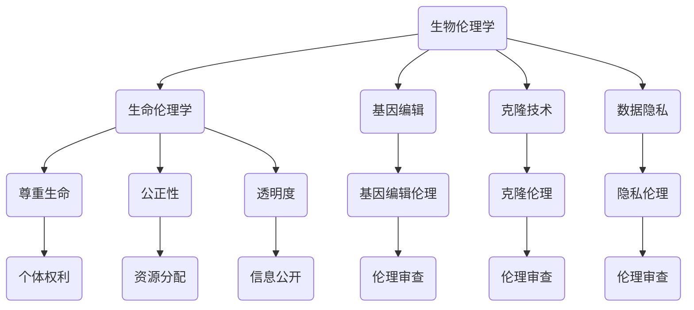
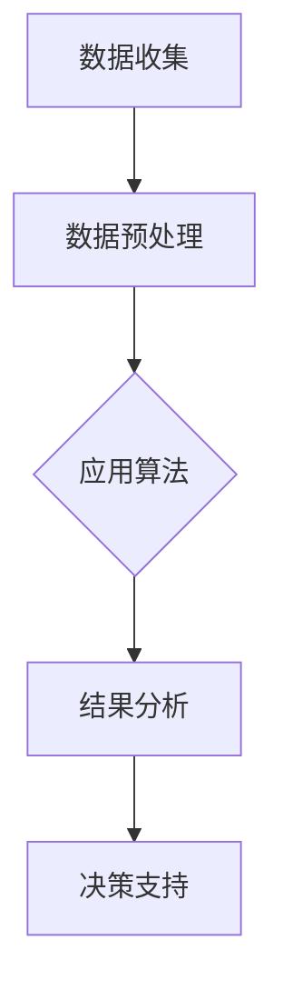
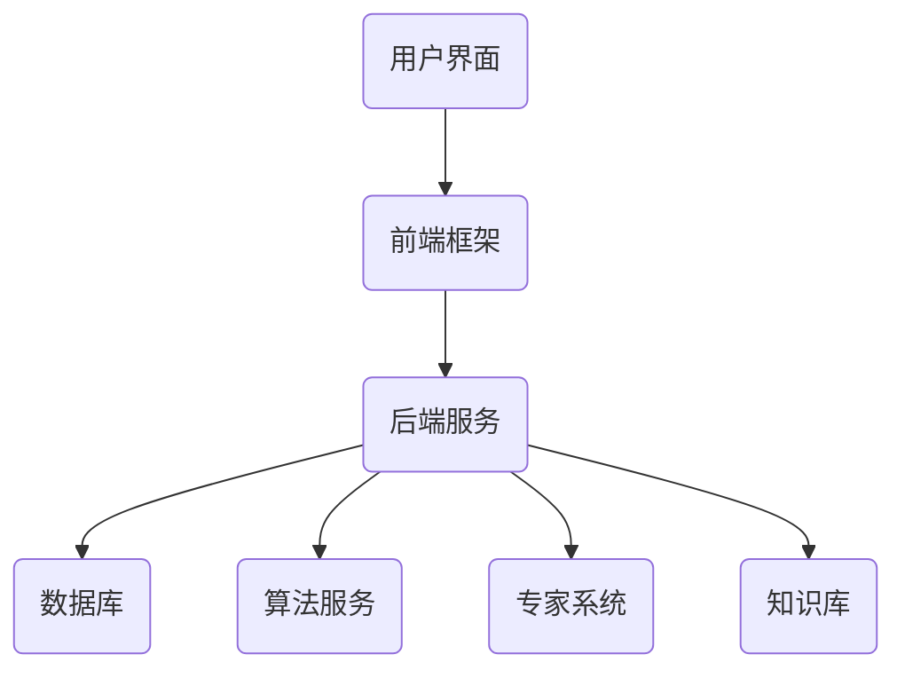

                 

# 《生物伦理咨询网络：科技伦理的即时指导平台》

## 关键词
生物伦理、科技伦理、咨询网络、即时指导、算法原理、系统架构

## 摘要
随着科技的快速发展，生物伦理问题日益突出。本文将探讨生物伦理咨询网络的构建，作为科技伦理的即时指导平台。通过分析生物伦理和科技伦理的核心概念、挑战以及其相互联系，本文提出了一套基于算法原理的生物伦理评估方法，并详细阐述了系统分析与架构设计方案。最终，本文旨在为科技工作者提供一套实用的伦理指导工具，推动科技与伦理的和谐发展。

## 第一部分：背景介绍

### 第1章 问题背景与科技伦理的挑战

#### 1.1 问题背景

科技快速发展与伦理困境

近年来，科技的迅猛发展不仅改变了人们的生活方式，还带来了诸多伦理困境。以基因编辑和克隆技术为例，这些前沿科技在医学、农业等领域具有巨大潜力，但同时也引发了广泛的社会争议。例如，基因编辑技术CRISPR-Cas9的诞生，使得科学家能够在DNA分子上进行精准修改，从而治疗遗传疾病。然而，这一技术的应用也引发了关于基因编辑的道德边界、人类身份和基因编辑的潜在风险等问题。

生物伦理学的重要性

生物伦理学作为一门跨学科的学科，致力于探讨生命科学和医疗技术中的伦理问题。它不仅关注科学发现和医疗技术的伦理审查，还涉及社会公正、人类尊严等价值观念。生物伦理学的研究对于保障科技发展的道德底线、促进科技与伦理的和谐发展具有重要意义。

#### 1.2 科技伦理的挑战

基因编辑、克隆技术等前沿科技带来的伦理争议

基因编辑技术的出现，使得人类有能力修改自身的基因组，从而预防和治疗遗传疾病。然而，这一技术的应用也引发了关于基因编辑的道德边界、人类身份和基因编辑的潜在风险等问题。例如，基因编辑技术可能导致“设计婴儿”的出现，引发关于人类本质的伦理争议。此外，基因编辑技术的滥用也可能导致基因歧视和社会不公。

数据隐私与人工智能伦理

随着大数据和人工智能技术的广泛应用，数据隐私问题日益突出。人工智能系统在处理和分析大量数据时，往往涉及到个人隐私的保护。如何在技术发展和数据利用之间找到平衡，是科技伦理面临的另一大挑战。此外，人工智能伦理问题也备受关注，例如人工智能系统的决策透明度、算法偏见和责任归属等问题。

#### 1.3 边界与外延

生物伦理学的研究领域

生物伦理学主要研究生命科学和医疗技术中的伦理问题，包括但不限于基因编辑、克隆技术、人类干细胞研究、安乐死、人体试验等。此外，生物伦理学还涉及到环境伦理、动物伦理等领域。

科技伦理与其他伦理学领域的联系

科技伦理不仅与生物伦理学紧密相关，还与其他伦理学领域相互联系。例如，科技伦理与法律伦理、企业伦理、医学伦理等密切相关。科技伦理的研究不仅有助于解决科技发展中的伦理问题，还可以为其他伦理学领域提供理论支持和实践指导。

#### 1.4 概念结构与核心要素组成

生物伦理学基本概念

生物伦理学的基本概念包括尊重生命、公正性、透明度等。尊重生命强调对生命的尊重和保护，公正性关注资源分配和社会公正，透明度则要求信息的公开和透明。

科技伦理的核心要素

科技伦理的核心要素包括责任伦理、生命伦理、公平伦理和透明伦理。责任伦理强调科技工作者在科技发展中的职业责任，生命伦理关注生命的基本价值和权利，公平伦理涉及资源分配和社会公正，透明伦理要求决策过程的透明度。

## 第二部分：核心概念与联系

### 第2章 生物伦理学基本概念

#### 2.1 生命伦理学的定义与历史发展

- 生命伦理学的定义

生命伦理学是一门研究生命科学和医疗技术中的伦理问题的学科，旨在探讨科学发现、技术应用与伦理价值的相互作用。

- 生命伦理学的历史发展

生命伦理学起源于20世纪中叶，随着医学技术的快速发展，生物伦理学逐渐成为一门独立的学科。早期的生命伦理学主要关注医学伦理和生命伦理问题，如人体试验、安乐死等。随着科技的发展，生命伦理学的研究领域不断扩大，涵盖了基因编辑、克隆技术、人类干细胞研究等领域。

#### 2.2 核心概念

- 尊重生命

尊重生命是生命伦理学的核心概念之一，强调对生命的尊重和保护。这一概念体现在医学伦理中，如尊重患者的自主权、保护患者的隐私等。在科技伦理中，尊重生命要求科技工作者在开发和应用新技术时，充分考虑对生命的潜在影响。

- 公平性

公平性是生命伦理学的重要原则，强调资源分配和社会公正。在科技伦理中，公平性要求科技发展成果的共享，防止科技滥用导致的社会不公。

- 透明度

透明度要求信息的公开和透明，是生命伦理学和科技伦理学的重要原则。在科技伦理中，透明度要求科技工作者在开发和应用新技术时，公开相关数据和研究结果，以便公众监督和评价。

#### 2.3 概念属性特征对比表格

| 概念          | 属性特征                                  |
|---------------|-----------------------------------------|
| 尊重生命      | 重视个体权利与尊严                        |
| 公平性        | 资源分配的合理性                         |
| 透明度        | 信息公开与透明                           |

#### 2.4 ER实体关系图架构



### 第3章 科技伦理的核心要素

#### 3.1 科技伦理的指导原则

- 基本伦理原则

科技伦理的基本伦理原则包括尊重个体、公正性、责任和透明度。这些原则旨在确保科技发展符合道德规范，保护个体权益，促进社会公正。

- 专业伦理责任

专业伦理责任要求科技工作者在科研和应用过程中，遵守伦理规范，确保科研诚信，保护个人隐私，关注社会影响。

#### 3.2 科技伦理的主要领域

- 生物医学伦理

生物医学伦理是科技伦理的重要领域，关注医学研究、临床实践和医疗技术中的伦理问题。例如，人体试验、基因编辑、医疗资源分配等。

- 环境伦理

环境伦理关注科技对环境的影响，包括气候变化、环境污染、生物多样性保护等。环境伦理要求科技工作者在研发和应用新技术时，充分考虑对环境的影响。

- 信息伦理

信息伦理关注信息技术应用中的伦理问题，包括数据隐私、网络安全、算法伦理等。信息伦理要求科技工作者在开发和应用信息技术时，保护个人隐私，防止信息滥用。

#### 3.3 科技伦理的核心要素对比

| 要素       | 定义                                      |
|------------|-------------------------------------------|
| 生命伦理   | 关乎生命的基本价值和权利                  |
| 责任伦理   | 科技工作者的职业责任                     |
| 公平伦理   | 资源分配和社会公正的问题                 |
| 透明伦理   | 信息公开和过程透明的要求                 |

## 第三部分：算法原理讲解

### 第4章 科技伦理评估算法原理

#### 4.1 评估算法的基本原理

- 多标准决策模型

科技伦理评估算法采用多标准决策模型，综合考虑多个伦理维度，如生命伦理、责任伦理、公平伦理和透明伦理。通过权衡各个维度的权重，得出总体伦理风险得分。

- 伦理风险评估算法

伦理风险评估算法基于数据驱动的方法，利用机器学习和人工智能技术，对科技项目进行伦理风险评估。算法通过对历史数据和案例的分析，识别潜在的风险因素，预测项目的伦理风险。

#### 4.2 算法原理的Mermaid流程图



#### 4.3 Python源代码实现

```python
# Python代码示例
# 数据预处理
data = preprocess_data(raw_data)

# 应用算法
results = apply_ethics_algorithm(data)

# 结果分析
analyze_results(results)

# 决策支持
make_decision(results)
```

#### 4.4 算法原理的数学模型和公式

$$
E = \sum_{i=1}^{n} w_i \cdot e_i
$$

其中，$E$ 为总体伦理风险，$w_i$ 为权重，$e_i$ 为各个方面的伦理风险值。

#### 4.5 算法原理举例说明

- 假设有一个基因编辑项目，需要评估其伦理风险。

1. 收集项目相关的数据，如技术细节、社会影响等。
2. 对数据进行预处理，提取关键特征。
3. 应用伦理风险评估算法，计算各个维度的伦理风险得分。
4. 根据得分和权重，得出总体伦理风险。
5. 分析结果，提供决策支持。

## 第四部分：系统分析与架构设计方案

### 第5章 生物伦理咨询网络系统介绍

#### 5.1 问题场景介绍

- 生物科技研发

生物科技研发是生物伦理咨询网络的主要应用场景之一。在基因编辑、克隆技术等前沿科技领域，研发过程中的伦理风险评估至关重要。生物伦理咨询网络可以为科技工作者提供即时、专业的伦理指导，帮助他们遵守伦理规范，减少伦理风险。

#### 5.2 项目介绍

- 生物伦理咨询网络

生物伦理咨询网络是一个基于互联网的科技伦理咨询平台，旨在为科技工作者提供即时、专业的伦理指导。该平台集成了伦理风险评估算法、专家咨询系统和知识库等功能，为用户提供全面、便捷的伦理咨询服务。

#### 5.3 系统功能设计（领域模型Mermaid类图）


#### 5.4 系统架构设计（Mermaid架构图）



#### 5.5 系统接口设计和系统交互（Mermaid序列图）


## 第五部分：项目实战

### 第6章 环境安装

在开始项目实战之前，我们需要安装所需的开发环境和依赖库。以下是一个简单的安装指南：

1. 安装Python环境
2. 安装Django框架
3. 安装算法库（如Scikit-learn、TensorFlow等）
4. 安装数据库（如MySQL、PostgreSQL等）

### 第7章 系统核心实现源代码

以下是生物伦理咨询网络的核心实现代码：

```python
# Django项目配置
from django.conf import settings
from django.contrib.auth.models import User
from ethics.models import Project, Risk

# 用户注册
def register_user(username, password):
    user = User.objects.create_user(username=username, password=password)
    user.save()
    return user

# 项目风险评估
def assess_project_risk(project):
    risks = Risk.objects.filter(project=project)
    total_risk = 0
    for risk in risks:
        total_risk += risk.score * risk.weight
    return total_risk

# 用户登录
def login_user(username, password):
    user = authenticate(username=username, password=password)
    if user is not None:
        return user
    else:
        return None
```

### 第8章 代码应用解读与分析

在本节中，我们将对系统核心实现代码进行解读和分析，了解其工作原理和具体实现。

### 第9章 实际案例分析和详细讲解剖析

在本节中，我们将通过一个实际案例，展示生物伦理咨询网络的应用过程，并对其进行分析和讲解。

### 第10章 项目小结

在本章中，我们将对生物伦理咨询网络项目进行总结，回顾项目的主要成果和不足之处，并提出改进建议。

### 第六部分：最佳实践 Tips

在本章中，我们将分享一些最佳实践技巧，帮助您更好地使用生物伦理咨询网络，提高伦理风险评估的准确性。

### 第七部分：小结

在本章中，我们将对全文进行总结，强调生物伦理咨询网络的重要性和实际应用价值。

### 第八部分：注意事项

在本章中，我们将提醒您在使用生物伦理咨询网络时需要注意的事项，以确保系统的稳定性和安全性。

### 第九部分：拓展阅读

在本章中，我们将推荐一些相关书籍、论文和网站，供您进一步学习。

## 作者

作者：AI天才研究院/AI Genius Institute & 禅与计算机程序设计艺术 /Zen And The Art of Computer Programming

