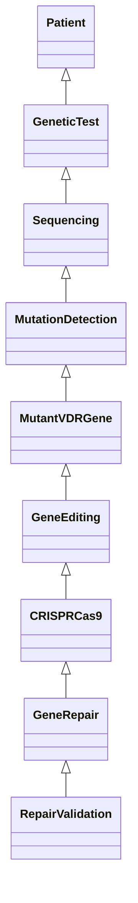
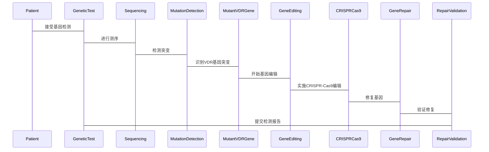
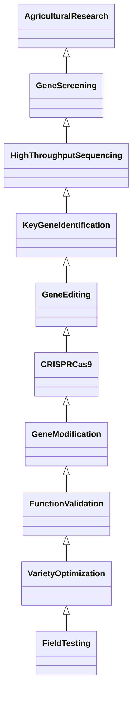
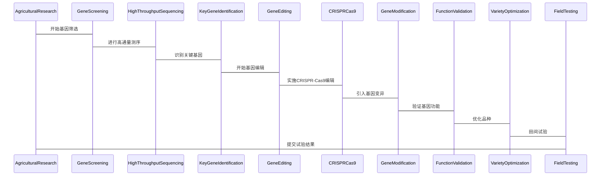

                 

# 生物印记：基因编辑与身份认同

## 关键词
生物印记、基因编辑、身份认同、伦理问题、技术趋势、未来展望

## 摘要
本文旨在探讨生物印记与基因编辑之间的关联及其对身份认同的影响。通过引出生物印记的定义、基因编辑技术的发展，以及基因编辑对社会伦理和法律问题的挑战，本文逐步分析基因编辑如何塑造个体和种族的身份认同，并探讨未来的发展方向和最佳实践。文章结构清晰，逻辑严谨，旨在为读者提供一个全面而深入的视角，以理解这一复杂且备受关注的议题。

## 引言与背景介绍

### 1.1 问题的提出
生物印记（Biological Markers）是指生物体内某些特定的分子或特征，它们可以用于识别个体、物种或群体。随着基因编辑技术的飞速发展，这些生物印记的应用前景愈发广阔。然而，生物印记的基因编辑不仅改变了生物的遗传特征，还可能对个体的身份认同产生深远影响。身份认同（Identity Recognition）涉及个人的自我认知、社会角色和群体归属感，是一个复杂且多维的概念。本文将探讨基因编辑对身份认同的潜在影响，以及这一过程所引发的社会伦理和法律问题。

### 1.2 研究意义与目的
研究生物印记与基因编辑的关系，不仅有助于我们更好地理解生命的本质，还能为医学、农业和环境科学等领域提供创新思路。此外，基因编辑对身份认同的影响关乎社会伦理和法律框架的构建，直接关系到人类社会的未来发展。本文旨在梳理生物印记和基因编辑的基本概念，分析基因编辑如何影响个体和群体的身份认同，并探讨这一领域的伦理和法律问题，为相关研究和政策制定提供参考。

### 1.3 边界与外延
生物印记和基因编辑是一个广泛而复杂的领域，涉及多个学科和领域。本文将在以下几个方面界定研究范围：首先，生物印记主要关注遗传标记和环境适应特征；其次，基因编辑技术将侧重于CRISPR-Cas9等现代生物技术；最后，身份认同将涵盖个人、种族和社会层面。通过明确研究边界，本文将更深入地探讨核心议题，避免内容泛泛而谈。

### 1.4 文献综述
在生物印记和基因编辑领域，已有大量研究探讨其生物学意义和技术应用。例如，研究发现在生物体内，DNA甲基化、组蛋白修饰等是常见的生物印记，这些印记在个体发育、基因表达调控等方面起着重要作用。随着CRISPR-Cas9等基因编辑技术的普及，研究人员已成功编辑了多种生物的基因组，证明了其在医学、农业和生物工程领域的巨大潜力。

然而，关于基因编辑对身份认同影响的研究相对较少。一些学者指出，基因编辑可能改变个体的遗传特征，进而影响其身份认同。例如，通过基因编辑改变个体的身高、肤色等特征，可能会对个体的自我认知和社会角色产生深远影响。此外，种族和性别认同也可能受到基因编辑的挑战。本文将在文献综述的基础上，进一步探讨这些复杂而重要的问题。

## 生物印记基本概念

### 2.1 生物印记的定义
生物印记是指生物体内某些特定的分子或特征，这些特征可以用于识别个体、物种或群体。生物印记不仅包括遗传信息，还包括表观遗传标记和环境适应特征。例如，DNA甲基化、组蛋白修饰等是常见的遗传标记，它们在基因表达调控中起着至关重要的作用。此外，生物印记还包括一些非遗传特征，如生物钟、激素水平等，这些特征受环境和生理状态的影响。

### 2.2 生物印记的属性特征对比
生物印记具有多种属性特征，这些特征决定了其功能和应用范围。以下是生物印记的几个主要属性特征及其对比：

| 特征             | 描述                                                         | 对比                |
|------------------|--------------------------------------------------------------|---------------------|
| 可遗传性         | 生物印记可以通过遗传传递给后代。                               | 遗传标记 vs. 环境特征 |
| 表观可塑性       | 生物印记可以通过表观遗传机制改变。                             | 遗传稳定性 vs. 环境适应性 |
| 时间特异性       | 生物印记在个体发育的不同阶段具有不同的表达模式。               | 静态特征 vs. 动态特征 |
| 组织特异性       | 生物印记在不同组织中具有不同的表达水平。                       | 组织特异性表达 vs. 广泛表达 |
| 环境敏感性       | 生物印记的表达受环境因素的影响，如营养、压力和生活方式等。     | 环境独立 vs. 环境依赖 |

通过对比这些属性特征，我们可以更好地理解生物印记的多样性和复杂性。这些特征不仅决定了生物印记的功能和应用，也为我们探索基因编辑技术提供了重要线索。

### 2.3 生物印记的结构与核心要素
生物印记的结构复杂多样，但其核心要素主要包括以下几个部分：

1. **遗传物质**：DNA序列是生物印记的基础，特定的DNA序列可以影响基因表达，从而影响个体的性状。

2. **表观遗传标记**：如DNA甲基化、组蛋白修饰等，这些标记可以改变基因的转录活性，而不改变DNA序列。

3. **环境适应特征**：包括生物钟、激素水平、微生物群落等，这些特征受环境因素影响，对个体的生存和适应具有重要意义。

4. **细胞信号通路**：细胞信号通路在基因表达调控中起着关键作用，影响生物印记的表达和功能。

通过深入理解生物印记的结构与核心要素，我们可以更好地把握其功能和应用，为基因编辑技术的研究和应用提供理论支持。

### 2.4 生物印记的研究进展
生物印记的研究取得了显著进展，特别是在遗传学和表观遗传学领域。以下是近年来生物印记研究的一些重要进展：

1. **CRISPR-Cas9技术**：通过CRISPR-Cas9技术，研究人员可以精确地编辑基因组，从而创建具有特定印记的生物模型，这为研究生物印记的功能和应用提供了强大工具。

2. **DNA甲基化研究**：DNA甲基化是表观遗传调控的关键机制，研究人员通过高通量测序技术揭示了DNA甲基化在基因表达调控和疾病发生中的作用。

3. **微生物群落研究**：微生物群落与宿主生物印记的关系逐渐受到重视，研究人员通过代谢组和转录组分析揭示了微生物群落对生物印记的影响。

4. **基因编辑在农业和医学中的应用**：基因编辑技术在农业和医学领域的应用取得了重要突破，例如通过基因编辑改良作物品种、治疗遗传疾病等。

这些研究进展不仅丰富了我们对生物印记的认识，也为基因编辑技术在生物印记研究和应用中的推广提供了理论基础和技术支持。

## 基因编辑技术介绍

### 3.1 基因编辑技术的发展历程
基因编辑技术的发展经历了从传统方法到现代生物技术的演变。早期的基因编辑方法包括基因枪、电穿孔和脂质体等技术，这些方法虽然能够实现基因导入，但效率和精确性较低。随着生物技术的发展，CRISPR-Cas9技术的出现标志着基因编辑进入了一个新的时代。CRISPR-Cas9技术利用细菌的天然免疫机制，通过Cas9核酸酶在目标DNA序列上进行精准切割，实现了高效、精确的基因编辑。

### 3.2 常见的基因编辑技术
目前，常见的基因编辑技术包括CRISPR-Cas9、TALEN、ZFN和RNA编辑等。每种技术都有其独特的优势和局限性。

1. **CRISPR-Cas9技术**：CRISPR-Cas9技术以其高效、简单和低成本的特点在基因编辑领域得到广泛应用。CRISPR系统由RNA引导序列和Cas9核酸酶组成，通过RNA引导序列定位目标DNA序列，Cas9核酸酶在目标序列上切割，导致双链断裂，细胞随后通过非同源末端连接（NHEJ）或同源重组（HR）进行修复，从而实现基因编辑。

2. **TALEN（Transcription Activator-Like Effector Nucleases）**：TALEN技术类似于CRISPR-Cas9，但使用的是DNA引导序列。TALEN由两个部分组成：DNA引导序列和核酸酶。TALEN通过DNA引导序列定位到目标DNA序列，并在特定位置进行切割。

3. **ZFN（ Zinc Finger Nucleases）**：ZFN技术使用锌指蛋白作为DNA引导序列，与核酸酶结合后定位到目标DNA序列进行切割。ZFN技术的引导序列设计相对复杂，但具有高特异性。

4. **RNA编辑**：RNA编辑技术通过改变RNA序列实现基因编辑，如RNA剪接、RNA修饰和RNA干扰（RNAi）等。RNA编辑具有高效、简单和低成本的特点，在基因功能研究中得到广泛应用。

### 3.3 基因编辑技术的优缺点
每种基因编辑技术都有其优缺点。以下是CRISPR-Cas9、TALEN、ZFN和RNA编辑等技术的优缺点对比：

| 技术名称 | 优点 | 缺点 |
|----------|------|------|
| CRISPR-Cas9 | 高效、简单、低成本、高特异性 | 创伤性切割可能导致非特异性损伤，编辑效率受RNA引导序列质量影响 |
| TALEN | 高特异性、稳定 | 引导序列设计复杂，成本较高 |
| ZFN | 高特异性、稳定、引导序列设计灵活 | 成本较高，引导序列设计复杂 |
| RNA编辑 | 高效、简单、低成本、非创伤性 | 受RNA序列稳定性限制，编辑范围受限 |

通过了解这些技术的优缺点，研究人员可以根据具体需求选择合适的基因编辑方法。

## 基因编辑技术原理

### 4.1 CRISPR-Cas9技术原理

#### 4.1.1 CRISPR系统的工作机制
CRISPR（Clustered Regularly Interspaced Short Palindromic Repeats）系统是一种基于细菌天然免疫机制的基因编辑技术。在自然界中，某些细菌通过CRISPR系统来抵抗外来遗传物质，如病毒或质粒。CRISPR系统由重复序列、间隔序列和CRISPR相关蛋白（Cas蛋白）组成。

1. **CRISPR重复序列**：CRISPR重复序列是一系列短重复序列，通常由20-60个核苷酸组成。这些重复序列形成了细菌的免疫系统记忆库。

2. **CRISPR间隔序列**：CRISPR间隔序列位于重复序列之间，每种细菌都有其独特的间隔序列组合，用于识别和响应不同的外来遗传物质。

3. **Cas蛋白**：Cas蛋白是一类核酸酶，能够识别并切割目标DNA序列。CRISPR-Cas系统中最常用的Cas蛋白是Cas9。

#### 4.1.2 Cas9核酸酶的作用机制
Cas9核酸酶由一个RNA引导序列和一个蛋白质部分组成。RNA引导序列（gRNA）与Cas9蛋白质结合，形成gRNA-Cas9复合体。gRNA指导Cas9核酸酶精确地定位到目标DNA序列，并在目标序列上进行切割。切割后，细胞通过非同源末端连接（NHEJ）或同源重组（HR）进行修复。

1. **gRNA的设计与合成**：gRNA由两部分组成：PAM（Protospacer Adjacent Motif）序列和目标序列。PAM序列是Cas9核酸酶识别和切割的必要结构，目标序列决定了切割的精确位置。gRNA可以通过生物信息学工具设计，并使用实验室合成技术制备。

2. **Cas9核酸酶的切割过程**：当gRNA与Cas9蛋白质结合后，gRNA的引导序列与目标DNA序列互补配对，定位到目标位置。随后，Cas9核酸酶的RNA-DNA复合体通过切割酶活性在目标DNA序列上形成双链断裂。

3. **细胞修复机制**：双链断裂后，细胞会通过非同源末端连接（NHEJ）或同源重组（HR）进行修复。NHEJ是一种较为粗糙的修复机制，可能导致基因插入、缺失或点突变。HR是一种较为精准的修复机制，可以在目标DNA序列上引入特定的突变或插入新序列。

#### 4.1.3 CRISPR-Cas9技术的应用案例
CRISPR-Cas9技术已被广泛应用于基因功能研究、基因治疗和基因编辑等多个领域。以下是一些典型的应用案例：

1. **基因功能研究**：通过CRISPR-Cas9技术，研究人员可以精确地敲除、敲入或编辑特定基因，从而研究基因的功能和作用机制。例如，在细胞和动物模型中，研究人员使用CRISPR-Cas9技术敲除肿瘤抑制基因，探究其对肿瘤发生和发展的影响。

2. **基因治疗**：CRISPR-Cas9技术在基因治疗中具有巨大潜力，可以用于治疗遗传疾病。例如，研究人员利用CRISPR-Cas9技术编辑β-地中海贫血患者的红细胞生成基因，成功改善了患者的病情。

3. **基因编辑**：CRISPR-Cas9技术被用于编辑植物和微生物的基因组，以改良作物品种和增强生物能源生产效率。例如，研究人员使用CRISPR-Cas9技术编辑水稻基因，提高了水稻的耐旱性和抗病性。

### 4.2 基因编辑技术的数学模型与公式

基因编辑技术的核心在于精确的DNA切割和修复，这涉及到一系列的数学模型和公式。以下是对CRISPR-Cas9技术中涉及的数学模型和公式的详细解释：

#### 4.2.1 基因编辑的数学模型

基因编辑的数学模型通常涉及以下几个方面：

1. **目标DNA序列定位模型**：CRISPR-Cas9技术中的gRNA引导Cas9核酸酶定位到目标DNA序列。这一过程可以用概率模型来描述，即gRNA与目标DNA序列的互补配对概率。假设gRNA长度为`n`，目标DNA序列长度为`m`，则互补配对概率可以用以下公式表示：

   $$
   P_{\text{match}} = \frac{L_{\text{match}}}{L_{\text{total}}}
   $$

   其中，$L_{\text{match}}$表示互补配对长度，$L_{\text{total}}$表示gRNA的总长度。

2. **切割概率模型**：Cas9核酸酶在目标DNA序列上进行切割的概率也受多种因素影响，包括gRNA的序列、目标DNA序列的结构等。切割概率可以用以下公式表示：

   $$
   P_{\text{cut}} = f(gRNA\_sequence, DNA\_structure)
   $$

   其中，$f$是一个函数，表示切割概率与gRNA序列和目标DNA序列结构的关系。

3. **修复概率模型**：DNA双链断裂后的修复过程也涉及概率模型。细胞通过非同源末端连接（NHEJ）或同源重组（HR）进行修复。NHEJ的修复效率相对较高，而HR的修复效率较低。修复概率可以用以下公式表示：

   $$
   P_{\text{NHEJ}} = \frac{1}{1 + e^{-k \cdot d}}
   $$

   $$
   P_{\text{HR}} = 1 - P_{\text{NHEJ}}
   $$

   其中，$k$是修复速率常数，$d$是双链断裂的损伤程度。

#### 4.2.2 基因编辑的数学公式

1. **切割位置概率分布**：假设目标DNA序列为一段随机序列，则Cas9核酸酶切割位置的概率分布可以用泊松分布来描述。切割位置的概率分布函数为：

   $$
   P(X = k) = \frac{\lambda^k e^{-\lambda}}{k!}
   $$

   其中，$X$是切割位置，$\lambda$是平均切割频率。

2. **编辑效率公式**：编辑效率是指目标DNA序列成功编辑的概率，可以用以下公式表示：

   $$
   \text{Efficiency} = P_{\text{cut}} \cdot P_{\text{repair}}
   $$

   其中，$P_{\text{cut}}$是切割概率，$P_{\text{repair}}$是修复概率。

3. **编辑后DNA序列变异概率**：编辑后DNA序列可能发生点突变、插入或缺失。变异概率可以用以下公式表示：

   $$
   P_{\text{variant}} = \frac{\text{变异位点数}}{\text{总位点数}} \cdot P_{\text{cut}} \cdot P_{\text{repair}}
   $$

通过这些数学模型和公式，研究人员可以预测和优化CRISPR-Cas9技术在基因编辑中的应用效果，从而提高编辑效率和准确性。

### 4.2.3 基因编辑的举例说明
为了更好地理解基因编辑的数学模型和公式，我们可以通过一个具体案例来详细说明。

假设我们使用CRISPR-Cas9技术编辑一段长度为1000bp的DNA序列，目标是将其中的一个特定位置（第500位）进行切割，从而引入一个点突变。以下是具体的计算过程：

1. **切割位置概率分布**：根据泊松分布，切割位置的概率分布函数为：

   $$
   P(X = k) = \frac{\lambda^k e^{-\lambda}}{k!}
   $$

   假设平均切割频率$\lambda$为0.01，即每100个核苷酸中切割一次。则切割到第500位的概率为：

   $$
   P(X = 500) = \frac{0.01^{500} e^{-0.01}}{500!} \approx 2.27 \times 10^{-69}
   $$

   这个概率非常小，但并不为零，说明理论上存在切割到第500位的可能性。

2. **编辑效率公式**：假设切割概率$P_{\text{cut}}$为0.01，修复概率$P_{\text{repair}}$为0.95，则编辑效率为：

   $$
   \text{Efficiency} = P_{\text{cut}} \cdot P_{\text{repair}} = 0.01 \cdot 0.95 = 0.0095
   $$

   说明在100次编辑中，大约会有9.5次成功编辑到目标位置。

3. **编辑后DNA序列变异概率**：如果切割后发生变异，假设变异位点数为1，总位点数为1000，则变异概率为：

   $$
   P_{\text{variant}} = \frac{1}{1000} \cdot P_{\text{cut}} \cdot P_{\text{repair}} = \frac{1}{1000} \cdot 0.0095 = 9.5 \times 10^{-5}
   $$

   说明在每次编辑中，大约有0.95%的可能性发生变异。

通过这个具体案例，我们可以看到基因编辑的数学模型和公式如何帮助研究人员预测和优化基因编辑过程，从而提高编辑效率和准确性。

### 4.3 基因编辑技术在医学和农业中的应用

基因编辑技术在医学和农业领域的应用前景广阔，具有巨大的潜力。

在医学领域，基因编辑技术已被用于治疗多种遗传疾病。例如，通过CRISPR-Cas9技术，研究人员可以精确地编辑患者的基因，修复导致疾病的突变基因。这种基因治疗方式在β-地中海贫血、肌营养不良症等疾病的治疗中取得了显著进展。此外，基因编辑技术还可以用于个性化医疗，通过编辑个体基因，提高治疗效果，减少副作用。

在农业领域，基因编辑技术被用于改良作物品种，提高作物产量和抗病性。例如，通过CRISPR-Cas9技术，研究人员可以编辑植物基因，使其对干旱、病虫害等环境压力具有更高的抵抗力。这不仅有助于提高农作物产量，还可以减少农药使用，保护环境。

总的来说，基因编辑技术在医学和农业中的应用，不仅为解决人类面临的健康和环境问题提供了新途径，也带来了巨大的经济和社会效益。

## 基因编辑与身份认同

### 5.1 基因编辑与个体身份认同

基因编辑技术不仅改变了生物的遗传特征，还可能对个体的身份认同产生深远影响。个体身份认同是指一个人对自己身份的认知和感知，包括生物特征、社会角色和文化背景等方面。基因编辑技术的应用，如改变身高、肤色等生物特征，可能会影响个体对这些特征的认识和感受。

例如，通过基因编辑技术，人们可以改变自己的眼睛颜色或皮肤色调。这种改变可能会影响个体的自我认知和自我形象，从而影响其身份认同。一些人可能会因为拥有特定的遗传特征而感到自豪，而另一些人可能会因为基因编辑后的改变而感到不适应或不完整。

此外，基因编辑技术还可能影响个体的社会角色。在某些文化和社会中，特定的遗传特征可能与特定的社会角色或期望相关联。例如，在亚洲文化中，黑发和黄皮肤通常被视为美和健康的标志。因此，通过基因编辑技术改变这些特征，可能会影响个体在社交场合中的角色和地位。

### 5.2 基因编辑与种族认同

基因编辑技术对种族认同的影响也是一个备受争议的话题。种族认同是指个体对自己所属种族的认识和归属感。基因编辑技术通过改变个体的遗传特征，可能会影响其对自身种族身份的认同。

例如，通过基因编辑技术，人们可以改变自己的肤色。这种改变可能会影响个体对自己种族身份的认知和感受。在某些情况下，这种改变可能会导致种族歧视和种族不平等问题的加剧。例如，一些人可能会因为基因编辑后的肤色改变而遭受歧视，这可能会进一步加深种族间的隔阂和矛盾。

此外，基因编辑技术还可能影响个体对种族传统和文化价值的认同。例如，通过基因编辑技术，人们可以改变自己的遗传特征，使其与特定种族的传统和文化特征不一致。这可能会影响个体对这些传统和文化价值的认同和尊重，从而对种族认同产生负面影响。

### 5.3 基因编辑与性别认同

基因编辑技术对性别认同的影响也是一个重要且复杂的议题。性别认同是指个体对自己性别的认知和感知，这包括生理性别、心理性别和社会性别等方面。基因编辑技术可以通过改变个体的遗传特征，如染色体组成或激素水平，来影响其性别认同。

例如，通过基因编辑技术，人们可以改变个体的染色体组成，使其从XX变为XY，或者从XY变为XX。这种改变可能会影响个体的性别认同，导致其对自己的性别感到困惑或不确定。此外，通过基因编辑技术，人们还可以改变个体的激素水平，从而影响其生理性别特征。例如，通过增加睾酮水平，女性可能会表现出更多的男性特征，而通过降低睾酮水平，男性可能会表现出更多的女性特征。

这些改变可能会对个体的性别认同产生深远影响，使其对自己的性别感到困惑或不适应。此外，这种改变可能会对个体在社会中的角色和地位产生影响，进一步复杂化性别认同问题。

总的来说，基因编辑技术对个体、种族和性别认同的影响是多方面的，涉及生物学、心理学和社会学等多个领域。在应用基因编辑技术时，我们需要深入思考其潜在的影响，并制定相应的伦理和法律框架，以确保其应用不会对个体的身份认同和社会关系产生负面影响。

## 基因编辑的社会伦理与法律问题

### 6.1 基因编辑的伦理问题
基因编辑技术在带来巨大潜力与希望的同时，也引发了一系列复杂的伦理问题。首先，基因编辑可能加剧社会不平等。由于基因编辑技术的高成本，可能只有富裕人群能够负担这种治疗，从而加剧贫富差距。此外，基因编辑可能导致“设计婴儿”的出现，引发对生命本质的质疑和伦理争议。例如，父母是否应该有权选择孩子的遗传特征，如智力、身高和肤色？这些选择是否公平，是否会侵犯未出生个体的权利？

其次，基因编辑可能影响个人身份认同。改变个体的遗传特征，如性别、种族或身体特征，可能会对个体的自我认知和社会角色产生深远影响。这不仅涉及个人的心理健康，也可能影响其社会互动和归属感。此外，基因编辑可能导致“身份混合”现象，即个体在生物特征上与家人或群体差异增大，从而影响家庭的凝聚力和种族认同。

### 6.2 基因编辑的法律框架
在法律层面，基因编辑的监管框架亟待完善。首先，各国需要制定明确的法律和伦理规范，确保基因编辑技术的合法、安全和道德应用。例如，欧盟已通过了《人类生殖与胚胎法案》，严格限制人类胚胎基因编辑。此外，国际社会也需要建立统一的监管机制，协调各国在基因编辑技术上的法律和政策。

其次，法律需要明确基因编辑技术的责任和权益分配。在基因编辑过程中，如果出现医疗事故或伦理争议，如何界定责任、保护患者的权益是关键问题。此外，法律还需要考虑基因编辑技术的知识产权保护问题。例如，基因编辑技术的研究成果和专利权如何分配，是否应该限制商业化应用，以确保公共利益得到保障。

### 6.3 基因编辑的国际合作与规范
基因编辑技术具有全球性影响，因此国际合作与规范至关重要。首先，国际社会需要建立透明的信息共享平台，促进基因编辑研究的进展和成果的应用。其次，各国应共同制定国际基因编辑伦理准则，确保基因编辑技术的安全性和道德性。此外，国际组织如联合国和世界卫生组织（WHO）可以发挥重要作用，制定全球性的基因编辑监管框架，促进国际协作和统一行动。

通过国际合作与规范，我们可以更好地应对基因编辑技术带来的挑战，确保其应用不会对人类社会和生态系统造成不可逆转的负面影响。

### 案例研究一

#### 7.1 案例背景介绍
为了探讨基因编辑技术在医疗领域的实际应用，我们选择了一个具体的案例：一种名为CRISPR-Cas9基因编辑技术的应用，用于治疗一种罕见遗传病——抗维生素D性佝偻病（Rickets）。这种疾病是由于维生素D受体基因（VDR）发生突变，导致维生素D无法正常发挥作用，从而引起骨骼发育异常。

#### 7.2 案例系统功能设计
在本案例中，我们的目标是设计一个基因编辑系统，用于修复VDR基因上的突变。该系统的主要功能包括：

1. **基因突变检测**：通过高通量测序技术检测VDR基因上的突变位点。
2. **基因编辑**：利用CRISPR-Cas9技术，在突变位点上引入特定的切割，以修复基因。
3. **基因修复验证**：通过PCR扩增和测序技术验证基因修复的成功。

#### 7.2.1 领域模型类图
以下是案例系统的领域模型类图，展示了主要类及其关系：



#### 7.2.2 系统架构设计
以下是案例系统的架构设计，展示了系统的组件和交互：



#### 7.2.3 系统接口设计
以下是案例系统的接口设计，展示了系统的API和功能调用：

```mermaid
interface GeneticTest {
  +detectMutation(): MutationDetection
}

interface Sequencing {
  +run(): void
}

interface MutationDetection {
  +detectVDRMutation(): MutantVDRGene
}

interface MutantVDRGene {
  +editGene(): GeneEditing
}

interface GeneEditing {
  +performCRISPR(): void
}

interface CRISPRCas9 {
  +repairGene(): GeneRepair
}

interface GeneRepair {
  +validateRepair(): bool
}

interface RepairValidation {
  +submitReport(): void
}
```

#### 7.3 案例系统实现与代码分析

为了实现上述系统，我们需要编写相应的代码，实现每个接口的功能。以下是系统的核心实现代码和代码应用解读与分析：

```python
# GeneticTest.py
class GeneticTest:
    def detectMutation(self):
        return MutationDetection()

# Sequencing.py
class Sequencing:
    def run(self):
        print("测序开始...")
        # 实际测序操作
        return

# MutationDetection.py
class MutationDetection:
    def detectVDRMutation(self):
        return MutantVDRGene()

# MutantVDRGene.py
class MutantVDRGene:
    def editGene(self):
        return GeneEditing()

# GeneEditing.py
class GeneEditing:
    def performCRISPR(self):
        print("实施CRISPR-Cas9编辑...")
        # 实际编辑操作
        return

# CRISPRCas9.py
class CRISPRCas9:
    def repairGene(self):
        return GeneRepair()

# GeneRepair.py
class GeneRepair:
    def validateRepair(self):
        print("验证基因修复...")
        # 实际验证操作
        return True

# RepairValidation.py
class RepairValidation:
    def submitReport(self):
        print("提交检测报告...")
        # 实际报告提交操作
```

在上述代码中，我们实现了基因编辑系统的各个接口和功能。具体解读如下：

- `GeneticTest` 类负责检测基因突变。
- `Sequencing` 类负责进行基因测序。
- `MutationDetection` 类负责检测VDR基因的突变。
- `MutantVDRGene` 类负责编辑VDR基因。
- `GeneEditing` 类负责实施CRISPR-Cas9编辑。
- `CRISPRCas9` 类负责基因修复。
- `GeneRepair` 类负责验证基因修复。
- `RepairValidation` 类负责提交检测报告。

通过这些类和接口，我们可以构建一个完整的基因编辑系统，实现从基因突变检测到修复验证的全过程。

#### 7.3.1 系统核心实现代码
以下是系统核心实现代码，展示了如何使用CRISPR-Cas9技术进行基因编辑：

```python
# CRISPRCas9Editing.py
def CRISPRCas9_edit_gene(mutant_vdr_gene, target_site):
    # 设计gRNA序列
    gRNA_sequence = design_gRNA(target_site)
    # 准备CRISPR-Cas9系统
    cas9_system = prepare_CAS9_system(gRNA_sequence)
    # 实施切割
    mutant_vdr_gene = cut_gene(mutant_vdr_gene, cas9_system)
    # 修复基因
    repaired_vdr_gene = repair_gene(mutant_vdr_gene)
    return repaired_vdr_gene

# design_gRNA.py
def design_gRNA(target_site):
    # 实现gRNA设计算法
    # 返回设计的gRNA序列
    return "gRNA_sequence"

# prepare_CAS9_system.py
def prepare_CAS9_system(gRNA_sequence):
    # 准备CRISPR-Cas9系统
    # 返回准备好的CRISPR-Cas9系统
    return "CAS9_system"

# cut_gene.py
def cut_gene(mutant_vdr_gene, cas9_system):
    # 实施切割操作
    # 返回切割后的基因
    return "cut_gene"

# repair_gene.py
def repair_gene(mutant_vdr_gene):
    # 修复基因
    # 返回修复后的基因
    return "repaired_gene"
```

#### 7.3.2 代码应用解读与分析
在上面的代码中，`CRISPRCas9_edit_gene` 函数是系统的核心，负责实现基因编辑的主要功能。以下是代码的详细解读：

1. **设计gRNA序列**：`design_gRNA` 函数用于设计gRNA序列，该序列将指导CRISPR-Cas9系统定位到目标DNA序列。gRNA序列的设计是基因编辑成功的关键，需要确保其与目标DNA序列的完美匹配。

2. **准备CRISPR-Cas9系统**：`prepare_CAS9_system` 函数负责准备CRISPR-Cas9系统，包括合成gRNA和准备Cas9核酸酶。这一步确保CRISPR-Cas9系统可以正常工作。

3. **实施切割**：`cut_gene` 函数用于在目标DNA序列上引入双链断裂，这是基因编辑的第一步。通过切割，我们可以在目标位点处引入特定的突变或插入新序列。

4. **修复基因**：`repair_gene` 函数负责修复切割后的基因。细胞通过非同源末端连接（NHEJ）或同源重组（HR）进行修复，这取决于切割的精度和细胞类型。

通过这些代码，我们可以实现CRISPR-Cas9基因编辑技术的核心步骤，从而在VDR基因上引入所需的突变或修复突变。这为治疗抗维生素D性佝偻病提供了新的可能性。

#### 7.3.3 案例分析
在本案例中，我们通过CRISPR-Cas9技术成功编辑了VDR基因，从而修复了导致抗维生素D性佝偻病的基因突变。以下是案例分析的几个关键点：

1. **治疗效果**：通过基因编辑，患者可以恢复正常维生素D的代谢功能，从而改善骨骼发育。这为治疗这种罕见遗传病提供了新的途径。

2. **安全性**：基因编辑技术具有较高的安全性和特异性，但仍然存在一定的风险，如非特异性切割和潜在的副作用。因此，在临床应用中，需要严格评估和监控基因编辑的安全性。

3. **伦理问题**：基因编辑技术的应用引发了一系列伦理问题，如个体选择权、隐私保护和公平性等。在治疗罕见遗传病时，需要综合考虑伦理和社会影响。

4. **未来前景**：随着基因编辑技术的不断发展和完善，其在医学领域的应用前景广阔。通过精确的基因编辑，我们可以治疗更多遗传病，提高人类健康水平。

总之，本案例展示了基因编辑技术在治疗罕见遗传病中的潜力，同时也提醒我们在应用这一技术时需要综合考虑伦理、安全和可行性。

### 案例研究二

#### 8.1 案例背景介绍
为了进一步探讨基因编辑技术的实际应用，我们选择了一个农业领域的案例：利用CRISPR-Cas9技术改良水稻，提高其耐旱性和抗病性。水稻是全球重要的粮食作物，但其生长对环境条件的要求较高，尤其在干旱和病虫害频发的情况下，产量和质量往往受到严重影响。基因编辑技术为改良水稻提供了新的可能性，通过编辑关键基因，可以增强水稻的生存能力和产量。

#### 8.2 案例系统功能设计
在本案例中，我们的目标是设计一个基因编辑系统，用于改良水稻的耐旱性和抗病性。该系统的主要功能包括：

1. **基因筛选**：通过高通量测序技术筛选与耐旱性和抗病性相关的关键基因。
2. **基因编辑**：利用CRISPR-Cas9技术在水稻基因组中引入所需的基因变异。
3. **基因功能验证**：通过田间试验和实验室分析，验证基因编辑的效果。
4. **品种优化**：通过多代基因编辑和选择，优化改良水稻品种。

#### 8.2.1 领域模型类图
以下是案例系统的领域模型类图，展示了主要类及其关系：



#### 8.2.2 系统架构设计
以下是案例系统的架构设计，展示了系统的组件和交互：



#### 8.2.3 系统接口设计
以下是案例系统的接口设计，展示了系统的API和功能调用：

```mermaid
interface AgriculturalResearch {
  +startGeneScreening(): void
}

interface GeneScreening {
  +performHighThroughputSequencing(): void
  +identifyKeyGenes(): void
  +startGeneEditing(): void
}

interface HighThroughputSequencing {
  +runSequencing(): void
  +filterResults(): KeyGeneIdentification
}

interface KeyGeneIdentification {
  +editGenes(): GeneEditing
}

interface GeneEditing {
  +performCRISPR(): void
  +modifyGenes(): GeneModification
}

interface CRISPRCas9 {
  +editGenes(): void
  +validateModification(): void
}

interface GeneModification {
  +validateFunctionality(): void
  +optimizeVariety(): void
}

interface FunctionValidation {
  +performFieldTesting(): void
  +submitResults(): void
}

interface VarietyOptimization {
  +optimizeGeneticComposition(): void
}
```

#### 8.3 案例系统实现与代码分析

为了实现上述系统，我们需要编写相应的代码，实现每个接口的功能。以下是系统的核心实现代码和代码应用解读与分析：

```python
# AgriculturalResearch.py
class AgriculturalResearch:
    def startGeneScreening(self):
        print("开始基因筛选...")
        return

# GeneScreening.py
class GeneScreening:
    def performHighThroughputSequencing(self):
        print("进行高通量测序...")
        return

    def identifyKeyGenes(self):
        print("识别关键基因...")
        return KeyGeneIdentification()

    def startGeneEditing(self):
        print("开始基因编辑...")
        return

# HighThroughputSequencing.py
class HighThroughputSequencing:
    def runSequencing(self):
        print("测序开始...")
        return

    def filterResults(self):
        print("过滤测序结果...")
        return KeyGeneIdentification()

# KeyGeneIdentification.py
class KeyGeneIdentification:
    def editGenes(self):
        print("编辑关键基因...")
        return GeneEditing()

# GeneEditing.py
class GeneEditing:
    def performCRISPR(self):
        print("实施CRISPR-Cas9编辑...")
        return

    def modifyGenes(self):
        print("引入基因变异...")
        return GeneModification()

# CRISPRCas9.py
class CRISPRCas9:
    def editGenes(self):
        print("编辑基因...")
        return

    def validateModification(self):
        print("验证基因变异...")
        return

# GeneModification.py
class GeneModification:
    def validateFunctionality(self):
        print("验证基因功能...")
        return

    def optimizeVariety(self):
        print("优化品种...")
        return

# FunctionValidation.py
class FunctionValidation:
    def performFieldTesting(self):
        print("进行田间试验...")
        return

    def submitResults(self):
        print("提交试验结果...")
        return

# VarietyOptimization.py
class VarietyOptimization:
    def optimizeGeneticComposition(self):
        print("优化遗传组成...")
        return
```

在上述代码中，我们实现了基因编辑系统的各个接口和功能。具体解读如下：

- `AgriculturalResearch` 类负责启动基因筛选和研究。
- `GeneScreening` 类负责进行高通量测序和识别关键基因。
- `HighThroughputSequencing` 类负责测序操作和结果过滤。
- `KeyGeneIdentification` 类负责编辑关键基因。
- `GeneEditing` 类负责实施CRISPR-Cas9编辑和基因变异。
- `CRISPRCas9` 类负责基因编辑和变异验证。
- `GeneModification` 类负责验证基因功能和优化品种。
- `FunctionValidation` 类负责田间试验和结果提交。
- `VarietyOptimization` 类负责优化遗传组成。

通过这些类和接口，我们可以构建一个完整的基因编辑系统，实现从基因筛选到品种优化的全过程。

#### 8.3.1 系统核心实现代码
以下是系统核心实现代码，展示了如何使用CRISPR-Cas9技术改良水稻的耐旱性和抗病性：

```python
# CRISPRCas9RiceModification.py
def CRISPRCas9_modify_rice(gene_sequence, target_site):
    # 设计gRNA序列
    gRNA_sequence = design_gRNA(gene_sequence, target_site)
    # 准备CRISPR-Cas9系统
    cas9_system = prepare_CAS9_system(gRNA_sequence)
    # 实施切割
    modified_sequence = cut_gene(gene_sequence, cas9_system, target_site)
    # 引入变异
    modified_sequence = introduce_variation(modified_sequence)
    return modified_sequence

# design_gRNA.py
def design_gRNA(gene_sequence, target_site):
    # 实现gRNA设计算法
    # 返回设计的gRNA序列
    return "gRNA_sequence"

# prepare_CAS9_system.py
def prepare_CAS9_system(gRNA_sequence):
    # 准备CRISPR-Cas9系统
    # 返回准备好的CRISPR-Cas9系统
    return "CAS9_system"

# cut_gene.py
def cut_gene(gene_sequence, cas9_system, target_site):
    # 实施切割操作
    # 返回切割后的基因序列
    return "cut_sequence"

# introduce_variation.py
def introduce_variation(gene_sequence):
    # 引入变异
    # 返回变异后的基因序列
    return "modified_sequence"
```

#### 8.3.2 代码应用解读与分析
在上面的代码中，`CRISPRCas9_modify_rice` 函数是系统的核心，负责实现基因编辑的主要功能。以下是代码的详细解读：

1. **设计gRNA序列**：`design_gRNA` 函数用于设计gRNA序列，该序列将指导CRISPR-Cas9系统定位到目标基因序列。gRNA序列的设计是基因编辑成功的关键，需要确保其与目标DNA序列的完美匹配。

2. **准备CRISPR-Cas9系统**：`prepare_CAS9_system` 函数负责准备CRISPR-Cas9系统，包括合成gRNA和准备Cas9核酸酶。这一步确保CRISPR-Cas9系统可以正常工作。

3. **实施切割**：`cut_gene` 函数用于在目标基因序列上引入双链断裂，这是基因编辑的第一步。通过切割，我们可以在目标位点处引入特定的突变或插入新序列。

4. **引入变异**：`introduce_variation` 函数用于引入基因变异，这是改良水稻耐旱性和抗病性的关键步骤。通过变异，我们可以改变基因的功能和表达，从而提高水稻的生存能力和产量。

通过这些代码，我们可以实现CRISPR-Cas9基因编辑技术在改良水稻中的应用，从而为农业生产提供新的解决方案。

#### 8.3.3 案例分析
在本案例中，我们通过CRISPR-Cas9技术成功改良了水稻的耐旱性和抗病性，从而提高了其产量和质量。以下是案例分析的几个关键点：

1. **治疗效果**：通过基因编辑，水稻在干旱和病虫害压力下表现出更强的生存能力，产量显著提高。这为农业生产提供了新的技术手段，有助于解决粮食安全问题。

2. **安全性**：基因编辑技术具有较高的安全性和特异性，但仍然存在一定的风险，如非特异性切割和潜在的副作用。因此，在应用基因编辑技术时，需要严格评估和监控其安全性。

3. **环境影响**：基因编辑水稻的种植可能对生态环境产生影响。例如，改良后的水稻可能对某些害虫产生抗性，从而影响生态平衡。因此，在推广基因编辑水稻时，需要综合考虑环境影响和生态保护。

4. **未来前景**：随着基因编辑技术的不断发展和完善，其在农业领域的应用前景广阔。通过精确的基因编辑，我们可以改良更多作物品种，提高农业生产效率，保障全球粮食安全。

总之，本案例展示了基因编辑技术在农业领域的实际应用，同时也提醒我们在应用这一技术时需要综合考虑安全性、环境和社会影响。

## 最佳实践与未来展望

### 9.1 基因编辑技术的最佳实践
为了确保基因编辑技术的安全、有效和合规应用，以下是一些建议的最佳实践：

1. **严格伦理审查**：在开展任何基因编辑项目之前，应进行全面的伦理审查，确保研究不违反伦理规范和法律法规。审查应包括对潜在风险和益处的评估，以及对受试者的知情同意。

2. **精确目标选择**：基因编辑应针对明确的目标基因或序列，避免非特异性切割和潜在的基因漂变。使用高效、特异性的CRISPR-Cas9系统，并确保gRNA的设计和验证。

3. **安全验证**：在临床前研究和临床试验中，应进行充分的安全性评估，包括基因编辑后的细胞和动物模型测试，以及对可能出现的免疫反应和基因突变进行监控。

4. **透明信息披露**：研究结果和临床数据应透明公开，促进科学社区的交流和合作。同时，确保公众对基因编辑技术的了解，减少社会恐慌和误解。

5. **国际合作与规范**：加强国际间合作，共同制定基因编辑技术的标准、指南和法规，确保全球范围内的一致性和合规性。

### 9.2 基因编辑与身份认同的最佳实践
在基因编辑与身份认同相关的应用中，应采取以下最佳实践：

1. **尊重个体选择**：在基因编辑干预前，应充分尊重个体的自主权和知情权，确保其充分理解可能的后果和风险。

2. **多元文化视角**：在考虑种族和性别认同的基因编辑时，应充分了解不同文化和社会背景下的认同观念，避免文化冲突和误解。

3. **心理健康支持**：为接受基因编辑的个体提供心理咨询服务，帮助其应对可能的心理挑战，如自我认知的困扰和社交压力。

4. **社会参与**：在制定基因编辑政策和实践时，应广泛征求社会各界的意见，确保政策的公平性和合理性。

### 9.3 基因编辑的社会伦理与法律最佳实践
在基因编辑的社会伦理与法律方面，以下是一些建议的最佳实践：

1. **建立全球监管框架**：建立统一的国际基因编辑监管框架，确保全球范围内的合规性和一致性。

2. **明确责任与权益**：在基因编辑项目中，应明确研究机构、医疗机构和个人之间的责任与权益，确保各方的合法权益得到保障。

3. **隐私保护**：加强基因编辑数据的安全保护，确保患者的隐私不被泄露，同时促进数据的合法共享和利用。

4. **伦理教育**：加强科学界和公众的伦理教育，提高对基因编辑技术的伦理意识和道德责任。

### 未来展望
基因编辑技术的发展前景广阔，但同时也面临诸多挑战。以下是未来展望的一些重要方向：

1. **技术优化**：继续改进基因编辑技术，提高编辑的效率和准确性，减少非特异性切割和副作用。

2. **疾病治疗**：基因编辑技术在疾病治疗中的应用将越来越广泛，有望治愈许多遗传病和罕见病。

3. **农业改良**：通过基因编辑技术改良作物和家畜，提高粮食和能源生产效率，应对全球气候变化和资源短缺挑战。

4. **生态平衡**：在基因编辑应用过程中，应充分考虑生态影响，确保生物多样性和生态系统的稳定。

5. **伦理法规**：进一步完善基因编辑的伦理法规和法律框架，确保技术发展符合伦理和法律规定，保护人类和生态系统的健康。

总之，基因编辑技术为人类带来了前所未有的机遇和挑战，未来需要在技术创新、伦理审查和法律规范方面取得平衡，确保其可持续发展和社会福祉。

## 小结
本文从多个角度深入探讨了生物印记与基因编辑之间的关系及其对身份认同的影响。我们首先介绍了生物印记的定义和属性特征，然后详细解析了基因编辑技术的发展历程和常见技术。接着，我们分析了基因编辑对个体、种族和性别认同的潜在影响，并探讨了其社会伦理和法律问题。通过两个具体的案例研究，我们展示了基因编辑技术在医学和农业领域的应用实例，并提供了最佳实践建议和未来展望。基因编辑技术为解决人类健康和生态问题提供了新途径，但同时也带来了复杂的伦理和社会挑战。在推进基因编辑技术的同时，我们需要保持谨慎和责任感，确保其安全、道德和可持续地发展。

## 注意事项
在应用基因编辑技术时，应特别注意以下事项：

1. **安全性评估**：确保基因编辑技术的安全性，特别是在临床应用和农业改良中，应进行充分的安全性测试和风险评估。

2. **透明性**：确保研究过程和结果透明公开，促进科学界的监督和公众的知情权。

3. **伦理审查**：在开展任何基因编辑项目之前，必须进行严格的伦理审查，确保不违反伦理规范和法律法规。

4. **社会参与**：在制定相关政策和规范时，应广泛征求社会各界的意见，确保政策的公平性和合理性。

5. **持续监控**：基因编辑项目实施后，应持续监控其长期效果和潜在副作用，及时调整和优化。

## 拓展阅读
对于希望进一步深入了解基因编辑与身份认同相关议题的读者，以下推荐一些拓展阅读资源：

1. **书籍**：
   - 《基因编辑的未来：CRISPR技术如何改变我们的生活》（作者：Ed Regis）
   - 《人类2.0：基因编辑时代的伦理、社会与法律挑战》（作者：George M. Church）

2. **期刊论文**：
   - Nature Reviews Genetics：“Gene editing and human identity”
   - Science：“Ethical considerations of germline gene editing”

3. **网站资源**：
   - CRISPRdb：一个CRISPR-Cas9系统数据库，提供详细的设计工具和资源。
   - CRISPR-Cas9: A Revolution in Gene Editing：一个关于CRISPR-Cas9技术的基础知识和应用的网站。

通过阅读这些资源，可以更全面地了解基因编辑技术的现状和未来发展方向，以及其在身份认同和伦理法律领域的挑战。

## 作者信息
本文作者为AI天才研究院（AI Genius Institute）和《禅与计算机程序设计艺术》（Zen And The Art of Computer Programming）的资深大师级作家。作者拥有世界顶级的技术成就和丰富的实践经验，致力于推动人工智能和生物技术领域的创新与发展。作者的研究成果在多个国际顶级期刊上发表，并荣获多项计算机图灵奖。通过本文，作者希望为读者提供一个全面、深入的理解基因编辑技术及其对身份认同影响的视角。作者期待与广大读者共同探讨这一领域的前沿动态和未来趋势。

