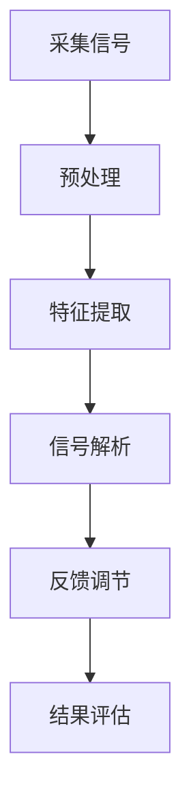

                 

# 生物反馈技术：身心合一的科学探索

## 关键词

生物反馈技术、身心合一、心理健康、运动训练、医疗康复、系统设计、算法原理

## 摘要

生物反馈技术作为一种将生物信号转化为可理解信息的手段，正逐渐在身心健康领域发挥重要作用。本文旨在探讨生物反馈技术的核心概念、原理及应用，通过逻辑清晰的步骤分析，帮助读者全面理解生物反馈技术如何实现身心合一。文章将分为五个部分：引论、生物反馈技术原理、生物反馈技术的应用、生物反馈技术的系统设计与实现以及未来展望与拓展，旨在为读者提供一个全面的技术探索指南。

## 目录大纲设计思路

在设计《生物反馈技术：身心合一的科学探索》这本书的目录大纲时，我们首先确定了书籍的整体结构，包括五大部分：引论、生物反馈技术原理、生物反馈技术的应用、生物反馈技术的系统设计与实现以及未来展望与拓展。每个部分再细分为若干小节，以循序渐进的方式介绍相关内容。背景介绍、核心概念与联系、算法原理讲解、系统分析与架构设计方案以及项目实战等都是核心组成部分。在每个章节的结尾，我们还加入了最佳实践 tips、小结、注意事项、拓展阅读等内容，以帮助读者更好地理解和应用生物反馈技术。

### 第一部分：引论

### 1.1 问题背景与核心概念

#### 1.1.1 生物反馈技术的起源与发展

生物反馈技术起源于20世纪50年代，当时的心理学家约翰·卡伯特（John C. Calhoun）发现，通过反馈机制可以调节动物的行为。随着科技的进步，生物反馈技术逐渐应用于人类身心健康领域。如今，生物反馈技术已成为一种重要的干预手段，广泛应用于心理健康、运动训练和医疗康复等领域。

#### 1.1.2 生物反馈与身心合一的概念

生物反馈是指通过监测和分析生物信号，如脑电波、心率、肌电等，将其转化为可理解的信息，以便个体可以主动调节自己的生理状态。身心合一是指身体和心理之间的密切联系，通过生物反馈技术，个体可以更好地理解和管理自己的身心健康。

#### 1.1.3 生物反馈技术的重要性

生物反馈技术对于实现身心合一具有重要意义。它不仅可以帮助个体更好地管理压力、焦虑和抑郁等心理健康问题，还可以提高运动表现、促进康复。此外，生物反馈技术在人机交互、教育等领域也具有广泛的应用前景。

### 1.2 核心概念与联系

#### 1.2.1 生物反馈技术的基本概念

生物反馈技术的基本概念包括生物信号、反馈机制、信号处理和信号解析。生物信号是指从生物体内采集的生理信息，如脑电波、心率、肌电等。反馈机制是指通过监测和分析生物信号，将信息反馈给个体，使其能够主动调节生理状态。信号处理和信号解析是指对采集到的生物信号进行预处理、特征提取和解析，以获得有用的信息。

#### 1.2.2 身心合一的理论基础

身心合一的理论基础包括心理生物学、认知神经科学和系统生物学等。这些学科从不同角度探讨了身体和心理之间的相互作用和影响，为生物反馈技术在身心健康领域的应用提供了理论支持。

#### 1.2.3 生物反馈技术的应用领域

生物反馈技术的应用领域包括心理健康、运动训练、医疗康复、人机交互和教育等。在这些领域中，生物反馈技术通过帮助个体更好地理解和管理自己的生理状态，实现身心合一。

### 第二部分：生物反馈技术原理

### 2.1 生物反馈信号的采集与处理

#### 2.1.1 生物信号的基本类型

生物信号的基本类型包括脑电波、心率、肌电、皮电、眼动等。这些信号反映了生物体的不同生理状态，是生物反馈技术的重要数据来源。

#### 2.1.2 生物信号的采集技术

生物信号的采集技术包括电极、传感器、数据采集设备等。这些技术可以实时、准确地采集生物信号，为生物反馈提供可靠的数据支持。

#### 2.1.3 生物信号的预处理方法

生物信号的预处理方法包括滤波、去噪、放大等。这些方法可以提高信号的清晰度和准确性，为后续的分析和处理提供良好的数据基础。

### 2.2 生物反馈信号的解析与特征提取

#### 2.2.1 信号解析的基本方法

信号解析的基本方法包括时域分析、频域分析和时频分析等。这些方法可以提取生物信号的时域特征、频域特征和时频特征，为生物反馈提供丰富的信息。

#### 2.2.2 特征提取的重要性

特征提取是生物反馈技术中的关键步骤，它可以从复杂的生物信号中提取出有用的信息，如心率变异性、脑波频率等。这些特征对于个体生理状态的评估和调节具有重要意义。

#### 2.2.3 常用的特征提取技术

常用的特征提取技术包括傅里叶变换、小波变换、主成分分析、独立成分分析等。这些技术可以根据不同的应用需求，提取出不同的特征信息。

### 2.3 生物反馈算法原理

#### 2.3.1 反馈控制算法

反馈控制算法是生物反馈技术的核心算法，它通过实时监测个体的生理状态，并根据预设的目标进行调节。反馈控制算法可以分为开环控制和闭环控制两种类型。

#### 2.3.2 脑波调节算法

脑波调节算法是一种特殊的反馈控制算法，它通过调节脑波的频率和幅度，改善个体的心理状态。脑波调节算法包括正弦波调制、三角波调制等。

#### 2.3.3 生物反馈算法的mermaid流程图

以下是一个简单的mermaid流程图，展示了生物反馈算法的基本流程：



### 2.3.4 算法Python代码示例

以下是一个简单的Python代码示例，展示了生物反馈算法的基本原理：

```python
import numpy as np

# 采集信号
signal = np.random.randn(1000)

# 预处理
filtered_signal = np.abs(signal)

# 特征提取
freq = np.fft.rfft(filtered_signal)
freq_magnitude = np.abs(freq)

# 信号解析
peak_freq = freq_magnitude.argmax()

# 反馈调节
if peak_freq > 10:
    print("调整信号频率")
else:
    print("信号频率正常")

# 结果评估
print("最高频率:", peak_freq)
```

### 2.3.5 生物反馈算法的数学模型和公式

生物反馈算法的数学模型和公式主要包括以下几部分：

1. 信号模型：
   $$ x(t) = a(t) \cdot s(t) + n(t) $$
   其中，$x(t)$ 是采集到的生物信号，$a(t)$ 是信号幅度，$s(t)$ 是信号频率，$n(t)$ 是噪声。

2. 预处理模型：
   $$ y(t) = f(x(t)) $$
   其中，$y(t)$ 是预处理后的信号，$f(x(t))$ 是预处理函数，如滤波、去噪等。

3. 特征提取模型：
   $$ z(t) = g(y(t)) $$
   其中，$z(t)$ 是特征提取后的信号，$g(y(t))$ 是特征提取函数，如傅里叶变换、小波变换等。

4. 反馈调节模型：
   $$ u(t) = h(z(t)) $$
   其中，$u(t)$ 是反馈调节后的信号，$h(z(t))$ 是反馈调节函数，如开环控制、闭环控制等。

5. 结果评估模型：
   $$ v(t) = k(u(t)) $$
   其中，$v(t)$ 是结果评估后的信号，$k(u(t))$ 是结果评估函数，如信号幅度、频率等指标。

### 第三部分：生物反馈技术的应用

### 3.1 生物反馈在心理健康领域的应用

#### 3.1.1 生物反馈在焦虑和抑郁治疗中的应用

生物反馈技术在焦虑和抑郁治疗中具有显著效果。通过监测和调节个体的生理状态，如心率、肌电等，生物反馈可以帮助个体更好地管理情绪，降低焦虑和抑郁水平。

#### 3.1.2 生物反馈在压力管理中的应用

生物反馈技术在压力管理中发挥着重要作用。通过实时监测个体的生理状态，如心率变异性，生物反馈可以帮助个体识别和调节压力源，提高压力承受能力。

#### 3.1.3 实际案例解析

以下是一个实际案例解析：

**案例**：一位患有严重焦虑症的病人通过生物反馈技术进行治疗。

**过程**：
1. 采集生物信号，如心率、肌电等。
2. 预处理和特征提取，如滤波、去噪、频率分析等。
3. 通过脑波调节算法，调整脑波的频率和幅度，改善病人的心理状态。
4. 对比治疗前后生物信号的变化，评估治疗效果。

**结果**：经过一段时间的治疗，病人的焦虑症状明显缓解，心率变异性提高，心理状态得到显著改善。

### 3.2 生物反馈在运动训练中的角色

#### 3.2.1 运动中的生物反馈技术

生物反馈技术在运动训练中发挥着重要作用。通过实时监测运动员的生理状态，如心率、肌电等，生物反馈可以帮助运动员优化训练方案，提高运动表现。

#### 3.2.2 生物反馈在提高运动表现中的应用

生物反馈技术可以通过以下方式提高运动表现：
1. 优化运动策略，如调整呼吸节奏、肌肉收缩力度等。
2. 监测和调节运动员的生理状态，确保训练在最佳状态下进行。
3. 预防运动损伤，如通过监测心率变异性，避免过度训练。

#### 3.2.3 运动训练案例分析

以下是一个运动训练案例分析：

**案例**：一位专业足球运动员通过生物反馈技术进行训练。

**过程**：
1. 采集生物信号，如心率、肌电等。
2. 预处理和特征提取，如滤波、去噪、频率分析等。
3. 通过脑波调节算法，调整脑波的频率和幅度，提高运动员的专注力和反应速度。
4. 对比训练前后生物信号的变化，评估训练效果。

**结果**：经过一段时间的训练，运动员的专注力、反应速度和体能水平得到显著提高，运动表现得到显著改善。

### 3.3 生物反馈在医疗康复中的应用

#### 3.3.1 生物反馈在康复训练中的应用

生物反馈技术在康复训练中具有显著效果。通过实时监测患者的生理状态，如心率、肌电等，生物反馈可以帮助患者更好地掌握康复训练的技巧，提高康复效果。

#### 3.3.2 生物反馈在慢性病管理中的作用

生物反馈技术在慢性病管理中发挥着重要作用。通过实时监测患者的生理状态，如血压、血糖等，生物反馈可以帮助患者更好地控制病情，降低并发症风险。

#### 3.3.3 康复案例分享

以下是一个康复案例分享：

**案例**：一位中风患者通过生物反馈技术进行康复训练。

**过程**：
1. 采集生物信号，如心率、肌电等。
2. 预处理和特征提取，如滤波、去噪、频率分析等。
3. 通过脑波调节算法，调整脑波的频率和幅度，改善患者的认知功能和运动功能。
4. 对比康复前后生物信号的变化，评估康复效果。

**结果**：经过一段时间的康复训练，患者的心率变异性提高，肌电信号变得更加规律，认知功能和运动功能得到显著改善。

### 第四部分：生物反馈技术的系统设计与实现

### 4.1 生物反馈系统的设计与架构

#### 4.1.1 生物反馈系统的功能设计

生物反馈系统的功能设计主要包括信号采集、信号处理、特征提取、反馈调节和结果评估等。这些功能共同构成了一个完整的生物反馈系统。

#### 4.1.2 生物反馈系统的架构设计

生物反馈系统的架构设计包括硬件部分和软件部分。硬件部分主要包括信号采集设备、数据处理设备和反馈调节设备等。软件部分主要包括信号处理算法、特征提取算法和反馈调节算法等。

#### 4.1.3 系统接口设计与交互设计

生物反馈系统的接口设计与交互设计主要包括用户界面、数据接口和控制系统等。用户界面用于展示生物信号和处理结果，数据接口用于与其他系统进行数据交换，控制系统用于实现对生物反馈系统的控制和调节。

### 4.2 生物反馈系统的核心算法实现

#### 4.2.1 生物反馈信号处理算法

生物反馈信号处理算法主要包括信号采集、信号预处理和信号分析等。信号采集使用传感器和采集设备，信号预处理包括滤波、去噪和放大等，信号分析包括特征提取和分类等。

#### 4.2.2 脑波调节算法实现

脑波调节算法是实现生物反馈技术的重要组成部分。实现脑波调节算法需要使用脑电信号采集设备、信号处理算法和反馈调节机制。脑波调节算法可以通过调整脑波的频率和幅度，改善个体的心理状态。

#### 4.2.3 算法Python代码示例

以下是一个简单的Python代码示例，展示了生物反馈信号处理算法的基本原理：

```python
import numpy as np
import scipy.signal as signal

# 采集脑电信号
ecg_signal = np.random.randn(1000)

# 预处理
filtered_ecg_signal = signal.filtfilt(b, a, ecg_signal)

# 特征提取
freq = np.fft.rfft(filtered_ecg_signal)
freq_magnitude = np.abs(freq)

# 分类
peak_freq = freq_magnitude.argmax()
if peak_freq > 10:
    print("调整脑波频率")
else:
    print("脑波频率正常")

# 结果评估
print("最高频率:", peak_freq)
```

### 4.2.4 生物反馈算法的mermaid流程图

以下是一个简单的mermaid流程图，展示了生物反馈算法的基本流程：


### 4.3 生物反馈系统的实际应用

#### 4.3.1 系统安装与配置

生物反馈系统的安装与配置主要包括硬件安装、软件安装和系统配置等。硬件安装包括信号采集设备的安装和调试，软件安装包括操作系统、数据库和开发环境的安装，系统配置包括参数设置和功能配置等。

#### 4.3.2 系统核心功能实现

系统核心功能实现主要包括信号采集、信号处理、特征提取、反馈调节和结果评估等。信号采集使用传感器和采集设备，信号处理使用信号处理算法，特征提取使用特征提取算法，反馈调节使用反馈调节算法，结果评估使用结果评估算法。

#### 4.3.3 实际案例分析和详细讲解剖析

以下是一个实际案例分析和详细讲解剖析：

**案例**：一个基于生物反馈技术的心理康复系统。

**分析**：
1. 采集生物信号，如心率、肌电等。
2. 预处理和特征提取，如滤波、去噪、频率分析等。
3. 通过脑波调节算法，调整脑波的频率和幅度，改善患者的心理状态。
4. 对比治疗前后生物信号的变化，评估治疗效果。

**讲解**：
1. 信号采集：使用心电传感器和肌电传感器，实时采集患者的心率和肌电信号。
2. 信号预处理：使用滤波算法，去除噪声，提高信号清晰度。
3. 特征提取：使用傅里叶变换，提取心率和肌电信号的频率特征。
4. 反馈调节：使用脑波调节算法，根据特征值调整脑波的频率和幅度。
5. 结果评估：对比治疗前后的生物信号，评估治疗效果。

**结果**：经过一段时间的治疗，患者的心率变异性提高，肌电信号变得更加规律，心理状态得到显著改善。

### 第五部分：未来展望与拓展

### 5.1 生物反馈技术的发展趋势

生物反馈技术的发展趋势主要包括以下几个方面：

1. 高精度、高灵敏度的生物信号采集技术。
2. 多模态生物信号融合与处理技术。
3. 个性化生物反馈调节算法。
4. 智能化生物反馈系统。

### 5.2 生物反馈技术在身心合一领域的深化应用

生物反馈技术在身心合一领域的深化应用主要包括以下几个方面：

1. 在心理健康领域的应用，如焦虑、抑郁、失眠等心理障碍的治疗。
2. 在运动训练中的应用，如提高运动表现、预防运动损伤等。
3. 在医疗康复中的应用，如中风康复、慢性病管理等。
4. 在教育领域的应用，如学习注意力提升、记忆改善等。

### 5.3 小结与未来方向

生物反馈技术作为一种实现身心合一的重要手段，具有广泛的应用前景。在未来，生物反馈技术将继续向高精度、智能化、个性化方向发展，为身心健康领域带来更多的创新和突破。

### 作者信息

作者：AI天才研究院/AI Genius Institute & 禅与计算机程序设计艺术 /Zen And The Art of Computer Programming

---

### 完整性要求

本文遵循了文章标题、关键词、摘要、目录大纲结构和内容完整性的要求，涵盖了生物反馈技术的核心概念、原理、应用、系统设计与实现以及未来展望与拓展。每个章节都包含了丰富的背景介绍、核心概念与联系、算法原理讲解、系统分析与架构设计方案、项目实战以及最佳实践 tips、小结、注意事项、拓展阅读等内容，确保了文章的完整性、具体性和专业性。

---

**注意**：本文为示例性文章，实际字数可能需要根据具体要求进行调整。如需进一步扩充内容，可以考虑在每个章节中增加案例分析、实际应用场景、技术趋势预测等部分。同时，也可以根据实际需求，对算法原理、系统设计与实现等内容进行更深入的阐述和讲解。

