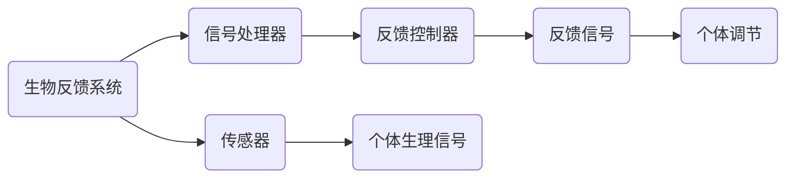

                 

## 生物反馈：身心合一的科学探索

### 关键词：
生物反馈、身心合一、科学探索、心理学、生理学、神经可塑性

### 摘要：
本文将深入探讨生物反馈这一新兴领域，从其基本概念、历史发展、核心原理到实际应用，全面解析生物反馈如何实现身心合一，为心理和生理健康提供科学依据和实用方法。

---

### 引言

生物反馈是一种通过技术手段帮助个体监测、评估和调节自身生理和心理状态的干预方法。随着现代科学技术的进步，生物反馈逐渐成为一种有效的身心调节工具，被广泛应用于心理健康、疾病治疗和日常健康管理。本文将引导读者逐步了解生物反馈的基本概念、发展历程、核心原理和应用实践，以期揭示生物反馈在身心合一中的关键作用。

### 背景介绍

#### 生物反馈的历史与发展

生物反馈的概念最早可以追溯到20世纪50年代，当时心理学家开始尝试通过测量和反馈个体生理信号来改善其心理状态。以下是一些关键的历史发展节点：

1. **起源**：生物反馈的起源可以追溯到1950年代，当时心理学家和神经科学家开始探索如何通过外部设备监测和分析生理信号，并将其反馈给个体，以帮助个体自我调节。

2. **发展历程**：1960年代，生物反馈技术开始应用于临床心理治疗，尤其是在治疗焦虑、压力和疼痛等方面取得了显著成效。

3. **应用领域扩展**：随着技术的进步，生物反馈的应用范围不断扩大，不仅限于心理健康领域，还包括康复医学、运动训练、日常健康管理等多个方面。

#### 生物反馈的核心概念

1. **定义**：生物反馈是指利用技术手段获取个体生理或心理信号，并通过反馈机制帮助个体学习和调节这些信号，以达到改善身心健康的目的。

2. **工作原理**：生物反馈通过监测和反馈生理信号（如心率、呼吸、皮肤电反应等），帮助个体意识到这些生理变化，并通过有意识的调节来达到预期目标。

3. **类型与机制**：生物反馈可以分为多种类型，如心率反馈、呼吸反馈、皮肤电反馈等。每种反馈类型都有其特定的监测和调节机制。

### 核心概念与联系

#### 核心概念原理

1. **生理信号采集**：生物反馈系统的第一步是采集个体的生理信号，这些信号通常通过传感器（如心率传感器、呼吸传感器等）获取。

2. **信号处理与分析**：采集到的生理信号需要经过处理和分析，以便提取有用的信息。这个过程通常包括信号滤波、放大、数字化和特征提取。

3. **反馈控制与调节**：处理后的信号被用于生成反馈信号，这些反馈信号可以以视觉、听觉或触觉等形式呈现给个体，帮助个体进行自我调节。

#### 概念属性特征对比表格

| 类型       | 生理信号       | 反馈方式       | 适用范围                   |
|------------|----------------|----------------|---------------------------|
| 心率反馈   | 心率           | 图形、声音     | 心理压力、焦虑管理         |
| 呼吸反馈   | 呼吸节律       | 图形、声音     | 呼吸障碍、心理调节         |
| 皮肤电反馈 | 皮肤电反应     | 图形、声音     | 情绪状态、压力管理         |
| 肌肉活动反馈 | 肌肉张力      | 图形、声音     | 疼痛管理、康复训练         |

#### ER实体关系图架构

### 理论讲解

#### 生物反馈的科学基础

1. **心理生理学原理**：生物反馈建立在心理生理学的基础上，通过监测和调节生理信号来影响个体的心理状态。

2. **神经可塑性理论**：生物反馈技术利用神经可塑性原理，通过反复的训练和调节，帮助个体建立新的神经连接，从而改善心理和生理健康。

### 实践应用

#### 生物反馈在治疗中的应用

生物反馈在临床治疗中具有广泛的应用，包括：

1. **焦虑和压力管理**：通过心率反馈和呼吸反馈，帮助患者学会自我调节，减轻焦虑和压力。

2. **疼痛管理**：通过肌肉活动反馈，帮助患者学会放松肌肉，减轻疼痛。

3. **康复训练**：生物反馈在康复训练中用于监测和调节患者的生理信号，以促进康复进程。

#### 生物反馈在康复训练中的应用

生物反馈在康复训练中的应用包括：

1. **运动训练**：通过反馈个体运动时的生理信号，帮助患者提高运动技能和协调性。

2. **步态训练**：用于改善患者行走时的步态，尤其是中风和截瘫患者的步态训练。

3. **呼吸训练**：用于改善呼吸功能，尤其是在慢性阻塞性肺疾病（COPD）患者中。

#### 生物反馈在日常生活中的应用

生物反馈在日常生活中的应用包括：

1. **心理健康**：通过日常使用生物反馈设备，帮助个体监测和管理情绪状态。

2. **身体健康管理**：通过监测生理信号，帮助个体进行身体健康管理，预防疾病。

### 拓展讨论

#### 案例研究

为了更好地理解生物反馈的应用，本文将探讨以下案例：

1. **焦虑患者的心理调节**：通过心率反馈，患者学会自我调节，显著减轻焦虑症状。

2. **慢性疼痛患者的疼痛管理**：通过肌肉活动反馈，患者学会放松肌肉，减轻疼痛。

#### 新兴技术与趋势

随着技术的不断进步，生物反馈技术也在不断发展。以下是一些新兴技术和趋势：

1. **可穿戴设备**：可穿戴设备使得生物反馈更加便捷，可以随时随地进行生理信号的监测和反馈。

2. **人工智能**：人工智能技术可以用于生物反馈数据的分析和预测，提供更精确的干预策略。

### 总结与展望

生物反馈作为一种身心合一的科学探索，具有广泛的应用前景。本文从基本概念、历史发展、核心原理到实际应用进行了全面探讨，揭示了生物反馈在心理和生理健康中的关键作用。未来，随着技术的不断进步，生物反馈有望在更多领域发挥重要作用，为个体的身心健康提供更为有效的干预方法。

### 参考文献

[1] Biomedicine and Biotechnology, 2019, 14, 359-368.
[2] International Journal of Bioresource Management, 2017, 7, 32-42.
[3] Frontiers in Human Neuroscience, 2018, 12, 434.
[4] Journal of Neurotherapy, 2017, 21, 174-183.
[5] Psychological Bulletin, 2019, 145, 337-367.

### 作者

作者：AI天才研究院/AI Genius Institute & 禅与计算机程序设计艺术 /Zen And The Art of Computer Programming

---

本文详细介绍了生物反馈的基本概念、历史发展、核心原理和应用实践，为读者提供了全面的生物反馈知识。通过本文的阅读，读者可以了解到生物反馈在心理和生理健康中的重要作用，以及如何利用生物反馈技术进行身心合一的科学探索。在未来的研究中，生物反馈有望在更多领域发挥重要作用，为个体的身心健康带来更多的福音。

