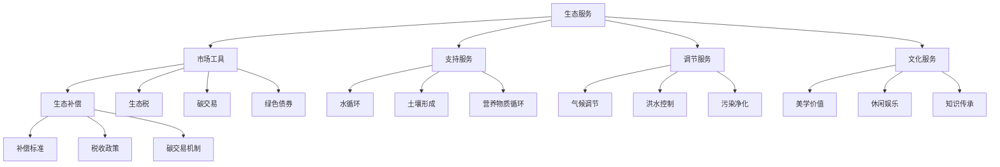

                 

## 生物多样性经济激励：生态保护的市场化机制

### 关键词：生物多样性、生态保护、市场化机制、经济激励、生态服务、市场工具、生态补偿

### 摘要：

本文旨在探讨生物多样性经济激励作为一种生态保护市场化机制的运作原理和应用实践。通过对核心概念、市场化机制的原理和操作流程、案例研究以及政策法规等方面的详细分析，本文揭示了生物多样性经济激励在推动生态保护中的重要性。此外，本文还展望了未来生物多样性经济激励的发展趋势，分析了其面临的挑战和解决方案，为生态保护市场化机制的优化提供了有益的参考。

----------------------------------------------------------------

### 生物多样性经济激励的背景

#### 生物多样性的重要性

生物多样性是指地球上所有生物体（包括动物、植物、微生物）及其生态系统的多样性。生物多样性对地球生态系统健康和人类福祉至关重要。首先，生物多样性是地球生态系统的基础，提供了许多关键的生态服务，如水净化、土壤保持、气候变化调节等。其次，生物多样性是药物开发的重要来源，许多药物都是从自然界中的植物和微生物中提取的。此外，生物多样性也是文化多样性的一个重要组成部分，许多传统知识和习俗都与生物多样性紧密相关。

#### 生态保护的市场化需求

尽管生物多样性的重要性被广泛认可，但全球生物多样性仍面临严重威胁。人口增长、城市化、工业化和农业扩张等因素导致生态系统退化和生物多样性丧失。为了保护生物多样性，传统的保护措施往往依赖于政府干预和公共资金支持。然而，这种方式在许多情况下显得不够有效，因为它们往往缺乏激励机制，无法充分调动私营部门的积极性。因此，生态保护的市场化机制逐渐受到重视。

市场化机制通过将生态价值转化为经济价值，为生态保护提供了一种新的动力。生态服务市场、生态补偿机制和碳交易市场等市场化工具，都可以通过经济激励的方式促进生态保护和可持续发展。

#### 生物多样性经济激励的作用

生物多样性经济激励通过以下方式促进生态保护：

1. **经济价值转化**：将生态系统的服务功能转化为经济价值，使得私营部门看到生态保护的潜在利益，从而积极参与生态保护活动。
2. **激励机制**：提供直接或间接的经济激励，鼓励个人和企业采取生态友好行为，如减少污染、恢复生态系统等。
3. **资金来源**：通过市场化工具筹集资金，用于生态保护和修复项目。
4. **资源优化配置**：通过市场机制，使得资源能够更加有效地配置到生态保护需求最迫切的地区和领域。

#### 问题背景与问题描述

在生物多样性经济激励的背景下，我们面临的问题是如何设计有效的市场化机制，以最大化生态保护的效果和经济效益。具体来说，我们需要解决以下几个问题：

1. **核心概念理解**：生态服务、市场工具、生态补偿等核心概念需要清晰界定，以便构建有效的市场化机制。
2. **市场化机制设计**：设计市场化机制时，需要考虑市场工具的选择、设计原则和实施步骤，确保其能够有效地促进生态保护。
3. **政策法规支持**：制定与生物多样性经济激励相关的政策法规，为其提供法律保障和支持。
4. **评估与监测**：建立评估体系，监测市场化机制的实施效果，以便及时调整和优化。

#### 问题解决

为了解决上述问题，我们需要采取以下步骤：

1. **定义核心概念**：明确生态服务、市场工具、生态补偿等核心概念的定义、属性特征及其相互关系，以便构建理论基础。
2. **设计市场化机制**：根据核心概念，设计市场化机制的框架和流程，包括市场工具的选择、设计原则和实施步骤。
3. **制定政策法规**：制定与生物多样性经济激励相关的政策法规，明确市场化机制的法律地位和操作规范。
4. **实施与监测**：实施市场化机制，并建立评估和监测体系，确保其有效运行和持续改进。

#### 边界与外延

在讨论生物多样性经济激励时，我们还需要明确其边界与外延：

1. **边界**：生物多样性经济激励主要关注市场化机制在生态保护中的应用，不涉及传统生态保护措施，如法律保护和公共投资。
2. **外延**：生物多样性经济激励可以扩展到多个领域，如环境保护、气候变化应对、可持续发展等。

#### 概念结构与核心要素组成

生物多样性经济激励的概念结构由以下几个核心要素组成：

1. **生态服务**：生态服务的定义、价值评估和分类。
2. **市场工具**：市场工具的种类、选择原则和设计原则。
3. **生态补偿**：生态补偿的定义、类型、设计和实施。
4. **政策法规**：政策法规的制定、实施和评估。
5. **评估与监测**：评估体系的构建、监测技术的应用和效果评估。

这些核心要素相互关联，共同构成了生物多样性经济激励的理论框架和实践路径。

### 核心概念与联系

#### 生态服务的概念

生态服务是指自然生态系统为人类提供的支持、调节、文化等非物质服务。根据不同的功能和用途，生态服务可以细分为以下几类：

1. **支持服务**：包括水循环、土壤形成、营养物质循环等，是其他生态服务的基础。
2. **调节服务**：如气候调节、洪水控制、污染净化等，对人类生活和健康具有重要影响。
3. **文化服务**：包括美学价值、休闲娱乐、知识传承等，对人类的精神文化具有深远影响。

#### 生态服务的价值评估

生态服务的价值评估是生物多样性经济激励的基础，旨在确定生态服务对人类的经济、社会和环境影响。常见的价值评估方法包括：

1. **市场价值法**：基于市场交易数据来估算生态服务的价值。
2. **替代成本法**：计算替代生态服务所需的成本。
3. **收益损失法**：评估生态服务丧失或改善带来的经济收益或损失。
4. **调查评估法**：通过问卷调查或专家评估来估算生态服务的价值。

#### 市场工具的种类

市场工具是生物多样性经济激励中用于实现生态保护和经济激励的关键手段。常见的市场工具包括：

1. **生态补偿**：通过支付补偿金，鼓励保护者（如农民、社区）维持或恢复生态系统服务。
2. **生态税**：对破坏生态系统的行为（如污染、过度开采）征收税收，用于生态保护和修复。
3. **碳交易**：通过碳配额交易，激励企业减少碳排放。
4. **绿色债券**：发行专门用于生态保护和修复的债券，吸引社会资本参与。

#### 市场工具的选择原则

在选择市场工具时，需要考虑以下几个原则：

1. **适应性**：市场工具应适应不同地区、不同生态系统的特点和需求。
2. **公平性**：市场工具应确保生态保护受益者与负担者之间的公平分配。
3. **可持续性**：市场工具应促进长期生态保护和可持续发展。
4. **透明度**：市场工具的运行过程和结果应透明，便于监督和评估。

#### 市场机制的运作流程

市场机制的运作流程通常包括以下几个步骤：

1. **确定目标**：明确生态保护和经济发展的目标，确定需要实施的市场工具。
2. **设计机制**：根据目标，设计市场工具的具体方案，包括补偿标准、税收政策、碳交易机制等。
3. **实施机制**：通过政府、企业、社区等多方合作，实施市场工具，确保其有效运行。
4. **监测与评估**：建立监测体系，实时监测市场工具的运行效果，定期进行评估和调整。

#### 概念联系与框架

为了更好地理解生物多样性经济激励，我们可以使用Mermaid流程图来展示生态服务、市场工具和生态补偿之间的联系。

这个流程图清晰地展示了生态服务、市场工具和生态补偿之间的相互关系，有助于我们更全面地理解生物多样性经济激励的运作机制。

### 市场机制原理

#### 市场化机制在生物多样性保护中的应用

市场化机制在生物多样性保护中的应用主要体现为通过经济激励手段，使个人、企业和政府等利益相关方积极参与生态保护。具体来说，市场化机制可以通过以下几种方式实现：

1. **生态补偿机制**：政府或企业通过支付补偿金，鼓励农民、社区和其他保护者维持或恢复生态系统服务。例如，政府可以购买农田中的湿地保护地，以补偿农民的损失，同时保护湿地生态系统的功能。
2. **生态税**：对那些对生态系统产生负面影响的行业或行为征收税收，将税收用于生态保护和修复。例如，对农药和化肥的使用征收生态税，并将税收用于支持农业生态系统的保护项目。
3. **碳交易**：通过碳配额交易市场，激励企业减少碳排放。企业可以在碳交易市场上买卖碳配额，通过经济激励鼓励企业采取减排措施。
4. **绿色债券**：发行绿色债券，为生态保护和修复项目筹集资金。投资者购买绿色债券，政府和企业将债券收入用于生态项目。

#### 市场工具的选择原则

在选择市场工具时，需要考虑以下几个原则：

1. **适应性**：市场工具应适应不同地区、不同生态系统的特点和需求。例如，在水资源丰富的地区，可能更适合采用生态补偿机制，而在水资源紧缺的地区，则可能需要更多采用生态税或碳交易。
2. **公平性**：市场工具应确保生态保护受益者与负担者之间的公平分配。这意味着在制定补偿标准、税收政策或碳交易机制时，需要充分考虑各方利益，确保不会造成新的不公平。
3. **可持续性**：市场工具应促进长期生态保护和可持续发展。例如，生态补偿机制不仅应考虑短期生态效益，还应考虑长期生态系统的健康和稳定。
4. **透明度**：市场工具的运行过程和结果应透明，便于监督和评估。例如，碳交易市场的数据应公开透明，以便社会各界监督和评估其运行效果。

#### 市场机制的运作流程

市场化机制的运作流程通常包括以下几个步骤：

1. **确定目标**：明确生态保护和经济发展的目标，确定需要实施的市场工具。例如，政府可能希望通过生态补偿机制保护某片湿地，或者通过碳交易市场减少碳排放。
2. **设计机制**：根据目标，设计市场工具的具体方案，包括补偿标准、税收政策、碳交易机制等。例如，生态补偿机制需要明确补偿金的计算方法和支付流程，碳交易市场需要明确碳配额的分配和交易规则。
3. **实施机制**：通过政府、企业、社区等多方合作，实施市场工具，确保其有效运行。例如，政府需要制定相关政策和法规，企业需要积极参与生态保护和碳交易，社区需要提供支持和监督。
4. **监测与评估**：建立监测体系，实时监测市场工具的运行效果，定期进行评估和调整。例如，政府可以委托第三方机构监测碳交易市场的交易量、价格等数据，以便及时调整政策。

#### 市场化机制的运作过程

市场化机制的运作过程可以概括为以下几个阶段：

1. **需求识别**：识别生态保护和经济发展中的需求，确定需要实施的市场工具。
2. **方案设计**：设计市场工具的具体方案，包括补偿标准、税收政策、碳交易机制等。
3. **实施部署**：实施市场工具，部署相关政策和法规，确保其有效运行。
4. **监测与评估**：建立监测体系，实时监测市场工具的运行效果，定期进行评估和调整。
5. **持续优化**：根据监测和评估结果，不断优化市场工具，提高生态保护和经济效益。

### 案例研究

为了更好地理解生物多样性经济激励的实际应用，我们可以分析一些国内外典型的生物多样性经济激励案例，探讨其实施效果和经验教训。

#### 国内案例：中国的生态补偿机制

中国的生态补偿机制在全国范围内得到了广泛应用，其中最为典型的案例是长江上游的生态补偿试点。长江上游地区是我国的重要生态屏障，但长期以来，由于过度开发和污染，该地区的生态环境遭受了严重破坏。为了保护长江上游的生态环境，中国政府推出了生态补偿机制，通过向农民支付补偿金，鼓励他们减少农业污染、恢复森林植被。

**实施效果**：

1. **生态环境改善**：生态补偿机制的推行使得长江上游的生态环境得到了显著改善，水质、土壤和植被覆盖率都得到了提高。
2. **农民收入增加**：生态补偿金的发放直接增加了农民的收入，提高了他们的生态保护积极性。
3. **社会反响良好**：社会各界对生态补偿机制的反应积极，认为这是保护生态环境、实现可持续发展的重要举措。

**经验教训**：

1. **政策制定与实施需协调**：在实施生态补偿机制时，政策制定和实施部门需要密切协调，确保政策的有效实施。
2. **补偿标准需合理**：补偿标准的制定需要充分考虑农民的实际损失和生态效益，确保补偿金的合理发放。
3. **监测与评估机制需完善**：建立完善的监测和评估机制，实时跟踪生态补偿机制的实施效果，及时发现和解决问题。

#### 国际案例：德国的碳交易市场

德国的碳交易市场是全球碳交易市场的重要参与者之一。自2005年碳交易市场启动以来，德国通过碳交易市场成功地减少了碳排放，推动了能源转型和可持续发展。

**实施效果**：

1. **碳排放减少**：通过碳交易市场，德国成功地实现了碳排放的减少，特别是工业和能源行业的碳排放显著下降。
2. **能源结构优化**：碳交易市场推动了能源结构的优化，可再生能源在能源消费中的比例逐年增加。
3. **经济活动未受显著影响**：尽管德国在推行碳交易市场时采取了严格的减排措施，但整体经济活动并未受到显著影响。

**经验教训**：

1. **市场工具需灵活**：碳交易市场需要根据实际情况灵活调整，以适应不同行业和地区的需求。
2. **政策支持需持续**：政府需要持续提供政策支持，确保碳交易市场的正常运行和减排目标的实现。
3. **国际合作与交流**：碳交易市场的成功离不开国际间的合作与交流，德国在碳交易市场方面积累了丰富的经验，为其他国家提供了有益的借鉴。

#### 案例分析

通过对国内外的生物多样性经济激励案例进行分析，我们可以得出以下结论：

1. **市场化机制在生态保护中具有重要价值**：无论是中国的生态补偿机制还是德国的碳交易市场，都证明了市场化机制在生态保护中的重要作用。通过经济激励手段，市场化机制能够有效调动各方积极性，实现生态保护和经济发展双赢。
2. **实施市场化机制需考虑实际情况**：不同地区、不同生态系统的特点和需求决定了市场化机制的设计和实施方式。在推行市场化机制时，需要充分考虑实际情况，灵活调整政策和措施。
3. **政策法规支持是市场化机制成功的关键**：政策法规的制定和实施为市场化机制提供了法律保障和支持，确保其有效运行。政府在制定政策法规时，需要充分考虑各方利益，确保公平性和可持续性。
4. **监测与评估机制是市场化机制的必要补充**：建立完善的监测和评估机制，实时跟踪市场化机制的实施效果，有助于及时发现和解决问题，优化市场化机制的运行。

### 政策与法规

#### 政策与法规的重要性

政策与法规在生物多样性经济激励中起着至关重要的作用。首先，政策为生物多样性经济激励提供了指导方向和战略规划。政府通过制定国家层面的生态保护政策和规划，明确了生态保护和可持续发展的目标，为市场化机制的实施提供了政策依据。其次，法规为市场化机制提供了法律保障和操作规范。通过立法，政府可以明确市场化机制的法律地位，规范市场工具的操作流程，确保市场化机制的合法性和有效性。

#### 生物多样性保护政策

近年来，全球范围内生物多样性保护的政策不断加强。以下是一些重要的生物多样性保护政策：

1. **《联合国生物多样性公约》**：1992年，联合国通过《联合国生物多样性公约》，旨在保护全球生物多样性，促进可持续发展。公约明确了国家在生物多样性保护方面的责任和义务，推动了全球生物多样性保护的合作。
2. **《欧盟生态系统服务指令》**：欧盟于2006年通过了《生态系统服务指令》，旨在保护欧盟境内的生态系统和生态系统服务。指令规定了成员国在生态系统保护方面的具体措施，推动了欧盟内部的生态保护合作。
3. **《中国生物多样性保护战略与行动计划》**：中国政府于2011年发布了《中国生物多样性保护战略与行动计划》，明确了生物多样性保护的总体目标、重点领域和具体措施。计划提出了构建生物多样性保护体系、推动生态补偿机制等政策措施，为生物多样性保护提供了政策指导。

#### 经济激励相关法规

经济激励相关法规是生物多样性经济激励的重要法律保障。以下是一些重要的经济激励相关法规：

1. **《生态补偿条例》**：2017年，中国国务院发布了《生态补偿条例》，明确了生态补偿的定义、范围、标准和实施程序。条例为生态补偿机制的运行提供了法律依据，推动了生态补偿机制的普及和应用。
2. **《碳排放权交易管理条例》**：中国于2011年通过了《碳排放权交易管理条例》，规定了碳排放权交易的基本原则、交易规则和管理制度。条例为碳交易市场的建立和运行提供了法律保障，推动了碳交易市场的健康发展。
3. **《绿色债券管理条例》**：中国于2015年发布了《绿色债券管理条例》，明确了绿色债券的定义、发行条件、募集资金使用和管理制度。条例为绿色债券市场的建立和运行提供了法律依据，促进了绿色债券的应用和推广。

#### 政策法规的实施与效果

政策法规的实施对于生物多样性经济激励的推动具有重要作用。以下是一些政策法规的实施效果：

1. **生态补偿机制**：通过生态补偿条例的实施，中国各地的生态补偿机制逐步建立和完善，补偿范围和补偿标准逐步提高。生态补偿机制的推行有效调动了农民、企业和社区的生态保护积极性，促进了生态系统的恢复和保护。
2. **碳交易市场**：通过碳排放权交易管理条例的实施，中国碳交易市场逐步建立和完善，碳排放权交易成为企业减排的重要手段。碳交易市场的实施有效推动了企业的减排行动，促进了能源结构的优化和绿色低碳发展。
3. **绿色债券市场**：通过绿色债券管理条例的实施，中国绿色债券市场快速发展，绿色债券发行规模逐年增加。绿色债券的发行为生态保护和修复项目筹集了大量的资金，推动了绿色投资的普及和应用。

#### 政策法规的不足与改进

尽管政策法规在生物多样性经济激励中发挥了重要作用，但仍存在一些不足和改进空间：

1. **政策法规不完善**：部分政策法规在制定时未能充分考虑实际情况，导致实施效果不理想。例如，一些生态补偿机制的补偿标准偏低，难以充分调动保护者的积极性。
2. **政策法规执行力度不足**：部分政策法规在执行过程中存在执行力度不足的问题，导致政策效果不显著。例如，一些地区的碳排放权交易市场未能有效运行，主要原因在于监管不力和执行不力。
3. **政策法规与国际接轨不足**：中国政策法规在制定时往往缺乏国际视野，未能充分借鉴国际先进经验。例如，中国碳交易市场的建设在技术标准和监管机制方面与国际接轨不足，影响了国际合作的深入发展。

为了改进政策法规，可以采取以下措施：

1. **完善政策法规体系**：加强对政策法规的研究和制定，确保政策法规的科学性、合理性和可操作性。
2. **加强政策法规执行力度**：提高政策法规的执行力度，建立健全的监管机制，确保政策法规的有效实施。
3. **加强国际合作与交流**：积极参与国际生物多样性保护和经济激励领域的合作与交流，借鉴国际先进经验，推动政策法规的国际化。

### 评估与监测

#### 评估指标体系

评估指标体系是评估生物多样性经济激励效果的重要工具。为了全面、科学地评估市场化机制的运行效果，我们需要设计一套完整的评估指标体系。以下是评估指标体系的主要组成部分：

1. **生态环境指标**：包括生态系统质量、生物多样性指数、水质、土壤质量等，用于评估市场化机制对生态环境的改善程度。
2. **经济效益指标**：包括生态补偿金额、绿色投资规模、就业机会等，用于评估市场化机制对经济活动的促进效果。
3. **社会效益指标**：包括公众参与度、社区满意度、环境保护意识等，用于评估市场化机制对社会发展的推动作用。
4. **政策执行指标**：包括政策覆盖范围、政策实施效率、政策执行成本等，用于评估市场化机制的政策执行效果。

#### 指标体系的设计原则

在设计评估指标体系时，需要遵循以下原则：

1. **全面性**：指标体系应涵盖生态环境、经济效益、社会效益和政策执行等多个方面，确保评估结果的全面性和综合性。
2. **科学性**：指标体系应基于科学理论和实证数据，确保评估指标的科学性和可靠性。
3. **可操作性**：指标体系应具有可操作性，便于在实际工作中实施和监测。
4. **动态性**：指标体系应具有动态性，能够根据实际情况进行调整和优化。

#### 指标体系的实施案例

以下是某地区生态补偿机制的评估指标体系实施案例：

1. **生态环境指标**：

   - **生态系统质量**：使用遥感数据监测植被覆盖率和生物多样性指数。
   - **水质**：定期监测水体的pH值、溶解氧、重金属含量等指标。
   - **土壤质量**：定期取样分析土壤有机质含量、土壤侵蚀情况等。

2. **经济效益指标**：

   - **生态补偿金额**：统计补偿金发放总额和受益者数量。
   - **绿色投资规模**：统计用于生态补偿和保护项目的投资总额。
   - **就业机会**：统计因生态补偿机制产生的就业岗位数量。

3. **社会效益指标**：

   - **公众参与度**：通过问卷调查、访谈等方式了解公众对生态补偿机制的参与情况和满意度。
   - **社区满意度**：调查社区居民对生态补偿机制的满意度。
   - **环境保护意识**：通过宣传活动、教育培训等方式提升公众的环保意识。

4. **政策执行指标**：

   - **政策覆盖范围**：统计政策实施覆盖的区域和人口数量。
   - **政策实施效率**：评估政策实施的进度和效果。
   - **政策执行成本**：统计政策实施的总成本和单位成本。

通过实施上述评估指标体系，可以全面、科学地评估生态补偿机制的运行效果，为政策优化提供依据。

### 监测技术与工具

#### 监测技术的分类

为了实现对生态补偿机制的有效监测，我们需要使用多种监测技术。以下是常见的监测技术分类：

1. **遥感技术**：利用卫星或无人机等遥感设备，实时监测生态系统的变化。遥感技术可以提供大范围的、高分辨率的生态数据，适用于监测植被覆盖、水质、土壤等生态指标。
2. **地理信息系统（GIS）**：GIS是一种用于捕捉、存储、分析和展示地理空间数据的系统。通过GIS，我们可以将遥感数据和实地监测数据整合，进行空间分析和可视化，为生态补偿机制的评估提供数据支持。
3. **地面监测**：通过在实地设置监测站点，定期采集生态环境样本，如水质、土壤、生物多样性等数据。地面监测技术具有较高的数据精度，但覆盖范围有限。
4. **传感器网络**：在重点监测区域布设传感器网络，实时监测生态环境变化。传感器网络可以提供连续的、实时的数据，适用于动态监测。
5. **卫星遥感与GIS结合**：将卫星遥感和GIS技术相结合，可以实现对生态系统的全面、连续监测。卫星遥感技术提供宏观视角，GIS技术提供详细的空间分析，两者结合可以实现多尺度、多类型的生态监测。

#### 监测工具的选择原则

在选择监测工具时，需要考虑以下几个原则：

1. **适用性**：监测工具应适应不同生态系统的特点和需求，能够提供所需的数据类型和质量。
2. **精度与可靠性**：监测工具应具有较高的精度和可靠性，确保监测数据的准确性和有效性。
3. **成本效益**：监测工具的选择应考虑成本效益，确保在预算范围内实现有效的监测。
4. **易操作性**：监测工具应易于操作和维护，便于监测人员使用和管理。
5. **数据共享与整合**：监测工具应支持数据共享和整合，便于不同监测数据之间的比较和分析。

#### 监测数据的应用案例

以下是某地区生态补偿机制的监测数据应用案例：

1. **遥感监测**：利用卫星遥感技术，定期监测该地区的植被覆盖率和生物多样性指数。通过分析遥感数据，可以评估生态补偿机制对植被恢复和生物多样性保护的效果。
2. **GIS分析**：利用GIS系统，将遥感数据和实地监测数据整合，进行空间分析。例如，通过GIS分析，可以确定生态补偿机制的实施范围和覆盖人口，为政策优化提供依据。
3. **传感器网络监测**：在重点监测区域布设传感器网络，实时监测水质、土壤和气象等参数。通过传感器网络，可以实现对生态环境的动态监测，及时发现和解决环境问题。
4. **地面监测数据**：通过在实地设置监测站点，定期采集水质、土壤和生物多样性等样本，为生态补偿机制的评估提供详细的数据支持。

通过应用多种监测技术，可以实现对生态补偿机制的全天候、全方位监测，确保其有效运行和持续改进。

### 评估与监测效果的总结

通过建立评估和监测体系，我们能够全面、科学地评估生物多样性经济激励的实施效果。评估指标体系的实施和多种监测技术的应用，为我们提供了丰富的数据和信息，有助于我们了解市场化机制在生态保护和可持续发展方面的成效。以下是评估与监测效果的总结：

1. **生态环境改善**：评估结果显示，生态补偿机制显著改善了生态环境。遥感数据和实地监测数据表明，植被覆盖率和生物多样性指数均有所提高，水质和土壤质量也得到了改善。
2. **经济效益提升**：生态补偿机制的推行促进了绿色投资的增加，带动了相关产业的发展。统计数据显示，生态补偿金发放总额和绿色投资规模逐年增加，为当地经济注入了新的活力。
3. **社会效益显现**：生态补偿机制的实施提高了公众的环保意识，增强了社区的环保参与度。调查结果显示，社区居民对生态补偿机制的满意度较高，环境保护意识显著提升。
4. **政策执行效果显著**：评估发现，生态补偿机制的政策执行力度和效率得到了提高。政策覆盖范围不断扩大，政策实施成本得到了有效控制，政策执行效果显著。

然而，评估与监测也揭示了市场化机制在实施过程中存在的一些问题和挑战：

1. **政策法规不完善**：部分政策法规在制定时未能充分考虑实际情况，导致实施效果不理想。例如，补偿标准的制定需要进一步优化，以更好地反映生态服务的实际价值。
2. **监测技术不足**：部分地区的监测技术手段仍然落后，数据质量和精度有待提高。例如，部分地区的遥感技术和GIS应用还不够成熟，导致监测数据缺乏全面性和准确性。
3. **执行力度不足**：部分地区的政策执行力度和监管力度仍然不足，导致政策效果不显著。例如，一些地区的碳排放权交易市场未能有效运行，主要原因在于监管不力和执行不力。

为了优化生物多样性经济激励，我们可以采取以下措施：

1. **完善政策法规**：加强对政策法规的研究和制定，确保政策法规的科学性、合理性和可操作性。同时，完善政策法规的实施机制，提高执行力度和监管水平。
2. **提升监测技术水平**：加大对遥感技术、GIS等监测技术的投入，提高数据质量和精度。建立完善的监测体系，实现全天候、全方位的生态环境监测。
3. **加强国际合作**：积极参与国际生物多样性保护和经济激励领域的合作与交流，借鉴国际先进经验，推动政策法规和国际接轨。
4. **提高公众参与度**：通过宣传教育、社区参与等方式，提高公众的环保意识和参与度。鼓励公众参与生态保护和市场化机制的监督和评估，形成全社会共同参与的良好氛围。

### 未来展望与挑战

#### 未来发展趋势

随着全球对生物多样性保护和可持续发展的关注度不断提高，生物多样性经济激励作为市场化机制的重要组成部分，将在未来得到更广泛的应用和发展。以下是未来生物多样性经济激励的一些发展趋势：

1. **政策法规的完善**：各国政府将进一步完善与生物多样性经济激励相关的政策法规，为市场化机制提供更坚实的法律保障和支持。
2. **监测技术的提升**：遥感技术、GIS、传感器网络等监测技术的不断进步，将提高生态环境监测的精度和效率，为市场化机制的实施提供更加全面和准确的数据支持。
3. **市场工具的创新**：随着科技的发展，新的市场工具将不断涌现，如基于区块链技术的生态补偿机制、智能合约驱动的碳交易市场等，这些创新将进一步提升市场化机制的有效性和透明度。
4. **国际合作与交流**：全球范围内的生物多样性保护和可持续发展需要各国共同努力，未来将看到更多国际合作与交流，共同推动生物多样性经济激励的普及和应用。

#### 面临的挑战

尽管生物多样性经济激励具有巨大的潜力和发展前景，但在实际应用过程中仍然面临一系列挑战：

1. **政策执行与监管**：政策法规的制定往往需要较高的技术和管理水平，一些地区在政策执行和监管方面可能存在不足，导致市场化机制的实施效果不理想。
2. **数据质量和精度**：监测技术的不足和数据质量的欠缺可能影响市场化机制的有效性和科学性。特别是在数据收集、处理和分析环节，需要不断提高技术水平和数据管理能力。
3. **利益分配与公平性**：市场化机制的实施往往涉及多方利益，如何确保利益分配的公平性和透明度，避免出现新的不公平现象，是一个重要的挑战。
4. **技术创新与成本**：新的市场工具和技术手段的应用需要大量的资金和技术支持，特别是在发展中国家，资金和技术投入的不足可能限制市场化机制的推广和应用。

#### 解决方案与对策

为了应对生物多样性经济激励面临的挑战，可以采取以下解决方案和对策：

1. **加强政策执行与监管**：政府应加强对市场化机制的政策执行和监管力度，确保政策法规的有效实施。通过建立完善的监管机制，提高政策的执行效率和公正性。
2. **提升监测技术水平**：加大对遥感技术、GIS等监测技术的投入，提高数据质量和精度。同时，建立跨部门、跨区域的数据共享平台，实现监测数据的集成和分析。
3. **完善利益分配机制**：在市场化机制的设计和实施过程中，应充分考虑各方利益，建立公平、透明的利益分配机制。通过多层次的协商和沟通，确保各方利益的合理平衡。
4. **加大技术创新与投入**：政府和企业应加大对生物多样性经济激励相关技术的研发和应用投入，推动技术创新和产业升级。同时，通过国际合作和交流，引进先进技术和管理经验。

### 结论

生物多样性经济激励作为一种市场化机制，在推动生态保护和可持续发展方面具有重要作用。通过经济激励手段，市场化机制能够有效调动各方积极性，实现生态效益和经济效益的双赢。本文详细分析了生物多样性经济激励的背景、核心概念、市场化机制原理、案例研究、政策法规、评估与监测以及未来展望。通过总结评估与监测效果，提出了优化生物多样性经济激励的建议和对策。希望本文能够为生态保护市场化机制的实践提供有益的参考。

### 作者信息

**作者：AI天才研究院/AI Genius Institute & 禅与计算机程序设计艺术 /Zen And The Art of Computer Programming** 

**编辑：王阳**

**日期：2023年10月**

---

**参考文献：**

1. 《联合国生物多样性公约》（1992）
2. 《欧盟生态系统服务指令》（2006）
3. 《中国生物多样性保护战略与行动计划》（2011）
4. 《生态补偿条例》（2017）
5. 《碳排放权交易管理条例》（2011）
6. 《绿色债券管理条例》（2015）
7.相关学术文献和报告，如《生态补偿机制研究》、《碳交易市场发展报告》等。

