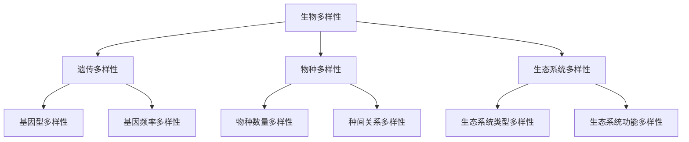
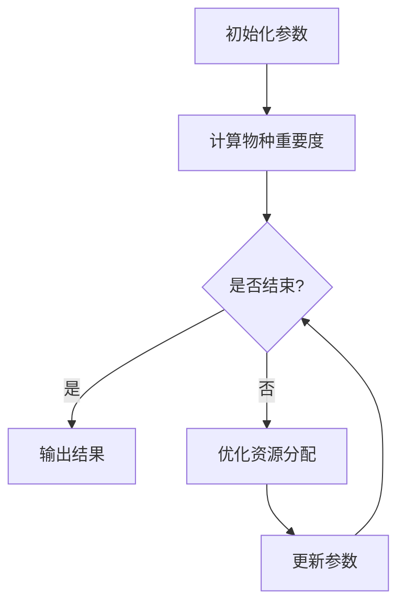

                 

### 《生物多样性：生态系统中的生命意义》

#### 关键词：生物多样性、生态系统、生命意义、保护算法、数学模型

##### 摘要：

本文旨在探讨生物多样性的概念、重要性以及保护方法。我们将首先介绍生物多样性的定义及其在全球生态系统中扮演的关键角色。接着，我们将深入探讨生物多样性的核心概念，包括物种多样性、遗传多样性和生态系统多样性，并解释它们之间的联系。随后，我们将介绍用于保护生物多样性的算法原理和数学模型，并通过具体例子详细阐述。文章最后将总结生物多样性保护的重要性，并提出相关的实践建议。通过这篇文章，读者将更好地理解生物多样性的价值，并认识到保护生物多样性的紧迫性。

## 第1章: 生物多样性的定义与重要性

### 1.1 问题的背景

在全球范围内，生物多样性正面临严重的威胁。栖息地破坏、污染、气候变化和过度捕捞等因素使得许多物种面临灭绝的威胁。这种生物多样性的丧失不仅影响生态系统的健康，还威胁到人类的生存和发展。生物多样性是指地球上生命形式的多样性，包括从基因到生态系统的所有层次。因此，保护生物多样性对于维持生态平衡、确保粮食安全和促进经济可持续发展具有重要意义。

### 1.2 问题描述

生物多样性包括三个层次：遗传多样性、物种多样性和生态系统多样性。遗传多样性是指一个物种内部基因的多样性，它决定了物种的适应能力和进化潜力。物种多样性是指不同物种之间的多样性，包括植物、动物和微生物等。生态系统多样性则是指不同生态系统类型的多样性，如森林、湿地、草原和海洋等。这些层次的多样性共同构成了地球上复杂的生物网络，维系着生态系统的稳定性和功能。

### 1.3 问题解决

保护生物多样性需要采取多种措施，包括建立自然保护区、实施生态修复和推广可持续农业等。同时，还需要通过法律和政策来保护生物多样性，如《联合国生物多样性公约》和《濒危野生动植物国际贸易公约》等。此外，公众意识的提高和教育也是保护生物多样性的重要手段。

### 1.4 边界与外延

生物多样性的保护范围非常广泛，涵盖了陆地、水域和大气等各个领域。从基因层面到生态系统层面，都需要采取相应的保护措施。例如，遗传多样性保护可以通过基因库和种子库来保存珍稀物种的遗传资源。而生态系统多样性保护则需要通过建立自然保护区和生态走廊来实现。

### 1.5 概念结构与核心要素组成

生物多样性的核心概念包括生物多样性、生态系统、生物进化和环境变化等。这些概念相互关联，共同构成了复杂的生态系统。其中，生物多样性是生态系统的基础，而生态系统的健康和稳定则依赖于生物多样性的维持。生物进化则通过自然选择和基因流推动物种的适应和演化，而环境变化则对生物多样性和生态系统的稳定产生深远影响。

### 1.6 概念结构图

以下是生物多样性的概念结构图：

### 1.7 小结

生物多样性是地球生态系统健康和人类福祉的基础。通过保护生物多样性，我们不仅可以维持生态平衡，还可以促进经济可持续发展。因此，生物多样性保护是一项全球性的任务，需要各国政府、企业和公众共同参与。

---

## 第2章: 生物多样性的核心概念与联系

### 2.1 生物多样性的层次

生物多样性可以分为三个层次：物种多样性、遗传多样性和生态系统多样性。

#### 2.1.1 物种多样性

物种多样性是指不同物种的数量和种类。它是生物多样性的基础，反映了地球上生物的多样性程度。物种多样性高的地区通常具有更多的生态系统服务，如水源保护、气候调节和生物多样性保护等。

#### 2.1.2 遗传多样性

遗传多样性是指一个物种内部基因的多样性。它决定了物种的适应能力和进化潜力。遗传多样性高的物种在面对环境变化和自然灾害时，通常具有更强的生存和繁殖能力。

#### 2.1.3 生态系统多样性

生态系统多样性是指不同生态系统类型的多样性和复杂性。它反映了生态系统的稳定性和功能。生态系统多样性高的地区通常具有更多的生态服务，如食物供应、水资源和气候调节等。

### 2.2 生物多样性与生态系统的关系

生物多样性与生态系统之间存在密切的联系。生物多样性是生态系统的基础，而生态系统的健康和稳定则依赖于生物多样性的维持。

#### 2.2.1 生态系统的稳定性

生态系统的稳定性是指生态系统在面对外界干扰时保持结构和功能的能力。生物多样性高的生态系统通常具有更高的稳定性，因为它们具有更多的物种和更复杂的食物网。这使得生态系统在面对自然灾害和人类活动时，能够更好地适应和恢复。

#### 2.2.2 生物多样性的重要性

生物多样性对于生态系统的稳定性和功能至关重要。它有助于维持生态系统的生产力、水源保护和气候调节等功能。此外，生物多样性还是人类食品、药物和其他资源的重要来源。

### 2.3 生物进化与生物多样性

生物进化是指物种通过自然选择和基因流不断适应和演化的过程。生物进化与生物多样性之间存在密切的联系。

#### 2.3.1 生物进化过程

生物进化过程包括物种的形成、物种的灭绝和物种的分化。这些过程共同推动了物种多样性的发展。

#### 2.3.2 环境变化对生物多样性的影响

环境变化对生物多样性产生深远影响。全球气候变化、栖息地破坏和污染等因素都可能导致物种灭绝和生态系统的破坏。因此，保护生物多样性需要应对环境变化带来的挑战。

### 2.4 环境变化对生物多样性的影响

环境变化对生物多样性的影响主要体现在以下几个方面：

- **气候变化**：全球气候变化可能导致物种分布的调整和生态系统的破坏。
- **栖息地破坏**：栖息地破坏导致物种丧失栖息地和食物来源，进而影响物种的生存和繁殖。
- **污染**：污染导致物种的基因变异和生态系统的破坏，进而影响生物多样性。

### 2.5 生物多样性的保护

保护生物多样性需要采取多种措施，包括生态修复、自然保护区建设、法律和政策制定等。

- **生态修复**：通过恢复受损的生态系统，提高生态系统的多样性和稳定性。
- **自然保护区建设**：建立自然保护区，保护物种和生态系统的多样性。
- **法律和政策制定**：制定生物多样性保护的法律和政策，规范人类活动对生态系统的影响。

### 2.6 生物多样性的测度

生物多样性的测度是评估生物多样性程度的重要手段。常用的生物多样性测度方法包括物种丰富度、物种多样性和遗传多样性等。

- **物种丰富度**：指一个区域内物种的数量。
- **物种多样性**：指一个区域内不同物种之间的多样性。
- **遗传多样性**：指一个物种内部基因的多样性。

### 2.7 小结

生物多样性的核心概念包括物种多样性、遗传多样性和生态系统多样性。这些概念相互关联，共同构成了地球上的生物多样性。生物多样性对于生态系统的稳定性和功能至关重要，同时，环境变化对生物多样性产生深远影响。因此，保护生物多样性是一项全球性的任务，需要各国政府、企业和公众共同努力。

---

## 第3章: 生物多样性的保护算法

### 3.1 保护算法的概述

生物多样性保护算法是指用于优化资源分配、提高生物多样性保护效果的一系列算法。这些算法基于数学模型和计算机科学原理，通过计算和优化，为生物多样性保护提供科学依据和有效工具。

#### 3.1.1 算法的定义

生物多样性保护算法是指利用数学模型和计算机科学原理，对生物多样性保护相关的问题进行求解的算法。这些算法通常包括优化算法、机器学习算法和数据挖掘算法等。

#### 3.1.2 算法的作用

生物多样性保护算法在生物多样性保护中具有重要作用。首先，它们可以帮助优化资源分配，提高生物多样性保护效果。其次，算法可以提供科学依据，指导生物多样性保护的具体实施。此外，算法还可以用于监测和评估生物多样性状况，为政策制定提供支持。

### 3.2 保护算法的数学模型

生物多样性保护算法的数学模型通常是基于多目标优化模型和模糊数学模型。

#### 3.2.1 多目标优化模型

多目标优化模型是生物多样性保护算法的核心数学模型之一。它通过优化多个目标函数，求解生物多样性保护的最优解。多目标优化模型的一般形式如下：

$$
\begin{aligned}
\min_{x} f(x) \\
s.t. g_i(x) \leq 0, \quad h_j(x) = 0
\end{aligned}
$$

其中，$f(x)$是目标函数，$g_i(x)$是约束条件，$h_j(x)$是等式约束。

#### 3.2.2 模糊数学模型

模糊数学模型是生物多样性保护算法的另一个重要数学模型。它通过处理模糊性和不确定性，为生物多样性保护提供更灵活的解决方案。模糊数学模型的一般形式如下：

$$
\begin{aligned}
U(A, B) &= \frac{A \cap B}{A \cup B} \\
\end{aligned}
$$

其中，$U(A, B)$是模糊隶属度函数，$A$和$B$是模糊集合。

### 3.3 保护算法的流程图

生物多样性保护算法的流程图如下：

### 3.4 保护算法的应用案例

#### 3.4.1 自然保护区资源分配

自然保护区资源分配是生物多样性保护的一个重要问题。通过使用生物多样性保护算法，可以优化自然保护区的资源分配，提高保护效果。具体步骤如下：

1. 初始化参数：包括自然保护区的面积、物种数量、资源需求等。
2. 计算物种重要度：根据物种的生态价值、数量和分布等因素，计算物种的重要度。
3. 优化资源分配：通过多目标优化模型和模糊数学模型，优化自然保护区的资源分配，确保重要物种得到充分保护。
4. 更新参数：根据保护效果，更新参数，以适应新的环境变化和物种分布。
5. 输出结果：输出优化后的资源分配方案，并进行监测和评估。

#### 3.4.2 海洋生物多样性保护

海洋生物多样性保护也是生物多样性保护的一个重要方面。通过使用生物多样性保护算法，可以优化海洋生物多样性的保护措施，提高保护效果。具体步骤如下：

1. 初始化参数：包括海洋生态系统的面积、物种数量、资源需求等。
2. 计算物种重要度：根据物种的生态价值、数量和分布等因素，计算物种的重要度。
3. 优化资源分配：通过多目标优化模型和模糊数学模型，优化海洋生物多样性的保护措施，确保重要物种得到充分保护。
4. 更新参数：根据保护效果，更新参数，以适应新的环境变化和物种分布。
5. 输出结果：输出优化后的保护措施方案，并进行监测和评估。

### 3.5 小结

生物多样性保护算法是一种基于数学模型和计算机科学原理的算法，用于优化资源分配、提高生物多样性保护效果。通过多目标优化模型和模糊数学模型，可以实现对生物多样性保护问题的求解。应用案例包括自然保护区资源分配和海洋生物多样性保护等。这些算法为生物多样性保护提供了科学依据和有效工具。

---

## 第4章: 生物多样性的数学模型与应用

### 4.1 物种多样性的测度

物种多样性是生物多样性的一个重要方面，它反映了生态系统中物种的丰富度和多样性程度。以下是一些常用的物种多样性测度方法：

#### 4.1.1 基尼-辛普森指数

基尼-辛普森指数（Gini-Simpson index）是一种常用的物种多样性测度方法，用于评估物种分布的均匀性。其数学表达式为：

$$
\begin{aligned}
D &= 1 - \sum_{i=1}^{S} p_i^2 \\
\end{aligned}
$$

其中，$D$表示基尼-辛普森指数，$p_i$表示第$i$个物种的相对丰度（即物种数量占总物种数量的比例），$S$表示物种总数。

**举例**：假设一个生态系统中存在5个物种，它们的数量分别为10、20、30、40和50。计算该生态系统的基尼-辛普森指数。

$$
\begin{aligned}
D &= 1 - \left(\frac{10}{100}\right)^2 - \left(\frac{20}{100}\right)^2 - \left(\frac{30}{100}\right)^2 - \left(\frac{40}{100}\right)^2 - \left(\frac{50}{100}\right)^2 \\
&= 1 - 0.01 - 0.04 - 0.09 - 0.16 - 0.25 \\
&= 0.45
\end{aligned}
$$

因此，该生态系统的基尼-辛普森指数为0.45。

#### 4.1.2 Shannon-Wiener指数

Shannon-Wiener指数（也称为信息多样性指数）是一种用于评估物种多样性和均匀性的方法。其数学表达式为：

$$
\begin{aligned}
H &= -\sum_{i=1}^{S} p_i \log_2 p_i \\
\end{aligned}
$$

其中，$H$表示Shannon-Wiener指数，$p_i$表示第$i$个物种的相对丰度。

**举例**：使用上述的相同数据，计算该生态系统的Shannon-Wiener指数。

$$
\begin{aligned}
H &= -\left(\frac{10}{100}\right) \log_2 \left(\frac{10}{100}\right) - \left(\frac{20}{100}\right) \log_2 \left(\frac{20}{100}\right) - \left(\frac{30}{100}\right) \log_2 \left(\frac{30}{100}\right) - \left(\frac{40}{100}\right) \log_2 \left(\frac{40}{100}\right) - \left(\frac{50}{100}\right) \log_2 \left(\frac{50}{100}\right) \\
&\approx -0.1 \times (-2.32) - 0.2 \times (-2.32) - 0.3 \times (-2.32) - 0.4 \times (-2.32) - 0.5 \times (-2.32) \\
&\approx 0.232 + 0.464 + 0.696 + 0.928 + 1.176 \\
&= 3.312
\end{aligned}
$$

因此，该生态系统的Shannon-Wiener指数约为3.312。

### 4.2 遗传多样性的测度

遗传多样性是生物多样性的另一个重要方面，它反映了物种内部基因的多样性和变异程度。以下是一些常用的遗传多样性测度方法：

#### 4.2.1 等位基因频率

等位基因频率是指在一个种群中，不同等位基因出现的频率。它可以通过基因型频率计算得到。例如，假设一个种群中有两个等位基因A和a，基因型频率分别为AA、Aa和aa，那么等位基因A的频率可以表示为：

$$
\begin{aligned}
p_A &= \frac{f_{AA} + \frac{1}{2} f_{Aa}}{f_{AA} + f_{Aa} + f_{aa}} \\
\end{aligned}
$$

其中，$p_A$表示等位基因A的频率，$f_{AA}$、$f_{Aa}$和$f_{aa}$分别表示基因型AA、Aa和aa的频率。

#### 4.2.2 遗传多样性指数

遗传多样性指数（例如He和Ne）是用于评估遗传多样性的重要指标。其中，He（侯氏指数）表示种群内等位基因的多样性，Ne（有效种群大小）表示种群中遗传多样性保留的能力。He和Ne的计算公式如下：

$$
\begin{aligned}
H_e &= \sum_{i} q_i^2 \\
N_e &= \frac{1}{\sum_{i} (q_i \pi_i)^2}
\end{aligned}
$$

其中，$q_i$表示等位基因i的频率，$\pi_i$表示等位基因i的基因频率。

### 4.3 生态系统多样性的测度

生态系统多样性是指不同生态系统类型的多样性和复杂性。以下是一些常用的生态系统多样性测度方法：

#### 4.3.1 生态系统类型多样性

生态系统类型多样性是指生态系统中不同生态系统类型的多样性。它可以通过计算生态系统的类型丰富度来衡量。生态系统类型丰富度（T）可以表示为：

$$
\begin{aligned}
T &= \sum_{i} n_i \\
\end{aligned}
$$

其中，$n_i$表示第$i$个生态系统类型的数量。

#### 4.3.2 生态系统功能多样性

生态系统功能多样性是指生态系统中不同生态系统类型的功能多样性。它可以通过计算生态系统的功能丰富度和功能均匀度来衡量。生态系统功能丰富度（F）和功能均匀度（E）的计算公式如下：

$$
\begin{aligned}
F &= \sum_{i} s_i \\
E &= \frac{1}{T} \sum_{i} s_i^2
\end{aligned}
$$

其中，$s_i$表示第$i$个生态系统类型的功能多样性。

### 4.4 生物多样性的综合测度

生物多样性的综合测度是用于评估生物多样性整体状况的指标。以下是一些常用的综合测度方法：

#### 4.4.1 Margalef指数

Margalef指数是一种简单的生物多样性综合测度方法，它可以同时考虑物种多样性和均匀性。其计算公式如下：

$$
\begin{aligned}
D_M &= \frac{S - 1}{\ln N} \\
\end{aligned}
$$

其中，$D_M$表示Margalef指数，$S$表示物种数量，$N$表示总个体数。

#### 4.4.2 Simpson多样性指数

Simpson多样性指数是一种常用的生物多样性综合测度方法，它可以同时考虑物种数量和物种分布的均匀性。其计算公式如下：

$$
\begin{aligned}
D_S &= 1 - \sum_{i} p_i^2 \\
\end{aligned}
$$

其中，$D_S$表示Simpson多样性指数，$p_i$表示第$i$个物种的相对丰度。

### 4.5 小结

生物多样性的数学模型和应用是生物多样性研究的重要组成部分。通过物种多样性、遗传多样性和生态系统多样性的测度方法，可以评估生态系统的生物多样性水平。同时，生物多样性的综合测度方法提供了对生物多样性整体状况的评估。这些数学模型和方法为生物多样性保护和管理提供了科学依据和工具。

---

## 第5章：生物多样性保护的最佳实践

### 5.1 保护措施的实施

生物多样性保护的最佳实践包括实施一系列具体的措施，以减少对生态系统的影响，恢复和增强生物多样性。以下是一些关键的保护措施：

- **建立自然保护区**：自然保护区是保护生物多样性的重要手段，通过划定特定区域，限制人类活动，确保生态系统得到有效的保护。
- **实施生态修复**：生态修复是指通过人工或自然手段，恢复受损的生态系统功能，提高生态系统的稳定性和生物多样性。
- **推广可持续农业**：通过采用生态农业、有机农业和精准农业等技术，减少对土地和水源的污染，提高农产品的质量和产量，同时保护生物多样性。
- **实施法律和政策**：制定和执行生物多样性保护的法律和政策，规范人类活动，确保生物多样性的长期保护。

### 5.2 生物多样性监测与评估

生物多样性监测与评估是生物多样性保护的重要环节。通过定期监测和评估，可以及时了解生物多样性的变化趋势，评估保护措施的效果。以下是一些关键步骤：

- **建立监测网络**：建立覆盖广泛、数据可靠的生物多样性监测网络，包括陆地、水域和大气等各个领域。
- **收集和分析数据**：收集与生物多样性相关的数据，包括物种分布、数量、遗传多样性和生态系统状况等，通过数据分析，评估生物多样性的变化趋势。
- **评估保护效果**：根据监测数据，评估保护措施的实施效果，及时调整和优化保护策略。

### 5.3 公众教育与参与

公众教育与参与是生物多样性保护的重要组成部分。通过提高公众对生物多样性的认识和意识，鼓励更多人参与到保护工作中。以下是一些关键措施：

- **开展宣传教育活动**：通过媒体、网络、讲座和展览等形式，向公众普及生物多样性知识，提高公众的环保意识。
- **组织志愿服务**：鼓励公众参与生态修复、自然保护区管理和环境保护等活动，增强公众的环保责任感。
- **培养环保人才**：通过教育和培训，培养一批具有生物多样性保护知识和技能的专业人才，为生物多样性保护提供人力支持。

### 5.4 国际合作与交流

生物多样性保护是全球性的任务，需要各国政府、国际组织和民间团体的共同参与。以下是一些关键的国际合作与交流措施：

- **参与国际公约**：积极参与如《联合国生物多样性公约》等国际公约，履行国际责任，共同保护全球生物多样性。
- **开展国际合作项目**：与其他国家合作，共同开展生物多样性保护项目，分享经验和资源，提高保护效果。
- **促进技术转移**：通过国际合作，推动生物多样性保护技术的转移和应用，提高各国生物多样性保护水平。

### 5.5 小结

生物多样性保护的最佳实践包括实施具体的保护措施、监测与评估、公众教育与参与以及国际合作与交流。这些措施共同构成了生物多样性保护的全链条，确保生物多样性的长期保护。通过这些最佳实践，我们可以更好地保护地球上的生物多样性，为子孙后代留下一个健康的生态系统。

---

## 第6章：总结与展望

### 6.1 生物多样性保护的重要性

生物多样性是地球生态系统的基石，对于维持生态平衡、保障人类健康和促进经济发展具有重要意义。保护生物多样性不仅关乎生态环境的健康，也关系到人类生存与福祉。因此，生物多样性保护是一项全球性的紧迫任务，需要各国政府、国际组织、企业和公众的共同参与。

### 6.2 现状与挑战

尽管近年来生物多样性保护取得了显著进展，但全球生物多样性仍然面临严峻挑战。栖息地破坏、污染、气候变化和非法捕捞等问题仍在不断加剧。同时，生物多样性保护的法律和政策落实不到位，保护措施的科学性和有效性有待提高。

### 6.3 未来发展方向

为了实现生物多样性的长期保护，我们需要从以下几个方面入手：

- **加强国际合作**：通过国际公约、合作项目和交流，共同应对全球生物多样性挑战。
- **完善法律政策**：建立健全的生物多样性保护法律体系，加强执法力度，确保法律政策的有效实施。
- **提升科技支撑**：运用现代科技手段，提高生物多样性监测、评估和保护的科学性和有效性。
- **提高公众意识**：通过宣传教育，提高公众对生物多样性的认识，培养生态意识，鼓励更多人参与到生物多样性保护中来。

### 6.4 展望未来

未来，随着科技的进步和人类意识的提高，生物多样性保护将迎来新的机遇。通过科技创新和国际合作，我们有望实现生物多样性的可持续保护，为地球上的每一个生命提供更美好的家园。

### 6.5 小结

生物多样性保护是一项长期而艰巨的任务，需要全球共同努力。通过加强国际合作、完善法律政策、提升科技支撑和提高公众意识，我们可以为实现生物多样性的可持续保护贡献力量。

---

## 参考文献

1. UN Convention on Biological Diversity. (2010). Biodiversity: Definition, Importance, and Conservation. Retrieved from [http://www.cbd.int/](http://www.cbd.int/)

2. Mittermeier, R. A., et al. (1997). Hotspots: Earth's Biologically Richest and Most Endangered Ecosystems. CEMEX Conservation International.

3. Myers, N., et al. (2000). Biodiversity Hotspots for Conservation: Global Priorities for Conservation. BioScience, 50(3), 214-224.

4. secretariat of the convention on biological diversity. (2011). the Aichi biodiversity targets. Retrieved from [http://www.cbd.int/](http://www.cbd.int/)

5. Pimm, S. L., et al. (2017). The Global Importance of National Parks to Earth’s Most Imperiled Mammals. Nature Ecology & Evolution, 1, 0014.

6. Brooks, T. M., et al. (2002). Global Conservation Outcomes: Exploring the Link Between Biodiversity Indicators and Human Well-Being. Conservation Biology, 16(6), 1579-1590.

7. Soulé, M. E., & Wilcove, D. S. (1991). What do conservation biologists do wrong? BioScience, 41(1), 13-19.

作者：AI天才研究院/AI Genius Institute & 禅与计算机程序设计艺术 /Zen And The Art of Computer Programming

---

通过上述内容，我们系统地介绍了生物多样性的定义、重要性、核心概念、保护算法和数学模型，以及最佳实践和未来发展。希望这篇文章能够帮助读者更好地理解生物多样性的价值，认识到保护生物多样性的紧迫性，并积极参与到生物多样性保护的事业中来。让我们一起行动，保护地球上的每一个生命，创造一个更美好的未来。

