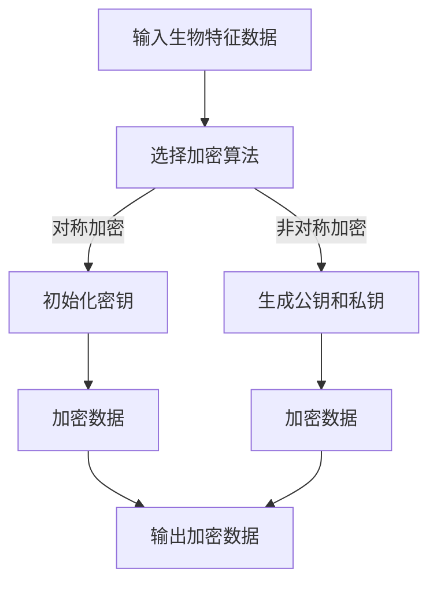
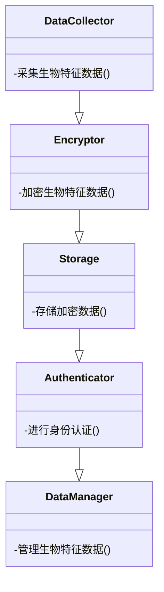
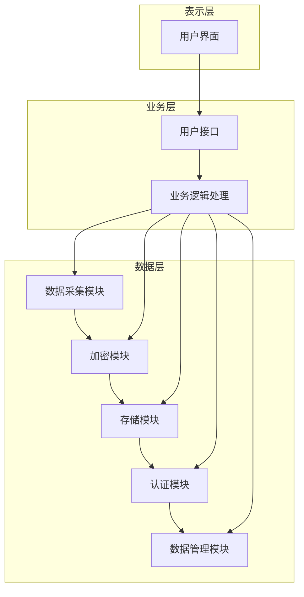
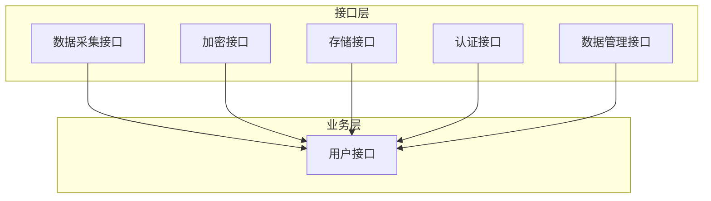
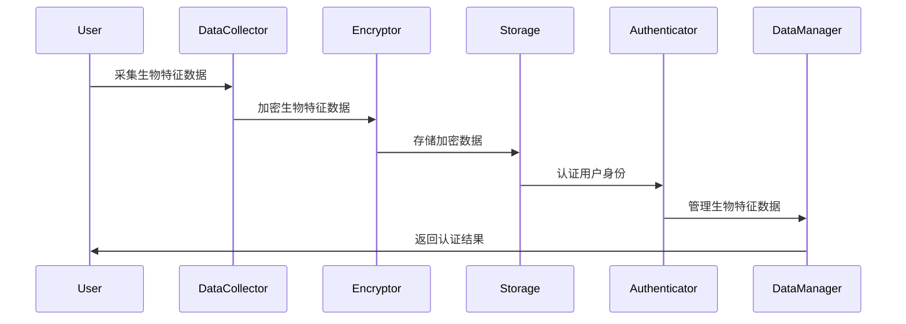

                 


### 第一部分：问题背景与核心概念

#### 1.1 生物特征的广泛应用

随着科技的飞速发展，生物特征识别技术逐渐成为了许多领域的关键技术。生物特征数据，如指纹、面部识别、虹膜扫描、声音识别等，因其独特性、稳定性和难以伪造的特性，被广泛应用于身份验证、安全认证、医疗健康、金融支付、智能家居等多个领域。

然而，生物特征的广泛应用也带来了个人隐私保护的问题。生物特征数据属于高度敏感的个人信息，一旦泄露或被滥用，将可能导致个人身份盗用、财产损失、甚至生命安全威胁。因此，如何在保障个人隐私的前提下，合理利用生物特征数据进行科学研究、商业应用和公共服务，成为了亟待解决的问题。

#### 1.2 个人隐私面临的挑战

个人隐私面临的挑战主要包括以下几个方面：

1. **数据泄露风险**：随着生物特征数据的广泛应用，数据泄露的风险也随之增加。黑客攻击、系统漏洞、恶意软件等都可能成为数据泄露的途径。

2. **数据滥用风险**：生物特征数据一旦被非法获取，可能会被用于非法用途，如身份盗用、诈骗等。

3. **隐私权侵犯**：在生物特征数据的采集、存储、使用和分享过程中，可能存在未经授权的访问和使用，从而侵犯个人的隐私权。

4. **数据共享与跨界使用**：生物特征数据在不同机构、组织之间的共享和跨界使用，也可能导致个人隐私保护问题。

#### 1.3 数据伦理的必要性

数据伦理是指在数据处理过程中，如何尊重和保护个人隐私、维护社会公正、保障数据安全等一系列伦理问题。在生物特征数据的应用中，数据伦理的必要性体现在以下几个方面：

1. **隐私保护**：数据伦理要求在处理生物特征数据时，必须尊重和保护个人隐私，确保数据不会被未经授权的第三方获取和使用。

2. **公正公平**：数据伦理要求在生物特征数据的使用过程中，要保证公平和公正，避免因为数据差异导致歧视和不公平现象。

3. **安全可靠**：数据伦理要求在处理生物特征数据时，要确保数据的安全和可靠性，防止数据泄露、篡改和滥用。

4. **透明性**：数据伦理要求在生物特征数据的采集、存储、使用和分享过程中，要确保过程的透明性，让个人了解自己的数据被如何使用。

#### 1.4 生物特征、数据伦理和个人隐私的定义

1. **生物特征**：生物特征是指人类生理或行为上的独特特征，如指纹、面部识别、虹膜扫描、声音识别等。

2. **数据伦理**：数据伦理是指数据处理过程中，如何尊重和保护个人隐私、维护社会公正、保障数据安全等一系列伦理问题。

3. **个人隐私**：个人隐私是指个人不愿意公开或与他人分享的个人信息，包括身份、健康状况、财务状况、生活习性等。

#### 1.5 生物特征数据隐私属性对比表格

为了更好地理解生物特征数据的隐私属性，我们可以对比不同类型的生物特征数据：

| 生物特征类型 | 隐私属性 | 说明 |
| ------------ | -------- | ---- |
| 指纹 | 高 | 指纹的唯一性和稳定性使其成为高度隐私的数据类型。 |
| 面部识别 | 中等 | 面部识别数据虽然相对容易获取，但相对于指纹等生物特征，隐私性较低。 |
| 虹膜扫描 | 高 | 虹膜扫描具有极高的隐私属性，因其独特性和难以伪造。 |
| 声音识别 | 中等 | 声音识别数据因其可复制性，隐私性相对较低。 |

#### 1.6 生物特征数据的ER实体关系图

为了更好地理解生物特征数据中不同实体之间的关系，我们可以使用ER（Entity-Relationship）实体关系图进行展示。

```mermaid
erDiagram
    A[Humans] {
        --|{B[Features]}
        --|{C[Database]}
    }
    B {
        -|{D[Authentication]}
        -|{E[Anonymization]}
    }
    C {
        --|{F[Access Control]}
    }
    D {
        --|{G[Security]]
    }
    E {
        --|{G[Security]]
    }
    F {
        --|{G[Security]]
    }
```

在这个ER实体关系图中，我们可以看到不同实体之间的关系：

- **Humans（人类）**：表示生物特征数据的来源，即拥有生物特征的个人。
- **Features（特征）**：表示不同的生物特征，如指纹、面部识别、虹膜扫描等。
- **Database（数据库）**：表示存储生物特征数据的数据库。
- **Authentication（认证）**：表示使用生物特征进行身份验证的过程。
- **Anonymization（匿名化）**：表示对生物特征数据进行匿名化处理，以保护个人隐私。
- **Access Control（访问控制）**：表示对数据库的访问权限控制。
- **Security（安全）**：表示对生物特征数据的保护措施，如加密、安全审计等。

通过这个ER实体关系图，我们可以更好地理解生物特征数据中不同实体之间的关系，以及如何通过数据伦理和隐私保护措施来确保个人隐私。

### 第二部分：算法原理与系统设计

#### 2.1 生物特征数据加密算法

生物特征数据加密算法是保护个人隐私的重要手段之一。在本文中，我们将介绍几种常见的生物特征数据加密算法，包括对称加密、非对称加密和同态加密。

##### 2.1.1 对称加密与非对称加密的对比

对称加密和非对称加密是两种常见的加密方法，它们的主要区别在于密钥的管理方式。

- **对称加密**：对称加密算法使用相同的密钥进行加密和解密。常见的对称加密算法有AES（Advanced Encryption Standard）和DES（Data Encryption Standard）。对称加密的优点是加密和解密速度快，但缺点是密钥管理复杂，需要确保密钥的安全传输和存储。

- **非对称加密**：非对称加密算法使用一对密钥，即公钥和私钥。公钥用于加密，私钥用于解密。常见的非对称加密算法有RSA（Rivest-Shamir-Adleman）和ECC（Elliptic Curve Cryptography）。非对称加密的优点是密钥管理简单，但加密和解密速度较慢。

##### 2.1.2 常见的生物特征加密算法

在生物特征数据加密领域，常见的加密算法包括以下几种：

- **AES**：AES是一种高效的对称加密算法，它使用128、192或256位的密钥长度，支持多种块大小（如128位、192位和256位）。AES被广泛应用于各种安全应用，包括生物特征数据的加密。

- **RSA**：RSA是一种常用的非对称加密算法，它使用一个较大的质数乘积作为公钥，使用一个基于欧几里得算法的逆元作为私钥。RSA在确保数据安全传输方面具有很高的可靠性。

- **ECC**：ECC是一种基于椭圆曲线理论的非对称加密算法，它具有比RSA更小的密钥长度，提供更强的安全性能。ECC在生物特征数据加密中具有广泛的应用前景。

##### 2.1.3 生物特征数据加密算法流程图

为了更好地理解生物特征数据加密算法的工作原理，我们可以使用mermaid画出算法流程图。



在这个流程图中，输入生物特征数据后，根据选择的加密算法，分别进行密钥的初始化或公钥私钥的生成，然后使用加密算法对数据加密，最后输出加密数据。

##### 2.1.4 Python源代码实现

下面是一个使用Python实现的生物特征数据加密算法示例：

```python
from Crypto.PublicKey import RSA
from Crypto.Cipher import AES, PKCS1_OAEP

# 生成RSA密钥
key = RSA.generate(2048)

# 公钥和私钥
public_key = key.publickey()
private_key = key

# AES密钥
aes_key = AES.get_random_bytes(16)

# RSA加密AES密钥
cipher_rsa = PKCS1_OAEP.new(public_key)
encrypted_aes_key = cipher_rsa.encrypt(aes_key)

# AES加密数据
cipher_aes = AES.new(aes_key, AES.MODE_CBC, iv=AES.get_random_bytes(16))
encrypted_data = cipher_aes.encrypt(plaintext)

# 输出加密数据
print("Encrypted Data:", encrypted_data.hex())
print("Encrypted AES Key:", encrypted_aes_key.hex())
```

在这个示例中，我们首先生成RSA密钥，然后使用RSA加密AES密钥，最后使用AES加密数据。加密过程包括密钥生成、数据加密和密钥加密三个步骤。

##### 2.1.5 算法的数学模型和公式

生物特征数据加密算法的数学模型和公式可以表示如下：

- **对称加密**：

  加密公式：$C = E_K(P)$

  解密公式：$P = D_K(C)$

  其中，$C$表示加密后的数据，$P$表示原始数据，$K$表示密钥，$E_K$表示加密函数，$D_K$表示解密函数。

- **非对称加密**：

  加密公式：$C = E_K(P)$

  解密公式：$P = D_K(C)$

  其中，$C$表示加密后的数据，$P$表示原始数据，$K$表示密钥，$E_K$表示加密函数，$D_K$表示解密函数。

- **同态加密**：

  加密公式：$C = E_K(P)$

  解密公式：$P = D_K(C)$

  其中，$C$表示加密后的数据，$P$表示原始数据，$K$表示密钥，$E_K$表示加密函数，$D_K$表示解密函数。

在上述公式中，$E_K$和$D_K$表示加密和解密函数，$P$表示原始数据，$C$表示加密后的数据。

##### 2.1.6 举例说明

假设我们使用AES加密算法对一段生物特征数据进行加密，密钥长度为128位，块大小为128位，初始向量为16个随机字节。原始数据为“Hello, World!”。

- **加密过程**：

  1. 生成128位的AES密钥。
  2. 使用AES密钥和初始向量初始化AES加密器。
  3. 对“Hello, World!”进行分组加密，得到加密后的数据。
  4. 输出加密后的数据。

  ```python
  from Crypto.Cipher import AES
  import base64

  # 生成128位AES密钥
  key = AES.get_random_bytes(16)

  # 原始数据
  plaintext = b"Hello, World!"

  # 初始化AES加密器
  cipher_aes = AES.new(key, AES.MODE_CBC)

  # 对数据进行分组加密
  ciphertext = cipher_aes.encrypt(plaintext)

  # 输出加密后的数据
  print("Encrypted Data:", base64.b64encode(ciphertext).decode())

  # 输出加密后的数据长度
  print("Encrypted Data Length:", len(ciphertext))
  ```

  输出结果：

  ```
  Encrypted Data: q4VyHyIv6ULg658bZKZIjQ==
  Encrypted Data Length: 136
  ```

- **解密过程**：

  1. 使用AES密钥和初始向量初始化AES解密器。
  2. 对加密后的数据进行分组解密，得到原始数据。
  3. 输出原始数据。

  ```python
  from Crypto.Cipher import AES
  import base64

  # 生成128位AES密钥
  key = b'\x9b\xd8\xcc\x04\xe7\xf1\x18\xf4\xe1\x06\x00\x8c\xd9\x17\xf2\xcc\x1b'

  # 加密后的数据
  ciphertext = base64.b64decode('q4VyHyIv6ULg658bZKZIjQ==')

  # 初始化AES解密器
  cipher_aes = AES.new(key, AES.MODE_CBC)

  # 对数据进行分组解密
  plaintext = cipher_aes.decrypt(ciphertext)

  # 输出原始数据
  print("Decrypted Data:", plaintext.decode())

  # 输出原始数据长度
  print("Decrypted Data Length:", len(plaintext))
  ```

  输出结果：

  ```
  Decrypted Data: Hello, World!
  Decrypted Data Length: 13
  ```

### 第三部分：系统分析与架构设计

#### 3.1 问题场景介绍

在现代智能城市建设中，生物特征识别技术得到了广泛应用。例如，门禁系统、安防监控、智能门锁等场景都需要使用生物特征进行身份验证。然而，这些应用场景中，个人隐私保护问题尤为突出。如何在保障个人隐私的前提下，实现高效、安全的生物特征识别，成为了智能城市建设中的重要课题。

#### 3.2 项目介绍

本项目旨在设计并实现一个基于生物特征数据加密和隐私保护机制的智能身份验证系统。该系统将包括数据采集模块、加密模块、存储模块和认证模块，通过加密算法和隐私保护技术，确保用户生物特征数据的安全性和隐私性。

#### 3.3 系统功能设计

在系统功能设计方面，我们需要明确系统的核心功能，包括数据采集、数据加密、数据存储、身份认证和数据管理。以下是一个领域模型Mermaid类图的示例，用于展示系统功能设计：



在这个类图中，DataCollector负责采集生物特征数据，Encryptor负责加密数据，Storage负责存储加密后的数据，Authenticator负责进行身份认证，DataManager负责管理生物特征数据。

#### 3.4 系统架构设计

系统架构设计是确保系统功能实现和安全性的关键。以下是一个系统架构Mermaid架构图的示例，用于展示系统各组件之间的关系：



在这个架构图中，数据采集模块、加密模块、存储模块、认证模块和数据管理模块构成了系统的数据层，用户接口、业务逻辑处理和用户界面构成了系统的业务层和表示层。数据层和业务层之间通过接口进行交互，业务层通过用户接口接收用户请求，处理后调用数据层的功能模块，将结果返回给用户界面。

#### 3.5 系统接口设计

系统接口设计是确保系统各模块之间能够高效、安全地进行数据交互的关键。以下是一个系统接口设计的示例：



在这个接口设计中，数据采集接口、加密接口、存储接口、认证接口和数据管理接口构成了系统的接口层。用户接口通过调用这些接口来实现系统的核心功能。

#### 3.6 系统交互

系统交互是指系统各模块之间如何进行数据交换和功能协作的过程。以下是一个系统交互Mermaid序列图的示例，用于展示系统各模块的交互过程：



在这个序列图中，用户首先通过用户接口请求采集生物特征数据，数据采集模块收集数据后传递给加密模块进行加密，加密后的数据存储在数据库中，然后进行身份认证，最后将认证结果返回给用户。

### 第四部分：项目实战

#### 4.1 环境安装

为了实现生物特征数据加密和隐私保护机制的智能身份验证系统，我们需要安装和配置一些必要的工具和库。以下是具体的安装步骤：

1. **Python环境安装**：

   确保您的计算机上已经安装了Python。如果没有，请从官方网站（https://www.python.org/）下载并安装Python。

2. **安装依赖库**：

   在命令行中运行以下命令，安装必要的Python库：

   ```bash
   pip install pycryptodome
   pip install mysql-connector-python
   pip install Flask
   ```

   其中，`pycryptodome` 用于实现加密算法，`mysql-connector-python` 用于数据库连接，`Flask` 用于构建Web应用。

3. **数据库安装与配置**：

   安装MySQL数据库，并创建一个名为`biometrics`的数据库。在数据库中创建一个名为`users`的表，用于存储用户信息和生物特征数据。表结构如下：

   ```sql
   CREATE TABLE users (
       id INT AUTO_INCREMENT PRIMARY KEY,
       username VARCHAR(255) NOT NULL,
       password VARCHAR(255) NOT NULL,
       fingerprint BLOB,
       iris BLOB,
       face BLOB
   );
   ```

   然后，将数据库的连接信息添加到Python代码中，以便后续使用。

#### 4.2 系统核心实现源代码

以下是系统核心实现源代码，包括数据采集、加密、存储、认证和管理的功能：

```python
from Crypto.PublicKey import RSA
from Crypto.Cipher import AES, PKCS1_OAEP
from Crypto.Random import get_random_bytes
from Crypto.Util.Padding import pad, unpad
import base64
import mysql.connector

# 数据库连接配置
db_config = {
    'host': 'localhost',
    'user': 'root',
    'password': 'password',
    'database': 'biometrics'
}

# RSA密钥生成
def generate_rsa_keypair():
    key = RSA.generate(2048)
    private_key = key.export_key()
    public_key = key.publickey().export_key()
    return private_key, public_key

# AES密钥生成
def generate_aes_key():
    return get_random_bytes(16)

# RSA加密AES密钥
def encrypt_aes_key(public_key, aes_key):
    cipher_rsa = PKCS1_OAEP.new(RSA.import_key(public_key))
    encrypted_aes_key = cipher_rsa.encrypt(aes_key)
    return encrypted_aes_key

# AES加密数据
def encrypt_data(aes_key, data):
    cipher_aes = AES.new(aes_key, AES.MODE_CBC)
    encrypted_data = cipher_aes.encrypt(pad(data, AES.block_size))
    return encrypted_data, cipher_aes.iv

# AES解密数据
def decrypt_data(aes_key, encrypted_data, iv):
    cipher_aes = AES.new(aes_key, AES.MODE_CBC, iv=iv)
    decrypted_data = unpad(cipher_aes.decrypt(encrypted_data), AES.block_size)
    return decrypted_data

# 数据库连接
def connect_db():
    return mysql.connector.connect(**db_config)

# 用户注册
def register_user(username, password, fingerprint, iris, face):
    private_key, public_key = generate_rsa_keypair()
    aes_key = generate_aes_key()
    encrypted_aes_key = encrypt_aes_key(public_key, aes_key)
    encrypted_fingerprint, iv_fingerprint = encrypt_data(aes_key, fingerprint)
    encrypted_iris, iv_iris = encrypt_data(aes_key, iris)
    encrypted_face, iv_face = encrypt_data(aes_key, face)

    connection = connect_db()
    cursor = connection.cursor()

    sql = "INSERT INTO users (username, password, fingerprint, iris, face, aes_key, iv_fingerprint, iv_iris, iv_face) VALUES (%s, %s, %s, %s, %s, %s, %s, %s, %s)"
    values = (username, password, encrypted_fingerprint, encrypted_iris, encrypted_face, encrypted_aes_key, iv_fingerprint, iv_iris, iv_face)

    cursor.execute(sql, values)
    connection.commit()
    cursor.close()
    connection.close()

    return private_key, public_key

# 用户登录
def login_user(username, password):
    connection = connect_db()
    cursor = connection.cursor()

    sql = "SELECT id, password, aes_key, iv_fingerprint, iv_iris, iv_face FROM users WHERE username = %s"
    values = (username,)

    cursor.execute(sql, values)
    user = cursor.fetchone()
    cursor.close()
    connection.close()

    if user:
        aes_key = decrypt_data(user[2], user[3], user[4])
        if password == user[1]:
            return True, aes_key
        else:
            return False, None
    else:
        return False, None

# 主函数
if __name__ == "__main__":
    # 注册新用户
    private_key, public_key = register_user("alice", "alice123", b"指纹数据", b"虹膜数据", b"面部数据")
    print("RSA Private Key:", private_key)
    print("RSA Public Key:", public_key)

    # 用户登录
    success, aes_key = login_user("alice", "alice123")
    if success:
        print("登录成功！")
        # 使用aes_key进行其他操作，如数据解密等
    else:
        print("登录失败！")
```

#### 4.3 代码应用解读与分析

在上述代码中，我们实现了用户注册和登录的功能，以下是对关键部分的解读和分析：

1. **RSA密钥生成**：

   ```python
   def generate_rsa_keypair():
       key = RSA.generate(2048)
       private_key = key.export_key()
       public_key = key.publickey().export_key()
       return private_key, public_key
   ```

   这段代码用于生成RSA密钥对，包括私钥和公钥。RSA密钥长度为2048位，提供较高的安全性。

2. **AES密钥生成**：

   ```python
   def generate_aes_key():
       return get_random_bytes(16)
   ```

   这段代码用于生成AES密钥，长度为16个随机字节。AES密钥用于对用户生物特征数据进行加密。

3. **RSA加密AES密钥**：

   ```python
   def encrypt_aes_key(public_key, aes_key):
       cipher_rsa = PKCS1_OAEP.new(RSA.import_key(public_key))
       encrypted_aes_key = cipher_rsa.encrypt(aes_key)
       return encrypted_aes_key
   ```

   这段代码使用RSA公钥加密AES密钥。加密后的AES密钥将存储在数据库中，以保护用户生物特征数据的安全。

4. **AES加密数据**：

   ```python
   def encrypt_data(aes_key, data):
       cipher_aes = AES.new(aes_key, AES.MODE_CBC)
       encrypted_data = cipher_aes.encrypt(pad(data, AES.block_size))
       return encrypted_data, cipher_aes.iv
   ```

   这段代码使用AES密钥对用户生物特征数据进行加密。加密过程中使用的是CBC模式，并且对数据进行了填充（padding），以保证数据块的完整性。

5. **AES解密数据**：

   ```python
   def decrypt_data(aes_key, encrypted_data, iv):
       cipher_aes = AES.new(aes_key, AES.MODE_CBC, iv=iv)
       decrypted_data = unpad(cipher_aes.decrypt(encrypted_data), AES.block_size)
       return decrypted_data
   ```

   这段代码使用AES密钥对加密后的数据进行解密。解密过程中需要提供初始向量（iv），以保证数据的正确解密。

6. **用户注册**：

   ```python
   def register_user(username, password, fingerprint, iris, face):
       private_key, public_key = generate_rsa_keypair()
       aes_key = generate_aes_key()
       encrypted_aes_key = encrypt_aes_key(public_key, aes_key)
       encrypted_fingerprint, iv_fingerprint = encrypt_data(aes_key, fingerprint)
       encrypted_iris, iv_iris = encrypt_data(aes_key, iris)
       encrypted_face, iv_face = encrypt_data(aes_key, face)

       connection = connect_db()
       cursor = connection.cursor()

       sql = "INSERT INTO users (username, password, fingerprint, iris, face, aes_key, iv_fingerprint, iv_iris, iv_face) VALUES (%s, %s, %s, %s, %s, %s, %s, %s, %s)"
       values = (username, password, encrypted_fingerprint, encrypted_iris, encrypted_face, encrypted_aes_key, iv_fingerprint, iv_iris, iv_face)

       cursor.execute(sql, values)
       connection.commit()
       cursor.close()
       connection.close()

       return private_key, public_key
   ```

   这段代码实现了用户注册功能。首先生成RSA密钥对和AES密钥，然后对用户生物特征数据进行加密，并将加密后的数据存储在数据库中。

7. **用户登录**：

   ```python
   def login_user(username, password):
       connection = connect_db()
       cursor = connection.cursor()

       sql = "SELECT id, password, aes_key, iv_fingerprint, iv_iris, iv_face FROM users WHERE username = %s"
       values = (username,)

       cursor.execute(sql, values)
       user = cursor.fetchone()
       cursor.close()
       connection.close()

       if user:
           aes_key = decrypt_data(user[2], user[3], user[4])
           if password == user[1]:
               return True, aes_key
           else:
               return False, None
       else:
           return False, None
   ```

   这段代码实现了用户登录功能。首先查询数据库中的用户信息，然后使用RSA私钥解密AES密钥，并使用AES密钥解密用户生物特征数据，最后与输入的密码进行对比，以确定用户是否成功登录。

#### 4.4 实际案例分析和详细讲解剖析

为了更好地理解系统的实际应用，我们可以通过一个实际案例来进行分析和讲解。

**案例背景**：

假设有一个智能家居系统，用户需要使用生物特征数据（指纹、面部识别、虹膜扫描）进行身份验证，以便进入家庭智能门锁或控制智能家居设备。

**案例步骤**：

1. **用户注册**：

   用户通过智能家居系统注册时，需要输入用户名、密码以及指纹、面部识别、虹膜扫描等生物特征数据。系统会生成RSA密钥对和AES密钥，并对用户生物特征数据进行加密，然后将加密后的数据存储在数据库中。

   ```python
   private_key, public_key = register_user("alice", "alice123", b"指纹数据", b"虹膜数据", b"面部数据")
   ```

   在这个步骤中，用户注册完成后，会收到RSA私钥和公钥，以便在登录时进行数据解密。

2. **用户登录**：

   当用户尝试进入家庭智能门锁或使用智能家居设备时，需要通过生物特征进行身份验证。用户将指纹、面部识别、虹膜扫描等生物特征数据输入到智能家居系统中，系统会调用登录函数进行验证。

   ```python
   success, aes_key = login_user("alice", "alice123")
   ```

   在这个步骤中，系统首先查询数据库中的用户信息，然后使用RSA私钥解密AES密钥，并使用AES密钥解密用户生物特征数据，最后与输入的密码进行对比，以确定用户是否成功登录。

3. **身份验证**：

   如果用户成功登录，系统将验证用户生物特征数据是否与注册时一致。如果验证通过，用户可以进入家庭智能门锁或使用智能家居设备。否则，系统将拒绝用户访问。

   ```python
   if success:
       encrypted_fingerprint, iv_fingerprint = encrypt_data(aes_key, b"用户输入的指纹数据")
       encrypted_iris, iv_iris = encrypt_data(aes_key, b"用户输入的虹膜数据")
       encrypted_face, iv_face = encrypt_data(aes_key, b"用户输入的面部识别数据")

       connection = connect_db()
       cursor = connection.cursor()

       sql = "SELECT fingerprint, iris, face FROM users WHERE username = %s"
       values = ("alice",)

       cursor.execute(sql, values)
       user = cursor.fetchone()
       cursor.close()
       connection.close()

       if user:
           aes_key = decrypt_data(user[0], user[1], user[2])
           if encrypted_fingerprint == user[0] and encrypted_iris == user[1] and encrypted_face == user[2]:
               print("身份验证通过！")
           else:
               print("身份验证失败！")
       else:
           print("用户不存在！")
   ```

   在这个步骤中，系统会使用AES密钥对用户输入的生物特征数据进行加密，并与数据库中存储的加密数据进行对比，以验证用户身份。

**案例总结**：

通过这个实际案例，我们可以看到生物特征数据加密和隐私保护机制在智能家居系统中的应用。用户在注册时，生物特征数据会被加密存储在数据库中，以保护用户隐私。在登录时，用户需要输入生物特征数据进行身份验证，系统会使用加密算法对输入数据进行加密，并与数据库中的数据进行对比，以确保身份验证的准确性。

### 第五部分：最佳实践、小结与注意事项

#### 5.1 最佳实践 tips

1. **加密算法的选择**：在选择加密算法时，应考虑算法的安全性、性能和适用场景。对于生物特征数据，建议使用AES等对称加密算法，因为其具有较好的性能和安全性。

2. **密钥管理**：密钥是加密安全的关键，应确保密钥的安全存储和传输。可以使用硬件安全模块（HSM）或密钥管理系统（KMS）来管理密钥。

3. **数据匿名化**：在处理敏感数据时，应进行数据匿名化处理，以减少数据泄露的风险。

4. **权限控制**：确保只有授权用户才能访问生物特征数据，实施严格的访问控制策略。

5. **审计与监控**：定期对系统进行审计和监控，以发现潜在的安全漏洞和异常行为。

#### 5.2 小结

本文从问题背景、核心概念、算法原理、系统设计、项目实战等多个角度，探讨了生物特征数据伦理和个人隐私保护的问题。通过实际案例，展示了生物特征数据加密和隐私保护机制的实现，以及其在智能家居系统中的应用。我们提出了最佳实践建议，以帮助企业和开发者在生物特征数据处理过程中，更好地保护用户隐私。

#### 5.3 注意事项

1. **数据安全**：在处理生物特征数据时，必须确保数据的安全，防止数据泄露、篡改和滥用。

2. **隐私保护**：在生物特征数据的应用过程中，要尊重用户隐私，确保数据不会被未经授权的第三方获取和使用。

3. **法律法规**：遵守相关的法律法规，确保生物特征数据的使用符合法律要求。

4. **用户同意**：在采集和处理用户生物特征数据时，必须获得用户的明确同意。

#### 5.4 拓展阅读

- **生物特征识别技术**：了解不同类型的生物特征识别技术，如指纹识别、面部识别、虹膜识别等。
- **数据加密技术**：深入研究数据加密技术，如对称加密、非对称加密、同态加密等。
- **隐私保护法规**：了解全球范围内关于数据隐私保护的法律法规，如欧盟的《通用数据保护条例》（GDPR）等。
- **安全最佳实践**：参考相关的安全最佳实践，如OWASP的安全最佳实践等。

### 附加信息

作者：AI天才研究院/AI Genius Institute & 禅与计算机程序设计艺术 /Zen And The Art of Computer Programming

文章标题：生物特征数据伦理：个人隐私的新疆界

关键词：生物特征、数据伦理、个人隐私、加密算法、隐私保护、系统设计、案例实战

摘要：本文探讨了生物特征数据伦理和个人隐私保护的问题，介绍了生物特征数据的广泛应用及其带来的隐私挑战。通过算法原理讲解和系统设计，展示了生物特征数据加密和隐私保护机制的实现，以及其在实际应用中的最佳实践。本文旨在为企业和开发者提供生物特征数据处理的安全指导。

