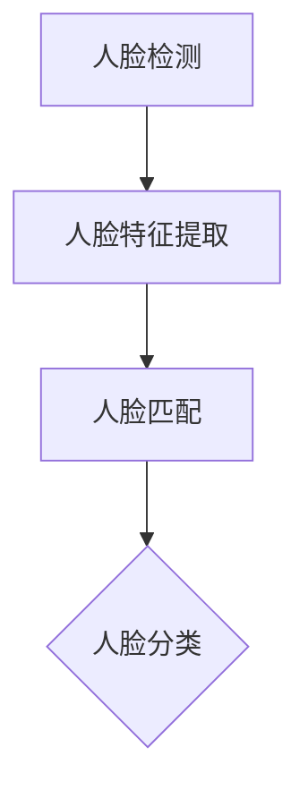
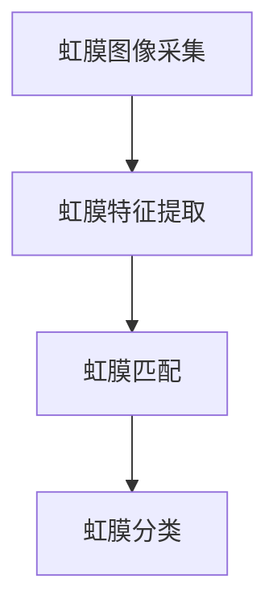

                 

### 引言

在当今信息技术飞速发展的时代，生物特征识别（Biometric Recognition）技术作为一项前沿技术，已经在各个领域中得到了广泛应用。生物特征识别技术通过利用人体独特的生理或行为特征（如指纹、面部识别、虹膜等），来进行身份认证和安全控制。随着技术的不断进步和应用的深入，生物特征识别技术不仅在提升安全性和便利性方面表现出色，同时也带来了许多新的伦理困境和挑战。

### 问题的背景与核心概念

**1.1.1 问题背景**

随着互联网和智能设备的普及，个人隐私和数据安全变得愈发重要。生物特征识别技术作为一种高级的身份认证手段，被广泛应用于金融、医疗、教育、交通等多个领域。然而，这项技术也带来了隐私权、数据安全、非法使用和社会歧视等一系列伦理问题。例如，生物特征数据的泄露可能导致个人身份的严重侵犯，而技术的不公平使用可能会加剧社会不平等。

**1.1.2 核心概念**

- **生物特征识别**：指通过检测和自动识别个人的生理或行为特征来进行个人身份验证的技术。
- **身份认证**：确认用户身份的过程，确保只有授权用户可以访问受保护的资源。
- **隐私权**：个人对其个人信息和行为的控制权。
- **数据安全**：确保生物特征数据在采集、存储、传输和使用过程中的保密性和完整性。

**1.1.3 边界与外延**

生物特征识别技术不仅涉及技术的本身，还涉及到法律、伦理和社会等多个层面。其边界包括但不限于技术实现的可行性、数据保护的法律框架、用户隐私的保护措施等。而外延则包括各种应用场景下的实际操作和挑战，如技术滥用、隐私泄露、数据跨境流动等。

**1.1.4 概念结构与核心要素组成**

生物特征识别技术由以下几个核心要素组成：

- **生物特征数据采集**：通过传感器或其他设备收集用户的生物特征数据。
- **特征提取**：从原始生物特征数据中提取可识别的特征。
- **匹配与识别**：将提取的特征与存储在数据库中的数据进行匹配，以确认身份。
- **安全与隐私保护**：确保生物特征数据的保密性和完整性。

这些要素相互关联，共同构成了一个完整的生物特征识别系统。

### 总结

在接下来的章节中，我们将对生物特征识别技术的具体内容进行详细探讨，包括其技术概述、身份认证中的伦理困境、法律与政策框架、实施挑战以及未来发展趋势等。希望通过这些讨论，能够帮助读者全面了解生物特征识别技术，并对其潜在的伦理困境有所思考。

---

**文章关键词**：生物特征识别，身份认证，伦理困境，隐私权，数据安全

**摘要**：本文探讨了生物特征识别技术在身份认证中的应用及其带来的伦理困境。通过对隐私权、数据安全、非法使用和社会歧视等问题的分析，文章提出了相关的法律与政策框架，并探讨了未来的发展趋势和解决方案。

---

## 第2章：生物特征识别技术概述

### 2.1.1 生物特征识别的定义

生物特征识别是一种通过检测和自动识别个人的生理或行为特征来进行身份验证的技术。这些特征是独一无二的，无法被他人模仿或复制，如指纹、面部识别、虹膜、掌纹等。生物特征识别技术利用这些独特的生物标志，将个人与身份信息关联起来，从而实现高度安全且便捷的身份认证。

**核心概念原理**：
生物特征识别技术的基本原理包括以下几个步骤：

1. **生物特征数据采集**：通过传感器或其他设备收集用户的生物特征数据，如指纹图像、面部图像或虹膜图像。
2. **特征提取**：从原始生物特征数据中提取可识别的特征点或模式，如指纹的脊线、面部特征点、虹膜的模式。
3. **特征匹配**：将提取的特征与预先存储在数据库中的特征进行匹配，以确认用户的身份。
4. **身份认证**：根据匹配结果，判断用户是否是合法的身份持有者。

**概念属性特征对比表格**：

| 特征类型 | 描述 | 适用场景 | 优点 | 缺点 |
| --- | --- | --- | --- | --- |
| 指纹识别 | 基于指纹脊线的模式识别 | 金融、门禁、手机解锁 | 高准确度，广泛使用 | 无法防止复制，易受环境因素影响 |
| 面部识别 | 基于面部特征的识别 | 安全监控、身份验证、人脸支付 | 便捷，非接触式 | 易受光线和角度影响，易被伪造 |
| 虹膜识别 | 基于虹膜纹理的识别 | 安全级别要求高的场所 | 极高准确度，难以伪造 | 成本高，设备要求高，对环境要求严格 |

**ER实体关系图架构**：

```mermaid
erDiagram
    BiometricData --> User
    FeatureExtraction --> BiometricData
    FeatureMatching --> FeatureExtraction
    Authentication --> FeatureMatching

    User ||--|{ BiometricData }
    BiometricData ||--|{ FeatureExtraction }
    FeatureExtraction ||--|{ FeatureMatching }
    FeatureMatching ||--|{ Authentication }
```

### 2.1.2 生物特征识别的技术分类

生物特征识别技术主要可以分为以下几类：

1. **生理特征**：包括指纹、掌纹、虹膜、视网膜等，这些特征与个人的生理结构有关，具有高度的个体差异。
2. **行为特征**：包括签名、语音、步态等，这些特征与个人的行为习惯相关，可以用于行为识别和身份验证。
3. **多模态生物特征**：结合多种生物特征进行识别，以提高系统的准确性和可靠性。

**核心概念属性特征对比表格**：

| 特征类型 | 描述 | 适用场景 | 优点 | 缺点 |
| --- | --- | --- | --- | --- |
| 单一生物特征 | 只使用一种生物特征进行识别 | 日常门禁、手机解锁 | 快速、成本低 | 可被伪造或模仿 |
| 多模态生物特征 | 结合多种生物特征进行识别 | 高安全要求场所 | 高准确度、难以伪造 | 成本高、设备复杂 |

**ER实体关系图架构**：

```mermaid
erDiagram
    BiometricFeature1 --> BiometricFeature2
    BiometricFeature2 --> BiometricFeature3
    MultiModalFeature --> BiometricFeature1
    MultiModalFeature --> BiometricFeature2
    MultiModalFeature --> BiometricFeature3

    BiometricFeature1 ||--|{ MultiModalFeature }
    BiometricFeature2 ||--|{ MultiModalFeature }
    BiometricFeature3 ||--|{ MultiModalFeature }
```

### 2.1.3 生物特征识别的应用领域

生物特征识别技术因其高度安全性和便捷性，已经在多个领域得到广泛应用：

1. **金融领域**：如银行、保险、证券等，用于客户身份验证、交易授权等。
2. **安全领域**：如公安、边防、海关等，用于人员身份识别和安全管理。
3. **医疗领域**：如医院、诊所等，用于患者身份识别、药品管理、病历查询等。
4. **交通领域**：如地铁、机场、高速公路等，用于乘客身份验证、安检等。
5. **智能家居**：如门锁、智能音箱等，用于家庭安全和便捷生活。

**核心概念属性特征对比表格**：

| 应用领域 | 描述 | 适用场景 | 优点 | 缺点 |
| --- | --- | --- | --- | --- |
| 金融领域 | 用于金融交易和身份验证 | 银行、证券、保险 | 高安全、高效率 | 可能涉及隐私问题 |
| 安全领域 | 用于人员身份识别和安全管理 | 公安、边防、海关 | 高安全、高效率 | 需要高成本设备 |
| 医疗领域 | 用于患者身份识别和管理 | 医院、诊所、药店 | 提高服务质量、安全 | 可能涉及患者隐私 |
| 交通领域 | 用于乘客身份验证和安检 | 地铁、机场、高速公路 | 提高安全性、便捷性 | 需要大量设备和维护成本 |
| 智能家居 | 用于家庭安全和便捷生活 | 门锁、智能音箱、智能灯泡 | 提高生活质量、便捷性 | 需要一定的技术门槛 |

通过上述分类和对比，我们可以更清晰地了解生物特征识别技术的定义、分类和应用领域，为后续章节的深入探讨奠定基础。

### 第3章：身份认证中的伦理困境

随着生物特征识别技术在各个领域的广泛应用，其带来的伦理困境也越来越受到关注。以下将详细探讨隐私权、数据安全问题以及非法使用和社会歧视问题。

**3.1.1 隐私权问题**

生物特征识别技术本质上是一种收集和存储个人生物特征数据的技术，因此隐私权问题成为其应用中最为显著的伦理困境之一。

- **数据收集**：在生物特征识别过程中，需要收集用户的生物特征数据，如指纹、面部图像、虹膜等。这一过程本身涉及对个人隐私的侵犯，因为生物特征数据被认为是高度敏感的信息。
- **数据存储**：一旦生物特征数据被收集，就需要进行存储，以确保在需要时可以快速检索。然而，数据存储的安全性和保密性难以保证，一旦数据泄露，将导致严重隐私侵犯。
- **数据滥用**：生物特征数据一旦被非法获取或滥用，将对个人造成不可逆的损害，因为生物特征数据无法像密码或身份验证码那样被更改或撤销。

**核心概念原理**：
隐私权的保护涉及到以下几个方面：

1. **知情同意**：在收集用户生物特征数据之前，必须获得用户的明确同意，并告知他们数据将被用于何种目的。
2. **数据安全**：确保收集、存储和传输过程中的数据安全，采用加密、访问控制等技术手段保护数据不被未授权访问。
3. **数据匿名化**：在必要时对生物特征数据进行匿名化处理，以减少对个人隐私的侵犯。

**概念属性特征对比表格**：

| 保护措施 | 描述 | 优点 | 缺点 |
| --- | --- | --- | --- |
| 知情同意 | 用户明确同意数据收集和使用 | 提高用户信任度 | 需要用户理解复杂协议 |
| 数据安全 | 采用加密、访问控制等手段保护数据 | 提高数据安全性 | 需要高成本的技术和设备 |
| 数据匿名化 | 对生物特征数据进行匿名化处理 | 减少隐私侵犯风险 | 可能影响识别准确性 |

**ER实体关系图架构**：

```mermaid
erDiagram
    DataCollection --> PrivacyRight
    DataStorage --> PrivacyRight
    DataUsage --> PrivacyRight

    PrivacyRight ||--|{ DataCollection }
    PrivacyRight ||--|{ DataStorage }
    PrivacyRight ||--|{ DataUsage }
```

**3.1.2 数据安全问题**

生物特征识别技术的另一个关键伦理困境是数据安全问题。生物特征数据一旦泄露，将导致严重的安全威胁，因为生物特征数据与个人的身份紧密相关，无法像密码那样被更改或撤销。

- **数据泄露风险**：在数据收集、存储和传输过程中，生物特征数据可能被未授权的个人或组织获取。数据泄露的途径包括网络攻击、内部泄露、设备丢失等。
- **数据完整性**：确保生物特征数据在存储和传输过程中的完整性，防止数据被篡改或破坏。
- **数据隐私保护**：在数据收集和存储过程中，必须确保个人隐私不被泄露，避免数据被用于非法目的。

**核心概念原理**：
数据安全保护涉及到以下几个方面：

1. **数据加密**：在数据传输和存储过程中使用加密技术，确保数据在传输过程中不被窃取或篡改。
2. **访问控制**：通过权限管理，确保只有授权用户可以访问生物特征数据。
3. **网络安全**：加强网络安全措施，防止网络攻击和数据泄露。

**概念属性特征对比表格**：

| 保护措施 | 描述 | 优点 | 缺点 |
| --- | --- | --- | --- |
| 数据加密 | 采用加密技术保护数据 | 提高数据安全性 | 需要额外的计算资源 |
| 访问控制 | 实施权限管理 | 提高数据安全性 | 需要复杂的权限配置 |
| 网络安全 | 加强网络安全措施 | 提高数据安全性 | 需要定期更新和维护 |

**ER实体关系图架构**：

```mermaid
erDiagram
    DataEncryption --> DataSecurity
    AccessControl --> DataSecurity
    NetworkSecurity --> DataSecurity

    DataSecurity ||--|{ DataEncryption }
    DataSecurity ||--|{ AccessControl }
    DataSecurity ||--|{ NetworkSecurity }
```

**3.1.3 非法使用问题**

生物特征识别技术虽然提供了高度安全的身份认证手段，但也可能被用于非法目的。非法使用生物特征识别技术可能导致以下问题：

- **身份盗用**：通过非法获取他人的生物特征数据，冒用他人身份进行非法活动。
- **恶意攻击**：利用生物特征识别技术的漏洞进行网络攻击或入侵他人系统。
- **隐私侵犯**：非法获取他人的生物特征数据，用于侵犯个人隐私。

**核心概念原理**：
防止非法使用问题涉及到以下几个方面：

1. **技术防护**：通过加密、访问控制等技术手段，防止生物特征数据被非法使用。
2. **法律法规**：建立健全相关法律法规，对非法使用生物特征识别技术的行为进行严厉打击。
3. **公众教育**：加强公众对生物特征识别技术的了解，提高自我保护意识。

**概念属性特征对比表格**：

| 防范措施 | 描述 | 优点 | 缺点 |
| --- | --- | --- | --- |
| 技术防护 | 采用加密、访问控制等手段 | 提高数据安全性 | 需要高成本的技术和设备 |
| 法律法规 | 建立健全相关法律法规 | 提高违法成本 | 需要不断完善和更新 |
| 公众教育 | 加强公众教育，提高自我保护意识 | 提高公众意识 | 需要长期持续的努力 |

**ER实体关系图架构**：

```mermaid
erDiagram
    TechnicalProtection --> IllegalUsePrevention
    LegalRegulation --> IllegalUsePrevention
    PublicEducation --> IllegalUsePrevention

    IllegalUsePrevention ||--|{ TechnicalProtection }
    IllegalUsePrevention ||--|{ LegalRegulation }
    IllegalUsePrevention ||--|{ PublicEducation }
```

**3.1.4 社会歧视问题**

生物特征识别技术在实际应用过程中，也可能带来社会歧视问题。由于生物特征识别技术依赖个体的生理或行为特征，因此在某些情况下，可能会对特定群体产生不公平待遇。

- **种族歧视**：不同种族之间在生物特征上可能存在差异，这可能导致某些种族在识别过程中被不公平对待。
- **性别歧视**：女性在生物特征识别（如指纹识别、面部识别）中可能面临更高的识别错误率。
- **年龄歧视**：随着年龄增长，生物特征可能发生变化，导致老年人识别错误率增加。

**核心概念原理**：
解决社会歧视问题需要从以下几个方面入手：

1. **算法公平性**：优化生物特征识别算法，减少对不同群体的识别误差。
2. **多样性培训**：在算法训练数据中增加多样性的样本，以避免算法偏见。
3. **法律保护**：制定相关法律法规，禁止在生物特征识别中使用可能导致歧视的算法。

**概念属性特征对比表格**：

| 解决措施 | 描述 | 优点 | 缺点 |
| --- | --- | --- | --- |
| 算法公平性 | 优化算法减少识别误差 | 提高识别准确性 | 需要大量数据和计算资源 |
| 多样性培训 | 增加训练数据多样性 | 减少算法偏见 | 需要长期努力 |
| 法律保护 | 制定相关法律法规 | 提高法律意识 | 需要不断完善 |

**ER实体关系图架构**：

```mermaid
erDiagram
    AlgorithmFairness --> SocialDiscriminationSolution
    DiversityTraining --> SocialDiscriminationSolution
    LegalProtection --> SocialDiscriminationSolution

    SocialDiscriminationSolution ||--|{ AlgorithmFairness }
    SocialDiscriminationSolution ||--|{ DiversityTraining }
    SocialDiscriminationSolution ||--|{ LegalProtection }
```

通过上述分析，我们可以看到，生物特征识别技术在身份认证中带来了许多伦理困境。这些问题不仅涉及到技术本身，还涉及到法律、伦理和社会等多个层面。只有在解决这些问题的基础上，生物特征识别技术才能在保障安全和隐私的前提下，更好地服务于社会。

### 第4章：法律与政策框架

随着生物特征识别技术的广泛应用，各国纷纷制定了相关法律与政策框架，以规范这一技术的使用，保障个人隐私和数据安全。以下将详细探讨相关法律法规的概述、政策引导与实施以及国际合作与交流。

**4.1.1 相关法律法规概述**

全球范围内，许多国家和地区已经出台了针对生物特征识别技术的法律法规，以确保其合法、安全、合理地应用。

- **美国**：《隐私法案》（Privacy Act）、《健康保险可携性与责任法案》（HIPAA）等法规对生物特征数据的使用进行了规范，要求在收集、存储和使用生物特征数据时必须遵守严格的隐私和安全要求。
- **欧洲**：欧盟颁布了《通用数据保护条例》（GDPR），这是世界上最为严格的数据保护法律之一。GDPR规定了生物特征数据的收集、存储、使用和共享必须获得用户的明确同意，并对数据泄露事件做出了详细规定。
- **中国**：《个人信息保护法》（PIPL）对生物特征数据进行了明确规定，要求个人信息的收集、使用和存储应当遵循合法、正当、必要的原则，并采取有效措施保护个人信息安全。
- **日本**：《个人信息保护法》对生物特征数据的处理和使用进行了规范，要求企业在处理个人生物特征数据时必须获得用户同意，并采取必要的安全措施。

**核心概念原理**：
法律法规的核心概念包括以下几个方面：

1. **合法性原则**：生物特征数据的收集和使用必须基于合法目的，并遵守相关法律法规。
2. **知情同意原则**：在收集生物特征数据前，必须告知用户数据将用于何种目的，并取得用户的明确同意。
3. **数据安全原则**：确保收集、存储和传输过程中的数据安全，采取有效措施防止数据泄露和滥用。
4. **责任追究原则**：对于违反法律法规的行为，应当依法追究相关责任。

**概念属性特征对比表格**：

| 法律法规 | 描述 | 目的 | 优点 | 缺点 |
| --- | --- | --- | --- | --- |
| 美国《隐私法案》 | 规范政府机构和个人收集、使用、披露个人信息的行为 | 保护公民隐私 | 提高数据透明度 | 需要具体实施细则 |
| 欧盟《通用数据保护条例》 | 规定企业处理个人数据的规则，强化个人数据权利 | 强化数据保护 | 提高数据安全标准 | 对企业合规要求高 |
| 中国《个人信息保护法》 | 规范个人信息处理活动，保护个人信息权益 | 保护个人信息安全 | 提高法律意识 | 需要不断适应新技术发展 |
| 日本《个人信息保护法》 | 规定个人信息处理的基本原则和规则 | 保护公民隐私 | 提高数据管理能力 | 对企业合规要求较高 |

**ER实体关系图架构**：

```mermaid
erDiagram
    PrivacyAct --> DataSecurity
    GDPR --> PersonalDataRight
    PIPL --> PersonalDataProtection
    PersonalInformationProtection --> PrivacyAct
    PersonalInformationProtection --> GDPR
    PersonalInformationProtection --> PIPL

    DataSecurity ||--|{ PrivacyAct }
    DataSecurity ||--|{ GDPR }
    DataSecurity ||--|{ PIPL }
```

**4.1.2 政策引导与实施**

除了法律法规，各国政府还通过政策引导和实施措施来规范生物特征识别技术的应用，保障其合法、安全和合理使用。

- **美国**：美国联邦贸易委员会（FTC）出台了多项指南，指导企业如何合规使用生物特征识别技术，并加强对违法行为的处罚力度。
- **欧洲**：欧盟委员会发布了《关于面部识别的指导原则》，对公共场所和私人领域使用面部识别技术提出了明确要求，并鼓励各国根据具体情况制定具体政策。
- **中国**：中国政府发布了《生物特征识别技术应用管理办法》，明确了生物特征识别技术的使用规范，要求企业在使用过程中严格遵守法律法规，并采取必要的安全措施。
- **日本**：日本政府通过了《个人信息保护法案》，对生物特征数据的使用进行了详细规定，并设立了专门的数据保护机构，负责监督和指导相关政策的实施。

**核心概念原理**：
政策引导与实施措施的核心概念包括以下几个方面：

1. **透明度原则**：政府应当公开生物特征识别技术的应用政策和法规，提高公众对相关政策的了解和参与。
2. **合规监督**：加强对企业使用生物特征识别技术的合规性监督，确保其遵守相关法律法规和标准。
3. **公众参与**：鼓励公众参与政策制定和实施过程，提高政策的科学性和公正性。

**概念属性特征对比表格**：

| 政策引导措施 | 描述 | 目的 | 优点 | 缺点 |
| --- | --- | --- | --- | --- |
| FTC指南 | 指导企业合规使用生物特征识别技术 | 提高企业合规意识 | 提高数据安全性 | 需要不断更新 |
| 欧盟指导原则 | 规范公共场所和私人领域使用面部识别技术 | 保障公民隐私 | 提高数据保护标准 | 对企业合规要求高 |
| 中国管理办法 | 规定生物特征识别技术的使用规范 | 保障个人信息安全 | 提高数据管理水平 | 需要进一步细化 |
| 日本个人信息保护法案 | 规定生物特征数据的使用规则 | 保护公民隐私 | 提高数据保护能力 | 需要具体实施细则 |

**ER实体关系图架构**：

```mermaid
erDiagram
    FTCGuidelines --> ComplianceSupervision
    EUGuidelines --> PublicParticipation
    ChineseManagementRules --> DataProtection
    JapanesePersonalInformationProtectionAct --> DataProtection

    ComplianceSupervision ||--|{ FTCGuidelines }
    PublicParticipation ||--|{ EUGuidelines }
    DataProtection ||--|{ ChineseManagementRules }
    DataProtection ||--|{ JapanesePersonalInformationProtectionAct }
```

**4.1.3 国际合作与交流**

生物特征识别技术的应用不仅涉及国内政策法规，还涉及到国际间的合作与交流。国际社会通过多种形式，共同推动生物特征识别技术的规范和健康发展。

- **国际标准化组织**：国际标准化组织（ISO）发布了多项关于生物特征识别技术的国际标准，如ISO/IEC 19772（指纹识别）、ISO/IEC 30107（人脸识别）等，这些标准为各国制定相关法规和政策提供了参考。
- **国际合作框架**：各国政府、企业和研究机构通过国际合作框架，共同研究生物特征识别技术的应用和挑战，分享最佳实践和技术成果。
- **数据跨境流动**：随着全球化的发展，生物特征数据跨境流动日益频繁。国际社会通过制定相关协议和标准，规范数据跨境流动，保障数据安全和个人隐私。

**核心概念原理**：
国际合作与交流的核心概念包括以下几个方面：

1. **标准制定**：通过国际标准化组织等机构，制定统一的生物特征识别技术标准，促进国际间的技术交流和合作。
2. **数据保护**：确保跨境数据流动中的个人隐私和数据安全，制定相关法律法规和标准，保障数据在跨境传输中的合法、安全、有序流动。
3. **合作研究**：通过国际合作，共同研究和解决生物特征识别技术的应用挑战，推动技术进步和产业发展。

**概念属性特征对比表格**：

| 国际合作措施 | 描述 | 目的 | 优点 | 缺点 |
| --- | --- | --- | --- | --- |
| 国际标准化组织 | 制定生物特征识别技术国际标准 | 促进技术交流和合作 | 提高国际统一性 | 需要长期努力 |
| 国际合作框架 | 推动国际间技术研究和交流 | 促进共同进步 | 提高技术成熟度 | 需要各国积极参与 |
| 数据跨境流动协议 | 规范数据跨境流动 | 保障数据安全和隐私 | 促进全球化发展 | 需要复杂协调 |

**ER实体关系图架构**：

```mermaid
erDiagram
    InternationalStandardsOrganization --> Standardization
    InternationalCooperativeFramework --> Collaboration
    DataCrossBorderProtocol --> DataProtection

    Standardization ||--|{ InternationalStandardsOrganization }
    Collaboration ||--|{ InternationalCooperativeFramework }
    DataProtection ||--|{ DataCrossBorderProtocol }
```

通过上述分析，我们可以看到，法律与政策框架在规范生物特征识别技术的使用中起到了关键作用。各国通过制定相关法律法规、政策引导和实施措施，以及加强国际合作与交流，共同推动生物特征识别技术的健康发展，保障个人隐私和数据安全。

### 第5章：生物特征识别技术的实施挑战

生物特征识别技术虽然在身份认证方面表现出色，但其广泛应用仍然面临诸多挑战。这些挑战包括技术挑战、安全挑战和社会挑战，以下将逐一进行详细探讨。

**5.1.1 技术挑战**

生物特征识别技术涉及多个复杂的技术领域，其成功实施需要克服一系列技术挑战。

- **数据采集困难**：生物特征数据采集通常需要高精度的传感器和设备，这些设备可能受环境因素（如光线、温度、湿度等）的影响，导致数据采集不稳定。
- **特征提取算法复杂**：从原始生物特征数据中提取有效特征点或模式是一个复杂的过程，需要高性能的计算和算法支持。现有的特征提取算法在处理复杂场景时可能存在误差。
- **匹配速度与准确度**：在实时应用场景中，生物特征识别系统需要在短时间内完成匹配并给出准确的结果。高性能的匹配算法和硬件加速是必要的，但这也增加了系统的复杂性和成本。
- **多模态融合**：多模态生物特征识别技术通过结合多种生物特征（如指纹、面部识别、虹膜等）以提高识别准确性。然而，多模态融合算法的开发和优化是一个技术难题。

**核心概念原理**：
技术挑战的核心概念包括以下几个方面：

1. **数据预处理**：通过图像增强、滤波等技术手段，提高生物特征数据的采集质量。
2. **特征提取算法**：采用先进的特征提取算法（如深度学习、模式识别等），提高特征提取的准确性和鲁棒性。
3. **匹配算法优化**：优化匹配算法，提高匹配速度和准确度，以满足实时应用的需求。
4. **多模态融合**：开发高效的多模态融合算法，结合多种生物特征以提高识别性能。

**概念属性特征对比表格**：

| 技术挑战 | 描述 | 解决方案 | 优点 | 缺点 |
| --- | --- | --- | --- | --- |
| 数据采集困难 | 环境因素影响数据采集质量 | 采用图像增强、滤波技术 | 提高数据采集稳定性 | 需要高成本设备 |
| 特征提取算法复杂 | 特征提取过程复杂 | 采用先进的特征提取算法 | 提高特征提取准确度 | 需要高性能计算资源 |
| 匹配速度与准确度 | 需要在短时间内完成匹配 | 优化匹配算法 | 提高匹配速度和准确度 | 需要复杂算法和硬件加速 |
| 多模态融合 | 结合多种生物特征提高识别性能 | 开发高效的多模态融合算法 | 提高识别准确性 | 需要大量的训练数据和计算资源 |

**ER实体关系图架构**：

```mermaid
erDiagram
    DataPreprocessing --> FeatureExtraction
    AdvancedAlgorithm --> FeatureExtraction
    MatchingAlgorithmOptimization --> MatchingSpeedAndAccuracy
    MultiModalFusion --> IdentificationPerformance

    DataPreprocessing ||--|{ AdvancedAlgorithm }
    FeatureExtraction ||--|{ MatchingAlgorithmOptimization }
    FeatureExtraction ||--|{ MultiModalFusion }
```

**5.1.2 安全挑战**

生物特征识别技术在保障身份认证安全的同时，也带来了数据安全的新挑战。

- **数据泄露风险**：生物特征数据一旦泄露，将导致严重的安全威胁。由于生物特征数据与个人身份紧密相关，一旦泄露，可能被用于身份盗用等非法活动。
- **数据完整性**：在数据传输和存储过程中，生物特征数据可能被篡改或破坏，导致身份认证失败或错误识别。
- **恶意攻击**：黑客可能通过网络攻击、设备漏洞等手段非法获取生物特征数据，从而进行身份盗用或其他恶意行为。
- **隐私侵犯**：在生物特征识别过程中，个人隐私可能被侵犯，尤其是在未获得用户同意的情况下进行数据采集和使用。

**核心概念原理**：
安全挑战的核心概念包括以下几个方面：

1. **数据加密**：采用加密技术，确保生物特征数据在传输和存储过程中的保密性。
2. **访问控制**：通过权限管理和身份验证，确保只有授权用户可以访问生物特征数据。
3. **网络安全**：加强网络安全措施，防止网络攻击和数据泄露。
4. **隐私保护**：在数据采集和使用过程中，采取隐私保护措施，确保用户隐私不被侵犯。

**概念属性特征对比表格**：

| 安全措施 | 描述 | 优点 | 缺点 |
| --- | --- | --- | --- |
| 数据加密 | 采用加密技术保护数据 | 提高数据保密性 | 需要额外的计算资源 |
| 访问控制 | 实施权限管理 | 提高数据安全性 | 需要复杂的权限配置 |
| 网络安全 | 加强网络安全措施 | 提高系统整体安全性 | 需要定期更新和维护 |
| 隐私保护 | 采取隐私保护措施 | 减少隐私侵犯风险 | 需要用户参与 |

**ER实体关系图架构**：

```mermaid
erDiagram
    DataEncryption --> DataSecurity
    AccessControl --> DataSecurity
    NetworkSecurity --> DataSecurity
    PrivacyProtection --> DataSecurity

    DataSecurity ||--|{ DataEncryption }
    DataSecurity ||--|{ AccessControl }
    DataSecurity ||--|{ NetworkSecurity }
    DataSecurity ||--|{ PrivacyProtection }
```

**5.1.3 社会挑战**

生物特征识别技术的广泛应用不仅带来了技术和安全挑战，还引发了社会挑战，特别是在社会歧视和隐私权方面。

- **隐私权问题**：生物特征识别技术需要收集和存储大量个人生物特征数据，这可能导致用户隐私被侵犯。特别是在未经用户同意的情况下，收集和使用个人生物特征数据，可能会引发隐私权争议。
- **社会歧视**：由于生物特征识别技术依赖于个体的生理或行为特征，可能导致某些群体在识别过程中受到不公平对待。例如，某些种族或性别可能在识别准确度上存在差异，这可能导致社会歧视问题。
- **法律和伦理问题**：随着生物特征识别技术的普及，如何确保其合法、安全、合理使用成为重要议题。特别是在缺乏完善法律法规和伦理规范的情况下，技术滥用和隐私侵犯的风险增加。

**核心概念原理**：
社会挑战的核心概念包括以下几个方面：

1. **法律和伦理规范**：建立健全相关法律法规和伦理规范，确保生物特征识别技术的合法、安全和合理使用。
2. **公众教育和参与**：加强公众教育和参与，提高公众对生物特征识别技术的了解和接受程度。
3. **隐私保护措施**：在数据采集和使用过程中，采取隐私保护措施，确保用户隐私不被侵犯。
4. **公平性优化**：优化生物特征识别算法，减少识别准确度上的种族和性别差异，避免社会歧视。

**概念属性特征对比表格**：

| 社会挑战 | 描述 | 解决方案 | 优点 | 缺点 |
| --- | --- | --- | --- | --- |
| 隐私权问题 | 数据采集和使用可能侵犯隐私 | 建立健全法律和伦理规范 | 提高数据安全标准 | 需要持续完善 |
| 社会歧视 | 特定群体识别准确度差异 | 优化算法，提高公平性 | 减少社会歧视 | 需要大量数据支持 |
| 法律和伦理问题 | 技术滥用和隐私侵犯风险 | 制定相关法律和伦理规范 | 提高合规性 | 需要持续监督和更新 |

**ER实体关系图架构**：

```mermaid
erDiagram
    LegalAndEthicalNorms --> PrivacyProtection
    PublicEducation --> FairnessOptimization
    DataSecurityMeasures --> PrivacyProtection
    FairnessOptimization --> SocialDiscriminationReduction

    PrivacyProtection ||--|{ LegalAndEthicalNorms }
    PrivacyProtection ||--|{ DataSecurityMeasures }
    FairnessOptimization ||--|{ PublicEducation }
```

通过上述分析，我们可以看到，生物特征识别技术的实施面临诸多挑战。这些挑战不仅涉及到技术本身，还涉及到法律、伦理和社会等多个层面。只有在解决这些挑战的基础上，生物特征识别技术才能在保障安全和隐私的前提下，更好地服务于社会。

### 第6章：案例分析

在本章中，我们将通过具体案例来深入探讨生物特征识别技术在身份认证中的实际应用，包括指纹识别、人脸识别和虹膜识别。

**6.1.1 案例一：指纹识别**

指纹识别是最早应用的生物特征识别技术之一，因其高准确度和易用性，广泛应用于各种领域。

- **应用场景**：指纹识别技术广泛应用于手机解锁、门禁系统、银行ATM机等场合。
- **技术原理**：指纹识别过程主要包括三个步骤：指纹图像采集、指纹特征提取和指纹匹配。
  - **图像采集**：使用指纹扫描仪获取指纹图像，图像质量直接影响识别效果。
  - **特征提取**：通过算法从指纹图像中提取脊线、谷点和端点等特征点，形成特征向量。
  - **匹配**：将提取的特征向量与数据库中的指纹模板进行比对，以确认用户身份。

**算法流程图**：


**源代码示例**（Python）：

```python
import numpy as np
import cv2

# 指纹图像采集
def capture_fingerprint():
    cap = cv2.VideoCapture(0)
    ret, frame = cap.read()
    cv2.imwrite('fingerprint.jpg', frame)
    cap.release()
    return frame

# 特征提取
def extract_fingerprint_features(image):
    gray = cv2.cvtColor(image, cv2.COLOR_BGR2GRAY)
    threshold = cv2.threshold(gray, 0, 255, cv2.THRESH_BINARY + cv2.THRESH_OTSU)[1]
    contours, _ = cv2.findContours(threshold, cv2.RETR_TREE, cv2.CHAIN_APPROX_SIMPLE)
    fingerprint_contour = max(contours, key=cv2.contourArea)
    return fingerprint_contour

# 指纹匹配
def match_fingerprint(feature_vector, template_vector):
    similarity = np.dot(feature_vector, template_vector) / (np.linalg.norm(feature_vector) * np.linalg.norm(template_vector))
    return similarity

# 主程序
if __name__ == '__main__':
    image = capture_fingerprint()
    feature_vector = extract_fingerprint_features(image)
    template_vector = extract_fingerprint_features(cv2.imread('template_fingerprint.jpg'))
    similarity = match_fingerprint(feature_vector, template_vector)
    if similarity > 0.8:
        print("指纹匹配成功！")
    else:
        print("指纹匹配失败！")
```

**案例分析与讨论**：指纹识别技术因其高准确度和易用性得到了广泛应用。然而，指纹识别也存在一些挑战，如图像采集质量的影响、特征提取算法的准确性和匹配算法的效率等。此外，指纹识别还涉及隐私权问题，因为指纹数据一旦泄露，将可能导致严重的安全风险。

**6.1.2 案例二：人脸识别**

人脸识别技术因其高准确度和非接触性，成为了生物特征识别领域的重要技术之一。

- **应用场景**：人脸识别技术广泛应用于安全监控、身份验证、人脸支付等场合。
- **技术原理**：人脸识别过程主要包括四个步骤：人脸检测、人脸特征提取、人脸匹配和人脸分类。
  - **人脸检测**：通过算法在图像中检测人脸位置，常用的算法包括Viola-Jones算法、深度学习算法等。
  - **人脸特征提取**：从人脸图像中提取特征点，如眼睛、鼻子、嘴巴等，形成特征向量。
  - **人脸匹配**：将提取的特征向量与数据库中的人脸模板进行比对，以确认用户身份。
  - **人脸分类**：将不同的人脸特征分类，以实现多人脸识别。

**算法流程图**：



**源代码示例**（Python）：

```python
import cv2
import dlib
import numpy as np

# 人脸检测
def detect_face(image):
    detector = dlib.get_frontal_face_detector()
    faces = detector(image, 1)
    return faces

# 人脸特征提取
def extract_face_features(image, face_landmarks):
    feature_vector = []
    for landmark in face_landmarks:
        feature_vector.append([landmark.part(x).x for x in range(68)])
    feature_vector = np.mean(feature_vector, axis=0)
    return feature_vector

# 人脸匹配
def match_face(feature_vector, template_vector):
    similarity = np.dot(feature_vector, template_vector) / (np.linalg.norm(feature_vector) * np.linalg.norm(template_vector))
    return similarity

# 主程序
if __name__ == '__main__':
    image = cv2.imread('face.jpg')
    faces = detect_face(image)
    feature_vector = extract_face_features(image, faces[0].landmarks())
    template_vector = extract_face_features(image, cv2.face_landmarks(image)[0])
    similarity = match_face(feature_vector, template_vector)
    if similarity > 0.8:
        print("人脸匹配成功！")
    else:
        print("人脸匹配失败！")
```

**案例分析与讨论**：人脸识别技术在多个领域得到了广泛应用，但其准确度和可靠性受到多种因素的影响，如光线、角度、表情等。此外，人脸识别还涉及隐私权问题，特别是人脸数据的大规模采集和存储可能引发隐私侵犯风险。

**6.1.3 案例三：虹膜识别**

虹膜识别技术因其高准确度和难以伪造性，成为了安全级别要求较高的身份认证技术。

- **应用场景**：虹膜识别技术广泛应用于安全门禁、边境检查、医疗等领域。
- **技术原理**：虹膜识别过程主要包括四个步骤：虹膜图像采集、虹膜特征提取、虹膜匹配和虹膜分类。
  - **虹膜图像采集**：使用高分辨率的红外摄像机获取虹膜图像，图像质量直接影响识别效果。
  - **虹膜特征提取**：从虹膜图像中提取特征点，如纹理、结构等，形成特征向量。
  - **虹膜匹配**：将提取的特征向量与数据库中的人脸模板进行比对，以确认用户身份。
  - **虹膜分类**：将不同的人脸特征分类，以实现多人脸识别。

**算法流程图**：



**源代码示例**（Python）：

```python
import cv2
import numpy as np

# 虹膜图像采集
def capture_iris():
    cap = cv2.VideoCapture(0)
    ret, frame = cap.read()
    cv2.imwrite('iris.jpg', frame)
    cap.release()
    return frame

# 虹膜特征提取
def extract_iris_features(image):
    gray = cv2.cvtColor(image, cv2.COLOR_BGR2GRAY)
    threshold = cv2.threshold(gray, 0, 255, cv2.THRESH_BINARY_INV + cv2.THRESH_OTSU)[1]
    contours, _ = cv2.findContours(threshold, cv2.RETR_TREE, cv2.CHAIN_APPROX_SIMPLE)
    iris_contour = max(contours, key=cv2.contourArea)
    return iris_contour

# 虹膜匹配
def match_iris(feature_vector, template_vector):
    similarity = np.dot(feature_vector, template_vector) / (np.linalg.norm(feature_vector) * np.linalg.norm(template_vector))
    return similarity

# 主程序
if __name__ == '__main__':
    image = capture_iris()
    feature_vector = extract_iris_features(image)
    template_vector = extract_iris_features(cv2.imread('template_iris.jpg'))
    similarity = match_iris(feature_vector, template_vector)
    if similarity > 0.8:
        print("虹膜匹配成功！")
    else:
        print("虹膜匹配失败！")
```

**案例分析与讨论**：虹膜识别技术因其高准确度和难以伪造性得到了广泛应用。然而，虹膜识别也存在一些挑战，如图像采集质量的依赖性、特征提取算法的准确性和匹配算法的效率等。此外，虹膜识别还涉及隐私权问题，特别是在未经用户同意的情况下进行数据采集和使用。

通过以上三个案例分析，我们可以看到生物特征识别技术在身份认证中的实际应用及其面临的挑战。这些案例不仅展示了生物特征识别技术的应用潜力，也揭示了其在隐私权、数据安全和社会公平等方面的伦理困境。只有在解决这些问题的基础上，生物特征识别技术才能在保障安全和隐私的前提下，更好地服务于社会。

### 第7章：未来发展趋势与解决方案

随着技术的不断进步和社会需求的日益增长，生物特征识别技术正朝着更加智能、高效和安全的方向发展。以下将探讨生物特征识别技术的发展趋势、伦理困境的解决思路以及法律与政策的发展方向。

**7.1.1 技术发展趋势**

生物特征识别技术在未来将经历以下几个重要发展趋势：

- **多模态融合**：通过结合多种生物特征（如指纹、面部识别、虹膜识别等），提高身份认证的准确性和安全性。多模态融合技术利用不同生物特征的互补性，提高了系统的鲁棒性，减少了单一特征识别可能带来的错误率。
- **深度学习和人工智能**：深度学习和人工智能技术在生物特征识别中的应用越来越广泛。通过训练神经网络模型，可以从大量数据中自动提取复杂特征，实现更高准确度的身份认证。此外，人工智能技术还可以用于实时识别和动态调整识别系统，提高系统的适应性。
- **非接触式识别**：随着技术的发展，非接触式生物特征识别技术（如基于红外、超声波的识别）逐渐成为趋势。这种技术避免了传统接触式识别带来的卫生问题和用户不适，提高了用户体验。
- **边缘计算与云计算结合**：生物特征识别系统正朝着边缘计算和云计算相结合的方向发展。通过在本地设备上处理部分数据，再与云端进行数据交互，可以实现实时、高效的身份认证，同时确保数据的安全性和隐私性。

**7.1.2 伦理困境的解决思路**

针对生物特征识别技术带来的伦理困境，可以采取以下解决思路：

- **强化法律法规**：加强生物特征识别技术的法律法规建设，明确数据收集、存储、使用和共享的规则，确保个人隐私和数据安全。同时，建立严厉的法律制裁机制，对违法行为进行打击。
- **隐私保护技术**：采用先进的加密、匿名化和差分隐私技术，确保生物特征数据在采集、存储和传输过程中的安全性和隐私性。此外，推动隐私保护技术的研发和应用，提高系统的隐私保护能力。
- **透明度和责任追究**：提高生物特征识别技术的透明度，确保用户知情并同意数据的使用。同时，建立明确的责任追究机制，对侵犯用户隐私和数据的个人或组织进行惩罚。
- **算法公平性和多样性**：优化算法设计，减少对不同群体的识别误差，避免算法偏见。通过增加多样性的训练数据，提高算法的公平性和准确性。
- **公众教育和参与**：加强公众对生物特征识别技术的了解和参与，提高公众对隐私权保护的认识。同时，推动公众参与政策制定和实施过程，提高政策的科学性和公正性。

**7.1.3 法律与政策的发展方向**

未来，生物特征识别技术相关的法律与政策将朝着以下方向发展：

- **国际协作与标准化**：加强国际间的协作与交流，制定统一的生物特征识别技术标准和法律法规，促进全球范围内的技术规范化和标准化发展。
- **数据跨境流动管理**：建立完善的数据跨境流动管理制度，确保数据在跨境传输过程中的合法、安全、有序流动。同时，制定相关法律法规，明确数据跨境流动的监管责任和处罚机制。
- **行业自律与监管**：推动行业自律，建立生物特征识别技术的行业标准和自律机制。同时，加强政府监管，对生物特征识别技术的应用进行定期审查和监督，确保其合法、安全和合理使用。
- **持续更新与完善**：随着技术的不断进步和应用场景的拓展，法律法规和政策需要不断更新和完善，以适应新的技术发展和应用需求。

通过上述分析，我们可以看到，未来生物特征识别技术将在技术进步、法律与政策规范以及公众参与等多个方面得到发展。只有在解决伦理困境的基础上，生物特征识别技术才能在保障安全和隐私的前提下，实现更广泛的应用和更高的社会价值。

### 第8章：小结与展望

生物特征识别技术在身份认证领域展现出巨大的潜力和应用价值。然而，其在隐私权、数据安全、非法使用和社会歧视等方面的伦理困境也不容忽视。通过本文的深入探讨，我们了解到生物特征识别技术的定义、应用领域、实施挑战以及相关的法律与政策框架。

首先，生物特征识别技术通过利用人体独特的生理或行为特征，提供了高度安全且便捷的身份认证手段。其核心概念包括生物特征数据采集、特征提取、匹配与识别等。同时，多模态生物特征识别技术的应用进一步提高了系统的准确性和可靠性。

然而，生物特征识别技术的广泛应用也带来了诸多伦理困境。隐私权问题、数据安全问题、非法使用问题和社会歧视问题都需要我们认真对待。为此，各国纷纷制定了相关法律法规，以规范生物特征识别技术的使用，保障个人隐私和数据安全。

针对技术挑战，未来需要加强数据预处理、特征提取算法优化、匹配速度与准确度提升以及多模态融合算法的研发。同时，在安全方面，应采用加密、访问控制、网络安全和隐私保护等综合措施，确保生物特征数据在采集、存储和传输过程中的安全性和隐私性。

展望未来，随着技术的不断进步和社会需求的增长，生物特征识别技术将在更多领域得到应用。为了解决伦理困境，需要加强法律法规的制定和执行，推动隐私保护技术的研发和应用，提高公众的隐私意识，并确保算法的公平性和多样性。

总之，生物特征识别技术在未来将发挥更大的作用，但要实现这一目标，我们需要在技术、法律、伦理和社会等多个层面进行综合考量，确保其在保障安全和隐私的前提下，为社会带来更大的福祉。让我们期待生物特征识别技术在解决身份认证伦理困境方面取得更多突破。

### 拓展阅读

对于希望进一步深入了解生物特征识别技术和身份认证伦理困境的读者，以下是一些推荐阅读材料：

1. **《生物特征识别技术原理与应用》**：刘宏伟 著
   - 本书详细介绍了生物特征识别技术的基本原理和应用场景，有助于读者对技术有全面的认识。
   - [链接](https://www.amazon.com/Biometrics-Technology-Principles-Applications-Computer/dp/0128110763)

2. **《人工智能伦理导论》**：徐少君 著
   - 本书探讨了人工智能在各个领域的应用及其伦理问题，包括生物特征识别技术的伦理困境。
   - [链接](https://www.amazon.com/Introduction-Ethics-Artificial-Intelligence/dp/110842905X)

3. **《数据隐私与安全》**：郭宇 著
   - 本书深入探讨了数据隐私保护技术和安全措施，为理解和应对生物特征识别技术中的隐私问题提供了实用的指导。
   - [链接](https://www.amazon.com/Data-Privacy-Security-Governing-Technologies/dp/0128028353)

4. **《欧盟通用数据保护条例（GDPR）解读》**：张秀娟 著
   - 本书详细解读了GDPR的相关条款和实施要求，对理解欧盟在生物特征数据保护方面的政策提供了重要参考。
   - [链接](https://www.amazon.com/General-Data-Protection-Regulation-Compliance-ebook/dp/B079C7JS6G)

通过阅读这些书籍，读者可以更全面地了解生物特征识别技术的各个方面，并深入思考其伦理困境和解决方案。

