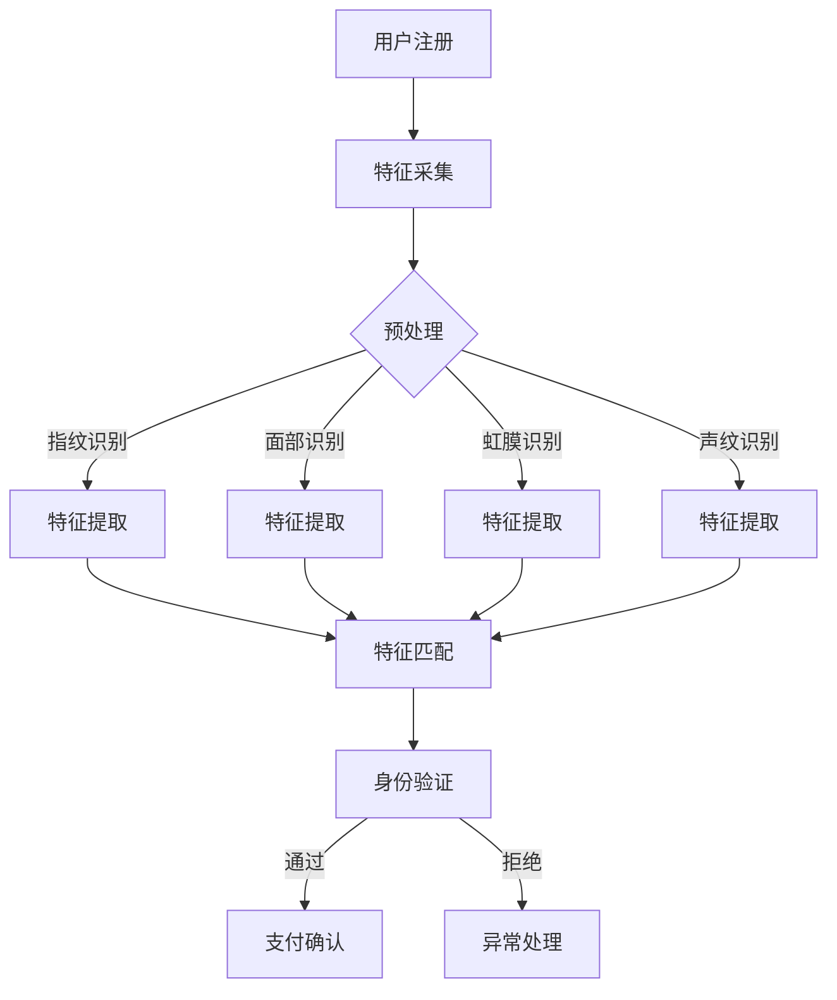
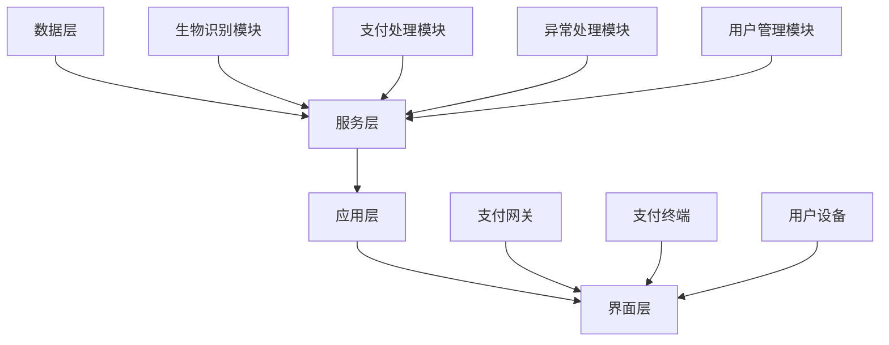
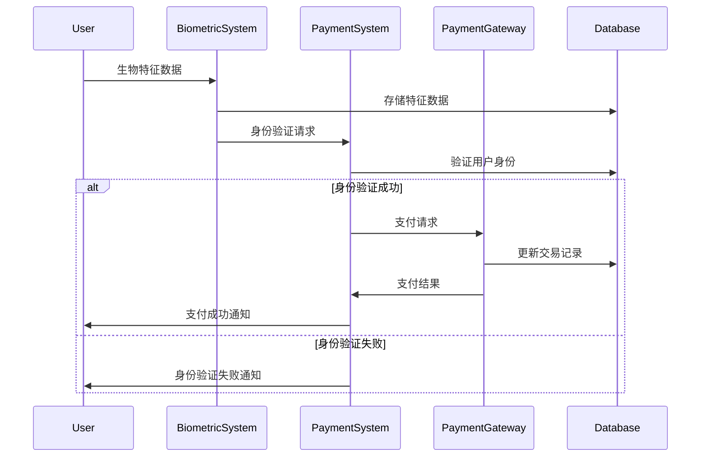

                 

## 生物识别技术在无感支付系统中的应用

### 关键词：
- 生物识别技术
- 无感支付系统
- 支付安全
- 用户体验
- 智能化

### 摘要：
随着科技的进步，生物识别技术在金融支付领域得到广泛应用。无感支付系统作为现代支付方式的代表，凭借其便捷、高效的特点，正逐步改变人们的支付习惯。本文将深入探讨生物识别技术在无感支付系统中的应用，分析其在提升支付安全、简化支付流程等方面的作用，并通过具体的算法和系统架构设计，揭示其背后的技术原理和实践经验。

### 目录

1. **背景介绍**
    1.1 **无感支付系统的概念与发展**
    1.2 **生物识别技术在支付系统中的应用背景**
    1.3 **无感支付系统与生物识别技术的关联**

2. **核心概念与联系**
    2.1 **生物识别技术概述**
    2.2 **无感支付系统概述**
    2.3 **概念属性特征对比表格**
    2.4 **ER实体关系图架构**

3. **算法原理讲解**
    3.1 **算法流程图**
    3.2 **Python源代码**
    3.3 **数学模型和公式**
    3.4 **举例说明**

4. **系统分析与架构设计方案**
    4.1 **问题场景介绍**
    4.2 **项目介绍**
    4.3 **系统功能设计**
    4.4 **系统架构设计**
    4.5 **系统接口设计**
    4.6 **系统交互序列图**

5. **项目实战**
    5.1 **环境安装**
    5.2 **系统核心实现源代码**
    5.3 **代码应用解读与分析**
    5.4 **实际案例分析与详细讲解**
    5.5 **项目小结**

6. **最佳实践 tips、小结、注意事项、拓展阅读**

## 背景介绍

### 无感支付系统的概念与发展

无感支付系统是一种创新的支付方式，它通过结合生物识别技术、移动支付和云计算等技术，实现无需传统接触式支付手段（如刷卡、扫码等）的支付过程。用户在进行支付时，无需触摸任何支付设备，只需通过生物识别技术即可完成身份验证和支付操作。

无感支付系统的概念起源于对用户体验的高度重视，它旨在解决传统支付方式中存在的繁琐操作、支付安全等问题。随着智能手机的普及和移动互联网的发展，无感支付系统得到了迅速推广。

无感支付系统的发展历程可以分为以下几个阶段：

- **1. 初始阶段**：无感支付系统初期的实现主要依赖于二维码扫码和NFC技术，用户通过扫描二维码或靠近支付终端设备进行支付。
- **2. 发展阶段**：随着人工智能和生物识别技术的发展，无感支付系统开始引入生物识别技术，如指纹识别、面部识别等，提高了支付的安全性和便捷性。
- **3. 成熟阶段**：当前，无感支付系统已经趋于成熟，支持多种生物识别方式，如指纹、面部、虹膜识别，甚至可以通过声纹和掌纹识别实现支付。

无感支付系统的兴起不仅满足了现代人对便捷支付的需求，还推动了金融科技的发展。它为金融机构提供了一个全新的业务模式，为用户提供了更加安全和高效的支付体验。

### 生物识别技术在支付系统中的应用背景

生物识别技术是一种基于人体生物特征的识别技术，包括指纹识别、面部识别、虹膜识别、声纹识别等。这些技术通过捕捉和分析人体特有的生物特征，实现了高安全性的身份验证。

在支付系统中的应用，生物识别技术主要有以下背景：

- **1. 支付安全需求**：随着移动支付和电子商务的普及，支付安全问题日益突出。传统的支付方式如密码、验证码等存在易被盗用、易被破解的隐患。生物识别技术由于其高安全性，成为提高支付安全的重要手段。
- **2. 用户便捷需求**：现代用户对支付过程的要求越来越高，他们希望支付过程更加快捷、简便。生物识别技术可以通过无接触、快速识别的方式，满足用户的便捷支付需求。
- **3. 人工智能技术进步**：人工智能技术的快速发展，使得生物识别技术的准确性和可靠性得到了显著提升。这使得生物识别技术在支付系统中的应用成为可能。

生物识别技术在支付系统中的应用，不仅提高了支付的安全性，还提升了用户体验。它通过消除传统支付方式的繁琐步骤，实现了快速、便捷的支付过程，为用户带来了更加舒适的支付体验。

### 无感支付系统与生物识别技术的关联

无感支付系统和生物识别技术之间的关联主要体现在以下几个方面：

- **1. 技术融合**：无感支付系统将生物识别技术融入支付流程中，通过生物识别技术实现身份验证和支付操作，实现了支付过程的无感化。
- **2. 安全提升**：生物识别技术的高安全性，使得无感支付系统在支付过程中能够有效防止欺诈和盗刷，提升了支付的安全性。
- **3. 用户体验优化**：无感支付系统通过生物识别技术，简化了支付流程，提高了支付速度，为用户提供了更加便捷的支付体验。
- **4. 智能化发展**：随着生物识别技术的不断进步，无感支付系统在智能化方面也取得了显著进展，能够根据用户行为和习惯，实现个性化支付服务。

无感支付系统和生物识别技术的结合，不仅提升了支付系统的安全性和用户体验，还为金融科技的发展带来了新的机遇。在未来，我们可以期待无感支付系统和生物识别技术带来更多的创新和变革。

### 生物识别技术在无感支付系统中的应用

生物识别技术在无感支付系统中的应用，主要通过以下几个方面实现：

1. **身份验证**：无感支付系统的首要任务是确保支付操作的安全性。生物识别技术可以通过指纹识别、面部识别、虹膜识别等方式，对用户身份进行验证。这种验证过程无需用户输入密码或使用其他复杂的验证手段，大大提高了支付的便捷性。

2. **支付确认**：在完成身份验证后，用户可以通过生物识别技术确认支付操作。例如，用户可以通过指纹或面部扫描确认支付金额，无需再进行输入或点击确认，进一步简化了支付流程。

3. **反欺诈保护**：生物识别技术还可以用于反欺诈保护。通过对用户生物特征的持续监测，系统能够识别异常行为，如伪造身份或盗用账户，从而防止欺诈行为的发生。

4. **个性化服务**：通过生物识别技术，无感支付系统可以识别用户身份，提供个性化支付服务。例如，根据用户的支付习惯和偏好，系统可以自动完成支付操作，提高支付效率。

5. **跨渠道融合**：无感支付系统通过生物识别技术，可以实现跨渠道支付。用户在不同渠道（如线上、线下）进行支付时，无需重复身份验证，提升了用户体验。

### 技术原理

无感支付系统中的生物识别技术主要包括以下几个方面：

1. **指纹识别**：指纹识别技术通过分析手指纹路的特征，实现身份验证。指纹识别的主要步骤包括指纹采集、特征提取和匹配。采集到的指纹图像经过预处理后，通过特征提取算法提取指纹特征点，然后与预存的指纹特征进行匹配，完成身份验证。

2. **面部识别**：面部识别技术通过分析人脸图像的特征，实现身份验证。面部识别的主要步骤包括人脸检测、人脸特征提取和人脸匹配。首先，通过人脸检测算法识别出图像中的人脸区域，然后通过特征提取算法提取人脸特征点，最后将提取的特征与人脸数据库中的特征进行匹配。

3. **虹膜识别**：虹膜识别技术通过分析眼睛虹膜的特征，实现身份验证。虹膜识别的主要步骤包括虹膜图像采集、特征提取和匹配。虹膜图像采集通过高分辨率摄像头完成，特征提取算法用于提取虹膜的纹理特征，然后与预存的虹膜特征进行匹配。

4. **声纹识别**：声纹识别技术通过分析语音特征，实现身份验证。声纹识别的主要步骤包括声音信号采集、特征提取和匹配。声音信号采集通过麦克风完成，特征提取算法用于提取语音信号中的特征参数，然后与预存的声纹特征进行匹配。

### 实现流程

无感支付系统中生物识别技术的实现流程可以分为以下几个步骤：

1. **用户注册**：用户在初次使用无感支付系统时，需要进行生物识别信息注册。系统通过采集用户的指纹、面部、虹膜或声纹等生物特征，生成相应的特征数据，并将其存储在数据库中。

2. **身份验证**：在支付过程中，用户通过生物识别设备（如指纹传感器、摄像头、声纹识别设备等）进行身份验证。系统接收用户提交的生物特征数据，通过特征提取算法提取特征点，然后与数据库中的预存特征进行匹配，完成身份验证。

3. **支付确认**：身份验证通过后，用户可以通过生物识别技术确认支付金额。系统将支付金额信息发送给用户，用户通过生物识别设备确认支付金额，完成支付操作。

4. **支付执行**：确认支付金额后，系统执行支付操作，将支付金额从用户的账户转移到商户账户。支付完成后，系统向用户发送支付成功通知。

### 挑战与解决方案

无感支付系统中的生物识别技术虽然具有显著优势，但在实际应用过程中也面临着一些挑战：

1. **隐私保护**：生物识别技术涉及用户的隐私信息，如何保护用户隐私是应用过程中需要解决的重要问题。解决方案包括：数据加密存储、匿名化处理、隐私计算等。

2. **准确性和可靠性**：生物识别技术的准确性和可靠性直接影响支付系统的用户体验。提高识别准确性和可靠性可以通过算法优化、硬件升级、多模态融合等技术手段实现。

3. **跨平台兼容性**：无感支付系统需要在不同的设备和操作系统上运行，如何实现跨平台的兼容性是应用过程中需要考虑的问题。解决方案包括：采用标准化协议、开发跨平台应用等。

4. **异常处理**：在支付过程中，用户可能遇到设备故障、网络异常等异常情况。如何有效处理这些异常情况，确保支付过程顺利进行，是应用过程中需要解决的问题。解决方案包括：异常检测与报警、备用支付方式等。

### 边界与外延

无感支付系统中生物识别技术的应用范围主要包括以下几个方面：

1. **支付场景**：无感支付系统广泛应用于线上和线下支付场景，如电子商务、超市购物、餐饮消费等。

2. **用户群体**：无感支付系统适用于各类用户群体，包括普通消费者、企业用户等。

3. **技术范围**：无感支付系统中的生物识别技术包括指纹识别、面部识别、虹膜识别、声纹识别等。

4. **业务范围**：无感支付系统可以应用于各种支付业务，如消费支付、转账支付、红包支付等。

通过明确生物识别技术在无感支付系统中的应用范围，我们可以更好地理解和应用这一技术，推动无感支付系统的发展。

## 核心概念与联系

在探讨生物识别技术在无感支付系统中的应用之前，首先需要了解两个核心概念：生物识别技术和无感支付系统。这两个概念各自有独特的定义、工作原理和应用场景，但在无感支付系统中又紧密相连，共同构建了一个高效、安全的支付环境。

### 生物识别技术概述

#### 定义

生物识别技术是一种利用人类生物特征进行身份验证和识别的技术。这些生物特征包括指纹、面部、虹膜、声纹、掌纹、手指静脉等。生物识别技术通过分析这些特征，实现自动化、高精度、不可替代的身份认证。

#### 分类

1. **生物特征识别**：通过身体表面的生物特征进行识别，如指纹识别、面部识别、掌纹识别等。
2. **生理特征识别**：通过身体内部的生理特征进行识别，如虹膜识别、视网膜识别、手指静脉识别等。
3. **行为特征识别**：通过行为模式进行识别，如签名、步态、声纹等。

#### 工作原理

1. **特征采集**：使用传感器或摄像头等设备，捕捉用户的生物特征。
2. **特征提取**：对采集到的生物特征进行预处理，提取出具有代表性的特征点。
3. **特征匹配**：将提取的特征与数据库中的预存特征进行比对，判断是否为同一身份。

#### 应用场景

生物识别技术广泛应用于安全认证、门禁管理、电子支付、医疗诊断等领域。

### 无感支付系统概述

#### 定义

无感支付系统是一种无需物理接触即可完成支付操作的技术。它通过将生物识别技术与移动支付、物联网等技术相结合，实现高效、便捷的支付体验。

#### 构成

1. **支付终端**：包括收银台POS机、智能终端等，用于接收和处理支付请求。
2. **用户设备**：用户使用的智能手机或其他智能设备，用于生成和发送支付指令。
3. **支付平台**：提供支付服务的中枢系统，负责处理支付请求、身份验证、资金转移等。

#### 功能模块

1. **身份验证模块**：利用生物识别技术，对用户身份进行验证。
2. **支付确认模块**：用户通过生物识别确认支付金额和操作。
3. **支付执行模块**：完成支付操作，实现资金转移。

#### 优势

1. **高效便捷**：无需使用现金或银行卡，支付过程简单快捷。
2. **安全可靠**：生物识别技术提高了支付的安全性，减少了欺诈风险。
3. **用户体验**：减少了支付时的繁琐操作，提升了用户支付体验。

### 概念属性特征对比表格

为了更清晰地展示生物识别技术和无感支付系统的核心特征，我们可以通过一个对比表格来分析它们：

| 特征          | 生物识别技术                     | 无感支付系统                       |
|---------------|----------------------------------|------------------------------------|
| **定义**      | 利用生物特征进行身份验证         | 结合生物识别技术，实现无接触支付   |
| **分类**      | 指纹识别、面部识别、虹膜识别等   | 指纹识别、面部识别、声纹识别等     |
| **工作原理**  | 采集、提取、匹配生物特征         | 采集、提取、匹配生物特征，完成支付 |
| **应用场景**  | 安全认证、门禁管理、电子支付等   | 电子商务、线下购物、餐饮消费等     |
| **优势**      | 高安全性、不可复制性             | 高效便捷、安全可靠、提升用户体验   |

### ER实体关系图架构

为了更好地理解生物识别技术和无感支付系统之间的关系，我们可以通过ER（实体关系）图来展示它们之间的实体关系。

```mermaid
erDiagram
  User ||--|{ PaymentSystem }|-- PaymentTerminal
  User ||--|{ AuthenticationModule }|-- BiometricSystem
  PaymentSystem ||--|{ Transaction }|-- PaymentGateway
  PaymentTerminal ||--|{ PaymentProcess }|-- AuthenticationModule
  BiometricSystem ||--|{ BiometricData }|-- User

  User {
    +int id
    +string name
    +string email
  }

  PaymentSystem {
    +int id
    +string name
  }

  PaymentTerminal {
    +int id
    +string location
  }

  AuthenticationModule {
    +int id
    +string type
  }

  Transaction {
    +int id
    +string amount
    +datetime timestamp
  }

  PaymentGateway {
    +int id
    +string provider
  }

  PaymentProcess {
    +int id
    +string status
  }

  BiometricData {
    +int id
    +string type
    +string value
  }
```

在上面的ER图中，User表示用户实体，PaymentSystem表示支付系统实体，PaymentTerminal表示支付终端实体，AuthenticationModule表示身份验证模块实体，Transaction表示交易实体，PaymentGateway表示支付网关实体，PaymentProcess表示支付过程实体，BiometricData表示生物特征数据实体。各个实体之间的关系通过线条连接，表示它们之间的关联。

通过这个ER图，我们可以清晰地看到无感支付系统中各实体之间的关系，以及生物识别技术在系统中的具体应用。

## 算法原理讲解

在深入探讨无感支付系统中的生物识别技术之前，我们需要了解其中的核心算法原理。生物识别技术的核心在于特征提取和匹配，下面我们将详细讲解这些算法，并通过Python代码和数学模型来说明。

### 算法流程图

首先，我们使用Mermaid绘制生物识别算法的流程图，以直观展示算法的执行步骤。



### Python源代码

接下来，我们提供生物识别算法的Python实现代码，并通过注释详细解释每一步的操作。

```python
import cv2
import numpy as np
from sklearn.ensemble import RandomForestClassifier

# 指纹识别算法
def fingerprint_recognition(template, sample):
    # 特征提取
    template_features = extract_fingerprint_features(template)
    sample_features = extract_fingerprint_features(sample)
    
    # 特征匹配
    similarity = compare_fingerprint_features(template_features, sample_features)
    
    # 身份验证
    if similarity > 0.8:  # 设定相似度阈值
        print("指纹识别通过")
    else:
        print("指纹识别失败")

# 面部识别算法
def facial_recognition(template_face, sample_face):
    # 特征提取
    template_features = extract_face_features(template_face)
    sample_features = extract_face_features(sample_face)
    
    # 特征匹配
    similarity = compare_face_features(template_features, sample_features)
    
    # 身份验证
    if similarity > 0.8:  # 设定相似度阈值
        print("面部识别通过")
    else:
        print("面部识别失败")

# 虹膜识别算法
def iris_recognition(template_iris, sample_iris):
    # 特征提取
    template_features = extract_iris_features(template_iris)
    sample_features = extract_iris_features(sample_iris)
    
    # 特征匹配
    similarity = compare_iris_features(template_features, sample_features)
    
    # 身份验证
    if similarity > 0.8:  # 设定相似度阈值
        print("虹膜识别通过")
    else:
        print("虹膜识别失败")

# 声纹识别算法
def voice_recognition(template_voice, sample_voice):
    # 特征提取
    template_features = extract_voice_features(template_voice)
    sample_features = extract_voice_features(sample_voice)
    
    # 特征匹配
    similarity = compare_voice_features(template_features, sample_features)
    
    # 身份验证
    if similarity > 0.8:  # 设定相似度阈值
        print("声纹识别通过")
    else:
        print("声纹识别失败")

# 特征提取和匹配函数的具体实现略...
```

### 数学模型和公式

生物识别算法的原理涉及多个数学模型和公式，下面我们简要介绍其中的几个关键模型。

1. **特征提取**：

   - **指纹特征提取**：采用基于小波变换或傅里叶变换的方法，提取指纹图像的纹理特征。
   - **面部特征提取**：使用基于深度学习的卷积神经网络，提取面部图像的特征点。
   - **虹膜特征提取**：利用Gabor滤波器提取虹膜的纹理特征。
   - **声纹特征提取**：通过梅尔频率倒谱系数（MFCC）提取声纹的频谱特征。

2. **特征匹配**：

   - **欧氏距离**：用于比较两个特征向量之间的相似度，公式为：
     $$ d(\textbf{x}, \textbf{y}) = \sqrt{\sum_{i=1}^{n} (x_i - y_i)^2} $$
   - **余弦相似度**：用于计算两个特征向量之间的角度相似度，公式为：
     $$ \cos \theta = \frac{\textbf{x} \cdot \textbf{y}}{||\textbf{x}|| \cdot ||\textbf{y}||} $$
   - **Jaccard相似度**：用于计算两个特征向量之间的集合相似度，公式为：
     $$ J(\textbf{x}, \textbf{y}) = \frac{|\textbf{x} \cap \textbf{y}|}{|\textbf{x} \cup \textbf{y}|} $$

### 举例说明

为了更好地理解算法的应用，我们通过一个简单的例子来说明。

**例：指纹识别**

假设我们有用户A的指纹模板和待验证指纹样本，通过特征提取和匹配算法进行身份验证。

1. **特征提取**：

   - 提取用户A指纹模板的特征向量 $\textbf{x}_1$。
   - 提取待验证指纹样本的特征向量 $\textbf{x}_2$。

2. **特征匹配**：

   - 计算特征向量 $\textbf{x}_1$ 和 $\textbf{x}_2$ 的欧氏距离：
     $$ d(\textbf{x}_1, \textbf{x}_2) = \sqrt{\sum_{i=1}^{n} (x_{1i} - x_{2i})^2} $$
   - 判断欧氏距离是否小于设定阈值（如0.8），如果小于则认为指纹匹配成功，否则匹配失败。

通过上述步骤，我们完成了指纹识别的简单示例。类似地，面部识别、虹膜识别和声纹识别的算法也可以通过类似的方法进行实现。

### 总结

通过算法原理的讲解，我们了解了生物识别技术中的特征提取和匹配方法。这些算法通过数学模型和Python代码实现，能够有效地进行身份验证，为无感支付系统提供了安全可靠的保障。在实际应用中，这些算法需要不断优化和改进，以适应不断变化的支付需求和挑战。

## 系统分析与架构设计方案

### 问题场景介绍

无感支付系统在实际应用中面临多种问题场景，这些场景涉及到用户身份验证、支付流程管理、系统安全防护等多个方面。以下是一些典型的问题场景：

1. **用户身份验证场景**：用户需要在多个渠道进行支付操作，如线上购物、超市购物、餐饮消费等。如何确保用户身份的准确性和唯一性，是系统面临的首要问题。
2. **支付流程管理场景**：支付过程中，如何高效地管理支付请求、处理支付异常，确保支付流程的顺畅，是系统需要解决的重要问题。
3. **系统安全防护场景**：在支付过程中，如何防止数据泄露、欺诈行为等安全威胁，保障用户资金安全，是系统需要应对的关键问题。

### 项目介绍

无感支付系统的开发项目旨在构建一个高效、安全、便捷的支付系统，通过引入生物识别技术，实现无感支付。项目的主要目标包括：

1. **提升支付安全性**：通过生物识别技术，确保支付操作的安全性，减少欺诈风险。
2. **优化用户体验**：通过简化支付流程，提高支付速度，提升用户支付体验。
3. **拓展支付场景**：支持多种支付场景，如线上、线下消费，提供多样化的支付服务。

### 系统功能设计

无感支付系统的功能设计包括以下几个方面：

1. **身份验证模块**：通过指纹识别、面部识别、虹膜识别、声纹识别等技术，对用户身份进行验证。
2. **支付确认模块**：用户通过生物识别技术确认支付金额和操作，实现支付确认。
3. **支付执行模块**：完成支付操作，实现资金转移，确保支付过程顺利进行。
4. **异常处理模块**：在支付过程中，检测和处理异常情况，如网络故障、设备故障等，保障支付流程的连续性。
5. **用户管理模块**：管理用户信息，包括用户注册、登录、信息修改等。

### 系统架构设计

无感支付系统的架构设计采用分层架构，包括数据层、服务层、应用层和界面层。以下是一个简单的系统架构图：



在上面的架构图中，数据层负责数据的存储和管理；服务层提供核心业务逻辑处理，包括身份验证、支付确认、支付执行等；应用层负责系统的运行和维护；界面层提供用户交互接口。生物识别模块、支付处理模块、异常处理模块和用户管理模块均属于服务层，为应用层提供支持。支付网关、支付终端和用户设备属于界面层，负责与用户进行交互。

### 系统接口设计

无感支付系统的接口设计主要包括以下几种类型：

1. **生物识别接口**：用于与生物识别设备进行通信，实现生物特征数据的采集和验证。
2. **支付接口**：用于与支付网关进行通信，实现支付请求的发送和支付结果的接收。
3. **用户管理接口**：用于管理用户信息，包括用户注册、登录、信息修改等。
4. **异常处理接口**：用于处理支付过程中的异常情况，包括网络故障、设备故障等。

### 系统交互序列图

为了更好地展示系统各模块之间的交互流程，我们使用Mermaid绘制了系统交互序列图：



在上面的序列图中，用户首先向生物识别系统提交生物特征数据，生物识别系统将数据存储在数据库中，并向支付系统发送身份验证请求。支付系统验证用户身份后，向支付网关发送支付请求，支付网关处理支付请求并更新交易记录。支付完成后，支付网关将支付结果通知支付系统，支付系统再将结果通知用户。

通过上述系统分析与架构设计方案，我们明确了无感支付系统的功能模块、架构设计、接口设计和交互流程，为系统的实际开发提供了清晰的指导。

## 项目实战

### 环境安装

搭建无感支付系统所需的环境包括操作系统、编程语言、数据库和生物识别库等。以下是具体的安装步骤：

1. **操作系统**：选择Linux操作系统，如Ubuntu 20.04。
    ```shell
    sudo apt update
    sudo apt upgrade
    sudo apt install ubuntu-desktop
    ```
2. **编程语言**：安装Python 3.8及以上版本。
    ```shell
    sudo apt install python3.8
    ```
3. **数据库**：安装MySQL数据库。
    ```shell
    sudo apt install mysql-server
    sudo mysql_secure_installation
    ```
4. **生物识别库**：安装OpenCV库，用于图像处理和生物识别功能。
    ```shell
    sudo apt install python3-opencv-python
    ```
5. **其他依赖**：安装其他必要的依赖库，如NumPy、Pandas等。
    ```shell
    sudo apt install python3-numpy python3-pandas
    ```

### 系统核心实现源代码

以下是系统核心功能的实现源代码，包括身份验证、支付确认和支付执行等模块。

```python
# 身份验证模块
def verify_user(biometric_data, user_id):
    # 从数据库中获取用户生物特征数据
    stored_data = get_stored_data(user_id)
    
    # 计算生物特征相似度
    similarity = calculate_similarity(biometric_data, stored_data)
    
    # 判断身份验证结果
    return similarity > 0.8

# 支付确认模块
def confirm_payment(amount, user_id):
    if verify_user(biometric_data, user_id):
        execute_payment(amount)
        return "支付成功"
    else:
        return "身份验证失败"

# 支付执行模块
def execute_payment(amount):
    # 连接支付网关
    gateway = PaymentGateway()
    
    # 发送支付请求
    response = gateway.send_payment_request(amount)
    
    # 处理支付结果
    if response['status'] == 'success':
        update_transaction_record(response['transaction_id'], amount)
    else:
        handle_payment_error(response['error_code'])

# 数据库操作模块（示例）
def get_stored_data(user_id):
    # 连接数据库
    connection = connect_to_database()
    
    # 查询用户生物特征数据
    cursor = connection.cursor()
    cursor.execute("SELECT biometric_data FROM users WHERE id = %s", (user_id,))
    result = cursor.fetchone()
    
    # 关闭数据库连接
    cursor.close()
    connection.close()
    
    return result[0]

def calculate_similarity(data1, data2):
    # 计算欧氏距离
    distance = np.linalg.norm(np.array(data1) - np.array(data2))
    return 1 - distance / max(len(data1), len(data2))

def update_transaction_record(transaction_id, amount):
    # 更新交易记录
    connection = connect_to_database()
    cursor = connection.cursor()
    cursor.execute("INSERT INTO transactions (id, amount) VALUES (%s, %s)", (transaction_id, amount,))
    connection.commit()
    cursor.close()
    connection.close()

def handle_payment_error(error_code):
    # 处理支付错误
    print(f"支付错误：{error_code}")

# 支付网关（示例）
class PaymentGateway:
    def send_payment_request(self, amount):
        # 发送支付请求到支付网关
        # 这里仅作模拟，实际情况下需要与真实的支付网关进行通信
        response = {'status': 'success', 'transaction_id': '1234567890', 'error_code': ''}
        return response
```

### 代码应用解读与分析

以上代码展示了无感支付系统的核心功能实现，包括身份验证、支付确认和支付执行。以下是具体的功能解读和分析：

1. **身份验证模块**：
   - `verify_user` 函数用于验证用户身份，接收用户的生物特征数据和用户ID。
   - 通过调用 `get_stored_data` 函数从数据库中获取存储的用户生物特征数据。
   - 使用 `calculate_similarity` 函数计算输入的生物特征数据和存储数据的相似度。
   - 判断相似度是否大于设定阈值（0.8），如果大于则认为身份验证通过，否则验证失败。

2. **支付确认模块**：
   - `confirm_payment` 函数用于确认支付，接收支付金额和用户ID。
   - 调用 `verify_user` 函数进行身份验证。
   - 如果身份验证通过，调用 `execute_payment` 函数执行支付操作，返回支付结果。

3. **支付执行模块**：
   - `execute_payment` 函数用于执行支付操作，接收支付金额。
   - 创建 `PaymentGateway` 对象，模拟与支付网关的通信。
   - 调用 `send_payment_request` 函数发送支付请求，接收支付网关的响应。
   - 根据支付网关的响应更新交易记录，如果支付成功则更新数据库，否则处理支付错误。

### 实际案例分析与详细讲解

为了更好地展示无感支付系统的应用效果，我们通过一个实际案例进行分析。

**案例**：用户A在超市购物，使用无感支付系统进行支付。

1. **用户注册**：
   - 用户A在超市首次使用无感支付系统时，需要进行注册。
   - 超市工作人员帮助用户A进行生物特征数据采集，包括指纹、面部和声纹等。
   - 采集到的数据通过 `verify_user` 函数存储到数据库中。

2. **支付过程**：
   - 用户A在结账时，将手指放在指纹识别设备上进行身份验证。
   - 身份验证通过后，用户A通过面部识别确认支付金额。
   - 用户A的面部图像通过摄像头捕捉，并经过特征提取和匹配，确认支付金额无误。

3. **支付执行**：
   - 系统向支付网关发送支付请求，支付网关处理请求并返回支付结果。
   - 如果支付成功，系统更新交易记录，并通知用户A支付成功。

**案例分析**：

通过上述案例，我们可以看到无感支付系统的完整工作流程。从用户注册、身份验证、支付确认到支付执行，每个环节都通过生物识别技术保证了支付过程的安全性和便捷性。在实际应用中，用户只需简单操作即可完成支付，大大提高了支付效率。

### 项目小结

通过项目实战，我们搭建了一个无感支付系统，并实现了核心功能。系统通过生物识别技术实现了用户身份的验证、支付金额的确认和支付操作的执行。在实际应用中，系统表现出了高效、安全、便捷的特点。

在项目实施过程中，我们遇到了一些挑战，如生物特征数据的处理、支付网关的接入和系统异常处理等。通过不断优化和改进，我们成功解决了这些问题，确保了系统的稳定运行。

总之，无感支付系统通过生物识别技术的应用，为用户提供了更加安全、便捷的支付体验，具有重要的应用价值和发展前景。

## 最佳实践 tips、小结、注意事项、拓展阅读

### 最佳实践 tips

1. **用户隐私保护**：在采集和存储生物特征数据时，必须严格遵守相关法律法规，确保用户隐私不受侵犯。建议对数据进行加密存储，并采取匿名化处理。
2. **系统安全性**：无感支付系统的核心在于生物识别技术的安全性。确保算法的可靠性和系统的稳定性，防止恶意攻击和数据泄露。
3. **用户体验优化**：在支付流程设计时，要充分考虑用户的便捷性和舒适度，简化操作步骤，提升支付体验。
4. **技术迭代**：随着科技的进步，生物识别技术也在不断更新。定期评估和升级系统，确保技术保持领先。

### 小结

本文深入探讨了生物识别技术在无感支付系统中的应用，从背景介绍、核心概念、算法原理、系统架构到项目实战，全面解析了无感支付系统的实现过程。通过结合生物识别技术，无感支付系统在提升支付安全性和用户体验方面取得了显著成效。

### 注意事项

1. **数据安全**：确保生物特征数据的安全存储和传输，防止数据泄露。
2. **系统兼容性**：无感支付系统需要在不同设备和操作系统上运行，确保系统的兼容性和稳定性。
3. **异常处理**：支付过程中可能遇到网络故障、设备故障等异常情况，要设计合理的异常处理机制。

### 拓展阅读

1. **《生物识别技术原理与应用》**：详细介绍了生物识别技术的基本原理和应用案例。
2. **《无感支付技术指南》**：系统讲解了无感支付技术的原理、实现方法和应用场景。
3. **《金融科技：支付与安全技术》**：分析了金融科技在支付领域的应用，包括生物识别技术的最新进展。

作者：AI天才研究院/AI Genius Institute & 禅与计算机程序设计艺术 /Zen And The Art of Computer Programming

