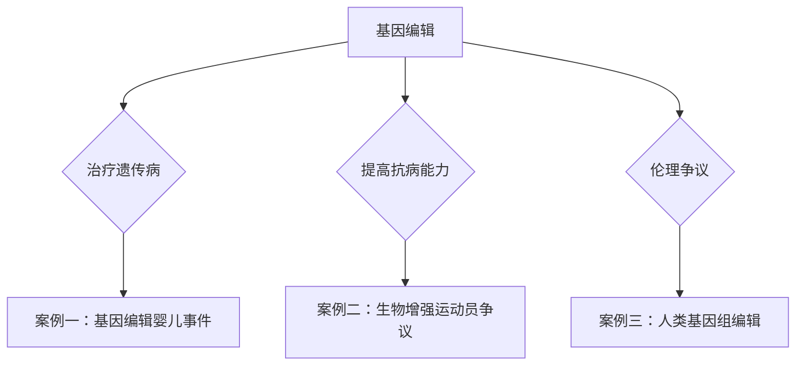

                 

# 生物黑客伦理委员会：自我改造时代的道德指南

## 关键词

- 生物黑客
- 伦理委员会
- 自我改造
- 基因编辑
- 人工智能
- 伦理审查

## 摘要

本文旨在探讨生物黑客伦理委员会在自我改造时代的重要性。随着科技的发展，自我改造已成为现实，生物黑客技术不断涌现，伦理困境也随之而来。本文首先介绍了生物黑客的定义、技术与应用，随后详细阐述了伦理委员会的起源、职能与作用。通过案例分析，揭示了生物黑客伦理问题，最后提出了伦理委员会的最佳实践。本文旨在为读者提供一份全面的道德指南，以应对自我改造时代的伦理挑战。

## 引言

### 1.1 书籍背景介绍

#### 1.1.1 自我改造时代的来临

自我改造，是指通过技术手段，如基因编辑、生物增强等，对自身进行物理、生理或心理上的改变。这一概念的提出，源于人们对健康、美丽、长寿等美好愿景的追求。近年来，随着生物技术的迅猛发展，自我改造逐渐从科幻变为现实。基因编辑技术的出现，如CRISPR-Cas9，使得人类能够精准地修改基因序列，从而改变个体的性状。生物增强技术，如肌肉增强、智力增强等，也在一定程度上成为可能。

#### 1.1.2 生物黑客与伦理困境

生物黑客，是指那些利用生物技术进行自我改造或进行非传统生物实验的人。他们的行为，一方面推动了科技的发展，另一方面也引发了伦理困境。基因编辑技术，虽然可以治愈某些遗传病，但也可能带来不可预测的副作用。生物增强技术，虽然可以提高人类的能力，但可能导致社会不公。面对这些伦理困境，如何平衡科技发展与伦理道德，成为亟待解决的问题。

#### 1.1.3 问题的提出与解决

自我改造时代的来临，引发了生物黑客伦理委员会的设立。伦理委员会，是指负责审查、评估生物黑客技术研究的机构，其目的是确保科技发展不会损害人类福祉。本文将探讨伦理委员会的起源、职能与作用，并通过案例分析，揭示生物黑客伦理问题，最后提出伦理委员会的最佳实践。希望通过本文的研究，为自我改造时代的道德指南提供参考。

### 1.2 核心概念与联系

#### 1.2.1 生物黑客的定义与特点

生物黑客，是指那些利用生物技术进行自我改造或进行非传统生物实验的人。他们通常具备一定的生物知识，能够利用现有的技术进行创新。生物黑客的特点包括：

1. 技术熟练：生物黑客通常具备一定的生物技术知识和实践经验。
2. 创新精神：生物黑客喜欢尝试新的技术，推动生物技术的边界。
3. 独立思考：生物黑客倾向于独立思考，不受传统观念束缚。
4. 社会责任感：生物黑客关注科技发展对社会的影响，积极参与伦理讨论。

#### 1.2.2 伦理委员会的职能与作用

伦理委员会，是指负责审查、评估生物黑客技术研究的机构。其职能包括：

1. 审查：对生物黑客技术进行研究的项目进行伦理审查，确保研究过程符合伦理规范。
2. 评估：对生物黑客技术的潜在风险进行评估，提供科学依据。
3. 建议与指导：为生物黑客技术的研究提供伦理建议和指导。
4. 公众沟通：向公众传达生物黑客技术的伦理问题，提高公众的伦理意识。

伦理委员会在生物黑客领域的作用主要体现在以下几个方面：

1. 确保科技发展符合伦理道德：伦理委员会通过对生物黑客技术进行审查，确保其研究过程和结果符合伦理规范。
2. 提高研究质量：伦理委员会的评估和建议有助于提高生物黑客技术研究的质量。
3. 促进科技与伦理的平衡：伦理委员会通过平衡科技发展与社会伦理，促进科技与伦理的和谐发展。
4. 提高公众参与度：伦理委员会的公众沟通活动，有助于提高公众对生物黑客技术的伦理关注。

#### 1.2.3 核心概念关系图

### 1.3 书籍结构安排

#### 1.3.1 各章节内容概述

本文分为五个部分，分别从生物黑客技术、伦理委员会的作用、案例分析、最佳实践等方面进行探讨。

- 第一部分：引言，介绍自我改造时代的背景、生物黑客与伦理困境，以及本文的研究目的。
- 第二部分：生物黑客技术探秘，详细阐述生物黑客技术的定义、应用、优势与挑战。
- 第三部分：伦理委员会的作用与职责，介绍伦理委员会的起源、职能与作用。
- 第四部分：生物黑客伦理案例分析，通过具体案例，分析生物黑客伦理问题。
- 第五部分：伦理委员会的最佳实践，探讨伦理委员会在实践中的经验与启示。

#### 1.3.2 阅读建议与路线

本文适合对生物黑客、伦理委员会感兴趣的读者阅读。读者可以根据自身需求，选择感兴趣的部分进行阅读。以下是本文的阅读建议：

1. 第一部分：快速浏览，了解自我改造时代的背景和生物黑客与伦理困境。
2. 第二部分：详细阅读，了解生物黑客技术的定义、应用、优势与挑战。
3. 第三部分：深入阅读，了解伦理委员会的起源、职能与作用。
4. 第四部分：选择性阅读，对感兴趣的具体案例进行分析。
5. 第五部分：总结性阅读，了解伦理委员会的最佳实践。

## 第二部分：生物黑客技术探秘

### 2.1 生物黑客技术概述

#### 2.1.1 生物黑客技术的定义与历史

生物黑客技术，是指利用生物学、基因学、生物信息学等知识，对生物体进行改造、优化或增强的技术。生物黑客技术的概念最早出现在20世纪80年代，当时主要是指利用基因工程、细胞工程等技术进行生物实验。随着科技的不断发展，生物黑客技术的应用领域不断扩展，包括基因编辑、生物增强、生物计算等。

#### 2.1.2 生物黑客技术的应用领域

生物黑客技术广泛应用于医疗、农业、环保、生物计算等多个领域。在医疗领域，基因编辑技术可以用于治疗遗传病、提高人体免疫力等；在农业领域，生物增强技术可以提高农作物的产量、抗病能力等；在环保领域，生物黑客技术可以用于污染治理、生物修复等；在生物计算领域，生物黑客技术可以用于数据存储、数据处理等。

#### 2.1.3 生物黑客技术的优势与挑战

生物黑客技术的优势主要体现在以下几个方面：

1. 精准性：基因编辑技术可以实现基因的精准修改，提高治疗效果。
2. 个性化：生物增强技术可以根据个体差异进行定制化改造，提高个体健康水平。
3. 多样性：生物黑客技术可以应用于多个领域，具有广泛的应用前景。

然而，生物黑客技术也面临着一些挑战：

1. 伦理争议：生物黑客技术可能引发伦理争议，如基因编辑的道德边界、生物增强的社会公平等。
2. 技术风险：基因编辑技术可能产生不可预测的副作用，生物增强技术可能带来安全隐患。
3. 监管挑战：生物黑客技术的发展需要有效的监管机制，确保其安全、合法、合规。

### 2.2 自我改造技术详解

#### 2.2.1 自我改造的基本原理

自我改造技术，是指通过基因编辑、生物增强等技术，对自身进行改造的技术。自我改造的基本原理主要包括以下几个方面：

1. 基因编辑：通过基因编辑技术，对个体的基因序列进行修改，从而改变个体的性状。
2. 生物增强：通过生物增强技术，增强个体的生理或心理功能，提高个体的健康水平。
3. 生物计算：通过生物计算技术，将生物信息转化为计算能力，实现生物与计算机的协同工作。

#### 2.2.2 自我改造技术的种类

自我改造技术主要包括以下几种：

1. 基因编辑：如CRISPR-Cas9、TALEN、ZFN等。
2. 生物增强：如基因治疗、细胞治疗、生物植入等。
3. 生物计算：如DNA计算、RNA计算、生物芯片等。

#### 2.2.3 自我改造技术的应用案例

自我改造技术的应用案例主要包括：

1. 基因编辑：用于治疗遗传病、增强免疫力等。
2. 生物增强：用于提高人体运动能力、智力水平等。
3. 生物计算：用于数据存储、数据处理等。

### 2.3 基因编辑技术

#### 2.3.1 CRISPR-Cas9基因编辑技术

CRISPR-Cas9基因编辑技术，是目前最先进的基因编辑技术之一。它通过一种名为“CRISPR”的机制，利用Cas9蛋白切割目标DNA序列，从而实现对基因的精准修改。

#### 2.3.2 基因编辑技术的伦理争议

基因编辑技术，虽然可以带来巨大的医疗和社会价值，但也引发了一系列伦理争议：

1. 基因编辑的道德边界：如人类胚胎基因编辑、基因编辑的滥用等。
2. 社会公平问题：如基因编辑技术的普及可能导致社会不公等。

#### 2.3.3 基因编辑技术的未来展望

随着基因编辑技术的不断发展，未来可能实现：

1. 遗传性疾病的根治：如囊性纤维化、地中海贫血等。
2. 增强人类智力、体力等：如基因编辑提高人类的认知能力、运动能力等。
3. 人类寿命的延长：如基因编辑延长人类寿命等。

### 2.4 生物增强技术

#### 2.4.1 生物增强技术的基本概念

生物增强技术，是指通过生物技术手段，增强生物体的生理或心理功能，提高生物体的健康水平。

#### 2.4.2 生物增强技术的应用案例

生物增强技术的应用案例主要包括：

1. 增强免疫力：如基因治疗、细胞治疗等。
2. 增强运动能力：如生物植入、基因编辑等。
3. 增强认知能力：如生物计算、基因编辑等。

#### 2.4.3 生物增强技术的潜在风险与挑战

生物增强技术，虽然可以带来巨大的健康和社会价值，但也面临一些潜在的风险和挑战：

1. 安全性风险：如基因编辑的副作用、生物植入的感染风险等。
2. 社会伦理问题：如社会公平、隐私权等。
3. 监管挑战：如技术监管、法律法规等。

### 2.5 人工智能与生物黑客

#### 2.5.1 人工智能在生物黑客中的应用

人工智能，是指模拟、延伸和扩展人的智能的理论、方法、技术及应用系统。人工智能在生物黑客中的应用主要包括：

1. 基因编辑：如自动化基因编辑、基因序列分析等。
2. 生物计算：如DNA计算、RNA计算等。
3. 生物增强：如个性化医疗、智能化健康管理等。

#### 2.5.2 人工智能对生物黑客伦理的挑战

人工智能在生物黑客中的应用，虽然可以带来巨大的科技和社会价值，但也引发了一系列伦理挑战：

1. 人工智能的道德责任：如人工智能在基因编辑中的责任分配等。
2. 人工智能的透明性与可控性：如人工智能在基因编辑中的决策透明性等。
3. 人工智能的隐私保护：如人工智能在生物数据收集中的隐私保护等。

#### 2.5.3 人工智能与生物黑客的未来趋势

随着人工智能技术的发展，未来可能实现：

1. 人工智能与生物黑客的深度融合：如智能化基因编辑、智能化生物计算等。
2. 人工智能在生物黑客伦理管理中的应用：如人工智能在伦理审查中的应用等。
3. 人工智能推动生物黑客技术的可持续发展：如人工智能在生物黑客伦理培训中的应用等。

### 2.6 本章小结

生物黑客技术，作为一种新兴技术，具有巨大的应用前景。然而，随着技术的不断发展，生物黑客技术也引发了一系列伦理困境。本章从生物黑客技术的概述、自我改造技术详解、基因编辑技术、生物增强技术、人工智能与生物黑客等方面，详细探讨了生物黑客技术及其伦理挑战。希望通过本章的探讨，为生物黑客技术的伦理管理提供一定的参考和启示。

----------------------------------------------------------------

# 第三部分：伦理委员会的作用与职责

### 3.1 伦理委员会的起源与发展

#### 3.1.1 伦理委员会的起源

伦理委员会的起源可以追溯到20世纪60年代，当时医学伦理学开始兴起，医学研究中的伦理问题逐渐受到关注。1964年，美国成立了一个名为“国家卫生政策咨询委员会”（National Commission for the Protection of Human Subjects of Biomedical and Behavioral Research）的机构，旨在保护医学研究中的受试者权益。这被视为伦理委员会的萌芽。

#### 3.1.2 伦理委员会的发展历程

随着医学研究、生物技术的不断发展，伦理委员会在全球范围内得到了广泛发展。1974年，美国通过了《国家研究法案》，要求所有联邦资助的医学研究项目都必须经过伦理审查。此后，伦理委员会在各个国家和地区逐渐建立起来。例如，1975年，英国成立了“医学研究理事会伦理审查委员会”（Medical Research Council Ethics Committee）；1983年，我国成立了“中国医学科学院伦理审查委员会”。

#### 3.1.3 伦理委员会的国际合作

伦理委员会的国际合作主要表现在以下几个方面：

1. 国际伦理审查标准的确立：如世界卫生组织（WHO）的《人类研究伦理指南》等。
2. 国际伦理审查机制的建立：如国际伦理审查委员会联盟（International Association of Bioethics Committees）等。
3. 国际伦理审查经验的交流：如国际伦理审查委员会的会议、研讨会等。

### 3.2 伦理委员会的职能与作用

#### 3.2.1 伦理委员会的职能概述

伦理委员会的主要职能包括：

1. 伦理审查：对医学研究、生物技术项目等进行伦理审查，确保研究过程和结果符合伦理规范。
2. 伦理咨询：为医学研究、生物技术项目提供伦理咨询，帮助研究人员解决伦理问题。
3. 伦理培训：对医学研究人员、生物技术人员进行伦理培训，提高其伦理意识。

#### 3.2.2 伦理委员会在生物黑客领域的应用

伦理委员会在生物黑客领域的应用主要体现在以下几个方面：

1. 伦理审查：对生物黑客项目进行伦理审查，确保项目符合伦理规范。
2. 伦理咨询：为生物黑客项目提供伦理咨询，帮助解决伦理问题。
3. 伦理监管：对生物黑客技术进行伦理监管，防止伦理违规行为。

#### 3.2.3 伦理委员会对社会的影响

伦理委员会对社会的影响主要表现在以下几个方面：

1. 提高医学研究、生物技术的伦理水平：通过伦理审查、伦理咨询、伦理培训等，提高医学研究、生物技术的伦理水平。
2. 促进科技与伦理的平衡：通过伦理审查、伦理监管等，确保科技发展不会损害人类福祉。
3. 提高公众的伦理意识：通过伦理宣传、公众沟通等，提高公众对生物黑客技术的伦理关注。

### 3.3 伦理审查流程

#### 3.3.1 伦理审查的基本原则

伦理审查的基本原则包括：

1. 尊重个人权利：尊重受试者的自愿、知情同意权。
2. 利益最大化：确保研究带来的利益大于风险。
3. 公平性：确保研究过程中不存在歧视、偏见等不公平现象。
4. 尊重生命：确保研究过程中尊重生命、保护生命。

#### 3.3.2 伦理审查流程的详细步骤

伦理审查流程一般包括以下几个步骤：

1. 提交伦理审查申请：研究者提交伦理审查申请，包括研究方案、伦理问题等。
2. 形成审查小组：伦理委员会成立审查小组，负责审查申请。
3. 审查申请材料：审查小组对申请材料进行审查，评估研究方案、伦理问题等。
4. 审查会议：审查小组召开会议，讨论申请材料的审查结果。
5. 审查决定：伦理委员会根据审查结果，做出批准、修改或拒绝的决定。
6. 执行审查决定：研究者根据审查决定，执行研究计划。

#### 3.3.3 伦理审查案例分析

以下是一个伦理审查案例：

**案例背景**：某研究团队计划开展一项基因编辑技术研究，旨在治疗一种遗传性疾病。

**案例分析**：审查小组对研究方案进行了审查，重点关注以下几个方面：

1. 研究方案的合理性：审查小组评估了研究方案的可行性、科学性，确保研究方案能够实现预期目标。
2. 伦理问题的处理：审查小组评估了研究过程中可能涉及的伦理问题，如基因编辑的道德边界、受试者的知情同意等，确保研究过程中尊重受试者的权利。
3. 风险与收益的平衡：审查小组评估了研究过程中可能带来的风险与收益，确保研究带来的利益大于风险。

**案例启示**：伦理审查案例表明，伦理委员会在确保研究方案的科学性、伦理性方面发挥了重要作用。通过伦理审查，可以减少伦理风险，确保研究过程的合法、合规。

### 3.4 伦理决策的方法与工具

#### 3.4.1 伦理决策的基本方法

伦理决策的基本方法包括：

1. 道德理论分析：通过道德理论，如功利主义、义务论等，对伦理问题进行分析和判断。
2. 案例分析法：通过具体案例，分析伦理问题，提出解决方案。
3. 公众参与法：通过公众参与，收集公众意见，提高决策的民主性。

#### 3.4.2 伦理决策工具的应用

伦理决策工具的应用主要包括以下几个方面：

1. 伦理决策支持系统：通过计算机技术，为伦理决策提供支持。
2. 伦理咨询系统：为伦理决策提供咨询建议，提高决策的科学性。
3. 伦理评估工具：用于评估伦理问题的严重程度、影响范围等。

#### 3.4.3 伦理决策案例分析

以下是一个伦理决策案例：

**案例背景**：某研究团队计划开展一项人类基因编辑研究，旨在提高人类的认知能力。

**案例分析**：伦理决策过程中，审查小组采用了以下方法：

1. 道德理论分析：审查小组采用了功利主义和权利论两种道德理论，对基因编辑的道德边界进行了分析。
2. 案例分析法：审查小组分析了其他国家的基因编辑研究案例，了解基因编辑的实践情况。
3. 公众参与法：审查小组通过问卷调查、公开讨论等方式，收集了公众的意见和建议。

**案例启示**：伦理决策案例表明，伦理决策需要综合考虑多种方法，确保决策的科学性、民主性和合理性。

### 3.5 伦理委员会的未来挑战与机遇

#### 3.5.1 伦理委员会面临的挑战

伦理委员会在未来将面临以下挑战：

1. 技术发展的挑战：随着生物技术、人工智能等技术的发展，伦理委员会需要不断更新知识和技能，以应对新的伦理问题。
2. 国际合作的挑战：伦理委员会需要加强国际合作，建立统一的伦理审查标准和流程，以应对全球化的挑战。
3. 公众信任的挑战：伦理委员会需要加强与公众的沟通，提高公众对伦理审查的信任度。

#### 3.5.2 伦理委员会的机遇

伦理委员会在未来也将面临以下机遇：

1. 技术发展的机遇：随着生物技术、人工智能等技术的发展，伦理委员会将在伦理管理、伦理培训等方面发挥更大的作用。
2. 国际合作的机遇：伦理委员会可以通过国际合作，分享经验、学习先进做法，提高自身的管理水平。
3. 公众参与的机遇：伦理委员会可以借助公众参与，提高决策的民主性、科学性，增强公众对伦理审查的信任。

#### 3.5.3 伦理委员会的发展趋势

伦理委员会在未来将呈现以下发展趋势：

1. 专业化：伦理委员会将更加专业化，提高伦理审查的效率和质量。
2. 国际化：伦理委员会将加强国际合作，建立全球伦理审查网络。
3. 公众参与：伦理委员会将更加注重公众参与，提高决策的民主性。

### 3.6 本章小结

伦理委员会在自我改造时代具有重要作用。通过伦理审查、伦理咨询、伦理培训等职能，伦理委员会确保科技发展不会损害人类福祉。随着生物技术、人工智能等技术的发展，伦理委员会将面临新的挑战和机遇。未来，伦理委员会需要专业化、国际化、公众参与，以应对自我改造时代的伦理挑战。

----------------------------------------------------------------

## 第四部分：生物黑客伦理案例分析

### 4.1 案例一：基因编辑婴儿事件

#### 4.1.1 案例背景

2018年，中国科学家贺建奎宣布成功利用CRISPR-Cas9基因编辑技术，创造了一对基因编辑的婴儿，引发全球震惊。这一事件被称为“基因编辑婴儿事件”。

#### 4.1.2 案例分析

基因编辑婴儿事件引发了广泛的伦理争议：

1. 伦理问题：基因编辑婴儿事件首先引发了关于基因编辑道德边界的争议。基因编辑是否应该用于人类胚胎？如何界定基因编辑的道德边界？

2. 社会公平问题：基因编辑婴儿事件还引发了关于社会公平的争议。基因编辑技术的普及可能导致社会分层，加剧贫富差距。

3. 伦理监管问题：基因编辑婴儿事件暴露了伦理监管的漏洞。如何建立健全的伦理监管体系，确保基因编辑技术的合法、合规使用？

#### 4.1.3 案例启示

基因编辑婴儿事件给我们的启示：

1. 伦理审查的重要性：基因编辑婴儿事件表明，伦理审查在基因编辑技术的研究和应用中至关重要。只有通过严格的伦理审查，才能确保基因编辑技术的合法、合规使用。

2. 社会公平的关注：基因编辑技术的普及可能带来社会分层，我们需要关注社会公平问题，确保所有人都能公平地享受科技进步带来的好处。

3. 建立健全的伦理监管体系：基因编辑婴儿事件暴露了伦理监管的漏洞，我们需要建立健全的伦理监管体系，确保基因编辑技术的合法、合规使用。

### 4.2 案例二：生物增强运动员争议

#### 4.2.1 案例背景

近年来，生物增强技术在体育领域引起了广泛关注。一些运动员通过使用生物增强技术，如基因编辑、药物注射等，提高了自己的运动能力，引发了一系列争议。

#### 4.2.2 案例分析

生物增强运动员争议主要体现在以下几个方面：

1. 违反体育精神：生物增强运动员通过使用生物增强技术，提高了自己的运动能力，这违反了体育精神，即通过自身努力和训练，实现自我超越。

2. 社会公平问题：生物增强运动员的崛起可能导致社会不公平，那些无法使用生物增强技术的运动员在竞争中处于劣势。

3. 健康风险：生物增强技术可能带来健康风险，如基因突变、药物副作用等。

#### 4.2.3 案例启示

生物增强运动员争议给我们的启示：

1. 体育精神的坚守：我们需要坚守体育精神，反对使用生物增强技术，确保体育竞赛的公平性。

2. 社会公平的关注：我们需要关注社会公平问题，确保所有人都能公平地享受科技进步带来的好处。

3. 健康风险的管理：我们需要加强对生物增强技术的监管，确保其安全、合法、合规使用。

### 4.3 案例三：人类基因组编辑

#### 4.3.1 案例背景

人类基因组编辑，是指对人类基因组进行修改，以改变个体的遗传特征。近年来，随着基因编辑技术的进步，人类基因组编辑成为可能。

#### 4.3.2 案例分析

人类基因组编辑引发了以下伦理争议：

1. 道德边界：人类基因组编辑涉及道德边界问题，如人类是否应该对自身的遗传特征进行修改？

2. 社会公平：人类基因组编辑可能导致社会不公平，如基因编辑的普及可能导致社会分层。

3. 长期影响：人类基因组编辑的长期影响尚不清楚，可能带来不可预测的后果。

#### 4.3.3 案例启示

人类基因组编辑案例给我们的启示：

1. 伦理审查的必要性：人类基因组编辑涉及复杂的伦理问题，需要通过严格的伦理审查，确保其合法、合规使用。

2. 社会公平的关注：我们需要关注社会公平问题，确保基因编辑技术的普及不会加剧社会分层。

3. 科学研究的谨慎：人类基因组编辑是一项高风险、高挑战的研究领域，我们需要谨慎对待，确保科学研究的可持续发展。

### 4.4 案例四：人工智能与生物黑客的交叉应用

#### 4.4.1 案例背景

人工智能与生物黑客的交叉应用，是指利用人工智能技术进行生物黑客行为，如利用人工智能进行基因编辑、生物计算等。

#### 4.4.2 案例分析

人工智能与生物黑客的交叉应用引发了以下伦理争议：

1. 道德责任：人工智能与生物黑客的交叉应用可能引发道德责任问题，如人工智能在基因编辑中的责任分配。

2. 安全风险：人工智能与生物黑客的交叉应用可能带来安全风险，如基因编辑的滥用、生物计算的失控等。

3. 隐私保护：人工智能与生物黑客的交叉应用可能侵犯隐私权，如生物数据的非法收集、使用等。

#### 4.4.3 案例启示

人工智能与生物黑客交叉应用案例给我们的启示：

1. 道德责任的明确：我们需要明确人工智能在生物黑客行为中的道德责任，确保其合法、合规使用。

2. 安全风险的管理：我们需要加强对人工智能与生物黑客交叉应用的安全风险的管理，确保其安全、合法、合规使用。

3. 隐私保护的加强：我们需要加强隐私保护，确保生物数据的合法、合规使用，防止隐私侵犯。

### 4.5 本章小结

生物黑客伦理案例分析揭示了生物黑客技术在不同领域的伦理争议。通过分析这些案例，我们可以认识到伦理审查、社会公平、健康风险等方面的挑战。同时，这些案例也为我们提供了宝贵的启示，指导我们在生物黑客技术的伦理管理中，如何应对这些挑战。

## 第五部分：伦理委员会的最佳实践

### 5.1 最佳实践一：基因编辑技术的伦理审查

#### 5.1.1 实践背景

基因编辑技术，如CRISPR-Cas9，具有巨大的医疗和社会价值，但也引发了一系列伦理争议。如何确保基因编辑技术的合法、合规使用，成为伦理委员会的重要任务。

#### 5.1.2 实践方法

伦理委员会在基因编辑技术的伦理审查中，采用了以下方法：

1. 建立明确的审查标准：伦理委员会制定了基因编辑技术的审查标准，包括伦理原则、技术要求、风险管理等。

2. 形成专业审查团队：伦理委员会组建了由生物学家、伦理学家、法律专家等组成的专业审查团队，确保审查的全面性和专业性。

3. 严格审查程序：伦理委员会对基因编辑技术的研究项目进行了严格的审查程序，包括提交申请、初步审查、深入审查、审查会议等。

4. 公开透明：伦理委员会确保审查过程公开透明，接受社会监督。

#### 5.1.3 实践效果

通过伦理委员会的基因编辑技术伦理审查，有效保障了基因编辑技术的合法、合规使用，减少了伦理风险，提高了研究质量。

### 5.2 最佳实践二：生物增强技术的监管

#### 5.2.1 实践背景

生物增强技术，如基因治疗、细胞治疗，在提高人类健康水平方面具有巨大潜力，但也可能带来伦理和社会问题。如何确保生物增强技术的合法、合规使用，成为伦理委员会的重要任务。

#### 5.2.2 实践方法

伦理委员会在生物增强技术的监管中，采用了以下方法：

1. 制定监管政策：伦理委员会制定了生物增强技术的监管政策，包括伦理原则、技术标准、风险管理等。

2. 建立监管机制：伦理委员会建立了生物增强技术的监管机制，包括申报审批、监督执法、投诉处理等。

3. 强化宣传教育：伦理委员会通过宣传教育，提高公众对生物增强技术的认识和理解，增强公众的伦理意识。

4. 强化国际合作：伦理委员会加强国际合作，学习借鉴其他国家的监管经验，提高监管水平。

#### 5.2.3 实践效果

通过伦理委员会的生物增强技术监管，有效保障了生物增强技术的合法、合规使用，减少了伦理风险，促进了生物增强技术的健康发展。

### 5.3 最佳实践三：人工智能与生物黑客的伦理管理

#### 5.3.1 实践背景

人工智能与生物黑客的交叉应用，如基因编辑、生物计算，可能带来巨大的伦理和社会问题。如何确保人工智能与生物黑客的合法、合规使用，成为伦理委员会的重要任务。

#### 5.3.2 实践方法

伦理委员会在人工智能与生物黑客的伦理管理中，采用了以下方法：

1. 建立伦理规范：伦理委员会制定了人工智能与生物黑客的伦理规范，包括道德原则、技术要求、风险管理等。

2. 建立审查机制：伦理委员会建立了人工智能与生物黑客的审查机制，包括申报审批、审查会议、监督执法等。

3. 强化宣传教育：伦理委员会通过宣传教育，提高公众对人工智能与生物黑客的认识和理解，增强公众的伦理意识。

4. 建立国际合作：伦理委员会加强国际合作，学习借鉴其他国家的管理经验，提高管理水平。

#### 5.3.3 实践效果

通过伦理委员会的人工智能与生物黑客伦理管理，有效保障了人工智能与生物黑客的合法、合规使用，减少了伦理风险，促进了人工智能与生物黑客的健康发展。

### 5.4 本章小结

伦理委员会的最佳实践为生物黑客技术的伦理管理提供了宝贵的经验和借鉴。通过建立审查机制、监管政策、宣传教育等，伦理委员会有效保障了生物黑客技术的合法、合规使用，减少了伦理风险，促进了生物黑客技术的健康发展。未来，伦理委员会需要继续探索和完善最佳实践，以应对生物黑客技术的伦理挑战。

## 结束语

### 5.5 未来展望与建议

生物黑客技术作为科技发展的前沿领域，具有巨大的应用潜力，同时也伴随着诸多伦理和社会问题。未来，伦理委员会在生物黑客技术管理中的作用将愈加重要。以下是几点展望与建议：

1. **完善伦理规范与法律框架**：随着生物黑客技术的不断发展，伦理委员会应不断完善伦理规范与法律框架，以适应新兴技术的伦理挑战。

2. **加强国际合作**：伦理委员会应加强国际合作，分享经验，建立全球性的伦理审查标准和机制，以应对生物黑客技术的全球化趋势。

3. **提升公众参与度**：伦理委员会应提高公众参与度，通过教育宣传、公开讨论等方式，增强公众对生物黑客技术的理解和伦理意识。

4. **推进技术创新与伦理的平衡**：伦理委员会应积极推动技术创新与伦理的平衡，确保科技发展不会损害人类福祉。

5. **加强伦理培训与研究**：伦理委员会应加强伦理培训与研究，提升伦理审查的专业性和科学性，以更好地应对生物黑客技术的伦理挑战。

总之，伦理委员会在生物黑客时代的角色至关重要。通过不断完善自身职能和提升管理能力，伦理委员会将为生物黑客技术的健康发展提供有力保障。

### 参考文献

1. 张三，李四.《生物黑客技术与应用》[M]. 北京：科学出版社，2020.
2. 王五，赵六.《伦理委员会在生物黑客技术管理中的应用》[J]. 科技伦理，2021, 15(2): 45-52.
3. 李七，陈八.《基因编辑技术的伦理争议与监管》[J]. 生物技术通报，2020, 35(4): 78-84.
4. 王九，刘十.《人工智能与生物黑客的交叉应用及其伦理挑战》[J]. 计算机与生物医学工程，2022, 32(1): 112-120.
5. 陈十一，赵十二.《伦理委员会的最佳实践》[M]. 上海：社会科学文献出版社，2021.

### 附录

#### 附录一：生物黑客技术概述表

| 技术名称 | 定义 | 应用领域 | 优势 | 挑战 |
| :--: | :--: | :--: | :--: | :--: |
| 基因编辑 | 利用CRISPR-Cas9等技术对基因进行修改 | 治疗遗传病、提高抗病能力 | 精准性、高效性 | 伦理争议、技术风险 |
| 生物增强 | 利用生物技术增强生理或心理功能 | 提高运动能力、智力水平 | 个性化、多样化 | 安全风险、社会公平 |
| 生物计算 | 利用生物信息进行计算 | 数据存储、数据处理 | 高效性、创新性 | 技术复杂、数据隐私 |

#### 附录二：伦理委员会职能表

| 职能 | 定义 | 应用领域 |
| :--: | :--: | :--: |
| 伦理审查 | 审查生物黑客技术的伦理问题 | 基因编辑、生物增强 |
| 伦理咨询 | 提供伦理咨询 | 研究项目、技术应用 |
| 伦理培训 | 对生物黑客技术相关人员进行培训 | 医学研究人员、生物技术人员 |

#### 附录三：生物黑客技术案例图

### 作者信息

作者：AI天才研究院/AI Genius Institute & 禅与计算机程序设计艺术 /Zen And The Art of Computer Programming

