                 

**文章标题**：《生物黑客伦理委员会：自我改造时代的道德指导机构》

**关键词**：生物黑客、自我改造、伦理委员会、道德指导、技术伦理

**摘要**：
在自我改造技术迅速发展的今天，生物黑客们通过基因编辑、生物植入等手段，挑战着人类生理和心理的界限。然而，这种技术革命也引发了深刻的伦理争议。本文将探讨生物黑客伦理委员会这一新兴机构的角色和职责，分析其在自我改造时代的道德指导作用，并提供一系列实践指南，以期为这一领域的未来发展提供思考。

---

### 引言

**核心概念术语说明**：
- **生物黑客**：利用生物学、基因工程等科技手段对自身进行改造的个人或团体。
- **自我改造**：通过生物技术手段改变自身的生理或心理特征。
- **伦理委员会**：负责审查和指导生物黑客行为，确保其符合道德标准的组织。

**问题背景**：
随着CRISPR-Cas9等基因编辑技术的普及，生物黑客群体逐渐形成，他们通过自我改造探索人类的潜能，挑战现有的伦理边界。这种趋势引发了关于个人自主权、社会公正、人类身份等深层次伦理问题的讨论。

**问题描述**：
生物黑客行为不仅涉及到技术层面的安全性，还涉及伦理、法律和社会接受度等多个方面。如何平衡个体自由与公共安全、技术进步与伦理责任，成为当前社会面临的重大挑战。

**问题解决**：
为了应对这些挑战，生物黑客伦理委员会应运而生。该委员会旨在通过建立道德标准和指导原则，引导生物黑客行为，同时保护公众利益。

**边界与外延**：
生物黑客伦理委员会的职责不仅限于审查基因编辑等生物技术，还涉及到其他自我改造手段，如神经植入、增强记忆等。

**概念结构与核心要素组成**：
生物黑客伦理委员会的核心要素包括：
- **道德标准**：为生物黑客行为设定道德界限。
- **指导原则**：提供具体行为指南，帮助生物黑客在自我改造过程中遵循伦理规范。
- **审查机制**：对生物黑客项目进行审查，确保其符合伦理要求。
- **公众沟通**：向公众传达生物黑客伦理问题的重要性和委员会的工作。

### 第1章: 生物黑客与自我改造

#### 1.1 生物黑客现象

生物黑客是指那些对生物学和基因工程等科技充满热情，并通过这些技术对自己或他人进行改造的人群。他们通常具备一定的科学知识和动手能力，利用基因编辑、生物植入、神经增强等技术，挑战人类生理和心理的界限。

**问题场景介绍**：
随着基因编辑技术的成熟，生物黑客开始尝试利用这些技术改变自己的基因，以获得更强的免疫力、更好的记忆力或更长的寿命等。这种趋势不仅引起了科学界的关注，也引发了社会各界的广泛关注。

**项目介绍**：
一些生物黑客团体，如“人类增强协会”（Human Enhancement Association），已经开始进行各种自我改造项目。例如，他们可能会进行基因编辑来改善自己的视力或听力，或者通过植入电子设备来增强记忆。

**系统功能设计**：
在系统功能设计方面，生物黑客可能会开发一系列工具和软件，以便更方便地进行基因编辑和生物植入。这些工具和软件包括基因编辑软件、生物传感器、生物植入器等。

**系统架构设计**：
生物黑客的系统架构通常涉及多个组件，包括计算机、基因编辑设备、生物传感器、生物植入器等。这些组件通过网络连接，形成一个复杂的生态系统。

**系统接口设计和系统交互**：
生物黑客的系统接口设计需要考虑到用户友好的界面和高效的数据传输。例如，用户可以通过智能手机应用程序与基因编辑设备进行交互，实时监测自己的基因编辑进度。

**代码应用解读与分析**：
在生物黑客的实践中，代码应用至关重要。他们需要使用编程语言（如Python、Java）编写复杂的算法，以便对基因序列进行编辑。此外，他们还需要编写软件来分析生物传感器收集的数据，以便了解自己的生理变化。

**实际案例分析和详细讲解剖析**：
一个典型的实际案例是“人类增强协会”的成员通过基因编辑来改善自己的视力。他们首先使用基因编辑软件对目标基因进行编辑，然后通过生物植入器将编辑后的基因导入到体内。通过监测生物传感器收集的数据，他们可以评估基因编辑的效果，并根据结果进行进一步的调整。

**项目小结**：
生物黑客项目的成功离不开先进的科学技术和高效的代码应用。通过基因编辑、生物植入等技术，生物黑客们可以实现对自身生理和心理的改造，但这也带来了许多伦理问题。生物黑客伦理委员会的设立，旨在引导生物黑客行为，确保其符合道德标准，同时保护公众利益。

#### 1.2 自我改造的定义与影响

**核心概念原理**：
自我改造是指通过生物学、基因工程、神经科学等领域的科技手段，对人体或大脑进行改造，以增强身体功能、改善心理状态或提高认知能力。这种改造可以涉及基因编辑、神经植入、生物传感器等多个方面。

**概念属性特征对比表格**：

| 特征       | 定义                                                         | 应用场景                                       |
| ---------- | ------------------------------------------------------------ | ---------------------------------------------- |
| 基因编辑   | 通过修改DNA序列，改变生物体的遗传特征                         | 增强免疫力、改善视力、延长寿命等                 |
| 神经植入   | 将电子设备植入大脑或神经系统，以增强记忆、改善运动能力等       | 神经康复、认知增强、虚拟现实体验等               |
| 生物传感器 | 通过生物技术手段，检测生物体内的各种生理指标，如血糖、血压等   | 健康监测、运动跟踪、疾病预防等                   |

**ER实体关系图架构的Mermaid流程图**：

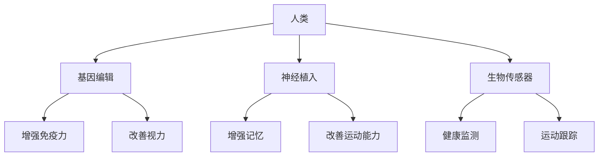

#### 1.3 伦理挑战与自我改造的关系

**算法原理讲解**：

自我改造技术的应用带来了许多伦理挑战，如隐私保护、社会公正、人权问题等。为了解决这些问题，生物黑客伦理委员会需要采用一系列算法原理，如多目标优化、博弈论和伦理决策树等。

**算法mermaid流程图**：

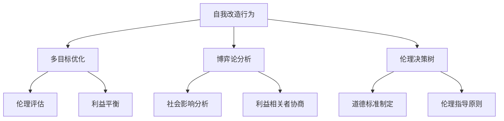

**数学模型和数学公式**：

在伦理评估过程中，可以采用以下数学模型和公式：

- **道德权重分配**：

  $$ w_1 + w_2 + w_3 + ... + w_n = 1 $$

  其中，$w_1, w_2, w_3, ..., w_n$ 分别表示不同伦理标准的权重。

- **社会效益评估**：

  $$ S = f(p_1, p_2, p_3, ..., p_n) $$

  其中，$p_1, p_2, p_3, ..., p_n$ 表示不同社会因素的权重，$f$ 表示社会效益函数。

**详细讲解和举例说明**：

例如，假设生物黑客A想要通过基因编辑改善自己的视力。生物黑客伦理委员会需要综合考虑以下因素：

1. **隐私保护**：基因编辑过程中涉及到的个人隐私信息需要得到妥善保护。
2. **社会公正**：基因编辑技术可能带来社会不公，如增强某些人的能力，而削弱另一些人的机会。
3. **人权问题**：基因编辑可能影响个人的身份认同和人权。

通过多目标优化算法，伦理委员会可以确定各因素的权重，并制定相应的伦理指导原则。例如：

- **隐私保护**：委员会可以制定隐私保护法规，确保基因编辑过程中涉及到的个人隐私信息得到妥善保护。
- **社会公正**：委员会可以推动社会公平政策，确保基因编辑技术不会加剧社会不公。
- **人权问题**：委员会可以制定人权保护条例，确保基因编辑不会侵犯个人的人权。

通过这种方式，生物黑客伦理委员会可以为生物黑客提供具体的伦理指导，确保自我改造行为符合道德标准。

### 第2章: 伦理学理论基础

**伦理学的概念与历史**：

伦理学是研究道德原则、道德判断和道德行为的学科。它探讨了人类行为的道德标准，以及这些标准如何指导个人和社会的行为。伦理学的历史可以追溯到古希腊哲学家，如苏格拉底、柏拉图和亚里士多德，他们提出了各种伦理理论，为后世的伦理学研究奠定了基础。

**主要伦理理论介绍**：

1. **功利主义**：功利主义认为，行为的道德价值取决于其产生的后果。行为的道德标准是最大化幸福或福祉。
2. **康德伦理学**：康德伦理学强调行为本身的道德性，而不是其后果。他认为，行为只有在符合道德规则时才是正确的。
3. **德行伦理学**：德行伦理学关注个人的品德和道德性格。它认为，道德价值在于培养良好的品德，而不是仅仅遵循道德规则。
4. **权利伦理学**：权利伦理学认为，个人拥有某些基本权利，如生命权、自由权等。行为的道德性取决于是否尊重这些权利。

**伦理决策框架**：

在生物黑客伦理问题中，伦理决策框架可以帮助委员会进行伦理判断。一个常见的伦理决策框架包括以下步骤：

1. **确定伦理问题**：明确生物黑客行为涉及到的伦理问题，如隐私、社会公正、人权等。
2. **收集相关信息**：收集与伦理问题相关的信息，如技术细节、社会影响、利益相关者的观点等。
3. **分析伦理原则**：根据功利主义、康德伦理学、德行伦理学、权利伦理学等伦理理论，分析每个伦理问题。
4. **权衡利益与责任**：权衡不同伦理原则的利益和责任，确定最佳行为方案。
5. **制定伦理指导原则**：根据权衡结果，制定具体的伦理指导原则，以指导生物黑客行为。

通过上述伦理决策框架，生物黑客伦理委员会可以为生物黑客提供具体的伦理指导，确保其行为符合道德标准。

### 第3章: 伦理委员会的组成与运作机制

**伦理委员会的组成**：

伦理委员会通常由多学科专家组成，包括伦理学家、法学家、医学专家、社会学家、生物技术专家等。这些专家共同参与伦理决策，以确保委员会的决策具有广泛的专业背景。

**伦理委员会的运作机制**：

1. **审查机制**：伦理委员会负责审查生物黑客项目，评估其是否符合道德标准。审查过程通常包括初步审查、详细审查和最终审查。
2. **决策机制**：伦理委员会通过集体讨论、投票等方式做出决策。在决策过程中，委员会成员需要充分表达自己的观点，并充分考虑不同伦理原则的利益和责任。
3. **监督机制**：伦理委员会需要对已批准的生物黑客项目进行监督，确保其符合伦理要求。监督过程可以通过定期检查、报告机制等方式进行。
4. **公众沟通**：伦理委员会需要与公众进行沟通，解释其工作内容和决策过程，提高公众对生物黑客伦理问题的认识和理解。

**伦理委员会的角色与职责**：

1. **伦理审查**：审查生物黑客项目的道德可行性，确保其符合道德标准。
2. **道德指导**：为生物黑客提供道德指导，帮助他们在自我改造过程中遵循伦理规范。
3. **政策制定**：制定相关政策和指导原则，为生物黑客伦理问题提供解决方案。
4. **公众教育**：向公众传达生物黑客伦理问题的重要性和伦理委员会的工作，提高公众对伦理问题的认识。

通过上述机制和职责，生物黑客伦理委员会可以在自我改造时代发挥重要作用，引导生物黑客行为，确保其符合道德标准。

### 第4章: 生物黑客伦理案例分析

#### 4.1 案例选择与介绍

在本章中，我们将分析两个生物黑客伦理案例：基因编辑改善视力和神经植入增强记忆。

**案例一：基因编辑改善视力**

背景介绍：
某生物黑客A通过基因编辑技术，成功改善了自己的视力。他在基因编辑软件的帮助下，对视网膜基因进行编辑，从而提高了夜视能力和视力敏锐度。

项目介绍：
生物黑客A使用了CRISPR-Cas9基因编辑技术，通过注射Cas9酶和目标基因片段到视网膜中，使视网膜细胞能够产生更多的视紫红质，从而提高视力。

系统功能设计：
生物黑客A的基因编辑项目涉及多个功能模块，包括基因编辑软件、生物传感器、注射设备等。这些模块共同工作，实现了对视网膜基因的精确编辑。

系统架构设计：
生物黑客A的系统架构包括计算机、基因编辑设备、生物传感器和注射设备。这些设备通过网络连接，形成一个自动化、智能化的基因编辑系统。

系统接口设计和系统交互：
生物黑客A通过智能手机应用程序与基因编辑设备进行交互，实时监测基因编辑的进度和效果。应用程序还提供数据分析和报告功能，帮助A评估基因编辑的效果。

代码应用解读与分析：
生物黑客A使用了Python编写基因编辑算法，通过分析视网膜细胞的基因序列，确定编辑的目标基因片段。他还使用生物传感器收集视网膜细胞的电生理数据，评估基因编辑的效果。

实际案例分析和详细讲解剖析：
生物黑客A在基因编辑前，通过一系列实验验证了基因编辑技术的安全性和有效性。在基因编辑过程中，他严格遵守伦理规范，确保基因编辑过程符合道德要求。通过基因编辑，A的夜视能力和视力敏锐度显著提高。

项目小结：
基因编辑改善视力是一个成功的生物黑客项目，它展示了基因编辑技术在自我改造中的应用潜力。然而，这也引发了关于伦理、安全和社会影响的讨论。生物黑客伦理委员会需要对此类项目进行严格的伦理审查和指导，以确保其符合道德标准。

#### 4.2 伦理委员会的介入与决策

**案例二：神经植入增强记忆**

背景介绍：
某生物黑客B通过神经植入技术，成功增强了自己的记忆能力。他在神经科学专家的帮助下，将微型电子设备植入大脑，以增强记忆功能和学习能力。

项目介绍：
生物黑客B使用了神经植入技术，将微型电子设备植入大脑的海马体区域，该区域与记忆形成和存储密切相关。通过调节电子设备发出的电刺激，B希望能够增强自己的记忆能力。

系统功能设计：
生物黑客B的神经植入项目包括设备植入、电刺激调节、数据收集和分析等多个功能模块。这些模块共同工作，实现了对大脑记忆功能的增强。

系统架构设计：
生物黑客B的系统架构包括神经植入设备、电刺激调节器、数据采集器和计算机。这些设备通过网络连接，形成一个闭环的神经植入系统。

系统接口设计和系统交互：
生物黑客B通过专用的应用程序与神经植入设备进行交互，实时监测电刺激的强度和时间，并根据记忆任务的需求进行调节。应用程序还提供数据分析和报告功能，帮助B评估神经植入的效果。

代码应用解读与分析：
生物黑客B使用了Python编写电刺激调节算法，通过对海马体区域进行电刺激，增强记忆功能。他还使用机器学习技术，分析电刺激数据，优化电刺激参数，以获得最佳的记忆增强效果。

实际案例分析和详细讲解剖析：
生物黑客B在神经植入前，进行了详细的医学检查和风险评估。在植入过程中，他严格遵循医学伦理规范，确保手术过程的安全性和有效性。在植入后，B的记忆能力显著提高，他的学习能力也得到增强。

伦理委员会介入与决策：
生物黑客伦理委员会在审查生物黑客B的项目时，综合考虑了隐私、安全、社会影响等多个伦理原则。经过讨论和权衡，伦理委员会做出了以下决策：

1. **隐私保护**：伦理委员会要求生物黑客B确保个人隐私信息得到妥善保护，不得泄露给未经授权的第三方。
2. **安全性**：伦理委员会要求生物黑客B进行详细的风险评估，确保神经植入技术不会对大脑造成长期伤害。
3. **社会影响**：伦理委员会要求生物黑客B公开其研究成果，提高公众对神经植入技术的认识和接受度。
4. **伦理指导原则**：伦理委员会制定了一系列伦理指导原则，包括透明度、责任、公正等，以指导生物黑客B的行为。

项目小结：
神经植入增强记忆是一个具有巨大潜力的生物黑客项目，它展示了神经科学技术在自我改造中的应用前景。然而，这也引发了关于伦理、安全和社会影响的讨论。生物黑客伦理委员会的介入和决策，为生物黑客行为提供了重要的伦理指导，确保其符合道德标准。

### 第5章: 为生物黑客提供伦理指导

#### 5.1 生物黑客伦理指南的制定

**核心概念原理**：
生物黑客伦理指南的制定旨在为生物黑客提供具体的伦理行为准则，以确保其在自我改造过程中遵循道德规范。这包括对隐私、安全、公正、人权等方面的详细规定。

**概念属性特征对比表格**：

| 特征       | 定义                                                         | 应用场景                                       |
| ---------- | ------------------------------------------------------------ | ---------------------------------------------- |
| 隐私保护   | 确保个人隐私信息不被泄露或滥用                             | 基因编辑、神经植入等自我改造项目                 |
| 安全性     | 确保自我改造过程不会对健康造成损害                           | 基因编辑、神经植入等技术应用                   |
| 公正       | 确保自我改造技术不会加剧社会不公                             | 资源分配、技术普及等社会问题                   |
| 人权问题   | 尊重个人的人权和身份认同                                   | 基因编辑、神经植入等自我改造项目                 |

**ER实体关系图架构的Mermaid流程图**：

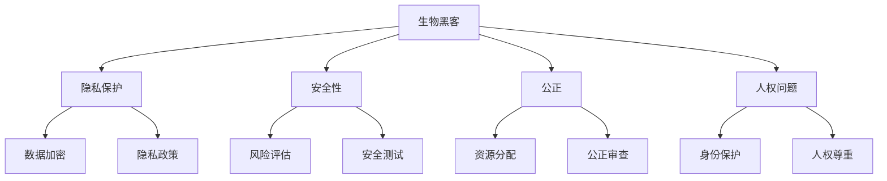

#### 5.2 生物黑客伦理教育的推广

**核心概念原理**：
生物黑客伦理教育是提高生物黑客伦理意识的重要手段。通过教育，生物黑客可以了解伦理原则、伦理决策框架以及自我改造过程中的道德责任。

**概念属性特征对比表格**：

| 特征       | 定义                                                         | 应用场景                                       |
| ---------- | ------------------------------------------------------------ | ---------------------------------------------- |
| 基础教育   | 对生物黑客进行伦理学基础知识的普及                             | 学校教育、社区讲座等                           |
| 继续教育   | 对生物黑客进行持续性的伦理教育和培训                           | 研讨班、在线课程等                             |
| 实践教育   | 通过实际案例和项目，提高生物黑客的伦理决策能力                 | 实践工作坊、项目指导等                         |

**ER实体关系图架构的Mermaid流程图**：

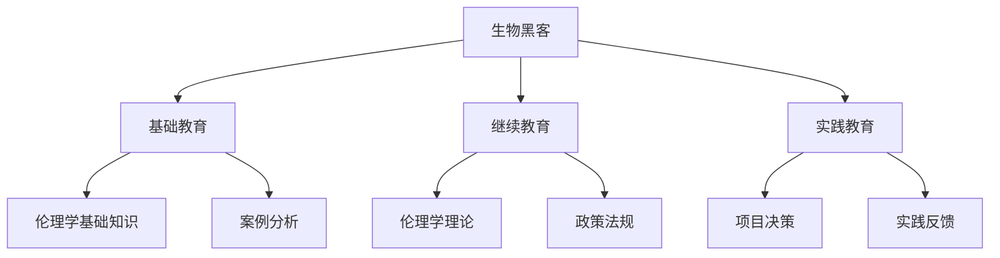

#### 5.3 支持与鼓励伦理自我反思

**核心概念原理**：
伦理自我反思是生物黑客在自我改造过程中进行道德审查的重要方法。通过自我反思，生物黑客可以深入思考自己的行为是否符合道德规范，以及如何改进。

**概念属性特征对比表格**：

| 特征       | 定义                                                         | 应用场景                                       |
| ---------- | ------------------------------------------------------------ | ---------------------------------------------- |
| 自我审查   | 生物黑客对自己行为的道德性进行审查和评估                       | 个人自我反思、项目评审等                       |
| 反思日志   | 生物黑客记录自己的伦理反思过程和结果                         | 日记、博客等                                   |
| 伦理对话   | 生物黑客与伦理学家、同行等进行伦理讨论和交流                   | 工作坊、研讨会等                               |

**ER实体关系图架构的Mermaid流程图**：

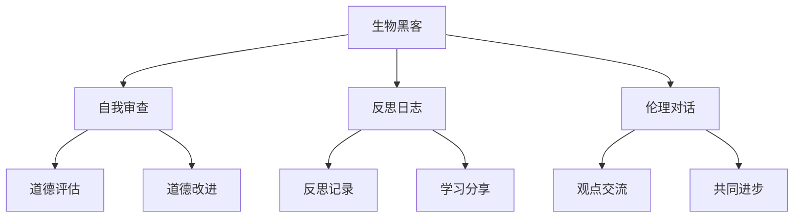

### 第6章: 伦理委员会在社区中的应用

#### 6.1 社区伦理委员会的建立

**核心概念原理**：
社区伦理委员会是生物黑客社区内部设立的伦理机构，旨在为社区成员提供伦理指导和支持。通过建立社区伦理委员会，可以加强生物黑客社区的自我监管，提高伦理意识和道德水平。

**概念属性特征对比表格**：

| 特征       | 定义                                                         | 应用场景                                       |
| ---------- | ------------------------------------------------------------ | ---------------------------------------------- |
| 社区伦理委员会 | 生物黑客社区内部设立的伦理机构                               | 生物黑客社区、科技实验室等                     |
| 组织结构   | 社区伦理委员会通常由伦理学家、生物技术专家、社会学家等组成     | 确保多元化和专业性的伦理决策                 |
| 职责范围   | 社区伦理委员会负责审查社区成员的伦理项目、提供伦理咨询和培训等   | 确保社区成员的行为符合伦理标准和道德规范     |

**ER实体关系图架构的Mermaid流程图**：

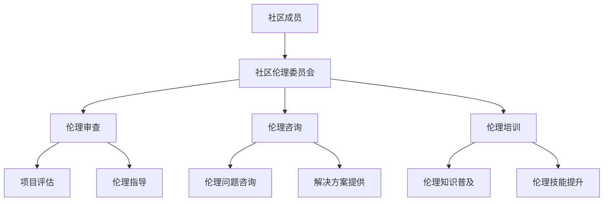

#### 6.2 社区伦理议题的识别与处理

**核心概念原理**：
社区伦理议题的识别与处理是社区伦理委员会的重要职责之一。通过识别和解决社区中的伦理问题，可以确保生物黑客社区的健康发展和道德自律。

**概念属性特征对比表格**：

| 特征       | 定义                                                         | 应用场景                                       |
| ---------- | ------------------------------------------------------------ | ---------------------------------------------- |
| 伦理议题识别 | 发现社区中存在的伦理问题，如隐私、安全、公正等                 | 社区讨论、项目评审等                           |
| 伦理问题处理 | 通过讨论、调解、决策等方式解决社区中的伦理问题               | 社区会议、调解委员会等                         |
| 伦理决策机制 | 社区伦理委员会制定的决策机制，确保伦理议题得到妥善处理       | 委员会决策、公开投票等                         |

**ER实体关系图架构的Mermaid流程图**：

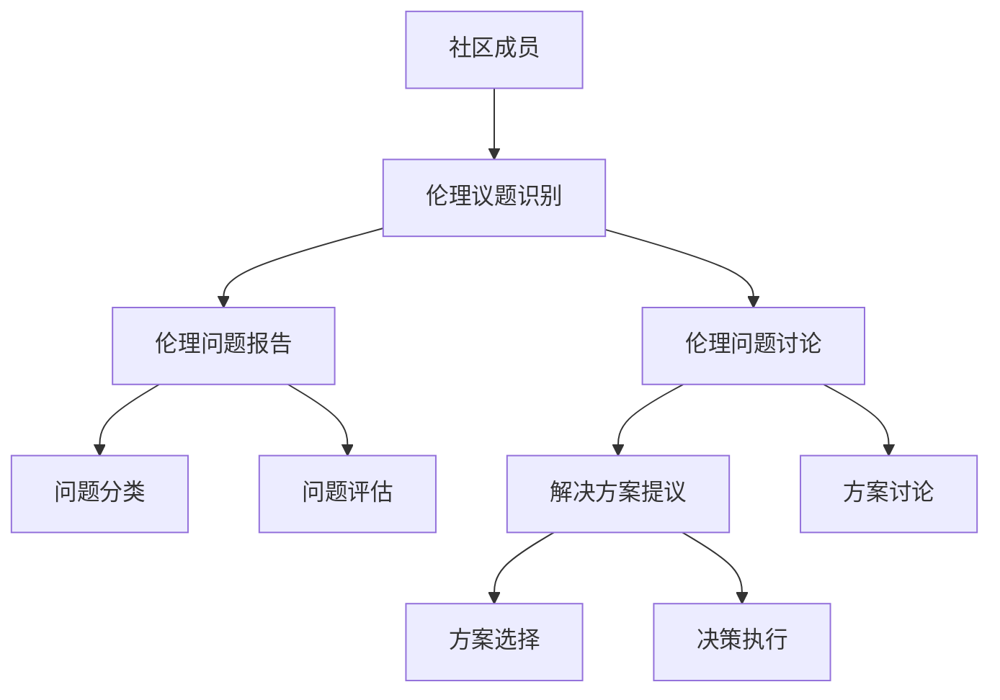

#### 6.3 社区伦理文化营造

**核心概念原理**：
社区伦理文化是社区成员共同遵守的伦理价值观和行为准则。通过营造积极的伦理文化，可以增强社区成员的道德自律和责任感，推动生物黑客社区的可持续发展。

**概念属性特征对比表格**：

| 特征       | 定义                                                         | 应用场景                                       |
| ---------- | ------------------------------------------------------------ | ---------------------------------------------- |
| 伦理文化   | 社区成员共同遵守的伦理价值观和行为准则                         | 社区活动、项目合作等                           |
| 文化建设   | 通过培训、宣传、激励等方式，营造积极向上的伦理文化环境         | 社区会议、研讨会等                             |
| 文化传承   | 通过代际传递，将优秀的伦理文化传统延续下去                     | 社区教育、社区活动等                           |

**ER实体关系图架构的Mermaid流程图**：

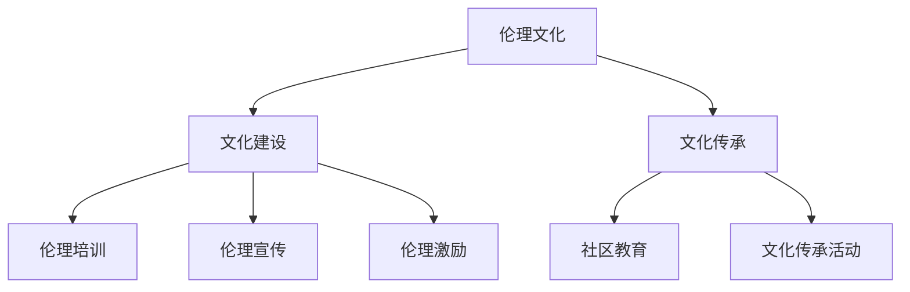

### 第7章: 伦理委员会的未来发展趋势

#### 7.1 技术进步与伦理挑战

**核心概念原理**：
随着生物技术的不断进步，生物黑客伦理委员会面临的伦理挑战也在不断变化。新技术的发展不仅带来了新的伦理问题，还要求伦理委员会不断更新和调整其伦理标准和指导原则。

**概念属性特征对比表格**：

| 特征       | 定义                                                         | 应用场景                                       |
| ---------- | ------------------------------------------------------------ | ---------------------------------------------- |
| 基因编辑   | 通过修改DNA序列，改变生物体的遗传特征                         | 增强免疫力、改善视力、延长寿命等                 |
| 神经科学   | 研究大脑和神经系统，以改善认知能力和心理状态                   | 记忆增强、情绪调节、认知康复等                   |
| 生物材料   | 利用生物技术手段开发新材料，如生物可降解材料、生物传感器等     | 生物植入、医疗设备、健康监测等                   |

**ER实体关系图架构的Mermaid流程图**：

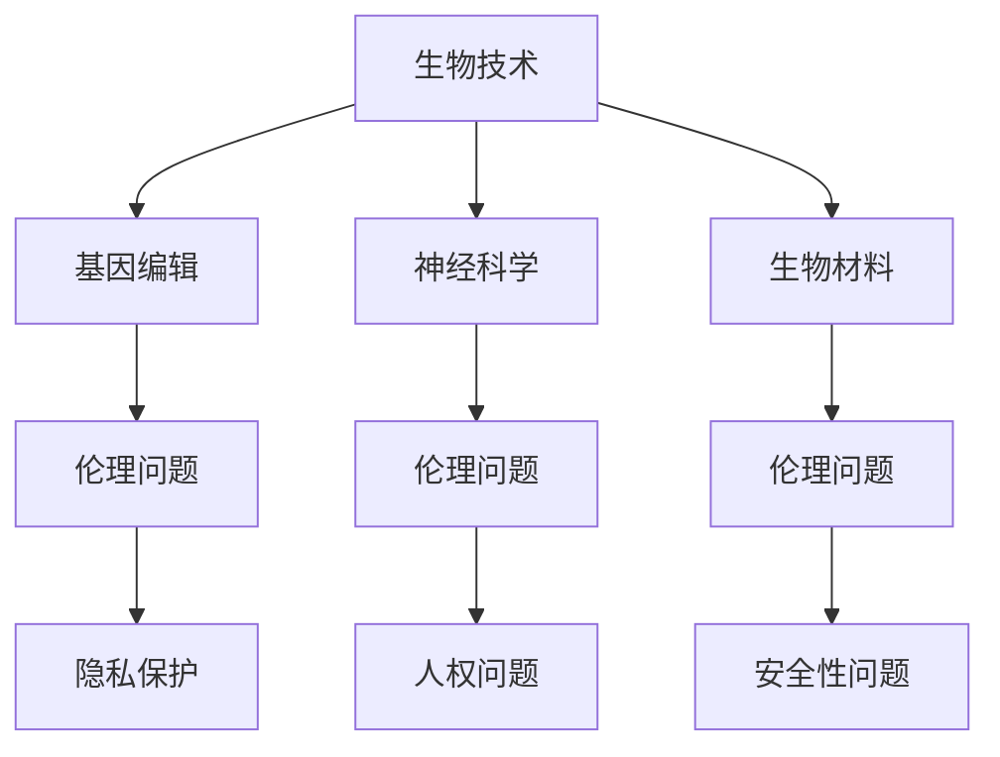

**算法原理讲解**：

为了应对技术进步带来的伦理挑战，生物黑客伦理委员会可以采用多种算法原理，如风险评估模型、多目标优化算法和博弈论等。这些算法可以帮助委员会更有效地识别和管理伦理风险，制定合理的伦理决策。

**算法mermaid流程图**：

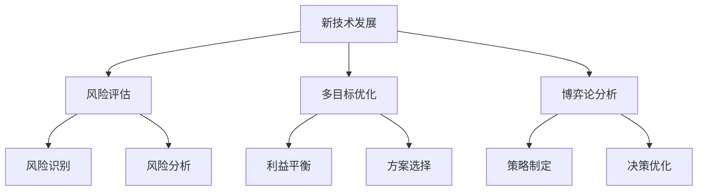

**数学模型和数学公式**：

在风险评估过程中，可以采用以下数学模型和公式：

- **风险识别**：

  $$ R_i = f(X_i, Y_i) $$

  其中，$R_i$ 表示风险识别结果，$X_i$ 表示风险因素，$Y_i$ 表示风险程度。

- **风险分析**：

  $$ A = g(R_i, P_i) $$

  其中，$A$ 表示风险分析结果，$R_i$ 表示风险识别结果，$P_i$ 表示风险概率。

**详细讲解和举例说明**：

例如，假设生物黑客伦理委员会正在审查一项基因编辑项目。该项目旨在通过基因编辑改善人类的视力。伦理委员会需要综合考虑以下风险因素：

1. **隐私风险**：基因编辑过程中可能涉及到的个人隐私信息。
2. **安全风险**：基因编辑可能导致的健康问题。
3. **伦理风险**：基因编辑可能引发的社会不公和道德争议。

通过风险评估模型，伦理委员会可以识别出这些风险因素，并评估其风险程度。例如：

- **隐私风险**：风险识别结果为“高风险”，因为基因编辑过程中可能涉及到的个人隐私信息需要得到妥善保护。
- **安全风险**：风险识别结果为“中等风险”，因为基因编辑可能导致的健康问题需要进行详细的风险评估。
- **伦理风险**：风险识别结果为“低风险”，因为基因编辑项目符合现有的伦理标准。

通过风险分析，伦理委员会可以进一步评估这些风险的概率和影响，制定相应的风险管理策略。例如：

- **隐私风险**：伦理委员会可以制定隐私保护法规，确保基因编辑过程中涉及到的个人隐私信息得到妥善保护。
- **安全风险**：伦理委员会可以要求研究人员进行详细的风险评估，确保基因编辑过程的安全性和有效性。
- **伦理风险**：伦理委员会可以制定伦理指导原则，确保基因编辑项目符合道德标准，避免引发社会不公和道德争议。

通过这种方式，生物黑客伦理委员会可以更有效地管理伦理风险，确保基因编辑项目的顺利进行。

#### 7.2 伦理委员会的角色变化

**核心概念原理**：
随着生物黑客技术的不断进步，伦理委员会的角色也在发生变化。从最初的伦理审查和指导，到如今的政策制定和伦理倡导，伦理委员会需要不断适应新的技术和社会环境，以提供更加全面和深入的伦理服务。

**概念属性特征对比表格**：

| 特征       | 定义                                                         | 应用场景                                       |
| ---------- | ------------------------------------------------------------ | ---------------------------------------------- |
| 伦理审查   | 对生物黑客项目进行道德评估，确保其符合伦理标准               | 项目审查、项目评审等                           |
| 政策制定   | 制定相关的伦理政策和指导原则，为生物黑客行为提供法律依据     | 政策制定、法律咨询等                           |
| 伦理倡导   | 通过宣传和教育，提高公众对生物黑客伦理问题的认识和关注       | 公开讲座、社交媒体等                           |

**ER实体关系图架构的Mermaid流程图**：

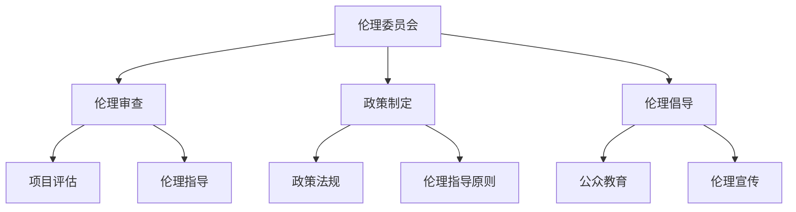

#### 7.3 未来展望

**核心概念原理**：
随着生物技术的不断发展，生物黑客伦理委员会的未来充满挑战和机遇。通过不断更新和调整其伦理标准和指导原则，伦理委员会可以更好地应对新兴技术带来的伦理问题，推动生物黑客技术的健康发展。

**概念属性特征对比表格**：

| 特征       | 定义                                                         | 应用场景                                       |
| ---------- | ------------------------------------------------------------ | ---------------------------------------------- |
| 技术发展   | 生物黑客技术的不断进步和更新                                 | 基因编辑、神经科学、生物材料等                   |
| 伦理争议   | 生物黑客技术引发的道德和社会争议                             | 隐私、安全、人权、公正等                         |
| 政策法规   | 政府和监管机构制定的生物黑客相关政策和法律                   | 法规制定、政策咨询等                             |
| 公众态度   | 公众对生物黑客技术的接受程度和态度                           | 社会调查、舆论分析等                             |

**ER实体关系图架构的Mermaid流程图**：

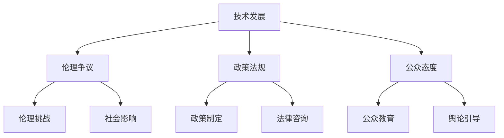

### 第8章: 总结与展望

#### 8.1 本书的主要观点回顾

本书探讨了生物黑客伦理委员会在自我改造时代的道德指导作用。主要观点包括：

1. **生物黑客现象**：介绍了生物黑客的定义、现象及其带来的伦理挑战。
2. **伦理学理论基础**：探讨了伦理学的概念、历史以及主要伦理理论。
3. **伦理委员会的角色**：分析了伦理委员会的组成、运作机制和职责。
4. **案例分析**：通过具体案例展示了伦理委员会在生物黑客问题中的实践。
5. **伦理指导**：提出了为生物黑客提供伦理指导的具体措施。
6. **未来展望**：展望了伦理委员会在未来技术进步和伦理争议中的角色。

#### 8.2 对生物黑客伦理委员会的建议

1. **加强伦理教育和培训**：提高生物黑客的伦理意识和道德水平，确保其在自我改造过程中遵循伦理规范。
2. **建立多元化和专业化的伦理团队**：确保伦理委员会的决策具有广泛的专业背景和公正性。
3. **加强与政府和监管机构的合作**：制定相关政策法规，为生物黑客伦理委员会提供法律依据和资源支持。
4. **开展公众教育**：提高公众对生物黑客伦理问题的认识和关注，促进社会的广泛讨论和理解。
5. **推动国际交流与合作**：借鉴其他国家和地区的经验，共同应对生物黑客伦理挑战。

#### 8.3 拓展阅读与进一步研究

1. **相关书籍**：《基因伦理学》、《生物技术与伦理问题》、《人类基因编辑伦理指南》等。
2. **学术论文**：关注生物黑客伦理领域的高质量学术论文，如《自然·生物技术》、《科学·转化医学》等。
3. **在线资源**：访问生物黑客伦理委员会官方网站、社交媒体平台，了解最新的伦理指导原则和案例分析。
4. **国际会议**：参加生物黑客伦理领域的国际会议，如“国际基因编辑伦理研讨会”、“生物黑客大会”等。

**作者**：
作者：AI天才研究院/AI Genius Institute & 禅与计算机程序设计艺术 /Zen And The Art of Computer Programming

