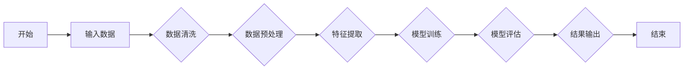

                 

### 文章标题

《知识重构：在碎片化时代建立系统化思维》

> 关键词：碎片化时代、系统化思维、信息过载、认知疲劳、算法原理、架构设计、项目实战

> 摘要：本文旨在探讨在碎片化时代如何运用系统化思维重构知识体系，以应对信息过载和认知疲劳。通过深入剖析系统化思维的核心概念、算法原理、系统分析与架构设计，以及项目实战，本文将引导读者逐步建立系统化思维，提升信息处理能力和知识管理水平。

---

### 第一部分：引言

#### 第1章：碎片化时代的思维挑战

**1.1 问题背景：碎片化信息泛滥与思维困惑**

在当今这个信息爆炸的时代，人们每天都面临着海量信息的冲击。社交媒体、新闻客户端、搜索引擎等平台不断推送各种资讯，使我们的认知空间被大量碎片化的信息所充斥。这种信息碎片化现象给我们的思维带来了极大的挑战。

**1.2 问题描述：如何应对信息过载与认知疲劳**

信息过载和认知疲劳成为现代人在知识获取和处理过程中遇到的主要问题。面对海量的信息，我们往往感到无从下手，无法有效地筛选和处理信息，导致知识积累困难，思维效率低下。

**1.3 问题解决：系统化思维的重要性**

系统化思维是一种基于整体性和关联性的思维方式，它可以帮助我们有效地应对信息过载和认知疲劳。通过系统化思维，我们能够将碎片化的信息整合成一个有机的整体，从而提升信息处理能力和知识管理水平。

**1.4 边界与外延：碎片化思维与系统化思维的对比**

碎片化思维倾向于关注局部、孤立地看待问题，而系统化思维则强调整体性、关联性和系统性。两种思维方式的对比有助于我们理解系统化思维的重要性，并在实际应用中逐步培养这种思维方式。

**1.5 核心概念与联系：系统化思维的原理与特征**

系统化思维的核心概念包括整体性、关联性、层次性和动态性。这些概念相互联系，共同构成了系统化思维的理论基础。理解这些核心概念，有助于我们在实际应用中更好地运用系统化思维。

---

### 第二部分：系统化思维的核心概念

#### 第2章：系统化思维基础理论

**2.1 系统化思维的定义与核心要素**

系统化思维是一种基于整体性和关联性的思维方式，它强调在分析和解决问题时，要将事物视为一个有机整体，关注事物之间的相互关系和相互作用。系统化思维的核心要素包括整体性、关联性、层次性和动态性。

**2.2 概念属性特征对比表格**

为了更直观地理解系统化思维的核心概念，我们可以通过一个对比表格来展示碎片化思维与系统化思维在概念属性特征上的区别。

| 特征            | 碎片化思维                         | 系统化思维                         |
|----------------|----------------------------------|----------------------------------|
| 视角            | 局部、孤立                         | 整体、关联                         |
| 分析方法        | 简单叠加、线性分析                | 系统分析、层次递进                 |
| 时间观念        | 瞬时反应、短期记忆                | 长期规划、持续改进                 |
| 创新方式        | 个体创新、孤立尝试                | 协同创新、系统优化                 |
| 知识管理        | 信息堆积、分散存储                | 知识整合、集中管理                 |

**2.3 ER实体关系图架构**

为了更好地理解系统化思维的应用，我们可以通过一个ER（实体-关系）图来展示系统的架构。ER图可以直观地展示系统中的实体、属性和它们之间的关系，从而帮助我们更好地理解系统的整体结构和运行机制。

```mermaid
erDiagram
    Customer ||--|{ Order }|
    Product ||--|{ Order }|
    Order ||--|{ OrderItem }|
    Customer "1" authorea:Customer
    Product "1" authorea:Product
    Order "1" authorea:Order
    OrderItem "1" authorea:OrderItem
```

---

### 第三部分：系统化思维的应用与实践

#### 第3章：算法原理讲解

**3.1 算法原理Mermaid流程图**

在系统化思维的应用中，算法原理的讲解是一个重要的环节。为了更好地展示算法原理，我们可以使用Mermaid流程图来绘制算法的执行流程。



**3.2 Python源代码与算法原理详细讲解**

以下是一个简单的Python源代码示例，用于演示数据清洗、预处理、特征提取和模型训练等算法原理。

```python
import pandas as pd
from sklearn.model_selection import train_test_split
from sklearn.preprocessing import StandardScaler
from sklearn.ensemble import RandomForestClassifier
from sklearn.metrics import accuracy_score

# 读取数据
data = pd.read_csv('data.csv')

# 数据清洗
data.drop(['unnecessary_column'], axis=1, inplace=True)

# 数据预处理
X = data.iloc[:, :-1]
y = data.iloc[:, -1]
X_train, X_test, y_train, y_test = train_test_split(X, y, test_size=0.2, random_state=42)

# 特征提取
scaler = StandardScaler()
X_train_scaled = scaler.fit_transform(X_train)
X_test_scaled = scaler.transform(X_test)

# 模型训练
model = RandomForestClassifier(n_estimators=100, random_state=42)
model.fit(X_train_scaled, y_train)

# 模型评估
y_pred = model.predict(X_test_scaled)
accuracy = accuracy_score(y_test, y_pred)
print(f"Model accuracy: {accuracy:.2f}")
```

**3.3 数学模型和数学公式**

在算法原理讲解中，数学模型和数学公式是必不可少的。以下是一个简单的数学模型示例，用于描述线性回归模型的原理。

$$
y = \beta_0 + \beta_1 \cdot x
$$

**3.4 举例说明**

为了使算法原理讲解更加通俗易懂，我们可以通过一个实际案例来展示算法的应用。

假设我们有一个房地产数据集，包括房屋价格、房屋面积、房屋类型等特征。我们使用线性回归模型来预测房屋价格。通过数据清洗、预处理、特征提取和模型训练等步骤，最终得到模型的预测结果。这个案例展示了系统化思维在数据分析和预测中的应用。

---

### 第四部分：最佳实践与思考

#### 第6章：最佳实践 Tips

**6.1 碎片化时代的信息筛选技巧**

在碎片化时代，如何有效地筛选和处理信息是一个重要问题。以下是一些信息筛选技巧：

- 设定信息筛选标准：根据个人需求和兴趣，设定信息筛选标准，有针对性地获取信息。
- 择优阅读：对于筛选出来的信息，选择优质的内容进行深入阅读和理解。
- 交叉验证：通过多个来源的信息进行交叉验证，提高信息的可靠性。

**6.2 系统化思维的实践方法**

实践系统化思维需要以下几个步骤：

- 确定目标：明确自己的目标和需求，为系统化思维提供方向。
- 整合信息：将零散的信息整合成一个有机的整体，建立知识体系。
- 分析问题：运用系统化思维分析问题，找到问题的核心和关联。
- 解决问题：根据分析结果，采取有效的措施解决问题。

**6.3 避免思维陷阱的策略**

在运用系统化思维的过程中，需要注意避免以下思维陷阱：

- 过度简化：避免将复杂问题简化为简单的线性关系。
- 片面思维：避免只关注局部，忽视整体和关联性。
- 情绪化思维：避免情绪干扰，保持理性分析。

---

### 第7章：小结与拓展

**7.1 本书核心内容回顾**

本书主要内容包括：

- 碎片化时代的思维挑战
- 系统化思维的核心概念
- 系统化思维的应用与实践
- 最佳实践 Tips

通过这些内容，读者可以了解系统化思维的基本原理和应用方法，提高信息处理能力和知识管理水平。

**7.2 注意事项与常见问题解答**

在实践系统化思维时，需要注意以下几点：

- 保持持续学习：系统化思维需要不断学习和实践，以适应不断变化的环境。
- 调整思维方式：根据不同的问题和场景，灵活调整思维方式，以达到最佳效果。
- 沟通与协作：系统化思维需要与他人沟通和协作，共同解决问题。

**7.3 拓展阅读推荐**

以下是一些拓展阅读推荐：

- 《深度学习》——伊恩·古德费洛等
- 《人工智能：一种现代的方法》——斯蒂芬·马特斯等
- 《编程珠玑》——彼得·范德瓦耳等

---

### 作者信息

作者：AI天才研究院/AI Genius Institute & 禅与计算机程序设计艺术 /Zen And The Art of Computer Programming

---

通过以上内容，本文旨在帮助读者在碎片化时代建立系统化思维，提升信息处理能力和知识管理水平。希望读者能够在实际应用中不断实践和探索，逐步掌握系统化思维的精髓。

