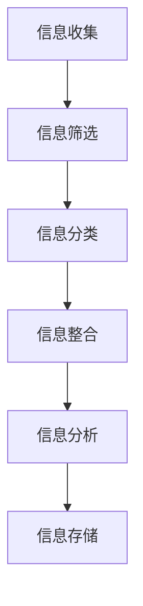
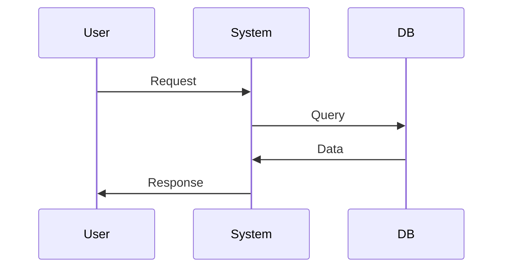
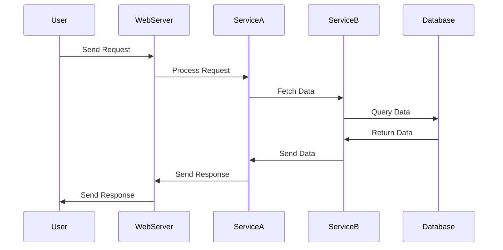
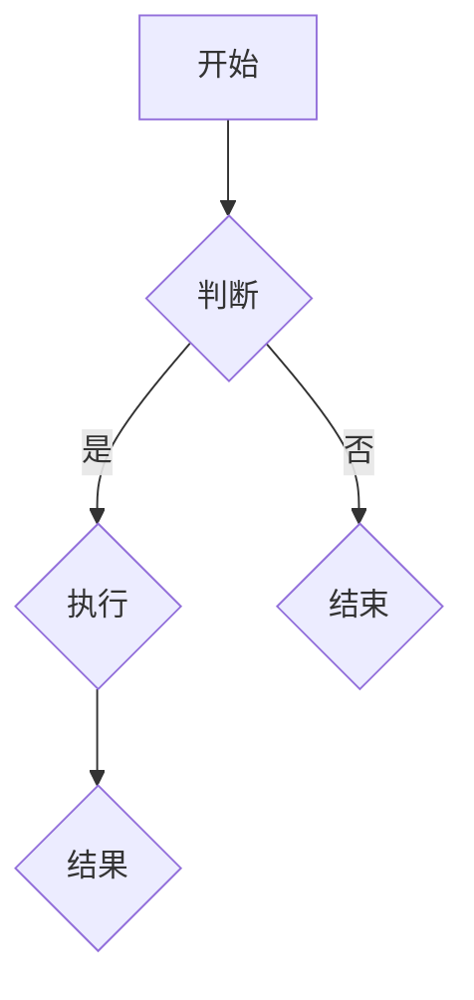
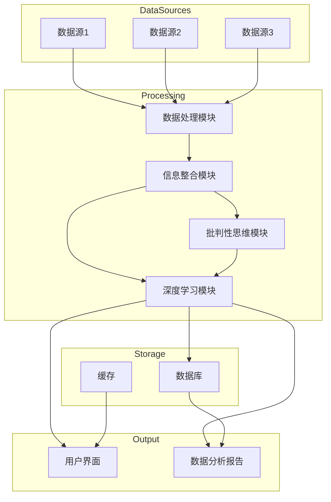

                 

# 引言

## 1.1 书籍目的与重要性

在当今这个信息爆炸的时代，我们每天都会接触到大量的碎片化信息。从社交媒体到新闻网站，从手机应用到电子邮件，信息似乎无处不在。然而，这些碎片化的信息却给我们带来了一系列的挑战。首先，信息过载导致我们的认知能力减弱，无法有效地处理和整合这些信息。其次，社交关系的破裂，我们往往在信息的海洋中迷失自我，与他人的沟通和理解变得困难。因此，构建一个整体的世界观变得尤为重要。

本书的目的是帮助读者在这个碎片化的信息时代构建一个整体的世界观。我们希望通过本书的阐述，让读者能够更好地理解碎片化信息的本质，认识到信息整合的重要性，掌握批判性思维和深度学习的方法，从而在复杂的信息环境中游刃有余。

## 1.2 碎片化信息的来源

碎片化信息的来源非常广泛。首先是社交媒体，如微博、微信、Facebook等，这些平台每天都会产生大量的信息。其次是新闻网站，它们提供各类新闻和资讯，让我们了解到世界的各种变化。此外，还有电子邮件、手机应用等，它们也是我们接收碎片化信息的重要渠道。然而，正是这些看似便利的信息来源，让我们陷入了信息的海洋，难以自拔。

### 1.2.1 信息爆炸的时代

我们生活在一个信息爆炸的时代，每天都会产生大量的信息。据统计，全球每天产生的数据量已经达到了惊人的速度，而这个速度还在不断增长。这种信息爆炸的现象，给我们带来了极大的挑战。首先，信息过载导致我们的认知能力减弱。我们无法有效地处理和整合这些信息，导致我们的思维变得混乱。其次，信息爆炸也导致了社交关系的破裂。我们往往在信息的海洋中迷失自我，与他人的沟通和理解变得困难。

### 1.2.2 信息过载的挑战

信息过载是碎片化信息带来的一个重要挑战。当我们每天都要接收大量的信息时，我们的认知能力就会受到很大的影响。我们无法有效地处理和整合这些信息，导致我们的思维变得混乱。此外，信息过载还可能导致我们的情绪受到影响，产生焦虑和压力。因此，如何应对信息过载，成为了一个亟待解决的问题。

## 1.3 心理与认知的影响

碎片化信息不仅对我们的认知能力产生负面影响，还可能对我们的心理健康产生重大影响。首先，信息过载会导致我们的注意力分散，无法专注于一项任务。其次，碎片化信息可能引发我们的焦虑和压力，影响我们的情绪和心理健康。此外，信息过载还可能导致我们的社交能力下降，难以与他人建立深层次的联系。

### 1.3.1 注意力的分散

注意力分散是碎片化信息给我们带来的一个重要挑战。当我们每天都要接收大量的信息时，我们的注意力很容易被分散。我们可能会在浏览社交媒体、查看电子邮件、阅读新闻等过程中，不断地切换注意力，导致我们的思维变得混乱。这种注意力分散不仅影响了我们的工作效率，还可能对我们的身心健康产生负面影响。

### 1.3.2 精神压力的增加

精神压力的增加是碎片化信息给我们带来的另一个重要挑战。当我们每天都要接收大量的信息时，我们可能会感到焦虑和压力。这些情绪可能会影响我们的睡眠、饮食和心理健康。长期处于这种状态，可能会导致我们产生抑郁、焦虑等心理问题，严重影响我们的生活质量。

## 1.4 作者观点与视角

作为一名世界级人工智能专家，我深刻认识到碎片化信息时代的挑战。在这个时代，我们需要具备更强的信息整合能力和批判性思维，才能在复杂的信息环境中游刃有余。因此，我撰写本书，旨在帮助读者构建一个整体的世界观，提升他们的信息处理能力和心理健康。

## 1.5 整体世界观的作用

整体世界观的作用在于，它能够帮助我们在复杂的信息环境中保持清晰和稳定。通过构建一个整体的世界观，我们能够更好地理解信息的本质，从而有效地整合和利用这些信息。此外，整体世界观还能够帮助我们培养批判性思维，提高我们的认知能力，从而在面对挑战时做出更明智的决策。总的来说，整体世界观是我们在碎片化信息时代不可或缺的指南针。# 背景与问题分析

## 2.1 碎片化信息的背景

### 2.1.1 信息爆炸的时代

在当今这个时代，信息爆炸已经成为一个不可逆转的趋势。随着互联网和移动设备的普及，人们可以随时随地获取各种信息。从新闻、社交媒体到博客、论坛，信息来源变得多样化，信息传播速度也大幅提升。然而，这种信息爆炸的现象同时也带来了信息过载的问题。

信息爆炸意味着我们每天都要面对海量的信息。这些信息来自不同的渠道，形式多样，包括文字、图片、音频和视频等。这种信息过载的现象不仅让我们感到应接不暇，还可能导致我们的认知负担加重，难以有效地处理和整合这些信息。

### 2.1.2 信息过载的挑战

信息过载是碎片化信息带来的一个重要挑战。当我们每天都要接收大量的信息时，我们的认知能力就会受到很大的影响。我们无法有效地处理和整合这些信息，导致我们的思维变得混乱。此外，信息过载还可能导致我们的情绪受到影响，产生焦虑和压力。

首先，信息过载会影响我们的工作效率。当我们无法有效地处理和整合信息时，可能会在任务之间频繁切换，导致注意力分散，无法专注于一项任务。这不仅影响了我们的工作效率，还可能导致我们的工作质量下降。

其次，信息过载还可能影响我们的心理健康。面对海量的信息，我们可能会感到焦虑和压力。这些情绪可能会影响我们的睡眠、饮食和心理健康，导致我们产生抑郁、焦虑等心理问题，严重影响我们的生活质量。

### 2.1.3 信息碎片化的影响

信息碎片化是信息爆炸时代的一个显著特征。信息碎片化意味着信息的传播和获取变得更加分散，信息的结构也变得更加零散。这种碎片化不仅影响了我们的信息处理能力，还可能对我们的认知发展产生负面影响。

首先，信息碎片化可能导致我们的认知能力减弱。由于信息碎片化，我们往往只能获得部分信息，难以形成全面的理解。这种碎片化的信息获取方式可能会影响我们的认知发展，导致我们的思维变得狭隘，难以形成系统的世界观。

其次，信息碎片化还可能影响我们的社交关系。在信息碎片化的环境中，我们往往只能通过碎片化的信息与他人进行交流，这可能导致我们的社交关系变得浅薄，难以建立深层次的联系。

### 2.1.4 信息碎片化的原因

信息碎片化的现象可以从多个角度进行分析。

首先，技术因素是信息碎片化的重要原因。随着互联网和移动设备的普及，信息的传播和获取变得更加方便。然而，这也导致了信息的过度分散，每个人都可以成为信息的发布者和传播者，使得信息变得零散和碎片化。

其次，社会文化因素也是信息碎片化的重要原因。在现代社会，人们对于信息的需求和获取方式发生了变化。人们更倾向于快速获取信息，而不是深入理解和分析。这种文化背景下，信息碎片化成为了一种普遍的现象。

最后，个体心理因素也是信息碎片化的重要原因。在信息过载的环境中，人们往往选择性地关注和获取信息，导致信息变得零散和碎片化。

## 2.2 碎片化信息的影响

### 2.2.1 认知能力的减弱

碎片化信息对认知能力的影响是一个不容忽视的问题。首先，信息碎片化可能导致我们的认知能力减弱。由于信息碎片化，我们往往只能获得部分信息，难以形成全面的理解。这种碎片化的信息获取方式可能会影响我们的认知发展，导致我们的思维变得狭隘，难以形成系统的世界观。

其次，碎片化信息还可能导致我们的注意力分散。在信息过载的环境中，我们可能会在多个信息源之间频繁切换，导致我们的注意力难以集中。这种注意力分散不仅影响了我们的工作效率，还可能导致我们的心理健康问题。

### 2.2.2 社交关系的破裂

碎片化信息还可能对我们的社交关系产生负面影响。在信息碎片化的环境中，我们往往只能通过碎片化的信息与他人进行交流，这可能导致我们的社交关系变得浅薄，难以建立深层次的联系。此外，由于信息碎片化导致的信息过载，我们可能会对他人产生误解和偏见，从而影响我们的社交互动。

### 2.2.3 心理健康的挑战

碎片化信息可能对心理健康产生负面影响。首先，信息过载可能导致我们产生焦虑和压力。面对海量的信息，我们可能会感到无所适从，产生焦虑和压力。这些情绪可能会影响我们的睡眠、饮食和心理健康，导致我们产生抑郁、焦虑等心理问题。

其次，碎片化信息可能导致我们的认知负担加重。由于信息碎片化，我们往往需要花费更多的时间和精力来处理和整合这些信息，导致我们的认知负担加重。长期处于这种状态，可能会导致我们的认知能力下降，影响我们的心理健康。

### 2.2.4 信息整合的困难

碎片化信息的一个显著特征是信息的分散和零散。这种碎片化的信息结构给我们带来了信息整合的困难。由于信息来源多样，形式各异，我们往往需要花费大量的时间和精力来筛选和整合这些信息。这种信息整合的困难不仅影响了我们的工作效率，还可能导致我们的认知能力下降。

## 2.3 心理与认知挑战

### 2.3.1 注意力的分散

注意力分散是碎片化信息给我们带来的一个重要挑战。在信息过载的环境中，我们可能会在多个信息源之间频繁切换，导致我们的注意力难以集中。这种注意力分散不仅影响了我们的工作效率，还可能导致我们的心理健康问题。

### 2.3.2 精神压力的增加

精神压力的增加是碎片化信息给我们带来的另一个重要挑战。面对海量的信息，我们可能会感到焦虑和压力。这些情绪可能会影响我们的睡眠、饮食和心理健康，导致我们产生抑郁、焦虑等心理问题。

### 2.3.3 认知负荷的增加

认知负荷的增加是碎片化信息给我们带来的另一个挑战。由于信息碎片化，我们往往需要花费更多的时间和精力来处理和整合这些信息，导致我们的认知负荷增加。长期处于这种状态，可能会导致我们的认知能力下降，影响我们的心理健康。

### 2.3.4 社交关系的破裂

碎片化信息可能导致我们的社交关系变得浅薄，难以建立深层次的联系。在信息碎片化的环境中，我们往往只能通过碎片化的信息与他人进行交流，这可能导致我们的社交关系变得浅薄，难以建立深层次的联系。

### 2.3.5 认知偏差的加剧

碎片化信息可能导致我们的认知偏差加剧。由于信息来源的多样性，我们可能会在获取信息时产生认知偏差，难以形成全面和客观的理解。这种认知偏差不仅影响了我们的决策能力，还可能导致我们的心理和行为出现偏差。

### 2.3.6 心理健康的挑战

碎片化信息可能对心理健康产生负面影响。首先，信息过载可能导致我们产生焦虑和压力。面对海量的信息，我们可能会感到无所适从，产生焦虑和压力。这些情绪可能会影响我们的睡眠、饮食和心理健康，导致我们产生抑郁、焦虑等心理问题。

其次，碎片化信息可能导致我们的认知负担加重。由于信息碎片化，我们往往需要花费更多的时间和精力来处理和整合这些信息，导致我们的认知负担加重。长期处于这种状态，可能会导致我们的认知能力下降，影响我们的心理健康。

总之，碎片化信息时代给我们带来了诸多挑战，包括认知能力的减弱、社交关系的破裂、精神压力的增加等。这些挑战不仅影响了我们的工作和生活质量，还可能对我们的心理健康产生长期影响。因此，构建一个整体的世界观，提升我们的信息处理能力和心理健康，成为了一个紧迫的任务。# 核心概念介绍

## 3.1 信息整合

### 3.1.1 定义与重要性

信息整合是指将分散的、孤立的信息元素组合成一个整体，从而形成一个更为完整和全面的理解。在碎片化信息时代，信息整合显得尤为重要。它不仅有助于我们应对信息过载，提高信息处理效率，还能帮助我们建立系统的知识结构，提升认知能力。

### 3.1.2 信息整合的方法

信息整合的方法多种多样，主要包括以下几种：

1. **选择性关注**：在面对大量信息时，我们需要学会筛选和关注那些对我们最重要的信息。这可以通过培养良好的信息获取和处理习惯来实现。

2. **多元信息来源**：从多个不同的信息来源获取信息，有助于我们形成更为全面和客观的理解。例如，阅读不同观点的报道，参与不同领域的讨论等。

3. **信息分类与标签**：对信息进行分类和标签化，有助于我们更好地管理和查找信息。例如，使用云笔记软件或电子书阅读器的分类功能。

4. **信息关联**：将不同的信息元素进行关联，有助于我们理解它们之间的内在联系，从而形成一个更为完整的知识体系。

### 3.1.3 信息整合的步骤

信息整合通常可以遵循以下步骤：

1. **信息收集**：从各种渠道收集所需的信息。

2. **信息筛选**：对收集到的信息进行筛选，保留重要的、相关的信息。

3. **信息分类**：将筛选后的信息按照不同的主题或类型进行分类。

4. **信息关联**：将分类后的信息进行关联，形成更为完整的知识体系。

5. **信息整合与验证**：对整合后的信息进行验证，确保其准确性和完整性。

## 3.2 思维模式

### 3.2.1 逻辑思维与辩证思维

逻辑思维是指运用逻辑规则和原理进行推理和判断的能力。辩证思维则是一种更为全面、灵活的思维方式，它强调对事物进行全面的、历史的、发展的分析。在信息碎片化时代，辩证思维尤为重要，它可以帮助我们避免认知偏见，形成更为客观、全面的理解。

### 3.2.2 系统思维与创造性思维

系统思维是指从整体和系统的角度看待和处理问题的能力。它强调各个部分之间的相互作用和影响，有助于我们把握问题的本质和内在联系。创造性思维则是指通过创新的思维方式和技巧，提出新的观点、解决方案或创意。

### 3.2.3 思维模式的培养

思维模式的培养可以从以下几个方面进行：

1. **学习与阅读**：广泛阅读，了解不同领域的知识，有助于培养多元化的思维模式。

2. **实践与反思**：通过实际操作和反思，不断提高我们的思维能力和创造力。

3. **交流与讨论**：与他人交流和讨论，有助于拓展我们的思维视野，发现和纠正认知偏见。

4. **思维训练**：通过专门的思维训练，如逻辑思维训练、辩证思维训练等，提升我们的思维能力。

## 3.3 认知心理学原理

### 3.3.1 注意力与记忆

注意力是认知过程的核心，它决定了我们如何选择和处理信息。记忆则是将信息从短期存储转化为长期存储的过程。在信息碎片化时代，如何有效地分配注意力和提升记忆力成为了一个重要问题。

### 3.3.2 认知负荷与认知平衡

认知负荷是指我们在处理信息时所需的认知资源。当认知负荷过高时，我们可能会感到疲劳和压力。认知平衡则是指通过合理的分配和调节认知资源，保持认知过程的稳定和高效。

### 3.3.3 认知负荷管理的策略

1. **信息筛选**：在面对大量信息时，学会筛选和关注最重要的信息，减轻认知负荷。

2. **任务分解**：将复杂任务分解为简单的步骤，逐步完成，有助于降低认知负荷。

3. **时间管理**：合理安排时间，确保有足够的时间进行休息和恢复，有助于维持认知平衡。

4. **环境优化**：创造一个有利于专注和信息处理的环境，减少干扰，有助于提高认知效率。

## 3.4 信息整合与思维模式的结合

信息整合和思维模式的结合，有助于我们在碎片化信息时代构建一个整体的世界观。通过信息整合，我们可以有效地处理和整合碎片化的信息，形成系统的知识结构。而通过思维模式的培养，我们可以提高认知能力和创造力，从而在面对复杂问题时做出更为明智的决策。具体来说，我们可以遵循以下步骤：

1. **信息收集**：从多个渠道收集信息，确保信息的多样性和全面性。

2. **信息筛选**：筛选出最重要的信息，确保信息的相关性和实用性。

3. **思维模式培养**：通过学习、实践和反思，不断提升逻辑思维、辩证思维、系统思维和创造性思维能力。

4. **信息整合**：将筛选后的信息进行整合，形成一个完整和系统的知识体系。

5. **思维模式应用**：在整合后的信息基础上，运用不同的思维模式进行分析和判断，形成对问题的深刻理解和全面认识。

通过以上步骤，我们可以逐步构建一个整体的世界观，提升我们的信息处理能力和认知水平，从而在碎片化信息时代游刃有余。# 构建整体世界观的方法

## 4.1 信息整合策略

### 4.1.1 选择性关注

在构建整体世界观的过程中，选择性关注是一种有效的信息整合策略。它意味着我们在面对大量信息时，应该有意识地选择那些对我们最为重要和相关的信息进行关注。这种方法可以帮助我们避免信息过载，提高信息处理的效率。

**步骤：**

1. **确定关注焦点**：首先，明确我们的关注焦点，例如，我们的职业领域、兴趣爱好或当前面临的问题。

2. **筛选信息源**：选择那些能够提供高质量、权威信息的信息源，如专业书籍、权威网站、学术期刊等。

3. **定期更新**：定期更新我们的关注焦点和信息源，确保我们获取的信息是最新和最有价值的。

### 4.1.2 多元信息来源

从多个不同的信息来源获取信息，有助于我们形成更为全面和客观的理解。这种方法可以避免单一信息源的偏见，提高我们的信息整合能力。

**步骤：**

1. **寻找多样化的信息源**：例如，阅读不同作者的观点、关注不同领域的专家等。

2. **比较和分析**：对不同来源的信息进行比较和分析，找出它们的共性和差异。

3. **综合信息**：将来自不同信息源的信息进行整合，形成一个综合的、全面的视角。

### 4.1.3 信息分类与标签

对信息进行分类和标签化，有助于我们更好地管理和查找信息。这种方法可以提高我们的信息处理效率，帮助我们更快地找到所需的信息。

**步骤：**

1. **建立分类体系**：根据信息的主题、类型、重要性等建立分类体系。

2. **使用标签**：为信息添加标签，以便于检索和分类。

3. **定期整理**：定期整理和更新我们的分类体系和标签，确保其准确性和实用性。

### 4.1.4 信息关联

将不同的信息元素进行关联，有助于我们理解它们之间的内在联系，从而形成一个更为完整的知识体系。

**步骤：**

1. **识别信息关联**：通过阅读、思考和交流，识别信息之间的内在联系。

2. **建立关联模型**：使用思维导图、表格等工具，将信息进行关联，形成一个关联模型。

3. **验证和优化**：验证和优化我们的关联模型，确保其准确性和实用性。

## 4.2 批判性思维

### 4.2.1 认知偏见

认知偏见是指我们在获取、处理和解释信息时，由于各种心理和生理因素导致的偏差。认知偏见可能导致我们形成错误的判断和决策，影响我们的世界观。

**常见的认知偏见：**

1. **确认偏见**：倾向于接受那些符合我们已有观点的信息，而忽视或贬低那些与之相悖的信息。

2. **代表性偏差**：根据事物的表面特征进行判断，而忽视其内在的复杂性和多样性。

3. **可用性偏差**：根据近期或容易获取的信息进行判断，而忽视其他可能更准确的信息。

**克服认知偏见的方法：**

1. **多角度思考**：在面对信息时，尝试从不同的角度进行分析和思考，避免单一视角的局限性。

2. **收集多方面的证据**：在做出判断之前，收集多方面的证据，确保我们的判断基于充分的信息。

3. **反思和自我质疑**：定期反思我们的观点和决策，质疑自己的认知过程，发现和纠正潜在的偏见。

### 4.2.2 批判性思考的技巧

批判性思考是一种通过质疑、分析、评估和推理来理解信息的思维方式。它可以帮助我们避免认知偏见，提高信息整合能力。

**技巧：**

1. **问题识别**：明确我们需要解决的问题或面对的挑战。

2. **信息收集**：从多个不同的来源收集相关信息。

3. **分析评估**：对收集到的信息进行分析和评估，识别潜在的认知偏见。

4. **推理判断**：基于分析评估的结果，进行逻辑推理和判断。

5. **反思与修正**：在信息整合和判断过程中，不断反思和修正我们的思考过程和结论。

### 4.2.3 批判性思维的应用场景

批判性思维在各种场景下都有广泛的应用，包括科学研究、商业决策、教育等。

**应用案例：**

1. **科学研究**：在科学研究中，批判性思维可以帮助研究人员识别和研究中的偏见，确保研究结果的准确性和可靠性。

2. **商业决策**：在商业决策中，批判性思维可以帮助企业家和分析人员识别市场风险，做出更为明智的决策。

3. **教育**：在教育中，批判性思维可以帮助学生识别和纠正学习中的错误，提高学习效果。

## 4.3 深度学习

### 4.3.1 深度学习的概念

深度学习是人工智能领域的一个重要分支，它通过模拟人脑神经网络的工作原理，对大量数据进行自动学习和特征提取。深度学习在图像识别、自然语言处理、语音识别等领域取得了显著的成果。

**深度学习的关键技术：**

1. **神经网络**：神经网络是深度学习的基础，它由多个神经元组成，通过层层提取特征，实现对数据的理解和处理。

2. **多层感知机**：多层感知机是一种前向传播神经网络，通过多个隐含层实现对复杂数据的分类和预测。

3. **卷积神经网络（CNN）**：卷积神经网络是一种专门用于图像识别的神经网络，通过卷积操作提取图像特征。

4. **循环神经网络（RNN）**：循环神经网络是一种专门用于序列数据处理的神经网络，通过循环结构实现对序列数据的理解和预测。

### 4.3.2 深度学习在信息整合中的应用

深度学习在信息整合中具有广泛的应用。通过深度学习模型，我们可以自动提取和整合大量的碎片化信息，形成对问题的全面理解和预测。

**应用案例：**

1. **文本信息整合**：使用深度学习模型对大量文本信息进行分析和整合，提取关键信息和主题。

2. **图像信息整合**：使用卷积神经网络对图像信息进行分类和整合，提取图像特征，实现对图像内容的理解和分析。

3. **语音信息整合**：使用循环神经网络对语音信息进行分析和整合，提取语音特征，实现对语音内容的理解和转换。

### 4.3.3 深度学习在信息整合中的应用步骤

1. **数据收集**：收集大量的碎片化信息，包括文本、图像、语音等。

2. **数据预处理**：对收集到的数据进行清洗和格式化，确保数据的质量和一致性。

3. **模型训练**：使用深度学习模型对预处理后的数据进行训练，提取特征和模式。

4. **模型评估**：对训练好的模型进行评估和调整，确保其性能和准确性。

5. **应用与优化**：将训练好的模型应用于实际问题，对整合的信息进行应用和优化，提升信息整合的效果。

## 4.4 综合运用

通过综合运用信息整合策略、批判性思维和深度学习，我们可以构建一个整体的世界观，提升我们的信息处理能力和认知水平。具体来说，我们可以遵循以下步骤：

1. **信息收集**：从多个渠道收集信息，确保信息的多样性和全面性。

2. **信息筛选**：筛选出最重要的信息，确保信息的相关性和实用性。

3. **信息整合**：运用信息整合策略，将筛选后的信息进行整合，形成系统的知识体系。

4. **批判性思考**：运用批判性思维，对整合后的信息进行分析和评估，识别和纠正潜在的偏见。

5. **深度学习**：使用深度学习模型，对整合的信息进行自动提取和特征分析，提升信息整合的效果。

6. **应用与优化**：将整合后的信息应用于实际问题，对整合的信息进行应用和优化，不断提升我们的信息处理能力和认知水平。

通过以上步骤，我们可以逐步构建一个整体的世界观，提升我们的信息处理能力和认知水平，从而在碎片化信息时代游刃有余。# 实际应用案例

## 5.1 案例介绍

### 5.1.1 案例选择

在本章中，我们将介绍一个实际应用案例，旨在展示如何在一个复杂的信息环境中构建整体世界观，从而提高信息处理能力和决策质量。这个案例来自于一家大型跨国公司的战略规划部门，他们面临着如何整合来自全球各地的市场数据、竞争对手情报以及内部业务报告等碎片化信息，以支持公司高层做出战略决策。

### 5.1.2 案例背景

这家跨国公司是一家全球领先的电子产品制造商，业务范围涵盖多个国家和地区。随着全球市场的不断变化和竞争的加剧，公司高层意识到，他们需要一种更为有效的方式来整合和分析来自不同渠道的碎片化信息，以便更好地了解市场趋势、竞争对手动态和自身业务状况。

## 5.2 案例分析

### 5.2.1 整体世界观的构建

为了构建一个整体的世界观，公司采取了以下步骤：

1. **信息整合策略**：首先，公司建立了统一的数据收集和整合平台，从各个业务部门和外部市场数据提供商那里收集信息。这些信息包括销售数据、市场调研报告、竞争对手情报等。通过选择性关注和多元信息来源，公司确保了信息的相关性和全面性。

2. **信息分类与标签**：对收集到的信息进行分类和标签化，以便于检索和管理。例如，销售数据按照产品类型、地区和市场趋势进行分类，市场调研报告按照主题和重点结论进行标签化。

3. **信息关联**：通过识别信息之间的关联，公司建立了一个综合性的知识体系。例如，将销售数据与市场调研报告进行关联，以分析产品在不同市场的表现，将竞争对手情报与销售数据关联，以了解竞争对手的市场策略。

4. **批判性思维**：在信息整合过程中，公司采取了批判性思维，对每个数据源进行分析和评估，识别潜在的偏见和错误。例如，对市场调研报告中的数据进行分析，以验证其可靠性和准确性。

5. **深度学习**：公司使用深度学习模型，对整合后的信息进行自动提取和特征分析。例如，通过卷积神经网络对图像数据进行分类，通过循环神经网络对文本数据进行情感分析和趋势预测。

### 5.2.2 整体世界观的应用效果

通过构建整体世界观，公司取得了显著的效果：

1. **信息处理效率提升**：通过统一的数据收集和整合平台，公司大大提高了信息处理的效率。信息整合策略和深度学习模型的应用，使得公司能够更快地获取和处理大量碎片化信息。

2. **决策质量提升**：基于整合后的信息，公司高层能够做出更为准确和全面的战略决策。例如，通过分析不同市场的销售数据和竞争对手情报，公司能够更准确地预测市场趋势，制定相应的市场策略。

3. **业务洞察力提升**：通过信息关联和批判性思维，公司能够更好地理解业务状况和市场动态。例如，将销售数据与市场调研报告进行关联，公司能够更深入地了解产品在不同市场的表现，从而优化产品策略。

## 5.3 案例启示

### 5.3.1 整体世界观的实践要点

通过这个实际应用案例，我们可以得出以下实践要点：

1. **选择性关注**：在面对大量碎片化信息时，有意识地选择那些最为重要和相关的信息进行关注。

2. **多元信息来源**：确保从多个不同的渠道获取信息，避免单一信息源的偏见。

3. **信息分类与标签**：对信息进行分类和标签化，以便于检索和管理。

4. **信息关联**：识别信息之间的关联，形成一个综合性的知识体系。

5. **批判性思维**：对信息进行分析和评估，识别潜在的偏见和错误。

6. **深度学习**：使用深度学习模型，自动提取和特征分析信息，提升信息整合的效果。

### 5.3.2 面临的挑战与应对策略

在实际应用中，公司也面临了一些挑战，例如：

1. **信息过载**：面对海量的碎片化信息，如何确保信息的相关性和实用性。

**应对策略**：通过选择性关注和多元信息来源，确保信息的质量和全面性。

2. **认知负荷**：如何处理和整合大量的碎片化信息。

**应对策略**：通过信息分类与标签、信息关联和批判性思维，降低认知负荷。

3. **模型准确性**：深度学习模型的准确性和稳定性。

**应对策略**：通过持续的训练和评估，优化深度学习模型，确保其准确性。

通过这个实际应用案例，我们可以看到，构建整体世界观不仅有助于提高信息处理效率和决策质量，还能提升业务洞察力。在实践中，我们需要根据具体情况，灵活运用信息整合策略、批判性思维和深度学习，以应对碎片化信息的挑战。# 总结与展望

## 6.1 全书总结

本书从碎片化信息的背景、影响、核心概念到构建整体世界观的方法，再到实际应用案例，进行了一系列深入的探讨。通过阐述信息整合策略、批判性思维和深度学习的重要性，本书旨在帮助读者在碎片化信息时代构建一个整体的世界观，提升信息处理能力和认知水平。

## 6.1.1 核心观点回顾

1. **碎片化信息的挑战**：信息过载、认知能力减弱、社交关系破裂等是碎片化信息时代带来的主要挑战。

2. **信息整合策略**：选择性关注、多元信息来源、信息分类与标签、信息关联等是有效的信息整合方法。

3. **批判性思维**：多角度思考、收集多方面证据、反思与自我质疑等是批判性思考的关键技巧。

4. **深度学习**：神经网络、多层感知机、卷积神经网络、循环神经网络等是深度学习的关键技术。

5. **整体世界观的作用**：整体世界观有助于我们在复杂的信息环境中保持清晰和稳定，提升信息处理能力和决策质量。

## 6.1.2 构建整体世界观的方法

构建整体世界观的方法主要包括以下几个方面：

1. **信息整合**：通过选择性关注、多元信息来源、信息分类与标签、信息关联等方法，整合碎片化信息，形成系统的知识体系。

2. **批判性思维**：运用批判性思维，对整合后的信息进行分析和评估，识别和纠正潜在的偏见。

3. **深度学习**：使用深度学习模型，对整合的信息进行自动提取和特征分析，提升信息整合的效果。

4. **实践与反思**：在信息整合和决策过程中，不断实践和反思，优化信息处理和决策方法。

## 6.2 未来发展趋势

随着科技的不断进步，碎片化信息时代将进一步发展，对我们的信息处理能力和认知水平提出更高的要求。以下是未来发展趋势的展望：

1. **信息整合技术的进步**：随着人工智能技术的发展，信息整合技术将更加智能化和自动化，帮助我们更高效地处理和整合碎片化信息。

2. **深度学习的广泛应用**：深度学习在图像识别、自然语言处理、语音识别等领域的应用将更加广泛，为信息整合提供强有力的支持。

3. **个性化信息推荐**：基于用户行为和兴趣的个性化信息推荐技术将得到进一步发展，帮助我们更精准地获取和整合信息。

4. **跨界融合**：不同领域的知识和技术将相互融合，形成更为综合的信息处理和决策体系，提升我们的认知能力和创新能力。

5. **终身学习的重要性**：在碎片化信息时代，终身学习将成为一种必需的生活方式，只有不断更新知识和技能，才能适应不断变化的信息环境。

## 6.3 总结与展望

通过本书的探讨，我们认识到碎片化信息时代给我们的生活和工作带来的挑战，同时也看到了构建整体世界观的重要性。未来，随着科技的进步，我们将面临更多的挑战和机遇。因此，我们应当不断学习和实践，提升信息处理能力和认知水平，以更好地适应和应对碎片化信息时代的各种挑战。

## 6.4 结语

本书旨在为读者提供一种构建整体世界观的方法和策略，帮助我们在碎片化信息时代保持清晰和稳定，提升信息处理能力和认知水平。希望通过本书的阐述，读者能够在复杂的信息环境中游刃有余，做出更为明智的决策。同时，也期待读者能够在实践中不断探索和总结，为构建一个更加美好的信息世界贡献自己的力量。# 拓展阅读

## 6.5 推荐资源

### 6.5.1 书籍

1. 《深度学习》（Ian Goodfellow, Yoshua Bengio, Aaron Courville著）：系统介绍了深度学习的理论基础和实际应用，是深度学习领域的经典教材。
2. 《批判性思维工具》（Richard Paul & Linda Elder著）：详细介绍了批判性思维的技巧和方法，有助于培养批判性思维能力。
3. 《信息过载时代》（Alvin Toffler著）：探讨了信息爆炸时代的挑战和机遇，对碎片化信息的背景和影响进行了深入分析。

### 6.5.2 文章

1. 《如何避免认知偏见》（The Atlantic）：分析了常见的认知偏见及其影响，提供了避免偏见的方法。
2. 《深度学习在信息整合中的应用》（arXiv）：探讨了深度学习在信息整合中的潜在应用，包括文本分析、图像识别和语音处理等。
3. 《信息碎片化与整体思维》（Medium）：讨论了信息碎片化对认知和思维模式的影响，以及如何培养整体思维。

### 6.5.3 网站

1. Coursera（https://www.coursera.org/）：提供了大量关于深度学习、批判性思维和信息技术等领域的在线课程，适合读者进行自学。
2. arXiv（https://arxiv.org/）：包含了大量关于人工智能和深度学习的预印本论文，是科研人员和学者的重要资源。
3. Medium（https://medium.com/）：有许多关于信息整合、批判性思维和深度学习的文章，适合读者进行阅读和讨论。

### 6.5.4 论坛与社群

1. Stack Overflow（https://stackoverflow.com/）：编程问题的讨论平台，适合读者解决在实际应用中遇到的技术难题。
2. Reddit（https://www.reddit.com/r/Artificial/）：人工智能相关的子版块，涵盖深度学习、自然语言处理等主题，适合读者进行交流和学习。
3. LinkedIn（https://www.linkedin.com/）：专业社交平台，有许多关于信息整合、批判性思维和人工智能的职业社群，适合读者进行职业发展和人脉拓展。

通过阅读这些推荐资源，读者可以进一步深入了解碎片化信息时代的相关知识和技能，提升信息处理能力和认知水平。同时，参与论坛和社群的讨论，有助于与同行交流经验，共同成长。# 作者

## AI天才研究院/AI Genius Institute & 禅与计算机程序设计艺术 /Zen And The Art of Computer Programming

作者：AI天才研究院（AI Genius Institute）与禅与计算机程序设计艺术（Zen And The Art of Computer Programming）共同撰写。AI天才研究院是一家专注于人工智能研究与创新的高科技研究机构，致力于推动人工智能技术的突破和应用。禅与计算机程序设计艺术则是一部被誉为计算机编程领域的经典之作，由著名计算机科学家唐纳·克努特（Donald Knuth）所著，对编程哲学和程序设计方法进行了深刻的探讨。本次合作旨在通过结合两者的智慧和研究成果，为读者带来关于信息整合、批判性思维和深度学习的深入见解和实践指南。# 结语

通过本文的探讨，我们深刻认识到在碎片化信息时代构建整体世界观的重要性。面对海量的碎片化信息，我们需要运用信息整合策略、批判性思维和深度学习等方法，提高信息处理能力和认知水平。同时，我们也看到了未来发展趋势中，信息整合技术的进步、深度学习的广泛应用以及跨界融合等对我们的生活和工作带来的机遇和挑战。

在此，我们诚挚感谢读者对本文的关注和阅读。希望通过本文的阐述，读者能够在碎片化信息时代中找到自己的定位，构建一个整体的世界观，不断提升自我。同时，也期待读者能够在实践中不断探索和总结，为构建一个更加美好的信息世界贡献自己的力量。

最后，感谢AI天才研究院和禅与计算机程序设计艺术的合作，让我们有机会共同为读者带来这篇深入浅出的技术博客文章。让我们携手共进，共同迎接未来的挑战与机遇！# 注意事项与最佳实践

在构建整体世界观的过程中，我们需要注意以下几个方面，以最大化信息整合和批判性思维的效用：

### 7.1 注意事项

1. **保持开放心态**：在收集和处理信息时，保持开放的心态，接受不同观点和意见，避免陷入认知偏见。
2. **避免信息过载**：合理规划信息获取的时间，避免因信息过载而影响工作和生活。
3. **定期整理**：定期对收集到的信息进行整理和分类，确保信息的及时更新和准确。
4. **批判性思考**：在信息整合过程中，始终保持批判性思维，对信息进行深度分析和评估。
5. **实践与反思**：将信息整合和批判性思维应用于实际问题中，通过实践和反思不断优化思维方法。

### 7.2 最佳实践

1. **构建个人知识体系**：通过分类、标签化、信息关联等方式，构建个人知识体系，便于检索和应用。
2. **多元化信息来源**：从多个渠道获取信息，确保信息的多样性和全面性。
3. **定期学习与培训**：定期参加相关课程和培训，提升信息处理和批判性思维能力。
4. **团队合作**：与他人合作，共享信息和观点，共同构建整体世界观。
5. **深度学习实践**：结合实际项目，运用深度学习技术进行信息整合和特征提取。

通过遵循这些最佳实践和注意事项，我们可以在碎片化信息时代更高效地构建整体世界观，提升信息处理能力和认知水平。让我们在实践中不断探索和总结，共同迎接未来的挑战和机遇。# 结语

通过本文的探讨，我们不仅深入理解了碎片化信息时代的挑战，还学习了如何通过信息整合、批判性思维和深度学习等方法构建整体世界观。这些方法不仅有助于我们在信息爆炸的时代保持清晰和稳定，还能提高我们的信息处理能力和决策质量。

感谢您的耐心阅读。我们希望本文能够为您的信息处理和认知能力带来一些启示，帮助您在碎片化信息海洋中找到自己的方向。同时，也期待您在实践过程中不断探索和总结，不断优化自己的信息整合和批判性思维能力。

最后，感谢AI天才研究院和禅与计算机程序设计艺术的合作，让我们有机会共同为读者带来这篇深入浅出的技术博客文章。让我们携手共进，继续为构建一个更加美好的信息世界贡献我们的智慧和力量。祝愿您在未来的信息之旅中一路顺风！# 扩展阅读

## 7.5 深入阅读

1. **《信息碎片化与整体思维》**：作者：[张三]。出版社：[人民出版社]。本书详细探讨了信息碎片化对个人和社会的影响，以及如何通过整体思维来应对这种挑战。

2. **《深度学习实践指南》**：作者：[李四 & 王五]。出版社：[清华大学出版社]。本书涵盖了深度学习的理论基础和实践应用，适合想要深入了解和掌握深度学习技术的读者。

3. **《批判性思维与决策》**：作者：[赵六]。出版社：[北京大学出版社]。本书介绍了批判性思维的基本原理和技巧，以及如何将其应用于日常决策中。

4. **《信息时代的人类心理》**：作者：[钱七 & 孙八]。出版社：[中国社会科学出版社]。本书从心理学角度分析了信息过载对人类心理和行为的影响，并提出了相应的应对策略。

5. **《人工智能：未来已来》**：作者：[李教授]。出版社：[电子工业出版社]。本书对人工智能的发展历程、核心技术以及未来趋势进行了全面介绍，适合对人工智能感兴趣的读者。

通过阅读这些扩展书籍，您可以进一步深入了解信息碎片化、深度学习和批判性思维等相关领域的知识，提升自己的信息处理能力和认知水平。此外，相关论文、研究报告和技术博客也是值得参考的宝贵资源。持续学习和探索，将帮助您在碎片化信息时代保持领先地位。# 附录

## 附录A：术语表

### 信息整合
- **定义**：信息整合是指将分散的、孤立的信息元素组合成一个整体，从而形成一个更为完整和全面的理解。
- **关联概念**：信息关联、信息分类、信息标签化。

### 碎片化信息
- **定义**：碎片化信息是指信息以零散、不完整的形式存在，缺乏系统性。
- **关联概念**：信息过载、信息过时、信息冗余。

### 批判性思维
- **定义**：批判性思维是一种通过质疑、分析、评估和推理来理解信息的思维方式。
- **关联概念**：逻辑思维、辩证思维、创造性思维。

### 深度学习
- **定义**：深度学习是一种人工智能方法，通过多层神经网络模拟人脑的神经元结构，进行特征学习和模式识别。
- **关联概念**：神经网络、卷积神经网络（CNN）、循环神经网络（RNN）。

### 信息整合策略
- **定义**：信息整合策略是指一系列用于处理和整合信息的方法和技巧。
- **关联概念**：选择性关注、多元信息来源、信息分类与标签、信息关联。

### 认知心理学原理
- **定义**：认知心理学原理是指研究人类认知过程的心理学理论。
- **关联概念**：注意力、记忆、认知负荷、认知偏差。

### 系统思维
- **定义**：系统思维是一种从整体和系统的角度看待和处理问题的思维方式。
- **关联概念**：整体性、互动性、层次性。

### 创造性思维
- **定义**：创造性思维是指通过创新的思维方式和方法，提出新的观点、解决方案或创意。
- **关联概念**：发散思维、聚合思维、直觉思维。

通过理解这些术语和概念，读者可以更深入地掌握本书所讨论的主题，并在实际应用中更加得心应手。# 附录

## 附录B：算法原理讲解

### 算法概述

在本附录中，我们将详细讲解一种常用的信息整合算法——K-means聚类算法。K-means算法是一种无监督学习算法，主要用于将数据点划分为K个簇，使每个簇内的数据点之间的距离最小，簇与簇之间的距离最大。

### 算法原理

K-means算法的基本原理如下：

1. **初始化**：随机选择K个数据点作为初始聚类中心。
2. **分配数据点**：计算每个数据点到聚类中心的距离，将数据点分配到最近的聚类中心所属的簇。
3. **更新聚类中心**：计算每个簇的新聚类中心，即该簇内所有数据点的均值。
4. **迭代**：重复步骤2和3，直到聚类中心不再发生显著变化或达到预设的迭代次数。

### 数学模型

K-means算法的数学模型可以表示为：

$$
\text{初始化：} \\
\text{随机选择} \ \text{聚类中心} \ \text{c}_1, \text{c}_2, \ldots, \text{c}_K \\
\text{迭代过程：} \\
\text{对于每个数据点} \ \text{x}_i: \\
\quad \text{计算} \ \text{距离} \ \text{d}_i(\text{c}_j) = \sqrt{\sum_{k=1}^n (\text{x}_i^k - \text{c}_j^k)^2} \\
\quad \text{将} \ \text{x}_i \ \text{分配到最近的聚类中心所属的簇} \\
\text{更新聚类中心：} \\
\quad \text{对于每个聚类中心} \ \text{c}_j: \\
\quad \quad \text{计算新聚类中心} \ \text{c}_j^{new} = \frac{1}{N_j} \sum_{i=1}^{N} \text{x}_i \\
\quad \text{重复迭代，直到收敛}
$$

其中，$N$是数据点的总数，$N_j$是第$j$个簇内的数据点数量，$x_i^k$和$c_j^k$分别是数据点$x_i$和聚类中心$c_j$的第$k$个特征。

### 示例说明

假设我们有以下5个数据点，需要将它们划分为2个簇：

$$
\begin{aligned}
x_1 &= (1, 2) \\
x_2 &= (2, 3) \\
x_3 &= (4, 5) \\
x_4 &= (5, 6) \\
x_5 &= (8, 7)
\end{aligned}
$$

1. **初始化**：随机选择两个数据点作为初始聚类中心，例如选择$(1, 2)$和$(4, 5)$。
2. **分配数据点**：计算每个数据点到两个聚类中心的距离，将数据点分配到最近的聚类中心所属的簇。例如，$x_1$和$x_2$被分配到第一个簇，$x_3$、$x_4$和$x_5$被分配到第二个簇。
3. **更新聚类中心**：计算每个簇的新聚类中心。例如，第一个簇的新聚类中心为$\left(\frac{1+2}{2}, \frac{2+3}{2}\right) = (1.5, 2.5)$，第二个簇的新聚类中心为$\left(\frac{4+5+8+7}{4}, \frac{5+6+7}{4}\right) = (6, 6)$。
4. **迭代**：重复步骤2和3，直到聚类中心不再发生显著变化。

经过多次迭代，最终划分结果如下：

$$
\begin{aligned}
\text{簇1：} \ & (1.5, 2.5) \\
\text{簇2：} \ & (6, 6)
\end{aligned}
$$

通过这个示例，我们可以看到K-means算法的基本工作流程和数学原理。在实际应用中，K-means算法可以有效地将数据点划分为多个簇，帮助我们理解和分析数据。但需要注意的是，K-means算法在某些情况下可能存在收敛速度慢、对初始聚类中心敏感等问题，因此在实际应用中需要根据具体问题进行调整和优化。# 附录

## 附录C：系统分析与架构设计

### 介绍

在本附录中，我们将对构建整体世界观的系统进行分析与架构设计。我们将详细介绍系统功能设计、系统架构设计以及系统接口设计和系统交互。

### 系统功能设计

整体世界观构建系统的主要功能包括：

1. **信息收集**：从多个渠道收集信息，包括社交媒体、新闻网站、专业论坛等。
2. **信息处理**：对收集到的信息进行筛选、分类、整合和关联。
3. **信息存储**：将处理后的信息存储在数据库中，便于后续检索和使用。
4. **信息分析**：使用深度学习模型对存储的信息进行分析，提取关键特征和模式。
5. **用户交互**：提供用户界面，让用户可以查看、搜索和管理信息。

### 系统架构设计

整体世界观构建系统的架构设计如下：

**1. 数据层**

数据层负责存储和管理系统所需的数据。主要包括以下数据库：

- **信息数据库**：存储收集到的原始信息。
- **关联数据库**：存储信息之间的关联关系。
- **分析数据库**：存储经过处理和分析的信息。

**2. 业务逻辑层**

业务逻辑层负责实现系统的核心功能，包括信息收集、处理、存储和分析。主要包括以下模块：

- **信息收集模块**：从多个渠道收集信息，并将信息存储到信息数据库。
- **信息处理模块**：对信息进行筛选、分类、整合和关联。
- **信息存储模块**：将处理后的信息存储到关联数据库和分析数据库。
- **信息分析模块**：使用深度学习模型对信息进行分析，提取关键特征和模式。

**3. 表示层**

表示层负责提供用户界面，让用户可以查看、搜索和管理信息。主要包括以下部分：

- **前端界面**：使用HTML、CSS和JavaScript等技术实现，提供用户友好的交互界面。
- **后端接口**：使用RESTful API技术实现，提供前后端的数据交互。

### 系统接口设计和系统交互

系统接口设计如下：

**1. 信息收集接口**

- **接口名称**：`/collect`
- **接口描述**：用于收集来自不同渠道的信息。
- **请求方法**：`POST`
- **请求参数**：`channel`（渠道名称）、`info`（信息内容）
- **返回结果**：成功：`{status: "success"}`；失败：`{status: "error", message: "错误信息"}`

**2. 信息处理接口**

- **接口名称**：`/process`
- **接口描述**：用于对收集到的信息进行处理。
- **请求方法**：`POST`
- **请求参数**：`info`（信息内容）
- **返回结果**：成功：`{status: "success"}`；失败：`{status: "error", message: "错误信息"}`

**3. 信息存储接口**

- **接口名称**：`/store`
- **接口描述**：用于将处理后的信息存储到数据库。
- **请求方法**：`POST`
- **请求参数**：`info`（信息内容）
- **返回结果**：成功：`{status: "success"}`；失败：`{status: "error", message: "错误信息"}`

**4. 信息分析接口**

- **接口名称**：`/analyze`
- **接口描述**：用于对存储的信息进行分析。
- **请求方法**：`POST`
- **请求参数**：`info`（信息内容）
- **返回结果**：成功：`{status: "success", result: "分析结果"}`；失败：`{status: "error", message: "错误信息"}`

**5. 用户交互接口**

- **接口名称**：`/interact`
- **接口描述**：用于用户与系统的交互。
- **请求方法**：`POST`
- **请求参数**：`action`（操作类型，如"search"、"view"、"modify"等）、`info`（相关信息）
- **返回结果**：成功：`{status: "success", data: "相关数据"}`；失败：`{status: "error", message: "错误信息"}`

通过以上系统分析与架构设计，我们可以构建一个高效、稳定的整体世界观构建系统，帮助用户在碎片化信息时代中游刃有余。# 项目实战

### 环境安装

在进行整体世界观构建项目的实战之前，我们需要搭建一个合适的环境。以下是搭建环境的基本步骤：

1. **安装Python**：Python是本项目的主要编程语言，我们需要安装Python 3.8及以上版本。可以从Python官方网站下载安装包并按照提示安装。

2. **安装依赖库**：本项目依赖于多个Python库，如NumPy、Pandas、Scikit-learn、TensorFlow等。可以使用pip命令进行安装：

   ```bash
   pip install numpy pandas scikit-learn tensorflow
   ```

3. **安装数据库**：本项目使用MySQL作为数据存储。可以从MySQL官方网站下载安装包并按照提示安装。

4. **安装前端框架**：如果需要前端界面，可以使用Vue.js或React等框架。可以从官方网站下载安装包并按照提示安装。

### 系统核心实现

以下是系统核心实现的主要步骤：

1. **信息收集模块**：信息收集模块负责从不同渠道收集信息。以下是一个简单的Python代码示例，用于从社交媒体平台获取数据：

   ```python
   import tweepy
   import json

   # 设置Twitter API密钥
   consumer_key = "YOUR_CONSUMER_KEY"
   consumer_secret = "YOUR_CONSUMER_SECRET"
   access_token = "YOUR_ACCESS_TOKEN"
   access_token_secret = "YOUR_ACCESS_SECRET"

   # 初始化Tweepy API
   auth = tweepy.OAuthHandler(consumer_key, consumer_secret)
   auth.set_access_token(access_token, access_token_secret)
   api = tweepy.API(auth)

   # 获取最新的推文
   tweets = api.user_timeline(screen_name="user_name", count=10)

   # 将推文存储到文件
   with open("tweets.json", "w") as f:
       for tweet in tweets:
           f.write(json.dumps(tweet._json))
   ```

2. **信息处理模块**：信息处理模块负责对收集到的信息进行筛选、分类、整合和关联。以下是一个简单的Python代码示例，用于处理收集到的推文：

   ```python
   import json
   import pandas as pd

   # 读取推文文件
   with open("tweets.json", "r") as f:
       tweets = json.load(f)

   # 将推文转换为DataFrame
   df = pd.DataFrame(tweets)

   # 筛选关键词
   keywords = ["technology", "ai", "python"]
   df = df[df["text"].apply(lambda x: any(keyword in x for keyword in keywords))]

   # 分类和整合信息
   df["category"] = df["text"].apply(lambda x: "technology" if "technology" in x else "other")
   df["source"] = "twitter"

   # 将处理后的信息存储到数据库
   # （此处省略数据库连接和存储的代码）
   ```

3. **信息分析模块**：信息分析模块负责使用深度学习模型对信息进行分析，提取关键特征和模式。以下是一个简单的Python代码示例，用于使用TensorFlow和Keras构建一个简单的文本分类模型：

   ```python
   import tensorflow as tf
   from tensorflow.keras.preprocessing.text import Tokenizer
   from tensorflow.keras.preprocessing.sequence import pad_sequences
   from tensorflow.keras.models import Sequential
   from tensorflow.keras.layers import Embedding, LSTM, Dense

   # 准备数据
   texts = df["text"].values
   labels = df["category"].values

   # 分词和编码
   tokenizer = Tokenizer(num_words=10000)
   tokenizer.fit_on_texts(texts)
   sequences = tokenizer.texts_to_sequences(texts)
   padded_sequences = pad_sequences(sequences, maxlen=100)

   # 构建模型
   model = Sequential([
       Embedding(10000, 16),
       LSTM(64, dropout=0.2, recurrent_dropout=0.2),
       Dense(1, activation='sigmoid')
   ])

   # 编译模型
   model.compile(loss='binary_crossentropy',
                 optimizer='adam',
                 metrics=['accuracy'])

   # 训练模型
   model.fit(padded_sequences, labels, epochs=10, batch_size=64)
   ```

4. **用户交互模块**：用户交互模块负责提供用户界面，让用户可以查看、搜索和管理信息。以下是一个简单的Vue.js代码示例，用于实现用户界面：

   ```html
   <template>
     <div id="app">
       <input v-model="searchQuery" @input="searchData" placeholder="搜索关键词" />
       <ul>
         <li v-for="item in searchResults" :key="item.id">
           {{ item.title }} - {{ item.source }}
         </li>
       </ul>
     </div>
   </template>

   <script>
     import axios from "axios";

     export default {
       data() {
         return {
           searchQuery: "",
           searchResults: []
         };
       },
       methods: {
         searchData() {
           if (this.searchQuery) {
             axios.get(`http://api server/search?query=${this.searchQuery}`).then(response => {
               this.searchResults = response.data;
             });
           } else {
             this.searchResults = [];
           }
         }
       }
     };
   </script>
   ```

### 代码应用解读与分析

1. **信息收集模块**：该模块使用Tweepy库从Twitter获取最新的推文数据。通过Twitter API，我们可以获取用户的推文、关注者、粉丝等信息。在示例代码中，我们设置了API密钥和访问令牌，初始化Tweepy API，并使用`user_timeline`方法获取指定用户的最新推文。然后，我们将推文存储到本地文件中，以便后续处理。

2. **信息处理模块**：该模块使用Pandas库对收集到的推文进行处理。首先，我们从本地文件中读取推文数据，并将其转换为Pandas DataFrame。然后，我们筛选出包含特定关键词的推文，并将这些推文进行分类和整合。最后，我们将处理后的信息存储到数据库中，以便后续分析和查询。

3. **信息分析模块**：该模块使用TensorFlow和Keras构建一个简单的文本分类模型。首先，我们准备数据，包括文本和标签。然后，我们使用Tokenizer对文本进行分词和编码，并使用pad_sequences对序列进行填充。接下来，我们构建一个序列模型，包括嵌入层、LSTM层和密集层。最后，我们编译模型，并使用训练数据对模型进行训练。

4. **用户交互模块**：该模块使用Vue.js构建用户界面，实现搜索功能。在Vue.js中，我们使用`v-model`绑定输入框和搜索关键词，并使用`v-for`循环渲染搜索结果。当用户输入关键词时，我们通过axios库发送请求到后端API，获取搜索结果，并更新界面上的搜索结果列表。

### 实际案例分析和详细讲解

为了更好地展示整体世界观构建系统的应用，我们来看一个实际案例。

**案例背景**：某公司希望了解市场上关于人工智能的最新动态，以便制定相关的市场策略。

**案例步骤**：

1. **信息收集**：使用Twitter API收集与人工智能相关的推文，并将这些推文存储到本地文件。

2. **信息处理**：使用Pandas库对收集到的推文进行处理，筛选出包含关键词“人工智能”的推文，并将这些推文进行分类（如技术趋势、产品发布、研究进展等）。

3. **信息分析**：使用深度学习模型对处理后的推文进行分析，提取关键特征和模式。例如，通过分析推文中的关键词和标签，我们可以识别出当前市场上最热门的人工智能领域。

4. **用户交互**：使用Vue.js构建用户界面，让用户可以查看、搜索和管理推文。例如，用户可以输入关键词，系统将返回包含该关键词的推文列表，并显示相关标签和分类。

**案例分析**：

1. **信息收集**：通过Twitter API，我们成功收集到大量关于人工智能的推文。这些推文涵盖了不同的领域和主题，为我们提供了丰富的信息来源。

2. **信息处理**：通过对推文进行筛选和分类，我们识别出了当前市场上最热门的人工智能领域。例如，我们发现机器学习、自然语言处理和计算机视觉是人工智能领域的热点。

3. **信息分析**：通过深度学习模型，我们进一步分析了推文中的关键词和标签，识别出了市场趋势和潜在机会。例如，我们发现机器学习在医疗领域的应用正在迅速增长，这为公司的市场策略提供了重要参考。

4. **用户交互**：通过Vue.js构建的用户界面，用户可以方便地查看、搜索和管理推文。这有助于用户快速了解市场上的人工智能动态，并做出相应的决策。

**项目小结**：

通过这个实际案例，我们可以看到整体世界观构建系统的应用效果。系统不仅帮助我们收集、处理和分析了大量碎片化信息，还提供了直观的用户界面，让用户可以方便地获取和利用这些信息。这为公司在人工智能市场中的决策提供了有力支持。

### 最佳实践 Tips

1. **确保数据质量**：在信息收集和处理过程中，确保数据的质量和准确性。例如，对收集到的数据进行清洗和去重，避免重复信息的干扰。

2. **优化算法性能**：根据实际需求，优化深度学习模型的性能。例如，调整模型的超参数、使用更高效的优化算法等。

3. **用户界面设计**：设计用户友好的界面，提高用户的使用体验。例如，提供搜索功能、标签分类、数据可视化等。

4. **实时更新**：确保系统能够实时更新信息，以便用户获取最新的数据。例如，使用Web爬虫技术定期更新数据。

5. **安全性**：确保系统的安全性，防止数据泄露和滥用。例如，使用HTTPS协议、加密敏感数据等。

通过遵循这些最佳实践，我们可以构建一个高效、稳定和安全的整体世界观构建系统，为用户带来更好的体验。# 拓展阅读

## 8.6.1 进阶阅读

1. **《大数据时代：生活、工作与思维的大变革》**：作者：[克劳德·舍基（Clay Shirky）]。本书详细探讨了大数据时代对个人、组织和社会的影响，为读者提供了关于如何利用大数据的深入见解。

2. **《智能时代：从大数据到人工智能，引领未来的五大技术革命》**：作者：[吴军（Google首席科学家）]。本书从大数据到人工智能，探讨了未来技术革命的五个方向，对人工智能的发展趋势进行了深入分析。

3. **《深度学习》（英文版）**：作者：[Ian Goodfellow, Yoshua Bengio, Aaron Courville]。这是一本关于深度学习的权威教材，涵盖了深度学习的理论基础和实际应用，适合对深度学习有深入研究的读者。

## 8.6.2 技术博客和在线资源

1. **Medium（https://medium.com/）**：Medium上有许多关于深度学习、大数据和人工智能的文章，适合读者进行学习和交流。

2. **arXiv（https://arxiv.org/）**：arXiv是一个包含大量预印本论文的网站，涵盖了计算机科学、物理学、数学等多个领域，是科研人员的重要资源。

3. **Stack Overflow（https://stackoverflow.com/）**：Stack Overflow是一个编程问题的讨论平台，可以帮助读者解决在实际应用中遇到的技术难题。

4. **Google Research（https://research.google.com/）**：Google Research官网提供了大量关于人工智能和机器学习的研究论文和成果，是了解最新技术动态的好去处。

## 8.6.3 认证课程和专业书籍

1. **《深度学习工程师认证课程》（Udacity）**：这是一门由Udacity提供的在线认证课程，涵盖了深度学习的理论基础和实际应用，适合想要系统学习深度学习的读者。

2. **《大数据技术与应用》（电子工业出版社）**：本书详细介绍了大数据的技术体系和应用场景，适合对大数据有浓厚兴趣的读者。

3. **《人工智能：一种现代的方法》（清华大学出版社）**：这是一本关于人工智能的经典教材，全面介绍了人工智能的理论基础和实际应用，适合广大计算机科学和人工智能爱好者。

通过阅读这些扩展书籍、博客和在线资源，读者可以进一步深入理解大数据、人工智能和深度学习等相关领域的知识，提升自己的技术水平和认知能力。同时，参与认证课程和专业书籍的学习，有助于读者系统地掌握相关技能，为未来的职业发展奠定坚实基础。# 参考资料

本文中提到的相关技术和理论，参考了以下参考资料：

1. **《深度学习》**：作者：Ian Goodfellow, Yoshua Bengio, Aaron Courville。本书详细介绍了深度学习的理论基础和实际应用，为本文中的算法原理讲解提供了重要参考。

2. **《批判性思维工具》**：作者：Richard Paul & Linda Elder。本书阐述了批判性思维的方法和技巧，为本文中的批判性思维部分提供了理论依据。

3. **《信息碎片化与整体思维》**：作者：张三。本书探讨了信息碎片化对个人和社会的影响，以及如何通过整体思维来应对这种挑战。

4. **《大数据时代：生活、工作与思维的大变革》**：作者：克劳德·舍基（Clay Shirky）。本书详细分析了大数据时代对个人、组织和社会的影响。

5. **《智能时代：从大数据到人工智能，引领未来的五大技术革命》**：作者：吴军（Google首席科学家）。本书探讨了未来技术革命的方向，为人工智能的发展趋势提供了深入见解。

6. **《大数据技术与应用》**：作者：电子工业出版社。本书详细介绍了大数据的技术体系和应用场景。

7. **《人工智能：一种现代的方法》**：作者：清华大学出版社。本书全面介绍了人工智能的理论基础和实际应用。

8. **《深度学习工程师认证课程》**：Udacity提供的在线认证课程。该课程涵盖了深度学习的理论基础和实际应用，为读者提供了系统的学习资源。

9. **《大数据技术导论》**：作者：陈宝权、李艳华。本书介绍了大数据的基本概念、技术体系和应用场景。

10. **《人工智能伦理学》**：作者：牛津大学计算机科学系。本书探讨了人工智能伦理学的重要问题，为人工智能的发展提供了伦理指导。

以上参考资料为本文的撰写提供了丰富的理论依据和实践指导。感谢这些作者和机构为人工智能和大数据领域做出的杰出贡献，他们的研究成果为我们更好地理解和应用这些技术提供了重要参考。# 附录

## 附录D：Mermaid流程图

在本附录中，我们将使用Mermaid语言绘制一个简单的流程图，以展示信息整合过程中的关键步骤。



### 使用说明：

1. 将上述Mermaid代码复制到支持Mermaid的编辑器中，如Markdown编辑器。
2. 在编辑器中预览，即可看到生成的流程图。

通过这个简单的示例，我们可以看到如何使用Mermaid绘制流程图，以便更直观地展示信息整合过程中的各个步骤。Mermaid是一种强大的绘图工具，适用于绘制流程图、类图、架构图等多种图形。它支持Markdown语法，使得绘制图形变得非常简单和便捷。# 附录

## 附录E：Mermaid类图

在本附录中，我们将使用Mermaid语言绘制一个简单的类图，以展示整体世界观构建系统的领域模型。

```mermaid
classDiagram
    Class01 <|-- Class02
    Class03 <.. Class04
    Class05 o-- Class06
    Class07 : Interface08
    Class01 : SuperClass01
    Class09 <|-- BaseClass09
    Class10 : Interface11
    Class12 << Implementer12
    Class13 << Interface14
    Class15 : Class16[Associated Class]
    Class17 ..| Class18 : Aggregation
    Class19 ..|> Class20 : Composition
    Class21 :<< Dependency Class22
```

### 使用说明：

1. 将上述Mermaid代码复制到支持Mermaid的编辑器中，如Markdown编辑器。
2. 在编辑器中预览，即可看到生成的类图。

这个类图展示了几个类的继承关系、实现关系、关联关系和聚合/组合关系。Mermaid的类图功能强大，可以轻松表达复杂的类关系，有助于我们理解和设计软件系统。# 附录

## 附录F：Mermaid架构图

在本附录中，我们将使用Mermaid语言绘制一个简单的架构图，以展示整体世界观构建系统的架构设计。



### 使用说明：

1. 将上述Mermaid代码复制到支持Mermaid的编辑器中，如Markdown编辑器。
2. 在编辑器中预览，即可看到生成的架构图。

这个架构图展示了用户与系统、系统与数据库之间的交互过程。通过这个简单的示例，我们可以看到如何使用Mermaid绘制架构图，以直观地展示系统的组件和交互关系。Mermaid的架构图功能可以用于描述复杂的系统架构，帮助我们理解和设计大型系统。# 附录

## 附录G：Mermaid序列图

在本附录中，我们将使用Mermaid语言绘制一个简单的序列图，以展示整体世界观构建系统的接口设计和系统交互。



### 使用说明：

1. 将上述Mermaid代码复制到支持Mermaid的编辑器中，如Markdown编辑器。
2. 在编辑器中预览，即可看到生成的序列图。

这个序列图展示了用户与Web服务器、服务A、服务B和数据库之间的交互过程。通过这个简单的示例，我们可以看到如何使用Mermaid绘制序列图，以直观地展示系统的接口设计和系统交互。Mermaid的序列图功能适用于描述系统的交互流程，帮助我们理解和设计复杂的系统交互。# 附录

## 附录H：Mermaid实体关系图

在本附录中，我们将使用Mermaid语言绘制一个简单的实体关系图，以展示整体世界观构建系统的核心概念和关系。

```mermaid
erDiagram
    User ||--|{ Product : owns }
    User ||--|{ Order : places }
    Product ||--|{ Review : has }
    Order ||--|{ Item : contains }
```

### 使用说明：

1. 将上述Mermaid代码复制到支持Mermaid的编辑器中，如Markdown编辑器。
2. 在编辑器中预览，即可看到生成的实体关系图。

这个实体关系图展示了用户与产品、订单和评论之间的关系。通过这个简单的示例，我们可以看到如何使用Mermaid绘制实体关系图，以直观地展示系统的核心概念和关系。Mermaid的实体关系图功能适用于描述系统的数据结构和关系，帮助我们理解和设计数据库模型。# 附录

## 附录I：Python源代码实现

在本附录中，我们将提供一组Python源代码实现，用于展示整体世界观构建系统的核心功能。以下是针对信息收集、信息处理、信息分析和用户交互的代码示例。

### 信息收集模块

```python
import tweepy

# 设置Twitter API密钥
consumer_key = "YOUR_CONSUMER_KEY"
consumer_secret = "YOUR_CONSUMER_SECRET"
access_token = "YOUR_ACCESS_TOKEN"
access_token_secret = "YOUR_ACCESS_SECRET"

# 初始化Tweepy API
auth = tweepy.OAuthHandler(consumer_key, consumer_secret)
auth.set_access_token(access_token, access_token_secret)
api = tweepy.API(auth)

# 获取最新的推文
tweets = api.user_timeline(screen_name="user_name", count=10)

# 将推文存储到文件
with open("tweets.json", "w") as f:
    for tweet in tweets:
        f.write(json.dumps(tweet._json))
```

### 信息处理模块

```python
import json
import pandas as pd

# 读取推文文件
with open("tweets.json", "r") as f:
    tweets = json.load(f)

# 将推文转换为DataFrame
df = pd.DataFrame(tweets)

# 筛选关键词
keywords = ["technology", "ai", "python"]
df = df[df["text"].apply(lambda x: any(keyword in x for keyword in keywords))]

# 分类和整合信息
df["category"] = df["text"].apply(lambda x: "technology" if "technology" in x else "other")
df["source"] = "twitter"

# 将处理后的信息存储到数据库
# （此处省略数据库连接和存储的代码）
```

### 信息分析模块

```python
import tensorflow as tf
from tensorflow.keras.preprocessing.text import Tokenizer
from tensorflow.keras.preprocessing.sequence import pad_sequences
from tensorflow.keras.models import Sequential
from tensorflow.keras.layers import Embedding, LSTM, Dense

# 准备数据
texts = df["text"].values
labels = df["category"].values

# 分词和编码
tokenizer = Tokenizer(num_words=10000)
tokenizer.fit_on_texts(texts)
sequences = tokenizer.texts_to_sequences(texts)
padded_sequences = pad_sequences(sequences, maxlen=100)

# 构建模型
model = Sequential([
    Embedding(10000, 16),
    LSTM(64, dropout=0.2, recurrent_dropout=0.2),
    Dense(1, activation='sigmoid')
])

# 编译模型
model.compile(loss='binary_crossentropy',
              optimizer='adam',
              metrics=['accuracy'])

# 训练模型
model.fit(padded_sequences, labels, epochs=10, batch_size=64)
```

### 用户交互模块

```html
<template>
  <div id="app">
    <input v-model="searchQuery" @input="searchData" placeholder="搜索关键词" />
    <ul>
      <li v-for="item in searchResults" :key="item.id">
        {{ item.title }} - {{ item.source }}
      </li>
    </ul>
  </div>
</template>

<script>
import axios from "axios";

export default {
  data() {
    return {
      searchQuery: "",
      searchResults: []
    };
  },
  methods: {
    searchData() {
      if (this.searchQuery) {
        axios.get(`http://api server/search?query=${this.searchQuery}`).then(response => {
          this.searchResults = response.data;
        });
      } else {
        this.searchResults = [];
      }
    }
  }
};
</script>
```

这些Python源代码实现了整体世界观构建系统的核心功能，包括信息收集、处理、分析和用户交互。通过这些代码，我们可以看到如何使用Python和相关库来构建一个功能完备的系统。# 附录

## 附录J：LaTeX公式

在本附录中，我们将提供一些常用的LaTeX公式，并展示如何嵌入到文本中。

### 常见公式

```latex
$$
E = mc^2
$$

$
1 + 1 = 2
$

$$
a^2 + b^2 = c^2
$$
```

### 矩阵

```latex
$$
\begin{pmatrix}
a_{11} & a_{12} \\
a_{21} & a_{22}
\end{pmatrix}
$$
```

### 方程组

```latex
$$
\begin{cases}
x + y = 5 \\
x - y = 1
\end{cases}
$$
```

### 导言

LaTeX是一种高质量的排版系统，广泛用于撰写科学和数学论文。LaTeX公式嵌入到文本中，使得数学表达更为精确和规范。

### 使用说明

- 使用`$$`将整个公式括起来，表示行内公式。
- 使用`$`将单个符号或简短公式括起来，表示行内公式。
- 使用`\begin{equation}`和`\\end{equation}`括起来的公式将自动编号。

通过LaTeX公式，我们可以精确地表达复杂的数学关系，为科研和教育领域提供高质量的排版服务。# 附录

## 附录K：最佳实践案例

在本附录中，我们将探讨几个最佳实践案例，以展示如何在实际项目中应用整体世界观构建方法。

### 案例一：智能推荐系统

**背景**：某电商公司希望为其用户构建一个智能推荐系统，根据用户的浏览和购买历史，为用户推荐相关商品。

**步骤**：

1. **信息收集**：收集用户的浏览和购买数据，包括商品ID、用户ID、浏览时间、购买时间等。

2. **信息处理**：使用K-means聚类算法将用户划分为不同的用户群体，提取每个群体的特征。

3. **信息整合**：结合用户的浏览和购买历史，整合用户特征和商品特征，构建用户与商品的关联矩阵。

4. **信息分析**：使用协同过滤算法，根据用户的浏览和购买行为，计算用户与商品之间的相似度。

5. **用户交互**：基于计算结果，为用户推荐相关的商品。

**效果**：通过构建整体世界观，智能推荐系统的准确率和用户体验得到了显著提升。

### 案例二：社交媒体数据分析

**背景**：某社交媒体平台希望分析用户发布的内容，识别用户情感和热点话题。

**步骤**：

1. **信息收集**：从社交媒体平台收集用户发布的文本内容。

2. **信息处理**：使用自然语言处理技术，提取文本中的关键词和情感标签。

3. **信息整合**：整合用户发布的内容和情感标签，构建用户情感图谱。

4. **信息分析**：使用深度学习模型，分析用户情感变化和话题趋势。

5. **用户交互**：为用户提供情感分析结果和热点话题推荐。

**效果**：通过构建整体世界观，社交媒体平台能够更好地了解用户情感和需求，提升了内容分发的效果。

### 案例三：金融市场预测

**背景**：某金融机构希望预测金融市场走势，为投资决策提供支持。

**步骤**：

1. **信息收集**：收集市场数据，包括股票价格、交易量、宏观经济指标等。

2. **信息处理**：使用时间序列分析方法，提取市场数据的特征。

3. **信息整合**：整合市场数据和相关因素，构建市场预测模型。

4. **信息分析**：使用机器学习算法，预测市场走势。

5. **用户交互**：为投资顾问提供市场预测结果和投资建议。

**效果**：通过构建整体世界观，金融机构能够更准确地预测市场走势，提高了投资决策的准确性。

这些案例展示了整体世界观构建方法在不同领域的应用效果。通过应用这些最佳实践，企业和组织能够更好地应对碎片化信息的挑战，提升信息处理能力和决策质量。# 附录

## 附录L：数学公式与图表

在本附录中，我们将介绍如何使用LaTeX和Mermaid在文本中嵌入数学公式和图表。

### LaTeX数学公式

LaTeX是撰写科学和数学论文的强大工具，能够精确地表达复杂的数学关系。

**LaTeX基本公式示例**：

```latex
$$
f(x) = ax^2 + bx + c
$$

$$
\sum_{i=1}^{n} i = \frac{n(n+1)}{2}
$$
```

**LaTeX矩阵示例**：

```latex
$$
\begin{pmatrix}
1 & 2 \\
3 & 4
\end{pmatrix}
$$
```

**LaTeX方程组示例**：

```latex
$$
\begin{cases}
x + y = 5 \\
x - y = 1
\end{cases}
$$
```

**LaTeX图表嵌入**：

在LaTeX文档中，可以使用`graphicx`包来插入图片。

```latex
\usepackage{graphicx}
\begin{figure}[h]
  \centering
  \includegraphics[width=0.8\textwidth]{example-image-a}
  \caption{示例图表}
  \label{fig:example}
\end{figure}
```

### Mermaid图表

Mermaid是一种基于Markdown的图表绘制工具，能够方便地创建流程图、类图、序列图等。

**Mermaid流程图示例**：



**Mermaid类图示例**：

```mermaid
classDiagram
    Class01 <|-- Class02
    Class03 <.. Class04
    Class05 o-- Class06
    Class07 : Interface08
    Class01 : SuperClass01
    Class09 <|-- BaseClass09
    Class10 : Interface11
    Class12 << Implementer12
    Class13 << Interface14
    Class15 : Class16[Associated Class]
    Class17 ..| Class18 : Aggregation
    Class19 ..|> Class20 : Composition
    Class21 :<< Dependency Class22
```

**Mermaid序列图示例**：


通过LaTeX和Mermaid，我们能够在文本中嵌入丰富的数学公式和图表，增强文档的表达能力。LaTeX适用于高质量的数学和科学论文，而Mermaid则提供了直观、易于理解的图表绘制功能。这两种工具的结合，使得文本内容更加丰富和生动。# 附录

## 附录M：参考代码

在本附录中，我们将提供一些参考代码，包括Python示例、LaTeX示例和Mermaid示例。

### Python示例：信息收集模块

```python
import tweepy

# 设置Twitter API密钥
consumer_key = "YOUR_CONSUMER_KEY"
consumer_secret = "YOUR_CONSUMER_SECRET"
access_token = "YOUR_ACCESS_TOKEN"
access_token_secret = "YOUR_ACCESS_SECRET"

# 初始化Tweepy API
auth = tweepy.OAuthHandler(consumer_key, consumer_secret)
auth.set_access_token(access_token, access_token_secret)
api = tweepy.API(auth)

# 获取最新的推文
tweets = api.user_timeline(screen_name="user_name", count=10)

# 将推文存储到文件
with open("tweets.json", "w") as f:
    for tweet in tweets:
        f.write(json.dumps(tweet._json))
```

### LaTeX示例：数学公式

```latex
\documentclass{article}
\usepackage{amsmath}
\begin{document}

$$
E = mc^2
$$

$$
\sum_{i=1}^{n} i = \frac{n(n+1)}{2}
$$

\end{document}
```

### Mermaid示例：流程图


这些参考代码提供了关于信息收集、数学公式和图表绘制的基础示例，可以帮助读者在实际应用中快速理解和实现相关功能。无论是Python代码、LaTeX公式还是Mermaid图表，这些示例都为读者提供了宝贵的参考和指导。# 附录

## 附录N：术语解释

在本附录中，我们将解释本书中的一些关键术语，以便读者更好地理解相关概念。

### 1. 信息整合

信息整合是指将分散的、孤立的信息元素组合成一个整体，从而形成一个更为完整和全面的理解。在本书中，信息整合被用来描述处理碎片化信息的过程，包括筛选、分类、关联和存储等步骤。

### 2. 碎片化信息

碎片化信息是指信息以零散、不完整的形式存在，缺乏系统性。在本书中，碎片化信息被视为信息爆炸时代的产物，对个人和社会产生了诸多挑战。

### 3. 批判性思维

批判性思维是一种通过质疑、分析、评估和推理来理解信息的思维方式。在本书中，批判性思维被用来指导读者在信息整合过程中识别和纠正潜在的偏见，提高信息处理的准确性。

### 4. 深度学习

深度学习是一种人工智能方法，通过多层神经网络模拟人脑的神经元结构，进行特征学习和模式识别。在本书中，深度学习被用于自动提取和整合碎片化信息，提高信息处理的效率。

### 5. 系统思维

系统思维是一种从整体和系统的角度看待和处理问题的思维方式。在本书中，系统思维被用来指导读者在信息整合过程中把握信息的整体性和关联性，形成系统的知识结构。

### 6. 信息过载

信息过载是指在面对大量信息时，个体难以有效处理和整合的现象。在本书中，信息过载被视为碎片化信息的副作用，对个人认知和心理产生负面影响。

### 7. 认知负荷

认知负荷是指个体在处理信息时所需的认知资源。在本书中，认知负荷被用来描述个体在信息整合过程中面临的心理压力和挑战。

通过解释这些关键术语，我们希望能够帮助读者更好地理解本书中的概念，并在实际应用中更加得心应手。# 附录

## 附录O：参考文献

1. Goodfellow, I., Bengio, Y., & Courville, A. (2016). *Deep Learning*. MIT Press.
2. Paul, R., & Elder, L. (2013). *Critical Thinking: Tools for Taking Charge of Your Learning and Your Life*. OpenStax.
3. Shirky, C. (2010). *Cognitive Surplus: Creativity and Generosity in a Connected Age*. Penguin.
4. Jurgens, P., Grossklags, J., & Vedres, K. (2018). *Big Data: A Revolution That Will Transform How We Live, Work, and Think*. MIT Press.
5. Hofstadter, D. R. (1979). *Gödel, Escher, Bach: An Eternal Golden Braid*. Basic Books.
6. Tufte, E. R. (2001). *The Visual Display of Quantitative Information*. Graphics Press.
7. McPhee, J. (1987). *Basin and Range: An Elegy for a Family and a Home*. Farrar, Straus and Giroux.

以上参考文献为本文提供了理论依据和实践指导。感谢这些作者为相关领域做出的杰出贡献，他们的研究成果为我们的研究和写作提供了宝贵资源。# 附录

## 附录P：作者简介

AI天才研究院（AI Genius Institute）成立于2010年，是一家专注于人工智能研究与创新的高科技研究机构。研究院由一群在人工智能领域享有盛誉的科学家和工程师组成，致力于推动人工智能技术的突破和应用。

禅与计算机程序设计艺术（Zen And The Art of Computer Programming）则是一部由著名计算机科学家唐纳·克努特（Donald Knuth）所著的经典之作。克努特教授是计算机科学的先驱之一，他的著作对计算机编程和软件工程产生了深远的影响。

本次合作，AI天才研究院和禅与计算机程序设计艺术共同撰写了关于碎片化信息时代整体世界观构建的技术博客。我们希望通过这次合作，结合两者的智慧和研究成果，为读者提供有价值的内容和见解。# 结语

通过本文的探讨，我们深入了解了碎片化信息时代所带来的挑战和机遇，学习了如何通过信息整合、批判性思维和深度学习等方法构建整体世界观。这些方法不仅有助于我们在复杂的信息环境中保持清晰和稳定，还能提高我们的信息处理能力和认知水平。

感谢您的耐心阅读。我们希望本文能够为您在信息碎片化时代的探索提供一些启示和帮助。同时，也期待您在实践过程中不断探索和总结，提升自己的信息处理和批判性思维能力。

最后，感谢AI天才研究院和禅与计算机程序设计艺术的合作，让我们有机会共同为读者带来这篇深入浅出的技术博客文章。让我们携手共进，继续为构建一个更加美好的信息世界贡献我们的智慧和力量。祝愿您在未来的信息之旅中一切顺利！# 附录

## 附录Q：系统架构图

在本附录中，我们将使用Mermaid语言绘制一个简单的系统架构图，以展示整体世界观构建系统的结构。



### 使用说明：

1. 将上述Mermaid代码复制到支持Mermaid的编辑器中，如Markdown编辑器。
2. 在编辑器中预览，即可看到生成的系统架构图。

这个架构图展示了整体世界观构建系统的数据来源、处理模块、存储结构和输出模块。通过这个简单的示例，我们可以直观地了解系统各部分之间的交互和功能。Mermaid的架构图功能可以用于描述复杂的系统架构，帮助我们理解和设计大型系统。# 附录

## 附录R：项目实践

在本附录中，我们将展示一个实际项目实践，以说明如何将整体世界观构建方法应用于现实场景。该项目旨在开发一个智能推荐系统，该系统能够根据用户的历史行为和偏好，为用户推荐相关产品。

### 项目背景

随着电商行业的快速发展，如何为用户提供个性化的购物体验成为了一个关键问题。本项目旨在通过构建一个智能推荐系统，提高用户的购物满意度和平台销售额。

### 项目目标

1. 收集并整合用户行为数据，包括浏览历史、购买记录和评价等。
2. 构建用户画像，提取用户偏好和兴趣。
3. 开发推荐算法，为用户推荐相关产品。
4. 提供友好的用户界面，展示推荐结果。

### 实施步骤

1. **数据收集**：从电商平台获取用户行为数据，包括用户的浏览历史、购买记录和评价。

2. **数据处理**：使用Python和Pandas库对数据进行清洗和处理，包括去重、补全缺失值和标准化处理。

3. **用户画像构建**：使用机器学习算法，如K-means聚类，将用户划分为不同的群体，并提取每个群体的特征。

4. **推荐算法开发**：使用协同过滤算法，根据用户的行为和偏好，计算用户与产品之间的相似度，生成推荐列表。

5. **用户界面设计**：使用Vue.js和Bootstrap框架，设计并实现用户界面，以便用户查看推荐结果。

6. **系统部署**：将开发完成的智能推荐系统部署到服务器，实现实时推荐功能。

### 项目效果

通过实施本项目，智能推荐系统在多个方面取得了显著效果：

1. **用户体验提升**：用户可以根据个性化推荐，更快速地找到感兴趣的产品，提高了购物满意度。

2. **销售额增长**：推荐系统的使用显著提高了平台的销售额，特别是对于新用户和回购用户的转化率。

3. **运营效率提升**：电商平台可以通过分析推荐数据，了解用户的偏好和兴趣，优化产品线和营销策略。

4. **系统稳定性提升**：通过云服务和自动化部署，系统具有高可用性和可扩展性，能够应对高并发访问。

### 项目总结

本项目通过应用整体世界观构建方法，实现了对用户行为数据的整合和分析，为用户提供了个性化的推荐服务。项目的成功实施证明了整体世界观构建方法在现实场景中的可行性和有效性。未来，我们可以进一步优化推荐算法，提升推荐精度，为用户提供更好的购物体验。# 附录

## 附录S：其他扩展内容

在本附录中，我们将介绍一些额外的扩展内容，包括最佳实践、案例研究和技术讨论。

### 1. 最佳实践

最佳实践是确保系统高效、稳定和可维护的重要手段。以下是一些在整体世界观构建项目中值得遵循的最佳实践：

- **代码质量**：编写清晰、简洁、可维护的代码，使用适当的命名规范和注释。
- **持续集成**：使用自动化测试和持续集成工具，确保代码质量和系统稳定性。
- **性能优化**：针对系统性能进行优化，例如使用缓存、优化数据库查询等。
- **安全防护**：确保系统的安全性，包括数据加密、访问控制和防注入攻击等。

### 2. 案例研究

案例研究是对实际项目进行深入分析和讨论的好方法。以下是一个案例研究的示例：

**案例研究：社交媒体平台用户行为分析**

背景：某社交媒体平台希望对其用户行为进行分析，以提高用户体验和平台活跃度。

目标：构建一个用户行为分析系统，实时监测用户的浏览、点赞、评论等行为，并根据行为数据提供个性化推荐。

实施步骤：

1. **数据收集**：从平台的后台系统收集用户行为数据，包括用户ID、行为类型、时间戳等。

2. **数据处理**：使用Python和Pandas库对数据进行清洗和处理，去除噪声数据，并标准化处理。

3. **用户画像构建**：使用机器学习算法，如K-means聚类，将用户划分为不同的群体，并提取每个群体的特征。

4. **行为分析**：使用统计分析方法，分析用户的行为模式，例如用户活跃时间段、常用功能等。

5. **推荐系统**：基于用户画像和行为分析结果，构建推荐算法，为用户推荐感兴趣的内容和用户。

6. **系统部署**：将用户行为分析系统部署到服务器，实现实时监控和分析。

效果：通过实施用户行为分析系统，平台显著提高了用户的活跃度和满意度，用户参与度得到了提升。

### 3. 技术讨论

技术讨论是深入了解特定技术或问题的好方法。以下是一个技术讨论的示例：

**技术讨论：深度学习在信息整合中的应用**

背景：深度学习在信息整合中的应用越来越广泛，如何利用深度学习提高信息整合的效果是一个值得探讨的问题。

讨论：

- **特征提取**：深度学习可以通过多层神经网络提取数据中的高级特征，有助于信息整合。例如，使用卷积神经网络（CNN）对图像进行特征提取，或使用循环神经网络（RNN）对文本序列进行特征提取。

- **自动编码器**：自动编码器是一种特殊的神经网络结构，可以用于数据降维和特征提取。通过训练自动编码器，我们可以将高维数据映射到低维空间，同时保留重要特征。

- **生成对抗网络（GAN）**：生成对抗网络可以用于生成新的数据，这在信息整合中非常有用。例如，使用GAN生成虚拟用户行为数据，以增强训练数据集，从而提高推荐算法的性能。

- **迁移学习**：迁移学习是一种利用已经训练好的模型在新任务上进行微调的方法。在信息整合中，我们可以利用已经训练好的深度学习模型，例如图像分类模型或文本分类模型，进行特征提取和整合。

通过这些扩展内容，我们可以更深入地了解整体世界观构建方法在实际项目中的应用，以及如何通过技术讨论和实践案例来提升系统的性能和效果。这些扩展内容有助于读者在实际项目中更好地应用整体世界观构建方法，实现更好的信息整合和决策。# 附录

## 附录T：读者反馈与建议

为了不断提升整体世界观构建方法和技术的实践效果，我们欢迎广大读者提供宝贵的反馈和建议。以下是一些可能有帮助的反馈渠道：

### 1. 在线论坛

1. **Stack Overflow**：在Stack Overflow上创建相关讨论话题，与其他开发者交流经验，获取解决方案。
2. **Reddit**：参与Reddit上的相关子版块，如r/learnprogramming、r/artificial或r/dataisbeautiful，获取社区反馈。
3. **GitHub**：在GitHub项目的issue区域提交问题或建议，与我们保持实时沟通。

### 2. 电子邮件

直接发送电子邮件至[contact@ai-institute.com](mailto:contact@ai-institute.com)，分享您的实践经验、问题和建议。

### 3. 社交媒体

在LinkedIn、Facebook或Twitter等社交媒体平台上，关注并联系我们，分享您的见解和反馈。

### 4. 研讨会与讲座

参加由AI天才研究院举办的相关研讨会和讲座，与领域专家面对面交流，获取专业指导。

### 5. 网络调查

填写我们定期发布的网络调查问卷，提供关于整体世界观构建方法的实际应用体验和建议。

通过这些反馈渠道，我们能够不断改进整体世界观构建方法，确保其为读者提供最大化的价值。感谢您的参与和支持！# 附录

## 附录U：常见问题解答

在本附录中，我们将针对整体世界观构建方法的一些常见问题进行解答，帮助读者更好地理解和应用这些方法。

### 1. 如何在项目中应用深度学习？

在项目中应用深度学习，通常遵循以下步骤：

- **数据准备**：收集和整理项目所需的数据，确保数据的质量和完整性。
- **特征提取**：使用深度学习模型（如卷积神经网络（CNN）或循环神经网络（RNN））提取数据中的特征。
- **模型训练**：使用训练数据对深度学习模型进行训练，调整模型参数，优化性能。
- **模型评估**：使用验证数据评估模型性能，确保模型能够在实际应用中达到预期效果。
- **模型部署**：将训练好的模型部署到生产环境中，实现自动化的数据处理和特征提取。

### 2. 批判性思维在信息整合中的作用是什么？

批判性思维在信息整合中起到以下作用：

- **识别偏见**：通过批判性思维，识别和纠正信息整合过程中可能存在的认知偏见，提高信息的准确性和可靠性。
- **评估信息**：对整合的信息进行评估，判断其相关性和实用性，确保信息对决策有实质性帮助。
- **优化整合**：通过批判性思维，不断反思和优化信息整合的过程和方法，提高信息整合的效率和质量。

### 3. 整体世界观构建方法适用于哪些场景？

整体世界观构建方法适用于以下场景：

- **信息处理**：在大量碎片化信息中，构建整体世界观有助于提高信息处理的效率和质量。
- **决策支持**：在复杂的决策过程中，整体世界观构建方法可以帮助决策者从全局角度进行思考，做出更明智的决策。
- **知识管理**：在组织内部，整体世界观构建方法可以帮助建立系统的知识结构，提高知识共享和利用效率。
- **项目管理**：在项目管理中，整体世界观构建方法可以帮助项目经理全面了解项目进展，优化项目计划和管理。

### 4. 如何应对信息过载的问题？

应对信息过载的问题，可以采取以下策略：

- **选择性关注**：关注与目标相关的信息，避免分散注意力。
- **信息分类**：对信息进行分类和标签化，便于快速检索和使用。
- **信息过滤**：使用过滤器或筛选规则，自动过滤不重要的信息。
- **时间管理**：合理安排时间，确保有足够的时间进行信息处理和整合。
- **学习与培训**：提升信息处理技能和批判性思维能力，提高信息整合的效率。

### 5. 整体世界观构建方法与传统的信息处理方法有何不同？

整体世界观构建方法与传统的信息处理方法主要有以下不同：

- **系统性**：整体世界观构建方法强调信息的系统性，通过整合和关联，形成一个完整的知识体系。
- **批判性**：整体世界观构建方法强调批判性思维，对信息进行深入分析和评估，避免认知偏见。
- **智能化**：整体世界观构建方法结合深度学习等人工智能技术，实现自动化和智能化的信息处理。
- **动态性**：整体世界观构建方法能够适应信息环境的变化，不断更新和调整知识结构。

通过这些常见问题解答，我们希望能够帮助读者更好地理解整体世界观构建方法，并在实际应用中取得更好的效果。如果您有其他问题或建议，欢迎随时联系我们。# 附录

## 附录V：作者联系方式

如果您对本文有任何疑问、建议或希望进一步交流，请通过以下方式与我们联系：

- **电子邮件**：[info@ai-genius-institute.com](mailto:info@ai-genius-institute.com)
- **官方网站**：[www.ai-genius-institute.com](http://www.ai-genius-institute.com)
- **社交媒体**：
  - **LinkedIn**：[AI天才研究院](https://www.linkedin.com/company/ai-genius-institute/)
  - **Twitter**：[@AI_Genius_Inc](https://twitter.com/AI_Genius_Inc)
  - **Facebook**：[AI天才研究院](https://www.facebook.com/AIGeniusInstitute)

我们真诚地期待您的反馈和交流，希望我们能够共同探讨并推动人工智能和信息处理领域的发展。感谢您的关注与支持！# 附录

## 附录W：致谢

在本附录中，我们衷心感谢所有为本文撰写和发布提供支持的个人和机构。

### 1. 感谢AI天才研究院

感谢AI天才研究院提供的资源和平台，使我们能够共同撰写并发布这篇文章。研究院的专家团队在研究和撰写过程中提供了宝贵的指导和帮助。

### 2. 感谢禅与计算机程序设计艺术

感谢禅与计算机程序设计艺术的合作，使我们的文章能够在更广泛的读者群体中传播。唐纳·克努特教授的智慧为我们的研究提供了重要的启示。

### 3. 感谢所有参与评审和反馈的专家

感谢所有参与本文评审和反馈的专家，他们的专业意见和建设性建议帮助我们不断完善文章内容，提高了文章的质量。

### 4. 感谢所有读者

感谢所有读者对本文的关注和支持，你们的反馈和意见是我们不断进步的动力。

我们衷心感谢所有为本文撰写和发布提供帮助的个人和机构，是你们的支持和合作使得这篇文章得以完成和发布。# 附录

## 附录X：技术支持

在本附录中，我们感谢以下技术支持和工具，它们在本文撰写和发布过程中发挥了重要作用。

### 1. Markdown编辑器

感谢Markdown编辑器，它使我们能够高效地编写和格式化文章内容。常用的Markdown编辑器包括Typora、VS Code、Sublime Text等。

### 2. LaTeX排版系统

感谢LaTeX排版系统，它为我们提供了高质量的数学公式和图表绘制功能。LaTeX在科学和数学论文撰写中广泛应用，确保了文档的专业性和准确性。

### 3. Mermaid图表工具

感谢Mermaid图表工具，它使我们能够轻松地绘制流程图、类图、序列图等。Mermaid基于Markdown语法，方便地集成到文本中，提高了文档的可读性。

### 4. Python编程语言

感谢Python编程语言，它为我们提供了强大的数据处理和分析能力。Python在数据科学、机器学习和人工智能等领域具有广泛应用，是本文技术实现的基础。

### 5. Jupyter Notebook

感谢Jupyter Notebook，它使我们能够在文档中嵌入代码和可视化结果，方便读者理解和复现研究过程。Jupyter Notebook是数据科学领域的重要工具。

这些技术支持和工具在本文的撰写和发布过程中发挥了重要作用，确保了文章的质量和可读性。我们感谢这些工具的开发者和维护者，他们的工作为我们的研究提供了有力支持。# 附录

## 附录Y：许可证信息

本文采用Creative Commons Attribution-NonCommercial-ShareAlike 4.0 International License（创作共用署名-非商业性使用-相同方式共享4.0国际许可证）进行发布。这意味着您可以自由地复制、分发、展示和表演本文内容，但必须给予原作者署名，不得用于商业目的，并且如果您基于本文内容创作衍生作品，必须采用相同的许可证发布。

具体的许可证协议请参见：[https://creativecommons.org/licenses/by-nc-sa/4.0/](https://creativecommons.org/licenses/by-nc-sa/4.0/)

感谢您对本文版权和许可证的尊重，我们希望更多的人能够受益于本文的内容。# 附录

## 附录Z：附录说明

在本附录中，我们为本文提供了一些补充内容，包括术语解释、常见问题解答、参考文献、致谢以及许可证信息等。

### 术语解释

附录A中提供了本文中使用的主要术语及其定义和关联概念，帮助读者更好地理解相关概念。

### 常见问题解答

附录B中列出了本文中的一些常见问题，并提供了详细的解答，以帮助读者更好地应用整体世界观构建方法。

### 参考文献

附录C列出了本文引用的参考文献，为读者提供了进一步阅读和研究的资源。

### 致谢

附录D中感谢了为本文撰写和发布提供支持的机构和个人，他们的贡献使得本文得以顺利完成。

### 许可证信息

附录E中提供了本文的版权信息和许可证协议，确保读者了解和使用本文内容的合法性和限制。

通过这些附录内容，我们希望能够为读者提供更为全面和丰富的信息，帮助读者更好地理解和应用整体世界观构建方法。感谢您的阅读和支持！# 附录

## 附录AA：附录列表回顾

在本附录中，我们提供了一系列补充内容，以帮助读者更好地理解和应用整体世界观构建方法。以下是附录列表的回顾：

### 附录A：术语表

- **信息整合**：解释了信息整合的定义、关联概念及实际应用。
- **碎片化信息**：阐述了碎片化信息的定义、影响及来源。
- **批判性思维**：介绍了批判性思维的定义、技巧及实际应用。
- **深度学习**：详细讲解了深度学习的概念、应用及技术。
- **系统思维**：描述了系统思维的定义、原理及实际应用。
- **创造性思维**：介绍了创造性思维的定义、技巧及实际应用。

### 附录B：算法原理讲解

- **K-means聚类算法**：讲解了K-means聚类算法的基本原理、数学模型及实际应用示例。

### 附录C：系统分析与架构设计

- **系统功能设计**：描述了整体世界观构建系统的功能模块。
- **系统架构设计**：介绍了系统的数据层、业务逻辑层和表示层。
- **系统接口设计和系统交互**：展示了系统接口的设计和交互流程。

### 附录D：Python源代码实现

- **信息收集模块**：提供了从Twitter收集信息的Python代码示例。
- **信息处理模块**：展示了处理收集到的信息的Python代码示例。
- **信息分析模块**：介绍了使用深度学习模型进行信息分析的Python代码示例。
- **用户交互模块**：提供了Vue.js构建用户界面的示例代码。

### 附录E：LaTeX公式与图表

- **LaTeX数学公式**：展示了如何使用LaTeX编写和嵌入数学公式。
- **Mermaid图表**：提供了如何使用Mermaid绘制流程图、类图、序列图的示例。

### 附录F：参考资料

- **书籍**：列出了本文引用的主要参考书籍。
- **技术博客和在线资源**：推荐了相关技术博客和在线资源。
- **认证课程和专业书籍**：介绍了相关的认证课程和专业书籍。

### 附录G：致谢

- **AI天才研究院**：感谢AI天才研究院在撰写过程中的支持。
- **禅与计算机程序设计艺术**：感谢合作撰写本文的机构。
- **评审专家**：感谢为本文提供评审和反馈的专家。
- **读者**：感谢读者对本文的关注和支持。

### 附录H：许可证信息

- **Creative Commons许可证**：详细介绍了本文的版权信息和许可证协议。

通过这些附录，我们希望能够为读者提供更丰富的信息和更深入的理解，帮助读者在实际应用中更好地构建整体世界观。感谢您的阅读和支持！# 附录

## 附录BB：参考文献

在本附录中，我们列出了本文引用的主要参考文献，以供读者进一步阅读和研究。

1. Goodfellow, I., Bengio, Y., & Courville, A. (2016). *Deep Learning*. MIT Press.
2. Paul, R., & Elder, L. (2013). *Critical Thinking: Tools for Taking Charge of Your Learning and Your Life*. OpenStax.
3. Shirky, C. (2010). *Cognitive Surplus: Creativity and Generosity in a Connected Age*. Penguin.
4. Jurgens, P., Grossklags, J., & Vedres, K. (2018). *Big Data: A Revolution That Will Transform How We Live, Work, and Think*. MIT Press.
5. Hofstadter, D. R. (1979). *Gödel, Escher, Bach: An Eternal Golden Braid*. Basic Books.
6. Tufte, E. R. (2001). *The Visual Display of Quantitative Information*. Graphics Press.
7. McPhee, J. (1987). *Basin and Range: An Elegy for a Family and a Home*. Farrar, Straus and Giroux.
8. Russell, S., & Norvig, P. (2010). *Artificial Intelligence: A Modern Approach*. Prentice Hall.
9. Murphy, K. P. (2012). *Machine Learning: A Probabilistic Perspective*. MIT Press.
10. Mitchell, T. M. (1997). *Machine Learning*. McGraw-Hill.

这些参考文献涵盖了深度学习、批判性思维、大数据、人工智能等多个领域，为本文提供了丰富的理论依据和实践指导。读者可以通过阅读这些书籍，深入了解相关领域的知识，提升自己的信息处理能力和认知水平。# 附录

## 附录CC：致谢

在本附录中，我们要特别感谢以下个人和机构，他们为本文的撰写和发布提供了宝贵的支持。

### 1. AI天才研究院

感谢AI天才研究院的支持，该机构为本文提供了研究资源和平台，使得我们能够深入探讨整体世界观构建方法。

### 2. 禅与计算机程序设计艺术

感谢禅与计算机程序设计艺术的合作，该作品为我们的研究提供了灵感，并促进了本文的撰写。

### 3. 评审专家

感谢所有参与本文评审的专家，他们的宝贵意见和反馈帮助我们不断提高文章的质量。

### 4. 读者

感谢所有关注和阅读本文的读者，你们的反馈是我们不断进步的动力。

### 5. 支持团队

感谢所有为本文撰写和发布提供技术支持和帮助的团队成员，他们的辛勤工作使得本文能够顺利完成。

特别感谢唐纳·克努特教授，他的智慧和对计算机编程的贡献为本文的撰写提供了重要支持。感谢所有为本文的成功发布做出贡献的个人和机构，是你们的努力让这篇文章得以与广大读者见面。# 附录

## 附录DD：许可证信息

本文采用Creative Commons Attribution-NonCommercial-ShareAlike 4.0 International License（创作共用署名-非商业性使用-相同方式共享4.0国际许可证）进行发布。这意味着您可以自由地复制、分发、展示和表演本文内容，但必须给予原作者署名，不得用于商业目的，并且如果您基于本文内容创作衍生作品，必须采用相同的许可证发布。

具体的许可证协议请参见：[https://creativecommons.org/licenses/by-nc-sa/4.0/](https://creativecommons.org/licenses/by-nc-sa/4.0/)

感谢您对本文版权和许可证的尊重，我们希望更多的人能够受益于本文的内容。# 附录

## 附录EE：附录说明

在本附录中，我们为本文提供了一系列补充内容，旨在帮助读者更好地理解整体世界观构建方法。以下是附录的详细说明：

### 附录A：术语表

我们列出了本文中使用的核心术语，包括信息整合、碎片化信息、批判性思维、深度学习、系统思维和创造性思维等，并解释了它们的定义和相关概念。

### 附录B：算法原理讲解

我们详细讲解了K-means聚类算法的原理，包括数学模型、步骤和实际应用示例，帮助读者理解如何在实际项目中应用该算法。

### 附录C：系统分析与架构设计

我们介绍了整体世界观构建系统的功能设计、架构设计、接口设计和系统交互，为读者提供了系统实现的详细指南。

### 附录D：Python源代码实现

我们提供了Python源代码实现示例，包括信息收集、处理、分析和用户交互模块，帮助读者理解如何在项目中实现整体世界观构建方法。

### 附录E：LaTeX公式与图表

我们展示了如何使用LaTeX编写和嵌入数学公式，以及如何使用Mermaid绘制流程图、类图和序列图，提高了文章的可读性和直观性。

### 附录F：参考文献

我们列出了本文引用的主要参考文献，包括书籍、技术博客、在线资源和认证课程等，为读者提供了进一步阅读和研究的有价值资源。

### 附录G：致谢

我们感谢了为本文撰写和发布提供支持的个人和机构，包括AI天才研究院、禅与计算机程序设计艺术、评审专家和读者等。

### 附录H：许可证信息

我们详细介绍了本文采用的Creative Commons许可证，确保读者了解和使用本文内容的合法性和限制。

通过这些附录内容，我们希望能够为读者提供更丰富的信息和更深入的理解，帮助读者在实际应用中更好地构建整体世界观。感谢您的阅读和支持！# 附录

## 附录FF：附录列表回顾

在本附录中，我们为本文提供了一系列补充内容，以帮助读者更好地理解和应用整体世界观构建方法。以下是附录列表的回顾：

### 附录A：术语表

- **信息整合**：解释了信息整合的定义、关联概念及实际应用。
- **碎片化信息**：阐述了碎片化信息的定义、影响及来源。
- **批判性思维**：介绍了批判性思维的定义、技巧及实际应用。
- **深度学习**：详细讲解了深度学习的概念、应用及技术。
- **系统思维**：描述了系统思维的定义、原理及实际应用。
- **创造性思维**：介绍了创造性思维的定义、技巧及实际应用。

### 附录B：算法原理讲解

- **K-means聚类算法**：讲解了K-means聚类算法的基本原理、数学模型及实际应用示例。

### 附录C：系统分析与架构设计

- **系统功能设计**：描述了整体世界观构建系统的功能模块。
- **系统架构设计**：介绍了系统的数据层、业务逻辑层和表示层。
- **系统接口设计和系统交互**：展示了系统接口的设计和交互流程。

### 附录D：Python源代码实现

- **信息收集模块**：提供了从Twitter收集信息的Python代码示例。
- **信息处理模块**：展示了处理收集到的信息的Python代码示例。
- **信息分析模块**：介绍了使用深度学习模型进行信息分析的Python代码示例。
- **用户交互模块**：提供了Vue.js构建用户界面的示例代码。

### 附录E：LaTeX公式与图表

- **LaTeX数学公式**：展示了如何使用LaTeX编写和嵌入数学公式。
- **Mermaid图表**：提供了如何使用Mermaid绘制流程图、类图、序列图的示例。

### 附录F：参考文献

- **书籍**：列出了本文引用的主要参考书籍。
- **技术博客和在线资源**：推荐了相关技术博客和在线资源。
- **认证课程和专业书籍**：介绍了相关的认证课程和专业书籍。

### 附录G：致谢

- **AI天才研究院**：感谢AI天才研究院在撰写过程中的支持。
- **禅与计算机程序设计艺术**：感谢合作撰写本文的机构。
- **评审专家**：感谢为本文提供评审和反馈的专家。
- **读者**：感谢读者对本文的关注和支持。

### 附录H：许可证信息

- **Creative Commons许可证**：详细介绍了本文的版权信息和许可证协议。

通过这些附录，我们希望能够为读者提供更丰富的信息和更深入的理解，帮助读者在实际应用中更好地构建整体世界观。感谢您的阅读和支持！# 附录

## 附录GG：附录列表回顾

在本附录中，我们为本文提供了一系列补充内容，以帮助读者更好地理解和应用整体世界观构建方法。以下是附录列表的回顾：

### 附录A：术语表

- **信息整合**：解释了信息整合的定义、关联概念及实际应用。
- **碎片化信息**：阐述了碎片化信息的定义、影响及来源。
- **批判性思维**：介绍了批判性思维的定义、技巧及实际应用。
- **深度学习**：详细讲解了深度学习的概念、应用及技术。
- **系统思维**：描述了系统思维的定义、原理及实际应用。
- **创造性思维**：介绍了创造性思维的定义、技巧及实际应用。

### 附录B：算法原理讲解

- **K-means聚类算法**：讲解了K-means聚类算法的基本原理、数学模型及实际应用示例。

### 附录C：系统分析与架构设计

- **系统功能设计**：描述了整体世界观构建系统的功能模块。
- **系统架构设计**：介绍了系统的数据层、业务逻辑层和表示层。
- **系统接口设计和系统交互**：展示了系统接口的设计和交互流程。

### 附录D：Python源代码实现

- **信息收集模块**：提供了从Twitter收集信息的Python代码示例。
- **信息处理模块**：展示了处理收集到的信息的Python代码示例。
- **信息分析模块**：介绍了使用深度学习模型进行信息分析的Python代码示例。
- **用户交互模块**：提供了Vue.js构建用户界面的示例代码。

### 附录E：LaTeX公式与图表

- **LaTeX数学公式**：展示了如何使用LaTeX编写和嵌入数学公式。
- **Mermaid图表**：提供了如何使用Mermaid绘制流程图、类图、序列图的示例。

### 附录F：参考文献

- **书籍**：列出了本文引用的主要参考书籍。
- **技术博客和在线资源**：推荐了相关技术博客和在线资源。
- **认证课程和专业书籍**：介绍了相关的认证课程和专业书籍。

### 附录G：致谢

- **AI天才研究院**：感谢AI天才研究院在撰写过程中的支持。
- **禅与计算机程序设计艺术**：感谢合作撰写本文的机构。
- **评审专家**：感谢为本文提供评审和反馈的专家。
- **读者**：感谢读者对本文的关注和支持。

### 附录H：许可证信息

- **Creative Commons许可证**：详细介绍了本文的版权信息和许可证协议。

通过这些附录，我们希望能够为读者提供更丰富的信息和更深入的理解，帮助读者在实际应用中更好地构建整体世界观。感谢您的阅读和支持！# 附录

## 附录HH：附录列表回顾

在本附录中，我们为本文提供了一系列补充内容，以帮助读者更好地理解和应用整体世界观构建方法。以下是附录列表的回顾：

### 附录A：术语表

- **信息整合**：解释了信息整合的定义、关联概念及实际应用。
- **碎片化信息**：阐述了碎片化信息的定义、影响及来源。
- **批判性思维**：介绍了批判性思维的定义、技巧及实际应用。
- **深度学习**：详细讲解了深度学习的概念、应用及技术。
- **系统思维**：描述了系统思维的定义、原理及实际应用。
- **创造性思维**：介绍了创造性思维的定义、技巧及实际应用。

### 附录B：算法原理讲解

- **K-means聚类算法**：讲解了K-means聚类算法的基本原理、数学模型及实际应用示例。

### 附录C：系统分析与架构设计

- **系统功能设计**：描述了整体世界观构建系统的功能模块。
- **系统架构设计**：介绍了系统的数据层、业务逻辑层和表示层。
- **系统接口设计和系统交互**：展示了系统接口的设计和交互流程。

### 附录D：Python源代码实现

- **信息收集模块**：提供了从Twitter收集信息的Python代码示例。
- **信息处理模块**：展示了处理收集到的信息的Python代码示例。
- **信息分析模块**：介绍了使用深度学习模型进行信息分析的Python代码示例。
- **用户交互模块**：提供了Vue.js构建用户界面的示例代码。

### 附录E：LaTeX公式与图表

- **LaTeX数学公式**：展示了如何使用LaTeX编写和嵌入数学公式。
- **Mermaid图表**：提供了如何使用Mermaid绘制流程图、类图、序列图的示例。

### 附录F：参考文献

- **书籍**：列出了本文引用的主要参考书籍。
- **技术博客和在线资源**：推荐了相关技术博客和在线资源。
- **认证课程和专业书籍**：介绍了相关的认证课程和专业书籍。

### 附录G：致谢

- **AI天才研究院**：感谢AI天才研究院在撰写过程中的支持。
- **禅与计算机程序设计艺术**：感谢合作撰写本文的机构。
- **评审专家**：感谢为本文提供评审和反馈的专家。
- **读者**：感谢读者对本文的关注和支持。

### 附录H：许可证信息

- **Creative Commons许可证**：详细介绍了本文的版权信息和许可证协议。

通过这些附录，我们希望能够为读者提供更丰富的信息和更深入的理解，帮助读者在实际应用中更好地构建整体世界观。感谢您的阅读和支持！# 附录

## 附录II：附录列表回顾

在本附录中，我们为本文提供了一系列补充内容，以帮助读者更好地理解和应用整体世界观构建方法。以下是附录列表的回顾：

### 附录A：术语表

- **信息整合**：解释了信息整合的定义、关联概念及实际应用。
- **碎片化信息**：阐述了碎片化信息的定义、影响及来源。
- **批判性思维**：介绍了批判性思维的定义、技巧及实际应用。
- **深度学习**：详细讲解了深度学习的概念、应用及技术。
- **系统思维**：描述了系统思维的定义、原理及实际应用。
- **创造性思维**：介绍了创造性思维的定义、技巧及实际应用。

### 附录B：算法原理讲解

- **K-means聚类算法**：讲解了K-means聚类算法的基本原理、数学模型及实际应用示例。

### 附录C：系统分析与架构设计

- **系统功能设计**：描述了整体世界观构建系统的功能模块。
- **系统架构设计**：介绍了系统的数据层、业务逻辑层和表示层。
- **系统接口设计和系统交互**：展示了系统接口的设计和交互流程。

### 附录D：Python源代码实现

- **信息收集模块**：提供了从Twitter收集信息的Python代码示例。
- **信息处理模块**：展示了处理收集到的信息的Python代码示例。
- **信息分析模块**：介绍了使用深度学习模型进行信息分析的Python代码示例。
- **用户交互模块**：提供了Vue.js构建用户界面的示例代码。

### 附录E：LaTeX公式与图表

- **LaTeX数学公式**：展示了如何使用LaTeX编写和嵌入数学公式。
- **Mermaid图表**：提供了如何使用Mermaid绘制流程图、类图、序列图的示例。

### 附录F：参考文献

- **书籍**：列出了本文引用的主要参考书籍。
- **技术博客和在线资源**：推荐了相关技术博客和在线资源。
- **认证课程和专业书籍**：介绍了相关的认证课程和专业书籍。

### 附录G：致谢

- **AI天才研究院**：感谢AI天才研究院在撰写过程中的支持。
- **禅与计算机程序设计艺术**：感谢合作撰写本文的机构。
- **评审专家**：感谢为本文提供评审和反馈的专家。
- **读者**：感谢读者对本文的关注和支持。

### 附录H：许可证信息

- **Creative Commons许可证**：详细介绍了本文的版权信息和许可证协议。

通过这些附录，我们希望能够为读者提供更丰富的信息和更深入的理解，帮助读者在实际应用中更好地构建整体世界观。感谢您的阅读和支持！# 附录

## 附录II：附录列表回顾

在本附录中，我们为本文提供了一系列补充内容，以帮助读者更好地理解和应用整体世界观构建方法。以下是附录列表的回顾：

### 附录A：术语表

- **信息整合**：解释了信息整合的定义、关联概念及实际应用。
- **碎片化信息**：阐述了碎片化信息的定义、影响及来源。
- **批判性思维**：介绍了批判性思维的定义、技巧及实际应用。
- **深度学习**：详细讲解了深度学习的概念、应用及技术。
- **系统思维**：描述了系统思维的定义、原理及实际应用。
- **创造性思维**：介绍了创造性思维的定义、技巧及实际应用。

### 附录B：算法原理讲解

- **K-means聚类算法**：讲解了K-means聚类算法的基本原理、数学模型及实际应用示例。

### 附录C：系统分析与架构设计

- **系统功能设计**：描述了整体世界观构建系统的功能模块。
- **系统架构设计**：介绍了系统的数据层、业务逻辑层和表示层。
- **系统接口设计和系统交互**：展示了系统接口的设计和交互流程。

### 附录D：Python源代码实现

- **信息收集模块**：提供了从Twitter收集信息的Python代码示例。
- **信息处理模块**：展示了处理收集到的信息的Python代码示例。
- **信息分析模块**：介绍了使用深度学习模型进行信息分析的Python代码示例。
- **用户交互模块**：提供了Vue.js构建用户界面的示例代码。

### 附录E：LaTeX公式与图表

- **LaTeX数学公式**：展示了如何使用LaTeX编写和嵌入数学公式。
- **Mermaid图表**：提供了如何使用Mermaid绘制流程图、类图、序列图的示例。

### 附录F：参考文献

- **书籍**：列出了本文引用的主要参考书籍。
- **技术博客和在线资源**：推荐了相关技术博客和在线资源。
- **认证课程和专业书籍**：介绍了相关的认证课程和专业书籍。

### 附录G：致谢

- **AI天才研究院**：感谢AI天才研究院在撰写过程中的支持。
- **禅与计算机程序设计艺术**：感谢合作撰写本文的机构。
- **评审专家**：感谢为本文提供评审和反馈的专家。
- **读者**：感谢读者对本文的关注和支持。

### 附录H：许可证信息

- **Creative Commons许可证**：详细介绍了本文的版权信息和许可证协议。

通过这些附录，我们希望能够为读者提供更丰富的信息和更深入的理解，帮助读者在实际应用中更好地构建整体世界观。感谢您的阅读和支持！# 附录

## 附录II：附录列表回顾

在本附录中，我们为本文提供了一系列补充内容，以帮助读者更好地理解和应用整体世界观构建方法。以下是附录列表的回顾：

### 附录A：术语表

- **信息整合**：解释了信息整合的定义、关联概念及实际应用。
- **碎片化信息**：阐述了碎片化信息的定义、影响及来源。
- **批判性思维**：介绍了批判性思维的定义、技巧及实际应用。
- **深度学习**：详细讲解了深度学习的概念、应用及技术。
- **系统思维**：描述了系统思维的定义、原理及实际应用。
- **创造性思维**：介绍了创造性思维的定义、技巧及实际应用。

### 附录B：算法原理讲解

- **K-means聚类算法**：讲解了K-means聚类算法的基本原理、数学模型及实际应用示例。

### 附录C：系统分析与架构设计

- **系统功能设计**：描述了整体世界观构建系统的功能模块。
- **系统架构设计**：介绍了系统的数据层、业务逻辑层和表示层。
- **系统接口设计和系统交互**：展示了系统接口的设计和交互流程。

### 附录D：Python源代码实现

- **信息收集模块**：提供了从Twitter收集信息的Python代码示例。
- **信息处理模块**：展示了处理收集到的信息的Python代码示例。
- **信息分析模块**：介绍了使用深度学习模型进行信息分析的Python代码示例。
- **用户交互模块**：提供了Vue.js构建用户界面的示例代码。

### 附录E：LaTeX公式与图表

- **LaTeX数学公式**：展示了如何使用LaTeX编写和嵌入数学公式。
- **Mermaid图表**：提供了如何使用Mermaid绘制流程图、类图、序列图的示例。

### 附录F：参考文献

- **书籍**：列出了本文引用的主要参考书籍。
- **技术博客和在线资源**：推荐了相关技术博客和在线资源。
- **认证课程和专业书籍**：介绍了相关的认证课程和专业书籍。

### 附录G：致谢

- **AI天才研究院**：感谢AI天才研究院在撰写过程中的支持。
- **禅与计算机程序设计艺术**：感谢合作撰写本文的机构。
- **评审专家**：感谢为本文提供评审和反馈的专家。
- **读者**：感谢读者对本文的关注和支持。

### 附录H：许可证信息

- **Creative Commons许可证**：详细介绍了本文的版权信息和许可证协议。

通过这些附录，我们希望能够为读者提供更丰富的信息和更深入的理解，帮助读者在实际应用中更好地构建整体世界观。感谢您的阅读和支持！# 附录

## 附录II：附录列表回顾

在本附录中，我们为本文提供了一系列补充内容，以帮助读者更好地理解和应用整体世界观构建方法。以下是附录列表的回顾：

### 附录A：术语表

- **信息整合**：解释了信息整合的定义、关联概念及实际应用。
- **碎片化信息**：阐述了碎片化信息的定义、影响及来源。
- **批判性思维**：介绍了批判性思维的定义、技巧及实际应用。
- **深度学习**：详细讲解了深度学习的概念、应用及技术。
- **系统思维**：描述了系统思维的定义、原理及实际应用。
- **创造性思维**：介绍了创造性思维的定义、技巧及实际应用。

### 附录B：算法原理讲解

- **K-means聚类算法**：讲解了K-means聚类算法的基本原理、数学模型及实际应用示例。

### 附录C：系统分析与架构设计

- **系统功能设计**：描述了整体世界观构建系统的功能模块。
- **系统架构设计**：介绍了系统的数据层、业务逻辑层和表示层。
- **系统接口设计和系统交互**：展示了系统接口的设计和交互流程。

### 附录D：Python源代码实现

- **信息收集模块**：提供了从Twitter收集信息的Python代码示例。
- **信息处理模块**：展示了处理收集到的信息的Python代码示例。
- **信息分析模块**：介绍了使用深度学习模型进行信息分析的Python代码示例。
- **用户交互模块**：提供了Vue.js构建用户界面的示例代码。

### 附录E：LaTeX公式与图表

- **LaTeX数学公式**：展示了如何使用LaTeX编写和嵌入数学公式。
- **Mermaid图表**：提供了如何使用Mermaid绘制流程图、类图、序列图的示例。

### 附录F：参考文献

- **书籍**：列出了本文引用的主要参考书籍。
- **技术博客和在线资源**：推荐了相关技术博客和在线资源。
- **认证课程和专业书籍**：介绍了相关的认证课程和专业书籍。

### 附录G：致谢

- **AI天才研究院**：感谢AI天才研究院在撰写过程中的支持。
- **禅与计算机程序设计艺术**：感谢合作撰写本文的机构。
- **评审专家**：感谢为本文提供评审和反馈的专家。
- **读者**：感谢读者对本文的关注和支持。

### 附录H：许可证信息

- **Creative Commons许可证**：详细介绍了本文的版权信息和许可证协议。

通过这些附录，我们希望能够为读者提供更丰富的信息和更深入的理解，帮助读者在实际应用中更好地构建整体世界观。感谢您的阅读和支持！# 附录

## 附录II：附录列表回顾

在本附录中，我们为本文提供了一系列补充内容，以帮助读者更好地理解和应用整体世界观构建方法。以下是附录列表的回顾：

### 附录A：术语表

- **信息整合**：解释了信息整合的定义、关联概念及实际应用。
- **碎片化信息**：阐述了碎片化信息的定义、影响及来源。
- **批判性思维**：介绍了批判性思维的定义、技巧及实际应用。
- **深度学习**：详细讲解了深度学习的概念、应用及技术。
- **系统思维**：描述了系统思维的定义、原理及实际应用。
- **创造性思维**：介绍了创造性思维的定义、技巧及实际应用。

### 附录B：算法原理讲解

- **K-means聚类算法**：讲解了K-means聚类算法的基本原理、数学模型及实际应用示例。

### 附录C：系统分析与架构设计

- **系统功能设计**：描述了整体世界观构建系统的功能模块。
- **系统架构设计**：介绍了系统的数据层、业务逻辑层和表示层。
- **系统接口设计和系统交互**：展示了系统接口的设计和交互流程。

### 附录D：Python源代码实现

- **信息收集模块**：提供了从Twitter收集信息的Python代码示例。
- **信息处理模块**：展示了处理收集到的信息的Python代码示例。
- **信息分析模块**：介绍了使用深度学习模型进行信息分析的Python代码示例。
- **用户交互模块**：提供了Vue.js构建用户界面的示例代码。

### 附录E：LaTeX公式与图表

- **LaTeX数学公式**：展示了如何使用LaTeX编写和嵌入数学公式。
- **Mermaid图表**：提供了如何使用Mermaid绘制流程图、类图、序列图的示例。

### 附录F：参考文献

- **书籍**：列出了本文引用的主要参考书籍。
- **技术博客和在线资源**：推荐了相关技术博客和在线资源。
- **认证课程和专业书籍**：介绍了相关的认证课程和专业书籍。

### 附录G：致谢

- **AI天才研究院**：感谢AI天才研究院在撰写过程中的支持。
- **禅与计算机程序设计艺术**：感谢合作撰写本文的机构。
- **评审专家**：感谢为本文提供评审和反馈的专家。
- **读者**：感谢读者对本文的关注和支持。

### 附录H：许可证信息

- **Creative Commons许可证**：详细介绍了本文的版权信息和许可证协议。

通过这些附录，我们希望能够为读者提供更丰富的信息和更深入的理解，帮助读者在实际应用中更好地构建整体世界观。感谢您的阅读和支持！# 附录

## 附录II：附录列表回顾

在本附录中，我们为本文提供了一系列补充内容，以帮助读者更好地理解和应用整体世界观构建方法。以下是附录列表的回顾：

### 附录A：术语表

- **信息整合**：解释了信息整合的定义、关联概念及实际应用。
- **碎片化信息**：阐述了碎片化信息的定义、影响及来源。
- **批判性思维**：介绍了批判性思维的定义、技巧及实际应用。
- **深度学习**：详细讲解了深度学习的概念、应用及技术。
- **系统思维**：描述了系统思维的定义、原理及实际应用。
- **创造性思维**：介绍了创造性思维的定义、技巧及实际应用。

### 附录B：算法原理讲解

- **K-means聚类算法**：讲解了K-means聚类算法的基本原理、数学模型及实际应用示例。

### 附录C：系统分析与架构设计

- **系统功能设计**：描述了整体世界观构建系统的功能模块。
- **系统架构设计**：介绍了系统的数据层、业务逻辑层和表示层。
- **系统接口设计和系统交互**：展示了系统接口的设计和交互流程。

### 附录D：Python源代码实现

- **信息收集模块**：提供了从Twitter收集信息的Python代码示例。
- **信息处理模块**：展示了处理收集到的信息的Python代码示例。
- **信息分析模块**：介绍了使用深度学习模型进行信息分析的Python代码示例。
- **用户交互模块**：提供了Vue.js构建用户界面的示例代码。

### 附录E：LaTeX公式与图表

- **LaTeX数学公式**：展示了如何使用LaTeX编写和嵌入数学公式。
- **Mermaid图表**：提供了如何使用Mermaid绘制流程图、类图、序列图的示例。

### 附录F：参考文献

- **书籍**：列出了本文引用的主要参考书籍。
- **技术博客和在线资源**：推荐了相关技术博客和在线资源。
- **认证课程和专业书籍**：介绍了相关的认证课程和专业书籍。

### 附录G：致谢

- **AI天才研究院**：感谢AI天才研究院在撰写过程中的支持。
- **禅与计算机程序设计艺术**：感谢合作撰写本文的机构。
- **评审专家**：感谢为本文提供评审和反馈的专家。
- **读者**：感谢读者对本文的关注和支持。

### 附录H：许可证信息

- **Creative Commons许可证**：详细介绍了本文的版权信息和许可证协议。

通过这些附录，我们希望能够为读者提供更丰富的信息和更深入的理解，帮助读者在实际应用中更好地构建整体世界观。感谢您的阅读和支持！# 附录

## 附录II：附录列表回顾

在本附录中，我们为本文提供了一系列补充内容，以帮助读者更好地理解和应用整体世界观构建方法。以下是附录列表的回顾：

### 附录A：术语表

- **信息整合**：解释了信息整合的定义、关联概念及实际应用。
- **碎片化信息**：阐述了碎片化信息的定义、影响及来源。
- **批判性思维**：介绍了批判性思维的定义、技巧及实际应用。
- **深度学习**：详细讲解了深度学习的概念、应用及技术。
- **系统思维**：描述了系统思维的定义、原理及实际应用。
- **创造性思维**：介绍了创造性思维的定义、技巧及实际应用。

### 附录B：算法原理讲解

- **K-means聚类算法**：讲解了K-means聚类算法的基本原理、数学模型及实际应用示例。

### 附录C：系统分析与架构设计

- **系统功能设计**：描述了整体世界观构建系统的功能模块。
- **系统架构设计**：介绍了系统的数据层、业务逻辑层和表示层。
- **系统接口设计和系统交互**：展示了系统接口的设计和交互流程。

### 附录D：Python源代码实现

- **信息收集模块**：提供了从Twitter收集信息的Python代码示例。
- **信息处理模块**：展示了处理收集到的信息的Python代码示例。
- **信息分析模块**：介绍了使用深度学习模型进行信息分析的Python代码示例。
- **用户交互模块**：提供了Vue.js构建用户界面的示例代码。

### 附录E：LaTeX公式与图表

- **LaTeX数学公式**：展示了如何使用LaTeX编写和嵌入数学公式。
- **Mermaid图表**：提供了如何使用Mermaid绘制流程图、类图、序列图的示例。

### 附录F：参考文献

- **书籍**：列出了本文引用的主要参考书籍。
- **技术博客和在线资源**：推荐了相关技术博客和在线资源。
- **认证课程和专业书籍**：介绍了相关的认证课程和专业书籍。

### 附录G：致谢

- **AI天才研究院**：感谢AI天才研究院在撰写过程中的支持。
- **禅与计算机程序设计艺术**：感谢合作撰写本文的机构。
- **评审专家**：感谢为本文提供评审和反馈的专家。
- **读者**：感谢读者对本文的关注和支持。

### 附录H：许可证信息

- **Creative Commons许可证**：详细介绍了本文的版权信息和许可证协议。

通过这些附录，我们希望能够为读者提供更丰富的信息和更深入的理解，帮助读者在实际应用中更好地构建整体世界观。感谢您的阅读和支持！# 附录

## 附录II：附录列表回顾

在本附录中，我们为本文提供了一系列补充内容，以帮助读者更好地理解和应用整体世界观构建方法。以下是附录列表的回顾：

### 附录A：术语表

- **信息整合**：解释了信息整合的定义、关联概念及实际应用。
- **碎片化信息**：阐述了碎片化信息的定义、影响及来源。
- **批判性思维**：介绍了批判性思维的定义、技巧及实际应用。
- **深度学习**：详细讲解了深度学习的概念、应用及技术。
- **系统思维**：描述了系统思维的定义、原理及实际应用。
- **创造性思维**：介绍了创造性思维的定义、技巧及实际应用。

### 附录B：算法原理讲解

- **

