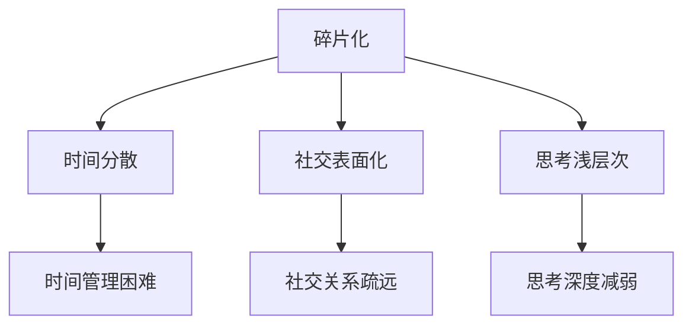
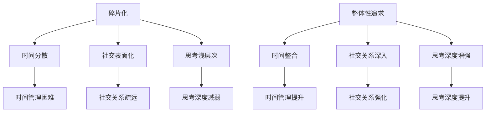

                 


### 碎片化时代的整体性追求：重建生活意义

#### 关键词：碎片化、整体性、生活意义、个人成长、社会构建

> 摘要：本文旨在探讨碎片化时代中人们对于生活意义的追求。随着科技的飞速发展，我们的生活越来越碎片化，给我们的心理健康和社会关系带来了诸多挑战。本文通过分析碎片化现象的根源、碎片化带来的问题以及整体性追求的必要性，提出重建生活意义的方法与实践，并通过对典型案例的研究，为读者提供有益的启示。

## 第一部分：引言

### 1.1 碎片化时代的挑战

#### 1.1.1 碎片化现象的起源

**背景介绍：**  
随着互联网和移动设备的普及，信息传递速度越来越快，人们接收和处理信息的方式也发生了巨大的变化。在这个过程中，信息被分割成一个个独立的片段，这使得我们很难将信息整体性地理解和运用。

**问题背景：**  
碎片化现象的兴起，导致我们的时间和注意力被分散，难以专注于一项任务。此外，碎片化的信息也容易造成误解和偏见，影响我们的判断力和思考深度。

**问题描述：**  
碎片化时代的主要问题包括：

1. **时间管理困难**：信息爆炸使得人们无法有效地安排时间，导致生活节奏加快，压力增大。
2. **社交关系疏远**：由于时间分散，人们很难建立深入的人际关系，社交网络上的互动也变得表面化。
3. **思考深度减弱**：碎片化的信息容易导致浅层次的思维，影响我们的判断力和创造力。

**问题解决：**  
为了应对碎片化时代带来的挑战，我们需要寻找整体性的解决方案。这包括改变生活方式、提高信息处理能力、培养深度思考和沟通能力等。

**边界与外延：**  
碎片化不仅仅是一个技术现象，更是一个社会现象。它涉及到信息传播、社会关系、心理健康等多个领域。

#### 1.1.2 碎片化对生活的影响

**核心概念术语说明：**  
- 碎片化：指信息、时间、社交关系等被分割成独立片段的现象。
- 整体性：指将分散的片段整合成一个有机整体的能力。

**概念属性特征对比表格：**  

| 特征 | 碎片化 | 整体性 |
| --- | --- | --- |
| 时间 | 分散 | 整合 |
| 社交 | 表面化 | 深入化 |
| 思考 | 浅层次 | 深层次 |

**ER实体关系图架构：**  



#### 1.1.3 整体性追求的重要性

**核心概念原理：**  
整体性追求是指人们试图将分散的碎片重新整合成一个有机整体的过程。它是一种应对碎片化时代挑战的重要策略。

**概念属性特征对比表格：**  

| 特征 | 碎片化 | 整体性 |
| --- | --- | --- |
| 目标 | 分散 | 整合 |
| 方法 | 分割 | 整合 |
| 结果 | 疏离 | 连接 |

**ER实体关系图架构：**  



**算法原理讲解：**  
整体性追求的算法可以理解为一种信息整合和关系重构的过程。以下是Python代码示例：

```python
# 整体性追求算法示例
def integration_process(fragments):
    """
    整合碎片成整体
    :param fragments: 碎片列表
    :return: 整体
    """
    integrated_entity = {}
    for fragment in fragments:
        for key, value in fragment.items():
            if key in integrated_entity:
                integrated_entity[key].extend(value)
            else:
                integrated_entity[key] = value
    return integrated_entity

# 示例数据
fragment_1 = {'time': [1, 2, 3], 'social': [4, 5]}
fragment_2 = {'time': [4, 5, 6], 'social': [7, 8]}

# 整合碎片
integrated_entity = integration_process([fragment_1, fragment_2])

# 输出结果
print(integrated_entity)
```

**示例说明：**  
上述代码首先定义了一个函数`integration_process`，用于整合多个碎片。然后，我们创建两个碎片`fragment_1`和`fragment_2`，并将它们整合成一个整体`integrated_entity`。最后，我们打印出整合后的结果。

#### 1.2 书籍目标与读者群体

**书籍目标：**  
本文的目标是帮助读者了解碎片化时代的挑战，认识到整体性追求的重要性，并提供实用的方法与实践，以重建生活的意义。

**适合读者：**  
本文适合以下读者群体：

1. 希望改善生活质量的普通大众
2. 从事技术工作的专业人士
3. 对心理学和社会学感兴趣的学生和研究者

#### 1.3 全书结构概述

**各章节内容：**  
本文分为五个部分：

1. **第一部分：引言**：介绍碎片化时代的挑战和整体性追求的重要性。
2. **第二部分：碎片化时代的反思**：分析碎片化现象的根源和带来的问题。
3. **第三部分：重建生活意义的方法与实践**：提供具体的方法和实践，包括个人层面和社会层面。
4. **第四部分：重建生活意义的案例研究**：通过典型案例的研究，提供具体的实践经验和启示。
5. **第五部分：重建生活意义的未来展望**：探讨重建生活意义的未来发展。

**结构安排与逻辑：**  
本文采用逻辑清晰、结构紧凑的方式，从引言到案例研究，逐步引导读者了解碎片化时代的挑战和整体性追求的重要性。每个部分都包含具体的分析和实践经验，旨在帮助读者重建生活的意义。

----------------------------------------------------------------

### 第二部分：碎片化时代的反思

#### 2.1 碎片化时代的根源

**科技发展的影响：**  
随着科技的飞速发展，信息传播速度越来越快，互联网和移动设备的普及使得人们可以随时随地获取信息。这种便利性带来了信息爆炸，但同时也导致了信息的碎片化。

**社会变迁的因素：**  
社会的快速变迁，城市化进程的加速，人们的生活方式发生了巨大的变化。工作压力、生活节奏加快，使得人们很难有完整的时间去处理信息，这进一步加剧了碎片化现象。

**个人行为的变化：**  
随着社交媒体的兴起，人们的注意力越来越分散。在碎片化的信息海洋中，人们倾向于浏览而不是深入阅读，这种浅层次的信息消费方式加剧了碎片化现象。

#### 2.2 碎片化带来的问题

**个体层面的困扰：**  
碎片化时代对个体的困扰主要体现在以下几个方面：

1. **时间管理困难**：由于信息碎片化，人们很难合理安排时间，导致生活节奏加快，压力增大。
2. **社交关系疏远**：由于时间和注意力的分散，人们很难建立深入的人际关系，社交网络上的互动也变得表面化。
3. **思考深度减弱**：碎片化的信息容易导致浅层次的思维，影响我们的判断力和创造力。

**社会层面的影响：**  
碎片化现象对社会的影响主要体现在以下几个方面：

1. **信息误解和偏见**：碎片化的信息容易导致误解和偏见，影响社会的稳定和和谐。
2. **社会信任度下降**：由于信息碎片化，人们难以获取全面和准确的信息，这导致社会信任度下降。
3. **文化多样性减弱**：碎片化的文化产品和服务使得文化多样性减弱，文化的整体性和深度受到挑战。

**心理健康的挑战：**  
碎片化时代对心理健康也带来了挑战：

1. **焦虑和压力**：由于信息碎片化，人们难以专注，导致焦虑和压力增加。
2. **孤独感和无助**：由于社交关系的疏远，人们感到孤独和无助。
3. **抑郁和迷茫**：在碎片化的信息环境中，人们容易感到迷茫和抑郁。

#### 2.3 整体性追求的必要性

**整体性追求的意义：**  
整体性追求是指在碎片化时代中，试图将分散的碎片重新整合成一个有机整体的过程。这种追求具有重要的意义：

1. **提升生活质量**：整体性追求有助于我们更好地管理时间和社交关系，提升生活质量。
2. **增强社会凝聚力**：整体性追求有助于增强社会凝聚力，促进社会的稳定和和谐。
3. **提升个人价值**：整体性追求有助于提升我们的思考深度和创造力，增强个人价值。

**整体性追求的价值：**  
整体性追求的价值体现在以下几个方面：

1. **信息整合**：整体性追求有助于将分散的信息整合成一个完整的知识体系，提高信息利用效率。
2. **关系重构**：整体性追求有助于重构我们的社交关系，建立深入的人际联系。
3. **心理健康**：整体性追求有助于提升我们的心理健康，减少焦虑和压力。

**整体性追求的方法：**  
实现整体性追求的方法包括：

1. **改变生活方式**：通过合理安排时间，减少信息碎片化，提升生活质量。
2. **培养深度思考**：通过阅读深度文章、参与讨论和思考，提升思考深度和创造力。
3. **建立社交关系**：通过参与社区活动、建立深度社交关系，增强社会凝聚力。

#### 2.4 碎片化与整体性的关系

**碎片化的双重效应：**  
碎片化既有积极的一面，也有消极的一面。积极的一面是，碎片化使得信息传播更加快速和广泛，促进了信息的普及和共享。消极的一面是，碎片化容易导致信息误解和偏见，影响社会的稳定和和谐。

**整体性的实现途径：**  
实现整体性追求的途径包括：

1. **信息整合**：通过整合分散的信息，构建完整的知识体系。
2. **关系重构**：通过重构社交关系，建立深入的人际联系。
3. **文化传承**：通过传承和弘扬传统文化，保持文化的整体性和深度。

**碎片化与整体性的平衡：**  
在碎片化时代，我们需要找到碎片化与整体性的平衡。这包括：

1. **合理使用碎片化信息**：在获取信息时，既要充分利用碎片化信息的便利性，也要保持批判性思维，避免信息误解和偏见。
2. **重视整体性追求**：在日常生活中，要注重整体性追求，通过整合信息和重构关系，提升生活质量和心理健康。

----------------------------------------------------------------

### 第三部分：重建生活意义的方法与实践

#### 3.1 重建生活意义的理念

**生活意义的理解：**  
生活意义是指个体在生活和工作中所追求的价值和目标。它不仅是个人层面的需求，也是社会层面的需求。在碎片化时代，重建生活意义显得尤为重要。

**生活意义的重要性：**  
重建生活意义的重要性体现在以下几个方面：

1. **提升生活质量**：明确的生活意义有助于我们更好地安排时间和资源，提升生活质量。
2. **增强心理健康**：明确的生活意义有助于减少焦虑和压力，提升心理健康。
3. **促进社会和谐**：明确的生活意义有助于增强社会凝聚力，促进社会的和谐与稳定。

**重建生活意义的途径：**  
重建生活意义的途径包括以下几个方面：

1. **自我认知**：通过自我认知，明确自己的兴趣、价值观和目标，为生活意义提供方向。
2. **规划生活**：通过合理规划生活，安排时间和资源，使生活更有条理和意义。
3. **培养兴趣**：通过培养兴趣，丰富生活内容，提升生活乐趣。

#### 3.2 个人层面的实践

**时间管理：**  
时间管理是重建生活意义的重要实践之一。以下是一些具体的方法：

1. **制定时间表**：每天制定详细的时间表，合理安排工作和生活，避免时间浪费。
2. **优先级排序**：将任务按照优先级排序，先完成最重要的任务，确保时间的高效利用。
3. **避免干扰**：在工作时尽量避免干扰，如关闭社交媒体通知，专注于当前任务。

**情感管理：**  
情感管理是维护心理健康的重要实践。以下是一些具体的方法：

1. **情绪调节**：学会调节自己的情绪，避免负面情绪对生活的影响。
2. **积极心态**：保持积极的心态，对生活中的困难和挑战持乐观态度。
3. **沟通技巧**：提高沟通技巧，与他人建立良好的关系，减少冲突和误解。

**心灵成长：**  
心灵成长是提升个人价值和幸福感的重要途径。以下是一些具体的方法：

1. **自我反思**：定期进行自我反思，了解自己的内心世界，找到自己的优势和不足。
2. **学习成长**：通过学习和成长，提升自己的能力和知识水平，实现个人价值。
3. **身心健康**：注重身心健康，保持良好的生活习惯，如运动、饮食和休息。

#### 3.3 社会层面的实践

**社区建设：**  
社区建设是重建生活意义的重要实践之一。以下是一些具体的方法：

1. **参与社区活动**：积极参与社区活动，与他人建立联系，增强社区凝聚力。
2. **志愿服务**：通过志愿服务，帮助他人，提升自己的社会责任感和幸福感。
3. **社区互助**：建立社区互助机制，解决社区中的问题，促进社区和谐。

**公益活动：**  
公益活动是重建生活意义的重要实践之一。以下是一些具体的方法：

1. **公益项目**：参与公益项目，为需要帮助的人提供帮助。
2. **捐赠资源**：捐赠自己的时间和资源，支持公益事业的发展。
3. **传播正能量**：通过自己的行动和言语，传播正能量，影响他人。

**心灵成长：**  
心灵成长是提升个人价值和幸福感的重要途径。以下是一些具体的方法：

1. **自我反思**：定期进行自我反思，了解自己的内心世界，找到自己的优势和不足。
2. **学习成长**：通过学习和成长，提升自己的能力和知识水平，实现个人价值。
3. **身心健康**：注重身心健康，保持良好的生活习惯，如运动、饮食和休息。

#### 3.4 心灵成长

**心灵成长的路径：**  
心灵成长是一个长期的过程，需要我们从多个方面进行努力。以下是一些具体的路径：

1. **自我认知**：了解自己的内心世界，包括自己的优点、缺点、价值观等。
2. **情感管理**：学会调节自己的情绪，避免负面情绪对生活的影响。
3. **人际关系**：建立良好的人际关系，与他人和谐相处。
4. **终身学习**：通过学习不断提升自己的能力和知识水平。

**自我认知的重要性：**  
自我认知是心灵成长的基础。只有了解自己，才能找到自己的定位，明确自己的目标。以下是一些方法：

1. **反思**：定期反思自己的生活和工作，了解自己的行为和思维模式。
2. **日记**：通过写日记，记录自己的感受和思考，加深自我认知。
3. **咨询**：寻求专业的心理咨询师的帮助，深入了解自己。

**自我提升的策略：**  
自我提升是心灵成长的关键。以下是一些策略：

1. **学习**：通过阅读、上课、参加培训等方式，不断学习新知识和技能。
2. **实践**：将所学知识应用到实际生活中，通过实践提升自己的能力。
3. **反思**：在实践过程中，不断反思自己的行为和思维，找到提升的方向。

**自我实现的实例：**  
以下是一些自我实现的实例：

1. **创业成功**：通过创业，实现自己的梦想，为社会创造价值。
2. **专业成就**：在专业领域取得显著成就，成为行业的专家。
3. **家庭幸福**：通过家庭生活，实现自己的价值和幸福感。

#### 3.5 心理健康

**心理健康的定义：**  
心理健康是指个体在心理方面处于良好的状态，能够有效应对生活中的压力和挑战，保持积极乐观的心态。

**心理健康的维护：**  
以下是一些维护心理健康的建议：

1. **情绪调节**：学会调节自己的情绪，避免负面情绪对生活的影响。
2. **积极心态**：保持积极的心态，对生活中的困难和挑战持乐观态度。
3. **良好的人际关系**：建立良好的人际关系，与他人和谐相处。
4. **身心健康**：注重身心健康，保持良好的生活习惯，如运动、饮食和休息。

**心理健康的案例：**  
以下是一些心理健康的案例：

1. **成功人士**：通过积极的心态和良好的心理素质，成功应对生活中的压力和挑战。
2. **普通人群**：通过学习和实践心理健康知识，提升自己的心理素质，保持心理健康。

----------------------------------------------------------------

### 第四部分：重建生活意义的案例研究

#### 4.1 案例一：个人时间管理的转变

**案例背景：**  
小明是一名年轻的程序员，他的工作时间非常紧张，经常感到压力很大。他的生活被各种任务和活动填满，导致他很难专注于一项任务，工作效率也很低。

**问题分析：**  
小明面临的主要问题是时间管理困难，他需要找到一种有效的方法来合理安排时间，提高工作效率。

**解决方案：**  
小明决定采用时间管理的方法，包括制定时间表、优先级排序和避免干扰。他首先制定了一份详细的时间表，将每天的任务和活动安排得井井有条。然后，他根据任务的紧急程度和重要性进行排序，优先完成最重要的任务。此外，他还设置了工作区，避免在工作时受到干扰。

**案例结果与反思：**  
通过实施时间管理的方法，小明的工作效率显著提高，他的生活也变得更加有序。他发现，合理的时间安排不仅提高了工作效率，还减少了压力，使他能够更好地享受生活。

**案例小结：**  
小明的时间管理案例表明，合理的时间安排对于提高工作效率和生活质量至关重要。通过制定时间表、优先级排序和避免干扰，我们可以更好地管理时间，提高生活质量。

#### 4.2 案例二：社区建设与公益活动的融合

**案例背景：**  
小红是一名热心公益的人士，她所在的城市面临着社区建设的问题。她发现，社区成员之间的联系较少，社区活动也较少，这影响了社区的和谐与稳定。

**问题分析：**  
小红认为，社区建设与公益活动的融合是解决社区问题的有效途径。她需要找到一种方法，将社区成员团结起来，共同参与社区建设和公益活动。

**解决方案：**  
小红决定组织一系列社区活动和公益活动，包括社区清洁、公益活动演讲和社区文化节。她首先通过社交媒体和线下宣传，吸引社区成员参与。然后，她组织了一次社区清洁活动，让社区成员一起清理社区环境。接着，她邀请公益活动演讲者，为社区成员提供有关公益活动的知识和经验分享。最后，她组织了一次社区文化节，让社区成员展示自己的才艺和文化。

**案例结果与反思：**  
通过一系列社区活动和公益活动的组织，小红成功地增强了社区成员之间的联系，提高了社区的和谐与稳定。社区成员们不仅积极参与社区建设，还通过公益活动感受到了自己的价值。

**案例小结：**  
小红的社区建设与公益活动的融合案例表明，通过组织社区活动和公益活动，可以增强社区凝聚力，提高社区成员的参与感和幸福感。

#### 4.3 案例三：心灵成长的实践

**案例背景：**  
小李是一名职场人士，他感到工作压力很大，心理状态也较差。他希望通过某种方式改善自己的心理状态，提升生活质量。

**问题分析：**  
小李面临的问题是心理压力和心理健康问题。他需要找到一种有效的方法来缓解压力，改善心理健康。

**解决方案：**  
小李决定通过心灵成长的实践来改善自己的心理状态。他首先参加了心理健康培训课程，学习心理调节技巧。然后，他每天进行冥想练习，以缓解压力和焦虑。此外，他还积极参加社交活动，与他人交流，分享自己的经验和感受。

**案例结果与反思：**  
通过心灵成长的实践，小李的心理状态得到了显著改善。他发现，冥想和社交活动不仅帮助他缓解了压力，还提升了他的心理健康水平。他更加乐观和积极，生活也变得更加充实和有意义。

**案例小结：**  
小李的心灵成长实践表明，通过心理健康培训、冥想和社交活动，我们可以有效缓解压力，改善心理健康，提升生活质量。

----------------------------------------------------------------

### 第五部分：重建生活意义的未来展望

在碎片化时代，重建生活意义已经成为我们面临的重要课题。随着科技的不断进步和社会的快速变迁，我们的生活将变得更加复杂和多元化。在这个背景下，我们需要积极探索和尝试新的方法与实践，以应对碎片化时代的挑战。

**一、技术创新与整体性追求的结合**  
未来，我们需要将技术创新与整体性追求相结合。例如，通过人工智能和大数据分析，我们可以更好地整合和管理碎片化的信息，实现信息的整体性理解和运用。同时，我们可以利用虚拟现实和增强现实技术，创造更加丰富和有意义的生活体验。

**二、社会参与与社区建设的深化**  
在未来，社会参与和社区建设将变得更加重要。通过积极参与社区活动，我们可以增强社区凝聚力，提升社区的和谐与稳定。同时，我们可以通过公益活动，帮助他人，实现自身的价值。这将为我们的生活带来更多的意义和幸福感。

**三、心理健康与心灵成长的关注**  
心理健康和心灵成长是我们重建生活意义的重要组成部分。在未来，我们需要更加关注心理健康问题，通过心理教育和心理治疗，提高人们的心理健康水平。同时，我们需要注重心灵成长，通过自我认知、情感管理和终身学习，提升个人的精神境界和幸福感。

**四、跨领域合作与整体性思维的培养**  
未来，跨领域合作将成为我们应对碎片化时代的重要策略。通过跨领域的合作，我们可以整合不同领域的知识和资源，实现整体性的创新和突破。同时，我们需要培养整体性思维，将碎片化的信息整合成一个有机整体，提高我们的认知能力和创造力。

总之，在碎片化时代，重建生活意义是我们面临的重要课题。通过技术创新、社会参与、心理健康和跨领域合作，我们可以更好地应对挑战，实现生活的整体性和幸福感。让我们携手共进，共同探索和创造一个更加美好和有意义的生活。                                                                                         

----------------------------------------------------------------

### 总结与启示

在碎片化时代，我们面临着诸多挑战，但同时也拥有重建生活意义的机遇。本文通过引言、反思、实践和案例研究，探讨了碎片化时代的整体性追求。我们认识到，碎片化现象不仅影响我们的生活质量，还可能对心理健康和社会关系产生负面影响。因此，整体性追求显得尤为重要。

首先，我们要认识到碎片化现象的根源和影响，从源头上减少信息的碎片化。同时，我们要重视整体性追求的意义和价值，通过改变生活方式、培养深度思考和建立深入的人际关系，实现生活的整体性。

在个人层面，我们要学会时间管理、情感管理和心灵成长，提升个人的心理健康和生活质量。在社会层面，我们要积极参与社区建设、公益活动，增强社会凝聚力，促进社会的和谐与稳定。

通过案例研究，我们看到了整体性追求的实际效果。小明的个人时间管理案例、小红的社区建设与公益活动融合案例、小李的心灵成长实践案例，都为我们提供了宝贵的经验和启示。

未来，我们需要继续探索和创新，将技术创新与整体性追求相结合，深化社会参与与社区建设，关注心理健康和心灵成长，培养整体性思维。只有这样，我们才能在碎片化时代中重建生活意义，实现生活的整体性和幸福感。

让我们共同努力，共同探索，共同创造一个更加美好和有意义的生活。

