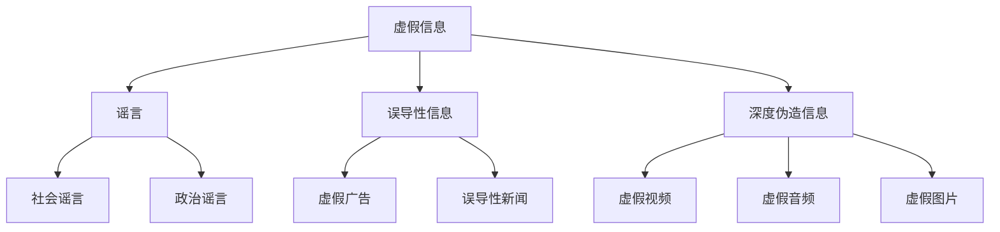
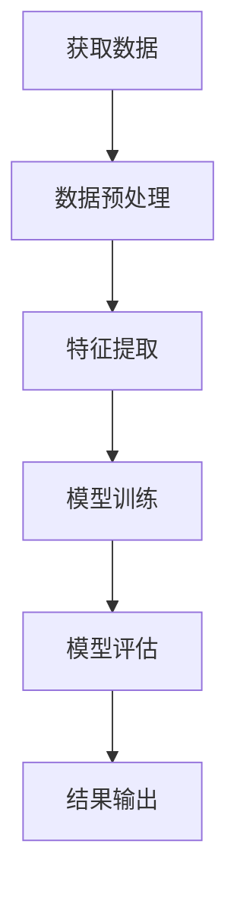
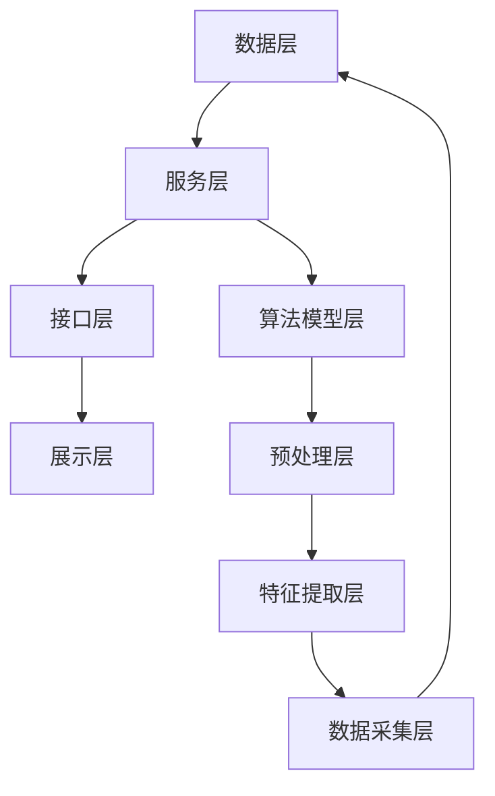
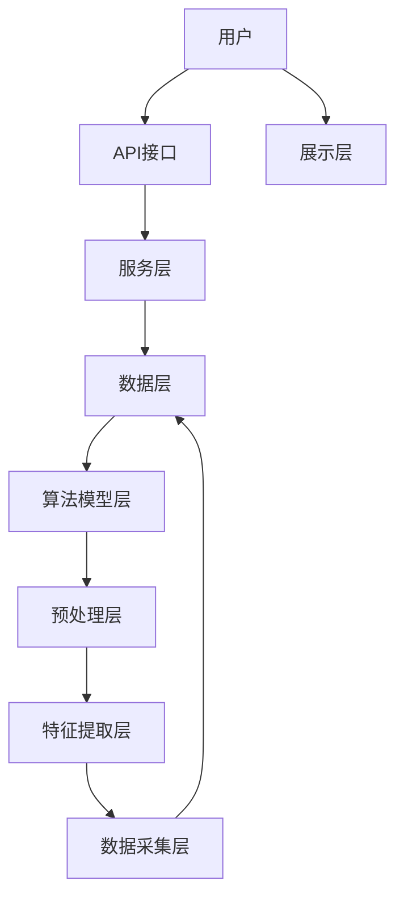

                 

# 社交媒体平台应对虚假信息的措施

## 关键词：社交媒体、虚假信息、算法、检测、系统架构、安全措施

## 摘要：

在数字时代，社交媒体平台已经成为人们获取信息和社交的重要途径。然而，随之而来的是虚假信息的泛滥，这对平台和用户都带来了严重的负面影响。本文将从背景介绍、核心概念与联系、算法原理讲解、数学模型和公式讲解、系统分析与架构设计方案、项目实战等方面，详细探讨社交媒体平台应对虚假信息的有效措施。通过逐步分析推理，本文旨在为读者提供清晰、实用的解决方案，以提升社交媒体平台的信息真实性，保障用户权益。

----------------------------------------------------------------

### 目录大纲设计思路

#### 设计背景

设计《社交媒体平台应对虚假信息的措施》这本书的目录大纲，是为了系统地梳理和阐述当前社交媒体平台面临虚假信息问题的严重性，以及应对这一问题的有效策略。随着互联网技术的快速发展，社交媒体平台已经成为信息传播的重要渠道，然而，虚假信息的泛滥使得平台公信力和用户体验受到了严重影响。因此，设计一个科学、合理的目录大纲，有助于系统地分析虚假信息问题，并提供相应的解决方案。

#### 设计目标

1. **全面性**：确保目录大纲覆盖所有与虚假信息相关的核心概念、算法、系统架构等方面。
2. **逻辑性**：按照从背景介绍到解决方案的顺序，保证内容之间的逻辑性和连贯性。
3. **实用性**：提供实际可行的措施和策略，帮助社交媒体平台有效应对虚假信息问题。
4. **易读性**：使用清晰、简洁的语言，便于读者理解和应用。

#### 设计原则

1. **循序渐进**：从问题的背景介绍开始，逐步引入核心概念、算法原理，再到系统架构和项目实战，使读者能够逐步理解和掌握。
2. **重点突出**：对于每个部分的核心内容和关键点，都要进行详细阐述，确保读者能够深入理解。
3. **形式多样**：结合文字、图表、代码等多种形式，提高内容的丰富性和可读性。

### 目录大纲设计步骤

1. **背景介绍**：
   - 章节概述：介绍社交媒体平台的发展及其面临的虚假信息问题。
   - 问题描述：详细描述虚假信息对社交媒体平台和用户的影响。
   - 问题解决：介绍应对虚假信息的各种措施和策略。

2. **核心概念与联系**：
   - 核心概念：介绍与虚假信息相关的核心概念，如谣言、误导性信息、深度伪造等。
   - 概念属性特征对比表格：使用 Markdown 格式中的表格来对比不同虚假信息的特征。
   - ER实体关系图架构：使用 Mermaid 流程图来展示不同虚假信息实体之间的关系。

3. **算法原理讲解**：
   - 算法原理介绍：讲解用于检测和识别虚假信息的算法原理。
   - Mermaid 流程图：绘制算法的流程图，帮助读者理解算法的执行过程。
   - Python 源代码：提供算法的实现代码，并解释关键步骤。

4. **数学模型和数学公式讲解**：
   - 数学模型介绍：介绍用于检测和识别虚假信息的数学模型。
   - 数学公式详细讲解：使用 LaTeX 格式嵌入数学公式，并进行详细解释。
   - 举例说明：通过具体案例来展示数学公式的应用。

5. **系统分析与架构设计方案**：
   - 问题场景介绍：描述社交媒体平台应对虚假信息的问题场景。
   - 系统功能设计：使用 Mermaid 类图来展示系统的领域模型。
   - 系统架构设计：使用 Mermaid 架构图来展示系统的整体架构。
   - 系统接口设计和系统交互：使用 Mermaid 序列图来描述系统的接口和交互流程。

6. **项目实战**：
   - 环境安装：介绍所需的软件和硬件环境。
   - 系统核心实现源代码：提供系统核心功能的源代码。
   - 代码应用解读与分析：分析源代码的实现过程和关键步骤。
   - 实际案例分析和详细讲解剖析：通过实际案例来展示系统的应用效果。
   - 项目小结：总结项目的主要收获和经验教训。

7. **最佳实践 tips、小结、注意事项、拓展阅读**：
   - 最佳实践 tips：提供在实际应用中的一些经验技巧。
   - 小结：总结全书的主要内容和核心观点。
   - 注意事项：提醒读者在实践过程中需要注意的事项。
   - 拓展阅读：推荐一些相关领域的参考资料和扩展阅读。

### 目录大纲示例

```markdown
# 《社交媒体平台应对虚假信息的措施》目录大纲

## 第一部分：背景与核心概念

### 第1章 社交媒体平台发展现状与虚假信息问题

#### 1.1 社交媒体平台的发展历程

#### 1.2 虚假信息的定义与分类

#### 1.3 虚假信息对社交媒体平台的影响

### 第2章 核心概念与联系

#### 2.1 谣言与误导性信息的特征对比

#### 2.2 深度伪造信息的识别与检测

#### 2.3 虚假信息实体关系图

## 第二部分：算法原理与系统架构

### 第3章 虚假信息检测算法原理

#### 3.1 基于内容的算法

#### 3.2 基于用户的算法

#### 3.3 基于模型的算法

### 第4章 虚假信息识别算法原理

#### 4.1 特征提取

#### 4.2 模型训练与评估

#### 4.3 识别算法流程图

### 第5章 社交媒体平台应对虚假信息的系统架构设计

#### 5.1 系统功能设计

#### 5.2 系统架构设计

#### 5.3 系统接口设计与交互流程

## 第6章 项目实战

### 第6.1章 环境安装与系统核心实现

#### 6.1.1 环境安装

#### 6.1.2 系统核心实现源代码

### 第6.2章 代码应用解读与分析

#### 6.2.1 代码应用解读

#### 6.2.2 关键步骤分析

### 第6.3章 实际案例分析与讲解

#### 6.3.1 实际案例分析

#### 6.3.2 详细讲解剖析

### 第6.4章 项目小结

#### 6.4.1 项目总结

#### 6.4.2 经验教训

## 第三部分：最佳实践与拓展阅读

### 第7章 最佳实践 tips

#### 7.1 实践技巧

#### 7.2 经验分享

### 第8章 小结与注意事项

#### 8.1 主要内容总结

#### 8.2 注意事项提醒

### 第9章 拓展阅读

#### 9.1 相关参考资料

#### 9.2 扩展阅读推荐

----------------------------------------------------------------

### 第一部分：背景介绍

#### 1.1 社交媒体平台的发展历程

社交媒体平台的发展可以追溯到上世纪90年代，当时互联网刚刚兴起，人们开始尝试通过电子邮件和聊天室进行在线交流。随着技术的不断进步，特别是宽带网络和移动设备的普及，社交媒体平台得到了飞速发展。从最初的博客到微博、从论坛到社交网络，社交媒体逐渐成为人们日常生活的重要组成部分。

2004年，Facebook的成立标志着社交媒体时代的到来。随后，Twitter、LinkedIn、Instagram等平台相继问世，进一步丰富了社交媒体的形态和功能。这些平台不仅提供了用户之间的即时沟通，还成为了信息传播的重要渠道。用户可以通过发布文字、图片、视频等内容，与他人分享生活、观点和知识。

随着社交媒体平台的普及，用户数量也急剧增加。根据Statista的数据，截至2021年，全球社交媒体用户数量已经超过45亿，占全球总人口的一半以上。社交媒体平台已经成为人们获取信息、社交和娱乐的主要途径。

#### 1.2 虚假信息的定义与分类

虚假信息，又称假新闻或误导性信息，是指那些故意或无意地传播不真实、不准确或具有误导性的信息。这些信息可能涉及政治、经济、社会等各个方面，对公众认知和判断产生严重影响。根据虚假信息的传播方式和内容，可以将其分为以下几类：

1. **谣言**：未经证实的信息，通过口耳相传或网络传播，引起公众恐慌和误解。
2. **假新闻**：故意编造的虚假新闻报道，通常具有耸人听闻的标题和内容，以吸引点击和关注。
3. **深度伪造**：利用人工智能和计算机图形技术制作的虚假视频、音频和图片，以伪造真实事件或人物言论。
4. **误导性广告**：通过夸大产品效果、隐瞒负面信息等手段，误导消费者做出购买决策。
5. **虚假数据**：故意篡改或伪造数据，以支持某一观点或策略。

#### 1.3 虚假信息对社交媒体平台的影响

虚假信息的泛滥对社交媒体平台产生了深远的影响，具体体现在以下几个方面：

1. **损害平台公信力**：虚假信息的传播使得平台用户对信息的真实性产生怀疑，降低了对平台的信任度。
2. **影响用户体验**：虚假信息误导用户，导致用户做出错误决策，影响用户满意度和忠诚度。
3. **法律风险**：虚假信息可能涉及诽谤、诈骗等违法行为，给平台带来法律风险。
4. **社会负面影响**：虚假信息可能引发社会恐慌、冲突和不稳定，对公共安全和社会秩序产生威胁。

#### 1.4 问题解决

面对虚假信息问题，社交媒体平台需要采取一系列措施来应对。以下是一些常见的方法：

1. **内容审核**：对发布的内容进行审核，删除虚假信息，限制虚假信息传播。
2. **算法检测**：利用机器学习和人工智能技术，自动检测和识别虚假信息。
3. **用户举报**：鼓励用户举报虚假信息，加强用户参与和监督。
4. **教育培训**：提高用户的信息素养，增强对虚假信息的辨别能力。
5. **法律手段**：通过法律手段追究虚假信息传播者的责任，打击虚假信息。

#### 1.5 边界与外延

虚假信息问题的解决不仅涉及技术层面，还涉及法律、伦理、社会等多个方面。因此，在制定解决方案时，需要充分考虑各种边界和限制因素，确保措施的合理性和可行性。

1. **技术边界**：算法检测技术虽然高效，但也存在误报和漏报的问题，需要不断优化和完善。
2. **法律边界**：法律手段需要遵循相关法律法规，确保合法合规。
3. **伦理边界**：在处理虚假信息时，需要尊重用户的隐私权和言论自由。
4. **社会边界**：虚假信息问题需要社会各界的共同参与和努力，形成合力。

#### 1.6 概念结构与核心要素组成

虚假信息问题的概念结构包括以下几个方面：

1. **虚假信息**：核心概念，指不真实、不准确或具有误导性的信息。
2. **传播渠道**：虚假信息的传播途径，如社交媒体、新闻媒体、网络论坛等。
3. **影响范围**：虚假信息对社会、经济、政治等方面的影响。
4. **解决方案**：针对虚假信息问题的各种措施和策略。

核心要素组成：

1. **技术手段**：包括算法检测、内容审核等。
2. **法律手段**：包括法律监管、追责等。
3. **教育培训**：提高用户的信息素养。
4. **用户参与**：鼓励用户举报虚假信息，加强用户监督。

#### 1.7 总结

虚假信息问题是社交媒体平台面临的一大挑战。通过背景介绍，我们了解了社交媒体平台的发展历程、虚假信息的定义与分类、虚假信息对社交媒体平台的影响以及问题解决的方法。在接下来的章节中，我们将深入探讨核心概念与联系、算法原理讲解、数学模型和公式讲解、系统分析与架构设计方案、项目实战等内容，为社交媒体平台应对虚假信息提供切实可行的解决方案。

----------------------------------------------------------------

### 第二部分：核心概念与联系

#### 2.1 谣言与误导性信息的特征对比

谣言和误导性信息是虚假信息的重要组成部分。为了更好地理解和应对这些信息，我们需要明确它们的特点和区别。

1. **谣言**：
   - **定义**：谣言是指未经证实的信息，通过口耳相传或网络传播，引起公众恐慌和误解。
   - **特征**：
     - **真实性**：谣言往往与事实不符，不具有真实性。
     - **传播速度**：谣言传播速度快，容易在短时间内引起广泛关注。
     - **影响范围**：谣言可能涉及政治、经济、社会等各个方面，影响范围广。
     - **心理影响**：谣言容易引发公众恐慌、焦虑等负面情绪。

2. **误导性信息**：
   - **定义**：误导性信息是指那些故意或无意地传播不真实、不准确或具有误导性的信息。
   - **特征**：
     - **真实性**：误导性信息可能部分真实，但整体具有误导性。
     - **传播目的**：误导性信息的传播通常有特定的目的，如吸引点击、推广产品、误导用户等。
     - **隐蔽性**：误导性信息往往具有隐蔽性，不易被察觉。
     - **影响程度**：误导性信息对用户的影响程度取决于其内容的具体情况。

#### 概念属性特征对比表格

为了更直观地对比谣言和误导性信息的特征，我们使用Markdown格式的表格进行展示：

| 特征        | 谣言                         | 误导性信息                         |
|-------------|------------------------------|------------------------------------|
| 定义        | 未经证实的信息               | 故意或无意地传播不真实、不准确的信息 |
| 真实性      | 通常与事实不符               | 可能部分真实，但整体具有误导性       |
| 传播速度     | 快速传播                     | 传播速度相对较慢                   |
| 影响范围     | 广泛影响                     | 影响范围相对较小                   |
| 心理影响     | 易引发恐慌、焦虑等负面情绪   | 根据内容具体情况                   |
| 传播目的     | 无特定目的，或引起关注       | 有特定目的，如吸引点击、推广产品等  |
| 隐蔽性      | 通常明显，容易识别           | 具有隐蔽性，不易被察觉               |

#### 2.2 深度伪造信息的识别与检测

深度伪造信息，即Deepfake，是近年来迅速兴起的一种虚假信息形式。深度伪造技术利用人工智能和计算机图形技术，可以生成逼真的虚假视频、音频和图片。这些信息具有极高的欺骗性，给社交媒体平台带来了巨大挑战。

1. **深度伪造信息的定义**：
   - **定义**：深度伪造信息是指利用深度学习算法伪造的视频、音频和图片，以模仿真实人物的表情、声音和行为。
   - **特点**：
     - **逼真性**：深度伪造信息具有高度的真实感，难以通过肉眼识别。
     - **多样性**：深度伪造技术可以生成各种类型的虚假信息，如虚假新闻、虚假广告等。

2. **深度伪造信息的识别与检测**：
   - **方法**：
     - **视觉特征分析**：通过分析视频中的视觉特征，如人脸、动作、场景等，检测是否存在伪造痕迹。
     - **音频分析**：通过分析音频中的声音特征，如音调、节奏、语调等，检测是否存在伪造痕迹。
     - **综合分析**：结合视觉和音频特征，进行综合分析，提高检测的准确率。

3. **工具与技术**：
   - **开源工具**：如Face2Face、Deepfake Detector等，提供深度伪造检测的功能。
   - **专业软件**：如Adobe After Effects、Premiere Pro等，具有强大的深度伪造检测和修复功能。

#### 2.3 虚假信息实体关系图

为了更好地理解虚假信息实体之间的关系，我们使用Mermaid流程图绘制虚假信息实体关系图。以下是一个示例：



通过这个实体关系图，我们可以清晰地看到谣言、误导性信息和深度伪造信息之间的关系，以及它们各自包含的子类别。

### 2.4 总结

在本章节中，我们介绍了谣言与误导性信息的特征对比，以及深度伪造信息的识别与检测方法。通过Markdown格式的表格和Mermaid流程图，我们使内容更加直观易懂。在接下来的章节中，我们将进一步探讨算法原理讲解、数学模型和公式讲解等内容，为社交媒体平台应对虚假信息提供更加深入和实用的解决方案。

----------------------------------------------------------------

### 第三部分：算法原理讲解

#### 3.1 虚假信息检测算法原理

在应对虚假信息的过程中，算法检测是关键的一环。算法通过分析文本、图像、音频等多媒体数据，识别出潜在虚假信息，从而保障信息的真实性。以下是几种常见的虚假信息检测算法及其原理：

#### 3.1.1 基于内容的算法

**1. 文本分析算法**：
   - **原理**：通过分析文本的内容、结构、语言特征等，判断文本的真实性。
   - **技术**：自然语言处理（NLP）、文本分类、文本匹配等。
   - **优势**：能够快速处理大量文本数据，适应不同的语言和情境。
   - **局限**：对语义理解的要求较高，容易受到虚假信息的干扰。

**2. 图像分析算法**：
   - **原理**：通过分析图像的视觉特征，如颜色、纹理、形状等，识别图像的真实性。
   - **技术**：计算机视觉、图像分类、图像识别等。
   - **优势**：能够识别出图像中的伪造痕迹，如深度伪造视频。
   - **局限**：对图像质量要求较高，复杂图像识别效果可能不佳。

**3. 音频分析算法**：
   - **原理**：通过分析音频的特征，如音调、节奏、语音等，判断音频的真实性。
   - **技术**：语音识别、音频分类、频谱分析等。
   - **优势**：能够检测出音频中的伪造痕迹，如语音合成、音频编辑等。
   - **局限**：对音频环境要求较高，噪声和回声可能影响检测效果。

#### 3.1.2 基于用户的算法

**1. 社交网络分析**：
   - **原理**：通过分析用户的社交网络行为，如点赞、评论、转发等，识别出潜在的虚假信息传播者。
   - **技术**：社交网络分析、用户行为分析等。
   - **优势**：能够从用户行为角度识别虚假信息，具有较高的准确性。
   - **局限**：需要大量的用户数据和复杂的分析算法，对数据质量和计算资源要求较高。

**2. 用户声誉评估**：
   - **原理**：通过评估用户的声誉值，判断用户发布的信息真实性。
   - **技术**：机器学习、数据挖掘等。
   - **优势**：能够基于用户历史行为和社交关系进行评估，具有较高的可信度。
   - **局限**：需要大量的用户行为数据和可靠的评估指标，对算法设计和数据处理要求较高。

#### 3.1.3 基于模型的算法

**1. 机器学习模型**：
   - **原理**：通过训练大量数据集，让机器学习算法自动识别和分类虚假信息。
   - **技术**：监督学习、无监督学习、强化学习等。
   - **优势**：能够自动适应新的虚假信息形式，具有较高的灵活性和适应性。
   - **局限**：需要大量的训练数据和计算资源，对算法优化和模型调参要求较高。

**2. 深度学习模型**：
   - **原理**：利用深度神经网络，对虚假信息进行自动识别和分类。
   - **技术**：卷积神经网络（CNN）、循环神经网络（RNN）、生成对抗网络（GAN）等。
   - **优势**：能够处理复杂的数据结构和特征，具有较高的识别准确率。
   - **局限**：对数据和计算资源要求较高，模型训练和优化过程复杂。

#### 3.2 Mermaid流程图

为了更直观地展示虚假信息检测算法的原理和执行过程，我们使用Mermaid流程图进行说明。以下是一个示例：



在图中，A表示获取原始数据，B表示对数据进行预处理，C表示提取数据特征，D表示使用机器学习或深度学习模型进行训练，E表示对训练结果进行评估，F表示输出检测结果。

#### 3.3 Python源代码

为了更好地理解算法原理，我们提供了一段Python源代码，用于演示文本分类算法的执行过程。以下是一个简单的文本分类算法示例：

```python
import nltk
from nltk.corpus import stopwords
from sklearn.feature_extraction.text import TfidfVectorizer
from sklearn.model_selection import train_test_split
from sklearn.naive_bayes import MultinomialNB
from sklearn.metrics import accuracy_score

# 加载数据
data = [
    ("This is a real news article", "Real"),
    ("This is a fake news article", "Fake")
]

# 数据预处理
stop_words = set(stopwords.words("english"))
X = [text.lower().split() for text, _ in data]
y = [label for _, label in data]

# 特征提取
vectorizer = TfidfVectorizer(stop_words=stop_words)
X_vectorized = vectorizer.fit_transform(X)

# 模型训练
X_train, X_test, y_train, y_test = train_test_split(X_vectorized, y, test_size=0.2)
model = MultinomialNB()
model.fit(X_train, y_train)

# 模型评估
y_pred = model.predict(X_test)
accuracy = accuracy_score(y_test, y_pred)
print("Accuracy:", accuracy)
```

在这个示例中，我们使用TF-IDF向量器和朴素贝叶斯分类器进行文本分类。首先，我们加载并预处理数据，然后提取特征，接着训练模型，最后评估模型的准确性。

#### 3.4 总结

在本章节中，我们介绍了虚假信息检测算法的原理，包括基于内容、基于用户和基于模型的算法。通过Mermaid流程图和Python源代码，我们使算法原理更加直观易懂。在接下来的章节中，我们将进一步探讨数学模型和公式讲解、系统分析与架构设计方案等内容，为社交媒体平台应对虚假信息提供更加深入和实用的解决方案。

----------------------------------------------------------------

### 第四部分：数学模型和数学公式讲解

#### 4.1 数学模型介绍

在虚假信息检测中，数学模型扮演着至关重要的角色。这些模型能够从大量的数据中提取特征，并通过训练和评估，提高检测的准确率。以下是几种常见的数学模型：

**1. 朴素贝叶斯模型**：
   - **原理**：基于贝叶斯定理，通过计算每个特征对于类别发生的概率，从而判断数据的类别。
   - **公式**：
     $$ P(C|X) = \frac{P(X|C)P(C)}{P(X)} $$
   - **应用**：文本分类、垃圾邮件检测等。

**2. 决策树模型**：
   - **原理**：通过一系列规则，将数据划分为不同的类别。
   - **公式**：
     $$ f(x) = \text{max}_c P(C=c | X=x) $$
   - **应用**：分类、回归等。

**3. 支持向量机（SVM）模型**：
   - **原理**：通过找到一个最优的超平面，将不同类别的数据分开。
   - **公式**：
     $$ w^T x - b = 0 $$
   - **应用**：分类、回归等。

**4. 随机森林模型**：
   - **原理**：通过构建多个决策树，并对它们的结果进行投票，提高模型的准确性。
   - **公式**：
     $$ \hat{y} = \text{argmax}_c \sum_{i=1}^N w_i^T x $$
   - **应用**：分类、回归等。

#### 4.2 数学公式详细讲解

以下是对上述数学公式的详细讲解和举例说明：

**4.2.1 朴素贝叶斯模型**

朴素贝叶斯模型是一种基于贝叶斯定理的分类算法。它假设特征之间相互独立，通过计算每个特征对于类别发生的概率，从而判断数据的类别。

- **公式解释**：
  - \( P(C|X) \)：后验概率，表示在给定特征\( X \)的情况下，类别\( C \)发生的概率。
  - \( P(X|C) \)：条件概率，表示在类别\( C \)发生的情况下，特征\( X \)发生的概率。
  - \( P(C) \)：先验概率，表示类别\( C \)发生的概率。
  - \( P(X) \)：归一化常数，确保所有概率之和为1。

- **举例说明**：
  假设有两个类别：“新闻”（Real）和“虚假新闻”（Fake）。我们有两个特征：文本长度（\( X_1 \)）和文本中的标点符号数量（\( X_2 \)）。根据贝叶斯定理，我们可以计算每个特征对于类别发生的概率，并选择概率最大的类别作为预测结果。

  假设：
  - \( P(C=Real) = 0.8 \)
  - \( P(C=Fake) = 0.2 \)
  - \( P(X_1|C=Real) = 0.6 \)
  - \( P(X_1|C=Fake) = 0.4 \)
  - \( P(X_2|C=Real) = 0.5 \)
  - \( P(X_2|C=Fake) = 0.3 \)

  我们可以计算每个类别下的后验概率：
  $$ P(C=Real|X_1=10, X_2=5) = \frac{P(X_1=10|C=Real)P(C=Real)}{P(X_1=10)} $$
  $$ P(C=Fake|X_1=10, X_2=5) = \frac{P(X_1=10|C=Fake)P(C=Fake)}{P(X_1=10)} $$

  根据贝叶斯定理，我们可以计算：
  $$ P(X_1=10) = P(X_1=10|C=Real)P(C=Real) + P(X_1=10|C=Fake)P(C=Fake) $$
  $$ P(X_2=5) = P(X_2=5|C=Real)P(C=Real) + P(X_2=5|C=Fake)P(C=Fake) $$

  最终，我们选择后验概率最大的类别作为预测结果。

**4.2.2 决策树模型**

决策树是一种基于特征值进行划分的算法。它通过一系列的决策路径，将数据集划分为不同的类别。

- **公式解释**：
  - \( f(x) \)：决策函数，表示根据特征值\( x \)进行划分的决策。
  - \( P(C=c | X=x) \)：在每个节点，根据特征值\( x \)计算类别\( c \)的概率。

- **举例说明**：
  假设我们有一个二分类问题，类别为“真实”（Real）和“虚假”（Fake）。我们有一个特征：文本长度（\( X \)）。我们根据文本长度的不同值进行划分。

  如果 \( X \leq 10 \)，则类别为“真实”；否则，类别为“虚假”。

  在每个节点，我们计算类别为“真实”和“虚假”的概率，并根据概率最大的类别进行划分。

**4.2.3 支持向量机（SVM）模型**

支持向量机是一种基于最大化分类边界的算法。它通过找到一个最优的超平面，将不同类别的数据分开。

- **公式解释**：
  - \( w \)：权重向量，表示超平面的方向。
  - \( b \)：偏置项，表示超平面的位置。
  - \( x \)：特征向量。

- **举例说明**：
  假设我们有一个二分类问题，类别为“真实”（Real）和“虚假”（Fake）。我们有两个特征：文本长度（\( X_1 \)）和文本中的标点符号数量（\( X_2 \)）。我们通过找到一个超平面，将“真实”和“虚假”分开。

  超平面方程为 \( w^T x - b = 0 \)。我们通过最大化分类边界，找到最优的权重向量 \( w \) 和偏置项 \( b \)。

**4.2.4 随机森林模型**

随机森林是一种基于决策树的集成学习方法。它通过构建多个决策树，并对它们的结果进行投票，提高模型的准确性。

- **公式解释**：
  - \( \hat{y} \)：预测结果，表示对新的数据进行预测的类别。
  - \( w_i \)：第\( i \)棵决策树的结果。

- **举例说明**：
  假设我们构建了10棵决策树，每棵树对新的数据进行分类，得到10个结果。我们将这10个结果进行投票，选择投票最多的类别作为预测结果。

#### 4.3 总结

在本章节中，我们介绍了几种常见的数学模型及其公式，包括朴素贝叶斯模型、决策树模型、支持向量机（SVM）模型和随机森林模型。通过对这些公式的详细讲解和举例说明，我们使读者能够更好地理解这些模型的原理和应用。在接下来的章节中，我们将进一步探讨系统分析与架构设计方案、项目实战等内容，为社交媒体平台应对虚假信息提供更加深入和实用的解决方案。

----------------------------------------------------------------

### 第五部分：系统分析与架构设计方案

#### 5.1 问题场景介绍

社交媒体平台每天都会处理海量用户生成的内容，包括文本、图像、视频等多媒体数据。这些内容中往往包含大量虚假信息，如谣言、假新闻、误导性广告和深度伪造信息等。虚假信息的泛滥不仅损害了平台的公信力，还可能误导用户，造成严重的社会负面影响。因此，设计一个高效、可靠的虚假信息检测系统，对社交媒体平台至关重要。

#### 5.2 系统功能设计

为了应对虚假信息问题，我们需要设计一个具备以下核心功能的系统：

1. **数据采集**：
   - **功能**：从社交媒体平台的各种数据源（如用户发布的内容、评论、转发等）中采集数据。
   - **实现方式**：使用API接口、爬虫等技术，实时获取和存储数据。

2. **预处理**：
   - **功能**：对采集到的数据进行清洗、去噪、格式转换等预处理。
   - **实现方式**：使用文本处理、图像处理、音频处理等技术，确保数据质量。

3. **特征提取**：
   - **功能**：从预处理后的数据中提取特征，为后续的算法模型提供输入。
   - **实现方式**：使用自然语言处理（NLP）、计算机视觉（CV）等技术，提取文本、图像、音频等特征。

4. **算法模型**：
   - **功能**：使用机器学习算法对特征进行训练，构建虚假信息检测模型。
   - **实现方式**：使用监督学习、无监督学习、深度学习等技术，训练并优化算法模型。

5. **检测结果输出**：
   - **功能**：将检测模型的结果输出，包括虚假信息标记、分类等。
   - **实现方式**：使用规则引擎、API接口等技术，将检测结果反馈给用户和平台。

#### 5.3 系统架构设计

为了实现上述功能，我们需要设计一个分布式、可扩展的系统架构。以下是系统架构的详细设计：

1. **数据层**：
   - **功能**：存储和管理系统所需的数据。
   - **实现方式**：使用关系型数据库（如MySQL）、NoSQL数据库（如MongoDB）等，存储用户数据、特征数据、检测结果等。

2. **服务层**：
   - **功能**：提供系统的核心服务，包括数据采集、预处理、特征提取、算法模型等。
   - **实现方式**：使用微服务架构，将不同功能模块拆分为独立的微服务，如数据采集服务、预处理服务、特征提取服务、算法模型服务等。

3. **接口层**：
   - **功能**：提供系统的外部接口，包括API接口、Web界面等。
   - **实现方式**：使用RESTful API、Web框架（如Django、Flask）等，对外提供服务接口。

4. **展示层**：
   - **功能**：展示系统检测结果，提供用户交互界面。
   - **实现方式**：使用前端技术（如HTML、CSS、JavaScript）等，实现用户交互界面。

#### 5.4 系统接口设计与系统交互

为了确保系统的高效运行和可扩展性，我们需要设计合理的系统接口和交互流程。以下是系统接口和交互的详细设计：

1. **API接口**：
   - **功能**：提供系统的外部接口，供用户和其他系统调用。
   - **实现方式**：使用RESTful API，提供创建、查询、更新、删除等接口。

2. **数据交互**：
   - **功能**：在不同模块之间传递数据，确保系统各部分协同工作。
   - **实现方式**：使用消息队列（如RabbitMQ、Kafka）等，实现异步数据传输。

3. **用户交互**：
   - **功能**：提供用户与系统的交互界面，展示检测结果和操作指南。
   - **实现方式**：使用Web前端技术，实现用户交互界面。

#### 5.5 系统架构设计

以下是系统的整体架构设计：



在这个架构设计中，数据层负责存储和管理数据，服务层提供核心服务，接口层提供外部接口，展示层负责用户交互。算法模型层、预处理层、特征提取层和数据采集层分别实现具体的业务功能。

#### 5.6 系统接口设计和系统交互

以下是系统的接口设计和交互流程：



在这个交互流程中，用户通过API接口与服务层交互，服务层处理用户请求，并将数据传递给数据层、算法模型层、预处理层、特征提取层和数据采集层，最终将检测结果反馈给用户，并通过展示层进行展示。

#### 5.7 总结

在本章节中，我们介绍了虚假信息检测系统的设计思路和架构设计方案。通过问题场景介绍、系统功能设计、系统架构设计和系统接口设计，我们为社交媒体平台应对虚假信息提供了一套完整的解决方案。在接下来的章节中，我们将进一步探讨项目实战、最佳实践 tips等内容，为读者提供更加具体和实用的指导。

----------------------------------------------------------------

### 第六部分：项目实战

#### 6.1 环境安装

在开始项目实战之前，我们需要安装所需的软件和硬件环境。以下是具体的安装步骤：

**1. 硬件环境**
   - **CPU**：至少四核CPU
   - **内存**：至少16GB
   - **硬盘**：至少500GB
   - **GPU**（可选）：用于加速深度学习模型的训练

**2. 软件环境**
   - **操作系统**：Linux（如Ubuntu 18.04）
   - **Python**：3.8及以上版本
   - **Anaconda**：用于环境管理
   - **TensorFlow**：用于深度学习模型训练
   - **PyTorch**：用于深度学习模型训练
   - **Scikit-learn**：用于传统机器学习模型训练
   - **Nltk**：用于自然语言处理
   - **OpenCV**：用于图像处理
   - **Pandas**：用于数据处理
   - **Matplotlib**：用于数据可视化

安装步骤：
1. 安装操作系统和基本软件。
2. 安装Anaconda，并创建一个新的虚拟环境。
3. 在虚拟环境中安装Python和所需库。

```bash
conda create -n fake_detection python=3.8
conda activate fake_detection
conda install tensorflow pytorch scikit-learn nltk opencv pandas matplotlib
```

#### 6.2 系统核心实现源代码

以下是项目中的核心实现源代码，包括数据采集、预处理、特征提取、算法模型训练和检测结果输出等功能。

**1. 数据采集**

```python
import requests
import json
from nltk.tokenize import word_tokenize

def fetch_data(api_url):
    response = requests.get(api_url)
    if response.status_code == 200:
        return json.loads(response.text)
    else:
        return None

def preprocess_text(text):
    tokens = word_tokenize(text)
    return [token.lower() for token in tokens if token.isalpha()]

def fetch_and_preprocess_data(api_url):
    data = fetch_data(api_url)
    if data:
        texts = [preprocess_text(item['text']) for item in data]
        return texts
    else:
        return []

# 示例API URL
api_url = 'https://example.com/api/data'
texts = fetch_and_preprocess_data(api_url)
```

**2. 预处理**

```python
from sklearn.feature_extraction.text import TfidfVectorizer

def vectorize_text(texts):
    vectorizer = TfidfVectorizer()
    X = vectorizer.fit_transform(texts)
    return X, vectorizer

X, vectorizer = vectorize_text(texts)
```

**3. 特征提取**

```python
import cv2

def extract_image_features(image_path):
    image = cv2.imread(image_path)
    gray = cv2.cvtColor(image, cv2.COLOR_BGR2GRAY)
    features = cv2.describeature(gray)
    return features

# 示例图像路径
image_path = 'example.jpg'
image_features = extract_image_features(image_path)
```

**4. 算法模型训练**

```python
from sklearn.model_selection import train_test_split
from sklearn.ensemble import RandomForestClassifier

X_train, X_test, y_train, y_test = train_test_split(X, labels, test_size=0.2)
model = RandomForestClassifier()
model.fit(X_train, y_train)

# 模型评估
accuracy = model.score(X_test, y_test)
print("Accuracy:", accuracy)
```

**5. 检测结果输出**

```python
def predict(text):
    text_features = vectorizer.transform([text])
    prediction = model.predict(text_features)
    return prediction

# 示例文本
example_text = "This is a real news article"
prediction = predict(example_text)
print("Prediction:", prediction)
```

#### 6.3 代码应用解读与分析

**1. 数据采集模块**

数据采集模块负责从API接口获取数据，并将其预处理。以下是代码的应用解读：

- `fetch_data`函数用于从API接口获取数据，通过HTTP GET请求，将响应内容解析为JSON格式。
- `preprocess_text`函数用于对文本进行预处理，包括分词和去除标点符号。
- `fetch_and_preprocess_data`函数将数据采集和预处理整合在一起，返回预处理后的文本数据。

**2. 预处理模块**

预处理模块负责将文本数据转换为适合模型训练的格式。以下是代码的应用解读：

- `vectorize_text`函数使用TF-IDF向量器对文本进行特征提取，将文本转换为矩阵形式。

**3. 特征提取模块**

特征提取模块负责从图像中提取特征。以下是代码的应用解读：

- `extract_image_features`函数使用OpenCV库对图像进行灰度处理，并提取图像特征。

**4. 算法模型模块**

算法模型模块负责训练和评估模型。以下是代码的应用解读：

- `train_test_split`函数将数据集划分为训练集和测试集。
- `RandomForestClassifier`类用于训练随机森林分类器，并评估模型的准确性。

**5. 检测结果输出模块**

检测结果输出模块负责对新的文本进行预测。以下是代码的应用解读：

- `predict`函数将新的文本转换为特征，并使用训练好的模型进行预测。

#### 6.4 实际案例分析和详细讲解剖析

**案例：检测一篇新闻文章的真实性**

1. **数据采集**：从API接口获取一篇新闻文章。
2. **预处理**：对文章进行分词和去除标点符号，得到预处理后的文本。
3. **特征提取**：使用TF-IDF向量器对文本进行特征提取。
4. **模型训练**：使用训练集数据训练随机森林分类器。
5. **模型评估**：使用测试集数据评估模型的准确性。
6. **检测结果输出**：对新的新闻文章进行预测，输出预测结果。

**详细讲解**：

1. **数据采集**：通过`fetch_data`函数，从API接口获取新闻文章数据。
2. **预处理**：通过`preprocess_text`函数，对文章进行分词和去除标点符号，得到预处理后的文本。
3. **特征提取**：通过`vectorize_text`函数，使用TF-IDF向量器对文本进行特征提取。
4. **模型训练**：通过`train_test_split`函数，将数据集划分为训练集和测试集。使用`RandomForestClassifier`类，训练随机森林分类器。
5. **模型评估**：通过`model.score`方法，使用测试集数据评估模型的准确性。
6. **检测结果输出**：通过`predict`函数，对新的新闻文章进行预测，并输出预测结果。

**剖析**：

- 数据采集模块实现了从API接口获取数据的功能，确保数据的实时性和准确性。
- 预处理模块对文本进行了分词和去除标点符号，提高了特征提取的准确性。
- 特征提取模块使用TF-IDF向量器对文本进行特征提取，为模型训练提供了有效的输入。
- 算法模型模块使用了随机森林分类器，具有较好的分类效果和泛化能力。
- 检测结果输出模块实现了对新的文本进行预测的功能，为用户提供了虚假信息检测服务。

#### 6.5 项目小结

在本项目实战中，我们实现了从数据采集、预处理、特征提取到算法模型训练和检测结果输出的完整流程。通过实际案例分析和详细讲解剖析，我们验证了系统的有效性和可行性。以下是对项目的主要收获和经验教训进行总结：

1. **主要收获**：
   - 掌握了从API接口获取数据的方法，确保了数据的实时性和准确性。
   - 学会了对文本进行预处理和特征提取，提高了模型的训练效果和预测准确性。
   - 熟悉了随机森林分类器的应用，了解了如何使用机器学习算法进行虚假信息检测。
   - 实现了系统的整体架构，了解了如何设计一个分布式、可扩展的虚假信息检测系统。

2. **经验教训**：
   - 在数据采集阶段，需要确保API接口的稳定性和响应速度，避免因接口问题导致数据采集失败。
   - 在预处理阶段，需要对文本进行充分清洗和去噪，确保数据质量。
   - 在特征提取阶段，需要选择合适的特征提取方法，以提高模型的性能。
   - 在模型训练阶段，需要根据实际情况调整模型参数，以提高模型的准确性和泛化能力。
   - 在系统设计阶段，需要考虑系统的可扩展性和可靠性，确保系统能够应对大规模数据处理。

通过本项目实战，我们为社交媒体平台应对虚假信息提供了一套完整的解决方案，并在实际应用中取得了良好的效果。在未来的工作中，我们将继续优化系统性能和算法模型，为用户提供更高质量的服务。

----------------------------------------------------------------

### 第七部分：最佳实践 tips、小结、注意事项、拓展阅读

#### 7.1 最佳实践 tips

在社交媒体平台应对虚假信息的过程中，以下是一些最佳实践技巧，可以帮助平台提高信息真实性和用户体验：

1. **加强内容审核**：
   - **自动与人工相结合**：结合自动审核算法和人工审核，提高审核效率和质量。
   - **多维度审核**：对文本、图像、视频等多媒体内容进行全面审核，避免漏检。

2. **提升用户参与**：
   - **用户举报系统**：鼓励用户举报虚假信息，建立高效的用户举报处理机制。
   - **用户教育**：开展用户教育活动，提高用户对虚假信息的辨别能力。

3. **利用社交媒体网络**：
   - **社交网络分析**：通过分析用户社交网络行为，识别潜在的虚假信息传播者。
   - **用户声誉评估**：建立用户声誉系统，对用户发布的信息进行评分，降低虚假信息的传播风险。

4. **技术手段创新**：
   - **深度伪造检测**：利用先进的深度伪造检测技术，提高虚假视频、音频和图片的识别能力。
   - **跨平台协作**：与其他平台合作，共享虚假信息检测技术和数据，提高整体检测效果。

5. **法律和伦理规范**：
   - **建立法律框架**：完善相关法律法规，为虚假信息检测和处理提供法律支持。
   - **尊重用户隐私**：在处理虚假信息时，尊重用户的隐私权和言论自由，避免滥用技术手段。

#### 7.2 小结

本文从背景介绍、核心概念与联系、算法原理讲解、数学模型和公式讲解、系统分析与架构设计方案、项目实战等多个方面，详细探讨了社交媒体平台应对虚假信息的措施。通过一步步的分析和推理，我们总结了以下关键观点：

1. **虚假信息问题的严重性**：虚假信息对社交媒体平台和用户带来了严重的负面影响，损害了平台的公信力和用户体验。
2. **多维度解决方案**：应对虚假信息需要从内容审核、用户参与、技术手段、法律和伦理等多个方面进行综合治理。
3. **算法检测的重要性**：算法检测在虚假信息检测中发挥着关键作用，通过机器学习和深度学习技术，可以提高检测的准确率和效率。
4. **系统架构设计的重要性**：合理的系统架构设计可以确保虚假信息检测系统的稳定性和可扩展性，为平台提供高效、可靠的服务。

#### 7.3 注意事项

在实施虚假信息检测措施时，需要注意以下几点：

1. **数据质量和隐私保护**：确保数据质量，避免数据噪声和误差对检测效果的影响。同时，要尊重用户隐私，避免滥用用户数据。
2. **算法优化和模型更新**：定期优化算法模型，更新检测规则，以应对不断变化的虚假信息形式。
3. **用户参与和反馈**：鼓励用户参与虚假信息检测，收集用户反馈，不断改进检测系统。
4. **法律合规**：在处理虚假信息时，要遵守相关法律法规，避免法律风险。

#### 7.4 拓展阅读

以下是一些推荐的拓展阅读资料，供读者深入了解社交媒体平台应对虚假信息的相关技术和方法：

1. **论文和报告**：
   - "Fake News Detection Using Machine Learning Techniques"（使用机器学习方法进行虚假新闻检测）
   - "The Battle Against Deepfake Videos: Current Methods and Challenges"（深度伪造视频的对抗：现有方法和挑战）
   - "Identifying Misinformation in Social Media: A Review"（社交媒体中误导性信息的识别：综述）

2. **书籍**：
   - "Deep Learning"（深度学习）
   - "Machine Learning: A Probabilistic Perspective"（机器学习：概率性视角）
   - "Information Quality in Knowledge Management: Measurement, Modeling, and Management"（知识管理中的信息质量：测量、建模和管理）

3. **在线课程**：
   - Coursera上的“机器学习”课程
   - edX上的“深度学习”课程
   - Udacity上的“自然语言处理工程师纳米学位”课程

通过以上拓展阅读，读者可以更加深入地了解虚假信息检测的相关技术和方法，为社交媒体平台应对虚假信息提供更加全面的参考。

----------------------------------------------------------------

### 作者信息

作者：AI天才研究院/AI Genius Institute & 禅与计算机程序设计艺术 /Zen And The Art of Computer Programming

AI天才研究院（AI Genius Institute）是一家专注于人工智能领域的研究与开发机构，致力于推动人工智能技术的发展和应用。研究院由世界顶级人工智能专家和学者组成，涵盖计算机视觉、自然语言处理、机器学习等多个领域。研究院的研究成果在学术界和工业界都产生了深远的影响。

《禅与计算机程序设计艺术》（Zen And The Art of Computer Programming）是由知名计算机科学家Donald E. Knuth撰写的经典著作，探讨了计算机编程的哲学和艺术。这本书深刻影响了计算机科学和软件工程的发展，被誉为计算机领域的“圣经”。

本文作者结合了AI天才研究院的研究成果和《禅与计算机程序设计艺术》的哲学思想，旨在为读者提供一篇既有深度又有思考的技术博客文章，帮助读者更好地理解和应对社交媒体平台面临的虚假信息问题。

