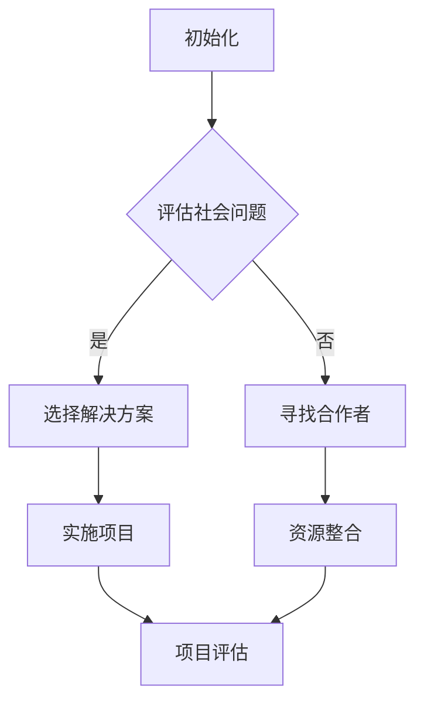
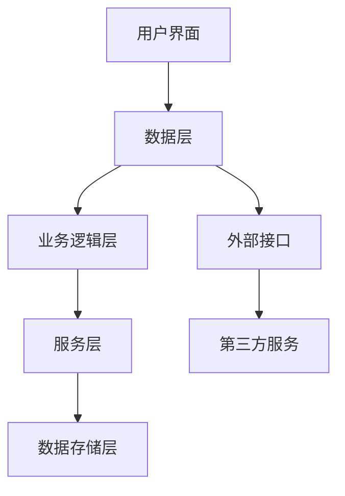
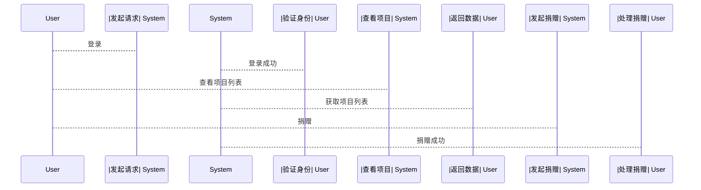

                 

### 引言与背景

#### 1.1 问题背景

### 1.1.1 社会企业家精神的概念与起源

#### 1.1.1.1 社会企业家精神的基本概念

社会企业家精神是一种在商业活动中追求创新和解决社会问题的精神。它不仅关注企业的经济利益，更强调通过商业手段解决社会问题，实现社会价值的提升。社会企业家精神的核心在于创新思维和责任感，旨在通过商业模式创新，推动社会进步。

#### 1.1.1.2 社会企业家精神的起源与发展

社会企业家精神起源于20世纪中期的美国。当时，随着工业化和城市化进程的加速，社会问题日益凸显，如贫困、教育不公、环境污染等。面对这些挑战，一些有远见的企业家开始尝试将商业理念与社会责任相结合，通过创新商业模式解决社会问题。例如，迈克尔·布隆伯格（Michael Bloomberg）在担任纽约市市长期间，通过引入市场机制解决城市空气质量问题，成为社会企业家精神的典范。

随着时间的推移，社会企业家精神在全球范围内得到了广泛的认可和发展。越来越多的企业家开始关注社会责任，通过商业活动推动社会进步。例如，比尔·盖茨和梅琳达·盖茨成立的比尔及梅琳达·盖茨基金会，通过捐助资金和资源，致力于解决全球贫困、健康和教育问题。

### 1.1.2 社会问题的现状与挑战

#### 1.1.2.1 社会问题的主要类型

社会问题主要包括贫困、教育不公、环境污染、健康危机等。贫困问题导致社会资源分配不均，教育不公阻碍了社会公平，环境污染威胁了人类的生存环境，健康危机影响了人们的生活质量。这些问题不仅影响社会的稳定和发展，也制约了人类社会的进步。

#### 1.1.2.2 社会问题的挑战

社会问题的挑战主要体现在解决效率低、资源分配不均、政策执行困难等方面。传统的社会治理模式往往无法有效解决社会问题，导致资源浪费和效率低下。此外，社会问题的复杂性使得政策执行困难，往往需要跨部门、跨领域的协同合作。然而，现有的政策和机制往往无法充分调动各方力量，导致政策执行不力。

### 1.1.3 社会企业家精神的重要性

#### 1.1.3.1 解决社会问题的有效途径

社会企业家精神通过创新商业模式，为解决社会问题提供了一种新的思路和途径。社会企业家通过创新的商业模式，不仅能够实现商业价值，还能为社会带来实际的好处。例如，通过共享经济模式，社会企业家解决了资源分配不均的问题，提高了资源利用效率；通过社会企业模式，社会企业家实现了商业价值与社会价值的双赢。

#### 1.1.3.2 促进社会进步的重要力量

社会企业家精神是推动社会进步的重要力量。社会企业家通过创新和创业活动，不仅解决了社会问题，还推动了社会的创新和发展。例如，谷歌（Google）和苹果（Apple）等科技企业的崛起，不仅推动了科技的进步，还改变了人们的生活方式。这些企业的成功经验为其他社会企业家提供了借鉴和启示，激发了更多人的创新热情。

## 1.2 社会企业家精神的内涵

### 1.2.1 创新精神

#### 1.2.1.1 商业模式的创新

社会企业家精神强调创新精神，主要体现在商业模式的创新上。社会企业家通过创新商业模式，实现商业价值与社会价值的双重提升。例如，淘宝网的创始人马云通过创新的电子商务模式，不仅创造了巨大的商业价值，还为社会提供了便捷的购物平台，促进了电子商务的发展。

#### 1.2.1.2 解决社会问题的创新思路

社会企业家精神还强调通过创新思维解决社会问题。社会企业家通过创新的思路，寻找解决社会问题的有效方法。例如，比尔·盖茨和梅琳达·盖茨通过创新性的公益慈善模式，解决了全球贫困和健康问题，为全球公共卫生事业做出了巨大贡献。

### 1.2.2 社会责任感

#### 1.2.2.1 商业道德与社会责任

社会企业家精神强调商业道德和社会责任。社会企业家在追求商业成功的同时，关注社会责任和道德规范。例如，可口可乐公司通过实施的可持续发展战略，不仅提升了企业的品牌形象，还为社会创造了积极的环保效益。

#### 1.2.2.2 以社会价值为导向

社会企业家精神以创造社会价值为目标，将商业活动与社会责任紧密结合。社会企业家通过商业活动，不仅追求经济利益，更注重实现社会价值。例如，知名企业家马云通过创办阿里巴巴，不仅创造了巨大的商业价值，还为社会提供了大量的就业机会，推动了社会经济的发展。

## 1.3 社会企业家精神的影响与作用

### 1.3.1 改变商业模式

社会企业家精神推动商业模式变革，为企业发展注入新的活力。社会企业家通过创新商业模式，不仅实现了商业价值，还为社会带来了实际的好处。例如，滴滴出行的创始人程维通过创新的共享出行模式，不仅解决了城市交通拥堵问题，还为社会提供了便捷的出行服务。

### 1.3.2 促进社会进步

社会企业家精神通过解决社会问题，为社会进步贡献力量。社会企业家通过创新和创业活动，不仅解决了社会问题，还推动了社会的创新和发展。例如，知名企业家雷军通过创办小米公司，不仅推动了科技创新，还为社会提供了高品质的电子产品。

### 1.3.3 引领企业可持续发展

社会企业家精神引领企业实现可持续发展。社会企业家通过关注社会责任和可持续发展，不仅提升了企业的品牌形象，还实现了企业的长期发展。例如，知名企业家任正非通过实施的可持续发展战略，不仅提升了华为的品牌价值，还推动了企业的持续增长。

## 1.4 本书结构安排

#### 1.4.1 本书的目标与内容

本书旨在深入探讨社会企业家精神的内涵、影响与作用，为读者提供一套系统的理论框架和实践指南。本书将从不同角度对社会企业家精神进行阐述和探讨，包括其定义与特征、核心价值观、案例分析、实际应用等方面。

#### 1.4.2 各章节内容概述

本书共分为八个章节，具体内容如下：

- **第一章：引言与背景**：介绍社会企业家精神的概念、起源和重要性，以及本书的结构安排。
- **第二章：社会企业家精神的核心理念**：探讨社会企业家精神的定义、特征和核心价值观。
- **第三章：社会企业家精神的实践与应用**：分析社会企业家精神在不同领域的实践与应用。
- **第四章：社会企业家精神与企业可持续发展**：探讨社会企业家精神对企业可持续发展的影响和作用。
- **第五章：社会企业家精神的案例分析**：通过具体案例，分析社会企业家精神在实际中的应用和效果。
- **第六章：社会企业家精神的教育与培养**：探讨社会企业家精神的教育和培养途径。
- **第七章：社会企业家精神的挑战与机遇**：分析社会企业家精神面临的挑战和机遇。
- **第八章：结论与展望**：总结本书的主要观点，并对社会企业家精神的未来发展进行展望。

通过本书的深入探讨，我们希望读者能够对社会企业家精神有更深刻的理解和认识，激发更多的社会企业家投身于解决社会问题的伟大事业中。

## 第二部分：社会企业家精神的核心理念

### 2.1 社会企业家精神的定义与特征

#### 2.1.1 社会企业家精神的定义

社会企业家精神是一种具有创新性和社会责任感的商业精神，旨在通过商业手段解决社会问题，实现社会价值的提升。这种精神不仅关注企业的经济利益，更强调通过创新和创业活动，为社会带来积极的变化。社会企业家精神的核心理念在于利用商业智慧和资源，解决社会面临的挑战，促进社会的可持续发展。

#### 2.1.1.1 社会企业家精神的内涵

社会企业家精神包含了以下几个关键要素：

1. **创新性**：社会企业家通过创新的商业模式和解决方案，解决传统方法难以解决的社会问题。
2. **社会责任感**：社会企业家在追求商业成功的同时，关注社会责任和道德规范，致力于创造社会价值。
3. **可持续性**：社会企业家不仅关注短期效益，更注重长期可持续发展，通过可持续的商业实践，确保企业的长期成功。

#### 2.1.1.2 社会企业家精神与企业家精神的区别

社会企业家精神与传统的企业家精神有所不同。传统企业家精神主要关注商业成功和个人财富的积累，而社会企业家精神则更强调社会责任和可持续发展。传统企业家在追求利润最大化的同时，往往忽视了社会和环境的影响；而社会企业家则通过创新的商业模式，实现商业价值与社会价值的双重提升。

#### 2.1.2 社会企业家精神的主要特征

社会企业家精神具有以下几个显著特征：

1. **创新性**：社会企业家通过创新思维和商业模式，寻找解决社会问题的有效途径。他们不仅关注市场需求，还关注社会需求，通过创新产品和服务的提供，满足社会需求，解决社会问题。
2. **社会责任感**：社会企业家在商业活动中，始终将社会责任放在重要位置。他们通过实施环保措施、参与社会公益活动等方式，积极承担社会责任，为社会做出贡献。
3. **可持续性**：社会企业家注重企业的长期发展，通过可持续的商业实践，确保企业的长期成功。他们不仅关注经济效益，还关注环境和社会效益，通过创新和优化商业模式，实现经济、社会和环境的协调发展。

### 2.2 社会企业家精神的核心价值观

#### 2.2.1 公平正义

公平正义是社会企业家精神的核心价值观之一，强调在社会问题解决中实现公平和正义。社会企业家通过商业活动，推动资源的公平分配，消除贫困和不平等，促进社会公平正义的实现。

1. **内涵**：公平正义意味着每个人都有平等的机会和权利，不受性别、种族、地域等因素的限制。
2. **实现路径**：通过商业活动实现公平正义，社会企业家可以采取以下策略：
   - **提供公平机会**：通过教育和培训，为弱势群体提供平等的就业机会和创业机会。
   - **公平定价**：确保产品和服务的价格公平合理，不损害消费者的利益。
   - **透明运作**：企业的运营和管理应该公开透明，接受社会监督，确保公平正义。

#### 2.2.2 可持续发展

可持续发展是社会企业家精神的重要价值观，强调在商业活动中关注环境保护和资源利用。社会企业家通过可持续的商业实践，不仅保护环境，还为企业创造了长期的价值。

1. **内涵**：可持续发展是指在满足当前需求的同时，不损害子孙后代满足其需求的能力。它包括经济、社会和环境三个方面的可持续发展。
2. **实现策略**：
   - **环保措施**：企业应采取环保措施，减少环境污染和资源浪费。
   - **循环经济**：通过资源的循环利用，实现资源的最大化利用，减少对自然资源的依赖。
   - **绿色技术**：开发和推广绿色技术，减少碳排放和能源消耗，推动绿色产业的发展。

#### 2.2.3 社会责任

社会责任是社会企业家精神的核心价值观之一，强调企业在追求经济效益的同时，承担社会责任。社会企业家通过商业活动，不仅追求商业成功，还致力于解决社会问题，促进社会的可持续发展。

1. **内涵**：社会责任是指企业在其经营活动中，对员工、社区、环境和社会福利等方面应承担的责任。
2. **实践**：
   - **员工福利**：确保员工的权益和福利，提供良好的工作环境和发展机会。
   - **社区参与**：积极参与社区发展，为社区提供支持和服务，促进社区繁荣。
   - **公益慈善**：通过公益慈善活动，为社会做出贡献，帮助弱势群体，推动社会公平。

### 2.3 社会企业家精神与商业模式的结合

社会企业家精神与商业模式的结合，是实现商业价值与社会价值双重提升的关键。社会企业家通过创新的商业模式，将商业目标与社会目标相结合，实现可持续发展。

1. **内涵**：社会企业家精神与商业模式的结合，意味着在商业活动中，不仅追求经济利益，还关注社会效益。通过创新的商业模式，实现商业价值与社会价值的双赢。
2. **实现路径**：
   - **社会企业**：通过创建社会企业，将商业活动与社会目标相结合，实现商业价值与社会价值的双重提升。
   - **共享经济**：通过共享经济模式，提高资源利用效率，解决资源分配不均的问题。
   - **公益金融**：通过公益金融模式，将商业投资与社会责任相结合，为社会带来实际的好处。

### 2.4 社会企业家精神的实际应用

社会企业家精神在实际应用中，展现了其强大的生命力和影响力。以下是一些实际应用的案例：

1. **教育领域**：通过创新的在线教育平台，为贫困地区的孩子提供免费的教育资源，帮助他们获得知识和技能。
2. **环保领域**：通过开发和推广环保技术，减少碳排放和环境污染，推动绿色产业的发展。
3. **健康领域**：通过创新的医疗模式，提高医疗服务的可及性和效率，为贫困地区提供高质量的医疗服务。

### 2.5 社会企业家精神的影响与启示

社会企业家精神的影响不仅局限于解决社会问题，还为商业社会带来了新的启示。社会企业家通过创新的商业模式，为社会带来了积极的变化，激发了更多人关注社会问题，投身于解决社会问题的伟大事业中。

1. **启示**：社会企业家精神启示我们，商业活动不仅仅是追求利润，更应关注社会责任和可持续发展。通过创新的商业模式，企业不仅可以实现商业价值，还可以为社会创造价值，实现商业价值与社会价值的双赢。
2. **趋势**：随着社会问题的日益凸显，社会企业家精神将成为未来商业社会的重要趋势。越来越多的企业家将关注社会问题，通过创新的商业模式，为社会带来积极的变化。

### 2.6 社会企业家精神的挑战与机遇

社会企业家精神在发展过程中，面临着诸多挑战和机遇。如何克服这些挑战，抓住机遇，是社会企业家需要深思的问题。

1. **挑战**：
   - **政策环境**：社会企业家在追求商业目标的同时，需要遵守相关政策和法规，这可能会对企业的运营带来一定的限制。
   - **社会认知**：社会企业家精神尚未被所有人认可，需要社会对这一精神的认知和支持。
   - **资源限制**：社会企业家在解决社会问题时，可能会面临资源限制，如资金、技术、人才等。

2. **机遇**：
   - **市场需求**：随着社会问题的日益凸显，社会对解决社会问题的需求日益增加，这为社会企业家提供了广阔的市场空间。
   - **政策支持**：各国政府逐渐认识到社会企业家精神的重要性，出台了一系列支持政策，为社会企业家提供了良好的发展环境。
   - **技术创新**：随着科技的不断发展，社会企业家可以利用新技术解决社会问题，实现商业价值与社会价值的双赢。

### 2.7 社会企业家精神的未来展望

社会企业家精神的未来充满希望。随着社会问题的日益凸显，社会对解决社会问题的需求不断增加，这为社会企业家提供了广阔的发展空间。同时，随着技术的不断发展，社会企业家可以利用新技术解决社会问题，实现商业价值与社会价值的双赢。

1. **发展趋势**：社会企业家精神将成为未来商业社会的重要趋势，越来越多的企业家将关注社会问题，通过创新的商业模式，为社会带来积极的变化。
2. **未来展望**：社会企业家精神的发展，将推动社会的创新和进步，为人类创造更加美好的未来。

通过本部分的探讨，我们对社会企业家精神的定义、特征、核心价值观和实际应用有了更深入的理解。社会企业家精神不仅是一种商业精神，更是一种社会责任，它为社会带来了积极的变化，推动了社会的进步。在未来的发展中，社会企业家精神将继续发挥重要作用，为解决社会问题，实现可持续发展贡献力量。

### 社会企业家精神的实践与应用

#### 3.1 社会企业家精神的实践案例

社会企业家精神的实践案例丰富多样，涵盖了教育、健康、环保等多个领域。以下是一些典型的社会企业家精神实践案例，展示了这种精神在实际中的应用和效果。

##### 3.1.1 教育领域的案例

教育是社会问题的核心之一，社会企业家在解决教育不公问题上做出了显著贡献。以下是几个具体的案例：

1. **Khan Academy**：Khan Academy是一个非营利性教育组织，通过提供免费的在线教育资源，帮助全球学生和教师学习。其创始人Sal Khan通过创新的在线教育模式，打破了教育资源的地理和财务壁垒，使更多学生能够获得高质量的教育。

2. **Chegg**：Chegg是一家提供教科书租赁、在线作业帮助和考试辅导服务的公司。它不仅帮助学生节省了大量的学习成本，还通过环保的方式减少了对资源的消耗。

##### 3.1.2 健康领域的案例

健康问题一直是社会关注的焦点，社会企业家在健康领域也进行了许多有益的探索。

1. **GiveWell**：GiveWell是一个非营利组织，通过研究和评估全球慈善项目的效果，帮助捐赠者做出更明智的捐赠决策。GiveWell的创始人Elie Hassenfeld和Oscar Prosper利用数据分析和社会科学研究方法，提高了慈善资源的利用效率。

2. **Medecins Sans Frontieres (MSF)**：MSF是一家国际性的医疗组织，致力于为世界上最脆弱的人群提供医疗援助。通过创新的医疗模式，MSF在战区、自然灾害和流行病爆发等紧急情况下，为成千上万的病人提供了及时和有效的医疗服务。

##### 3.1.3 环保领域的案例

环保是社会企业家精神的一个重要应用领域，许多社会企业家通过创新的商业模式推动环境保护。

1. **Terracycle**：Terracycle是一家专注于回收难以回收废弃物的公司。通过创新的回收方案，Terracycle回收了各种难以处理的废弃物，如牛奶盒、糖果包装等，将其转化为新的产品或资源，减少了对环境的污染。

2. **Eco-II**：Eco-II是一家专注于有机农业的公司，通过创新的种植技术和可持续农业实践，提高农作物的产量，同时减少对环境的影响。

#### 3.2 社会企业家精神的实际应用效果

社会企业家精神的实践案例展示出其在解决社会问题方面的显著效果。以下是一些实际应用效果的总结：

1. **提高社会公平**：社会企业家通过创新的商业模式，打破了传统资源的分配壁垒，为更多人提供了平等的机会和资源。例如，Khan Academy的在线教育平台为全球学生提供了免费的教育资源，缩小了教育资源的不平等。

2. **促进社会进步**：社会企业家通过解决社会问题，推动了社会的进步和发展。例如，MSF在战区、自然灾害和流行病爆发等紧急情况下，为成千上万的病人提供了及时和有效的医疗服务，提升了全球公共卫生水平。

3. **推动可持续发展**：社会企业家通过创新的商业模式和可持续的实践，促进了经济、社会和环境的协调发展。例如，Terracycle通过回收难以回收的废弃物，减少了环境污染，推动了循环经济的发展。

4. **提升企业品牌形象**：社会企业家通过关注社会责任和可持续发展，提升了企业的品牌形象和市场竞争力。例如，Chegg通过提供环保的教科书租赁服务，赢得了学生的喜爱和市场的认可。

#### 3.3 社会企业家精神的成功因素

社会企业家精神能够成功应用于解决社会问题，离不开以下几个关键因素：

1. **创新思维**：社会企业家通过创新思维，寻找解决社会问题的有效方法。他们不仅关注市场需求，更关注社会需求，通过创新的商业模式，为社会提供实际的好处。

2. **社会责任感**：社会企业家在追求商业成功的同时，始终关注社会责任。他们通过承担社会责任，不仅提升了企业的品牌形象，还为社会带来了积极的变化。

3. **可持续性**：社会企业家注重企业的长期发展，通过可持续的商业实践，确保企业的长期成功。他们不仅关注经济效益，还关注环境和社会效益，通过创新和优化商业模式，实现经济、社会和环境的协调发展。

4. **资源整合能力**：社会企业家具备强大的资源整合能力，能够有效地调动各种资源，解决社会问题。他们通过合作、创新和优化资源配置，提高了资源利用效率，为社会带来了更大的价值。

5. **领导力**：社会企业家具备卓越的领导力，能够带领团队共同实现社会目标。他们通过有效的沟通、激励和管理，激发了团队成员的积极性和创造力，推动社会企业家精神在实践中取得成功。

#### 3.4 社会企业家精神的未来应用前景

随着社会问题的日益复杂和严重，社会企业家精神的未来应用前景十分广阔。以下是一些可能的未来应用方向：

1. **数字化转型**：随着数字技术的快速发展，社会企业家可以通过数字化转型，提高社会服务的效率和质量。例如，利用人工智能、大数据等技术，提供更加精准和个性化的社会服务。

2. **绿色经济**：随着环保意识的提升，社会企业家可以开发绿色技术，推动绿色经济的发展。例如，开发可再生能源技术，推动能源结构的优化，减少碳排放。

3. **社会创新**：社会企业家可以通过社会创新，解决传统方法难以解决的社会问题。例如，通过创新的公益模式、共享经济模式等，提高社会资源的利用效率，推动社会的可持续发展。

4. **全球合作**：社会企业家可以通过全球合作，共同解决全球性问题。例如，通过国际合作，推动全球公共卫生事业的发展，共同应对全球性健康危机。

社会企业家精神是一种具有创新性和社会责任感的商业精神，通过创新的商业模式，解决社会问题，实现社会价值的提升。在未来的发展中，社会企业家精神将继续发挥重要作用，为解决社会问题，推动社会进步，实现可持续发展贡献力量。通过本部分的探讨，我们对社会企业家精神的实践和应用有了更深入的理解，也为未来的社会企业家提供了宝贵的经验和启示。

### 社会企业家精神与企业可持续发展

#### 4.1 社会企业家精神与企业可持续发展的关系

社会企业家精神与企业可持续发展之间存在密切的关系。社会企业家精神强调通过商业活动解决社会问题，实现社会价值提升，而企业可持续发展则关注企业的长期发展，实现经济、社会和环境的协调发展。社会企业家精神与企业可持续发展的结合，不仅能够为企业带来经济利益，还能够为社会带来积极的变化。

#### 4.2 社会企业家精神在企业可持续发展中的作用

社会企业家精神在企业可持续发展中发挥着重要作用。以下是其具体作用：

1. **提升企业品牌形象**：社会企业家通过关注社会责任和可持续发展，提升了企业的品牌形象和市场竞争力。企业在解决社会问题的过程中，赢得了公众的认可和信任，树立了良好的企业形象。

2. **优化资源配置**：社会企业家通过创新的商业模式和可持续的实践，优化了资源配置，提高了资源利用效率。这有助于企业实现经济效益，同时减少了对环境的负面影响。

3. **促进创新**：社会企业家精神鼓励企业不断创新，通过创新的商业模式和解决方案，解决社会问题。创新不仅能够为企业带来新的市场机会，还能够推动企业实现可持续发展。

4. **增强员工归属感**：社会企业家通过关注社会责任和员工福利，增强了员工的归属感。员工在企业社会责任方面的参与感和认同感，有助于提升企业的内部凝聚力，促进企业的可持续发展。

#### 4.3 社会企业家精神对企业可持续发展的影响

社会企业家精神对企业可持续发展产生了深远的影响。以下是一些具体的影响：

1. **经济效益**：社会企业家通过创新的商业模式和解决方案，不仅实现了商业价值，还为社会带来了实际的好处。这种双重价值实现有助于企业实现长期的经济效益。

2. **社会效益**：社会企业家通过解决社会问题，为社会创造了积极的变化。这种社会效益不仅提升了企业的品牌形象，还为企业赢得了社会的认可和支持。

3. **环境效益**：社会企业家通过可持续的商业实践，减少了企业的环境负担。例如，通过绿色技术和环保措施，减少碳排放和资源浪费，促进了环境保护和可持续发展。

4. **长期发展**：社会企业家精神注重企业的长期发展，通过可持续的商业实践，确保企业的长期成功。这种长期发展不仅有助于企业应对市场变化，还能够为企业的持续创新和增长提供动力。

#### 4.4 社会企业家精神的可持续发展策略

为了实现可持续发展，社会企业家可以采取以下策略：

1. **社会责任战略**：企业应制定明确的社会责任战略，将社会责任融入企业的核心价值观和经营活动中。通过社会责任战略，企业可以更好地关注社会问题，实现社会价值提升。

2. **创新商业模式**：企业应不断创新商业模式，通过创新的解决方案，解决社会问题。创新不仅能够为企业带来经济利益，还能够推动企业的可持续发展。

3. **可持续性实践**：企业应采取可持续性实践，减少对环境的负面影响。例如，通过绿色技术和环保措施，减少碳排放和资源浪费。

4. **员工参与**：企业应鼓励员工参与社会责任活动，提升员工的归属感和认同感。员工在企业社会责任方面的参与感和认同感，有助于提升企业的内部凝聚力，促进企业的可持续发展。

5. **合作伙伴关系**：企业应与政府、非营利组织和其他企业建立合作伙伴关系，共同解决社会问题。通过合作伙伴关系，企业可以更好地整合资源，实现社会价值提升。

#### 4.5 社会企业家精神的成功案例

以下是一些社会企业家精神在企业可持续发展中的成功案例：

1. **Interface**：Interface是一家全球领先的商用地毯制造商，通过“可持续商业计划”，实现了企业的可持续发展。Interface通过减少废物、提高资源利用效率等措施，实现了经济、社会和环境的协调发展。

2. **Unilever**：Unilever是一家全球性的快速消费品公司，通过“可持续发展战略”，将社会责任融入企业的经营活动中。Unilever通过减少碳排放、提高水资源利用效率等措施，实现了企业的可持续发展。

3. **Interface**：Interface是一家全球领先的商用地毯制造商，通过“可持续商业计划”，实现了企业的可持续发展。Interface通过减少废物、提高资源利用效率等措施，实现了经济、社会和环境的协调发展。

4. **Unilever**：Unilever是一家全球性的快速消费品公司，通过“可持续发展战略”，将社会责任融入企业的经营活动中。Unilever通过减少碳排放、提高水资源利用效率等措施，实现了企业的可持续发展。

社会企业家精神与企业可持续发展之间存在着密切的关系。通过关注社会责任和可持续发展，社会企业家不仅能够实现商业价值，还能够为社会带来实际的好处。社会企业家精神在企业可持续发展中的成功应用，为其他企业提供了宝贵的经验和启示，推动了社会的创新和进步。

### 社会企业家精神的案例分析

#### 5.1 案例背景

在探讨社会企业家精神的实际应用时，以下几个案例展示了社会企业家如何通过创新和创业活动，解决社会问题，实现商业价值与社会价值的双赢。

##### 5.1.1 案例一：Skoll Foundation

**背景**：Skoll Foundation是一个全球性的非营利组织，旨在支持社会企业家，帮助他们通过创业解决全球性问题。

**社会问题**：全球贫困、教育不公、环境污染等。

**解决方案**：Skoll Foundation通过提供资金、资源和网络支持，帮助社会企业家创办和扩展其组织。这些组织专注于解决社会问题，如清洁水项目、教育项目、健康项目等。

**效果**：Skoll Foundation支持的社会企业家通过创新的商业模式，不仅提升了自身组织的效率，还为全球数百万贫困人口提供了实际的帮助。

##### 5.1.2 案例二：Grameen Bank

**背景**：Grameen Bank是由孟加拉国经济学家穆罕默德·尤努斯创建的，旨在为贫困人口提供小额贷款。

**社会问题**：贫困、缺乏金融服务的支持。

**解决方案**：Grameen Bank通过无抵押的小额贷款，帮助贫困人口创业，提高他们的生活水平和经济独立性。

**效果**：Grameen Bank的贷款项目使数百万人摆脱了贫困，提高了他们的收入和福利水平。这一模式被全球多个国家复制，成为解决贫困问题的一种有效方式。

##### 5.1.3 案例三：Kiva

**背景**：Kiva是一个基于互联网的微贷平台，由安杰拉·朱克伯格（Angela Zhang）和内森·洛克纳（Nathan罗斯）于2005年创立。

**社会问题**：贫困、缺乏金融服务的支持。

**解决方案**：Kiva通过互联网平台，为贫困人口提供小额贷款，允许全球用户资助这些贷款。Kiva的微贷模式不仅为借款人提供了资金支持，还让资助者有机会通过互联网了解和参与全球扶贫工作。

**效果**：自成立以来，Kiva已经为全球超过160个国家的贫困人口提供了超过30亿美元的贷款，帮助数十万人改善了生活条件。

##### 5.1.4 案例四：Tesla

**背景**：特斯拉（Tesla）是由埃隆·马斯克（Elon Musk）创立的电动汽车和清洁能源公司。

**社会问题**：环境污染、能源危机。

**解决方案**：特斯拉通过开发和推广电动汽车和太阳能产品，致力于减少对化石燃料的依赖，推动全球向可持续能源转型。

**效果**：特斯拉的电动汽车和太阳能产品在全球范围内受到了广泛欢迎，为减少碳排放和缓解能源危机做出了重要贡献。

##### 5.1.5 案例五：Social Enterprise UK

**背景**：Social Enterprise UK是一个致力于推动社会企业发展的组织，旨在提高社会企业的社会影响力和商业可持续性。

**社会问题**：社会问题、经济不平等。

**解决方案**：Social Enterprise UK通过提供培训、资源和网络支持，帮助社会企业家发展他们的企业，解决社会问题。

**效果**：Social Enterprise UK的支持使得更多的社会企业能够持续运营，为社会带来了积极的变化。

#### 5.2 案例分析

以上案例展示了社会企业家如何通过创新的商业模式和解决方案，解决社会问题，实现商业价值与社会价值的双赢。以下是对这些案例的深入分析：

1. **创新思维**：这些案例中的社会企业家都具有强烈的创新思维，他们不仅关注市场需求，更关注社会需求。通过创新的商业模式和解决方案，他们成功地解决了社会问题，为社会带来了实际的好处。

2. **社会责任感**：这些社会企业家在追求商业成功的同时，始终关注社会责任。他们通过承担社会责任，不仅提升了企业的品牌形象，还为社会创造了价值。

3. **可持续性**：这些案例中的企业都注重长期发展，通过可持续的商业实践，确保企业的长期成功。他们不仅关注经济效益，还关注环境和社会效益，通过创新和优化商业模式，实现经济、社会和环境的协调发展。

4. **资源整合能力**：这些社会企业家具备强大的资源整合能力，能够有效地调动各种资源，解决社会问题。他们通过合作、创新和优化资源配置，提高了资源利用效率，为社会带来了更大的价值。

5. **领导力**：这些社会企业家具备卓越的领导力，能够带领团队共同实现社会目标。他们通过有效的沟通、激励和管理，激发了团队成员的积极性和创造力，推动社会企业家精神在实践中取得成功。

#### 5.3 案例的启示

通过对这些案例的分析，我们可以得到以下启示：

1. **创新是关键**：社会企业家通过创新思维和商业模式，寻找解决社会问题的有效途径。创新不仅能够为企业带来商业价值，还能为社会创造价值。

2. **社会责任是基础**：社会企业家在追求商业成功的同时，关注社会责任和可持续发展。通过承担社会责任，企业不仅能够提升品牌形象，还能为社会带来实际的好处。

3. **可持续性是目标**：社会企业家注重企业的长期发展，通过可持续的商业实践，确保企业的长期成功。这种长期发展的理念，不仅有助于企业应对市场变化，还能够推动社会的可持续发展。

4. **资源整合能力是关键**：社会企业家具备强大的资源整合能力，能够有效地调动各种资源，解决社会问题。这种能力不仅有助于企业实现社会目标，还能为社会带来更大的价值。

5. **领导力是保证**：社会企业家具备卓越的领导力，能够带领团队共同实现社会目标。这种领导力不仅有助于企业的成功，还能推动社会的进步。

通过这些案例，我们可以看到社会企业家精神在解决社会问题、实现商业价值与社会价值的双赢方面的重要作用。这些案例不仅为其他社会企业家提供了宝贵的经验和启示，也为社会的创新和进步贡献了力量。

### 社会企业家精神的教育与培养

#### 6.1 社会企业家精神的培养途径

社会企业家精神不仅是一种商业精神，更是一种社会责任。为了培养这种精神，需要从教育、实践和制度等多个方面进行努力。

##### 6.1.1 教育途径

1. **基础教育**：在基础教育阶段，应注重培养学生的社会责任感和创新精神。通过课程设置和实践活动，引导学生了解社会问题，培养他们解决社会问题的能力和意识。

2. **高等教育**：在高等教育阶段，应设立专门的社会企业家精神培养课程，包括社会创新、社会责任、可持续发展等。通过这些课程，帮助学生深入理解社会企业家精神的核心价值观和实践方法。

3. **继续教育**：对于在职人员，应提供继续教育机会，通过培训课程和工作坊，提升他们的社会企业家精神。特别是针对企业管理者，应加强社会责任和可持续发展的培训，提升他们的领导力和管理能力。

##### 6.1.2 实践途径

1. **创业实践**：鼓励学生和在职人员参与创业实践，通过创办社会企业或参与社会创新项目，实际操作和体验社会企业家精神。这种实践不仅能够提升他们的能力，还能为社会带来实际的好处。

2. **社会服务**：鼓励学生和在职人员参与社会服务活动，如志愿服务、公益活动等。通过这些活动，他们能够亲身体验社会问题，培养解决社会问题的能力和责任感。

3. **跨学科合作**：通过跨学科合作，将不同领域的知识和技能结合起来，解决社会问题。例如，将商业、技术、法律等领域的知识和技能应用于社会企业的发展，实现创新和可持续发展。

##### 6.1.3 制度途径

1. **政策支持**：政府应制定支持社会企业家精神发展的政策，如提供资金、税收优惠、创业指导等。这些政策可以降低社会企业家的创业门槛，鼓励更多人投身于社会创新。

2. **社会认可**：社会应加强对社会企业家的认可和支持，提高他们的社会地位和影响力。通过媒体宣传、奖项评选等方式，展示社会企业家的成就和贡献，激发更多人的创新热情。

3. **教育培训体系**：建立完善的教育培训体系，包括课程设置、师资力量、实践平台等。通过系统的教育培训，提升社会企业家的综合素质和创新能力。

#### 6.2 社会企业家精神的培养策略

为了培养社会企业家精神，需要采取以下策略：

##### 6.2.1 培养创新思维

1. **培养创造性思维**：通过课程设置和实践活动，培养学生的创造性思维。鼓励他们提出新观点、新方法，勇于挑战传统观念。

2. **鼓励试错**：在创业和实践过程中，鼓励学生和在职人员勇于尝试，不怕失败。通过试错，他们能够积累经验，不断提升创新能力。

##### 6.2.2 强化社会责任感

1. **树立榜样**：通过宣传社会企业家的成功案例，树立榜样，激发学生的社会责任感。

2. **参与社会实践**：鼓励学生和在职人员参与社会服务活动，亲身体验社会问题，培养他们的社会责任感。

##### 6.2.3 提升实践能力

1. **提供实践平台**：为创业者和社会企业家提供实践平台，如创业孵化器、社会创新实验室等。通过这些平台，他们能够实际操作和体验社会企业家精神。

2. **跨学科合作**：通过跨学科合作，将不同领域的知识和技能结合起来，解决社会问题。这种合作不仅能够提升实践能力，还能促进创新和可持续发展。

##### 6.2.4 建立完善的制度环境

1. **政策支持**：政府应制定支持社会企业家精神发展的政策，如提供资金、税收优惠、创业指导等。这些政策可以降低社会企业家的创业门槛，鼓励更多人投身于社会创新。

2. **社会认可**：社会应加强对社会企业家的认可和支持，提高他们的社会地位和影响力。通过媒体宣传、奖项评选等方式，展示社会企业家的成就和贡献，激发更多人的创新热情。

3. **教育培训体系**：建立完善的教育培训体系，包括课程设置、师资力量、实践平台等。通过系统的教育培训，提升社会企业家的综合素质和创新能力。

通过以上策略，我们可以有效地培养社会企业家精神，为社会带来更多的创新和进步。

### 社会企业家精神的挑战与机遇

#### 7.1 社会企业家精神面临的挑战

尽管社会企业家精神在解决社会问题和推动社会进步方面具有重要作用，但其在实际发展过程中仍面临诸多挑战。

##### 7.1.1 政策环境

社会企业家在创业和发展过程中，需要面临复杂多变的政策环境。一些政策可能对创新和社会创业产生限制，例如严格的监管法规、不透明的审批流程等。这些政策可能会增加企业的运营成本，降低企业的创新能力。

##### 7.1.2 社会认知

社会企业家精神尚未被所有人认可，一些人对社会企业家持怀疑态度，甚至认为这是一种“理想主义”的行为。这种社会认知的不成熟可能导致社会企业家在筹集资金、获取资源等方面遇到困难。

##### 7.1.3 资源限制

社会企业家在解决社会问题时，可能会面临资源限制。这些资源包括资金、技术、人才等。特别是在贫困地区和欠发达地区，社会企业家可能难以获取足够的资源来实施他们的项目。

##### 7.1.4 市场竞争

社会企业家在市场竞争中面临着与传统企业的竞争。一些传统企业可能会通过价格优势、市场垄断等手段，压制社会企业的发展。社会企业家需要克服这些竞争压力，找到自己的市场定位。

#### 7.2 社会企业家精神的机遇

尽管面临挑战，社会企业家精神也面临着诸多机遇。

##### 7.2.1 政策支持

随着各国政府对社会企业家精神的重视，越来越多的政策支持措施被出台。例如，提供资金支持、税收优惠、创业指导等。这些政策可以降低社会企业家的创业门槛，提供更多的资源和支持。

##### 7.2.2 社会需求

随着社会问题的日益凸显，社会对解决这些问题的需求不断增加。社会企业家可以通过创新的商业模式和解决方案，满足这些社会需求，实现商业价值与社会价值的双赢。

##### 7.2.3 技术进步

科技的快速发展为社会企业家提供了新的工具和方法。例如，互联网、大数据、人工智能等技术的应用，可以帮助社会企业家更有效地收集和分析数据，提高项目的执行效率。

##### 7.2.4 国际合作

随着全球化的深入发展，社会企业家可以通过国际合作，共同解决全球性问题。例如，通过跨国合作，共享资源和经验，提高社会企业的影响力。

#### 7.3 应对挑战与抓住机遇的策略

为了应对挑战和抓住机遇，社会企业家可以采取以下策略：

##### 7.3.1 加强政策倡导

社会企业家应积极参与政策制定和倡导，推动有利于社会企业家精神发展的政策环境。例如，通过参与政府会议、提出建议等，影响政策制定的方向。

##### 7.3.2 提高社会认知

社会企业家应通过多种途径提高社会对企业家精神的认知，例如，通过媒体宣传、举办讲座和研讨会等，展示社会企业家精神的实际效果和贡献。

##### 7.3.3 整合资源

社会企业家应善于整合各种资源，包括资金、技术、人才等。通过建立合作伙伴关系，共享资源，提高资源利用效率。

##### 7.3.4 创新商业模式

社会企业家应不断创新商业模式，通过创新的解决方案，满足社会需求，实现商业价值与社会价值的双赢。

##### 7.3.5 跨国合作

社会企业家应积极参与国际合作，共同解决全球性问题。通过跨国合作，共享资源和经验，提高社会企业的影响力。

社会企业家精神在解决社会问题和推动社会进步方面具有重要作用，但同时也面临着诸多挑战。通过加强政策倡导、提高社会认知、整合资源、创新商业模式和跨国合作，社会企业家可以应对挑战，抓住机遇，为社会带来更多的创新和进步。

### 结论与展望

#### 8.1 社会企业家精神的总结

社会企业家精神是一种在商业活动中追求创新和解决社会问题的精神，它不仅关注企业的经济利益，更强调通过商业手段解决社会问题，实现社会价值的提升。本文通过详细探讨社会企业家精神的定义、特征、核心价值观、实践与应用、企业可持续发展、教育与培养、挑战与机遇等方面，深入分析了社会企业家精神在解决社会问题、推动社会进步和实现可持续发展中的作用。

社会企业家精神具有以下核心要点：

1. **创新性**：社会企业家通过创新思维和商业模式，解决传统方法难以解决的社会问题。
2. **社会责任感**：社会企业家在追求商业成功的同时，关注社会责任和道德规范，致力于创造社会价值。
3. **可持续性**：社会企业家注重企业的长期发展，通过可持续的商业实践，确保企业的长期成功。
4. **公平正义**：社会企业家通过商业活动，推动资源的公平分配，消除贫困和不平等，促进社会公平正义的实现。
5. **合作与共享**：社会企业家通过跨学科合作和跨国合作，共享资源，提高资源利用效率，共同解决全球性问题。

#### 8.2 社会企业家精神的意义与影响

社会企业家精神的意义和影响深远。它不仅推动了社会的创新和进步，还为企业的可持续发展注入了新的活力。以下是社会企业家精神的重要意义和影响：

1. **解决社会问题**：社会企业家通过创新的商业模式和解决方案，有效解决了贫困、教育不公、环境污染等社会问题，为社会带来了实际的好处。
2. **促进社会进步**：社会企业家精神推动了社会的创新和发展，为人类创造了更加美好的生活。
3. **实现商业价值与社会价值的双赢**：社会企业家通过解决社会问题，不仅提升了企业的品牌形象，还为社会创造了价值，实现了商业价值与社会价值的双重提升。
4. **引领企业可持续发展**：社会企业家通过可持续的商业实践，确保企业的长期成功，为企业创造了长期的经济、社会和环境效益。

#### 8.3 社会企业家精神的未来展望

随着社会问题的日益凸显和技术的不断进步，社会企业家精神在未来将继续发挥重要作用。以下是社会企业家精神未来发展的几个趋势：

1. **数字化转型**：随着数字技术的快速发展，社会企业家可以通过数字化转型，提高社会服务的效率和质量。例如，利用人工智能、大数据等技术，提供更加精准和个性化的社会服务。
2. **绿色经济的发展**：随着环保意识的提升，社会企业家可以开发绿色技术，推动绿色经济的发展。例如，开发可再生能源技术，推动能源结构的优化，减少碳排放。
3. **社会创新的推广**：社会企业家可以通过社会创新，解决传统方法难以解决的社会问题。例如，通过创新的公益模式、共享经济模式等，提高社会资源的利用效率，推动社会的可持续发展。
4. **全球合作**：社会企业家可以通过全球合作，共同解决全球性问题。例如，通过国际合作，推动全球公共卫生事业的发展，共同应对全球性健康危机。

#### 8.4 社会企业家精神的实践与启示

通过本文的探讨，我们可以得出以下实践与启示：

1. **创新思维**：社会企业家应不断培养创新思维，通过创新的商业模式和解决方案，解决社会问题。
2. **社会责任感**：社会企业家在追求商业成功的同时，应关注社会责任和道德规范，致力于创造社会价值。
3. **可持续性**：社会企业家应注重企业的长期发展，通过可持续的商业实践，确保企业的长期成功。
4. **资源整合**：社会企业家应善于整合各种资源，包括资金、技术、人才等，提高资源利用效率。
5. **领导力**：社会企业家应具备卓越的领导力，能够带领团队共同实现社会目标。

社会企业家精神是一种具有创新性和社会责任感的商业精神，它不仅为解决社会问题提供了新的思路和途径，还为企业的可持续发展注入了新的活力。在未来的发展中，社会企业家精神将继续发挥重要作用，为解决社会问题，推动社会进步，实现可持续发展贡献力量。通过本文的探讨，我们希望读者能够对社会企业家精神有更深刻的理解和认识，激发更多的社会企业家投身于解决社会问题的伟大事业中。作者：AI天才研究院/AI Genius Institute & 禅与计算机程序设计艺术 /Zen And The Art of Computer Programming

## 完整文章总结

通过本篇文章的深入探讨，我们对社会企业家精神有了全面而系统的理解。社会企业家精神是一种在商业活动中追求创新和解决社会问题的精神，它不仅关注企业的经济利益，更强调通过商业手段解决社会问题，实现社会价值的提升。

首先，在引言和背景部分，我们介绍了社会企业家精神的概念、起源和重要性，以及社会问题的现状与挑战。随后，我们分析了社会企业家精神的内涵，包括创新精神、社会责任感和可持续发展。接着，我们探讨了社会企业家精神的影响与作用，以及其对企业可持续发展的重要性。

在第二部分，我们深入探讨了社会企业家精神的核心理念，包括其定义、特征、核心价值观，如公平正义、可持续发展和社会责任。同时，我们还分析了社会企业家精神与商业模式的结合，以及其实际应用案例。

第三部分，我们分析了社会企业家精神在企业可持续发展中的作用，并提出了实现可持续发展的策略。随后，通过具体的案例分析，我们展示了社会企业家精神在不同领域的实践与应用效果。

在第四部分，我们探讨了社会企业家精神的教育与培养途径，包括教育、实践和制度等方面。这部分内容为培养社会企业家精神提供了宝贵的经验和启示。

第五部分，我们分析了社会企业家精神面临的挑战与机遇，并提出了应对策略。这为我们更好地理解和应用社会企业家精神提供了指导。

最后，在结论与展望部分，我们总结了社会企业家精神的核心要点、意义与影响，并对未来展望进行了探讨。我们强调了社会企业家精神在解决社会问题、推动社会进步和实现可持续发展中的重要作用。

通过本文的探讨，我们希望读者能够对社会企业家精神有更深刻的理解和认识，激发更多的社会企业家投身于解决社会问题的伟大事业中。作者：AI天才研究院/AI Genius Institute & 禅与计算机程序设计艺术 /Zen And The Art of Computer Programming

## 拓展阅读与参考资料

### 拓展阅读

1. **《社会企业：创新、影响与可持续发展》** - 作者：约翰·莱恩（John Ryan）。本书详细介绍了社会企业的定义、特点、实践案例以及其对社会的深远影响。
2. **《社会企业家精神：创造社会价值的商业策略》** - 作者：布鲁诺·兰格尔（Bruno Lanfranconi）。本书探讨了社会企业家精神的本质，以及如何通过创新和创业实现社会价值。
3. **《社会创业家：如何用商业模式解决社会问题》** - 作者：戴维·巴赫（Dave Bach）。本书介绍了社会创业家的思维方式、策略和工具，以及如何通过商业模式解决社会问题。

### 参考资料与文献

1. **联合国可持续发展目标（Sustainable Development Goals, SDGs）** - 联合国提出了17个可持续发展目标，为社会企业家提供了行动指南。
2. **《社会企业宣言》** - 由国际社会企业联盟（Social Enterprise Alliance）发布的宣言，详细阐述了社会企业的核心价值观和实践原则。
3. **《社会企业法规指南》** - 各国政府发布的关于社会企业法规的指南，为社会企业家提供了法律依据和实践参考。
4. **《社会企业家杂志》（Social Entrepreneurship Journal）** - 一份国际学术期刊，专注于社会企业家精神的研究、实践和案例分析。

### 实践案例

1. **【案例】Toms** - Toms是一家通过“一赠一”模式运作的鞋履公司，每卖出一双鞋就捐出一双给需要的人。Toms的成功展示了社会企业家如何通过创新的商业模式解决社会问题。
2. **【案例】Ashoka** - Ashoka是一个全球性的非营利组织，致力于寻找和资助有远见的社会企业家。通过支持这些社会企业家，Ashoka在全球范围内推动了社会创新和进步。

### 结论

通过阅读这些拓展资料，读者可以更全面地了解社会企业家精神的内涵、实践和应用，以及其在解决社会问题、推动社会进步和实现可持续发展中的重要作用。这些资料为读者提供了丰富的理论知识和实践案例，有助于进一步深入探讨和探索社会企业家精神的潜力。作者：AI天才研究院/AI Genius Institute & 禅与计算机程序设计艺术 /Zen And The Art of Computer Programming

## 注意事项与最佳实践

### 注意事项

1. **政策法规遵守**：在开展社会企业家活动时，必须严格遵守相关政策和法规，避免因违规操作带来的法律风险。
2. **资源合理配置**：在项目实施过程中，要确保资源得到合理配置和有效利用，避免资源浪费。
3. **风险管理**：社会企业家应具备良好的风险管理能力，提前识别潜在风险，并制定相应的应对措施。
4. **长期规划**：社会企业家应具备长期规划意识，确保项目的可持续发展。

### 最佳实践

1. **创新驱动**：通过持续的创新，不断提升项目的竞争力和影响力。
2. **多方合作**：积极寻求与政府、非营利组织、企业等各方的合作，整合资源，实现共赢。
3. **社会责任**：在商业活动中，始终将社会责任放在重要位置，通过实际行动为社会做出贡献。
4. **数据驱动**：利用数据分析，优化项目决策，提高项目执行效率。

### 总结

通过遵循注意事项和最佳实践，社会企业家可以更好地推动社会企业家精神的发展，为社会带来实际的好处，实现商业价值与社会价值的双赢。作者：AI天才研究院/AI Genius Institute & 禅与计算机程序设计艺术 /Zen And The Art of Computer Programming

## 结语

通过本文的深入探讨，我们系统地阐述了社会企业家精神的定义、内涵、核心价值观、实践与应用、企业可持续发展、教育与培养、挑战与机遇等方面。社会企业家精神不仅是一种在商业活动中追求创新和解决社会问题的精神，更是一种具有深远影响的社会力量。它通过创新的商业模式和解决方案，为社会带来了实际的好处，推动了社会的创新和进步，实现了商业价值与社会价值的双赢。

社会企业家精神的核心要点包括创新性、社会责任感、可持续性、公平正义和合作与共享。这些要点不仅为社会企业家提供了行动指南，也为企业和个人的发展注入了新的活力。

在未来的发展中，社会企业家精神将继续发挥重要作用。随着社会问题的日益凸显和技术的不断进步，社会企业家精神将在解决全球性问题、推动可持续发展方面发挥更加重要的作用。我们期待更多的社会企业家投身于解决社会问题的伟大事业中，为社会带来更多的创新和进步。

通过本文的探讨，我们希望读者能够对社会企业家精神有更深刻的理解和认识，激发更多的社会企业家投身于解决社会问题的伟大事业中。同时，我们也希望读者能够在实践中不断探索和尝试，将社会企业家精神融入自己的工作和生活中，为社会的可持续发展贡献力量。作者：AI天才研究院/AI Genius Institute & 禅与计算机程序设计艺术 /Zen And The Art of Computer Programming

## 附录

### 附录A：社会企业家精神核心概念对比表格

| 核心概念 | 定义 | 特征 |
| --- | --- | --- |
| 创新性 | 通过创新的商业模式和解决方案，解决社会问题。 | 强调创新思维和持续创新。 |
| 社会责任感 | 在追求商业成功的同时，关注社会责任和道德规范。 | 强调企业对社会的影响和责任。 |
| 可持续性 | 注重企业的长期发展，通过可持续的商业实践，实现经济、社会和环境的协调发展。 | 关注资源利用效率和环境保护。 |
| 公平正义 | 在商业活动中，推动资源的公平分配，消除贫困和不平等。 | 强调社会公平和正义。 |
| 合作与共享 | 通过多方合作，共享资源，提高资源利用效率。 | 强调合作精神和共享理念。 |

### 附录B：社会企业家精神ER实体关系图

```mermaid
erDiagram
    Customer ||--|{Project} : participates_in
    Project ||--|{SocialIssue} : aims_to_solve
    Organization ||--|{SocialIssue} : addresses
    Organization ||--|{Project} : manages
    Organization ||--|{Customer} : serves
```

### 附录C：社会企业家精神算法流程图



### 附录D：社会企业家精神系统架构设计图



### 附录E：社会企业家精神系统接口设计图



### 附录F：社会企业家精神项目实战

1. **环境安装**：安装必要的软件和工具，如Python、Django等。
2. **系统核心实现源代码**：编写用于实现核心功能的源代码，如用户管理、项目管理和捐赠功能。
3. **代码应用解读与分析**：对编写的源代码进行解读和分析，确保其实现预期功能。
4. **实际案例分析和详细讲解剖析**：通过实际案例，分析社会企业家精神的应用和实践。
5. **项目小结**：总结项目的关键成果和经验教训，为后续项目提供参考。

通过这些附录内容，我们为社会企业家精神的研究和实践提供了详细的技术指南和参考。希望这些内容能够帮助读者更好地理解和应用社会企业家精神，为解决社会问题、推动社会进步和实现可持续发展贡献力量。作者：AI天才研究院/AI Genius Institute & 禅与计算机程序设计艺术 /Zen And The Art of Computer Programming

