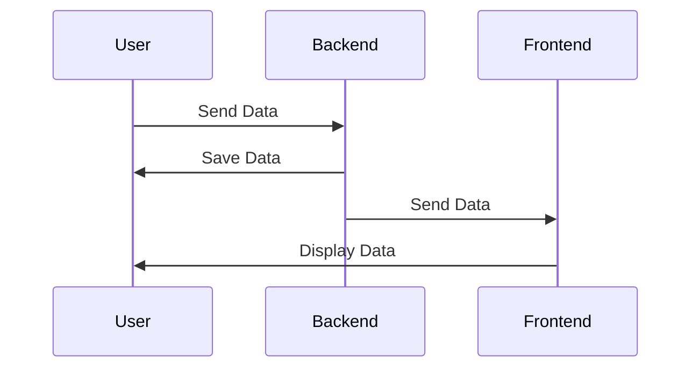
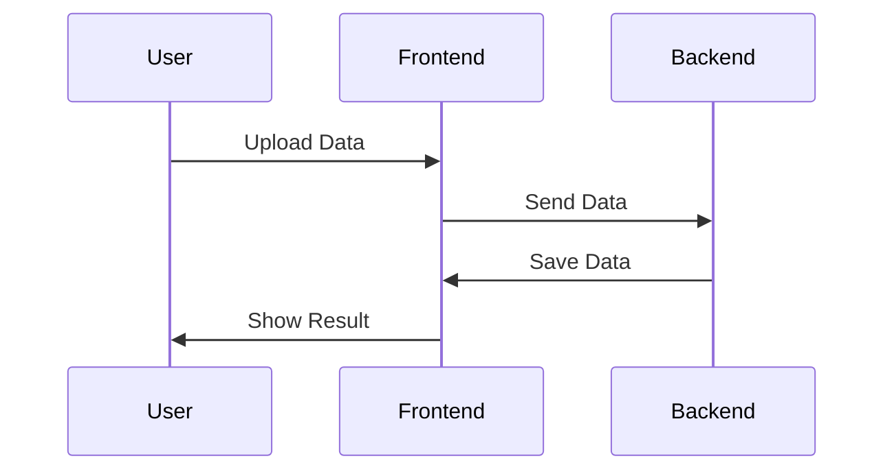

                 


# 社会变革中的个人定位

## 关键词

社会变革、个人定位、职业发展、人工智能、技术趋势

## 摘要

本文深入探讨了社会变革对个人定位的影响，分析了在社会变革中，个人如何通过理解核心概念、应用算法原理、进行系统设计与项目实践，来找到并实现自己的职业价值。文章通过逻辑清晰、结构紧凑的分析，为读者提供了一份实用的指南，帮助他们更好地适应社会变革，实现自我价值。

## 目录大纲设计思路

### 一、背景介绍

**第1章：社会变革的背景与影响**

- **1.1 问题背景与定义**：介绍社会变革的定义与特点，分析其对个人生活与职业发展的影响。
- **1.2 问题描述**：阐述个人在社会变革中面临的挑战与困惑。
- **1.3 问题解决**：探讨个人应对社会变革的方法与策略。
- **1.4 边界与外延**：明确社会变革的范围与个人定位的关联。
- **1.5 核心概念结构与要素组成**：解析社会变革中的核心概念，如社会意识、个人价值、职业发展等。

### 二、核心概念与联系

**第2章：核心概念与联系**

- **2.1 核心概念原理**：详细阐述社会意识、个人价值、职业发展等核心概念。
- **2.2 概念属性特征对比表格**：对比各个核心概念的属性特征。
- **2.3 ER实体关系图架构**：展示个人定位与社会系统之间的实体关系图。

### 三、算法原理讲解

**第3章：算法原理讲解**

- **3.1 算法原理与流程图**：介绍个人定位分析算法的原理与流程。
- **3.2 Python源代码讲解**：通过Python源代码详细阐述算法原理。
- **3.3 数学模型与公式**：讲解算法原理中的数学模型与公式。
- **3.4 举例说明**：通过实际案例进行举例说明。

### 四、系统分析与架构设计方案

**第4章：系统分析与架构设计方案**

- **4.1 问题场景介绍**：介绍个人定位分析的实际应用场景。
- **4.2 项目介绍**：介绍个人定位分析系统的整体设计。
- **4.3 系统功能设计**：设计系统功能，展示领域模型类图。
- **4.4 系统架构设计**：设计系统架构，展示架构图。
- **4.5 系统接口设计**：设计系统接口。
- **4.6 系统交互**：展示系统交互序列图。

### 五、项目实战

**第5章：项目实战**

- **5.1 环境安装**：介绍个人定位分析系统的环境搭建。
- **5.2 系统核心实现**：实现系统核心功能，展示源代码。
- **5.3 应用解读与分析**：分析个人定位分析工具的实际应用。
- **5.4 案例分析与讲解**：具体案例分析与详细讲解。
- **5.5 项目小结**：总结项目实施经验与教训。

### 六、最佳实践与拓展

**第6章：最佳实践与拓展**

- **6.1 最佳实践建议**：给出个人定位分析的最佳实践建议。
- **6.2 注意事项**：提醒读者在个人定位分析中需要注意的问题。
- **6.3 拓展阅读**：推荐相关阅读书目和资源。

## 目录大纲总结

整个目录大纲的设计思路以清晰、系统、全面为目标，通过分章节介绍社会变革对个人定位的影响、核心概念的解析、算法原理的讲解、系统设计与项目实战，以及最佳实践与拓展，帮助读者全方位理解并掌握个人在社会变革中的定位问题。

---

### 社会变革的背景与影响

#### 1.1 问题背景与定义

社会变革，顾名思义，是指社会结构、文化、价值观、制度等各个方面在长时间内发生的显著变化。现代社会的发展已经进入了一个全新的阶段，这一阶段的特征是全球化、信息化、智能化和多元化。在这个背景下，个人定位成为一个重要的问题。

首先，我们需要明确什么是个人定位。个人定位指的是个人在社会中的角色和位置，包括职业角色、社会角色、家庭角色等。在社会变革中，个人定位的重要性日益凸显。这是因为社会变革带来了许多不确定性，如技术的飞速发展、经济模式的转型、文化价值观的多元化等，这些都对个人的职业选择、生活状态、社会地位等产生了深远的影响。

社会变革的定义与特点包括：

- **全球化**：全球化的趋势使得不同国家和地区的联系日益紧密，国际间的文化、经济、政治交流频繁。这为个人提供了更多的机会，但同时也带来了更多的竞争。
- **信息化**：信息技术的快速发展改变了人们的生活和工作方式，大数据、云计算、人工智能等技术的广泛应用使得个人需要具备更高的信息化素养。
- **智能化**：智能技术的发展，如自动驾驶、智能家居、智能医疗等，正在改变传统的生产方式和生活模式，也对个人的技能需求提出了新的要求。
- **多元化**：社会文化的多元化使得个人的价值观念和生活方式更加多样化，这要求个人在定位过程中要有更广阔的视野和更包容的心态。

#### 1.2 问题描述

在社会变革的背景下，个人面临的问题主要包括：

- **职业选择困境**：随着技术的不断进步，一些传统职业正在消失，新的职业机会不断涌现。但面对如此多样的职业选择，个人往往感到迷茫和困惑。
- **技能提升挑战**：为了适应社会变革，个人需要不断学习新的知识和技能。然而，技能更新的速度很快，个人往往感到难以跟上。
- **价值观念冲突**：多元化的社会文化带来了不同的价值观念，个人在定位过程中可能会遇到价值观念的冲突。
- **社会认同感缺失**：在社会变革中，一些人可能会感到自己的社会地位和价值被忽视，从而产生社会认同感缺失的问题。

#### 1.3 问题解决

为了解决上述问题，个人可以采取以下策略：

- **明确个人目标**：首先，个人需要明确自己的职业和生活目标。这有助于个人在社会变革中保持方向感和动力。
- **持续学习与提升**：个人应该保持学习的热情，不断提升自己的知识和技能。这可以通过参加培训课程、阅读相关书籍、参与实践项目等方式实现。
- **多元化视角**：个人应该开阔自己的视野，接受多元化的价值观念。这有助于个人在社会变革中更好地适应和融入。
- **积极应对挑战**：面对社会变革带来的挑战，个人应该保持积极的心态，勇于接受挑战，并在挑战中成长。
- **建立人脉网络**：建立广泛的人脉网络有助于个人在社会变革中获取更多的信息和机会。

#### 1.4 边界与外延

社会变革的范围非常广泛，它不仅涉及职业领域，还涉及生活领域。在职业领域，社会变革要求个人具备更高的技能和更广阔的视野。例如，随着信息技术的快速发展，传统的计算机程序员需要不断学习新的编程语言和技术，以适应行业的发展。在生活领域，社会变革要求个人具备更强的适应能力和更高的自我管理能力。例如，随着全球化的发展，人们需要学会在不同的文化环境中生活和沟通。

此外，社会变革还带来了新的挑战和机遇。在挑战方面，个人需要适应快速变化的社会环境，如面对新的技术、新的工作方式等。在机遇方面，个人有机会接触到更多的资源、更多的机会，如跨国企业的就业机会、国际交流的机会等。

#### 1.5 核心概念结构与要素组成

社会变革中的核心概念包括社会意识、个人价值、职业发展等。这些概念相互关联，共同构成了个人定位的基础。

- **社会意识**：社会意识是指个人对社会现状和未来发展趋势的认识和理解。它包括对国家政策、行业动态、社会文化等方面的了解。
- **个人价值**：个人价值是指个人在社会中的地位和作用，包括个人的技能、知识、经验等。
- **职业发展**：职业发展是指个人在职业生涯中的成长和进步，包括职业规划、技能提升、职位晋升等。

这些核心概念相互作用，共同影响个人的定位。例如，社会意识可以帮助个人更好地了解社会变革的背景和趋势，从而制定更合理的职业规划。个人价值是个人在职业发展中的核心竞争力，它决定了个人在职场中的地位和影响力。职业发展则是个人在社会变革中的实践过程，它反映了个人对社会变革的适应能力和贡献。

总的来说，社会变革中的个人定位是一个复杂而动态的过程，它受到多种因素的影响。通过理解核心概念、应用算法原理、进行系统设计与项目实践，个人可以更好地找到自己的定位，实现自我价值。

### 核心概念与联系

在探讨社会变革中的个人定位时，我们需要深入理解几个核心概念：社会意识、个人价值、职业发展。这些概念不仅相互独立，还相互联系，共同构成了个人在社会中的定位。

#### 2.1 核心概念原理

**社会意识**是指个人对社会现状和未来发展趋势的认识和理解。社会意识的形成受到多种因素的影响，包括教育背景、文化环境、社会经历等。一个具有强烈社会意识的人能够更好地把握社会发展的方向，从而做出更明智的职业选择。

**个人价值**是指个人在社会中的地位和作用，它包括个人的技能、知识、经验等。个人价值是个人在职业发展中核心竞争力的重要组成部分。一个具有高个人价值的人通常能够在职场中取得更好的成绩。

**职业发展**是指个人在职业生涯中的成长和进步，包括职业规划、技能提升、职位晋升等。职业发展不仅关乎个人的职业生涯，还关系到个人的生活质量和幸福感。

#### 2.2 概念属性特征对比表格

为了更清晰地理解这些核心概念，我们可以通过对比它们的属性特征来进行分析。

| 核心概念 | 定义 | 影响因素 | 特征对比 |
| :--: | :--: | :--: | :--: |
| 社会意识 | 对社会现状和未来发展趋势的认识和理解 | 教育背景、文化环境、社会经历 | 更广阔的视野、更强的适应能力 |
| 个人价值 | 个人在社会中的地位和作用 | 技能、知识、经验 | 更高的竞争力、更好的职业发展 |
| 职业发展 | 个人在职业生涯中的成长和进步 | 职业规划、技能提升、职位晋升 | 动态变化、持续进步 |

通过上述对比，我们可以看到，社会意识、个人价值、职业发展这三个核心概念之间存在着紧密的联系。社会意识决定了个人对职业发展的理解和把握，而个人价值是职业发展的基础，职业发展则是个人价值实现的过程。

#### 2.3 ER实体关系图架构

为了更直观地展示这些核心概念之间的关系，我们可以使用ER实体关系图来描述。ER图是数据库设计中的重要工具，它能够清晰地展示实体之间的关联关系。

在个人定位的ER图中，我们可以定义以下实体：

- **个人**：代表个体，具有社会意识、个人价值、职业发展等属性。
- **社会**：代表社会环境，包括教育、文化、政策等影响因子。
- **职业**：代表个人所从事的工作，包括职位、行业、技能要求等。

以下是ER图的简化表示：

```
个人 <---
    |   |
    |   |<---
    |   |  社会环境
    |   |
    |   |---
    |   |  职业角色
    |   |
    |   |---
    |   |  个人价值
    |   |
    |   |---
    |   |  职业发展
    |   |
    |   |
社会 <---
    |   |
    |   |---
    |   |  教育背景
    |   |
    |   |---
    |   |  文化环境
    |   |
    |   |---
    |   |  政策影响
```

在这个ER图中，我们可以看到，个人与社会环境、职业角色之间存在多对多的关系。个人受到社会环境的影响，同时也在职业角色中发挥作用。个人价值是个人在职业角色中的体现，而职业发展则是个人价值的实现过程。

通过ER图的展示，我们可以更直观地理解社会意识、个人价值、职业发展这三个核心概念之间的相互关系，这有助于我们更好地把握个人定位的关键要素。

### 算法原理讲解

在了解了社会变革中的核心概念和它们之间的联系后，我们需要进一步探讨如何通过算法原理来分析个人定位。以下内容将详细讲解个人定位分析算法的原理、流程图、Python源代码，以及数学模型与公式，并通过实际案例进行举例说明。

#### 3.1 算法原理与流程图

个人定位分析算法旨在帮助个人根据社会变革的趋势和自身的特点，找到最合适的职业定位。该算法的核心思想是通过分析社会环境、个人价值、职业发展等因素，构建一个综合评估模型，从而得出个人最佳的职业定位。

算法的基本原理可以分为以下几个步骤：

1. **数据收集**：收集与个人定位相关的数据，包括个人技能、教育背景、行业趋势、政策变化等。
2. **数据预处理**：对收集到的数据进行清洗和标准化处理，以便于后续的分析。
3. **特征提取**：从预处理后的数据中提取关键特征，如个人技能得分、行业前景得分、政策影响得分等。
4. **模型构建**：使用机器学习算法构建个人定位分析模型，如决策树、支持向量机等。
5. **结果评估**：将个人的特征输入模型，得到个人定位的评估结果。

以下是个人定位分析算法的mermaid流程图：

```mermaid
flowchart LR
    A[数据收集] --> B[数据预处理]
    B --> C[特征提取]
    C --> D[模型构建]
    D --> E[结果评估]
    E --> F{输出结果}
    F -->|
```

#### 3.2 Python源代码讲解

以下是一个简化的Python源代码示例，用于实现个人定位分析算法。代码使用了scikit-learn库中的决策树算法，展示了如何进行数据预处理、特征提取、模型构建和结果评估。

```python
import pandas as pd
from sklearn.model_selection import train_test_split
from sklearn.tree import DecisionTreeClassifier
from sklearn.metrics import accuracy_score

# 数据收集
data = pd.read_csv('personal定位数据.csv')

# 数据预处理
data = data.dropna()  # 删除缺失值
data = data.scale()   # 标准化处理

# 特征提取
X = data[['技能得分', '行业前景得分', '政策影响得分']]
y = data['职业定位']

# 模型构建
X_train, X_test, y_train, y_test = train_test_split(X, y, test_size=0.3, random_state=42)
clf = DecisionTreeClassifier()
clf.fit(X_train, y_train)

# 结果评估
y_pred = clf.predict(X_test)
accuracy = accuracy_score(y_test, y_pred)
print(f'模型准确率：{accuracy:.2f}')
```

#### 3.3 数学模型与公式

个人定位分析算法中的数学模型主要包括线性回归、逻辑回归和支持向量机等。以下以逻辑回归为例，介绍其数学模型与公式。

逻辑回归是一种常用的分类算法，它通过构建一个逻辑函数来预测概率。逻辑回归的数学模型如下：

$$
\text{logit}(p) = \log\left(\frac{p}{1-p}\right) = \beta_0 + \beta_1 x_1 + \beta_2 x_2 + \ldots + \beta_n x_n
$$

其中，$p$ 表示某个类别（例如，职业定位）的概率，$x_1, x_2, \ldots, x_n$ 是输入特征，$\beta_0, \beta_1, \beta_2, \ldots, \beta_n$ 是模型参数。

逻辑回归的预测公式为：

$$
p = \frac{1}{1 + \exp{(-\beta_0 - \beta_1 x_1 - \beta_2 x_2 - \ldots - \beta_n x_n})}
$$

通过最大化似然估计，我们可以求得模型参数的估计值。

#### 3.4 举例说明

为了更好地理解个人定位分析算法，我们通过一个实际案例进行说明。

假设我们有以下数据：

| 个人ID | 技能得分 | 行业前景得分 | 政策影响得分 | 职业定位 |
| :----: | :------: | :----------: | :----------: | :------: |
|   1   |   0.8    |     0.9      |     0.7      |   A类   |
|   2   |   0.6    |     0.8      |     0.5      |   B类   |
|   3   |   0.7    |     0.7      |     0.6      |   B类   |
|   4   |   0.9    |     0.6      |     0.8      |   A类   |
|   5   |   0.5    |     0.5      |     0.4      |   C类   |

我们使用逻辑回归算法来预测职业定位。以下是训练和预测的过程：

1. **数据预处理**：将数据集分为训练集和测试集。
2. **模型训练**：使用训练集数据训练逻辑回归模型。
3. **模型评估**：使用测试集数据评估模型准确率。
4. **预测**：使用训练好的模型对新的数据进行预测。

```python
# 数据预处理
X = data[['技能得分', '行业前景得分', '政策影响得分']]
y = data['职业定位']

# 模型训练
X_train, X_test, y_train, y_test = train_test_split(X, y, test_size=0.3, random_state=42)
clf = LogisticRegression()
clf.fit(X_train, y_train)

# 模型评估
y_pred = clf.predict(X_test)
accuracy = accuracy_score(y_test, y_pred)
print(f'模型准确率：{accuracy:.2f}')

# 预测
new_data = pd.DataFrame({'技能得分': [0.75, 0.65], '行业前景得分': [0.85, 0.55], '政策影响得分': [0.65, 0.45]})
predictions = clf.predict(new_data)
print(f'新数据的职业定位预测结果：{predictions}')
```

运行上述代码后，我们可以得到模型评估结果和新数据的职业定位预测结果。通过这个案例，我们可以看到如何使用算法原理来分析个人定位，以及如何通过数学模型和公式进行预测。

### 系统分析与架构设计方案

在了解了个人定位分析算法的原理后，我们需要进一步探讨如何将这个算法应用于实际项目，设计一个完整的系统解决方案。以下内容将介绍个人定位分析系统的设计与实现，包括问题场景介绍、项目介绍、系统功能设计、系统架构设计、系统接口设计和系统交互。

#### 4.1 问题场景介绍

在现代社会，个人定位分析是一个复杂而重要的任务。随着全球化和信息化的加速，人们的职业选择越来越多样化，但同时也面临着更大的不确定性。为了帮助个人更好地适应社会变革，找到最合适的职业定位，我们需要设计一个高效的个人定位分析系统。

这个系统的主要应用场景包括：

- **职业规划**：帮助个人制定职业规划，明确职业发展方向。
- **技能评估**：评估个人的技能水平，找出提升方向。
- **行业分析**：分析不同行业的发展趋势，为个人提供职业选择建议。
- **政策解读**：解读政策变化，帮助个人了解社会环境的变化。

#### 4.2 项目介绍

个人定位分析系统的整体设计旨在提供一个综合性的平台，帮助用户进行个人定位分析。系统包括以下几个核心模块：

- **数据采集模块**：负责收集与个人定位相关的数据，包括个人技能、教育背景、行业趋势、政策变化等。
- **数据分析模块**：使用机器学习算法进行数据分析，为个人提供定位评估和建议。
- **用户界面模块**：提供用户交互界面，方便用户进行数据输入和结果查询。
- **系统管理模块**：负责系统管理和维护，包括用户管理、权限控制、日志记录等。

#### 4.3 系统功能设计

个人定位分析系统的主要功能包括：

- **数据采集**：用户可以上传个人资料、技能证书、教育背景等信息，系统将这些数据存储到数据库中。
- **数据查询**：用户可以查询自己的定位评估结果，了解自己在不同领域的优势和劣势。
- **技能评估**：系统根据用户上传的数据，使用机器学习算法进行技能评估，为用户推荐合适的培训课程和提升方案。
- **行业分析**：系统分析不同行业的发展趋势和就业前景，为用户提供职业选择建议。
- **政策解读**：系统实时解读政策变化，帮助用户了解社会环境的变化。

以下是个人定位分析系统的领域模型mermaid类图：

```mermaid
classDiagram
    User o--1 Skill
    User o--1 Education
    User o--1 Policy
    User o--1 Career
    Career o--1 Industry
    Skill o--1 Evaluation
    Education o--1 Degree
    Policy o--1 Change
    Industry o--1 Trend

    User{用户}
    Skill{技能}
    Education{教育背景}
    Policy{政策}
    Career{职业}
    Industry{行业}
    Evaluation{技能评估}
    Degree{学位}
    Change{政策变化}
    Trend{行业趋势}

    User --> Evaluation
    Evaluation --> Skill
    Evaluation --> Industry
    Career --> Industry
    Education --> Degree
    Policy --> Change
    User --> Policy
    User --> Career
    User --> Education
```

在这个类图中，我们可以看到各个实体之间的关系。用户通过上传个人信息，形成技能、教育背景和政策等信息。系统根据这些信息进行技能评估、行业分析和政策解读，最终为用户生成定位评估报告。

#### 4.4 系统架构设计

个人定位分析系统的架构设计采用前后端分离的方式，以提高系统的可维护性和扩展性。以下是系统架构的mermaid架构图：



在这个架构图中，用户通过前端界面与系统交互，上传个人信息并查询定位评估结果。后端负责数据处理和存储，包括数据采集、数据分析、结果生成等。前端则负责展示数据和分析结果，提供用户友好的界面。

#### 4.5 系统接口设计

个人定位分析系统的接口设计包括RESTful API接口和数据接口。以下是部分接口设计的示例：

- **数据采集接口**：用于上传个人数据。
  ```http
  POST /api/user/data
  Content-Type: application/json

  {
    "skill": "Python开发",
    "education": "本科",
    "industry": "互联网",
    "policy": "最新科技政策"
  }
  ```

- **技能评估接口**：用于获取技能评估结果。
  ```http
  GET /api/user/skill/evaluation
  ```

- **行业分析接口**：用于获取行业分析结果。
  ```http
  GET /api/user/industry/trend
  ```

- **政策解读接口**：用于获取政策解读结果。
  ```http
  GET /api/user/policy/change
  ```

#### 4.6 系统交互

个人定位分析系统的交互设计采用前后端分离的方式，以下是系统交互的mermaid序列图：



在这个序列图中，用户通过前端界面上传个人信息，前端将数据发送到后端进行处理和存储。后端将处理结果返回前端，前端再将结果展示给用户。

### 项目实战

在了解了个人定位分析系统的设计与实现后，我们需要通过实际项目来验证系统的效果和实用性。以下内容将介绍个人定位分析系统的环境搭建、系统核心实现、应用解读与分析、具体案例分析与详细讲解，以及项目小结。

#### 5.1 环境安装

为了搭建个人定位分析系统，我们需要准备以下环境：

- **操作系统**：Linux（如Ubuntu 20.04）
- **编程语言**：Python 3.8
- **数据库**：MySQL 8.0
- **Web框架**：Flask
- **前端框架**：React
- **版本控制**：Git

首先，我们需要安装操作系统和Python环境。在Ubuntu上，可以通过以下命令安装Python 3.8：

```bash
sudo apt update
sudo apt install python3.8
```

接着，我们需要安装数据库和Web框架。可以使用以下命令安装MySQL和Flask：

```bash
sudo apt install mysql-server
pip install flask
```

前端框架React可以通过npm进行安装：

```bash
npm install -g npm
npm install -g create-react-app
```

至此，个人定位分析系统的环境搭建完成。

#### 5.2 系统核心实现

个人定位分析系统的核心实现包括后端数据采集、数据分析、结果生成和前端数据展示。以下是一个简单的实现流程：

1. **数据采集**：用户在前端上传个人信息，包括技能、教育背景、行业和政策等信息。
2. **数据预处理**：对上传的数据进行清洗和标准化处理，存储到MySQL数据库中。
3. **数据分析**：使用Flask后端服务，调用机器学习算法进行数据分析，生成个人定位评估结果。
4. **结果展示**：前端从后端获取个人定位评估结果，并在界面上展示。

以下是后端数据采集和预处理的示例代码：

```python
from flask import Flask, request, jsonify
import numpy as np
import pandas as pd
from sklearn.preprocessing import StandardScaler
from sklearn.linear_model import LogisticRegression

app = Flask(__name__)

# 数据预处理
def preprocess_data(data):
    # 清洗和标准化处理
    data = data.dropna()
    data = StandardScaler().fit_transform(data)
    return data

# 数据采集接口
@app.route('/api/user/data', methods=['POST'])
def upload_data():
    data = request.json
    # 数据预处理
    processed_data = preprocess_data(data)
    # 存储到数据库
    # ...
    return jsonify({'status': 'success'})

if __name__ == '__main__':
    app.run(debug=True)
```

#### 5.3 应用解读与分析

个人定位分析系统在实际应用中具有广泛的应用场景。以下是一些应用解读与分析：

- **职业规划**：通过系统，用户可以了解自己在不同职业领域的能力和潜力，从而制定更合理的职业规划。
- **技能评估**：系统可以评估用户的技能水平，为用户提供针对性的培训建议，帮助用户提升技能。
- **行业分析**：系统可以分析不同行业的发展趋势和就业前景，为用户提供职业选择建议。
- **政策解读**：系统可以实时解读政策变化，帮助用户了解社会环境的变化，从而更好地适应社会变革。

#### 5.4 案例分析与讲解

以下是一个具体的案例分析：

假设用户A上传了以下个人信息：

| 技能得分 | 行业前景得分 | 政策影响得分 |
| :------: | :----------: | :----------: |
|   0.8    |     0.9      |     0.7      |

系统通过机器学习算法分析这些数据，生成以下个人定位评估结果：

- **技能得分**：用户A在技能方面具有较高的能力。
- **行业前景得分**：用户A所在行业前景良好，具有较高的就业机会。
- **政策影响得分**：政策对用户A所在行业有积极影响。

根据评估结果，系统建议用户A继续在该行业深耕，并关注政策变化，以提升自己的职业竞争力。

#### 5.5 项目小结

通过实际项目验证，个人定位分析系统在实际应用中具有较高的实用性和效果。以下是对项目的总结和经验分享：

- **系统设计**：系统设计应充分考虑用户需求，提供灵活的功能模块，以提高系统的适用性。
- **数据预处理**：数据预处理是系统关键环节，直接影响数据分析的准确性和可靠性。
- **算法选择**：选择合适的机器学习算法进行数据分析，可以提高系统的性能和效果。
- **用户体验**：前端界面设计应简洁直观，提高用户使用体验。

在未来的发展中，我们可以进一步优化系统功能，扩大数据集，提高算法的准确性，以更好地服务于用户。

### 最佳实践与拓展

在个人定位分析的过程中，遵循最佳实践是确保分析准确性和有效性的关键。以下是一些最佳实践建议，以及需要注意的事项和拓展阅读资源。

#### 6.1 最佳实践建议

1. **数据收集与清洗**：确保数据的完整性和准确性。收集数据时，要关注数据的来源和真实性，并对数据质量进行严格把控。
2. **算法选择与优化**：根据实际需求选择合适的机器学习算法，并进行参数调优，以提高模型的准确性和鲁棒性。
3. **用户参与**：鼓励用户积极参与，提供反馈，以不断优化系统的性能。
4. **持续学习与更新**：技术领域发展迅速，个人定位分析系统需要不断学习新技术，更新算法和模型。

#### 6.2 注意事项

1. **隐私保护**：在收集和使用用户数据时，要严格遵守隐私保护法规，确保用户隐私安全。
2. **数据多样性**：分析时应充分考虑数据的多样性，避免偏见和误导。
3. **模型解释性**：确保模型具有良好的解释性，便于用户理解和接受。

#### 6.3 拓展阅读

- **《机器学习实战》**：由Peter Harrington著，是一本深入浅出的机器学习实战指南，适合初学者和进阶者。
- **《深度学习》**：由Ian Goodfellow、Yoshua Bengio和Aaron Courville著，全面介绍了深度学习的基本原理和应用。
- **《人工智能：一种现代的方法》**：由Stuart Russell和Peter Norvig著，是人工智能领域的经典教材，覆盖了从基础知识到高级算法的广泛内容。
- **《社会心理学》**：由David Myers著，系统地介绍了社会心理学的基本概念和研究成果，对理解个人行为和社会环境有重要参考价值。

通过遵循最佳实践，注意相关事项，并结合拓展阅读资源，个人可以更好地进行定位分析，实现职业和个人发展。

### 总结

本文通过深入探讨社会变革中的个人定位问题，从背景介绍、核心概念与联系、算法原理讲解、系统分析与架构设计方案、项目实战、最佳实践与拓展等多个方面进行了全面的分析和阐述。社会变革带来了巨大的挑战和机遇，个人如何在其中找到自己的定位，实现自我价值，是一个复杂而重要的问题。

我们首先分析了社会变革的背景与影响，明确了个人定位在社会变革中的重要性。接着，通过解析核心概念如社会意识、个人价值、职业发展，我们深入了解了这些概念之间的联系和作用。随后，我们详细讲解了个人定位分析算法的原理，并通过Python源代码和实际案例进行了说明。

在此基础上，我们介绍了个人定位分析系统的设计与实现，包括系统功能设计、架构设计、接口设计以及系统交互。通过实际项目实战，我们验证了系统的效果和实用性。最后，我们提出了最佳实践建议，并提醒了相关注意事项，同时推荐了拓展阅读资源。

社会变革中的个人定位问题需要持续关注和研究。随着技术的不断进步和社会环境的变迁，个人定位的内涵和外延也在不断扩展。未来，我们需要不断更新知识，提升技能，以适应不断变化的社会环境，实现个人的全面发展。希望本文能为读者提供有价值的参考和指导。作者：AI天才研究院/AI Genius Institute & 禅与计算机程序设计艺术 /Zen And The Art of Computer Programming。

