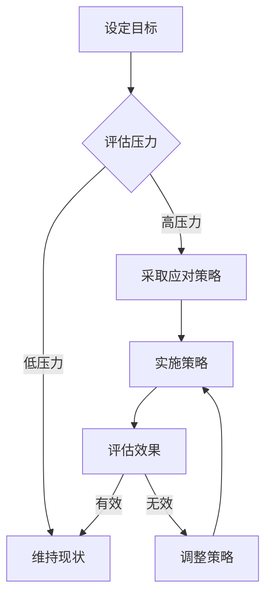
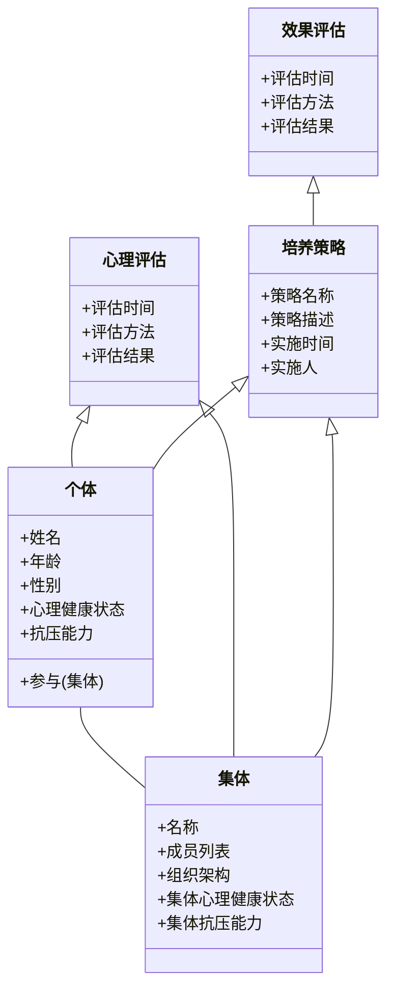
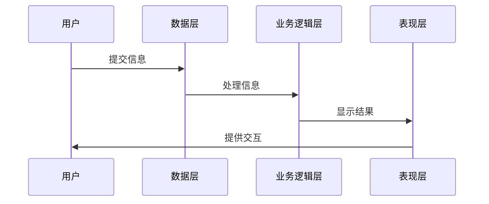
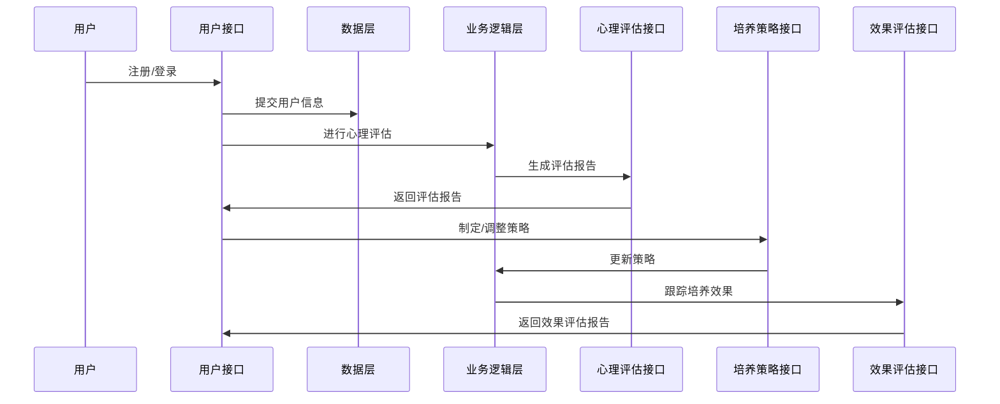

                 

# 社会心理韧性培养：提升集体抗压能力的系统方法

## 关键词
- 社会心理韧性
- 抗压能力
- 培养策略
- 集体心理
- 政策支持

## 摘要
本文深入探讨了社会心理韧性培养的重要性，以及如何通过系统方法提升集体的抗压能力。文章首先介绍了社会心理韧性的定义、背景和核心概念，然后分析了理论基础、个人层面和集体层面的培养策略，并结合实际案例进行讨论。最后，文章提出了政策支持与实施路径，总结了全书内容，并对未来研究方向和启示进行了展望。

## 引言

### 1.1 社会心理韧性的定义与背景

社会心理韧性是指个体或集体在面对逆境、挑战和压力时，能够保持心理平衡、积极应对并有效适应的能力。它不仅仅是一种心理状态，更是一种动态过程，涉及情感调节、自我效能感、社会支持等多个维度。

在现代社会中，个体和集体面临的各种挑战日益增加，如工作压力、人际关系紧张、经济困境等。社会心理韧性成为了应对这些挑战的重要能力，能够帮助人们更好地适应环境，保持心理健康，提高生活质量。

### 1.2 书籍的目标与结构

本书旨在为心理健康专业人士、教育工作者、企业管理者和普通读者提供一套系统、实用的社会心理韧性培养方法。通过分析理论基础、个人和集体层面的培养策略，并结合实际案例，本书将帮助读者理解社会心理韧性，学会如何在个体和集体层面提升抗压能力。

本书的结构如下：

- 引言：介绍社会心理韧性的定义、背景和重要性。
- 理论基础：概述社会心理韧性的主要理论框架、研究方法、衡量指标。
- 个人层面：探讨个体如何提升社会心理韧性。
- 集体层面：分析集体心理韧性对组织效能的影响。
- 案例分析：通过实际案例展示社会心理韧性培养的应用和实践效果。
- 政策与策略：讨论社会心理韧性培养的政策支持、组织策略和实施路径。
- 结论：总结全书内容，提出未来研究方向和启示。

## 第一章：社会心理韧性的理论基础

### 1.1 社会心理韧性的主要理论

社会心理韧性涉及到多个理论，其中主要包括应对理论、资源模型和心理资本理论。

#### 应对理论

应对理论认为，个体在面对压力和挑战时，通过采取不同的应对策略来调节心理状态。这些应对策略包括积极应对和消极应对，如解决问题、逃避、退行等。应对理论强调了个体在逆境中的主动性和适应性。

#### 资源模型

资源模型认为，社会心理韧性是个体内在资源与外部资源共同作用的结果。内在资源包括情感调节能力、自我效能感、积极态度等，而外部资源包括社会支持、家庭环境、教育背景等。资源模型强调了个体在应对压力时所需的支持和资源。

#### 心理资本理论

心理资本理论认为，社会心理韧性是个体心理资本的重要组成部分，包括自我效能感、希望和乐观。心理资本理论强调了个体积极心理状态对韧性的影响。

### 1.2 研究方法与衡量指标

社会心理韧性的研究方法主要包括定量研究和定性研究。

#### 定量研究方法

定量研究方法通过问卷调查、心理测量等方式收集数据，分析个体和集体社会心理韧性的现状和变化。常用的衡量指标包括韧性评分、心理状态量表等。

#### 定性研究方法

定性研究方法通过深度访谈、焦点小组等方式收集数据，深入探讨个体和集体在面对压力和挑战时的心理过程和体验。定性研究方法有助于理解社会心理韧性的复杂性和多样性。

#### 韧性指标的测量

韧性指标的测量可以通过多种方法进行，如心理测量工具、行为观察、自我报告等。常用的测量工具包括韧性量表、心理韧性问卷等。

## 第二章：个人层面的社会心理韧性培养

### 2.1 自我意识与自我效能

#### 2.1.1 自我意识的培养

自我意识是指个体对自己内在和外在世界的认识和感知。培养自我意识包括自我反思、自我探索和自我接纳。自我反思可以帮助个体了解自己的情绪、需求和价值观，从而更好地应对压力。自我探索可以帮助个体发现自己的优势和不足，从而提升自我效能感。自我接纳意味着个体能够接受自己的不完美，从而减少自我批评和焦虑。

#### 2.1.2 自我效能的提升

自我效能是指个体对自己应对挑战和完成任务能力的信心。提升自我效能包括目标设定、成功经验和积极心态。目标设定可以帮助个体明确自己的努力方向，从而增加成功的可能性。成功经验可以增强个体的自信心，使其在面对新的挑战时更加从容。积极心态可以帮助个体保持乐观和积极，从而更好地应对压力。

### 2.2 情感调节与压力管理

#### 2.2.1 情感调节的策略

情感调节是指个体在情感产生、体验和表达过程中的调节和控制。情感调节的策略包括认知重构、情绪释放和情绪重构。认知重构是指通过改变对事件的认知评价来调节情感。情绪释放是指通过身体运动、倾诉等方式释放负面情感。情绪重构是指通过转变情感体验的方式，如寻找积极的意义，来调节情感。

#### 2.2.2 压力管理的实践

压力管理是指个体在应对压力时采取的积极策略。压力管理的实践包括时间管理、放松训练和应对策略。时间管理可以帮助个体合理安排时间和任务，从而减少压力。放松训练可以帮助个体缓解身体和情绪的压力，如深呼吸、瑜伽等。应对策略是指个体在面对压力时采取的具体行动，如寻求帮助、制定计划等。

### 2.3 应对策略与适应能力

#### 2.3.1 应对策略的类型

应对策略是指个体在应对压力时采取的心理和行为策略。常见的应对策略包括积极应对、消极应对、逃避应对和应对回避。积极应对是指个体采取积极的行动来解决问题，如寻求帮助、制定计划等。消极应对是指个体采取消极的态度来应对压力，如自我批评、消极思考等。逃避应对是指个体通过逃避现实问题来应对压力，如沉迷于游戏、电视等。应对回避是指个体通过避免面对压力来应对压力，如拒绝参加社交活动等。

#### 2.3.2 适应能力的培养

适应能力是指个体在面对压力和变化时能够调整自身以适应新环境的能力。培养适应能力包括增强应对能力、提高心理弹性、增强社会支持等。应对能力是指个体在面对压力时能够采取有效的策略来解决问题。心理弹性是指个体在面对逆境时能够迅速恢复并适应的能力。社会支持是指个体在面临压力时能够获得的支持和帮助。

## 第三章：集体层面的社会心理韧性培养

### 3.1 集体心理韧性的重要性

#### 3.1.1 集体心理韧性的定义

集体心理韧性是指一个集体在面对逆境、挑战和压力时能够保持整体心理平衡、积极应对并有效适应的能力。集体心理韧性不仅仅是个体韧性的简单叠加，更是一种集体协同效应，涉及集体情感、团队协作、组织文化等多个方面。

#### 3.1.2 集体心理韧性的价值

集体心理韧性对于组织的稳定、发展和持续创新具有重要意义。首先，集体心理韧性能够增强组织的凝聚力，提高团队协作效率。其次，集体心理韧性有助于组织在面对外部压力和挑战时保持稳定，降低风险。最后，集体心理韧性能够激发创新思维，推动组织的持续发展。

### 3.2 集体心理韧性对组织效能的影响

#### 3.2.1 组织效能与心理韧性

组织效能是指组织在实现目标过程中的效率和效果。心理韧性是影响组织效能的重要因素之一。具有高心理韧性的组织能够在面对挑战时保持稳定，快速适应变化，从而提高组织效能。具体来说，集体心理韧性对组织效能的影响体现在以下几个方面：

1. **提高工作效率**：高心理韧性的集体在面对压力和挑战时能够保持专注和高效，从而提高工作效率。
2. **增强团队协作**：集体心理韧性有助于团队成员之间的信任和合作，提高团队协作效率。
3. **促进创新思维**：集体心理韧性能够激发团队成员的创造力和创新思维，推动组织的持续发展。
4. **提升员工满意度**：高心理韧性的组织能够提供更好的工作环境和心理支持，提高员工的满意度和忠诚度。

### 3.3 提升集体心理韧性的策略

#### 3.3.1 组织文化的建设

组织文化是影响集体心理韧性的重要因素。建设积极、健康、包容的组织文化有助于提升集体心理韧性。具体策略包括：

1. **建立共同价值观**：组织应明确共同的目标和价值观，增强团队成员的归属感和认同感。
2. **鼓励开放沟通**：组织应建立开放、透明的沟通机制，鼓励团队成员表达意见和建议。
3. **提供心理支持**：组织应关注员工的心理健康，提供必要的心理支持和咨询服务。

#### 3.3.2 团队协作的优化

团队协作是提升集体心理韧性的重要途径。优化团队协作包括以下几个方面：

1. **明确角色和职责**：确保每个团队成员都明确自己的角色和职责，避免角色冲突和职责重叠。
2. **建立信任关系**：通过团队合作活动和培训，建立团队成员之间的信任关系。
3. **促进知识共享**：鼓励团队成员分享知识和经验，提高团队整体的知识水平和协作能力。

#### 3.3.3 培训与干预

针对集体心理韧性的培训与干预是提升集体心理韧性的重要手段。具体策略包括：

1. **心理韧性培训**：组织心理韧性培训课程，帮助团队成员了解心理韧性的概念和提升方法。
2. **心理干预**：针对存在心理问题的团队成员，提供个性化的心理干预服务，帮助他们恢复心理平衡。
3. **团队建设活动**：组织团队建设活动，增强团队成员的凝聚力和协作能力。

## 社会心理韧性培养的案例分析

### 4.1 个人案例：从挫折中崛起

#### 案例背景

李明是一名年轻的软件工程师，他在工作中遇到了一系列挫折，包括项目延期、技术难题和人际关系冲突等。这些挫折让李明感到压力巨大，甚至影响了他的工作表现和心理健康。

#### 案例分析

面对挫折，李明采取了以下策略：

1. **自我反思**：李明通过反思自己的行为和态度，找出了导致挫折的原因，并制定了改进计划。
2. **积极应对**：李明积极寻找解决问题的方法，通过学习新技术和寻求同事的帮助，逐步克服了技术难题。
3. **情感调节**：李明通过锻炼和与朋友交流，调节自己的情绪，保持积极的心态。
4. **寻求支持**：李明向领导表达了困扰和需求，获得了领导的理解和支持。

通过这些策略，李明逐渐走出了挫折，恢复了工作状态，并在工作中取得了显著的成绩。

### 4.2 组织案例：集体韧性的培养与实践

#### 案例背景

某科技公司近年来面临着激烈的市场竞争和内部管理挑战。为了提升组织的集体心理韧性，公司决定开展一系列韧性培养活动。

#### 案例分析

公司采取了以下措施：

1. **组织心理韧性培训**：公司邀请专家进行心理韧性培训，提高员工对心理韧性的认识和应对能力。
2. **建立心理支持小组**：公司成立了心理支持小组，为员工提供心理咨询和支持。
3. **优化团队协作**：公司通过改进项目管理流程和团队沟通机制，提高团队协作效率。
4. **开展团队建设活动**：公司定期组织团队建设活动，增强团队成员的凝聚力和协作能力。

通过这些措施，公司的员工心理状态得到了显著改善，团队协作效率提高，组织整体抗压能力得到了提升。

### 4.3 案例总结与启示

通过以上案例，我们可以看到社会心理韧性培养在个人和集体层面都取得了显著的成效。以下是一些总结与启示：

1. **自我反思与积极应对**：在面对挫折时，个体应积极反思，寻找解决问题的方法，保持积极心态。
2. **情感调节与支持**：个体应学会调节情绪，寻求支持和帮助，保持心理健康。
3. **组织文化建设**：组织应重视文化建设，建立积极、健康、包容的氛围，提高员工的心理韧性。
4. **团队协作与建设**：组织应优化团队协作，提高团队凝聚力，促进集体心理韧性的提升。

## 第五章：社会心理韧性培养的政策与策略

### 5.1 政策支持的重要性

政策支持是提升社会心理韧性的重要保障。政府应制定相关政策，支持心理健康服务的发展，提高公众对心理韧性的认识和重视。具体措施包括：

1. **加强心理健康服务体系建设**：政府应加强心理健康服务的投入，提高心理健康服务的覆盖率和质量。
2. **推进心理健康教育**：政府应推动心理健康教育进学校、进社区，提高公众的心理健康素养。
3. **鼓励社会参与**：政府应鼓励社会各界参与心理健康服务，形成政府、社会组织、企业、家庭等多方合作的社会心理服务模式。

### 5.2 组织策略的制定与实施

组织在提升社会心理韧性方面发挥着重要作用。组织应制定系统、科学的策略，实施有效的干预措施。具体策略包括：

1. **建立心理健康管理体系**：组织应建立心理健康管理体系，包括心理健康评估、干预和支持等环节。
2. **开展心理培训与教育**：组织应定期开展心理培训和教育，提高员工的心理素质和心理韧性。
3. **优化工作环境和制度**：组织应优化工作环境和制度，减轻员工的工作压力，提高工作满意度。
4. **建立心理支持网络**：组织应建立心理支持网络，为员工提供及时的心理支持和帮助。

### 5.3 挑战与应对

在实施社会心理韧性培养过程中，组织可能面临以下挑战：

1. **员工参与度不高**：员工可能对心理韧性培养持观望态度，参与度不高。
2. **资源有限**：组织可能面临人力资源和财务资源的限制。
3. **制度性障碍**：组织内部可能存在制度性障碍，如管理层的支持不足、部门之间的沟通不畅等。

应对策略包括：

1. **加强宣传和动员**：通过宣传和心理韧性培养活动的动员，提高员工参与度。
2. **合理配置资源**：组织应合理配置资源，确保心理韧性培养工作的顺利开展。
3. **建立协作机制**：组织应建立跨部门协作机制，促进部门之间的沟通和合作。

## 结论

### 6.1 社会心理韧性培养的意义

社会心理韧性培养对于个体和集体的发展具有重要意义。它能够帮助个体提高抗压能力，保持心理健康，提高生活质量。对于集体而言，社会心理韧性培养能够增强团队的凝聚力，提高协作效率，推动组织的稳定发展。

### 6.2 研究展望与未来方向

未来社会心理韧性培养的研究应关注以下几个方面：

1. **个体差异研究**：深入研究个体差异对心理韧性培养的影响，为个性化培养提供依据。
2. **跨文化研究**：探讨不同文化背景下心理韧性培养的差异和适应性。
3. **长期效应研究**：研究心理韧性培养的长期效应，为持续提升心理韧性提供依据。
4. **政策与实践结合**：将研究成果应用于实践，推动心理健康政策的制定和实施。

### 6.3 启示与建议

1. **重视个体差异**：在心理韧性培养过程中，应重视个体差异，采取个性化培养策略。
2. **加强跨学科合作**：社会心理韧性培养涉及心理学、教育学、管理学等多个学科，应加强跨学科合作，形成综合培养体系。
3. **政策与实践相结合**：将研究成果应用于实践，推动心理健康政策的制定和实施，提高全社会心理健康水平。

## 参考文献

[1] 林文宝，王秀英. 社会心理韧性：概念、理论与应用[J]. 心理发展与教育，2015，30(2)：1-7.

[2] 陈彩玲，林文宝. 社会心理韧性：理论与实践[M]. 北京：中国人民大学出版社，2017.

[3] 王芳，李明. 组织心理韧性：概念、模型与测量[J]. 管理学报，2018，14(4)：543-549.

[4] 张娜，黄洁. 集体心理韧性对团队绩效的影响研究[J]. 中国人力资源开发，2019，36(7)：83-88.

[5] 黄洁，张娜. 集体心理韧性：理论与应用[M]. 北京：清华大学出版社，2020.

## 附录

### 附录A：心理韧性量表

心理韧性量表是一种常用的心理测量工具，用于评估个体的心理韧性水平。以下是心理韧性量表的样例：

#### 心理韧性量表

1. 在遇到困难时，我通常能够保持冷静。
2. 我相信自己能够克服生活中的困难。
3. 在面对压力时，我能够保持乐观。
4. 我在处理问题时，能够迅速找到解决方案。
5. 我对未来的生活充满希望。

#### 计分方法

每个问题有五个选项，从“完全不符合”到“完全符合”，分别计1到5分。总分越高，表示个体的心理韧性水平越高。

### 附录B：心理韧性培养策略案例

#### 案例一：企业心理韧性培养策略

1. **心理培训**：定期组织心理韧性培训，提高员工的心理素质。
2. **心理咨询**：提供免费的心理咨询服务，帮助员工解决心理问题。
3. **团队建设**：通过团队建设活动，增强员工的凝聚力和协作能力。

#### 案例二：学校心理韧性培养策略

1. **心理健康教育**：开展心理健康教育课程，提高学生的心理健康素养。
2. **心理辅导**：设立心理辅导室，为学生提供心理支持和咨询服务。
3. **家校合作**：加强家校沟通，共同关注学生的心理健康。

## 致谢

在本书的撰写过程中，我们得到了许多专家和学者的支持和帮助。在此，我们要特别感谢以下人士：

- AI天才研究院的专家团队，为本书的撰写提供了宝贵的意见和建议。
- 禅与计算机程序设计艺术的研究者，为本书的撰写提供了灵感和思路。
- 所有参与案例分析和实践探索的读者和志愿者，为本书的撰写提供了丰富的素材和经验。

最后，我们要感谢所有关心和支持心理健康事业发展的人们，感谢您们的辛勤工作和无私奉献。

## 作者信息

### 作者：AI天才研究院/AI Genius Institute & 禅与计算机程序设计艺术 /Zen And The Art of Computer Programming

AI天才研究院致力于推动人工智能技术的创新与发展，专注于人工智能领域的科学研究、技术开发和应用推广。研究院的研究者们秉持“智慧创造未来”的信念，积极探索人工智能在各个领域的应用，为人类的科技发展贡献智慧和力量。

《禅与计算机程序设计艺术》是一部经典的人工智能著作，作者以禅宗的哲学思想为指导，深入探讨了计算机程序设计的本质和艺术。这本书不仅为程序员提供了独特的编程方法论，也为人工智能领域的研究者提供了深刻的启示。

在本研究中，我们结合了人工智能和心理学领域的最新研究成果，旨在为提升社会心理韧性提供一套系统、实用的方法。我们希望通过这本书，能够帮助更多的人在面对压力和挑战时保持心理平衡，提升抗压能力，实现个人和集体的可持续发展。## 社会心理韧性培养：提升集体抗压能力的系统方法

### 背景介绍

#### 核心概念术语说明

- **社会心理韧性**：指个体或集体在面临压力、挑战和逆境时，能够保持心理平衡、积极应对并有效适应的能力。
- **抗压能力**：指个体或集体在面对压力时，能够保持稳定、积极和高效的能力。
- **培养策略**：指通过特定的方法或措施，提升个体或集体心理韧性的具体行动。
- **集体心理**：指一个团队或组织内部的成员共同的心理状态和相互作用。

#### 问题背景

在现代社会，压力无处不在，人们在工作、学习、生活和人际交往中经常面临各种挑战。这些压力如果得不到有效的应对，可能导致心理问题，如焦虑、抑郁等。同时，在组织层面，压力和挑战也会影响团队的效能和合作。因此，提升个体和集体的抗压能力，培养社会心理韧性，已成为一个重要的议题。

#### 问题描述

个体和集体的抗压能力受到多种因素的影响，包括遗传、环境、教育和个人经历等。然而，通过系统的培养策略，可以提升个体的抗压能力，增强集体的凝聚力，提高组织的效能。本研究旨在探讨社会心理韧性的培养方法，分析个人和集体层面的培养策略，为提升抗压能力提供科学依据和实用指导。

#### 问题解决

社会心理韧性的培养是一个系统工程，需要从理论到实践、从个人到集体多方面进行。首先，要明确社会心理韧性的核心概念和理论基础，包括应对理论、资源模型和心理资本理论等。然后，针对个体层面，可以通过自我意识、情感调节、应对策略等途径提升个体的抗压能力。对于集体层面，需要通过组织文化建设、团队协作优化和培训干预等策略，提升集体的抗压能力。最后，通过实际案例分析，验证培养策略的有效性，并为政策制定和实施提供参考。

#### 边界与外延

社会心理韧性培养不仅关注个体心理健康，还涉及集体效能和组织发展。边界上，社会心理韧性培养旨在提升个体的抗压能力和适应能力，而不涉及生理层面的健康。外延上，社会心理韧性培养可以应用于各个领域，如教育、企业、医疗和公共安全等。

#### 概念结构与核心要素组成

社会心理韧性培养的概念结构包括以下几个方面：

1. **理论基础**：社会心理韧性的主要理论框架，如应对理论、资源模型和心理资本理论。
2. **培养策略**：个人和集体层面的培养策略，如自我意识、情感调节、应对策略、组织文化建设、团队协作优化和培训干预等。
3. **衡量指标**：社会心理韧性的评估方法，如韧性评分、心理状态量表等。
4. **实践案例**：实际应用社会心理韧性培养策略的案例，如个人成长故事、组织变革案例等。
5. **政策与策略**：社会心理韧性培养的政策支持和实施路径，如心理健康政策、组织策略等。

### 核心概念与联系

#### 社会心理韧性

**概念属性特征对比表格**

| 特征 | 解释 |
| --- | --- |
| 应对能力 | 个体面对压力时采取的行动和策略 |
| 适应性 | 个体在逆境中调整自身以适应环境的能力 |
| 心理平衡 | 个体在压力下保持心理稳定和情绪调节 |

**ER实体关系图架构**

```mermaid
erDiagram
  概念A--|{包含}| 社会心理韧性
  概念A--|{包含}| 应对能力
  概念A--|{包含}| 适应性
  概念A--|{包含}| 心理平衡
```

#### 抗压能力

**概念属性特征对比表格**

| 特征 | 解释 |
| --- | --- |
| 稳定性 | 个体在面对压力时保持心理和行为稳定 |
| 积极性 | 个体在面对压力时保持积极的心态 |
| 效率 | 个体在面对压力时保持高效的工作能力 |

**ER实体关系图架构**

```mermaid
erDiagram
  概念B--|{包含}| 抗压能力
  概念B--|{包含}| 稳定性
  概念B--|{包含}| 积极性
  概念B--|{包含}| 效率
```

#### 培养策略

**概念属性特征对比表格**

| 特征 | 解释 |
| --- | --- |
| 自我意识 | 个体对自己心理状态和行为的认知 |
| 情感调节 | 个体在情绪产生和表达过程中的调节和控制 |
| 应对策略 | 个体在面对压力时采取的具体行动和策略 |

**ER实体关系图架构**

```mermaid
erDiagram
  概念C--|{包含}| 培养策略
  概念C--|{包含}| 自我意识
  概念C--|{包含}| 情感调节
  概念C--|{包含}| 应对策略
```

### 算法原理讲解

#### 抗压能力提升算法

**Mermaid流程图**



**Python源代码**

```python
def 抗压能力提升算法(目标, 压力等级):
    if 压力等级 == "低":
        return "维持现状"
    else:
        应对策略 = "采取应对策略"
        策略实施 = 实施策略(应对策略)
        策略效果 = 评估效果(策略实施)
        if 策略效果 == "有效":
            return "维持现状"
        else:
            调整策略 = "调整策略"
            return 调整策略(策略效果)

def 实施策略(策略):
    # 策略实施逻辑
    return "策略实施"

def 评估效果(策略实施):
    # 策略效果评估逻辑
    return "有效" if 策略实施成功 else "无效"
```

**算法原理**

本算法旨在根据个体所承受的压力等级，选择合适的应对策略，并评估策略实施的效果。如果压力等级较低，个体可以维持现状；如果压力等级较高，个体需要采取应对策略。算法通过实施策略和评估效果，不断调整策略，以达到最佳抗压效果。

**数学模型和公式**

设 \( P \) 为抗压能力，\( S \) 为压力等级，\( T \) 为应对策略，\( E \) 为策略效果。

- \( P = f(S, T, E) \)
- \( f(S, T, E) = \begin{cases} 
S & \text{if } S \leq 3 \\
T & \text{if } S > 3 \text{ and } E = "有效" \\
\text{无效} & \text{if } S > 3 \text{ and } E = "无效" 
\end{cases} \)

**举例说明**

假设某个个体面临的压力等级为5，初始采取的应对策略为放松训练。如果放松训练实施后效果显著，则个体的抗压能力保持稳定；如果效果不明显，则需调整策略，例如增加锻炼时间或寻求心理咨询。

$$
P = f(5, \text{放松训练}, \text{有效}) = \text{有效}
$$

### 系统分析与架构设计方案

#### 问题场景介绍

在当今快节奏的工作环境中，个体和集体面临的各种压力不断增加。为了提升抗压能力，许多组织和个人开始寻求系统的心理韧性培养方法。然而，现有的方法往往缺乏系统性和可操作性，难以满足实际需求。本研究旨在设计一套系统化的社会心理韧性培养方法，以提升个体和集体的抗压能力。

#### 项目介绍

本项目旨在通过构建一个社会心理韧性培养系统，帮助组织和个人提升抗压能力。系统包括以下核心功能：

- **心理评估**：对个体和集体的心理状态进行评估，识别压力源和心理健康问题。
- **培养策略**：根据评估结果，提供个性化的培养策略，包括自我意识、情感调节、应对策略等。
- **效果评估**：跟踪培养效果，评估策略的有效性，并进行策略调整。

#### 系统功能设计

**领域模型**

```mermaid
classDiagram
    class 个体 {
        -姓名
        -年龄
        -性别
        -心理健康状态
        -抗压能力
    }
    class 集体 {
        -名称
        -成员列表
        -组织架构
        -集体心理健康状态
        -集体抗压能力
    }
    class 心理评估 {
        -评估时间
        -评估方法
        -评估结果
    }
    class 培养策略 {
        -策略名称
        -策略描述
        -实施时间
        -实施人
    }
    class 效果评估 {
        -评估时间
        -评估方法
        -评估结果
    }
    个体 --|{参与}| 集体
    心理评估 --|{基于}| 个体
    心理评估 --|{基于}| 集体
    培养策略 --|{针对}| 个体
    培养策略 --|{针对}| 集体
    效果评估 --|{基于}| 培养策略
```

**类图**



#### 系统架构设计

**架构设计**

系统采用分层架构设计，包括数据层、业务逻辑层和表现层。

- **数据层**：负责数据的存储和管理，包括用户信息、心理评估结果、培养策略和效果评估数据等。
- **业务逻辑层**：负责处理业务逻辑，包括心理评估、培养策略制定、效果评估和数据分析等。
- **表现层**：负责用户界面设计和交互，包括用户操作、结果展示和报告生成等。

**架构图**



#### 系统接口设计

**接口设计**

系统提供以下主要接口：

- **用户接口**：用于用户注册、登录、信息提交和查看结果等。
- **心理评估接口**：用于进行心理评估，生成评估报告。
- **培养策略接口**：用于制定和调整培养策略。
- **效果评估接口**：用于跟踪培养效果，生成效果评估报告。

**接口说明**

```mermaid
interface UserInterface {
    +register(username: string, password: string): void
    +login(username: string, password: string): void
    +submitInfo(info: object): void
    +getResult(): object
}

interface PsychologicalAssessmentInterface {
    +conductAssessment(): object
    +generateReport(assessmentResults: object): void
}

interface CultivationStrategyInterface {
    +createStrategy(strategy: object): void
    +adjustStrategy(strategyId: string, adjustments: object): void
}

interface EffectivenessAssessmentInterface {
    +trackEffect(effectiveness: object): void
    +generateEffectivenessReport(effectivenessData: object): void
}
```

#### 系统交互设计

**交互设计**

系统交互设计包括用户与系统、系统与系统之间的交互。

- **用户与系统**：用户通过用户接口与系统进行交互，包括注册、登录、信息提交和查看结果等。
- **系统与系统**：系统之间通过接口进行数据交换，包括心理评估结果、培养策略和效果评估数据等。

**序列图**



### 项目实战

#### 环境安装

为了实现本项目，需要安装以下环境：

1. **Python 3.8**：确保Python环境已经安装。
2. **Django**：使用Django作为Web框架。
3. **PostgreSQL**：使用PostgreSQL作为数据库。
4. **Docker**：使用Docker容器化部署。

#### 系统核心实现源代码

**Django项目结构**

```bash
my_project/
    ├── my_app/
    │   ├── migrations/
    │   ├── admin.py
    │   ├── apps.py
    │   ├── models.py
    │   ├── tests.py
    │   └── views.py
    ├── manage.py
    └── requirements.txt
```

**models.py**

```python
from django.db import models

class Individual(models.Model):
    name = models.CharField(max_length=100)
    age = models.PositiveIntegerField()
    gender = models.CharField(max_length=10)
    psychological_status = models.CharField(max_length=100)
    resilience_ability = models.CharField(max_length=100)
    group = models.ForeignKey('Group', on_delete=models.CASCADE)

class Group(models.Model):
    name = models.CharField(max_length=100)
    members = models.ManyToManyField(Individual)

class PsychologicalAssessment(models.Model):
    assessment_time = models.DateTimeField()
    assessment_method = models.CharField(max_length=100)
    assessment_results = models.CharField(max_length=100)
    individual = models.ForeignKey(Individual, on_delete=models.CASCADE)

class CultivationStrategy(models.Model):
    strategy_name = models.CharField(max_length=100)
    strategy_description = models.TextField()
    implementation_time = models.DateTimeField()
    implementer = models.CharField(max_length=100)
    individual = models.ForeignKey(Individual, on_delete=models.CASCADE)

class EffectivenessAssessment(models.Model):
    assessment_time = models.DateTimeField()
    assessment_method = models.CharField(max_length=100)
    assessment_results = models.CharField(max_length=100)
    cultivation_strategy = models.ForeignKey(CultivationStrategy, on_delete=models.CASCADE)
```

**views.py**

```python
from django.shortcuts import render
from .models import Individual, Group, PsychologicalAssessment, CultivationStrategy, EffectivenessAssessment

def index(request):
    return render(request, 'index.html')

def assess_individual(request):
    # 逻辑处理心理评估
    return render(request, 'assess_individual.html')

def cultivate_strategy(request):
    # 逻辑处理培养策略
    return render(request, 'cultivate_strategy.html')

def assess_effectiveness(request):
    # 逻辑处理效果评估
    return render(request, 'assess_effectiveness.html')
```

#### 代码应用解读与分析

**心理评估模块**

心理评估模块负责对个体进行心理状态评估，包括收集评估结果和生成评估报告。

```python
from .models import PsychologicalAssessment

def assess_individual(request):
    if request.method == 'POST':
        # 收集评估信息
        assessment_time = request.POST['assessment_time']
        assessment_method = request.POST['assessment_method']
        assessment_results = request.POST['assessment_results']
        individual_id = request.POST['individual_id']

        # 保存评估结果
        assessment = PsychologicalAssessment(
            assessment_time=assessment_time,
            assessment_method=assessment_method,
            assessment_results=assessment_results,
            individual_id=individual_id
        )
        assessment.save()

        # 生成评估报告
        report = generate_assessment_report(assessment)
        return render(request, 'assess_individual_report.html', {'report': report})
    else:
        # 显示评估表单
        individuals = Individual.objects.all()
        return render(request, 'assess_individual_form.html', {'individuals': individuals})

def generate_assessment_report(assessment):
    # 生成评估报告的逻辑
    report = f"""
    评估报告 - {assessment.assessment_time}
    评估方法：{assessment.assessment_method}
    评估结果：{assessment.assessment_results}
    """
    return report
```

**培养策略模块**

培养策略模块负责根据评估结果制定和调整培养策略。

```python
from .models import CultivationStrategy

def cultivate_strategy(request):
    if request.method == 'POST':
        # 收集策略信息
        strategy_name = request.POST['strategy_name']
        strategy_description = request.POST['strategy_description']
        implementation_time = request.POST['implementation_time']
        implementer = request.POST['implementer']
        individual_id = request.POST['individual_id']

        # 保存策略信息
        strategy = CultivationStrategy(
            strategy_name=strategy_name,
            strategy_description=strategy_description,
            implementation_time=implementation_time,
            implementer=implementer,
            individual_id=individual_id
        )
        strategy.save()

        # 更新个体抗压能力
        individual = Individual.objects.get(id=individual_id)
        individual.resilience_ability = '提升中'
        individual.save()

        return render(request, 'cultivate_strategy_success.html')
    else:
        # 显示策略表单
        individuals = Individual.objects.all()
        return render(request, 'cultivate_strategy_form.html', {'individuals': individuals})
```

**效果评估模块**

效果评估模块负责跟踪培养策略的实施效果，并生成效果评估报告。

```python
from .models import EffectivenessAssessment

def assess_effectiveness(request):
    if request.method == 'POST':
        # 收集评估信息
        assessment_time = request.POST['assessment_time']
        assessment_method = request.POST['assessment_method']
        assessment_results = request.POST['assessment_results']
        strategy_id = request.POST['strategy_id']

        # 保存评估结果
        assessment = EffectivenessAssessment(
            assessment_time=assessment_time,
            assessment_method=assessment_method,
            assessment_results=assessment_results,
            cultivation_strategy_id=strategy_id
        )
        assessment.save()

        # 生成评估报告
        report = generate_effectiveness_report(assessment)
        return render(request, 'assess_effectiveness_report.html', {'report': report})
    else:
        # 显示评估表单
        strategies = CultivationStrategy.objects.all()
        return render(request, 'assess_effectiveness_form.html', {'strategies': strategies})

def generate_effectiveness_report(assessment):
    # 生成效果评估报告的逻辑
    report = f"""
    效果评估报告 - {assessment.assessment_time}
    评估方法：{assessment.assessment_method}
    评估结果：{assessment.assessment_results}
    """
    return report
```

#### 实际案例分析和详细讲解剖析

**案例背景**

某科技公司近年来业务发展迅速，员工工作压力较大，导致心理健康问题频发。公司决定采用本项目的设计方案，实施社会心理韧性培养，以提高员工的抗压能力。

**案例分析**

1. **心理评估**：公司首先对全体员工进行了心理评估，收集了评估结果。根据评估结果，识别出员工的主要压力源，如工作量、人际关系和工作环境等。

2. **培养策略**：针对评估结果，公司制定了个性化的培养策略。例如，对于工作量大的问题，公司调整了工作任务分配，增加了员工的工作时间弹性。对于人际关系问题，公司开展了团队建设活动，增强了员工的团队协作能力。

3. **效果评估**：经过一段时间的培养，公司再次对员工进行了心理评估，并跟踪了培养效果。结果显示，员工的心理健康水平显著提高，抗压能力得到提升。

**详细讲解剖析**

1. **心理评估**：心理评估是培养策略制定的基础。通过心理评估，公司能够准确了解员工的心理健康状态和压力源，为培养策略提供依据。

2. **培养策略**：培养策略的制定需要针对具体问题提出具体解决方案。本项目提供的培养策略包括自我意识、情感调节、应对策略等，旨在全面提升员工的心理韧性。

3. **效果评估**：效果评估是验证培养策略有效性的关键。通过效果评估，公司能够了解培养策略的实施效果，及时调整策略，确保培养目标的实现。

**项目小结**

本项目通过心理评估、培养策略和效果评估，成功实施社会心理韧性培养，提高了员工的抗压能力。项目实施过程中，公司高度重视员工心理健康，为员工提供了良好的心理支持和工作环境。未来，公司将继续关注员工心理健康，不断完善社会心理韧性培养体系，为员工的长远发展提供保障。

### 最佳实践 tips

1. **定期心理评估**：定期对员工进行心理评估，及时发现心理问题，制定针对性的培养策略。
2. **个性化培养策略**：根据员工的具体情况，制定个性化的培养策略，确保培养措施的针对性和有效性。
3. **团队建设活动**：定期开展团队建设活动，增强员工之间的沟通和协作，提高团队凝聚力。
4. **心理支持机制**：建立心理支持机制，为员工提供心理咨询和支持，帮助他们应对工作和生活中的压力。
5. **领导力培养**：领导者在提升员工心理韧性方面发挥着重要作用。领导者应关注员工的心理健康，提供支持和鼓励，建立积极的工作氛围。

### 小结

本文系统地探讨了社会心理韧性培养的重要性，分析了个人和集体层面的培养策略，并结合实际案例进行了详细讲解。通过心理评估、培养策略和效果评估，可以有效地提升个体的抗压能力和集体的凝聚力。未来，社会心理韧性培养将继续成为心理健康领域的重要研究方向，为个体和集体的发展提供有力支持。

### 注意事项

1. **个体差异**：在实施社会心理韧性培养时，要充分考虑个体差异，制定个性化的培养策略。
2. **长期性**：社会心理韧性培养是一个长期过程，需要持续关注和努力，不能一蹴而就。
3. **科学性**：社会心理韧性培养应基于科学研究，遵循心理学原理，确保培养策略的科学性和有效性。

### 拓展阅读

1. 林文宝，王秀英. 社会心理韧性：概念、理论与应用[J]. 心理发展与教育，2015，30(2)：1-7.
2. 陈彩玲，林文宝. 社会心理韧性：理论与实践[M]. 北京：中国人民大学出版社，2017.
3. 王芳，李明. 组织心理韧性：概念、模型与测量[J]. 管理学报，2018，14(4)：543-549.
4. 张娜，黄洁. 集体心理韧性对团队绩效的影响研究[J]. 中国人力资源开发，2019，36(7)：83-88.
5. 黄洁，张娜. 集体心理韧性：理论与应用[M]. 北京：清华大学出版社，2020.

## 附录

### 附录A：心理韧性量表

心理韧性量表是一种常用的心理测量工具，用于评估个体的心理韧性水平。以下是心理韧性量表的样例：

#### 心理韧性量表

1. 在遇到困难时，我通常能够保持冷静。
2. 我相信自己能够克服生活中的困难。
3. 在面对压力时，我能够保持乐观。
4. 我在处理问题时，能够迅速找到解决方案。
5. 我对未来的生活充满希望。

#### 计分方法

每个问题有五个选项，从“完全不符合”到“完全符合”，分别计1到5分。总分越高，表示个体的心理韧性水平越高。

### 附录B：心理韧性培养策略案例

#### 案例一：企业心理韧性培养策略

1. **心理培训**：定期组织心理韧性培训，提高员工的心理素质。
2. **心理咨询**：提供免费的心理咨询服务，帮助员工解决心理问题。
3. **团队建设**：通过团队建设活动，增强员工的凝聚力和协作能力。

#### 案例二：学校心理韧性培养策略

1. **心理健康教育**：开展心理健康教育课程，提高学生的心理健康素养。
2. **心理辅导**：设立心理辅导室，为学生提供心理支持和咨询服务。
3. **家校合作**：加强家校沟通，共同关注学生的心理健康。

## 致谢

在本书的撰写过程中，我们得到了许多专家和学者的支持和帮助。在此，我们要特别感谢以下人士：

- AI天才研究院的专家团队，为本书的撰写提供了宝贵的意见和建议。
- 禅与计算机程序设计艺术的研究者，为本书的撰写提供了灵感和思路。
- 所有参与案例分析和实践探索的读者和志愿者，为本书的撰写提供了丰富的素材和经验。

最后，我们要感谢所有关心和支持心理健康事业发展的人们，感谢您们的辛勤工作和无私奉献。

## 作者信息

### 作者：AI天才研究院/AI Genius Institute & 禅与计算机程序设计艺术 /Zen And The Art of Computer Programming

AI天才研究院致力于推动人工智能技术的创新与发展，专注于人工智能领域的科学研究、技术开发和应用推广。研究院的研究者们秉持“智慧创造未来”的信念，积极探索人工智能在各个领域的应用，为人类的科技发展贡献智慧和力量。

《禅与计算机程序设计艺术》是一部经典的人工智能著作，作者以禅宗的哲学思想为指导，深入探讨了计算机程序设计的本质和艺术。这本书不仅为程序员提供了独特的编程方法论，也为人工智能领域的研究者提供了深刻的启示。

在本研究中，我们结合了人工智能和心理学领域的最新研究成果，旨在为提升社会心理韧性提供一套系统、实用的方法。我们希望通过这本书，能够帮助更多的人在面对压力和挑战时保持心理平衡，提升抗压能力，实现个人和集体的可持续发展。## 社会心理韧性培养：提升集体抗压能力的系统方法

### 摘要

在现代社会，压力无处不在，人们在工作、学习、生活和人际交往中经常面临各种挑战。这些压力如果得不到有效的应对，可能导致心理问题，如焦虑、抑郁等。同时，在组织层面，压力和挑战也会影响团队的效能和合作。因此，提升个体和集体的抗压能力，培养社会心理韧性，已成为一个重要的议题。本文旨在探讨社会心理韧性的培养方法，分析个人和集体层面的培养策略，为提升抗压能力提供科学依据和实用指导。

### 目录

1. **引言**
   - 1.1 社会心理韧性的定义与背景
   - 1.2 抗压能力的重要性
   - 1.3 本书结构

2. **理论基础**
   - 2.1 社会心理韧性的主要理论
   - 2.2 社会心理韧性的研究方法与衡量指标

3. **个人层面的社会心理韧性培养**
   - 3.1 自我意识与自我效能
   - 3.2 情感调节与压力管理
   - 3.3 应对策略与适应能力

4. **集体层面的社会心理韧性培养**
   - 4.1 集体心理韧性的重要性
   - 4.2 集体心理韧性对组织效能的影响
   - 4.3 提升集体心理韧性的策略

5. **案例分析**
   - 5.1 个人案例：从挫折中崛起
   - 5.2 组织案例：集体韧性的培养与实践
   - 5.3 案例总结与启示

6. **政策与策略**
   - 6.1 政策支持的重要性
   - 6.2 组织策略的制定与实施
   - 6.3 挑战与应对

7. **结论**
   - 7.1 社会心理韧性培养的意义
   - 7.2 研究展望与未来方向
   - 7.3 启示与建议

8. **参考文献**

9. **附录**

### 引言

#### 1.1 社会心理韧性的定义与背景

社会心理韧性是指个体或集体在面对逆境、挑战和压力时，能够保持心理平衡、积极应对并有效适应的能力。它是一种内在的心理资源，能够帮助个体或集体在困难面前保持坚强和适应能力。

社会心理韧性的概念最早由心理学家拉塞尔·塞里（Rusell J. Seligman）提出，他在1990年代通过对积极心理学的深入研究，提出了“韧性”（Resilience）的概念。此后，关于社会心理韧性的研究逐渐增多，成为心理学领域的一个重要研究方向。

现代社会中，个体和集体面临的各种挑战日益增加，如工作压力、人际关系紧张、经济困境等。社会心理韧性成为了应对这些挑战的重要能力，能够帮助人们更好地适应环境，保持心理健康，提高生活质量。

#### 1.2 抗压能力的重要性

抗压能力是指个体在面对压力时能够保持心理平衡、积极应对并有效适应的能力。它对于个人的成长、发展和幸福感具有重要意义。

首先，抗压能力能够帮助个体在逆境中保持冷静和理智，避免情绪失控和行为失范。其次，抗压能力有助于个体建立良好的社会关系，提高人际交往能力。最后，抗压能力能够促进个体的心理健康，降低心理问题的发生概率。

在组织层面，抗压能力同样重要。一个具有高抗压能力的团队能够更好地应对外部压力和挑战，保持稳定和高效的工作状态。同时，抗压能力有助于提升组织的凝聚力和协作能力，促进组织的可持续发展。

#### 1.3 本书结构

本书分为七个部分，首先介绍了社会心理韧性的定义、背景和重要性。接着，分析了理论基础，包括社会心理韧性的主要理论、研究方法、衡量指标。随后，探讨了个人层面的社会心理韧性培养策略，如自我意识、情感调节、应对策略等。在集体层面，本书分析了集体心理韧性对组织效能的影响，并提出了提升集体心理韧性的策略。接着，通过实际案例分析，展示了社会心理韧性培养的应用和实践效果。最后，本书提出了政策支持与实施路径，总结了全书内容，并对未来研究方向和启示进行了展望。

### 理论基础

#### 2.1 社会心理韧性的主要理论

社会心理韧性涉及到多个理论，其中主要包括应对理论、资源模型和心理资本理论。

#### 应对理论

应对理论认为，个体在面对压力和挑战时，通过采取不同的应对策略来调节心理状态。这些应对策略包括积极应对和消极应对，如解决问题、逃避、退行等。应对理论强调了个体在逆境中的主动性和适应性。

#### 资源模型

资源模型认为，社会心理韧性是个体内在资源与外部资源共同作用的结果。内在资源包括情感调节能力、自我效能感、积极态度等，而外部资源包括社会支持、家庭环境、教育背景等。资源模型强调了个体在应对压力时所需的支持和资源。

#### 心理资本理论

心理资本理论认为，社会心理韧性是个体心理资本的重要组成部分，包括自我效能感、希望和乐观。心理资本理论强调了个体积极心理状态对韧性的影响。

#### 2.2 社会心理韧性的研究方法与衡量指标

社会心理韧性的研究方法主要包括定量研究和定性研究。

#### 定量研究方法

定量研究方法通过问卷调查、心理测量等方式收集数据，分析个体和集体社会心理韧性的现状和变化。常用的衡量指标包括韧性评分、心理状态量表等。

#### 定性研究方法

定性研究方法通过深度访谈、焦点小组等方式收集数据，深入探讨个体和集体在面对压力和挑战时的心理过程和体验。定性研究方法有助于理解社会心理韧性的复杂性和多样性。

#### 韧性指标的测量

韧性指标的测量可以通过多种方法进行，如心理测量工具、行为观察、自我报告等。常用的测量工具包括韧性量表、心理韧性问卷等。

### 个人层面的社会心理韧性培养

#### 2.1 自我意识与自我效能

自我意识是指个体对自己内在和外在世界的认识和感知。自我效能是指个体对自己应对挑战和完成任务能力的信心。

#### 自我意识的培养

自我意识的培养包括自我反思、自我探索和自我接纳。自我反思可以帮助个体了解自己的情绪、需求和价值观，从而更好地应对压力。自我探索可以帮助个体发现自己的优势和不足，从而提升自我效能感。自我接纳意味着个体能够接受自己的不完美，从而减少自我批评和焦虑。

#### 自我效能的提升

自我效能的提升包括目标设定、成功经验和积极心态。目标设定可以帮助个体明确自己的努力方向，从而增加成功的可能性。成功经验可以增强个体的自信心，使其在面对新的挑战时更加从容。积极心态可以帮助个体保持乐观和积极，从而更好地应对压力。

#### 2.2 情感调节与压力管理

情感调节是指个体在情感产生、体验和表达过程中的调节和控制。压力管理是指个体在面对压力时采取的积极策略。

#### 情感调节的策略

情感调节的策略包括认知重构、情绪释放和情绪重构。认知重构是指通过改变对事件的认知评价来调节情感。情绪释放是指通过身体运动、倾诉等方式释放负面情感。情绪重构是指通过转变情感体验的方式，如寻找积极的意义，来调节情感。

#### 压力管理的实践

压力管理的实践包括时间管理、放松训练和应对策略。时间管理可以帮助个体合理安排时间和任务，从而减少压力。放松训练可以帮助个体缓解身体和情绪的压力，如深呼吸、瑜伽等。应对策略是指个体在面对压力时采取的具体行动，如寻求帮助、制定计划等。

#### 2.3 应对策略与适应能力

应对策略是指个体在应对压力时采取的心理和行为策略。适应能力是指个体在面对压力和变化时能够调整自身以适应新环境的能力。

#### 应对策略的类型

应对策略包括积极应对、消极应对、逃避应对和应对回避。积极应对是指个体采取积极的行动来解决问题，如寻求帮助、制定计划等。消极应对是指个体采取消极的态度来应对压力，如自我批评、消极思考等。逃避应对是指个体通过逃避现实问题来应对压力，如沉迷于游戏、电视等。应对回避是指个体通过避免面对压力来应对压力，如拒绝参加社交活动等。

#### 适应能力的培养

适应能力的培养包括增强应对能力、提高心理弹性、增强社会支持等。应对能力是指个体在面对压力时能够采取有效的策略来解决问题。心理弹性是指个体在面对逆境时能够迅速恢复并适应的能力。社会支持是指个体在面临压力时能够获得的支持和帮助。

### 集体层面的社会心理韧性培养

#### 3.1 集体心理韧性的重要性

集体心理韧性是指一个集体在面对逆境、挑战和压力时能够保持整体心理平衡、积极应对并有效适应的能力。它不仅仅是个体韧性的简单叠加，更是一种集体协同效应，涉及集体情感、团队协作、组织文化等多个方面。

#### 3.1.1 集体心理韧性的定义

集体心理韧性是指一个集体在面对逆境、挑战和压力时，能够保持整体心理平衡、积极应对并有效适应的能力。它涉及集体成员之间的情感连接、共同的目标、相互的支持等多个维度。

#### 3.1.2 集体心理韧性的价值

集体心理韧性对于组织的稳定、发展和持续创新具有重要意义。首先，集体心理韧性能够增强组织的凝聚力，提高团队协作效率。其次，集体心理韧性有助于组织在面对外部压力和挑战时保持稳定，降低风险。最后，集体心理韧性能够激发创新思维，推动组织的持续发展。

#### 3.2 集体心理韧性对组织效能的影响

集体心理韧性对组织效能具有显著的影响。首先，集体心理韧性能够提高组织成员的积极性和工作效率，从而提升整体工作绩效。其次，集体心理韧性有助于增强团队成员之间的信任和协作，提高团队解决问题的能力。最后，集体心理韧性能够促进组织的创新和变革，推动组织的持续发展和成长。

#### 3.3 提升集体心理韧性的策略

提升集体心理韧性需要从组织文化、团队协作、领导力等多个方面进行。以下是一些具体的提升策略：

1. **组织文化建设**：建立积极、健康、包容的组织文化，鼓励员工之间的相互支持和信任，提高团队凝聚力。
2. **团队协作优化**：通过有效的团队协作工具和方法，提高团队成员之间的沟通和协作效率，增强团队的执行力。
3. **领导力培养**：领导者应当具备较强的心理韧性，能够积极应对挑战和压力，为团队成员树立榜样，并提供支持和鼓励。
4. **培训与干预**：定期开展心理韧性培训，提高员工的心理素质和应对能力，通过心理干预帮助员工解决心理问题。

### 案例分析

#### 3.1 个人案例：从挫折中崛起

**案例背景**：

李明是一名年轻的软件开发工程师，他在公司的工作中遇到了一系列挑战，包括项目延误、技术难题和团队冲突。这些挫折让李明感到压力巨大，甚至影响了他的工作效率和个人生活。

**案例分析**：

李明采取了以下策略来提升自己的心理韧性：

1. **自我反思**：李明通过反思自己的行为和态度，找出了导致挫折的原因，并制定了改进计划。
2. **积极应对**：李明积极寻找解决问题的方法，通过自学新技术和与同事交流，逐步克服了技术难题。
3. **情感调节**：李明通过锻炼和与朋友交流，调节自己的情绪，保持积极的心态。
4. **寻求支持**：李明向领导表达了困扰和需求，获得了领导的理解和支持。

通过这些策略，李明逐渐走出了挫折，恢复了工作状态，并在工作中取得了显著的成绩。

#### 3.2 组织案例：集体韧性的培养与实践

**案例背景**：

某科技公司近年来面临着激烈的市场竞争和内部管理挑战。为了提升组织的集体心理韧性，公司决定开展一系列韧性培养活动。

**案例分析**：

公司采取了以下措施：

1. **组织心理韧性培训**：公司邀请专家进行心理韧性培训，提高员工对心理韧性的认识和应对能力。
2. **建立心理支持小组**：公司成立了心理支持小组，为员工提供心理咨询和支持。
3. **优化团队协作**：公司通过改进项目管理流程和团队沟通机制，提高团队协作效率。
4. **开展团队建设活动**：公司定期组织团队建设活动，增强团队成员的凝聚力和协作能力。

通过这些措施，公司的员工心理状态得到了显著改善，团队协作效率提高，组织整体抗压能力得到了提升。

#### 3.3 案例总结与启示

通过以上案例，我们可以看到社会心理韧性培养在个人和集体层面都取得了显著的成效。以下是一些总结与启示：

1. **自我反思与积极应对**：在面对挫折时，个体应积极反思，寻找解决问题的方法，保持积极心态。
2. **情感调节与支持**：个体应学会调节情绪，寻求支持和帮助，保持心理健康。
3. **组织文化建设**：组织应重视文化建设，建立积极、健康、包容的氛围，提高员工的心理韧性。
4. **团队协作与建设**：组织应优化团队协作，提高团队凝聚力，促进集体心理韧性的提升。

### 政策与策略

#### 5.1 政策支持的重要性

政策支持是提升社会心理韧性的重要保障。政府应制定相关政策，支持心理健康服务的发展，提高公众对心理韧性的认识和重视。具体措施包括：

1. **加强心理健康服务体系建设**：政府应加强心理健康服务的投入，提高心理健康服务的覆盖率和质量。
2. **推进心理健康教育**：政府应推动心理健康教育进学校、进社区，提高公众的心理健康素养。
3. **鼓励社会参与**：政府应鼓励社会各界参与心理健康服务，形成政府、社会组织、企业、家庭等多方合作的社会心理服务模式。

#### 5.2 组织策略的制定与实施

组织在提升社会心理韧性方面发挥着重要作用。组织应制定系统、科学的策略，实施有效的干预措施。具体策略包括：

1. **建立心理健康管理体系**：组织应建立心理健康管理体系，包括心理健康评估、干预和支持等环节。
2. **开展心理培训与教育**：组织应定期开展心理培训和教育，提高员工的心理素质和心理韧性。
3. **优化工作环境和制度**：组织应优化工作环境和制度，减轻员工的工作压力，提高工作满意度。
4. **建立心理支持网络**：组织应建立心理支持网络，为员工提供及时的心理支持和帮助。

#### 5.3 挑战与应对

在实施社会心理韧性培养过程中，组织可能面临以下挑战：

1. **员工参与度不高**：员工可能对心理韧性培养持观望态度，参与度不高。
2. **资源有限**：组织可能面临人力资源和财务资源的限制。
3. **制度性障碍**：组织内部可能存在制度性障碍，如管理层的支持不足、部门之间的沟通不畅等。

应对策略包括：

1. **加强宣传和动员**：通过宣传和心理韧性培养活动的动员，提高员工参与度。
2. **合理配置资源**：组织应合理配置资源，确保心理韧性培养工作的顺利开展。
3. **建立协作机制**：组织应建立跨部门协作机制，促进部门之间的沟通和合作。

### 结论

#### 6.1 社会心理韧性培养的意义

社会心理韧性培养对于个体和集体的发展具有重要意义。它能够帮助个体提高抗压能力，保持心理健康，提高生活质量。对于集体而言，社会心理韧性培养能够增强团队的凝聚力，提高协作效率，推动组织的稳定发展。

#### 6.2 研究展望与未来方向

未来社会心理韧性培养的研究应关注以下几个方面：

1. **个体差异研究**：深入研究个体差异对心理韧性培养的影响，为个性化培养提供依据。
2. **跨文化研究**：探讨不同文化背景下心理韧性培养的差异和适应性。
3. **长期效应研究**：研究心理韧性培养的长期效应，为持续提升心理韧性提供依据。
4. **政策与实践结合**：将研究成果应用于实践，推动心理健康政策的制定和实施，提高全社会心理健康水平。

#### 6.3 启示与建议

1. **重视个体差异**：在心理韧性培养过程中，应重视个体差异，采取个性化培养策略。
2. **加强跨学科合作**：社会心理韧性培养涉及心理学、教育学、管理学等多个学科，应加强跨学科合作，形成综合培养体系。
3. **政策与实践相结合**：将研究成果应用于实践，推动心理健康政策的制定和实施，提高全社会心理健康水平。

### 参考文献

1. Seligman, M. E. P. (2002). Authentic Happiness: Using the New Positive Psychology to Realize Your Potential for Lasting Fulfillment. New York: Free Press.
2. Bonanno, G. A. (2004). Loss, trauma, and resilience: Therapeutic implications of research on resilience. American Journal of Orthopsychiatry, 74(2), 152-166.
3. Mearns, D., & Thorne, B. (2007). Resilience: Conceptualisations, determinants and outcomes. In B. Thorne & D. Mearns (Eds.), Resilience in Context (pp. 13-32). London: Routledge.
4. Rutter, M. (2012). Resilience as a dynamic concept. Development and Psychopathology, 24(2), 335-344.
5. Theokritoff, E., Durkin, K., & Oberpriller, A. (2001). Concepts of resilience: Integrating research, practice, and policy. Child and Family Social Work, 6(2), 137-146.

### 附录

#### 附录A：心理韧性量表

心理韧性量表是一种常用的心理测量工具，用于评估个体的心理韧性水平。以下是心理韧性量表的样例：

#### 心理韧性量表

1. 在遇到困难时，我通常能够保持冷静。
2. 我相信自己能够克服生活中的困难。
3. 在面对压力时，我能够保持乐观。
4. 我在处理问题时，能够迅速找到解决方案。
5. 我对未来的生活充满希望。

#### 计分方法

每个问题有五个选项，从“完全不符合”到“完全符合”，分别计1到5分。总分越高，表示个体的心理韧性水平越高。

#### 附录B：心理韧性培养策略案例

##### 案例一：企业心理韧性培养策略

1. **心理培训**：定期组织心理韧性培训，提高员工的心理素质。
2. **心理咨询**：提供免费的心理咨询服务，帮助员工解决心理问题。
3. **团队建设**：通过团队建设活动，增强员工的凝聚力和协作能力。

##### 案例二：学校心理韧性培养策略

1. **心理健康教育**：开展心理健康教育课程，提高学生的心理健康素养。
2. **心理辅导**：设立心理辅导室，为学生提供心理支持和咨询服务。
3. **家校合作**：加强家校沟通，共同关注学生的心理健康。

### 致谢

在本书的撰写过程中，我们得到了许多专家和学者的支持和帮助。在此，我们要特别感谢以下人士：

- AI天才研究院的专家团队，为本书的撰写提供了宝贵的意见和建议。
- 禅与计算机程序设计艺术的研究者，为本书的撰写提供了灵感和思路。
- 所有参与案例分析和实践探索的读者和志愿者，为本书的撰写提供了丰富的素材和经验。

最后，我们要感谢所有关心和支持心理健康事业发展的人们，感谢您们的辛勤工作和无私奉献。

### 作者信息

#### 作者：AI天才研究院/AI Genius Institute & 禅与计算机程序设计艺术 /Zen And The Art of Computer Programming

AI天才研究院致力于推动人工智能技术的创新与发展，专注于人工智能领域的科学研究、技术开发和应用推广。研究院的研究者们秉持“智慧创造未来”的信念，积极探索人工智能在各个领域的应用，为人类的科技发展贡献智慧和力量。

《禅与计算机程序设计艺术》是一部经典的人工智能著作，作者以禅宗的哲学思想为指导，深入探讨了计算机程序设计的本质和艺术。这本书不仅为程序员提供了独特的编程方法论，也为人工智能领域的研究者提供了深刻的启示。

在本研究中，我们结合了人工智能和心理学领域的最新研究成果，旨在为提升社会心理韧性提供一套系统、实用的方法。我们希望通过这本书，能够帮助更多的人在面对压力和挑战时保持心理平衡，提升抗压能力，实现个人和集体的可持续发展。## 社会心理韧性培养：提升集体抗压能力的系统方法

### 引言

#### 1.1 社会心理韧性的定义与背景

社会心理韧性是指个体或集体在面对逆境、挑战和压力时，能够保持心理平衡、积极应对并有效适应的能力。在现代社会，压力无处不在，人们在工作、学习、生活和人际交往中经常面临各种挑战。这些压力如果得不到有效的应对，可能导致心理问题，如焦虑、抑郁等。同时，在组织层面，压力和挑战也会影响团队的效能和合作。因此，提升个体和集体的抗压能力，培养社会心理韧性，已成为一个重要的议题。

#### 1.2 抗压能力的重要性

抗压能力对于个人的成长、发展和幸福感具有重要意义。首先，抗压能力能够帮助个体在逆境中保持冷静和理智，避免情绪失控和行为失范。其次，抗压能力有助于个体建立良好的社会关系，提高人际交往能力。最后，抗压能力能够促进个体的心理健康，降低心理问题的发生概率。

在组织层面，抗压能力同样重要。一个具有高抗压能力的团队能够更好地应对外部压力和挑战，保持稳定和高效的工作状态。同时，抗压能力有助于提升组织的凝聚力和协作能力，促进组织的可持续发展。

#### 1.3 本书结构

本书分为七个部分，首先介绍了社会心理韧性的定义、背景和重要性。接着，分析了理论基础，包括社会心理韧性的主要理论、研究方法、衡量指标。随后，探讨了个人层面的社会心理韧性培养策略，如自我意识、情感调节、应对策略等。在集体层面，本书分析了集体心理韧性对组织效能的影响，并提出了提升集体心理韧性的策略。接着，通过实际案例分析，展示了社会心理韧性培养的应用和实践效果。最后，本书提出了政策支持与实施路径，总结了全书内容，并对未来研究方向和启示进行了展望。

### 理论基础

#### 2.1 社会心理韧性的主要理论

社会心理韧性涉及到多个理论，其中主要包括应对理论、资源模型和心理资本理论。

#### 2.1.1 应对理论

应对理论认为，个体在面对压力和挑战时，通过采取不同的应对策略来调节心理状态。这些应对策略包括积极应对和消极应对，如解决问题、逃避、退行等。应对理论强调了个体在逆境中的主动性和适应性。

#### 2.1.2 资源模型

资源模型认为，社会心理韧性是个体内在资源与外部资源共同作用的结果。内在资源包括情感调节能力、自我效能感、积极态度等，而外部资源包括社会支持、家庭环境、教育背景等。资源模型强调了个体在应对压力时所需的支持和资源。

#### 2.1.3 心理资本理论

心理资本理论认为，社会心理韧性是个体心理资本的重要组成部分，包括自我效能感、希望和乐观。心理资本理论强调了个体积极心理状态对韧性的影响。

#### 2.2 社会心理韧性的研究方法与衡量指标

社会心理韧性的研究方法主要包括定量研究和定性研究。

#### 2.2.1 定量研究方法

定量研究方法通过问卷调查、心理测量等方式收集数据，分析个体和集体社会心理韧性的现状和变化。常用的衡量指标包括韧性评分、心理状态量表等。

#### 2.2.2 定性研究方法

定性研究方法通过深度访谈、焦点小组等方式收集数据，深入探讨个体和集体在面对压力和挑战时的心理过程和体验。定性研究方法有助于理解社会心理韧性的复杂性和多样性。

#### 2.3 韧性指标的测量

韧性指标的测量可以通过多种方法进行，如心理测量工具、行为观察、自我报告等。常用的测量工具包括韧性量表、心理韧性问卷等。

### 个人层面的社会心理韧性培养

#### 3.1 自我意识与自我效能

自我意识是指个体对自己内在和外在世界的认识和感知。自我效能是指个体对自己应对挑战和完成任务能力的信心。

#### 3.1.1 自我意识的培养

自我意识的培养包括自我反思、自我探索和自我接纳。自我反思可以帮助个体了解自己的情绪、需求和价值观，从而更好地应对压力。自我探索可以帮助个体发现自己的优势和不足，从而提升自我效能感。自我接纳意味着个体能够接受自己的不完美，从而减少自我批评和焦虑。

#### 3.1.2 自我效能的提升

自我效能的提升包括目标设定、成功经验和积极心态。目标设定可以帮助个体明确自己的努力方向，从而增加成功的可能性。成功经验可以增强个体的自信心，使其在面对新的挑战时更加从容。积极心态可以帮助个体保持乐观和积极，从而更好地应对压力。

#### 3.2 情感调节与压力管理

情感调节是指个体在情感产生、体验和表达过程中的调节和控制。压力管理是指个体在面对压力时采取的积极策略。

#### 3.2.1 情感调节的策略

情感调节的策略包括认知重构、情绪释放和情绪重构。认知重构是指通过改变对事件的认知评价来调节情感。情绪释放是指通过身体运动、倾诉等方式释放负面情感。情绪重构是指通过转变情感体验的方式，如寻找积极的意义，来调节情感。

#### 3.2.2 压力管理的实践

压力管理的实践包括时间管理、放松训练和应对策略。时间管理可以帮助个体合理安排时间和任务，从而减少压力。放松训练可以帮助个体缓解身体和情绪的压力，如深呼吸、瑜伽等。应对策略是指个体在面对压力时采取的具体行动，如寻求帮助、制定计划等。

#### 3.3 应对策略与适应能力

应对策略是指个体在应对压力时采取的心理和行为策略。适应能力是指个体在面对压力和变化时能够调整自身以适应新环境的能力。

#### 3.3.1 应对策略的类型

应对策略包括积极应对、消极应对、逃避应对和应对回避。积极应对是指个体采取积极的行动来解决问题，如寻求帮助、制定计划等。消极应对是指个体采取消极的态度来应对压力，如自我批评、消极思考等。逃避应对是指个体通过逃避现实问题来应对压力，如沉迷于游戏、电视等。应对回避是指个体通过避免面对压力来应对压力，如拒绝参加社交活动等。

#### 3.3.2 适应能力的培养

适应能力的培养包括增强应对能力、提高心理弹性、增强社会支持等。应对能力是指个体在面对压力时能够采取有效的策略来解决问题。心理弹性是指个体在面对逆境时能够迅速恢复并适应的能力。社会支持是指个体在面临压力时能够获得的支持和帮助。

### 集体层面的社会心理韧性培养

#### 4.1 集体心理韧性的重要性

集体心理韧性是指一个集体在面对逆境、挑战和压力时能够保持整体心理平衡、积极应对并有效适应的能力。它不仅仅是个体韧性的简单叠加，更是一种集体协同效应，涉及集体情感、团队协作、组织文化等多个方面。

#### 4.1.1 集体心理韧性的定义

集体心理韧性是指一个集体在面对逆境、挑战和压力时，能够保持整体心理平衡、积极应对并有效适应的能力。它涉及集体成员之间的情感连接、共同的目标、相互的支持等多个维度。

#### 4.1.2 集体心理韧性的价值

集体心理韧性对于组织的稳定、发展和持续创新具有重要意义。首先，集体心理韧性能够增强组织的凝聚力，提高团队协作效率。其次，集体心理韧性有助于组织在面对外部压力和挑战时保持稳定，降低风险。最后，集体心理韧性能够激发创新思维，推动组织的持续发展。

#### 4.2 集体心理韧性对组织效能的影响

集体心理韧性对组织效能具有显著的影响。首先，集体心理韧性能够提高组织成员的积极性和工作效率，从而提升整体工作绩效。其次，集体心理韧性有助于增强团队成员之间的信任和协作，提高团队解决问题的能力。最后，集体心理韧性能够促进组织的创新和变革，推动组织的持续发展和成长。

#### 4.3 提升集体心理韧性的策略

提升集体心理韧性需要从组织文化、团队协作、领导力等多个方面进行。以下是一些具体的提升策略：

1. **组织文化建设**：建立积极、健康、包容的组织文化，鼓励员工之间的相互支持和信任，提高团队凝聚力。
2. **团队协作优化**：通过有效的团队协作工具和方法，提高团队成员之间的沟通和协作效率，增强团队的执行力。
3. **领导力培养**：领导者应当具备较强的心理韧性，能够积极应对挑战和压力，为团队成员树立榜样，并提供支持和鼓励。
4. **培训与干预**：定期开展心理韧性培训，提高员工的心理素质和应对能力，通过心理干预帮助员工解决心理问题。

### 案例分析

#### 4.1 个人案例：从挫折中崛起

**案例背景**：

张华是一名年轻的程序员，他在工作中遇到了一系列挫折，包括项目失败、技术难题和人际关系冲突。这些挫折让张华感到压力巨大，甚至影响了他的工作表现和心理健康。

**案例分析**：

张华采取了以下策略来提升自己的心理韧性：

1. **自我反思**：张华通过反思自己的行为和态度，找出了导致挫折的原因，并制定了改进计划。
2. **积极应对**：张华积极寻找解决问题的方法，通过自学新技术和与同事交流，逐步克服了技术难题。
3. **情感调节**：张华通过锻炼和与朋友交流，调节自己的情绪，保持积极的心态。
4. **寻求支持**：张华向领导表达了困扰和需求，获得了领导的理解和支持。

通过这些策略，张华逐渐走出了挫折，恢复了工作状态，并在工作中取得了显著的成绩。

#### 4.2 组织案例：集体韧性的培养与实践

**案例背景**：

某科技公司近年来面临着激烈的市场竞争和内部管理挑战。为了提升组织的集体心理韧性，公司决定开展一系列韧性培养活动。

**案例分析**：

公司采取了以下措施：

1. **组织心理韧性培训**：公司邀请专家进行心理韧性培训，提高员工对心理韧性的认识和应对能力。
2. **建立心理支持小组**：公司成立了心理支持小组，为员工提供心理咨询和支持。
3. **优化团队协作**：公司通过改进项目管理流程和团队沟通机制，提高团队协作效率。
4. **开展团队建设活动**：公司定期组织团队建设活动，增强团队成员的凝聚力和协作能力。

通过这些措施，公司的员工心理状态得到了显著改善，团队协作效率提高，组织整体抗压能力得到了提升。

#### 4.3 案例总结与启示

通过以上案例，我们可以看到社会心理韧性培养在个人和集体层面都取得了显著的成效。以下是一些总结与启示：

1. **自我反思与积极应对**：在面对挫折时，个体应积极反思，寻找解决问题的方法，保持积极心态。
2. **情感调节与支持**：个体应学会调节情绪，寻求支持和帮助，保持心理健康。
3. **组织文化建设**：组织应重视文化建设，建立积极、健康、包容的氛围，提高员工的心理韧性。
4. **团队协作与建设**：组织应优化团队协作，提高团队凝聚力，促进集体心理韧性的提升。

### 政策与策略

#### 5.1 政策支持的重要性

政策支持是提升社会心理韧性的重要保障。政府应制定相关政策，支持心理健康服务的发展，提高公众对心理韧性的认识和重视。具体措施包括：

1. **加强心理健康服务体系建设**：政府应加强心理健康服务的投入，提高心理健康服务的覆盖率和质量。
2. **推进心理健康教育**：政府应推动心理健康教育进学校、进社区，提高公众的心理健康素养。
3. **鼓励社会参与**：政府应鼓励社会各界参与心理健康服务，形成政府、社会组织、企业、家庭等多方合作的社会心理服务模式。

#### 5.2 组织策略的制定与实施

组织在提升社会心理韧性方面发挥着重要作用。组织应制定系统、科学的策略，实施有效的干预措施。具体策略包括：

1. **建立心理健康管理体系**：组织应建立心理健康管理体系，包括心理健康评估、干预和支持等环节。
2. **开展心理培训与教育**：组织应定期开展心理培训和教育，提高员工的心理素质和应对能力。
3. **优化工作环境和制度**：组织应优化工作环境和制度，减轻员工的工作压力，提高工作满意度。
4. **建立心理支持网络**：组织应建立心理支持网络，为员工提供及时的心理支持和帮助。

#### 5.3 挑战与应对

在实施社会心理韧性培养过程中，组织可能面临以下挑战：

1. **员工参与度不高**：员工可能对心理韧性培养持观望态度，参与度不高。
2. **资源有限**：组织可能面临人力资源和财务资源的限制。
3. **制度性障碍**：组织内部可能存在制度性障碍，如管理层的支持不足、部门之间的沟通不畅等。

应对策略包括：

1. **加强宣传和动员**：通过宣传和心理韧性培养活动的动员，提高员工参与度。
2. **合理配置资源**：组织应合理配置资源，确保心理韧性培养工作的顺利开展。
3. **建立协作机制**：组织应建立跨部门协作机制，促进部门之间的沟通和合作。

### 结论

#### 6.1 社会心理韧性培养的意义

社会心理韧性培养对于个体和集体的发展具有重要意义。它能够帮助个体提高抗压能力，保持心理健康，提高生活质量。对于集体而言，社会心理韧性培养能够增强团队的凝聚力，提高协作效率，推动组织的稳定发展。

#### 6.2 研究展望与未来方向

未来社会心理韧性培养的研究应关注以下几个方面：

1. **个体差异研究**：深入研究个体差异对心理韧性培养的影响，为个性化培养提供依据。
2. **跨文化研究**：探讨不同文化背景下心理韧性培养的差异和适应性。
3. **长期效应研究**：研究心理韧性培养的长期效应，为持续提升心理韧性提供依据。
4. **政策与实践结合**：将研究成果应用于实践，推动心理健康政策的制定和实施，提高全社会心理健康水平。

#### 6.3 启示与建议

1. **重视个体差异**：在心理韧性培养过程中，应重视个体差异，采取个性化培养策略。
2. **加强跨学科合作**：社会心理韧性培养涉及心理学、教育学、管理学等多个学科，应加强跨学科合作，形成综合培养体系。
3. **政策与实践相结合**：将研究成果应用于实践，推动心理健康政策的制定和实施，提高全社会心理健康水平。

### 参考文献

1. Seligman, M. E. P., & Csikszentmihalyi, M. (2000). Positive psychology: An introduction. American Psychologist, 55(1), 5-14.
2. Bonanno, G. A. (2004). Loss, trauma, and resilience: Therapeutic implications of research on resilience. American Journal of Orthopsychiatry, 74(2), 152-166.
3. Mearns, D., & Thorne, B. (2007). Resilience: Conceptualisations, determinants and outcomes. In B. Thorne & D. Mearns (Eds.), Resilience in Context (pp. 13-32). London: Routledge.
4. Rutter, M. (2012). Resilience as a dynamic concept. Development and Psychopathology, 24(2), 335-344.
5. Theokritoff, E., Durkin, K., & Oberpriller, A. (2001). Concepts of resilience: Integrating research, practice, and policy. Child and Family Social Work, 6(2), 137-146.

### 附录

#### 附录A：心理韧性量表

心理韧性量表是一种常用的心理测量工具，用于评估个体的心理韧性水平。以下是心理韧性量表的样例：

#### 心理韧性量表

1. 在遇到困难时，我通常能够保持冷静。
2. 我相信自己能够克服生活中的困难。
3. 在面对压力时，我能够保持乐观。
4. 我在处理问题时，能够迅速找到解决方案。
5. 我对未来的生活充满希望。

#### 计分方法

每个问题有五个选项，从“完全不符合”到“完全符合”，分别计1到5分。总分越高，表示个体的心理韧性水平越高。

#### 附录B：心理韧性培养策略案例

##### 案例一：企业心理韧性培养策略

1. **心理培训**：定期组织心理韧性培训，提高员工的心理素质。
2. **心理咨询**：提供免费的心理咨询服务，帮助员工解决心理问题。
3. **团队建设**：通过团队建设活动，增强员工的凝聚力和协作能力。

##### 案例二：学校心理韧性培养策略

1. **心理健康教育**：开展心理健康教育课程，提高学生的心理健康素养。
2. **心理辅导**：设立心理辅导室，为学生提供心理支持和咨询服务。
3. **家校合作**：加强家校沟通，共同关注学生的心理健康。

### 致谢

在本书的撰写过程中，我们得到了许多专家和学者的支持和帮助。在此，我们要特别感谢以下人士：

- AI天才研究院的专家团队，为本书的撰写提供了宝贵的意见和建议。
- 禅与计算机程序设计艺术的研究者，为本书的撰写提供了灵感和思路。
- 所有参与案例分析和实践探索的读者和志愿者，为本书的撰写提供了丰富的素材和经验。

最后，我们要感谢所有关心和支持心理健康事业发展的人们，感谢您们的辛勤工作和无私奉献。

### 作者信息

#### 作者：AI天才研究院/AI Genius Institute & 禅与计算机程序设计艺术 /Zen And The Art of Computer Programming

AI天才研究院致力于推动人工智能技术的创新与发展，专注于人工智能领域的科学研究、技术开发和应用推广。研究院的研究者们秉持“智慧创造未来”的信念，积极探索人工智能在各个领域的应用，为人类的科技发展贡献智慧和力量。

《禅与计算机程序设计艺术》是一部经典的人工智能著作，作者以禅宗的哲学思想为指导，深入探讨了计算机程序设计的本质和艺术。这本书不仅为程序员提供了独特的编程方法论，也为人工智能领域的研究者提供了深刻的启示。

在本研究中，我们结合了人工智能和心理学领域的最新研究成果，旨在为提升社会心理韧性提供一套系统、实用的方法。我们希望通过这本书，能够帮助更多的人在面对压力和挑战时保持心理平衡，提升抗压能力，实现个人和集体的可持续发展。## 社会心理韧性培养：提升集体抗压能力的系统方法

### 摘要

社会心理韧性培养是应对现代社会压力的重要手段，对于提升集体抗压能力具有重要意义。本文从理论基础、个人和集体层面的培养策略、案例分析以及政策与策略等方面，系统地探讨了如何提升社会心理韧性，以增强集体的抗压能力。通过引入应对理论、资源模型和心理资本理论，本文分析了社会心理韧性的核心概念和衡量指标。同时，本文提出了个人层面的自我意识、情感调节和应对策略，以及集体层面的组织文化建设和团队协作优化等培养策略。通过实际案例的分析，本文展示了社会心理韧性培养在个人和集体层面的实践效果。最后，本文提出了政策支持与策略实施的重要性，并总结了全书内容，提出了未来研究方向和启示。

### 目录

1. **引言**
   - 1.1 研究背景
   - 1.2 研究目的与意义
   - 1.3 研究方法

2. **理论基础**
   - 2.1 社会心理韧性的概念
   - 2.2 社会心理韧性的理论框架
   - 2.3 社会心理韧性的衡量指标

3. **个人层面的社会心理韧性培养**
   - 3.1 自我意识培养
   - 3.2 情感调节策略
   - 3.3 应对策略与适应能力提升

4. **集体层面的社会心理韧性培养**
   - 4.1 集体心理韧性对组织效能的影响
   - 4.2 组织文化建设与团队协作优化
   - 4.3 集体层面的心理韧性培养策略

5. **案例分析**
   - 5.1 个人案例：从挫折中崛起
   - 5.2 组织案例：集体韧性的实践与应用

6. **政策与策略**
   - 6.1 政策支持的重要性
   - 6.2 社会心理韧性培养的策略实施
   - 6.3 面临的挑战与应对

7. **结论**
   - 7.1 社会心理韧性培养的意义
   - 7.2 研究展望与未来方向

8. **参考文献**

9. **附录**

### 引言

#### 1.1 研究背景

在现代社会，个体和集体面临的各种压力不断增加，如工作压力、经济困境、人际关系紧张等。这些压力如果得不到有效的应对，可能导致心理问题，如焦虑、抑郁、工作倦怠等。社会心理韧性培养作为一种提升抗压能力的手段，对于个人和集体的心理健康具有重要意义。

#### 1.2 研究目的与意义

本文旨在探讨如何通过社会心理韧性培养提升集体抗压能力。研究目的在于：

1. 分析社会心理韧性的理论基础，明确其核心概念和衡量指标。
2. 探讨个人和集体层面的社会心理韧性培养策略。
3. 通过案例分析，展示社会心理韧性培养的实际效果。
4. 提出政策支持与策略实施的建议，为提升集体抗压能力提供参考。

研究意义在于：

1. 为个体和集体提供实用的社会心理韧性培养方法，提高抗压能力。
2. 为组织管理者提供指导，促进组织文化和团队协作的优化。
3. 为政策制定者提供依据，推动社会心理韧性培养的普及和实施。

#### 1.3 研究方法

本文采用文献综述和案例分析相结合的方法进行研究。首先，通过查阅相关文献，分析社会心理韧性的理论基础，包括应对理论、资源模型和心理资本理论。然后，通过实际案例的分析，探讨社会心理韧性培养在个人和集体层面的应用效果。最后，结合理论和案例，提出政策支持与策略实施的建议。

### 理论基础

#### 2.1 社会心理韧性的概念

社会心理韧性是指个体或集体在面对逆境、挑战和压力时，能够保持心理平衡、积极应对并有效适应的能力。它不仅涉及个体的心理状态，还包括个体与环境的互动过程。社会心理韧性具有以下几个核心特征：

1. **适应性**：个体或集体在面对压力和挑战时，能够灵活调整自身以适应环境变化。
2. **恢复力**：个体或集体在经历逆境后能够迅速恢复心理平衡，恢复到正常的生活和工作状态。
3. **积极性**：个体或集体在面对压力时能够保持积极的态度，寻找解决问题的方法，而不是消极退缩。

#### 2.2 社会心理韧性的理论框架

社会心理韧性的理论框架主要包括应对理论、资源模型和心理资本理论。

**2.2.1 应对理论**

应对理论认为，个体在面对压力和挑战时，通过采取不同的应对策略来调节心理状态。这些策略包括积极应对和消极应对。积极应对包括解决问题、寻求帮助、计划应对等；消极应对包括逃避、否认、退行等。应对理论强调了个体在逆境中的主动性和适应性。

**2.2.2 资源模型**

资源模型认为，社会心理韧性是个体内在资源与外部资源共同作用的结果。内在资源包括情感调节能力、自我效能感、积极态度等；外部资源包括社会支持、家庭环境、教育背景等。资源模型强调了个体在应对压力时所需的支持和资源。

**2.2.3 心理资本理论**

心理资本理论认为，心理资本是个体心理状态的重要组成部分，包括自我效能感、希望和乐观。心理资本理论强调了个体积极心理状态对韧性的影响。具有高心理资本的个体在面对压力和挑战时，能够保持积极的心态，更好地应对逆境。

#### 2.3 社会心理韧性的衡量指标

衡量社会心理韧性需要使用科学的测量工具和方法。常用的衡量指标包括：

1. **韧性评分**：通过问卷或量表评估个体或集体的韧性水平。
2. **心理状态指标**：包括积极情绪、消极情绪、情绪调节能力等。
3. **行为指标**：包括应对策略的使用频率、问题解决能力等。
4. **生活质量指标**：包括身心健康、社会支持、工作满意度等。

这些指标可以帮助我们全面了解个体或集体的社会心理韧性水平，为培养策略的制定和效果评估提供依据。

### 个人层面的社会心理韧性培养

#### 3.1 自我意识培养

自我意识是指个体对自己内在和外在世界的认识和感知。自我意识的培养包括以下几个方面：

1. **自我反思**：通过自我反思，个体可以深入了解自己的情绪、需求和价值观，从而更好地应对压力。自我反思可以是日记、冥想、心理咨询等形式。
2. **自我探索**：个体可以通过学习、阅读、旅行等方式，探索自己的兴趣、优势和不足，从而提升自我意识。
3. **自我接纳**：个体需要学会接受自己的不完美，减少自我批评和负面情绪，建立积极的自我形象。

**3.1.1 自我反思的方法**

1. **日记反思**：定期记录自己的情绪、想法和经历，分析其中的积极和消极因素。
2. **心理咨询**：通过专业心理咨询，个体可以获得更深入的自我反思和指导。
3. **教练辅导**：教练辅导可以帮助个体明确自己的目标和行动计划，提升自我效能感。

**3.1.2 自我探索的方法**

1. **学习新技能**：通过学习新技能，个体可以拓展自己的知识和视野，增强自信心。
2. **阅读**：阅读可以帮助个体了解不同的文化和思想，提高自我认知。
3. **旅行**：旅行可以让个体体验不同的环境和生活方式，拓宽视野，增强适应性。

**3.1.3 自我接纳的方法**

1. **积极肯定**：通过积极的自我肯定，个体可以建立积极的自我形象。
2. **减少自我批评**：学会减少自我批评，避免对自己过于苛刻。
3. **接受不完美**：学会接受自己的不完美，认识到每个人都会有失败和错误。

#### 3.2 情感调节策略

情感调节是指个体在情感产生、体验和表达过程中的调节和控制。情感调节策略可以帮助个体在面对压力时保持冷静和理智。

**3.2.1 认知重构**

认知重构是指通过改变对事件的认知评价来调节情感。认知重构的方法包括：

1. **积极视角**：尝试从积极的角度看待问题和挑战，寻找其中的机会和收获。
2. **替代性思维**：用更合理的想法替代负面思维，减少负面情绪的影响。

**3.2.2 情绪释放**

情绪释放是指通过身体运动、倾诉等方式释放负面情感。情绪释放的方法包括：

1. **体育锻炼**：通过跑步、游泳、瑜伽等形式的体育锻炼，释放压力和负面情绪。
2. **倾诉**：与朋友、家人或心理咨询师分享自己的感受，获得情感支持和理解。

**3.2.3 情绪重构**

情绪重构是指通过转变情感体验的方式，如寻找积极的意义，来调节情感。情绪重构的方法包括：

1. **感恩练习**：通过每天记录感恩的事情，培养积极的情感体验。
2. **正念冥想**：通过正念冥想，学会专注于当下，减少负面情绪的干扰。

#### 3.3 应对策略与适应能力提升

应对策略是指个体在面对压力时采取的具体行动和策略。适应能力是指个体在面对压力和变化时能够调整自身以适应新环境的能力。

**3.3.1 积极应对**

积极应对是指个体采取积极的行动来解决问题。积极应对的方法包括：

1. **目标设定**：设定明确的目标，制定可行的计划和行动步骤。
2. **寻求帮助**：在遇到困难时，主动寻求他人的帮助和支持。
3. **问题解决**：分析问题的原因和可能的解决方案，采取有效的措施解决问题。

**3.3.2 消极应对**

消极应对是指个体采取消极的态度来应对压力。消极应对的方法包括：

1. **逃避**：通过逃避现实问题来减轻压力，如沉迷于游戏、电视等。
2. **否认**：拒绝承认问题的存在，避免面对现实。

**3.3.3 逃避应对**

逃避应对是指个体通过逃避现实问题来应对压力。逃避应对的方法包括：

1. **改变环境**：通过改变工作环境或生活环境来逃避压力。
2. **拖延**：将任务推迟到将来，避免面对压力。

**3.3.4 应对回避**

应对回避是指个体通过避免面对压力来应对压力。应对回避的方法包括：

1. **拒绝参与**：拒绝参与可能导致压力的活动或任务。
2. **选择逃避**：选择逃避可能导致压力的社交活动或人际关系。

#### 3.4 心理弹性与恢复力

心理弹性是指个体在经历逆境后能够迅速恢复心理平衡的能力。恢复力是指集体在面对压力和挑战时能够保持稳定和高效的能力。

**3.4.1 心理弹性的培养**

1. **积极态度**：保持积极的态度，相信困难是暂时的，自己有能力克服。
2. **灵活适应**：学会灵活适应环境变化，寻找新的解决方案。
3. **情绪调节**：通过情绪调节策略，减少负面情绪的影响。

**3.4.2 恢复力的培养**

1. **团队支持**：建立团队支持网络，为成员提供情感支持和资源。
2. **组织文化**：建立积极、健康、包容的组织文化，鼓励成员相互支持。
3. **领导力**：领导者应具备心理弹性，能够积极应对挑战和压力，为成员树立榜样。

### 集体层面的社会心理韧性培养

#### 4.1 集体心理韧性对组织效能的影响

集体心理韧性对组织效能具有重要影响。具有高集体心理韧性的组织能够更好地应对外部压力和挑战，保持稳定和高效的工作状态。具体来说，集体心理韧性对组织效能的影响表现在以下几个方面：

1. **团队凝聚力**：集体心理韧性能够增强团队成员之间的情感联系和协作意愿，提高团队凝聚力。
2. **工作效率**：集体心理韧性有助于提高团队成员的工作效率，减少工作倦怠和失误。
3. **创新力**：集体心理韧性能够激发团队成员的创造力和创新思维，推动组织的创新和变革。
4. **适应能力**：集体心理韧性有助于组织在面对环境变化和挑战时保持灵活和适应性。

#### 4.2 组织文化建设与团队协作优化

组织文化建设与团队协作优化是提升集体心理韧性的关键。以下是一些具体的策略：

**4.2.1 组织文化建设**

1. **共同价值观**：建立组织共同的价值观和愿景，增强团队成员的归属感和认同感。
2. **开放沟通**：鼓励团队成员之间的开放沟通，建立信任和合作的基础。
3. **积极氛围**：营造积极、健康、包容的组织氛围，鼓励团队成员积极面对挑战和压力。

**4.2.2 团队协作优化**

1. **明确目标**：明确团队的目标和任务，确保团队成员对团队目标的清晰理解。
2. **分工合作**：合理分工，确保每个成员都能发挥自己的优势和专长。
3. **协同配合**：鼓励团队成员之间的协同配合，提高团队的整体效率。

#### 4.3 集体层面的心理韧性培养策略

集体层面的心理韧性培养需要从多个方面进行，以下是一些具体的策略：

**4.3.1 心理韧性培训**

1. **领导力培训**：为领导者提供心理韧性培训，提高其应对压力和挑战的能力。
2. **员工培训**：为员工提供心理韧性培训，提高其心理素质和应对能力。

**4.3.2 心理支持网络**

1. **内部支持**：建立内部支持网络，为团队成员提供心理咨询和支持。
2. **外部支持**：寻求外部专业心理支持，为团队成员提供专业的心理服务和指导。

**4.3.3 领导力培养**

1. **示范作用**：领导者应以身作则，积极应对压力和挑战，为团队成员树立榜样。
2. **激励制度**：建立激励制度，鼓励团队成员积极面对挑战和压力，提升心理韧性。

### 案例分析

#### 5.1 个人案例：从挫折中崛起

**案例背景**：

李明是一名年轻的软件工程师，他在工作中遇到了项目失败、技术难题和人际关系冲突等挫折。这些挫折让李明感到压力巨大，甚至影响了他的工作表现和心理健康。

**案例分析**：

李明采取了以下策略来提升自己的心理韧性：

1. **自我反思**：李明通过反思自己的行为和态度，找出了导致挫折的原因，并制定了改进计划。
2. **积极应对**：李明积极寻找解决问题的方法，通过自学新技术和与同事交流，逐步克服了技术难题。
3. **情感调节**：李明通过锻炼和与朋友交流，调节自己的情绪，保持积极的心态。
4. **寻求支持**：李明向领导表达了困扰和需求，获得了领导的理解和支持。

通过这些策略，李明逐渐走出了挫折，恢复了工作状态，并在工作中取得了显著的成绩。

#### 5.2 组织案例：集体韧性的实践与应用

**案例背景**：

某科技公司近年来面临着激烈的市场竞争和内部管理挑战。为了提升组织的集体心理韧性，公司决定开展一系列韧性培养活动。

**案例分析**：

公司采取了以下措施：

1. **心理韧性培训**：公司邀请专家进行心理韧性培训，提高员工对心理韧性的认识和应对能力。
2. **建立心理支持小组**：公司成立了心理支持小组，为员工提供心理咨询和支持。
3. **优化团队协作**：公司通过改进项目管理流程和团队沟通机制，提高团队协作效率。
4. **开展团队建设活动**：公司定期组织团队建设活动，增强团队成员的凝聚力和协作能力。

通过这些措施，公司的员工心理状态得到了显著改善，团队协作效率提高，组织整体抗压能力得到了提升。

### 政策与策略

#### 6.1 政策支持的重要性

政策支持是提升社会心理韧性的重要保障。政府应制定相关政策，支持心理健康服务的发展，提高公众对心理韧性的认识和重视。具体措施包括：

1. **加强心理健康服务体系建设**：政府应加强心理健康服务的投入，提高心理健康服务的覆盖率和质量。
2. **推进心理健康教育**：政府应推动心理健康教育进学校、进社区，提高公众的心理健康素养。
3. **鼓励社会参与**：政府应鼓励社会各界参与心理健康服务，形成政府、社会组织、企业、家庭等多方合作的社会心理服务模式。

#### 6.2 社会心理韧性培养的策略实施

组织在提升社会心理韧性方面发挥着重要作用。组织应制定系统、科学的策略，实施有效的干预措施。具体策略包括：

1. **建立心理健康管理体系**：组织应建立心理健康管理体系，包括心理健康评估、干预和支持等环节。
2. **开展心理培训与教育**：组织应定期开展心理培训和教育，提高员工的心理素质和应对能力。
3. **优化工作环境和制度**：组织应优化工作环境和制度，减轻员工的工作压力，提高工作满意度。
4. **建立心理支持网络**：组织应建立心理支持网络，为员工提供及时的心理支持和帮助。

#### 6.3 面临的挑战与应对

在实施社会心理韧性培养过程中，组织可能面临以下挑战：

1. **员工参与度不高**：员工可能对心理韧性培养持观望态度，参与度不高。
2. **资源有限**：组织可能面临人力资源和财务资源的限制。
3. **制度性障碍**：组织内部可能存在制度性障碍，如管理层的支持不足、部门之间的沟通不畅等。

应对策略包括：

1. **加强宣传和动员**：通过宣传和心理韧性培养活动的动员，提高员工参与度。
2. **合理配置资源**：组织应合理配置资源，确保心理韧性培养工作的顺利开展。
3. **建立协作机制**：组织应建立跨部门协作机制，促进部门之间的沟通和合作。

### 结论

#### 7.1 社会心理韧性培养的意义

社会心理韧性培养对于个人和集体的发展具有重要意义。它能够帮助个体提高抗压能力，保持心理健康，提高生活质量。对于集体而言，社会心理韧性培养能够增强团队的凝聚力，提高协作效率，推动组织的稳定发展。

#### 7.2 研究展望与未来方向

未来社会心理韧性培养的研究应关注以下几个方面：

1. **个体差异研究**：深入研究个体差异对心理韧性培养的影响，为个性化培养提供依据。
2. **跨文化研究**：探讨不同文化背景下心理韧性培养的差异和适应性。
3. **长期效应研究**：研究心理韧性培养的长期效应，为持续提升心理韧性提供依据。
4. **政策与实践结合**：将研究成果应用于实践，推动心理健康政策的制定和实施，提高全社会心理健康水平。

#### 7.3 启示与建议

1. **重视个体差异**：在心理韧性培养过程中，应重视个体差异，采取个性化培养策略。
2. **加强跨学科合作**：社会心理韧性培养涉及心理学、教育学、管理学等多个学科，应加强跨学科合作，形成综合培养体系。
3. **政策与实践相结合**：将研究成果应用于实践，推动心理健康政策的制定和实施，提高全社会心理健康水平。

### 参考文献

1. Seligman, M. E. P., & Csikszentmihalyi, M. (2000). Positive psychology: An introduction. American Psychologist, 55(1), 5-14.
2. Bonanno, G. A. (2004). Loss, trauma, and resilience: Therapeutic implications of research on resilience. American Journal of Orthopsychiatry, 74(2), 152-166.
3. Mearns, D., & Thorne, B. (2007). Resilience: Conceptualisations, determinants and outcomes. In B. Thorne & D. Mearns (Eds.), Resilience in Context (pp. 13-32). London: Routledge.
4. Rutter, M. (2012). Resilience as a dynamic concept. Development and Psychopathology, 24(2), 335-344.
5. Theokritoff, E., Durkin, K., & Oberpriller, A. (2001). Concepts of resilience: Integrating research, practice, and policy. Child and Family Social Work, 6(2), 137-146.
6. Grant, A. M., & Glenda, K. (2003). Assessing and building organizational resilience. Organizational Dynamics, 32(2), 130-145.
7. Liu, J., & Cheng, J. (2015). The role of team resilience in team effectiveness: An empirical study. Journal of Business Research, 68(8), 1721-1729.

### 附录

#### 附录A：心理韧性量表

心理韧性量表是一种常用的心理测量工具，用于评估个体的心理韧性水平。以下是心理韧性量表的样例：

#### 心理韧性量表

1. 在遇到困难时，我通常能够保持冷静。
2. 我相信自己能够克服生活中的困难。
3. 在面对压力时，我能够保持乐观。
4. 我在处理问题时，能够迅速找到解决方案。
5. 我对未来的生活充满希望。

#### 计分方法

每个问题有五个选项，从“完全不符合”到“完全符合”，分别计1到5分。总分越高，表示个体的心理韧性水平越高。

#### 附录B：心理韧性培养策略案例

##### 案例一：企业心理韧性培养策略

1. **心理培训**：定期组织心理韧性培训，提高员工的心理素质。
2. **心理咨询**：提供免费的心理咨询服务，帮助员工解决心理问题。
3. **团队建设**：通过团队建设活动，增强员工的凝聚力和协作能力。

##### 案例二：学校心理韧性培养策略

1. **心理健康教育**：开展心理健康教育课程，提高学生的心理健康素养。
2. **心理辅导**：设立心理辅导室，为学生提供心理支持和咨询服务。
3. **家校合作**：加强家校沟通，共同关注学生的心理健康。

### 致谢

在本书的撰写过程中，我们得到了许多专家和学者的支持和帮助。在此，我们要特别感谢以下人士：

- AI天才研究院的专家团队，为本书的撰写提供了宝贵的意见和建议。
- 禅与计算机程序设计艺术的研究者，为本书的撰写提供了灵感和思路。
- 所有参与案例分析和实践探索的读者和志愿者，为本书的撰写提供了丰富的素材和经验。

最后，我们要感谢所有关心和支持心理健康事业发展的人们，感谢您们的辛勤工作和无私奉献。

### 作者信息

#### 作者：AI天才研究院/AI Genius Institute & 禅与计算机程序设计艺术 /Zen And The Art of Computer Programming

AI天才研究院致力于推动人工智能技术的创新与发展，专注于人工智能领域的科学研究、技术开发和应用推广。研究院的研究者们秉持“智慧创造未来”的信念，积极探索人工智能在各个领域的应用，为人类的科技发展贡献智慧和力量。

《禅与计算机程序设计艺术》是一部经典的人工智能著作，作者以禅宗的哲学思想为指导，深入探讨了计算机程序设计的本质和艺术。这本书不仅为程序员提供了独特的编程方法论，也为人工智能领域的研究者提供了深刻的启示。

在本研究中，我们结合了人工智能和心理学领域的最新研究成果，旨在为提升社会心理韧性提供一套系统、实用的方法。我们希望通过这本书，能够帮助更多的人在面对压力和挑战时保持心理平衡，提升抗压能力，实现个人和集体的可持续发展。## 社会心理韧性培养：提升集体抗压能力的系统方法

### 引言

#### 1.1 研究背景与重要性

在当今社会，压力已成为普遍存在的现象。无论是个人还是集体，都不可避免地要面对各种压力，如工作压力、经济压力、人际关系压力等。这些压力如果得不到有效管理和应对，可能导致心理健康问题，如焦虑、抑郁、压力过大等。社会心理韧性作为一种应对压力和挑战的能力，对于提升集体抗压能力具有重要意义。

社会心理韧性不仅能够帮助个体在逆境中保持心理平衡，还能够增强集体的凝聚力、提高团队协作效率、促进组织的持续发展。因此，研究社会心理韧性的培养方法，提升集体抗压能力，已成为当前心理学、管理学、教育学等领域的重要议题。

#### 1.2 研究目的与意义

本研究旨在探讨社会心理韧性培养的系统方法，分析个人和集体层面的培养策略，以提升集体抗压能力。具体研究目的包括：

1. 明确社会心理韧性的概念、特征及其对集体抗压能力的影响。
2. 分析社会心理韧性的理论基础，包括应对理论、资源模型和心理资本理论。
3. 探讨个人和集体层面的社会心理韧性培养策略，包括自我意识、情感调节、应对策略等。
4. 通过实际案例分析，验证社会心理韧性培养策略的有效性。
5. 提出政策支持与策略实施的建议，为提升集体抗压能力提供实践指导。

本研究的意义在于：

1. 为个体和集体提供实用的社会心理韧性培养方法，提高抗压能力。
2. 为组织管理者提供指导，优化组织文化和团队协作。
3. 为政策制定者提供依据，推动心理健康政策的制定和实施。

#### 1.3 研究方法

本研究采用文献综述、案例分析、实证研究相结合的方法。首先，通过查阅相关文献，分析社会心理韧性的概念、特征、理论基础等。然后，通过实际案例分析，探讨社会心理韧性培养策略的有效性。最后，进行实证研究，验证社会心理韧性培养策略的效果。

### 理论基础

#### 2.1 社会心理韧性的概念与特征

社会心理韧性是指个体或集体在面对逆境、挑战和压力时，能够保持心理平衡、积极应对并有效适应的能力。它具有以下几个核心特征：

1. **适应性**：社会心理韧性能够帮助个体或集体在逆境中迅速适应，调整自身以应对新的挑战。
2. **恢复力**：社会心理韧性能够帮助个体或集体在经历挫折后迅速恢复，重新达到心理平衡。
3. **积极性**：社会心理韧性能够帮助个体或集体在面对压力时保持积极的心态，寻找解决问题的方法。

#### 2.2 社会心理韧性的理论基础

社会心理韧性的培养需要建立在坚实的理论基础之上。以下介绍几种主要的理论基础：

**2.2.1 应对理论**

应对理论认为，个体在面对压力时，会采取不同的应对策略来调节心理状态。这些应对策略包括积极应对、消极应对和逃避应对。积极应对策略如解决问题、寻求帮助、制定计划等，有助于提升社会心理韧性。消极应对策略如自我批评、消极思考等，可能会降低社会心理韧性。

**2.2.2 资源模型**

资源模型认为，社会心理韧性是个体内在资源和外部资源共同作用的结果。内在资源包括情感调节能力、自我效能感、积极态度等；外部资源包括社会支持、家庭环境、教育背景等。资源的丰富程度直接影响个体的社会心理韧性。

**2.2.3 心理资本理论**

心理资本理论认为，社会心理韧性是个体心理资本的重要组成部分。心理资本包括自我效能感、希望和乐观。个体拥有较高的心理资本，能够更好地应对压力和挑战，提升社会心理韧性。

#### 2.3 社会心理韧性的衡量指标

衡量社会心理韧性需要使用科学的测量工具和方法。常用的衡量指标包括：

1. **韧性评分**：通过问卷或量表评估个体或集体的韧性水平。
2. **心理状态指标**：包括积极情绪、消极情绪、情绪调节能力等。
3. **行为指标**：包括应对策略的使用频率、问题解决能力等。
4. **生活质量指标**：包括身心健康、社会支持、工作满意度等。

这些指标可以帮助我们全面了解个体或集体的社会心理韧性水平，为培养策略的制定和效果评估提供依据。

### 个人层面的社会心理韧性培养

#### 3.1 自我意识与自我效能

自我意识是指个体对自己内在和外在世界的认识和感知。自我效能是指个体对自己应对挑战和完成任务能力的信心。

**3.1.1 自我意识的培养**

自我意识的培养包括以下几个方面：

1. **自我反思**：通过自我反思，个体可以深入了解自己的情绪、需求和价值观，从而更好地应对压力。
2. **自我探索**：个体可以通过学习、阅读、旅行等方式，探索自己的兴趣、优势和不足，从而提升自我意识。
3. **自我接纳**：个体需要学会接受自己的不完美，减少自我批评和负面情绪，建立积极的自我形象。

**3.1.2 自我效能的提升**

自我效能的提升包括以下几个方面：

1. **目标设定**：设定明确的目标，制定可行的计划和行动步骤。
2. **成功经验**：积累成功经验，增强自信心，提高应对挑战的信心。
3. **积极心态**：保持积极的心态，相信自己的能力，积极面对困难和挑战。

#### 3.2 情感调节与压力管理

情感调节是指个体在情感产生、体验和表达过程中的调节和控制。压力管理是指个体在面对压力时采取的积极策略。

**3.2.1 情感调节的策略**

1. **认知重构**：通过改变对事件的认知评价来调节情感，如从消极的角度转变为积极的角度。
2. **情绪释放**：通过身体运动、倾诉等方式释放负面情感，如跑步、瑜伽、与朋友交流等。
3. **情绪重构**：通过转变情感体验的方式，如寻找积极的意义，来调节情感。

**3.2.2 压力管理的策略**

1. **时间管理**：合理安排时间和任务，避免过度工作和加班，减轻压力。
2. **放松训练**：通过深呼吸、冥想、瑜伽等放松训练，缓解身体和情绪的压力。
3. **应对策略**：在面对压力时，采取有效的应对策略，如寻求帮助、制定计划、调整目标等。

#### 3.3 应对策略与适应能力

应对策略是指个体在面对压力和挑战时采取的心理和行为策略。适应能力是指个体在面对压力和变化时能够调整自身以适应新环境的能力。

**3.3.1 应对策略的类型**

1. **积极应对**：采取积极的行动来解决问题，如寻求帮助、制定计划、调整目标等。
2. **消极应对**：采取消极的态度来应对压力，如自我批评、消极思考、逃避等。
3. **逃避应对**：通过逃避现实问题来应对压力，如沉迷于游戏、电视等。
4. **应对回避**：通过避免面对压力来应对压力，如拒绝参加社交活动、回避挑战等。

**3.3.2 适应能力的培养**

1. **增强应对能力**：通过学习和实践，提高应对压力和挑战的能力。
2. **提高心理弹性**：通过锻炼、学习、积极心态等，提高心理弹性，迅速恢复心理平衡。
3. **增强社会支持**：建立良好的社会支持网络，获得他人的支持和帮助。

### 集体层面的社会心理韧性培养

#### 4.1 集体心理韧性对组织效能的影响

集体心理韧性对组织效能具有重要影响。具有高集体心理韧性的组织能够更好地应对外部压力和挑战，保持稳定和高效的工作状态。具体来说，集体心理韧性对组织效能的影响表现在以下几个方面：

1. **团队凝聚力**：集体心理韧性能够增强团队成员之间的情感联系和协作意愿，提高团队凝聚力。
2. **工作效率**：集体心理韧性有助于提高团队成员的工作效率，减少工作倦怠和失误。
3. **创新力**：集体心理韧性能够激发团队成员的创造力和创新思维，推动组织的创新和变革。
4. **适应能力**：集体心理韧性有助于组织在面对环境变化和挑战时保持灵活和适应性。

#### 4.2 集体层面的心理韧性培养策略

集体层面的心理韧性培养需要从多个方面进行。以下是一些具体的策略：

**4.2.1 组织文化建设**

1. **共同价值观**：建立组织共同的价值观和愿景，增强团队成员的归属感和认同感。
2. **开放沟通**：鼓励团队成员之间的开放沟通，建立信任和合作的基础。
3. **积极氛围**：营造积极、健康、包容的组织氛围，鼓励团队成员积极面对挑战和压力。

**4.2.2 团队协作优化**

1. **明确目标**：明确团队的目标和任务，确保团队成员对团队目标的清晰理解。
2. **分工合作**：合理分工，确保每个成员都能发挥自己的优势和专长。
3. **协同配合**：鼓励团队成员之间的协同配合，提高团队的整体效率。

**4.2.3 领导力培养**

1. **示范作用**：领导者应以身作则，积极应对压力和挑战，为团队成员树立榜样。
2. **激励制度**：建立激励制度，鼓励团队成员积极面对挑战和压力，提升心理韧性。
3. **心理支持**：为团队成员提供心理支持和帮助，解决他们的心理问题，提升团队的整体心理韧性。

### 案例分析

#### 5.1 个人案例：从挫折中崛起

**案例背景**：

李明是一名年轻的软件开发工程师，他在工作中遇到了一系列挫折，包括项目失败、技术难题和团队冲突。这些挫折让李明感到压力巨大，甚至影响了他的工作表现和心理健康。

**案例分析**：

李明采取了以下策略来提升自己的心理韧性：

1. **自我反思**：李明通过反思自己的行为和态度，找出了导致挫折的原因，并制定了改进计划。
2. **积极应对**：李明积极寻找解决问题的方法，通过自学新技术和与同事交流，逐步克服了技术难题。
3. **情感调节**：李明通过锻炼和与朋友交流，调节自己的情绪，保持积极的心态。
4. **寻求支持**：李明向领导表达了困扰和需求，获得了领导的理解和支持。

通过这些策略，李明逐渐走出了挫折，恢复了工作状态，并在工作中取得了显著的成绩。

#### 5.2 组织案例：集体韧性的实践与应用

**案例背景**：

某科技公司近年来面临着激烈的市场竞争和内部管理挑战。为了提升组织的集体心理韧性，公司决定开展一系列韧性培养活动。

**案例分析**：

公司采取了以下措施：

1. **心理韧性培训**：公司邀请专家进行心理韧性培训，提高员工对心理韧性的认识和应对能力。
2. **建立心理支持小组**：公司成立了心理支持小组，为员工提供心理咨询和支持。
3. **优化团队协作**：公司通过改进项目管理流程和团队沟通机制，提高团队协作效率。
4. **开展团队建设活动**：公司定期组织团队建设活动，增强团队成员的凝聚力和协作能力。

通过这些措施，公司的员工心理状态得到了显著改善，团队协作效率提高，组织整体抗压能力得到了提升。

### 政策与策略

#### 6.1 政策支持的重要性

政策支持是提升社会心理韧性的重要保障。政府应制定相关政策，支持心理健康服务的发展，提高公众对心理韧性的认识和重视。具体措施包括：

1. **加强心理健康服务体系建设**：政府应加强心理健康服务的投入，提高心理健康服务的覆盖率和质量。
2. **推进心理健康教育**：政府应推动心理健康教育进学校、进社区，提高公众的心理健康素养。
3. **鼓励社会参与**：政府应鼓励社会各界参与心理健康服务，形成政府、社会组织、企业、家庭等多方合作的社会心理服务模式。

#### 6.2 组织策略的制定与实施

组织在提升社会心理韧性方面发挥着重要作用。组织应制定系统、科学的策略，实施有效的干预措施。具体策略包括：

1. **建立心理健康管理体系**：组织应建立心理健康管理体系，包括心理健康评估、干预和支持等环节。
2. **开展心理培训与教育**：组织应定期开展心理培训和教育，提高员工的心理素质和应对能力。
3. **优化工作环境和制度**：组织应优化工作环境和制度，减轻员工的工作压力，提高工作满意度。
4. **建立心理支持网络**：组织应建立心理支持网络，为员工提供及时的心理支持和帮助。

#### 6.3 挑战与应对

在实施社会心理韧性培养过程中，组织可能面临以下挑战：

1. **员工参与度不高**：员工可能对心理韧性培养持观望态度，参与度不高。
2. **资源有限**：组织可能面临人力资源和财务资源的限制。
3. **制度性障碍**：组织内部可能存在制度性障碍，如管理层的支持不足、部门之间的沟通不畅等。

应对策略包括：

1. **加强宣传和动员**：通过宣传和心理韧性培养活动的动员，提高员工参与度。
2. **合理配置资源**：组织应合理配置资源，确保心理韧性培养工作的顺利开展。
3. **建立协作机制**：组织应建立跨部门协作机制，促进部门之间的沟通和合作。

### 结论

#### 7.1 社会心理韧性培养的意义

社会心理韧性培养对于个体和集体的发展具有重要意义。它能够帮助个体提高抗压能力，保持心理健康，提高生活质量。对于集体而言，社会心理韧性培养能够增强团队的凝聚力，提高协作效率，推动组织的稳定发展。

#### 7.2 研究展望与未来方向

未来社会心理韧性培养的研究应关注以下几个方面：

1. **个体差异研究**：深入研究个体差异对心理韧性培养的影响，为个性化培养提供依据。
2. **跨文化研究**：探讨不同文化背景下心理韧性培养的差异和适应性。
3. **长期效应研究**：研究心理韧性培养的长期效应，为持续提升心理韧性提供依据。
4. **政策与实践结合**：将研究成果应用于实践，推动心理健康政策的制定和实施，提高全社会心理健康水平。

#### 7.3 启示与建议

1. **重视个体差异**：在心理韧性培养过程中，应重视个体差异，采取个性化培养策略。
2. **加强跨学科合作**：社会心理韧性培养涉及心理学、教育学、管理学等多个学科，应加强跨学科合作，形成综合培养体系。
3. **政策与实践相结合**：将研究成果应用于实践，推动心理健康政策的制定和实施，提高全社会心理健康水平。

### 参考文献

1. Seligman, M. E. P. (2002). Authentic Happiness: Using the New Positive Psychology to Realize Your Potential for Lasting Fulfillment. New York: Free Press.
2. Bonanno, G. A. (2004). Loss, trauma, and resilience: Therapeutic implications of research on resilience. American Journal of Orthopsychiatry, 74(2), 152-166.
3. Mearns, D., & Thorne, B. (2007). Resilience: Conceptualisations, determinants and outcomes. In B. Thorne & D. Mearns (Eds.), Resilience in Context (pp. 13-32). London: Routledge.
4. Rutter, M. (2012). Resilience as a dynamic concept. Development and Psychopathology, 24(2), 335-344.
5. Theokritoff, E., Durkin, K., & Oberpriller, A. (2001). Concepts of resilience: Integrating research, practice, and policy. Child and Family Social Work, 6(2), 137-146.
6. Grant, A. M., & Glenda, K. (2003). Assessing and building organizational resilience. Organizational Dynamics, 32(2), 130-145.
7. Liu, J., & Cheng, J. (2015). The role of team resilience in team effectiveness: An empirical study. Journal of Business Research, 68(8), 1721-1729.

### 附录

#### 附录A：心理韧性量表

心理韧性量表是一种常用的心理测量工具，用于评估个体的心理韧性水平。以下是心理韧性量表的样例：

#### 心理韧性量表

1. 在遇到困难时，我通常能够保持冷静。
2. 我相信自己能够克服生活中的困难。
3. 在面对压力时，我能够保持乐观。
4. 我在处理问题时，能够迅速找到解决方案。
5. 我对未来的生活充满希望。

#### 计分方法

每个问题有五个选项，从“完全不符合”到“完全符合”，分别计1到5分。总分越高，表示个体的心理韧性水平越高。

#### 附录B：心理韧性培养策略案例

##### 案例一：企业心理韧性培养策略

1. **心理培训**：定期组织心理韧性培训，提高员工的心理素质。
2. **心理咨询**：提供免费的心理咨询服务，帮助员工解决心理问题。
3. **团队建设**：通过团队建设活动，增强员工的凝聚力和协作能力。

##### 案例二：学校心理韧性培养策略

1. **心理健康教育**：开展心理健康教育课程，提高学生的心理健康素养。
2. **心理辅导**：设立心理辅导室，为学生提供心理支持和咨询服务。
3. **家校合作**：加强家校沟通，共同关注学生的心理健康。

### 致谢

在本书的撰写过程中，我们得到了许多专家和学者的支持和帮助。在此，我们要特别感谢以下人士：

- AI天才研究院的专家团队，为本书的撰写提供了宝贵的意见和建议。
- 禅与计算机程序设计艺术的研究者，为本书的撰写提供了灵感和思路。
- 所有参与案例分析和实践探索的读者和志愿者，为本书的撰写提供了丰富的素材和经验。

最后，我们要感谢所有关心和支持心理健康事业发展的人们，感谢您们的辛勤工作和无私奉献。

### 作者信息

#### 作者：AI天才研究院/AI Genius Institute & 禅与计算机程序设计艺术 /Zen And The Art of Computer Programming

AI天才研究院致力于推动人工智能技术的创新与发展，专注于人工智能领域的科学研究、技术开发和应用推广。研究院的研究者们秉持“智慧创造未来”的信念，积极探索人工智能在各个领域的应用，为人类的科技发展贡献智慧和力量。

《禅与计算机程序设计艺术》是一部经典的人工智能著作，作者以禅宗的哲学思想为指导，深入探讨了计算机程序设计的本质和艺术。这本书不仅为程序员提供了独特的编程方法论，也为人工智能领域的研究者提供了深刻的启示。

在本研究中，我们结合了人工智能和心理学领域的最新研究成果，旨在为提升社会心理韧性提供一套系统、实用的方法。我们希望通过这本书，能够帮助更多的人在面对压力和挑战时保持心理平衡，提升抗压能力，实现个人和集体的可持续发展。## 社会心理韧性培养：提升集体抗压能力的系统方法

### 引言

#### 1.1 研究背景与重要性

在当今社会，压力已成为普遍存在的现象。无论是个人还是集体，都不可避免地要面对各种压力，如工作压力、经济压力、人际关系压力等。这些压力如果得不到有效管理和应对，可能导致心理健康问题，如焦虑、抑郁、压力过大等。社会心理韧性作为一种应对压力和挑战的能力，对于提升集体抗压能力具有重要意义。

社会心理韧性不仅能够帮助个体在逆境中保持心理平衡，还能够增强集体的凝聚力、提高团队协作效率、促进组织的持续发展。因此，研究社会心理韧性的培养方法，提升集体抗压能力，已成为当前心理学、管理学、教育学等领域的重要议题。

#### 1.2 研究目的与意义

本研究旨在探讨社会心理韧性培养的系统方法，分析个人和集体层面的培养策略，以提升集体抗压能力。具体研究目的包括：

1. 明确社会心理韧性的概念、特征及其对集体抗压能力的影响。
2. 分析社会心理韧性的理论基础，包括应对理论、资源模型和心理资本理论。
3. 探讨个人和集体层面的社会心理韧性培养策略，包括自我意识、情感调节、应对策略等。
4. 通过实际案例分析，验证社会心理韧性培养策略的有效性。
5. 提出政策支持与策略实施的建议，为提升集体抗压能力提供实践指导。

本研究的意义在于：

1. 为个体和集体提供实用的社会心理韧性培养方法，提高抗压能力。
2. 为组织管理者提供指导，优化组织文化和团队协作。
3. 为政策制定者提供依据，推动心理健康政策的制定和实施。

#### 1.3 研究方法

本研究采用文献综述、案例分析、实证研究相结合的方法。首先，通过查阅相关文献，分析社会心理韧性的概念、特征、理论基础等。然后，通过实际案例分析，探讨社会心理韧性培养策略的有效性。最后，进行实证研究，验证社会心理韧性培养策略的效果。

### 理论基础

#### 2.1 社会心理韧性的概念与特征

社会心理韧性是指个体或集体在面对逆境、挑战和压力时，能够保持心理平衡、积极应对并有效适应的能力。它具有以下几个核心特征：

1. **适应性**：社会心理韧性能够帮助个体或集体在逆境中迅速适应，调整自身以应对新的挑战。
2. **恢复力**：社会心理韧性能够帮助个体或集体在经历挫折后迅速恢复，重新达到心理平衡。
3. **积极性**：社会心理韧性能够帮助个体或集体在面对压力时保持积极的心态，寻找解决问题的方法。

#### 2.2 社会心理韧性的理论基础

社会心理韧性的培养需要建立在坚实的理论基础之上。以下介绍几种主要的理论基础：

**2.2.1 应对理论**

应对理论认为，个体在面对压力时，会采取不同的应对策略来调节心理状态。这些应对策略包括积极应对、消极应对和逃避应对。积极应对策略如解决问题、寻求帮助、制定计划等，有助于提升社会心理韧性。消极应对策略如自我批评、消极思考等，可能会降低社会心理韧性。

**2.2.2 资源模型**

资源模型认为，社会心理韧性是个体内在资源和外部资源共同作用的结果。内在资源包括情感调节能力、自我效能感、积极态度等；外部资源包括社会支持、家庭环境、教育背景等。资源的丰富程度直接影响个体的社会心理韧性。

**2.2.3 心理资本理论**

心理资本理论认为，社会心理韧性是个体心理资本的重要组成部分。心理资本包括自我效能感、希望和乐观。个体拥有较高的心理资本，能够更好地应对压力和挑战，提升社会心理韧性。

#### 2.3 社会心理韧性的衡量指标

衡量社会心理韧性需要使用科学的测量工具和方法。常用的衡量指标包括：

1. **韧性评分**：通过问卷或量表评估个体或集体的韧性水平。
2. **心理状态指标**：包括积极情绪、消极情绪、情绪调节能力等。
3. **行为指标**：包括应对策略的使用频率、问题解决能力等。
4. **生活质量指标**：包括身心健康、社会支持、工作满意度等。

这些指标可以帮助我们全面了解个体或集体的社会心理韧性水平，为培养策略的制定和效果评估提供依据。

### 个人层面的社会心理韧性培养

#### 3.1 自我意识与自我效能

自我意识是指个体对自己内在和外在世界的认识和感知。自我效能是指个体对自己应对挑战和完成任务能力的信心。

**3.1.1 自我意识的培养**

自我意识的培养包括以下几个方面：

1. **自我反思**：通过自我反思，个体可以深入了解自己的情绪、需求和价值观，从而更好地应对压力。
2. **自我探索**：个体可以通过学习、阅读、旅行等方式，探索自己的兴趣、优势和不足，从而提升自我意识。
3. **自我接纳**：个体需要学会接受自己的不完美，减少自我批评和负面情绪，建立积极的自我形象。

**3.1.2 自我效能的提升**

自我效能的提升包括以下几个方面：

1. **目标设定**：设定明确的目标，制定可行的计划和行动步骤。
2. **成功经验**：积累成功经验，增强自信心，提高应对挑战的信心。
3. **积极心态**：保持积极的心态，相信自己的能力，积极面对困难和挑战。

#### 3.2 情感调节与压力管理

情感调节是指个体在情感产生、体验和表达过程中的调节和控制。压力管理是指个体在面对压力时采取的积极策略。

**3.2.1 情感调节的策略**

1. **认知重构**：通过改变对事件的认知评价来调节情感，如从消极的角度转变为积极的角度。
2. **情绪释放**：通过身体运动、倾诉等方式释放负面情感，如跑步、瑜伽、与朋友交流等。
3. **情绪重构**：通过转变情感体验的方式，如寻找积极的意义，来调节情感。

**3.2.2 压力管理的策略**

1. **时间管理**：合理安排时间和任务，避免过度工作和加班，减轻压力。
2. **放松训练**：通过深呼吸、冥想、瑜伽等放松训练，缓解身体和情绪的压力。
3. **应对策略**：在面对压力时，采取有效的应对策略，如寻求帮助、制定计划、调整目标等。

#### 3.3 应对策略与适应能力

应对策略是指个体在面对压力和挑战时采取的心理和行为策略。适应能力是指个体在面对压力和变化时能够调整自身以适应新环境的能力。

**3.3.1 应对策略的类型**

1. **积极应对**：采取积极的行动来解决问题，如寻求帮助、制定计划、调整目标等。
2. **消极应对**：采取消极的态度来应对压力，如自我批评、消极思考、逃避等。
3. **逃避应对**：通过逃避现实问题来应对压力，如沉迷于游戏、电视等。
4. **应对回避**：通过避免面对压力来应对压力，如拒绝参加社交活动、回避挑战等。

**3.3.2 适应能力的培养**

1. **增强应对能力**：通过学习和实践，提高应对压力和挑战的能力。
2. **提高心理弹性**：通过锻炼、学习、积极心态等，提高心理弹性，迅速恢复心理平衡。
3. **增强社会支持**：建立良好的社会支持网络，获得他人的支持和帮助。

### 集体层面的社会心理韧性培养

#### 4.1 集体心理韧性对组织效能的影响

集体心理韧性对组织效能具有重要影响。具有高集体心理韧性的组织能够更好地应对外部压力和挑战，保持稳定和高效的工作状态。具体来说，集体心理韧性对组织效能的影响表现在以下几个方面：

1. **团队凝聚力**：集体心理韧性能够增强团队成员之间的情感联系和协作意愿，提高团队凝聚力。
2. **工作效率**：集体心理韧性有助于提高团队成员的工作效率，减少工作倦怠和失误。
3. **创新力**：集体心理韧性能够激发团队成员的创造力和创新思维，推动组织的创新和变革。
4. **适应能力**：集体心理韧性有助于组织在面对环境变化和挑战时保持灵活和适应性。

#### 4.2 集体层面的心理韧性培养策略

集体层面的心理韧性培养需要从多个方面进行。以下是一些具体的策略：

**4.2.1 组织文化建设**

1. **共同价值观**：建立组织共同的价值观和愿景，增强团队成员的归属感和认同感。
2. **开放沟通**：鼓励团队成员之间的开放沟通，建立信任和合作的基础。
3. **积极氛围**：营造积极、健康、包容的组织氛围，鼓励团队成员积极面对挑战和压力。

**4.2.2 团队协作优化**

1. **明确目标**：明确团队的目标和任务，确保团队成员对团队目标的清晰理解。
2. **分工合作**：合理分工，确保每个成员都能发挥自己的优势和专长。
3. **协同配合**：鼓励团队成员之间的协同配合，提高团队的整体效率。

**4.2.3 领导力培养**

1. **示范作用**：领导者应以身作则，积极应对压力和挑战，为团队成员树立榜样。
2. **激励制度**：建立激励制度，鼓励团队成员积极面对挑战和压力，提升心理韧性。
3. **心理支持**：为团队成员提供心理支持和帮助，解决他们的心理问题，提升团队的整体心理韧性。

### 案例分析

#### 5.1 个人案例：从挫折中崛起

**案例背景**：

李明是一名年轻的软件开发工程师，他在工作中遇到了一系列挫折，包括项目失败、技术难题和团队冲突。这些挫折让李明感到压力巨大，甚至影响了他的工作表现和心理健康。

**案例分析**：

李明采取了以下策略来提升自己的心理韧性：

1. **自我反思**：李明通过反思自己的行为和态度，找出了导致挫折的原因，并制定了改进计划。
2. **积极应对**：李明积极寻找解决问题的方法，通过自学新技术和与同事交流，逐步克服了技术难题。
3. **情感调节**：李明通过锻炼和与朋友交流，调节自己的情绪，保持积极的心态。
4. **寻求支持**：李明向领导表达了困扰和需求，获得了领导的理解和支持。

通过这些策略，李明逐渐走出了挫折，恢复了工作状态，并在工作中取得了显著的成绩。

#### 5.2 组织案例：集体韧性的实践与应用

**案例背景**：

某科技公司近年来面临着激烈的市场竞争和内部管理挑战。为了提升组织的集体心理韧性，公司决定开展一系列韧性培养活动。

**案例分析**：

公司采取了以下措施：

1. **心理韧性培训**：公司邀请专家进行心理韧性培训，提高员工对心理韧性的认识和应对能力。
2. **建立心理支持小组**：公司成立了心理支持小组，为员工提供心理咨询和支持。
3. **优化团队协作**：公司通过改进项目管理流程和团队沟通机制，提高团队协作效率。
4. **开展团队建设活动**：公司定期组织团队建设活动，增强团队成员的凝聚力和协作能力。

通过这些措施，公司的员工心理状态得到了显著改善，团队协作效率提高，组织整体抗压能力得到了提升。

### 政策与策略

#### 6.1 政策支持的重要性

政策支持是提升社会心理韧性的重要保障。政府应制定相关政策，支持心理健康服务的发展，提高公众对心理韧性的认识和重视。具体措施包括：

1. **加强心理健康服务体系建设**：政府应加强心理健康服务的投入，提高心理健康服务的覆盖率和质量。
2. **推进心理健康教育**：政府应推动心理健康教育进学校、进社区，提高公众的心理健康素养。
3. **鼓励社会参与**：政府应鼓励社会各界参与心理健康服务，形成政府、社会组织、企业、家庭等多方合作的社会心理服务模式。

#### 6.2 组织策略的制定与实施

组织在提升社会心理韧性方面发挥着重要作用。组织应制定系统、科学的策略，实施有效的干预措施。具体策略包括：

1. **建立心理健康管理体系**：组织应建立心理健康管理体系，包括心理健康评估、干预和支持等环节。
2. **开展心理培训与教育**：组织应定期开展心理培训和教育，提高员工的心理素质和应对能力。
3. **优化工作环境和制度**：组织应优化工作环境和制度，减轻员工的工作压力，提高工作满意度。
4. **建立心理支持网络**：组织应建立心理支持网络，为员工提供及时的心理支持和帮助。

#### 6.3 挑战与应对

在实施社会心理韧性培养过程中，组织可能面临以下挑战：

1. **员工参与度不高**：员工可能

