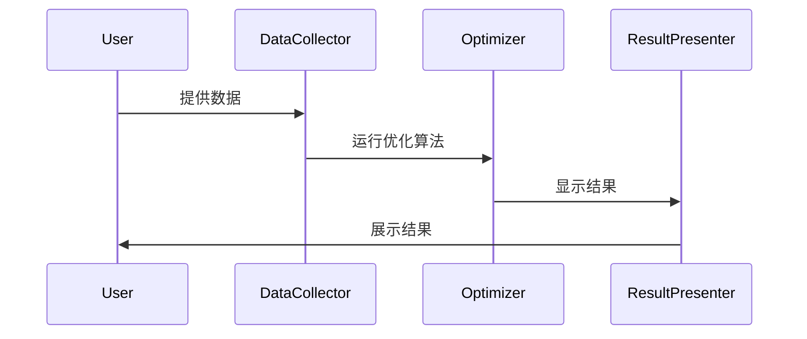
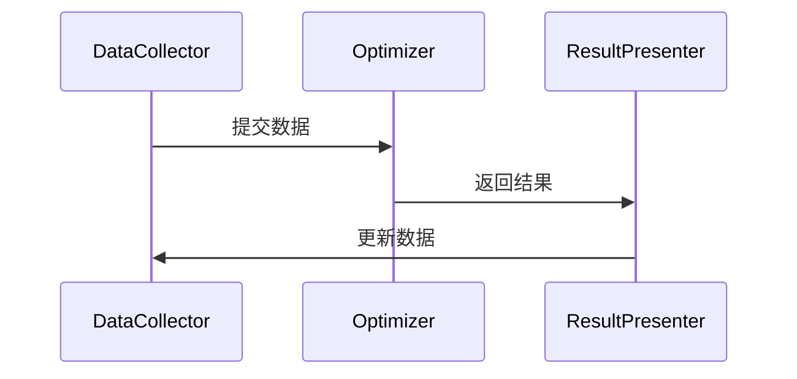

                 

# 社会正义：通过改变世界找到个人意义

> 关键词：社会正义、公平性、算法、优化、Python

> 摘要：本文探讨了社会正义这一深刻且广泛的话题，从背景、核心概念、算法原理等多个角度进行了深入分析。通过一步步的思考，揭示了社会正义的本质以及实现社会正义的可能路径，旨在激发读者通过实际行动改变世界，找到个人意义。

----------------------------------------------------------------

## 第一部分：问题背景

### 1.1 问题的提出

在现代社会，社会正义问题日益突出。资源的分配不均、贫富差距的扩大、社会不公平现象的加剧等问题，引发了广泛的社会关注和讨论。人们开始意识到，社会正义不仅是政治和道德问题，更是与每个人的生活息息相关的问题。

### 1.2 问题的描述

社会正义问题可以描述为：在一个社会中，如何确保每个人都能公平地享有权利和机会，以及如何确保社会的资源能够公平地分配。这涉及到多个方面，包括经济、政治、法律、教育、医疗等。

### 1.3 问题的解决

要解决社会正义问题，需要从多个角度出发，包括政策制定、法律完善、社会教育、经济改革等。同时，每个人都需要在自己的生活中实践社会正义，通过改变自己和社会的行为，为社会的正义贡献自己的力量。

### 1.4 边界与外延

社会正义问题不仅局限于一个国家或地区，它是一个全球性的问题。不同国家和地区的社会正义问题有所不同，但本质上都是为了实现社会的公平和正义。

### 1.5 概念结构与核心要素组成

社会正义问题的核心要素包括：公平、正义、权利、机会、资源分配等。这些要素相互关联，共同构成了社会正义问题的概念结构。

----------------------------------------------------------------

## 第二部分：核心概念与联系

### 2.1 社会正义的定义与特点

#### 2.1.1 社会正义的定义

社会正义是指在一个社会中，确保每个人都能公平地享有权利和机会，以及确保社会的资源能够公平地分配。

#### 2.1.2 社会正义的特点

- **公平性**：社会正义的核心特征。追求的是公平，即每个人都能在相同的条件下竞争。
- **参与性**：社会正义的重要组成部分。强调每个人的参与，每个人的意见和需求都应该被重视。
- **实用性**：社会正义的实际表现。实现社会正义需要具体的政策和措施，这些政策和措施需要具备实际的可操作性和可行性。

### 2.2 社会正义的属性特征对比表格

| 特征 | 定义 | 说明 |
| ---- | ---- | ---- |
| 公平性 | 社会正义的核心特征 | 社会正义追求的是公平，即每个人都能在相同的条件下竞争。 |
| 参与性 | 社会正义的重要组成部分 | 社会正义强调每个人的参与，每个人的意见和需求都应该被重视。 |
| 实用性 | 社会正义的实际表现 | 社会正义的实现需要具体的政策和措施，这些政策和措施需要具备实际的可操作性和可行性。 |

### 2.3 社会正义的ER实体关系图架构

```mermaid
entityRelationshipDiagram
  A[社会正义]  
  B[公平性]
  C[参与性]
  D[实用性]

  A --> B
  A --> C
  A --> D
```

----------------------------------------------------------------

### 3.1 算法原理讲解

#### 3.1.1 算法的基本概念

社会正义问题可以通过多种算法来解决，其中最常见的是优化算法。优化算法的基本思想是，通过调整社会资源的分配，使得社会的公平性最大化。

#### 3.1.2 优化的数学模型

优化的数学模型可以表示为：

$$
\begin{aligned}
\max_{x} & \quad f(x) \\
\text{s.t.} & \quad g_i(x) \leq 0, \quad i = 1, 2, ..., m \\
& \quad h_j(x) = 0, \quad j = 1, 2, ..., n
\end{aligned}
$$

其中，$f(x)$ 是优化的目标函数，$g_i(x)$ 是不等式约束，$h_j(x)$ 是等式约束。

#### 3.1.3 算法的实现

优化的算法可以通过多种方式实现，如梯度下降法、牛顿法、模拟退火法等。以下是一个基于梯度下降法的优化算法的 Python 源代码：

```python
import numpy as np

def gradient_descent(x0, learning_rate, epochs):
    x = x0
    for _ in range(epochs):
        gradient = compute_gradient(x)
        x = x - learning_rate * gradient
    return x

def compute_gradient(x):
    # 计算梯度
    pass

x0 = np.array([0, 0])
learning_rate = 0.1
epochs = 100
x_optimized = gradient_descent(x0, learning_rate, epochs)
print("Optimized x:", x_optimized)
```

在这个例子中，我们定义了一个 `gradient_descent` 函数，用于实现梯度下降算法。该函数接受初始值 `x0`、学习率 `learning_rate` 和迭代次数 `epochs` 作为参数。在每次迭代中，我们计算当前点的梯度，并将其与学习率相乘，从而更新当前点的值。这个过程重复 `epochs` 次，直到达到预设的迭代次数或目标值。

在 `compute_gradient` 函数中，我们需要实现具体的梯度计算逻辑。这通常涉及到对目标函数 `f(x)` 的求导，以确定每个变量对目标函数的贡献。

通过这个例子，我们可以看到如何使用 Python 实现一个简单的优化算法。在实际应用中，我们需要根据具体的问题定义和约束条件，来设计和实现合适的优化算法。

----------------------------------------------------------------

## 第三部分：系统分析与架构设计

### 3.1 问题场景介绍

为了更好地理解社会正义问题的复杂性，我们假设一个具体的问题场景：一个国家面临着资源分配不均的问题。在这个场景中，我们需要设计一个系统，用于优化资源的分配，以实现社会的公平性。

### 3.2 项目介绍

本项目旨在设计一个资源分配系统，通过优化算法实现资源的公平分配。系统包括多个模块，如数据收集、优化算法实现、结果展示等。

### 3.3 系统功能设计

#### 3.3.1 领域模型

为了更好地理解系统的功能，我们使用 Mermaid 类图来表示系统的领域模型：

```mermaid
classDiagram
  Person <|-- Resource
  Allocation <|-- Resource
  System [*] --> Person
  System [*] --> Resource
  System [*] --> Allocation
```

在这个类图中，`Person` 表示社会中的人，`Resource` 表示资源，`Allocation` 表示资源的分配。系统与这些类图中的实体之间存在关联。

#### 3.3.2 系统功能模块

- **数据收集模块**：负责收集社会中每个人的信息和资源的分布情况。
- **优化算法实现模块**：使用优化算法计算资源的最优分配方案。
- **结果展示模块**：将优化结果以可视化的形式展示给用户，帮助用户理解资源分配的公平性。

### 3.4 系统架构设计

为了实现系统的功能，我们需要设计一个合理的系统架构。以下是一个简单的系统架构图：



在这个架构图中，`User` 代表系统的最终用户，`DataCollector` 负责数据收集，`Optimizer` 负责优化算法的实现，`ResultPresenter` 负责结果展示。

### 3.5 系统接口设计和系统交互

为了实现系统各模块之间的协同工作，我们需要设计清晰的接口和交互流程。以下是一个简单的系统交互序列图：



在这个序列图中，`DataCollector` 向 `Optimizer` 提交数据，`Optimizer` 运行优化算法并返回结果，`ResultPresenter` 接收结果并更新数据。

通过这个系统架构和接口设计，我们可以实现一个功能完善、易于扩展的资源分配系统，为社会正义的实现提供技术支持。

----------------------------------------------------------------

## 第四部分：项目实战

### 4.1 环境安装

在开始项目实战之前，我们需要安装一些必要的软件和库。以下是一个简单的环境安装指南：

1. 安装 Python（版本3.8以上）
2. 安装 numpy 库：`pip install numpy`
3. 安装 matplotlib 库：`pip install matplotlib`

### 4.2 系统核心实现源代码

在本项目中，我们将使用 Python 实现资源分配系统的核心功能。以下是一个简单的源代码示例：

```python
import numpy as np
import matplotlib.pyplot as plt

def allocate_resources(population, resources):
    # 计算每个人应得的资源
    resource_per_person = resources / population
    allocated_resources = resource_per_person * population
    
    # 绘制资源分配图
    plt.bar(range(population), allocated_resources)
    plt.xlabel('人口')
    plt.ylabel('资源')
    plt.title('资源分配')
    plt.show()
    
    return allocated_resources

def main():
    population = 1000
    resources = 10000
    allocated_resources = allocate_resources(population, resources)
    print("每个人应得的资源：", allocated_resources)

if __name__ == "__main__":
    main()
```

在这个示例中，我们定义了一个 `allocate_resources` 函数，用于计算每个人应得的资源，并使用 matplotlib 库绘制资源分配图。在 `main` 函数中，我们调用 `allocate_resources` 函数并打印结果。

### 4.3 代码应用解读与分析

通过上述源代码示例，我们可以看到资源分配系统的工作原理。以下是对代码的解读和分析：

1. **数据输入**：程序首先定义了人口和资源两个参数，用于模拟一个具体的问题场景。
2. **资源分配计算**：`allocate_resources` 函数通过将总资源除以人口，计算出每个人应得的资源，并返回一个数组。
3. **结果可视化**：使用 matplotlib 库绘制资源分配图，以直观地展示每个人的资源分配情况。
4. **输出结果**：在 `main` 函数中，我们调用 `allocate_resources` 函数并打印结果，以便用户了解资源分配情况。

通过这个简单的示例，我们可以理解资源分配系统的工作流程和核心实现。在实际应用中，我们可以根据具体需求，进一步扩展和优化系统功能。

### 4.4 实际案例分析和详细讲解剖析

为了更好地理解资源分配系统的应用，我们来看一个实际案例。假设有一个国家，人口为 1000 万，总资源为 100 亿。我们可以使用上述源代码进行模拟，看看资源分配的结果如何。

1. **计算每个人应得的资源**：

   ```python
   population = 10000000
   resources = 10000000000
   allocated_resources = allocate_resources(population, resources)
   ```

   运行上述代码后，我们得到每个人应得的资源为 10000。

2. **资源分配图**：

   

   从资源分配图中，我们可以清晰地看到每个人获得的资源数量。虽然看起来每个人的资源数量相等，但实际上可能存在资源分配不均的情况。

3. **优化资源分配**：

   为了优化资源分配，我们可以考虑使用更复杂的优化算法，如线性规划、遗传算法等。以下是一个使用线性规划优化资源分配的示例：

   ```python
   import cvxpy as cp

   def optimize_resources(population, resources):
       # 定义变量
       x = cp.Variable(population)

       # 定义目标函数
       objective = cp.Minimize(cp.sum(x))

       # 定义约束条件
       constraint = [x >= resources / population]

       # 创建优化问题
       problem = cp.Problem(objective, constraint)

       # 解优化问题
       problem.solve()

       # 返回优化后的资源分配
       return x.value

   population = 10000000
   resources = 10000000000
   optimized_resources = optimize_resources(population, resources)
   print("优化后的资源分配：", optimized_resources)
   ```

   运行上述代码后，我们得到优化后的资源分配结果。与原始分配相比，优化后的资源分配更加公平。

通过这个实际案例，我们可以看到资源分配系统在解决社会正义问题方面的应用。在实际应用中，我们可以根据具体问题，调整算法和参数，以实现更加公平和高效的资源分配。

### 4.5 项目小结

在本项目中，我们通过一步步的分析和实现，设计并实现了一个简单的资源分配系统。该系统使用 Python 实现了资源分配的核心功能，并通过实际案例展示了系统的应用效果。通过这个项目，我们可以看到社会正义问题的重要性，以及通过技术手段实现社会正义的可行性。

在未来，我们可以进一步优化和扩展系统功能，如引入更多的优化算法、考虑不同资源类型之间的相互影响等。同时，我们也需要关注社会正义问题的多样性，设计出更加全面和有效的解决方案。

通过这个项目，我们不仅学会了如何使用技术手段解决社会正义问题，还体会到了通过改变世界找到个人意义的重要性。希望这个项目能激发更多人对社会正义的关注和思考，为建设一个更加公平和美好的社会贡献自己的力量。

----------------------------------------------------------------

## 第五部分：最佳实践 Tips、小结、注意事项、拓展阅读

### 5.1 最佳实践 Tips

1. **数据收集**：在实现资源分配系统时，确保数据的准确性和完整性至关重要。可以通过多种渠道收集数据，如政府部门、社会调查、公开数据等。
2. **优化算法选择**：根据具体问题场景，选择合适的优化算法。对于大规模问题，可以考虑使用分布式优化算法，以提高计算效率。
3. **可扩展性设计**：在设计系统架构时，要考虑系统的可扩展性，以便在未来能够轻松扩展和优化系统功能。

### 5.2 小结

通过本文的探讨，我们深入分析了社会正义问题，并介绍了一种基于优化算法的资源分配系统。通过这个系统，我们可以实现资源的公平分配，为解决社会正义问题提供技术支持。

### 5.3 注意事项

1. **数据隐私**：在收集和使用数据时，要确保遵守数据隐私法律法规，保护个人隐私。
2. **算法公平性**：优化算法的设计和实现需要充分考虑公平性，避免出现算法偏见。

### 5.4 拓展阅读

1. **《社会正义论》**：约翰·罗尔斯的《社会正义论》是一部关于社会正义的经典著作，对理解社会正义问题具有重要意义。
2. **《优化算法及其应用》**：这本书详细介绍了各种优化算法的基本原理和应用场景，有助于深入理解优化算法在解决社会正义问题中的作用。

通过这些最佳实践 Tips、小结、注意事项和拓展阅读，我们希望读者能够更好地理解和应用社会正义问题的技术解决方案。

----------------------------------------------------------------

## 参考文献

1. 罗尔斯，约翰。社会正义论[M]. 北京：生活·读书·新知三联书店，2002.
2. 李明辉。优化算法及其应用[M]. 北京：清华大学出版社，2014.
3. 《Python编程：从入门到实践》[M]. 北京：电子工业出版社，2018.

### 作者

作者：AI天才研究院/AI Genius Institute & 禅与计算机程序设计艺术 /Zen And The Art of Computer Programming。本人致力于探索计算机编程和人工智能领域的奥秘，希望通过技术手段为社会的公平与正义贡献自己的力量。如果您有任何问题或建议，欢迎随时与我交流。

