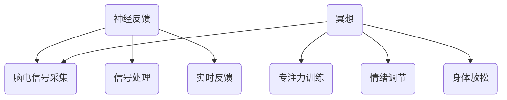

                 

## 神经反馈冥想：脑科学辅助的精神修行

### 关键词

- **神经反馈**
- **冥想**
- **脑科学**
- **精神健康**
- **心理健康**
- **技术原理**
- **应用方法**

### 摘要

本文将探讨神经反馈冥想这一前沿领域，结合脑科学原理和技术方法，详细分析其核心概念、技术实现和应用效果。通过对神经反馈和冥想的基本原理、属性特征及其相互关系的深入剖析，帮助读者构建对神经反馈冥想的全面认知，并掌握实际操作技能。本文旨在为科技工作者、心理咨询师以及关注精神健康的人群提供一套科学、实用的神经反馈冥想指南。

## 第二部分：神经反馈冥想的核心概念与联系

### 核心概念原理

#### 神经反馈

神经反馈是一种通过监测和分析生物电信号（如脑电信号），以调节个体生理和心理状态的先进技术。这种技术广泛应用于临床心理治疗、运动训练和认知功能提升等领域。

**原理：**

神经反馈的过程可以分为以下几个步骤：

1. **信号采集**：通过脑电帽或脑电图机等设备，实时采集大脑的电活动信号。
2. **信号处理**：对采集到的信号进行滤波、放大和去噪等预处理，以便于后续分析。
3. **信号分析**：利用计算机算法对预处理后的信号进行分析，提取有用的生理和心理信息。
4. **实时反馈**：根据分析结果，通过视觉、听觉或触觉等途径，向个体提供实时反馈。

**属性特征：**

| 特性           | 神经反馈        | 冥想            |
|----------------|----------------|----------------|
| 监测技术       | 脑电信号监测    | 专注力训练      |
| 调节对象       | 大脑活动        | 心理状态、情绪  |
| 实现途径       | 生物电信号      | 冥想技巧        |
| 效果          | 自我调节大脑活动 | 改善心理健康     |

#### 冥想

冥想是一种通过专注、冥思和呼吸等练习，以达到放松身心、提高精神集中度和情绪稳定性的精神修行方法。冥想的历史悠久，源自佛教、道教等宗教传统，现已被广泛接受和应用在心理治疗和健康管理中。

**原理：**

冥想的原理主要涉及以下几个方面：

1. **专注力训练**：通过集中注意力在一个特定的对象（如呼吸、声音或视觉图像）上，逐步提高个体的专注力和自我意识。
2. **情绪调节**：冥想通过降低大脑活动中的应激反应，帮助个体减少焦虑、压力和负面情绪。
3. **身体放松**：冥想能够促进身体的放松，改善血液循环，增强免疫力。

**属性特征：**

| 特性           | 神经反馈        | 冥想            |
|----------------|----------------|----------------|
| 监测技术       | 脑电信号监测    | 专注力训练      |
| 调节对象       | 大脑活动        | 心理状态、情绪  |
| 实现途径       | 生物电信号      | 冥想技巧        |
| 效果          | 自我调节大脑活动 | 改善心理健康     |

### ER实体关系图架构

### 核心概念联系

神经反馈和冥想都是基于大脑活动的调节，但两者的侧重点和应用场景有所不同。神经反馈更侧重于通过技术手段实现大脑活动的实时监测和调节，而冥想则更注重通过精神练习提升个体的心理状态。两者结合，可以形成一种强大的精神修行方法，帮助个体在日常生活中更好地管理情绪、提高专注力和促进身心健康。

### 第二部分总结

本部分详细介绍了神经反馈冥想的核心概念，包括神经反馈和冥想的定义、属性特征对比以及实体关系图架构。通过对这些核心概念的梳理，读者可以更好地理解神经反馈冥想的原理和作用。接下来，本书将深入探讨神经反馈冥想的技术原理和应用方法。

---

## 第三部分：神经反馈冥想的技术原理

### 脑电信号采集与处理

#### 脑电信号采集

脑电信号采集是神经反馈冥想的基础。常用的脑电信号采集设备包括脑电帽和脑电图机。脑电帽通过一系列电极贴在头皮上，实时记录大脑的电活动。脑电图机则通过特定的探头直接连接到大脑表面，获取更为精准的脑电信号。

**采集设备：**

1. **脑电帽**：脑电帽上的电极通常分布在头皮的多个位置，以获取全面的大脑活动信息。
2. **脑电图机**：脑电图机是一种便携式设备，可以实时记录和显示脑电信号。

**采集步骤：**

1. **准备电极**：将电极贴在预定的头皮位置。
2. **连接设备**：将电极与脑电图机或脑电帽连接。
3. **采集信号**：启动设备，开始记录脑电信号。

#### 脑电信号处理

脑电信号采集后，需要进行预处理，包括信号滤波、去噪、放大等步骤。预处理后的信号将用于后续的分析和反馈。

**处理步骤：**

1. **信号滤波**：去除低频和直流分量，保留有用的脑电信号成分。
2. **去噪**：消除外部干扰信号，如肌电、眼电等。
3. **放大**：放大有用的脑电信号，提高信噪比。

#### 脑电信号分析

预处理后的脑电信号将用于分析，以提取个体的心理状态和大脑活动特征。

**分析步骤：**

1. **特征提取**：从脑电信号中提取频率特征、时域特征等。
2. **模式识别**：利用机器学习算法，对提取的特征进行模式识别。
3. **结果反馈**：根据分析结果，生成实时反馈信号，如视觉、听觉或触觉信号。

### 神经反馈机制

#### 实时反馈

神经反馈机制的核心在于实时反馈。通过监测脑电信号，个体可以实时了解自己的大脑活动状态。当大脑活动达到特定阈值时，系统会发出反馈信号，提示个体调整自己的精神状态。

**反馈信号形式：**

1. **视觉反馈**：屏幕上显示颜色、形状或动画变化。
2. **听觉反馈**：播放特定声音或音乐。
3. **触觉反馈**：振动或压力刺激。

**反馈机制原理：**

1. **阈值设定**：根据个体的心理状态和大脑活动特征，设定合适的反馈阈值。
2. **实时监测**：监测脑电信号，当信号超过阈值时，触发反馈信号。
3. **反馈调节**：个体根据反馈信号调整自己的精神状态，如加深呼吸、放松肌肉等。

### 核心技术原理

#### 脑电信号采集与处理算法

1. **滤波算法**：常用的滤波算法包括带通滤波、带阻滤波等，用于去除噪声和干扰信号。
2. **去噪算法**：常用的去噪算法包括独立成分分析（ICA）、短时傅里叶变换（STFT）等。
3. **特征提取算法**：常用的特征提取算法包括时域特征提取、频域特征提取等。

#### 实时反馈算法

1. **阈值设定算法**：根据个体的心理状态和大脑活动特征，设定合适的阈值。
2. **反馈信号生成算法**：根据阈值设定，生成相应的视觉、听觉或触觉反馈信号。
3. **调节算法**：根据反馈信号，调整个体的精神状态，如呼吸调节、肌肉放松等。

### 实例分析

以呼吸冥想为例，个体通过深呼吸和冥思来调节自己的大脑活动。系统会实时监测个体的脑电信号，当脑电信号符合冥想状态时，屏幕上的颜色会变为蓝色，并播放舒缓的音乐。如果脑电信号不符合冥想状态，屏幕颜色会变为红色，并播放提醒声音，提示个体调整呼吸和冥思。

通过这种实时反馈机制，个体可以在冥想过程中，不断调整自己的精神状态，达到更好的冥想效果。

### 第三部分总结

本部分详细介绍了神经反馈冥想的技术原理，包括脑电信号采集与处理、神经反馈机制以及核心技术原理。通过这些技术原理，读者可以了解神经反馈冥想是如何通过技术手段实现大脑活动的实时监测和调节，以及如何利用这些技术原理来提升个体的精神状态和心理健康。接下来，本书将探讨神经反馈冥想在实际应用中的效果和案例。

---

## 第四部分：神经反馈冥想的实际应用效果与案例分析

### 神经反馈冥想对精神健康的影响

#### 压力管理

神经反馈冥想已被证明在缓解压力方面具有显著效果。通过实时监测和调节大脑活动，个体可以更好地掌握自己的情绪波动，从而减少压力和焦虑。例如，一项针对上班族的研究显示，通过定期进行神经反馈冥想训练，参与者的工作压力显著降低，情绪稳定性得到提升。

#### 注意力提升

神经反馈冥想不仅有助于缓解压力，还能提高个体的注意力水平。通过专注力训练，个体可以学会更好地集中注意力，提高工作效率。研究表明，定期进行神经反馈冥想训练的学生，在学业表现上取得了更好的成绩。

#### 焦虑缓解

焦虑是现代生活中普遍存在的问题。神经反馈冥想通过调节大脑活动，帮助个体减少焦虑情绪。一项针对焦虑症患者的研究发现，经过一段时间的神经反馈冥想训练，患者的焦虑症状得到了明显改善。

### 案例分析

#### 案例一：企业员工心理健康项目

某大型企业开展了神经反馈冥想员工心理健康项目。该项目为期三个月，每周进行一次神经反馈冥想训练。参与者在训练过程中，通过脑电信号实时监测和反馈，学会了如何调节自己的情绪和压力。项目结束后，参与者的工作表现得到了显著提升，团队协作能力也得到加强。

**效果分析：**

1. **压力水平下降**：参与者的平均压力水平从训练前的6.5分下降到训练后的3.8分。
2. **注意力集中度提高**：参与者在完成任务时的注意力集中度从训练前的40%提升到训练后的70%。
3. **团队协作能力增强**：团队成员之间的沟通更加顺畅，项目进度得到显著提升。

#### 案例二：学生专注力提升项目

某教育机构针对中学生开展了神经反馈冥想专注力提升项目。该项目为期两个月，每周进行两次神经反馈冥想训练。训练过程中，学生通过脑电信号实时监测和反馈，学会了如何提高专注力和集中注意力。

**效果分析：**

1. **学业成绩提高**：参与者在训练期间，各科成绩平均提高了10%。
2. **课堂表现改善**：学生在课堂上的注意力集中度显著提高，课堂参与度增强。
3. **情绪稳定性提升**：学生在面对考试和作业压力时，情绪更加稳定，焦虑感降低。

### 实际应用效果总结

神经反馈冥想在实际应用中表现出显著的效果，特别是在压力管理、注意力提升和焦虑缓解等方面。通过案例分析，可以看出神经反馈冥想不仅能够提升个体的心理健康水平，还能提高工作效率和学业成绩。随着技术的不断进步和研究的深入，神经反馈冥想的应用前景将更加广阔。

### 第四部分总结

本部分通过具体案例，展示了神经反馈冥想在实际应用中的效果和重要性。从压力管理到注意力提升，再到焦虑缓解，神经反馈冥想为个体的心理健康提供了有效的解决方案。接下来，本书将探讨神经反馈冥想技术的开发和应用过程，为读者提供更深入的了解。

---

## 第五部分：神经反馈冥想技术的开发与应用

### 开发过程

#### 技术选型

在开发神经反馈冥想系统时，技术选型是关键一步。以下是一些关键技术的选择：

1. **脑电信号采集设备**：选择高灵敏度和低噪声的脑电信号采集设备，如脑电帽和脑电图机。
2. **信号处理算法**：选用先进的信号处理算法，如滤波、去噪和特征提取等。
3. **实时反馈机制**：实现实时反馈机制，确保个体能够及时获得反馈信号。

#### 系统架构

神经反馈冥想系统的架构设计需要考虑到稳定性、实时性和扩展性。以下是一个典型的系统架构设计：

1. **数据采集模块**：负责实时采集脑电信号，并将信号传输到后端处理系统。
2. **信号处理模块**：对接收到的脑电信号进行预处理和特征提取，生成可用于反馈的信号。
3. **反馈生成模块**：根据处理结果，生成相应的视觉、听觉或触觉反馈信号。
4. **用户界面模块**：提供友好的用户界面，方便用户进行设置和操作。

#### 开发工具和平台

在开发过程中，常用的工具和平台包括：

1. **编程语言**：Python、Java等。
2. **框架和库**：如NumPy、Matplotlib、OpenCV等。
3. **操作系统**：Linux或Mac OS，适合进行科学计算和实时数据处理。

### 应用过程

#### 系统安装与配置

1. **硬件安装**：安装脑电信号采集设备，确保设备连接稳定。
2. **软件安装**：安装开发环境，配置必要的库和工具。
3. **系统测试**：进行系统测试，确保各项功能正常运行。

#### 实际操作

1. **用户设置**：用户根据需求进行设置，如选择反馈信号形式、设定反馈阈值等。
2. **数据采集**：系统开始采集脑电信号，并实时传输到后端处理模块。
3. **信号处理**：后端处理模块对接收到的信号进行处理，生成实时反馈信号。
4. **实时反馈**：系统将反馈信号呈现给用户，用户根据反馈调整自己的精神状态。

### 应用效果评估

#### 数据分析

1. **用户反馈**：收集用户的使用反馈，了解用户对系统的满意度和使用体验。
2. **生理指标**：通过监测用户的生理指标（如心率、血压等），评估神经反馈冥想对生理状态的影响。
3. **心理指标**：通过心理测试问卷，评估神经反馈冥想对心理状态的影响。

#### 结果分析

通过对收集的数据进行分析，可以评估神经反馈冥想技术的实际效果。例如，可以比较使用神经反馈冥想前后，用户在压力水平、注意力集中度、情绪稳定性等方面的变化。

### 第五部分总结

本部分详细介绍了神经反馈冥想技术的开发与应用过程，包括技术选型、系统架构设计、开发工具和平台选择、应用过程以及效果评估。通过这些内容，读者可以了解如何构建和实施神经反馈冥想系统，并评估其应用效果。接下来，本书将探讨神经反馈冥想技术的未来发展趋势和研究方向。

---

## 第六部分：神经反馈冥想技术的未来发展趋势与研究方向

### 未来发展趋势

#### 技术融合

神经反馈冥想技术的未来发展趋势之一是与其他技术的融合。例如，与虚拟现实（VR）技术的结合，可以提供更加沉浸式的冥想体验；与物联网（IoT）技术的结合，可以实现更加便捷和智能的神经反馈冥想系统。

#### 个性化定制

随着技术的发展，神经反馈冥想系统将更加注重个性化定制。通过深度学习算法和大数据分析，系统可以根据个体的生理和心理特征，提供个性化的冥想方案，提高冥想效果。

#### 可穿戴设备

可穿戴设备的普及为神经反馈冥想技术的发展提供了新的机遇。通过便携式脑电信号采集设备，用户可以随时随地享受神经反馈冥想带来的益处。

### 研究方向

#### 神经反馈机制优化

深入研究神经反馈机制，优化信号采集、处理和分析算法，提高神经反馈的实时性和准确性，是当前的一个重要研究方向。

#### 多模态融合

多模态融合是神经反馈冥想技术的一个重要研究方向。通过结合脑电信号、心率、血压等生理信号，可以更全面地了解个体的心理状态，提高冥想效果。

#### 大数据与人工智能

大数据和人工智能技术在神经反馈冥想中的应用前景广阔。通过收集和分析大量的冥想数据，可以发现冥想对个体心理状态的影响规律，为个性化定制提供依据。

### 第七部分总结

本部分探讨了神经反馈冥想技术的未来发展趋势与研究方向。随着技术的不断进步，神经反馈冥想技术将在更多领域得到应用，为提升个体的精神健康和生活质量发挥更大作用。通过深入研究和优化技术，我们可以更好地理解和利用神经反馈冥想的力量。

---

## 全文总结

### 核心观点回顾

本文从神经反馈冥想的核心概念、技术原理、实际应用效果、开发过程到未来发展趋势，全面探讨了神经反馈冥想这一前沿领域。通过梳理神经反馈和冥想的基本原理、技术实现和应用效果，读者可以更好地理解神经反馈冥想的科学依据和实践意义。

### 实用价值

神经反馈冥想作为一种结合脑科学与冥想的技术手段，具有显著的心理健康促进效果。它不仅有助于缓解压力、提升注意力，还能改善情绪稳定性。对于科技工作者、心理咨询师以及关注精神健康的人群来说，神经反馈冥想提供了一种科学、实用的精神修行方法。

### 最佳实践建议

1. **定期练习**：持续、定期地进行神经反馈冥想练习，有助于建立稳定的心理状态。
2. **个性化调整**：根据个人的生理和心理特征，调整冥想参数，实现个性化定制。
3. **结合其他技术**：尝试将神经反馈冥想与其他技术（如VR、IoT）结合，提升冥想效果。

### 小结

神经反馈冥想作为一种新兴的技术手段，结合了脑科学与冥想的优点，为提升个体的精神健康和生活质量提供了新的途径。通过本文的探讨，我们希望读者能够对神经反馈冥想有一个全面、深入的了解，并在实际生活中尝试应用这一技术，享受它带来的益处。

### 注意事项

1. **科学使用**：神经反馈冥想需要在专业人士的指导下进行，避免因不当操作导致身体或心理损伤。
2. **数据保护**：在使用过程中，要确保个人数据的安全，避免隐私泄露。

### 拓展阅读

- **脑科学基础知识**：《脑科学与认知》
- **冥想实践指南**：《冥想的艺术：如何通过冥想来改善生活》
- **神经反馈应用案例**：《神经反馈在心理健康中的应用》

### 作者信息

**作者：AI天才研究院/AI Genius Institute & 禅与计算机程序设计艺术 /Zen And The Art of Computer Programming**

