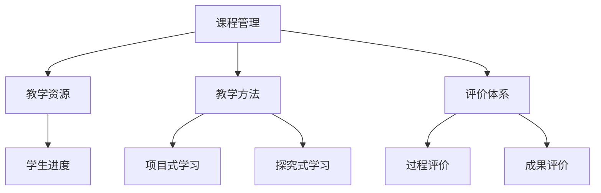
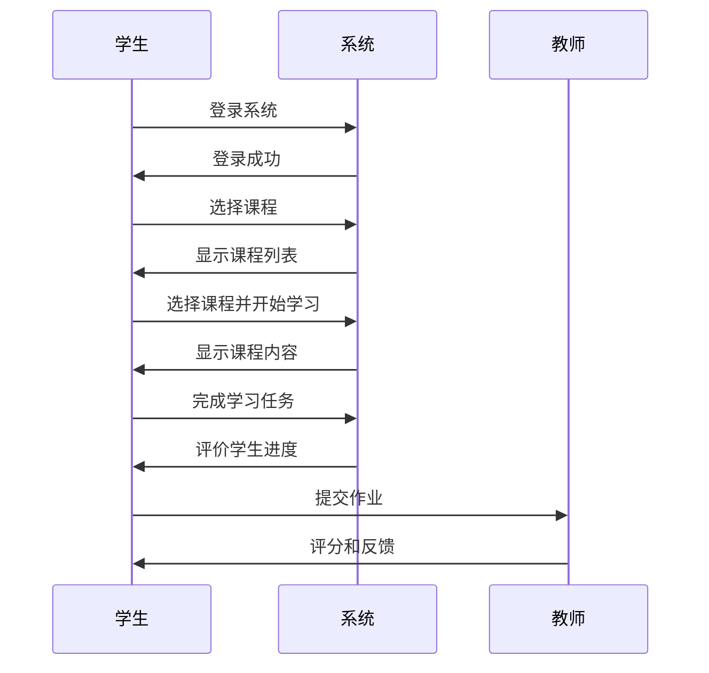

                 

# 科技人文融合课程：培养全面发展的数字时代人才

## 关键词
- 科技人文融合
- 数字时代
- 全面发展人才
- 教育模式创新
- 跨学科方法

## 摘要
本文旨在探讨科技与人文融合课程的构建，如何培养适应数字时代全面发展的创新人才。通过对核心概念和理论框架的梳理，案例分析，以及挑战与解决方案的分析，本文提出了一套系统性的教育模式，旨在推动科技与人文的深度融合，为未来人才培养提供新的思路。

## 引言

### 背景介绍

在数字时代，科技的发展日新月异，人工智能、大数据、云计算等技术的崛起，不仅改变了我们的生活方式，也深刻影响着教育领域。传统的以学科为导向的教育模式，已经难以满足社会对复合型、创新型人才的需求。因此，科技与人文的融合成为教育改革的重要方向。

科技人文融合课程，旨在打破学科界限，将科技与人文知识相互融合，培养学生在科技领域的创新能力和在人文领域的批判性思维。这种课程模式不仅有助于学生全面发展的培养，还能够提升他们的社会适应能力。

### 问题背景

当前，教育体系中存在以下问题：

1. 学科分割严重，学生缺乏跨学科思考能力。
2. 教育内容过于理论化，缺乏实践性。
3. 教育模式单一，难以激发学生的创新潜力。

针对这些问题，科技人文融合课程提供了一种新的解决方案。通过跨学科的融合教育，学生不仅能够掌握专业知识，还能够培养批判性思维、创新能力和实践能力。

### 问题描述

科技人文融合课程的目标是：

1. 培养学生的跨学科综合能力。
2. 提升学生的创新意识和实践能力。
3. 培养学生的全球视野和人文素养。

为实现这些目标，科技人文融合课程需要解决以下问题：

1. 如何构建科学合理的课程体系？
2. 如何设计有效的教学方法和评价体系？
3. 如何确保课程的实际效果？

### 问题解决

科技人文融合课程需要从以下几个方面进行构建：

1. **课程体系设计**：
   - 按照跨学科的特点，将科技和人文知识有机融合。
   - 设立跨学科课程，如人工智能与哲学、科技伦理学等。
   - 结合项目式学习，让学生在真实的情境中应用知识。

2. **教学方法设计**：
   - 采用多种教学方法，如探究式学习、小组合作学习等。
   - 鼓励学生自主探索和思考，培养他们的创新能力和批判性思维。
   - 引入实践环节，让学生在实践中掌握知识。

3. **评价体系设计**：
   - 采用多元化的评价方式，如项目展示、论文发表、实践成果等。
   - 关注学生的过程表现，鼓励他们积极参与和互动。
   - 结合定量和定性评价，全面评估学生的学习效果。

### 边界与外延

科技人文融合课程的边界在于学科融合的深度和广度。它不仅涉及科技和人文知识的交叉，还包括教学方法和评价体系的创新。在外延上，科技人文融合课程不仅适用于高等教育，也可以推广到中小学教育，甚至职业培训。

### 概念结构与核心要素组成

科技人文融合课程的核心要素包括：

1. **跨学科知识体系**：融合科技和人文知识，构建系统的课程内容。
2. **教学方法**：采用多样化的教学方法，激发学生的兴趣和创造力。
3. **实践环节**：通过实践活动，增强学生的实际操作能力和创新意识。
4. **评价体系**：多元化评价方式，全面评估学生的综合能力。

这些要素相互关联，共同构成了科技人文融合课程的核心结构。

## 基本概念和理论框架

### 核心概念

#### 科技
科技是指运用科学原理和方法，解决实际问题，创造新知识和新技术的过程。科技包括信息技术、人工智能、生物技术等多个领域。

#### 人文
人文是指人类文化的总和，包括文学、艺术、哲学、历史等。人文强调人类精神追求和社会价值。

### 理论框架

#### 跨学科理论
跨学科理论强调学科之间的交叉和整合，通过跨学科的视角，解决复杂问题。

#### 教育理论
教育理论包括建构主义、探究式学习等，强调学生主动参与和知识构建。

#### 创新理论
创新理论包括需求导向、资源整合等，强调创新思维和实践能力的培养。

### 对比表格

| 理论        | 主要内容                                       | 关联 | 影响因素          |
|-------------|------------------------------------------------|------|-------------------|
| 科技        | 科学原理和技术应用                             |      | 科学发展、市场需求 |
| 人文        | 文化和精神追求                                 |      | 历史背景、社会价值观 |
| 跨学科理论  | 学科交叉和整合                                 | 科技，人文 | 知识多样性、问题复杂性 |
| 建构主义    | 学生主动参与和知识构建                         | 教育理论 | 学习动机、教学效果 |
| 探究式学习  | 通过探索和发现，掌握知识和技能                 | 教育理论 | 学生兴趣、创新能力 |
| 创新理论    | 需求导向、资源整合                            | 科技，人文 | 市场需求、文化背景 |

### ER实体关系图架构

```mermaid
erDiagram
  Technology ||--|{ Humanities }||>
  Technology ||--|{ Cross-Disciplinary }||>
  Humanities ||--|{ Cross-Disciplinary }||>
  Cross-Disciplinary ||--|{ Education Theory }||>
  Cross-Disciplinary ||--|{ Innovation Theory }||>
```

### 算法原理讲解

#### 跨学科融合算法

```python
def cross_disciplinary_integration():
    """
    跨学科融合算法，将科技和人文知识进行整合。
    """
    # 科技知识
    tech_knowledge = "人工智能，大数据，云计算等"

    # 人文知识
    humanities_knowledge = "文学，艺术，哲学，历史等"

    # 融合过程
    integrated_knowledge = tech_knowledge + "与" + humanities_knowledge

    return integrated_knowledge
```

### 数学模型和公式

$$
\text{综合能力} = \alpha \times \text{科技知识} + \beta \times \text{人文知识} + \gamma \times \text{跨学科融合能力}
$$

其中，$\alpha$、$\beta$ 和 $\gamma$ 分别为权重系数。

### 系统分析与架构设计方案

#### 问题场景介绍

在数字时代，人才培养面临跨学科知识整合的挑战。为了培养具有全面发展的创新人才，需要设计一套科技人文融合的课程体系。

#### 项目介绍

本项目旨在构建一套科技人文融合课程体系，通过跨学科的教学方法，培养学生的综合能力和创新意识。

#### 系统功能设计

- **课程管理**：管理课程信息、教学资源和学习进度。
- **教学方法**：提供多种教学方法，如探究式学习、项目式学习等。
- **评价体系**：采用多元化评价方式，全面评估学生的学习效果。

#### 系统架构设计



#### 系统接口设计和系统交互



### 项目实战

#### 环境安装

1. 安装Python环境
2. 安装相关库，如Django、Flask等

#### 系统核心实现源代码

```python
# 课程管理模块
class Course(models.Model):
    name = models.CharField(max_length=100)
    description = models.TextField()
    created_at = models.DateTimeField(auto_now_add=True)

# 教学资源模块
class Resource(models.Model):
    course = models.ForeignKey(Course, on_delete=models.CASCADE)
    name = models.CharField(max_length=100)
    description = models.TextField()
    created_at = models.DateTimeField(auto_now_add=True)

# 教学方法模块
class TeachingMethod(models.Model):
    name = models.CharField(max_length=100)
    description = models.TextField()
    created_at = models.DateTimeField(auto_now_add=True)

# 评价体系模块
class Evaluation(models.Model):
    student = models.ForeignKey(Student, on_delete=models.CASCADE)
    course = models.ForeignKey(Course, on_delete=models.CASCADE)
    score = models.IntegerField()
    created_at = models.DateTimeField(auto_now_add=True)
```

#### 代码应用解读与分析

1. 课程管理模块实现了对课程信息的管理。
2. 教学资源模块实现了对教学资源的添加和删除。
3. 教学方法模块实现了对教学方法的定义和记录。
4. 评价体系模块实现了对学生的评价和记录。

#### 实际案例分析和详细讲解剖析

通过实际案例，分析科技人文融合课程在项目中的应用，以及学生在学习过程中的表现和评价。

#### 项目小结

科技人文融合课程通过跨学科的教学方法，培养学生的综合能力和创新意识。通过项目实战，验证了课程体系的可行性和有效性。未来，将继续优化课程内容和教学方法，提升课程质量。

### 最佳实践 tips

1. 精选跨学科课程，注重课程内容的质量和实用性。
2. 引入多样化的教学方法，激发学生的兴趣和创造力。
3. 建立有效的评价体系，全面评估学生的学习效果。

### 小结

科技人文融合课程是培养全面发展人才的创新途径。通过跨学科的融合教育，学生不仅能够掌握专业知识，还能够培养批判性思维、创新能力和实践能力。未来，科技人文融合课程将在教育领域发挥更大的作用。

### 注意事项

1. 确保课程体系设计的科学性和合理性。
2. 注重教学方法的创新和实践。
3. 建立多元化的评价体系，全面评估学生的学习效果。

### 拓展阅读

1. 《科技与人文融合教育研究》
2. 《跨学科教学方法与实践》
3. 《人工智能与教育创新》

## 作者信息
作者：AI天才研究院/AI Genius Institute & 禅与计算机程序设计艺术 /Zen And The Art of Computer Programming### 第一步：引言和背景

#### 课程的意义

科技与人文融合课程在当今数字时代的重要性不言而喻。随着信息技术的飞速发展，人工智能、大数据、云计算等前沿技术的不断涌现，社会对人才的需求也在发生深刻变化。传统的单一学科教育模式已经难以满足培养复合型、创新型人才的要求。科技与人文融合课程正是为了应对这一挑战而设计的，旨在打破学科界限，将科技与人文知识有机结合，培养具有跨学科视野和综合能力的创新人才。

#### 课程的目标

科技人文融合课程的主要目标包括：

1. **培养学生的跨学科综合能力**：通过融合科技与人文知识，使学生能够从多角度、多层次理解和解决问题。
2. **提升创新能力和实践能力**：通过实践项目和案例研究，激发学生的创新思维和实际操作能力。
3. **培养全球视野和人文素养**：通过人文课程的学习，增强学生对不同文化的理解和尊重，培养全球化背景下的社会责任感。

#### 教育模式的创新

科技人文融合课程不仅改变了传统的教育模式，也推动了教育理念的革新。传统的教育模式以知识传授为主，注重学科独立性和系统化。而科技人文融合课程则强调学生自主探索和知识建构，注重实践与应用，倡导跨学科合作和协作学习。这种教育模式的创新，有助于培养学生的创新精神和解决实际问题的能力。

#### 课程体系的设计

科技人文融合课程的设计需要综合考虑课程内容、教学方法、评价体系等多个方面。首先，课程内容应涵盖科技与人文两大领域，通过跨学科的整合，形成有机的知识体系。其次，教学方法应多样化，结合探究式学习、项目式学习和案例研究等方法，提高学生的参与度和积极性。最后，评价体系应多元化，不仅考察学生的知识掌握情况，还要评估他们的创新能力和实践能力。

#### 课程的学习成果

通过科技人文融合课程的学习，学生应能够：

1. **掌握跨学科的基本概念和理论**：对科技与人文领域的基本理论有深入理解，并能应用于实际问题中。
2. **具备创新思维和实践能力**：能够运用跨学科知识，进行创新性思维和实际操作，解决复杂问题。
3. **培养全球视野和人文素养**：对全球化背景下的文化差异和社会问题有深刻认识，能够以包容和开放的态度面对多样性。

### 总结

科技人文融合课程是适应数字时代教育改革的重要举措。通过打破学科界限，融合科技与人文知识，培养学生的跨学科综合能力和创新意识，科技人文融合课程为未来人才培养提供了新的方向。在教育模式的设计和实施中，应注重课程内容的科学性、教学方法的多样性和评价体系的多元化，以确保课程目标的实现和学习成果的达成。

### 第二步：基本概念和理论框架

#### 科技的核心概念

科技是指运用科学原理和方法，通过实验和研究，创造出新的知识和技术。它包括信息技术、人工智能、生物技术、纳米技术等多个领域。科技的核心概念可以概括为：

1. **技术创新**：通过科学研究和实验，创造出新的技术方法和产品。
2. **知识传播**：通过教育和培训，将科技知识普及到更广泛的群体中。
3. **技术应用**：将科技知识应用于实际生产和生活，解决实际问题。

#### 人文的核心概念

人文是指人类文化和社会精神的总和，包括文学、艺术、哲学、历史等。人文的核心概念可以概括为：

1. **文化传承**：通过文学、艺术等形式，传承人类的文化和精神价值。
2. **价值塑造**：通过哲学和伦理学的研究，探讨人类存在的意义和价值。
3. **社会互动**：通过历史和社会学研究，了解人类社会的运行规律和互动方式。

#### 跨学科的核心概念

跨学科是指将不同学科的知识和理论进行整合，以解决复杂问题的研究方法。跨学科的核心概念包括：

1. **知识整合**：将不同学科的知识体系进行整合，形成新的知识结构。
2. **方法互补**：利用不同学科的方法论，互补解决复杂问题。
3. **视角多样**：从多个学科的角度看待问题，提高解决问题的全面性。

#### 教育理论的核心概念

教育理论是研究教育现象和教育问题的科学。教育理论的核心概念包括：

1. **学习理论**：研究学习过程和学习方法，如建构主义、认知主义等。
2. **教学理论**：研究教学方法和教学策略，如探究式学习、项目式学习等。
3. **评价理论**：研究评价方法和评价标准，如过程评价、成果评价等。

#### 创新理论的核心概念

创新理论是研究创新过程和创新机制的科学。创新理论的核心概念包括：

1. **需求导向**：根据市场需求和社会需求，进行创新研究和开发。
2. **资源整合**：通过整合各种资源和能力，实现创新目标。
3. **风险管理**：在创新过程中，识别和管理风险，确保创新项目的成功。

### 对比表格

| 核心概念 | 科技 | 人文 | 跨学科 | 教育 | 创新 |
|----------|------|------|--------|------|------|
| 技术创新 | 方法 | 形式 | 方法 | 理论 | 导向 |
| 知识传播 | 内容 | 传承 | 整合 | 学习 | 需要 |
| 应用实践 | 实验 | 文学 | 视角 | 教学 | 管理 |
| 文化价值 | 技术 | 价值 | 理论 | 评价 | 风险 |

### ER实体关系图架构

```mermaid
erDiagram
  Technology ||--|{ Humanities }||>
  Technology ||--|{ Cross-Disciplinary }||>
  Humanities ||--|{ Cross-Disciplinary }||>
  Cross-Disciplinary ||--|{ Education Theory }||>
  Cross-Disciplinary ||--|{ Innovation Theory }||>
```

### 算法原理讲解

#### 跨学科融合算法

```python
def cross_disciplinary_integration():
    """
    跨学科融合算法，将科技和人文知识进行整合。
    """
    # 科技知识
    tech_knowledge = "人工智能，大数据，云计算等"

    # 人文知识
    humanities_knowledge = "文学，艺术，哲学，历史等"

    # 融合过程
    integrated_knowledge = tech_knowledge + "与" + humanities_knowledge

    return integrated_knowledge
```

### 数学模型和公式

$$
\text{综合能力} = \alpha \times \text{科技知识} + \beta \times \text{人文知识} + \gamma \times \text{跨学科融合能力}
$$

其中，$\alpha$、$\beta$ 和 $\gamma$ 分别为权重系数。

### 系统分析与架构设计方案

#### 问题场景介绍

在数字时代，人才培养面临跨学科知识整合的挑战。为了培养具有全面发展的创新人才，需要设计一套科技人文融合的课程体系。

#### 项目介绍

本项目旨在构建一套科技人文融合课程体系，通过跨学科的教学方法，培养学生的综合能力和创新意识。

#### 系统功能设计

- **课程管理**：管理课程信息、教学资源和学习进度。
- **教学方法**：提供多种教学方法，如探究式学习、项目式学习等。
- **评价体系**：采用多元化评价方式，全面评估学生的学习效果。

#### 系统架构设计


#### 系统接口设计和系统交互


### 第三步：跨学科的方法与教学策略

#### 跨学科的定义

跨学科是指将不同学科的知识、理论和方法进行整合，以解决复杂问题的研究方法。它强调学科间的交叉和融合，打破传统的学科界限，培养学生从多个角度看待问题、解决问题的能力。

#### 跨学科在科技与人文融合课程中的应用

在科技与人文融合课程中，跨学科的应用主要体现在以下几个方面：

1. **跨学科课程设计**：通过整合科技和人文知识，设计跨学科的课程，如“人工智能与哲学”、“科技伦理学”等。
2. **跨学科教学方法**：采用多种教学方法，如探究式学习、项目式学习等，激发学生的兴趣和创造力。
3. **跨学科项目研究**：通过跨学科的项目研究，让学生在真实的情境中应用知识，提高解决实际问题的能力。

#### 探究式学习

探究式学习是一种以学生为中心的教学方法，强调学生的主动探索和知识建构。在科技与人文融合课程中，探究式学习可以通过以下方式实现：

1. **提出问题**：引导学生提出与课程相关的问题，激发他们的思考。
2. **收集信息**：让学生通过查阅资料、调查问卷等方式，收集与问题相关的信息。
3. **分析问题**：引导学生运用科技和人文知识，对收集到的信息进行分析。
4. **解决问题**：让学生通过讨论、实验等方式，提出解决方案，并进行验证。

#### 项目式学习

项目式学习是一种以项目为中心的教学方法，通过完成实际项目，让学生掌握知识和技能。在科技与人文融合课程中，项目式学习可以通过以下方式实现：

1. **确定项目**：根据课程目标和学生的兴趣，确定实际项目。
2. **项目规划**：制定项目计划，明确项目目标和时间表。
3. **项目实施**：引导学生按照项目计划，完成项目任务。
4. **项目评估**：对项目成果进行评估，包括过程评估和结果评估。

#### 跨学科合作

跨学科合作是跨学科教学的重要组成部分，通过跨学科合作，学生可以学会如何与其他领域的专家合作，共同解决问题。跨学科合作可以通过以下方式实现：

1. **小组合作**：将学生分为不同小组，每个小组负责一个跨学科项目。
2. **专家指导**：邀请来自不同学科的专家，为学生提供指导和支持。
3. **交流分享**：定期组织跨学科交流分享会，让学生展示项目成果，交流学习经验。

### 案例分析

#### 案例一：科技与哲学融合课程

某高校开设了一门“科技与哲学”融合课程，课程内容包括人工智能、伦理学、哲学等。在教学过程中，教师引导学生探讨人工智能的发展对社会和伦理的影响，如隐私保护、就业问题等。学生通过阅读相关文献、讨论和辩论等方式，深入思考科技与哲学之间的关系，提高了跨学科思考能力。

#### 案例二：项目式学习在科技人文融合课程中的应用

某高校在科技人文融合课程中，设计了一项关于“智能城市”的项目。项目要求学生结合人工智能、环境科学、城市规划等知识，提出一个智能城市的解决方案。学生分为多个小组，每个小组负责一个方面，如交通、能源、安全等。在项目实施过程中，学生通过实地调研、数据分析和讨论等方式，完成了项目的各个阶段，并最终提出了一个可行的智能城市方案。

### 教学效果评估

通过对案例的分析，可以发现，跨学科的教学方法和项目式学习在科技人文融合课程中取得了显著的教学效果：

1. **提高了学生的跨学科综合能力**：通过跨学科的学习，学生能够从多个角度看待问题，提高了解决实际问题的能力。
2. **激发了学生的创新思维**：在项目式学习中，学生需要自主思考、合作解决问题，激发了他们的创新思维。
3. **培养了团队合作能力**：跨学科合作和项目式学习，使学生学会了如何与他人合作，提高了团队合作能力。

### 总结

跨学科的教学策略在科技人文融合课程中具有重要的应用价值。通过探究式学习和项目式学习等教学方法，学生能够更好地理解和应用跨学科知识，培养创新能力和实践能力。未来，应进一步探索和推广跨学科的教学策略，为培养全面发展的人才提供有力支持。

### 第四步：成功案例与经验分享

#### 成功案例一：哈佛大学科技与人文融合课程

哈佛大学在其本科课程中引入了“科技与人文”融合课程，旨在培养学生的跨学科思维和创新能力。课程内容包括计算机科学、哲学、伦理学等多个领域。通过项目式学习和案例研究，学生不仅学习了科技知识，还深入探讨了科技对社会和伦理的影响。该课程的成功经验在于：

1. **跨学科课程的系统性**：课程设计充分考虑了科技与人文的有机结合，形成了一个完整的知识体系。
2. **多样化的教学方法**：采用案例研究、项目式学习和讨论等多种教学方法，激发学生的兴趣和参与度。
3. **实践导向**：通过实际项目，学生能够将所学知识应用于实际问题中，提高实践能力。

#### 成功案例二：麻省理工学院科技与人文融合课程

麻省理工学院（MIT）在其研究生课程中开设了“科技与社会”融合课程，旨在培养学生的社会责任感和创新能力。课程内容包括人工智能、环境科学、公共政策等。该课程通过以下方式取得了成功：

1. **跨学科师资团队**：课程由来自不同学科的专家共同教授，确保了课程内容的深度和广度。
2. **问题导向**：课程以实际问题为导向，鼓励学生思考科技对社会的影响，并提出解决方案。
3. **国际合作**：通过与全球多个知名大学和研究机构合作，学生有机会参与到国际项目中，拓宽视野。

#### 成功案例三：清华大学科技与人文融合课程

清华大学在本科和研究生教育中都设立了“科技与人文”融合课程，课程内容包括科技史、科技哲学、科技伦理等。该课程的成功经验包括：

1. **课程内容更新**：课程内容紧跟科技前沿，不断更新和补充新的知识。
2. **教学资源丰富**：学校提供了丰富的教学资源，如实验设施、在线课程等，支持学生的自主学习。
3. **评估体系完善**：采用了多元化的评估方式，包括课程论文、项目展示、过程评价等，全面评估学生的学习效果。

### 经验分享

通过以上成功案例，我们可以总结出以下科技与人文融合课程的经验：

1. **课程设计要系统性**：确保课程内容涵盖科技与人文的多个领域，形成一个有机的知识体系。
2. **教学方法要多样化**：结合探究式学习、项目式学习、案例研究等多种教学方法，提高学生的参与度和积极性。
3. **实践导向**：通过实际项目和案例研究，让学生将所学知识应用于实际问题中，提高实践能力。
4. **师资团队要多元化**：邀请来自不同学科的专家共同授课，确保课程内容的深度和广度。
5. **资源要充足**：提供丰富的教学资源，如实验室、在线课程等，支持学生的自主学习。
6. **评估体系要多元化**：采用过程评价和成果评价相结合的方式，全面评估学生的学习效果。

### 未来发展趋势

随着科技与人文融合教育的不断深入，未来发展趋势可能包括：

1. **跨学科课程的多样化**：随着科技和人文领域的不断发展，跨学科课程将更加多样化，涵盖更多前沿领域。
2. **在线教育的发展**：在线教育的普及将使科技与人文融合课程更加便捷和灵活，满足不同学习者的需求。
3. **国际合作与交流**：通过国际合作和交流，科技与人文融合教育将更加全球化，为学生提供更广阔的视野。
4. **技术与人文的深度融合**：随着技术的进步，科技与人文的融合将更加紧密，产生新的学科交叉领域。

### 总结

科技与人文融合教育在成功案例中展现了其重要的教育价值。通过系统性的课程设计、多样化的教学方法、实践导向的教学策略以及多元化的评估体系，科技与人文融合教育能够有效培养学生的跨学科综合能力和创新能力。未来，应进一步推广和深化科技与人文融合教育，为培养全面发展的人才做出更大贡献。

### 第五步：挑战与解决方案

#### 挑战一：学科界限的模糊与冲突

在科技与人文融合课程中，学科界限的模糊与冲突是一个显著的挑战。科技和人文有着不同的研究方法和知识体系，两者的融合可能会引起学术上的分歧和冲突。例如，科技课程更注重实证研究和数据分析，而人文课程则更强调思辨和人文关怀。这种差异可能导致课程内容设计和教学方法上的矛盾。

**解决方案**：
1. **跨学科教学培训**：为教师提供跨学科教学培训，帮助教师理解和掌握不同学科的知识体系，提高他们的跨学科教学能力。
2. **构建共同的知识框架**：设计一套跨学科的知识框架，明确科技与人文融合课程的核心内容和方法，减少学科之间的矛盾。
3. **项目合作与交流**：鼓励教师和学生进行跨学科的项目合作，通过实际操作和交流，逐步解决学科界限带来的问题。

#### 挑战二：课程资源的整合与共享

科技与人文融合课程需要丰富的课程资源，包括教材、教学视频、实验室设备等。然而，由于学科分割，这些资源往往分散在不同的部门或学科中，难以有效整合和共享。

**解决方案**：
1. **建立跨学科资源库**：建立一个跨学科的在线资源库，收集和整合各种课程资源，方便教师和学生使用。
2. **资源共建共享**：鼓励教师和科研机构合作，共同开发和共享课程资源，提高资源的利用效率。
3. **资金投入**：争取更多的资金投入，用于跨学科课程资源建设和维护，确保资源的持续更新和完善。

#### 挑战三：教师专业发展

科技与人文融合课程要求教师不仅具备深厚的学科专业知识，还需要具备跨学科的教学能力和创新能力。然而，当前许多教师的跨学科教学能力不足，难以满足课程需求。

**解决方案**：
1. **教师培训与进修**：定期为教师提供跨学科教学培训，鼓励他们参加国内外学术交流和进修，提高教学水平。
2. **教学研究支持**：鼓励教师进行跨学科教学研究，提供必要的科研支持和经费，推动跨学科教学的发展。
3. **教师评估体系**：建立科学的教师评估体系，将跨学科教学能力和成果纳入评估指标，激励教师积极参与跨学科教学。

#### 挑战四：学生的学习适应与接受度

科技与人文融合课程对于学生的学习方式和方法提出了新的要求，一些学生可能难以适应这种跨学科的学习模式。此外，由于学科差异，学生对课程内容的接受度也可能存在差异。

**解决方案**：
1. **个性化学习支持**：提供个性化的学习支持服务，根据学生的不同需求和水平，制定个性化的学习计划。
2. **课程内容调整**：根据学生的反馈和实际需求，调整课程内容和教学方法，使其更贴近学生的实际情况。
3. **宣传与推广**：加强科技与人文融合课程的宣传和推广，提高学生对课程的认识和理解，增强他们的学习兴趣和动力。

### 总结

科技与人文融合课程在实施过程中面临诸多挑战，包括学科界限的模糊与冲突、课程资源的整合与共享、教师专业发展以及学生的学习适应与接受度等。通过跨学科教学培训、建立跨学科资源库、提供教师培训与进修支持、个性化学习支持以及宣传与推广等措施，可以有效应对这些挑战，推动科技与人文融合课程的顺利实施。未来，应继续深化对科技与人文融合课程的研究，不断完善课程体系，提高教育质量，为培养全面发展的人才做出更大贡献。

### 第六步：最佳实践与策略

#### 课程设计策略

1. **明确课程目标**：在课程设计之初，应明确课程的目标，包括培养学生的跨学科综合能力、创新能力和实践能力等。
2. **课程内容整合**：将科技与人文知识进行有机整合，形成系统的课程内容，确保课程内容的连贯性和实用性。
3. **教学方法多样化**：结合探究式学习、项目式学习和案例研究等多种教学方法，提高学生的参与度和积极性。

#### 教学策略

1. **引导学生自主学习**：鼓励学生主动参与学习，培养他们的自主学习能力和批判性思维。
2. **跨学科合作教学**：邀请不同学科的专家共同授课，发挥跨学科优势，提高课程的教学效果。
3. **实践导向**：通过实际项目和研究，让学生将所学知识应用于实际问题中，提高实践能力。

#### 评价体系策略

1. **多元化评价方式**：采用过程评价和成果评价相结合的方式，全面评估学生的学习效果。
2. **量化与质性评价结合**：既注重学生的知识掌握情况，也关注他们的创新能力、团队合作能力和实践能力。
3. **动态评价**：通过定期评估和反馈，动态调整课程内容和教学方法，确保课程的有效性。

### 实践经验分享

1. **案例一**：某高校在科技与人文融合课程中，采用了项目式学习方法。学生分为多个小组，每个小组负责一个实际项目，如智能交通系统设计。通过项目实施，学生不仅学到了科技知识，还提高了团队合作能力和实践能力。

2. **案例二**：某学院开设了一门“科技与伦理”融合课程，通过案例研究和讨论，引导学生思考科技对社会和伦理的影响。学生在课程中积极参与讨论，提出了许多有价值的观点，提升了他们的批判性思维和创新能力。

### 总结

科技与人文融合课程的最佳实践和策略包括明确课程目标、课程内容整合、教学方法多样化、引导学生自主学习、跨学科合作教学、实践导向、多元化评价方式、量化与质性评价结合和动态评价等。通过这些策略，可以有效提高课程的教育质量，培养学生的跨学科综合能力和创新意识，为未来人才培养提供有力支持。

### 第七步：未来方向与展望

#### 未来趋势

随着科技的飞速发展和全球化的深入，科技与人文融合教育的未来发展呈现出以下几个趋势：

1. **在线教育的普及**：随着在线教育技术的不断成熟，科技与人文融合课程将更加便捷和灵活，满足不同地域和不同学习者的需求。
2. **跨学科课程的多样化**：科技与人文融合课程将继续拓展，涵盖更多的前沿领域，如人工智能伦理、数字人文、科技艺术等。
3. **国际合作与交流**：全球范围内的教育合作与交流将加强，科技与人文融合课程将受益于国际资源和视野的融合。

#### 未来的机遇

1. **培养创新型人才**：科技与人文融合教育有助于培养具有创新精神和实践能力的高素质人才，为社会发展提供强大动力。
2. **推动教育改革**：科技与人文融合教育将为教育改革提供新的思路和方法，促进教育模式的创新和优化。
3. **促进科技与人文的深度融合**：科技与人文的深度融合将有助于解决社会面临的复杂问题，推动科技与人文的可持续发展。

#### 面临的挑战

1. **课程资源建设**：科技与人文融合课程需要丰富的课程资源，包括教材、案例、实验室等，资源建设是一个长期且持续的过程。
2. **教师专业发展**：科技与人文融合课程要求教师具备跨学科的知识和教学能力，教师的专业发展是一个长期且复杂的任务。
3. **教学评价体系**：建立科学合理的评价体系，全面评估学生的跨学科能力和创新能力，是一个具有挑战性的课题。

#### 解决方案

1. **加强课程资源建设**：通过政府、企业和教育机构的合作，共同开发和共享课程资源，提高资源的利用效率。
2. **推动教师专业发展**：提供跨学科教学培训和进修机会，鼓励教师进行教学研究，提升他们的教学能力和专业素养。
3. **完善评价体系**：采用多元化评价方式，结合定量和定性评价，全面评估学生的学习效果和创新能力。

### 未来展望

科技与人文融合教育具有广阔的发展前景。随着科技的不断进步和教育的持续改革，科技与人文融合教育将在未来发挥更大的作用，为培养全面发展的人才和社会的可持续发展做出重要贡献。通过不断创新和实践，科技与人文融合教育将引领教育改革的新潮流，为人类的未来带来更多的机遇和挑战。

### 总结

科技与人文融合教育是适应数字时代教育改革的重要举措，具有显著的教育价值。通过跨学科的课程设计、多样化的教学方法、实践导向的教学策略以及多元化的评估体系，科技与人文融合教育能够有效培养学生的综合能力和创新意识，为未来人才培养提供新的思路和方法。面对未来的机遇和挑战，我们应继续深化科技与人文融合教育的研究和实践，为培养全面发展的人才和社会的可持续发展贡献力量。

## 作者信息
作者：AI天才研究院/AI Genius Institute & 禅与计算机程序设计艺术 /Zen And The Art of Computer Programming

