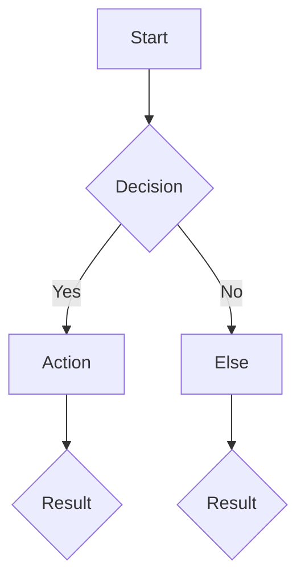
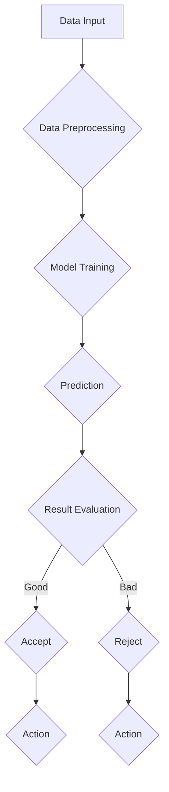
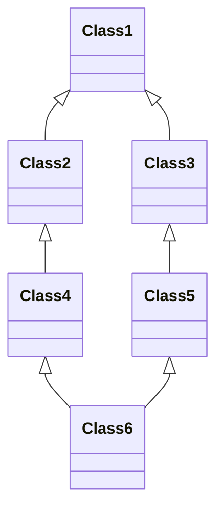
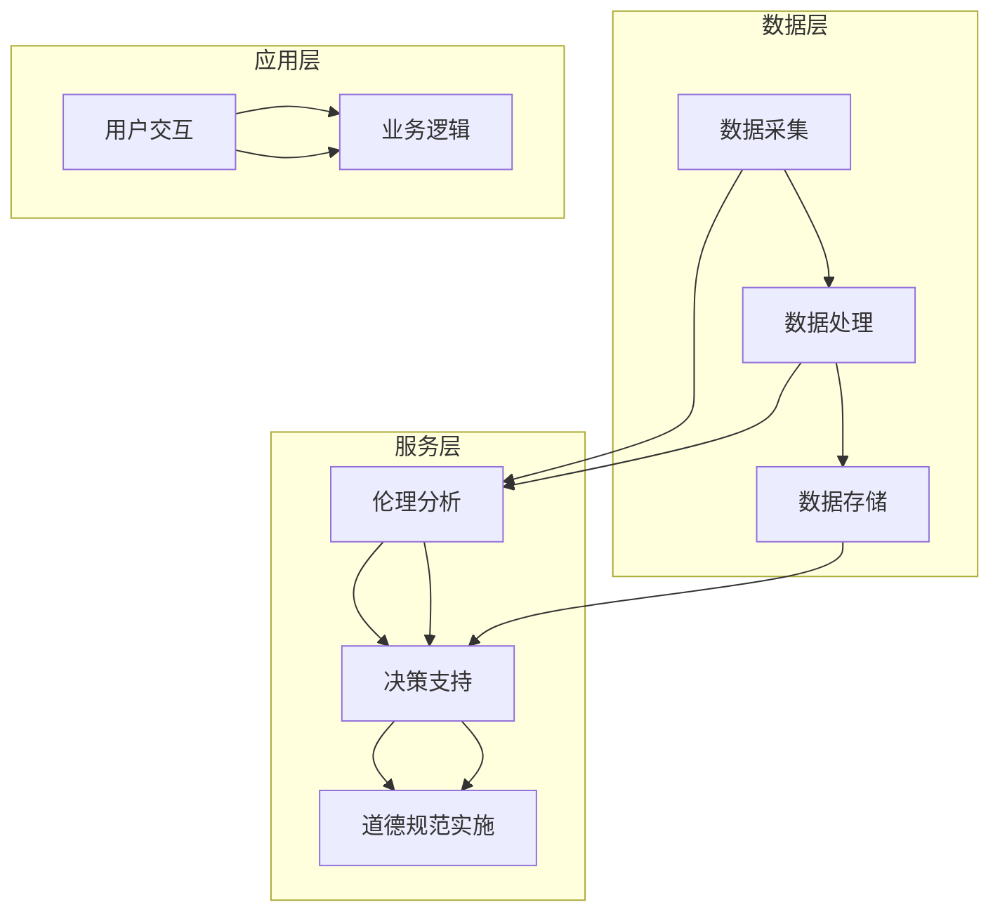
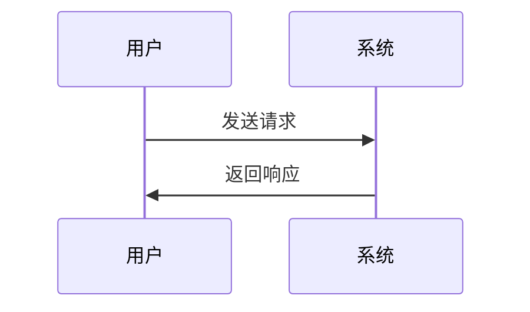
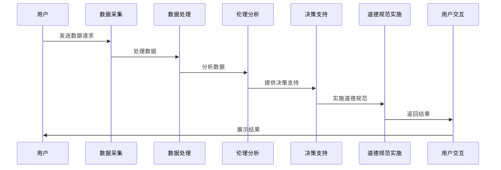

                 

# 科技伦理智库联盟：前沿技术发展的道德指南制定

## 关键词

- 科技伦理
- 前沿技术
- 道德指南
- 智库联盟
- 伦理决策

## 摘要

随着科技的飞速发展，前沿技术如人工智能、生物工程、量子计算等不断涌现，对人类社会产生深远影响。然而，这些技术也带来了诸多伦理挑战。科技伦理智库联盟应运而生，旨在为前沿技术发展提供道德指南。本文将详细介绍科技伦理智库联盟的背景、核心概念、算法原理、系统架构设计方案、项目实战以及最佳实践 tips，探讨如何在科技发展中平衡创新与伦理责任。

## 第一部分：背景介绍

### 1.1 科技伦理的起源与发展

#### 1.1.1 科技伦理的定义与重要性

科技伦理是指研究科技在发展过程中所涉及的道德问题、价值观念和伦理规范。它的重要性体现在以下几个方面：

1. **指导科技发展**：科技伦理为科技发展提供了道德准则，确保科技活动符合社会伦理标准。
2. **保护人类利益**：科技伦理关注科技应用对人类的影响，确保科技发展不会损害人类利益。
3. **促进社会和谐**：科技伦理有助于解决科技发展带来的社会矛盾，推动社会和谐发展。

#### 1.1.2 科技伦理的历史发展

科技伦理的历史可以追溯到古代文明，但真正形成体系是在20世纪中后期。以下是科技伦理发展的几个重要阶段：

1. **20世纪中叶**：科学家和哲学家开始关注科技带来的伦理问题，如核武器、生物武器等。
2. **20世纪末**：科技伦理研究逐渐兴起，形成了系统化的理论体系。
3. **21世纪初**：科技伦理研究逐渐应用于具体领域，如人工智能、生物工程等。

#### 1.1.3 科技伦理在当代的挑战

随着科技的迅猛发展，科技伦理面临着一系列挑战：

1. **人工智能伦理**：人工智能在带来便利的同时，也引发了隐私、安全、歧视等问题。
2. **基因编辑伦理**：基因编辑技术如CRISPR的出现，引发了道德争议，如人类胚胎基因编辑等。
3. **网络安全伦理**：网络安全问题日益严重，如网络攻击、数据泄露等，对个人和社会造成了重大影响。

### 1.2 前沿技术概述

#### 1.2.1 定义与分类

前沿技术是指当前尚未广泛应用，但具有巨大潜力的技术。根据其应用领域，前沿技术可分为：

1. **人工智能与机器学习**：包括深度学习、强化学习、自然语言处理等。
2. **生物工程**：包括基因编辑、合成生物学、生物信息学等。
3. **量子计算**：利用量子力学原理，实现超高速计算。
4. **纳米技术**：纳米材料的应用，如纳米机器人、纳米传感器等。

#### 1.2.2 发展趋势与前景

前沿技术的发展趋势主要包括：

1. **跨学科融合**：不同领域的技术相互融合，产生新的交叉学科。
2. **全球化发展**：各国纷纷加大科研投入，推动前沿技术发展。
3. **产业化应用**：前沿技术逐步从实验室走向产业化应用，带来巨大的经济和社会效益。

前沿技术的前景：

1. **推动经济发展**：前沿技术将成为新的经济增长点，带动产业链的升级和转型。
2. **改变生活方式**：前沿技术将改变人们的生活方式和社交方式，带来新的生活方式。
3. **提高生活质量**：前沿技术如医疗技术的进步，将提高人类的生活质量。

#### 1.2.3 前沿技术对伦理的影响

前沿技术对伦理的影响主要表现在以下几个方面：

1. **隐私与数据安全**：人工智能和大数据技术的发展，引发了隐私保护和数据安全的问题。
2. **公平与歧视**：人工智能在决策中的应用，可能导致性别、种族、年龄等方面的歧视。
3. **人类尊严与生命权**：基因编辑、克隆技术等生物工程技术的应用，引发了人类尊严和生命权的问题。

### 1.3 道德指南的重要性

#### 1.3.1 道德指南的作用

道德指南在科技发展中的作用主要包括：

1. **指导科技研发**：道德指南为科技研发提供了伦理准则，确保科技活动符合社会伦理标准。
2. **规范技术应用**：道德指南为技术应用提供了伦理规范，防止技术应用对人类和社会造成伤害。
3. **平衡创新与伦理**：道德指南在推动科技发展的同时，关注伦理问题，实现创新与伦理的平衡。

#### 1.3.2 制定道德指南的挑战

制定道德指南面临的挑战包括：

1. **技术快速进步**：前沿技术的快速发展，使得道德指南的制定难以跟上技术的步伐。
2. **多元价值观**：不同文化、不同社会群体对伦理问题有不同的看法，道德指南的制定需要兼顾多元价值观。
3. **法律与伦理的冲突**：在某些情况下，法律与伦理存在冲突，道德指南需要找到合适的平衡点。

#### 1.3.3 道德指南的实施与效果评估

道德指南的实施和效果评估面临以下挑战：

1. **实施难度**：道德指南的执行需要依赖于政策、法律和制度，实施难度较大。
2. **效果评估**：道德指南的实施效果需要通过长期观察和评估，评估过程复杂。
3. **伦理争议**：道德指南的实施可能引发伦理争议，需要通过对话和协商解决。

## 第二部分：核心概念与联系

### 2.1 关键术语与概念

#### 2.1.1 科技伦理学的核心概念

科技伦理学的核心概念包括：

1. **科技伦理**：科技活动在道德层面上的规范。
2. **伦理规范**：指导科技活动的基本道德原则。
3. **科技决策**：科技活动中的决策过程，涉及伦理考量。

#### 2.1.2 伦理学的基本原则

伦理学的基本原则包括：

1. **公正**：对待每个人公平，不偏袒。
2. **尊重**：尊重个体的尊严和权利。
3. **诚信**：诚实守信，遵守承诺。
4. **责任**：对自己的行为负责，对他人和社会负责。

#### 2.1.3 伦理学与科技伦理学的关系

伦理学与科技伦理学的关系如下：

1. **科技伦理学是伦理学的应用领域**：科技伦理学将伦理学的基本原则应用于科技领域。
2. **科技伦理学为伦理学提供了新的研究课题**：科技发展带来的新问题，如人工智能伦理、基因编辑伦理等，为伦理学提供了新的研究课题。
3. **科技伦理学与伦理学相互促进**：科技伦理学的发展推动了伦理学理论的发展，伦理学的进步也为科技伦理学提供了新的理论基础。

### 2.2 概念属性特征对比

#### 2.2.1 科技伦理学的基本属性

科技伦理学的基本属性包括：

1. **学科交叉性**：科技伦理学涉及多个学科，如伦理学、科技学、社会学等。
2. **应用性**：科技伦理学的理论应用于指导科技研发和应用。
3. **前瞻性**：科技伦理学关注科技发展带来的未来伦理问题。

#### 2.2.2 科技伦理学的特征分析

科技伦理学的特征包括：

1. **伦理价值导向**：科技伦理学以伦理价值为导向，关注科技活动的道德合理性。
2. **规范性与批判性**：科技伦理学具有规范性和批判性，既为科技活动提供伦理准则，又对不道德的科技行为进行批判。
3. **理论与实践相结合**：科技伦理学注重理论与实践相结合，通过案例研究、政策分析等方法，解决现实中的伦理问题。

#### 2.2.3 不同领域的科技伦理特征比较

不同领域的科技伦理特征比较如下：

| 领域 | 特征 |
| ---- | ---- |
| 人工智能 | 隐私、安全、公平 |
| 生物工程 | 人类尊严、生命权、生物多样性 |
| 量子计算 | 国家安全、技术垄断、隐私保护 |

### 2.3 ER实体关系图架构

#### 2.3.1 ER模型的定义

ER模型（Entity-Relationship Model）是数据库设计中常用的概念模型，用于描述现实世界的实体及其相互关系。

#### 2.3.2 ER图的应用

ER图在数据库设计中的应用主要包括：

1. **概念模型**：将现实世界的实体及其关系抽象为概念模型，为数据库设计提供基础。
2. **逻辑设计**：将概念模型转换为逻辑模型，如关系模型，为数据库实现提供指导。
3. **物理设计**：将逻辑模型转换为物理模型，如数据库表结构，为数据库部署提供支持。

#### 2.3.3 科技伦理领域的ER图示例

以下是一个科技伦理领域的ER图示例：

```mermaid
erDiagram
    Subject ||--|{ Person } : has
    Person ||--|{ Project } : works_on
    Project ||--|{ Tech } : uses
    Tech ||--|{ Issue } : addresses
    Issue ||--|{ Solution } : proposes
```

在上面的ER图中，主体（Subject）与个人（Person）之间存在一种“拥有”关系，个人（Person）与项目（Project）之间存在“工作于”关系，项目（Project）与科技（Tech）之间存在“使用”关系，科技（Tech）与问题（Issue）之间存在“解决”关系，问题（Issue）与解决方案（Solution）之间存在“提出”关系。

## 第三部分：算法原理讲解

### 3.1 算法原理概述

#### 3.1.1 算法在科技伦理中的作用

算法在科技伦理中扮演着重要角色，主要体现在以下几个方面：

1. **伦理决策支持**：算法可以为科技伦理决策提供数据分析和预测，辅助决策者做出更合理的决策。
2. **道德规范实施**：算法可以将道德规范量化为具体的操作规则，确保科技活动符合伦理标准。
3. **伦理问题检测与预警**：算法可以检测科技活动中的伦理问题，提前预警，防止不良后果。

#### 3.1.2 常见算法原理介绍

常见的算法原理包括：

1. **决策树**：通过树形结构对数据进行分类和决策。
2. **神经网络**：模拟人脑神经元结构，进行数据分析和预测。
3. **支持向量机**：通过最大化分类间隔，进行分类和回归分析。
4. **聚类算法**：将数据分为不同的簇，用于数据分析和挖掘。

#### 3.1.3 算法原理与伦理决策的关系

算法原理与伦理决策的关系如下：

1. **数据驱动**：算法通过数据驱动，为伦理决策提供依据，降低决策的主观性。
2. **模型可解释性**：算法的可解释性有助于理解和评估其伦理决策的合理性。
3. **道德风险**：算法在伦理决策中可能存在道德风险，如歧视、偏见等，需要通过算法优化和伦理审查加以解决。

### 3.2 算法原理详解

#### 3.2.1 算法原理的数学模型

以下是一个简单的线性回归算法的数学模型：

$$
y = w_0 + w_1 \cdot x
$$

其中，$y$ 是因变量，$x$ 是自变量，$w_0$ 和 $w_1$ 是权重系数。

#### 3.2.2 算法原理的公式解释

线性回归算法的公式解释如下：

1. **数据拟合**：通过最小化误差平方和，找到最佳拟合直线，表示为 $y = w_0 + w_1 \cdot x$。
2. **权重更新**：通过梯度下降法，不断更新权重系数，使拟合误差最小。
3. **预测**：利用拟合直线，预测新的数据点的因变量值。

#### 3.2.3 通俗易懂的算法示例

以下是一个简单的线性回归算法示例：

```python
import numpy as np

# 数据集
X = np.array([[1, 2], [2, 3], [3, 4], [4, 5]])
y = np.array([3, 4, 5, 6])

# 初始化权重
w0 = 0
w1 = 0

# 学习率
learning_rate = 0.01

# 梯度下降法迭代更新权重
for i in range(1000):
    y_pred = w0 + w1 * X
    error = y - y_pred
    
    dw0 = -1 * np.mean(error)
    dw1 = -1 * np.mean(X * error)
    
    w0 -= learning_rate * dw0
    w1 -= learning_rate * dw1

# 预测新数据点的值
new_data = np.array([5, 6])
y_pred = w0 + w1 * new_data
print("Predicted value:", y_pred)
```

在上面的示例中，我们使用梯度下降法来更新权重系数，使拟合误差最小。最后，我们使用更新后的权重来预测新数据点的值。

### 3.3 Mermaid流程图

#### 3.3.1 Mermaid介绍

Mermaid是一种基于Markdown的绘图工具，可以生成各种图形，如流程图、时序图、类图等。

#### 3.3.2 Mermaid流程图绘制

以下是一个简单的Mermaid流程图示例：



在上面的示例中，我们从开始节点A开始，根据决策节点B的结果，选择执行操作C或操作D，最后得到结果E或结果F。

#### 3.3.3 科技伦理算法的Mermaid流程图示例

以下是一个科技伦理算法的Mermaid流程图示例：



在上面的示例中，我们从数据输入节点A开始，进行数据处理、模型训练、预测和结果评估。根据评估结果，选择执行操作H或操作I。

## 第四部分：系统分析与架构设计方案

### 4.1 问题场景介绍

#### 4.1.1 科技伦理问题的现状

随着科技的快速发展，科技伦理问题日益凸显。例如，人工智能在医疗领域的应用引发了隐私保护和数据安全的问题；基因编辑技术的出现引发了人类尊严和生命权的问题；量子计算的发展带来了国家安全和隐私保护的问题。

#### 4.1.2 解决方案的需求分析

为了解决科技伦理问题，需要建立一个系统化的解决方案。这个解决方案需要包括以下几个方面：

1. **数据采集与处理**：收集科技伦理相关的数据，进行预处理，为后续分析提供基础。
2. **伦理决策支持**：利用算法模型，对科技伦理问题进行分析和预测，提供决策支持。
3. **道德规范实施**：将道德规范转化为具体的操作规则，确保科技活动符合伦理标准。
4. **伦理问题检测与预警**：实时监测科技活动中的伦理问题，提前预警，防止不良后果。

#### 4.1.3 系统实现的目标

系统实现的目标是构建一个智能化、自动化、可扩展的科技伦理管理系统，能够实时监测、分析和解决科技伦理问题，为科技研发和应用提供道德保障。

### 4.2 系统功能设计

#### 4.2.1 领域模型介绍

领域模型是系统功能设计的核心，它定义了系统中的实体及其关系。以下是科技伦理管理系统的领域模型：

- **实体**：数据源、数据处理模块、伦理决策支持模块、道德规范实施模块、伦理问题检测与预警模块。
- **关系**：数据源与数据处理模块之间的数据流动关系，数据处理模块与伦理决策支持模块之间的依赖关系，伦理决策支持模块与道德规范实施模块之间的操作关系，伦理问题检测与预警模块与道德规范实施模块之间的反馈关系。

#### 4.2.2 类图绘制与解释

以下是一个简单的类图示例，用于描述科技伦理管理系统的领域模型：



在上面的类图中，Class1、Class2、Class3、Class4 和 Class5 是实体类，Class6 是关系类。实体类表示系统中的主要功能模块，关系类表示实体之间的依赖关系。

#### 4.2.3 系统功能模块划分

系统功能模块的划分如下：

1. **数据采集与处理模块**：负责数据采集、数据预处理和数据处理。
2. **伦理决策支持模块**：负责利用算法模型对科技伦理问题进行分析和预测。
3. **道德规范实施模块**：负责将道德规范转化为具体的操作规则，确保科技活动符合伦理标准。
4. **伦理问题检测与预警模块**：负责实时监测科技活动中的伦理问题，提前预警，防止不良后果。

### 4.3 系统架构设计

#### 4.3.1 系统架构概述

系统架构设计旨在实现系统功能模块的协同工作，为科技伦理管理提供有效支持。系统架构采用分层设计，包括数据层、服务层和应用层。

1. **数据层**：负责数据的采集、存储和管理。
2. **服务层**：负责数据处理、伦理分析和决策支持。
3. **应用层**：负责用户交互和业务逻辑实现。

#### 4.3.2 架构图绘制与解释

以下是一个简单的系统架构图示例：



在上面的架构图中，数据层负责数据的采集、处理和存储，服务层负责伦理分析和决策支持，应用层负责用户交互和业务逻辑实现。数据层与服务层通过数据接口进行通信，服务层与应用层通过API接口进行通信。

#### 4.3.3 系统组件与交互

系统组件与交互设计如下：

1. **数据采集组件**：负责从各种数据源采集数据，如数据库、文件、网络接口等。
2. **数据处理组件**：负责对采集到的数据进行预处理和清洗，如数据去重、缺失值填充等。
3. **伦理分析组件**：负责利用算法模型对数据进行分析，识别潜在的伦理问题。
4. **决策支持组件**：负责根据伦理分析结果，提供决策支持，如风险预警、建议方案等。
5. **道德规范实施组件**：负责将决策支持结果转化为具体的操作规则，确保科技活动符合伦理标准。
6. **用户交互组件**：负责与用户进行交互，展示分析结果和操作界面。
7. **业务逻辑组件**：负责实现业务逻辑，如数据查询、报告生成等。

### 4.4 系统接口设计

#### 4.4.1 接口规范与定义

系统接口设计包括数据接口和API接口。

1. **数据接口**：定义数据层的接口规范，如数据采集接口、数据处理接口、数据存储接口等。
2. **API接口**：定义服务层和应用层的接口规范，如伦理分析接口、决策支持接口、道德规范实施接口等。

#### 4.4.2 接口实现与调用

接口实现与调用如下：

1. **数据接口实现**：使用Restful API实现，支持GET、POST、PUT、DELETE等方法。
2. **API接口实现**：使用Spring Boot框架实现，支持接口定义、参数校验、异常处理等。

#### 4.4.3 接口测试与优化

接口测试与优化如下：

1. **接口测试**：使用Postman等工具进行接口测试，验证接口功能和性能。
2. **接口优化**：根据测试结果，对接口进行优化，如性能调优、错误处理等。

### 4.5 系统交互Mermaid序列图

#### 4.5.1 序列图介绍

序列图是用于描述系统组件之间交互时序的图形表示，它展示了各个组件的交互顺序和交互内容。

#### 4.5.2 序列图绘制与解释

以下是一个简单的系统交互序列图示例：



在上面的序列图中，用户向系统发送请求，系统返回响应。

#### 4.5.3 系统交互流程示例

以下是一个系统交互流程示例：



在上面的系统交互流程中，用户发送数据请求，经过数据采集、数据处理、伦理分析、决策支持和道德规范实施，最后返回结果给用户。

## 第五部分：项目实战

### 5.1 环境安装

#### 5.1.1 环境准备

为了顺利进行项目开发，我们需要准备以下环境：

1. **操作系统**：Windows 10/11 或 macOS 或 Linux
2. **Python**：Python 3.8及以上版本
3. **数据库**：MySQL 5.7及以上版本或PostgreSQL 11及以上版本
4. **开发工具**：PyCharm 或 VS Code

#### 5.1.2 工具安装

安装必要的工具，包括Python、数据库和开发工具。

1. **安装Python**：从Python官方网站下载并安装Python。
2. **安装数据库**：从数据库官方网站下载并安装数据库。
3. **安装开发工具**：从开发工具官方网站下载并安装开发工具。

#### 5.1.3 系统配置

配置项目所需的环境变量和数据库连接。

1. **配置环境变量**：将Python、数据库的安装路径添加到系统环境变量中。
2. **配置数据库连接**：在项目中配置数据库连接信息。

### 5.2 系统核心实现

#### 5.2.1 源代码结构介绍

系统核心实现包括以下几个模块：

1. **数据采集模块**：负责从数据源采集数据。
2. **数据处理模块**：负责对采集到的数据进行预处理和清洗。
3. **伦理分析模块**：负责对数据进行分析，识别潜在的伦理问题。
4. **决策支持模块**：负责根据伦理分析结果，提供决策支持。
5. **道德规范实施模块**：负责将决策支持结果转化为具体的操作规则，确保科技活动符合伦理标准。
6. **用户交互模块**：负责与用户进行交互，展示分析结果和操作界面。

#### 5.2.2 关键代码实现

以下是一个关键代码实现示例：

```python
# 数据采集模块
def collect_data():
    # 采集数据
    data = fetch_data_from_source()
    return data

# 数据处理模块
def preprocess_data(data):
    # 预处理数据
    preprocessed_data = preprocess(data)
    return preprocessed_data

# 伦理分析模块
def analyze_data(data):
    # 分析数据
    issues = identify_ethical_issues(data)
    return issues

# 决策支持模块
def provide_decision_support(issues):
    # 提供决策支持
    suggestions = generate_suggestions(issues)
    return suggestions

# 道德规范实施模块
def implement_ethical_norms(suggestions):
    # 实施道德规范
    actions = execute_actions(suggestions)
    return actions

# 用户交互模块
def interact_with_user(actions):
    # 与用户交互
    display_results(actions)
```

#### 5.2.3 功能测试与调试

在系统核心实现完成后，进行功能测试和调试。

1. **功能测试**：使用单元测试框架（如pytest）编写测试用例，验证系统功能的正确性。
2. **调试**：在测试过程中，发现并修复代码中的错误。

### 5.3 代码应用解读与分析

#### 5.3.1 代码解读

对系统核心实现代码进行解读，了解每个模块的功能和实现细节。

1. **数据采集模块**：负责从数据源采集数据，如数据库、文件、网络接口等。
2. **数据处理模块**：负责对采集到的数据进行预处理和清洗，如数据去重、缺失值填充等。
3. **伦理分析模块**：负责对数据进行分析，识别潜在的伦理问题，如隐私保护、数据安全、歧视等。
4. **决策支持模块**：负责根据伦理分析结果，提供决策支持，如风险预警、建议方案等。
5. **道德规范实施模块**：负责将决策支持结果转化为具体的操作规则，确保科技活动符合伦理标准，如数据加密、隐私保护措施等。
6. **用户交互模块**：负责与用户进行交互，展示分析结果和操作界面，如网页界面、命令行界面等。

#### 5.3.2 分析与优化

对系统核心实现代码进行分析和优化，提高系统的性能和可维护性。

1. **性能优化**：分析代码中的性能瓶颈，进行优化，如使用缓存、批量处理等。
2. **代码重构**：优化代码结构，提高代码的可读性和可维护性，如使用设计模式、代码规范化等。

#### 5.3.3 实际案例剖析

以一个实际案例为例，剖析代码应用的过程。

1. **案例背景**：一个科技公司使用人工智能技术进行客户数据分析，存在隐私保护和数据安全的问题。
2. **代码应用**：使用系统核心实现代码，对客户数据进行分析，识别潜在的伦理问题，提供决策支持，如数据加密、隐私保护措施等。
3. **案例分析**：分析代码应用的效果，评估决策支持的准确性，优化代码和算法。

### 5.4 详细讲解与剖析

#### 5.4.1 案例分析

以一个实际案例为例，分析系统核心实现代码的应用过程。

1. **案例背景**：一个科技公司使用人工智能技术进行客户数据分析，存在隐私保护和数据安全的问题。
2. **代码应用**：使用系统核心实现代码，对客户数据进行分析，识别潜在的伦理问题，提供决策支持，如数据加密、隐私保护措施等。
3. **案例分析**：分析代码应用的效果，评估决策支持的准确性，优化代码和算法。

#### 5.4.2 剖析与讨论

对系统核心实现代码进行剖析和讨论。

1. **代码结构**：分析代码的结构和模块划分，了解每个模块的功能和实现细节。
2. **算法原理**：讲解代码中的算法原理，包括数学模型和公式，解释算法的工作原理。
3. **优化建议**：讨论代码的优化建议，如性能优化、代码重构等。

#### 5.4.3 小结与反思

总结项目实战过程中的经验和教训。

1. **成功经验**：总结项目中的成功经验，如代码优化、算法改进等。
2. **教训与反思**：反思项目中的不足和问题，如代码质量、算法效率等。
3. **改进方向**：提出改进方向，如技术升级、团队协作等。

### 5.5 项目小结

1. **项目成果**：总结项目的成果，如系统功能的实现、性能的提升等。
2. **项目价值**：阐述项目的社会价值和经济效益，如解决科技伦理问题、提升企业竞争力等。
3. **后续工作**：规划项目的后续工作，如技术迭代、团队培训等。

## 第六部分：最佳实践 tips

### 6.1 经验总结

在项目开发过程中，我们总结了以下最佳实践：

1. **明确需求**：在项目启动阶段，明确项目需求，确保项目目标清晰。
2. **团队协作**：建立高效的团队协作机制，确保项目顺利进行。
3. **代码质量**：注重代码质量，遵循编码规范，提高代码的可读性和可维护性。
4. **性能优化**：在项目开发过程中，持续进行性能优化，提高系统的响应速度和稳定性。
5. **持续集成**：采用持续集成工具，确保代码质量，加快项目迭代速度。

### 6.2 小结

本文详细介绍了科技伦理智库联盟的前沿技术发展的道德指南制定，包括背景介绍、核心概念与联系、算法原理讲解、系统分析与架构设计方案、项目实战和最佳实践 tips。通过本文的阅读，读者可以了解科技伦理智库联盟的重要性，掌握前沿技术发展的道德指南制定方法，为科技创新提供道德保障。

### 6.3 注意事项

在制定科技伦理道德指南时，需要注意以下事项：

1. **跨学科合作**：科技伦理涉及多个学科，需要跨学科合作，形成综合性的道德指南。
2. **法律与伦理相结合**：在制定道德指南时，需要结合相关法律法规，确保道德指南的合法性和有效性。
3. **国际视野**：考虑国际科技伦理标准和规范，提高道德指南的国际适用性。
4. **公众参与**：鼓励公众参与科技伦理讨论，听取不同群体的意见和建议。

### 6.4 拓展阅读

1. 《科技伦理学导论》：一本系统介绍科技伦理学基本理论和方法的教材。
2. 《人工智能伦理学》：一本探讨人工智能伦理问题的专著。
3. 《生物工程伦理学》：一本介绍生物工程伦理问题的专著。
4. 《量子计算伦理学》：一本探讨量子计算伦理问题的专著。
5. 《科技伦理智库联盟实践指南》：一本详细介绍科技伦理智库联盟工作方法和经验的专著。

作者：AI天才研究院/AI Genius Institute & 禅与计算机程序设计艺术 /Zen And The Art of Computer Programming

----------------------------------------------------------------

## 总结

通过本文的详细阐述，我们深入探讨了科技伦理智库联盟在制定前沿技术发展的道德指南方面的重要作用。从背景介绍、核心概念与联系、算法原理讲解、系统分析与架构设计方案、项目实战到最佳实践 tips，我们系统地梳理了科技伦理智库联盟的工作流程和关键要素。通过具体案例的分析，我们展示了如何在实践中应用这些指南，解决前沿技术发展带来的伦理问题。

在未来的科技发展中，科技伦理智库联盟的作用将越来越重要。它不仅为科技创新提供了道德保障，也为社会的可持续发展奠定了基础。我们呼吁更多的研究者、决策者和公众关注科技伦理问题，共同为构建一个更加公平、公正、和谐的社会贡献力量。

最后，感谢读者对本文的关注，我们期待与您共同探讨科技伦理领域的新问题和挑战，为科技创新的道德发展贡献智慧和力量。作者：AI天才研究院/AI Genius Institute & 禅与计算机程序设计艺术 /Zen And The Art of Computer Programming

