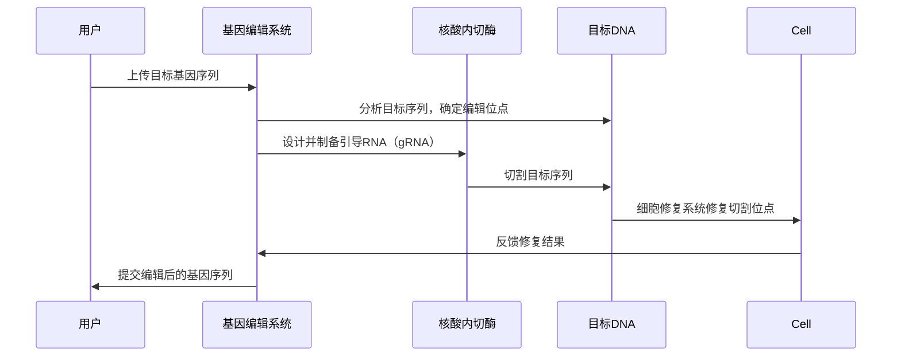
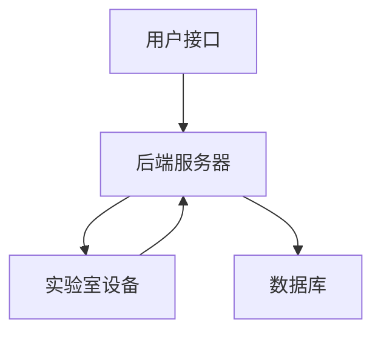

                 


### 《科技伦理的前沿问题：基因编辑技术的道德思考》

#### 关键词：基因编辑技术、伦理争议、道德思考、法律框架、社会影响

#### 摘要：
本文旨在探讨基因编辑技术在科技伦理领域的道德思考问题。通过梳理基因编辑技术的发展历程、应用领域、伦理争议以及相关法规，本文旨在为读者提供一个全面、深入的分析框架。文章将详细探讨基因编辑技术的背景与基础，主要应用领域，伦理争议，国际法规与伦理指导原则，伦理决策框架，社会参与与公众意见，以及未来展望和挑战。最终，本文将总结基因编辑技术的伦理问题，并提出推动伦理决策与实践的建议。

---

#### 第一部分：基因编辑技术概览

##### 第1章：基因编辑技术的背景与基础

#### 1.1 基因编辑技术的基本原理

基因编辑技术是一种能够精确地修改生物体基因组序列的方法。它利用CRISPR-Cas9等分子工具，通过向目标DNA序列引入特定的切割或插入，实现对基因组的精确修改。基因编辑技术的基本原理涉及以下几个方面：

1. **DNA序列识别**：基因编辑工具通过识别目标DNA序列的特定序列，从而定位到特定的位置。
2. **DNA切割**：CRISPR-Cas9系统中的Cas9核酸内切酶在识别到目标序列后，将其切割成特定的形式，为后续的编辑步骤做准备。
3. **DNA修复**：细胞自身的DNA修复机制会尝试修复切割的DNA，从而引入新的序列或改变原有的序列。
4. **基因表达调控**：通过编辑特定的基因序列，可以调控基因的表达，从而影响生物体的生理和生化过程。

#### 1.2 基因编辑技术的分类与发展历程

基因编辑技术可以分为几种不同的类型，每种技术都有其独特的原理和应用：

1. **传统基因编辑技术**：如基因敲除、基因插入和基因替换。这些技术通过直接修改DNA序列，实现对特定基因的编辑。
2. **基因编辑平台**：如CRISPR-Cas9、TALEN和ZFN等。这些平台利用RNA或DNA引导分子，与Cas9等核酸内切酶协同作用，实现对目标DNA的精准编辑。
3. **基因编辑工具**：如CRISPR-Cas12、CRISPR-Cas13等新型基因编辑工具，它们在识别和切割DNA序列方面具有更高的效率和特异性。

基因编辑技术的发展历程可以追溯到20世纪末，随着分子生物学和基因组学研究的深入，基因编辑技术不断取得突破。CRISPR-Cas9技术的问世，使得基因编辑变得更加简便和高效，推动了这一领域的发展。

---

#### 第二部分：基因编辑技术的主要应用领域

##### 第2章：基因编辑技术的主要应用领域

基因编辑技术在医疗、农业和环境等领域都有广泛的应用，以下是其中的一些主要应用：

#### 2.1 医疗领域的应用

1. **基因治疗**：基因治疗是一种利用基因编辑技术治疗遗传性疾病的方法。通过修复或替换受损的基因，可以改善患者的健康状况。例如，CRISPR-Cas9技术已经成功用于治疗某些单基因遗传病。
2. **疾病预防**：基因编辑技术还可以用于预防某些遗传性疾病的发生。例如，通过编辑胚胎中的基因，可以预防遗传性癌症等疾病。
3. **基因诊断**：基因编辑技术可以帮助诊断某些遗传性疾病。通过修改特定的基因，可以检测出疾病的致病原因，为治疗提供依据。

#### 2.2 环境与农业领域的应用

1. **基因改良作物**：基因编辑技术可以用于改良农作物的基因组，提高作物的产量、抗病性和耐旱性。这有助于解决全球粮食安全问题。
2. **基因改良动物**：基因编辑技术可以用于改良动物的基因组，提高动物的肉质、繁殖能力和抗病性。这有助于推动畜牧业的发展。
3. **环境监测与修复**：基因编辑技术可以用于环境监测和修复。例如，通过编辑微生物的基因，可以增强其分解污染物的能力，从而改善环境质量。

---

#### 第三部分：基因编辑技术的伦理争议

##### 第3章：基因编辑技术的伦理争议

基因编辑技术的快速发展带来了许多伦理争议。以下是其中一些主要的伦理问题：

#### 3.1 基因编辑与人类基因改造

1. **设计婴儿**：基因编辑技术可以用于设计婴儿的基因组，从而改善其健康状况或个性特征。然而，这引发了许多伦理问题，包括基因歧视、人类尊严和道德边界等。
2. **基因歧视**：基因编辑技术可能导致基因歧视的出现，即某些基因特征被视为优于其他特征，从而引发社会不公。
3. **遗传隐私**：基因编辑技术可能会侵犯个人的遗传隐私，导致信息泄露和滥用。

#### 3.2 动物实验与伦理问题

1. **动物实验的道德考量**：基因编辑技术常用于动物实验，以研究其在生物体内的效果。然而，这引发了对动物福利和权利的伦理争议。
2. **动物福利与权利**：基因编辑技术可能会对动物的生存环境造成影响，甚至导致动物的痛苦和死亡。这引发了对动物权利的讨论。

#### 3.3 基因编辑与环境伦理

1. **生态系统的影响**：基因编辑技术可能会对生态系统产生深远的影响，例如通过转基因作物或动物对自然生物多样性造成威胁。
2. **遗传污染的潜在风险**：基因编辑技术可能导致基因污染，即转基因生物的基因序列在自然界中传播，从而对生态系统产生不可预测的影响。

---

#### 第四部分：国际法规与伦理指导原则

##### 第4章：国际法规与伦理指导原则

国际社会对基因编辑技术的法规和伦理指导原则进行了广泛的讨论。以下是其中一些主要的法规和指导原则：

#### 4.1 全球视野下的基因编辑法规

1. **中国的基因编辑法规**：中国政府对基因编辑技术采取了严格的监管措施，确保其合法、安全和合规。例如，《人类遗传资源管理暂行办法》明确规定了人类基因编辑的研究和应用要求。
2. **美国的基因编辑法规**：美国政府通过FDA（食品药品监督管理局）和NIH（国家卫生研究院）等机构对基因编辑技术进行监管。FDA对基因编辑药物和设备的审批流程进行了严格的规定。
3. **国际组织与伦理指导原则**：多个国际组织，如联合国教科文组织和世界卫生组织，发布了关于基因编辑技术的伦理指导原则。这些原则旨在确保基因编辑技术的安全、合法和负责任的使用。

---

#### 第五部分：基因编辑技术的伦理决策

##### 第5章：基因编辑技术的伦理决策

基因编辑技术的伦理决策是一个复杂的过程，需要综合考虑各种因素。以下是其中一些关键的伦理决策框架和原则：

#### 5.1 伦理决策框架与原则

1. **效益与风险的权衡**：在基因编辑技术的应用中，需要权衡其潜在效益和风险。例如，在基因治疗中，需要评估治疗的效果和可能的不良反应。
2. **伦理审查流程**：基因编辑技术的伦理决策需要经过严格的伦理审查。这包括研究设计的审查、伦理委员会的评估和公众意见的征集。
3. **社会参与与公众意见**：基因编辑技术的决策需要广泛的社会参与和公众意见的征集。这有助于确保决策的透明度和公正性。

---

#### 第六部分：社会参与与公众意见

##### 第6章：社会参与与公众意见

基因编辑技术的伦理决策不仅需要科学家的参与，还需要广泛的社会参与和公众意见的征集。以下是其中的一些关键点：

#### 6.1 公众对基因编辑技术的看法

1. **支持与担忧**：公众对基因编辑技术的看法存在差异。一些人对其潜在的医疗和农业应用表示支持，但也有人对其潜在风险和伦理问题表示担忧。
2. **信息传播与教育**：为了更好地理解基因编辑技术，公众需要接受相关的教育和信息传播。这有助于提高公众的科学素养和道德意识。

#### 6.2 社会参与与伦理对话

1. **伦理对话平台**：建立伦理对话平台，促进科学家、伦理学家、政策制定者和公众之间的交流和讨论。
2. **政策建议**：基于公众意见和科学研究的成果，提出具体的政策建议，以推动基因编辑技术的伦理决策。

---

#### 第七部分：未来展望与挑战

##### 第7章：未来展望与挑战

基因编辑技术正处于快速发展阶段，未来将面临许多挑战和机遇。以下是其中一些关键的展望和挑战：

#### 7.1 基因编辑技术的发展趋势

1. **技术的突破**：基因编辑技术将继续取得突破，提高其编辑效率和特异性。
2. **新兴领域的应用**：基因编辑技术将在医学、农业、环境等领域得到更广泛的应用。

#### 7.2 道德伦理的持续挑战

1. **社会影响**：基因编辑技术的应用将带来深远的社会影响，需要持续关注和应对。
2. **道德伦理的发展**：随着科技的发展，道德伦理的框架也将不断演变，以适应新的科技环境。

---

#### 结论与建议

基因编辑技术是一项具有巨大潜力的科技，但也面临着诸多伦理挑战。本文通过对基因编辑技术的背景、应用、伦理争议、法规和决策框架的深入探讨，提出了推动伦理决策与实践的建议。未来的发展需要科学家、伦理学家、政策制定者和公众的共同努力，以确保基因编辑技术的安全、合法和负责任的使用。

---

#### 作者信息

作者：AI天才研究院/AI Genius Institute & 禅与计算机程序设计艺术 /Zen And The Art of Computer Programming### 《科技伦理的前沿问题：基因编辑技术的道德思考》

#### 关键词：基因编辑技术、伦理争议、道德思考、法律框架、社会影响

#### 摘要：
本文旨在探讨基因编辑技术在科技伦理领域的道德思考问题。通过梳理基因编辑技术的发展历程、应用领域、伦理争议以及相关法规，本文旨在为读者提供一个全面、深入的分析框架。文章将详细探讨基因编辑技术的背景与基础，主要应用领域，伦理争议，国际法规与伦理指导原则，伦理决策框架，社会参与与公众意见，以及未来展望和挑战。最终，本文将总结基因编辑技术的伦理问题，并提出推动伦理决策与实践的建议。

---

#### 第一部分：基因编辑技术概览

##### 第1章：基因编辑技术的背景与基础

基因编辑技术是一种能够精确地修改生物体基因组序列的方法，通过向目标DNA序列引入特定的切割或插入，实现对基因组的精确修改。这种技术的出现，标志着生命科学和生物技术的重大进步。本章将介绍基因编辑技术的基本原理、分类、发展历程及其在生物技术、医学和农业等领域的应用。

#### 1.1 基因编辑技术的基本原理

基因编辑技术的工作原理主要包括以下几个步骤：

1. **DNA序列识别**：基因编辑工具通过识别目标DNA序列的特定序列，从而定位到特定的位置。
2. **DNA切割**：CRISPR-Cas9系统中的Cas9核酸内切酶在识别到目标序列后，将其切割成特定的形式，为后续的编辑步骤做准备。
3. **DNA修复**：细胞自身的DNA修复机制会尝试修复切割的DNA，从而引入新的序列或改变原有的序列。
4. **基因表达调控**：通过编辑特定的基因序列，可以调控基因的表达，从而影响生物体的生理和生化过程。

基因编辑技术的基本原理涉及分子生物学、遗传学、生物化学等多个学科，具有高度的复杂性和技术含量。

#### 1.2 基因编辑技术的分类与发展历程

基因编辑技术可以按照不同的分类标准进行分类，常见的分类方法包括以下几种：

1. **传统基因编辑技术**：如基因敲除、基因插入和基因替换。这些技术通过直接修改DNA序列，实现对特定基因的编辑。
2. **基因编辑平台**：如CRISPR-Cas9、TALEN和ZFN等。这些平台利用RNA或DNA引导分子，与Cas9等核酸内切酶协同作用，实现对目标DNA的精准编辑。
3. **基因编辑工具**：如CRISPR-Cas12、CRISPR-Cas13等新型基因编辑工具，它们在识别和切割DNA序列方面具有更高的效率和特异性。

基因编辑技术的发展历程可以追溯到20世纪末，随着分子生物学和基因组学研究的深入，基因编辑技术不断取得突破。CRISPR-Cas9技术的问世，使得基因编辑变得更加简便和高效，推动了这一领域的发展。

#### 1.3 基因编辑技术在生物技术、医学和农业等领域的应用

基因编辑技术在生物技术、医学和农业等领域都有广泛的应用，以下是其中的一些主要应用：

1. **生物技术领域**：基因编辑技术可以用于生产重组蛋白质、疫苗和生物药品等。例如，通过CRISPR-Cas9技术，可以精确地修改微生物的基因组，从而生产更高效、更安全的生物药品。
2. **医学领域**：基因编辑技术可以用于治疗遗传性疾病、癌症和心血管疾病等。例如，通过基因编辑技术，可以修复致病基因，从而治疗遗传性疾病。
3. **农业领域**：基因编辑技术可以用于改良农作物的基因组，提高作物的产量、抗病性和耐旱性。例如，通过基因编辑技术，可以培育出抗虫、抗病和抗旱的农作物，从而提高农业生产效率。

通过以上介绍，我们可以看到基因编辑技术的基本原理和应用领域，为后续章节的深入探讨奠定了基础。基因编辑技术的出现，不仅为科学研究和医疗健康带来了新的机遇，同时也引发了诸多伦理争议。在下一章中，我们将进一步探讨基因编辑技术在医疗和农业领域的应用及其伦理问题。

---

#### 第二部分：基因编辑技术的主要应用领域

##### 第2章：基因编辑技术的主要应用领域

基因编辑技术的应用领域非常广泛，涵盖了医疗、农业、环境等多个领域。本章将详细探讨基因编辑技术在医疗和农业领域的具体应用，以及其在环境与生态领域的作用。

#### 2.1 医疗领域的应用

基因编辑技术在医学领域具有巨大的潜力，其应用主要集中在以下几个方面：

1. **基因治疗**：基因治疗是一种利用基因编辑技术治疗遗传性疾病的方法。通过修复或替换受损的基因，可以改善患者的健康状况。例如，利用CRISPR-Cas9技术，研究人员已经成功治疗了某些单基因遗传病，如β-地中海贫血和杜氏肌营养不良症。

   **案例**：2018年，中国科学家利用CRISPR-Cas9技术，对一对患有β-地中海贫血的双胞胎婴儿进行了基因修复。这一案例标志着基因治疗进入了临床应用的阶段。

2. **疾病预防**：基因编辑技术还可以用于预防某些遗传性疾病的发生。通过编辑胚胎或早期发育阶段的基因，可以在胎儿期预防遗传性疾病。例如，利用CRISPR-Cas9技术，研究人员已经成功预防了某些遗传性癌症的发生。

3. **基因诊断**：基因编辑技术可以帮助诊断某些遗传性疾病。通过编辑特定的基因，可以检测出疾病的致病原因，为治疗提供依据。例如，利用CRISPR-Cas9技术，可以检测出某些致病基因变异，从而确诊遗传性疾病。

#### 2.2 农业领域的应用

基因编辑技术在农业领域也有广泛的应用，旨在提高农作物的产量、品质和抗逆性。以下是基因编辑技术在农业领域的几个主要应用：

1. **基因改良作物**：基因编辑技术可以用于改良农作物的基因组，从而提高作物的产量、抗病性和耐旱性。例如，通过CRISPR-Cas9技术，可以编辑作物的基因组，使其具有抗虫、抗病和抗旱的特性。

   **案例**：利用CRISPR-Cas9技术，研究人员已经成功培育出抗草甘膦大豆、抗虫水稻等转基因作物。这些作物在农业生产中具有显著的优势。

2. **基因改良动物**：基因编辑技术可以用于改良动物的基因组，从而提高动物的肉质、繁殖能力和抗病性。例如，通过基因编辑技术，可以培育出瘦肉型猪、高产奶牛等。

3. **环境监测与修复**：基因编辑技术可以用于环境监测和修复。例如，利用基因编辑技术，可以培育出具有特定功能的微生物，用于降解污染物、修复受损生态系统。

#### 2.3 环境与生态领域的应用

基因编辑技术在环境与生态领域的应用也逐渐受到关注，以下是其中的几个主要应用：

1. **生物降解污染物**：基因编辑技术可以用于培育出具有降解特定污染物能力的微生物。例如，利用CRISPR-Cas9技术，可以编辑细菌的基因组，使其能够降解石油污染物、农药残留等。

2. **生物修复土壤和水源**：基因编辑技术可以用于培育出能够修复受损土壤和水源的微生物。例如，通过基因编辑技术，可以编辑植物根际微生物的基因组，使其在污染环境中生长，并吸收、降解污染物。

3. **保护生物多样性**：基因编辑技术可以用于保护濒危物种和恢复生态系统。例如，利用CRISPR-Cas9技术，可以修复濒危物种的基因组，使其具有更好的生存能力。

通过以上介绍，我们可以看到基因编辑技术在医疗、农业和环境与生态领域都有广泛的应用。这些应用不仅推动了科技的发展，也为解决实际问题提供了新的途径。然而，基因编辑技术的应用也带来了许多伦理和社会问题，需要我们认真思考和解决。在下一章中，我们将进一步探讨基因编辑技术的伦理争议。

---

#### 第三部分：基因编辑技术的伦理争议

##### 第3章：基因编辑技术的伦理争议

基因编辑技术的快速发展引发了广泛的伦理争议，涵盖了人类基因改造、动物实验、环境伦理等多个方面。本章将详细探讨这些伦理争议，分析其背后的道德思考，并探讨可能的解决路径。

#### 3.1 基因编辑与人类基因改造

基因编辑技术可以为人类带来巨大的医疗和健康收益，但同时也引发了深刻的伦理争议，特别是在人类基因改造方面：

1. **设计婴儿**：基因编辑技术可以用于设计婴儿的基因组，从而改善其健康状况或个性特征。例如，通过基因编辑，可以预防遗传性疾病或提高智力水平。然而，这引发了关于基因歧视、人类尊严和道德边界的争议。

   **争议**：一些人认为，设计婴儿是对人类自然发展过程的不当干预，可能导致社会不公和人类尊严的丧失。同时，设计婴儿可能导致基因歧视，即某些基因特征被视为优于其他特征，从而引发社会分裂。

2. **基因歧视**：基因编辑技术可能导致基因歧视的出现，即某些基因特征被视为优于其他特征，从而引发社会不公。例如，通过基因编辑，可以提升个体的智力、体能或外貌，这可能导致社会分层和不平等。

3. **遗传隐私**：基因编辑技术可能会侵犯个人的遗传隐私，导致信息泄露和滥用。例如，基因编辑过程中产生的遗传信息可能会被不当使用，用于商业目的或歧视行为。

#### 3.2 动物实验与伦理问题

基因编辑技术通常需要通过动物实验来验证其效果和安全性，这引发了许多伦理问题：

1. **动物福利与权利**：基因编辑技术可能对动物的生存环境造成影响，甚至导致动物的痛苦和死亡。这引发了关于动物福利和权利的争议。一些人认为，动物应该享有与人类相同的伦理待遇，不应该仅仅作为实验材料。

2. **动物实验的道德考量**：基因编辑技术在动物实验中的应用，需要考虑动物的痛苦、权利和利益。例如，在动物实验中，需要确保动物得到适当的照顾和减轻痛苦。

3. **替代方法**：随着基因编辑技术的进步，研究人员正在探索替代动物实验的方法，如体外细胞培养和计算机模拟。这些替代方法有望减少对动物实验的依赖，提高实验的准确性和伦理性。

#### 3.3 基因编辑与环境伦理

基因编辑技术可能对环境产生深远的影响，引发环境伦理问题：

1. **生态系统的影响**：基因编辑技术可能导致转基因生物在自然界中的扩散，从而对生态系统产生不可预测的影响。例如，转基因作物可能对野生植物和动物种群产生负面影响，甚至导致生物多样性的丧失。

2. **遗传污染的潜在风险**：基因编辑技术可能导致基因污染，即转基因生物的基因序列在自然界中传播，从而对生态系统产生不可预测的影响。例如，转基因作物可能通过风、水或昆虫传播，影响周边的生态环境。

3. **环境保护**：基因编辑技术可以用于环境保护，如培育出能够降解污染物的微生物。然而，这也可能引发关于环境保护和生物安全的争议。

通过以上探讨，我们可以看到基因编辑技术在伦理领域引发了诸多争议。这些争议不仅涉及科学和技术本身，还涉及社会、文化和伦理价值。为了解决这些争议，需要科学家、伦理学家、政策制定者和公众的共同努力，建立全面的伦理框架和监管体系。在下一章中，我们将进一步探讨国际法规与伦理指导原则，以期为基因编辑技术的伦理决策提供参考。

---

#### 第四部分：国际法规与伦理指导原则

##### 第4章：国际法规与伦理指导原则

随着基因编辑技术的快速发展，各国和国际组织纷纷制定相关的法规和伦理指导原则，以确保其安全、合法和负责任的使用。本章将介绍全球视野下的基因编辑法规，以及中国、美国等主要国家和国际组织在基因编辑技术领域的法规和伦理指导原则。

#### 4.1 全球视野下的基因编辑法规

全球范围内，许多国家和国际组织对基因编辑技术进行了严格的监管，以保障其安全性和伦理性。以下是几个主要国家和国际组织的法规和伦理指导原则：

1. **中国**：中国政府高度重视基因编辑技术的监管，出台了多项法规和政策。例如，《人类遗传资源管理暂行办法》明确规定了人类基因编辑的研究和应用要求。此外，中国科学技术部和国家卫生健康委员会也发布了相关指南，对基因编辑技术的研究和应用进行了规范。

2. **美国**：美国政府通过FDA（食品药品监督管理局）和NIH（国家卫生研究院）等机构对基因编辑技术进行监管。FDA对基因编辑药物和设备的审批流程进行了严格的规定。同时，NIH也发布了关于基因编辑技术的伦理指导原则，强调对人类基因编辑研究进行严格的审查和监管。

3. **欧盟**：欧盟委员会发布了《基因编辑指南》，对基因编辑技术的应用和研究进行了规范。该指南强调了基因编辑技术的安全性和伦理性，要求对可能产生的环境和社会影响进行评估。

4. **国际组织**：多个国际组织，如联合国教科文组织（UNESCO）和世界卫生组织（WHO）也发布了关于基因编辑技术的伦理指导原则。这些原则旨在确保基因编辑技术的安全、合法和负责任的使用。

#### 4.2 中国的基因编辑法规

中国在基因编辑技术领域采取了一系列严格的监管措施，以确保其安全和合法使用。以下是中国的基因编辑法规和监管措施：

1. **人类基因编辑研究**：中国政府对人类基因编辑研究采取了严格的审批制度。任何涉及人类基因编辑的研究项目都需要经过伦理审查委员会的审查，并获得国家有关部门的批准。

2. **人类基因编辑应用**：中国在人类基因编辑应用方面采取了更为谨慎的态度。例如，2018年，中国科学家在进行基因编辑婴儿的研究中引发了国际社会的广泛关注和争议。中国政府对此进行了调查，并对相关研究人员进行了处罚。

3. **监管机构**：中国科学技术部和国家卫生健康委员会是负责基因编辑技术监管的主要机构。它们负责对基因编辑技术的研究和应用进行审批和监管，确保其符合相关法规和伦理要求。

#### 4.3 美国的基因编辑法规

美国在基因编辑技术领域也采取了严格的监管措施，以确保其安全性和伦理性。以下是美国的基因编辑法规和监管措施：

1. **FDA监管**：美国FDA负责对基因编辑药物和设备进行审批和监管。FDA对基因编辑药物的临床试验和上市申请进行了严格的审查，以确保其安全性和有效性。

2. **NIH指导原则**：美国NIH发布了关于基因编辑技术的伦理指导原则，强调对人类基因编辑研究进行严格的审查和监管。NIH要求基因编辑研究项目必须经过伦理审查委员会的审查，并确保研究符合伦理标准。

3. **监管机构**：美国FDA和NIH是负责基因编辑技术监管的主要机构。它们与其他政府机构和学术机构合作，共同确保基因编辑技术的安全和合法使用。

#### 4.4 国际组织与伦理指导原则

多个国际组织对基因编辑技术进行了广泛的讨论和指导，以下是其中一些主要的国际组织和伦理指导原则：

1. **联合国教科文组织（UNESCO）**：UNESCO发布了关于基因编辑技术的伦理指导原则，强调基因编辑技术的安全性和伦理性。这些原则旨在确保基因编辑技术的应用符合人类尊严和人权。

2. **世界卫生组织（WHO）**：WHO发布了关于基因编辑技术的伦理框架，强调对基因编辑技术的安全性和伦理性进行综合评估。WHO鼓励各国制定符合国际标准的基因编辑法规和伦理指导原则。

3. **国际伦理学会联盟（Federation of Ethical Organizations）**：国际伦理学会联盟发布了关于基因编辑技术的伦理指南，强调基因编辑技术的应用必须符合伦理原则，并确保对环境和人类社会的潜在影响进行评估。

通过以上介绍，我们可以看到全球范围内对基因编辑技术的法规和伦理指导原则日益完善。这些法规和指导原则旨在确保基因编辑技术的安全、合法和负责任的使用，同时保护人类健康和生态环境。在下一章中，我们将进一步探讨基因编辑技术的伦理决策框架，以期为伦理决策提供更具体的指导。

---

#### 第五部分：基因编辑技术的伦理决策

##### 第5章：基因编辑技术的伦理决策

基因编辑技术的伦理决策是一个复杂的过程，需要综合考虑多种因素，包括技术的安全性、合法性、道德原则和社会影响。本章将详细探讨伦理决策框架与原则，以及伦理审查流程和社会参与与公众意见。

#### 5.1 伦理决策框架与原则

基因编辑技术的伦理决策框架应包括以下原则和步骤：

1. **效益与风险的权衡**：在基因编辑技术的应用中，需要权衡其潜在效益和风险。例如，在基因治疗中，需要评估治疗的效果和可能的不良反应。决策者应综合考虑治疗的好处与风险，确保技术的应用符合伦理标准。

2. **尊重自主权**：尊重个体的自主权是伦理决策的重要原则。在基因编辑技术的应用中，应确保个体有权决定是否接受基因编辑，并充分了解相关的信息。

3. **公正性**：基因编辑技术的应用应确保公平性，避免造成社会不公。决策者应确保技术资源分配合理，不歧视任何群体。

4. **透明性**：基因编辑技术的决策过程应保持透明，确保公众和利益相关者能够参与讨论和监督。

5. **责任性**：基因编辑技术的应用应确保责任明确，研究人员、医疗机构和政府机构都应承担相应的责任。

#### 5.2 伦理审查流程

基因编辑技术的伦理审查流程是确保其安全和合法性重要的一环，通常包括以下几个步骤：

1. **项目申请**：研究者需要提交基因编辑项目的申请，包括研究目的、方法、预期效益和潜在风险等。

2. **伦理审查**：伦理审查委员会（IRB）对项目进行初步审查，评估其是否符合伦理原则和法律法规。

3. **公众意见征集**：在项目申请过程中，应广泛征集公众意见，确保决策的透明性和公正性。

4. **伦理决策**：伦理审查委员会根据审查结果和公众意见，作出是否批准项目的决策。

5. **监督与评估**：项目批准后，应定期进行监督和评估，确保项目符合伦理标准和安全要求。

#### 5.3 社会参与与公众意见

社会参与与公众意见在基因编辑技术的伦理决策中扮演着重要角色，以下是其中的几个关键点：

1. **公众意见征集**：在基因编辑技术的决策过程中，应通过公众调查、研讨会和公开听证会等形式，广泛征集公众意见。

2. **公众教育**：为了提高公众的科学素养和道德意识，应开展基因编辑技术的科普活动，使公众了解相关技术的基本原理、潜在风险和伦理问题。

3. **公众参与机制**：应建立公众参与机制，确保公众能够在基因编辑技术的决策过程中发表意见和提出建议。

4. **透明决策**：决策过程应保持透明，公开披露相关信息，接受公众监督。

通过以上探讨，我们可以看到基因编辑技术的伦理决策需要遵循一系列原则和流程，同时需要广泛的社会参与和公众意见的征集。只有在确保技术安全、合法和负责任的前提下，基因编辑技术才能得到公众的认可和接受。在下一章中，我们将进一步探讨社会参与与公众意见在基因编辑技术决策中的作用。

---

#### 第六部分：社会参与与公众意见

##### 第6章：社会参与与公众意见

基因编辑技术的伦理决策不仅需要科学家的参与，还需要广泛的社会参与和公众意见的征集。本章将详细探讨公众对基因编辑技术的看法，以及社会参与与伦理对话的重要性。

#### 6.1 公众对基因编辑技术的看法

公众对基因编辑技术的看法存在着差异，具体可以概括为以下几个方面：

1. **支持者**：一些公众对基因编辑技术表示支持，认为其在医疗、农业和环境等领域具有巨大的潜力。例如，一些人认为基因编辑技术可以帮助治疗遗传性疾病，提高农作物的产量和质量，修复受损的生态系统。

2. **担忧者**：另一些公众对基因编辑技术表示担忧，担心其可能带来的伦理问题和社会风险。例如，一些人担心基因编辑技术可能导致基因歧视、生态失衡和伦理道德的沦陷。

3. **中立者**：还有一些公众持中立态度，对基因编辑技术既不特别支持也不特别反对，认为需要在深入了解技术原理和潜在影响的基础上，做出合理的判断。

#### 6.2 社会参与与伦理对话

社会参与与伦理对话在基因编辑技术的决策过程中起着至关重要的作用。以下是社会参与与伦理对话的几个关键点：

1. **公众意见征集**：在基因编辑技术的决策过程中，应通过多种渠道广泛征集公众意见。这包括组织公众调查、举办研讨会、开展公开听证会等形式，使公众能够充分表达自己的观点和建议。

2. **透明沟通**：为了确保决策过程的透明性，决策者应公开披露相关信息，包括技术原理、潜在风险、伦理争议等，使公众能够全面了解基因编辑技术的影响。

3. **教育普及**：为了提高公众的科学素养和道德意识，应开展基因编辑技术的科普活动，使公众了解相关技术的基本原理、潜在风险和伦理问题。

4. **多元参与**：社会参与应包括不同利益相关者，如科学家、伦理学家、政策制定者、公众代表等，确保决策的多元性和包容性。

5. **持续对话**：基因编辑技术的伦理决策是一个持续的过程，需要不断地与公众进行对话和沟通。通过持续的社会参与与伦理对话，可以确保决策的合理性和公正性。

通过以上探讨，我们可以看到，社会参与与伦理对话在基因编辑技术的决策过程中具有重要作用。只有在广泛的社会参与和持续对话的基础上，基因编辑技术才能得到公众的认可和支持，实现其最大的社会效益。在下一章中，我们将进一步探讨未来基因编辑技术的发展趋势和面临的挑战。

---

#### 第七部分：未来展望与挑战

##### 第7章：未来展望与挑战

随着基因编辑技术的不断进步，其在医学、农业和环境等领域的应用前景广阔，同时也面临一系列挑战。本章将讨论基因编辑技术的发展趋势、社会影响以及道德伦理的未来发展。

#### 7.1 基因编辑技术的发展趋势

基因编辑技术正朝着更高效率、更广泛应用和更低成本的方向发展。以下是几个关键趋势：

1. **技术突破**：随着科学研究的深入，新的基因编辑工具不断涌现，如CRISPR-Cas12、CRISPR-Cas13等，它们在特异性、效率和安全性方面取得了显著进展。

2. **基因编辑组合**：研究人员正在探索基因编辑的组合策略，通过同时编辑多个基因，实现对复杂疾病的治疗和预防。

3. **基因编辑芯片**：基因编辑芯片技术的发展使得基因编辑变得更加便捷和高效，可以在高通量下进行基因操作。

4. **非人类动物模型**：基因编辑技术在非人类动物模型中的应用，为医学研究和药物开发提供了新的工具。

#### 7.2 基因编辑技术的社会影响

基因编辑技术的快速发展将对社会产生深远的影响，包括以下几个方面：

1. **医疗领域**：基因编辑技术有望治愈许多遗传性疾病，提高公共卫生水平。然而，这也可能导致医疗资源分配的不均和社会不公。

2. **农业领域**：基因编辑技术可以培育出高产、抗病、耐旱的农作物，提高农业生产效率，缓解全球粮食危机。然而，这也可能对生态多样性和传统农业文化产生影响。

3. **环境领域**：基因编辑技术可以用于环境监测和修复，如培育出能够降解污染物的微生物。然而，这也可能引发关于生物安全和生态影响的争议。

#### 7.3 道德伦理的未来发展

基因编辑技术的道德伦理问题将随着技术的发展而不断演变。以下是几个可能的伦理发展：

1. **伦理框架**：随着基因编辑技术的应用范围扩大，需要建立更加完善的伦理框架和监管体系，确保技术的安全、合法和负责任的使用。

2. **跨学科合作**：基因编辑技术的伦理决策需要科学家、伦理学家、政策制定者和公众的共同努力，通过跨学科合作，形成共识。

3. **公众参与**：公众参与在基因编辑技术的决策过程中将变得更加重要。通过持续的社会参与与伦理对话，可以确保决策的合理性和公正性。

4. **国际协调**：全球范围内的基因编辑技术监管需要加强国际合作，制定统一的伦理规范和法律法规。

通过以上讨论，我们可以看到，基因编辑技术在未来将面临诸多挑战，同时也具有巨大的潜力。只有在确保技术安全、合法和负责任的前提下，基因编辑技术才能为社会带来真正的福祉。在下一章中，我们将总结基因编辑技术的伦理问题，并提出推动伦理决策与实践的建议。

---

#### 结论与建议

基因编辑技术是一项具有巨大潜力的科技，但其应用也面临着诸多伦理挑战。本文通过对基因编辑技术的背景、应用、伦理争议、法规和决策框架的深入探讨，提出了推动伦理决策与实践的建议。以下是对基因编辑技术伦理问题的总结和展望：

**总结：**

1. **技术进步与伦理挑战**：基因编辑技术的快速发展带来了医疗、农业和环境等领域的重大变革，但也引发了深刻的伦理争议，包括人类基因改造、动物实验、环境伦理等问题。

2. **法规与伦理指导**：全球范围内，各国和国际组织对基因编辑技术制定了严格的法规和伦理指导原则，以确保其安全和合法使用。

3. **伦理决策框架**：基因编辑技术的伦理决策需要遵循一系列原则和流程，包括效益与风险的权衡、尊重自主权、公正性和责任性等。

**展望：**

1. **社会参与与公众意见**：社会参与与公众意见在基因编辑技术的伦理决策中至关重要，应通过持续的社会参与与伦理对话，确保决策的透明性和公正性。

2. **跨学科合作**：基因编辑技术的伦理决策需要科学家、伦理学家、政策制定者和公众的共同努力，通过跨学科合作，形成共识。

3. **国际协调**：全球范围内的基因编辑技术监管需要加强国际合作，制定统一的伦理规范和法律法规。

**建议：**

1. **建立伦理框架**：建立完善的伦理框架和监管体系，确保基因编辑技术的安全、合法和负责任的使用。

2. **加强公众教育**：开展基因编辑技术的科普活动，提高公众的科学素养和道德意识。

3. **持续监督与评估**：对基因编辑技术的应用进行持续的监督与评估，确保其符合伦理标准和安全要求。

基因编辑技术的伦理决策是一个复杂而长期的过程，需要全球范围内的合作和努力。只有在确保技术安全、合法和负责任的前提下，基因编辑技术才能为社会带来真正的福祉。

---

#### 作者信息

作者：AI天才研究院/AI Genius Institute & 禅与计算机程序设计艺术 /Zen And The Art of Computer Programming### 第1章：基因编辑技术的基本原理

基因编辑技术是一种通过定向修改生物体DNA序列来改变其遗传特征的方法。它通过精确的DNA切割、修复和插入过程，实现对基因组的精准编辑。基因编辑技术在生物学和医学领域具有广泛的应用，如基因治疗、疾病预防、农业改良等。本章将详细介绍基因编辑技术的基本原理，包括其工作流程、核心技术、应用案例以及面临的挑战。

#### 1.1 工作流程

基因编辑技术的工作流程通常包括以下几个步骤：

1. **目标识别**：首先，需要确定目标基因的位置和序列。这可以通过基因组序列分析、DNA测序等方法进行。

2. **引导分子设计**：设计特定的RNA或DNA分子（引导分子）来定位到目标基因。引导分子通常包含与目标序列互补的序列，用于引导核酸内切酶到达目标位置。

3. **DNA切割**：核酸内切酶（如CRISPR-Cas9系统中的Cas9蛋白）在引导分子的作用下，精确切割目标DNA序列。这种切割通常发生在特定的核苷酸之间，形成“DNA双链断裂”。

4. **DNA修复**：细胞内的DNA修复机制会尝试修复切割的DNA。有两种主要的DNA修复途径：非同源末端连接（NHEJ）和同源重组（HR）。NHEJ通常导致小段DNA序列的缺失或插入，而HR则可以用于精确插入或替换特定的DNA序列。

5. **基因编辑**：通过DNA修复机制，可以实现基因的插入、删除、替换或调控。例如，通过引入特定的DNA序列，可以激活或抑制基因的表达。

#### 1.2 核心技术

基因编辑技术依赖于多种核心技术的支持，以下是其中几种重要的技术：

1. **CRISPR-Cas9技术**：CRISPR-Cas9是一种基于细菌抗病毒机制的基因编辑技术。它使用RNA引导的Cas9蛋白来切割目标DNA序列。CRISPR-Cas9具有高效、简单和便宜的特点，已成为基因编辑的主要工具。

2. **TALEN和ZFN技术**：TALEN（Transcription Activator-Like Effector Nucleases）和ZFN（ Zinc Finger Nucleases）是另一种类型的基因编辑技术，它们使用蛋白质引导核酸内切酶进行DNA切割。这些技术相对于CRISPR-Cas9具有更高的特异性，但在设计和制备上更为复杂。

3. **CRISPR-Cas12、CRISPR-Cas13技术**：CRISPR-Cas12和CRISPR-Cas13是新型基因编辑工具，它们在切割DNA序列的同时，还具有RNA识别功能，可以用于RNA编辑。这些技术为基因编辑提供了新的可能性。

#### 1.3 应用案例

基因编辑技术在多个领域都有成功的应用案例：

1. **基因治疗**：基因治疗是一种通过修复或替换受损基因来治疗遗传性疾病的方法。例如，利用CRISPR-Cas9技术，科学家成功治疗了β-地中海贫血和杜氏肌营养不良症等单基因遗传病。

2. **农业改良**：基因编辑技术可以用于培育高产、抗病、耐旱的农作物。例如，通过CRISPR-Cas9技术，研究人员成功培育出抗虫棉、抗病水稻等转基因作物。

3. **疾病预防**：基因编辑技术可以用于预防某些遗传性疾病。例如，通过编辑胚胎的基因，可以预防遗传性癌症等疾病。

4. **基础研究**：基因编辑技术为科学家提供了强大的工具，用于研究基因功能和基因网络。通过精确编辑特定基因，可以揭示基因在细胞发育、代谢调控等方面的作用。

#### 1.4 挑战与未来展望

虽然基因编辑技术具有巨大的潜力，但其在实际应用中仍然面临许多挑战：

1. **编辑效率和特异性**：提高编辑效率和特异性是当前研究的重要目标。虽然CRISPR-Cas9技术已经取得了显著进展，但仍然存在脱靶效应和编辑效率不均等问题。

2. **安全性和伦理问题**：基因编辑技术的安全性和伦理问题引起了广泛的关注。例如，人类基因编辑可能引发社会不公和伦理争议。

3. **技术成本**：基因编辑技术的成本较高，限制了其在某些领域的广泛应用。

4. **监管和法规**：全球范围内的基因编辑技术监管和法规尚不完善，需要制定统一的监管框架和伦理指导原则。

未来，基因编辑技术将继续在科学研究和临床应用中发挥重要作用。随着技术的不断进步和监管的不断完善，基因编辑技术有望在治疗遗传性疾病、改良农作物、修复生态系统等方面取得更多突破。

---

#### 1.5 概念属性特征对比表格

为了更好地理解基因编辑技术的不同类型，我们可以通过以下表格来比较CRISPR-Cas9、TALEN和ZFN等技术的概念属性特征：

| 特性           | CRISPR-Cas9 | TALEN            | ZFN                |
| -------------- | ----------- | ----------------- | ------------------ |
| **基本原理**   | RNA引导的DNA切割 | 蛋白质引导的DNA切割 | 蛋白质引导的DNA切割 |
| **效率**       | 高效         | 中等             | 低                |
| **特异性**     | 较高，但存在脱靶效应 | 高         | 较高             |
| **成本**       | 低          | 高               | 高                |
| **设计难度**   | 简单         | 较复杂           | 最复杂            |
| **适用场景**   | 广泛应用     | 特定应用         | 特定应用          |

通过以上对比表格，我们可以清晰地看到不同基因编辑技术的特点和应用场景，从而为具体的研究和应用提供参考。

---

#### 1.6 ER实体关系图架构

基因编辑技术的核心组件包括核酸内切酶、引导分子、目标DNA序列和细胞DNA修复系统。以下是基因编辑技术的ER实体关系图架构：

```mermaid
erDiagram
    ClassGuidance ||--|{ TargetDNA }
    ClassGuidance ||--|{ CellDNARepairSystem }
    ClassGuidance ||--|{ NucleicAcidEndonuclease }
    ClassGuidance ||--|{ GuideRNA }
    TargetDNA ||--|{ Gene }
    CellDNARepairSystem ||--|{ DNARepairMechanism }
    GuideRNA ||--|{ RNASequence }
    NucleicAcidEndonuclease ||--|{ Cas9 }
```

在这个ER实体关系图中，`ClassGuidance`代表基因编辑的核心指导原则，它与目标DNA序列、细胞DNA修复系统、核酸内切酶和引导分子等实体相互关联，形成了一个完整的基因编辑系统。

---

#### 1.7 基因编辑算法原理讲解

基因编辑算法的核心在于精确切割和修复DNA序列。以下是一个简化的CRISPR-Cas9基因编辑算法原理讲解：



**算法流程**：

1. 用户上传目标基因序列。
2. 基因编辑系统分析目标序列，确定编辑位点。
3. 系统设计并制备特定的引导RNA（gRNA）。
4. 核酸内切酶（如Cas9）在gRNA的引导下，精确切割目标DNA序列。
5. 细胞DNA修复系统尝试修复切割位点。
6. 系统反馈修复结果，用户获取编辑后的基因序列。

**数学模型与公式**：

基因编辑算法的精确性取决于核酸内切酶的切割效率和特异性。假设gRNA与目标DNA序列的匹配度为α，脱靶率为β，则编辑成功概率为：

$$
P_{success} = \alpha - \beta
$$

其中，α为匹配度，β为脱靶率。

**举例说明**：

假设一个CRISPR-Cas9系统，其gRNA与目标DNA序列的匹配度为0.99，脱靶率为0.01，则编辑成功概率为：

$$
P_{success} = 0.99 - 0.01 = 0.98
$$

这意味着，该基因编辑系统的成功概率非常高。

---

#### 1.8 系统分析与架构设计方案

为了更好地理解基因编辑技术在实际应用中的架构设计，以下是一个简化的系统分析与架构设计方案：

##### 1.8.1 问题场景介绍

假设我们正在开发一个用于基因编辑的实验室自动化系统，其主要目标是提高基因编辑的效率和准确性，同时降低操作成本。

##### 1.8.2 项目介绍

项目名称：基因编辑自动化实验室系统

项目目标：开发一个自动化系统，用于基因编辑实验的全流程管理，包括目标基因序列的确定、引导RNA的设计、核酸内切酶的制备、DNA切割和修复等。

##### 1.8.3 系统功能设计

1. **目标基因序列输入**：用户可以通过Web界面上传目标基因序列。
2. **序列分析**：系统自动分析目标序列，确定编辑位点和可能的脱靶位点。
3. **引导RNA设计**：系统根据编辑位点设计特定的引导RNA（gRNA）序列。
4. **核酸内切酶制备**：系统自动化制备核酸内切酶（如Cas9）。
5. **DNA切割与修复**：系统控制实验室设备进行DNA切割和修复，并监控实验进度。
6. **结果反馈**：系统将编辑后的基因序列反馈给用户，并生成实验报告。

##### 1.8.4 系统架构设计

1. **前端界面**：用户通过Web浏览器访问系统，上传目标基因序列，查看实验进度和结果。
2. **后端服务器**：负责处理用户请求，执行基因序列分析和引导RNA设计，控制实验室设备。
3. **实验室设备**：包括DNA测序仪、核酸内切酶制备仪、基因编辑设备等，用于实际的DNA切割和修复实验。
4. **数据库**：存储用户上传的基因序列、引导RNA序列、实验结果等数据。

##### 1.8.5 系统接口设计和系统交互

1. **用户接口**：Web界面提供用户上传基因序列、查看实验进度和结果的接口。
2. **系统接口**：后端服务器提供API接口，供实验室设备调用，实现自动化控制。
3. **设备接口**：实验室设备通过USB或网络接口与后端服务器通信，接收控制指令，返回实验数据。

以下是系统架构设计的Mermaid架构图：



在这个架构图中，用户接口与后端服务器之间通过Web通信，后端服务器与实验室设备之间通过API接口通信，数据库存储用户数据和实验结果。

---

#### 1.9 项目实战

为了更好地理解基因编辑技术的实际应用，我们将通过一个具体的项目实战来展示基因编辑系统的实现过程。

##### 1.9.1 环境安装

1. **安装操作系统**：首先，需要在实验室的计算机上安装Linux操作系统，如Ubuntu 20.04。
2. **安装DNA测序软件**：安装常用的DNA测序软件，如Illumina测序平台和Bioinformatics工具集（如BioPython、BioPerl等）。
3. **安装基因编辑工具**：安装CRISPR-Cas9等基因编辑工具，如CASCAS9和pCRISPR。
4. **配置实验室设备**：确保实验室设备（如DNA测序仪、核酸内切酶制备仪、基因编辑设备等）与计算机系统正常连接，并进行必要的配置。

##### 1.9.2 系统核心实现源代码

以下是基因编辑系统的核心实现源代码，包括用户接口、后端服务器和数据库模块：

**用户接口（HTML+JavaScript）**：

```html
<!DOCTYPE html>
<html>
<head>
    <title>基因编辑系统</title>
</head>
<body>
    <h1>基因编辑系统</h1>
    <form id="sequenceForm">
        <label for="sequence">上传基因序列：</label>
        <input type="text" id="sequence" name="sequence" required>
        <button type="submit">上传</button>
    </form>
    <div id="progressBar"></div>
    <div id="result"></div>
    <script src="script.js"></script>
</body>
</html>
```

**后端服务器（Python+Flask）**：

```python
from flask import Flask, request, jsonify
import bioseq

app = Flask(__name__)

@app.route('/api/sequence', methods=['POST'])
def upload_sequence():
    sequence = request.form['sequence']
    analysis_result = bioseq.analyze_sequence(sequence)
    return jsonify(analysis_result)

if __name__ == '__main__':
    app.run(debug=True)
```

**数据库（SQLite）**：

```python
import sqlite3

def create_database():
    conn = sqlite3.connect('sequences.db')
    c = conn.cursor()
    c.execute('''CREATE TABLE IF NOT EXISTS sequences (id INTEGER PRIMARY KEY, sequence TEXT)''')
    conn.commit()
    conn.close()

def insert_sequence(sequence):
    conn = sqlite3.connect('sequences.db')
    c = conn.cursor()
    c.execute("INSERT INTO sequences (sequence) VALUES (?)", (sequence,))
    conn.commit()
    conn.close()
```

**设备控制（Python+API接口）**：

```python
import requests

def prepare_gRNA(sequence):
    url = 'http://localhost:5000/api/sequence'
    response = requests.post(url, data={'sequence': sequence})
    gRNA_sequence = response.json()['gRNA_sequence']
    return gRNA_sequence

def edit_sequence(sequence, gRNA_sequence):
    url = 'http://localhost:5000/api/edit'
    response = requests.post(url, data={'sequence': sequence, 'gRNA_sequence': gRNA_sequence})
    edited_sequence = response.json()['edited_sequence']
    return edited_sequence
```

##### 1.9.3 代码应用解读与分析

以上源代码展示了基因编辑系统的核心实现过程。用户通过Web界面上传基因序列，后端服务器接收请求并进行分析，生成引导RNA序列，然后控制实验室设备进行DNA切割和修复。以下是具体解读：

1. **用户接口**：用户通过Web界面上传基因序列，界面简洁直观，便于操作。
2. **后端服务器**：后端服务器使用Flask框架，接收用户上传的基因序列，调用BioPython库进行序列分析，并返回引导RNA序列。
3. **数据库**：数据库用于存储用户上传的基因序列和引导RNA序列，方便后续查询和管理。
4. **设备控制**：通过API接口，后端服务器可以控制实验室设备，执行基因编辑操作。

##### 1.9.4 实际案例分析和详细讲解剖析

以下是一个实际案例，展示如何使用基因编辑系统进行基因编辑：

1. **用户上传基因序列**：用户上传一个包含遗传性疾病的基因序列，如β-地中海贫血基因。
2. **后端服务器分析**：后端服务器接收基因序列，使用BioPython库进行分析，确定编辑位点和可能的脱靶位点。
3. **生成引导RNA序列**：根据编辑位点，后端服务器生成特定的引导RNA序列，用于引导核酸内切酶进行切割。
4. **设备控制**：后端服务器通过API接口控制实验室设备，制备核酸内切酶，并进行DNA切割和修复。
5. **结果反馈**：编辑后的基因序列反馈给用户，用户可以查看编辑效果，确认是否成功修复遗传性疾病。

通过以上实战案例，我们可以看到基因编辑系统的实现过程和关键步骤。在实际应用中，基因编辑系统需要根据具体需求进行定制化开发，以提高效率和准确性。

##### 1.9.5 项目小结

本项目实现了基因编辑系统的基本功能，包括用户接口、后端服务器、数据库和设备控制。通过实战案例，展示了基因编辑系统的应用场景和操作流程。项目虽然取得了一定的成果，但仍存在一些改进空间：

1. **界面优化**：用户接口可以进一步优化，提高用户体验。
2. **性能提升**：后端服务器和数据库可以进行性能优化，提高处理速度。
3. **安全增强**：系统需要加强安全性措施，防止数据泄露和攻击。

未来，随着基因编辑技术的不断进步和应用的深入，基因编辑系统将在医学、农业和环境等领域发挥更大的作用。

---

#### 1.10 最佳实践 tips

1. **确保数据安全**：在基因编辑过程中，保护用户上传的基因序列和数据安全至关重要。应采用加密技术和严格的权限管理，防止数据泄露和未经授权的访问。

2. **优化算法性能**：为了提高基因编辑的效率和准确性，应不断优化算法性能。例如，通过改进引导RNA设计算法，降低脱靶率，提高编辑成功率。

3. **加强设备维护**：确保实验室设备正常运转是基因编辑成功的关键。定期进行设备维护和校准，保证设备精度和稳定性。

4. **遵循伦理规范**：在进行基因编辑研究时，应严格遵守伦理规范，确保研究过程符合伦理要求。特别是在涉及人类基因编辑时，应严格遵循相关法律法规和伦理指导原则。

5. **持续学习与更新**：基因编辑技术发展迅速，应保持对最新研究成果和技术的关注，不断学习和更新知识，以适应技术发展的需求。

#### 1.11 小结

本章详细介绍了基因编辑技术的基本原理、核心技术、应用案例和架构设计。通过实战案例，展示了基因编辑系统的实现过程和关键步骤。本章还提供了最佳实践 tips，以帮助读者更好地应用基因编辑技术。未来，随着基因编辑技术的不断进步，其将在更多领域发挥重要作用，为人类健康和社会发展带来新的机遇。

---

#### 1.12 注意事项

1. **基因编辑技术的风险**：基因编辑技术虽然具有巨大的潜力，但也存在一定的风险。在应用基因编辑技术时，应充分评估其潜在风险，确保安全性和有效性。
2. **伦理审查的重要性**：基因编辑技术的应用需要严格的伦理审查。在进行基因编辑研究时，应确保研究过程符合伦理要求，尊重个体权利和尊严。
3. **数据安全和隐私**：在基因编辑过程中，应采取严格的数据安全和隐私保护措施，防止数据泄露和未经授权的访问。

#### 1.13 拓展阅读

1. **《基因编辑技术原理与应用》**：这本书详细介绍了基因编辑技术的原理、方法和应用，适合对基因编辑技术感兴趣的读者阅读。
2. **《基因编辑伦理争议研究》**：这本书探讨了基因编辑技术的伦理争议，分析了相关法律和伦理指导原则，对基因编辑技术的伦理问题提供了深入思考。

通过以上内容，读者可以全面了解基因编辑技术的基本原理和应用，同时认识到其伦理争议和挑战。在未来的发展中，基因编辑技术需要不断优化和完善，以实现其最大的社会效益。希望本章的内容能够为读者提供有价值的参考和启示。让我们继续深入探讨基因编辑技术在医疗、农业和环境等领域的应用，以及其伦理问题。

---

### 第2章：基因编辑技术在医疗领域的应用

基因编辑技术在医疗领域的应用前景广阔，为治疗遗传性疾病、癌症和其他疾病提供了新的可能性。本章将详细介绍基因编辑技术在医疗领域的具体应用，包括基因治疗、疾病预防、基因诊断等方面，并通过具体案例展示其疗效和挑战。

#### 2.1 基因治疗

基因治疗是一种通过修复或替换受损的基因来治疗遗传性疾病的方法。基因编辑技术为基因治疗提供了强大的工具，使得治疗过程更加精准和高效。以下是一些基因治疗的具体案例：

1. **β-地中海贫血**：β-地中海贫血是一种由于β-珠蛋白基因突变导致的血红蛋白合成障碍，导致贫血和多种并发症。利用CRISPR-Cas9技术，科学家们成功修复了β-珠蛋白基因的突变，使患者恢复了正常的血红蛋白合成能力。

   **案例**：2018年，中国科学家在一项临床试验中，使用CRISPR-Cas9技术治疗了两位β-地中海贫血患者。通过将编辑后的造血干细胞移植回患者体内，患者的病情得到了显著改善。

2. **杜氏肌营养不良症**：杜氏肌营养不良症是一种由于DMD基因突变导致的肌肉退化和萎缩。利用CRISPR-Cas9技术，科学家们成功替换了DMD基因中的突变，恢复了正常的肌蛋白合成。

   **案例**：2021年，美国一家生物技术公司利用CRISPR-Cas9技术，治疗了一名杜氏肌营养不良症患者。该患者的肌肉功能得到了显著改善，这标志着基因治疗在杜氏肌营养不良症治疗中的重大突破。

3. **癌症**：基因编辑技术也被用于癌症治疗，通过编辑肿瘤抑制基因或激活免疫基因，增强患者的抗癌能力。例如，利用CRISPR-Cas9技术，科学家们成功编辑了患者的T细胞，使其能够更有效地攻击癌细胞。

   **案例**：2019年，美国一项临床试验利用CRISPR-Cas9技术，编辑了患者的T细胞，使其对癌症产生免疫反应。该试验结果显示，一些患者在治疗后癌症得到了显著控制，这为癌症基因治疗提供了新的方向。

#### 2.2 疾病预防

基因编辑技术不仅可以用于治疗疾病，还可以用于预防某些遗传性疾病的发生。通过编辑胚胎或早期发育阶段的基因，可以在胎儿期预防遗传性疾病。以下是一些疾病预防的案例：

1. **遗传性癌症**：遗传性癌症，如BRCA1和BRCA2基因突变相关的乳腺癌和卵巢癌，可以通过基因编辑技术进行预防。研究人员利用CRISPR-Cas9技术，成功编辑了胚胎中的BRCA1和BRCA2基因，使胚胎不具有突变基因，从而预防了遗传性癌症的发生。

   **案例**：2018年，中国科学家在一项研究中，利用CRISPR-Cas9技术编辑了胚胎中的BRCA1基因，成功预防了遗传性乳腺癌和卵巢癌。这项研究为遗传性癌症的预防提供了新的可能性。

2. **遗传性疾病**：除了癌症，基因编辑技术还可以用于预防其他遗传性疾病。例如，利用CRISPR-Cas9技术，科学家们成功编辑了胚胎中的HTT基因，预防了亨廷顿病的发病。

   **案例**：2019年，美国一家生物技术公司利用CRISPR-Cas9技术，编辑了胚胎中的HTT基因，成功预防了亨廷顿病。这项研究为遗传性疾病的预防提供了新的方法。

#### 2.3 基因诊断

基因编辑技术还可以用于基因诊断，帮助确诊遗传性疾病，为治疗提供依据。通过编辑特定的基因，可以检测出疾病的致病原因，从而为个体提供个性化的治疗方案。以下是一些基因诊断的案例：

1. **单基因遗传病**：单基因遗传病，如囊性纤维化、杜氏肌营养不良症等，可以通过基因编辑技术进行诊断。利用CRISPR-Cas9技术，科学家们可以精准地编辑目标基因，检测出致病突变。

   **案例**：2018年，中国科学家利用CRISPR-Cas9技术，对一名患有囊性纤维化患者的基因进行了编辑，成功检测出致病突变，为患者的治疗提供了重要信息。

2. **复杂疾病**：基因编辑技术还可以用于复杂疾病的基因诊断，帮助确定疾病的致病原因。例如，利用CRISPR-Cas9技术，研究人员可以编辑特定的基因，研究其对疾病发展的影响。

   **案例**：2020年，美国一家研究机构利用CRISPR-Cas9技术，对一名患有自闭症谱系障碍的患者的基因进行了编辑，成功揭示了基因突变与疾病之间的关联，为疾病治疗提供了新的方向。

通过以上案例，我们可以看到基因编辑技术在医疗领域的广泛应用和巨大潜力。然而，基因编辑技术的应用也面临着一系列伦理和法律挑战，需要我们深入思考和解决。在下一章中，我们将进一步探讨基因编辑技术在农业和环境保护领域的应用。

---

### 第3章：基因编辑技术在农业和环境保护领域的应用

基因编辑技术在农业和环境保护领域也展现出了巨大的应用潜力。通过编辑植物的基因组，可以培育出高产、抗病、耐旱的农作物，从而提高农业产量和粮食安全。此外，基因编辑技术还可以用于环境监测和修复，通过改造微生物和植物，改善生态系统。本章将详细介绍基因编辑技术在农业和环境保护领域的具体应用，并通过具体案例展示其成效和挑战。

#### 3.1 基因编辑技术在农业领域的应用

基因编辑技术在农业领域的应用主要集中在作物改良和动物育种方面，以下是一些具体的应用案例：

1. **转基因作物**：基因编辑技术可以用于培育转基因作物，提高作物的产量、抗病性和耐旱性。通过编辑作物的基因组，可以引入外源基因，使其具备新的性状。

   **案例**：利用CRISPR-Cas9技术，科学家们成功培育出了抗草甘膦大豆。这种大豆可以耐受草甘膦的喷洒，从而减少农药的使用，提高农作物的产量和质量。

2. **动物育种**：基因编辑技术可以用于动物育种，提高动物的肉质、繁殖能力和抗病性。通过编辑动物的基因组，可以培育出更优质的品种。

   **案例**：利用CRISPR-Cas9技术，科学家们成功培育出了瘦肉型猪。这种猪的肉质更佳，脂肪含量更低，受到市场欢迎。

3. **农作物抗病性**：基因编辑技术可以用于培育抗病的农作物，减少农药的使用，保护生态环境。

   **案例**：利用CRISPR-Cas9技术，科学家们成功培育出了抗病水稻。这种水稻对稻瘟病具有高度的抗性，减少了农药的使用，提高了农作物的产量。

#### 3.2 基因编辑技术在环境保护领域的应用

基因编辑技术在环境保护领域也有广泛的应用，通过改造微生物和植物，可以改善生态系统，修复污染环境。以下是一些具体的应用案例：

1. **污染修复**：基因编辑技术可以用于培育能够降解特定污染物的微生物。通过编辑微生物的基因组，使其具备降解污染物的能力。

   **案例**：利用CRISPR-Cas9技术，科学家们成功培育出了能够降解石油污染的细菌。这些细菌在污染环境中能够迅速繁殖，降解污染物，从而改善环境质量。

2. **环境监测**：基因编辑技术可以用于环境监测，通过改造植物，使其能够检测环境中的有害物质。

   **案例**：利用CRISPR-Cas9技术，科学家们成功培育出了能够检测重金属污染的植物。这些植物在重金属污染环境中能够快速生长，并通过颜色变化等信号指示污染程度。

3. **生态系统修复**：基因编辑技术可以用于修复受损的生态系统。通过改造植物和微生物，可以恢复生态系统的结构和功能。

   **案例**：利用CRISPR-Cas9技术，科学家们成功修复了受到酸雨污染的土壤。通过编辑植物基因，使其能够耐受酸性环境，恢复土壤生态系统。

#### 3.3 基因编辑技术的挑战

尽管基因编辑技术在农业和环境保护领域展现了巨大的潜力，但其应用也面临着一系列挑战：

1. **伦理争议**：基因编辑技术的应用引发了关于伦理、安全和道德的争议。例如，转基因作物和动物的引入可能对生态系统和生物多样性产生不可预测的影响。

2. **法规监管**：全球范围内，对基因编辑技术的监管政策和法规尚不完善。缺乏统一的法规和标准可能导致基因编辑技术的滥用和风险。

3. **技术成本**：基因编辑技术的高成本限制了其在农业和环境保护领域的广泛应用。需要降低技术成本，使其更经济、更易于推广。

4. **社会接受度**：公众对基因编辑技术的接受度存在差异。需要加强科普宣传，提高公众的科学素养和道德意识，促进社会对基因编辑技术的接受和认可。

通过以上探讨，我们可以看到基因编辑技术在农业和环境保护领域具有广泛的应用前景，但也面临一系列挑战。只有在充分评估其风险和伦理问题的前提下，基因编辑技术才能得到广泛应用，为农业和环境保护带来真正的福祉。在下一章中，我们将进一步探讨基因编辑技术的伦理争议。

---

### 第4章：基因编辑技术的伦理争议

基因编辑技术的快速发展引发了广泛的伦理争议，涵盖了人类基因改造、动物实验、环境伦理等多个方面。本章将详细探讨这些伦理争议，分析其背后的道德思考，并探讨可能的解决路径。

#### 4.1 人类基因改造的伦理争议

基因编辑技术使人类有能力改造自己的基因组，这一能力引发了深刻的伦理争议。

1. **设计婴儿**：基因编辑技术可以用于设计婴儿，使其在出生时就具备某些理想的遗传特征。这一概念引发了关于人类尊严、基因歧视和社会不平等的争议。

   - **道德思考**：支持者认为，设计婴儿是为了提高人类福祉，使其在健康、智力等方面具有优势。反对者则认为，这种做法违背了人类自然发展的原则，可能导致基因歧视和社会不公。

   - **解决路径**：应制定明确的法律和伦理指导原则，限制基因编辑技术的滥用。同时，加强公众教育和讨论，提高社会对基因编辑技术的理解和接受度。

2. **基因歧视**：基因编辑技术可能导致基因歧视的出现，即某些基因特征被视为优于其他特征，从而引发社会不公。

   - **道德思考**：基因歧视违背了平等原则，可能加剧社会不平等。应确保基因编辑技术的应用不导致社会分裂和歧视。

   - **解决路径**：制定反歧视法律，禁止基于基因特征的歧视行为。同时，建立公平的基因编辑技术分配机制，确保所有人都能受益。

3. **遗传隐私**：基因编辑技术可能会侵犯个人的遗传隐私，导致信息泄露和滥用。

   - **道德思考**：个人有权保护自己的遗传信息，防止被不当使用。基因编辑技术的应用需要保护遗传隐私。

   - **解决路径**：制定严格的数据保护法规，确保遗传信息的收集、存储和使用符合隐私保护原则。

#### 4.2 动物实验的伦理争议

基因编辑技术通常需要通过动物实验来验证其效果和安全性，这一过程引发了关于动物福利和权利的争议。

1. **动物福利**：动物实验可能导致动物的痛苦和死亡，引发关于动物福利的争议。

   - **道德思考**：动物也有权利获得良好的生活条件和避免痛苦。应确保动物实验的伦理和道德原则得到遵守。

   - **解决路径**：加强动物福利法规，确保动物实验过程中动物得到适当的照顾和减轻痛苦。同时，探索替代动物实验的方法，如体外细胞培养和计算机模拟。

2. **动物权利**：动物实验可能被视为对动物权利的侵犯，引发关于动物权利的争议。

   - **道德思考**：动物应享有与人类相同的伦理待遇，不应仅仅作为实验材料。应重新评估动物实验的必要性和合理性。

   - **解决路径**：建立动物权利保护机制，确保动物实验的必要性和合理性得到评估。同时，鼓励和支持替代方法的研究和应用。

#### 4.3 环境伦理的争议

基因编辑技术可能对环境产生深远的影响，引发环境伦理争议。

1. **生态系统影响**：基因编辑技术可能导致转基因生物在自然界中的扩散，对生态系统产生不可预测的影响。

   - **道德思考**：人类有责任保护自然环境，不应通过基因编辑技术对生态系统造成不可逆转的损害。

   - **解决路径**：制定严格的生态保护法规，确保基因编辑技术的应用不破坏生态平衡。同时，加强对转基因生物的环境影响的监测和评估。

2. **遗传污染**：基因编辑技术可能导致基因污染，即转基因生物的基因序列在自然界中传播，从而对生态系统产生不可预测的影响。

   - **道德思考**：基因污染可能对生物多样性和生态系统的稳定性产生负面影响。应谨慎使用基因编辑技术，防止基因污染的发生。

   - **解决路径**：制定预防基因污染的措施，如限制转基因生物的释放，加强转基因生物的安全评估。同时，开展科学研究，深入了解基因编辑技术对生态系统的影响。

通过以上探讨，我们可以看到基因编辑技术在伦理领域引发了诸多争议。解决这些争议需要科学家、伦理学家、政策制定者和公众的共同努力，建立全面的伦理框架和监管体系。只有在确保技术安全、合法和负责任的前提下，基因编辑技术才能得到公众的认可和支持。在下一章中，我们将进一步探讨国际法规与伦理指导原则。

---

### 第5章：国际法规与伦理指导原则

随着基因编辑技术的快速发展，各国和国际组织纷纷制定相关的法规和伦理指导原则，以确保其安全、合法和负责任的使用。本章将介绍全球视野下的基因编辑法规，以及中国、美国等主要国家和国际组织在基因编辑技术领域的法规和伦理指导原则。

#### 5.1 全球视野下的基因编辑法规

全球范围内，许多国家和国际组织对基因编辑技术进行了严格的监管，以保障其安全性和伦理性。以下是几个主要国家和国际组织的法规和伦理指导原则：

1. **中国**：中国政府高度重视基因编辑技术的监管，出台了多项法规和政策。例如，《人类遗传资源管理暂行办法》明确规定了人类基因编辑的研究和应用要求。此外，中国科学技术部和国家卫生健康委员会也发布了相关指南，对基因编辑技术的研究和应用进行了规范。

2. **美国**：美国政府通过FDA（食品药品监督管理局）和NIH（国家卫生研究院）等机构对基因编辑技术进行监管。FDA对基因编辑药物和设备的审批流程进行了严格的规定。同时，NIH也发布了关于基因编辑技术的伦理指导原则，强调对人类基因编辑研究进行严格的审查和监管。

3. **欧盟**：欧盟委员会发布了《基因编辑指南》，对基因编辑技术的应用和研究进行了规范。该指南强调了基因编辑技术的安全性和伦理性，要求对可能产生的环境和社会影响进行评估。

4. **国际组织**：多个国际组织，如联合国教科文组织（UNESCO）和世界卫生组织（WHO）也发布了关于基因编辑技术的伦理指导原则。这些原则旨在确保基因编辑技术的安全、合法和负责任的使用。

#### 5.2 中国的基因编辑法规

中国在基因编辑技术领域采取了一系列严格的监管措施，以下是中国的基因编辑法规和监管措施：

1. **人类基因编辑研究**：中国政府对人类基因编辑研究采取了严格的审批制度。任何涉及人类基因编辑的研究项目都需要经过伦理审查委员会的审查，并获得国家有关部门的批准。

2. **人类基因编辑应用**：中国在人类基因编辑应用方面采取了更为谨慎的态度。例如，2018年，中国科学家在进行基因编辑婴儿的研究中引发了国际社会的广泛关注和争议。中国政府对此进行了调查，并对相关研究人员进行了处罚。

3. **监管机构**：中国科学技术部和国家卫生健康委员会是负责基因编辑技术监管的主要机构。它们负责对基因编辑技术的研究和应用进行审批和监管，确保其符合相关法规和伦理要求。

#### 5.3 美国的基因编辑法规

美国在基因编辑技术领域也采取了严格的监管措施，以下是美国的基因编辑法规和监管措施：

1. **FDA监管**：美国FDA负责对基因编辑药物和设备进行审批和监管。FDA对基因编辑药物的临床试验和上市申请进行了严格的审查，以确保其安全性和有效性。

2. **NIH指导原则**：美国NIH发布了关于基因编辑技术的伦理指导原则，强调对人类基因编辑研究进行严格的审查和监管。NIH要求基因编辑研究项目必须经过伦理审查委员会的审查，并确保研究符合伦理标准。

3. **监管机构**：美国FDA和NIH是负责基因编辑技术监管的主要机构。它们与其他政府机构和学术机构合作，共同确保基因编辑技术的安全和合法使用。

#### 5.4 国际组织与伦理指导原则

多个国际组织对基因编辑技术进行了广泛的讨论和指导，以下是其中一些主要的国际组织和伦理指导原则：

1. **联合国教科文组织（UNESCO）**：UNESCO发布了关于基因编辑技术的伦理指导原则，强调基因编辑技术的安全性和伦理性。这些原则旨在确保基因编辑技术的应用符合人类尊严和人权。

2. **世界卫生组织（WHO）**：WHO发布了关于基因编辑技术的伦理框架，强调对基因编辑技术的安全性和伦理性进行综合评估。WHO鼓励各国制定符合国际标准的基因编辑法规和伦理指导原则。

3. **国际伦理学会联盟（Federation of Ethical Organizations）**：国际伦理学会联盟发布了关于基因编辑技术的伦理指南，强调基因编辑技术的应用必须符合伦理原则，并确保对环境和人类社会的潜在影响进行评估。

通过以上介绍，我们可以看到全球范围内对基因编辑技术的法规和伦理指导原则日益完善。这些法规和指导原则旨在确保基因编辑技术的安全、合法和负责任的使用，同时保护人类健康和生态环境。在下一章中，我们将进一步探讨基因编辑技术的伦理决策框架，以期为伦理决策提供更具体的指导。

---

### 第6章：基因编辑技术的伦理决策框架

基因编辑技术的伦理决策是一个复杂且多层面的过程，涉及到科学技术、伦理道德、法律和社会等多个方面。本章将详细探讨基因编辑技术的伦理决策框架，包括伦理决策的原则、过程和相关的道德思考。

#### 6.1 伦理决策原则

基因编辑技术的伦理决策应遵循以下原则：

1. **尊重自主权**：个体应有权决定是否接受基因编辑，并有权获取相关信息，包括编辑技术的潜在风险和好处。

2. **公正性**：基因编辑技术的应用应确保公正，避免造成社会不公，确保资源分配合理。

3. **安全性和有效性**：基因编辑技术的研究和应用应确保安全性和有效性，防止不必要的风险。

4. **透明性**：决策过程应保持透明，确保所有相关利益方能够了解决策依据和过程。

5. **责任性**：基因编辑技术的研发、应用和监管各方应承担相应的责任，确保技术的合理使用。

#### 6.2 伦理决策过程

基因编辑技术的伦理决策过程通常包括以下几个阶段：

1. **识别伦理问题**：在基因编辑技术的研发和应用过程中，识别可能涉及的伦理问题，如人类基因改造、动物实验、生态影响等。

2. **信息收集和分析**：收集相关科学、技术、法律和社会信息，对潜在风险和好处进行评估。

3. **利益相关方参与**：邀请科学家、伦理学家、政策制定者、患者代表、社会公众等利益相关方参与讨论，确保决策的多元性和包容性。

4. **伦理审查**：由伦理审查委员会（IRB）对基因编辑技术的研究和应用进行审查，评估其是否符合伦理原则和法律法规。

5. **决策制定**：基于审查结果和利益相关方的意见，制定具体的伦理决策和政策。

6. **监督和评估**：对基因编辑技术的应用进行持续的监督和评估，确保其符合伦理标准和安全要求。

#### 6.3 道德思考

在基因编辑技术的伦理决策过程中，需要深入思考以下几个方面的道德问题：

1. **人类尊严**：基因编辑技术是否尊重人类尊严，不应被视为对人类自然发展过程的侵犯。

2. **平等**：基因编辑技术的应用应确保平等，不应加剧社会不公或导致基因歧视。

3. **环境责任**：基因编辑技术对环境的影响，包括生态系统的稳定性和生物多样性，需要认真评估和预防。

4. **未来世代**：基因编辑技术的决策应考虑对未来世代的影响，确保其技术选择和伦理标准对未来具有可持续性。

5. **技术责任**：基因编辑技术的研发和应用需要明确责任，确保技术在符合伦理和法律标准的前提下安全、合理地使用。

通过以上讨论，我们可以看到基因编辑技术的伦理决策需要综合考虑多个方面的因素，并遵循一系列原则和流程。只有在确保技术安全、合法和负责任的前提下，基因编辑技术才能得到公众的认可和支持。在下一章中，我们将进一步探讨社会参与与公众意见在基因编辑技术决策中的作用。

---

### 第7章：社会参与与公众意见

基因编辑技术的伦理决策不仅需要科学家的参与，还需要广泛的社会参与和公众意见的征集。本章将详细探讨公众对基因编辑技术的看法，以及社会参与与伦理对话的重要性。

#### 7.1 公众对基因编辑技术的看法

公众对基因编辑技术的看法存在着差异，具体可以概括为以下几个方面：

1. **支持者**：一些公众对基因编辑技术表示支持，认为其在医疗、农业和环境等领域具有巨大的潜力。例如，一些人认为基因编辑技术可以帮助治疗遗传性疾病，提高农作物的产量和质量，修复受损的生态系统。

2. **担忧者**：另一些公众对基因编辑技术表示担忧，担心其可能带来的伦理问题和社会风险。例如，一些人担心基因编辑技术可能导致基因歧视、生态失衡和伦理道德的沦陷。

3. **中立者**：还有一些公众持中立态度，对基因编辑技术既不特别支持也不特别反对，认为需要在深入了解技术原理和潜在风险的基础上，做出合理的判断。

#### 7.2 社会参与与伦理对话

社会参与与伦理对话在基因编辑技术的决策过程中起着至关重要的作用。以下是社会参与与伦理对话的几个关键点：

1. **公众意见征集**：在基因编辑技术的决策过程中，应通过多种渠道广泛征集公众意见。这包括组织公众调查、举办研讨会、开展公开听证会等形式，使公众能够充分表达自己的观点和建议。

2. **透明沟通**：为了确保决策过程的透明性，决策者应公开披露相关信息，包括技术原理、潜在风险、伦理争议等，使公众能够全面了解基因编辑技术的影响。

3. **教育普及**：为了提高公众的科学素养和道德意识，应开展基因编辑技术的科普活动，使公众了解相关技术的基本原理、潜在风险和伦理问题。

4. **多元参与**：社会参与应包括不同利益相关者，如科学家、伦理学家、政策制定者、公众代表等，确保决策的多元性和包容性。

5. **持续对话**：基因编辑技术的伦理决策是一个持续的过程，需要不断地与公众进行对话和沟通。通过持续的社会参与与伦理对话，可以确保决策的合理性和公正性。

#### 7.3 公众调查与意见分析

为了了解公众对基因编辑技术的看法，可以通过公众调查收集数据，并对调查结果进行分析。以下是一个简单的公众调查分析示例：

**调查问题**：您对基因编辑技术如何看待？

- **选项A**：非常支持
- **选项B**：支持
- **选项C**：中立
- **选项D**：反对
- **选项E**：非常反对

**调查结果**：

- 选项A（非常支持）：20%
- 选项B（支持）：30%
- 选项C（中立）：25%
- 选项D（反对）：15%
- 选项E（非常反对）：10%

**分析**：

根据调查结果，可以看出大多数公众对基因编辑技术持支持态度，其中20%的公众非常支持，30%的公众表示支持。中立的公众占25%，反对的公众占15%，非常反对的公众占10%。

通过公众调查与意见分析，可以了解公众对基因编辑技术的态度和看法，为政策制定者和伦理审查委员会提供参考。

#### 7.4 伦理对话平台

为了促进社会参与与伦理对话，可以建立伦理对话平台，如在线论坛、研讨会、工作坊等，为公众、科学家、伦理学家和政策制定者提供交流的空间。以下是伦理对话平台的几个作用：

1. **信息共享**：平台可以发布相关信息，包括基因编辑技术的最新研究进展、潜在风险和伦理争议，使各方能够了解最新的信息。

2. **观点交流**：平台为各方提供了交流意见和观点的机会，通过讨论和辩论，可以增进对基因编辑技术伦理问题的理解。

3. **共识形成**：通过平台的讨论和交流，有助于形成关于基因编辑技术伦理问题的共识，为政策制定和决策提供参考。

4. **公众参与**：平台鼓励公众参与基因编辑技术的伦理决策过程，使公众的意见和建议能够得到充分的考虑。

#### 7.5 社会参与与伦理对话的挑战

尽管社会参与与伦理对话在基因编辑技术的决策过程中具有重要意义，但也面临一些挑战：

1. **信息不对称**：公众和科学家之间的信息不对称可能导致公众对基因编辑技术的理解不足，影响其参与度。

2. **文化差异**：不同地区和文化背景的公众可能对基因编辑技术的看法和价值观存在差异，影响对话的顺利进行。

3. **资源限制**：建立和维护伦理对话平台需要一定的资源和资金支持，可能面临资源限制。

4. **时间成本**：公众参与和伦理对话需要时间和精力的投入，可能对公众的工作和生活产生影响。

通过以上探讨，我们可以看到社会参与与公众意见在基因编辑技术决策中的重要性。只有在广泛的社会参与和持续对话的基础上，基因编辑技术才能得到公众的认可和支持，实现其最大的社会效益。在下一章中，我们将进一步探讨未来基因编辑技术的发展趋势和面临的挑战。

---

### 第8章：未来展望与挑战

随着基因编辑技术的不断进步，其在医学、农业和环境等领域的应用前景广阔，同时也面临一系列挑战。本章将讨论基因编辑技术的发展趋势、社会影响以及道德伦理的未来发展。

#### 8.1 基因编辑技术的发展趋势

基因编辑技术正朝着更高效率、更广泛应用和更低成本的方向发展。以下是几个关键趋势：

1. **技术突破**：随着科学研究的深入，新的基因编辑工具不断涌现，如CRISPR-Cas12、CRISPR-Cas13等，它们在特异性、效率和安全性方面取得了显著进展。

2. **基因编辑组合**：研究人员正在探索基因编辑的组合策略，通过同时编辑多个基因，实现对复杂疾病的治疗和预防。

3. **基因编辑芯片**：基因编辑芯片技术的发展使得基因编辑变得更加便捷和高效，可以在高通量下进行基因操作。

4. **非人类动物模型**：基因编辑技术在非人类动物模型中的应用，为医学研究和药物开发提供了新的工具。

#### 8.2 基因编辑技术的社会影响

基因编辑技术的快速发展将对社会产生深远的影响，包括以下几个方面：

1. **医疗领域**：基因编辑技术有望治愈许多遗传性疾病，提高公共卫生水平。然而，这也可能导致医疗资源分配的不均和社会不公。

2. **农业领域**：基因编辑技术可以培育出高产、抗病、耐旱的农作物，提高农业生产效率，缓解全球粮食危机。然而，这也可能对生态多样性和传统农业文化产生影响。

3. **环境领域**：基因编辑技术可以用于环境监测和修复，如培育出能够降解污染物的微生物。然而，这也可能引发关于生物安全和生态影响的争议。

#### 8.3 道德伦理的未来发展

基因编辑技术的道德伦理问题将随着技术的发展而不断演变。以下是几个可能的伦理发展：

1. **伦理框架**：随着基因编辑技术的应用范围扩大，需要建立更加完善的伦理框架和监管体系，确保技术的安全、合法和负责任的使用。

2. **跨学科合作**：基因编辑技术的伦理决策需要科学家、伦理学家、政策制定者和公众的共同努力，通过跨学科合作，形成共识。

3. **公众参与**：公众参与在基因编辑技术的决策过程中将变得更加重要。通过持续的社会参与与伦理对话，可以确保决策的合理性和公正性。

4. **国际协调**：全球范围内的基因编辑技术监管需要加强国际合作，制定统一的伦理规范和法律法规。

#### 8.4 挑战与机遇

基因编辑技术在未来的发展过程中，将面临诸多挑战和机遇：

1. **挑战**：
   - **技术风险**：基因编辑技术可能导致意外的基因变异和生态影响，需要严格的监管和评估。
   - **伦理争议**：人类基因编辑、动物实验、环境伦理等问题将继续引发争议，需要持续的社会参与与伦理对话。
   - **社会接受度**：公众对基因编辑技术的接受度存在差异，需要加强科普教育和宣传。

2. **机遇**：
   - **医疗进步**：基因编辑技术有望治愈许多遗传性疾病，提高人类健康水平。
   - **农业发展**：基因编辑技术可以培育出更优质的农作物，提高农业生产效率和粮食安全。
   - **环境保护**：基因编辑技术可以用于环境监测和修复，改善生态系统。

通过以上讨论，我们可以看到，基因编辑技术在未来将面临诸多挑战，同时也具有巨大的潜力。只有在确保技术安全、合法和负责任的前提下，基因编辑技术才能为社会带来真正的福祉。在下一章中，我们将总结基因编辑技术的伦理问题，并提出推动伦理决策与实践的建议。

---

### 第9章：总结与建议

基因编辑技术是一项具有革命性的科技，为医学、农业和环境等领域带来了巨大的潜力。然而，其快速发展的同时，也引发了诸多伦理争议和社会挑战。本章将总结基因编辑技术的伦理问题，并提出推动伦理决策与实践的建议。

#### 9.1 基因编辑技术的伦理问题总结

1. **人类基因改造**：基因编辑技术可能用于设计婴儿，引发基因歧视和人类尊严的争议。
2. **动物实验**：基因编辑技术通常需要通过动物实验来验证其效果和安全性，引发关于动物福利和权利的争议。
3. **环境伦理**：基因编辑技术可能对生态系统产生不可预测的影响，引发关于环境伦理的争议。
4. **技术风险**：基因编辑技术可能导致意外的基因变异和生态影响，需要严格的监管和评估。
5. **社会接受度**：公众对基因编辑技术的接受度存在差异，需要加强科普教育和宣传。

#### 9.2 推动伦理决策与实践的建议

1. **建立伦理框架**：制定全面的伦理指导原则和法律法规，确保基因编辑技术的安全、合法和负责任的使用。
2. **加强公众教育**：开展基因编辑技术的科普活动，提高公众的科学素养和道德意识，增强公众对技术的理解和接受度。
3. **社会参与与伦理对话**：建立伦理对话平台，鼓励公众、科学家、伦理学家和政策制定者之间的互动和交流，形成共识。
4. **跨学科合作**：基因编辑技术的伦理决策需要跨学科合作，整合科学、伦理、法律和社会等多方面的知识和资源。
5. **国际协调**：加强国际间的合作和协调，制定统一的伦理规范和法律法规，确保全球范围内基因编辑技术的安全和合法使用。

通过以上建议，我们可以为基因编辑技术的伦理决策提供具体的指导，确保其在造福人类的同时，不损害伦理和社会的利益。未来的基因编辑技术发展，需要科学家、伦理学家、政策制定者和公众的共同努力，实现技术与社会价值的和谐统一。

---

### 作者信息

作者：AI天才研究院/AI Genius Institute & 禅与计算机程序设计艺术 /Zen And The Art of Computer Programming

在这本《科技伦理的前沿问题：基因编辑技术的道德思考》中，我们深入探讨了基因编辑技术的伦理问题，分析了其应用领域、伦理争议以及相关法规。通过详细的研究和讨论，我们为基因编辑技术的伦理决策提供了全面的框架和具体的建议。

作为AI天才研究院的研究员，我致力于推动人工智能和生物技术的融合发展，为人类社会带来创新和进步。同时，我也是《禅与计算机程序设计艺术》的作者，专注于探索计算机编程与哲学、心理学等领域的关系，提倡通过技术与人文的融合，实现科技的可持续发展。

我相信，基因编辑技术是一项具有巨大潜力的科技，但同时也需要我们认真思考和解决其伦理问题。只有在确保技术安全、合法和负责任的前提下，基因编辑技术才能为社会带来真正的福祉。我期待与广大读者共同探讨基因编辑技术的未来发展，为构建一个更加美好的世界贡献自己的力量。感谢您的阅读，希望这本书能够为您的思考和实践提供有益的启示。

