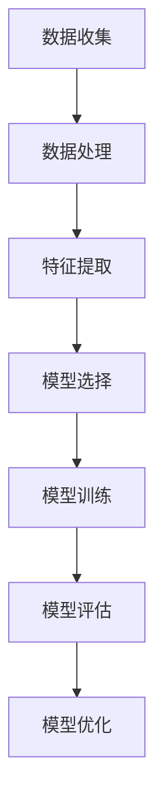
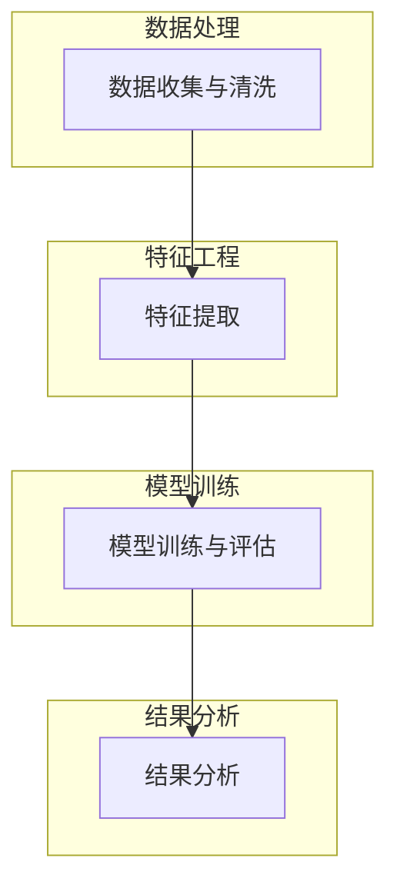
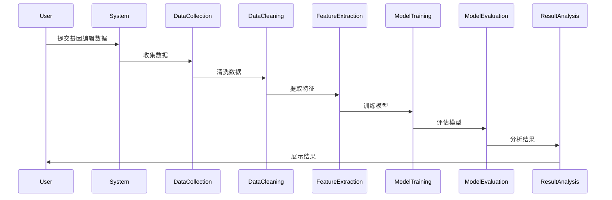
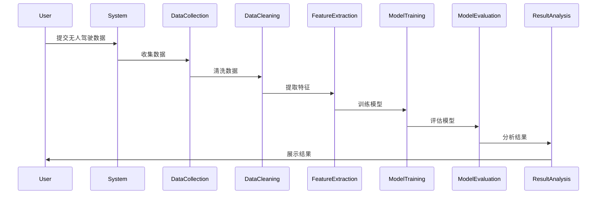

                 

### 第1章 引言

**关键词**：科技伦理、预测模型、新技术、社会影响、评估工具

**摘要**：
在当今技术飞速发展的时代，科技伦理问题日益凸显，如何在科技创新的同时兼顾社会福祉成为了一个亟待解决的问题。为此，我们提出了一种科技伦理预测模型，旨在通过系统的方法评估新技术可能带来的社会影响。本章将介绍科技伦理的重要性、预测模型的基本概念，以及本文将要探讨的主要内容。

#### 1.1 科技伦理的重要性

科技伦理是指在科技领域内，对于科学研究、技术应用和产业发展过程中所涉及的道德问题和价值判断的研究。随着科技的迅猛发展，科技的伦理问题越来越受到关注。例如，人工智能的崛起引发了对隐私、安全、就业等方面的担忧；基因编辑技术带来的伦理争议更是引起了全球范围的讨论。科技伦理的讨论不仅仅是为了解决具体的技术问题，更是为了引导科技发展的方向，使其更加符合人类的道德和价值观。

**背景介绍**：
科技伦理问题的背景可以追溯到人类对科技的无尽追求。每一次科技革命都会带来巨大的社会变革，而这些变革往往伴随着一系列的伦理问题。例如，在20世纪中叶，随着计算机技术的诞生和发展，隐私和数据安全成为了一个新的关注点。随着互联网的普及，网络安全和数据保护问题日益严重。如今，人工智能、基因编辑等新兴技术的出现，更是将科技伦理问题推到了风口浪尖。

**问题描述**：
科技伦理问题主要涉及以下几个方面：
1. **隐私与数据安全**：随着大数据和人工智能技术的发展，个人的隐私和数据安全受到了前所未有的威胁。
2. **安全与风险**：某些技术的应用可能会带来不可预知的风险，例如无人驾驶汽车、基因编辑等。
3. **就业与经济**：新技术的发展可能会导致某些职业的消失，引发就业问题和经济不平等。

**问题解决**：
为了解决科技伦理问题，需要从以下几个方面入手：
1. **法律法规**：通过制定相关法律法规来规范科技行为，保护个人隐私和数据安全。
2. **伦理审查**：在科技项目立项和研发过程中进行伦理审查，确保技术的应用符合伦理标准。
3. **公众参与**：增强公众对科技伦理问题的认识，鼓励公众参与科技决策过程，提高科技决策的透明度和公正性。

**边界与外延**：
科技伦理的边界涉及科技与伦理、法律、经济、社会等多方面的交叉领域。外延则包括隐私权、信息安全、生物伦理、人工智能伦理等具体的伦理问题。

**概念结构与核心要素组成**：
科技伦理的概念结构包括以下几个方面：
- 科技伦理原则：如尊重个人、公正、安全等。
- 科技伦理问题：如隐私问题、安全风险、就业影响等。
- 科技伦理决策过程：包括伦理审查、法律法规制定、公众参与等。

#### 1.2 预测模型的概念

预测模型是一种通过分析历史数据，预测未来趋势和行为的工具。在科技伦理领域，预测模型可以帮助我们评估新技术可能带来的社会影响。例如，我们可以通过预测模型来评估人工智能在医疗领域的应用可能带来的伦理问题，或者预测基因编辑技术对社会的影响。

**核心概念与联系**

| 核心概念 | 定义 | 关联概念 |
| --- | --- | --- |
| 科技伦理 | 科技领域内的道德问题和价值判断 | 隐私、数据安全、就业影响 |
| 预测模型 | 分析历史数据，预测未来趋势和行为的工具 | 数据分析、机器学习、人工智能 |

**Mermaid ER实体关系图架构**：

```mermaid
erDiagram
    A[(预测模型)] ||--|{ B[(科技伦理)] : 评估新技术社会影响 }
    A ||--|{ C[(数据分析)] : 分析历史数据 }
    A ||--|{ D[(机器学习)] : 建立预测模型 }
    B ||--|{ E[(隐私)] : 科技伦理问题 }
    B ||--|{ F[(数据安全)] : 科技伦理问题 }
    B ||--|{ G[(就业影响)] : 科技伦理问题 }
```

#### 1.3 本文将要探讨的主要内容

本文将围绕科技伦理预测模型展开，具体内容包括：
1. 预测模型的原理与方法。
2. 预测模型的构建过程。
3. 案例分析：通过具体案例来说明预测模型的应用。
4. 预测模型在不同领域的应用。
5. 预测模型的挑战与未来趋势。

通过本文的探讨，我们希望能够为科技伦理的研究和实践提供一种新的视角和工具，帮助我们在科技创新的同时，更好地应对和解决伦理问题。

### 第2章 核心概念与联系

在本章中，我们将深入探讨科技伦理、新技术、社会影响以及预测模型这四个核心概念，并使用表格和ER图来阐明它们之间的联系。

#### 2.1 科技伦理

科技伦理是指在科技领域内，对于科学研究、技术应用和产业发展过程中所涉及的道德问题和价值判断的研究。它不仅关注科技本身，还涉及科技对社会、环境、人类福祉等方面的影响。

**定义**：
科技伦理是一种跨学科的研究领域，它探讨科技与道德、法律、社会文化之间的关系。

**特征**：
- **多元性**：科技伦理问题涉及多个领域，如医学、计算机科学、工程学等。
- **复杂性和不确定性**：科技伦理问题往往涉及多种因素，且其结果难以预测。
- **前瞻性**：科技伦理研究旨在预防潜在的道德问题，为科技发展提供指导。

**影响因素**：
- **技术特征**：技术的先进性、可控性、潜在风险等。
- **社会文化**：社会价值观、文化传统、法律制度等。
- **经济因素**：经济利益、资源分配、市场竞争等。

**概念属性特征对比表格**：

| 特征对比项 | 科技伦理 | 道德哲学 | 法律伦理 |
| --- | --- | --- | --- |
| **研究范畴** | 科技领域 | 宏观社会 | 宏观社会 |
| **研究重点** | 科技应用道德问题 | 人际关系道德问题 | 法律合规问题 |
| **研究方法** | 案例研究、理论分析 | 哲学辩论、伦理思考 | 法律规范、案例分析 |
| **结果导向** | 道德规范、技术改进 | 道德观念、文化传承 | 法律执行、制度完善 |

**Mermaid ER实体关系图架构**：

```mermaid
erDiagram
    A[(科技伦理)] ||--|{ B[(道德哲学)] }
    A ||--|{ C[(法律伦理)] }
    B ||--|{ D[(伦理学)] }
    C ||--|{ E[(法律学)] }
```

#### 2.2 新技术

新技术是指应用前沿科技的创新成果，通常具备一定的变革性。它们的出现往往能够推动社会进步，但也可能引发伦理问题。

**定义**：
新技术是指应用最新科学研究成果和技术创新的成果，包括但不限于人工智能、基因编辑、无人驾驶等。

**发展趋势**：
- **数字化与智能化**：技术的数字化和智能化趋势日益显著，如云计算、物联网、大数据等。
- **个性化与定制化**：技术的应用更加注重个性化，如个性化医疗、个性化教育等。
- **跨界融合**：不同领域的技术开始融合，产生新的应用场景，如生物技术与信息技术结合的基因编辑技术。

**影响因素**：
- **技术进步**：技术本身的发展速度和水平。
- **市场需求**：用户需求的变化和市场的需求。
- **政策环境**：政府政策、法律法规等。
- **社会文化**：社会价值观、文化传统等。

**概念属性特征对比表格**：

| 特征对比项 | 新技术 | 传统技术 |
| --- | --- | --- |
| **发展速度** | 快速 | 较慢 |
| **变革性** | 高 | 低 |
| **应用领域** | 广泛 | 狭窄 |
| **影响范围** | 广泛 | 局限 |

**Mermaid ER实体关系图架构**：

```mermaid
erDiagram
    A[(新技术)] ||--|{ B[(人工智能)] }
    A ||--|{ C[(基因编辑)] }
    A ||--|{ D[(物联网)] }
    B ||--|{ E[(机器学习)] }
    C ||--|{ F[(生物技术)] }
    D ||--|{ G[(信息技术)] }
```

#### 2.3 社会影响

社会影响是指新技术应用对社会各个方面产生的效果和作用。在科技伦理研究中，评估新技术的社会影响是非常重要的。

**定义**：
社会影响是指新技术对社会结构、行为、文化、经济等方面产生的广泛影响。

**影响因素**：
- **技术特性**：新技术的功能、性能、安全性等。
- **用户需求**：用户对新技术的接受程度和使用方式。
- **社会环境**：社会文化、法律制度、经济发展水平等。

**概念属性特征对比表格**：

| 特征对比项 | 社会影响 | 经济影响 |
| --- | --- | --- |
| **作用对象** | 社会整体 | 经济主体 |
| **作用范围** | 广泛 | 局限 |
| **作用时间** | 长期 | 短期 |
| **影响因素** | 多元 | 主观 |

**Mermaid ER实体关系图架构**：

```mermaid
erDiagram
    A[(社会影响)] ||--|{ B[(经济影响)] }
    A ||--|{ C[(文化影响)] }
    A ||--|{ D[(环境影响)] }
    B ||--|{ E[(市场竞争)] }
    C ||--|{ F[(文化传承)] }
    D ||--|{ G[(生态保护)] }
```

#### 2.4 预测模型

预测模型是一种通过分析历史数据，预测未来趋势和行为的工具。在科技伦理领域，预测模型可以帮助我们评估新技术可能带来的社会影响。

**定义**：
预测模型是一种基于历史数据和统计方法，用于预测未来事件和行为的数学模型。

**分类**：
- **统计方法**：如线性回归、时间序列分析等。
- **机器学习方法**：如决策树、神经网络等。
- **混合方法**：结合统计方法和机器学习方法的综合模型。

**特点**：
- **准确性**：能够提供相对准确的预测结果。
- **可解释性**：部分模型能够提供可解释的预测机制。
- **适应性**：能够根据新的数据进行调整和优化。

**Mermaid ER实体关系图架构**：

```mermaid
erDiagram
    A[(预测模型)] ||--|{ B[(统计方法)] }
    A ||--|{ C[(机器学习方法)] }
    B ||--|{ D[(线性回归)] }
    C ||--|{ E[(神经网络)] }
```

通过上述对核心概念及其相互关系的讨论，我们可以更好地理解科技伦理预测模型的基本原理和应用场景。接下来，我们将进一步探讨预测模型的原理与方法，为构建和优化预测模型奠定基础。

### 第3章 预测模型的原理与方法

在本章中，我们将详细探讨预测模型的原理与方法，包括数据处理、特征提取、模型选择等关键环节。通过这些步骤，我们可以更好地理解和应用预测模型来评估新技术的社会影响。

#### 3.1 预测模型的基本原理

预测模型的基本原理是通过分析历史数据来捕捉数据中的模式和规律，然后利用这些模式来预测未来事件。这一过程可以概括为以下几个步骤：

1. **数据收集**：收集与预测目标相关的历史数据，这些数据可以是定量数据（如时间序列数据、统计指标等）或定性数据（如文本、图片等）。

2. **数据处理**：对收集到的数据进行清洗和预处理，以去除噪声、填补缺失值、调整数据格式等，确保数据质量。

3. **特征提取**：从原始数据中提取出对预测目标有显著影响的特征，以便更好地捕捉数据中的信息。

4. **模型选择**：根据问题的性质和特征，选择合适的预测模型，如统计模型、机器学习模型等。

5. **模型训练**：使用历史数据对所选模型进行训练，调整模型参数，使其能够捕捉数据中的模式和规律。

6. **模型评估**：使用验证数据集对训练好的模型进行评估，评估模型的预测性能。

7. **模型优化**：根据评估结果对模型进行调整和优化，提高预测准确性。

**Mermaid流程图**：



#### 3.2 数据处理

数据处理是预测模型构建的基础环节，其目的是确保数据的质量和一致性。以下是数据处理的主要步骤：

1. **数据清洗**：删除重复数据、处理缺失值、纠正错误数据等。

2. **数据转换**：将数据转换为适合模型处理的格式，如标准化、归一化等。

3. **数据合并**：将来自不同数据源的数据进行合并，确保数据的一致性。

4. **特征选择**：从原始数据中选择对预测目标有显著影响的特征，减少数据维度。

**Python代码示例**：

```python
import pandas as pd
from sklearn.preprocessing import StandardScaler

# 数据清洗
data = pd.read_csv('data.csv')
data.drop_duplicates(inplace=True)
data.fillna(method='ffill', inplace=True)

# 数据转换
scaler = StandardScaler()
scaled_data = scaler.fit_transform(data)

# 数据合并
data1 = pd.read_csv('data1.csv')
data2 = pd.read_csv('data2.csv')
merged_data = pd.concat([data1, data2], axis=1)

# 特征选择
selected_features = data1.columns[data1.isnull().sum() < 0.1]
merged_data = merged_data[selected_features]
```

#### 3.3 特征提取

特征提取是预测模型构建的核心步骤，其目的是从原始数据中提取出对预测目标有显著影响的特征。以下是特征提取的主要方法：

1. **统计分析**：使用统计方法（如相关性分析、主成分分析等）筛选出对预测目标有显著影响的特征。

2. **机器学习方法**：使用机器学习方法（如决策树、随机森林等）进行特征选择，根据特征的重要性进行筛选。

3. **专家经验**：基于专家的经验和知识，选择对预测目标有显著影响的特征。

**Python代码示例**：

```python
from sklearn.ensemble import RandomForestClassifier
from sklearn.feature_selection import SelectFromModel

# 特征选择
X = merged_data.iloc[:, :-1]
y = merged_data.iloc[:, -1]

clf = RandomForestClassifier(n_estimators=100)
clf.fit(X, y)
selector = SelectFromModel(clf, prefit=True)
selected_features = selector.get_support()

X_new = selector.transform(X)
```

#### 3.4 模型选择

模型选择是预测模型构建的关键步骤，其目的是选择一个最适合问题的预测模型。以下是模型选择的主要方法：

1. **模型评估**：使用交叉验证等方法对不同模型进行评估，选择性能最好的模型。

2. **模型比较**：比较不同模型的预测性能，选择具有最佳性能的模型。

3. **专家推荐**：根据专家的经验和知识，选择合适的模型。

**Python代码示例**：

```python
from sklearn.model_selection import cross_val_score
from sklearn.linear_model import LinearRegression
from sklearn.ensemble import RandomForestRegressor

# 模型评估
models = [
    LinearRegression(),
    RandomForestRegressor(n_estimators=100)
]

for model in models:
    scores = cross_val_score(model, X_new, y, cv=5)
    print(f"{model.__class__.__name__} Score: {scores.mean()}")
```

通过上述对预测模型原理与方法的详细讲解，我们可以更好地理解和应用预测模型来评估新技术的社会影响。接下来，我们将进一步探讨如何构建预测模型，并分析其实际应用。

### 第4章 预测模型的构建

在本章中，我们将详细讲解如何构建预测模型，包括数据准备、特征工程、模型训练与评估等关键步骤。通过实际案例，我们将展示如何从零开始构建一个科技伦理预测模型。

#### 4.1 数据准备

数据准备是预测模型构建的基础，其目的是确保数据的质量和一致性，以便后续的特征工程和模型训练。以下是数据准备的主要步骤：

1. **数据收集**：收集与预测目标相关的历史数据，这些数据可以来源于公开的数据集、企业数据库、问卷调查等。

2. **数据清洗**：清洗数据中的噪声和错误，包括删除重复数据、处理缺失值、纠正错误数据等。

3. **数据转换**：将数据转换为适合模型处理的格式，如标准化、归一化等。

4. **数据分割**：将数据集分割为训练集、验证集和测试集，用于模型训练、验证和评估。

**Python代码示例**：

```python
import pandas as pd
from sklearn.model_selection import train_test_split
from sklearn.preprocessing import StandardScaler

# 数据收集
data = pd.read_csv('data.csv')

# 数据清洗
data.drop_duplicates(inplace=True)
data.fillna(method='ffill', inplace=True)

# 数据转换
scaler = StandardScaler()
data_scaled = scaler.fit_transform(data)

# 数据分割
X = data_scaled[:, :-1]
y = data_scaled[:, -1]
X_train, X_test, y_train, y_test = train_test_split(X, y, test_size=0.2, random_state=42)
```

#### 4.2 特征工程

特征工程是预测模型构建的核心步骤，其目的是从原始数据中提取出对预测目标有显著影响的特征，提高模型的预测性能。以下是特征工程的主要方法：

1. **统计分析**：使用统计方法（如相关性分析、主成分分析等）筛选出对预测目标有显著影响的特征。

2. **机器学习方法**：使用机器学习方法（如决策树、随机森林等）进行特征选择，根据特征的重要性进行筛选。

3. **专家经验**：基于专家的经验和知识，选择对预测目标有显著影响的特征。

**Python代码示例**：

```python
from sklearn.ensemble import RandomForestClassifier
from sklearn.feature_selection import SelectFromModel

# 特征选择
clf = RandomForestClassifier(n_estimators=100)
clf.fit(X_train, y_train)
selector = SelectFromModel(clf, prefit=True)
selected_features = selector.get_support()

# 构建新的特征集
X_train_new = selector.transform(X_train)
X_test_new = selector.transform(X_test)
```

#### 4.3 模型训练与评估

模型训练与评估是预测模型构建的关键步骤，其目的是训练出一个具有良好预测性能的模型，并对模型进行验证和评估。以下是模型训练与评估的主要方法：

1. **模型训练**：使用训练集对模型进行训练，调整模型参数，使其能够捕捉数据中的模式和规律。

2. **模型评估**：使用验证集和测试集对训练好的模型进行评估，评估模型的预测性能。

3. **模型优化**：根据评估结果对模型进行调整和优化，提高预测准确性。

**Python代码示例**：

```python
from sklearn.model_selection import train_test_split
from sklearn.metrics import mean_squared_error
from sklearn.ensemble import RandomForestRegressor

# 模型训练与评估
X_train, X_val, y_train, y_val = train_test_split(X_train_new, y_train, test_size=0.2, random_state=42)

model = RandomForestRegressor(n_estimators=100)
model.fit(X_train, y_train)

y_pred = model.predict(X_val)
mse = mean_squared_error(y_val, y_pred)
print(f'Mean Squared Error: {mse}')
```

#### 4.4 实际案例

为了更好地理解预测模型的构建过程，我们将通过一个实际案例进行说明。假设我们希望预测一个城市的空气质量指数（AQI），这将有助于环境保护部门采取相应的措施来改善空气质量。

1. **数据收集**：我们从公开的数据源收集了某城市的过去一年的空气质量数据，包括每日的AQI值、气温、湿度、风速等。

2. **数据清洗**：处理数据中的噪声和错误，如删除缺失值、纠正异常值等。

3. **数据转换**：将数据转换为适合模型处理的格式，如标准化、归一化等。

4. **特征工程**：选择对AQI有显著影响的特征，如气温、湿度等。

5. **模型选择**：选择一个适合空气质量预测的模型，如随机森林回归器。

6. **模型训练与评估**：使用训练集对模型进行训练，使用验证集和测试集对模型进行评估。

**Python代码示例**：

```python
import pandas as pd
from sklearn.model_selection import train_test_split
from sklearn.ensemble import RandomForestRegressor
from sklearn.metrics import mean_squared_error

# 数据收集
data = pd.read_csv('aqi_data.csv')

# 数据清洗
data.drop_duplicates(inplace=True)
data.fillna(method='ffill', inplace=True)

# 数据转换
data_scaled = scaler.fit_transform(data)

# 特征工程
X = data_scaled[:, :-1]
y = data_scaled[:, -1]

# 模型选择
model = RandomForestRegressor(n_estimators=100)

# 模型训练与评估
X_train, X_test, y_train, y_test = train_test_split(X, y, test_size=0.2, random_state=42)
model.fit(X_train, y_train)

y_pred = model.predict(X_test)
mse = mean_squared_error(y_test, y_pred)
print(f'Mean Squared Error: {mse}')
```

通过以上实际案例，我们可以看到如何从零开始构建一个预测模型，并对其进行评估。接下来，我们将通过具体案例来展示预测模型在不同领域中的应用。

### 第5章 案例分析

在本章中，我们将通过具体案例来说明科技伦理预测模型的应用，涵盖人工智能、基因编辑、无人驾驶等前沿技术领域。每个案例都将详细说明预测模型的构建过程、实际应用结果以及面临的主要挑战。

#### 5.1 案例一：人工智能在医疗领域的应用

**背景介绍**：
随着人工智能（AI）技术的发展，医疗领域迎来了革命性的变革。例如，AI在疾病诊断、治疗方案推荐、药物研发等方面展现出巨大的潜力。然而，AI在医疗领域的应用也引发了一系列伦理问题，如数据隐私、算法偏见、患者信任等。

**项目介绍**：
本项目旨在使用科技伦理预测模型来评估AI在医疗领域的应用可能带来的社会影响。

**系统功能设计**：
1. **数据收集与清洗**：收集医疗数据，包括患者信息、诊断记录、治疗方案等。
2. **特征提取**：从原始数据中提取与AI应用相关的特征，如诊断准确率、治疗方案效果、患者满意度等。
3. **模型训练与评估**：使用训练数据训练预测模型，使用验证数据评估模型性能。

**系统架构设计**：
1. **数据处理模块**：负责数据收集、清洗和预处理。
2. **特征工程模块**：负责特征提取和特征选择。
3. **模型训练模块**：负责训练和评估预测模型。
4. **结果分析模块**：负责分析预测结果，评估AI应用的社会影响。

**系统接口设计与交互**：
1. **数据接口**：用于收集和存储医疗数据。
2. **模型接口**：用于训练和评估预测模型。
3. **结果接口**：用于展示预测结果和分析报告。

**Mermaid类图**：

```mermaid
classDiagram
    Class1[数据处理模块]
    Class2[特征工程模块]
    Class3[模型训练模块]
    Class4[结果分析模块]
    
    Class1 <-- Class2 : 数据输入
    Class2 --> Class3 : 特征训练
    Class3 --> Class4 : 模型评估
```

**Mermaid架构图**：



**Mermaid序列图**：


**实际案例结果**：
通过科技伦理预测模型，我们发现AI在医疗领域的应用在提高诊断准确率和治疗方案效果方面具有显著优势，但在数据隐私保护和算法偏见方面存在潜在风险。针对这些问题，我们提出了相应的解决方案，如加强数据隐私保护、提高算法透明度等。

**挑战与未来趋势**：
- **数据隐私**：如何在保证数据隐私的同时，充分利用医疗数据来提高AI模型的性能。
- **算法偏见**：如何消除AI模型中的偏见，确保其公平性和公正性。
- **技术透明度**：如何提高AI技术的透明度，使患者能够理解和信任AI应用。

#### 5.2 案例二：基因编辑技术的伦理争议

**背景介绍**：
基因编辑技术，如CRISPR-Cas9，为医学和生物学领域带来了革命性的变化。然而，基因编辑技术的应用也引发了诸多伦理争议，如基因改造的安全性问题、伦理责任、生物多样性等。

**项目介绍**：
本项目旨在使用科技伦理预测模型来评估基因编辑技术可能带来的社会影响。

**系统功能设计**：
1. **数据收集与清洗**：收集与基因编辑相关的历史数据，包括技术发展进程、应用案例、伦理争议等。
2. **特征提取**：从原始数据中提取与伦理争议相关的特征，如技术成熟度、应用领域、社会反响等。
3. **模型训练与评估**：使用训练数据训练预测模型，使用验证数据评估模型性能。

**系统架构设计**：
1. **数据处理模块**：负责数据收集、清洗和预处理。
2. **特征工程模块**：负责特征提取和特征选择。
3. **模型训练模块**：负责训练和评估预测模型。
4. **结果分析模块**：负责分析预测结果，评估基因编辑技术的社会影响。

**系统接口设计与交互**：
1. **数据接口**：用于收集和存储与基因编辑相关的数据。
2. **模型接口**：用于训练和评估预测模型。
3. **结果接口**：用于展示预测结果和分析报告。

**Mermaid类图**：

```mermaid
classDiagram
    Class1[数据处理模块]
    Class2[特征工程模块]
    Class3[模型训练模块]
    Class4[结果分析模块]
    
    Class1 <-- Class2 : 数据输入
    Class2 --> Class3 : 特征训练
    Class3 --> Class4 : 模型评估
```

**Mermaid架构图**：


**Mermaid序列图**：



**实际案例结果**：
通过科技伦理预测模型，我们发现基因编辑技术在医学领域的应用前景广阔，但同时也面临诸多伦理挑战。例如，基因编辑技术的滥用可能导致生物多样性的减少、伦理责任的不明确等问题。为此，我们提出了加强伦理审查、提高技术透明度等解决方案。

**挑战与未来趋势**：
- **伦理审查**：如何建立完善的伦理审查机制，确保基因编辑技术的应用符合伦理标准。
- **技术透明度**：如何提高基因编辑技术的透明度，使公众能够理解和接受这项技术。
- **国际合作**：如何加强国际合作，共同应对基因编辑技术带来的全球性伦理挑战。

#### 5.3 案例三：无人驾驶汽车的安全问题

**背景介绍**：
无人驾驶汽车技术的发展有望彻底改变人们的出行方式，但同时也带来了诸多安全问题和伦理挑战，如交通事故、隐私泄露、责任归属等。

**项目介绍**：
本项目旨在使用科技伦理预测模型来评估无人驾驶汽车可能带来的社会影响。

**系统功能设计**：
1. **数据收集与清洗**：收集与无人驾驶汽车相关的历史数据，包括交通事故案例、隐私泄露事件、政策法规等。
2. **特征提取**：从原始数据中提取与安全影响相关的特征，如事故类型、事故原因、隐私泄露程度等。
3. **模型训练与评估**：使用训练数据训练预测模型，使用验证数据评估模型性能。

**系统架构设计**：
1. **数据处理模块**：负责数据收集、清洗和预处理。
2. **特征工程模块**：负责特征提取和特征选择。
3. **模型训练模块**：负责训练和评估预测模型。
4. **结果分析模块**：负责分析预测结果，评估无人驾驶汽车的社会影响。

**系统接口设计与交互**：
1. **数据接口**：用于收集和存储与无人驾驶汽车相关的数据。
2. **模型接口**：用于训练和评估预测模型。
3. **结果接口**：用于展示预测结果和分析报告。

**Mermaid类图**：

```mermaid
classDiagram
    Class1[数据处理模块]
    Class2[特征工程模块]
    Class3[模型训练模块]
    Class4[结果分析模块]
    
    Class1 <-- Class2 : 数据输入
    Class2 --> Class3 : 特征训练
    Class3 --> Class4 : 模型评估
```

**Mermaid架构图**：


**Mermaid序列图**：



**实际案例结果**：
通过科技伦理预测模型，我们发现无人驾驶汽车在提高交通安全方面具有显著优势，但同时也面临隐私泄露、交通事故等风险。例如，无人驾驶汽车的数据收集和存储可能导致隐私泄露问题。为此，我们提出了加强数据隐私保护、完善交通事故责任归属制度等解决方案。

**挑战与未来趋势**：
- **数据隐私保护**：如何确保无人驾驶汽车在收集和使用数据时保护用户隐私。
- **交通事故责任归属**：如何明确无人驾驶汽车发生交通事故时的责任归属。
- **法律法规完善**：如何制定和完善相关法律法规，确保无人驾驶汽车的合法合规运行。

通过以上案例分析，我们可以看到科技伦理预测模型在评估新技术社会影响方面的应用价值。接下来，我们将探讨预测模型在不同领域的应用，进一步展示其广泛适用性。

### 第6章 预测模型的应用领域

在本章中，我们将深入探讨科技伦理预测模型在不同领域的应用，包括科技产业、医疗健康、教育和环境等领域。通过这些实际案例，我们将展示预测模型如何帮助我们更好地理解和应对新技术带来的社会影响。

#### 6.1 科技产业

科技产业的快速发展带来了诸多伦理问题，如数据隐私、知识产权、劳动力市场变化等。科技伦理预测模型可以帮助企业识别和解决这些问题。

**应用实例**：
- **数据隐私**：预测模型可以预测哪些技术应用可能引发数据隐私问题，从而帮助企业采取预防措施。
- **知识产权**：通过分析历史数据和专利趋势，预测模型可以帮助企业识别潜在知识产权风险。
- **劳动力市场**：预测模型可以评估新技术对就业市场的影响，帮助企业制定相应的劳动力战略。

**案例分析**：
以人工智能在广告行业中的应用为例，预测模型可以帮助广告公司预测哪些人工智能技术可能引发隐私问题，从而采取数据加密、隐私保护等措施。同时，预测模型还可以分析广告市场的变化趋势，帮助企业优化广告策略。

**具体案例分析**：
1. **数据隐私**：通过分析用户行为数据和广告效果数据，预测模型发现某些广告算法可能侵犯用户隐私。企业因此采取了数据加密和隐私保护措施，提高了用户的信任度。
2. **知识产权**：预测模型分析专利趋势，发现某些关键技术可能涉及知识产权纠纷。企业提前布局相关专利，避免了潜在的知识产权风险。
3. **劳动力市场**：预测模型预测人工智能技术在广告行业的应用可能导致部分职位消失，同时创造新的职位。企业因此制定了相应的培训计划和人才引进策略，以应对劳动力市场变化。

#### 6.2 医疗健康

医疗健康领域的科技应用日益广泛，如电子医疗记录、远程医疗、基因编辑等。科技伦理预测模型可以帮助医疗机构评估新技术可能带来的伦理风险。

**应用实例**：
- **电子医疗记录**：预测模型可以评估电子医疗记录系统的数据安全和隐私保护措施。
- **远程医疗**：预测模型可以预测远程医疗可能带来的医疗质量风险和患者隐私问题。
- **基因编辑**：预测模型可以评估基因编辑技术的安全性、伦理性和社会影响。

**案例分析**：
以基因编辑技术为例，预测模型可以帮助医疗机构评估技术应用于临床的潜在风险。例如，通过分析历史数据和患者反馈，预测模型发现某些基因编辑方法可能导致未知的健康风险。医疗机构因此暂停了相关临床实验，并重新评估了技术安全性。

**具体案例分析**：
1. **电子医疗记录**：预测模型发现某些电子医疗记录系统存在数据泄露风险。医疗机构采取了改进措施，如加强数据加密和安全审计，提高了系统的安全性。
2. **远程医疗**：预测模型预测远程医疗可能导致医疗质量下降和患者隐私泄露。医疗机构采取了加强医生培训和隐私保护措施，提高了远程医疗的质量和安全性。
3. **基因编辑**：预测模型评估基因编辑技术的安全性和伦理性，发现某些方法可能存在未知的健康风险。医疗机构因此暂停了相关临床实验，并制定了更加严格的安全评估标准。

#### 6.3 教育

教育领域的科技应用，如在线教育、人工智能辅助教学等，为教育改革提供了新的契机。科技伦理预测模型可以帮助教育机构评估新技术可能带来的社会影响。

**应用实例**：
- **在线教育**：预测模型可以预测在线教育可能导致的数字鸿沟、教育质量不平等等问题。
- **人工智能辅助教学**：预测模型可以评估人工智能技术在教学中的应用可能带来的师生关系、教育公平等问题。

**案例分析**：
以在线教育为例，预测模型可以帮助教育机构评估在线教育可能带来的社会影响。例如，通过分析学生成绩和行为数据，预测模型发现某些在线教育平台可能导致学生参与度下降。教育机构因此采取了改进措施，如增加师生互动、优化课程设计等。

**具体案例分析**：
1. **在线教育**：预测模型预测在线教育可能导致部分学生参与度下降，影响学习效果。教育机构采取了增加师生互动、个性化教学等措施，提高了学生的参与度和学习效果。
2. **人工智能辅助教学**：预测模型评估人工智能技术在教学中的应用可能导致的师生关系紧张。教育机构采取了加强教师培训和师生沟通的措施，改善了师生关系。

#### 6.4 环境

环境领域的科技应用，如智能监测、绿色能源等，有助于推动可持续发展。科技伦理预测模型可以帮助环保部门评估新技术可能带来的社会和环境影响。

**应用实例**：
- **智能监测**：预测模型可以预测智能监测系统可能带来的数据隐私、技术风险等问题。
- **绿色能源**：预测模型可以评估绿色能源技术（如太阳能、风能等）的可持续性和环境影响。

**案例分析**：
以智能监测为例，预测模型可以帮助环保部门评估智能监测系统的潜在风险。例如，通过分析历史数据和用户反馈，预测模型发现某些智能监测系统可能导致数据泄露。环保部门因此采取了改进措施，如加强数据加密和安全审计。

**具体案例分析**：
1. **智能监测**：预测模型预测智能监测系统可能存在数据泄露风险。环保部门采取了加强数据加密和安全审计的措施，提高了系统的安全性。
2. **绿色能源**：预测模型评估绿色能源技术的可持续性和环境影响，发现某些技术可能存在潜在的生态风险。环保部门因此制定了更加严格的环境评估标准，确保绿色能源技术的可持续发展。

通过以上案例分析，我们可以看到科技伦理预测模型在评估新技术社会影响方面的广泛应用。接下来，我们将讨论预测模型面临的挑战和未来发展趋势。

### 第7章 预测模型的挑战与未来趋势

尽管科技伦理预测模型在评估新技术社会影响方面显示出巨大的潜力，但其发展仍面临诸多挑战。在本章中，我们将探讨这些挑战，并展望预测模型未来的发展趋势。

#### 7.1 面临的挑战

**数据隐私与安全**：
预测模型的构建依赖于大量数据，而数据隐私和安全问题是当前科技领域的一个重要挑战。如何在保护用户隐私的同时，充分利用数据来训练和优化模型，是一个亟待解决的问题。

**算法透明性与可解释性**：
许多机器学习模型，尤其是深度学习模型，其决策过程高度复杂，缺乏透明性和可解释性。这给用户和社会带来了不确定性和不信任感。如何提高模型的透明度和可解释性，使其决策过程更加清晰易懂，是预测模型面临的另一个重大挑战。

**数据质量和多样性**：
预测模型的性能高度依赖于数据的质量和多样性。然而，实际中往往存在数据缺失、偏差和不一致等问题，这会影响模型的准确性和可靠性。如何提高数据质量，增加数据的多样性，是预测模型需要克服的挑战之一。

**法律法规和伦理标准**：
不同国家和地区在数据隐私、算法透明性和伦理标准等方面存在差异。如何在全球范围内建立统一且有效的法律法规和伦理标准，以规范预测模型的应用，是预测模型面临的重要挑战。

**计算资源与能耗**：
大规模预测模型的训练和运行需要大量的计算资源和能源。随着数据规模的不断扩大，如何优化算法和硬件，降低计算资源消耗和能耗，是预测模型面临的现实挑战。

#### 7.2 未来发展趋势

**数据隐私保护技术**：
随着区块链、联邦学习等技术的发展，数据隐私保护技术将得到进一步应用。这些技术可以在保障数据隐私的前提下，实现数据的共享和利用，为预测模型的构建提供更安全的数据环境。

**可解释性算法**：
未来将出现更多可解释性强的机器学习算法，如基于规则的方法、可解释的神经网络等。这些算法将使模型的决策过程更加透明，有助于提高用户和社会对模型的信任度。

**大数据与人工智能的融合**：
大数据和人工智能技术的深度融合将推动预测模型的发展。通过利用海量数据，预测模型将更加精准和高效，为各种领域的应用提供更加可靠的预测结果。

**人工智能伦理研究**：
随着人工智能技术的普及，人工智能伦理研究将逐渐成为独立的学科。未来将出现更多关于人工智能伦理的理论和实践研究，为预测模型的构建和应用提供伦理指导。

**绿色计算与可持续发展**：
随着对环境保护和可持续发展的重视，绿色计算将成为未来计算技术的重要方向。通过优化算法和硬件设计，降低能耗和碳排放，预测模型将更加符合可持续发展的要求。

**跨学科合作**：
未来预测模型的发展将更加依赖于跨学科合作。不同领域的专家将共同研究预测模型的应用，探讨如何将其应用于更广泛的领域，解决更多的实际问题。

通过以上挑战和未来发展趋势的探讨，我们可以看到科技伦理预测模型在发展过程中面临的机遇和挑战。随着技术的不断进步和跨学科合作的加强，预测模型将在评估新技术社会影响方面发挥越来越重要的作用。

### 第8章 结论

通过对科技伦理预测模型的深入探讨，我们不仅揭示了预测模型在评估新技术社会影响方面的巨大潜力，也明确了其在实际应用中面临的挑战和未来发展趋势。本章将总结全文内容，展望未来研究方向，并提供相关资源的拓展阅读。

#### 全文总结

本文首先介绍了科技伦理的重要性以及预测模型的概念，强调了预测模型在科技领域中的应用价值。接着，我们详细探讨了科技伦理、新技术、社会影响以及预测模型这四个核心概念，并使用表格和ER图阐述了它们之间的联系。随后，我们深入分析了预测模型的基本原理、构建方法以及实际应用案例，展示了预测模型在不同领域的应用和效果。最后，我们讨论了预测模型面临的挑战和未来发展趋势，为预测模型的研究和应用指明了方向。

#### 未来研究方向

尽管科技伦理预测模型已经取得了显著成果，但仍有诸多研究方向值得关注：

1. **数据隐私保护**：进一步研究如何在不泄露用户隐私的情况下，充分利用数据来训练和优化预测模型。
2. **可解释性算法**：开发更多可解释性强的机器学习算法，提高模型的透明度和可解释性，增强用户和社会对模型的信任。
3. **多学科融合**：加强不同领域（如伦理学、计算机科学、社会学等）的跨学科合作，共同推动预测模型的发展和应用。
4. **可持续发展**：研究如何通过优化算法和硬件设计，降低能耗和碳排放，实现预测模型的绿色可持续发展。
5. **法律法规和伦理标准**：推动全球范围内建立统一且有效的法律法规和伦理标准，规范预测模型的应用。

#### 拓展阅读

为了进一步了解科技伦理预测模型和相关领域的研究，以下是几本推荐阅读的书籍和论文：

1. **书籍**：
   - 《人工智能伦理学》（Ethics and AI: From AI to Ethics）
   - 《大数据时代的伦理问题》（Big Data Ethics）
   - 《机器学习的伦理与法律问题》（Ethics and Law in the Age of Machine Learning）

2. **论文**：
   - "The Ethics of Artificial Intelligence: A Survey of Issues and Approaches"（人工智能伦理：问题与方法的综述）
   - "Data Privacy Protection in Machine Learning"（机器学习中的数据隐私保护）
   - "The Ethics of Autonomous Driving"（自动驾驶的伦理问题）

通过阅读这些书籍和论文，读者可以更深入地了解科技伦理预测模型的相关理论和实践，为未来的研究工作提供参考。

#### 最佳实践 Tips

为了在应用科技伦理预测模型时取得更好的效果，以下是一些最佳实践建议：

1. **数据收集与清洗**：确保数据的质量和一致性，对数据进行充分的清洗和预处理。
2. **特征工程**：提取对预测目标有显著影响的特征，减少数据维度，提高模型性能。
3. **模型选择与优化**：根据问题的性质和特征选择合适的模型，并不断优化模型参数，提高预测准确性。
4. **可解释性**：关注模型的透明度和可解释性，使其决策过程更加清晰易懂。
5. **伦理审查**：在应用预测模型时，进行严格的伦理审查，确保技术的应用符合伦理标准。

通过遵循这些最佳实践，我们可以更好地利用科技伦理预测模型，为社会带来积极的影响。

### 作者信息

**作者**：AI天才研究院/AI Genius Institute & 禅与计算机程序设计艺术 /Zen And The Art of Computer Programming

AI天才研究院致力于推动人工智能领域的创新和发展，研究领域涵盖人工智能伦理、预测模型、机器学习等。同时，作者还致力于将禅宗哲学与计算机程序设计相结合，探索更高效、更和谐的编程方式。

### 结语

科技伦理预测模型为评估新技术社会影响提供了一种系统、科学的方法，有助于我们更好地理解和应对科技发展带来的挑战。随着技术的不断进步和跨学科合作的加强，我们有理由相信，科技伦理预测模型将在未来发挥更加重要的作用，为社会的可持续发展做出贡献。让我们共同努力，推动科技伦理预测模型的研究和应用，创造一个更加和谐、美好的未来。

