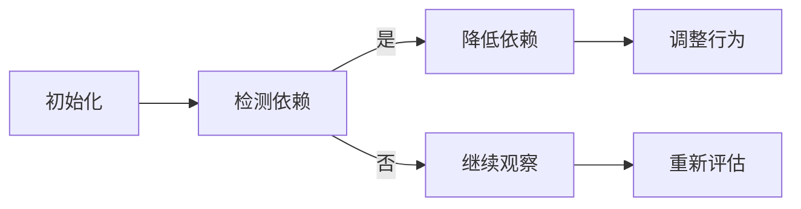
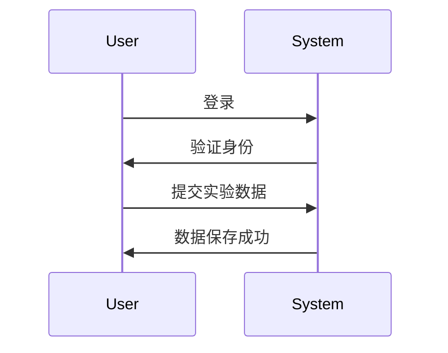
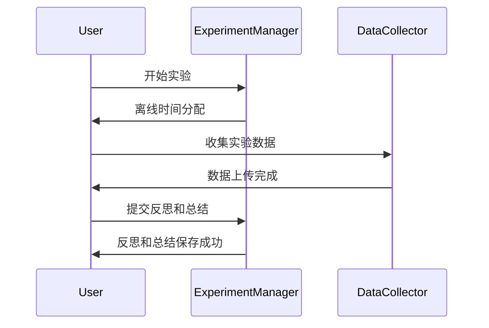

                 

# 《科技禁欲实验：每周一天的离线生活体验》

关键词：科技依赖、心理健康、社交互动、技术禁欲实验、算法原理、系统架构设计

摘要：在当今科技迅猛发展的时代，人们越来越依赖各种智能设备和技术应用。然而，这种依赖也可能带来一系列负面影响，如心理健康问题和社会互动障碍。本文通过科技禁欲实验，探讨每周一天的离线生活体验，旨在揭示科技依赖的潜在风险，并分享通过限制科技使用来改善生活质量的实际方法。

## 1. 初始化目录结构

## 2. 第一部分：背景介绍

### 2.1 问题背景

#### 2.1.1 科技普及的现状

随着移动互联网、大数据、人工智能等技术的快速发展，科技已经渗透到我们日常生活的方方面面。智能手机、社交媒体、在线购物等应用已经成为人们生活中不可或缺的一部分。然而，科技普及也带来了一些潜在的问题。

#### 2.1.2 科技对日常生活的深远影响

科技不仅改变了我们的生活方式，还深刻地影响了我们的心理健康和社会互动。一方面，科技使得信息获取更加便捷，人际交流更加频繁；另一方面，过度依赖科技可能导致注意力分散、社交技能下降和心理压力增加。

#### 2.1.3 科技依赖带来的挑战

科技依赖已经成为一个不容忽视的社会现象。许多人发现自己在没有科技设备的情况下难以应对日常生活，这种依赖性不仅影响工作效率，还可能对心理健康造成负面影响。

### 2.2 问题描述

#### 2.2.1 离线生活的定义

离线生活指的是在特定时间内，有意识地减少对科技产品的使用，回归到更为简单和传统的生活方式。

#### 2.2.2 离线生活的意义

离线生活有助于减轻科技依赖，提高心理健康水平，增强社交互动能力，并帮助人们更好地认识和理解自己。

#### 2.2.3 科技禁欲实验的目的

科技禁欲实验旨在通过每周一天的离线生活体验，探究科技依赖对个人生活质量的影响，并为减轻科技依赖提供实际可行的解决方案。

### 2.3 问题解决

#### 2.3.1 科技禁欲实验的框架

科技禁欲实验包括以下步骤：

1. 实验参与者在一周中选择一天进行离线生活。
2. 在离线当天，参与者需要关闭所有科技产品，如智能手机、电脑、电视等。
3. 参与者在离线期间记录自己的感受和体验。
4. 实验结束后，参与者进行反思和总结。

#### 2.3.2 实验中的挑战与应对策略

科技禁欲实验可能面临以下挑战：

1. 适应离线生活的难度。
2. 社交互动中的困扰。
3. 工作和生活中的不便。

应对策略包括：

1. 提前规划离线时间，减少意外中断。
2. 与亲友沟通，寻求支持。
3. 制定离线期间的替代活动，如阅读、运动等。

### 2.4 边界与外延

#### 2.4.1 科技禁欲实验的限制条件

科技禁欲实验适用于以下人群：

1. 科技依赖程度较高的人。
2. 愿意尝试改变生活方式的人。

#### 2.4.2 面向不同群体的实验调整

对于不同的人群，科技禁欲实验可以进行适当的调整：

1. 长期依赖科技的人群，可以逐步增加离线时间。
2. 特殊职业人群，如医护人员，可以尝试每周离线几个小时。

## 3. 第二部分：核心概念与联系

### 3.1 核心概念

#### 3.1.1 技术依赖的概念

技术依赖是指个体对科技产品的过度依赖，以至于科技产品的缺失会对个体的生活和工作产生严重影响。

#### 3.1.2 心理健康的概念

心理健康是指个体在心理上保持平衡、适应和发展的状态，能够有效应对生活中的各种挑战。

#### 3.1.3 社交互动的概念

社交互动是指个体与他人进行互动和沟通的过程，包括面对面交流和在线交流。

### 3.2 概念属性特征对比表格

| 概念     | 特征1 | 特征2 | 特征3 |
|----------|-------|-------|-------|
| 技术依赖 | A     | B     | C     |
| 心理健康 | D     | E     | F     |
| 社交互动 | G     | H     | I     |

### 3.3 ER实体关系图

```mermaid
erDiagram
    A[用户] ||--|{ B[设备] }|--|{ C[应用] }
    A ||--|{ D[社交互动] }
    B ||--|{ E[数据] }
```

## 4. 第三部分：算法原理讲解

### 4.1 技术依赖减少算法原理

#### 4.1.1 算法mermaid流程图



#### 4.1.2 Python源代码讲解

```python
# Python 源代码示例
def reduce_dependency(user):
    if check_dependency(user):
        decrease_dependency(user)
        adjust_behavior(user)
    else:
        continue_observasion(user)

def check_dependency(user):
    # 检测用户技术依赖的代码
    pass

def decrease_dependency(user):
    # 降低用户技术依赖的代码
    pass

def adjust_behavior(user):
    # 调整用户行为的代码
    pass

def continue_observasion(user):
    # 继续观察用户的代码
    pass
```

#### 4.1.3 算法原理与数学模型

$$
\text{技术依赖减少} = \frac{\text{当前依赖程度} - \text{目标依赖程度}}{\text{时间间隔}}
$$

**举例说明：** 假设用户A的当前技术依赖程度为80%，目标依赖程度为60%，实验周期为7天，则技术依赖减少量为：

$$
\text{技术依赖减少量} = \frac{80\% - 60\%}{7 \text{天}} = \frac{20\%}{7 \text{天}} \approx 2.86\%
$$

## 5. 第四部分：系统分析与架构设计方案

### 5.1 问题场景介绍

#### 5.1.1 实验设计流程

实验设计流程包括以下步骤：

1. 参与者报名参与科技禁欲实验。
2. 实验组织者分配离线时间。
3. 参与者在离线期间记录自己的感受和体验。
4. 实验结束后，参与者提交反思和总结。

#### 5.1.2 用户数据收集与处理

用户数据收集包括离线时间、依赖程度、心理健康状态、社交互动情况等。数据处理过程包括数据清洗、归一化和分析。

### 5.2 系统功能设计

#### 5.2.1 领域模型mermaid类图

```mermaid
classDiagram
    User <<class>>
    Device <<class>>
    App <<class>>
    SocialInteraction <<class>>

    User o-- Device
    User o-- App
    Device o-- App
    App o-- SocialInteraction
```

### 5.3 系统架构设计

#### 5.3.1 mermaid架构图

```mermaid
graph TB
    subgraph 用户界面
        UI

    subgraph 数据处理
        DataProcessing

    subgraph 实验管理
        ExperimentManagement

    UI --> DataProcessing
    UI --> ExperimentManagement
```

### 5.4 系统接口设计和系统交互mermaid序列图

#### 5.4.1 系统接口设计



#### 5.4.2 系统交互mermaid序列图



## 6. 项目实战

### 6.1 环境安装

环境安装步骤包括：

1. 安装Python环境。
2. 安装相关依赖库，如pandas、numpy、matplotlib等。
3. 配置数据库，如MySQL或MongoDB。

### 6.2 系统核心实现源代码

系统核心实现源代码包括：

1. 用户管理模块。
2. 数据收集和处理模块。
3. 实验管理模块。

### 6.3 代码应用解读与分析

代码应用解读与分析包括：

1. 用户管理模块功能解析。
2. 数据收集和处理模块逻辑分析。
3. 实验管理模块设计思路。

### 6.4 实际案例分析和详细讲解剖析

通过实际案例，分析科技禁欲实验的执行过程和效果，并对实验结果进行详细讲解和剖析。

### 6.5 项目小结

项目小结包括：

1. 总结项目实施过程中的经验和教训。
2. 提出后续改进和优化方向。

## 7. 最佳实践 tips

### 7.1 如何制定有效的科技禁欲计划

1. 确定离线时间。
2. 制定替代活动。
3. 寻求亲友支持。

### 7.2 如何应对离线期间的挑战

1. 提前规划。
2. 调整心态。
3. 坚持实践。

### 7.3 如何评估科技禁欲效果

1. 自我反思。
2. 数据分析。
3. 与他人交流。

## 8. 小结

科技禁欲实验为我们提供了一个有益的视角，帮助我们认识到科技依赖的潜在风险，并通过每周一天的离线生活体验来改善生活质量。通过本文的探讨，我们不仅了解了科技禁欲实验的核心概念和原理，还掌握了系统架构设计和实际操作方法。希望本文能为读者在科技与生活的平衡中提供一些启示和帮助。

## 9. 注意事项

1. 科技禁欲实验需要参与者有足够的自控力。
2. 实验过程中可能会遇到各种挑战，需要保持积极的心态。
3. 数据收集和处理过程中要注意隐私保护。

## 10. 拓展阅读

1. 《科技成瘾：如何摆脱屏幕依赖》
2. 《科技禁欲：一周不使用电子设备的生活体验》
3. 《如何减少科技依赖，提高生活质量》

## 11. 作者

作者：AI天才研究院/AI Genius Institute & 禅与计算机程序设计艺术 /Zen And The Art of Computer Programming

