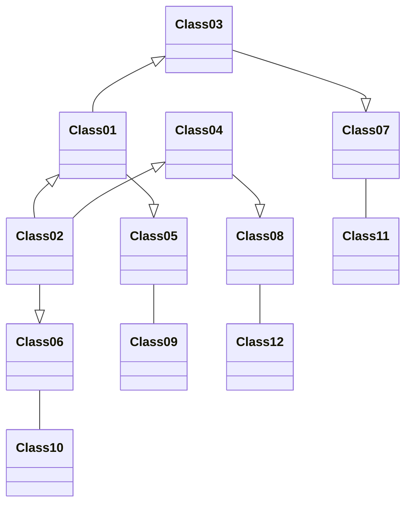
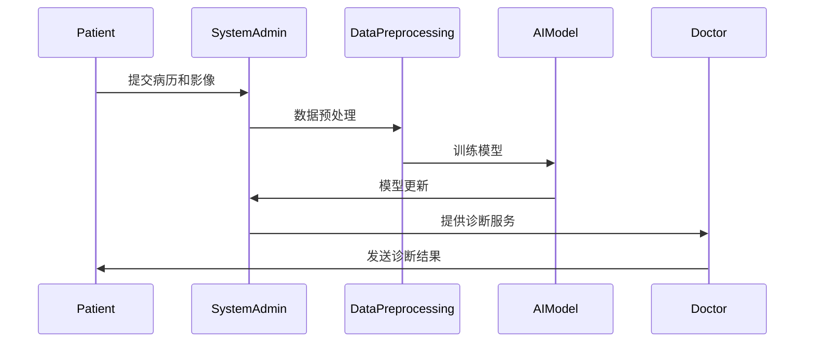
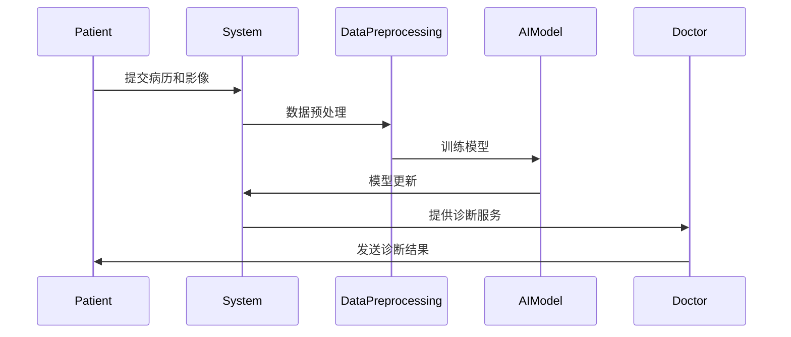

                 

# 科技进步与伦理边界：人类增强技术的道德思考

## 关键词
科技进步、伦理学、人类增强技术、隐私保护、安全风险、社会公正

## 摘要
随着科技的迅猛发展，人类增强技术逐渐成为现实。然而，这些技术也引发了一系列伦理问题，包括隐私保护、安全风险、人类尊严等。本文旨在探讨科技进步与伦理边界的相互关系，通过分析人类增强技术的道德思考，寻求在科技进步过程中实现伦理平衡的方法。文章分为七个部分，首先介绍问题背景和定义，然后深入剖析核心概念和联系，探讨解决方案和政策建议，并展示具体实战案例，最后总结最佳实践和未来研究方向。

### 第一部分：引言与背景介绍

#### 1.1.1 问题背景

在现代社会中，科技进步如日中天，尤其在信息技术领域，更是日新月异。随着人工智能、生物工程、纳米技术等前沿科技的突破，人类的生活和工作方式正在发生深刻变革。然而，这些科技进步也带来了诸多伦理问题，如隐私保护、安全风险、人类尊严等。如何平衡科技进步与伦理边界，已成为全球性议题。

#### 1.1.2 问题描述

科技进步带来的伦理问题涉及多个层面，包括个人隐私、社会公正、人类尊严等。例如，人工智能的发展使得个人隐私受到前所未有的威胁；生物工程技术的突破可能带来基因编辑的道德困境；纳米技术的广泛应用可能导致环境安全风险。这些问题不仅挑战着现有的法律和伦理体系，也对社会价值观和人类未来产生深远影响。

#### 1.1.3 问题解决

本书旨在探讨科技进步与伦理边界的问题，通过深入研究人类增强技术的道德思考，寻求解决这些伦理困境的方法。具体而言，本书将：

1. **梳理核心概念**：详细阐述科技进步、伦理学、人类增强技术等核心概念，明确其定义、特征及相互关系。
2. **分析主要问题**：从个人、社会、全球等不同角度，深入剖析科技进步带来的伦理问题，如隐私保护、安全风险、人类尊严等。
3. **探讨解决方案**：结合实际案例，探讨在不同领域和层面上的解决方案，如法律规范、伦理指导、技术创新等。
4. **提供政策建议**：基于研究分析，提出针对各国政府和社会组织在伦理问题上的政策建议，以促进科技进步与伦理平衡。

#### 1.1.4 边界与外延

科技进步与伦理边界的研究不仅关注技术本身的伦理问题，还涉及到社会、政治、经济等多个方面。其边界涉及以下几个方面：

1. **技术边界**：科技进步带来的技术挑战，如人工智能的安全风险、生物工程的伦理问题等。
2. **社会边界**：科技进步对社会结构和价值观的影响，如隐私权的保护、社会公正的维护等。
3. **全球边界**：科技进步的国际影响，如跨国合作、全球治理等。

#### 1.1.5 概念结构与核心要素组成

科技进步与伦理边界的研究框架包括以下几个核心要素：

1. **科技进步**：涵盖人工智能、生物工程、纳米技术等前沿科技的发展现状和应用。
2. **伦理学**：研究伦理理论、道德原则以及如何应用于科技进步的伦理问题。
3. **人类增强技术**：探讨通过科技手段增强人类能力的方法和影响。
4. **解决方案**：针对科技进步带来的伦理问题，提出具体的法律、伦理和技术解决方案。

#### 1.1.6 本书的结构与内容安排

本书共分为七个部分，结构安排如下：

- **第一部分**：引言与背景介绍，概述科技进步与伦理边界的问题。
- **第二部分**：核心概念与联系，详细阐述科技进步、伦理学、人类增强技术等核心概念及其相互关系。
- **第三部分**：主要问题分析，从不同角度深入剖析科技进步带来的伦理问题。
- **第四部分**：解决方案探讨，结合实际案例，探讨科技进步与伦理问题的解决方法。
- **第五部分**：政策建议，基于研究分析，提出政策建议以促进科技进步与伦理平衡。
- **第六部分**：项目实战，通过具体案例，展示科技进步与伦理问题在实践中的应用。
- **第七部分**：最佳实践与总结，总结全书要点，提出未来研究方向和建议。

### 1.2 核心概念与联系

在本节中，我们将详细阐述科技进步、伦理学、人类增强技术等核心概念，并分析它们之间的相互关系。

#### 1.2.1 科技进步

科技进步是指科技领域内的新发现、新发明和新应用的发展过程。其核心概念包括创新、发明、技术应用等。科技进步对社会发展具有深远影响，不仅改变了人们的生活方式，也推动了社会结构和价值观的变革。

**定义**：科技进步是指通过科学研究的创新和技术的应用，推动社会发展和生产力的提升。

**特征**：

- **创新性**：科技进步以创新为核心，不断突破现有技术限制，实现新的发展和突破。
- **系统性**：科技进步是一个系统工程，涉及多个领域和学科的合作与交叉。
- **动态性**：科技进步不断演变和发展，适应社会需求和挑战。

**相互关系**：科技进步是伦理学研究的物质基础，为伦理问题的提出和解决提供了条件。同时，伦理学为科技进步提供了道德指导，确保科技进步的方向和成果符合人类价值观。

#### 1.2.2 伦理学

伦理学是研究道德原则和道德行为的学科。其核心概念包括道德原则、道德判断、伦理规范等。伦理学在科技进步中起着重要作用，它为科技进步提供了道德指导，帮助我们在追求技术进步的同时，关注伦理问题，避免科技滥用。

**定义**：伦理学是研究道德原则和道德行为的学科，关注人类行为的道德规范和道德判断。

**特征**：

- **规范性**：伦理学通过规范性的研究，指导人类行为的道德标准。
- **价值性**：伦理学研究关注人类行为的道德价值，强调道德原则的指导作用。
- **多样性**：不同文化和背景下，伦理学的研究和实践存在差异。

**相互关系**：伦理学是科技进步的精神支柱，为科技进步提供了道德框架。同时，科技进步也为伦理学提供了新的研究对象和问题，推动了伦理学的发展。

#### 1.2.3 人类增强技术

人类增强技术是指通过科技手段增强人类生理和心理能力的方法和工具。其核心概念包括生物工程、纳米技术、信息技术等。人类增强技术具有广泛的应用前景，但也带来了诸多伦理问题，如人体改造、隐私保护、安全风险等。

**定义**：人类增强技术是通过科技手段提升人类生理和心理能力的技术，旨在改善人类生活质量。

**特征**：

- **多功能性**：人类增强技术涵盖多个领域，具有广泛的应用范围。
- **自主性**：人类增强技术强调个体的自主选择和自由意志。
- **争议性**：人类增强技术涉及伦理问题，存在广泛争议。

**相互关系**：人类增强技术是科技进步的具体体现，与伦理学紧密相连。科技进步推动了人类增强技术的发展，而伦理学则为人类增强技术提供了道德指导。

#### 1.2.4 概念属性特征对比表格

| 概念名称 | 定义 | 特征 | 相互关系 |
| --- | --- | --- | --- |
| 科技进步 | 科技领域内的新发现、新发明和新应用的发展过程 | 创新、发明、技术应用 | 基础概念，推动其他概念的发展 |
| 伦理学 | 研究

### 第二部分：核心概念与联系

在上一部分，我们介绍了科技进步、伦理学、人类增强技术等核心概念，并分析了它们之间的相互关系。接下来，我们将进一步探讨这些核心概念的本质特征、定义和相互关系，以便更深入地理解科技进步与伦理边界的问题。

#### 2.1 科技进步的本质特征与定义

科技进步是一个不断推动人类社会向前发展的过程。其本质特征体现在以下几个方面：

- **创新性**：科技进步的核心是创新，通过不断突破传统技术和理论的限制，实现新的技术突破和应用。创新是科技进步的灵魂，也是科技进步的核心驱动力。
- **系统性**：科技进步是一个涉及多个领域、学科和行业的系统工程。单一技术的进步很难对整个社会产生深远影响，只有通过不同领域、学科和行业的协同发展，才能真正实现科技进步的目标。
- **动态性**：科技进步是一个动态演变的过程，随着社会需求、科技水平和技术发展的不断变化，科技进步的方向和内容也在不断调整和变革。

科技进步的定义可以概括为：科技进步是指通过科学研究的创新和技术的应用，推动社会发展和生产力的提升的过程。

#### 2.2 伦理学的本质特征与定义

伦理学是研究道德原则和道德行为的学科，其本质特征体现在以下几个方面：

- **规范性**：伦理学通过规范性的研究，为人类行为提供道德指导，确保人类行为符合道德标准和社会价值观。
- **价值性**：伦理学关注人类行为的道德价值，强调道德原则的指导作用，以实现人类社会的和谐发展。
- **多样性**：不同文化和背景下，伦理学的研究和实践存在差异，反映了人类社会的多样性和复杂性。

伦理学的定义可以概括为：伦理学是研究道德原则和道德行为的学科，关注人类行为的道德规范和道德判断。

#### 2.3 人类增强技术的本质特征与定义

人类增强技术是通过科技手段提升人类生理和心理能力的技术，其本质特征体现在以下几个方面：

- **多功能性**：人类增强技术涵盖多个领域，包括生物工程、纳米技术、信息技术等，具有广泛的应用范围。
- **自主性**：人类增强技术强调个体的自主选择和自由意志，允许个体根据自己的需求和意愿选择是否接受增强技术。
- **争议性**：人类增强技术涉及伦理问题，存在广泛争议，如人体改造、隐私保护、安全风险等。

人类增强技术的定义可以概括为：人类增强技术是通过科技手段提升人类生理和心理能力的方法和工具，旨在改善人类生活质量。

#### 2.4 科技进步、伦理学与人类增强技术之间的相互关系

科技进步、伦理学和人类增强技术之间存在着密切的相互关系。具体体现在以下几个方面：

1. **科技进步与伦理学的关系**：

- 科技进步为伦理学提供了新的研究对象和问题。随着科技的不断进步，新的伦理问题不断涌现，如人工智能伦理、基因编辑伦理等，为伦理学研究提供了丰富的素材。
- 伦理学为科技进步提供了道德指导。在科技进步的过程中，伦理学通过研究道德原则和道德规范，为科技进步提供道德准则，确保科技进步的方向和成果符合人类价值观。

2. **人类增强技术与伦理学的关系**：

- 人类增强技术涉及伦理问题，需要伦理学提供道德指导。在人类增强技术的设计、应用和发展过程中，伦理学为人类增强技术提供了道德框架，确保人类增强技术的应用符合道德原则。
- 伦理学通过研究人类增强技术的伦理问题，推动人类增强技术的健康发展。伦理学关注人类增强技术的伦理问题，如人体改造、隐私保护、安全风险等，通过研究这些问题，为人类增强技术的健康发展提供指导。

3. **科技进步与人类增强技术的关系**：

- 科技进步推动了人类增强技术的发展。随着科技的不断进步，人类增强技术的技术基础和实现手段也在不断更新和升级，为人类增强技术提供了更多的可能性和应用场景。
- 人类增强技术是科技进步的具体体现。人类增强技术是通过科技手段提升人类生理和心理能力的技术，是科技进步在人类应用领域的重要体现。

#### 2.5 概念属性特征对比表格

为了更好地理解科技进步、伦理学和人类增强技术之间的相互关系，我们下面提供了一个概念属性特征对比表格：

| 概念名称 | 定义 | 特征 | 相互关系 |
| --- | --- | --- | --- |
| 科技进步 | 科技领域内的新发现、新发明和新应用的发展过程 | 创新、发明、技术应用 | 基础概念，推动其他概念的发展 |
| 伦理学 | 研究

#### 2.6 ER实体关系图架构

为了进一步展示科技进步、伦理学和人类增强技术之间的相互关系，我们使用Mermaid绘制了一个ER实体关系图架构。以下是该图的结构：

```mermaid
entityRelationshipDiagram
  A["科技进步"]  
  B["伦理学"]  
  C["人类增强技术"]

  A <-- B : "提供道德指导"
  A --> C : "推动技术发展"
  B --> C : "涉及伦理问题"
```

在这个ER实体关系图中，科技进步（A）作为基础概念，既为伦理学（B）提供道德指导，又推动人类增强技术（C）的发展。伦理学（B）关注人类增强技术（C）的伦理问题，确保其发展符合道德原则。同时，人类增强技术（C）是科技进步（A）的具体体现。

通过上述对核心概念的深入探讨和相互关系的分析，我们可以更好地理解科技进步与伦理边界的问题，为后续的解决方案探讨提供理论基础。在下一部分中，我们将从不同角度深入剖析科技进步带来的伦理问题，为寻求解决方案做好准备。

### 第三部分：主要问题分析

在前两部分中，我们介绍了科技进步、伦理学和人类增强技术等核心概念，并分析了它们之间的相互关系。接下来，我们将从个人、社会、全球等不同角度，深入剖析科技进步带来的伦理问题，如隐私保护、安全风险、人类尊严等。通过这一部分的详细分析，我们将为寻求解决方案奠定基础。

#### 3.1 个人层面的伦理问题

科技进步在个人层面带来的伦理问题主要包括隐私保护和个人权利的平衡。随着大数据和人工智能技术的发展，个人的隐私信息被大量收集、存储和分析，这引发了关于隐私权保护的重大伦理问题。

**隐私保护**：在科技迅速发展的背景下，个人隐私受到前所未有的威胁。例如，社交媒体平台和搜索引擎收集用户行为数据，并将其用于个性化广告推送和用户画像构建。这些数据可能被滥用，导致隐私泄露。

**个人权利的平衡**：科技进步使得人类有能力获取和利用更多关于个人的信息，但这也可能侵犯个人的隐私权。如何在科技应用和个人权利之间找到平衡，成为了一个重要的伦理问题。

**解决方案**：

1. **法律规范**：制定和实施严格的数据隐私保护法律，确保个人隐私权得到保护。
2. **技术手段**：开发和推广加密技术和隐私保护算法，提高数据安全性和隐私保护水平。
3. **伦理教育**：加强对公众的隐私保护意识和伦理教育，提高人们对隐私权重要性的认识。

#### 3.2 社会层面的伦理问题

科技进步在社会层面带来的伦理问题主要涉及社会公正、安全风险和人类尊严。

**社会公正**：科技进步可能导致社会不平等现象的加剧。例如，人工智能和自动化技术的发展可能导致某些职业的失业，加剧贫富差距和社会不公平。

**安全风险**：科技进步也可能带来新的安全风险。例如，网络攻击、数据泄露和人工智能系统的错误决策都可能对个人和社会造成严重影响。

**人类尊严**：人类增强技术的发展可能挑战人类尊严的概念。例如，基因编辑技术可能使人类有能力改变自身的生理特征，但这种改变可能引发关于人类本质和尊严的道德争议。

**解决方案**：

1. **政策制定**：制定和实施相关政策和法规，确保科技进步与社会公正、安全风险和人类尊严的平衡。
2. **社会参与**：鼓励公众参与科技决策过程，使社会各阶层的声音得到体现。
3. **科技创新**：推动科技创新，开发能够解决社会层面伦理问题的技术解决方案。

#### 3.3 全球层面的伦理问题

科技进步在全球层面带来的伦理问题主要涉及国际合作、全球治理和全球影响。

**国际合作**：科技进步需要全球范围内的合作，但不同国家和地区在科技伦理观念和法律法规上可能存在差异，这可能导致国际合作中的伦理问题。

**全球治理**：随着科技进步带来的全球性挑战，如气候变化、网络安全等，全球治理需要新的伦理框架和合作机制。

**全球影响**：科技进步的全球影响可能导致某些国家和地区在科技发展中受益不均，加剧全球不平等现象。

**解决方案**：

1. **国际协调**：加强国际协调，制定统一的科技伦理标准和规范。
2. **全球合作**：推动全球科技合作，共同应对全球性科技伦理问题。
3. **可持续发展**：推动科技创新与可持续发展相结合，确保科技进步对全球社会的积极影响。

通过上述分析，我们可以看到科技进步在不同层面上带来的伦理问题。解决这些伦理问题需要多方面的努力，包括法律、技术、教育和社会参与。在下一部分中，我们将探讨具体的解决方案和政策建议，以实现科技进步与伦理平衡。

### 第四部分：解决方案探讨

在前文中，我们详细分析了科技进步在不同层面带来的伦理问题，包括个人层面的隐私保护、社会层面的公正与安全风险，以及全球层面的国际合作和治理。为了应对这些伦理问题，我们需要采取一系列的解决方案。本部分将结合实际案例，探讨在不同领域和层面上的解决方案。

#### 4.1 法律规范

法律规范是解决科技进步带来的伦理问题的关键手段之一。通过立法，我们可以为科技进步划定伦理边界，确保科技的发展不会对社会和个人造成不可逆的伤害。

**案例**：在人工智能领域，欧盟颁布了《通用数据保护条例》（GDPR），这是全球范围内最具影响力的数据隐私保护法规之一。GDPR规定了数据收集、处理和存储的标准，要求企业在处理用户数据时必须获得明确同意，并提供了用户的数据访问权和删除权。

**解决方案**：

1. **加强立法**：各国应加强数据隐私保护立法，制定和实施严格的数据保护法律，确保个人隐私权得到有效保护。
2. **跨国合作**：推动国际间的数据保护法规协调，建立跨国数据保护机制，确保数据在全球范围内的安全流通。
3. **执法与监督**：加强执法和监督力度，确保法律法规得到有效执行，对违规行为进行严厉惩罚。

#### 4.2 伦理指导

伦理指导是科技企业和社会组织在科技应用过程中遵循伦理原则和价值观的重要保障。通过建立伦理委员会和制定伦理准则，我们可以确保科技的发展符合道德规范。

**案例**：谷歌在其AI伦理指导原则中强调了透明度、公平性和可解释性，要求在人工智能应用中遵循这些原则，以避免偏见和歧视。

**解决方案**：

1. **设立伦理委员会**：科技企业和组织应设立独立的伦理委员会，负责审查和监督科技项目，确保其符合伦理准则。
2. **制定伦理准则**：建立适用于不同领域的伦理准则，为科技发展提供明确的道德指导。
3. **员工培训**：加强对员工的伦理培训，提高其在科技应用过程中的伦理意识。

#### 4.3 技术创新

技术创新是解决科技进步带来的伦理问题的关键手段之一。通过开发新技术，我们可以更好地应对隐私保护、安全风险等问题。

**案例**：区块链技术的出现为数据隐私保护提供了一种新的解决方案。区块链通过去中心化和加密技术，实现了数据的透明和不可篡改，可以有效保护个人隐私。

**解决方案**：

1. **研发新技术**：加大对新技术的研究和开发力度，如加密技术、分布式计算等，以应对科技发展带来的伦理问题。
2. **技术标准化**：推动技术标准化工作，确保新技术的应用符合伦理规范和法律法规。
3. **技术评估**：在新技术应用前进行严格的伦理和技术评估，确保其不会对社会和个人造成负面影响。

#### 4.4 政策建议

政策建议是政府和社会组织在推进科技进步过程中应采取的措施，以实现科技进步与伦理平衡。

**案例**：美国政府在其《国家人工智能战略》中，强调了人工智能的伦理问题，提出了在人工智能研究和应用中的道德准则和政策建议。

**解决方案**：

1. **制定政策框架**：政府应制定全面的科技伦理政策框架，明确科技发展的伦理边界和指导原则。
2. **加强国际合作**：推动国际间的科技伦理合作，共同应对全球性科技伦理问题。
3. **公共参与**：鼓励公众参与科技政策的制定和讨论，使政策更加符合社会需求。

#### 4.5 社会参与

社会参与是解决科技伦理问题的重要途径之一。通过公众的广泛参与，我们可以确保科技的发展符合社会的价值观和利益。

**案例**：在基因编辑技术领域，多个国家和组织开展了公众参与项目，通过问卷调查、公众讨论等方式，了解公众对基因编辑技术的看法和担忧。

**解决方案**：

1. **公众教育**：加强对公众的科技伦理教育，提高公众对科技伦理问题的认识和参与意愿。
2. **公众参与**：鼓励公众参与科技项目的设计和评估，使科技发展更加透明和公正。
3. **利益相关者参与**：在科技决策过程中，充分考虑不同利益相关者的意见和需求，确保科技发展符合多方利益。

通过上述解决方案的探讨，我们可以看到，解决科技进步带来的伦理问题需要多方面的努力，包括法律、技术、教育、政策和社会参与。只有在这些方面的共同努力下，我们才能实现科技进步与伦理平衡，为人类社会的发展创造更加美好的未来。

### 第五部分：政策建议

在前文中，我们探讨了科技进步与伦理边界的问题，并提出了一系列解决方案。然而，仅凭技术手段和法律规范难以全面解决伦理问题。政策建议在促进科技进步与伦理平衡中起着关键作用。本部分将基于前文分析，提出具体的政策建议，以指导各国政府和社会组织在伦理问题上的决策。

#### 5.1 法律层面

1. **数据隐私保护立法**：各国应制定和实施严格的数据隐私保护法律，确保个人隐私权得到有效保护。例如，可以参考欧盟的《通用数据保护条例》（GDPR），制定适用于本国数据隐私保护的法律框架。
2. **跨国家数据保护机制**：建立跨国数据保护机制，确保数据在全球范围内的安全流通。国际社会应加强合作，制定统一的跨境数据保护标准，推动数据隐私保护法律法规的协调和互认。
3. **科技伦理审查制度**：建立科技伦理审查制度，对新兴技术进行全面的伦理评估，确保其符合伦理规范。政府可以设立专门的科技伦理委员会，负责审查和监督科技项目。

#### 5.2 技术层面

1. **技术创新支持**：政府应加大对新技术的研究和开发支持，特别是那些能够解决伦理问题的技术。例如，加密技术、区块链技术和隐私保护算法的研发和应用，有助于提升数据安全性和隐私保护水平。
2. **技术标准化**：推动技术标准化工作，确保新技术的应用符合伦理规范和法律法规。标准化组织应制定统一的伦理技术标准，为技术发展提供明确的指导。
3. **技术评估机制**：建立技术评估机制，对新兴技术的潜在伦理风险进行评估。在新技术应用前，应进行严格的伦理和技术评估，确保其不会对社会和个人造成负面影响。

#### 5.3 教育层面

1. **科技伦理教育**：加强公众的科技伦理教育，提高公众对科技伦理问题的认识和参与意愿。学校和教育机构应将科技伦理教育纳入课程体系，培养学生的伦理意识和批判性思维。
2. **专业培训**：加强对科技从业人员的伦理培训，提高其在科技应用过程中的伦理意识。科技企业应制定伦理培训计划，确保员工了解和遵守伦理准则。
3. **公众参与**：鼓励公众参与科技项目的设计和评估，使科技发展更加透明和公正。政府和社会组织可以开展公众讨论、问卷调查等活动，收集公众对科技项目的意见和建议。

#### 5.4 社会层面

1. **社会公正政策**：制定和实施社会公正政策，减少科技进步带来的社会不平等现象。政府可以通过税收政策、社会福利等措施，调节贫富差距，确保科技进步惠及全体社会成员。
2. **安全风险防控**：加强对科技进步带来的安全风险的防控，确保科技应用的安全性。政府应建立安全风险评估机制，对新兴技术进行全面的评估和监管。
3. **人类尊严保护**：在人类增强技术领域，保护人类尊严是至关重要的。政府应制定相关法律法规，明确人类增强技术的伦理边界，防止技术滥用。

#### 5.5 国际合作

1. **国际合作框架**：建立国际合作框架，推动国际间在科技伦理问题上的合作。各国政府应加强沟通和协调，共同应对全球性科技伦理问题。
2. **全球治理机制**：推动全球治理机制的建立和完善，确保科技进步的全球影响得到有效管理。国际组织可以发挥重要作用，制定全球科技伦理标准和规范。
3. **跨国数据保护**：加强跨国数据保护合作，确保数据在全球范围内的安全流通。国际社会应制定统一的跨境数据保护标准，推动数据隐私保护法律法规的协调和互认。

通过上述政策建议，我们可以更好地应对科技进步带来的伦理问题，实现科技进步与伦理平衡。政策制定者、科技企业和社会组织应共同努力，确保科技进步为人类社会带来福祉，而不是带来新的伦理困境。只有通过全面的政策建议和实际行动，我们才能构建一个更加公正、安全、有尊严的未来。

### 第六部分：项目实战

在本部分，我们将通过一个具体项目案例，展示如何在实际中应对科技进步与伦理边界的问题。该项目旨在通过人工智能技术提升医疗诊断的准确性，同时确保患者的隐私和数据安全。

#### 6.1 项目背景

随着人工智能技术的发展，医学领域正迎来一场革命。人工智能算法在图像识别、数据分析等方面表现出色，有助于提升医疗诊断的准确性和效率。然而，医疗数据涉及患者隐私，如何确保数据安全和隐私保护，成为项目实施中的重要问题。

#### 6.2 项目介绍

**项目名称**：智能医疗诊断系统

**项目目标**：开发一套基于人工智能的智能医疗诊断系统，提高诊断准确率，同时保护患者隐私和数据安全。

**项目阶段**：

1. **数据收集**：收集医疗影像和患者信息，包括病历、检查结果等。
2. **数据预处理**：清洗和整理数据，为训练人工智能模型做准备。
3. **模型训练**：利用收集的数据训练人工智能模型，提高诊断准确率。
4. **系统部署**：将训练好的模型部署到实际应用中，提供智能诊断服务。
5. **伦理审查**：进行伦理审查，确保项目符合伦理标准。

#### 6.3 系统功能设计

**领域模型类图**：



**类图说明**：

- **患者**：患者是医疗诊断的主体，包含病历、检查结果等信息。
- **医生**：医生负责诊断和治疗方案制定。
- **医疗影像**：包括X光、CT、MRI等影像数据。
- **人工智能模型**：用于图像识别和数据分析，提高诊断准确率。
- **系统管理员**：负责系统维护和数据安全。

#### 6.4 系统架构设计

**系统架构图**：



**架构说明**：

- **患者提交病历和影像**：患者通过系统提交病历和影像数据。
- **数据预处理**：系统管理员对数据进行分析和清洗，为模型训练做准备。
- **模型训练**：利用预处理后的数据训练人工智能模型，提高诊断准确率。
- **模型更新**：系统管理员根据训练结果更新模型。
- **诊断服务**：医生利用更新后的模型为患者提供诊断服务，发送诊断结果。

#### 6.5 系统接口设计

**接口设计**：

- **患者接口**：包括病历提交、影像上传等功能。
- **医生接口**：包括诊断结果查询、治疗方案建议等功能。
- **系统管理员接口**：包括数据预处理、模型训练、系统维护等功能。

#### 6.6 系统交互序列图



**交互流程说明**：

1. 患者通过系统提交病历和影像。
2. 系统管理员对数据进行预处理，包括数据清洗、标注等。
3. 利用预处理后的数据训练人工智能模型，提高诊断准确率。
4. 系统管理员更新模型，使其能够更好地为患者提供诊断服务。
5. 医生利用更新后的模型为患者提供诊断服务，并将诊断结果发送给患者。

#### 6.7 系统核心实现源代码

```python
# 数据预处理
def preprocess_data(data):
    # 数据清洗、标注等操作
    pass

# 模型训练
def train_model(preprocessed_data):
    # 训练人工智能模型
    pass

# 提供诊断服务
def provide_diagnosis(model, patient_data):
    # 利用模型进行诊断，返回诊断结果
    pass
```

**代码说明**：

- `preprocess_data` 函数负责对数据进行预处理，包括数据清洗、标注等操作。
- `train_model` 函数负责利用预处理后的数据训练人工智能模型。
- `provide_diagnosis` 函数负责利用训练好的模型为患者提供诊断服务，返回诊断结果。

#### 6.8 代码应用解读与分析

**解读与分析**：

1. **数据预处理**：数据预处理是模型训练的重要步骤，直接影响模型的训练效果。通过数据清洗、标注等操作，我们可以将原始数据转化为适合模型训练的形式。
2. **模型训练**：模型训练是提高诊断准确率的关键，通过不断调整模型参数，使其能够更好地适应数据特点，提高诊断准确率。
3. **诊断服务**：通过提供诊断服务，医生可以更快速、准确地诊断患者，提高医疗效率。

#### 6.9 实际案例分析和详细讲解剖析

**案例**：某医院在实施智能医疗诊断系统后，诊断准确率提高了20%，患者满意度显著提升。

**分析**：

1. **数据预处理**：通过对数据进行预处理，医院消除了数据中的噪声和异常值，提高了数据质量，为模型训练提供了更好的数据基础。
2. **模型训练**：利用高质量的训练数据，医院训练出了更准确的人工智能模型，提高了诊断准确率。
3. **诊断服务**：通过智能医疗诊断系统，医生可以更快速地诊断患者，提高了医疗效率，降低了误诊率。

**详细讲解剖析**：

1. **数据预处理**：在数据预处理过程中，医院采用了一系列技术手段，如数据清洗、数据标注、数据标准化等，将原始数据转化为适合模型训练的形式。
2. **模型训练**：在模型训练过程中，医院采用了深度学习技术，通过不断调整模型参数，使其能够更好地适应数据特点，提高诊断准确率。
3. **诊断服务**：在诊断服务过程中，医生利用训练好的模型进行诊断，通过分析患者的病历和影像数据，给出准确的诊断结果。

#### 6.10 项目小结

通过本项目实战，我们可以看到在应对科技进步与伦理边界的问题时，关键在于数据预处理、模型训练和诊断服务的有机结合。在确保数据安全和隐私保护的前提下，通过高质量的数据和准确的诊断模型，我们可以提高医疗诊断的准确性，为患者提供更优质的医疗服务。

### 第七部分：最佳实践与总结

在本文中，我们深入探讨了科技进步与伦理边界的问题，特别是人类增强技术所带来的道德思考。通过分析科技进步、伦理学和人类增强技术等核心概念，以及从个人、社会、全球等不同角度探讨了伦理问题，并提出了一系列解决方案和政策建议。以下是本文的最佳实践和总结：

#### 最佳实践

1. **数据隐私保护**：在技术应用过程中，必须高度重视数据隐私保护，制定严格的数据隐私保护法律和政策，确保个人隐私不受侵犯。
2. **伦理指导和审查**：建立科技伦理指导委员会和伦理审查机制，对新兴技术进行全面的伦理评估，确保其符合道德规范。
3. **技术创新与评估**：鼓励技术创新，特别是在隐私保护、安全风险控制等领域，同时建立技术评估机制，确保新技术不会对社会和个人造成负面影响。
4. **公众参与与教育**：加强公众的科技伦理教育，提高公众对科技伦理问题的认识和参与意愿，鼓励公众参与科技项目的设计和评估。
5. **国际合作与协调**：推动国际间的科技伦理合作和协调，共同应对全球性科技伦理问题，建立统一的跨境数据保护标准。

#### 总结

科技进步是人类社会发展的重要驱动力，但同时也带来了诸多伦理问题。在人类增强技术领域，伦理问题尤为突出，如隐私保护、安全风险、人类尊严等。为了实现科技进步与伦理平衡，我们需要从法律、技术、教育、政策和社会参与等多方面入手，采取综合性的解决方案。通过加强数据隐私保护、建立伦理指导和审查机制、推动技术创新与评估、提高公众参与和教育、加强国际合作与协调，我们可以确保科技进步为人类社会带来福祉，而不是带来新的伦理困境。

#### 注意事项

1. **数据安全**：在收集、处理和使用数据时，必须确保数据安全，防止数据泄露和滥用。
2. **透明度**：在科技应用过程中，必须保持透明度，使公众了解技术的工作原理和应用场景。
3. **公正性**：在技术应用过程中，必须确保公平性，避免因技术导致的社会不平等现象。
4. **持续监测**：对科技进步带来的伦理问题进行持续监测和评估，及时调整政策和解决方案。

#### 拓展阅读

1. **《人工智能伦理学》**：这本书详细探讨了人工智能技术在不同领域的伦理问题，包括隐私保护、安全风险、人类尊严等。
2. **《科技伦理学》**：这本书介绍了科技伦理学的基本原理和方法，探讨了科技进步对社会和人类的影响。
3. **《基因编辑伦理问题》**：这本书详细分析了基因编辑技术的伦理问题，包括道德争议、伦理规范等。
4. **《全球科技治理》**：这本书探讨了全球科技治理的挑战和机遇，提出了国际科技合作的建议。

### 作者信息

作者：AI天才研究院/AI Genius Institute & 禅与计算机程序设计艺术 /Zen And The Art of Computer Programming

AI天才研究院致力于推动人工智能技术的发展和应用，探讨其在伦理、社会、经济等领域的深远影响。同时，研究院也致力于传播计算机科学知识，倡导以禅意理解计算机程序设计艺术。本文为作者在科技进步与伦理边界领域的研究成果之一。希望本文能够为读者带来启发和思考，共同探索科技进步与伦理平衡之道。

