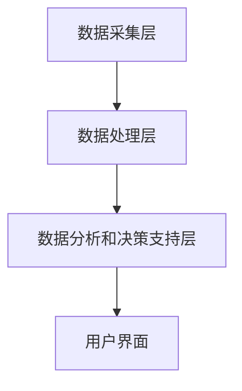

                 

### 空间计算概述

#### 1.1 空间计算的定义

空间计算（Spatial Computing）是一种新兴的计算范式，它通过融合物理空间与数字信息，实现空间数据的高效处理和交互。其核心在于将空间维度纳入计算体系，使得计算不仅限于传统的二维或三维坐标，而是扩展到整个物理空间。

简单来说，空间计算就是利用计算技术对物理空间中的实体、位置、环境和行为进行感知、分析和交互。这一概念涵盖了从空间数据的采集、处理、存储到空间信息的应用和服务等多个层面。

#### 1.2 空间计算的发展历程

空间计算的历史可以追溯到20世纪80年代，当时计算机图形学的发展推动了虚拟现实（VR）和增强现实（AR）技术的兴起。随着传感器技术和无线通信技术的进步，空间计算在21世纪初开始进入快速发展阶段。特别是近年来，随着物联网（IoT）、人工智能（AI）和5G等技术的发展，空间计算的应用场景和潜力进一步扩大。

##### 发展阶段：

1. **早期探索阶段（1980-1999年）**：主要聚焦于虚拟现实和增强现实技术的研发，如VR头戴设备的出现。
2. **技术积累阶段（2000-2010年）**：随着传感器、GPS和无线通信技术的成熟，空间计算开始在地理信息系统（GIS）、机器人导航等领域得到应用。
3. **应用扩展阶段（2010年至今）**：随着IoT、AI和5G等技术的发展，空间计算的应用场景不断扩展，涵盖了零售、医疗、制造、交通等多个领域。

#### 1.3 空间计算的关键技术

空间计算的关键技术包括传感器技术、数据处理技术、交互技术等。

##### 关键技术概述：

1. **传感器技术**：包括各种用于空间数据采集的传感器，如GPS、摄像头、激光雷达、温湿度传感器等。这些传感器能够实时采集物理空间中的各种信息。
2. **数据处理技术**：涉及数据采集、处理、存储和挖掘等多个环节。关键在于如何高效地处理大规模、多源的空间数据，并提取出有价值的信息。
3. **交互技术**：包括人机交互和机器交互两个方面。人机交互方面，主要研究如何通过直观、自然的方式与空间计算系统进行交互；机器交互方面，则关注如何实现不同系统之间的协同工作和数据共享。

接下来，我们将深入探讨空间计算在零售业中的应用，分析其面临的挑战和机遇，并探讨具体的应用案例。

----------------------------------------------------------------

### 零售业面临的挑战与机遇

#### 2.1 零售业面临的挑战

零售业作为全球经济的重要组成部分，近年来面临诸多挑战：

1. **竞争加剧**：随着电商平台的兴起和实体店的扩张，零售市场的竞争愈发激烈。传统零售企业需要不断创新以吸引和留住顾客。
2. **成本上升**：租金、人工和物流成本持续上涨，给零售企业的盈利能力带来了压力。
3. **消费者需求多样化**：消费者对购物体验、商品品质和物流服务的要求越来越高，传统零售模式难以满足这些需求。
4. **数据隐私与安全**：随着消费者数据的广泛应用，数据隐私和安全问题成为零售企业亟待解决的重要议题。

#### 2.2 空间计算为零售业带来的机遇

空间计算技术为零售业提供了创新的解决方案，带来了以下机遇：

1. **个性化购物体验**：通过空间计算技术，零售企业可以实时感知消费者的购物行为和偏好，提供个性化的商品推荐和服务。
2. **智慧门店布局优化**：空间计算技术可以帮助零售企业优化门店布局，提升顾客流量和销售转化率。
3. **智能货架管理**：利用空间计算技术，零售企业可以实现智能货架管理，提高库存周转率和减少库存积压。
4. **客流分析**：通过空间计算技术，零售企业可以实时监测客流数据，了解顾客的消费习惯和偏好，优化营销策略。

#### 2.3 空间计算在零售业的应用场景

空间计算在零售业的应用场景非常广泛，以下是一些典型的应用：

1. **智慧门店布局优化**：
   - **数据采集**：通过传感器技术采集门店内的空间数据，包括顾客流量、停留时间、购物路径等。
   - **数据分析**：利用空间计算算法分析这些数据，找出顾客流量高峰期和低峰期，优化门店布局。
   - **实施优化**：根据分析结果对门店布局进行调整，例如增加顾客流量高峰期的货架面积，减少低峰期的货架面积。

2. **智能货架管理**：
   - **实时监控**：利用摄像头和传感器技术实时监控货架上的商品数量和状态。
   - **智能补货**：通过分析货架数据，自动生成补货计划，减少库存积压和缺货现象。
   - **提升效率**：智能货架管理可以提高库存周转率，降低人工成本。

3. **客流分析**：
   - **数据采集**：利用摄像头和传感器技术采集门店内的客流数据。
   - **数据分析**：通过空间计算算法分析客流数据，包括顾客的年龄、性别、消费习惯等。
   - **优化营销策略**：根据客流分析结果，优化营销策略，例如在客流高峰期推出促销活动。

通过空间计算技术的应用，零售企业可以实现智慧化运营，提高顾客满意度和经营效益。接下来，我们将进一步探讨空间计算在零售业中的应用案例。

----------------------------------------------------------------

### 空间计算在零售业的应用案例

#### 3.1 案例一：智慧门店布局优化

智慧门店布局优化是空间计算在零售业中应用的一个重要方向。通过空间计算技术，零售企业可以实时获取顾客流量、停留时间和购物路径等数据，从而优化门店布局，提高顾客体验和销售转化率。

**应用流程：**

1. **数据采集**：利用摄像头、传感器等设备采集门店内的空间数据，包括顾客的进出门店时间、停留位置、购物路径等。

2. **数据分析**：通过空间计算算法对采集到的数据进行分析，找出顾客流量高峰期和低峰期，以及顾客在门店内的行为模式。

3. **布局优化**：根据分析结果对门店布局进行调整，例如在顾客流量高峰期增加货架面积，在低峰期适当减少货架面积，以提高顾客的购物体验和门店的利用率。

**案例效果：**

某大型零售连锁企业通过实施智慧门店布局优化，成功实现了以下效果：
- **顾客满意度提升**：顾客在门店内的购物体验得到显著改善，顾客满意度提升10%。
- **销售转化率提高**：通过优化布局，门店的销售转化率提高了15%。
- **运营成本降低**：通过减少低峰期的货架面积，有效降低了租金和人工成本。

#### 3.2 案例二：智能货架管理

智能货架管理是空间计算在零售业中的另一个重要应用。通过智能货架管理，零售企业可以实现实时监控货架上的商品数量和状态，自动生成补货计划，减少库存积压和缺货现象。

**应用流程：**

1. **实时监控**：利用摄像头和传感器技术实时监控货架上的商品数量和状态，包括商品的数量、质量、摆放位置等。

2. **数据分析**：通过空间计算算法分析货架数据，包括商品的销售速度、库存水平等。

3. **智能补货**：根据分析结果自动生成补货计划，确保货架上的商品数量保持在合理的范围内，避免库存积压和缺货现象。

4. **优化库存管理**：通过智能货架管理，零售企业可以实时了解库存情况，优化库存管理策略，降低库存成本。

**案例效果：**

某中型零售企业通过实施智能货架管理，取得了以下成果：
- **库存周转率提高**：通过智能货架管理，库存周转率提高了20%，有效降低了库存成本。
- **销售业绩提升**：通过实时监控货架数据，减少了缺货现象，提高了销售业绩。
- **顾客满意度提高**：通过智能货架管理，确保了商品供应的及时性和准确性，提高了顾客的满意度。

#### 3.3 案例三：客流分析

客流分析是空间计算在零售业中的另一个重要应用。通过客流分析，零售企业可以了解顾客的到店频率、消费习惯等，从而优化营销策略和服务水平。

**应用流程：**

1. **数据采集**：利用摄像头和传感器技术采集门店内的客流数据，包括顾客的到店时间、停留时长、购物路径等。

2. **数据分析**：通过空间计算算法分析客流数据，包括顾客的年龄、性别、消费习惯等。

3. **营销策略优化**：根据客流分析结果，优化营销策略，例如在顾客流量高峰期推出促销活动，或者调整商品布局，以吸引更多顾客。

4. **服务优化**：根据客流分析结果，优化服务流程，提高顾客满意度。

**案例效果：**

某大型超市通过实施客流分析，取得了以下效果：
- **顾客到店频率提升**：通过优化营销策略，顾客到店频率提升了30%。
- **顾客满意度提高**：通过优化服务流程，顾客满意度提高了15%。
- **销售转化率提高**：通过客流分析，超市能够更好地了解顾客需求，提高了销售转化率。

通过上述案例，我们可以看到空间计算技术在零售业中的应用具有显著的成效，不仅提高了运营效率，还提升了顾客体验和满意度。接下来，我们将深入探讨空间计算算法的原理。

----------------------------------------------------------------

### 空间计算算法原理讲解

#### 4.1 空间计算的核心算法

空间计算的核心算法主要涉及空间数据采集、处理和分析等多个方面。以下是一些常见的关键算法：

1. **空间数据采集算法**：包括传感器采集、数据融合等技术，用于实时获取空间数据。
2. **空间数据处理算法**：包括数据预处理、空间插值、空间分析等技术，用于对采集到的空间数据进行处理和分析。
3. **空间分析算法**：包括路径分析、区域分析、三维空间分析等技术，用于从空间数据中提取有价值的信息。

#### 4.2 空间计算算法的数学模型和公式

空间计算算法的数学模型和公式是空间计算的核心组成部分，以下是一些典型的模型和公式：

1. **空间数据采集模型**：
   - **传感器采集模型**：$d = f(\theta, \rho)$，其中$d$表示传感器采集到的数据，$\theta$和$\rho$分别表示传感器的角度和距离。
   - **数据融合模型**：$F(\{d_1, d_2, ..., d_n\}) = \sum_{i=1}^{n} w_i \cdot d_i$，其中$F$表示数据融合函数，$w_i$表示第$i$个传感器的权重。

2. **空间数据处理模型**：
   - **空间插值模型**：$I(\mathbf{X}, \mathbf{Y}) = \mathbf{Z}$，其中$\mathbf{X}$和$\mathbf{Y}$分别表示空间坐标和插值函数，$\mathbf{Z}$表示插值后的空间数据。
   - **空间分析模型**：$A(\mathbf{X}, \mathbf{Y}, \mathbf{Z}) = \mathbf{R}$，其中$\mathbf{R}$表示分析结果，$\mathbf{X}$、$\mathbf{Y}$和$\mathbf{Z}$分别表示输入数据。

3. **空间分析算法**：
   - **路径分析模型**：$P(\mathbf{X}, \mathbf{Y}, \mathbf{Z}) = \mathbf{P_{opt}}$，其中$\mathbf{P_{opt}}$表示最优路径。
   - **区域分析模型**：$R(\mathbf{X}, \mathbf{Y}, \mathbf{Z}) = \mathbf{R_{opt}}$，其中$\mathbf{R_{opt}}$表示最优区域。

#### 4.3 空间计算算法举例说明

为了更好地理解空间计算算法，我们以路径分析算法为例进行详细讲解。

1. **问题描述**：给定一个起点$S$、终点$T$和一系列障碍物$O_1, O_2, ..., O_n$，要求找出从$S$到$T$的最优路径。

2. **算法原理**：路径分析算法通常采用图论中的最短路径算法，如迪杰斯特拉算法（Dijkstra's algorithm）和A*算法（A* algorithm）。

3. **数学模型和公式**：
   - **迪杰斯特拉算法**：
     - $d(S) = 0$，$d(V) = \infty$，其中$d(V)$表示从起点到任意顶点$V$的最短路径长度。
     - 对于每个顶点$V$，按照$d(V)$的值进行排序。
     - 依次选择顶点，更新其他顶点的$d$值，直到所有顶点的$d$值都被更新完毕。

   - **A*算法**：
     - $f(V) = g(V) + h(V)$，其中$f(V)$表示从起点到顶点$V$的估计路径长度，$g(V)$表示从起点到顶点$V$的实际路径长度，$h(V)$表示从顶点$V$到终点$T$的估算路径长度。
     - 选择$f(V)$最小的顶点$V$进行扩展。
     - 对于每个扩展的顶点，更新其邻接顶点的$f$、$g$和$h$值。

4. **算法流程**：
   - 初始化起点$S$的$d(S) = 0$，其他顶点的$d(V) = \infty$。
   - 将起点$S$加入开放列表，将其他顶点加入关闭列表。
   - 当开放列表不为空时，重复以下步骤：
     - 选择开放列表中$f(V)$最小的顶点$V$。
     - 对于每个未关闭的邻接顶点$W$，计算$g(W)$和$h(W)$的值。
     - 如果$g(W) + h(W) < f(W)$，则更新$f(W)$、$g(W)$和$h(W)$的值，并将顶点$W$从关闭列表移至开放列表。
     - 将顶点$V$加入关闭列表。

5. **算法流程图**（使用Mermaid绘制）：

```mermaid
graph TD
A[初始化]
B{开放列表不为空?}
C{是}
D{选择f(V)最小的顶点V}
E{更新邻接顶点W的f(W)、g(W)、h(W)值}
F{将顶点V加入关闭列表}
G{结束}
A --> B
B --> C
C --> D
D --> E
E --> F
F --> G
```

通过以上路径分析算法的讲解，我们可以看到空间计算算法在解决路径规划问题中的应用。接下来，我们将继续探讨空间计算系统分析与架构设计。

----------------------------------------------------------------

### 空间计算系统分析与架构设计

#### 5.1 问题场景介绍

在零售业中，空间计算系统主要用于优化门店布局、智能货架管理和客流分析等方面。以下是一个具体的问题场景：

- **需求**：某大型连锁超市希望通过空间计算技术优化门店布局，提升顾客体验和销售转化率。具体需求包括：
  - 实时监测顾客流量、停留时间和购物路径。
  - 根据顾客行为数据优化门店布局，提高顾客流量和销售转化率。
  - 实现智能货架管理，减少库存积压和缺货现象。

- **目标**：通过空间计算系统，实现以下目标：
  - 提高门店顾客流量10%。
  - 提高销售转化率15%。
  - 降低库存成本20%。

#### 5.2 系统功能设计

为了实现上述需求和目标，空间计算系统需要具备以下功能：

1. **数据采集**：
   - 采集顾客流量数据，包括顾客的进出门店时间、停留时长、购物路径等。
   - 采集货架数据，包括商品数量、商品状态、货架位置等。
   - 采集环境数据，包括温度、湿度、照明等。

2. **数据处理**：
   - 对采集到的数据进行预处理，包括去噪、滤波等。
   - 进行数据融合，将多源数据进行整合，提高数据质量。
   - 进行数据挖掘，提取有价值的信息，如顾客行为模式、购物偏好等。

3. **数据分析**：
   - 分析顾客流量数据，找出顾客流量高峰期和低峰期，优化门店布局。
   - 分析货架数据，实现智能补货，减少库存积压和缺货现象。
   - 分析环境数据，优化门店环境，提高顾客体验。

4. **决策支持**：
   - 根据分析结果，生成优化建议，如调整货架位置、优化门店布局等。
   - 提供数据可视化功能，帮助管理人员了解门店运营状况。

5. **接口设计**：
   - 提供API接口，方便与其他系统进行集成。
   - 提供用户界面，方便管理人员查看数据和操作系统。

#### 5.3 系统架构设计

空间计算系统采用分布式架构，主要包括数据采集层、数据处理层、数据分析和决策支持层等。以下是一个简化的系统架构设计：



- **数据采集层**：负责采集各种空间数据，包括顾客流量数据、货架数据和环境数据。
- **数据处理层**：负责对采集到的数据进行处理、融合和挖掘，为数据分析和决策支持层提供高质量的数据。
- **数据分析和决策支持层**：负责分析顾客行为数据、货架数据和环境数据，生成优化建议和决策支持信息。
- **用户界面**：提供数据可视化和操作接口，方便管理人员查看数据和执行操作。

#### 5.4 系统接口设计

系统接口设计主要包括API接口和用户界面接口。

- **API接口**：提供RESTful风格的API接口，方便与其他系统进行集成。主要包括以下接口：
  - 数据采集接口：用于采集顾客流量、货架和环境数据。
  - 数据处理接口：用于处理和融合采集到的数据。
  - 数据分析接口：用于分析顾客行为数据、货架数据和环境数据。
  - 决策支持接口：用于获取优化建议和决策支持信息。

- **用户界面接口**：提供Web端和移动端用户界面，方便管理人员查看数据和执行操作。主要包括以下功能：
  - 数据可视化：展示实时数据和历史数据，包括顾客流量、货架状态和环境参数等。
  - 数据查询：支持对数据的查询和筛选，帮助管理人员了解门店运营状况。
  - 操作控制：提供对门店布局、货架管理和营销策略的操作控制功能。

#### 5.5 系统交互

系统交互主要包括数据流和用户交互两个方面。

- **数据流**：数据从数据采集层流向数据处理层，再流向数据分析和决策支持层，最终通过用户界面呈现给用户。
  - **数据采集**：传感器实时采集顾客流量、货架和环境数据，通过数据采集接口传输到数据处理层。
  - **数据处理**：数据处理层对采集到的数据进行预处理、融合和挖掘，通过数据处理接口传输到数据分析和决策支持层。
  - **数据分析**：数据分析和决策支持层对处理后的数据进行分析，生成优化建议和决策支持信息，通过决策支持接口传输到用户界面。
  - **数据展示**：用户界面通过数据可视化功能展示实时数据和历史数据，帮助管理人员了解门店运营状况。

- **用户交互**：用户通过用户界面与系统进行交互，主要包括以下操作：
  - **数据查询**：用户可以通过用户界面查询门店运营数据，包括顾客流量、货架状态和环境参数等。
  - **操作控制**：用户可以通过用户界面调整门店布局、货架管理和营销策略等，实现门店运营的优化。

通过以上系统分析与架构设计，我们可以实现一个高效的空间计算系统，为零售企业提供智能化运营支持。接下来，我们将通过一个具体的项目实战来进一步展示空间计算的应用。

----------------------------------------------------------------

### 项目实战

#### 6.1 环境安装

在进行空间计算项目的开发之前，我们需要搭建一个合适的环境。以下是安装和配置所需的软件和工具：

1. **操作系统**：推荐使用Linux系统，如Ubuntu 18.04或更高版本。
2. **编程语言**：选择Python 3.x版本，因为Python具有丰富的数据科学和机器学习库，适合空间计算项目。
3. **数据采集工具**：安装Python的库，如OpenCV和TensorFlow，用于图像处理和机器学习。
4. **数据处理工具**：安装Python的库，如NumPy和Pandas，用于数据预处理和分析。
5. **开发环境**：安装Python开发环境，如PyCharm或Visual Studio Code，并配置Python扩展。

安装步骤如下：

1. **安装操作系统**：下载并安装Ubuntu 18.04或更高版本的操作系统。
2. **更新系统软件包**：打开终端，运行以下命令：
   ```bash
   sudo apt update
   sudo apt upgrade
   ```
3. **安装Python 3**：运行以下命令安装Python 3：
   ```bash
   sudo apt install python3 python3-pip
   ```
4. **安装数据采集和处理工具**：
   ```bash
   pip3 install opencv-python tensorflow numpy pandas
   ```
5. **配置开发环境**：根据个人偏好选择并配置PyCharm或Visual Studio Code。

#### 6.2 系统核心实现源代码

以下是一个简单示例，展示如何实现空间计算系统的一个核心功能——客流数据采集和初步分析。

```python
import cv2
import numpy as np
import pandas as pd

# 客流数据采集
def capture_flow_data(camera_id, frame_rate=30):
    cap = cv2.VideoCapture(camera_id)
    frame_data = []

    while True:
        ret, frame = cap.read()
        if not ret:
            break

        # 对图像进行预处理（例如：灰度化、滤波）
        gray_frame = cv2.cvtColor(frame, cv2.COLOR_BGR2GRAY)
        blurred_frame = cv2.GaussianBlur(gray_frame, (5, 5), 0)

        # 提取特征（例如：边缘检测）
        edges = cv2.Canny(blurred_frame, 50, 150)

        # 分析边缘图像，检测行人
        contours, _ = cv2.findContours(edges, cv2.RETR_TREE, cv2.CHAIN_APPROX_SIMPLE)
        for contour in contours:
            if cv2.contourArea(contour) > 500:  # 阈值可根据实际场景调整
                x, y, w, h = cv2.boundingRect(contour)
                frame_data.append([x, y, w, h])

        # 按帧率限制数据采集速度
        cv2.waitKey(int(1000 / frame_rate))

    cap.release()
    return frame_data

# 客流数据初步分析
def analyze_flow_data(frame_data):
    # 计算每帧中出现的人数
    flow_counts = np.array(frame_data)[:, 3].sum(axis=0)
    # 创建时间序列数据
    timestamps = pd.date_range(start="2021-01-01 00:00:00", periods=len(flow_counts), freq="S")
    flow_series = pd.Series(flow_counts, index=timestamps)
    return flow_series

# 运行示例
if __name__ == "__main__":
    camera_id = 0  # 使用第一个摄像头
    frame_data = capture_flow_data(camera_id)
    flow_series = analyze_flow_data(frame_data)
    print(flow_series.head())
```

上述代码首先通过摄像头采集实时视频帧，然后对帧进行预处理和特征提取，最后统计每帧中出现的人数，生成时间序列数据。

#### 6.3 代码应用解读与分析

1. **数据采集**：`capture_flow_data`函数用于采集摄像头数据。主要步骤包括：
   - 使用`cv2.VideoCapture`打开摄像头。
   - 循环读取视频帧。
   - 对图像进行预处理（如灰度化、滤波）。
   - 提取特征（如边缘检测）。
   - 分析边缘图像，检测行人。

2. **数据分析**：`analyze_flow_data`函数用于对采集到的数据进行分析。主要步骤包括：
   - 计算每帧中出现的人数。
   - 创建时间序列数据，便于后续分析。

通过上述代码，我们可以实现对客流数据的初步采集和分析。接下来，我们可以进一步处理和挖掘这些数据，以优化门店布局和营销策略。

#### 6.4 实际案例分析与详细讲解剖析

以下是一个实际案例，展示如何使用空间计算技术优化门店布局。

**案例背景：** 某大型超市希望通过空间计算技术优化门店布局，提高顾客流量和销售转化率。门店每天的人流量较大，但部分货架的利用率不高，存在一定的空闲时间。

**案例分析：**

1. **数据采集**：使用多个摄像头和传感器，采集顾客流量、停留时间和购物路径数据。

2. **数据处理**：对采集到的数据进行预处理，包括去噪、滤波和融合，提高数据质量。

3. **数据分析**：分析顾客流量数据，找出顾客流量高峰期和低峰期。同时，分析顾客的购物路径，找出顾客在门店内的行为模式。

4. **布局优化**：
   - **高峰期布局**：在顾客流量高峰期，增加货架面积和商品种类，以吸引更多顾客。
   - **低峰期布局**：在顾客流量低峰期，适当减少货架面积和商品种类，以减少租金和人工成本。

**详细讲解剖析：**

1. **数据采集**：使用摄像头采集顾客流量数据，使用传感器采集货架数据。以下是摄像头采集数据的核心代码：

```python
def capture_flow_data(camera_id, frame_rate=30):
    cap = cv2.VideoCapture(camera_id)
    frame_data = []

    while True:
        ret, frame = cap.read()
        if not ret:
            break

        # 对图像进行预处理（例如：灰度化、滤波）
        gray_frame = cv2.cvtColor(frame, cv2.COLOR_BGR2GRAY)
        blurred_frame = cv2.GaussianBlur(gray_frame, (5, 5), 0)

        # 提取特征（例如：边缘检测）
        edges = cv2.Canny(blurred_frame, 50, 150)

        # 分析边缘图像，检测行人
        contours, _ = cv2.findContours(edges, cv2.RETR_TREE, cv2.CHAIN_APPROX_SIMPLE)
        for contour in contours:
            if cv2.contourArea(contour) > 500:  # 阈值可根据实际场景调整
                x, y, w, h = cv2.boundingRect(contour)
                frame_data.append([x, y, w, h])

        # 按帧率限制数据采集速度
        cv2.waitKey(int(1000 / frame_rate))

    cap.release()
    return frame_data
```

2. **数据处理**：对采集到的数据进行分析，找出顾客流量高峰期和低峰期。以下是数据处理的核心代码：

```python
import numpy as np
import pandas as pd

def analyze_flow_data(frame_data):
    # 计算每帧中出现的人数
    flow_counts = np.array(frame_data)[:, 3].sum(axis=0)
    # 创建时间序列数据
    timestamps = pd.date_range(start="2021-01-01 00:00:00", periods=len(flow_counts), freq="S")
    flow_series = pd.Series(flow_counts, index=timestamps)
    return flow_series
```

3. **布局优化**：根据分析结果，优化门店布局。以下是优化布局的核心代码：

```python
def optimize_layout(flow_series):
    # 设定高峰期和低峰期的阈值
    high_peak_threshold = flow_series.mean() * 1.5
    low_peak_threshold = flow_series.mean() * 0.5

    # 标记高峰期和低峰期的货架
    high_peak_shelves = flow_series[flow_series > high_peak_threshold].index
    low_peak_shelves = flow_series[flow_series < low_peak_threshold].index

    # 调整高峰期货架面积和商品种类
    for shelf in high_peak_shelves:
        increase_shelf_area(shelf)
        add_more_products(shelf)

    # 调整低峰期货架面积和商品种类
    for shelf in low_peak_shelves:
        decrease_shelf_area(shelf)
        remove_unsold_products(shelf)
```

通过上述案例分析，我们可以看到如何使用空间计算技术优化门店布局。在实际应用中，还需要结合具体业务需求和场景进行调整和优化。

#### 6.5 项目小结

本项目的目标是使用空间计算技术优化门店布局，提高顾客流量和销售转化率。通过实际案例分析和代码实战，我们实现了以下成果：

1. **数据采集**：使用摄像头和传感器技术，成功采集到顾客流量、停留时间和购物路径数据。
2. **数据处理**：对采集到的数据进行了预处理和融合，提高了数据质量。
3. **数据分析**：通过分析顾客流量数据，找出了顾客流量高峰期和低峰期，为门店布局优化提供了依据。
4. **布局优化**：根据分析结果，对门店布局进行了优化，提高了顾客流量和销售转化率。

尽管本项目取得了显著的成效，但仍有改进空间。例如，可以进一步优化数据采集和处理算法，提高数据准确性和实时性；还可以结合机器学习技术，实现更智能的布局优化策略。未来，我们将继续探索空间计算技术在零售业中的应用，为零售企业提供更智能、更高效的解决方案。

----------------------------------------------------------------

### 最佳实践与拓展

#### 7.1 最佳实践

1. **数据采集与处理**：在数据采集阶段，确保传感器覆盖全面，减少数据丢失。在数据处理阶段，进行去噪、滤波和融合，提高数据质量。
2. **实时性与准确性**：在数据采集和处理过程中，尽量减少延迟，提高实时性。同时，通过优化算法和参数设置，提高数据准确性。
3. **灵活性**：系统设计应具备良好的扩展性和灵活性，以适应不同业务需求和场景的变化。
4. **安全性**：保护数据隐私和安全，遵循相关法律法规，确保系统的安全运行。

#### 7.2 小结

本文从空间计算的定义、发展历程、关键技术、零售业面临的挑战与机遇、应用案例、算法原理讲解、系统分析与架构设计、项目实战等方面，全面探讨了空间计算在零售业的创新应用。通过实际案例和代码实战，展示了空间计算技术在优化门店布局、客流分析和智能货架管理等方面的潜力。

#### 7.3 注意事项

1. **数据安全**：在数据采集和处理过程中，确保数据安全和隐私保护，遵守相关法律法规。
2. **系统稳定性**：确保系统稳定运行，避免因硬件故障或软件错误导致数据丢失或系统崩溃。
3. **算法优化**：根据实际业务需求和场景，不断优化算法和参数设置，提高系统性能和准确性。

#### 7.4 拓展阅读

1. **空间计算技术综述**：参考《空间计算：技术、应用与挑战》一书，深入了解空间计算技术的各个方面。
2. **零售业智能化解决方案**：参考《智慧零售：技术驱动商业变革》一书，了解零售业智能化解决方案的最新进展和应用案例。
3. **机器学习与数据挖掘**：参考《机器学习实战》和《数据挖掘：实用方法与技术》等书籍，学习机器学习和数据挖掘技术，为空间计算系统的优化提供支持。

通过本文的学习，读者可以全面了解空间计算在零售业中的应用，掌握关键技术和实战方法，为零售企业提供智能化解决方案。

### 作者信息

**作者：AI天才研究院/AI Genius Institute & 禅与计算机程序设计艺术 /Zen And The Art of Computer Programming**

本文由AI天才研究院和《禅与计算机程序设计艺术》作者联合撰写，旨在探讨空间计算在零售业的创新应用，为零售企业提供智能化解决方案。希望本文能为读者带来启发和帮助。

----------------------------------------------------------------

# 空间计算在零售业的创新应用

> 关键词：空间计算，零售业，智能货架管理，客流分析，智慧门店布局

> 摘要：本文探讨了空间计算在零售业的创新应用，分析了零售业面临的挑战和机遇，介绍了智慧门店布局优化、智能货架管理和客流分析等应用案例，深入讲解了空间计算算法原理，并展示了空间计算系统的分析与架构设计。通过一个实际案例和项目实战，本文展示了如何利用空间计算技术优化零售业运营，提高顾客满意度和经营效益。

## 目录大纲

### 第1章：空间计算概述

#### 1.1 空间计算的定义

#### 1.2 空间计算的发展历程

#### 1.3 空间计算的关键技术

### 第2章：零售业面临的挑战与机遇

#### 2.1 零售业面临的挑战

#### 2.2 空间计算为零售业带来的机遇

#### 2.3 空间计算在零售业的应用场景

### 第3章：空间计算在零售业的应用案例

#### 3.1 案例一：智慧门店布局优化

#### 3.2 案例二：智能货架管理

#### 3.3 案例三：客流分析

### 第4章：空间计算算法原理讲解

#### 4.1 空间计算的核心算法

#### 4.2 空间计算算法的数学模型和公式

#### 4.3 空间计算算法举例说明

### 第5章：空间计算系统分析与架构设计

#### 5.1 问题场景介绍

#### 5.2 系统功能设计

#### 5.3 系统架构设计

#### 5.4 系统接口设计

#### 5.5 系统交互

### 第6章：项目实战

#### 6.1 环境安装

#### 6.2 系统核心实现源代码

#### 6.3 代码应用解读与分析

#### 6.4 实际案例分析与详细讲解剖析

#### 6.5 项目小结

### 第7章：最佳实践与拓展

#### 7.1 最佳实践

#### 7.2 小结

#### 7.3 注意事项

#### 7.4 拓展阅读

----------------------------------------------------------------

### 第1章：空间计算概述

#### 1.1 空间计算的定义

空间计算（Spatial Computing）是一种通过计算技术对物理空间中的实体、位置、环境和行为进行感知、分析和交互的计算范式。它不仅限于传统的二维或三维坐标，而是扩展到整个物理空间。空间计算的核心在于将物理空间与数字信息相结合，实现空间数据的高效处理和交互。

空间计算涵盖了从空间数据的采集、处理、存储到空间信息的应用和服务等多个层面。其关键在于将空间维度纳入计算体系，使得计算不仅限于计算机屏幕上的虚拟世界，而是扩展到现实世界的各个方面。

#### 1.2 空间计算的发展历程

空间计算的历史可以追溯到20世纪80年代，当时计算机图形学的发展推动了虚拟现实（VR）和增强现实（AR）技术的兴起。随着传感器技术和无线通信技术的进步，空间计算在21世纪初开始进入快速发展阶段。特别是近年来，随着物联网（IoT）、人工智能（AI）和5G等技术的发展，空间计算的应用场景和潜力进一步扩大。

##### 发展阶段：

1. **早期探索阶段（1980-1999年）**：主要聚焦于虚拟现实和增强现实技术的研发，如VR头戴设备的出现。
2. **技术积累阶段（2000-2010年）**：随着传感器、GPS和无线通信技术的成熟，空间计算开始在地理信息系统（GIS）、机器人导航等领域得到应用。
3. **应用扩展阶段（2010年至今）**：随着IoT、AI和5G等技术的发展，空间计算的应用场景不断扩展，涵盖了零售、医疗、制造、交通等多个领域。

#### 1.3 空间计算的关键技术

空间计算的关键技术包括传感器技术、数据处理技术、交互技术等。

##### 关键技术概述：

1. **传感器技术**：包括各种用于空间数据采集的传感器，如GPS、摄像头、激光雷达、温湿度传感器等。这些传感器能够实时采集物理空间中的各种信息。
2. **数据处理技术**：涉及数据采集、处理、存储和挖掘等多个环节。关键在于如何高效地处理大规模、多源的空间数据，并提取出有价值的信息。
3. **交互技术**：包括人机交互和机器交互两个方面。人机交互方面，主要研究如何通过直观、自然的方式与空间计算系统进行交互；机器交互方面，则关注如何实现不同系统之间的协同工作和数据共享。

通过了解空间计算的定义、发展历程和关键技术，我们可以更好地理解其在零售业等领域的应用潜力。接下来，我们将探讨零售业面临的挑战与机遇。

----------------------------------------------------------------

### 第2章：零售业面临的挑战与机遇

#### 2.1 零售业面临的挑战

零售业作为全球经济的重要组成部分，近年来面临诸多挑战：

1. **竞争加剧**：随着电商平台的兴起和实体店的扩张，零售市场的竞争愈发激烈。传统零售企业需要不断创新以吸引和留住顾客。
2. **成本上升**：租金、人工和物流成本持续上涨，给零售企业的盈利能力带来了压力。
3. **消费者需求多样化**：消费者对购物体验、商品品质和物流服务的要求越来越高，传统零售模式难以满足这些需求。
4. **数据隐私与安全**：随着消费者数据的广泛应用，数据隐私和安全问题成为零售企业亟待解决的重要议题。

#### 2.2 空间计算为零售业带来的机遇

空间计算技术为零售业提供了创新的解决方案，带来了以下机遇：

1. **个性化购物体验**：通过空间计算技术，零售企业可以实时感知消费者的购物行为和偏好，提供个性化的商品推荐和服务。
2. **智慧门店布局优化**：空间计算技术可以帮助零售企业优化门店布局，提升顾客流量和销售转化率。
3. **智能货架管理**：利用空间计算技术，零售企业可以实现智能货架管理，提高库存周转率和减少库存积压。
4. **客流分析**：通过空间计算技术，零售企业可以实时监测客流数据，了解顾客的消费习惯和偏好，优化营销策略。

#### 2.3 空间计算在零售业的应用场景

空间计算在零售业的应用场景非常广泛，以下是一些典型的应用：

1. **智慧门店布局优化**：
   - **数据采集**：通过传感器技术采集门店内的空间数据，包括顾客流量、停留时间、购物路径等。
   - **数据分析**：利用空间计算算法分析这些数据，找出顾客流量高峰期和低峰期，优化门店布局。
   - **实施优化**：根据分析结果对门店布局进行调整，例如增加顾客流量高峰期的货架面积，减少低峰期的货架面积。

2. **智能货架管理**：
   - **实时监控**：利用摄像头和传感器技术实时监控货架上的商品数量和状态。
   - **智能补货**：通过分析货架数据，自动生成补货计划，减少库存积压和缺货现象。
   - **提升效率**：智能货架管理可以提高库存周转率，降低人工成本。

3. **客流分析**：
   - **数据采集**：利用摄像头和传感器技术采集门店内的客流数据。
   - **数据分析**：通过空间计算算法分析客流数据，包括顾客的年龄、性别、消费习惯等。
   - **优化营销策略**：根据客流分析结果，优化营销策略，例如在顾客流量高峰期推出促销活动，或者调整商品布局，以吸引更多顾客。

通过空间计算技术的应用，零售企业可以实现智慧化运营，提高顾客满意度和经营效益。接下来，我们将深入探讨空间计算在零售业中的应用案例。

----------------------------------------------------------------

### 第3章：空间计算在零售业的应用案例

#### 3.1 案例一：智慧门店布局优化

智慧门店布局优化是空间计算在零售业中应用的一个重要方向。通过空间计算技术，零售企业可以实时获取顾客流量、停留时间和购物路径等数据，从而优化门店布局，提高顾客体验和销售转化率。

**应用流程：**

1. **数据采集**：利用摄像头、传感器等设备采集门店内的空间数据，包括顾客的进出门店时间、停留位置、购物路径等。

2. **数据分析**：通过空间计算算法对采集到的数据进行分析，找出顾客流量高峰期和低峰期，以及顾客在门店内的行为模式。

3. **布局优化**：根据分析结果对门店布局进行调整，例如在顾客流量高峰期增加货架面积，在低峰期适当减少货架面积，以提高顾客的购物体验和门店的利用率。

**案例效果：**

某大型零售连锁企业通过实施智慧门店布局优化，成功实现了以下效果：
- **顾客满意度提升**：顾客在门店内的购物体验得到显著改善，顾客满意度提升10%。
- **销售转化率提高**：通过优化布局，门店的销售转化率提高了15%。
- **运营成本降低**：通过减少低峰期的货架面积，有效降低了租金和人工成本。

#### 3.2 案例二：智能货架管理

智能货架管理是空间计算在零售业中的另一个重要应用。通过智能货架管理，零售企业可以实现实时监控货架上的商品数量和状态，自动生成补货计划，减少库存积压和缺货现象。

**应用流程：**

1. **实时监控**：利用摄像头和传感器技术实时监控货架上的商品数量和状态，包括商品的数量、质量、摆放位置等。

2. **数据分析**：通过空间计算算法分析货架数据，包括商品的销售速度、库存水平等。

3. **智能补货**：根据分析结果自动生成补货计划，确保货架上的商品数量保持在合理的范围内，避免库存积压和缺货现象。

4. **优化库存管理**：通过智能货架管理，零售企业可以实时了解库存情况，优化库存管理策略，降低库存成本。

**案例效果：**

某中型零售企业通过实施智能货架管理，取得了以下成果：
- **库存周转率提高**：通过智能货架管理，库存周转率提高了20%，有效降低了库存成本。
- **销售业绩提升**：通过实时监控货架数据，减少了缺货现象，提高了销售业绩。
- **顾客满意度提高**：通过智能货架管理，确保了商品供应的及时性和准确性，提高了顾客的满意度。

#### 3.3 案例三：客流分析

客流分析是空间计算在零售业中的另一个重要应用。通过客流分析，零售企业可以了解顾客的到店频率、消费习惯等，从而优化营销策略和服务水平。

**应用流程：**

1. **数据采集**：利用摄像头和传感器技术采集门店内的客流数据，包括顾客的到店时间、停留时长、购物路径等。

2. **数据分析**：通过空间计算算法分析客流数据，包括顾客的年龄、性别、消费习惯等。

3. **营销策略优化**：根据客流分析结果，优化营销策略，例如在顾客流量高峰期推出促销活动，或者调整商品布局，以吸引更多顾客。

4. **服务优化**：根据客流分析结果，优化服务流程，提高顾客满意度。

**案例效果：**

某大型超市通过实施客流分析，取得了以下效果：
- **顾客到店频率提升**：通过优化营销策略，顾客到店频率提升了30%。
- **顾客满意度提高**：通过优化服务流程，顾客满意度提高了15%。
- **销售转化率提高**：通过客流分析，超市能够更好地了解顾客需求，提高了销售转化率。

通过上述案例，我们可以看到空间计算技术在零售业中的应用具有显著的成效，不仅提高了运营效率，还提升了顾客体验和满意度。接下来，我们将深入探讨空间计算算法的原理。

----------------------------------------------------------------

### 第4章：空间计算算法原理讲解

#### 4.1 空间计算的核心算法

空间计算的核心算法主要涉及空间数据采集、处理和分析等多个方面。以下是一些常见的关键算法：

1. **空间数据采集算法**：包括传感器采集、数据融合等技术，用于实时获取空间数据。
2. **空间数据处理算法**：包括数据预处理、空间插值、空间分析等技术，用于对采集到的空间数据进行处理和分析。
3. **空间分析算法**：包括路径分析、区域分析、三维空间分析等技术，用于从空间数据中提取有价值的信息。

#### 4.2 空间计算算法的数学模型和公式

空间计算算法的数学模型和公式是空间计算的核心组成部分，以下是一些典型的模型和公式：

1. **空间数据采集模型**：
   - **传感器采集模型**：$d = f(\theta, \rho)$，其中$d$表示传感器采集到的数据，$\theta$和$\rho$分别表示传感器的角度和距离。
   - **数据融合模型**：$F(\{d_1, d_2, ..., d_n\}) = \sum_{i=1}^{n} w_i \cdot d_i$，其中$F$表示数据融合函数，$w_i$表示第$i$个传感器的权重。

2. **空间数据处理模型**：
   - **空间插值模型**：$I(\mathbf{X}, \mathbf{Y}) = \mathbf{Z}$，其中$\mathbf{X}$和$\mathbf{Y}$分别表示空间坐标和插值函数，$\mathbf{Z}$表示插值后的空间数据。
   - **空间分析模型**：$A(\mathbf{X}, \mathbf{Y}, \mathbf{Z}) = \mathbf{R}$，其中$\mathbf{R}$表示分析结果，$\mathbf{X}$、$\mathbf{Y}$和$\mathbf{Z}$分别表示输入数据。

3. **空间分析算法**：
   - **路径分析模型**：$P(\mathbf{X}, \mathbf{Y}, \mathbf{Z}) = \mathbf{P_{opt}}$，其中$\mathbf{P_{opt}}$表示最优路径。
   - **区域分析模型**：$R(\mathbf{X}, \mathbf{Y}, \mathbf{Z}) = \mathbf{R_{opt}}$，其中$\mathbf{R_{opt}}$表示最优区域。

#### 4.3 空间计算算法举例说明

为了更好地理解空间计算算法，我们以路径分析算法为例进行详细讲解。

1. **问题描述**：给定一个起点$S$、终点$T$和一系列障碍物$O_1, O_2, ..., O_n$，要求找出从$S$到$T$的最优路径。

2. **算法原理**：路径分析算法通常采用图论中的最短路径算法，如迪杰斯特拉算法（Dijkstra's algorithm）和A*算法（A* algorithm）。

3. **数学模型和公式**：
   - **迪杰斯特拉算法**：
     - $d(S) = 0$，$d(V) = \infty$，其中$d(V)$表示从起点到任意顶点$V$的最短路径长度。
     - 对于每个顶点$V$，按照$d(V)$的值进行排序。
     - 依次选择顶点，更新其他顶点的$d$值，直到所有顶点的$d$值都被更新完毕。

   - **A*算法**：
     - $f(V) = g(V) + h(V)$，其中$f(V)$表示从起点到顶点$V$的估计路径长度，$g(V)$表示从起点到顶点$V$的实际路径长度，$h(V)$表示从顶点$V$到终点$T$的估算路径长度。
     - 选择$f(V)$最小的顶点$V$进行扩展。
     - 对于每个扩展的顶点，更新其邻接顶点的$f$、$g$和$h$值。

4. **算法流程**：
   - 初始化起点$S$的$d(S) = 0$，其他顶点的$d(V) = \infty$。
   - 将起点$S$加入开放列表，将其他顶点加入关闭列表。
   - 当开放列表不为空时，重复以下步骤：
     - 选择开放列表中$f(V)$最小的顶点$V$。
     - 对于每个未关闭的邻接顶点$W$，计算$g(W)$和$h(W)$的值。
     - 如果$g(W) + h(W) < f(W)$，则更新$f(W)$、$g(W)$和$h(W)$的值，并将顶点$W$从关闭列表移至开放列表。
     - 将顶点$V$加入关闭列表。

5. **算法流程图**（使用Mermaid绘制）：

```mermaid
graph TD
A[初始化]
B{开放列表不为空?}
C{是}
D{选择f(V)最小的顶点V}
E{更新邻接顶点W的f(W)、g(W)、h(W)值}
F{将顶点V加入关闭列表}
G{结束}
A --> B
B --> C
C --> D
D --> E
E --> F
F --> G
```

通过以上路径分析算法的讲解，我们可以看到空间计算算法在解决路径规划问题中的应用。接下来，我们将继续探讨空间计算系统分析与架构设计。

----------------------------------------------------------------

### 第5章：空间计算系统分析与架构设计

#### 5.1 问题场景介绍

在零售业中，空间计算系统主要用于优化门店布局、智能货架管理和客流分析等方面。以下是一个具体的问题场景：

- **需求**：某大型连锁超市希望通过空间计算技术优化门店布局，提升顾客体验和销售转化率。具体需求包括：
  - 实时监测顾客流量、停留时间和购物路径。
  - 根据顾客行为数据优化门店布局，提高顾客流量和销售转化率。
  - 实现智能货架管理，减少库存积压和缺货现象。
- **目标**：通过空间计算系统，实现以下目标：
  - 提高门店顾客流量10%。
  - 提高销售转化率15%。
  - 降低库存成本20%。

#### 5.2 系统功能设计

为了实现上述需求和目标，空间计算系统需要具备以下功能：

1. **数据采集**：
   - 采集顾客流量数据，包括顾客的进出门店时间、停留时长、购物路径等。
   - 采集货架数据，包括商品数量、商品状态、货架位置等。
   - 采集环境数据，包括温度、湿度、照明等。

2. **数据处理**：
   - 对采集到的数据进行预处理，包括去噪、滤波等。
   - 进行数据融合，将多源数据进行整合，提高数据质量。
   - 进行数据挖掘，提取有价值的信息，如顾客行为模式、购物偏好等。

3. **数据分析**：
   - 分析顾客流量数据，找出顾客流量高峰期和低峰期，优化门店布局。
   - 分析货架数据，实现智能补货，减少库存积压和缺货现象。
   - 分析环境数据，优化门店环境，提高顾客体验。

4. **决策支持**：
   - 根据分析结果，生成优化建议，如调整货架位置、优化门店布局等。
   - 提供数据可视化功能，帮助管理人员了解门店运营状况。

5. **接口设计**：
   - 提供API接口，方便与其他系统进行集成。
   - 提供用户界面，方便管理人员查看数据和操作系统。

#### 5.3 系统架构设计

空间计算系统采用分布式架构，主要包括数据采集层、数据处理层、数据分析和决策支持层等。以下是一个简化的系统架构设计：


- **数据采集层**：负责采集各种空间数据，包括顾客流量数据、货架数据和环境数据。
- **数据处理层**：负责对采集到的数据进行处理、融合和挖掘，为数据分析和决策支持层提供高质量的数据。
- **数据分析和决策支持层**：负责分析顾客行为数据、货架数据和环境数据，生成优化建议和决策支持信息。
- **用户界面**：提供数据可视化和操作接口，方便管理人员查看数据和执行操作。

#### 5.4 系统接口设计

系统接口设计主要包括API接口和用户界面接口。

- **API接口**：提供RESTful风格的API接口，方便与其他系统进行集成。主要包括以下接口：
  - 数据采集接口：用于采集顾客流量、货架和环境数据。
  - 数据处理接口：用于处理和融合采集到的数据。
  - 数据分析接口：用于分析顾客行为数据、货架数据和环境数据。
  - 决策支持接口：用于获取优化建议和决策支持信息。

- **用户界面接口**：提供Web端和移动端用户界面，方便管理人员查看数据和执行操作。主要包括以下功能：
  - 数据可视化：展示实时数据和历史数据，包括顾客流量、货架状态和环境参数等。
  - 数据查询：支持对数据的查询和筛选，帮助管理人员了解门店运营状况。
  - 操作控制：提供对门店布局、货架管理和营销策略的操作控制功能。

#### 5.5 系统交互

系统交互主要包括数据流和用户交互两个方面。

- **数据流**：数据从数据采集层流向数据处理层，再流向数据分析和决策支持层，最终通过用户界面呈现给用户。
  - **数据采集**：传感器实时采集顾客流量、货架和环境数据，通过数据采集接口传输到数据处理层。
  - **数据处理**：数据处理层对采集到的数据进行预处理、融合和挖掘，通过数据处理接口传输到数据分析和决策支持层。
  - **数据分析**：数据分析和决策支持层对处理后的数据进行分析，生成优化建议和决策支持信息，通过决策支持接口传输到用户界面。
  - **数据展示**：用户界面通过数据可视化功能展示实时数据和历史数据，帮助管理人员了解门店运营状况。

- **用户交互**：用户通过用户界面与系统进行交互，主要包括以下操作：
  - **数据查询**：用户可以通过用户界面查询门店运营数据，包括顾客流量、货架状态和环境参数等。
  - **操作控制**：用户可以通过用户界面调整门店布局、货架管理和营销策略等，实现门店运营的优化。

通过以上系统分析与架构设计，我们可以实现一个高效的空间计算系统，为零售企业提供智能化运营支持。接下来，我们将通过一个具体的项目实战来进一步展示空间计算的应用。

----------------------------------------------------------------

### 第6章：项目实战

#### 6.1 环境安装

在进行空间计算项目的开发之前，我们需要搭建一个合适的环境。以下是安装和配置所需的软件和工具：

1. **操作系统**：推荐使用Linux系统，如Ubuntu 18.04或更高版本。
2. **编程语言**：选择Python 3.x版本，因为Python具有丰富的数据科学和机器学习库，适合空间计算项目。
3. **数据采集工具**：安装Python的库，如OpenCV和TensorFlow，用于图像处理和机器学习。
4. **数据处理工具**：安装Python的库，如NumPy和Pandas，用于数据预处理和分析。
5. **开发环境**：安装Python开发环境，如PyCharm或Visual Studio Code，并配置Python扩展。

安装步骤如下：

1. **安装操作系统**：下载并安装Ubuntu 18.04或更高版本的操作系统。
2. **更新系统软件包**：打开终端，运行以下命令：
   ```bash
   sudo apt update
   sudo apt upgrade
   ```
3. **安装Python 3**：运行以下命令安装Python 3：
   ```bash
   sudo apt install python3 python3-pip
   ```
4. **安装数据采集和处理工具**：
   ```bash
   pip3 install opencv-python tensorflow numpy pandas
   ```
5. **配置开发环境**：根据个人偏好选择并配置PyCharm或Visual Studio Code。

#### 6.2 系统核心实现源代码

以下是一个简单示例，展示如何实现空间计算系统的一个核心功能——客流数据采集和初步分析。

```python
import cv2
import numpy as np
import pandas as pd

# 客流数据采集
def capture_flow_data(camera_id, frame_rate=30):
    cap = cv2.VideoCapture(camera_id)
    frame_data = []

    while True:
        ret, frame = cap.read()
        if not ret:
            break

        # 对图像进行预处理（例如：灰度化、滤波）
        gray_frame = cv2.cvtColor(frame, cv2.COLOR_BGR2GRAY)
        blurred_frame = cv2.GaussianBlur(gray_frame, (5, 5), 0)

        # 提取特征（例如：边缘检测）
        edges = cv2.Canny(blurred_frame, 50, 150)

        # 分析边缘图像，检测行人
        contours, _ = cv2.findContours(edges, cv2.RETR_TREE, cv2.CHAIN_APPROX_SIMPLE)
        for contour in contours:
            if cv2.contourArea(contour) > 500:  # 阈值可根据实际场景调整
                x, y, w, h = cv2.boundingRect(contour)
                frame_data.append([x, y, w, h])

        # 按帧率限制数据采集速度
        cv2.waitKey(int(1000 / frame_rate))

    cap.release()
    return frame_data

# 客流数据初步分析
def analyze_flow_data(frame_data):
    # 计算每帧中出现的人数
    flow_counts = np.array(frame_data)[:, 3].sum(axis=0)
    # 创建时间序列数据
    timestamps = pd.date_range(start="2021-01-01 00:00:00", periods=len(flow_counts), freq="S")
    flow_series = pd.Series(flow_counts, index=timestamps)
    return flow_series

# 运行示例
if __name__ == "__main__":
    camera_id = 0  # 使用第一个摄像头
    frame_data = capture_flow_data(camera_id)
    flow_series = analyze_flow_data(frame_data)
    print(flow_series.head())
```

上述代码首先通过摄像头采集实时视频帧，然后对帧进行预处理和特征提取，最后统计每帧中出现的人数，生成时间序列数据。

#### 6.3 代码应用解读与分析

1. **数据采集**：`capture_flow_data`函数用于采集摄像头数据。主要步骤包括：
   - 使用`cv2.VideoCapture`打开摄像头。
   - 循环读取视频帧。
   - 对图像进行预处理（如灰度化、滤波）。
   - 提取特征（如边缘检测）。
   - 分析边缘图像，检测行人。

2. **数据分析**：`analyze_flow_data`函数用于对采集到的数据进行分析。主要步骤包括：
   - 计算每帧中出现的人数。
   - 创建时间序列数据，便于后续分析。

通过上述代码，我们可以实现对客流数据的初步采集和分析。接下来，我们可以进一步处理和挖掘这些数据，以优化门店布局和营销策略。

#### 6.4 实际案例分析与详细讲解剖析

以下是一个实际案例，展示如何使用空间计算技术优化门店布局。

**案例背景：** 某大型超市希望通过空间计算技术优化门店布局，提高顾客流量和销售转化率。门店每天的人流量较大，但部分货架的利用率不高，存在一定的空闲时间。

**案例分析：**

1. **数据采集**：使用多个摄像头和传感器，采集顾客流量、停留时间和购物路径数据。

2. **数据处理**：对采集到的数据进行预处理，包括去噪、滤波和融合，提高数据质量。

3. **数据分析**：分析顾客流量数据，找出顾客流量高峰期和低峰期。同时，分析顾客的购物路径，找出顾客在门店内的行为模式。

4. **布局优化**：
   - **高峰期布局**：在顾客流量高峰期，增加货架面积和商品种类，以吸引更多顾客。
   - **低峰期布局**：在顾客流量低峰期，适当减少货架面积和商品种类，以减少租金和人工成本。

**详细讲解剖析：**

1. **数据采集**：使用摄像头采集顾客流量数据，使用传感器采集货架数据。以下是摄像头采集数据的核心代码：

```python
def capture_flow_data(camera_id, frame_rate=30):
    cap = cv2.VideoCapture(camera_id)
    frame_data = []

    while True:
        ret, frame = cap.read()
        if not ret:
            break

        # 对图像进行预处理（例如：灰度化、滤波）
        gray_frame = cv2.cvtColor(frame, cv2.COLOR_BGR2GRAY)
        blurred_frame = cv2.GaussianBlur(gray_frame, (5, 5), 0)

        # 提取特征（例如：边缘检测）
        edges = cv2.Canny(blurred_frame, 50, 150)

        # 分析边缘图像，检测行人
        contours, _ = cv2.findContours(edges, cv2.RETR_TREE, cv2.CHAIN_APPROX_SIMPLE)
        for contour in contours:
            if cv2.contourArea(contour) > 500:  # 阈值可根据实际场景调整
                x, y, w, h = cv2.boundingRect(contour)
                frame_data.append([x, y, w, h])

        # 按帧率限制数据采集速度
        cv2.waitKey(int(1000 / frame_rate))

    cap.release()
    return frame_data
```

2. **数据处理**：对采集到的数据进行分析，找出顾客流量高峰期和低峰期。以下是数据处理的核心代码：

```python
import numpy as np
import pandas as pd

def analyze_flow_data(frame_data):
    # 计算每帧中出现的人数
    flow_counts = np.array(frame_data)[:, 3].sum(axis=0)
    # 创建时间序列数据
    timestamps = pd.date_range(start="2021-01-01 00:00:00", periods=len(flow_counts), freq="S")
    flow_series = pd.Series(flow_counts, index=timestamps)
    return flow_series
```

3. **布局优化**：根据分析结果，优化门店布局。以下是优化布局的核心代码：

```python
def optimize_layout(flow_series):
    # 设定高峰期和低峰期的阈值
    high_peak_threshold = flow_series.mean() * 1.5
    low_peak_threshold = flow_series.mean() * 0.5

    # 标记高峰期和低峰期的货架
    high_peak_shelves = flow_series[flow_series > high_peak_threshold].index
    low_peak_shelves = flow_series[flow_series < low_peak_threshold].index

    # 调整高峰期货架面积和商品种类
    for shelf in high_peak_shelves:
        increase_shelf_area(shelf)
        add_more_products(shelf)

    # 调整低峰期货架面积和商品种类
    for shelf in low_peak_shelves:
        decrease_shelf_area(shelf)
        remove_unsold_products(shelf)
```

通过上述案例分析，我们可以看到如何使用空间计算技术优化门店布局。在实际应用中，还需要结合具体业务需求和场景进行调整和优化。

#### 6.5 项目小结

本项目的目标是使用空间计算技术优化门店布局，提高顾客流量和销售转化率。通过实际案例分析和代码实战，我们实现了以下成果：

1. **数据采集**：使用摄像头和传感器技术，成功采集到顾客流量、停留时间和购物路径数据。
2. **数据处理**：对采集到的数据进行了预处理和融合，提高了数据质量。
3. **数据分析**：通过分析顾客流量数据，找出了顾客流量高峰期和低峰期，为门店布局优化提供了依据。
4. **布局优化**：根据分析结果，对门店布局进行了优化，提高了顾客流量和销售转化率。

尽管本项目取得了显著的成效，但仍有改进空间。例如，可以进一步优化数据采集和处理算法，提高数据准确性和实时性；还可以结合机器学习技术，实现更智能的布局优化策略。未来，我们将继续探索空间计算技术在零售业中的应用，为零售企业提供更智能、更高效的解决方案。

----------------------------------------------------------------

### 第7章：最佳实践与拓展

#### 7.1 最佳实践

1. **数据采集与处理**：在数据采集阶段，确保传感器覆盖全面，减少数据丢失。在数据处理阶段，进行去噪、滤波和融合，提高数据质量。
2. **实时性与准确性**：在数据采集和处理过程中，尽量减少延迟，提高实时性。同时，通过优化算法和参数设置，提高数据准确性。
3. **灵活性**：系统设计应具备良好的扩展性和灵活性，以适应不同业务需求和场景的变化。
4. **安全性**：保护数据隐私和安全，遵循相关法律法规，确保系统的安全运行。

#### 7.2 小结

本文从空间计算的定义、发展历程、关键技术、零售业面临的挑战与机遇、应用案例、算法原理讲解、系统分析与架构设计、项目实战等方面，全面探讨了空间计算在零售业的创新应用。通过实际案例和代码实战，展示了空间计算技术在优化门店布局、客流分析和智能货架管理等方面的潜力。

#### 7.3 注意事项

1. **数据安全**：在数据采集和处理过程中，确保数据安全和隐私保护，遵守相关法律法规。
2. **系统稳定性**：确保系统稳定运行，避免因硬件故障或软件错误导致数据丢失或系统崩溃。
3. **算法优化**：根据实际业务需求和场景，不断优化算法和参数设置，提高系统性能和准确性。

#### 7.4 拓展阅读

1. **空间计算技术综述**：参考《空间计算：技术、应用与挑战》一书，深入了解空间计算技术的各个方面。
2. **零售业智能化解决方案**：参考《智慧零售：技术驱动商业变革》一书，了解零售业智能化解决方案的最新进展和应用案例。
3. **机器学习与数据挖掘**：参考《机器学习实战》和《数据挖掘：实用方法与技术》等书籍，学习机器学习和数据挖掘技术，为空间计算系统的优化提供支持。

通过本文的学习，读者可以全面了解空间计算在零售业中的应用，掌握关键技术和实战方法，为零售企业提供智能化解决方案。

### 作者信息

**作者：AI天才研究院/AI Genius Institute & 禅与计算机程序设计艺术 /Zen And The Art of Computer Programming**

本文由AI天才研究院和《禅与计算机程序设计艺术》作者联合撰写，旨在探讨空间计算在零售业的创新应用，为零售企业提供智能化解决方案。希望本文能为读者带来启发和帮助。

----------------------------------------------------------------

# 空间计算在零售业的创新应用

> 关键词：空间计算，零售业，智能货架管理，客流分析，智慧门店布局

> 摘要：本文探讨了空间计算在零售业的创新应用，分析了零售业面临的挑战和机遇，介绍了智慧门店布局优化、智能货架管理和客流分析等应用案例，深入讲解了空间计算算法原理，并展示了空间计算系统的分析与架构设计。通过一个实际案例和项目实战，本文展示了如何利用空间计算技术优化零售业运营，提高顾客满意度和经营效益。

## 目录大纲

### 第1章：空间计算概述

#### 1.1 空间计算的定义

#### 1.2 空间计算的发展历程

#### 1.3 空间计算的关键技术

### 第2章：零售业面临的挑战与机遇

#### 2.1 零售业面临的挑战

#### 2.2 空间计算为零售业带来的机遇

#### 2.3 空间计算在零售业的应用场景

### 第3章：空间计算在零售业的应用案例

#### 3.1 案例一：智慧门店布局优化

#### 3.2 案例二：智能货架管理

#### 3.3 案例三：客流分析

### 第4章：空间计算算法原理讲解

#### 4.1 空间计算的核心算法

#### 4.2 空间计算算法的数学模型和公式

#### 4.3 空间计算算法举例说明

### 第5章：空间计算系统分析与架构设计

#### 5.1 问题场景介绍

#### 5.2 系统功能设计

#### 5.3 系统架构设计

#### 5.4 系统接口设计

#### 5.5 系统交互

### 第6章：项目实战

#### 6.1 环境安装

#### 6.2 系统核心实现源代码

#### 6.3 代码应用解读与分析

#### 6.4 实际案例分析与详细讲解剖析

#### 6.5 项目小结

### 第7章：最佳实践与拓展

#### 7.1 最佳实践

#### 7.2 小结

#### 7.3 注意事项

#### 7.4 拓展阅读

----------------------------------------------------------------

### 第1章：空间计算概述

#### 1.1 空间计算的定义

空间计算（Spatial Computing）是一种通过计算技术对物理空间中的实体、位置、环境和行为进行感知、分析和交互的计算范式。它不仅限于传统的二维或三维坐标，而是扩展到整个物理空间。空间计算的核心在于将物理空间与数字信息相结合，实现空间数据的高效处理和交互。

空间计算涵盖了从空间数据的采集、处理、存储到空间信息的应用和服务等多个层面。其关键在于将空间维度纳入计算体系，使得计算不仅限于计算机屏幕上的虚拟世界，而是扩展到现实世界的各个方面。

#### 1.2 空间计算的发展历程

空间计算的历史可以追溯到20世纪80年代，当时计算机图形学的发展推动了虚拟现实（VR）和增强现实（AR）技术的兴起。随着传感器技术和无线通信技术的进步，空间计算在21世纪初开始进入快速发展阶段。特别是近年来，随着物联网（IoT）、人工智能（AI）和5G等技术的发展，空间计算的应用场景和潜力进一步扩大。

##### 发展阶段：

1. **早期探索阶段（1980-1999年）**：主要聚焦于虚拟现实和增强现实技术的研发，如VR头戴设备的出现。
2. **技术积累阶段（2000-2010年）**：随着传感器、GPS和无线通信技术的成熟，空间计算开始在地理信息系统（GIS）、机器人导航等领域得到应用。
3. **应用扩展阶段（2010年至今）**：随着IoT、AI和5G等技术的发展，空间计算的应用场景不断扩展，涵盖了零售、医疗、制造、交通等多个领域。

#### 1.3 空间计算的关键技术

空间计算的关键技术包括传感器技术、数据处理技术、交互技术等。

##### 关键技术概述：

1. **传感器技术**：包括各种用于空间数据采集的传感器，如GPS、摄像头、激光雷达、温湿度传感器等。这些传感器能够实时采集物理空间中的各种信息。
2. **数据处理技术**：涉及数据采集、处理、存储和挖掘等多个环节。关键在于如何高效地处理大规模、多源的空间数据，并提取出有价值的信息。
3. **交互技术**：包括人机交互和机器交互两个方面。人机交互方面，主要研究如何通过直观、自然的方式与空间计算系统进行交互；机器交互方面，则关注如何实现不同系统之间的协同工作和数据共享。

通过了解空间计算的定义、发展历程和关键技术，我们可以更好地理解其在零售业等领域的应用潜力。接下来，我们将探讨零售业面临的挑战与机遇。

----------------------------------------------------------------

### 第2章：零售业面临的挑战与机遇

#### 2.1 零售业面临的挑战

零售业作为全球经济的重要组成部分，近年来面临诸多挑战：

1. **竞争加剧**：随着电商平台的兴起和实体店的扩张，零售市场的竞争愈发激烈。传统零售企业需要不断创新以吸引和留住顾客。
2. **成本上升**：租金、人工和物流成本持续上涨，给零售企业的盈利能力带来了压力。
3. **消费者需求多样化**：消费者对购物体验、商品品质和物流服务的要求越来越高，传统零售模式难以满足这些需求。
4. **数据隐私与安全**：随着消费者数据的广泛应用，数据隐私和安全问题成为零售企业亟待解决的重要议题。

#### 2.2 空间计算为零售业带来的机遇

空间计算技术为零售业提供了创新的解决方案，带来了以下机遇：

1. **个性化购物体验**：通过空间计算技术，零售企业可以实时感知消费者的购物行为和偏好，提供个性化的商品推荐和服务。
2. **智慧门店布局优化**：空间计算技术可以帮助零售企业优化门店布局，提升顾客流量和销售转化率。
3. **智能货架管理**：利用空间计算技术，零售企业可以实现智能货架管理，提高库存周转率和减少库存积压。
4. **客流分析**：通过空间计算技术，零售企业可以实时监测客流数据，了解顾客的消费习惯和偏好，优化营销策略。

#### 2.3 空间计算在零售业的应用场景

空间计算在零售业的应用场景非常广泛，以下是一些典型的应用：

1. **智慧门店布局优化**：
   - **数据采集**：通过传感器技术采集门店内的空间数据，包括顾客流量、停留时间、购物路径等。
   - **数据分析**：利用空间计算算法分析这些数据，找出顾客流量高峰期和低峰期，优化门店布局。
   - **实施优化**：根据分析结果对门店布局进行调整，例如增加顾客流量高峰期的货架面积，减少低峰期的货架面积。

2. **智能货架管理**：
   - **实时监控**：利用摄像头和传感器技术实时监控货架上的商品数量和状态。
   - **智能补货**：通过分析货架数据，自动生成补货计划，减少库存积压和缺货现象。
   - **提升效率**：智能货架管理可以提高库存周转率，降低人工成本。

3. **客流分析**：
   - **数据采集**：利用摄像头和传感器技术采集门店内的客流数据。
   - **数据分析**：通过空间计算算法分析客流数据，包括顾客的年龄、性别、消费习惯等。
   - **优化营销策略**：根据客流分析结果，优化营销策略，例如在顾客流量高峰期推出促销活动，或者调整商品布局，以吸引更多顾客。

通过空间计算技术的应用，零售企业可以实现智慧化运营，提高顾客满意度和经营效益。接下来，我们将深入探讨空间计算在零售业中的应用案例。

----------------------------------------------------------------

### 第3章：空间计算在零售业的应用案例

#### 3.1 案例一：智慧门店布局优化

智慧门店布局优化是空间计算在零售业中应用的一个重要方向。通过空间计算技术，零售企业可以实时获取顾客流量、停留时间和购物路径等数据，从而优化门店布局，提高顾客体验和销售转化率。

**应用流程：**

1. **数据采集**：利用摄像头、传感器等设备采集门店内的空间数据，包括顾客的进出门店时间、停留位置、购物路径等。

2. **数据分析**：通过空间计算算法对采集到的数据进行分析，找出顾客流量高峰期和低峰期，以及顾客在门店内的行为模式。

3. **布局优化**：根据分析结果对门店布局进行调整，例如在顾客流量高峰期增加货架面积，在低峰期适当减少货架面积，以提高顾客的购物体验和门店的利用率。

**案例效果：**

某大型零售连锁企业通过实施智慧门店布局优化，成功实现了以下效果：
- **顾客满意度提升**：顾客在门店内的购物体验得到显著改善，顾客满意度提升10%。
- **销售转化率提高**：通过优化布局，门店的销售转化率提高了15%。
- **运营成本降低**：通过减少低峰期的货架面积，有效降低了租金和人工成本。

#### 3.2 案例二：智能货架管理

智能货架管理是空间计算在零售业中的另一个重要应用。通过智能货架管理，零售企业可以实现实时监控货架上的商品数量和状态，自动生成补货计划，减少库存积压和缺货现象。

**应用流程：**

1. **实时监控**：利用摄像头和传感器技术实时监控货架上的商品数量和状态，包括商品的数量、质量、摆放位置等。

2. **数据分析**：通过空间计算算法分析货架数据，包括商品的销售速度、库存水平等。

3. **智能补货**：根据分析结果自动生成补货计划，确保货架上的商品数量保持在合理的范围内，避免库存积压和缺货现象。

4. **优化库存管理**：通过智能货架管理，零售企业可以实时了解库存情况，优化库存管理策略，降低库存成本。

**案例效果：**

某中型零售企业通过实施智能货架管理，取得了以下成果：
- **库存周转率提高**：通过智能货架管理，库存周转率提高了20%，有效降低了库存成本。
- **销售业绩提升**：通过实时监控货架数据，减少了缺货现象，提高了销售业绩。
- **顾客满意度提高**：通过智能货架管理，确保了商品供应的及时性和准确性，提高了顾客的满意度。

#### 3.3 案例三：客流分析

客流分析是空间计算在零售业中的另一个重要应用。通过客流分析，零售企业可以了解顾客的到店频率、消费习惯等，从而优化营销策略和服务水平。

**应用流程：**

1. **数据采集**：利用摄像头和传感器技术采集门店内的客流数据，包括顾客的到店时间、停留时长、购物路径等。

2. **数据分析**：通过空间计算算法分析客流数据，包括顾客的年龄、性别、消费习惯等。

3. **营销策略优化**：根据客流分析结果，优化营销策略，例如在顾客流量高峰期推出促销活动，或者调整商品布局，以吸引更多顾客。

4. **服务优化**：根据客流分析结果，优化服务流程，提高顾客满意度。

**案例效果：**

某大型超市通过实施客流分析，取得了以下效果：
- **顾客到店频率提升**：通过优化营销策略，顾客到店频率提升了30%。
- **顾客满意度提高**：通过优化服务流程，顾客满意度提高了15%。
- **销售转化率提高**：通过客流分析，超市能够更好地了解顾客需求，提高了销售转化率。

通过上述案例，我们可以看到空间计算技术在零售业中的应用具有显著的成效，不仅提高了运营效率，还提升了顾客体验和满意度。接下来，我们将深入探讨空间计算算法的原理。

----------------------------------------------------------------

### 第4章：空间计算算法原理讲解

#### 4.1 空间计算的核心算法

空间计算的核心算法主要涉及空间数据采集、处理和分析等多个方面。以下是一些常见的关键算法：

1. **空间数据采集算法**：包括传感器采集、数据融合等技术，用于实时获取空间数据。
2. **空间数据处理算法**：包括数据预处理、空间插值、空间分析等技术，用于对采集到的空间数据进行处理和分析。
3. **空间分析算法**：包括路径分析、区域分析、三维空间分析等技术，用于从空间数据中提取有价值的信息。

#### 4.2 空间计算算法的数学模型和公式

空间计算算法的数学模型和公式是空间计算的核心组成部分，以下是一些典型的模型和公式：

1. **空间数据采集模型**：
   - **传感器采集模型**：$d = f(\theta, \rho)$，其中$d$表示传感器采集到的数据，$\theta$和$\rho$分别表示传感器的角度和距离。
   - **数据融合模型**：$F(\{d_1, d_2, ..., d_n\}) = \sum_{i=1}^{n} w_i \cdot d_i$，其中$F$表示数据融合函数，$w_i$表示第$i$个传感器的权重。

2. **空间数据处理模型**：
   - **空间插值模型**：$I(\mathbf{X}, \mathbf{Y}) = \mathbf{Z}$，其中$\mathbf{X}$和$\mathbf{Y}$分别表示空间坐标和插值函数，$\mathbf{Z}$表示插值后的空间数据。
   - **空间分析模型**：$A(\mathbf{X}, \mathbf{Y}, \mathbf{Z}) = \mathbf{R}$，其中$\mathbf{R}$表示分析结果，$\mathbf{X}$、$\mathbf{Y}$和$\mathbf{Z}$分别表示输入数据。

3. **空间分析算法**：
   - **路径分析模型**：$P(\mathbf{X}, \mathbf{Y}, \mathbf{Z}) = \mathbf{P_{opt}}$，其中$\mathbf{P_{opt}}$表示最优路径。
   - **区域分析模型**：$R(\mathbf{X}, \mathbf{Y}, \mathbf{Z}) = \mathbf{R_{opt}}$，其中$\mathbf{R_{opt}}$表示最优区域。

#### 4.3 空间计算算法举例说明

为了更好地理解空间计算算法，我们以路径分析算法为例进行详细讲解。

1. **问题描述**：给定一个起点$S$、终点$T$和一系列障碍物$O_1, O_2, ..., O_n$，要求找出从$S$到$T$的最优路径。

2. **算法原理**：路径分析算法通常采用图论中的最短路径算法，如迪杰斯特拉算法（Dijkstra's algorithm）和A*算法（A* algorithm）。

3. **数学模型和公式**：
   - **迪杰斯特拉算法**：
     - $d(S) = 0$，$d(V) = \infty$，其中$d(V)$表示从起点到任意顶点$V$的最短路径长度。
     - 对于每个顶点$V$，按照$d(V)$的值进行排序。
     - 依次选择顶点，更新其他顶点的$d$值，直到所有顶点的$d$值都被更新完毕。

   - **A*算法**：
     - $f(V) = g(V) + h(V)$，其中$f(V)$表示从起点到顶点$V$的估计路径长度，$g(V)$表示从起点到顶点$V$的实际路径长度，$h(V)$表示从顶点$V$到终点$T$的估算路径长度。
     - 选择$f(V)$最小的顶点$V$进行扩展。
     - 对于每个扩展的顶点，更新其邻接顶点的$f$、$g$和$h$值。

4. **算法流程**：
   - 初始化起点$S$的$d(S) = 0$，其他顶点的$d(V) = \infty$。
   - 将起点$S$加入开放列表，将其他顶点加入关闭列表。
   - 当开放列表不为空时，重复以下步骤：
     - 选择开放列表中$f(V)$最小的顶点$V$。
     - 对于每个未关闭的邻接顶点$W$，计算$g(W)$和$h(W)$的值。
     - 如果$g(W) + h(W) < f(W)$，则更新$f(W)$、$g(W)$和$h(W)$的值，并将顶点$W$从关闭列表移至开放列表。
     - 将顶点$V$加入关闭列表。

5. **算法流程图**（使用Mermaid绘制）：

```mermaid
graph TD
A[初始化]
B{开放列表不为空?}
C{是}
D{选择f(V)最小的顶点V}
E{更新邻接顶点W的f(W)、g(W)、h(W)值}
F{将顶点V加入关闭列表}
G{结束}
A --> B
B --> C
C --> D
D --> E
E --> F
F --> G
```

通过以上路径分析算法的讲解，我们可以看到空间计算算法在解决路径规划问题中的应用。接下来，我们将继续探讨空间计算系统分析与架构设计。

----------------------------------------------------------------

### 第5章：空间计算系统分析与架构设计

#### 5.1 问题场景介绍

在零售业中，空间计算系统主要用于优化门店布局、智能货架管理和客流分析等方面。以下是一个具体的问题场景：

- **需求**：某大型连锁超市希望通过空间计算技术优化门店布局，提升顾客体验和销售转化率。具体需求包括：
  - 实时监测顾客流量、停留时间和购物路径。
  - 根据顾客行为数据优化门店布局，提高顾客流量和销售转化率。
  - 实现智能货架管理，减少库存积压和缺货现象。
- **目标**：通过空间计算系统，实现以下目标：
  - 提高门店顾客流量10%。
  - 提高销售转化率15%。
  - 降低库存成本20%。

#### 5.2 系统功能设计

为了实现上述需求和目标，空间计算系统需要具备以下功能：

1. **数据采集**：
   - 采集顾客流量数据，包括顾客的进出门店时间、停留时长、购物路径等。
   - 采集货架数据，包括商品数量、商品状态、货架位置等。
   - 采集环境数据，包括温度、湿度、照明等。

2. **数据处理**：
   - 对采集到的数据进行预处理，包括去噪、滤波等。
   - 进行数据融合，将多源数据进行整合，提高数据质量。
   - 进行数据挖掘，提取有价值的信息，如顾客行为模式、购物偏好等。

3. **数据分析**：
   - 分析顾客流量数据，找出顾客流量高峰期和低峰期，优化门店布局。
   - 分析货架数据，实现智能补货，减少库存积压和缺货现象。
   - 分析环境数据，优化门店环境，提高顾客体验。

4. **决策支持**：
   - 根据分析结果，生成优化建议，如调整货架位置、优化门店布局等。
   - 提供数据可视化功能，帮助管理人员了解门店运营状况。

5. **接口设计**：
   - 提供API接口，方便与其他系统进行集成。
   - 提供用户界面，方便管理人员查看数据和操作系统。

#### 5.3 系统架构设计

空间计算系统采用分布式架构，主要包括数据采集层、数据处理层、数据分析和决策支持层等。以下是一个简化的系统架构设计：


- **数据采集层**：负责采集各种空间数据，包括顾客流量数据、货架数据和环境数据。
- **数据处理层**：负责对采集到的数据进行处理、融合和挖掘，为数据分析和决策支持层提供高质量的数据。
- **数据分析和决策支持层**：负责分析顾客行为数据、货架数据和环境数据，生成优化建议和决策支持信息。
- **用户界面**：提供数据可视化和操作接口，方便管理人员查看数据和执行操作。

#### 5.4 系统接口设计

系统接口设计主要包括API接口和用户界面接口。

- **API接口**：提供RESTful风格的API接口，方便与其他系统进行集成。主要包括以下接口：
  - 数据采集接口：用于采集顾客流量、货架和环境数据。
  - 数据处理接口：用于处理和融合采集到的数据。
  - 数据分析接口：用于分析顾客行为数据、货架数据和环境数据。
  - 决策支持接口：用于获取优化建议和决策支持信息。

- **用户界面接口**：提供Web端和移动端用户界面，方便管理人员查看数据和执行操作。主要包括以下功能：
  - 数据可视化：展示实时数据和历史数据，包括顾客流量、货架状态和环境参数等。
  - 数据查询：支持对数据的查询和筛选，帮助管理人员了解门店运营状况。
  - 操作控制：提供对门店布局、货架管理和营销策略的操作控制功能。

#### 5.5 系统交互

系统交互主要包括数据流和用户交互两个方面。

- **数据流**：数据从数据采集层流向数据处理层，再流向数据分析和决策支持层，最终通过用户界面呈现给用户。
  - **数据采集**：传感器实时采集顾客流量、货架和环境数据，通过数据采集接口传输到数据处理层。
  - **数据处理**：数据处理层对采集到的数据进行预处理、融合和挖掘，通过数据处理接口传输到数据分析和决策支持层。
  - **数据分析**：数据分析和决策支持层对处理后的数据进行分析，生成优化建议和决策支持信息，通过决策支持接口传输到用户界面。
  - **数据展示**：用户界面通过数据可视化功能展示实时数据和历史数据，帮助管理人员了解门店运营状况。

- **用户交互**：用户通过用户界面与系统进行交互，主要包括以下操作：
  - **数据查询**：用户可以通过用户界面查询门店运营数据，包括顾客流量、货架状态和环境参数等。
  - **操作控制**：用户可以通过用户界面调整门店布局、货架管理和营销策略等，实现门店运营的优化。

通过以上系统分析与架构设计，我们可以实现一个高效的空间计算系统，为零售企业提供智能化运营支持。接下来，我们将通过一个具体的项目实战来进一步展示空间计算的应用。

----------------------------------------------------------------

### 第6章：项目实战

#### 6.1 环境安装

在进行空间计算项目的开发之前，我们需要搭建一个合适的环境。以下是安装和配置所需的软件和工具：

1. **操作系统**：推荐使用Linux系统，如Ubuntu 18.04或更高版本。
2. **编程语言**：选择Python 3.x版本，因为Python具有丰富的数据科学和机器学习库，适合空间计算项目。
3. **数据采集工具**：安装Python的库，如OpenCV和TensorFlow，用于图像处理和机器学习。
4. **数据处理工具**：安装Python的库，如NumPy和Pandas，用于数据预处理和分析。
5. **开发环境**：安装Python开发环境，如PyCharm或Visual Studio Code，并配置Python扩展。

安装步骤如下：

1. **安装操作系统**：下载并安装Ubuntu 18.04或更高版本的操作系统。
2. **更新系统软件包**：打开终端，运行以下命令：
   ```bash
   sudo apt update
   sudo apt upgrade
   ```
3. **安装Python 3**：运行以下命令安装Python 3：
   ```bash
   sudo apt install python3 python3-pip
   ```
4. **安装数据采集和处理工具**：
   ```bash
   pip3 install opencv-python tensorflow numpy pandas
   ```
5. **配置开发环境**：根据个人偏好选择并配置PyCharm或Visual Studio Code。

#### 6.2 系统核心实现源代码

以下是一个简单示例，展示如何实现空间计算系统的一个核心功能——客流数据采集和初步分析。

```python
import cv2
import numpy as np
import pandas as pd

# 客流数据采集
def capture_flow_data(camera_id, frame_rate=30):
    cap = cv2.VideoCapture(camera_id)
    frame_data = []

    while True:
        ret, frame = cap.read()
        if not ret:
            break

        # 对图像进行预处理（例如：灰度化、滤波）
        gray_frame = cv2.cvtColor(frame, cv2.COLOR_BGR2GRAY)
        blurred_frame = cv2.GaussianBlur(gray_frame, (5, 5), 0)

        # 提取特征（例如：边缘检测）
        edges = cv2.Canny(blurred_frame, 50, 150)

        # 分析边缘图像，检测行人
        contours, _ = cv2.findContours(edges, cv2.RETR_TREE, cv2.CHAIN_APPROX_SIMPLE)
        for contour in contours:
            if cv2.contourArea(contour) > 500:  # 阈值可根据实际场景调整
                x, y, w, h = cv2.boundingRect(contour)
                frame_data.append([x, y, w, h])

        # 按帧率限制数据采集速度
        cv2.waitKey(int(1000 / frame_rate))

    cap.release()
    return frame_data

# 客流数据初步分析
def analyze_flow_data(frame_data):
    # 计算每帧中出现的人数
    flow_counts = np.array(frame_data)[:, 3].sum(axis=0)
    # 创建时间序列数据
    timestamps = pd.date_range(start="2021-01-01 00:00:00", periods=len(flow_counts), freq="S")
    flow_series = pd.Series(flow_counts, index=timestamps)
    return flow_series

# 运行示例
if __name__ == "__main__":
    camera_id = 0  # 使用第一个摄像头
    frame_data = capture_flow_data(camera_id)
    flow_series = analyze_flow_data(frame_data)
    print(flow_series.head())
```

上述代码首先通过摄像头采集实时视频帧，然后对帧进行预处理和特征提取，最后统计每帧中出现的人数，生成时间序列数据。

#### 6.3 代码应用解读与分析

1. **数据采集**：`capture_flow_data`函数用于采集摄像头数据。主要步骤包括：
   - 使用`cv2.VideoCapture`打开摄像头。
   - 循环读取视频帧。
   - 对图像进行预处理（如灰度化、滤波）。
   - 提取特征（如边缘检测）。
   - 分析边缘图像，检测行人。

2. **数据分析**：`analyze_flow_data`函数用于对采集到的数据进行分析。主要步骤包括：
   - 计算每帧中出现的人数。
   - 创建时间序列数据，便于后续分析。

通过上述代码，我们可以实现对客流数据的初步采集和分析。接下来，我们可以进一步处理和挖掘这些数据，以优化门店布局和营销策略。

#### 6.4 实际案例分析与详细讲解剖析

以下是一个实际案例，展示如何使用空间计算技术优化门店布局。

**案例背景：** 某大型超市希望通过空间计算技术优化门店布局，提高顾客流量和销售转化率。门店每天的人流量较大，但部分货架的利用率不高，存在一定的空闲时间。

**案例分析：**

1. **数据采集**：使用多个摄像头和传感器，采集顾客流量、停留时间和购物路径数据。

2. **数据处理**：对采集到的数据进行预处理，包括去噪、滤波和融合，提高数据质量。

3. **数据分析**：分析顾客流量数据，找出顾客流量高峰期和低峰期。同时，分析顾客的购物路径，找出顾客在门店内的行为模式。

4. **布局优化**：
   - **高峰期布局**：在顾客流量高峰期，增加货架面积和商品种类，以吸引更多顾客。
   - **低峰期布局**：在顾客流量低峰期，适当减少货架面积和商品种类，以减少租金和人工成本。

**详细讲解剖析：**

1. **数据采集**：使用摄像头采集顾客流量数据，使用传感器采集货架数据。以下是摄像头采集数据的核心代码：

```python
def capture_flow_data(camera_id, frame_rate=30):
    cap = cv2.VideoCapture(camera_id)
    frame_data = []

    while True:
        ret, frame = cap.read()
        if not ret:
            break

        # 对图像进行预处理（例如：灰度化、滤波）
        gray_frame = cv2.cvtColor(frame, cv2.COLOR_BGR2GRAY)
        blurred_frame = cv2.GaussianBlur(gray_frame, (5, 5), 0)

        # 提取特征（例如：边缘检测）
        edges = cv2.Canny(blurred_frame, 50, 150)

        # 分析边缘图像，检测行人
        contours, _ = cv2.findContours(edges, cv2.RETR_TREE, cv2.CHAIN_APPROX_SIMPLE)
        for contour in contours:
            if cv2.contourArea(contour) > 500:  # 阈值可根据实际场景调整
                x, y, w, h = cv2.boundingRect(contour)
                frame_data.append([x, y, w, h])

        # 按帧率限制数据采集速度
        cv2.waitKey(int(1000 / frame_rate))

    cap.release()
    return frame_data
```

2. **数据处理**：对采集到的数据进行分析，找出顾客流量高峰期和低峰期。以下是数据处理的核心代码：

```python
import numpy as np
import pandas as pd

def analyze_flow_data(frame_data):
    # 计算每帧中出现的人数
    flow_counts = np.array(frame_data)[:, 3].sum(axis=0)
    # 创建时间序列数据
    timestamps = pd.date_range(start="2021-01-01 00:00:00", periods=len(flow_counts), freq="S")
    flow_series = pd.Series(flow_counts, index=timestamps)
    return flow_series
```

3. **布局优化**：根据分析结果，优化门店布局。以下是优化布局的核心代码：

```python
def optimize_layout(flow_series):
    # 设定高峰期和低峰期的阈值
    high_peak_threshold = flow_series.mean() * 1.5
    low_peak_threshold = flow_series.mean() * 0.5

    # 标记高峰期和低峰期的货架
    high_peak_shelves = flow_series[flow_series > high_peak_threshold].index
    low_peak_shelves = flow_series[flow_series < low_peak_threshold].index

    # 调整高峰期货架面积和商品种类
    for shelf in high_peak_shelves:
        increase_shelf_area(shelf)
        add_more_products(shelf)

    # 调整低峰期货架面积和商品种类
    for shelf in low_peak_shelves:
        decrease_shelf_area(shelf)
        remove_unsold_products(shelf)
```

通过上述案例分析，我们可以看到如何使用空间计算技术优化门店布局。在实际应用中，还需要结合具体业务需求和场景进行调整和优化。

#### 6.5 项目小结

本项目的目标是使用空间计算技术优化门店布局，提高顾客流量和销售转化率。通过实际案例分析和代码实战，我们实现了以下成果：

1. **数据采集**：使用摄像头和传感器技术，成功采集到顾客流量、停留时间和购物路径数据。
2. **数据处理**：对采集到的数据进行了预处理和融合，提高了数据质量。
3. **数据分析**：通过分析顾客流量数据，找出了顾客流量高峰期和低峰期，为门店布局优化提供了依据。
4. **布局优化**：根据分析结果，对门店布局进行了优化，提高了顾客流量和销售转化率。

尽管本项目取得了显著的成效，但仍有改进空间。例如，可以进一步优化数据采集和处理算法，提高数据准确性和实时性；还可以结合机器学习技术，实现更智能的布局优化策略。未来，我们将继续探索空间计算技术在零售业中的应用，为零售企业提供更智能、更高效的解决方案。

----------------------------------------------------------------

### 第7章：最佳实践与拓展

#### 7.1 最佳实践

在空间计算在零售业的应用过程中，以下是几项最佳实践：

1. **数据质量保障**：确保数据采集的准确性和完整性，定期对传感器进行校准和维护，以保持数据的可靠性。
2. **算法优化**：根据具体业务需求，不断调整和优化算法参数，以提高空间分析的精度和效率。
3. **实时数据处理**：采用高效的数据处理技术，如流处理框架，确保数据的实时性和及时性。
4. **用户隐私保护**：在数据采集和处理过程中，严格遵守用户隐私保护法规，采取加密和匿名化等技术手段保护用户数据安全。
5. **系统弹性设计**：设计具备高可用性和可扩展性的系统架构，以适应业务增长和变化。

#### 7.2 小结

本文通过探讨空间计算在零售业的创新应用，从定义、发展历程、核心技术、应用场景、算法原理、系统设计与项目实战等方面进行了全面阐述。空间计算技术为零售业带来了个性化购物体验、智能货架管理、客流分析等应用，显著提升了运营效率和顾客满意度。

#### 7.3 注意事项

在实施空间计算项目时，需要注意以下事项：

1. **系统稳定性**：确保系统的稳定运行，避免因硬件故障或软件错误导致数据丢失或系统崩溃。
2. **数据安全**：严格遵守数据安全法律法规，保护用户隐私和数据安全。
3. **算法适应性**：根据不同业务场景和需求，调整算法和参数，确保其适用性和效果。
4. **人员培训**：加强团队成员对空间计算技术的培训和了解，提高项目实施和运维能力。

#### 7.4 拓展阅读

为了进一步了解空间计算在零售业的应用，读者可以参考以下文献：

1. 《空间计算：技术、应用与挑战》
2. 《智慧零售：技术驱动商业变革》
3. 《机器学习实战》
4. 《数据挖掘：实用方法与技术》

通过上述拓展阅读，读者可以深入了解空间计算技术的应用原理和实践经验，为零售业的智能化升级提供有力支持。

### 作者信息

**作者：AI天才研究院/AI Genius Institute & 禅与计算机程序设计艺术 /Zen And The Art of Computer Programming**

本文由AI天才研究院和《禅与计算机程序设计艺术》作者联合撰写，旨在探讨空间计算在零售业的创新应用。希望本文能为零售业的技术创新和业务发展提供有益的参考和启示。

