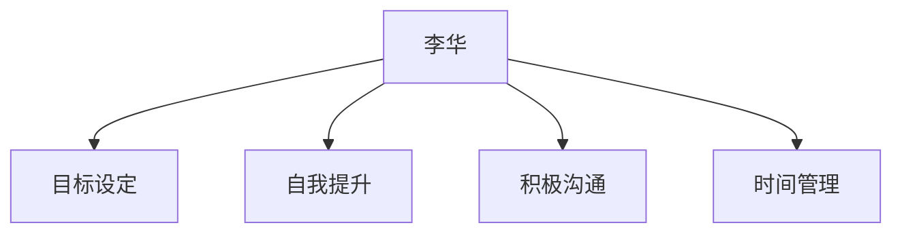
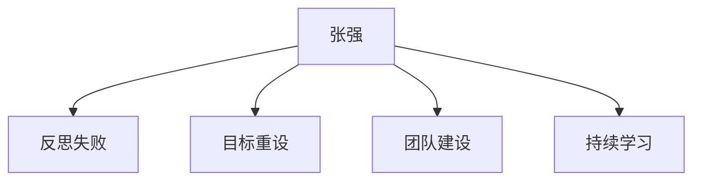

                 

### 突破舒适区：通过持续挑战实现个人成长

#### 引言

在当今快速发展的信息技术时代，不断学习、成长和适应新环境变得尤为重要。然而，我们往往容易陷入一个状态，那就是舒适区（Comfort Zone）。舒适区，顾名思义，是指我们习惯和熟悉的领域，在这里我们感到安全和自在。然而，长期停留在舒适区内，不仅会限制我们的发展，还可能导致技能的退化。本文将探讨如何通过持续挑战，突破舒适区，实现个人成长。

##### 个人成长的定义与重要性

个人成长是指通过学习、经验积累、自我提升等方式，不断提高自身能力、知识和认知水平的过程。它不仅仅包括技能的提升，还涵盖了情感、心理和社交能力的成长。个人成长的重要性体现在多个方面：

1. **提升竞争力**：在不断变化的社会和职场环境中，个人成长是保持竞争力的重要手段。只有不断学习新知识、掌握新技能，才能在激烈的市场竞争中脱颖而出。

2. **增强自信**：通过不断挑战自我，克服困难和挫折，个人会逐渐建立起自信心，更加坚定地面对未来的挑战。

3. **提升生活质量**：个人成长可以带来更高的生活质量。通过学习和提升，人们可以获得更多的职业机会、更高的收入和更好的生活条件。

##### 舒适区的影响与负面效应

舒适区虽然能给人带来暂时的安全感，但长期停留其中会带来一系列负面效应：

1. **限制视野**：舒适区往往局限于个人的经验和知识范围，容易导致视野狭窄，难以看到更广阔的世界。

2. **技能退化**：在舒适区内，人们可能会逐渐忽视技能的更新和提升，导致技能的退化。

3. **失去动力**：长期停留在舒适区，容易让人产生满足感，失去前进的动力。

##### 挑战的重要性与个人发展的联系

挑战是个人成长的催化剂。通过挑战，我们可以：

1. **拓展视野**：挑战可以带领我们进入新的领域，拓宽我们的视野，让我们看到更多的可能性。

2. **提升技能**：面对新的挑战，我们需要学习和掌握新的技能，这不仅可以提升我们的专业能力，还能增强我们的适应能力。

3. **激发潜能**：挑战可以激发我们的潜能，让我们发现自己从未意识到的能力。

##### 总结

本文引出了个人成长和舒适区的关系，强调了持续挑战在个人发展中的重要性。接下来，我们将深入探讨个人成长的理论基础，并介绍如何通过实践来突破舒适区，实现个人成长。

> **关键词**：个人成长、舒适区、挑战、潜能、持续发展

> **摘要**：本文介绍了个人成长的重要性以及舒适区的负面影响，探讨了通过持续挑战来实现个人成长的必要性。接下来，我们将进一步探讨个人成长的心理学理论，为突破舒适区提供理论基础和实践指导。

----------------------------------------------------------------

### 核心概念与理论基础

为了深入理解如何通过持续挑战实现个人成长，我们需要先了解一些核心概念和理论基础。这些概念包括心理学理论、挑战的定义与分类，以及持续成长模型。

#### 个人成长心理学

心理学理论为我们的个人成长提供了宝贵的洞见。以下是一些重要的心理学理论，它们在个人成长中的应用尤为显著：

##### 马斯洛的需求层次理论

马斯洛的需求层次理论将人类需求分为五个层次：生理需求、安全需求、社交需求、尊重需求和自我实现需求。这一理论强调了自我实现需求在个人成长中的重要性，即个体追求自我实现、发挥潜能的过程。

###### 1.1.1 生理需求

生理需求包括食物、水、空气和休息等基本生存需求。这些需求是人类生存的基础，只有在满足这些需求的情况下，个体才能进一步追求其他层次的需求。

###### 1.1.2 安全需求

安全需求包括人身安全、健康保障和财产保障等。这些需求使得个体在一个相对稳定和安全的环境中，能够专注于个人成长。

###### 1.1.3 社交需求

社交需求包括爱与被爱、归属感和社交联系等。这些需求使得个体在社会中寻求认同和归属，有助于建立自我认同和自我价值。

###### 1.1.4 尊重需求

尊重需求包括自尊、自信、成就感和社会地位等。这些需求使得个体在社会中寻求尊重和认可，有助于建立自我价值和自信心。

###### 1.1.5 自我实现需求

自我实现需求是马斯洛需求层次理论的最高层次，包括个人潜能的发挥、创造力和自我价值的实现等。这一需求驱动个体不断追求个人成长和自我超越。

##### 佛洛姆的自由心理学理论

佛洛姆的自由心理学理论强调了个人自由和自我实现的重要性。他认为，个人自由不仅仅是没有外在约束，更是内心的自由，即自由地选择自己的行为和生活方式。

###### 1.2.1 个人自由

个人自由是个人成长的基础，它允许个体根据自己的价值观和目标，自由地选择自己的行为和生活方式。

###### 1.2.2 自我实现

自我实现是指个人追求自我潜能的发挥，实现个人价值和创造力的过程。这一过程需要个体不断地挑战自我，突破舒适区，实现个人成长。

##### 自我决定理论

自我决定理论由德西和瑞安提出，强调个体在自我决定过程中，自我效能感、自主性和内在动机的重要性。

###### 1.3.1 自我效能感

自我效能感是指个体对自己完成某一任务的信心和能力的评估。高自我效能感的个体更容易面对挑战，实现个人成长。

###### 1.3.2 自主性

自主性是指个体在决策和行为过程中具有独立性和自由度。自主性有助于个体在挑战中保持积极性和动力，实现个人成长。

###### 1.3.3 内在动机

内在动机是指个体出于自身兴趣和内在满足感，而不是外在奖励或惩罚，主动参与某一活动或任务。内在动机是个人成长的强大动力。

#### 持续挑战的哲学思考

挑战是个人成长的催化剂，它不仅帮助我们拓展视野和提升技能，还能激发我们的潜能。以下是对挑战的定义与分类的哲学思考：

##### 挑战的定义

挑战是指个体面对不确定、不熟悉或具有风险的任务、情境或目标的过程。挑战通常需要个体超越现有的能力范围，通过学习和适应，实现自我提升。

###### 2.1.1 日常挑战

日常挑战是指我们在日常生活中遇到的、需要解决的问题和任务。这些挑战可能看似微不足道，但它们有助于我们培养解决问题的能力和适应能力。

###### 2.1.2 重大挑战

重大挑战是指那些具有高度不确定性、风险和复杂性的任务或目标。重大挑战通常需要我们付出更多的时间和精力，但它们能带来更大的成长和成就感。

##### 挑战的分类

根据挑战的性质和影响，我们可以将挑战分为以下几类：

###### 2.2.1 有意识的挑战

有意识的挑战是指个体主动选择和设定的挑战。这些挑战通常与个体的目标和价值观相符，有助于实现个人成长。

###### 2.2.2 无意识的挑战

无意识的挑战是指个体在日常生活中无意中遇到的挑战。这些挑战虽然不是主动设定的，但它们同样能够促使个体成长和适应。

###### 2.2.3 情境性挑战

情境性挑战是指由特定情境或环境引发的挑战。这些挑战通常与个体的专业知识、经验和技能密切相关。

###### 2.2.4 全局性挑战

全局性挑战是指那些对个体生活和社会环境产生广泛影响的挑战。这些挑战通常需要个体付出巨大的努力，但它们能带来深远的影响和变革。

#### 持续成长模型

持续成长模型是一个指导个体实现个人成长的理论框架。该模型包括三个核心要素：目标设定、挑战选择和自我反思。

##### 3.1.1 目标设定

目标设定是持续成长模型的基础。一个明确、具体和可实现的目标能够引导个体朝着个人成长的方向前进。

###### 3.1.1.1 SMART目标设定方法

SMART目标是具体、可衡量、可达成、相关和时限性的目标。这种方法有助于个体明确自己的目标，并制定具体的行动计划。

###### 3.1.1.2 个人目标的优先级排序

在设定多个目标时，个体需要根据目标的重要性和紧急性进行优先级排序，确保自己的时间和精力得到合理分配。

##### 3.1.2 挑战选择

挑战选择是持续成长模型的关键环节。个体需要根据目标设定，选择具有适当难度和挑战性的任务和目标。

###### 3.1.2.1 有意识的挑战

有意识的挑战有助于个体实现自我超越和成长。个体可以通过主动寻求新的学习机会和挑战，不断提升自己的能力和技能。

###### 3.1.2.2 情境性挑战

情境性挑战是我们在日常生活中不可避免的一部分。通过面对情境性挑战，个体可以锻炼自己的适应能力和问题解决能力。

##### 3.1.3 自我反思

自我反思是持续成长模型的重要组成部分。个体需要定期对自己的成长过程进行反思，总结经验教训，调整自己的目标和策略。

###### 3.1.3.1 反思方法

自我反思可以通过日记、冥想、讨论等多种方式进行。个体需要找到适合自己的反思方法，确保反思过程能够真正促进个人成长。

###### 3.1.3.2 反思内容

自我反思的内容包括目标达成的程度、学习到的知识技能、面对挑战时的应对策略和自身的不足之处等。

#### 总结

通过核心概念和理论基础的介绍，我们了解了个人成长的重要性、舒适区的负面影响以及如何通过持续挑战实现个人成长。在接下来的章节中，我们将进一步探讨如何制定挑战计划、克服挑战心理障碍和养成持续成长的习惯，帮助读者在实践中实现个人成长。

> **关键词**：个人成长、心理学理论、挑战、目标设定、自我反思

> **摘要**：本文介绍了个人成长的核心概念和理论基础，包括心理学理论、挑战的定义与分类以及持续成长模型。通过这些理论框架，读者可以更好地理解如何通过持续挑战实现个人成长。

----------------------------------------------------------------

### 实践指导

在了解了核心概念和理论基础后，现在我们需要将理论付诸实践。以下是如何制定挑战计划、克服挑战心理障碍和养成持续成长习惯的详细指导。

#### 3.1 制定挑战计划

制定一个有效的挑战计划是个人成长的第一步。以下是一些关键步骤和方法：

##### 3.1.1 目标设定与优先级排序

**SMART目标设定方法**：

SMART目标是一种明确、具体、可衡量、可实现和时限性的目标设定方法。以下是SMART目标的具体含义和如何使用：

1. **具体（Specific）**：目标需要具体明确，例如，“学习Python编程”不如“学习Python编程，掌握基本的数据结构和算法”。

2. **可衡量（Measurable）**：目标需要能够衡量进度和成果，例如，“阅读10本书”不如“阅读10本关于人工智能的书籍，并完成读书笔记”。

3. **可实现（Achievable）**：目标需要是可实现的，避免设定过高的难度，例如，“在一个月内学会所有AI算法”不如“在一个月内学习并掌握常见的机器学习算法”。

4. **相关（Relevant）**：目标需要与个人目标和价值观相符，例如，“提高英语口语”不如“通过提高英语口语，更好地与国际客户沟通”。

5. **时限性（Time-bound）**：目标需要设定一个明确的时间限制，例如，“在未来三个月内提高英语口语”而不是“ someday 提高英语口语”。

**个人目标的优先级排序**：

在设定多个目标时，我们需要根据目标的重要性和紧急性进行排序。可以使用**埃森豪威尔矩阵**（Eisenhower Matrix）来帮助排序：

- **紧急且重要**：立即处理这些任务，因为它们对当前工作或生活至关重要。
- **紧急但不重要**：委托或委派他人处理这些任务，因为它们可能占用你的时间，但不是最重要的。
- **不紧急但重要**：安排时间进行处理，这些任务可能不会立即产生结果，但长期来看对个人成长至关重要。
- **不紧急且不重要**：尽量避免或减少这些任务，因为它们不会对个人成长产生积极影响。

##### 3.1.2 制定行动计划

在设定了目标并确定了优先级后，我们需要制定具体的行动计划。以下是一些步骤：

1. **分解目标**：将大目标分解为小步骤，每个小步骤都是一个可实现的任务。

2. **时间规划**：为每个任务分配时间，确保有足够的时间来完成它们。

3. **资源分配**：确定完成任务所需的资源，如时间、资金、设备、人等。

4. **监控进度**：定期检查任务进度，确保按照计划进行。

#### 3.2 克服挑战心理障碍

在面对挑战时，我们常常会遇到各种心理障碍。以下是一些常见障碍和克服方法：

##### 3.2.1 接受不完美

**对失败的接受与理解**：

失败是成长过程中不可避免的一部分。我们需要接受失败，并理解它是成功的前提。以下是一些接受失败的方法：

- **重新定义失败**：将失败视为学习的机会，而不是失败本身。
- **分析失败的原因**：反思失败的原因，找出可以改进的地方。
- **设定合理的期望**：避免设定过高的期望，以免在失败时感到沮丧。

**如何从失败中恢复**：

从失败中恢复的关键是保持积极的心态和坚定的信念。以下是一些建议：

- **给自己时间**：不要急于从失败中恢复，给自己一些时间来调整情绪。
- **寻求支持**：和朋友、家人或导师分享你的感受，获取他们的支持和建议。
- **制定新的计划**：根据失败的经验，重新制定计划，设定新的目标。
- **庆祝小胜利**：即使在失败之后，也要庆祝每个小胜利，保持积极的心态。

##### 3.2.2 克服恐惧

**面对恐惧的方法**：

恐惧是阻碍我们成长的一个重要因素。以下是一些面对恐惧的方法：

- **认知行为疗法**：通过认知行为疗法，我们可以学会识别和改变负面思维模式，从而减少恐惧。
- **逐步面对恐惧**：逐渐增加面对恐惧的难度，通过逐步克服恐惧，建立信心。
- **训练身体反应**：通过深呼吸、放松肌肉等方法，训练身体对恐惧的反应，减少恐惧感。

#### 3.3 持续成长的习惯养成

持续成长需要良好的习惯支持。以下是一些培养持续成长习惯的建议：

##### 3.3.1 培养积极的生活习惯

**时间管理**：

有效的时间管理是持续成长的关键。以下是一些时间管理的技巧：

- **制定日程表**：每天制定日程表，为每个任务分配时间，确保高效完成任务。
- **优先级排序**：根据任务的紧急性和重要性，对任务进行排序，确保先完成最重要的任务。
- **避免拖延**：制定明确的截止日期，并避免拖延，确保任务按时完成。

**自我激励与反馈机制**：

自我激励和反馈机制有助于保持持续成长的动力。以下是一些建议：

- **设定奖励**：为完成每个目标设定奖励，以激励自己继续前进。
- **定期反思**：定期反思自己的成长过程，总结经验教训，调整目标和策略。
- **获取反馈**：向朋友、家人或导师寻求反馈，了解自己的成长情况，获取改进建议。

##### 3.3.2 培养积极的工作习惯

**持续学习**：

持续学习是工作习惯的重要组成部分。以下是一些建议：

- **定期学习**：每天或每周安排一段时间，用于学习和掌握新的知识和技能。
- **参加培训课程**：参加专业培训课程，提高自己的专业素养。
- **阅读专业书籍和文章**：定期阅读专业书籍和文章，了解行业动态和最新技术。

**团队合作**：

团队合作是工作中不可或缺的一部分。以下是一些建议：

- **积极参与**：积极参与团队讨论和决策，贡献自己的观点和想法。
- **倾听他人**：倾听他人的意见和建议，尊重团队的意见。
- **沟通与协作**：保持良好的沟通和协作，确保团队目标的实现。

#### 总结

通过制定挑战计划、克服挑战心理障碍和养成持续成长习惯，我们可以有效地实现个人成长。在接下来的章节中，我们将通过案例研究，进一步探讨如何通过持续挑战实现个人成长。

> **关键词**：挑战计划、心理障碍、持续成长、习惯养成

> **摘要**：本文介绍了如何制定挑战计划、克服挑战心理障碍和养成持续成长习惯的实践指导。通过这些方法，读者可以有效地实现个人成长，突破舒适区，迎接新的挑战。

----------------------------------------------------------------

### 案例研究

为了更好地理解通过持续挑战实现个人成长的具体实践，我们来看几个个人成长案例。这些案例展示了不同背景和专业领域的个人如何通过面对挑战，实现了显著的个人成长。

#### 4.1.1 案例一：从普通职员到企业高管的成长

**背景**：

李华是一名在一家中型企业工作的普通职员，工作内容主要是日常的文件处理和协调工作。李华的工作环境相对稳定，但他的职业生涯一直停滞不前。李华意识到，如果继续停留在舒适区，他将无法实现职业上的突破。

**问题描述**：

李华面临的主要问题是缺乏挑战性和职业发展的机会。他的日常工作缺乏创新和复杂性，使得他难以提升自己的专业技能和领导能力。

**问题解决**：

1. **目标设定**：李华决定设定一个明确的目标，即成为企业的中高层管理者。他使用了SMART目标设定方法，将目标分解为具体的、可衡量的小步骤。

2. **自我提升**：李华开始参加各种管理培训课程，包括领导力、沟通技巧和项目管理等。他还主动参与公司的项目，承担更多的责任和挑战。

3. **积极沟通**：李华定期与上级和同事沟通，分享自己的想法和观点，积极寻求反馈和建议。

4. **时间管理**：李华优化了自己的时间管理，确保有足够的时间用于学习和工作。

**边界与外延**：

李华的成功不仅限于职位晋升，他还通过持续学习和实践，提升了自身的领导能力和团队管理能力。他的成长案例展示了如何在职场中通过持续挑战实现个人突破。

**概念结构与核心要素组成**：

- **目标设定**：明确、具体、可衡量、可实现和时限性。
- **自我提升**：通过学习和实践提升专业技能。
- **积极沟通**：与上级和同事保持良好沟通，获取反馈。
- **时间管理**：合理安排时间，确保学习和工作兼顾。

**ER实体关系图架构**：

#### 4.1.2 案例二：从创业新手到成功企业家的历程

**背景**：

张强是一名年轻的程序员，他对技术创新和创业充满热情。然而，他在第一次创业时遭遇了失败，公司很快就倒闭了。面对失败，张强没有选择放弃，而是决定从零开始，再次尝试创业。

**问题描述**：

张强的挑战在于如何从失败中恢复，并重新建立一家成功的企业。他面临着资金短缺、市场不确定性、团队管理等多重问题。

**问题解决**：

1. **反思失败**：张强深入分析了第一次创业失败的原因，包括市场调研不足、产品定位不准确、团队管理混乱等。

2. **目标重设**：他重新设定了创业目标，注重市场需求，制定了详细的商业计划和营销策略。

3. **团队建设**：张强开始寻找并组建了一支有经验的团队，确保团队在技术、市场和运营等方面都有强大的支持。

4. **持续学习**：张强持续学习最新的技术和市场趋势，确保自己的创业项目始终具有竞争力。

**边界与外延**：

张强的成功不仅在于创业成功，还在于他通过不断学习和实践，积累了丰富的创业经验。他的案例展示了如何通过持续挑战，从失败中恢复并最终实现个人成长。

**概念结构与核心要素组成**：

- **反思失败**：深入分析失败原因，为下一次创业提供指导。
- **目标重设**：根据市场变化重新设定创业目标。
- **团队建设**：组建有经验的团队，确保项目成功。
- **持续学习**：不断学习和实践，提升自己的竞争力。

**ER实体关系图架构**：

#### 总结

通过这两个案例，我们可以看到，无论是从普通职员到企业高管的成长，还是从创业新手到成功企业家的历程，持续挑战都是实现个人成长的关键。通过设定明确的目标、自我提升、积极沟通和持续学习，个人可以不断突破舒适区，实现个人价值的提升。

> **关键词**：案例研究、个人成长、挑战、目标设定、反思失败

> **摘要**：本文通过两个个人成长案例，展示了如何通过持续挑战实现个人成长。这些案例强调了目标设定、自我提升、反思失败和持续学习的重要性。

----------------------------------------------------------------

### 持续挑战的实践分享

在个人成长的旅程中，挑战是我们不可或缺的伙伴。以下是一些来自实践者的分享，展示了他们在面对挑战时所经历的困难和收获，以及如何从中获得成长。

#### 4.2.1 挑战的经历与收获

**挑战一：掌握新技能**

李丽是一位软件工程师，她一直渴望学习大数据分析。然而，这个领域对她来说完全陌生。她面临的第一个挑战是如何快速入门。

**问题描述**：

李丽在开始学习大数据分析时，感到非常困惑，不知道从哪里入手。她需要掌握新的编程语言（如Scala）、大数据处理框架（如Hadoop和Spark）以及数据分析工具。

**解决方法**：

1. **制定学习计划**：李丽制定了详细的学习计划，包括每天的学习时间和学习内容。她利用周末时间参加在线课程，每天晚上阅读相关书籍和文档。

2. **实践项目**：李丽参与了几个大数据分析项目，通过实际操作来巩固所学知识。她还在GitHub上找到了一些开源项目，参与其中，与他人一起解决问题。

3. **寻求帮助**：李丽加入了大数据相关的社区和论坛，向其他专业人士请教问题，获取帮助和建议。

**收获**：

通过几个月的努力，李丽不仅掌握了大数据分析的基本技能，还参与了一个实际项目，得到了同事和领导的认可。她的经验证明，面对新技能的挑战，制定明确的计划、积极参与实践和寻求帮助是成功的关键。

**挑战二：克服职场压力**

王明是一位项目经理，他负责的项目因为各种原因出现了严重的进度延误。这给他带来了巨大的压力，导致他开始怀疑自己的能力。

**问题描述**：

王明面临着时间紧迫、资源不足和团队协作不畅等多重挑战。他感到非常焦虑，担心无法按时完成任务。

**解决方法**：

1. **重新评估任务**：王明与团队一起重新评估了任务的重要性和可行性，确定了优先级，并重新分配了任务。

2. **沟通与协调**：王明主动与团队成员沟通，了解他们的工作进展和困难，寻找解决问题的方法。他还与上级领导沟通，争取更多的资源和支持。

3. **时间管理**：王明优化了自己的时间管理，确保每天有足够的时间用于项目管理和团队协调。

**收获**：

通过这些措施，王明成功带领团队克服了困难，按时完成了项目。他学会了如何在压力下保持冷静，有效地管理时间和资源，并增强了团队协作能力。这次经历让他更加自信，也提升了他的项目管理技能。

**挑战三：自我突破**

赵晓是一名技术总监，他在公司内被赋予了很多责任。然而，他意识到，要想继续成长，他需要跳出自己的舒适区，承担更多的挑战。

**问题描述**：

赵晓希望能够在技术和管理方面都有所突破，但他不知道如何开始。他感到自己缺乏足够的知识和经验来应对新的挑战。

**解决方法**：

1. **自我评估**：赵晓对自己的技能和知识进行了详细的评估，确定了需要加强的领域。

2. **制定学习计划**：他制定了详细的学习计划，包括参加专业培训、阅读相关书籍、参加行业会议等。

3. **实践项目**：赵晓积极参与了多个项目，担任技术负责人或项目经理，通过实践来提升自己的能力。

4. **寻求导师指导**：赵晓找到了一位经验丰富的导师，向他请教问题，获取指导和建议。

**收获**：

通过这些努力，赵晓不仅提升了自己的技术能力，还学会了如何管理项目和团队。他的成长经历证明，自我突破需要持续的学习和实践，同时也需要找到合适的导师来提供指导。

#### 总结

这些实践者的经历展示了在面对挑战时，他们如何通过制定计划、积极实践和寻求帮助来克服困难，并实现个人成长。他们的故事告诉我们，持续挑战是个人成长的必经之路。通过面对挑战，我们可以不断提升自己的能力，实现自我超越。

> **关键词**：实践分享、个人成长、挑战、学习计划、实践项目

> **摘要**：本文通过分享几位实践者的挑战经历和收获，展示了如何通过面对挑战实现个人成长。这些经历证明了持续学习和实践的重要性，以及寻求指导和支持的价值。

----------------------------------------------------------------

### 最佳实践与总结

在本文中，我们探讨了如何通过持续挑战实现个人成长，并分享了多个实践者的成功经验。以下是一些最佳实践和小结，帮助读者在个人成长的道路上更加顺利。

#### 最佳实践

1. **明确目标**：使用SMART目标设定方法，确保目标具体、可衡量、可实现、相关和时限性。
2. **积极行动**：制定行动计划，将大目标分解为小步骤，确保有明确的时间表和资源分配。
3. **持续学习**：定期学习新的知识和技能，不断提升自己的竞争力。
4. **自我反思**：定期反思自己的成长过程，总结经验教训，调整目标和策略。
5. **寻求支持**：与导师、同事和社群交流，获取指导和支持。
6. **面对挑战**：积极面对挑战，将其视为成长的机会，而不是逃避的理由。
7. **保持积极心态**：保持乐观和积极的心态，即使在面对失败时也要保持坚定。

#### 小结

个人成长不是一蹴而就的过程，而是一场持久战。通过持续挑战，我们可以不断拓展自己的视野，提升自己的能力，实现自我价值的提升。本文提供的最佳实践和建议，旨在帮助读者在个人成长的旅程中少走弯路，更加高效地实现个人目标。

#### 注意事项

1. **保持耐心**：个人成长需要时间和努力，不要期望一夜之间就能取得显著成果。
2. **避免拖延**：及时行动，避免拖延，确保目标和计划的顺利执行。
3. **保持灵活**：在执行计划时，根据实际情况调整目标和策略，保持灵活性。

#### 拓展阅读

- **《深度工作》**：作者Cal Newport提出了深度工作（Deep Work）的概念，强调了在无干扰的状态下专注工作的重要性。
- **《高效能人士的七个习惯》**：史蒂芬·柯维的这本书提供了许多关于时间管理、目标设定和自我提升的实用建议。
- **《挑战》**：作者Kris扩展了挑战的概念，探讨了如何通过挑战实现个人和职业成长。

通过阅读这些书籍，读者可以获得更多的启发和指导，为自己的个人成长之路提供坚实的支持。

> **关键词**：最佳实践、持续挑战、个人成长、目标设定、自我反思

> **摘要**：本文总结了通过持续挑战实现个人成长的最佳实践，并提供了注意事项和拓展阅读建议，帮助读者在个人成长的道路上更加顺利。通过持续学习、实践和自我反思，每个人都可以实现自我超越，迎接更大的挑战。

----------------------------------------------------------------

### 作者信息

**作者：AI天才研究院/AI Genius Institute & 禅与计算机程序设计艺术 /Zen And The Art of Computer Programming**

AI天才研究院（AI Genius Institute）致力于推动人工智能技术的发展和应用，为全球企业和个人提供先进的AI解决方案和教育培训。研究院的专家团队由世界级人工智能专家、程序员、软件架构师和CTO组成，他们拥有丰富的理论知识和实践经验，致力于通过持续学习和创新，为AI领域的未来发展贡献力量。

《禅与计算机程序设计艺术》（Zen And The Art of Computer Programming）是作者Donald E. Knuth的经典著作，它不仅是一本关于计算机编程的书籍，更是一种哲学思考的体现。书中通过深刻的分析和独特的视角，探讨了编程的本质、艺术的创作过程以及程序员如何通过修行提升自己的编程技能。这本书对无数程序员产生了深远的影响，成为计算机科学领域的经典之作。

感谢您阅读本文，希望本文能够为您在个人成长的道路上提供一些启发和帮助。如果您对人工智能或编程有任何疑问或想法，欢迎随时与我们联系，我们将竭诚为您解答。祝您在个人成长的道路上不断前行，实现自我超越。

