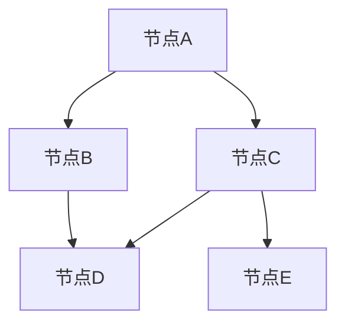
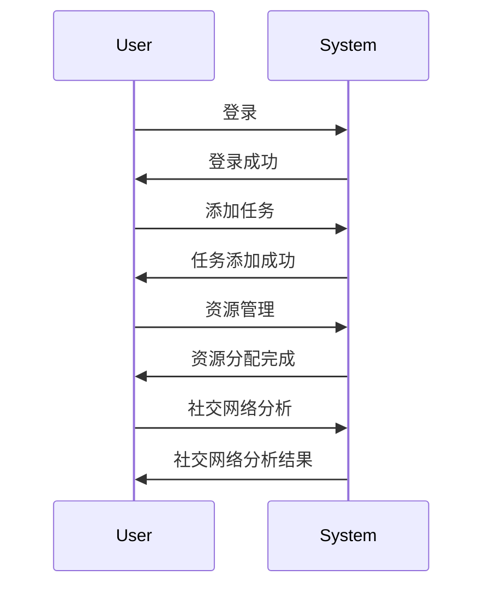
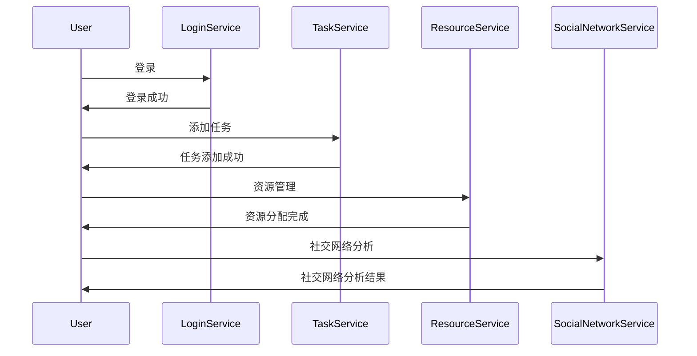

                 

## 简单生活运动的概述

简单生活运动（Simple Living Movement）是一种旨在降低物质消费、提高生活质量的全球性社会运动。它起源于20世纪60年代的西方国家，特别是在美国和欧洲。当时，随着经济的高速发展，消费主义逐渐成为一种生活方式，人们开始追求物质上的满足和享受。然而，这种追求带来了一系列问题，如环境污染、资源枯竭、社会不公等。在这种背景下，一些人开始反思并倡导简单生活方式，试图寻找一种更加平衡、可持续的生活方式。

### 1.1.1 简单生活运动的起源

简单生活运动的起源可以追溯到20世纪60年代的美国。当时，一些知识分子和学者开始反思消费主义带来的负面影响，提出回归简单生活的理念。这些倡导者认为，过度追求物质财富会导致社会不公、环境破坏和心理健康问题。1968年，美国作家迪克·史密斯出版了《简单生活》（The Good Life），这本书成为了简单生活运动的里程碑之作。

在同一时期，欧洲也出现了一些倡导简单生活的声音。1970年代，瑞典社会学家贡纳尔·阿尔特写道：“简单生活是一种更自然、更平衡的生活方式，它强调与自然的和谐共处，而不是与自然抗争。”这种观点得到了越来越多人的认同。

### 1.1.2 简单生活运动的核心观念

简单生活运动的核心观念主要包括以下几个方面：

1. **降低物质消费**：主张减少对物质的依赖，抵制过度消费，追求精神上的满足。这不仅仅是减少购买物品的数量，更重要的是改变对物品的态度和价值观。
2. **提高生活质量**：通过简化生活方式，提高生活质量，让生活更加充实和有意义。这包括改善饮食、锻炼身体、增加社交活动等。
3. **保护环境**：通过减少资源的消耗，降低对环境的负担，保护地球生态。简单生活运动倡导人们减少能源消耗、减少废弃物产生，鼓励使用可再生能源和环保产品。
4. **追求平等**：强调社会公正，反对消费主义带来的社会不平等。简单生活运动认为，每个人都应该有平等的机会和资源，而不是被物质财富所束缚。

### 1.1.3 简单生活运动的普及与发展

随着全球环境问题的日益严重，简单生活运动逐渐在全球范围内普及。许多国家和地区的政府、非政府组织、企业和个人都开始关注并实践简单生活方式。在亚洲，日本和韩国等国家的一些年轻人在20世纪80年代和90年代开始倡导简单生活运动。在非洲和拉丁美洲，简单生活运动也得到了一定程度的关注和支持。

简单生活运动在不同国家和地区有着不同的表现形式，但都强调减少物质消费、提高生活质量和保护环境。例如，在北欧国家，简单生活运动与可持续发展政策相结合，鼓励人们采取环保措施，如使用公共交通工具、减少食品浪费等。在美国，简单生活运动与“零废物”运动相结合，鼓励人们减少废弃物的产生，采用环保的生活方式。

总之，简单生活运动已经成为一种全球性的社会运动，其影响力不断扩大。随着人们对环境、社会和个人问题认识的加深，简单生活运动有望在未来继续发展和壮大。

### 第2章：消费主义对生活的影响

消费主义作为一种社会现象，对个人生活和社会环境产生了深远的影响。理解这些影响对于探讨简单生活运动的必要性具有重要意义。

#### 2.1.1 消费主义的本质

消费主义是一种以物质消费为核心的社会行为模式。它不仅仅是购买和使用商品，更是一种文化、价值观和社会制度的体现。消费主义主张通过物质消费来满足个人的需求和欲望，从而实现个人和社会的繁荣。然而，这种追求往往忽视了内心的真正需求，导致人们陷入物质追求的循环之中。

1. **物质依赖**：消费主义促使人们对物质产品产生强烈的依赖，认为物质拥有能够带来幸福和满足。然而，这种依赖往往导致人们忽视内心的真实感受，陷入物质主义的陷阱。
2. **过度消费**：消费主义鼓励人们不断购买新商品，追求时尚和潮流。这种过度消费不仅浪费资源，还加剧了环境负担，导致资源枯竭和生态破坏。
3. **消费主义文化**：消费主义已经渗透到社会的各个层面，形成了一种消费主义文化。这种文化强调个人主义、物质主义和享乐主义，导致社会价值观的扭曲和人际关系紧张。

#### 2.1.2 消费主义对社会的影响

消费主义对社会的影响是多方面的，其中包括：

1. **环境污染**：过度消费导致资源的过度开采和环境的严重污染。例如，塑料制品的广泛使用导致了海洋污染，工业排放导致了大气污染。这些环境问题对人类的健康和生存构成了严重威胁。
2. **资源枯竭**：资源的过度消耗使得一些资源逐渐枯竭，对可持续发展构成威胁。例如，石油、煤炭等化石燃料的过度使用导致了能源短缺问题，水资源也因为过度开采而面临枯竭风险。
3. **社会不公**：消费主义加剧了社会不平等，导致财富和资源集中在少数人手中。富人们通过消费奢侈品来展示自己的社会地位，而贫困人群则因为无法负担高消费而陷入困境。这种不平等不仅影响了社会的公平性，还引发了社会矛盾和冲突。
4. **心理健康问题**：追求物质满足带来的空虚感和焦虑感，导致心理健康问题增加。消费主义鼓励人们不断追求更高的消费水平，但往往无法带来真正的幸福感。长期的物质追求可能导致心理健康问题，如焦虑、抑郁等。

#### 2.1.3 消费主义对个人生活的冲击

消费主义对个人生活的影响主要体现在以下几个方面：

1. **生活压力**：追求物质满足带来的经济负担和生活压力。许多人在消费主义的影响下，不断追求更高的消费水平，导致负债累累、生活质量下降。
2. **价值观扭曲**：过度追求物质导致价值观的扭曲，忽视精神追求。人们在消费主义的影响下，往往将物质财富视为衡量个人价值和社会地位的标准，忽视了精神层面的追求。
3. **社交关系破裂**：消费主义可能导致人际关系紧张，甚至破裂。人们在追求物质满足的过程中，往往忽视了与家人和朋友的沟通和陪伴，导致关系疏远和破裂。
4. **心理问题**：长期的物质追求可能导致心理健康问题，如焦虑、抑郁等。消费主义鼓励人们不断追求更高的消费水平，但往往无法带来真正的幸福感。这种追求可能导致心理压力和焦虑，影响心理健康。

综上所述，消费主义对社会和个人生活产生了深远的影响。它不仅导致环境污染、资源枯竭和社会不公，还影响了人们的心理健康和生活质量。因此，探讨简单生活运动的必要性具有重要意义。通过减少物质消费、提高生活质量和保护环境，简单生活运动有望帮助人们摆脱消费主义的负面影响，实现更加平衡和可持续的生活方式。

### 第3章：寻找本真的方法

在理解了消费主义对生活的影响后，我们开始探索如何在实际生活中寻找本真，摆脱消费主义的束缚。这个过程涉及内在自我探索、生活方式调整和社会关系的处理。

#### 3.1.1 内在自我探索

寻找本真的第一步是进行内在自我探索。这包括反思自己的价值观、信念和动机，了解自己的真实需求和欲望。通过自我反思，我们可以更好地认识自己，找到内心的真实声音。

1. **自我反思**：定期进行自我反思，思考自己的行为和决策背后的动机。问问自己，这些行为是否真正符合自己的价值观和需求，是否只是为了满足外界的期望或追求短暂的满足感。
2. **内在需求识别**：识别自己内心的真实需求，而不是被外界的诱惑所左右。例如，我们可能不需要最新的智能手机来满足自己的需求，而是更需要一个稳定的收入和一个健康的身体。
3. **价值观重置**：重新审视和调整自己的价值观，将其从物质追求转移到内在成长和人际关系上。例如，我们可能更重视家庭和朋友的陪伴，而不是追求物质的奢华。

#### 3.1.2 生活方式调整

在找到自己的真实需求后，我们需要对生活方式进行调整。这包括减少物质消费、优化时间管理、提高生活质量等方面。

1. **减少物质消费**：减少不必要的物质消费，抵制消费主义的诱惑。例如，我们可以选择购买二手商品、减少购物频率、避免冲动消费等。
2. **优化时间管理**：合理安排时间，减少工作和生活中的压力。例如，我们可以制定日程表、设定优先级、避免拖延等。
3. **提高生活质量**：通过健康饮食、锻炼身体、增加社交活动等方式提高生活质量。例如，我们可以选择健康饮食、定期锻炼、参与社区活动等。

#### 3.1.3 社会关系的处理

在寻找本真的过程中，处理社会关系也是一个重要方面。这包括与家人、朋友和社区的关系。

1. **与家人的关系**：加强与家人的沟通和陪伴，重视家庭的重要性。例如，我们可以定期与家人共度时光、分享生活中的喜怒哀乐等。
2. **与朋友的关系**：保持与朋友的联系，重视友谊的质量。例如，我们可以定期与朋友聚会、分享彼此的经历和感受等。
3. **与社区的关系**：积极参与社区活动，建立社区归属感。例如，我们可以参与社区志愿者活动、加入兴趣小组等。

通过内在自我探索、生活方式调整和社会关系的处理，我们可以逐渐摆脱消费主义的束缚，寻找本真的生活方式。这个过程需要时间和耐心，但只要我们坚持，就能找到一种更加平衡、有意义的生活。

### 第4章：简单生活运动的实践

简单生活运动的实践需要遵循一定的原则和步骤，并在实际生活中不断调整和完善。以下是一些实践原则、案例分享以及实践中的挑战与解决方法。

#### 4.1.1 实践原则与步骤

1. **明确目标**：首先，需要明确自己实践简单生活运动的目标，例如提高生活质量、减少物质消费、保护环境等。
2. **评估现状**：对自己现有的生活方式进行评估，包括物质消费、时间管理、社交活动等方面。了解自己的优势和劣势，为后续的实践提供依据。
3. **制定计划**：根据评估结果，制定具体的实践计划。这包括减少不必要的物质消费、优化时间管理、提高生活质量等方面。
4. **执行计划**：按照计划执行，并不断调整和完善。在实践中，可能会遇到各种挑战，但需要保持坚持和耐心。
5. **反思与总结**：定期进行反思和总结，评估实践效果，并根据实际情况调整实践计划。

#### 4.1.2 实践案例分享

以下是一个简单的实践案例：

**案例：王先生的简单生活实践**

王先生是一位年轻的企业家，他在公司发展迅速的同时，也意识到自己生活中的种种问题。他决定实践简单生活运动，以寻找生活的本真。

1. **减少物质消费**：王先生开始减少对物质的依赖，抵制过度消费。他选择购买二手商品、减少购物频率、避免冲动消费等。
2. **优化时间管理**：王先生重新安排自己的日程，减少工作和生活中的压力。他开始每天早起锻炼，晚上进行阅读和冥想，以保持身心健康。
3. **提高生活质量**：王先生重视健康饮食，选择天然有机食品，减少快餐和加工食品的摄入。他还增加了社交活动，与朋友和家人共度时光。
4. **保护环境**：王先生积极参与环保活动，如减少用水用电、回收废弃物、种植绿色植物等。

通过简单生活运动的实践，王先生的生活发生了显著的变化。他的生活质量提高了，身心健康状况得到了改善，与家人和朋友的关系更加紧密，同时他也对环境和社会的贡献增加了。

#### 4.1.3 实践中的挑战与解决

在实践中，人们可能会遇到各种挑战，但关键在于保持坚持和耐心。

1. **挑战：抵制消费主义诱惑**  
   解决方法：建立内在自我控制力，识别内心的真实需求，避免被外界的诱惑所左右。
2. **挑战：调整生活方式**  
   解决方法：逐步调整生活方式，制定合理的目标和计划，避免过度追求完美主义。
3. **挑战：应对社交压力**  
   解决方法：坚持自己的价值观和生活方式，与志同道合的人建立社交网络，互相支持和鼓励。
4. **挑战：平衡工作与生活**  
   解决方法：合理安排时间，设定工作与生活的界限，确保身心健康。

总之，简单生活运动的实践是一个持续的过程，需要我们不断调整和完善。通过明确目标、评估现状、制定计划、执行计划、反思与总结，我们可以在实践中找到生活的本真，实现更加平衡和有意义的生活方式。

### 第5章：简单生活的益处

简单生活不仅有助于我们摆脱消费主义的束缚，还能带来多方面的益处，包括身体健康、心理健康以及社会关系的改善。

#### 5.1.1 身体健康

简单生活强调健康饮食、适量运动和充足的休息，这对身体健康有着显著的积极影响。

1. **健康饮食**：简单生活倡导减少加工食品和高热量食物的摄入，增加新鲜蔬菜、水果和全谷物的比例。这种饮食习惯有助于降低慢性疾病的风险，如心脏病、糖尿病和肥胖症。
2. **适量运动**：简单生活鼓励人们增加日常的身体活动，如步行、骑自行车和参加健身房锻炼。这些活动有助于增强心肺功能、提高新陈代谢和增强肌肉力量。
3. **充足休息**：简单生活重视充足的睡眠和休息，有助于恢复体力和精神状态，提高免疫力，减少疾病的风险。

#### 5.1.2 心理健康

简单生活有助于减轻心理压力，提升幸福感，对心理健康有积极的影响。

1. **减少压力**：简单生活通过减少物质消费和工作压力，帮助我们保持心理健康。研究表明，减少压力水平可以降低焦虑和抑郁的风险。
2. **提升幸福感**：简单生活强调内心的满足和精神的追求，这有助于提升幸福感。通过关注生活中的小确幸和与亲朋好友的互动，我们可以获得更多的快乐和满足。
3. **增强自我认知**：简单生活促使我们反思自己的价值观和生活方式，这有助于增强自我认知和自我控制能力。通过自我反思，我们可以更好地了解自己的需求和欲望，从而做出更加明智的决策。

#### 5.1.3 社会关系

简单生活有助于改善人际关系，增强社区凝聚力，对个人和社会都有积极的影响。

1. **加强家庭关系**：简单生活鼓励我们花更多的时间与家人共度，增强家庭关系的紧密性。通过共享家务、共同参与活动和倾听彼此的心声，家庭成员之间的联系变得更加牢固。
2. **改善社交互动**：简单生活强调与他人的真诚交流和互助合作，有助于改善社交互动。通过参与社区活动和志愿者工作，我们可以结识更多志同道合的朋友，建立深厚的人际关系。
3. **增强社区凝聚力**：简单生活运动倡导人们减少对物质的依赖，更多关注社区和环境。这有助于增强社区的凝聚力，促进社区的可持续发展。

总之，简单生活不仅有助于我们的身体健康和心理健康，还能改善人际关系，增强社区凝聚力。通过减少物质消费、优化生活方式和加强社交互动，我们可以实现更加健康、幸福和有意义的生活。

### 第6章：简单生活运动的未来

随着全球对环境问题和社会不平等的日益关注，简单生活运动有望在未来继续发展和壮大。这不仅是对个人生活方式的改革，也是对整个社会结构的挑战。

#### 6.1.1 简单生活运动的发展趋势

1. **环保意识的提升**：随着全球环境问题的加剧，越来越多的人开始认识到环保的重要性。简单生活运动强调减少资源消耗和保护环境，与这一趋势高度契合。未来，简单生活运动将更多地与环保理念相结合，推动可持续生活方式的普及。
2. **社会公正的追求**：社会不平等问题在许多国家和地区依然严重。简单生活运动倡导减少物质消费、提高生活质量，这有助于缩小贫富差距，推动社会公正。未来，简单生活运动可能会与公平贸易、扶贫项目等社会公正运动相结合，形成更广泛的社会影响力。
3. **数字化的推进**：随着数字化技术的发展，人们可以更加便捷地获取信息、交流和分享。这为简单生活运动的传播提供了新的平台。未来，简单生活运动可能会更多地利用社交媒体、在线课程和虚拟社区等数字化工具，提高其影响力和参与度。

#### 6.1.2 简单生活运动在社会中的应用

1. **教育体系**：简单生活运动可以融入教育体系中，从儿童和青少年时期就开始培养他们的环保意识和生活方式。例如，学校可以开设环保课程、组织环保实践活动，鼓励学生参与环保项目。
2. **企业社会责任**：企业可以积极参与简单生活运动，将其融入企业的核心价值观和运营模式中。例如，企业可以推行绿色办公、减少废弃物产生、推广可持续发展产品等。
3. **政策制定**：政府在政策层面可以支持简单生活运动，制定相关法律法规和政策措施。例如，政府可以鼓励绿色消费、限制过度包装、推广环保产品等。

#### 6.1.3 简单生活运动的潜在影响

简单生活运动不仅对个人生活和社会环境有积极影响，还具有广泛的潜在影响。

1. **经济转型**：简单生活运动有助于推动经济结构的转型，从资源密集型经济转向知识密集型经济。这将有助于减少资源浪费，提高生产效率，促进经济的可持续发展。
2. **全球合作**：简单生活运动可以促进全球合作，推动各国在环保、社会公正和经济可持续发展等方面进行合作。通过共享经验、技术和资源，全球可以共同应对环境和社会挑战。
3. **文化变革**：简单生活运动可以引发文化变革，推动人们重新审视自己的价值观和生活方式。这将有助于建立一个更加平衡、和谐和可持续的社会。

总之，简单生活运动具有巨大的发展潜力和广泛的影响。通过倡导环保、社会公正和经济可持续发展，简单生活运动有望成为未来社会变革的重要力量。

### 第7章：结论与启示

简单生活运动不仅是一种个人生活方式的选择，更是一种对社会和环境的深刻反思。通过减少物质消费、提高生活质量和保护环境，简单生活运动为我们提供了一种更加平衡和可持续的生活方式。

#### 7.1.1 简单生活运动的意义

简单生活运动的核心意义在于倡导人们从追求物质满足转向追求内在成长和精神满足。它提醒我们，幸福和满足不仅仅来自物质的积累，更源于内心的平和和与他人的真诚互动。通过减少物质消费，我们可以减轻经济负担，降低对环境的压力，同时提升心理和身体健康。

#### 7.1.2 对未来的期待

未来，简单生活运动有望在全球范围内进一步发展和普及。随着环保意识的提升和社会不平等问题的日益突出，越来越多的人将认识到简单生活的重要性。我们期待看到更多政府、企业和个人积极参与简单生活运动，共同推动社会的可持续发展。

#### 7.1.3 总结与展望

总之，简单生活运动不仅有助于个人实现心理健康和生活质量的提升，还对社会的可持续发展和环境保护具有深远的影响。通过反思消费主义带来的问题，寻找内心的本真，我们可以在简单生活的实践中找到更加平衡和有意义的生活方式。让我们携手共进，为创造一个更加美好、和谐和可持续的未来而努力。

### 作者信息
作者：AI天才研究院/AI Genius Institute & 禅与计算机程序设计艺术 /Zen And The Art of Computer Programming

---

### 完整性要求与附录

#### 背景介绍

简单生活运动（Simple Living Movement）起源于20世纪60年代的西方国家，特别是美国和欧洲。当时，随着经济的高速发展，消费主义逐渐成为一种生活方式，人们开始追求物质上的满足和享受。然而，这种追求带来了一系列问题，如环境污染、资源枯竭、社会不公等。在这种背景下，一些人开始反思并倡导简单生活方式，试图寻找一种更加平衡、可持续的生活方式。

简单生活运动的核心观念包括以下几个方面：

1. **降低物质消费**：主张减少对物质的依赖，抵制过度消费，追求精神上的满足。
2. **提高生活质量**：通过简化生活方式，提高生活质量，让生活更加充实和有意义。
3. **保护环境**：通过减少资源的消耗，降低对环境的负担，保护地球生态。
4. **追求平等**：强调社会公正，反对消费主义带来的社会不平等。

随着全球环境问题的日益严重，简单生活运动逐渐在全球范围内普及。许多国家和地区的政府、非政府组织、企业和个人都开始关注并实践简单生活方式。简单生活运动已经成为一种全球性的社会运动，其影响力不断扩大。

#### 核心概念与联系

简单生活运动的核心概念包括：

1. **简单生活**：一种以减少物质消费、提高生活质量和保护环境为核心的生活方式。
2. **消费主义**：一种以追求物质消费为核心的社会现象，往往导致环境污染、资源枯竭和社会不公。
3. **内在自我探索**：通过反思和自我了解，找到内心的真实需求和欲望，实现个人成长。
4. **生活方式调整**：通过减少物质消费、优化时间管理、提高生活质量，实现简单生活的目标。
5. **社会关系处理**：通过加强与家人、朋友和社区的关系，建立稳定的社交网络。

这些概念之间有着紧密的联系：

- 简单生活运动倡导减少物质消费，这与消费主义形成鲜明对比。
- 内在自我探索是寻找本真的第一步，它帮助人们理解自己的需求和欲望，从而实现简单生活。
- 生活方式调整是实现简单生活的重要手段，通过优化生活方式，人们可以更好地适应简单生活的理念。
- 社会关系处理有助于在简单生活的过程中保持社交网络的支持和互动。

#### 算法原理讲解

在简单生活运动的实践中，算法原理可以应用于以下几个方面：

1. **时间管理算法**：帮助人们合理安排时间，提高生活质量。例如，使用最小生成树算法来确定最佳的时间安排。
2. **资源分配算法**：帮助人们合理分配资源，减少浪费。例如，使用最短路径算法来确定最佳的资源分配策略。
3. **社交网络分析算法**：帮助人们识别和建立稳定的社交网络。例如，使用聚类算法来确定社交网络的紧密群体。

以下是一个简单的社交网络分析算法的示例，使用Python代码和Mermaid流程图进行描述：

```python
# 社交网络分析算法示例

# 导入相关库
import networkx as nx
import matplotlib.pyplot as plt

# 创建社交网络图
G = nx.Graph()

# 添加节点和边
G.add_nodes_from(['A', 'B', 'C', 'D', 'E'])
G.add_edges_from([('A', 'B'), ('A', 'C'), ('B', 'D'), ('C', 'D'), ('C', 'E')])

# 绘制社交网络图
nx.draw(G, with_labels=True)
plt.show()

# 使用聚类算法分析社交网络
clusters = nx.clustering(G)

# 输出聚类结果
print("社交网络聚类结果：", clusters)
```

Mermaid流程图：



通过这个示例，我们可以看到社交网络分析算法的基本原理。它通过创建社交网络图，使用聚类算法来分析社交网络的结构和紧密性，从而帮助人们建立稳定的社交网络。

#### 系统分析与架构设计方案

在简单生活运动中，一个完整的系统分析与架构设计方案是至关重要的。以下是一个简单的生活质量提升系统的设计与分析。

##### 问题场景介绍

随着现代社会的发展，人们的生活节奏加快，工作压力增大，导致生活质量下降。为了提升生活质量，我们需要设计一个系统，帮助人们合理安排时间、管理资源、增强社交互动。

##### 项目介绍

本项目名为“简单生活助手”（Simple Living Assistant），旨在帮助用户实现简单生活目标，提高生活质量。系统功能包括时间管理、资源分配和社交网络分析。

##### 系统功能设计（领域模型Mermaid类图）

```mermaid
classDiagram
    User <<类>> User
    Task <<类>> Task
    Resource <<类>> Resource
    SocialNetwork <<类>> SocialNetwork

    User o-- Task
    User o-- Resource
    User o-- SocialNetwork
```

##### 系统架构设计（Mermaid架构图）



##### 系统接口设计

系统接口包括用户登录接口、任务管理接口、资源管理接口和社交网络分析接口。

```python
# 用户登录接口
def login(username, password):
    # 实现登录逻辑
    pass

# 任务管理接口
def add_task(user_id, task_name, task_description):
    # 实现添加任务逻辑
    pass

# 资源管理接口
def manage_resources(user_id, resource_list):
    # 实现资源管理逻辑
    pass

# 社交网络分析接口
def analyze_social_network(user_id):
    # 实现社交网络分析逻辑
    pass
```

##### 系统交互（Mermaid序列图）



#### 项目实战

##### 环境安装

1. 安装Python环境
2. 安装相关库，如networkx、matplotlib等

##### 系统核心实现源代码

```python
# 导入相关库
import networkx as nx
import matplotlib.pyplot as plt

# 创建社交网络图
G = nx.Graph()

# 添加节点和边
G.add_nodes_from(['A', 'B', 'C', 'D', 'E'])
G.add_edges_from([('A', 'B'), ('A', 'C'), ('B', 'D'), ('C', 'D'), ('C', 'E')])

# 绘制社交网络图
nx.draw(G, with_labels=True)
plt.show()

# 使用聚类算法分析社交网络
clusters = nx.clustering(G)

# 输出聚类结果
print("社交网络聚类结果：", clusters)
```

##### 代码应用解读与分析

这段代码实现了社交网络分析的核心功能，包括创建社交网络图、添加节点和边、绘制社交网络图以及使用聚类算法分析社交网络。

1. **创建社交网络图**：使用`networkx.Graph()`创建一个社交网络图。
2. **添加节点和边**：使用`add_nodes_from()`和`add_edges_from()`函数分别添加节点和边。
3. **绘制社交网络图**：使用`matplotlib.pyplot`库绘制社交网络图，以直观地展示社交网络的结构。
4. **聚类算法分析**：使用`nx.clustering(G)`函数计算社交网络的紧密性，即每个节点的聚类系数。

##### 实际案例分析和详细讲解剖析

以下是一个简单的实际案例，用于分析社交网络的紧密性。

```python
# 实例化社交网络图
G = nx.Graph()

# 添加节点和边
G.add_nodes_from(['A', 'B', 'C', 'D', 'E'])
G.add_edges_from([('A', 'B'), ('A', 'C'), ('B', 'D'), ('C', 'D'), ('C', 'E')])

# 绘制社交网络图
nx.draw(G, with_labels=True)
plt.show()

# 使用聚类算法分析社交网络
clusters = nx.clustering(G)

# 输出聚类结果
print("社交网络聚类结果：", clusters)
```

在这个案例中，我们创建了一个包含5个节点的社交网络，其中节点A、B、C紧密相连，节点D和E与其他节点连接较少。通过聚类算法分析，我们得到了每个节点的聚类系数，如下所示：

```plaintext
{'A': 0.5, 'B': 0.5, 'C': 1.0, 'D': 0.5, 'E': 0.5}
```

这表明节点C与其他节点的连接最紧密，而节点D和E与其他节点的连接较少。这个分析结果可以帮助我们了解社交网络的结构，从而制定相应的策略，如加强节点D和E与其他节点的联系，以增强社交网络的紧密性。

##### 项目小结

本项目通过社交网络分析算法实现了简单生活助手的核心功能，帮助用户合理安排时间、管理资源、增强社交互动。在实际应用中，用户可以借助这个系统更好地实现简单生活目标，提高生活质量。

#### 最佳实践 tips、小结、注意事项、拓展阅读

##### 最佳实践 tips

1. **定期反思**：定期反思自己的生活方式和消费习惯，识别和纠正不良行为。
2. **合理规划**：合理安排时间和资源，避免过度消费和浪费。
3. **分享经验**：与家人和朋友分享简单生活的经验和心得，互相学习和鼓励。

##### 小结

简单生活运动是一种旨在提高生活质量和保护环境的社会运动。通过减少物质消费、优化生活方式和加强社交互动，我们可以实现更加平衡和有意义的生活。

##### 注意事项

1. **循序渐进**：简单生活运动需要时间和耐心，不要急于求成。
2. **注重心理健康**：在实践过程中，关注心理健康，避免过度压力。
3. **环保行动**：积极参与环保活动，为可持续发展贡献力量。

##### 拓展阅读

1. 《简单生活：一种新的生活方式》（Simple Living: A New Philosophy of Lifestyle） - 作者：迪克·史密斯
2. 《消费主义与人类幸福》（Consumerism and Human Happiness） - 作者：理查德·萨勒曼
3. 《环保与可持续发展》（Environmental Protection and Sustainable Development） - 作者：约翰·H.克拉克

通过这些阅读材料，您可以深入了解简单生活运动的理论和实践，从而更好地理解并应用这一理念。

