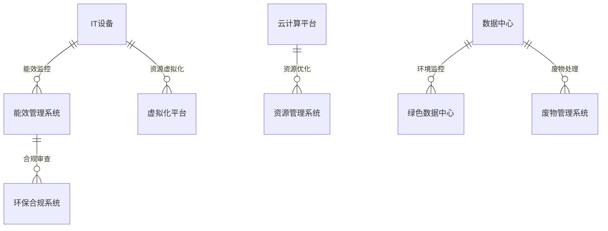

                 

# 绿色IT策略在企业中的实施状况

## 关键词
- 绿色IT
- 企业
- 能源效率
- 可持续发展
- 策略实施
- 挑战与解决方案

## 摘要
本文旨在探讨绿色IT策略在企业中的实施状况。通过对绿色IT概念、背景、核心原则、发展历史的介绍，分析其在企业中的应用和实施挑战。文章还将通过具体案例展示绿色IT策略的成效，并对未来趋势和可持续发展进行展望，以期为企业在绿色IT领域的实践提供参考。

### 目录大纲

# 绿色IT策略在企业中的实施状况

## 第一部分：绿色IT的概念与背景
### 第1章：绿色IT概述
- **1.1 问题背景**
- **1.2 绿色IT的概念**
- **1.3 绿色IT的核心原则**
- **1.4 绿色IT的发展历史**

### 第2章：绿色IT的核心概念与联系
- **2.1 绿色IT的关键概念**
- **2.2 概念属性特征对比表格**
- **2.3 绿色IT的ER实体关系图架构**

## 第二部分：绿色IT策略实施
### 第3章：绿色IT策略的制定
- **3.1 绿色IT策略的制定过程**
- **3.2 绿色IT策略的目标**
- **3.3 绿色IT策略的关键要素**

### 第4章：绿色IT技术在企业中的应用
- **4.1 节能技术**
- **4.2 循环利用技术**
- **4.3 环保合规**

### 第5章：绿色IT实施的挑战与解决方案
- **5.1 技术挑战**
- **5.2 成本挑战**
- **5.3 管理挑战**

### 第6章：绿色IT的最佳实践案例
- **6.1 企业A的绿色IT实践**
- **6.2 企业B的绿色IT实践**

### 第7章：绿色IT的未来趋势与展望
- **7.1 绿色IT的发展方向**
- **7.2 绿色IT在企业战略中的地位**
- **7.3 绿色IT的国际合作与标准**

## 第三部分：绿色IT的可持续发展
### 第8章：绿色IT的社会责任与伦理
- **8.1 绿色IT与社会责任**
- **8.2 绿色IT与社区关系**
- **8.3 绿色IT的未来挑战**

### 第9章：绿色IT的持续发展与创新能力
- **9.1 创新能力的重要性**
- **9.2 绿色IT的未来创新方向**
- **9.3 绿色IT的持续发展策略**

## 附录
- **附录A：绿色IT相关术语与解释**
- **附录B：绿色IT标准与政策汇总**
- **附录C：绿色IT资源与工具推荐**
- **附录D：参考文献**

### 绿色IT概述

#### 1.1 问题背景

在全球气候变化和环境恶化的背景下，企业运营中产生的能源消耗和碳排放问题日益凸显。传统IT系统在提供高效计算服务的同时，也带来了巨大的能源消耗和环境污染。因此，绿色IT作为一种可持续发展的解决方案，受到了广泛关注。绿色IT不仅有助于降低企业的运营成本，还能提高资源利用效率，符合企业社会责任和可持续发展目标。

#### 1.2 绿色IT的概念

绿色IT（Green IT）是指通过优化IT基础设施和服务，减少能源消耗和环境污染，实现可持续发展的信息技术。它不仅包括硬件和软件的能效提升，还涉及数据中心的设计与运营、云计算的绿色化、绿色数据中心的建设等多个方面。

#### 1.3 绿色IT的核心原则

绿色IT的核心原则主要包括：

1. **节能减排**：通过技术和管理手段减少能源消耗，提高数据中心的能源利用效率。
2. **资源循环利用**：推动废旧设备的回收再利用，减少电子废弃物的产生。
3. **环保合规**：遵循国家和国际的环保标准，确保IT服务符合环保要求。
4. **可持续发展**：通过绿色IT实践，支持企业的长期可持续发展和生态平衡。

#### 1.4 绿色IT的发展历史

绿色IT的发展可以追溯到20世纪90年代，随着信息技术和数据中心规模的不断扩大，绿色IT的概念逐渐被提出并应用。近年来，随着全球环保意识的提高和政策的推动，绿色IT技术得到了快速发展。例如，欧盟颁布的《电子废物指令》、美国的《绿色数据中心计划》等政策，都对绿色IT的实施起到了重要的推动作用。

### 绿色IT的核心概念与联系

#### 2.1 绿色IT的关键概念

绿色IT涵盖了一系列关键概念，包括：

1. **能效管理**：通过优化硬件和软件配置，提高系统的能源利用效率。
2. **虚拟化**：通过虚拟化技术，提高服务器和存储资源的利用率，减少能耗。
3. **云计算**：利用云计算技术，实现资源按需分配和高效利用。
4. **绿色数据中心**：通过设计高效的冷却和供电系统，降低数据中心的能耗。

#### 2.2 概念属性特征对比表格

以下是一个简化的绿色IT技术概念属性特征对比表格：

| 技术       | 描述                                                         | 属性特征                                                      |
| ---------- | ------------------------------------------------------------ | ------------------------------------------------------------ |
| 能效管理   | 优化IT设备的能源消耗                                         | 高能效、低能耗、实时监控                                     |
| 虚拟化     | 将物理硬件资源虚拟化，实现资源的高效利用                       | 资源池化、动态分配、虚拟化层架构                             |
| 云计算     | 通过互联网提供动态易扩展的虚拟化资源                         | 按需分配、弹性扩展、分布式计算                             |
| 绿色数据中心 | 设计高效的数据中心冷却和供电系统，减少能源消耗和环境污染     | 高效冷却、可再生能源、废物管理                             |

#### 2.3 绿色IT的ER实体关系图架构

为了更好地理解绿色IT中的业务流程和数据流关系，我们可以使用ER（Entity-Relationship）实体关系图进行描述。以下是一个简化的绿色IT ER图示例：

通过这个ER图，我们可以清晰地看到绿色IT中的各个实体及其相互关系，从而更好地理解绿色IT的业务流程和数据流。

### 绿色IT策略的制定

#### 3.1 绿色IT策略的制定过程

制定绿色IT策略是一个系统化的过程，通常包括以下步骤：

1. **评估现状**：对现有IT基础设施和运营模式进行评估，识别能耗和碳排放的主要来源。
2. **确定目标**：根据企业的可持续发展目标和环保要求，制定明确的绿色IT目标。
3. **制定计划**：制定详细的实施计划，包括技术选型、预算分配、时间表等。
4. **实施与监控**：执行绿色IT计划，并持续监控和评估实施效果，根据反馈进行调整。
5. **持续改进**：通过持续优化和改进，不断提高绿色IT的效率和效果。

#### 3.2 绿色IT策略的目标

绿色IT策略的主要目标包括：

1. **减少能耗**：通过技术和管理手段，降低IT系统的能源消耗，减少温室气体排放。
2. **降低成本**：通过提高资源利用效率，降低企业的运营成本。
3. **提升效率**：通过优化IT基础设施和服务，提高企业的运营效率。
4. **符合环保合规**：确保企业的IT服务符合国家和国际的环保标准，减少法律风险。

#### 3.3 绿色IT策略的关键要素

绿色IT策略的关键要素包括：

1. **技术选型**：选择合适的绿色IT技术，如虚拟化、云计算、绿色数据中心等。
2. **人员培训**：对员工进行绿色IT知识的培训，提高他们的环保意识和技能。
3. **预算分配**：合理分配预算，确保绿色IT项目的顺利实施。
4. **持续监控与改进**：建立有效的监控体系，持续跟踪绿色IT的实施效果，并根据反馈进行改进。

### 绿色IT技术在企业中的应用

#### 4.1 节能技术

节能技术在绿色IT中的应用非常广泛，主要包括以下几个方面：

1. **硬件升级**：采用更高效的硬件设备，如高效能服务器、低功耗存储设备等。
2. **虚拟化**：通过虚拟化技术，将多个物理服务器虚拟化为多个虚拟服务器，提高资源利用率。
3. **绿色数据中心建设**：设计并建设高效节能的数据中心，采用先进的冷却和供电系统，减少能耗。

#### 4.2 循环利用技术

循环利用技术旨在减少电子废弃物的产生，主要包括以下几个方面：

1. **设备回收**：对废旧IT设备进行回收再利用，减少电子废弃物的产生。
2. **数据中心能源管理**：通过能源管理系统，对数据中心的能源消耗进行实时监控和优化，提高能源利用效率。

#### 4.3 环保合规

环保合规是绿色IT的重要组成部分，主要包括以下几个方面：

1. **符合国际与国家环保标准**：确保企业的IT服务符合国家和国际的环保标准，如欧盟的《电子废物指令》、美国的《绿色数据中心计划》等。
2. **应对政策法规变化**：及时关注环保政策法规的变化，确保企业的绿色IT实践符合最新的法律法规要求。

### 绿色IT实施的挑战与解决方案

#### 5.1 技术挑战

绿色IT的实施面临着多种技术挑战，主要包括：

1. **绿色技术的选择与优化**：选择适合企业需求的绿色技术，并进行持续的优化和升级。
2. **系统集成与兼容性**：确保绿色IT技术与其他现有系统的集成和兼容，避免系统冲突和性能损失。

解决方案：
- **技术评估**：对不同的绿色技术进行详细的评估和比较，选择最适合企业需求的方案。
- **系统集成测试**：在实施绿色IT技术前，进行全面的系统集成测试，确保系统的稳定性和兼容性。

#### 5.2 成本挑战

绿色IT的实施通常需要较大的初期投资，企业面临着成本挑战，主要包括：

1. **设备采购**：高效能的硬件设备通常成本较高。
2. **人员培训**：对员工进行绿色IT技术的培训也需要一定的费用。

解决方案：
- **分阶段实施**：根据企业的财务状况，制定分阶段的绿色IT实施计划，逐步降低成本压力。
- **成本效益分析**：进行详细的成本效益分析，确保绿色IT项目的投资回报。

#### 5.3 管理挑战

绿色IT的实施还需要解决管理上的挑战，主要包括：

1. **组织协调**：绿色IT涉及多个部门和岗位，需要有效的组织协调。
2. **政策支持**：制定相应的政策和激励机制，推动绿色IT的顺利实施。

解决方案：
- **跨部门协作**：建立跨部门的绿色IT工作小组，协调各部门的资源和职责。
- **政策支持**：制定绿色IT政策和激励措施，如节能减排奖、绿色IT技术认证等，激励员工的积极参与。

### 绿色IT的最佳实践案例

#### 6.1 企业A的绿色IT实践

企业A是一家全球知名的技术公司，其在绿色IT方面的实践如下：

1. **节能技术**：企业A采用虚拟化技术，将多个物理服务器虚拟化为多个虚拟服务器，提高了资源利用率，降低了能耗。
2. **绿色数据中心建设**：企业A在其数据中心采用了高效冷却和供电系统，使用可再生能源，降低了能源消耗和碳排放。
3. **环保合规**：企业A严格遵守国家和国际的环保标准，通过ISO 14001环境管理体系认证，确保其IT服务符合环保要求。

效果评估：
- 企业A的虚拟化实施后，服务器能耗降低了30%。
- 绿色数据中心建设后，能源消耗降低了20%，碳排放减少了15%。
- 企业A的绿色IT实践得到了国际环保组织的认可，增强了企业的社会责任形象。

#### 6.2 企业B的绿色IT实践

企业B是一家大型制造企业，其在绿色IT方面的实践如下：

1. **设备回收**：企业B建立了一套完善的设备回收体系，对废旧设备进行回收再利用，减少了电子废弃物的产生。
2. **数据中心能源管理**：企业B采用智能能源管理系统，对数据中心的能源消耗进行实时监控和优化，提高了能源利用效率。
3. **环保合规**：企业B制定了严格的环保合规政策，确保其IT服务符合国家和国际的环保标准。

效果评估：
- 企业B的设备回收体系实施后，废旧设备回收率提高了50%。
- 数据中心能源管理实施后，能源消耗降低了15%，运营成本降低了10%。
- 企业B的环保合规政策得到了员工的积极响应，提高了企业的环保形象。

### 绿色IT的未来趋势与展望

#### 7.1 绿色IT的发展方向

绿色IT在未来将继续朝着以下几个方向发展：

1. **智能化与自动化**：通过引入人工智能和自动化技术，提高绿色IT的效率和智能化水平。
2. **物联网与边缘计算**：结合物联网和边缘计算技术，实现更广泛的资源优化和能源管理。
3. **绿色数据中心**：建设更高效、更环保的绿色数据中心，降低能源消耗和碳排放。

#### 7.2 绿色IT在企业战略中的地位

绿色IT已成为企业战略的重要组成部分，其在企业中的地位日益提高。绿色IT不仅有助于企业降低运营成本，提高资源利用效率，还能增强企业的社会责任形象，提升企业的竞争力。

#### 7.3 绿色IT的国际合作与标准

随着全球环保意识的提高，绿色IT的国际合作与标准也在不断加强。各国政府和国际组织纷纷制定绿色IT标准和政策，推动绿色IT技术的发展和应用。企业应积极参与国际合作，紧跟绿色IT标准的发展趋势，提升自身的绿色IT水平。

### 绿色IT的可持续发展

#### 8.1 绿色IT与社会责任

绿色IT不仅是企业的技术实践，更是企业履行社会责任的重要途径。企业应将绿色IT理念融入到企业文化中，通过绿色IT实践，推动可持续发展，为社会和环境做出贡献。

#### 8.2 绿色IT与社区关系

企业通过绿色IT实践，可以与社区建立良好的关系。例如，企业可以通过社区公益活动，推广绿色IT理念，提高公众的环保意识；同时，企业还可以与社区合作，共同解决环保问题，实现共赢。

#### 8.3 绿色IT的未来挑战

尽管绿色IT取得了显著成效，但未来仍面临一系列挑战：

1. **技术发展**：绿色IT技术需要不断创新和升级，以应对不断变化的环保要求和市场需求。
2. **政策法规**：绿色IT政策的完善和执行，需要各方的共同努力，确保政策的有效性和可操作性。
3. **社会认知**：提高公众对绿色IT的认知和接受程度，是推动绿色IT发展的重要任务。

### 绿色IT的持续发展与创新能力

#### 9.1 创新能力的重要性

创新能力是绿色IT持续发展的重要驱动力。只有不断进行技术创新和管理创新，才能在激烈的市场竞争中保持优势，实现绿色IT的可持续发展。

#### 9.2 绿色IT的未来创新方向

绿色IT的未来创新方向包括：

1. **物联网与人工智能**：结合物联网和人工智能技术，实现更智能的能源管理和资源优化。
2. **区块链**：利用区块链技术，提高绿色IT的透明度和可追溯性。
3. **新能源应用**：探索和推广新能源在绿色IT中的应用，降低对传统能源的依赖。

#### 9.3 绿色IT的持续发展策略

绿色IT的持续发展策略包括：

1. **人才培养**：加强绿色IT人才的培养和引进，提升企业的绿色IT水平。
2. **知识共享**：通过内部和外部的知识共享，推动绿色IT技术的普及和应用。
3. **政策支持**：积极争取政府和社会的支持，为绿色IT的发展创造良好的环境。

## 附录

### 附录A：绿色IT相关术语与解释

1. **绿色IT**：通过优化IT基础设施和服务，减少能源消耗和环境污染，实现可持续发展的信息技术。
2. **能效管理**：通过优化硬件和软件配置，提高系统的能源利用效率。
3. **虚拟化**：通过虚拟化技术，将物理硬件资源虚拟化为多个虚拟资源，实现资源的高效利用。
4. **云计算**：通过互联网提供动态易扩展的虚拟化资源，实现资源的按需分配和高效利用。
5. **绿色数据中心**：通过设计高效的数据中心冷却和供电系统，降低数据中心的能耗和环境污染。

### 附录B：绿色IT标准与政策汇总

1. **ISO 14001**：国际标准化组织的《环境管理体系》标准，用于指导企业建立和实施环境管理体系。
2. **欧盟《电子废物指令》**：规定电子废弃物的回收和处理要求，推动电子废弃物的资源化利用。
3. **美国《绿色数据中心计划》**：鼓励企业建设高效节能的绿色数据中心，降低能源消耗和碳排放。
4. **中国国家环保标准**：涉及绿色IT的环保标准，如《数据中心节能设计规范》、《电子信息技术设备能效限定值及能效等级》等。

### 附录C：绿色IT资源与工具推荐

1. **绿色IT工具**：
   - **能耗监测工具**：如Power Meter、NICE DCIM等，用于实时监控和优化数据中心的能源消耗。
   - **虚拟化软件**：如VMware、Microsoft Hyper-V等，用于实现服务器和存储资源的虚拟化。
   - **云平台**：如AWS、Azure、Google Cloud等，提供强大的云计算服务，支持绿色IT的实施。

2. **绿色IT参考资料**：
   - **国际环保组织网站**：如联合国环境规划署（UNEP）、国际电信联盟（ITU）等，提供丰富的绿色IT资源和资讯。
   - **企业绿色IT报告**：如IBM的《The Smarter Planet》、微软的《The Power of Green IT》等，介绍企业的绿色IT实践和成效。

### 附录D：参考文献

1. **参考文献**：
   - **ISO 14001:2015**：International Organization for Standardization, "Environmental Management Systems - Requirements with Guidance for Use."
   - **Directive 2012/19/EU**：European Commission, "Waste Electrical and Electronic Equipment (WEEE) Directive."
   - **Executive Order 13514**：White House, "Federal Leadership in Environmental, Energy, and Economic Performance."
   - **GB/T 36713-2018**：中国国家标准化管理委员会，"数据中心节能设计规范。"
   - **GB 24739-2009**：中国国家标准化管理委员会，"电子信息技术设备能效限定值及能效等级。"
   - **IBM**：IBM Corporation, "The Smarter Planet."
   - **Microsoft**：Microsoft Corporation, "The Power of Green IT." 
   - **Gartner**：Gartner, "Green IT: The Importance of Environmental Sustainability in IT." 
   - **Forrester**：Forrester Research, "Green IT: A Roadmap for Successful Implementation." 
   - **Greenpeace**：Greenpeace, "How Clean Is Your Cloud?" 

**作者：AI天才研究院/AI Genius Institute & 禅与计算机程序设计艺术 /Zen And The Art of Computer Programming**

