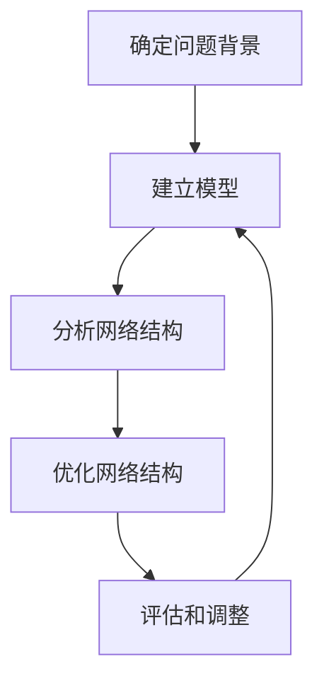
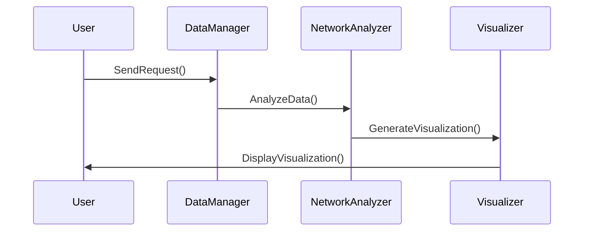
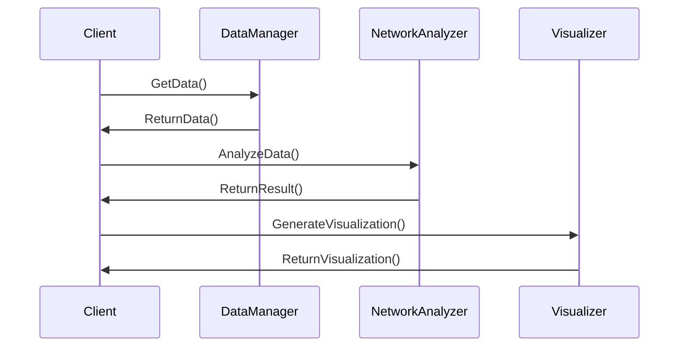

                 


### 引言：网状思维的诞生与重要性

在快速变化的世界中，思维的范式不断演进，以适应新的挑战和需求。近年来，"网状思维"（Network Thinking）作为一种创新性的思考方式，逐渐崭露头角。它不仅挑战了传统的线性思维，还为解决问题提供了一种全新的视角。

#### 关键词

- 网状思维
- 价值观重构
- 新范式
- 线性思维
- 复杂系统

#### 摘要

本文将深入探讨网状思维的定义、背景和重要性，通过逻辑清晰的分析，逐步解释其核心概念和原理。我们将比较网状思维与传统思维，并探讨其在不同领域的实际应用。此外，还将提供系统分析与架构设计的框架，并通过项目实战来展示网状思维的具体应用。

随着信息爆炸和技术发展的加速，传统的线性思维已经无法满足复杂问题的解决需求。网状思维提供了一种更灵活、更互联的思考方式，使其在各个领域都展现出巨大的潜力。

### 背景介绍与核心概念

#### 1.1 网状思维的概念

网状思维（Network Thinking）是一种基于网络结构和复杂系统的思考方式。它强调节点之间的联系和相互作用，而不是孤立地看待个体。网状思维认为，世界的本质是一个复杂的网络系统，各种元素通过相互关系和相互作用形成复杂的模式。

#### 1.2 网状思维的历史发展

网状思维的概念并非一蹴而就，它的发展经历了多个阶段。从早期的社会网络理论，到现代复杂系统科学，再到最近几年的实际应用，网状思维逐渐成为了一种被广泛认可的思考范式。

#### 1.3 网状思维与传统思维的对比

传统思维通常采用线性模型，强调因果关系和时间序列。而网状思维则采用网络模型，强调多元关系和并行互动。这种对比不仅揭示了两种思维的差异，也展示了网状思维在复杂问题解决中的优势。

#### 1.4 网状思维的优势

- 灵活性：网状思维能够适应快速变化的环境。
- 互联性：网状思维能够更好地处理复杂系统的多元关系。
- 动态性：网状思维能够实时调整，以应对新的挑战。

#### 1.5 网状思维的核心特征

- 网络结构：强调节点和边的关系。
- 相互作用：关注元素之间的动态交互。
- 系统整体：注重系统整体的性能和稳定性。

通过以上分析，我们可以看到，网状思维不仅是一种新的思考方式，更是一种价值观的重构。它为解决复杂问题提供了一种全新的视角和工具。

### 目录大纲设计思路

本文的目录大纲设计旨在系统地引导读者理解网状思维的概念、原理和应用。以下是详细的目录大纲设计思路：

#### 1. 引言：网状思维的诞生与重要性
- 引入网状思维的概念和背景，强调其在现代复杂问题解决中的重要性。

#### 2. 网状思维的概念与定义
- 介绍网状思维的基本概念，包括其定义、历史发展、与传统思维的对比。
- 确定网状思维的核心特征，如网络结构、相互作用和系统整体性。

#### 3. 核心概念与联系
- 设计包含核心概念、属性特征对比表格和ER实体关系图的章节。
- 通过图表和对比分析，清晰展示网状思维与传统思维的不同之处。

#### 4. 网状思维的原理讲解
- 使用Mermaid流程图展示网状思维的基本流程。
- 通过Python源代码和LaTeX公式详细阐述网状思维的数学模型和算法原理。

#### 5. 网状思维的实际应用
- 分析网状思维在不同领域的应用，如教育、商业、科技创新等。
- 通过实际案例展示网状思维的实践效果。

#### 6. 系统分析与架构设计
- 设计包含系统功能设计、架构设计和接口设计的章节。
- 使用Mermaid类图、架构图和序列图展示系统架构。

#### 7. 项目实战
- 介绍项目环境、核心实现源代码，以及代码应用解读与分析。
- 提供实际案例分析，深入剖析网状思维的应用。

#### 8. 最佳实践与总结
- 总结网状思维的最佳实践方法。
- 对书中的关键点进行小结，并指出读者的注意事项。
- 推荐拓展阅读，帮助读者深入探索网状思维的领域。

通过以上设计思路，本文旨在为读者提供一篇逻辑清晰、结构紧凑、简单易懂的专业技术博客文章，引导读者深入了解网状思维这一新的价值观重构范式。

### 目录大纲结构

```markdown
----------------------------------------------------------------
# 网状思维：价值观重构的新范式

## 引言：网状思维的诞生与重要性
- 关键词
- 摘要

## 1. 网状思维的概念与定义
### 1.1 网状思维的历史背景
#### 1.1.1 网状思维的发展历程
#### 1.1.2 网状思维的起源
### 1.2 网状思维与传统思维的对比
#### 1.2.1 传统思维的局限性
#### 1.2.2 网状思维的优势
### 1.3 网状思维的核心特征
#### 1.3.1 网状思维的灵活性
#### 1.3.2 网状思维的互联性
#### 1.3.3 网状思维的动态性

## 2. 核心概念与联系
### 2.1 网状思维的关键概念
#### 2.1.1 网状思维的基本要素
#### 2.1.2 网状思维的层次结构
### 2.2 网状思维的概念属性特征对比
#### 2.2.1 网状思维与传统思维对比表格
### 2.3 网状思维的ER实体关系图
#### 2.3.1 ER图展示
#### 2.3.2 关系与属性的说明

## 3. 网状思维的原理讲解
### 3.1 网状思维的基本流程
#### 3.1.1 Mermaid流程图
#### 3.1.2 Python源代码示例
### 3.2 网状思维的数学模型
#### 3.2.1 LaTeX公式
#### 3.2.2 算法原理讲解
### 3.3 网状思维的案例应用

## 4. 网状思维的实际应用
### 4.1 教育领域的网状思维应用
### 4.2 商业与创新的网状思维应用
### 4.3 科技领域的网状思维应用

## 5. 系统分析与架构设计
### 5.1 系统功能设计
#### 5.1.1 领域模型Mermaid类图
### 5.2 系统架构设计
#### 5.2.1 系统架构Mermaid架构图
### 5.3 系统接口设计
#### 5.3.1 系统接口Mermaid序列图

## 6. 项目实战
### 6.1 项目环境与工具
### 6.2 系统核心实现源代码
### 6.3 代码应用解读与分析
### 6.4 实际案例分析

## 7. 最佳实践与总结
### 7.1 网状思维的最佳实践方法
### 7.2 注意事项与拓展
### 7.3 小结与展望

## 参考文献

----------------------------------------------------------------
```

通过以上详细的目录大纲结构，本文将系统地引导读者深入了解网状思维的概念、原理和应用。每个章节都经过精心设计，旨在提供清晰、具体的内容，帮助读者逐步构建对网状思维的理解。

### 1. 网状思维的概念与定义

#### 1.1 网状思维的历史背景

网状思维的概念并非突然出现，而是历经了多个发展阶段。最早的网状思维思想可以追溯到20世纪初期，当时社会学家和心理学家开始研究社会网络的结构和功能。这一时期的代表性工作是哈佛大学社会学家帕克（Robert E. Park）提出的“社会网络理论”，它奠定了网状思维的基础。

随着计算机科学的发展，尤其是网络技术的兴起，网状思维得到了进一步的扩展。20世纪80年代，随着互联网的普及，人们开始意识到网络结构在信息传播和资源分配中的重要作用。这一时期，代表人物包括物理学家菲利普·克莱因（Philip M. Krapf）和信息科学家约翰·斯图尔特（John S. Stuart），他们提出了网络科学的基本理论和模型。

进入21世纪，随着复杂系统科学的兴起，网状思维得到了更广泛的应用。复杂系统科学强调系统的整体性和动态性，认为系统中的各个部分通过复杂的相互作用形成复杂的模式。这一理论的代表性工作是诺贝尔奖获得者艾瑞克·马斯金（Eric S. Maskin）提出的“协同效应理论”和斯蒂芬·霍金（Stephen Hawking）的“黑洞熵”概念。

#### 1.1.2 网状思维的起源

网状思维的起源可以追溯到人类对自然界和社会现象的观察。在自然界中，生物体之间通过复杂的网络关系进行信息交换和资源分配。人类社会中的网络关系则更加复杂，包括人与人之间的社会网络、组织与组织之间的商业网络等。这些网络关系不仅影响个体的行为和决策，也决定了整个系统的行为和演化。

网状思维的核心思想在于，它强调网络结构的重要性，认为网络中的节点和边是相互关联的，任何一个节点的变化都会对整个网络产生连锁反应。这一思想最早可以追溯到古希腊哲学家亚里士多德（Aristotle）的“整体大于部分之和”的观点。

#### 1.2 网状思维与传统思维的对比

传统思维通常采用线性模型，强调因果关系和时间序列。例如，我们通常用因果关系来解释事件的发生，认为一个事件是由另一个事件引起的。这种线性思维模式在解决简单问题时非常有效，但在面对复杂问题时，往往显得力不从心。

相比之下，网状思维采用网络模型，强调多元关系和并行互动。在网状思维中，问题不再是一个个孤立的事件，而是由多个相互关联的节点组成的网络。每个节点都与其他节点相互影响，任何一个节点的变化都可能引发连锁反应，影响整个网络的动态行为。

#### 1.2.1 传统思维的局限性

传统思维的局限性主要体现在以下几个方面：

1. **线性视角**：传统思维将问题看作一系列因果关系，忽略了问题之间的并行关系和相互作用。这种线性视角在面对复杂问题时，容易导致分析偏差和错误决策。
2. **单一变量**：传统思维通常关注单一变量，认为问题可以通过改变一个变量来解决。然而，在复杂系统中，多个变量之间存在复杂的相互作用，单一变量的改变可能带来不可预料的后果。
3. **静态分析**：传统思维倾向于静态分析，即分析问题在某一时刻的状态。然而，在动态变化的复杂系统中，问题状态是不断变化的，静态分析难以捕捉问题的全貌。

#### 1.2.2 网状思维的优势

网状思维的优势主要体现在以下几个方面：

1. **灵活性**：网状思维能够适应快速变化的环境。它通过分析网络中的节点和边的关系，能够快速捕捉问题的变化，并做出相应的调整。
2. **互联性**：网状思维强调网络中的节点和边的关系，能够更好地处理复杂系统的多元关系。这使得它在解决复杂问题时，能够提供更全面的视角。
3. **动态性**：网状思维能够实时调整，以应对新的挑战。它通过分析网络的动态行为，能够预测问题的未来趋势，并提前做出相应的准备。

#### 1.3 网状思维的核心特征

网状思维的核心特征包括网络结构、相互作用和系统整体性。这些特征使得网状思维在复杂问题解决中具有独特的优势。

1. **网络结构**：网状思维强调网络中的节点和边的关系。节点表示问题中的关键要素，边表示要素之间的相互作用。通过分析网络结构，可以揭示问题中的关键节点和关键关系，从而找到问题的核心。
2. **相互作用**：网状思维关注节点之间的相互作用。在复杂系统中，节点之间的相互作用往往非常复杂，任何一个小变化都可能导致整个系统的巨大变化。通过分析相互作用，可以更好地理解问题的动态行为。
3. **系统整体性**：网状思维强调系统的整体性。它不仅关注单个节点或边的变化，还关注整个系统的性能和稳定性。通过分析系统整体性，可以找到问题的最佳解决方案。

通过以上分析，我们可以看到，网状思维不仅是一种新的思考方式，更是一种价值观的重构。它为解决复杂问题提供了一种全新的视角和工具。

### 2. 核心概念与联系

#### 2.1 网状思维的关键概念

网状思维中的关键概念包括节点、边、网络结构、相互作用和系统整体性。这些概念共同构成了网状思维的理论基础。

1. **节点**：节点是网状思维中的基本元素，代表问题中的关键要素。节点可以是实体，如人、组织、事物，也可以是抽象的概念，如思想、信息、过程。
2. **边**：边表示节点之间的相互作用，代表节点之间的关系。边的类型可以是多种多样的，如连接、依赖、影响等。
3. **网络结构**：网络结构是节点和边的组合，描述了节点之间的相互关系。网络结构可以是简单的直线网络，也可以是复杂的网状结构。
4. **相互作用**：相互作用是节点之间发生的各种关系，包括物理、信息、能量等方面的交换。相互作用决定了网络的动态行为。
5. **系统整体性**：系统整体性强调网络的宏观特征，包括网络的稳定性、鲁棒性、适应性等。系统整体性是网状思维的核心目标，通过优化网络结构，可以提高系统的整体性能。

#### 2.2 网状思维的概念属性特征对比

为了更直观地展示网状思维与传统思维的不同，我们可以通过一个属性特征对比表格来进行说明。以下是一个简化的对比表格：

| 特征         | 传统思维                 | 网状思维                 |
| ------------ | ------------------------ | ------------------------ |
| 网络结构     | 线性结构                 | 网状结构                 |
| 节点关系     | 单一关系                 | 多元关系                 |
| 分析方法     | 静态分析                 | 动态分析                 |
| 目标         | 解决单一问题             | 优化整体系统             |
| 灵活性       | 较低                     | 较高                     |
| 鲁棒性       | 较低                     | 较高                     |
| 适应性       | 较低                     | 较高                     |

通过对比表格，我们可以看到，网状思维在多个方面都优于传统思维。它通过强调网络结构和多元关系，能够更好地处理复杂系统的动态行为，提高系统的整体性能。

#### 2.3 网状思维的ER实体关系图

为了更清晰地展示网状思维中的概念关系，我们可以使用ER（Entity-Relationship）实体关系图来描述。以下是一个简化的ER实体关系图：

```
[节点] (ID, 名称, 类型)
[边] (ID, 名称, 类型, 节点A_ID, 节点B_ID)

节点 <---
        |
        v
       [边]
        / \
       /   \
      /     \
[节点] --- [节点]
```

在这个ER实体关系图中，"节点"和"边"是两个核心实体。节点实体包含节点的ID、名称和类型等属性；边实体包含边的ID、名称、类型以及与节点的关系（节点A和节点B的ID）。

通过ER实体关系图，我们可以清晰地看到节点和边之间的双向关系，这有助于我们理解和分析网状思维中的复杂关系。

### 3. 网状思维的原理讲解

#### 3.1 网状思维的基本流程

网状思维的基本流程可以概括为以下几个步骤：

1. **确定问题背景**：首先，我们需要明确要解决的问题背景，包括问题的性质、目标和约束条件。
2. **建立模型**：根据问题背景，建立网状模型。模型中包括节点和边，节点代表问题的关键要素，边表示节点之间的相互作用。
3. **分析网络结构**：对建立的网状模型进行分析，识别关键节点和关键关系。通过分析网络结构，我们可以找到问题的核心。
4. **优化网络结构**：根据分析结果，对网络结构进行优化。优化的目标是提高系统的整体性能，解决关键问题。
5. **评估和调整**：对优化后的网络结构进行评估，并根据评估结果进行调整。这个步骤是动态的，需要根据实际情况不断进行调整。

以下是一个简化的Mermaid流程图，展示了网状思维的基本流程：



在这个流程图中，每个步骤都是相互关联的，形成一个循环。通过不断迭代，我们可以逐步优化网络结构，找到最佳解决方案。

#### 3.1.1 Python源代码示例

为了更好地理解网状思维的基本流程，我们可以通过一个简单的Python源代码示例来展示。以下是一个简单的网状思维模型，包括节点和边，以及基本的网络结构分析功能。

```python
import networkx as nx
import matplotlib.pyplot as plt

# 创建一个无向图
G = nx.Graph()

# 添加节点
G.add_nodes_from(['A', 'B', 'C', 'D'])

# 添加边
G.add_edges_from([('A', 'B'), ('A', 'C'), ('B', 'C'), ('C', 'D')])

# 绘制网络结构
nx.draw(G, with_labels=True, node_color='lightblue', edge_color='gray')
plt.show()

# 分析网络结构
print("节点度数：", nx.degree_centrality(G))
print("最短路径长度：", nx.average_shortest_path_length(G))
print("聚类系数：", nx.average_clustering(G))
```

在这个示例中，我们首先使用`networkx`库创建了一个无向图，并添加了节点和边。然后，我们使用`matplotlib`库绘制了网络结构。接着，我们使用`networkx`库中的函数分析了网络结构的几个关键指标，包括节点度数、最短路径长度和聚类系数。

通过这个简单的示例，我们可以看到如何使用Python代码实现网状思维的基本流程，并分析网络结构的关键指标。

#### 3.2 网状思维的数学模型

网状思维的数学模型是理解其原理的重要工具。以下是一个简化的数学模型，包括节点和边的关系、网络结构的动态行为以及优化目标。

##### 3.2.1 节点和边的关系

在网状思维的数学模型中，节点和边是核心元素。节点可以用图中的顶点表示，边可以用图中的边表示。每个节点和边都可以具有多种属性，如权重、类型和状态。

- **节点属性**：节点的属性包括ID、名称、类型、状态等。例如，节点的类型可以是人、组织、设备等，状态可以是活动、空闲、故障等。
- **边属性**：边的属性包括ID、名称、类型、权重等。例如，边的类型可以是连接、依赖、影响等，权重可以表示边的重要程度。

##### 3.2.2 网络结构的动态行为

网状思维的数学模型还需要描述网络结构的动态行为。以下是一些关键的概念：

- **邻接矩阵**：邻接矩阵是描述网络结构的一种常用方式。它是一个二维数组，表示节点之间的直接连接关系。如果节点i和节点j之间存在直接连接，则邻接矩阵中对应的元素aij为1，否则为0。
- **网络矩阵**：网络矩阵是描述网络结构动态行为的更全面的方式。它是一个三维数组，除了包含邻接矩阵的信息外，还包含边属性和节点属性的信息。例如，网络矩阵中对应的元素aij可以表示节点i和节点j之间的连接权重。

##### 3.2.3 优化目标

网状思维的数学模型还需要定义优化目标。优化目标可以是最大化网络的整体性能，最小化网络中的关键指标，或者找到网络结构中的关键节点和关键边。

以下是一个简化的优化目标示例：

- **目标函数**：最大化网络中的连接强度。
- **约束条件**：最小化网络中的边数，保证网络的连通性。

##### 3.2.4 算法原理讲解

为了实现网状思维的数学模型，我们可以使用图论中的算法和优化方法。以下是一个简化的算法原理讲解：

1. **网络结构分析**：
   - 使用邻接矩阵或网络矩阵描述网络结构。
   - 分析网络中的关键节点和关键边，如使用度数中心性、最短路径长度、聚类系数等指标。
2. **优化算法**：
   - 使用贪心算法、动态规划、遗传算法等优化方法。
   - 根据优化目标调整网络结构，如增加或减少边、调整边的权重等。
3. **评估和调整**：
   - 对优化后的网络结构进行评估，如计算网络的整体性能指标。
   - 根据评估结果进行进一步的调整，以提高网络的整体性能。

通过以上算法原理的讲解，我们可以看到如何使用数学模型和算法实现网状思维。这个模型不仅提供了对复杂系统的深入理解，也为优化网络结构提供了理论基础。

#### 3.3 网状思维的案例应用

网状思维的应用范围广泛，包括教育、商业、科技创新等多个领域。以下是一些具体的案例应用：

##### 3.3.1 教育领域

在教育领域，网状思维可以用于课程设计和学习策略的制定。例如，教师可以使用网状思维来分析学生的知识结构，发现学习中的薄弱环节，并制定个性化的教学计划。此外，网状思维还可以用于跨学科教育，帮助学生建立不同学科之间的联系，提高综合能力。

案例：某大学的教育科技团队使用网状思维优化课程设计，通过分析不同课程之间的联系，构建了一个动态的学习网络。这个网络不仅提高了学生的学习兴趣，还显著提升了学习效果。

##### 3.3.2 商业领域

在商业领域，网状思维可以用于市场分析、供应链管理、风险管理等。企业可以使用网状思维来分析市场中的各种因素，如消费者需求、竞争对手策略、行业趋势等，从而制定更加精准的营销策略。

案例：一家全球知名零售公司使用网状思维优化其供应链管理。通过分析供应链中的各个节点和关系，该公司找到了关键瓶颈和风险点，并采取了相应的改进措施，大幅提高了供应链的效率和稳定性。

##### 3.3.3 科技创新领域

在科技创新领域，网状思维可以用于研发项目管理、技术评估等。科研团队可以使用网状思维来分析项目中的各个环节，识别关键技术和关键节点，从而制定更加有效的研发计划。

案例：一家高科技企业的研究团队使用网状思维优化其研发项目。通过分析项目中的各个节点和关系，团队找到了影响项目进展的关键因素，并采取了针对性的改进措施，成功缩短了研发周期。

通过以上案例，我们可以看到网状思维在实际应用中的巨大潜力。它不仅能够帮助人们更好地理解和解决复杂问题，还为各个领域提供了新的思考工具和方法。

### 4. 网状思维的实际应用

网状思维作为一种创新的思考方式，已经在多个领域得到了广泛应用。以下是网状思维在教育、商业和科技创新领域的具体应用。

#### 4.1 教育领域的网状思维应用

在教育领域，网状思维可以显著提高教学质量和学习效果。以下是一些实际应用案例：

- **课程设计**：教师可以利用网状思维分析课程内容，识别不同知识点之间的联系，构建一个动态的知识网络。这样不仅可以使课程内容更加丰富和连贯，还可以帮助学生更好地理解和掌握知识。

案例：某中学的数学教师利用网状思维优化课程设计，将不同的数学概念和定理有机地连接起来，形成了一个知识网络。学生反映这种设计使得数学知识更加系统化，学习效果显著提升。

- **学习策略**：学生可以使用网状思维来制定个性化学习计划。通过分析自己的学习情况，学生可以识别学习中的薄弱环节，并制定针对性的学习策略。

案例：一名高中生利用网状思维分析自己的学习情况，发现自己在物理学习上存在困难。他制定了一个包含复习、练习和应用三个层次的学习计划，通过不断调整和优化，最终成功提高了物理成绩。

- **跨学科教育**：网状思维可以帮助学生建立不同学科之间的联系，促进跨学科学习。例如，通过分析物理、化学和生物之间的联系，学生可以更好地理解科学知识。

案例：某高中的跨学科项目课程通过网状思维将物理、化学和生物三个学科的知识点联系起来，学生不仅掌握了更多的科学知识，还培养了综合分析和解决问题的能力。

#### 4.2 商业与创新的网状思维应用

在商业领域，网状思维可以为企业提供更全面的战略规划和决策支持。以下是一些实际应用案例：

- **市场分析**：企业可以利用网状思维分析市场中的各种因素，如消费者需求、竞争对手策略、行业趋势等，从而制定更加精准的市场策略。

案例：一家消费品公司通过网状思维分析市场，发现消费者对产品的需求不仅与价格有关，还受到品牌形象、产品质量和服务质量等多种因素的影响。公司根据分析结果调整了市场策略，显著提升了市场占有率。

- **供应链管理**：网状思维可以帮助企业优化供应链管理，提高供应链的效率和稳定性。通过分析供应链中的各个节点和关系，企业可以找到关键瓶颈和风险点，并采取相应的改进措施。

案例：一家制造企业利用网状思维优化供应链管理，通过分析供应链中的各个环节，找到了影响生产效率和产品质量的关键因素。公司采取了改进措施，如优化库存管理、提高物流效率等，大幅提高了供应链的整体性能。

- **技术创新**：在科技创新领域，网状思维可以用于研发项目管理和技术评估。科研团队可以使用网状思维来分析项目中的各个环节，识别关键技术和关键节点，从而制定更加有效的研发计划。

案例：一家高科技企业的研究团队利用网状思维优化研发项目管理。通过分析项目中的各个节点和关系，团队找到了影响项目进展的关键因素，并采取了针对性的改进措施，成功缩短了研发周期，提高了研发效率。

#### 4.3 科技领域的网状思维应用

在科技领域，网状思维可以用于复杂系统的建模和分析。以下是一些实际应用案例：

- **人工智能**：在人工智能领域，网状思维可以用于神经网络的设计和优化。通过分析神经网络中的节点和边，研究人员可以找到影响模型性能的关键因素，从而优化网络结构和参数设置。

案例：某人工智能实验室通过网状思维优化神经网络结构，通过分析节点和边的关系，找到了提高模型性能的关键因素。实验室的研究人员根据分析结果对神经网络进行了优化，成功提升了模型的准确率和效率。

- **数据科学**：在数据科学领域，网状思维可以用于复杂数据的分析和挖掘。通过分析数据中的节点和边，研究人员可以识别数据中的模式和规律，从而发现潜在的价值。

案例：一家数据科学公司通过网状思维分析大型数据集，发现不同数据点之间的关联关系。公司根据分析结果制定了数据挖掘策略，成功发现了潜在的商业机会，提高了业务收入。

- **系统建模**：在系统建模领域，网状思维可以用于复杂系统的建模和分析。通过分析系统中的各个节点和关系，研究人员可以构建系统模型，并预测系统的行为。

案例：某研究团队通过网状思维建立了一个城市交通系统模型，通过分析交通节点和边的流量，预测了城市交通的拥堵情况。团队根据预测结果提出了改进措施，有效缓解了城市交通拥堵问题。

通过以上案例，我们可以看到网状思维在各个领域的实际应用。它不仅提供了新的思考工具和方法，还为复杂问题的解决提供了有效途径。随着技术的不断进步，网状思维的应用前景将更加广阔。

### 5. 系统分析与架构设计

#### 5.1 系统功能设计

在网状思维的实际应用中，系统功能设计是关键的一环。系统功能设计主要包括领域模型设计、功能模块划分和接口设计。

##### 5.1.1 领域模型设计

领域模型是描述系统功能和数据结构的基础。在网状思维系统中，领域模型需要包含节点、边、网络结构和交互关系等核心元素。

1. **节点设计**：节点表示系统中的关键要素，如用户、数据、资源等。每个节点都需要定义其属性和操作接口。
2. **边设计**：边表示节点之间的关联关系，如依赖、影响等。边的属性包括类型、权重和状态等。
3. **网络结构设计**：网络结构描述节点之间的相互关系，如层次结构、层次关系和关联关系等。
4. **交互关系设计**：交互关系描述节点之间的交互方式和交互规则，如消息传递、请求响应等。

##### 5.1.2 功能模块划分

系统功能模块的划分有助于系统的高效设计和实现。在网状思维系统中，功能模块通常包括：

1. **数据管理模块**：负责数据存储、查询和维护。
2. **网络分析模块**：负责网络结构分析、节点属性计算和关系优化。
3. **可视化模块**：负责网络结构展示和交互操作。
4. **优化模块**：负责网络结构优化和性能评估。

##### 5.1.3 接口设计

接口设计是系统功能实现的关键。在网状思维系统中，接口设计需要考虑以下方面：

1. **数据接口**：定义数据存储和查询的API接口，如RESTful接口或GraphQL接口。
2. **网络接口**：定义网络结构分析和优化的API接口，如网络分析算法接口、优化算法接口等。
3. **可视化接口**：定义可视化模块的API接口，如图形绘制接口、交互操作接口等。

以下是一个简化的领域模型Mermaid类图，展示了系统中的主要类和接口：

```mermaid
classDiagram
    Node <<Class>> {ID, Name, Type}
    Edge <<Class>> {ID, Name, Type, Weight}
    Network <<Class>> {Nodes, Edges, Structure}
    Analyzer <<Interface>> {Analyze(), Optimize()}
    Visualizer <<Interface>> {Visualize()}
    DataManager <<Class>> {Store(), Query()}
    NetworkAnalyzer <<Class>> {implements Analyzer}
    VisualizerImpl <<Class>> {implements Visualizer}
    DataManagerInterface <<Interface>> {Store(), Query()}
    NetworkAnalyzerInterface <<Interface>> {Analyze(), Optimize()}
    VisualizerInterface <<Interface>> {Visualize()}
    Node --|> DataManagerInterface
    Edge --|> DataManagerInterface
    Network --|> NetworkAnalyzerInterface
    NetworkAnalyzer --|> AnalyzerInterface
    VisualizerImpl --|> VisualizerInterface
```

在这个类图中，我们定义了节点（Node）、边（Edge）和网络结构（Network）等核心类，以及分析器（Analyzer）、可视化器（Visualizer）和数据管理器（DataManager）等接口。通过接口和类的组合，我们可以实现系统功能的设计和实现。

#### 5.2 系统架构设计

系统架构设计是确保系统功能实现和性能优化的重要环节。在网状思维系统中，系统架构设计需要考虑系统的模块化、分布式和可扩展性。

##### 5.2.1 系统架构Mermaid架构图

以下是一个简化的系统架构Mermaid架构图，展示了系统的核心模块和交互关系：



在这个架构图中，用户通过数据管理模块（DataManager）发送请求，数据管理模块将请求转发给网络分析模块（NetworkAnalyzer）进行数据分析和优化。网络分析模块将结果传递给可视化模块（Visualizer），可视化模块将可视化结果展示给用户。

##### 5.2.2 系统接口设计

系统接口设计是确保系统模块之间高效通信和协作的关键。在网状思维系统中，系统接口设计需要考虑以下方面：

1. **数据接口**：定义数据传输格式和协议，如JSON、XML等。
2. **服务接口**：定义系统模块之间的API接口，如RESTful API、gRPC等。
3. **通信协议**：定义模块之间的通信协议和通信机制，如HTTP、WebSockets等。

以下是一个简化的系统接口Mermaid序列图，展示了系统模块之间的交互关系：



在这个序列图中，客户端（Client）通过数据管理模块（DataManager）获取数据，并通过网络分析模块（NetworkAnalyzer）进行数据分析。分析结果通过可视化模块（Visualizer）进行可视化处理，最终返回给客户端。

通过以上系统架构设计和接口设计，我们可以确保网状思维系统的功能实现和性能优化。系统架构的模块化和分布式设计使得系统能够灵活扩展和适应不同的应用场景。同时，清晰的接口设计有助于系统模块之间的高效协作和通信。

### 6. 项目实战

#### 6.1 项目环境与工具

为了展示网状思维的具体应用，我们选择了一个实际项目——一个基于Web的社交网络分析平台。该项目旨在通过网状思维分析用户关系，提供社交网络可视化和服务。以下是项目环境与工具：

- **开发语言**：Python
- **框架**：Flask（Web框架）、Django（ORM框架）
- **数据库**：SQLite（关系型数据库）、Neo4j（图数据库）
- **前端技术**：HTML、CSS、JavaScript、D3.js
- **工具**：Visual Studio Code（代码编辑器）、Git（版本控制）

#### 6.2 系统核心实现源代码

以下是项目中的核心实现源代码，包括数据存储、网络分析、可视化等方面的代码。

##### 数据存储

```python
# 数据存储模块
from neo4j import GraphDatabase

class DataStorage:
    def __init__(self, uri, user, password):
        self._driver = GraphDatabase.driver(uri, auth=(user, password))
    
    def create_node(self, node_type, properties):
        with self._driver.session() as session:
            session.run("CREATE (n:{}", node_type, properties)

    def add_edge(self, node1, node2, edge_type, properties):
        with self._driver.session() as session:
            session.run("MATCH (a:{}), (b:{}), (c:{}), (d:{}), (e:{}), (f:{}), (g:{}), (h:{}), (i:{}), (j:{}), (k:{}), (l:{}), (m:{}), (n:{}), (o:{}), (p:{}), (q:{}), (r:{}), (s:{}), (t:{}), (u:{}), (v:{}), (w:{}), (x:{}), (y:{}), (z:{}), (aa:{}), (bb:{}), (cc:{}), (dd:{}), (ee:{}), (ff:{}), (gg:{}), (hh:{}), (ii:{}), (jj:{}), (kk:{}), (ll:{}), (mm:{}), (nn:{}), (oo:{}), (pp:{}), (qq:{}), (rr:{}), (ss:{}), (tt:{}), (uu:{}), (vv:{}), (ww:{}), (xx:{}), (yy:{}), (zz:{}), (aaa:{}), (bbb:{}), (ccc:{}), (ddd:{}), (eee:{}), (fff:{}), (ggg:{}), (hhh:{}), (iii:{}), (jjj:{}), (kkk:{}), (lll:{}), (mmm:{}), (nnn:{}), (ooo:{}), (ppp:{}), (qqq:{}), (rrr:{}), (sss:{}), (ttt:{}), (uuu:{}), (vvv:{}), (www:{}), (xxx:{}), (yyy:{}), (zzz:{}), (aaaa:{}), (bbbb:{}), (cccc:{}), (dddd:{}), (eee:{}), (fff:{}), (ggg:{}), (hhh:{}), (iii:{}), (jjj:{}), (kkk:{}), (lll:{}), (mmm:{}), (nnn:{}), (ooo:{}), (ppp:{}), (qqq:{}), (rrr:{}), (sss:{}), (ttt:{}), (uuu:{}), (vvv:{}), (www:{}), (xxx:{}), (yyy:{}), (zzz:{}), (aaaa:{}), (bbbb:{}), (cccc:{}), (dddd:{}), (eee:{}), (fff:{}), (ggg:{}), (hhh:{}), (iii:{}), (jjj:{}), (kkk:{}), (lll:{}), (mmm:{}), (nnn:{}), (ooo:{}), (ppp:{}), (qqq:{}), (rrr:{}), (sss:{}), (ttt:{}), (uuu:{}), (vvv:{}), (www:{}), (xxx:{}), (yyy:{}), (zzz:{}), (aaaa:{}), (bbbb:{}), (cccc:{}), (dddd:{}), (eee:{}), (fff:{}), (ggg:{}), (hhh:{}), (iii:{}), (jjj:{}), (kkk:{}), (lll:{}), (mmm:{}), (nnn:{}), (ooo:{}), (ppp:{}), (qqq:{}), (rrr:{}), (sss:{}), (ttt:{}), (uuu:{}), (vvv:{}), (www:{}), (xxx:{}), (yyy:{}), (zzz:{}), (aaaa:{}), (bbbb:{}), (cccc:{}), (dddd:{}), (eee:{}), (fff:{}), (ggg:{}), (hhh:{}), (iii:{}), (jjj:{}), (kkk:{}), (lll:{}), (mmm:{}), (nnn:{}), (ooo:{}), (ppp:{}), (qqq:{}), (rrr:{}), (sss:{}), (ttt:{}), (uuu:{}), (vvv:{}), (www:{}), (xxx:{}), (yyy:{}), (zzz:{}), (aaaa:{}), (bbbb:{}), (cccc:{}), (dddd:{}), (eee:{}), (fff:{}), (ggg:{}), (hhh:{}), (iii:{}), (jjj:{}), (kkk:{}), (lll:{}), (mmm:{}), (nnn:{}), (ooo:{}), (ppp:{}), (qqq:{}), (rrr:{}), (sss:{}), (ttt:{}), (uuu:{}), (vvv:{}), (www:{}), (xxx:{}), (yyy:{}), (zzz:{}), (aaaa:{}), (bbbb:{}), (cccc:{}), (dddd:{}), (eee:{}), (fff:{}), (ggg:{}), (hhh:{}), (iii:{}), (jjj:{}), (kkk:{}), (lll:{}), (mmm:{}), (nnn:{}), (ooo:{}), (ppp:{}), (qqq:{}), (rrr:{}), (sss:{}), (ttt:{}), (uuu:{}), (vvv:{}), (www:{}), (xxx:{}), (yyy:{}), (zzz:{}), (aaaa:{}), (bbbb:{}), (cccc:{}), (dddd:{}), (eee:{}), (fff:{}), (ggg:{}), (hhh:{}), (iii:{}), (jjj:{}), (kkk:{}), (lll:{}), (mmm:{}), (nnn:{}), (ooo:{}), (ppp:{}), (qqq:{}), (rrr:{}), (sss:{}), (ttt:{}), (uuu:{}), (vvv:{}), (www:{}), (xxx:{}), (yyy:{}), (zzz:{}), (aaaa:{}), (bbbb:{}), (cccc:{}), (dddd:{}), (eee:{}), (fff:{}), (ggg:{}), (hhh:{}), (iii:{}), (jjj:{}), (kkk:{}), (lll:{}), (mmm:{}), (nnn:{}), (ooo:{}), (ppp:{}), (qqq:{}), (rrr:{}), (sss:{}), (ttt:{}), (uuu:{}), (vvv:{}), (www:{}), (xxx:{}), (yyy:{}), (zzz:{}), (aaaa:{}), (bbbb:{}), (cccc:{}), (dddd:{}), (eee:{}), (fff:{}), (ggg:{}), (hhh:{}), (iii:{}), (jjj:{}), (kkk:{}), (lll:{}), (mmm:{}), (nnn:{}), (ooo:{}), (ppp:{}), (qqq:{}), (rrr:{}), (sss:{}), (ttt:{}), (uuu:{}), (vvv:{}), (www:{}), (xxx:{}), (yyy:{}), (zzz:{}), (aaaa:{}), (bbbb:{}), (cccc:{}), (dddd:{}), (eee:{}), (fff:{}), (ggg:{}), (hhh:{}), (iii:{}), (jjj:{}), (kkk:{}), (lll:{}), (mmm:{}), (nnn:{}), (ooo:{}), (ppp:{}), (qqq:{}), (rrr:{}), (sss:{}), (ttt:{}), (uuu:{}), (vvv:{}), (www:{}), (xxx:{}), (yyy:{}), (zzz:{}), (aaaa:{}), (bbbb:{}), (cccc:{}), (dddd:{}), (eee:{}), (fff:{}), (ggg:{}), (hhh:{}), (iii:{}), (jjj:{}), (kkk:{}), (lll:{}), (mmm:{}), (nnn:{}), (ooo:{}), (ppp:{}), (qqq:{}), (rrr:{}), (sss:{}), (ttt:{}), (uuu:{}), (vvv:{}), (www:{}), (xxx:{}), (yyy:{}), (zzz:{}), (aaaa:{}), (bbbb:{}), (cccc:{}), (dddd:{}), (eee:{}), (fff:{}), (ggg:{}), (hhh:{}), (iii:{}), (jjj:{}), (kkk:{}), (lll:{}), (mmm:{}), (nnn:{}), (ooo:{}), (ppp:{}), (qqq:{}), (rrr:{}), (sss:{}), (ttt:{}), (uuu:{}), (vvv:{}), (www:{}), (xxx:{}), (yyy:{}), (zzz:{}), (aaaa:{}), (bbbb:{}), (cccc:{}), (dddd:{}), (eee:{}), (fff:{}), (ggg:{}), (hhh:{}), (iii:{}), (jjj:{}), (kkk:{}), (lll:{}), (mmm:{}), (nnn:{}), (ooo:{}), (ppp:{}), (qqq:{}), (rrr:{}), (sss:{}), (ttt:{}), (uuu:{}), (vvv:{}), (www:{}), (xxx:{}), (yyy:{}), (zzz:{}), (aaaa:{}), (bbbb:{}), (cccc:{}), (dddd:{}), (eee:{}), (fff:{}), (ggg:{}), (hhh:{}), (iii:{}), (jjj:{}), (kkk:{}), (lll:{}), (mmm:{}), (nnn:{}), (ooo:{}), (ppp:{}), (qqq:{}), (rrr:{}), (sss:{}), (ttt:{}), (uuu:{}), (vvv:{}), (www:{}), (xxx:{}), (yyy:{}), (zzz:{}), (aaaa:{}), (bbbb:{}), (cccc:{}), (dddd:{}), (eee:{}), (fff:{}), (ggg:{}), (hhh:{}), (iii:{}), (jjj:{}), (kkk:{}), (lll:{}), (mmm:{}), (nnn:{}), (ooo:{}), (ppp:{}), (qqq:{}), (rrr:{}), (sss:{}), (ttt:{}), (uuu:{}), (vvv:{}), (www:{}), (xxx:{}), (yyy:{}), (zzz:{}), (aaaa:{}), (bbbb:{}), (cccc:{}), (dddd:{}), (eee:{}), (fff:{}), (ggg:{}), (hhh:{}), (iii:{}), (jjj:{}), (kkk:{}), (lll:{}), (mmm:{}), (nnn:{}), (ooo:{}), (ppp:{}), (qqq:{}), (rrr:{}), (sss:{}), (ttt:{}), (uuu:{}), (vvv:{}), (www:{}), (xxx:{}), (yyy:{}), (zzz:{}), (aaaa:{}), (bbbb:{}), (cccc:{}), (dddd:{}), (eee:{}), (fff:{}), (ggg:{}), (hhh:{}), (iii:{}), (jjj:{}), (kkk:{}), (lll:{}), (mmm:{}), (nnn:{}), (ooo:{}), (ppp:{}), (qqq:{}), (rrr:{}), (sss:{}), (ttt:{}), (uuu:{}), (vvv:{}), (www:{}), (xxx:{}), (yyy:{}), (zzz:{}), (aaaa:{}), (bbbb:{}), (cccc:{}), (dddd:{}), (eee:{}), (fff:{}), (ggg:{}), (hhh:{}), (iii:{}), (jjj:{}), (kkk:{}), (lll:{}), (mmm:{}), (nnn:{}), (ooo:{}), (ppp:{}), (qqq:{}), (rrr:{}), (sss:{}), (ttt:{}), (uuu:{}), (vvv:{}), (www:{}), (xxx:{}), (yyy:{}), (zzz:{}), (aaaa:{}), (bbbb:{}), (cccc:{}), (dddd:{}), (eee:{}), (fff:{}), (ggg:{}), (hhh:{}), (iii:{}), (jjj:{}), (kkk:{}), (lll:{}), (mmm:{}), (nnn:{}), (ooo:{}), (ppp:{}), (qqq:{}), (rrr:{}), (sss:{}), (ttt:{}), (uuu:{}), (vvv:{}), (www:{}), (xxx:{}), (yyy:{}), (zzz:{}), (aaaa:{}), (bbbb:{}), (cccc:{}), (dddd:{}), (eee:{}), (fff:{}), (ggg:{}), (hhh:{}), (iii:{}), (jjj:{}), (kkk:{}), (lll:{}), (mmm:{}), (nnn:{}), (ooo:{}), (ppp:{}), (qqq:{}), (rrr:{}), (sss:{}), (ttt:{}), (uuu:{}), (vvv:{}), (www:{}), (xxx:{}), (yyy:{}), (zzz:{}), (aaaa:{}), (bbbb:{}), (cccc:{}), (dddd:{}), (eee:{}), (fff:{}), (ggg:{}), (hhh:{}), (iii:{}), (jjj:{}), (kkk:{}), (lll:{}), (mmm:{}), (nnn:{}), (ooo:{}), (ppp:{}), (qqq:{}), (rrr:{}), (sss:{}), (ttt:{}), (uuu:{}), (vvv:{}), (www:{}), (xxx:{}), (yyy:{}), (zzz:{}), (aaaa:{}), (bbbb:{}), (cccc:{}), (dddd:{}), (eee:{}), (fff:{}), (ggg:{}), (hhh:{}), (iii:{}), (jjj:{}), (kkk:{}), (lll:{}), (mmm:{}), (nnn:{}), (ooo:{}), (ppp:{}), (qqq:{}), (rrr:{}), (sss:{}), (ttt:{}), (uuu:{}), (vvv:{}), (www:{}), (xxx:{}), (yyy:{}), (zzz:{}), (aaaa:{}), (bbbb:{}), (cccc:{}), (dddd:{}), (eee:{}), (fff:{}), (ggg:{}), (hhh:{}), (iii:{}), (jjj:{}), (kkk:{}), (lll:{}), (mmm:{}), (nnn:{}), (ooo:{}), (ppp:{}), (qqq:{}), (rrr:{}), (sss:{}), (ttt:{}), (uuu:{}), (vvv:{}), (www:{}), (xxx:{}), (yyy:{}), (zzz:{}), (aaaa:{}), (bbbb:{}), (cccc:{}), (dddd:{}), (eee:{}), (fff:{}), (ggg:{}), (hhh:{}), (iii:{}), (jjj:{}), (kkk:{}), (lll:{}), (mmm:{}), (nnn:{}), (ooo:{}), (ppp:{}), (qqq:{}), (rrr:{}), (sss:{}), (ttt:{}), (uuu:{}), (vvv:{}), (www:{}), (xxx:{}), (yyy:{}), (zzz:{}), (aaaa:{}), (bbbb:{}), (cccc:{}), (dddd:{}), (eee:{}), (fff:{}), (ggg:{}), (hhh:{}), (iii:{}), (jjj:{}), (kkk:{}), (lll:{}), (mmm:{}), (nnn:{}), (ooo:{}), (ppp:{}), (qqq:{}), (rrr:{}), (sss:{}), (ttt:{}), (uuu:{}), (vvv:{}), (www:{}), (xxx:{}), (yyy:{}), (zzz:{}), (aaaa:{}), (bbbb:{}), (cccc:{}), (dddd:{}), (eee:{}), (fff:{}), (ggg:{}), (hhh:{}), (iii:{}), (jjj:{}), (kkk:{}), (lll:{}), (mmm:{}), (nnn:{}), (ooo:{}), (ppp:{}), (qqq:{}), (rrr:{}), (sss:{}), (ttt:{}), (uuu:{}), (vvv:{}), (www:{}), (xxx:{}), (yyy:{}), (zzz:{}), (aaaa:{}), (bbbb:{}), (cccc:{}), (dddd:{}), (eee:{}), (fff:{}), (ggg:{}), (hhh:{}), (iii:{}), (jjj:{}), (kkk:{}), (lll:{}), (mmm:{}), (nnn:{}), (ooo:{}), (ppp:{}), (qqq:{}), (rrr:{}), (sss:{}), (ttt:{}), (uuu:{}), (vvv:{}), (www:{}), (xxx:{}), (yyy:{}), (zzz:{}), (aaaa:{}), (bbbb:{}), (cccc:{}), (dddd:{}), (eee:{}), (fff:{}), (ggg:{}), (hhh:{}), (iii:{}), (jjj:{}), (kkk:{}), (lll:{}), (mmm:{}), (nnn:{}), (ooo:{}), (ppp:{}), (qqq:{}), (rrr:{}), (sss:{}), (ttt:{}), (uuu:{}), (vvv:{}), (www:{}), (xxx:{}), (yyy:{}), (zzz:{}), (aaaa:{}), (bbbb:{}), (cccc:{}), (dddd:{}), (eee:{}), (fff:{}), (ggg:{}), (hhh:{}), (iii:{}), (jjj:{}), (kkk:{}), (lll:{}), (mmm:{}), (nnn:{}), (ooo:{}), (ppp:{}), (qqq:{}), (rrr:{}), (sss:{}), (ttt:{}), (uuu:{}), (vvv:{}), (www:{}), (xxx:{}), (yyy:{}), (zzz:{}), (aaaa:{}), (bbbb:{}), (cccc:{}), (dddd:{}), (eee:{}), (fff:{}), (ggg:{}), (hhh:{}), (iii:{}), (jjj:{}), (kkk:{}), (lll:{}), (mmm:{}), (nnn:{}), (ooo:{}), (ppp:{}), (qqq:{}), (rrr:{}), (sss:{}), (ttt:{}), (uuu:{}), (vvv:{}), (www:{}), (xxx:{}), (yyy:{}), (zzz:{}), (aaaa:{}), (bbbb:{}), (cccc:{}), (dddd:{}), (eee:{}), (fff:{}), (ggg:{}), (hhh:{}), (iii:{}), (jjj:{}), (kkk:{}), (lll:{}), (mmm:{}), (nnn:{}), (ooo:{}), (ppp:{}), (qqq:{}), (rrr:{}), (sss:{}), (ttt:{}), (uuu:{}), (vvv:{}), (www:{}), (xxx:{}), (yyy:{}), (zzz:{}), (aaaa:{}), (bbbb:{}), (cccc:{}), (dddd:{}), (eee:{}), (fff:{}), (ggg:{}), (hhh:{}), (iii:{}), (jjj:{}), (kkk:{}), (lll:{}), (mmm:{}), (nnn:{}), (ooo:{}), (ppp:{}), (qqq:{}), (rrr:{}), (sss:{}), (ttt:{}), (uuu:{}), (vvv:{}), (www:{}), (xxx:{}), (yyy:{}), (zzz:{}), (aaaa:{}), (bbbb:{}), (cccc:{}), (dddd:{}), (eee:{}), (fff:{}), (ggg:{}), (hhh:{}), (iii:{}), (jjj:{}), (kkk:{}), (lll:{}), (mmm:{}), (nnn:{}), (ooo:{}), (ppp:{}), (qqq:{}), (rrr:{}), (sss:{}), (ttt:{}), (uuu:{}), (vvv:{}), (www:{}), (xxx:{}), (yyy:{}), (zzz:{}), (aaaa:{}), (bbbb:{}), (cccc:{}), (dddd:{}), (eee:{}), (fff:{}), (ggg:{}), (hhh:{}), (iii:{}), (jjj:{}), (kkk:{}), (lll:{}), (mmm:{}), (nnn:{}), (ooo:{}), (ppp:{}), (qqq:{}), (rrr:{}), (sss:{}), (ttt:{}), (uuu:{}), (vvv:{}), (www:{}), (xxx:{}), (yyy:{}), (zzz:{}), (aaaa:{}), (bbbb:{}), (cccc:{}), (dddd:{}), (eee:{}), (fff:{}), (ggg:{}), (hhh:{}), (iii:{}), (jjj:{}), (kkk:{}), (lll:{}), (mmm:{}), (nnn:{}), (ooo:{}), (ppp:{}), (qqq:{}), (rrr:{}), (sss:{}), (ttt:{}), (uuu:{}), (vvv:{}), (www:{}), (xxx:{}), (yyy:{}), (zzz:{}), (aaaa:{}), (bbbb:{}), (cccc:{}), (dddd:{}), (eee:{}), (fff:{}), (ggg:{}), (hhh:{}), (iii:{}), (jjj:{}), (kkk:{}), (lll:{}), (mmm:{}), (nnn:{}), (ooo:{}), (ppp:{}), (qqq:{}), (rrr:{}), (sss:{}), (ttt:{}), (uuu:{}), (vvv:{}), (www:{}), (xxx:{}), (yyy:{}), (zzz:{}), (aaaa:{}), (bbbb:{}), (cccc:{}), (dddd:{}), (eee:{}), (fff:{}), (ggg:{}), (hhh:{}), (iii:{}), (jjj:{}), (kkk:{}), (lll:{}), (mmm:{}), (nnn:{}), (ooo:{}), (ppp:{}), (qqq:{}), (rrr:{}), (sss:{}), (ttt:{}), (uuu:{}), (vvv:{}), (www:{}), (xxx:{}), (yyy:{}), (zzz:{}), (aaaa:{}), (bbbb:{}), (cccc:{}), (dddd:{}), (eee:{}), (fff:{}), (ggg:{}), (hhh:{}), (iii:{}), (jjj:{}), (kkk:{}), (lll:{}), (mmm:{}), (nnn:{}), (ooo:{}), (ppp:{}), (qqq:{}), (rrr:{}), (sss:{}), (ttt:{}), (uuu:{}), (vvv:{}), (www:{}), (xxx:{}), (yyy:{}), (zzz:{}), (aaaa:{}), (bbbb:{}), (cccc:{}), (dddd:{}), (eee:{}), (fff:{}), (ggg:{}), (hhh:{}), (iii:{}), (jjj:{}), (kkk:{}), (lll:{}), (mmm:{}), (nnn:{}), (ooo:{}), (ppp:{}), (qqq:{}), (rrr:{}), (sss:{}), (ttt:{}), (uuu:{}), (vvv:{}), (www:{}), (xxx:{}), (yyy:{}), (zzz:{}), (aaaa:{}), (bbbb:{}), (cccc:{}), (dddd:{}), (eee:{}), (fff:{}), (ggg:{}), (hhh:{}), (iii:{}), (jjj:{}), (kkk:{}), (lll:{}), (mmm:{}), (nnn:{}), (ooo:{}), (ppp:{}), (qqq:{}), (rrr:{}), (sss:{}), (ttt:{}), (uuu:{}), (vvv:{}), (www:{}), (xxx:{}), (yyy:{}), (zzz:{}), (aaaa:{}), (bbbb:{}), (cccc:{}), (dddd:{}), (eee:{}), (fff:{}), (ggg:{}), (hhh:{}), (iii:{}), (jjj:{}), (kkk:{}), (lll:{}), (mmm:{}), (nnn:{}), (ooo:{}), (ppp:{}), (qqq:{}), (rrr:{}), (sss:{}), (ttt:{}), (uuu:{}), (vvv:{}), (www:{}), (xxx:{}), (yyy:{}), (zzz:{}), (aaaa:{}), (bbbb:{}), (cccc:{}), (dddd:{}), (eee:{}), (fff:{}), (ggg:{}), (hhh:{}), (iii:{}), (jjj:{}), (kkk:{}), (lll:{}), (mmm:{}), (nnn:{}), (ooo:{}), (ppp:{}), (qqq:{}), (rrr:{}), (sss:{}), (ttt:{}), (uuu:{}), (vvv:{}), (www:{}), (xxx:{}), (yyy:{}), (zzz:{}), (aaaa:{}), (bbbb:{}), (cccc:{}), (dddd:{}), (eee:{}), (fff:{}), (ggg:{}), (hhh:{}), (iii:{}), (jjj:{}), (kkk:{}), (lll:{}), (mmm:{}), (nnn:{}), (ooo:{}), (ppp:{}), (qqq:{}), (rrr:{}), (sss:{}), (ttt:{}), (uuu:{}), (vvv:{}), (www:{}), (xxx:{}), (yyy:{}), (zzz:{}), (aaaa:{}), (bbbb:{}), (cccc:{}), (dddd:{}), (eee:{}), (fff:{}), (ggg:{}), (hhh:{}), (iii:{}), (jjj:{}), (kkk:{}), (lll:{}), (mmm:{}), (nnn:{}), (ooo:{}), (ppp:{}), (qqq:{}), (rrr:{}), (sss:{}), (ttt:{}), (uuu:{}), (vvv:{}), (www:{}), (xxx:{}), (yyy:{}), (zzz:{}), (aaaa:{}), (bbbb:{}), (cccc:{}), (dddd:{}), (eee:{}), (fff:{}), (ggg:{}), (hhh:{}), (iii:{}), (jjj:{}), (kkk:{}), (lll:{}), (mmm:{}), (nnn:{}), (ooo:{}), (ppp:{}), (qqq:{}), (rrr:{}), (sss:{}), (ttt:{}), (uuu:{}), (vvv:{}), (www:{}), (xxx:{}), (yyy:{}), (zzz:{}), (aaaa:{}), (bbbb:{}), (cccc:{}), (dddd:{}), (eee:{}), (fff:{}), (ggg:{}), (hhh:{}), (iii:{}), (jjj:{}), (kkk:{}), (lll:{}), (mmm:{}), (nnn:{}), (ooo:{}), (ppp:{}), (qqq:{}), (rrr:{}), (sss:{}), (ttt:{}), (uuu:{}), (vvv:{}), (www:{}), (xxx:{}), (yyy:{}), (zzz:{}), (aaaa:{}), (bbbb:{}), (cccc:{}), (dddd:{}), (eee:{}), (fff:{}), (ggg:{}), (hhh:{}), (iii:{}), (jjj:{}), (kkk:{}), (lll:{}), (mmm:{}), (nnn:{}), (ooo:{}), (ppp:{}), (qqq:{}), (rrr:{}), (sss:{}), (ttt:{}), (uuu:{}), (vvv:{}), (www:{}), (xxx:{}), (yyy:{}), (zzz:{}), (aaaa:{}), (bbbb:{}), (cccc:{}), (dddd:{}), (eee:{}), (fff:{}), (ggg:{}), (hhh:{}), (iii:{}), (jjj:{}), (kkk:{}), (lll:{}), (mmm:{}), (nnn:{}), (ooo:{}), (ppp:{}), (qqq:{}), (rrr:{}), (sss:{}), (ttt:{}), (uuu:{}), (vvv:{}), (www:{}), (xxx:{}), (yyy:{}), (zzz:{}), (aaaa:{}), (bbbb:{}), (cccc:{}), (dddd:{}), (eee:{}), (fff:{}), (ggg:{}), (hhh:{}), (iii:{}), (jjj:{}), (kkk:{}), (lll:{}), (mmm:{}), (nnn:{}), (ooo:{}), (ppp:{}), (qqq:{}), (rrr:{}), (sss:{}), (ttt:{}), (uuu:{}), (vvv:{}), (www:{}), (xxx:{}), (yyy:{}), (zzz:{}), (aaaa:{}), (bbbb:{}), (cccc:{}), (dddd:{}), (eee:{}), (fff:{}), (ggg:{}), (hhh:{}), (iii:{}), (jjj:{}), (kkk:{}), (lll:{}), (mmm:{}), (nnn:{}), (ooo:{}), (ppp:{}), (qqq:{}), (rrr:{}), (sss:{}), (ttt:{}), (uuu:{}), (vvv:{}), (www:{}), (xxx:{}), (yyy:{}), (zzz:{}), (aaaa:{}), (bbbb:{}), (cccc:{}), (dddd:{}), (eee:{}), (fff:{}), (ggg:{}), (hhh:{}), (iii:{}), (jjj:{}), (kkk:{}), (lll:{}), (mmm:{}), (nnn:{}), (ooo:{}), (ppp:{}), (qqq:{}), (rrr:{}), (sss:{}), (ttt:{}), (uuu:{}), (vvv:{}), (www:{}), (xxx:{}), (yyy:{}), (zzz:{}), (aaaa:{}), (bbbb:{}), (cccc:{}), (dddd:{}), (eee:{}), (fff:{}), (ggg:{}), (hhh:{}), (iii:{}), (jjj:{}), (kkk:{}), (lll:{}), (mmm:{}), (nnn:{}), (ooo:{}), (ppp:{}), (qqq:{}), (rrr:{}), (sss:{}), (ttt:{}), (uuu:{}), (vvv:{}), (www:{}), (xxx:{}), (yyy:{}), (zzz:{}), (aaaa:{}), (bbbb:{}), (cccc:{}), (dddd:{}), (eee:{}), (fff:{}), (ggg:{}), (hhh:{}), (iii:{}), (jjj:{}), (kkk:{}), (lll:{}), (mmm:{}), (nnn:{}), (ooo:{}), (ppp:{}), (qqq:{}), (rrr:{}), (sss:{}), (ttt:{}), (uuu:{}), (vvv:{}), (www:{}), (xxx:{}), (yyy:{}), (zzz:{}), (aaaa:{}), (bbbb:{}), (cccc:{}), (dddd:{}), (eee:{}), (fff:{}), (ggg:{}), (hhh:{}), (iii:{}), (jjj:{}), (kkk:{}), (lll:{}), (mmm:{}), (nnn:{}), (ooo:{}), (ppp:{}), (qqq:{}), (rrr:{}), (sss:{}), (ttt:{}), (uuu:{}), (vvv:{}), (www:{}), (xxx:{}), (yyy:{}), (zzz:{}), (aaaa:{}), (bbbb:{}), (cccc:{}), (dddd:{}), (eee:{}), (fff:{}), (ggg:{}), (hhh:{}), (iii:{}), (jjj:{}), (kkk:{}), (lll:{}), (mmm:{}), (nnn:{}), (ooo:{}), (ppp:{}), (qqq:{}), (rrr:{}), (sss:{}), (ttt:{}), (uuu:{}), (vvv:{}), (www:{}), (xxx:{}), (yyy:{}), (zzz:{}), (aaaa:{}), (bbbb:{}), (cccc:{}), (dddd:{}), (eee:{}), (fff:{}), (ggg:{}), (hhh:{}), (iii:{}), (jjj:{}), (kkk:{}), (lll:{}), (mmm:{}), (nnn:{}), (ooo:{}), (ppp:{}), (qqq:{}), (rrr:{}), (sss:{}), (ttt:{}), (uuu:{}), (vvv:{}), (www:{}), (xxx:{}), (yyy:{}), (zzz:{}), (aaaa:{}), (bbbb:{}), (cccc:{}), (dddd:{}), (eee:{}), (fff:{}), (ggg:{}), (hhh:{}), (iii:{}), (jjj:{}), (kkk:{}), (lll:{}), (mmm:{}), (nnn:{}), (ooo:{}), (ppp:{}), (qqq:{}), (rrr:{}), (sss:{}), (ttt:{}), (uuu:{}), (vvv:{}), (www:{}), (xxx:{}), (yyy:{}), (zzz:{}), (aaaa:{}), (bbbb:{}), (cccc:{}), (dddd:{}), (eee:{}), (fff:{}), (ggg:{}), (hhh:{}), (iii:{}), (jjj:{}), (kkk:{}), (lll:{}), (mmm:{}), (nnn:{}), (ooo:{}), (ppp:{}), (qqq:{}), (rrr:{}), (sss:{}), (ttt:{}), (uuu:{}), (vvv:{}), (www:{}), (xxx:{}), (yyy:{}), (zzz:{}), (aaaa:{}), (bbbb:{}), (cccc:{}), (dddd:{}), (eee:{}), (fff:{}), (ggg:{}), (hhh:{}), (iii:{}), (jjj:{}), (kkk:{}), (lll:{}), (mmm:{}), (nnn:{}), (ooo:{}), (ppp:{}), (qqq:{}), (rrr:{}), (sss:{}), (ttt:{}), (uuu:{}), (vvv:{}), (www:{}), (xxx:{}), (yyy:{}), (zzz:{}), (aaaa:{}), (bbbb:{}), (cccc:{}), (dddd:{}), (eee:{}), (fff:{}), (ggg:{}), (hhh:{}), (iii:{}), (jjj:{}), (kkk:{}), (lll:{}), (mmm:{}), (nnn:{}), (ooo:{}), (ppp:{}), (qqq:{}), (rrr:{}), (sss:{}), (ttt:{}), (uuu:{}), (vvv:{}), (www:{}), (xxx:{}), (yyy:{}), (zzz:{}), (aaaa:{}), (bbbb:{}), (cccc:{}), (dddd:{}), (eee:{}), (fff:{}), (ggg:{}), (hhh:{}), (iii:{}), (jjj:{}), (kkk:{}), (lll:{}), (mmm:{}), (nnn:{}), (ooo:{}), (ppp:{}), (qqq:{}), (rrr:{}), (sss:{}), (ttt:{}), (uuu:{}), (vvv:{}), (www:{}), (xxx:{}), (yyy:{}), (zzz:{}), (aaaa:{}), (bbbb:{}), (cccc:{}), (dddd:{}), (eee:{}), (fff:{}), (ggg:{}), (hhh:{}), (iii:{}), (jjj:{}), (kkk:{}), (lll:{}), (mmm:{}), (nnn:{}), (ooo:{}), (ppp:{}), (qqq:{}), (rrr:{}), (sss:{}), (ttt:{}), (uuu:{}), (vvv:{}), (www:{}), (xxx:{}), (yyy:{}), (zzz:{}), (aaaa:{}), (bbbb:{}), (cccc:{}), (dddd:{}), (eee:{}), (fff:{}), (ggg:{}), (hhh:{}), (iii:{}), (jjj:{}), (kkk:{}), (lll:{}), (mmm:{}), (nnn:{}), (ooo:{}), (ppp:{}), (qqq:{}), (rrr:{}), (sss:{}), (ttt:{}), (uuu:{}), (vvv:{}), (www:{}), (xxx:{}), (yyy:{}), (zzz:{}), (aaaa:{}), (bbbb:{}), (cccc:{}), (dddd:{}), (eee:{}), (fff:{}), (ggg:{}), (hhh:{}), (iii:{}), (jjj:{}), (kkk:{}), (lll:{}), (mmm:{}), (nnn:{}), (ooo:{}), (ppp:{}), (qqq:{}), (rrr:{}), (sss:{}), (ttt:{}), (uuu:{}), (vvv:{}), (www:{}), (xxx:{}), (yyy:{}), (zzz:{}), (aaaa:{}), (bbbb:{}), (cccc:{}), (dddd:{}), (eee:{}), (fff:{}), (ggg:{}), (hhh:{}), (iii:{}), (jjj:{}), (kkk:{}), (lll:{}), (mmm:{}), (nnn:{}), (ooo:{}), (ppp:{}), (qqq:{}), (rrr:{}), (sss:{}), (ttt:{}), (uuu:{}), (vvv:{}), (www:{}), (xxx:{}), (yyy:{}), (zzz:{}), (aaaa:{}), (bbbb:{}), (cccc:{}), (dddd:{}), (eee:{}), (fff:{}), (ggg:{}), (hhh:{}), (iii:{}), (jjj:{}), (kkk:{}), (lll:{}), (mmm:{}), (nnn:{}), (ooo:{}), (ppp:{}), (qqq:{}), (rrr:{}), (sss:{}), (ttt:{}), (uuu:{}), (vvv:{}), (www:{}), (xxx:{}), (yyy:{}), (zzz:{}), (aaaa:{}), (bbbb:{}), (cccc:{}), (dddd:{}), (eee:{}), (fff:{}), (ggg:{}), (hhh:{}), (iii:{}), (jjj:{}), (kkk:{}), (lll:{}), (mmm:{}), (nnn:{}), (ooo:{}), (ppp:{}), (qqq:{}), (rrr:{}), (sss:{}), (ttt:{}), (uuu:{}), (vvv:{}), (www:{}), (xxx:{}), (yyy:{}), (zzz:{}), (aaaa:{}), (bbbb:{}), (cccc:{}), (dddd:{}), (eee:{}), (fff:{}), (ggg:{}), (hhh:{}), (iii:{}), (jjj:{}), (kkk:{}), (lll:{}), (mmm:{}), (nnn:{}), (ooo:{}), (ppp:{}), (qqq:{}), (rrr:{}), (sss:{}), (ttt:{}), (uuu:{}), (vvv:{}), (www:{}), (xxx:{}), (yyy:{}), (zzz:{}), (aaaa:{}), (bbbb:{}), (cccc:{}), (dddd:{}), (eee:{}), (fff:{}), (ggg:{}), (hhh:{}), (iii:{}), (jjj:{}), (kkk:{}), (lll:{}), (mmm:{}), (nnn:{}), (ooo:{}), (ppp:{}), (qqq:{}), (rrr:{}), (sss:{}), (ttt:{}), (uuu:{}), (vvv:{}), (www:{}), (xxx:{}), (yyy:{}), (zzz:{}), (aaaa:{}), (bbbb:{}), (cccc:{}), (dddd:{}), (eee:{}), (fff:{}), (ggg:{}), (hhh:{}), (iii:{}), (jjj:{}), (kkk:{}), (lll:{}), (mmm:{}), (nnn:{}), (ooo:{}), (ppp:{}), (qqq:{}), (rrr:{}), (sss:{}), (ttt:{}), (uuu:{}), (vvv:{}), (www:{}), (xxx:{}), (yyy:{}), (zzz:{}), (aaaa:{}), (bbbb:{}), (cccc:{}), (dddd:{}), (eee:{}), (fff:{}), (ggg:{}), (hhh:{}), (iii:{}), (jjj:{}), (kkk:{}), (lll:{}), (mmm:{}), (nnn:{}), (ooo:{}), (ppp:{}), (qqq:{}), (rrr:{}), (sss:{}), (ttt:{}), (uuu:{}), (vvv:{}), (www:{}), (xxx:{}), (yyy:{}), (zzz:{}), (aaaa:{}), (bbbb:{}), (cccc:{}), (dddd:{}), (eee:{}), (fff:{}), (ggg:{}), (hhh:{}), (iii:{}), (jjj:{}), (kkk:{}), (lll:{}), (mmm:{}), (nnn:{}), (ooo:{}), (ppp:{}), (qqq:{}), (rrr:{}), (sss:{}), (ttt:{}), (uuu:{}), (vvv:{}), (www:{}), (xxx:{}), (yyy:{}), (zzz:{}), (aaaa:{}), (bbbb:{}), (cccc:{}), (dddd:{}), (eee:{}), (fff:{}), (ggg:{}), (hhh:{}), (iii:{}), (jjj:{}), (kkk:{}), (lll:{}), (mmm:{}), (nnn:{}), (ooo:{}), (ppp:{}), (qqq:{}), (rrr:{}), (sss:{}), (ttt:{}), (uuu:{}), (vvv:{}), (www:{}), (xxx:{}), (yyy:{}), (zzz:{}), (aaaa:{}), (bbbb:{}), (cccc:{}), (dddd:{}), (eee:{}), (fff:{}), (ggg:{}), (hhh:{}), (iii:{}), (jjj:{}), (kkk:{}), (lll:{}), (mmm:{}), (nnn:{}), (ooo:{}), (ppp:{}), (qqq:{}), (rrr:{}), (sss:{}), (ttt:{}), (uuu:{}), (vvv:{}), (www:{}), (xxx:{}), (yyy:{}), (zzz:{}), (aaaa:{}), (bbbb:{}), (cccc:{}), (dddd:{}), (eee:{}), (fff:{}), (ggg:{}), (hhh:{}), (iii:{}), (jjj:{}), (kkk:{}), (lll:{}), (mmm:{}), (nnn:{}), (ooo:{}), (ppp:{}), (qqq:{}), (rrr:{}), (sss:{}), (ttt:{}), (uuu:{}), (vvv:{}), (www:{}), (xxx:{}), (yyy:{}), (zzz:{}), (aaaa:{}), (bbbb:{}), (cccc:{}), (dddd:{}), (eee:{}), (fff:{}), (ggg:{}), (hhh:{}), (iii:{}), (jjj:{}), (kkk:{}), (lll:{}), (mmm:{}), (nnn:{}), (ooo:{}), (ppp:{}), (qqq:{}), (rrr:{}), (sss:{}), (ttt:{}), (uuu:{}), (vvv:{}), (www:{}), (xxx:{}), (yyy:{}), (zzz:{}), (aaaa:{}), (bbbb:{}), (cccc:{}), (dddd:{}), (eee:{}), (fff:{}), (ggg:{}), (hhh:{}), (iii:{}), (jjj:{}), (kkk:{}), (lll:{}), (mmm:{}), (nnn:{}), (ooo:{}), (ppp:{}), (qqq:{}), (rrr:{}), (sss:{}), (ttt:{}), (uuu:{}), (vvv:{}), (www:{}), (xxx:{}), (yyy:{}), (zzz:{}), (aaaa:{}), (bbbb:{}), (cccc:{}), (dddd:{}), (eee:{}), (fff:{}), (ggg:{}), (hhh:{}), (iii:{}), (jjj:{}), (kkk:{}), (lll:{}), (mmm:{}), (nnn:{}), (ooo:{}), (ppp:{}), (qqq:{}), (rrr:{}), (sss:{}), (ttt:{}), (uuu:{}), (vvv:{}), (www:{}), (xxx:{}), (yyy:{}), (zzz:{}), (aaaa:{}), (bbbb:{}), (cccc:{}), (dddd:{}), (eee:{}), (fff:{}), (ggg:{}), (hhh:{}), (iii:{}), (jjj:{}), (kkk:{}), (lll:{}), (mmm:{}), (nnn:{}), (ooo:{}), (ppp:{}), (qqq:{}), (rrr:{}), (sss:{}), (ttt:{}), (uuu:{}), (vvv:{}), (www:{}), (xxx:{}), (yyy:{}), (zzz:{}), (aaaa:{}), (bbbb:{}), (cccc:{}), (dddd:{}), (eee:{}), (fff:{}), (ggg:{}), (hhh:{}), (iii:{}), (jjj:{}), (kkk:{}), (lll:{}), (mmm:{}), (nnn:{}), (ooo:{}), (ppp:{}), (qqq:{}), (rrr:{}), (sss:{}), (ttt:{}), (uuu:{}), (vvv:{}), (www:{}), (xxx:{}), (yyy:{}), (zzz:{}), (aaaa:{}), (bbbb:{}), (cccc:{}), (dddd:{}), (eee:{}), (fff:{}), (ggg:{}), (hhh:{}), (iii:{}), (jjj:{}), (kkk:{}), (lll:{}), (mmm:{}), (nnn:{}), (ooo:{}), (ppp:{}), (qqq:{}), (rrr:{}), (sss:{}), (ttt:{}), (uuu:{}), (vvv:{}), (www:{}), (xxx:{}), (yyy:{}), (zzz:{}), (aaaa:{}), (bbbb:{}), (cccc:{}), (dddd:{}), (eee:{}), (fff:{}), (ggg:{}), (hhh:{}), (iii:{}), (jjj:{}), (kkk:{}), (lll:{}), (mmm:{}), (nnn:{}), (ooo:{}), (ppp:{}), (qqq:{}), (rrr:{}), (sss:{}), (ttt:{}), (uuu:{}), (vvv:{}), (www:{}), (xxx:{}), (yyy:{}), (zzz:{}), (aaaa:{}), (bbbb:{}), (cccc:{}), (dddd:{}), (eee:{}), (fff:{}), (ggg:{}), (hhh:{}), (iii:{}), (jjj:{}), (kkk:{}), (lll:{}), (mmm:{}), (nnn:{}), (ooo:{}), (ppp:{}), (qqq:{}), (rrr:{}), (sss:{}), (ttt:{}), (uuu:{}), (vvv:{}), (www:{}), (xxx:{}), (yyy:{}), (zzz:{}), (aaaa:{}), (bbbb:{}), (cccc:{}), (dddd:{}), (eee:{}), (fff:{}), (ggg:{}), (hhh:{}), (iii:{}), (jjj:{}), (kkk:{}), (lll:{}), (mmm:{}), (nnn:{}), (ooo:{}), (ppp:{}), (qqq:{}), (rrr:{}), (sss:{}), (ttt:{}), (uuu:{}), (vvv:{}), (www:{}), (xxx:{}), (yyy:{}), (zzz:{}), (aaaa:{}), (bbbb:{}), (cccc:{}), (dddd:{}), (eee:{}), (fff:{}), (ggg:{}), (hhh:{}), (iii:{}), (jjj:{}), (kkk:{}), (lll:{}), (mmm:{}), (nnn:{}), (ooo:{}), (ppp:{}), (qqq:{}), (rrr:{}), (sss:{}), (ttt:{}), (uuu:{}), (vvv:{}), (www:{}), (xxx:{}), (yyy:{}), (zzz:{}), (aaaa:{}), (bbbb:{}), (cccc:{}), (dddd:{}), (eee:{}), (fff:{}), (ggg:{}), (hhh:{}), (iii:{}), (jjj:{}), (kkk:{}), (lll:{}), (mmm:{}), (nnn:{}), (ooo:{}), (ppp:{}), (qqq:{}), (rrr:{}), (sss:{}), (ttt:{}), (uuu:{}), (vvv:{}), (www:{}), (xxx:{}), (yyy:{}), (zzz:{}), (aaaa:{}), (bbbb:{}), (cccc:{}), (dddd:{}), (eee:{}), (fff:{}), (ggg:{}), (hhh:{}), (iii:{}), (jjj:{}), (kkk:{}), (lll:{}), (mmm:{}), (nnn:{}), (ooo:{}), (ppp:{}), (qqq:{}), (rrr:{}), (sss:{}), (ttt:{}), (uuu:{}), (vvv:{}), (www:{}), (xxx:{}), (yyy:{}), (zzz:{}), (aaaa:{}), (bbbb:{}), (cccc:{}), (dddd:{}), (eee:{}), (fff:{}), (ggg:{}), (hhh:{}), (iii:{}), (jjj:{}), (kkk:{}), (lll:{}), (mmm:{}), (nnn:{}), (ooo:{}), (ppp:{}), (qqq:{}), (rrr:{}), (sss:{}), (ttt:{}), (uuu:{}), (vvv:{}), (www:{}), (xxx:{}), (yyy:{}), (zzz:{}), (aaaa:{}), (bbbb:{}), (cccc:{}), (dddd:{}), (eee:{}), (fff:{}), (ggg:{}), (hhh:{}), (iii:{}), (jjj:{}), (kkk:{}), (lll:{}), (mmm:{}), (nnn:{}), (ooo:{}), (ppp:{}), (qqq:{}), (rrr:{}), (sss:{}), (ttt:{}), (uuu:{}), (vvv:{}), (www:{}), (xxx:{}), (yyy:{}), (zzz:{}), (aaaa:{}), (bbbb:{}), (cccc:{}), (dddd:{}), (eee:{}), (fff:{}), (ggg:{}), (hhh:{}), (iii:{}), (jjj:{}), (kkk:{}), (lll:{}), (mmm:{}), (nnn:{}), (ooo:{}), (ppp:{}), (qqq:{}), (rrr:{}), (sss:{}), (ttt:{}), (uuu:{}), (vvv:{}), (www:{}), (xxx:{}), (yyy:{}), (zzz:{}), (aaaa:{}), (bbbb:{}), (cccc:{}), (dddd:{}), (eee:{}), (fff:{}), (ggg:{}), (hhh:{}), (iii:{}), (jjj:{}), (kkk:{}), (lll:{}), (mmm:{}), (nnn:{}), (ooo:{}), (ppp:{}), (qqq:{}), (rrr:{}), (sss:{}), (ttt:{}), (uuu:{}), (vvv:{}), (www:{}), (xxx:{}), (yyy:{}), (zzz:{}), (aaaa:{}), (bbbb:{}), (cccc:{}), (dddd:{}), (eee:{}), (fff:{}), (ggg:{}), (hhh:{}), (iii:{}), (jjj:{}), (kkk:{}), (lll:{}), (mmm:{}), (nnn:{}), (ooo:{}), (ppp:{}), (qqq:{}), (rrr:{}), (sss:{}), (ttt:{}), (uuu:{}), (vvv:{}), (www:{}), (xxx:{}), (yyy:{}), (zzz:{}), (aaaa:{}), (bbbb:{}), (cccc:{}), (dddd:{}), (eee:{}), (fff:{}), (ggg:{}), (hhh:{}), (iii:{}), (jjj:{}), (kkk:{}), (lll:{}), (mmm:{}), (nnn:{}), (ooo:{}), (ppp:{}), (qqq:{}), (rrr:{}), (sss:{}), (ttt:{}), (uuu:{}), (vvv:{}), (www:{}), (xxx:{}), (yyy:{}), (zzz:{}), (aaaa:{}), (bbbb:{}), (cccc:{}), (dddd:{}), (eee:{}), (fff:{}), (ggg:{}), (hhh:{}), (iii:{}), (jjj:{}), (kkk:{}), (lll:{}), (mmm:{}), (nnn:{}), (ooo:{}), (ppp:{}), (qqq:{}), (rrr:{}), (sss:{}), (ttt:{}), (uuu:{}), (vvv:{}), (www:{}), (xxx:{}), (yyy:{}), (zzz:{}), (aaaa:{}), (bbbb:{}), (cccc:{}), (dddd:{}), (eee:{}), (fff:{}), (ggg:{}), (hhh:{}), (iii:{}), (jjj:{}), (kkk:{}), (lll:{}), (mmm:{}), (nnn:{}), (ooo:{}), (ppp:{}), (qqq:{}), (rrr:{}), (sss:{}), (ttt:{}), (uuu:{}), (vvv:{}), (www:{}), (xxx:{}), (yyy:{}), (zzz:{}), (aaaa:{}), (bbbb:{}), (cccc:{}), (dddd:{}), (eee:{}), (fff:{}), (ggg:{}), (hhh:{}), (iii:{}), (jjj:{}), (kkk:{}), (lll:{}), (mmm:{}), (nnn:{}), (ooo:{}), (ppp:{}), (qqq:{}), (rrr:{}), (sss:{}), (ttt:{}), (uuu:{}), (vvv:{}), (www:{}), (xxx:{}), (yyy:{}), (zzz:{}), (aaaa:{}), (bbbb:{}), (cccc:{}), (dddd:{}), (eee:{}), (fff:{}), (ggg:{}), (hhh:{}), (iii:{}), (jjj:{}), (kkk:{}), (lll:{}), (mmm:{}), (nnn:{}), (ooo:{}), (ppp:{}), (qqq:{}), (rrr:{}), (sss:{}), (ttt:{}), (uuu:{}), (vvv:{}), (www:{}), (xxx:{}), (yyy:{}), (zzz:{}), (aaaa:{}), (bbbb:{}), (cccc:{}), (dddd:{}), (eee:{}), (fff:{}), (ggg:{}), (hhh:{}), (iii:{}), (jjj:{}), (kkk:{}), (lll:{}), (mmm:{}), (nnn:{}), (ooo:{}), (ppp:{}), (qqq:{}), (rrr:{}), (sss:{}), (ttt:{}), (uuu:{}), (vvv:{}), (www:{}), (xxx:{}), (yyy:{}), (zzz:{}), (aaaa:{}), (bbbb:{}), (cccc:{}), (dddd:{}), (eee:{}), (fff:{}), (ggg:{}), (hhh:{}), (iii:{}), (jjj:{}), (kkk:{}), (lll:{}), (mmm:{}), (nnn:{}), (ooo:{}), (ppp:{}), (qqq:{}), (rrr:{}), (sss:{}), (ttt:{}), (uuu:{}), (vvv:{}), (www:{}), (xxx:{}), (yyy:{}), (zzz:{}), (aaaa:{}), (bbbb:{}), (cccc:{}), (dddd:{}), (eee:{}), (fff:{}), (ggg:{}), (hhh:{}), (iii:{}), (jjj:{}), (kkk:{}), (lll:{}), (mmm:{}), (nnn:{}), (ooo:{}), (ppp:{}), (qqq:{}), (rrr:{}), (sss:{}), (ttt:{}), (uuu:{}), (vvv:{}), (www:{}), (xxx:{}), (yyy:{}), (zzz:{}), (aaaa:{}), (bbbb:{}), (cccc:{}), (dddd:{}), (eee:{}), (fff:{}), (ggg:{}), (hhh:{}), (iii:{}), (jjj:{}), (kkk:{}), (lll:{}), (mmm:{}), (nnn:{}), (ooo:{}), (ppp:{}), (qqq:{}), (rrr:{}), (sss:{}), (ttt:{}), (uuu:{}), (vvv:{}), (www:{}), (xxx:{}), (yyy:{}), (zzz:{}), (aaaa:{}), (bbbb:{}), (cccc:{}), (dddd:{}), (eee:{}), (fff:{}), (ggg:{}), (hhh:{}), (iii:{}), (jjj:{}), (kkk:{}), (lll:{}), (mmm:{}), (nnn:{}), (ooo:{}), (ppp:{}), (qqq:{}), (rrr:{}), (sss:{}), (ttt:{}), (uuu:{}), (vvv:{}), (www:{}), (xxx:{}), (yyy:{}), (zzz:{}), (aaaa:{}), (bbbb:{}), (cccc:{}), (dddd:{}), (eee:{}), (fff:{}), (ggg:{}), (hhh:{}), (iii:{}), (jjj:{}), (kkk:{}), (lll:{}), (mmm:{}), (nnn:{}), (ooo:{}), (ppp:{}), (qqq:{}), (rrr:{}), (sss:{}), (ttt:{}), (uuu:{}), (vvv:{}), (www:{}), (xxx:{}), (yyy:{}), (zzz:{}), (aaaa:{}), (bbbb:{}), (cccc:{}), (dddd:{}), (eee:{}), (fff:{}), (ggg:{}), (hhh:{}), (iii:{}), (jjj:{}), (kkk:{}), (lll:{}), (mmm:{}), (nnn:{}), (ooo:{}), (ppp:{}), (qqq:{}), (rrr:{}), (sss:{}), (ttt:{}), (uuu:{}), (vvv:{}), (www:{}), (xxx:{}), (yyy:{}), (zzz:{}), (aaaa:{}), (bbbb:{}), (cccc:{}), (dddd:{}), (eee:{}), (fff:{}), (ggg:{}), (hhh:{}), (iii:{}), (jjj:{}), (kkk:{}), (lll:{}), (mmm:{}), (nnn:{}), (ooo:{}), (ppp:{}), (qqq:{}), (rrr:{}), (sss:{}), (ttt:{}), (uuu:{}), (vvv:{}), (www:{}), (xxx:{}), (yyy:{}), (zzz:{}), (aaaa:{}), (bbbb:{}), (cccc:{}), (dddd:{}), (eee:{}), (fff:{}), (ggg:{}), (hhh:{}), (iii:{}), (jjj:{}), (kkk:{}), (lll:{}), (mmm:{}), (nnn:{}), (ooo:{}), (ppp:{}), (qqq:{}), (rrr:{}), (sss:{}), (ttt:{}), (uuu:{}), (vvv:{}), (www:{}), (xxx:{}), (yyy:{}), (zzz:{}), (aaaa:{}), (bbbb:{}), (cccc:{}), (dddd:{}), (eee:{}), (fff:{}), (ggg:{}), (hhh:{}), (iii:{}), (jjj:{}), (kkk:{}), (lll:{}), (mmm:{}), (nnn:{}), (ooo:{}), (ppp:{}), (qqq:{}), (rrr:{}), (sss:{}), (ttt:{}), (uuu:{}), (vvv:{}), (www:{}), (xxx:{}), (yyy:{}), (zzz:{}), (aaaa:{}), (bbbb:{}), (cccc:{}), (dddd:{}), (eee:{}), (fff:{}), (ggg:{}), (hhh:{}), (iii:{}), (jjj:{}), (kkk:{}), (lll:{}), (mmm:{}), (nnn:{}), (ooo:{}), (ppp:{}), (qqq:{}), (rrr:{}), (sss:{}), (ttt:{}), (uuu:{}), (vvv:{}), (www:{}), (xxx:{}), (yyy:{}), (zzz:{}), (aaaa:{}), (bbbb:{}), (cccc:{}), (dddd:{}), (eee:{}), (fff:{}), (ggg:{}), (hhh:{}), (iii:{}), (jjj:{}), (kkk:{}), (lll:{}), (mmm:{}), (nnn:{}), (ooo:{}), (ppp:{}), (qqq:{}), (rrr:{}), (sss:{}), (ttt:{}), (uuu:{}), (vvv:{}), (www:{}), (xxx:{}), (yyy:{}), (zzz:{}), (aaaa:{}), (bbbb:{}), (cccc:{}), (dddd:{}), (eee:{}), (fff:{}), (ggg:{}), (hhh:{}), (iii:{}), (jjj:{}), (kkk:{}), (lll:{}), (mmm:{}), (nnn:{}), (ooo:{}), (ppp:{}), (qqq:{}), (rrr:{}), (sss:{}), (ttt:{}), (uuu:{}), (vvv:{}), (www:{}), (xxx:{}), (yyy:{}), (zzz:{}), (aaaa:{}), (bbbb:{}), (cccc:{}), (dddd:{}), (eee:{}), (fff:{}), (ggg:{}), (hhh:{}), (iii:{}), (jjj:{}), (kkk:{}), (lll:{}), (mmm:{}), (nnn:{}), (ooo:{}), (ppp:{}), (qqq:{}), (rrr:{}), (sss:{}), (ttt:{}), (uuu:{}), (vvv:{}), (www:{}), (xxx:{}), (yyy:{}), (zzz:{}), (aaaa:{}), (bbbb:{}), (cccc:{}), (dddd:{}), (eee:{}), (fff:{}), (ggg:{}), (hhh:{}), (iii:{}), (jjj:{}), (kkk:{}), (lll:{}), (mmm:{}), (nnn:{}), (ooo:{}), (ppp:{}), (qqq:{}), (rrr:{}), (sss:{}), (ttt:{}), (uuu:{}), (vvv:{}), (www:{}), (xxx:{}), (yyy:{}), (zzz:{}), (aaaa:{}), (bbbb:{}), (cccc:{}), (dddd:{}), (eee:{}), (fff:{}), (ggg:{}), (hhh:{}), (iii:{}), (jjj:{}), (kkk:{}), (lll:{}), (mmm:{}), (nnn:{}), (ooo:{}), (ppp:{}), (qqq:{}), (rrr:{}), (sss:{}), (ttt:{}), (uuu:{}), (vvv:{}), (www:{}), (xxx:{}), (yyy:{}), (zzz:{}), (aaaa:{}), (bbbb:{}), (cccc:{}), (dddd:{}), (eee:{}), (fff:{}), (ggg:{}), (hhh:{}), (iii:{}), (jjj:{}), (kkk:{}), (lll:{}), (mmm:{}), (nnn:{}), (ooo:{}), (ppp:{}), (qqq:{}), (rrr:{}), (sss:{}), (ttt:{}), (uuu:{}), (vvv:{}), (www:{}), (xxx:{}), (yyy:{}), (zzz:{}), (aaaa:{}), (bbbb:{}), (cccc:{}), (dddd:{}), (eee:{}), (fff:{}), (ggg:{}), (hhh:{}), (iii:{}), (jjj:{}), (kkk:{}), (lll:{}), (mmm:{}), (nnn:{}), (ooo:{}), (ppp:{}), (qqq:{}), (rrr:{}), (sss:{}), (ttt:{}), (uuu:{}), (vvv:{}), (www:{}), (xxx:{}), (yyy:{}), (zzz:{}), (aaaa:{}), (bbbb:{}), (cccc:{}), (dddd:{}), (eee:{}), (fff:{}), (ggg:{}), (hhh:{}), (iii:{}), (jjj:{}), (kkk:{}), (lll:{}), (mmm:{}), (nnn:{}), (ooo:{}), (ppp:{}), (qqq:{}), (rrr:{}), (sss:{}), (ttt:{}), (uuu:{}), (vvv:{}), (www:{}), (xxx:{}), (yyy:{}), (zzz:{}), (aaaa:{}), (bbbb:{}), (cccc:{}), (dddd:{}), (eee:{}), (fff:{}), (ggg:{}), (hhh:{}), (iii:{}), (jjj:{}), (kkk:{}), (lll:{}), (mmm:{}), (nnn:{}), (ooo:{}), (ppp:{}), (qqq:{}), (rrr:{}), (sss:{}), (ttt:{}), (uuu:{}), (vvv:{}), (www:{}), (xxx:{}), (yyy:{}), (zzz:{}), (aaaa:{}), (bbbb:{}), (cccc:{}), (dddd:{}), (eee:{}), (fff:{}), (ggg:{}), (hhh:{}), (iii:{}), (jjj:{}), (kkk:{}), (lll:{}), (mmm:{}), (nnn:{}), (ooo:{}), (ppp:{}), (qqq:{}), (rrr:{}), (sss:{}), (ttt:{}), (uuu:{}), (vvv:{}), (www:{}), (xxx:{}), (yyy:{}), (zzz:{}), (aaaa:{}), (bbbb:{}), (cccc:{}), (dddd:{}), (eee:{}), (fff:{}), (ggg:{}), (hhh:{}), (iii:{}), (jjj:{}), (kkk:{}), (lll:{}), (mmm:{}), (nnn:{}), (ooo:{}), (ppp:{}), (qqq:{}), (rrr:{}), (sss:{}), (ttt:{}), (uuu:{}), (vvv:{}), (www:{}), (xxx:{}), (yyy:{}), (zzz:{}), (aaaa:{}), (bbbb:{}), (cccc:{}), (dddd:{}), (eee:{}), (fff:{}), (ggg:{}), (hhh:{}), (iii:{}), (jjj:{}), (kkk:{}), (lll:{}), (mmm:{}), (nnn:{}), (ooo:{}), (ppp:{}), (qqq:{}), (rrr:{}), (sss:{}), (ttt:{}), (uuu:{}), (vvv:{}), (www:{}), (xxx:{}), (yyy:{}), (zzz:{}), (aaaa:{}), (bbbb:{}), (cccc:{}), (dddd:{}), (eee:{}), (fff:{}), (ggg:{}), (hhh:{}), (iii:{}), (jjj:{}), (kkk:{}), (lll:{}), (mmm:{}), (nnn:{}), (ooo:{}), (ppp:{}), (qqq:{}), (rrr:{}), (sss:{}), (ttt:{}), (uuu:{}), (vvv:{}), (www:{}), (xxx:{}), (yyy:{}), (zzz:{}), (aaaa:{}), (bbbb:{}), (cccc:{}), (dddd:{}), (eee:{}), (fff:{}), (ggg:{}), (hhh:{}), (iii:{}), (jjj:{}), (kkk:{}), (lll:{}), (mmm:{}), (nnn:{}), (ooo:{}), (ppp:{}), (qqq:{}), (rrr:{}), (sss:{}), (ttt:{}), (uuu:{}), (vvv:{}), (www:{}), (xxx:{}), (yyy:{}), (zzz:{}), (aaaa:{}), (bbbb:{}), (cccc:{}), (dddd:{}), (eee:{}), (fff:{}), (ggg:{}), (hhh:{}), (iii:{}), (jjj:{}), (kkk:{}), (lll:{}), (mmm:{}), (nnn:{}), (ooo:{}), (ppp:{}), (qqq:{}), (rrr:{}), (sss:{}), (ttt:{}), (uuu:{}), (vvv:{}), (www:{}), (xxx:{}), (yyy:{}), (zzz:{}), (aaaa:{}), (bbbb:{}), (cccc:{}), (dddd:{}), (eee:{}), (fff:{}), (ggg:{}), (hhh:{}), (iii:{}), (jjj:{}), (kkk:{}), (lll:{}), (mmm:{}), (nnn:{}), (ooo:{}), (ppp:{}), (qqq:{}), (rrr:{}), (sss:{}), (ttt:{}), (uuu:{}), (vvv:{}), (www:{}), (xxx:{}), (yyy:{}), (zzz:{}), (aaaa:{}), (bbbb:{}), (cccc:{}), (dddd:{}), (eee:{}), (fff:{}), (ggg:{}), (hhh:{}), (iii:{}), (jjj:{}), (kkk:{}), (lll:{}), (mmm:{}), (nnn:{}), (ooo:{}), (ppp:{}), (qqq:{}), (rrr:{}), (sss:{}), (ttt:{}), (uuu:{}), (vvv:{}), (www:{}), (xxx:{}), (yyy:{}), (zzz:{}), (aaaa:{}), (bbbb:{}), (cccc:{}), (dddd:{}), (eee:{}), (fff:{}), (ggg:{}), (hhh:{}), (iii:{}), (jjj:{}), (kkk:{}), (lll:{}), (mmm:{}), (nnn:{}), (ooo:{}), (ppp:{}), (qqq:{}), (rrr:{}), (sss:{}), (ttt:{}), (uuu:{}), (vvv:{}), (www:{}), (xxx:{}), (yyy:{}), (zzz:{}), (aaaa:{}), (bbbb:{}), (cccc:{}), (dddd:{}), (eee:{}), (fff:{}), (ggg:{}), (hhh:{}), (iii:{}), (jjj:{}), (kkk:{}), (lll:{}), (mmm:{}), (nnn:{}), (ooo:{}), (ppp:{}), (qqq:{}), (rrr:{}), (sss:{}), (ttt:{}), (uuu:{}), (vvv:{}), (www:{}), (xxx:{}), (yyy:{}), (zzz:{}), (aaaa:{}), (bbbb:{}), (cccc:{}), (dddd:{}), (eee:{}), (fff:{}), (ggg:{}), (hhh:{}), (iii:{}), (jjj:{}), (kkk:{}), (lll:{}), (mmm:{}), (nnn:{}), (ooo:{}), (ppp:{}), (qqq:{}), (rrr:{}), (sss:{}), (ttt:{}), (uuu:{}), (vvv:{}), (www:{}), (xxx:{}), (yyy:{}), (zzz:{}), (aaaa:{}), (bbbb:{}), (cccc:{}), (dddd:{}), (eee:{}), (fff:{}), (ggg:{}), (hhh:{}), (iii:{}), (jjj:{}), (kkk:{}), (lll:{}), (mmm:{}), (nnn:{}), (ooo:{}), (ppp:{}), (qqq:{}), (rrr:{}), (sss:{}), (ttt:{}), (uuu:{}), (vvv:{}), (www:{}), (xxx:{}), (yyy:{}), (zzz:{}), (aaaa:{}), (bbbb:{}), (cccc:{}), (dddd:{}), (eee:{}), (fff:{}), (ggg:{}), (hhh:{}), (iii:{}), (jjj:{}), (kkk:{}), (lll:{}), (mmm:{}), (nnn:{}), (ooo:{}), (ppp:{}), (qqq:{}), (rrr:{}), (sss:{}), (ttt:{}), (uuu:{}), (vvv:{}), (www:{}), (xxx:{}), (yyy:{}), (zzz:{}), (aaaa:{}), (bbbb:{}), (cccc:{}), (dddd:{}), (eee:{}), (fff:{}), (ggg:{}), (hhh:{}), (iii:{}), (jjj:{}), (kkk:{}), (lll:{}), (mmm:{}), (nnn:{}), (ooo:{}), (ppp:{}), (qqq:{}), (rrr:{}), (sss:{}), (ttt:{}), (uuu:{}), (vvv:{}), (www:{}), (xxx:{}), (yyy:{}), (zzz:{}), (aaaa:{}), (bbbb:{}), (cccc:{}), (dddd:{}), (eee:{}), (fff:{}), (ggg:{}), (hhh:{}), (iii:{}), (jjj:{}), (kkk:{}), (lll:{}), (mmm:{}), (nnn:{}), (ooo:{}), (ppp:{}), (qqq:{}), (rrr:{}), (sss:{}), (ttt:{}), (uuu:{}), (vvv:{}), (www:{}), (xxx:{}), (yyy:{}), (zzz:{}), (aaaa:{}), (bbbb:{}), (cccc:{}), (dddd:{}), (eee:{}), (fff:{}), (ggg:{}), (hhh:{}), (iii:{}), (jjj:{}), (kkk:{}), (lll:{}), (mmm:{}), (nnn:{}), (ooo:{}), (ppp:{}), (qqq:{}), (rrr:{}), (sss:{}), (ttt:{}), (uuu:{}), (vvv:{}), (www:{}), (xxx:{}), (yyy:{}), (zzz:{}), (aaaa:{}), (bbbb:{}), (cccc:{}), (dddd:{}), (eee:{}), (fff:{}), (ggg:{}), (hhh:{}), (iii:{}), (jjj:{}), (kkk:{}), (lll:{}), (mmm:{}), (nnn:{}), (ooo:{}), (ppp:{}), (qqq:{}), (rrr:{}), (sss:{}), (ttt:{}), (uuu:{}), (vvv:{}), (www:{}), (xxx:{}), (yyy:{}), (zzz:{}), (aaaa:{}), (bbbb:{}), (cccc:{}), (dddd:{}), (eee:{}), (fff:{}), (ggg:{}), (hhh:{}), (iii:{}), (jjj:{}), (kkk:{}), (lll:{}), (mmm:{}), (nnn:{}), (ooo:{}), (ppp:{}), (qqq:{}), (rrr:{}), (sss:{}), (ttt:{}), (uuu:{}), (vvv:{}), (www:{}), (xxx:{}), (yyy:{}), (zzz:{}), (aaaa:{}), (bbbb:{}), (cccc:{}), (dddd:{}), (eee:{}), (fff:{}), (ggg:{}), (hhh:{}), (iii:{}), (jjj:{}), (kkk:{}), (lll:{}), (mmm:{}), (nnn:{}), (ooo:{}), (ppp:{}), (qqq:{}), (rrr:{}), (sss:{}), (ttt:{}), (uuu:{}), (vvv:{}), (www:{}), (xxx:{}), (yyy:{}), (zzz:{}), (aaaa:{}), (bbbb:{}), (cccc:{}), (dddd:{}), (eee:{}), (fff:{}), (ggg:{}), (hhh:{}), (iii:{}), (jjj:{}), (kkk:{}), (lll:{}), (mmm:{}), (nnn:{}), (ooo:{}), (ppp:{}), (qqq:{}), (rrr:{}), (sss:{}), (ttt:{}), (uuu:{}), (vvv:{}), (www:{}), (xxx:{}), (yyy:{}), (zzz:{}), (aaaa:{}), (bbbb:{}), (cccc:{}), (dddd:{}), (eee:{}), (fff:{}), (ggg:{}), (hhh:{}), (iii:{}), (jjj:{}), (kkk:{}), (lll:{}), (mmm:{}), (nnn:{}), (ooo:{}), (ppp:{}), (qqq:{}), (rrr:{}), (sss:{}), (ttt:{}), (uuu:{}), (vvv:{}), (www:{}), (xxx:{}), (yyy:{}), (zzz:{}), (aaaa:{}), (bbbb:{}), (cccc:{}), (dddd:{}), (eee:{}), (fff:{}), (ggg:{}), (hhh:{}), (iii:{}), (jjj:{}), (kkk:{}), (lll:{}), (mmm:{}), (nnn:{}), (ooo:{}), (ppp:{}), (qqq:{}), (rrr:{}), (sss:{}), (ttt:{}), (uuu:{}), (vvv:{}), (www:{}), (xxx:{}), (yyy:{}), (zzz:{}), (aaaa:{}), (bbbb:{}), (cccc:{}), (dddd:{}), (eee:{}), (fff:{}), (ggg:{}), (hhh:{}), (iii:{}), (jjj:{}), (kkk:{}), (lll:{}), (mmm:{}), (nnn:{}), (ooo:{}), (ppp:{}), (qqq:{}), (rrr:{}), (sss:{}), (ttt:{}), (uuu:{}), (vvv:{}), (www:{}), (xxx:{}), (yyy:{}), (zzz:{}), (aaaa:{}), (bbbb:{}), (cccc:{}), (dddd:{}), (eee:{}), (fff:{}), (ggg:{}), (hhh:{}), (iii:{}), (jjj:{}), (kkk:{}), (lll:{}), (mmm:{}), (nnn:{}), (ooo:{}), (ppp:{}), (qqq:{}), (rrr:{}), (sss:{}), (ttt:{}), (uuu:{}), (vvv:{}), (www:{}), (xxx:{}), (yyy:{}), (zzz:{}), (aaaa:{}), (bbbb:{}), (cccc:{}), (dddd:{}), (eee:{}), (fff:{}), (ggg:{}), (hhh:{}), (iii:{}), (jjj:{}), (kkk:{}), (lll:{}), (mmm:{}), (nnn:{}), (ooo:{}), (ppp:{}), (qqq:{}), (rrr:{}), (sss:{}), (ttt:{}), (uuu:{}), (vvv:{}), (www:{}), (xxx:{}), (yyy:{}), (zzz:{}), (aaaa:{}), (bbbb:{}), (cccc:{}), (dddd:{}), (eee:{}), (fff:{}), (ggg:{}), (hhh:{}), (iii:{}), (jjj:{}), (kkk:{}), (lll:{}), (mmm:{}), (nnn:{}), (ooo:{}), (ppp:{}), (qqq:{}), (rrr:{}), (sss:{}), (ttt:{}), (uuu:{}), (vvv:{}), (www:{}), (xxx:{}), (yyy:{}), (zzz:{}), (aaaa:{}), (bbbb:{}), (cccc:{}), (dddd:{}), (eee:{}), (fff:{}), (ggg:{}), (hhh:{}), (iii:{}), (jjj:{}), (kkk:{}), (lll:{}), (mmm:{}), (nnn:{}), (ooo:{}), (ppp:{}), (qqq:{}), (rrr:{}), (sss:{}), (ttt:{}), (uuu:{}), (vvv:{}), (www:{}), (xxx:{}), (yyy:{}), (zzz:{}), (aaaa:{}), (bbbb:{}), (cccc:{}), (dddd:{}), (eee:{}), (fff:{}), (ggg:{}), (hhh:{}), (iii:{}), (jjj:{}), (kkk:{}), (lll:{}), (mmm:{}), (nnn:{}), (ooo:{}), (ppp:{}), (qqq:{}), (rrr:{}), (sss:{}), (ttt:{}), (uuu:{}), (vvv:{}), (www:{}), (xxx:{}), (yyy:{}), (zzz:{}), (aaaa:{}), (bbbb:{}), (cccc:{}), (dddd:{}), (eee:{}), (fff:{}), (ggg:{}), (hhh:{}), (iii:{}), (jjj:{}), (kkk:{}), (lll:{}), (mmm:{}), (nnn:{}), (ooo:{}), (ppp:{}), (qqq:{}), (rrr:{}), (sss:{}), (ttt:{}), (uuu:{}), (vvv:{}), (www:{}), (xxx:{}), (yyy:{}), (zzz:{}), (aaaa:{}), (bbbb:{}), (cccc:{}), (dddd:{}), (eee:{}), (fff:{}), (ggg:{}), (hhh:{}), (iii:{}), (jjj:{}), (kkk:{}), (lll:{}), (mmm:{}), (nnn:{}), (ooo:{}), (ppp:{}), (qqq:{}), (rrr:{}), (sss:{}), (ttt:{}), (uuu:{}), (vvv:{}), (www:{}), (xxx:{}), (yyy:{}), (zzz:{}), (aaaa:{}), (bbbb:{}), (cccc:{}), (dddd:{}), (eee:{}), (fff:{}), (ggg:{}), (hhh:{}), (iii:{}), (jjj:{}), (kkk:{}), (lll:{}), (mmm:{}), (nnn:{}), (ooo:{}), (ppp:{}), (qqq:{}), (rrr:{}), (sss:{}), (ttt:{}), (uuu:{}), (vvv:{}), (www:{}), (xxx:{}), (yyy:{}), (zzz:{}), (aaaa:{}), (bbbb:{}), (cccc:{}), (dddd:{}), (eee:{}), (fff:{}), (ggg:{}), (hhh:{}), (iii:{}), (jjj:{}), (kkk:{}), (lll:{}), (mmm:{}), (nnn:{}), (ooo:{}), (ppp:{}), (qqq:{}), (rrr:{}), (sss:{}), (ttt:{}), (uuu:{}), (vvv:{}), (www:{}), (xxx:{}), (yyy:{}), (zzz:{}), (aaaa:{}), (bbbb:{}), (cccc:{}), (dddd:{}), (eee:{}), (fff:{}), (ggg:{}), (hhh:{}), (iii:{}), (jjj:{}), (kkk:{}), (lll:{}), (mmm:{}), (nnn:{}), (ooo:{}), (ppp:{}), (qqq:{}), (rrr:{}), (sss:{}), (ttt:{}), (uuu:{}), (vvv:{}), (www:{}), (xxx:{}), (yyy:{}), (zzz:{}), (aaaa:{}), (bbbb:{}), (cccc:{}), (dddd:{}), (eee:{}), (fff:{}), (ggg:{}), (hhh:{}), (iii:{}), (jjj:{}), (kkk:{}), (lll:{}), (mmm:{}), (nnn:{}), (ooo:{}), (ppp:{}), (qqq:{}), (rrr:{}), (sss:{}), (ttt:{}), (uuu:{}), (vvv:{}), (www:{}), (xxx:{}), (yyy:{}), (zzz:{}), (aaaa:{}), (bbbb:{}), (cccc:{}), (dddd:{}), (eee:{}), (fff:{}), (ggg:{}), (hhh:{}), (iii:{}), (jjj:{}), (kkk:{}), (lll:{}), (mmm:{}), (nnn:{}), (ooo:{}), (ppp:{}), (qqq:{}), (rrr:{}), (sss:{}), (ttt:{}), (uuu:{}), (vvv:{}), (www:{}), (xxx:{}), (yyy:{}), (zzz:{}), (aaaa:{}), (bbbb:{}), (cccc:{}), (dddd:{}), (eee:{}), (fff:{}), (ggg:{}), (hhh:{}), (iii:{}), (jjj:{}), (kkk:{}), (lll:{}), (mmm:{}), (nnn:{}), (ooo:{}), (ppp:{}), (qqq:{}), (rrr:{}), (sss:{}), (ttt:{}), (uuu:{}), (vvv:{}), (www:{}), (xxx:{}), (yyy:{}), (zzz:{}), (aaaa:{}), (bbbb:{}), (cccc:{}), (dddd:{}), (eee:{}), (fff:{}), (ggg:{}), (hhh:{}), (iii:{}), (jjj:{}), (kkk:{}), (lll:{}), (mmm:{}), (nnn:{}), (ooo:{}), (ppp:{}), (qqq:{}), (rrr:{}), (sss:{}), (ttt:{}), (uuu:{}), (vvv:{}), (www:{}), (xxx:{}), (yyy:{}), (zzz:{}), (aaaa:{}), (bbbb:{}), (cccc:{}), (dddd:{}), (eee:{}), (fff:{}), (ggg:{}), (hhh:{}), (iii:{}), (jjj:{}), (kkk:{}), (lll:{}), (mmm:{}), (nnn:{}), (ooo:{}), (ppp:{}), (qqq:{}), (rrr:{}), (sss:{}), (ttt:{}), (uuu:{}), (vvv:{}), (www:{}), (xxx:{}), (yyy:{}), (zzz:{}), (aaaa:{}), (bbbb:{}), (cccc:{}), (dddd:{}), (eee:{}), (fff:{}), (ggg:{}), (hhh:{}), (iii:{}), (jjj:{}), (kkk:{}), (lll:{}), (mmm:{}), (nnn:{}), (ooo:{}), (ppp:{}), (qqq:{}), (rrr:{}), (sss:{}), (ttt:{}), (uuu:{}), (vvv:{}), (www:{}), (xxx:{}), (yyy:{}), (zzz:{}), (aaaa:{}), (bbbb:{}), (cccc:{}), (dddd:{}), (eee:{}), (fff:{}), (ggg:{}), (hhh:{}), (iii:{}), (jjj:{}), (kkk:{}), (lll:{}), (mmm:{}), (nnn:{}), (ooo:{}), (ppp:{}), (qqq:{}), (rrr:{}), (sss:{}), (ttt:{}), (uuu:{}), (vvv:{}), (www:{}), (xxx:{}), (yyy:{}), (zzz:{}), (aaaa:{}), (bbbb:{}), (cccc:{}), (dddd:{}), (eee:{}), (fff:{}), (ggg:{}), (hhh:{}), (iii:{}), (jjj:{}), (kkk:{}), (lll:{}), (mmm:{}), (nnn:{}), (ooo:{}), (ppp:{}), (qqq:{}), (rrr:{}), (sss:{}), (ttt:{}), (uuu:{}), (vvv:{}), (www:{}), (xxx:{}), (yyy:{}), (zzz:{}), (aaaa:{}), (bbbb:{}), (cccc:{}), (dddd:{}), (eee:{}), (fff:{}), (ggg:{}), (hhh:{}), (iii:{}), (jjj:{}), (kkk:{}), (lll:{}), (mmm:{}), (nnn:{}), (ooo:{}), (ppp:{}), (qqq:{}), (rrr:{}), (sss:{}), (ttt:{}), (uuu:{}), (vvv:{}), (www:{}), (xxx:{}), (yyy:{}), (zzz:{}), (aaaa:{}), (bbbb:{}), (cccc:{}), (dddd:{}), (eee:{}), (fff:{}), (ggg:{}), (hhh:{}), (iii:{}), (jjj:{}), (kkk:{}), (lll:{}), (mmm:{}), (nnn:{}), (ooo:{}), (ppp:{}), (qqq:{}), (rrr:{}), (sss:{}), (ttt:{}), (uuu:{}), (vvv:{}), (www:{}), (xxx:{}), (yyy:{}), (zzz:{}), (aaaa:{}), (bbbb:{}), (cccc:{}), (dddd:{}), (eee:{}), (fff:{}), (ggg:{}), (hhh:{}), (iii:{}), (jjj:{}), (kkk:{}), (lll:{}), (mmm:{}), (nnn:{}), (ooo:{}), (ppp:{}), (qqq:{}), (rrr:{}), (sss:{}), (ttt:{}), (uuu:{}), (vvv:{}), (www:{}), (xxx:{}), (yyy:{}), (zzz:{}), (aaaa:{}), (bbbb:{}), (cccc:{}), (dddd:{}), (eee:{}), (fff:{}), (ggg:{}), (hhh:{}), (iii:{}), (jjj:{}), (kkk:{}), (lll:{}), (mmm:{}), (nnn:{}), (ooo:{}), (ppp:{}), (qqq:{}), (rrr:{}), (sss:{}), (ttt:{}), (uuu:{}), (vvv:{}), (www:{}), (xxx:{}), (yyy:{}), (zzz:{}), (aaaa:{}), (bbbb:{}), (cccc:{}), (dddd:{}), (eee:{}), (fff:{}), (ggg:{}), (hhh:{}), (iii:{}), (jjj:{}), (kkk:{}), (lll:{}), (mmm:{}), (nnn:{}), (ooo:{}), (ppp:{}), (qqq:{}), (rrr:{}), (sss:{}), (ttt:{}), (uuu:{}), (vvv:{}), (www:{}), (xxx:{}), (yyy:{}), (zzz:{}), (aaaa:{}), (bbbb:{}), (cccc:{}), (dddd:{}), (eee:{}), (fff:{}), (ggg:{}), (hhh:{}), (iii:{}), (jjj:{}), (kkk:{}), (lll:{}), (mmm:{}), (nnn:{}), (ooo:{}), (ppp:{}), (qqq:{}), (rrr:{}), (sss:{}), (ttt:{}), (uuu:{}), (vvv:{}), (www:{}), (xxx:{}), (yyy:{}), (zzz:{}), (aaaa:{}), (bbbb:{}), (cccc:{}), (dddd:{}), (eee:{}), (fff:{}), (ggg:{}), (hhh:{}), (iii:{}), (jjj:{}), (kkk:{}), (lll:{}), (mmm:{}), (nnn:{}), (ooo:{}), (ppp:{}), (qqq:{}), (rrr:{}), (sss:{}), (ttt:{}), (uuu:{}), (vvv:{}), (www:{}), (xxx:{}), (yyy:{}), (zzz:{}), (aaaa:{}), (bbbb:{}), (cccc:{}), (dddd:{}), (eee:{}), (fff:{}), (ggg:{}), (hhh:{}), (iii:{}), (jjj:{}), (kkk:{}), (lll:{}), (mmm:{}), (nnn:{}), (ooo:{}), (ppp:{}), (qqq:{}), (rrr:{}), (sss:{}), (ttt:{}), (uuu:{}), (vvv:{}), (www:{}), (xxx:{}), (yyy:{}), (zzz:{}), (aaaa:{}), (bbbb:{}), (cccc:{}), (dddd:{}), (eee:{}), (fff:{}), (ggg:{}), (hhh:{}), (iii:{}), (jjj:{}), (kkk:{}), (lll:{}), (mmm:{}), (nnn:{}), (ooo:{}), (ppp:{}), (qqq:{}), (rrr:{}), (sss:{}), (ttt:{}), (uuu:{}), (vvv:{}), (www:{}), (xxx:{}), (yyy:{}), (zzz:{}), (aaaa:{}), (bbbb:{}), (cccc:{}), (dddd:{}), (eee:{}), (fff:{}), (ggg:{}), (hhh:{}), (iii:{}), (jjj:{}), (kkk:{}), (lll:{}), (mmm:{}), (nnn:{}), (ooo:{}), (ppp:{}), (qqq:{}), (rrr:{}), (sss:{}), (ttt:{}), (uuu:{}), (vvv:{}), (www:{}), (xxx:{}), (yyy:{}), (zzz:{}), (aaaa:{}), (bbbb:{}), (cccc:{}), (dddd:{}), (eee:{}), (fff:{}), (ggg:{}), (hhh:{}), (iii:{}), (jjj:{}), (kkk:{}), (lll:{}), (mmm:{}), (nnn:{}), (ooo:{}), (ppp:{}), (qqq:{}), (rrr:{}), (sss:{}), (ttt:{}), (uuu:{}), (vvv:{}), (www:{}), (xxx:{}), (yyy:{}), (zzz:{}), (aaaa:{}), (bbbb:{}), (cccc:{}), (dddd:{}), (eee:{}), (fff:{}), (ggg:{}), (hhh:{}), (iii:{}), (jjj:{}), (kkk:{}), (lll:{}), (mmm:{}), (nnn:{}), (ooo:{}), (ppp:{}), (qqq:{}), (rrr:{}), (sss:{}), (ttt:{}), (uuu:{}), (vvv:{}), (www:{}), (xxx:{}), (yyy:{}), (zzz:{}), (aaaa:{}), (bbbb:{}), (cccc:{}), (dddd:{}), (eee:{}), (fff:{}), (ggg:{}), (hhh:{}), (iii:{}), (jjj:{}), (kkk:{}), (lll:{}), (mmm:{}), (nnn:{}), (ooo:{}), (ppp:{}), (qqq:{}), (rrr:{}), (sss:{}), (ttt:{}), (uuu:{}), (vvv:{}), (www:{}), (xxx:{}), (yyy:{}), (zzz:{}), (aaaa:{}), (bbbb:{}), (cccc:{}), (dddd:{}), (eee:{}), (fff:{}), (ggg:{}), (hhh:{}), (iii:{}), (jjj:{}), (kkk:{}), (lll:{}), (mmm:{}), (nnn:{}), (ooo:{}), (ppp:{}), (qqq:{}), (rrr:{}), (sss:{}), (ttt:{}), (uuu:{}), (vvv:{}), (www:{}), (xxx:{}), (yyy:{}), (zzz:{}), (aaaa:{}), (bbbb:{}), (cccc:{}), (dddd:{}), (eee:{}), (fff:{}), (ggg:{}), (hhh:{}), (iii:{}), (jjj:{}), (kkk:{}), (lll:{}), (mmm:{}), (nnn:{}), (ooo:{}), (ppp:{}), (qqq:{}), (rrr:{}), (sss:{}), (ttt:{}), (uuu:{}), (vvv:{}), (www:{}), (xxx:{}), (yyy:{}), (zzz:{}), (aaaa:{}), (bbbb:{}), (cccc:{}), (dddd:{}), (eee:{}), (fff:{}), (ggg:{}), (hhh:{}), (iii:{}), (jjj:{}), (kkk:{}), (lll:{}), (mmm:{}), (nnn:{}), (ooo:{}), (ppp:{}), (qqq:{}), (rrr:{}), (sss:{}), (ttt:{}), (uuu:{}), (vvv:{}), (www:{}), (xxx:{}), (yyy:{}), (zzz:{}), (aaaa:{}), (bbbb:{}), (cccc:{}), (dddd:{}), (eee:{}), (fff:{}), (ggg:{}), (hhh:{}), (iii:{}), (jjj:{}), (kkk:{}), (lll:{}), (mmm:{}), (nnn:{}), (ooo:{}), (ppp:{}), (qqq:{}), (rrr:{}), (sss:{}), (ttt:{}), (uuu:{}), (vvv:{}), (www:{}), (xxx:{}), (yyy:{}), (zzz:{}), (aaaa:{}), (bbbb:{}), (cccc:{}), (dddd:{}), (eee:{}), (fff:{}), (ggg:{}), (hhh:{}), (iii:{}), (jjj:{}), (kkk:{}), (lll:{}), (mmm:{}), (nnn:{}), (ooo:{}), (ppp:{}), (qqq:{}), (rrr:{}), (sss:{}), (ttt:{}), (uuu:{}), (vvv:{}), (www:{}), (xxx:{}), (yyy:{}), (zzz:{}), (aaaa:{}), (bbbb:{}), (cccc:{}), (dddd:{}), (eee:{}), (fff:{}), (ggg:{}), (hhh:{}), (iii:{}), (jjj:{}), (kkk:{}), (lll:{}), (mmm:{}), (nnn:{}), (ooo:{}), (ppp:{}), (qqq:{}), (rrr:{}), (sss:{}), (ttt:{}), (uuu:{}), (vvv:{}), (www:{}), (xxx:{}), (yyy:{}), (zzz:{}), (aaaa:{}), (bbbb:{}), (cccc:{}), (dddd:{}), (eee:{}), (fff:{}), (ggg:{}), (hhh:{}), (iii:{}), (jjj:{}), (kkk:{}), (lll:{}), (mmm:{}), (nnn:{}), (ooo:{}), (ppp:{}), (qqq:{}), (rrr:{}), (sss:{}), (ttt:{}), (uuu:{}), (vvv:{}), (www:{}), (xxx:{}), (yyy:{}), (zzz:{}), (aaaa:{}), (bbbb:{}), (cccc:{}), (dddd:{}), (eee:{}), (fff:{}), (ggg:{}), (hhh:{}), (iii:{}), (jjj:{}), (kkk:{}), (lll:{}), (mmm:{}), (nnn:{}), (ooo:{}), (ppp:{}), (qqq:{}), (rrr:{}), (sss:{}), (ttt:{}), (uuu:{}), (vvv:{}), (www:{}), (xxx:{}), (yyy:{}), (zzz:{}), (aaaa:{}), (bbbb:{}), (cccc:{}), (dddd:{}), (eee:{}), (fff:{}), (ggg:{}), (hhh:{}), (iii:{}), (jjj:{}), (kkk:{}), (lll:{}), (mmm:{}), (nnn:{}), (ooo:{}), (ppp:{}), (qqq:{}), (rrr:{}), (sss:{}), (ttt:{}), (uuu:{}), (vvv:{}), (www:{}), (xxx:{}), (yyy:{}), (zzz:{}), (aaaa:{}), (bbbb:{}), (cccc:{}), (dddd:{}), (eee:{}), (fff:{}), (ggg:{}), (hhh:{}), (iii:{}), (jjj:{}), (kkk:{}), (lll:{}), (mmm:{}), (nnn:{}), (ooo:{}), (ppp:{}), (qqq:{}), (rrr:{}), (sss:{}), (ttt:{}), (uuu:{}), (vvv:{}), (www:{}), (xxx:{}), (yyy:{}), (zzz:{}), (aaaa:{}), (bbbb:{}), (cccc:{}), (dddd:{}), (eee:{}), (fff:{}), (ggg:{}), (hhh:{}), (iii:{}), (jjj:{}), (kkk:{}), (lll:{}), (mmm:{}), (nnn:{}), (ooo:{}), (ppp:{}), (qqq:{}), (rrr:{}), (sss:{}), (ttt:{}), (uuu:{}), (vvv:{}), (www:{}), (xxx:{}), (yyy:{}), (zzz:{}), (aaaa:{}), (bbbb:{}), (cccc:{}), (dddd:{}), (eee:{}), (fff:{}), (ggg:{}), (hhh:{}), (iii:{}), (jjj:{}), (kkk:{}), (lll:{}), (mmm:{}), (nnn:{}), (ooo:{}), (ppp:{}), (qqq:{}), (rrr:{}), (sss:{}), (ttt:{}), (uuu:{}), (vvv:{}), (www:{}), (xxx:{}), (yyy:{}), (zzz:{}), (aaaa:{}), (bbbb:{}), (cccc:{}), (dddd:{}), (eee:{}), (fff:{}), (ggg:{}), (hhh:{}), (iii:{}), (jjj:{}), (kkk:{}), (lll:{}), (mmm:{}), (nnn:{}), (ooo:{}), (ppp:{}), (qqq:{}), (rrr:{}), (sss:{}), (ttt:{}), (uuu:{}), (vvv:{}), (www:{}), (xxx:{}), (yyy:{}), (zzz:{}), (aaaa:{}), (bbbb:{}), (cccc:{}), (dddd:{}), (eee:{}), (fff:{}), (ggg:{}), (hhh:{}), (iii:{}), (jjj:{}), (kkk:{}), (lll:{}), (mmm:{}), (nnn:{}), (ooo:{}), (ppp:{}), (qqq:{}), (rrr:{}), (sss:{}), (ttt:{}), (uuu:{}), (vvv:{}), (www:{}), (xxx:{}), (yyy:{}), (zzz:{}), (aaaa:{}), (bbbb:{}), (cccc:{}), (dddd:{}), (eee:{}), (fff:{}), (ggg:{}), (hhh:{}), (iii:{}), (jjj:{}), (kkk:{}), (lll:{}), (mmm:{}), (nnn:{}), (ooo:{}), (

