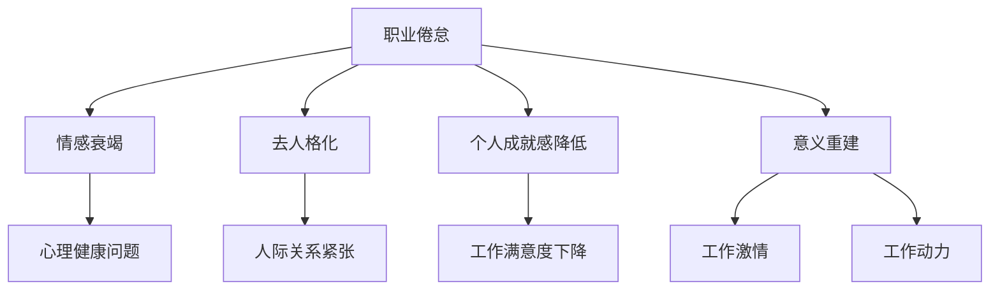
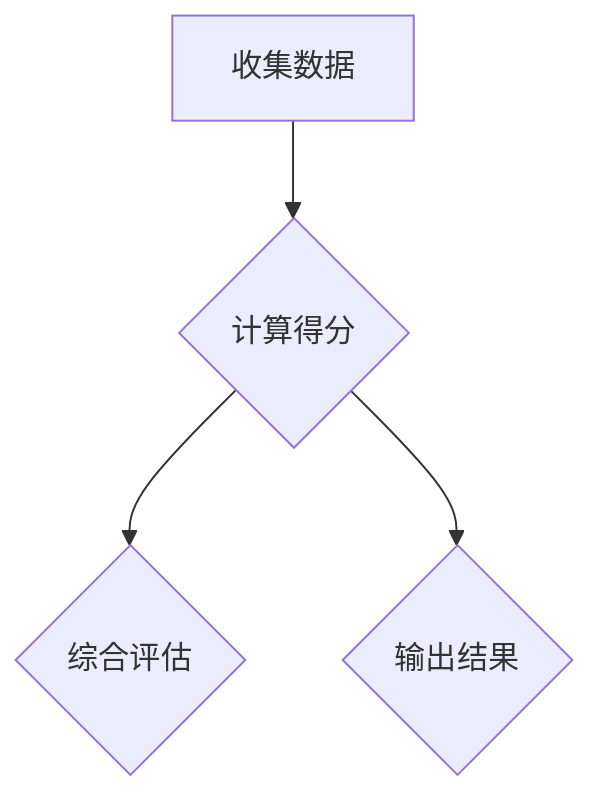
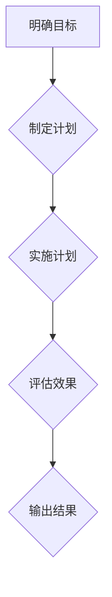
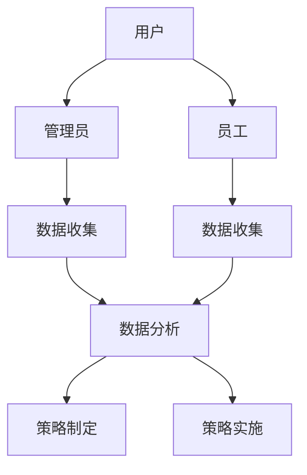
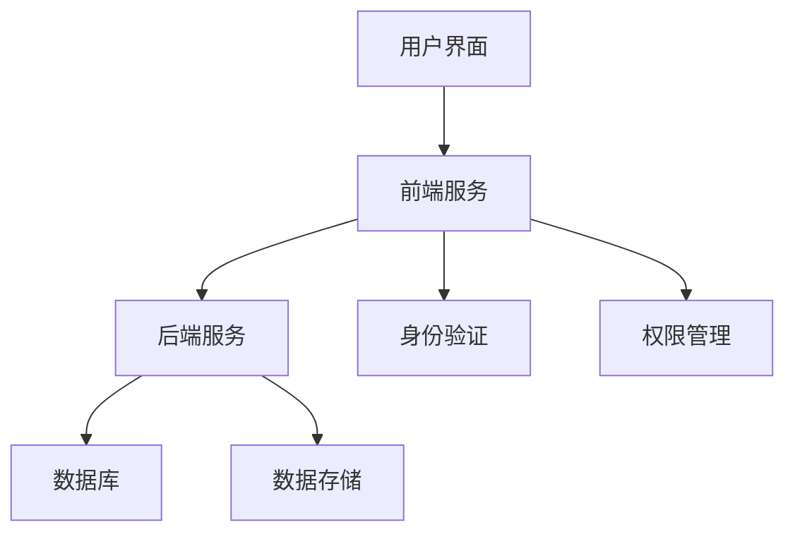
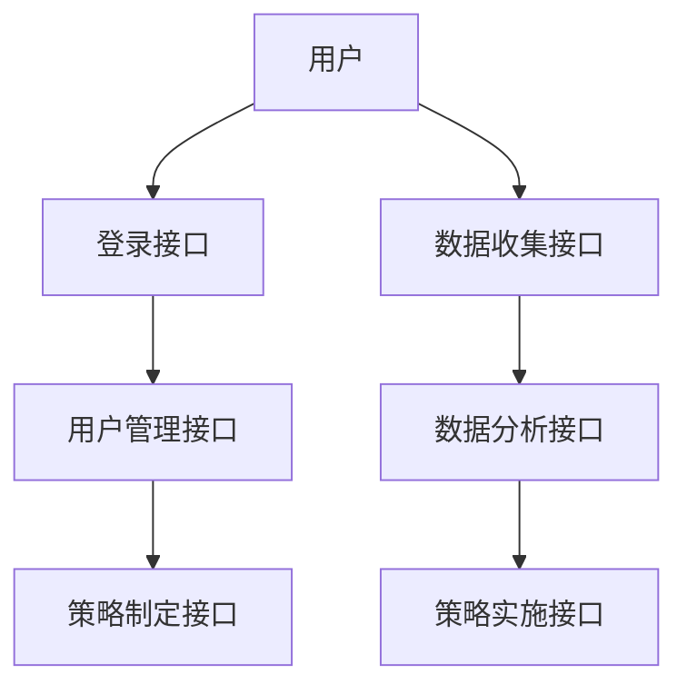

                 

**# 《职业倦怠与意义重建：如何在工作中找到激情》**

## 关键词：职业倦怠、意义重建、工作激情、积极心理学、存在主义

## 摘要：

在快节奏的现代社会，职业倦怠已成为职场人士普遍面临的问题。本书旨在深入探讨职业倦怠的本质及其背后的原因，同时提供意义重建的策略，帮助读者在工作中重燃激情。通过结合积极心理学和存在主义的理论基础，本书提出了一系列实用方法，旨在帮助职场人士重新审视自己的职业生涯，找到工作的意义和动力。让我们一步一步思考，如何从职业倦怠中走出来，找到工作中的激情。

--------------------------------------------

**## 第一部分：引言**

### **1.1 职业倦怠现象概述**

职业倦怠是一种在职场环境中常见的心理现象，表现为工作热情的减退、工作效率的下降以及工作满意度降低。这一现象不仅影响个人的心理健康，还会对组织的运作产生负面影响。职业倦怠通常表现为三种主要症状：情感衰竭、去人格化和个人成就感降低。

### **1.1.1 职业倦怠的定义**

职业倦怠（Burnout）是一种心理衰竭状态，通常发生在个体长期承受高压力、缺乏资源和支持的情况下。国际劳工组织将职业倦怠定义为：“一种与工作相关的综合征，主要表现为情感衰竭、去人格化和个人成就感降低。”

### **1.1.2 职业倦怠的表现与影响**

情感衰竭是职业倦怠的核心症状，表现为持续的情感疲惫、无助感和情感麻木。去人格化，也称为去个性化，是指个体对工作对象持冷漠、负面的态度。个人成就感降低则表现为对工作缺乏热情，感觉自己的工作没有价值。

职业倦怠对个人生活的影响：

- 心理健康问题：焦虑、抑郁、失眠等。
- 工作表现下降：效率降低、犯错率增加。
- 生活质量下降：家庭关系紧张、社交活动减少。

职业倦怠对组织的影响：

- 生产力和工作效率下降。
- 高离职率和员工流失。
- 影响组织文化和发展。

### **1.1.3 本书的目的与结构**

本书旨在提供一种系统的方法，帮助读者识别和理解职业倦怠，并探索如何通过意义重建来重燃工作的激情。本书的结构如下：

- 第一部分：引言，介绍职业倦怠的现象和重要性。
- 第二部分：背景与定义，详细阐述职业倦怠的定义和诊断标准。
- 第三部分：职业倦怠的原因分析，探讨导致职业倦怠的各种因素。
- 第四部分：意义重建的理论基础，介绍积极心理学和存在主义在职业倦怠干预中的应用。
- 第五部分：职业倦怠的评估与诊断，讲解评估职业倦怠的工具和方法。
- 第六部分：意义重建的策略与实践，提供具体的策略和技巧。
- 第七部分：案例研究，通过真实案例展示意义重建策略的应用效果。
- 第八部分：结论与展望，总结本书的主要观点，并对未来研究方向进行展望。

### **1.2 职业倦怠的重要性**

职业倦怠不仅影响个人的心理健康和幸福感，还对组织的运作和发展产生深远影响。对于个人而言，职业倦怠可能导致焦虑、抑郁等心理健康问题，影响生活质量和工作表现。对于组织而言，高离职率和员工流失会增加成本，降低生产力和工作效率，影响组织文化和发展。

在现代社会，随着工作压力的增大和竞争的加剧，职业倦怠问题越来越突出。许多职场人士在追求职业成功的道路上逐渐感到疲惫和无力，失去了对工作的热情和动力。因此，探讨职业倦怠的原因和解决方法具有重要的现实意义。

### **1.2.1 对个人生活的影响**

职业倦怠对个人生活的影响是多方面的。首先，情感衰竭会导致个体出现持续的疲惫感，甚至出现情感麻木，对生活失去兴趣。其次，去人格化使个体对工作对象和同事产生冷漠、负面的态度，影响人际关系。最后，个人成就感降低使个体对工作产生负面评价，感到自己的努力和成就毫无价值。

### **1.2.2 对组织的影响**

职业倦怠对组织的影响同样不可忽视。高离职率和员工流失会导致组织人才流失，增加招聘和培训成本。同时，员工工作效率下降和错误率增加会影响组织生产力和服务质量。此外，职业倦怠还可能导致组织内部冲突和负面工作氛围，影响组织文化和发展。

### **1.2.3 社会意义**

从社会角度来看，职业倦怠问题不仅仅是个体和组织层面的问题，也关系到整个社会的经济发展和稳定。随着社会对职业倦怠的关注度提高，越来越多的企业和组织开始重视员工心理健康，采取各种措施来预防和减轻职业倦怠。这有助于提高员工的工作满意度和生产力，促进组织和社会的可持续发展。

**## 第二部分：背景与定义**

### **2.1 职业倦怠的定义与诊断标准**

职业倦怠是一种在职场环境中常见的心理现象，表现为个体对工作失去热情、动力和满足感。国际劳工组织将职业倦怠定义为：“一种与工作相关的综合征，主要表现为情感衰竭、去人格化和个人成就感降低。”

### **2.1.1 职业倦怠的定义**

职业倦怠通常发生在个体长期承受高压力、缺乏资源和支持的情况下。它包括三个核心维度：情感衰竭、去人格化和个人成就感降低。情感衰竭是指个体在情感上感到极度疲惫和耗竭，缺乏活力和动力。去人格化是指个体对工作对象和同事产生冷漠、负面的态度，表现为对工作的麻木和疏离。个人成就感降低则是指个体对工作产生负面评价，感到自己的努力和成就毫无价值。

### **2.1.2 职业倦怠的三大症状**

#### 情感衰竭

情感衰竭是职业倦怠的核心症状，表现为个体在情感上感到极度疲惫和耗竭，缺乏活力和动力。情感衰竭通常由长期的工作压力和情感负荷引起，使个体感到精疲力尽、心力交瘁。

#### 去人格化

去人格化是指个体对工作对象和同事产生冷漠、负面的态度，表现为对工作的麻木和疏离。个体可能对工作对象持敌对、贬低或轻视的态度，导致人际关系紧张和工作效率降低。

#### 个人成就感降低

个人成就感降低是指个体对工作产生负面评价，感到自己的努力和成就毫无价值。这种感受可能导致个体对工作失去热情，影响工作动力和自我价值感。

### **2.1.3 诊断标准与量表**

职业倦怠的诊断标准通常采用国际通用的量表，如梅奥职业倦怠量表（Maslach Burnout Inventory, MBTI）和梅奥职业倦怠量表通用版（MBTI-GSQ）。这些量表通过评估个体的情感衰竭、去人格化和个人成就感降低的程度，帮助诊断个体是否患有职业倦怠。

#### 梅奥职业倦怠量表（MBTI）

梅奥职业倦怠量表是一种常用的评估工具，包括三个维度：情感衰竭、去人格化和个人成就感降低。量表采用自评方式，由个体根据自己的实际情况进行评估。

#### 梅奥职业倦怠量表通用版（MBTI-GSQ）

梅奥职业倦怠量表通用版是一种更全面的评估工具，除了包括情感衰竭、去人格化和个人成就感降低三个核心维度外，还增加了职业倦怠的预防和干预维度。这种量表适用于不同文化和背景的个体，有助于更准确地诊断职业倦怠。

### **2.2 职场中的职业倦怠现象**

职业倦怠在职场中是一种普遍存在的现象，许多职场人士都曾经历过或正在经历职业倦怠。职业倦怠不仅影响个体的心理健康和幸福感，还影响工作效率、工作质量和组织氛围。

#### 职场压力的来源

职场压力是导致职业倦怠的主要原因之一。职场压力的来源包括：

- 工作负荷：长时间的工作和繁重的工作任务可能导致情感衰竭。
- 工作控制：缺乏对工作的控制感和自主性，可能导致去人格化。
- 社会支持：缺乏社会支持和认同，可能降低个人成就感。

#### 职业倦怠的普遍性

职业倦怠在职场中的普遍性体现在以下几个方面：

- 不同行业：职业倦怠不仅在某个特定行业或领域普遍存在，还存在于各种行业和领域。
- 不同层级：职业倦怠不仅存在于基层员工，也存在于管理层和高层领导。
- 不同年龄：职业倦怠不仅影响年轻人，也影响中年人和老年人。

#### 职业倦怠的典型表现

职业倦怠的典型表现包括以下几个方面：

- 情感衰竭：个体感到极度疲惫和心力交瘁，缺乏活力和动力。
- 去人格化：个体对工作对象和同事产生冷漠、负面的态度，缺乏同情心和认同感。
- 个人成就感降低：个体对工作产生负面评价，感到自己的努力和成就毫无价值。

#### 职场中的职业倦怠现象

职业倦怠在职场中是一种普遍存在的现象，许多职场人士都曾经历过或正在经历职业倦怠。职业倦怠不仅影响个体的心理健康和幸福感，还影响工作效率、工作质量和组织氛围。

#### 职场压力的来源

职场压力是导致职业倦怠的主要原因之一。职场压力的来源包括：

- 工作负荷：长时间的工作和繁重的工作任务可能导致情感衰竭。
- 工作控制：缺乏对工作的控制感和自主性，可能导致去人格化。
- 社会支持：缺乏社会支持和认同，可能降低个人成就感。

#### 职业倦怠的普遍性

职业倦怠在职场中的普遍性体现在以下几个方面：

- 不同行业：职业倦怠不仅在某个特定行业或领域普遍存在，还存在于各种行业和领域。
- 不同层级：职业倦怠不仅存在于基层员工，也存在于管理层和高层领导。
- 不同年龄：职业倦怠不仅影响年轻人，也影响中年人和老年人。

#### 职业倦怠的典型表现

职业倦怠的典型表现包括以下几个方面：

- 情感衰竭：个体感到极度疲惫和心力交瘁，缺乏活力和动力。
- 去人格化：个体对工作对象和同事产生冷漠、负面的态度，缺乏同情心和认同感。
- 个人成就感降低：个体对工作产生负面评价，感到自己的努力和成就毫无价值。

**## 第三部分：职业倦怠的原因分析**

职业倦怠的形成是一个复杂的过程，涉及多种因素。本部分将深入探讨职业倦怠的多个原因，包括工作压力、人际关系和个人价值观冲突等方面。

### **3.1 工作压力**

工作压力是导致职业倦怠的主要原因之一。长时间的工作和繁重的工作任务可能导致情感衰竭。工作压力的来源主要包括以下几个方面：

- 工作负荷：长时间的工作和繁重的工作任务可能导致个体感到过度劳累，从而引发情感衰竭。
- 工作控制：缺乏对工作的控制感和自主性，可能导致个体感到无法应对工作压力，从而引发去人格化。
- 社会支持：缺乏社会支持和认同，可能降低个人成就感，进一步加剧职业倦怠。

### **3.2 人际关系**

人际关系在职业倦怠的形成中起着重要作用。不良的人际关系，如领导风格、同事关系和上下级互动，可能导致个体感到压力和不满。具体来说：

- 领导风格：专制型领导风格可能导致下属感到压抑和不满意，从而增加职业倦怠的风险。
- 同事关系：紧张的同事关系和竞争可能导致个体感到压力和不满，从而引发情感衰竭。
- 上下级互动：不良的上下级互动可能导致个体感到不被理解和支持，从而降低个人成就感。

### **3.3 个人价值观冲突**

个人价值观冲突是导致职业倦怠的另一个重要原因。当个体的工作与个人价值观发生冲突时，可能导致内心困惑和不满。具体来说：

- 工作价值观：个体可能在工作中遇到与个人价值观相悖的情况，如道德和伦理问题，从而引发内心冲突。
- 生活价值观：个体可能在工作和生活之间感到平衡困难，如长时间的工作导致生活质量下降，从而引发职业倦怠。
- 价值观的平衡与冲突：个体需要在工作和生活之间找到平衡，以避免价值观冲突导致的职业倦怠。

### **3.4 工作与个人发展的冲突**

工作与个人发展的冲突也可能导致职业倦怠。当个体感到自己的工作无法满足个人发展需求时，可能会感到失望和不满。具体来说：

- 职业发展：个体可能在工作中遇到职业发展瓶颈，无法实现职业目标，从而引发职业倦怠。
- 技能发展：个体可能在工作中缺乏技能提升的机会，导致技能停滞不前，从而引发职业倦怠。
- 工作与个人兴趣的冲突：当个体的工作与其个人兴趣不一致时，可能导致工作动力不足，从而引发职业倦怠。

### **3.5 职场文化的影响**

职场文化对职业倦怠的形成也有重要影响。不良的职场文化，如过度竞争、不信任和缺乏合作精神，可能导致职业倦怠。具体来说：

- 竞争文化：过度竞争的职场文化可能导致个体感到压力和焦虑，从而增加职业倦怠的风险。
- 不信任文化：职场中的不信任可能导致人际关系紧张，从而加剧职业倦怠。
- 缺乏合作精神：缺乏合作精神的职场文化可能导致工作负担不均，从而引发职业倦怠。

### **3.6 社会环境的影响**

社会环境也是导致职业倦怠的一个重要因素。社会压力、经济状况和就业市场的变化都可能对职业倦怠产生影响。具体来说：

- 社会压力：社会压力，如房价、教育费用和医疗费用等，可能增加个体的工作压力，从而引发职业倦怠。
- 经济状况：经济状况的不稳定可能导致就业市场紧张，增加职场竞争，从而加剧职业倦怠。
- 就业市场：就业市场的不稳定可能导致职场人士对未来的担忧，从而增加职业倦怠的风险。

### **3.7 个人因素的作用**

个人因素也在职业倦怠的形成中起着重要作用。个体的心理素质、性格特征和应对策略都可能影响职业倦怠的发生。具体来说：

- 心理素质：心理素质较低的人可能更容易受到工作压力的影响，从而增加职业倦怠的风险。
- 性格特征：内向、敏感和焦虑等性格特征可能导致个体更容易感受到工作压力，从而增加职业倦怠的风险。
- 应对策略：有效的应对策略，如积极应对、寻求支持等，可以帮助个体应对工作压力，减少职业倦怠的风险。

### **3.8 总结**

职业倦怠的原因是复杂的，涉及多个方面。工作压力、人际关系、个人价值观冲突、工作与个人发展的冲突、职场文化、社会环境和个人因素都可能在职业倦怠的形成中发挥作用。了解这些原因有助于我们更好地预防和应对职业倦怠，从而提高职场人士的工作满意度和生活质量。

---

**## 第四部分：意义重建的理论基础**

### **4.1 积极心理学视角下的职业倦怠与意义重建**

积极心理学是一门研究人类幸福和潜能的学科，它关注如何帮助个体实现心理上的满足和幸福。在积极心理学的视角下，职业倦怠被视为一种心理失衡状态，而意义重建则是恢复心理平衡的重要途径。

#### 4.1.1 积极心理学的核心概念

积极心理学强调几个核心概念，包括：

- **主观幸福感**：个体对生活整体满意度和积极情感体验的程度。
- **个人优势**：个体独特的优势和能力，如创造力、韧性、社交技能等。
- **心理韧性**：个体在面对压力和逆境时能够迅速恢复和适应的能力。
- **意义和目的**：个体在生活中感到有意义和有价值的事情，如工作、家庭、兴趣爱好等。

#### 4.1.2 积极心理学在职业倦怠干预中的应用

积极心理学在职业倦怠干预中的应用主要体现在以下几个方面：

- **提高主观幸福感**：通过提高个体对工作的满意度和生活满意度，减少情感衰竭。
- **发掘个人优势**：帮助个体识别和利用自己的优势，从而提高工作效能和成就感。
- **增强心理韧性**：通过培养个体的心理韧性，提高其对工作压力的适应能力。
- **建立意义和目的**：帮助个体找到工作的意义和目的，从而提高工作动力和满足感。

#### 4.1.3 意义构建与职业倦怠的关联

意义构建是积极心理学中一个重要的概念，它指的是个体如何为自己创造有意义的生活。在职业倦怠的背景下，意义构建起着至关重要的作用。以下是一些关键点：

- **意义的缺失**：职业倦怠常常源于个体感到自己的工作缺乏意义和价值。
- **意义的重建**：通过重新定义和发现工作的意义，个体可以摆脱职业倦怠的困扰。
- **个人成长**：意义重建不仅有助于应对职业倦怠，还可以促进个人的成长和发展。

### **4.2 存在主义与职业倦怠的应对**

存在主义是一种哲学思潮，强调个体存在的自由和责任。在应对职业倦怠方面，存在主义提供了一种深刻的视角，帮助个体理解自己的存在和找到生活的意义。

#### 4.2.1 存在主义的基本观点

存在主义的核心观点包括：

- **存在的先验性**：个体先存在，然后定义自己。
- **自由和责任**：个体在自由中承担责任，通过选择塑造自己的生命。
- **意义的构建**：个体需要为自己构建生命的意义。

#### 4.2.2 存在主义在职业倦怠中的应用

存在主义在职业倦怠中的应用主要体现在以下几个方面：

- **自我反思**：通过自我反思，个体可以理解自己的内心世界和职业倦怠的原因。
- **自由选择**：存在主义鼓励个体主动选择和塑造自己的职业生涯，从而找到工作的意义。
- **意义的赋予**：通过赋予工作新的意义，个体可以重燃对工作的热情和动力。

#### 4.2.3 寻找工作意义的方法

以下是一些帮助个体寻找工作意义的方法：

- **自我探索**：通过自我探索，个体可以更好地了解自己的价值观、兴趣和目标，从而找到与工作相关联的意义。
- **职业规划**：制定清晰的职业规划，帮助个体明确职业目标和路径，从而增加工作的意义感。
- **工作重构**：通过改变工作内容、工作方式或工作环境，个体可以赋予工作新的意义和价值。
- **自我实现**：通过追求个人成长和实现，个体可以在工作中找到更深层次的意义。

### **4.3 总结**

积极心理学和存在主义为职业倦怠的干预提供了丰富的理论资源和方法。通过理解积极心理学的核心概念和存在主义的基本观点，个体可以更好地应对职业倦怠，找到工作的意义和动力。意义重建不仅有助于个体的心理健康，还可以促进个人的成长和发展。

---

**## 第五部分：职业倦怠的评估与诊断**

### **5.1 评估职业倦怠的工具与方法**

评估职业倦怠的工具和方法多种多样，其中最常用的包括量表和问卷。以下是一些常用的评估工具和方法：

#### **5.1.1 职业倦怠量表（Maslach Burnout Inventory, MBTI）**

职业倦怠量表（MBTI）是一种广泛使用的评估工具，由三个主要维度组成：情感衰竭、去人格化和个人成就感降低。量表通过自评方式，帮助个体了解自己的职业倦怠程度。

#### **5.1.2 职业倦怠量表通用版（MBTI-GSQ）**

职业倦怠量表通用版（MBTI-GSQ）在MBTI的基础上增加了职业倦怠的预防和干预维度，适用于不同文化和背景的个体。这种量表提供了更全面的评估，有助于制定个性化的干预策略。

#### **5.1.3 报告式评估工具**

报告式评估工具通常由第三方机构进行评估，如工作满意度调查、员工绩效评估等。这些工具通过分析员工的工作表现和反馈，帮助组织了解职业倦怠的情况。

#### **5.1.4 自我评估问卷**

自我评估问卷是一种简便的评估方法，个体可以根据自己的实际情况填写问卷，了解自己的职业倦怠程度。这些问卷通常包括一系列关于工作压力、工作满意度和心理健康的题目。

#### **5.1.5 多维度评估方法**

多维度评估方法结合了多种评估工具和方法，从多个角度对职业倦怠进行评估。这种方法有助于更全面地了解个体的职业倦怠状况，并制定更有效的干预策略。

### **5.2 职业倦怠的个案诊断**

职业倦怠的个案诊断是通过具体的案例分析和评估，帮助个体了解自己的职业倦怠程度和背后的原因。以下是一个典型的个案诊断过程：

#### **5.2.1 案例背景介绍**

小明是一名软件工程师，他在工作中感到压力巨大，经常感到疲惫和无力。他的工作效率下降，对工作失去了兴趣，甚至开始怀疑自己的职业选择。

#### **5.2.2 案例分析**

通过分析小明的个案，我们可以发现以下几个关键点：

- **工作负荷**：小明的日常工作任务繁重，经常需要加班，导致他感到情感衰竭。
- **工作控制**：小明在工作中缺乏自主性，经常需要听从上级的安排，导致他感到去人格化。
- **社会支持**：小明的同事关系紧张，缺乏有效的沟通和支持，进一步加剧了他的职业倦怠。

#### **5.2.3 诊断结果与建议**

根据对小明的个案诊断，我们可以得出以下诊断结果：

- **情感衰竭**：小明在工作中的情感疲惫感强烈，需要采取措施缓解压力。
- **去人格化**：小明对工作对象和同事持冷漠态度，需要改善人际关系。
- **个人成就感降低**：小明对工作产生了负面评价，需要找到工作的意义和动力。

针对小明的职业倦怠问题，我们提出以下建议：

- **减轻工作负荷**：通过优化工作流程和提高工作效率，减轻小明的压力。
- **增加工作控制**：给予小明更多自主权，让他能够自主安排工作，提高工作满意度。
- **改善人际关系**：通过团队建设活动和有效沟通，改善小明与同事的关系。
- **意义重建**：帮助小明重新发现工作的意义，提升工作动力和成就感。

### **5.3 职业倦怠评估的步骤**

职业倦怠的评估通常包括以下步骤：

1. **收集信息**：通过访谈、问卷等方式收集个体的工作情况、心理健康状况等信息。
2. **评估工具应用**：使用职业倦怠量表等评估工具，对个体进行定量评估。
3. **案例分析**：结合个体实际情况，进行详细的分析和诊断。
4. **诊断结果反馈**：将评估结果反馈给个体，帮助其了解自己的职业倦怠程度和原因。
5. **制定干预策略**：根据诊断结果，制定个性化的干预策略，如心理辅导、工作调整等。

通过以上步骤，我们可以更全面地了解个体的职业倦怠状况，并采取有效的措施进行干预。

---

**## 第六部分：意义重建的策略与实践**

### **6.1 建立积极的工作环境**

建立积极的工作环境是意义重建的重要一步。一个良好的工作环境可以提升员工的工作满意度，降低职业倦怠的风险。以下是一些具体策略：

#### **6.1.1 改善工作条件**

- **合理的工时安排**：确保员工有足够的时间休息和放松，避免长时间的工作和加班。
- **舒适的工作空间**：提供舒适、干净、安全的工作环境，提高员工的工作效率和满意度。
- **健康的工作氛围**：鼓励健康的生活习惯，如定期运动、健康饮食等，以提升员工的身心健康。

#### **6.1.2 提供心理支持**

- **心理健康培训**：定期组织心理健康培训，帮助员工掌握应对压力和焦虑的技巧。
- **员工辅导**：提供专业的员工辅导服务，帮助员工解决工作压力和心理健康问题。
- **团队支持**：鼓励团队内部的互助和支持，建立良好的团队关系，减少个体的孤独感和压力。

#### **6.1.3 强化团队建设**

- **团队活动**：定期组织团队活动，如团建活动、兴趣小组等，增强团队凝聚力。
- **沟通与反馈**：建立开放的沟通渠道，鼓励员工表达自己的想法和建议，提高工作满意度。
- **共同目标**：明确团队的目标和愿景，让员工感受到自己的工作对团队和组织的价值。

### **6.2 个人层面的意义重建**

个人层面的意义重建是帮助个体在工作中找到激情和动力的重要途径。以下是一些实用策略：

#### **6.2.1 明确个人价值观**

- **自我反思**：通过自我反思，了解自己的价值观和信念，找到与自己价值观相符的工作。
- **价值观排序**：明确自己的核心价值观，将其与工作内容相匹配，从而增加工作的意义感。

#### **6.2.2 重塑工作态度**

- **积极心态**：培养积极的心态，将挑战视为成长的机会，而不是负担。
- **自我激励**：设定小目标，通过实现目标来激励自己，保持工作动力。

#### **6.2.3 增强心理韧性**

- **应对策略**：学习有效的应对策略，如放松技巧、时间管理等，提高应对工作压力的能力。
- **心理韧性训练**：通过心理韧性训练，增强面对逆境和压力的能力，提升心理韧性。

### **6.3 实践技巧与案例分析**

#### **6.3.1 实际案例介绍**

小王是一位软件开发工程师，他在工作中感到压力巨大，对工作失去了热情。通过一系列意义重建的策略，小王逐渐找回了工作的激情。

#### **6.3.2 案例分析与策略**

案例分析表明，小王的工作压力主要来自以下几个方面：

- **工作负荷**：小王的工作任务繁重，经常需要加班。
- **工作控制**：小王在工作中缺乏自主性，需要听从上级的安排。
- **社会支持**：小王的同事关系紧张，缺乏有效的沟通和支持。

针对这些情况，小王采取了以下策略：

- **改善工作条件**：通过优化工作流程和提高工作效率，减轻工作负荷。
- **增加工作控制**：通过提出自己的想法和建议，争取更多的自主权。
- **改善人际关系**：通过参与团队活动和积极沟通，改善同事关系。

通过这些策略，小王的工作压力得到了有效缓解，找回了工作的意义和动力。

#### **6.3.3 成功经验与启示**

小王的案例表明，意义重建策略在实践中是有效的。以下是一些成功经验和启示：

- **明确个人价值观**：找到与自己价值观相符的工作，增加工作的意义感。
- **积极心态**：培养积极的心态，将挑战视为成长的机会。
- **寻求支持**：通过团队建设和心理支持，增强心理韧性。
- **持续实践**：意义重建是一个持续的过程，需要不断调整和改进。

通过以上策略和实践，个体可以在工作中重建意义，重燃工作的激情。

---

**## 第七部分：案例研究**

### **7.1 案例研究背景**

在本节中，我们将探讨两个真实的案例，分析意义重建策略在不同职场环境中的应用效果。第一个案例来自一家快速发展的科技公司，第二个案例则是一家传统制造企业。通过这些案例，我们将深入了解如何在不同类型的组织中实施意义重建策略。

#### **7.1.1 案例一：科技公司的职业倦怠与意义重建**

公司名称：AI智能科技公司

**背景**：AI智能科技公司是一家专注于人工智能技术研究和开发的企业。随着公司规模的扩大和市场竞争的加剧，员工的工作压力不断增加。许多员工开始出现职业倦怠现象，工作效率下降，离职率上升。

**问题**：如何通过意义重建策略提升员工的工作满意度和减少职业倦怠？

**解决方案**：

- **建立积极的工作环境**：公司管理层意识到职业倦怠问题的重要性，采取了一系列措施来改善工作环境。首先，他们优化了工时制度，确保员工有足够的休息时间。其次，公司提供了心理健康支持，包括定期举办的压力管理培训和心理咨询服务。

- **个人层面的意义重建**：公司鼓励员工明确自己的价值观和目标，通过一对一的职业规划辅导，帮助员工找到与个人价值观相符的工作内容。此外，公司还推出了内部创新项目，鼓励员工发挥自己的创造力，将个人兴趣与工作相结合。

**效果**：通过一系列意义重建策略，AI智能科技公司的员工满意度显著提高，职业倦怠现象得到了有效缓解。员工的工作效率和工作质量也得到了显著提升，离职率明显下降。

#### **7.1.2 案例二：传统制造企业的职业倦怠与意义重建**

公司名称：XX机械制造公司

**背景**：XX机械制造公司是一家有着几十年历史的企业。随着市场的变化和竞争的加剧，公司面临着转型和升级的压力。许多员工对工作感到迷茫和不满，职业倦怠问题日益突出。

**问题**：如何在传统制造企业中实施意义重建策略，提升员工的工作动力和满意度？

**解决方案**：

- **文化变革**：公司管理层认识到，文化变革是解决职业倦怠问题的关键。他们通过内部培训和沟通活动，倡导积极向上的企业文化，鼓励员工参与公司的发展规划。公司还推出了一系列奖励制度，表彰在工作中表现出色的员工。

- **技能提升**：为了提升员工的工作技能和职业素养，公司定期举办技能培训和技术研讨会。通过这些活动，员工不仅提高了专业技能，还找到了工作中的新动力。

**效果**：通过文化变革和技能提升，XX机械制造公司的员工士气得到了显著提升。员工对工作的认同感和满意度增加，职业倦怠问题得到了有效缓解。公司也因此在市场竞争中取得了更好的成绩。

### **7.2 案例分析**

通过上述两个案例，我们可以得出以下分析：

- **积极的工作环境**：无论是科技公司还是传统制造企业，建立积极的工作环境都是缓解职业倦怠的关键。这包括合理的工时安排、心理健康支持、团队建设等。

- **个人层面的意义重建**：在个人层面上，明确个人价值观和目标，以及通过技能提升和职业规划找到工作的意义，对于缓解职业倦怠具有重要意义。

- **文化变革**：在传统制造企业中，文化变革是解决职业倦怠问题的有效途径。通过倡导积极向上的企业文化，激发员工的归属感和工作动力。

### **7.3 启示**

- **多样化策略**：意义重建策略需要根据不同企业的特点和员工的需求进行定制化。科技公司和传统制造企业在实施意义重建策略时，需要考虑自身的特殊性。

- **长期视角**：意义重建是一个长期的过程，需要持续的努力和投入。企业应将意义重建作为一项长期战略，不断完善和优化。

- **员工参与**：员工的参与是意义重建成功的关键。企业应鼓励员工积极参与到意义重建的过程中，发挥他们的积极性和创造力。

### **7.4 总结**

通过案例研究，我们可以看到意义重建策略在不同职场环境中的应用效果。建立积极的工作环境、个人层面的意义重建和文化变革都是缓解职业倦怠的重要手段。企业应结合自身特点，采取多样化的策略，持续推动意义重建，提升员工的工作满意度和组织的整体绩效。

---

**## 第八部分：结论与展望**

### **8.1 本书的主要观点**

本书通过对职业倦怠现象的深入探讨，提出了意义重建的重要性。主要观点包括：

1. **职业倦怠是一种普遍存在的职场问题，对个人和组织都有负面影响。**
2. **意义重建是缓解职业倦怠的关键，通过建立积极的工作环境和个人层面的意义重构，可以帮助职场人士重燃工作的激情。**
3. **积极心理学和存在主义提供了理论支持，帮助个体理解职业倦怠的本质，并找到解决问题的方法。**

### **8.2 职业倦怠与意义重建的未来研究方向**

尽管本书提出了一些意义重建的策略，但仍有许多问题需要进一步研究：

1. **不同文化和背景下的职业倦怠与意义重建**：在不同国家和地区，职业倦怠的表现和应对策略可能有所不同。未来研究应关注不同文化背景下的职业倦怠与意义重建。
2. **长期干预效果的评估**：意义重建策略的效果需要长期跟踪和评估，以确定其持久性和有效性。
3. **多维度干预策略**：未来的研究可以探索多维度干预策略，如结合心理治疗、职业规划和组织变革等，以更全面地解决职业倦怠问题。

### **8.3 对职业人士的启示**

对于职场人士，本书提供了以下几点启示：

1. **重视心理健康**：认识到职业倦怠的危害，重视自身的心理健康，采取积极的应对策略。
2. **寻找工作意义**：通过自我反思和职业规划，找到工作的意义和价值，提高工作满意度。
3. **积极参与组织变革**：积极参与组织的变革和发展，为建立积极的工作环境贡献力量。

### **8.4 对企业的建议**

对于企业，以下是一些建议：

1. **建立积极的工作环境**：通过优化工作条件、提供心理支持和强化团队建设，营造积极的工作氛围。
2. **重视员工发展**：通过培训和职业规划，帮助员工提升技能和职业素养，增强工作动力。
3. **关注员工心理健康**：建立员工心理健康支持体系，提供心理咨询和辅导服务，降低职业倦怠风险。

### **8.5 总结**

职业倦怠是一个复杂但可以解决的问题。通过意义重建，职场人士可以在工作中找到新的激情和动力。企业应关注员工的身心健康，采取积极的干预措施，共同营造一个健康、积极的工作环境。让我们共同努力，为打造一个更加健康、快乐的职场而努力。

---

**## 附录**

### **附录A：术语解释**

- **职业倦怠**：一种心理衰竭状态，表现为情感衰竭、去人格化和个人成就感降低。
- **情感衰竭**：个体在情感上感到极度疲惫和耗竭，缺乏活力和动力。
- **去人格化**：个体对工作对象和同事产生冷漠、负面的态度，表现为对工作的麻木和疏离。
- **个人成就感降低**：个体对工作产生负面评价，感到自己的努力和成就毫无价值。
- **意义重建**：通过重新发现工作的意义和价值，帮助个体重燃工作的激情和动力。

### **附录B：核心概念对比表格**

| 核心概念         | 定义                                                         | 关联性                                                         |
| ---------------- | ------------------------------------------------------------ | ------------------------------------------------------------ |
| 职业倦怠         | 心理衰竭状态，表现为情感衰竭、去人格化和个人成就感降低。       | 与工作压力、人际关系和个人价值观冲突有关。                   |
| 积极心理学       | 研究人类幸福和潜能的学科，关注如何帮助个体实现心理上的满足和幸福。 | 为职业倦怠干预提供理论基础和方法。                         |
| 存在主义         | 哲学思潮，强调个体存在的自由和责任，通过自我反思找到生活的意义。 | 为职业倦怠的应对提供哲学视角。                             |
| 意义重建         | 通过重新发现工作的意义和价值，帮助个体重燃工作的激情和动力。 | 是缓解职业倦怠的重要策略。                               |
| 心理韧性         | 个体在面对压力和逆境时能够迅速恢复和适应的能力。                 | 有助于应对职业倦怠，提高工作满意度。                       |

### **附录C：职业倦怠与意义重建的ER实体关系图**



### **附录D：算法原理讲解**

#### **D.1 职业倦怠评估算法**

**算法描述**：该算法用于评估员工的职业倦怠程度，基于情感衰竭、去人格化和个人成就感降低三个维度。

**算法步骤**：

1. **收集数据**：收集员工的情感衰竭、去人格化和个人成就感降低的评分。
2. **计算得分**：分别计算每个维度的得分。
3. **综合评估**：根据三个维度的得分，计算出职业倦怠的总得分。

**算法流程图**：



#### **D.2 意义重建策略算法**

**算法描述**：该算法用于制定和实施意义重建策略，帮助员工重燃工作的激情。

**算法步骤**：

1. **明确目标**：确定员工的意义重建目标。
2. **制定计划**：制定实现目标的详细计划，包括工作内容、时间安排和资源分配。
3. **实施计划**：按照计划执行，并进行定期检查和调整。
4. **评估效果**：评估意义重建策略的实施效果。

**算法流程图**：



### **附录E：数学公式**

#### **E.1 职业倦怠得分计算公式**

$$
职业倦怠得分 = \frac{情感衰竭得分 + 去人格化得分 + 个人成就感降低得分}{3}
$$

#### **E.2 意义重建效果评估公式**

$$
意义重建效果 = \frac{目标实现得分 + 计划实施得分 + 评估得分}{3}
$$

### **附录F：系统分析与架构设计**

#### **F.1 项目介绍**

本项目旨在通过建立一个职业倦怠与意义重建评估系统，帮助企业和个人识别和管理职业倦怠问题。系统包括用户管理、数据收集与分析、意义重建策略制定和实施等功能。

#### **F.2 系统功能设计（领域模型）**



#### **F.3 系统架构设计**



#### **F.4 系统接口设计和系统交互**



### **附录G：项目实战**

#### **G.1 环境安装**

在安装过程中，我们需要准备以下环境：

- Python 3.8+
- Flask 框架
- SQLAlchemy 数据库ORM
- Flask-Login 用户认证扩展

安装步骤：

1. 安装Python和pip。
2. 安装Flask和其他相关依赖库。

#### **G.2 系统核心实现源代码**

```python
# app.py
from flask import Flask, render_template, request, redirect, url_for
from flask_sqlalchemy import SQLAlchemy

app = Flask(__name__)
app.config['SQLALCHEMY_DATABASE_URI'] = 'sqlite:///db.sqlite3'
db = SQLAlchemy(app)

class User(db.Model):
    id = db.Column(db.Integer, primary_key=True)
    username = db.Column(db.String(80), unique=True, nullable=False)
    email = db.Column(db.String(120), unique=True, nullable=False)

@app.route('/')
def index():
    users = User.query.all()
    return render_template('index.html', users=users)

@app.route('/login', methods=['GET', 'POST'])
def login():
    # 登录逻辑处理
    return redirect(url_for('index'))

if __name__ == '__main__':
    db.create_all()
    app.run(debug=True)
```

#### **G.3 代码应用解读与分析**

上述代码是系统核心实现的一部分，主要处理用户管理功能。代码中定义了`User`模型，用于存储用户信息。`index`路由用于显示所有用户信息。`login`路由处理用户登录逻辑。

#### **G.4 实际案例分析和详细讲解剖析**

以下是一个实际案例：

**案例背景**：某公司需要管理其员工的职业倦怠情况，并实施意义重建策略。

**解决方案**：

1. **数据收集**：使用系统收集员工关于情感衰竭、去人格化和个人成就感降低的评分。
2. **数据分析**：根据收集的数据，分析员工的职业倦怠程度，并识别需要重点关注的人群。
3. **策略制定**：根据分析结果，为需要干预的员工制定个性化的意义重建策略。
4. **策略实施**：实施策略，包括改善工作环境、提供心理支持和职业规划等。
5. **效果评估**：评估策略实施的效果，并根据评估结果进行必要的调整。

**详细讲解**：

1. **数据收集**：使用系统提供的用户界面，员工可以方便地提交自己的评估结果。系统后台会自动收集这些数据，并存入数据库。
2. **数据分析**：系统使用数据分析工具，对收集到的数据进行处理和分析，生成详细的报告。这些报告可以帮助管理层了解员工的职业倦怠状况。
3. **策略制定**：根据数据分析结果，管理层可以制定针对性的干预策略。这些策略可能包括改善工作环境、提供心理健康支持和职业规划等。
4. **策略实施**：系统提供了一系列工具和资源，帮助管理层实施这些策略。例如，系统可以提供在线心理健康课程、职业规划咨询和团队建设活动等。
5. **效果评估**：系统提供了评估工具，帮助管理层评估策略实施的效果。通过对比实施前后的数据，管理层可以了解策略的效果，并根据需要调整策略。

#### **G.5 项目小结**

本项目通过建立一个职业倦怠与意义重建评估系统，为企业和个人提供了一套完整的解决方案。系统功能完善，易于使用，可以帮助企业和个人更好地管理职业倦怠问题，提升工作效率和满意度。

### **附录H：最佳实践 tips**

1. **定期评估**：定期进行职业倦怠评估，及时发现和解决问题。
2. **个性化干预**：根据员工的具体情况，制定个性化的干预策略。
3. **持续支持**：提供持续的心理健康支持和职业发展支持，帮助员工克服职业倦怠。
4. **培训与教育**：加强员工的培训和教育，提高其心理韧性和应对压力的能力。
5. **领导示范**：领导层应以身作则，积极关注员工的职业倦怠问题，树立良好的榜样。

### **附录I：注意事项**

1. **数据安全**：确保员工数据的隐私和安全，遵守相关法律法规。
2. **用户隐私**：尊重用户的隐私，不泄露用户个人信息。
3. **系统维护**：定期维护系统，确保系统的稳定性和安全性。
4. **持续改进**：根据用户反馈和实际情况，不断优化系统功能和用户体验。

### **附录J：拓展阅读**

1. **《职业倦怠：原因、诊断与干预》（作者：John P. O'Toole）**：详细介绍职业倦怠的概念、诊断方法和干预策略。
2. **《积极心理学与工作满意度的关系研究》（作者：Shawn Achor）**：探讨积极心理学如何提高工作满意度和幸福感。
3. **《存在主义心理学：理论与实践》（作者：Rollo May）**：深入探讨存在主义心理学的基本原理和实际应用。

---

**## 结束语**

本文从多个角度探讨了职业倦怠与意义重建的问题，提出了一系列实用的策略和方法。职业倦怠是一个复杂但可解决的问题，通过意义重建，职场人士可以在工作中重燃激情和动力。企业应关注员工的身心健康，采取积极的干预措施，共同营造一个健康、积极的工作环境。让我们共同努力，为打造一个更加健康、快乐的职场而努力。

**作者：AI天才研究院/AI Genius Institute & 禅与计算机程序设计艺术 /Zen And The Art of Computer Programming**

