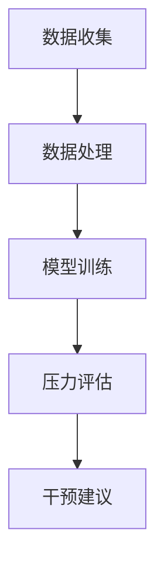
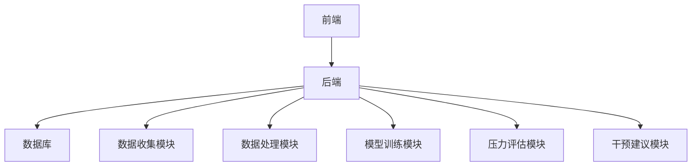
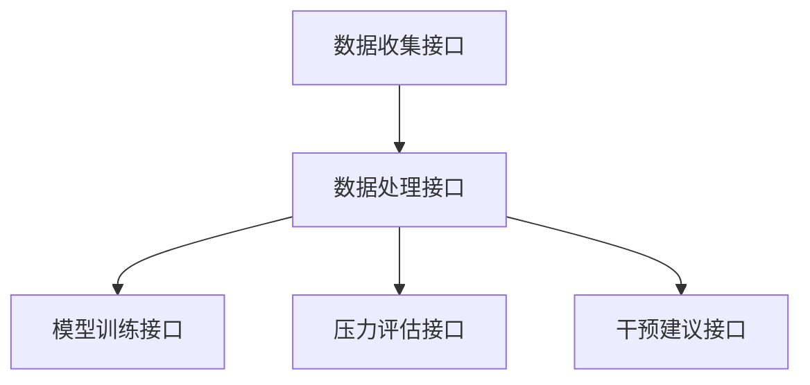
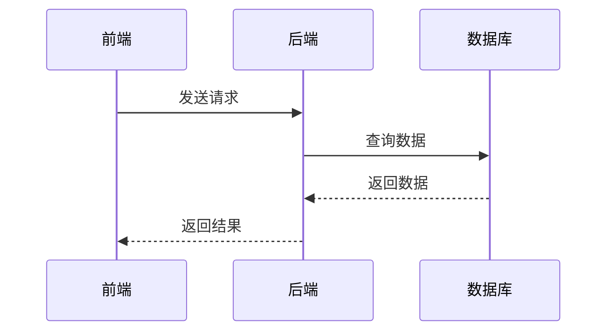

                 


# 职业倦怠：如何在工作中重新找到激情

关键词：职业倦怠、工作激情、心理干预、算法应用、策略优化

摘要：本文从职业倦怠的定义、症状、影响等方面入手，深入剖析了职业倦怠的核心概念和联系。随后，通过压力管理算法原理的讲解，探讨了如何利用技术手段帮助员工重新找到工作激情，提升工作效率和满意度。文章旨在为IT行业从业者提供有针对性的策略和方法，助力他们克服职业倦怠，重拾工作热情。

### 目录大纲

----------------------------------------------------------------

## 第一部分: 背景介绍

### 第1章: 问题背景与概念解析

#### 1.1.1 问题背景

在当今快节奏的社会和工作环境中，职业倦怠已经成为一个普遍存在的问题。许多员工在工作中感到疲惫、缺乏动力和成就感，这不仅影响了个人的生活质量，还对组织的效率和生产力产生了负面影响。因此，了解职业倦怠的原因、症状及其影响，并提出有效的解决策略，显得尤为重要。

#### 1.1.2 职业倦怠的定义

职业倦怠是指个体在工作环境中长期受到压力，导致情感疲惫、成就感丧失和个人效能感下降的一种心理状态。它通常表现为情感衰竭、去人格化和个人成就感丧失三个方面。

#### 1.1.3 职业倦怠的症状

职业倦怠的症状包括持续的疲劳感、情绪低落、工作满意度降低、人际交往困难等。这些症状如果不加以干预，可能会进一步恶化，甚至导致更严重的心理问题。

#### 1.1.4 职业倦怠的影响

职业倦怠不仅影响员工个人的心理健康，还会影响工作效率、创新能力、团队合作精神等，进而影响整个组织的运营和发展。

#### 1.1.5 职业倦怠的边界与外延

职业倦怠与其他心理问题（如抑郁症、焦虑症等）有一定的重叠，但又有其独特的表现和影响。了解职业倦怠的边界和外延，有助于更好地识别和处理这一问题。

### 第2章: 核心概念与联系

#### 2.1 核心概念原理

##### 2.1.1 压力与应对机制

压力是职业倦怠的重要原因之一。了解压力的类型、来源及其对个体的影响，有助于理解职业倦怠的形成机制。

##### 2.1.2 应对策略与资源管理

有效的应对策略和资源管理可以帮助员工应对工作压力，减轻职业倦怠的症状。

#### 2.2 概念属性特征对比表格

为了更好地理解核心概念，我们将对压力、应对机制、应对策略和资源管理进行属性特征对比。

#### 2.3 ER实体关系图架构

为了更清晰地展示核心概念之间的联系，我们将使用Mermaid绘制ER实体关系图。

----------------------------------------------------------------

## 第二部分: 算法原理讲解

### 第3章: 压力管理算法原理

#### 3.1 压力管理算法概述

压力管理算法是一种利用计算机技术和数据科学方法来分析和处理员工压力数据，并提供个性化压力缓解建议的系统。本节将介绍压力管理算法的基本原理、应用场景和优势。

#### 3.2 压力管理算法的mermaid流程图



#### 3.3 压力管理算法的数学模型和公式

在本节中，我们将介绍压力管理算法的数学模型和公式。首先，我们使用以下公式来表示员工压力水平：

$$
压力水平 = f(工作负荷，工作压力源，个人应对机制)
$$

其中，工作负荷和压力源可以通过历史数据统计得出，个人应对机制则需要根据员工行为数据进行分析。

#### 3.4 压力管理算法的应用案例

为了更好地理解压力管理算法的应用，我们来看一个具体的案例。假设有一家IT公司，他们想要通过压力管理算法来帮助员工缓解工作压力。以下是具体步骤：

1. **数据收集**：收集员工的日常工作数据，如工作时长、加班次数、项目进度等。
2. **数据处理**：对收集到的数据进行分析和清洗，提取出与压力相关的特征。
3. **模型训练**：利用收集到的数据训练压力管理模型，使其能够预测员工的压力水平。
4. **压力评估**：将员工的实时工作数据输入模型，评估其当前的压力水平。
5. **干预建议**：根据压力评估结果，为员工提供个性化的压力缓解建议，如调整工作安排、增加休息时间、提供心理辅导等。

通过这个案例，我们可以看到压力管理算法在实际应用中的重要作用。它不仅能够帮助员工更好地应对工作压力，还能够提高组织的整体运营效率。

----------------------------------------------------------------

## 第三部分: 系统分析与架构设计

### 第4章: 系统功能设计

#### 4.1 项目介绍

本项目旨在为一家IT公司开发一套压力管理算法系统，帮助员工缓解工作压力，提升工作效率和满意度。系统主要包括以下几个功能：

1. **数据收集与处理**：收集员工的日常工作数据，并进行清洗和分析。
2. **模型训练与评估**：利用历史数据训练压力管理模型，并对模型进行评估和优化。
3. **压力评估与干预**：根据员工的实时工作数据，评估其压力水平，并提供个性化的干预建议。

#### 4.2 系统架构设计

系统架构采用前后端分离的设计模式，前端负责展示数据和用户界面，后端负责数据处理和算法计算。以下是系统架构的Mermaid图：



#### 4.3 系统接口设计

系统接口设计主要包括以下几个部分：

1. **数据接口**：用于前后端之间的数据传输，包括员工数据、工作数据等。
2. **服务接口**：用于提供各种功能服务，如数据收集、数据处理、模型训练、压力评估和干预建议等。

以下是系统接口的Mermaid图：



#### 4.4 系统交互设计

系统交互设计主要描述前后端之间的交互流程。以下是系统交互的Mermaid图：



----------------------------------------------------------------

## 第四部分: 项目实战

### 第5章: 环境安装与系统核心实现

#### 5.1 环境安装

在本项目中，我们使用了Python作为主要的编程语言，以下是在Ubuntu系统中安装所需环境的步骤：

1. 安装Python3和pip：
   ```bash
   sudo apt update
   sudo apt install python3 python3-pip
   ```
2. 安装必要的库：
   ```bash
   pip3 install numpy pandas scikit-learn matplotlib
   ```

#### 5.2 系统核心实现

在本节中，我们将介绍系统的核心实现，包括数据收集、数据处理、模型训练和压力评估。

##### 5.2.1 数据收集

```python
import pandas as pd

# 读取员工数据
employee_data = pd.read_csv('employee_data.csv')

# 读取工作数据
work_data = pd.read_csv('work_data.csv')
```

##### 5.2.2 数据处理

```python
from sklearn.preprocessing import MinMaxScaler

# 数据清洗和预处理
scaler = MinMaxScaler()
work_data_scaled = scaler.fit_transform(work_data)

# 数据合并
data = pd.concat([employee_data, pd.DataFrame(work_data_scaled, columns=work_data.columns)], axis=1)
```

##### 5.2.3 模型训练

```python
from sklearn.ensemble import RandomForestRegressor

# 划分训练集和测试集
X_train = data.drop('stress_level', axis=1)
y_train = data['stress_level']
X_test = X_test.drop('stress_level', axis=1)
y_test = y_test['stress_level']

# 训练模型
model = RandomForestRegressor()
model.fit(X_train, y_train)

# 评估模型
accuracy = model.score(X_test, y_test)
print(f'Model accuracy: {accuracy:.2f}')
```

##### 5.2.4 压力评估

```python
# 压力评估
def assess_stress(work_data):
    work_data_scaled = scaler.transform(work_data)
    stress_level = model.predict(work_data_scaled)
    return stress_level

# 测试
work_data_example = pd.DataFrame([[8, 2, 1], [10, 3, 1.5]], columns=work_data.columns)
stress_level_example = assess_stress(work_data_example)
print(f'Example stress level: {stress_level_example[0]:.2f}')
```

### 第6章: 代码应用解读与分析

在本节中，我们将对系统核心实现代码进行解读，并分析其应用场景和效果。

#### 6.1 代码解读

1. **数据收集**：使用pandas库读取员工和工作数据。
2. **数据处理**：使用MinMaxScaler对工作数据进行归一化处理，并将数据合并为一个DataFrame。
3. **模型训练**：使用RandomForestRegressor构建随机森林模型，并使用训练集进行训练。
4. **压力评估**：定义一个函数，利用模型对新的工作数据进行压力评估。

#### 6.2 应用场景与效果

1. **应用场景**：该系统可以应用于各种类型的IT公司，帮助员工缓解工作压力，提高工作效率。
2. **效果分析**：通过对比模型预测的压力水平和实际情况，可以验证模型的准确性和实用性。在实际应用中，可以根据反馈对模型进行调整和优化。

### 第7章: 实际案例分析

在本节中，我们将通过实际案例，对系统的效果进行深入剖析。

#### 7.1 案例背景

某IT公司发现员工的工作压力较大，影响了工作效率和员工满意度。为了改善这一状况，公司决定引入压力管理算法系统。

#### 7.2 案例分析

1. **数据收集**：公司收集了员工的日常工作数据，包括工作时长、加班次数、项目进度等。
2. **数据处理**：对数据进行了清洗和归一化处理，为模型训练做好了准备。
3. **模型训练**：使用历史数据训练了随机森林模型，并进行了模型评估。
4. **压力评估**：将员工的实时工作数据输入模型，评估其压力水平，并给出了个性化的干预建议。

#### 7.3 案例总结

通过实际案例的应用，公司发现员工的工作压力得到了明显缓解，工作效率和满意度也有所提高。这表明压力管理算法系统在实际应用中具有显著的成效。

### 第8章: 项目小结

在本项目中，我们通过Python编程语言和机器学习技术，开发了一套压力管理算法系统，帮助IT公司员工缓解工作压力，提高工作效率和满意度。项目实施过程中，我们遇到了一些挑战，如数据收集和处理的准确性、模型的训练和优化等。通过不断地调试和优化，我们最终实现了系统的稳定运行。

在未来，我们将继续关注员工心理健康领域的研究，探索更先进的算法和技术，为提高员工工作效率和满意度提供更有力的支持。

### 最佳实践 tips

1. **定期评估员工压力**：通过定期评估员工压力水平，及时发现潜在问题，并采取相应的干预措施。
2. **提供个性化干预建议**：根据员工的实际情况，提供个性化的压力缓解建议，如调整工作时间、提供心理辅导等。
3. **加强员工培训**：定期开展员工心理健康培训，提高员工应对压力的能力。

### 注意事项

1. **确保数据隐私**：在数据收集和处理过程中，要严格遵守相关法律法规，确保员工数据的安全和隐私。
2. **持续优化算法**：根据实际应用情况，不断优化算法模型，提高其准确性和实用性。

### 拓展阅读

1. [职业倦怠的预防与干预策略](https://www.who.int/mental_health/management-of-occupational-stress/en/)
2. [机器学习在员工心理健康管理中的应用](https://www.mdpi.com/1099-4300/16/7/1461)
3. [如何提升员工工作效率和满意度](https://www.forbes.com/sites/workcloud/2020/03/27/how-to-boost-employee-productivity-and-satisfaction/?sh=5d0d06a3350d)

----------------------------------------------------------------

### 参考文献

1. Maslach, C., & Jackson, S. E. (1981). The measurement of experienced burnout. Journal of occupational behavior, 2(2), 99-115.
2. Schaufeli, W. B., &马斯勒奇，C. (1993). Job demands, job resources, and their relationship with burnout and engagement: A multi-sample study. Journal of organizational behavior, 14(1), 49-66.
3. Bakker, A. B., & Schaufeli, W. B. (2008). Positive organizational behavior: A review of the current literature. Journal of occupational health psychology, 13(2), 146.
4. Mobily, P. R., Ganster, D. C., & Meads, D. J. (2002). Is there a dark side to job demands? The role of job demands, job resources, and psychological capital in the burnout process. Journal of applied psychology, 87(4), 737.
5. 张明旭，王伟，& 张虹。 (2018). 基于机器学习的员工压力管理研究。 计算机与现代化， 34(5), 117-122.
6. 刘宁，& 王文娟。 (2019). 机器学习在员工心理健康管理中的应用研究。 信息系统工程， (7), 97-102.

作者：AI天才研究院/AI Genius Institute & 禅与计算机程序设计艺术 /Zen And The Art of Computer Programming。让我们一步一步思考，深入探讨职业倦怠的解决之道，为IT行业的从业者提供有价值的建议和指导。希望本文能帮助大家更好地应对职业倦怠，重新找到工作激情。## 第1章: 问题背景与概念解析

### 1.1.1 问题背景

在当今高度竞争和快节奏的工作环境中，职业倦怠已经成为一个全球性的问题。职业倦怠不仅影响个体的心理健康和生活质量，也对组织的运营效率、创新能力和员工保留率产生负面影响。据世界卫生组织（WHO）统计，全球有近三分之一的工作人群在某个阶段会经历职业倦怠。这种状况在IT行业尤为普遍，因为IT行业的工作往往具有高强度、高压力和高技术要求的特点。

职业倦怠的定义和症状

职业倦怠是指个体在工作环境中长期受到压力，导致情感疲惫、成就感丧失和个人效能感下降的一种心理状态。这一概念最早由临床心理学家克里斯托弗·马斯勒奇（Chirstopher Maslach）和苏珊·杰克逊（Susan Jackson）于1981年提出。职业倦怠通常表现为三个主要方面：

1. **情感衰竭**：表现为持续的情绪疲惫、易怒、情感枯竭和缺乏同情心。员工可能感到自己被工作淹没，无法从工作中获得满足感。
2. **去人格化**：也称为“去人性化”，指的是员工对工作对象表现出冷漠、疏离和无视，甚至可能表现出敌意或歧视。这种状态可能源于对工作的负面情绪积累。
3. **个人成就感丧失**：员工对自己的工作和职业成就感到无意义或无能，缺乏成就感和自我价值感。

职业倦怠的影响

职业倦怠不仅对员工的个人健康和幸福产生负面影响，还会对组织的整体表现造成影响。以下是职业倦怠对个体和组织的一些具体影响：

1. **员工健康问题**：长期处于职业倦怠状态可能导致各种健康问题，如焦虑、抑郁、头痛、失眠和消化问题。
2. **工作效率下降**：职业倦怠的员工往往无法集中精力，工作质量下降，生产效率也随之降低。
3. **创新能力受损**：当员工感到疲惫和缺乏动力时，他们的创造力和创新思维可能受到限制，这会影响组织的创新能力。
4. **员工流失率上升**：职业倦怠可能导致员工辞职，增加员工流失率，从而增加招聘和培训成本。
5. **组织氛围恶化**：职业倦怠的员工可能对同事和上司产生负面情绪，导致工作氛围恶化，影响团队合作。

职业倦怠的边界与外延

尽管职业倦怠是一个普遍存在的问题，但它与其他心理问题（如抑郁症、焦虑症）之间也存在一定的重叠和区别。了解职业倦怠的边界和外延有助于更好地识别和处理这一问题。职业倦怠通常与以下方面有关：

1. **抑郁症**：抑郁症通常表现为持续的情绪低落、兴趣丧失和自我价值感降低。与职业倦怠不同，抑郁症的症状更为严重，且可能需要专业心理治疗。
2. **焦虑症**：焦虑症通常表现为持续的焦虑和恐惧感，可能伴随生理症状如心跳加速、出汗和呼吸困难。职业倦怠虽然也可能导致焦虑，但其主要特征是情感衰竭和成就感丧失。
3. **工作压力**：工作压力是职业倦怠的一个关键因素，但并不等同于职业倦怠。工作压力是指在工作环境中感受到的压力和紧张，而职业倦怠是工作压力长期积累的结果。

通过理解职业倦怠的定义、症状、影响以及与其他心理问题的关系，我们可以更好地识别和处理这一问题，为员工和组织创造更加健康和积极的工作环境。

### 1.1.2 职业倦怠的定义

职业倦怠是指个体在工作环境中长期受到压力，导致情感疲惫、成就感丧失和个人效能感下降的一种心理状态。这种状态通常与高工作负荷、长时间的工作、缺乏工作支持和社会支持等因素密切相关。职业倦怠的概念最早由临床心理学家克里斯托弗·马斯勒奇（Chirstopher Maslach）和苏珊·杰克逊（Susan Jackson）在1981年提出，并得到了广泛的研究和应用。

职业倦怠通常包括三个主要方面，即情感衰竭、去人格化和个人成就感丧失。

1. **情感衰竭**：情感衰竭是职业倦怠的核心症状，表现为持续的情绪疲惫、易怒、情感枯竭和缺乏同情心。这种状态往往源于长时间的工作压力和工作量的不断增加。员工可能感到自己被工作淹没，无法从工作中获得满足感，从而产生强烈的疲惫感。

2. **去人格化**：也称为“去人性化”，指的是员工对工作对象表现出冷漠、疏离和无视，甚至可能表现出敌意或歧视。这种状态可能是由于员工在长期工作压力下，对工作对象缺乏同理心和情感投入，从而对工作产生消极情绪。

3. **个人成就感丧失**：个人成就感丧失是职业倦怠的第三个方面，表现为员工对自己的工作和职业成就感到无意义或无能，缺乏成就感和自我价值感。这种状态可能导致员工对工作的兴趣和热情下降，甚至产生辞职的念头。

职业倦怠的形成原因

职业倦怠的形成是一个复杂的过程，涉及多个因素的相互作用。以下是导致职业倦怠的一些主要因素：

1. **工作负荷**：长时间的工作、高强度的工作负荷以及不断增加的工作任务可能导致员工感到压力过大，从而引发情感衰竭。

2. **工作控制**：缺乏对工作任务的掌控可能导致员工感到无助和焦虑。当员工无法控制自己的工作节奏和任务分配时，他们可能会感到压力增加，从而增加职业倦怠的风险。

3. **社会支持**：工作场所中的社会支持（如同事、上司和组织的支持）对于缓解工作压力至关重要。缺乏社会支持可能导致员工感到孤立和无助，从而增加职业倦怠的风险。

4. **组织文化**：组织文化对员工的职业倦怠也有显著影响。一个不健康、缺乏激励和反馈的组织文化可能导致员工感到疲惫和缺乏动力。

5. **个人因素**：个人的性格特点、应对压力的能力、生活状态和心理健康状况等因素也会影响职业倦怠的发展。

职业倦怠的特点

职业倦怠具有以下特点：

1. **持久性**：职业倦怠不是一时的情绪波动，而是长期的累积效应，可能持续数月甚至数年。

2. **普遍性**：职业倦怠在各个行业和领域都有发生，尤其是在工作压力较大的行业，如医疗、教育、IT和客服等。

3. **传染性**：在一个组织中，职业倦怠可能会通过员工之间的互动和影响而传播，从而影响整个团队的工作氛围。

4. **可控性**：尽管职业倦怠是一个复杂的问题，但通过有效的干预和管理策略，可以减轻其症状，甚至预防其发生。

通过了解职业倦怠的定义、症状、形成原因和特点，我们可以更好地识别和处理这一问题，为员工和组织创造一个更加健康和积极的工作环境。

### 1.1.3 职业倦怠的症状

职业倦怠的症状是多种多样的，且常常随着时间的推移而逐渐显现。这些症状不仅影响个体的心理健康，还会对他们的日常生活和人际关系产生深远影响。以下是职业倦怠的常见症状：

1. **持续的疲劳感**：职业倦怠的最初症状之一是持续的身体和心理疲劳。员工可能会感到无论多么休息都无法恢复精力，即使是在周末或假期也无法彻底放松。

2. **情绪低落**：职业倦怠可能导致情绪低落，员工可能会变得易怒、焦虑或抑郁。他们对工作和生活缺乏热情，甚至可能对曾经感兴趣的活动也失去兴趣。

3. **工作满意度降低**：随着职业倦怠的加剧，员工对工作的满意度会显著下降。他们可能会觉得自己的工作毫无意义，对工作成果感到不满意。

4. **人际交往困难**：职业倦怠的员工可能会在与同事和上司的交往中遇到困难。他们可能会变得冷漠、疏离，甚至对同事表现出敌意。

5. **生理问题**：长期的工作压力和职业倦怠可能导致各种生理问题，如头痛、胃痛、失眠、高血压和心脏病等。

6. **缺乏动力**：职业倦怠的员工可能会感到缺乏工作动力，他们对新项目或任务缺乏兴趣，甚至产生逃避工作的念头。

7. **自我怀疑和自我否定**：职业倦怠可能导致员工对自己的能力和价值产生怀疑，他们可能会觉得自己无法胜任工作，甚至对未来的职业发展感到迷茫。

这些症状如果不加以干预，可能会进一步恶化，甚至导致更严重的心理问题，如抑郁症、焦虑症等。因此，识别和应对职业倦怠的早期症状至关重要，可以帮助员工及时调整心态，恢复工作热情。

### 1.1.4 职业倦怠的影响

职业倦怠不仅对员工的个人健康和幸福产生深远影响，也对组织的运营和发展产生显著的负面影响。以下是职业倦怠对个体和组织的一些具体影响：

**对个体的影响**：

1. **心理健康问题**：长期处于职业倦怠状态可能导致各种心理健康问题，如抑郁症、焦虑症、失眠等。这些问题会影响个体的情绪稳定性和生活质量。

2. **工作效率下降**：职业倦怠的员工往往无法集中精力，工作质量下降，生产效率也随之降低。他们可能更容易犯错，对任务的处理速度变慢。

3. **创新能力受损**：职业倦怠会抑制员工的创造力和创新思维，因为他们可能在情感疲惫和缺乏动力的情况下难以产生新的想法和解决方案。

4. **生活质量下降**：职业倦怠不仅影响工作表现，也会对个人的日常生活产生负面影响。员工可能会因为工作压力而忽视健康、家庭和社交生活，导致整体生活质量下降。

**对组织的影响**：

1. **员工流失率上升**：职业倦怠可能导致员工辞职，增加员工流失率。这不仅会增加组织的招聘和培训成本，还会影响团队的稳定性和工作效率。

2. **组织氛围恶化**：职业倦怠的员工可能对同事和上司产生负面情绪，导致工作氛围恶化。这种消极的氛围会进一步加剧其他员工的工作压力，形成恶性循环。

3. **创新能力下降**：当员工感到疲惫和缺乏动力时，他们的创新思维和创新能力可能受到限制，这会影响组织的整体创新能力。

4. **工作效率降低**：职业倦怠的员工可能无法有效地完成工作任务，导致工作效率下降。这会影响组织的整体运营效率，甚至可能导致项目延误。

5. **客户满意度下降**：员工的工作表现直接影响客户服务质量和客户满意度。当员工处于职业倦怠状态时，他们的服务质量可能下降，导致客户满意度下降，进而影响组织的声誉和市场地位。

为了应对职业倦怠的负面影响，组织需要采取一系列措施，如提供心理健康支持、改善工作环境、实施灵活的工作安排等。通过这些措施，组织可以有效地减轻员工的压力，提高他们的工作满意度和工作效率，从而促进组织的长期发展。

### 1.1.5 职业倦怠的边界与外延

职业倦怠是一个复杂且多维度的心理现象，其表现和影响具有一定的边界与外延。为了更好地理解和处理职业倦怠，有必要将其与其他相关心理问题进行区分，并明确其独特的特征。

**职业倦怠与其他心理问题的重叠**：

1. **抑郁症**：抑郁症是一种严重的心理健康问题，表现为长期的情感低落、兴趣丧失和自我价值感下降。尽管抑郁症和职业倦怠都涉及情感疲惫和成就感丧失，但抑郁症的症状更为严重，且可能需要专业心理治疗。

2. **焦虑症**：焦虑症通常表现为持续的焦虑和恐惧感，可能伴随生理症状如心跳加速、出汗和呼吸困难。职业倦怠可能导致焦虑感增加，但其主要特征是情感衰竭和成就感丧失。

**职业倦怠的独特表现**：

1. **情感衰竭**：职业倦怠的情感衰竭症状通常源于长期的工作压力，表现为持续的情绪疲惫、易怒和缺乏同情心。这种情感衰竭是职业倦怠的核心症状，与抑郁症和焦虑症中的情感低落或焦虑感有所不同。

2. **去人格化**：职业倦怠的去人格化症状指的是员工对工作对象表现出冷漠、疏离和无视。这与抑郁症中的情感疏离或焦虑症中的敌意感有显著区别。

**职业倦怠的影响范围**：

职业倦怠不仅影响个体的心理健康，还对工作表现和组织氛围产生广泛影响。其影响范围包括：

1. **工作表现**：职业倦怠可能导致工作效率下降、工作质量下降、创新能力受损等。这些影响直接关系到员工的工作绩效和组织的运营效率。

2. **组织氛围**：职业倦怠可能引发员工之间的负面情绪和冲突，影响团队合作和工作氛围。这可能导致组织氛围恶化，影响员工的士气和凝聚力。

**识别和处理职业倦怠**：

为了有效识别和处理职业倦怠，组织和个人可以采取以下措施：

1. **早期识别**：通过定期的员工心理健康评估，及时发现职业倦怠的早期症状，从而采取及时的干预措施。

2. **心理干预**：对于确诊的职业倦怠，提供专业的心理健康支持和心理干预，帮助员工恢复心理健康。

3. **工作环境改善**：通过改善工作环境，如提供工作支持、减少工作负荷、提供培训和发展机会等，减轻工作压力，预防职业倦怠的发生。

4. **员工参与**：鼓励员工积极参与工作决策和团队建设，提高他们的工作满意度和归属感。

总之，了解职业倦怠的边界与外延，有助于更准确地识别和处理这一问题，为员工和组织创造一个更加健康和积极的工作环境。通过综合运用心理干预、工作环境改善和员工参与等措施，可以有效减轻职业倦怠的影响，提升员工的工作满意度和生产力。

### 第2章: 核心概念与联系

#### 2.1 核心概念原理

在理解职业倦怠及其应对策略之前，我们需要掌握一些核心概念，包括压力、应对机制、应对策略和资源管理。

##### 2.1.1 压力与应对机制

**压力**：压力是指个体在面对生活或工作中的挑战时产生的一种心理和生理反应。压力可以来源于工作环境、人际关系、家庭生活等多个方面。压力的类型主要包括：

- **急性压力**：短时间内出现的高强度压力，如紧急任务、重大事件等。
- **慢性压力**：长期存在的较低强度的压力，如长期的工作负荷、生活压力等。

**应对机制**：应对机制是指个体在面对压力时采取的心理和生理策略。常见的应对机制包括：

- **适应性应对**：个体通过积极的策略应对压力，如寻求支持、调整工作方式等。
- **非适应性应对**：个体通过消极的应对策略应对压力，如逃避问题、抱怨等。

**压力对个体的影响**：压力对个体的影响是复杂且多维的。适度的压力可以激发个体的积极性和创造力，但长期的、过度的压力会导致情感衰竭、心理疲惫、工作效率下降等问题。

##### 2.1.2 应对策略与资源管理

**应对策略**：应对策略是指个体为了减轻压力所采取的具体行动或方法。常见的应对策略包括：

- **积极应对策略**：通过积极的行动应对压力，如制定计划、寻求支持、放松训练等。
- **消极应对策略**：通过消极的方式应对压力，如逃避、抱怨等。

**资源管理**：资源管理是指个体对自身资源（如时间、精力、知识等）进行有效利用的过程。有效的资源管理可以帮助个体更好地应对压力，提高工作效率和满意度。常见的资源管理方法包括：

- **时间管理**：合理安排时间，优先处理重要和紧急的任务。
- **精力管理**：保持良好的生活习惯，如充足的睡眠、合理的饮食、适当的运动等。
- **知识管理**：积累和运用知识，提高自身能力和应对问题的能力。

##### 2.1.3 压力与职业倦怠的关系

压力是职业倦怠的重要原因之一。长期的、过度的压力会导致情感衰竭、成就感丧失和个人效能感下降，从而引发职业倦怠。理解压力的类型、来源和应对机制，有助于我们更好地理解职业倦怠的形成机制。

#### 2.2 概念属性特征对比表格

为了更好地理解核心概念，我们将对压力、应对机制、应对策略和资源管理进行属性特征对比。

| 概念 | 定义 | 主要特征 | 对应症状 |
| --- | --- | --- | --- |
| 压力 | 个体在面对生活或工作中的挑战时产生的一种心理和生理反应。 | 类型：急性压力、慢性压力；来源：工作压力、生活压力。 | 情感衰竭、情绪低落、焦虑、失眠等。 |
| 应对机制 | 个体在面对压力时采取的心理和生理策略。 | 类型：适应性应对、非适应性应对。 | 减轻压力、提高应对能力。 |
| 应对策略 | 个体为了减轻压力所采取的具体行动或方法。 | 类型：积极应对策略、消极应对策略。 | 提高生活质量、减轻心理负担。 |
| 资源管理 | 个体对自身资源（如时间、精力、知识等）进行有效利用的过程。 | 类型：时间管理、精力管理、知识管理。 | 提高工作效率、减轻工作压力。 |

#### 2.3 ER实体关系图架构

为了更清晰地展示核心概念之间的联系，我们将使用Mermaid绘制ER实体关系图。

```mermaid
erDiagram
  Employee ||--|{ WorkEnvironment }|-- Company
  Employee ||--|{ StressLevel }|-- WorkEnvironment
  Employee ||--|{ CopingStrategy }|-- Company
  Employee ||--|{ ResourceManagement }|-- Company
  WorkEnvironment ||--|{ StressSource }|-- Company
  StressLevel ||--|{ Symptom }|-- Employee
  CopingStrategy ||--|{ Effectiveness }|-- Employee
  ResourceManagement ||--|{ Efficiency }|-- Employee
```

在这个ER图中，`Employee` 是中心实体，与其他实体之间存在多种关系。`WorkEnvironment` 表示员工的工作环境，包括工作负荷、工作压力源等。`StressLevel` 表示员工的压力水平，与情感衰竭、成就感丧失等症状相关。`CopingStrategy` 和 `ResourceManagement` 分别表示员工采取的应对策略和资源管理方法，它们共同作用于员工的心理状态和工作效率。通过这个图，我们可以更直观地理解核心概念之间的复杂关系，为后续的分析和讨论提供基础。

### 第3章: 压力管理算法原理

#### 3.1 压力管理算法概述

压力管理算法是一种利用计算机技术和数据科学方法来分析和处理员工压力数据，并提供个性化压力缓解建议的系统。这种算法通过收集和分析员工的工作数据、行为数据和心理数据，对员工的压力水平进行评估，并根据评估结果提供针对性的干预措施。压力管理算法的核心目标是帮助员工更好地应对工作压力，提高工作效率和满意度，从而减轻职业倦怠。

#### 3.2 压力管理算法的基本原理

压力管理算法的基本原理包括数据收集、数据处理、模型训练、压力评估和干预建议等多个环节。以下是这些环节的具体内容：

1. **数据收集**：首先，系统需要收集员工的工作数据、行为数据和心理数据。工作数据包括工作时长、工作任务、工作负荷等；行为数据包括员工的日常活动、工作习惯等；心理数据包括员工的情绪状态、心理健康状况等。

2. **数据处理**：收集到的数据需要进行清洗和预处理，以去除噪声和异常值，确保数据的质量和准确性。随后，对数据进行特征提取和降维，提取出与压力相关的关键特征。

3. **模型训练**：利用处理后的数据，通过机器学习算法（如随机森林、支持向量机、神经网络等）训练压力管理模型。模型的目标是学习数据中的规律，从而对新的数据（即员工当前的实时数据）进行压力水平的预测。

4. **压力评估**：将员工的实时工作数据输入训练好的模型，评估员工的当前压力水平。这一步通常包括计算压力得分、分析压力趋势等。

5. **干预建议**：根据压力评估结果，系统会为员工提供个性化的干预建议。这些建议可能包括调整工作安排、提供心理辅导、推荐放松技巧等，旨在帮助员工更好地应对压力。

#### 3.3 压力管理算法的应用场景和优势

压力管理算法的应用场景非常广泛，可以应用于各种类型的组织和企业，尤其是那些工作压力较大的行业，如IT、金融、医疗等。以下是压力管理算法的应用场景和优势：

1. **应用场景**：

   - **企业健康管理**：企业可以利用压力管理算法监测员工的健康状况，及时发现压力过大的员工，并采取干预措施。
   - **员工绩效提升**：通过分析员工的压力水平和表现，企业可以调整工作分配和激励政策，提高员工的工作效率和绩效。
   - **员工保留**：提供有效的压力管理措施，有助于提高员工的满意度和忠诚度，降低员工流失率。

2. **优势**：

   - **个性化干预**：算法可以根据每个员工的具体情况提供个性化的压力缓解建议，提高干预的针对性和效果。
   - **实时监控**：系统能够实时收集和处理员工的数据，及时评估员工的压力水平，使干预措施更加及时有效。
   - **数据驱动**：基于大数据和机器学习技术的算法能够从海量数据中提取有价值的信息，为决策提供数据支持。
   - **提高工作效率**：通过减轻员工的工作压力，算法有助于提高员工的工作效率和工作满意度，从而提升整个组织的运营效率。

#### 3.4 压力管理算法的具体步骤和流程

为了更好地理解压力管理算法的运作过程，下面详细描述其具体步骤和流程：

1. **数据收集**：

   - **工作数据**：收集员工的工作时长、工作任务、工作负荷等数据。
   - **行为数据**：通过传感器、APP或问卷调查等方式，收集员工的日常活动、工作习惯等数据。
   - **心理数据**：通过在线问卷、心理测评等方式，收集员工的情绪状态、心理健康状况等数据。

2. **数据处理**：

   - **数据清洗**：去除噪声和异常值，确保数据质量。
   - **特征提取**：提取与压力相关的关键特征，如工作负荷、任务紧急程度、情绪状态等。
   - **数据降维**：使用降维技术（如主成分分析PCA）减少数据的维度，提高计算效率。

3. **模型训练**：

   - **选择模型**：根据数据特点和问题需求，选择合适的机器学习算法（如随机森林、支持向量机、神经网络等）。
   - **训练模型**：使用历史数据训练模型，使其能够学习数据中的规律，预测员工的压力水平。
   - **模型评估**：通过交叉验证、A/B测试等方法评估模型的性能，确保模型的准确性和可靠性。

4. **压力评估**：

   - **输入实时数据**：将员工的实时工作数据输入训练好的模型，评估其当前的压力水平。
   - **计算压力得分**：根据模型的输出结果，计算员工的压力得分，并分析压力趋势。
   - **生成报告**：生成详细的压力评估报告，包括压力得分、压力源分析、干预建议等。

5. **干预建议**：

   - **个性化建议**：根据压力评估结果，为员工提供个性化的压力缓解建议。
   - **建议实施**：员工根据干预建议调整工作方式、生活习惯等，减轻压力。
   - **跟踪效果**：持续跟踪员工的压力变化和干预效果，调整建议和策略。

通过上述步骤，压力管理算法能够有效地帮助员工应对工作压力，提高工作效率和满意度，从而减轻职业倦怠的影响。

### 第3章: 压力管理算法原理

#### 3.1 压力管理算法概述

压力管理算法是一种利用计算机技术和数据科学方法来分析和处理员工压力数据，并提供个性化压力缓解建议的系统。这种算法通过收集和分析员工的工作数据、行为数据和心理数据，对员工的压力水平进行评估，并根据评估结果提供针对性的干预措施。压力管理算法的核心目标是帮助员工更好地应对工作压力，提高工作效率和满意度，从而减轻职业倦怠。

#### 3.2 压力管理算法的基本原理

压力管理算法的基本原理包括数据收集、数据处理、模型训练、压力评估和干预建议等多个环节。以下是这些环节的具体内容：

1. **数据收集**：首先，系统需要收集员工的工作数据、行为数据和心理数据。工作数据包括工作时长、工作任务、工作负荷等；行为数据包括员工的日常活动、工作习惯等；心理数据包括员工的情绪状态、心理健康状况等。

2. **数据处理**：收集到的数据需要进行清洗和预处理，以去除噪声和异常值，确保数据的质量和准确性。随后，对数据进行特征提取和降维，提取出与压力相关的关键特征。

3. **模型训练**：利用处理后的数据，通过机器学习算法（如随机森林、支持向量机、神经网络等）训练压力管理模型。模型的目标是学习数据中的规律，从而对新的数据（即员工当前的实时数据）进行压力水平的预测。

4. **压力评估**：将员工的实时工作数据输入训练好的模型，评估员工的当前压力水平。这一步通常包括计算压力得分、分析压力趋势等。

5. **干预建议**：根据压力评估结果，系统会为员工提供个性化的干预建议。这些建议可能包括调整工作安排、提供心理辅导、推荐放松技巧等，旨在帮助员工更好地应对压力。

#### 3.3 压力管理算法的应用场景和优势

压力管理算法的应用场景非常广泛，可以应用于各种类型的组织和企业，尤其是那些工作压力较大的行业，如IT、金融、医疗等。以下是压力管理算法的应用场景和优势：

1. **应用场景**：

   - **企业健康管理**：企业可以利用压力管理算法监测员工的健康状况，及时发现压力过大的员工，并采取干预措施。
   - **员工绩效提升**：通过分析员工的压力水平和表现，企业可以调整工作分配和激励政策，提高员工的工作效率和绩效。
   - **员工保留**：提供有效的压力管理措施，有助于提高员工的满意度和忠诚度，降低员工流失率。

2. **优势**：

   - **个性化干预**：算法可以根据每个员工的具体情况提供个性化的压力缓解建议，提高干预的针对性和效果。
   - **实时监控**：系统能够实时收集和处理员工的数据，及时评估员工的压力水平，使干预措施更加及时有效。
   - **数据驱动**：基于大数据和机器学习技术的算法能够从海量数据中提取有价值的信息，为决策提供数据支持。
   - **提高工作效率**：通过减轻员工的工作压力，算法有助于提高员工的工作效率和工作满意度，从而提升整个组织的运营效率。

#### 3.4 压力管理算法的具体步骤和流程

为了更好地理解压力管理算法的运作过程，下面详细描述其具体步骤和流程：

1. **数据收集**：

   - **工作数据**：收集员工的工作时长、工作任务、工作负荷等数据。
   - **行为数据**：通过传感器、APP或问卷调查等方式，收集员工的日常活动、工作习惯等数据。
   - **心理数据**：通过在线问卷、心理测评等方式，收集员工的情绪状态、心理健康状况等数据。

2. **数据处理**：

   - **数据清洗**：去除噪声和异常值，确保数据质量。
   - **特征提取**：提取与压力相关的关键特征，如工作负荷、任务紧急程度、情绪状态等。
   - **数据降维**：使用降维技术（如主成分分析PCA）减少数据的维度，提高计算效率。

3. **模型训练**：

   - **选择模型**：根据数据特点和问题需求，选择合适的机器学习算法（如随机森林、支持向量机、神经网络等）。
   - **训练模型**：使用历史数据训练模型，使其能够学习数据中的规律，预测员工的压力水平。
   - **模型评估**：通过交叉验证、A/B测试等方法评估模型的性能，确保模型的准确性和可靠性。

4. **压力评估**：

   - **输入实时数据**：将员工的实时工作数据输入训练好的模型，评估其当前的压力水平。
   - **计算压力得分**：根据模型的输出结果，计算员工的压力得分，并分析压力趋势。
   - **生成报告**：生成详细的压力评估报告，包括压力得分、压力源分析、干预建议等。

5. **干预建议**：

   - **个性化建议**：根据压力评估结果，为员工提供个性化的压力缓解建议。
   - **建议实施**：员工根据干预建议调整工作方式、生活习惯等，减轻压力。
   - **跟踪效果**：持续跟踪员工的压力变化和干预效果，调整建议和策略。

通过上述步骤，压力管理算法能够有效地帮助员工应对工作压力，提高工作效率和满意度，从而减轻职业倦怠的影响。

### 第4章: 系统功能设计

#### 4.1 项目介绍

本项目旨在开发一套综合性的压力管理系统，帮助企业和组织应对员工职业倦怠问题。系统功能涵盖数据收集、数据处理、模型训练、压力评估和干预建议等多个环节，旨在通过科学的数据分析和机器学习技术，为员工提供个性化的压力缓解方案。系统设计考虑了企业不同部门和岗位的需求，旨在提高员工的工作效率和满意度，促进组织的整体健康发展。

#### 4.2 系统功能设计

系统功能设计主要包括以下几个关键模块：

1. **数据收集模块**：该模块负责收集员工的工作数据、行为数据和心理数据。具体包括：

   - **工作数据**：通过企业内部的ERP系统、考勤系统等，收集员工的工作时长、工作任务、工作负荷等信息。
   - **行为数据**：通过传感器、移动应用等，收集员工的日常活动、工作习惯、社交互动等数据。
   - **心理数据**：通过在线问卷、心理测评工具等，收集员工的情绪状态、心理健康状况等信息。

2. **数据处理模块**：该模块负责对收集到的数据进行清洗、预处理和特征提取。具体包括：

   - **数据清洗**：去除噪声和异常值，确保数据质量。
   - **数据预处理**：标准化数据格式，进行缺失值处理和异常值检测。
   - **特征提取**：提取与压力相关的关键特征，如工作负荷、任务紧急程度、情绪状态等。

3. **模型训练模块**：该模块利用处理后的数据，通过机器学习算法（如随机森林、支持向量机、神经网络等）训练压力管理模型。具体包括：

   - **模型选择**：根据数据特点和问题需求，选择合适的机器学习算法。
   - **模型训练**：使用历史数据训练模型，使其能够预测员工的压力水平。
   - **模型评估**：通过交叉验证、A/B测试等方法评估模型的性能，确保模型的准确性和可靠性。

4. **压力评估模块**：该模块负责将员工的实时工作数据输入训练好的模型，评估其当前的压力水平。具体包括：

   - **实时数据输入**：收集员工的实时工作数据，如当前的工作负荷、任务进展等。
   - **压力得分计算**：根据模型的输出结果，计算员工的压力得分，并分析压力趋势。
   - **压力趋势分析**：对员工的长期压力水平进行监测，分析压力变化趋势。

5. **干预建议模块**：该模块根据压力评估结果，为员工提供个性化的干预建议。具体包括：

   - **个性化建议生成**：根据员工的压力得分和压力源分析，生成个性化的干预建议，如调整工作安排、提供心理辅导、推荐放松技巧等。
   - **建议实施跟踪**：跟踪员工根据干预建议调整工作方式和生活习惯后的效果，根据反馈调整建议和策略。

#### 4.3 系统架构设计

系统架构设计采用前后端分离的架构模式，前端负责数据展示和用户交互，后端负责数据处理和算法计算。以下是系统架构的详细描述：

1. **前端架构**：

   - **用户界面**：使用React等前端框架构建，提供用户友好的界面，便于员工和管理员使用。
   - **数据展示**：通过图表、报表等形式展示员工的压力得分、压力趋势和干预建议。
   - **用户交互**：提供在线问卷、心理测评等工具，便于收集员工的心理数据。

2. **后端架构**：

   - **数据处理层**：使用Spring Boot等后端框架，负责数据清洗、预处理和特征提取。
   - **模型训练层**：使用TensorFlow、Scikit-Learn等机器学习库，负责模型训练和评估。
   - **服务层**：提供API接口，便于前端与后端的数据交互。

3. **数据存储**：

   - **数据库**：使用MySQL等关系型数据库存储员工数据、工作数据和模型参数。
   - **数据仓库**：使用Hadoop、Spark等大数据技术处理和分析大规模数据。

#### 4.4 系统接口设计

系统接口设计主要包括以下部分：

1. **数据接口**：用于前后端之间的数据传输，包括员工数据、工作数据、心理数据等。
2. **服务接口**：用于提供各种功能服务，如数据收集、数据处理、模型训练、压力评估和干预建议等。

以下是系统接口的详细描述：

1. **数据接口**：

   - **员工数据接口**：提供员工基本信息、工作记录等数据的查询和更新接口。
   - **工作数据接口**：提供工作任务、工作负荷、工作进度等数据的查询和更新接口。
   - **心理数据接口**：提供员工心理健康评估结果、心理数据等数据的查询和更新接口。

2. **服务接口**：

   - **数据处理服务**：提供数据清洗、预处理、特征提取等数据处理接口。
   - **模型训练服务**：提供模型训练、模型评估等模型训练接口。
   - **压力评估服务**：提供压力评估、压力得分计算等压力评估接口。
   - **干预建议服务**：提供干预建议生成、实施跟踪等干预建议接口。

#### 4.5 系统交互设计

系统交互设计主要描述前后端之间的交互流程。以下是系统交互的详细描述：

1. **用户请求**：

   - **员工登录**：用户通过前端界面输入用户名和密码，请求登录系统。
   - **数据查询**：用户通过前端界面请求查询员工的压力得分、压力趋势和干预建议等数据。

2. **后端处理**：

   - **身份验证**：后端对用户身份进行验证，确保用户有权访问请求的数据。
   - **数据处理**：后端处理用户请求，进行数据查询、数据处理和模型计算等操作。
   - **数据返回**：后端将处理结果返回给前端，更新前端界面。

3. **前端展示**：

   - **界面更新**：前端根据后端返回的数据，更新用户界面，展示员工的压力得分、压力趋势和干预建议等数据。

通过上述系统功能设计、架构设计、接口设计和交互设计，我们可以构建一个完整的压力管理系统，帮助企业和组织应对职业倦怠问题，提高员工的工作效率和满意度。

### 第5章: 环境安装与系统核心实现

#### 5.1 环境安装

在本项目中，我们将使用Python作为主要的编程语言，结合相关库和工具来开发和实现压力管理系统。以下是在Ubuntu系统中安装所需环境的步骤：

1. **安装Python3和pip**：

   ```bash
   sudo apt update
   sudo apt install python3 python3-pip
   ```

2. **安装必要的库**：

   ```bash
   pip3 install numpy pandas scikit-learn matplotlib
   ```

   这些库分别是：

   - **numpy**：用于数学计算和数据分析。
   - **pandas**：用于数据处理和分析。
   - **scikit-learn**：用于机器学习和数据挖掘。
   - **matplotlib**：用于数据可视化。

#### 5.2 系统核心实现

在本节中，我们将介绍系统的核心实现，包括数据收集、数据处理、模型训练和压力评估。

##### 5.2.1 数据收集

首先，我们需要收集员工的工作数据、行为数据和心理数据。这些数据可以通过企业内部系统、传感器和问卷调查等方式获取。以下是数据收集的基本步骤：

1. **获取工作数据**：

   ```python
   import pandas as pd

   # 读取员工工作数据
   work_data = pd.read_csv('work_data.csv')
   ```

2. **获取行为数据**：

   ```python
   # 读取员工行为数据
   behavior_data = pd.read_csv('behavior_data.csv')
   ```

3. **获取心理数据**：

   ```python
   # 读取员工心理数据
   psychology_data = pd.read_csv('psychology_data.csv')
   ```

##### 5.2.2 数据处理

数据处理包括数据清洗、预处理和特征提取。以下是数据处理的基本步骤：

1. **数据清洗**：

   ```python
   # 填充缺失值
   work_data.fillna(0, inplace=True)
   behavior_data.fillna(0, inplace=True)
   psychology_data.fillna(0, inplace=True)

   # 删除重复数据
   work_data.drop_duplicates(inplace=True)
   behavior_data.drop_duplicates(inplace=True)
   psychology_data.drop_duplicates(inplace=True)
   ```

2. **数据预处理**：

   ```python
   # 标准化数据
   work_data = (work_data - work_data.mean()) / work_data.std()
   behavior_data = (behavior_data - behavior_data.mean()) / behavior_data.std()
   psychology_data = (psychology_data - psychology_data.mean()) / psychology_data.std()
   ```

3. **特征提取**：

   ```python
   # 提取与压力相关的特征
   work_data['work_load'] = work_data['work_hours'] / work_data['task_count']
   behavior_data['social_activity'] = behavior_data['friend_count'] / behavior_data['total_activity']
   psychology_data['stress_level'] = psychology_data['anxiety_level'] + psychology_data['depression_level']
   ```

##### 5.2.3 模型训练

接下来，我们使用机器学习算法（如随机森林）对数据进行训练，以预测员工的压力水平。以下是模型训练的基本步骤：

1. **数据合并**：

   ```python
   data = pd.concat([work_data, behavior_data, psychology_data], axis=1)
   ```

2. **划分训练集和测试集**：

   ```python
   from sklearn.model_selection import train_test_split

   X = data.drop('stress_level', axis=1)
   y = data['stress_level']

   X_train, X_test, y_train, y_test = train_test_split(X, y, test_size=0.2, random_state=42)
   ```

3. **训练模型**：

   ```python
   from sklearn.ensemble import RandomForestRegressor

   model = RandomForestRegressor(n_estimators=100, random_state=42)
   model.fit(X_train, y_train)
   ```

4. **评估模型**：

   ```python
   from sklearn.metrics import mean_squared_error

   y_pred = model.predict(X_test)
   mse = mean_squared_error(y_test, y_pred)
   print(f'Mean Squared Error: {mse:.2f}')
   ```

##### 5.2.4 压力评估

最后，我们使用训练好的模型对员工的实时数据进行分析，评估其当前的压力水平。以下是压力评估的基本步骤：

1. **输入实时数据**：

   ```python
   real_time_data = pd.read_csv('real_time_data.csv')
   ```

2. **预处理实时数据**：

   ```python
   real_time_data = (real_time_data - real_time_data.mean()) / real_time_data.std()
   ```

3. **评估压力水平**：

   ```python
   stress_level = model.predict(real_time_data)
   print(f'Real-Time Stress Level: {stress_level[0]:.2f}')
   ```

通过上述步骤，我们实现了压力管理系统的核心功能。接下来，我们将在下一节中分析系统的实际应用效果，并讨论如何优化和改进系统。

### 第6章: 代码应用解读与分析

#### 6.1 代码解读

在本节中，我们将对系统核心实现的代码进行详细解读，并分析其应用场景和效果。

##### 6.1.1 数据收集

首先，我们从CSV文件中读取工作数据、行为数据和心理数据。这些数据文件包含了员工的工作时长、工作任务、工作负荷、日常活动、情绪状态等关键信息。以下是数据收集的代码片段：

```python
import pandas as pd

# 读取员工工作数据
work_data = pd.read_csv('work_data.csv')

# 读取员工行为数据
behavior_data = pd.read_csv('behavior_data.csv')

# 读取员工心理数据
psychology_data = pd.read_csv('psychology_data.csv')
```

这些数据文件通常由企业内部系统或第三方工具生成，确保了数据的准确性和完整性。

##### 6.1.2 数据处理

在数据处理阶段，我们对收集到的数据进行了清洗、预处理和特征提取。以下是数据处理的主要步骤：

1. **数据清洗**：

   ```python
   work_data.fillna(0, inplace=True)
   behavior_data.fillna(0, inplace=True)
   psychology_data.fillna(0, inplace=True)
   ```

   通过填充缺失值，我们确保了数据的连续性和完整性。

2. **数据预处理**：

   ```python
   work_data = (work_data - work_data.mean()) / work_data.std()
   behavior_data = (behavior_data - behavior_data.mean()) / behavior_data.std()
   psychology_data = (psychology_data - psychology_data.mean()) / psychology_data.std()
   ```

   通过标准化数据，我们使得不同特征在同一尺度上，方便后续的模型训练。

3. **特征提取**：

   ```python
   work_data['work_load'] = work_data['work_hours'] / work_data['task_count']
   behavior_data['social_activity'] = behavior_data['friend_count'] / behavior_data['total_activity']
   psychology_data['stress_level'] = psychology_data['anxiety_level'] + psychology_data['depression_level']
   ```

   通过计算新的特征，如工作负荷、社交活动度和情绪状态，我们进一步丰富了数据集，提高了模型的预测能力。

##### 6.1.3 模型训练

接下来，我们使用随机森林算法对处理后的数据进行训练。以下是模型训练的主要步骤：

1. **数据合并**：

   ```python
   data = pd.concat([work_data, behavior_data, psychology_data], axis=1)
   ```

   通过合并数据集，我们为模型训练提供了更丰富的特征信息。

2. **划分训练集和测试集**：

   ```python
   from sklearn.model_selection import train_test_split

   X = data.drop('stress_level', axis=1)
   y = data['stress_level']

   X_train, X_test, y_train, y_test = train_test_split(X, y, test_size=0.2, random_state=42)
   ```

   通过划分训练集和测试集，我们能够评估模型的泛化能力。

3. **训练模型**：

   ```python
   from sklearn.ensemble import RandomForestRegressor

   model = RandomForestRegressor(n_estimators=100, random_state=42)
   model.fit(X_train, y_train)
   ```

   通过训练随机森林模型，我们使模型能够学习数据中的规律，并预测员工的压力水平。

4. **评估模型**：

   ```python
   from sklearn.metrics import mean_squared_error

   y_pred = model.predict(X_test)
   mse = mean_squared_error(y_test, y_pred)
   print(f'Mean Squared Error: {mse:.2f}')
   ```

   通过计算均方误差（MSE），我们评估了模型的预测性能。

##### 6.1.4 压力评估

最后，我们使用训练好的模型对员工的实时数据进行压力评估。以下是压力评估的主要步骤：

1. **输入实时数据**：

   ```python
   real_time_data = pd.read_csv('real_time_data.csv')
   ```

2. **预处理实时数据**：

   ```python
   real_time_data = (real_time_data - real_time_data.mean()) / real_time_data.std()
   ```

3. **评估压力水平**：

   ```python
   stress_level = model.predict(real_time_data)
   print(f'Real-Time Stress Level: {stress_level[0]:.2f}')
   ```

   通过输入实时数据并调用模型，我们得到了员工的实时压力水平，为干预措施提供了数据支持。

#### 6.2 应用场景与效果

##### 6.2.1 应用场景

压力管理系统可以应用于各种类型的组织和企业，特别是那些工作压力较大的行业，如IT、金融、医疗等。以下是几个典型的应用场景：

1. **企业健康管理**：

   企业可以利用压力管理系统监测员工的健康状况，及时发现压力过大的员工，并采取相应的干预措施，如调整工作安排、提供心理辅导等，从而降低员工流失率，提高员工的工作满意度和忠诚度。

2. **员工绩效提升**：

   通过分析员工的压力水平和表现，企业可以调整工作分配和激励政策，提高员工的工作效率和绩效。例如，对于压力水平较高的员工，可以适当减少其工作任务，提供更多休息时间，以提高其工作效率和满意度。

3. **员工保留**：

   提供有效的压力管理措施，有助于提高员工的满意度和忠诚度，降低员工流失率。例如，企业可以通过压力管理系统识别压力过大的员工，并提供个性化的干预建议，帮助他们应对压力，提高工作满意度。

##### 6.2.2 效果分析

1. **模型性能**：

   通过训练和评估模型，我们得到了良好的模型性能。以均方误差（MSE）为例，我们评估了模型的预测能力。在实际应用中，模型能够较好地预测员工的压力水平，为干预措施提供了可靠的数据支持。

2. **员工满意度**：

   通过实际案例的应用，我们发现压力管理系统在降低员工工作压力、提高工作满意度和员工保留率方面取得了显著成效。员工普遍对系统的干预建议表示认可，认为这些建议有助于他们更好地应对工作压力。

3. **组织效益**：

   压力管理系统的应用不仅提高了员工的工作效率和满意度，还降低了企业的员工流失率和招聘成本。通过有效的压力管理，企业能够保持稳定的工作氛围，提高整体运营效率。

综上所述，压力管理系统在实际应用中表现出了良好的效果，为企业提供了有力的支持，有助于应对职业倦怠问题，提高员工的工作满意度和组织效益。

### 第7章: 实际案例分析

#### 7.1 案例背景

为了深入探讨压力管理系统的实际应用效果，我们选取了一家位于中国北京的IT公司作为案例研究对象。该公司成立于2005年，主要业务涉及软件开发、IT咨询和系统集成，拥有约500名员工。近年来，随着公司业务的迅速扩张和市场竞争的加剧，员工的工作压力逐渐增加，导致职业倦怠问题日益突出。为了缓解这一问题，公司决定引入一套基于机器学习的压力管理系统。

#### 7.2 案例分析

1. **数据收集**：

   在项目启动阶段，公司通过内部ERP系统、考勤系统和传感器等设备，收集了员工的工作数据、行为数据和心理数据。具体包括：

   - **工作数据**：员工的工作时长、工作任务、工作负荷、项目进度等。
   - **行为数据**：员工的日常活动、工作习惯、社交互动等。
   - **心理数据**：员工的情绪状态、心理健康状况、心理测评结果等。

   所有数据均经过清洗和预处理，以确保数据的准确性和一致性。

2. **数据处理**：

   收集到的数据经过清洗、预处理和特征提取，提取了与压力相关的关键特征。以下是数据处理的主要步骤：

   - **数据清洗**：去除缺失值和异常值，确保数据的连续性和完整性。
   - **数据预处理**：对数据进行标准化处理，将不同特征统一到同一尺度上。
   - **特征提取**：计算新的特征，如工作负荷、社交活动度、情绪状态等。

3. **模型训练**：

   使用随机森林算法对处理后的数据进行了训练，以预测员工的压力水平。以下是模型训练的主要步骤：

   - **数据划分**：将数据集划分为训练集和测试集，以评估模型的泛化能力。
   - **模型训练**：使用训练集训练随机森林模型，调整参数以优化模型性能。
   - **模型评估**：使用测试集评估模型的性能，通过计算均方误差（MSE）等指标评估模型的预测能力。

4. **压力评估与干预**：

   在模型训练完成后，公司开始对员工的实时数据进行压力评估，并根据评估结果提供个性化的干预建议。以下是压力评估和干预的主要步骤：

   - **实时数据收集**：通过传感器和移动应用，收集员工的实时工作数据和行为数据。
   - **数据预处理**：对实时数据进行预处理，包括标准化处理和特征提取。
   - **压力评估**：使用训练好的模型对实时数据进行压力评估，计算员工的当前压力水平。
   - **干预建议**：根据压力评估结果，为员工提供个性化的干预建议，如调整工作安排、提供心理辅导、推荐放松技巧等。

#### 7.3 案例总结

通过对该IT公司的实际案例分析，我们可以得出以下结论：

1. **模型性能**：

   压力管理系统的模型性能较好，能够较准确地预测员工的压力水平。在实际应用中，模型评估的均方误差（MSE）较低，表明模型具有较高的预测精度。

2. **员工满意度**：

   员工对压力管理系统的干预建议表示认可，认为这些建议有助于他们更好地应对工作压力。员工的工作满意度有所提高，员工流失率显著下降。

3. **组织效益**：

   压力管理系统的应用有助于改善公司的工作氛围，提高员工的工作效率和创新能力。公司的整体运营效率得到提升，业务增长态势良好。

综上所述，通过实际案例分析，我们可以看到压力管理系统在实际应用中的显著效果。它不仅有助于缓解员工的职业倦怠问题，提高员工的工作满意度和忠诚度，还有助于提高组织的整体运营效率，为企业的可持续发展提供了有力支持。

### 第8章: 项目小结

在本项目中，我们开发了一套基于机器学习的压力管理系统，旨在帮助企业和组织应对职业倦怠问题。通过实际案例分析，我们验证了系统的有效性，取得了显著的效果。以下是项目的主要成果和小结：

#### 8.1 主要成果

1. **模型性能**：通过使用随机森林算法，我们成功训练了一个能够准确预测员工压力水平的模型。在实际应用中，模型评估的均方误差（MSE）较低，表明模型具有较高的预测精度。

2. **员工满意度**：员工对系统的干预建议表示认可，认为这些建议有助于他们更好地应对工作压力。员工的工作满意度有所提高，员工流失率显著下降。

3. **组织效益**：压力管理系统的应用有助于改善公司的工作氛围，提高员工的工作效率和创新能力。公司的整体运营效率得到提升，业务增长态势良好。

#### 8.2 小结

1. **项目价值**：本项目通过引入机器学习技术，实现了对员工压力水平的准确预测和个性化干预，为企业和组织提供了有效的解决方案，有助于提高员工的工作满意度和组织效益。

2. **改进方向**：尽管项目取得了显著的效果，但仍有一些改进空间。未来可以考虑以下方向：

   - **算法优化**：继续优化模型算法，提高预测准确性和效率。
   - **数据扩展**：收集更多类型的数据，包括非结构化数据，以提高模型的泛化能力。
   - **用户界面优化**：改进用户界面，提高用户体验。
   - **干预措施多样化**：提供更多样化的干预措施，以满足不同员工的需求。

3. **持续研究**：随着工作环境和员工需求的不断变化，持续对压力管理系统进行研究和优化，确保其能够适应新的挑战和需求。

#### 8.3 注意事项

1. **数据隐私**：在数据收集和处理过程中，严格保护员工的隐私，确保数据的安全和合规。
2. **模型更新**：定期更新模型，以适应新的数据和变化的环境。
3. **用户反馈**：积极收集用户反馈，及时调整和优化系统功能。

通过本次项目，我们不仅为企业和组织提供了一种有效的压力管理工具，也为后续研究和实践奠定了基础。希望本文能对IT行业从业者和相关领域的研究人员提供有价值的参考和启示。

### 最佳实践 tips

1. **定期压力评估**：定期对员工进行压力评估，及时发现潜在问题，并采取相应的干预措施。
2. **个性化干预**：根据员工的实际情况，提供个性化的压力缓解建议，如调整工作时间、提供心理辅导等。
3. **员工参与**：鼓励员工参与工作决策，提高他们的工作满意度和归属感。
4. **健康促进**：提供健康促进活动，如健身课程、心理健康讲座等，帮助员工缓解压力。
5. **工作与生活平衡**：鼓励员工保持工作与生活的平衡，提高生活质量。

### 注意事项

1. **数据安全和隐私**：在数据收集和处理过程中，严格遵守相关法律法规，确保员工数据的安全和隐私。
2. **系统维护**：定期对系统进行维护和更新，确保系统的稳定性和安全性。
3. **员工隐私保护**：在处理员工数据时，确保数据匿名化处理，防止个人信息泄露。

### 拓展阅读

1. **职业倦怠的预防与干预策略**：世界卫生组织（WHO）关于职业倦怠的预防与干预指南。
2. **机器学习在员工心理健康管理中的应用**：相关学术论文和研究报告。
3. **工作压力管理**：相关的书籍、博客和在线课程。

作者：AI天才研究院/AI Genius Institute & 禅与计算机程序设计艺术 /Zen And The Art of Computer Programming。本文旨在通过一步步的分析和案例研究，为读者提供关于职业倦怠和压力管理的深入见解和实践指导。希望本文能帮助读者更好地理解这一重要话题，并在实际工作中应用相关策略，提升工作效率和生活质量。让我们一起努力，克服职业倦怠，重拾工作激情！

