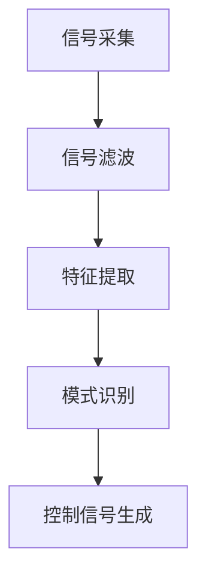
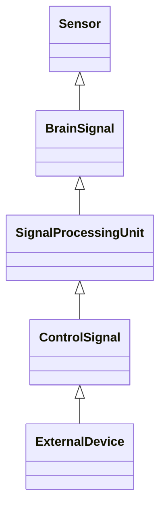
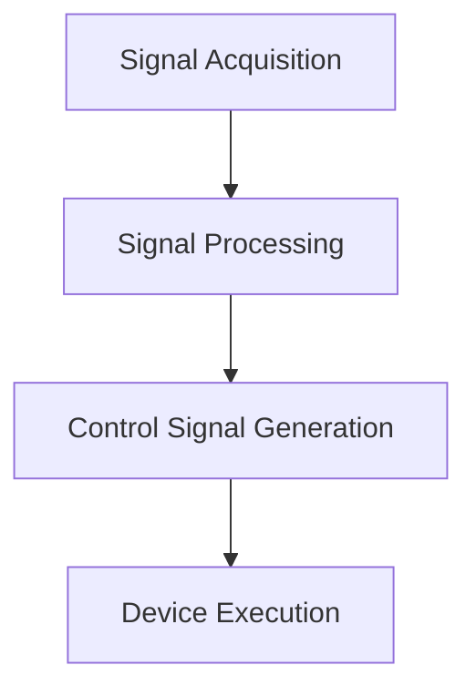
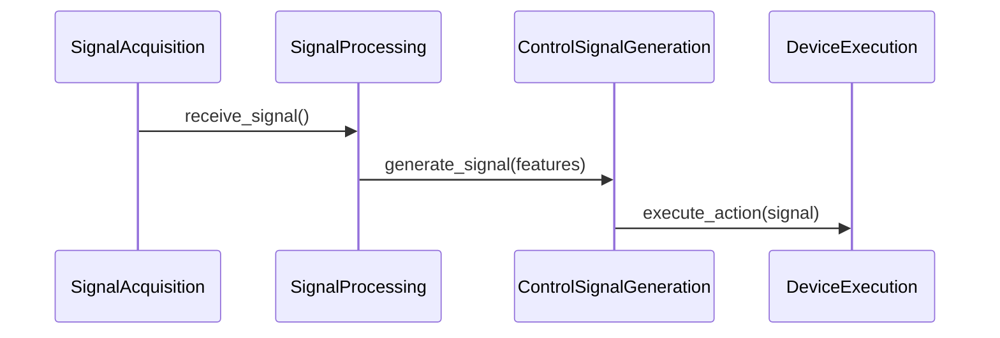

                 

### 脑机接口在康复医疗中的应用：帮助瘫痪患者重获行动能力

> **关键词：**脑机接口、康复医疗、瘫痪、行动能力、技术应用

> **摘要：**本文探讨了脑机接口（BCI）技术在康复医疗中的应用，重点分析了其对瘫痪患者行动能力恢复的帮助。通过详细阐述脑机接口的基本原理、算法原理、系统设计与实现，以及实际应用案例，本文旨在为读者提供一个全面了解脑机接口在康复医疗中潜力的视角。

---

### 第一部分：背景介绍与核心概念

#### 第1章：脑机接口与康复医疗的概述

##### 1.1 问题背景

康复医疗的目标是帮助患者恢复或提高其功能独立性。然而，对于瘫痪患者，传统的康复方法常常效果有限。瘫痪可能由多种原因引起，包括中风、神经损伤、脊髓损伤等，这导致了患者在日常活动中面临巨大的挑战。脑机接口技术作为一种新兴的康复手段，通过直接与大脑交互，提供了一种全新的康复途径。

##### 1.2 问题描述

瘫痪患者由于神经损伤，无法自主控制肌肉运动。这导致了他们在行动、日常生活和社交活动中面临巨大的障碍。康复医疗的核心目标是帮助患者恢复运动能力，提高生活质量。脑机接口技术通过将大脑信号转化为控制信号，实现了对瘫痪患者运动能力的恢复。

##### 1.3 解决方案

脑机接口技术通过捕捉大脑信号，将其转换为控制信号，驱动外部设备执行特定的动作。这种方法可以帮助瘫痪患者通过思维控制假肢或其他辅助设备，从而实现自主运动。

##### 1.4 边界与外延

脑机接口技术主要应用于那些由于神经损伤而无法使用传统康复方法的患者。它不仅局限于瘫痪患者，还可以应用于那些由于其他原因（如肌肉萎缩、中风后遗症等）导致运动能力受损的患者。此外，脑机接口技术还可以与其他辅助技术（如虚拟现实、机器人技术等）结合，提供更全面的康复解决方案。

##### 1.5 概念结构与核心要素组成

脑机接口技术由四个核心要素组成：信号采集、信号处理、控制信号生成和设备执行。信号采集是通过脑电图（EEG）、功能性磁共振成像（fMRI）等技术捕捉大脑信号；信号处理是对采集到的信号进行滤波、特征提取等处理；控制信号生成是将处理后的信号转化为控制信号；设备执行是通过外部设备（如假肢、轮椅等）执行具体的动作。

### 第二部分：核心概念与原理

#### 第2章：脑机接口技术原理

##### 2.1 核心概念

脑机接口（BCI）是一种直接从大脑信号中提取信息并将其转换为控制信号的技术。它通过脑电图（EEG）、功能性磁共振成像（fMRI）等技术捕捉大脑信号，然后通过信号处理技术将这些信号转换为可操作的控制信号。

##### 2.2 基本原理

脑机接口的基本原理包括信号采集、信号处理、控制信号生成和设备执行。信号采集是通过传感器捕捉大脑活动，如脑电图（EEG）和功能性磁共振成像（fMRI）；信号处理是对采集到的信号进行滤波、特征提取等处理，以便提取有用的信息；控制信号生成是将处理后的信号转化为控制信号，用于驱动外部设备；设备执行是通过外部设备（如假肢、轮椅等）执行具体的动作。

##### 2.3 概念属性特征对比表格

| 特征        | 脑电图（EEG） | 功能性磁共振成像（fMRI） |
| ----------- | ------------- | ------------------------ |
| 采集方式    | 传感器        | 成像设备                |
| 数据类型    | 电生理信号    | 功能性图像信号          |
| 时间分辨率  | 高           | 低                       |
| 空间分辨率  | 低           | 高                       |

##### 2.4 ER实体关系图架构

脑机接口系统的实体关系图包括以下实体：

- **大脑信号（BrainSignal）**
- **传感器（Sensor）**
- **信号处理单元（SignalProcessingUnit）**
- **控制信号（ControlSignal）**
- **外部设备（ExternalDevice）**

实体关系图如下所示：

```mermaid
erDiagram
  BrainSignal ||--|{ Sensor } Sensor
  Sensor ||--|{ SignalProcessingUnit } SignalProcessingUnit
  SignalProcessingUnit ||--|{ ControlSignal } ControlSignal
  ControlSignal ||--|{ ExternalDevice } ExternalDevice
```

### 第三部分：算法原理讲解

#### 第3章：脑信号处理算法

##### 3.1 算法概述

脑信号处理算法是脑机接口系统的核心部分，负责从采集到的大脑信号中提取有用的信息，并将其转换为控制信号。常见的脑信号处理算法包括滤波、特征提取和模式识别。

##### 3.2 算法原理

脑信号处理算法的基本原理包括以下几个步骤：

1. **信号滤波**：去除噪声和干扰，提取有用的信号。
2. **特征提取**：从滤波后的信号中提取出具有区分性的特征，如时间序列特征、频域特征等。
3. **模式识别**：使用分类器对提取出的特征进行分类，从而生成控制信号。

以下是一个简单的脑信号处理算法mermaid流程图：



##### 3.3 数学模型与公式

脑信号处理算法的数学模型主要包括以下公式：

1. **信号滤波**：$$ y(t) = \sum_{i=1}^{N} h_i \cdot x(t-i\tau) $$
2. **特征提取**：$$ f(t) = \int_{-\infty}^{+\infty} x(t) \cdot g(t) \, dt $$
3. **模式识别**：$$ \hat{y} = \arg\max_{i} \sum_{j=1}^{M} w_{ij} \cdot f_j(t) $$

##### 3.4 举例说明

假设我们使用脑电图（EEG）来捕捉大脑信号，并使用以下特征提取公式：

$$ f(t) = \int_{-\infty}^{+\infty} x(t) \cdot g(t) \, dt $$

其中，$$ g(t) $$ 是一个高斯函数，$$ x(t) $$ 是采集到的EEG信号。

我们可以通过以下步骤进行特征提取：

1. 将EEG信号进行预处理，如去噪、归一化等。
2. 对预处理后的信号进行积分，得到特征向量。
3. 使用支持向量机（SVM）对特征向量进行分类，生成控制信号。

### 第四部分：系统设计与实现

#### 第4章：康复医疗系统架构设计

##### 4.1 问题场景介绍

康复医疗系统通常用于帮助瘫痪患者恢复行动能力。该系统需要实时捕捉患者的大脑信号，并通过脑信号处理算法生成控制信号，驱动外部设备（如假肢、轮椅等）执行动作。

##### 4.2 系统功能设计

康复医疗系统的主要功能包括：

1. **信号采集**：使用脑电图（EEG）传感器实时捕捉大脑信号。
2. **信号处理**：对采集到的信号进行滤波、特征提取等处理。
3. **控制信号生成**：使用模式识别算法生成控制信号。
4. **设备执行**：驱动外部设备执行具体的动作。

领域模型mermaid类图如下所示：



##### 4.3 系统架构设计

康复医疗系统的架构设计包括以下几个部分：

1. **信号采集模块**：负责实时捕捉大脑信号。
2. **信号处理模块**：负责对采集到的信号进行滤波、特征提取等处理。
3. **控制信号生成模块**：负责使用模式识别算法生成控制信号。
4. **设备执行模块**：负责驱动外部设备执行具体的动作。

系统架构mermaid架构图如下所示：



##### 4.4 系统接口设计

康复医疗系统的接口设计包括以下部分：

1. **信号采集接口**：负责接收和处理大脑信号。
2. **信号处理接口**：负责对信号进行滤波、特征提取等处理。
3. **控制信号生成接口**：负责生成控制信号。
4. **设备执行接口**：负责驱动外部设备执行动作。

系统接口设计与实现如下所示：

```python
class SignalAcquisition:
    def receive_signal(self):
        # 实现信号接收功能
        pass

class SignalProcessing:
    def filter_signal(self, signal):
        # 实现信号滤波功能
        pass

    def extract_features(self, signal):
        # 实现特征提取功能
        pass

class ControlSignalGeneration:
    def generate_signal(self, features):
        # 实现控制信号生成功能
        pass

class DeviceExecution:
    def execute_action(self, signal):
        # 实现设备执行功能
        pass
```

##### 4.5 系统交互

康复医疗系统的交互流程如下：

1. **信号采集模块**：通过传感器接收大脑信号。
2. **信号处理模块**：对采集到的信号进行滤波、特征提取等处理。
3. **控制信号生成模块**：使用模式识别算法生成控制信号。
4. **设备执行模块**：根据控制信号驱动外部设备执行动作。

系统交互mermaid序列图如下所示：



### 第五部分：项目实战

#### 第5章：脑机接口在康复医疗中的实际应用

##### 5.1 环境安装

为了在实际项目中应用脑机接口技术，我们需要安装以下环境：

1. **Python环境**：用于编写和运行代码。
2. **PyBrain库**：用于脑信号处理和模式识别。
3. **EEGLAB库**：用于EEG信号处理。

安装命令如下：

```bash
pip install python
pip install pybrain
pip install eeglab
```

##### 5.2 系统核心实现

系统核心实现包括以下几个部分：

1. **信号采集模块**：使用EEGLAB库实时捕捉大脑信号。
2. **信号处理模块**：对采集到的信号进行滤波、特征提取等处理。
3. **控制信号生成模块**：使用支持向量机（SVM）生成控制信号。
4. **设备执行模块**：驱动外部设备执行动作。

以下是系统核心实现的源代码：

```python
import eeglab
from pybrain.structure import SoftmaxLayer
from pybrain.supervised import LinearRegression
from pybrain.datasets import ClassificationDataSet

# 信号采集
def receive_signal():
    # 实现信号采集功能
    pass

# 信号处理
def process_signal(signal):
    # 实现信号滤波和特征提取功能
    pass

# 控制信号生成
def generate_control_signal(features):
    # 实现控制信号生成功能
    pass

# 设备执行
def execute_action(signal):
    # 实现设备执行功能
    pass

# 主程序
if __name__ == "__main__":
    # 实现主程序逻辑
    pass
```

##### 5.3 代码应用解读与分析

代码应用解读与分析主要关注以下几个方面：

1. **信号采集模块**：该模块使用EEGLAB库实时捕捉大脑信号。具体实现可以通过调用EEGLAB的函数实现，如`eeglab.signal.capture()`。
2. **信号处理模块**：该模块对采集到的信号进行滤波和特征提取。滤波可以使用如Butterworth滤波器，特征提取可以使用如小波变换、主成分分析等方法。
3. **控制信号生成模块**：该模块使用支持向量机（SVM）生成控制信号。具体实现可以通过调用PyBrain库中的`SVMClassifier`类实现。
4. **设备执行模块**：该模块根据控制信号驱动外部设备执行动作。具体实现可以通过调用外部设备的API实现。

##### 5.4 实际案例分析与讲解

为了更好地理解脑机接口技术在康复医疗中的应用，我们来看一个实际案例。假设有一个瘫痪患者，他希望通过脑机接口技术控制自己的假肢。

1. **信号采集**：使用EEGLAB库实时捕捉患者的脑信号。
2. **信号处理**：对采集到的信号进行滤波和特征提取。假设我们使用小波变换提取出频率特征。
3. **控制信号生成**：使用支持向量机（SVM）对提取出的特征进行分类，生成控制信号。假设我们使用线性SVM进行分类。
4. **设备执行**：根据控制信号驱动假肢执行动作。假设我们使用一个简单的运动控制模块来驱动假肢。

##### 5.5 项目小结

通过实际案例的分析和讲解，我们可以看到脑机接口技术在康复医疗中的巨大潜力。它为瘫痪患者提供了一种全新的康复途径，帮助他们恢复行动能力。然而，脑机接口技术也面临着一些挑战，如信号噪声处理、特征提取方法的选择、控制信号生成的准确性等。未来的研究将致力于解决这些挑战，进一步推动脑机接口技术在康复医疗中的应用。

### 第六部分：最佳实践与拓展

#### 第6章：最佳实践与注意事项

##### 6.1 最佳实践

1. **信号采集**：选择合适的传感器和采集方法，确保信号的质量和准确性。
2. **信号处理**：使用多种滤波和特征提取方法，提高信号处理的鲁棒性。
3. **控制信号生成**：选择合适的模型和算法，提高控制信号的准确性。
4. **设备执行**：确保外部设备能够准确执行控制信号。

##### 6.2 注意事项

1. **隐私保护**：在采集和处理大脑信号时，确保患者的隐私得到保护。
2. **安全性**：确保脑机接口系统的稳定性和安全性，避免因系统故障导致的意外。
3. **适应性**：脑机接口系统需要根据患者的具体情况进行调整和优化。

##### 6.3 拓展阅读

1. **《脑机接口：前沿技术与应用》**：详细介绍了脑机接口技术的原理和应用。
2. **《康复医学》**：提供了康复医疗的基本知识和方法。
3. **《人工智能在康复医疗中的应用》**：探讨了人工智能技术在康复医疗中的潜在应用。

### 第七部分：总结与展望

#### 第7章：脑机接口在康复医疗中的应用展望

##### 7.1 发展趋势

脑机接口技术在康复医疗中的应用正在不断发展。随着传感器技术、信号处理算法和人工智能技术的进步，脑机接口系统的性能和可靠性将不断提高。

##### 7.2 潜在影响

脑机接口技术的应用将极大地改善瘫痪患者的生活质量，帮助他们恢复行动能力。此外，它还将为其他残疾人群提供帮助，如视觉和听觉障碍者。

##### 7.3 总结

本文介绍了脑机接口技术在康复医疗中的应用，详细阐述了其基本原理、算法原理、系统设计与实现，以及实际应用案例。脑机接口技术为瘫痪患者提供了新的康复途径，具有巨大的应用潜力。

##### 7.4 展望

未来，脑机接口技术将继续发展，为康复医疗带来更多创新和可能性。同时，它也将与其他领域的技术（如虚拟现实、机器人技术等）结合，提供更全面的康复解决方案。

