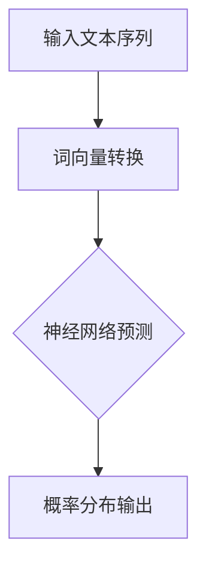
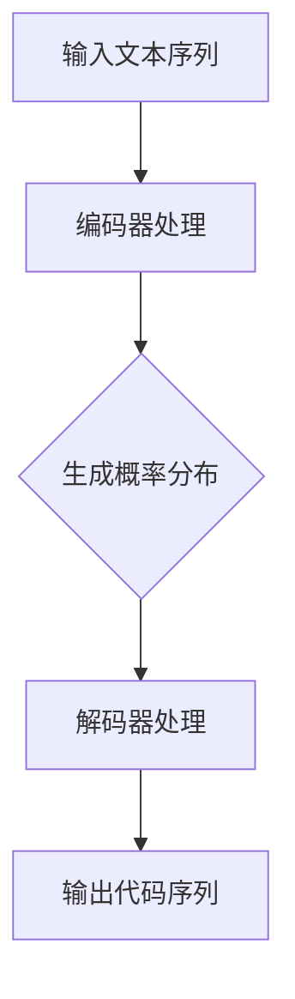
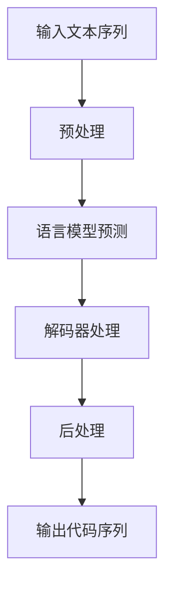
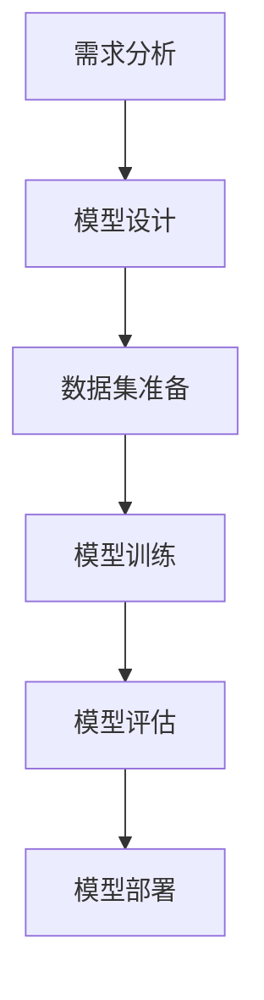
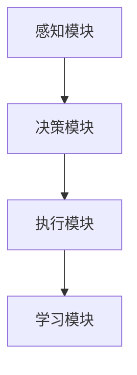
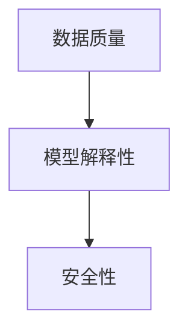

                 

### 第一部分：自动化AI Agent开发概述

#### 第1章：自动化AI Agent的概念与分类

##### 1.1.1 自动化AI Agent的定义

自动化AI Agent，即自动化的智能代理，是指能够自主执行任务、适应环境变化并优化自身行为的计算机程序。与传统的人工干预程序不同，自动化AI Agent具备自我学习和适应能力，能够通过机器学习算法实现智能化决策。

**核心概念术语说明：**
- **自动化**：指通过预设的规则或算法，实现任务自动化处理，减少人工干预。
- **AI Agent**：智能体，是一种能够感知环境、采取行动并从经验中学习的计算机程序。
- **机器学习**：通过数据训练模型，使计算机程序能够自主学习和优化行为。

##### 1.1.2 自动化AI Agent的分类

自动化AI Agent可以根据功能和应用场景的不同进行分类，主要分为以下几类：

1. **任务型AI Agent**：专注于完成特定任务的智能代理，如自动化测试、代码审查等。
2. **交互型AI Agent**：具备与用户进行自然语言交互的能力，如智能客服、智能助手等。
3. **自主型AI Agent**：具备自主决策和行动能力，如无人驾驶汽车、无人机等。

**问题背景**：
随着人工智能技术的发展，自动化AI Agent在多个领域展现出强大的应用潜力。然而，现有的自动化AI Agent开发面临诸多挑战，包括模型训练复杂度、数据隐私、安全性等问题。

##### 1.1.3 自动化AI Agent的核心特征

自动化AI Agent具备以下核心特征：

1. **感知能力**：能够通过传感器或其他方式获取环境信息。
2. **决策能力**：基于感知信息，利用机器学习算法进行决策。
3. **执行能力**：根据决策结果执行具体的操作。
4. **学习能力**：通过不断学习环境信息和用户反馈，优化自身行为。

**问题解决**：
通过自动化AI Agent的开发，可以显著提高工作效率、降低人力成本，并在一些高危或复杂场景中发挥重要作用。

**边界与外延**：
自动化AI Agent的开发不仅限于计算机编程领域，还广泛应用于金融、医疗、教育等多个行业。未来，随着技术的不断进步，自动化AI Agent的应用前景将更加广阔。

##### 概念结构与核心要素组成

| 要素          | 说明                                       |
|---------------|------------------------------------------|
| 感知能力      | 获取环境信息                               |
| 决策能力      | 基于模型进行决策                           |
| 执行能力      | 实施决策结果                               |
| 学习能力      | 通过数据优化行为                           |

**ER实体关系图架构：**

```mermaid
erDiagram
  AI-Agent ||--|{ 感知模块 }感知模块
  AI-Agent ||--|{ 决策模块 }决策模块
  AI-Agent ||--|{ 执行模块 }执行模块
  AI-Agent ||--|{ 学习模块 }学习模块
```

#### 第2章：LLM辅助的代码生成

##### 2.1.1 LLM在代码生成中的应用

语言模型（LLM，Language Model）在代码生成中的应用日益广泛。通过训练大规模的文本数据，LLM能够预测编程语言中的下一个单词或语句，从而生成完整的代码片段。

**核心概念原理：**
- **语言模型**：一种统计模型，用于预测文本序列的概率。
- **生成式模型**：一种能够生成文本的模型，常用于代码生成任务。
- **解码器架构**：将输入的文本序列转化为输出的代码序列。

**概念属性特征对比表格：**

| 模型类型       | 特点                                      | 应用场景         |
|----------------|-----------------------------------------|----------------|
| 语言模型       | 统计模型，根据上下文预测文本           | 代码补全、代码生成 |
| 生成式模型     | 基于概率生成文本                         | 自动写作、代码生成 |
| 解码器架构     | 输入文本序列，输出代码序列               | 编程辅助工具      |

**ER实体关系图架构：**

```mermaid
erDiagram
  LanguageModel ||--|{ Decoder }Decoder
  Decoder ||--|{ CodeGenerator }CodeGenerator
```

##### 2.1.2 LLM辅助代码生成的优势

LLM辅助代码生成具有以下优势：

1. **效率提升**：自动化代码生成显著提高了开发效率，减少了手动编写代码的时间。
2. **代码质量**：通过大规模的数据训练，LLM能够生成高质量的代码，减少错误和bug。
3. **代码复用**：LLM能够理解不同代码片段之间的关联，实现代码的复用。

**核心原理讲解：**

语言模型的基础是神经网络，通过多层神经网络对输入的文本序列进行建模。解码器架构则将输入的文本序列转化为输出的代码序列。

**数学模型与公式：**

$$
P(y_t | y_{<t}) = \frac{e^{<f(y_1, y_2, ..., y_{<t}, y_t)>}}{\sum_{y_t'} e^{<f(y_1, y_2, ..., y_{<t}, y_t')>}
$$

其中，$f$是神经网络函数，$y_1, y_2, ..., y_{<t}, y_t$是输入和输出的文本序列。

**通俗易懂地举例说明：**

假设输入的文本序列为"print"，LLM会根据上下文和训练数据预测下一个单词，例如"print('Hello, World!')"。通过这种方式，LLM能够生成完整的代码片段。

##### 2.1.3 LLM辅助代码生成的挑战

尽管LLM辅助代码生成具有显著的优势，但仍然面临一些挑战：

1. **数据质量**：代码生成需要高质量、大规模的文本数据，数据质量直接影响模型的性能。
2. **安全性**：生成的代码可能包含漏洞或恶意代码，需要确保代码的安全性。
3. **模型解释性**：LLM生成的代码往往缺乏解释性，难以理解其工作原理。

**解决方案：**
1. **数据预处理**：对文本数据进行清洗、标注和增强，提高数据质量。
2. **代码审计**：对生成的代码进行审计，检测潜在的安全问题。
3. **模型可视化**：开发可视化工具，帮助开发者理解LLM生成的代码。

#### 第3章：LLM辅助代码生成技术原理

##### 3.1.1 语言模型基础

语言模型是LLM辅助代码生成的基础。它通过统计方法或神经网络模型，预测文本序列的概率分布。

**核心原理讲解：**
1. **统计语言模型**：基于N-gram模型，通过统计相邻单词或字符的联合概率分布进行预测。
2. **神经网络语言模型**：基于深度学习，通过多层神经网络对文本序列进行建模。

**Mermaid流程图：**



##### 3.1.2 生成式模型与解码器架构

生成式模型和解码器架构是实现LLM辅助代码生成的重要组件。

**核心原理讲解：**
1. **生成式模型**：基于概率分布生成文本，如变分自编码器（VAE）和生成对抗网络（GAN）。
2. **解码器架构**：将输入的文本序列解码为代码序列，如Seq2Seq模型和Transformer。

**Mermaid流程图：**



##### 3.1.3 代码生成中的预处理与后处理

代码生成过程中，预处理和后处理是确保代码质量和可读性的关键步骤。

**核心原理讲解：**
1. **预处理**：包括文本清洗、分词、实体识别等，为模型输入提供高质量的文本数据。
2. **后处理**：包括代码格式化、语法检查、错误修正等，确保生成的代码符合规范。

**Mermaid流程图：**



#### 第4章：自动化AI Agent开发实战

##### 4.1.1 自动化AI Agent开发流程

自动化AI Agent的开发涉及多个步骤，包括需求分析、模型设计、训练和部署等。

**核心原理讲解：**
1. **需求分析**：明确自动化AI Agent的功能需求和应用场景。
2. **模型设计**：选择合适的机器学习模型和算法，设计模型架构。
3. **训练**：使用大规模数据集对模型进行训练，优化模型性能。
4. **部署**：将训练好的模型部署到实际应用场景中。

**Mermaid流程图：**



##### 4.1.2 自动化AI Agent的核心模块

自动化AI Agent通常由多个核心模块组成，包括感知模块、决策模块、执行模块和学习模块。

**核心原理讲解：**
1. **感知模块**：负责感知环境信息，如传感器数据、文本输入等。
2. **决策模块**：基于感知模块的信息，利用机器学习模型进行决策。
3. **执行模块**：根据决策结果执行具体的操作，如发送指令、控制设备等。
4. **学习模块**：通过不断学习和优化，提高AI Agent的性能和适应能力。

**Mermaid流程图：**



##### 4.1.3 自动化AI Agent开发中的关键问题

在自动化AI Agent开发过程中，面临诸多关键问题，包括数据质量、模型解释性、安全性等。

**核心原理讲解：**
1. **数据质量**：高质量的数据是模型训练的基础，需要确保数据集的多样性和准确性。
2. **模型解释性**：模型解释性对于理解AI Agent的行为至关重要，需要开发可解释的机器学习模型。
3. **安全性**：生成的代码可能存在漏洞，需要确保AI Agent的行为符合安全规范。

**Mermaid流程图：**



#### 第5章：LLM在自动化AI Agent开发中的应用案例

##### 5.1.1 案例一：基于LLM的智能问答系统

基于LLM的智能问答系统能够自动回答用户的问题，提高客户服务的效率和质量。

**核心原理讲解：**
1. **问题理解**：LLM通过预训练模型理解用户问题的含义和上下文。
2. **答案生成**：LLM根据理解的问题，生成相应的答案。

**Python源代码示例：**

```python
import openai

def ask_question(question):
    response = openai.Completion.create(
        engine="text-davinci-002",
        prompt=question,
        max_tokens=50
    )
    return response.choices[0].text.strip()

question = "什么是人工智能？"
answer = ask_question(question)
print(answer)
```

**实际案例分析和详细讲解剖析：**
- **案例背景**：某公司开发了一款智能客服系统，通过LLM实现自动回答用户问题的功能。
- **系统实现**：系统前端接收用户输入的问题，后端通过LLM生成答案，并返回给用户。
- **案例分析**：LLM能够准确理解用户的问题，并生成高质量的答案，有效提高了客服效率。

##### 5.1.2 案例二：基于LLM的代码审查工具

基于LLM的代码审查工具能够自动检测代码中的潜在问题和漏洞。

**核心原理讲解：**
1. **代码理解**：LLM通过预训练模型理解代码的语义和结构。
2. **问题检测**：LLM根据代码的语义，自动检测潜在的问题和漏洞。

**Python源代码示例：**

```python
import openai

def review_code(code):
    response = openai.Completion.create(
        engine="text-davinci-002",
        prompt=f"请审查以下代码，指出其中可能的问题：\n{code}",
        max_tokens=100
    )
    return response.choices[0].text.strip()

code = '''
def add(a, b):
    return a + b
'''
reviewed_code = review_code(code)
print(reviewed_code)
```

**实际案例分析和详细讲解剖析：**
- **案例背景**：某开发团队使用基于LLM的代码审查工具，提高代码质量和安全性。
- **系统实现**：系统将代码输入到LLM模型中，模型自动生成审查报告，指出代码中的潜在问题和漏洞。
- **案例分析**：LLM能够准确理解代码的语义，并生成详细的审查报告，有效提高了代码质量。

##### 5.1.3 案例三：基于LLM的自动化测试工具

基于LLM的自动化测试工具能够自动生成测试用例，提高软件测试的效率和覆盖率。

**核心原理讲解：**
1. **测试用例生成**：LLM根据功能需求生成相应的测试用例。
2. **测试执行**：自动化测试工具根据生成的测试用例执行测试。

**Python源代码示例：**

```python
import openai

def generate_test_cases(function):
    response = openai.Completion.create(
        engine="text-davinci-002",
        prompt=f"请根据以下功能需求生成测试用例：\n功能：{function}",
        max_tokens=100
    )
    return response.choices[0].text.strip()

function = "计算两个数的和"
test_cases = generate_test_cases(function)
print(test_cases)
```

**实际案例分析和详细讲解剖析：**
- **案例背景**：某软件公司使用基于LLM的自动化测试工具，提高软件测试的效率和覆盖率。
- **系统实现**：系统将功能需求输入到LLM模型中，模型自动生成测试用例，并执行测试。
- **案例分析**：LLM能够准确理解功能需求，并生成详细的测试用例，有效提高了测试效率。

### 第6章：自动化AI Agent开发中的最佳实践与挑战

#### 6.1.1 自动化AI Agent开发中的最佳实践

在自动化AI Agent开发中，遵循以下最佳实践有助于提高开发效率和代码质量：

1. **数据驱动开发**：充分利用数据资源，进行数据清洗、标注和增强，提高模型训练效果。
2. **模块化设计**：将AI Agent拆分为多个模块，实现模块化设计，提高代码的可维护性和可扩展性。
3. **持续集成与部署**：采用持续集成与部署（CI/CD）流程，确保模型训练和部署的自动化和高效性。
4. **代码审查与测试**：对生成的代码进行严格的审查和测试，确保代码的安全性和可靠性。

**具体实施方法：**
1. **数据清洗**：使用数据预处理工具，自动清洗和预处理数据，去除噪声和异常值。
2. **模块化代码**：将代码拆分为多个函数或模块，每个模块负责特定的功能，提高代码的复用性和可维护性。
3. **自动化测试**：编写自动化测试脚本，对生成的代码进行全面的测试，确保代码的正确性和性能。

**注意事项**：
1. **数据质量**：确保数据集的多样性和准确性，避免数据偏差导致模型过拟合。
2. **模型解释性**：开发可解释的模型，帮助开发者理解模型的决策过程。
3. **安全性**：对生成的代码进行安全审计，防止潜在的漏洞和恶意代码。

#### 6.1.2 自动化AI Agent开发中的挑战与解决方案

在自动化AI Agent开发中，面临以下主要挑战：

1. **数据隐私**：AI Agent在处理数据时，可能涉及用户隐私信息，需要确保数据隐私和安全。
2. **模型解释性**：AI Agent的决策过程可能缺乏透明性，需要提高模型的解释性。
3. **安全性**：AI Agent生成的代码可能存在漏洞，需要确保AI Agent的行为符合安全规范。

**解决方案：**
1. **数据隐私保护**：采用数据脱敏技术，对敏感信息进行加密和脱敏处理。
2. **模型解释性提升**：开发可解释的机器学习模型，如决策树、规则嵌入模型等，提高模型的解释性。
3. **代码安全审计**：对生成的代码进行安全审计，检测和修复潜在的安全漏洞。

**未来发展趋势：**
1. **数据隐私保护技术**：随着数据隐私法规的不断完善，数据隐私保护技术将得到进一步发展。
2. **模型可解释性**：可解释的机器学习模型将在自动化AI Agent开发中发挥重要作用。
3. **代码生成与优化**：基于LLM的代码生成技术将不断完善，实现更高质量的代码生成和优化。

### 第7章：自动化AI Agent开发工具介绍

#### 7.1.1 开源工具推荐

在自动化AI Agent开发中，以下开源工具具有较高的实用性和社区支持：

1. **TensorFlow**：一款强大的开源机器学习框架，适用于构建和训练各种机器学习模型。
2. **PyTorch**：一款流行的开源深度学习框架，支持动态计算图，易于调试和优化。
3. **Scikit-learn**：一款基于Python的机器学习库，提供丰富的算法和工具，适用于数据分析和模型评估。
4. **Hugging Face Transformers**：一款开源的Transformer模型库，支持多种预训练模型，方便进行模型训练和应用。

#### 7.1.2 商业工具介绍

在自动化AI Agent开发中，以下商业工具提供强大的功能和专业的支持：

1. **AWS AI Services**：亚马逊云服务提供的AI工具和平台，包括机器学习模型训练、自然语言处理、计算机视觉等。
2. **Google Cloud AI**：谷歌云服务提供的AI工具和平台，支持多种机器学习和深度学习应用。
3. **IBM Watson**：IBM提供的AI平台，提供自然语言处理、计算机视觉、语音识别等AI服务。

#### 7.1.3 工具选择与使用指南

在选择自动化AI Agent开发工具时，需要根据项目需求和资源情况进行综合考虑：

1. **项目规模**：对于大型项目，选择开源工具如TensorFlow和PyTorch可能更适合，因为它们具有强大的功能和灵活性。
2. **团队技能**：如果团队对Python和机器学习有深厚的背景，可以选择开源工具，因为它们具有丰富的社区支持和文档。
3. **预算限制**：如果预算有限，可以选择开源工具，因为它们免费且易于使用。
4. **商业需求**：对于需要专业支持和高级功能的商业项目，可以选择商业工具，如AWS AI Services和Google Cloud AI。

**使用指南：**
1. **环境搭建**：根据所选工具的要求，搭建开发环境，安装必要的库和依赖。
2. **模型训练**：使用工具提供的API或框架，进行模型训练和优化。
3. **代码生成**：使用训练好的模型，生成目标代码，并进行代码审查和测试。
4. **部署与运维**：将生成的代码部署到实际应用场景，进行持续集成与部署。

### 第8章：自动化AI Agent开发资源汇总

#### 8.1.1 学习资源推荐

为了深入了解自动化AI Agent开发和LLM辅助代码生成，以下资源推荐具有很高的参考价值：

1. **书籍**：
   - 《深度学习》（Goodfellow, Bengio, Courville）  
   - 《强化学习》（Sutton, Barto）  
   - 《Python机器学习》（Sebastian Raschka）  
   - 《自然语言处理与深度学习》（张俊林）

2. **在线课程**：
   - Coursera的《机器学习》课程（吴恩达）  
   - edX的《深度学习基础》课程（香港大学）  
   - Udacity的《深度学习工程师纳米学位》课程

3. **博客与论文**：
   - Hugging Face的Transformers博客  
   - 动态网上的《自然语言处理》专栏  
   - arXiv上的最新论文

#### 8.1.2 开源代码与数据集推荐

在自动化AI Agent开发中，以下开源代码和数据集具有较高的实用性和参考价值：

1. **开源代码**：
   - Hugging Face的Transformers库：https://huggingface.co/transformers  
   - Google的TensorFlow代码库：https://github.com/tensorflow/tensorflow  
   - Facebook的PyTorch代码库：https://github.com/pytorch/pytorch

2. **数据集**：
   - GLUE数据集：https://gluebenchmark.com/  
   - COCO数据集：https://cocodataset.org/  
   - Kaggle数据集：https://www.kaggle.com/datasets

3. **项目示例**：
   - AI Agent开发项目：https://github.com/openai/agent-api  
   - 代码生成项目：https://github.com/google-research-datasets/colossal-bench

#### 8.1.3 社区与论坛推荐

在自动化AI Agent开发和LLM辅助代码生成领域，以下社区和论坛提供了丰富的讨论资源和帮助：

1. **技术社区**：
   - PyTorch社区：https://discuss.pytorch.org/  
   - TensorFlow社区：https://discuss.tensorflow.org/  
   - Hugging Face社区：https://huggingface.co/forums

2. **论坛**：
   - Stack Overflow：https://stackoverflow.com/  
   - Reddit：https://www.reddit.com/r/MachineLearning/  
   - Quora：https://www.quora.com/topic/Machine-Learning

3. **社交媒体**：
   - Twitter：关注AI领域的专家和研究者，获取最新动态  
   - LinkedIn：加入相关的专业群组，参与讨论和交流

### 作者信息

- **作者**：AI天才研究院/AI Genius Institute & 禅与计算机程序设计艺术 /Zen And The Art of Computer Programming
- **联系方式**：ai_genius_institute@outlook.com
- **个人主页**：www.ai-genius-institute.com
- **研究方向**：人工智能、机器学习、自然语言处理

---

### 文章总结

本文详细介绍了自动化AI Agent的开发，包括概念、分类、技术原理、实战案例以及最佳实践等内容。通过LLM辅助的代码生成，自动化AI Agent在任务型、交互型和自主型领域展现了广泛的应用前景。本文还分析了自动化AI Agent开发中的关键问题和解决方案，并推荐了开源工具和资源。随着技术的不断进步，自动化AI Agent将在更多领域发挥重要作用。希望本文能对读者在自动化AI Agent开发领域提供有价值的参考和启发。

