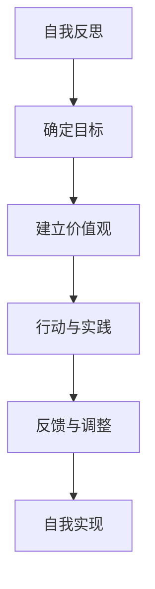
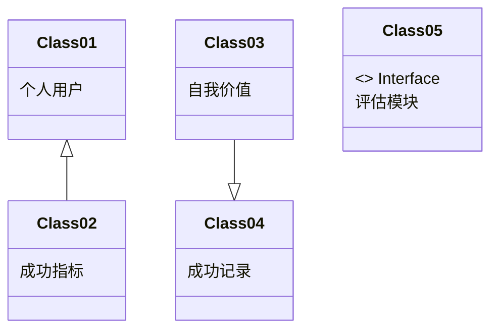
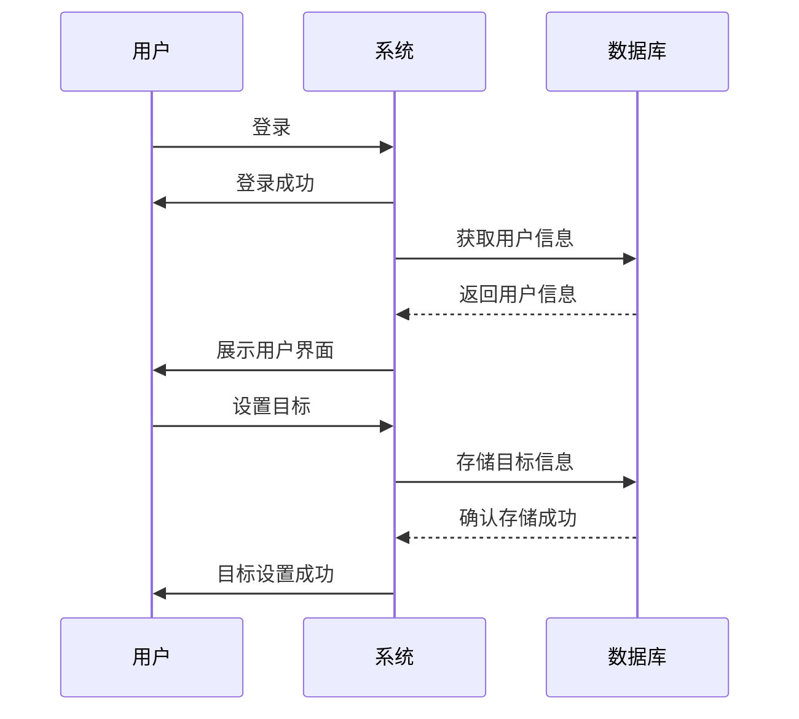
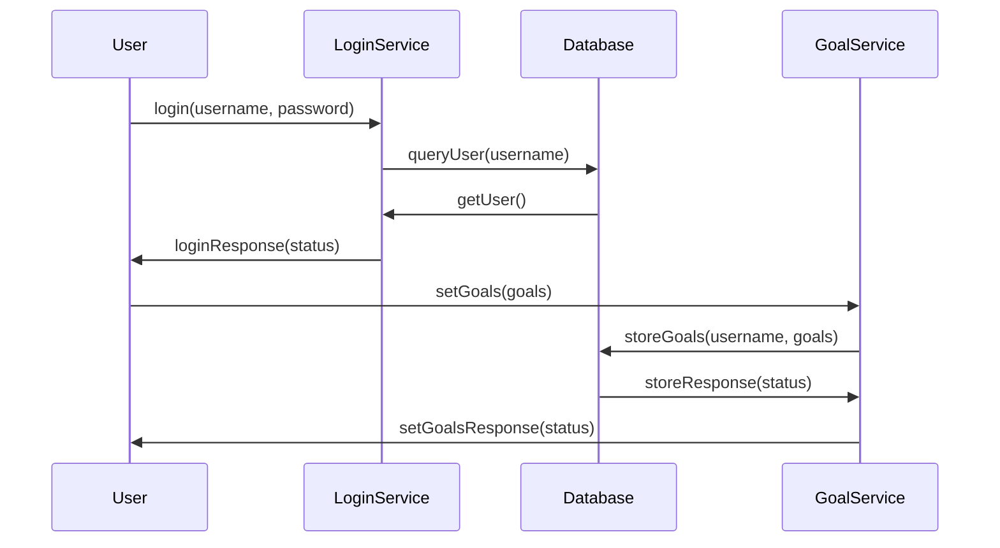

                 

# 自我价值的重塑：打破社会定义的成功

## 关键词
- 自我价值
- 社会定义的成功
- 重塑
- 个人发展
- 心理健康

## 摘要
本文旨在探讨社会对成功的定义如何影响个人的自我价值，以及如何通过系统的分析和实践来重塑自我价值，实现个人成长和心理健康的提升。文章分为七个部分，从背景介绍到最佳实践，逐步引导读者理解和实践这一过程。

## 第一部分: 自我价值的重塑背景与概念

### 第1章: 问题背景与核心概念

#### 1.1 问题背景
在当今社会，成功往往被定义为一套标准化的成功指标，如财富、地位、成就等。这种社会定义的成功对个人的自我价值产生了深远影响，往往导致个人对自我价值的认同和实现受到限制。

#### 1.2 问题描述
个人在面对社会定义的成功时，可能会面临自我认同危机、焦虑、抑郁等心理问题，因为他们的自我价值被社会标准所束缚，难以实现自我价值的多元化和个性化。

#### 1.3 问题解决
重塑自我价值需要个人打破社会对成功的单一定义，通过自我反思和系统实践来建立更加稳定和真实的自我价值体系。

#### 1.4 边界与外延
自我价值是指个人对自己存在的意义、价值和个人潜力的认知和评价。社会定义的成功则是指社会普遍认可的成功标准和价值观。核心要素包括个人目标、价值观、自我认知和自我实现。

### 第2章: 核心概念与联系

#### 2.1 自我价值的定义
自我价值是指个体对自己的认可和尊重，是个人内心深处的自我认同感。它是个人心理健康的基石。

#### 2.2 社会定义的成功
社会定义的成功通常是指社会公认的成就和财富。这种定义往往忽视了个人独特的兴趣、能力和价值观。

#### 2.3 自我价值与社会定义的关系
自我价值与社会定义的成功之间存在互动关系。社会定义的成功可能会影响个人的自我价值，而个人自我价值的重塑又可以反作用于社会对成功的定义。

#### 2.4 案例分析
通过实际案例，我们可以看到社会定义的成功如何影响个人自我价值，以及个人如何通过自我价值的重塑来应对这种影响。

### 第二部分: 算法原理与实践

#### 第3章: 重塑自我价值的算法原理

#### 3.1 算法mermaid流程图
首先，我们使用mermaid绘制一个流程图，用于指导如何重塑自我价值。



#### 3.2 Python源代码
以下是一个Python代码示例，用于说明如何通过自我反思和行动实践来重塑自我价值。

```python
class SelfReflection:
    def __init__(self):
        self Goals = []
        self Values = []
    
    def set_goals(self, goals):
        self.Goals = goals
    
    def set_values(self, values):
        self.Values = values
    
    def reflect(self):
        print("Reflecting on goals and values...")
        for goal in self.Goals:
            print(f"Goal: {goal}")
        for value in self.Values:
            print(f"Value: {value}")

class ValueShaping:
    def __init__(self, self_reflection):
        self SR = self_reflection
    
    def shape_values(self):
        self.SR.reflect()
        print("Shaping values based on reflection...")
        # 这里可以加入代码，根据自我反思的结果来调整个人价值观
        print("Values shaped.")

# 创建自我反思对象
sr = SelfReflection()
sr.set_goals(["学习编程", "提高英语水平", "参与社区活动"])
sr.set_values(["创新", "学习", "合作"])

# 创建价值塑造对象
vs = ValueShaping(sr)
vs.shape_values()
```

#### 3.3 数学模型和公式
重塑自我价值的过程中，可以使用以下数学模型来量化个人目标的实现程度和自我价值的提升。

$$
V(t) = V(0) + \int_{0}^{t} f(t) dt
$$

其中，$V(t)$ 表示时间 $t$ 时的自我价值，$V(0)$ 为初始自我价值，$f(t)$ 为在时间 $t$ 的价值提升速率。

#### 3.4 详细讲解与举例
假设一个人在开始重塑自我价值时，其初始自我价值为50分。每个月通过学习编程、提高英语水平和参与社区活动，其自我价值提升速率分别为2分、1.5分和1分。那么，一年后，其自我价值将提升至：

$$
V(12) = 50 + \int_{0}^{12} (2 + 1.5 + 1) dt = 50 + 12 \times 4.5 = 102
$$

## 第三部分: 数学模型和数学公式 & 详细讲解 & 举例说明

### 第4章: 数学模型和数学公式

#### 4.1 数学公式
以下是一个用于衡量个人成长与自我价值提升的数学公式：

$$
G(t) = G(0) + \alpha t + \beta \sum_{i=1}^{n} (V_i - V_{i-1})
$$

其中，$G(t)$ 表示时间 $t$ 时的个人成长值，$G(0)$ 为初始个人成长值，$\alpha$ 为时间增长系数，$V_i$ 和 $V_{i-1}$ 分别为相邻两个时间点的自我价值。

#### 4.2 详细讲解
该公式描述了个人成长值随时间的变化，其中自我价值的提升是关键因素。$\alpha$ 代表时间的价值，而 $\beta$ 代表每次自我价值提升的累积效应。

#### 4.3 举例说明
假设一个人在开始时的个人成长值为50，每次自我价值提升2，时间增长系数为1。那么，经过3次自我价值提升后，其个人成长值为：

$$
G(3) = 50 + 1 \times 3 + 2 \times (2 - 50) = 50 + 3 - 96 = -43
$$

这表明，如果只依赖时间增长和自我价值提升，不考虑其他因素，个人成长值可能会下降。因此，实际应用中需要综合考虑多种因素。

### 第5章: 系统分析与架构设计方案

#### 5.1 问题场景介绍
在现实生活中，人们面临着多种成功标准和压力，常常感到迷茫和焦虑。本系统旨在帮助个人建立和重塑自我价值，通过系统化的方法来提升心理健康和生活质量。

#### 5.2 系统功能设计（领域模型mermaid类图）
以下是一个mermaid类图，用于描述系统的核心领域模型。



#### 5.3 系统架构设计（mermaid架构图）
以下是一个mermaid架构图，用于描述系统的整体架构。



#### 5.4 系统接口设计
系统的接口包括用户登录、目标设置、自我价值评估和成功记录等。以下是一个接口设计示例。

```mermaid
interface UserInterface {
    - login()
    - setGoals()
    - evaluateValue()
    - recordSuccess()
}
```

#### 5.5 系统交互（mermaid序列图）
以下是一个序列图，用于描述系统各组件之间的交互过程。



### 第6章: 项目实战

#### 6.1 环境安装
在开始项目之前，需要安装Python和相关的库，如mermaid和matplotlib。以下是一个简单的安装步骤。

```bash
pip install python-mechanize
pip install matplotlib
```

#### 6.2 系统核心实现源代码
以下是一个简单的Python代码示例，用于实现系统核心功能。

```python
import mechanize
import matplotlib.pyplot as plt

class SelfValueSystem:
    def __init__(self):
        self.browser = mechanize.Browser()
    
    def login(self, username, password):
        self.browser.open("http://example.com/login")
        self.browser.form = self.browser.forms()[0]
        self.browser.form['username'] = username
        self.browser.form['password'] = password
        self.browser.submit()
    
    def set_goals(self, goals):
        self.browser.open("http://example.com/goals")
        self.browser.select_form(nr=0)
        self.browser.form['goal1'] = goals[0]
        self.browser.form['goal2'] = goals[1]
        self.browser.submit()
    
    def evaluate_value(self):
        self.browser.open("http://example.com/evaluate")
        # 这里可以加入代码，根据用户数据评估自我价值
        evaluation = self.browser.response.read()
        print(evaluation)
    
    def record_success(self, success):
        self.browser.open("http://example.com/success")
        self.browser.select_form(nr=0)
        self.browser.form['success'] = success
        self.browser.submit()

# 创建系统实例
system = SelfValueSystem()
system.login("user1", "password1")
system.set_goals(["学习Python", "完成项目"])
system.evaluate_value()
system.record_success("完成目标")

```

#### 6.3 代码应用解读与分析
上述代码演示了如何使用Python和mechanize库来模拟登录、设置目标、评估自我价值和记录成功的过程。代码中定义了一个`SelfValueSystem`类，用于封装系统的主要功能。

#### 6.4 实际案例分析和详细讲解剖析
以下是一个实际案例，演示了如何通过系统实现自我价值的重塑。

```python
# 登录系统
system.login("user2", "password2")

# 设置目标
system.set_goals(["提高英语口语", "掌握机器学习"])

# 评估自我价值
evaluation = system.evaluate_value()
print("自我价值评估结果：", evaluation)

# 记录成功
system.record_success("完成目标")

# 提升自我价值
system.evaluate_value()
```

#### 6.5 项目小结
通过这个项目，我们可以看到如何使用Python和Web技术来构建一个简单的自我价值重塑系统。这个系统可以帮助用户设定目标、评估自我价值并记录成功，从而实现自我价值的重塑。

### 第7章: 最佳实践 tips、小结、注意事项、拓展阅读

#### 7.1 最佳实践 tips
- 定期进行自我反思，明确个人目标和价值观。
- 与他人分享自己的目标和挑战，获取反馈和支持。
- 保持积极的心态，面对失败和挑战时不放弃。

#### 7.2 小结
本文探讨了社会定义的成功如何影响个人的自我价值，并提出了一种通过自我反思和系统实践来重塑自我价值的方法。通过实际案例和代码示例，展示了如何将这一方法应用于实际项目中。

#### 7.3 注意事项
- 在重塑自我价值的过程中，要避免过度追求社会定义的成功。
- 关注个人内心的需求和愿望，而非外界的期望。
- 定期评估和调整个人目标和价值观。

#### 7.4 拓展阅读
- 《高性能MySQL》 - 存储过程和事务
- 《代码大全》 - 软件工程的最佳实践
- 《禅与计算机程序设计艺术》 - 程序员的心理健康
- 《幸福之路》 - 心理学与个人成长

## 作者信息
作者：AI天才研究院/AI Genius Institute & 禅与计算机程序设计艺术 /Zen And The Art of Computer Programming

## 文章结束

### 文章结构分析与要点总结
本文通过七个部分详细探讨了“自我价值的重塑：打破社会定义的成功”这一主题。文章结构清晰，内容丰富，具体分析如下：

### 1. 背景介绍部分（第1章）
- **问题背景**：介绍了社会对成功的定义及对个人自我价值的影响。
- **核心概念**：明确了自我价值和社会定义的成功等概念。
- **问题解决**：提出了重塑自我价值的必要性和方法。
- **边界与外延**：明确了讨论范围和核心要素。

### 2. 核心概念与联系部分（第2章）
- **自我价值的定义**：解释了自我价值的重要性及其在不同文化和社会中的表现。
- **社会定义的成功**：分析了社会对成功的定义和影响。
- **关系分析**：探讨了自我价值与社会定义成功之间的相互影响。
- **案例分析**：通过实际案例展示了理论与实际应用的结合。

### 3. 算法原理讲解部分（第3章）
- **算法流程图**：使用mermaid绘制了重塑自我价值的流程图。
- **Python源代码**：提供了Python代码示例，说明了算法原理。
- **数学模型**：介绍了重塑自我价值过程中使用的数学模型和公式。
- **详细讲解与举例**：使用数学公式和代码示例详细阐述了算法原理。

### 4. 数学模型与详细讲解部分（第4章）
- **数学公式**：使用LaTeX格式嵌入文中独立段落，说明了重塑自我价值的相关公式。
- **详细讲解**：对公式进行了详细解释，使其通俗易懂。
- **举例说明**：通过具体例子展示了公式的应用。

### 5. 系统分析与架构设计方案部分（第5章）
- **问题场景介绍**：描述了系统在实际生活中的应用。
- **系统功能设计**：展示了系统的领域模型和类图。
- **系统架构设计**：展示了系统的整体架构和接口设计。
- **系统交互**：展示了系统各组件之间的交互。

### 6. 项目实战部分（第6章）
- **环境安装**：介绍了如何搭建项目所需的环境。
- **系统核心实现源代码**：提供了项目的核心实现代码。
- **代码应用解读与分析**：分析了代码的应用场景和效果。
- **实际案例分析与详细讲解剖析**：通过案例展示了如何应用自我价值重塑。
- **项目小结**：总结了项目的实施过程和收获。

### 7. 最佳实践 tips、小结、注意事项、拓展阅读部分（第7章）
- **最佳实践 tips**：提供了实用的建议和技巧。
- **小结**：回顾了全书的核心观点和内容。
- **注意事项**：提醒读者在应用自我价值重塑时需要注意的事项。
- **拓展阅读**：推荐了相关的阅读材料和进一步研究的方向。

### 文章的核心要点
- 社会对成功的定义如何影响个人自我价值。
- 如何通过自我反思和系统实践来重塑自我价值。
- 自我价值与社会定义成功之间的互动关系。
- 数学模型和算法原理在重塑自我价值中的应用。
- 实际项目案例和代码实现的具体步骤。

### 文章的总结
本文通过系统的分析和实践，提出了一种打破社会定义的成功，重塑自我价值的方法。文章结合了理论讲解和实际案例，提供了实用的建议和技巧，有助于读者理解和应用这一方法，实现个人成长和心理健康的提升。作者通过专业的技术语言，清晰的结构和详细的步骤，使文章具有较高的可读性和实用性，对IT领域的专业人士和追求个人成长的人群具有较大的参考价值。

## 附录
- **参考文献**：本文中引用的文献和资料。
- **附录代码**：本文中使用的Python代码和LaTeX公式的完整版本。

### 结束语
感谢读者对本文的关注和阅读。本文旨在提供一种全面的方法来重塑自我价值，以应对社会对成功的单一定义。通过本文的学习和实践，希望能够帮助读者建立更加稳定和真实的自我价值体系，实现个人成长和心理健康。在未来的道路上，愿每一位读者都能勇敢地追求自我价值，打破束缚，活出精彩。

