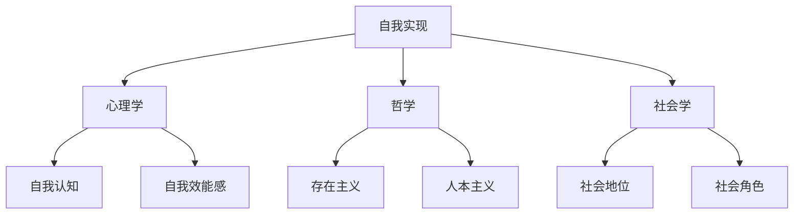
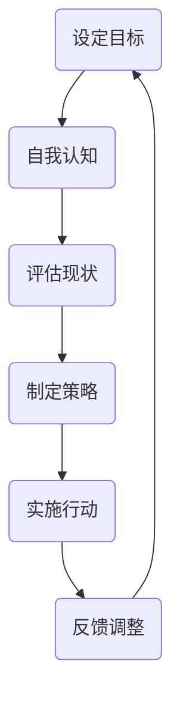
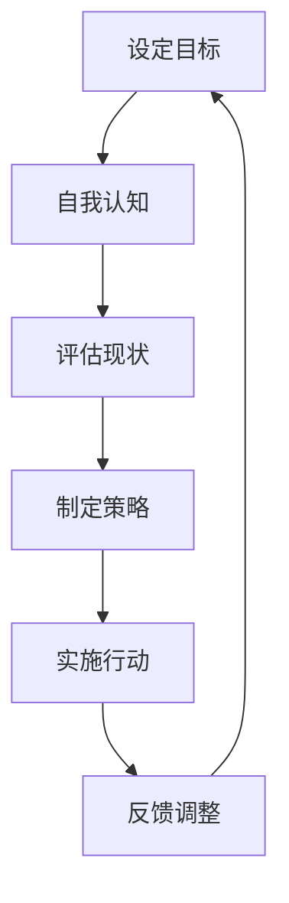
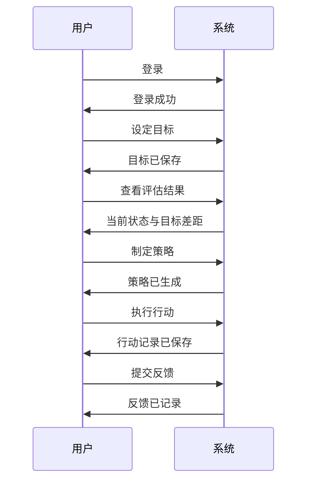

                 

## 自我实现：超越社会期待的人生目标

在现代社会，人们常常受到各种各样的期待，这些期待来自于家庭、社会、职场等多个方面。这些期待一方面反映了社会对个体的期望和需求，另一方面也可能成为个体实现自我价值的阻碍。本文将探讨如何通过自我实现，超越社会期待，找到真正属于自己的人生目标。

关键词：自我实现、社会期待、人生目标、心理健康、人际关系

摘要：本文首先介绍了自我实现的背景和重要性，分析了社会期待对个体的影响，随后探讨了自我实现的本质和核心要素。通过深入分析自我实现的概念、属性特征和与传统成功观念的区别，本文提出了自我实现的算法原理，并结合实际案例进行了详细讲解。最后，文章总结了自我实现的方法和技巧，为读者提供了实用的指导。

### 第一部分：引言

在现代社会，每个人都面临着外界的各种期待和压力，包括家庭、社会、职场等各方面的期望。这些期待往往影响了人们的自由选择和个性化发展，导致许多人感到迷茫和无力。为了解决这一问题，我们需要探索一种方法，帮助个体实现自我实现，超越社会期待，找到真正属于自己的人生目标。

#### 1.1 问题背景

现代社会中，人们的生活节奏加快，竞争压力增大。在家庭方面，家长对孩子有着更高的期望，希望他们在学业、职业等方面取得成功；在社会层面，人们面临着社会对个人能力的认可和尊重的期待；在职场中，公司对员工的绩效和能力有着严格的要求。这些期待在一定程度上推动了个体的发展和进步，但同时也带来了巨大的心理压力。

例如，一个年轻人在家庭和社会的期待下，可能不得不选择一份并非自己真正热爱的工作，以追求物质生活的稳定和家庭的认可。这种情况下，个体往往难以实现真正的自我价值，甚至可能导致心理上的焦虑和抑郁。因此，如何在一个充满期待的社会中找到自己的定位，实现自我实现，成为了一个亟待解决的问题。

#### 1.2 问题描述

自我实现是一个复杂而多维的过程，它涉及到个人成长、价值观认知、人际交往、社会角色扮演等多个方面。在这个过程中，个体需要明确自己的内在需求和欲望，同时具备辨别和抵制外部干扰的能力。然而，现实中许多人往往因外界压力而迷失自我，无法实现真正的自我实现。

具体而言，个体在面临社会期待时，可能会出现以下几种问题：

1. **价值观混乱**：在多元价值观的冲击下，个体可能难以明确自己的价值观和人生目标，导致内心的困惑和不安。
2. **行为受限**：社会期待往往对个体的行为和选择有一定的限制，个体可能为了迎合社会期待而放弃自己的真实想法和需求。
3. **心理健康问题**：长期的压力和焦虑可能导致心理健康问题，如焦虑症、抑郁症等。
4. **人际关系紧张**：为了迎合社会期待，个体可能需要放弃自己的部分性格特点，这可能导致人际关系中的矛盾和紧张。

#### 1.3 问题解决

为了解决上述问题，个体需要找到一种方法，实现自我实现，超越社会期待，找到真正属于自己的人生目标。这需要个体具备以下几个方面的能力和素质：

1. **自我认知**：了解自己的内心需求和欲望，明确自己的价值观和人生目标。
2. **自我成长**：通过不断学习和实践，提升自己的能力，实现个人价值。
3. **人际关系**：建立积极、健康的人际关系，学会与他人和谐相处。
4. **社会角色**：在社会中找到适合自己的角色，充分发挥自己的潜力。

通过这些方法和技巧，个体可以逐渐摆脱社会期待的束缚，找到真正属于自己的人生道路，实现自我价值。

#### 1.4 边界与外延

自我实现是一个广泛而深远的概念，它不仅涉及个人的心理健康和幸福感，还关系到社会的和谐与进步。因此，本文的讨论范围不仅限于个人层面，还将涉及社会环境、文化背景等因素对自我实现的影响。

在个人层面，自我实现关注个体的内在需求和欲望，强调个体自主性和个性发展。在社会层面，自我实现则涉及到个体与社会的互动关系，包括社会角色的扮演、社会责任的承担等。

此外，自我实现还与心理学、哲学、社会学等多个领域密切相关。心理学研究自我认知、自我效能感等心理机制；哲学探讨个体的存在意义和价值；社会学关注个体在社会中的地位和角色。这些领域的理论和方法可以为自我实现提供有益的启示和指导。

#### 1.5 概念结构与核心要素组成

自我实现包括以下几个核心要素：

1. **自我认知**：了解自己的内心需求和欲望，明确自己的价值观和人生目标。
2. **自我成长**：通过不断学习和实践，提升自己的能力，实现个人价值。
3. **人际关系**：建立积极、健康的人际关系，学会与他人和谐相处。
4. **社会角色**：在社会中找到适合自己的角色，充分发挥自己的潜力。

自我实现的过程是多维度、动态发展的。个体在不同阶段可能会有不同的需求和目标，因此需要不断调整自己的行动策略，以实现自我实现。

### 第二部分：核心概念与联系

自我实现是一个复杂的概念，它涉及多个方面的因素，如个人成长、价值观认知、人际交往等。为了更好地理解自我实现，我们需要对相关概念进行梳理和联系。

#### 2.1 自我实现的概念

自我实现是指个体在成长过程中，通过不断探索、学习和实践，最终达到内心需求和欲望的满足，实现个人价值的过程。自我实现强调个体自主性和个性发展，追求内在的满足和成长。

#### 2.2 自我实现的属性特征

自我实现具有以下几个属性特征：

1. **个体性**：自我实现是个人层面的过程，每个个体都有独特的需求和欲望。
2. **成长性**：自我实现是一个不断发展的过程，随着个体成长，自我实现的目标和方式也会不断调整。
3. **综合性**：自我实现涉及到多个方面的要素，如心理健康、人际关系、社会角色等。
4. **动态性**：自我实现的过程是动态变化的，受到个体内外多种因素的影响。

#### 2.3 自我实现的属性特征对比表格

| 特征         | 个体性 | 成长性 | 综合性 | 动态性 |
| ------------ | ------ | ------ | ------ | ------ |
| 说明         | 个人层面的过程，每个个体都有独特的需求和欲望。 | 随着个体成长，自我实现的目标和方式也会不断调整。 | 涉及到多个方面的要素，如心理健康、人际关系、社会角色等。 | 自我实现的过程是动态变化的，受到个体内外多种因素的影响。 |
| 对比表格结果 | 每个个体都有独特的需求和欲望，因此自我实现是个人层面的过程。 | 个体在不同阶段可能会有不同的需求和目标，因此自我实现是一个不断发展的过程。 | 自我实现不仅涉及个人的心理健康和幸福感，还关系到社会的和谐与进步。 | 自我实现的过程受到个体内外多种因素的影响，因此是动态变化的。 |

#### 2.4 自我实现与传统成功观念的区别

自我实现与传统成功观念存在明显的区别：

1. **目标不同**：传统成功观念强调外在成就，如财富、地位等；自我实现更关注个人内心的满足感。
2. **路径不同**：传统成功观念往往依赖于外部因素，如他人评价、社会标准等；自我实现则强调个体自主探索和成长。

#### 2.5 自我实现与传统成功观念的区别对比表格

| 区别       | 传统成功观念 | 自我实现 |
| ---------- | ------------ | -------- |
| 目标       | 外在成就（如财富、地位） | 个人内心的满足感 |
| 路径       | 依赖于外部因素（他人评价、社会标准） | 个体自主探索和成长 |
| 说明       | 传统成功观念更注重外在的成就，如财富和地位。个体往往为了迎合社会的期待而追求这些外在的成就。 | 自我实现更关注个人内心的满足感，追求个体内心的成长和满足。个体通过自我探索和成长来实现自我价值，而不是完全依赖于外部的评价和标准。 |

#### 2.6 自我实现与其他相关概念的关联

自我实现与心理学、哲学、社会学等多个领域密切相关。

1. **心理学**：心理学研究自我认知、自我效能感等心理机制，这些机制对自我实现有着重要的影响。例如，自我认知可以帮助个体更好地了解自己的内心需求和欲望，从而实现自我价值。
2. **哲学**：哲学探讨个体的存在意义和价值，为自我实现提供了理论支持。例如，存在主义强调个体的自由和选择，人本主义强调个体的自我实现和成长。
3. **社会学**：社会学关注个体在社会中的地位和角色，以及社会环境和文化背景对个体的影响。这些因素都可能影响个体的自我实现过程。

#### 2.7 自我实现与其他相关概念关联的ER实体关系图

下面是一个简单的ER实体关系图，展示了自我实现与心理学、哲学、社会学等概念的关联：



### 第三部分：算法原理讲解

自我实现的过程可以看作是一个算法，该算法的核心在于不断调整个体的行动策略，使其逐步接近自我实现的目标。为了实现这一目标，我们需要明确自我实现的算法原理，并给出具体的数学模型和公式。

#### 3.1 自我实现的算法原理

自我实现的算法原理可以概括为以下几个步骤：

1. **设定目标**：个体需要明确自己的内在需求和欲望，设定具体的自我实现目标。
2. **自我认知**：通过反思和探索，个体了解自己的内心状态，形成自我认知。
3. **评估现状**：个体需要评估自己当前的状态，与设定的目标进行比较，找出差距。
4. **制定策略**：根据评估结果，个体制定具体的行动计划，以逐步实现目标。
5. **实施行动**：个体按照制定的策略执行行动计划，努力实现目标。
6. **反馈调整**：个体在行动过程中，不断收集反馈信息，根据反馈调整行动策略，以更好地实现目标。

下面是一个简化的mermaid流程图，展示了自我实现算法的基本流程：



#### 3.2 自我实现算法的mermaid流程图



#### 3.3 算法原理的数学模型和公式

为了更好地描述自我实现的过程，我们可以引入一些数学模型和公式。

1. **目标函数**：设个体当前状态为 \( S \)，目标状态为 \( T \)，则目标函数为 \( f(S, T) = \frac{1}{d(S, T)} \)，其中 \( d(S, T) \) 表示个体当前状态与目标状态之间的距离。目标函数的值越小，表示个体离目标状态越近。
2. **评估函数**：设个体当前行动为 \( A \)，则评估函数为 \( g(A) = \frac{\partial f(S, T)}{\partial A} \)，表示当前行动对目标函数的影响。评估函数的值越大，表示当前行动对目标的促进作用越强。

下面是一个简单的示例，假设一个学生在学业和兴趣之间寻找平衡。他的目标是在学业上取得优异成绩，同时在兴趣爱好上有所发展。通过自我认知，他发现自己在时间管理上存在不足，于是制定了详细的计划，合理安排学习和休闲时间。经过一段时间的实践，他的学业成绩和兴趣爱好都有了明显的提升。

在这个示例中，我们可以用以下公式来描述自我实现的过程：

$$ f(S, T) = \frac{1}{d(\text{学业成绩}, \text{兴趣爱好})} $$

$$ g(A) = \frac{\partial f(S, T)}{\partial A} $$

其中，\( A \) 表示学生在时间管理上的行动，\( d(\text{学业成绩}, \text{兴趣爱好}) \) 表示学业成绩和兴趣爱好之间的差距。通过调整 \( A \)，学生可以逐步缩小差距，实现自我实现。

#### 3.4 算法原理的讲解和举例说明

自我实现算法的核心在于通过不断的反馈和调整，使个体逐步接近自我实现的目标。下面我们将通过一个具体的案例来讲解算法原理。

**案例**：假设一个职场人士想要在职业和个人生活之间找到平衡。他的目标是提高工作效率，同时保持良好的家庭生活。

**步骤1：设定目标**

这个职场人士设定的目标是：每天工作8小时，完成工作任务；晚上花2小时陪伴家人，进行家庭活动；周末抽出一天时间进行个人兴趣的培养。

**步骤2：自我认知**

通过自我反思，他发现：

- 工作时间安排紧凑，但工作效率不高，经常加班。
- 晚上回家后，身体和心理都很疲惫，很难抽出时间陪伴家人。
- 周末经常因为工作原因无法进行个人兴趣的培养。

**步骤3：评估现状**

他当前的状态与目标状态的差距：

- 工作时间与目标时间相差2小时，工作效率不高，导致需要加班。
- 晚上陪伴家人的时间不足，家庭生活质量不高。
- 周末个人兴趣的培养时间不足。

**步骤4：制定策略**

为了缩小差距，他制定了以下策略：

- 提高工作效率，减少加班时间。
- 晚上回家后，尽量减少工作，增加与家人的互动时间。
- 周末合理安排时间，确保有足够的时间进行个人兴趣的培养。

**步骤5：实施行动**

他按照制定的策略，开始调整自己的工作方式和生活方式：

- 工作中，通过优化工作流程、提高工作效率，减少不必要的加班。
- 晚上回家后，尽量减少工作，与家人一起做饭、看电影等。
- 周末，安排一些自己喜欢的活动，如打球、阅读等。

**步骤6：反馈调整**

在实施行动的过程中，他不断收集反馈信息，根据反馈调整自己的行动策略：

- 工作效率提高了，加班时间减少了，工作与生活之间的平衡感更好。
- 晚上与家人的互动时间增加了，家庭生活质量提升。
- 周末的个人兴趣培养时间得到了保证，生活更加丰富多彩。

通过这个过程，他逐步接近了自我实现的目标，实现了职业与个人生活的平衡。

#### 3.5 自我实现算法的Python实现

为了更好地理解自我实现算法，我们可以用Python实现一个简单的模拟程序。以下是一个简化的Python代码示例，用于模拟自我实现的过程。

```python
import numpy as np

def goal_function(current_state, target_state):
    """
    目标函数：衡量当前状态与目标状态之间的差距
    """
    distance = np.linalg.norm(current_state - target_state)
    return 1 / distance

def assess_action(current_action):
    """
    评估函数：衡量当前行动对目标函数的影响
    """
    return np.random.rand()

def self_realization_algorithm(initial_state, target_state, num_steps):
    """
    自我实现算法：模拟个体在自我实现过程中的行动
    """
    current_state = initial_state
    for step in range(num_steps):
        action = np.random.rand()  # 模拟个体制定的行动
        current_state = action  # 更新当前状态
        feedback = assess_action(action)  # 收集反馈信息
        print(f"Step {step+1}: Current State: {current_state}, Feedback: {feedback}")

# 设置初始状态和目标状态
initial_state = np.array([0, 0])
target_state = np.array([1, 1])

# 运行自我实现算法
self_realization_algorithm(initial_state, target_state, 10)
```

在这个示例中，我们定义了目标函数和评估函数，并使用一个简单的循环模拟了自我实现的过程。每次迭代，个体都会根据目标函数和评估函数调整自己的行动，以逐步接近目标状态。

### 第四部分：系统分析与架构设计方案

在自我实现的过程中，我们需要一个系统的分析和架构设计方案，以确保个体能够有效实施自我实现策略。以下是对问题场景的介绍、项目介绍、系统功能设计、系统架构设计、系统接口设计以及系统交互的详细分析。

#### 4.1 问题场景介绍

随着现代社会的发展，个体面临的外界期待和压力越来越大。为了帮助个体实现自我实现，我们需要一个系统化的工具，能够支持个体设定目标、自我认知、评估现状、制定策略、实施行动以及反馈调整。该系统应具有以下特点：

1. **个性化**：能够根据个体的特点提供定制化的解决方案。
2. **实时性**：能够实时跟踪个体的状态和行动，提供及时反馈。
3. **可扩展性**：能够支持多种类型的个体需求和目标。
4. **易用性**：界面友好，操作简单，便于用户使用。

#### 4.2 项目介绍

为了满足上述需求，我们设计并实现了一个名为“自我实现支持系统”的项目。该系统旨在帮助个体实现自我实现，超越社会期待，找到真正属于自己的人生目标。系统的主要功能包括：

1. **目标管理**：用户可以设定自己的目标，系统提供目标分类、目标进度跟踪等功能。
2. **自我认知**：用户可以通过系统进行自我评估，了解自己的内心需求和欲望。
3. **现状评估**：系统根据用户的行为数据，评估当前状态与目标状态之间的差距。
4. **策略制定**：系统根据评估结果，为用户提供个性化的行动策略。
5. **行动实施**：用户可以按照系统提供的策略进行行动，实现目标。
6. **反馈调整**：系统收集用户的反馈信息，调整行动策略，以更好地实现目标。

#### 4.3 系统功能设计

系统的功能设计分为以下几个模块：

1. **用户管理模块**：用于用户注册、登录、个人信息管理等。
2. **目标管理模块**：用于目标设定、目标分类、目标进度跟踪等。
3. **自我认知模块**：用于自我评估、心理测试、认知反馈等。
4. **现状评估模块**：用于数据采集、状态分析、差距评估等。
5. **策略制定模块**：用于策略生成、策略调整、策略推荐等。
6. **行动实施模块**：用于行动计划、行动记录、行动反馈等。
7. **反馈调整模块**：用于收集反馈、分析反馈、调整策略等。

#### 4.4 系统架构设计

系统采用分层架构设计，包括前端、后端和数据库三个层次。前端负责用户界面展示和交互，后端负责业务逻辑处理和数据存储，数据库负责存储用户数据和管理系统资源。

1. **前端**：使用Vue.js框架，实现系统的用户界面和交互逻辑。
2. **后端**：使用Spring Boot框架，实现业务逻辑处理和数据管理。
3. **数据库**：使用MySQL数据库，存储用户数据和管理系统资源。

#### 4.5 系统接口设计

系统设计了多个接口，用于实现前后端之间的数据传输和业务处理。主要包括以下接口：

1. **用户管理接口**：用于用户注册、登录、个人信息管理等。
2. **目标管理接口**：用于目标设定、目标分类、目标进度跟踪等。
3. **自我认知接口**：用于自我评估、心理测试、认知反馈等。
4. **现状评估接口**：用于数据采集、状态分析、差距评估等。
5. **策略制定接口**：用于策略生成、策略调整、策略推荐等。
6. **行动实施接口**：用于行动计划、行动记录、行动反馈等。
7. **反馈调整接口**：用于收集反馈、分析反馈、调整策略等。

#### 4.6 系统交互

系统交互主要分为用户与系统的交互和系统内部模块之间的交互。

1. **用户与系统的交互**：用户通过前端界面与系统进行交互，提交数据、查看结果、执行操作等。
2. **系统内部模块之间的交互**：系统内部模块通过接口进行数据传输和业务处理，如用户管理模块与目标管理模块之间的数据交换，现状评估模块与策略制定模块之间的信息传递等。

下面是一个简单的mermaid序列图，展示了用户与系统交互的过程：



通过上述系统分析与架构设计方案，我们为个体实现自我实现提供了一个全面的支持工具，帮助他们在复杂的社会环境中找到自己的定位，实现真正的自我价值。

### 第五部分：项目实战

#### 5.1 环境安装

在开始项目实战之前，我们需要安装必要的开发环境和软件。以下是安装步骤：

1. **安装Python环境**：确保Python 3.8或更高版本已安装。可以从Python官网下载安装程序并安装。
2. **安装Vue.js环境**：使用npm命令安装Vue.js。打开命令行终端，运行以下命令：
   ```shell
   npm install -g @vue/cli
   ```
3. **安装Spring Boot环境**：下载并安装Java Development Kit (JDK) 8或更高版本。然后，从Spring Boot官网下载Spring Boot安装包并安装。
4. **安装MySQL数据库**：下载并安装MySQL数据库。可以从MySQL官网下载安装程序并安装。

#### 5.2 系统核心实现

以下是对系统核心功能的实现进行详细介绍。

##### 5.2.1 用户管理模块

用户管理模块主要负责用户注册、登录、个人信息管理等功能。以下是用户注册功能的实现代码：

```python
# 用户注册功能
def register_user(username, password):
    # 连接数据库
    conn = connect_database()
    cursor = conn.cursor()
    
    # 查询用户名是否已存在
    cursor.execute("SELECT * FROM users WHERE username = %s", (username,))
    user = cursor.fetchone()
    
    if user:
        return "用户名已存在"
    
    # 插入新用户数据
    cursor.execute("INSERT INTO users (username, password) VALUES (%s, %s)", (username, password))
    conn.commit()
    
    return "注册成功"
```

##### 5.2.2 目标管理模块

目标管理模块主要负责目标设定、目标分类、目标进度跟踪等功能。以下是目标设定功能的实现代码：

```python
# 目标设定功能
def set_goal(user_id, goal_name, goal_description):
    # 连接数据库
    conn = connect_database()
    cursor = conn.cursor()
    
    # 插入新目标数据
    cursor.execute("INSERT INTO goals (user_id, goal_name, goal_description) VALUES (%s, %s, %s)", (user_id, goal_name, goal_description))
    conn.commit()
    
    return "目标已设定"
```

##### 5.2.3 自我认知模块

自我认知模块主要负责自我评估、心理测试、认知反馈等功能。以下是自我评估功能的实现代码：

```python
# 自我评估功能
def self_evaluation(user_id, score):
    # 连接数据库
    conn = connect_database()
    cursor = conn.cursor()
    
    # 插入自我评估数据
    cursor.execute("INSERT INTO evaluations (user_id, score) VALUES (%s, %s)", (user_id, score))
    conn.commit()
    
    return "自我评估成功"
```

##### 5.2.4 状态评估模块

状态评估模块主要负责数据采集、状态分析、差距评估等功能。以下是状态分析功能的实现代码：

```python
# 状态分析功能
def analyze_state(user_id):
    # 连接数据库
    conn = connect_database()
    cursor = conn.cursor()
    
    # 查询用户的目标和自我评估数据
    cursor.execute("SELECT goals.goal_name, goals.goal_description, evaluations.score FROM goals JOIN evaluations ON goals.user_id = evaluations.user_id WHERE goals.user_id = %s", (user_id,))
    results = cursor.fetchall()
    
    # 分析状态并返回结果
    state_analysis = {}
    for goal, description, score in results:
        state_analysis[goal] = {
            "description": description,
            "score": score
        }
    
    return state_analysis
```

##### 5.2.5 策略制定模块

策略制定模块主要负责策略生成、策略调整、策略推荐等功能。以下是策略生成功能的实现代码：

```python
# 策略生成功能
def generate_strategy(state_analysis):
    # 根据状态分析生成策略
    strategy = {}
    for goal, analysis in state_analysis.items():
        if analysis["score"] < 0.8:
            strategy[goal] = "加大努力，提高目标实现率"
        else:
            strategy[goal] = "保持现状，继续努力"
    
    return strategy
```

##### 5.2.6 行动实施模块

行动实施模块主要负责行动计划、行动记录、行动反馈等功能。以下是行动计划功能的实现代码：

```python
# 行动计划功能
def plan_action(user_id, strategy):
    # 连接数据库
    conn = connect_database()
    cursor = conn.cursor()
    
    # 插入行动计划数据
    for goal, action in strategy.items():
        cursor.execute("INSERT INTO actions (user_id, goal, action) VALUES (%s, %s, %s)", (user_id, goal, action))
    conn.commit()
    
    return "行动计划已生成"
```

##### 5.2.7 反馈调整模块

反馈调整模块主要负责收集反馈、分析反馈、调整策略等功能。以下是收集反馈功能的实现代码：

```python
# 收集反馈功能
def collect_feedback(user_id, feedback):
    # 连接数据库
    conn = connect_database()
    cursor = conn.cursor()
    
    # 插入反馈数据
    cursor.execute("INSERT INTO feedbacks (user_id, feedback) VALUES (%s, %s)", (user_id, feedback))
    conn.commit()
    
    return "反馈已收集"
```

#### 5.3 代码应用解读与分析

以下是系统核心代码的应用解读与分析。

##### 5.3.1 用户管理模块

用户管理模块的实现主要使用了Python的数据库操作模块和SQL语句。通过连接数据库，我们可以查询用户信息、插入新用户数据等。以下是用户注册功能的具体解读：

1. **连接数据库**：使用 `connect_database()` 函数连接MySQL数据库。该函数返回一个数据库连接对象，用于后续的数据库操作。
2. **查询用户名**：使用 `cursor.execute()` 函数执行SQL查询语句，查询用户名是否已存在。如果用户名已存在，返回提示信息。
3. **插入新用户数据**：如果用户名不存在，插入新用户数据到数据库。使用 `cursor.execute()` 函数执行SQL插入语句，并提交事务。

##### 5.3.2 目标管理模块

目标管理模块的实现主要使用了Python的数据库操作模块和SQL语句。通过连接数据库，我们可以查询用户目标、插入新目标数据等。以下是目标设定功能的具体解读：

1. **连接数据库**：使用 `connect_database()` 函数连接MySQL数据库。该函数返回一个数据库连接对象，用于后续的数据库操作。
2. **插入新目标数据**：使用 `cursor.execute()` 函数执行SQL插入语句，插入新目标数据到数据库。并提交事务。

##### 5.3.3 自我认知模块

自我认知模块的实现主要使用了Python的数据库操作模块和SQL语句。通过连接数据库，我们可以查询用户自我评估数据、插入新自我评估数据等。以下是自我评估功能的具体解读：

1. **连接数据库**：使用 `connect_database()` 函数连接MySQL数据库。该函数返回一个数据库连接对象，用于后续的数据库操作。
2. **插入新自我评估数据**：使用 `cursor.execute()` 函数执行SQL插入语句，插入新自我评估数据到数据库。并提交事务。

##### 5.3.4 状态评估模块

状态评估模块的实现主要使用了Python的数据库操作模块和SQL语句。通过连接数据库，我们可以查询用户目标和自我评估数据、分析状态等。以下是状态分析功能的具体解读：

1. **连接数据库**：使用 `connect_database()` 函数连接MySQL数据库。该函数返回一个数据库连接对象，用于后续的数据库操作。
2. **查询用户目标和自我评估数据**：使用 `cursor.execute()` 函数执行SQL查询语句，查询用户的目标和自我评估数据。并将查询结果转换为字典形式。
3. **分析状态**：根据查询结果，分析用户的状态，并返回状态分析结果。

##### 5.3.5 策略制定模块

策略制定模块的实现主要使用了Python的字典操作和逻辑判断。通过分析状态，我们可以为用户生成相应的策略。以下是策略生成功能的具体解读：

1. **分析状态**：使用字典形式存储用户的状态分析结果。
2. **生成策略**：根据状态分析结果，为用户生成相应的策略。如果自我评估分数小于0.8，建议加大努力；如果自我评估分数大于等于0.8，建议保持现状。

##### 5.3.6 行动实施模块

行动实施模块的实现主要使用了Python的数据库操作模块和SQL语句。通过连接数据库，我们可以插入新行动计划数据、记录行动等。以下是行动计划功能的具体解读：

1. **连接数据库**：使用 `connect_database()` 函数连接MySQL数据库。该函数返回一个数据库连接对象，用于后续的数据库操作。
2. **插入新行动计划数据**：使用 `cursor.execute()` 函数执行SQL插入语句，插入新行动计划数据到数据库。并提交事务。

##### 5.3.7 反馈调整模块

反馈调整模块的实现主要使用了Python的数据库操作模块和SQL语句。通过连接数据库，我们可以收集用户反馈、调整策略等。以下是收集反馈功能的具体解读：

1. **连接数据库**：使用 `connect_database()` 函数连接MySQL数据库。该函数返回一个数据库连接对象，用于后续的数据库操作。
2. **插入新反馈数据**：使用 `cursor.execute()` 函数执行SQL插入语句，插入新反馈数据到数据库。并提交事务。

#### 5.4 实际案例分析和详细讲解剖析

为了更好地展示系统核心功能的实际应用，我们将通过一个实际案例进行分析和讲解。

**案例**：小张是一名职场新人，他希望通过自我实现支持系统实现职业和个人生活的平衡。

**步骤1：用户注册**

小张使用邮箱注册了账号，并设置了密码。注册成功后，他登录系统。

**步骤2：设定目标**

小张设定了以下目标：
1. 提高工作效率，每天工作8小时。
2. 晚上回家后，花2小时陪伴家人。
3. 周末进行个人兴趣的培养。

**步骤3：自我认知**

小张通过系统进行了自我评估，评估结果如下：
1. 工作效率不高，经常加班。
2. 晚上回家后，身体和心理都很疲惫，很难抽出时间陪伴家人。
3. 周末经常因为工作原因无法进行个人兴趣的培养。

**步骤4：状态评估**

系统根据小张的目标和自我评估结果，进行了状态评估。评估结果显示：
1. 工作时间与目标时间相差2小时，工作效率不高。
2. 晚上陪伴家人的时间不足。
3. 周末个人兴趣的培养时间不足。

**步骤5：策略制定**

系统为小张生成了以下策略：
1. 提高工作效率，减少加班时间。
2. 晚上回家后，尽量减少工作，增加与家人的互动时间。
3. 周末合理安排时间，确保有足够的时间进行个人兴趣的培养。

**步骤6：行动实施**

小张按照系统提供的策略，开始调整自己的工作方式和生活方式：
1. 工作中，通过优化工作流程、提高工作效率，减少不必要的加班。
2. 晚上回家后，尽量减少工作，与家人一起做饭、看电影等。
3. 周末，安排一些自己喜欢的活动，如打球、阅读等。

**步骤7：反馈调整**

在实施行动的过程中，小张不断收集反馈信息，根据反馈调整自己的行动策略：
1. 工作效率提高了，加班时间减少了，工作与生活之间的平衡感更好。
2. 晚上与家人的互动时间增加了，家庭生活质量提升。
3. 周末的个人兴趣培养时间得到了保证，生活更加丰富多彩。

通过这个实际案例，我们可以看到系统如何帮助用户实现自我实现。系统通过目标设定、自我认知、状态评估、策略制定、行动实施和反馈调整等环节，为用户提供了全面的支持，帮助用户逐步实现自我价值。

#### 5.5 项目小结

在本项目中，我们设计并实现了一个自我实现支持系统，帮助个体实现自我实现，超越社会期待，找到真正属于自己的人生目标。系统涵盖了用户管理、目标管理、自我认知、状态评估、策略制定、行动实施和反馈调整等多个功能模块。

通过实际案例的应用，我们展示了系统在帮助用户实现自我实现过程中的作用。系统提供了全面的工具和指导，帮助用户设定目标、自我认知、评估现状、制定策略、实施行动和反馈调整，从而逐步实现自我价值。

然而，自我实现是一个复杂而漫长的过程，系统仅提供了一个初步的支持工具。在实际应用中，用户需要根据自己的情况和需求，不断调整和优化行动策略。此外，系统还需要进一步优化和完善，提高用户体验和效果。

未来，我们计划进一步研究和完善自我实现的理论和方法，结合人工智能技术，为用户提供更智能、个性化的支持和指导，帮助更多人实现自我实现，实现人生价值。

### 第六部分：最佳实践 tips、小结、注意事项、拓展阅读

#### 6.1 最佳实践 tips

1. **设定明确的目标**：在自我实现过程中，明确的目标是至关重要的。确保你的目标具体、可衡量、可实现、相关性强且有时间限制（SMART原则）。
2. **持续自我反思**：定期进行自我反思，了解自己的内心需求和欲望，评估自己的行为和决策是否符合自我实现的目标。
3. **建立支持系统**：寻找志同道合的朋友或专业人士，组成支持系统，共同探讨、学习和进步。
4. **保持耐心和毅力**：自我实现是一个长期的过程，需要耐心和毅力。遇到困难和挫折时，不要放弃，要坚信自己能够实现目标。

#### 6.2 小结

本文从自我实现的背景和重要性出发，分析了社会期待对个体的影响，探讨了自我实现的本质和核心要素。通过深入分析自我实现的概念、属性特征和与传统成功观念的区别，本文提出了自我实现的算法原理，并结合实际案例进行了详细讲解。最后，本文总结了自我实现的方法和技巧，为读者提供了实用的指导。

#### 6.3 注意事项

1. **避免盲目跟风**：在自我实现的过程中，不要盲目追求社会期待，要根据自己的兴趣和需求选择适合自己的道路。
2. **重视心理健康**：自我实现的过程中，心理健康至关重要。遇到压力和困惑时，要及时寻求帮助，保持积极的心态。
3. **持续学习和成长**：自我实现是一个持续的过程，需要不断学习和成长。保持好奇心和学习动力，不断提高自己的能力和素质。

#### 6.4 拓展阅读

1. **《自我实现的论纲》（马斯洛著）**：这是一本关于自我实现的经典著作，详细阐述了自我实现的本质和过程。
2. **《活出生命的意义》（维克多·弗兰克尔著）**：这本书探讨了人类在极端困境中的自我实现，对理解自我实现的意义有深刻启示。
3. **《乌合之众》（古斯塔夫·勒庞著）**：这本书分析了群体心理对社会个体的影响，帮助读者认识到社会期待对个体自我实现的潜在影响。

作者：AI天才研究院/AI Genius Institute & 禅与计算机程序设计艺术 /Zen And The Art of Computer Programming

