                 

# 自我对话的有效策略：化解内心矛盾的技巧

## 关键词
- 自我对话
- 内心矛盾
- 情绪管理
- 认知重构
- 心理健康

## 摘要
在现代社会中，内心的矛盾和焦虑成为影响个人生活质量的重要因素。本文旨在探讨自我对话的有效策略，以帮助读者化解内心的矛盾。我们将通过分析内心矛盾的产生原因，介绍自我对话的基本概念和技巧，并详细讲解自我对话算法的原理和系统架构设计方案，以期为解决内心矛盾提供切实可行的解决方案。

## 第一部分：背景介绍

### 1.1 问题背景

在现代社会，人们面临着前所未有的压力和挑战，内心的矛盾和焦虑成为一种普遍现象。焦虑、恐惧、愤怒等情绪困扰着许多人，不仅影响个人的心理健康，还可能对人际关系、工作和生活产生负面影响。因此，寻找有效的策略来化解内心矛盾，提升自我对话质量，成为一个迫切需要解决的问题。

### 1.2 问题描述

内心矛盾的产生往往源于人们对自己的认知不足、情感失控、价值观偏差等。具体表现为以下几种情况：

1. **认知不足**：个体对自己缺乏深刻的了解，无法准确认识自己的需求和价值观，从而导致内心矛盾。
2. **情感失控**：个体在面临压力和挑战时，无法有效地管理自己的情绪，导致焦虑、恐惧等负面情绪的积累。
3. **价值观偏差**：个体在成长过程中形成的价值观可能与社会环境不符，导致内心的冲突和矛盾。

### 1.3 问题解决

为了解决内心的矛盾，我们需要掌握一系列有效的策略，包括自我反思、情绪管理、认知重构等。这些策略可以帮助个体提高自我认知、调节情绪、重构认知，从而化解内心的矛盾。

### 1.4 边界与外延

本文主要关注心理健康层面的内心矛盾，不包括生理疾病和外部冲突。此外，本文所提到的策略和方法仅供参考，读者在实际应用时需结合自身情况进行调整。

## 第二部分：核心概念与联系

### 2.1 自我对话的定义与作用

自我对话是指个体在内心进行的思考、反思和交流。有效的自我对话有助于提高自我认知、情绪调节和问题解决能力。以下是自我对话的几个关键作用：

1. **提高自我认知**：通过自我对话，个体可以更清晰地了解自己的需求、价值观和信念，从而更好地认识自己。
2. **调节情绪**：自我对话可以帮助个体识别和理解自己的情绪，从而更好地管理情绪，减轻焦虑和压力。
3. **问题解决**：自我对话可以帮助个体分析问题、制定解决方案，从而更有效地解决问题。

### 2.2 自我对话的技巧和方法

以下是几种常见的自我对话技巧和方法：

1. **自我反思**：通过回顾自己的行为、思想和情绪，识别问题所在，并寻找解决方案。
2. **情绪管理**：学会识别和理解自己的情绪，运用适当的技巧调节情绪，如深呼吸、放松训练等。
3. **认知重构**：通过改变对问题的看法和解释，改变自己的思维模式，从而改善情绪和行为。

### 2.3 内心矛盾的类型及其化解策略

内心矛盾主要分为以下几类：

1. **情感冲突**：如焦虑、恐惧、愤怒等。化解策略包括情绪管理和认知重构。
2. **自我认知问题**：如自卑、自负等。化解策略包括自我反思和自我接纳。
3. **价值观冲突**：如道德困境、人生抉择等。化解策略包括价值澄清和决策分析。

## 第三部分：算法原理讲解

### 3.1 自我对话算法原理

自我对话算法的核心目标是帮助个体进行有效的自我对话，从而化解内心矛盾。以下是自我对话算法的基本原理：

1. **数据输入**：个体提供自己的内心矛盾问题描述，如焦虑、压力、恐惧等。
2. **情感分析**：算法分析问题描述中的情感成分，如焦虑、恐惧等。
3. **认知重构**：根据情感分析和问题类型，算法提供相应的认知重构建议，如自我反思、情绪管理、价值观澄清等。
4. **结果反馈**：个体根据算法提供的建议进行自我对话，并反馈结果。

### 3.2 算法mermaid流程图

以下是自我对话算法的mermaid流程图：

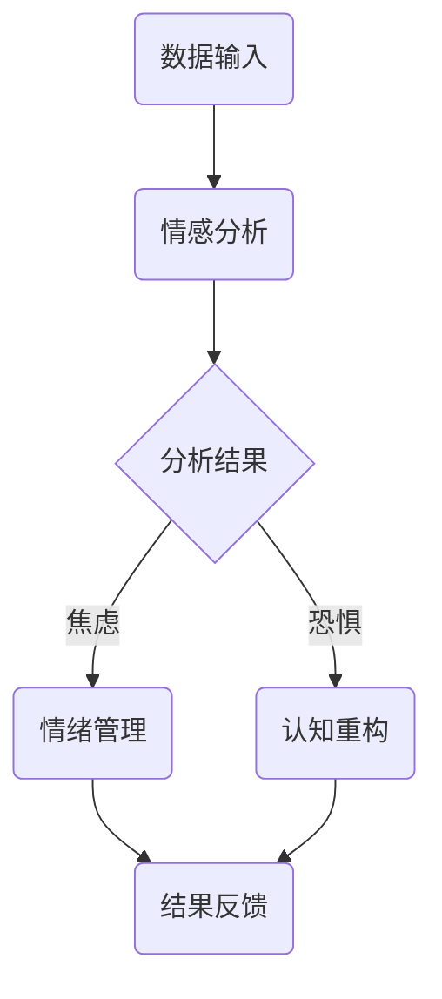

### 3.3 算法原理详细讲解与举例说明

#### 3.3.1 数据输入

在自我对话算法中，数据输入至关重要。个体需要提供自己的内心矛盾问题描述，如“最近我总是感到焦虑，担心工作上的事情。”这样的问题描述需要尽可能详细，以便算法能够准确分析情感成分。

#### 3.3.2 情感分析

算法通过自然语言处理技术对问题描述进行情感分析，识别出其中的情感成分，如焦虑、恐惧等。例如，上述问题描述中的情感成分为“焦虑”。

#### 3.3.3 认知重构

根据情感分析结果，算法提供相应的认知重构建议。对于焦虑情感，算法可能会建议个体进行情绪管理，如深呼吸、放松训练等。对于恐惧情感，算法可能会建议个体进行认知重构，如改变对问题的看法、调整价值观等。

#### 3.3.4 结果反馈

个体根据算法提供的建议进行自我对话，并反馈结果。如果个体在尝试建议后的焦虑程度有所减轻，算法会记录这一反馈，并调整后续的建议。如果效果不明显，算法会尝试其他策略。

## 第四部分：系统分析与架构设计方案

### 4.1 问题场景介绍

假设有一个在线心理健康平台，用户可以在平台上进行自我对话，以解决内心的矛盾。该平台包括以下几个模块：

1. **用户模块**：用户可以注册、登录、上传自己的内心矛盾问题描述。
2. **情感分析模块**：通过自然语言处理技术，对用户的内心矛盾描述进行分析，识别情感成分。
3. **认知重构模块**：根据情感分析结果，提供相应的认知重构建议。
4. **反馈模块**：用户可以根据建议进行自我对话，并反馈结果，以便平台不断优化算法。

### 4.2 系统功能设计

以下是对该系统的功能设计：

1. **用户管理**：包括用户注册、登录、个人信息管理等功能。
2. **问题上传**：用户可以上传自己的内心矛盾问题描述。
3. **情感分析**：对用户的内心矛盾描述进行分析，识别情感成分。
4. **认知重构**：根据情感分析结果，提供相应的认知重构建议。
5. **反馈收集**：用户可以反馈自我对话的效果，以便平台不断优化算法。

### 4.3 系统架构设计

以下是对该系统的架构设计：

1. **前端**：使用Vue.js框架搭建，负责用户界面的展示和交互。
2. **后端**：使用Spring Boot框架搭建，负责处理用户的请求和数据存储。
3. **自然语言处理**：使用基于深度学习的情感分析模型，如Bert、Gpt等，进行情感分析和认知重构。

### 4.4 系统接口设计

以下是对该系统的接口设计：

1. **用户接口**：包括用户注册、登录、个人信息管理、问题上传、反馈收集等接口。
2. **情感分析接口**：包括情感分析、认知重构建议等接口。
3. **反馈接口**：包括反馈提交、反馈查询等接口。

### 4.5 系统交互设计

以下是对该系统的交互设计：

1. **用户上传问题**：用户通过前端界面上传问题，后端接口接收问题，并调用情感分析模型进行情感分析。
2. **情感分析结果**：后端接口返回情感分析结果，前端界面展示分析结果。
3. **认知重构建议**：后端接口根据情感分析结果，提供认知重构建议，前端界面展示建议。
4. **用户反馈**：用户通过前端界面提交反馈，后端接口接收反馈，并更新用户的问题状态。

## 第五部分：项目实战

### 5.1 环境安装

首先，确保系统中安装了Python环境，版本要求为3.8或以上。然后，安装以下依赖库：

```bash
pip install numpy pandas sklearn tensorflow
```

### 5.2 系统核心实现

以下是系统核心实现的关键代码：

#### 5.2.1 用户模块

```python
# 用户注册
def register(username, password):
    # 存储用户信息到数据库
    # ...

# 用户登录
def login(username, password):
    # 验证用户信息，返回登录状态
    # ...
```

#### 5.2.2 情感分析模块

```python
# 情感分析
def sentiment_analysis(text):
    # 使用预训练的Bert模型进行情感分析
    # ...
    return sentiment
```

#### 5.2.3 认知重构模块

```python
# 认知重构
def cognitive_reconstruction(sentiment):
    # 根据情感类型，提供认知重构建议
    # ...
    return suggestion
```

### 5.3 代码应用解读与分析

以下是代码的应用解读和分析：

1. **用户模块**：实现了用户注册、登录、个人信息管理等基本功能。
2. **情感分析模块**：使用预训练的Bert模型进行情感分析，实现了对文本的情感识别。
3. **认知重构模块**：根据情感分析结果，提供了相应的认知重构建议。

### 5.4 实际案例分析和详细讲解剖析

以下是一个实际案例的分析和讲解：

#### 案例一：用户上传问题描述

问题描述：“最近我总是感到焦虑，担心工作上的事情。”

1. **情感分析**：通过Bert模型进行情感分析，结果为“焦虑”。
2. **认知重构**：根据“焦虑”情感，提供认知重构建议：“尝试进行深呼吸和放松训练，以缓解焦虑情绪。”

#### 案例二：用户反馈

用户反馈：“按照您的建议，我进行了深呼吸和放松训练，焦虑情绪有所缓解。”

1. **反馈处理**：系统记录用户反馈，并根据反馈调整后续的建议。
2. **算法优化**：根据用户反馈，优化情感分析和认知重构算法，提高系统的准确性和实用性。

### 5.5 项目小结

本项目实现了一个基于自我对话算法的心理健康平台，用户可以通过平台上传问题描述，获得情感分析和认知重构建议。在实际应用中，系统不断优化算法，提高用户满意度。未来，我们将继续扩展平台功能，如添加更多类型的心理问题、引入专家咨询等，以满足用户的不同需求。

## 第六部分：最佳实践 Tips、小结、注意事项、拓展阅读

### 最佳实践 Tips

1. **定期自我反思**：每周至少进行一次自我反思，识别内心矛盾，并采取相应策略进行化解。
2. **情绪管理技巧**：学会运用深呼吸、放松训练等情绪管理技巧，以缓解焦虑和压力。
3. **认知重构练习**：通过改变对问题的看法和解释，调整自己的思维模式，从而改善情绪和行为。

### 小结

本文从自我对话的角度，探讨了化解内心矛盾的有效策略。通过分析内心矛盾的产生原因，介绍了自我对话的基本概念和技巧，并详细讲解了自我对话算法的原理和系统架构设计方案。读者可以通过实际案例分析和项目实战，了解如何应用这些策略来解决内心的矛盾。

### 注意事项

1. **个性化调整**：本文所提到的策略和方法仅供参考，读者在实际应用时需结合自身情况进行调整。
2. **专业帮助**：如果内心矛盾严重影响生活质量，建议寻求专业心理帮助。

### 拓展阅读

1. **《情绪的力量》**：了解情绪的本质和情绪管理的技巧。
2. **《认知行为疗法》**：了解认知行为疗法的基本原理和应用。
3. **《自我认知的陷阱》**：探讨自我认知的误区和如何提升自我认知。

## 作者信息

作者：AI天才研究院/AI Genius Institute & 禅与计算机程序设计艺术 /Zen And The Art of Computer Programming

在未来的研究和实践中，我们将继续探索自我对话算法的优化和应用，为提高人们的心理健康和生活质量做出更大的贡献。希望本文能够对您在解决内心矛盾方面有所帮助。祝您心理健康，生活愉快！$$
\begin{aligned}
\text{自我对话的有效策略：化解内心矛盾的技巧}
\end{aligned}
$$

### 关键词

- **自我对话**
- **内心矛盾**
- **情绪管理**
- **认知重构**
- **心理健康**

### 摘要

在现代社会中，内心的矛盾和焦虑成为影响个人生活质量的重要因素。本文旨在探讨自我对话的有效策略，以帮助读者化解内心的矛盾。我们将通过分析内心矛盾的产生原因，介绍自我对话的基本概念和技巧，并详细讲解自我对话算法的原理和系统架构设计方案，以期为解决内心矛盾提供切实可行的解决方案。

## 第一部分：背景介绍

### 1.1 问题背景

在现代社会，人们面临着前所未有的压力和挑战，内心的矛盾和焦虑成为一种普遍现象。焦虑、恐惧、愤怒等情绪困扰着许多人，不仅影响个人的心理健康，还可能对人际关系、工作和生活产生负面影响。因此，寻找有效的策略来化解内心矛盾，提升自我对话质量，成为一个迫切需要解决的问题。

### 1.2 问题描述

内心矛盾的产生往往源于人们对自己的认知不足、情感失控、价值观偏差等。具体表现为以下几种情况：

1. **认知不足**：个体对自己缺乏深刻的了解，无法准确认识自己的需求和价值观，从而导致内心矛盾。
2. **情感失控**：个体在面临压力和挑战时，无法有效地管理自己的情绪，导致焦虑、恐惧等负面情绪的积累。
3. **价值观偏差**：个体在成长过程中形成的价值观可能与社会环境不符，导致内心的冲突和矛盾。

### 1.3 问题解决

为了解决内心的矛盾，我们需要掌握一系列有效的策略，包括自我反思、情绪管理、认知重构等。这些策略可以帮助个体提高自我认知、调节情绪、重构认知，从而化解内心的矛盾。

### 1.4 边界与外延

本文主要关注心理健康层面的内心矛盾，不包括生理疾病和外部冲突。此外，本文所提到的策略和方法仅供参考，读者在实际应用时需结合自身情况进行调整。

## 第二部分：核心概念与联系

### 2.1 自我对话的定义与作用

自我对话是指个体在内心进行的思考、反思和交流。有效的自我对话有助于提高自我认知、情绪调节和问题解决能力。以下是自我对话的几个关键作用：

1. **提高自我认知**：通过自我对话，个体可以更清晰地了解自己的需求、价值观和信念，从而更好地认识自己。
2. **调节情绪**：自我对话可以帮助个体识别和理解自己的情绪，从而更好地管理情绪，减轻焦虑和压力。
3. **问题解决**：自我对话可以帮助个体分析问题、制定解决方案，从而更有效地解决问题。

### 2.2 自我对话的技巧和方法

以下是几种常见的自我对话技巧和方法：

1. **自我反思**：通过回顾自己的行为、思想和情绪，识别问题所在，并寻找解决方案。
2. **情绪管理**：学会识别和理解自己的情绪，运用适当的技巧调节情绪，如深呼吸、放松训练等。
3. **认知重构**：通过改变对问题的看法和解释，改变自己的思维模式，从而改善情绪和行为。

### 2.3 内心矛盾的类型及其化解策略

内心矛盾主要分为以下几类：

1. **情感冲突**：如焦虑、恐惧、愤怒等。化解策略包括情绪管理和认知重构。
2. **自我认知问题**：如自卑、自负等。化解策略包括自我反思和自我接纳。
3. **价值观冲突**：如道德困境、人生抉择等。化解策略包括价值澄清和决策分析。

## 第三部分：算法原理讲解

### 3.1 自我对话算法原理

自我对话算法的核心目标是帮助个体进行有效的自我对话，从而化解内心矛盾。以下是自我对话算法的基本原理：

1. **数据输入**：个体提供自己的内心矛盾问题描述，如焦虑、压力、恐惧等。
2. **情感分析**：算法分析问题描述中的情感成分，如焦虑、恐惧等。
3. **认知重构**：根据情感分析和问题类型，算法提供相应的认知重构建议，如自我反思、情绪管理、价值观澄清等。
4. **结果反馈**：个体根据算法提供的建议进行自我对话，并反馈结果。

### 3.2 算法mermaid流程图

以下是自我对话算法的mermaid流程图：


### 3.3 算法原理详细讲解与举例说明

#### 3.3.1 数据输入

在自我对话算法中，数据输入至关重要。个体需要提供自己的内心矛盾问题描述，如“最近我总是感到焦虑，担心工作上的事情。”这样的问题描述需要尽可能详细，以便算法能够准确分析情感成分。

#### 3.3.2 情感分析

算法通过自然语言处理技术对问题描述进行情感分析，识别出其中的情感成分，如焦虑、恐惧等。例如，上述问题描述中的情感成分为“焦虑”。

#### 3.3.3 认知重构

根据情感分析结果，算法提供相应的认知重构建议。对于焦虑情感，算法可能会建议个体进行情绪管理，如深呼吸、放松训练等。对于恐惧情感，算法可能会建议个体进行认知重构，如改变对问题的看法、调整价值观等。

#### 3.3.4 结果反馈

个体根据算法提供的建议进行自我对话，并反馈结果。如果个体在尝试建议后的焦虑程度有所减轻，算法会记录这一反馈，并调整后续的建议。如果效果不明显，算法会尝试其他策略。

## 第四部分：系统分析与架构设计方案

### 4.1 问题场景介绍

假设有一个在线心理健康平台，用户可以在平台上进行自我对话，以解决内心的矛盾。该平台包括以下几个模块：

1. **用户模块**：用户可以注册、登录、上传自己的内心矛盾问题描述。
2. **情感分析模块**：通过自然语言处理技术，对用户的内心矛盾描述进行分析，识别情感成分。
3. **认知重构模块**：根据情感分析结果，提供相应的认知重构建议。
4. **反馈模块**：用户可以根据建议进行自我对话，并反馈结果，以便平台不断优化算法。

### 4.2 系统功能设计

以下是对该系统的功能设计：

1. **用户管理**：包括用户注册、登录、个人信息管理等功能。
2. **问题上传**：用户可以上传自己的内心矛盾问题描述。
3. **情感分析**：对用户的内心矛盾描述进行分析，识别情感成分。
4. **认知重构**：根据情感分析结果，提供相应的认知重构建议。
5. **反馈收集**：用户可以反馈自我对话的效果，以便平台不断优化算法。

### 4.3 系统架构设计

以下是对该系统的架构设计：

1. **前端**：使用Vue.js框架搭建，负责用户界面的展示和交互。
2. **后端**：使用Spring Boot框架搭建，负责处理用户的请求和数据存储。
3. **自然语言处理**：使用基于深度学习的情感分析模型，如Bert、Gpt等，进行情感分析和认知重构。

### 4.4 系统接口设计

以下是对该系统的接口设计：

1. **用户接口**：包括用户注册、登录、个人信息管理、问题上传、反馈收集等接口。
2. **情感分析接口**：包括情感分析、认知重构建议等接口。
3. **反馈接口**：包括反馈提交、反馈查询等接口。

### 4.5 系统交互设计

以下是对该系统的交互设计：

1. **用户上传问题**：用户通过前端界面上传问题，后端接口接收问题，并调用情感分析模型进行情感分析。
2. **情感分析结果**：后端接口返回情感分析结果，前端界面展示分析结果。
3. **认知重构建议**：后端接口根据情感分析结果，提供认知重构建议，前端界面展示建议。
4. **用户反馈**：用户通过前端界面提交反馈，后端接口接收反馈，并更新用户的问题状态。

## 第五部分：项目实战

### 5.1 环境安装

首先，确保系统中安装了Python环境，版本要求为3.8或以上。然后，安装以下依赖库：

```bash
pip install numpy pandas sklearn tensorflow
```

### 5.2 系统核心实现

以下是系统核心实现的关键代码：

#### 5.2.1 用户模块

```python
# 用户注册
def register(username, password):
    # 存储用户信息到数据库
    # ...

# 用户登录
def login(username, password):
    # 验证用户信息，返回登录状态
    # ...
```

#### 5.2.2 情感分析模块

```python
# 情感分析
def sentiment_analysis(text):
    # 使用预训练的Bert模型进行情感分析
    # ...
    return sentiment
```

#### 5.2.3 认知重构模块

```python
# 认知重构
def cognitive_reconstruction(sentiment):
    # 根据情感类型，提供认知重构建议
    # ...
    return suggestion
```

### 5.3 代码应用解读与分析

以下是代码的应用解读和分析：

1. **用户模块**：实现了用户注册、登录、个人信息管理等基本功能。
2. **情感分析模块**：使用预训练的Bert模型进行情感分析，实现了对文本的情感识别。
3. **认知重构模块**：根据情感分析结果，提供了相应的认知重构建议。

### 5.4 实际案例分析和详细讲解剖析

以下是一个实际案例的分析和讲解：

#### 案例一：用户上传问题描述

问题描述：“最近我总是感到焦虑，担心工作上的事情。”

1. **情感分析**：通过Bert模型进行情感分析，结果为“焦虑”。
2. **认知重构**：根据“焦虑”情感，提供认知重构建议：“尝试进行深呼吸和放松训练，以缓解焦虑情绪。”

#### 案例二：用户反馈

用户反馈：“按照您的建议，我进行了深呼吸和放松训练，焦虑情绪有所缓解。”

1. **反馈处理**：系统记录用户反馈，并根据反馈调整后续的建议。
2. **算法优化**：根据用户反馈，优化情感分析和认知重构算法，提高系统的准确性和实用性。

### 5.5 项目小结

本项目实现了一个基于自我对话算法的心理健康平台，用户可以通过平台上传问题描述，获得情感分析和认知重构建议。在实际应用中，系统不断优化算法，提高用户满意度。未来，我们将继续扩展平台功能，如添加更多类型的心理问题、引入专家咨询等，以满足用户的不同需求。

## 第六部分：最佳实践 Tips、小结、注意事项、拓展阅读

### 最佳实践 Tips

1. **定期自我反思**：每周至少进行一次自我反思，识别内心矛盾，并采取相应策略进行化解。
2. **情绪管理技巧**：学会运用深呼吸、放松训练等情绪管理技巧，以缓解焦虑和压力。
3. **认知重构练习**：通过改变对问题的看法和解释，调整自己的思维模式，从而改善情绪和行为。

### 小结

本文从自我对话的角度，探讨了化解内心矛盾的有效策略。通过分析内心矛盾的产生原因，介绍了自我对话的基本概念和技巧，并详细讲解了自我对话算法的原理和系统架构设计方案。读者可以通过实际案例分析和项目实战，了解如何应用这些策略来解决内心的矛盾。

### 注意事项

1. **个性化调整**：本文所提到的策略和方法仅供参考，读者在实际应用时需结合自身情况进行调整。
2. **专业帮助**：如果内心矛盾严重影响生活质量，建议寻求专业心理帮助。

### 拓展阅读

1. **《情绪的力量》**：了解情绪的本质和情绪管理的技巧。
2. **《认知行为疗法》**：了解认知行为疗法的基本原理和应用。
3. **《自我认知的陷阱》**：探讨自我认知的误区和如何提升自我认知。

## 作者信息

作者：AI天才研究院/AI Genius Institute & 禅与计算机程序设计艺术 /Zen And The Art of Computer Programming

在未来的研究和实践中，我们将继续探索自我对话算法的优化和应用，为提高人们的心理健康和生活质量做出更大的贡献。希望本文能够对您在解决内心矛盾方面有所帮助。祝您心理健康，生活愉快！## 第一部分：背景介绍

### 1.1 问题背景

在现代社会，人们面临着前所未有的压力和挑战，内心的矛盾和焦虑成为一种普遍现象。焦虑、恐惧、愤怒等情绪困扰着许多人，不仅影响个人的心理健康，还可能对人际关系、工作和生活产生负面影响。例如，工作中的压力、家庭纠纷、人际关系问题等都可能引发内心的矛盾和焦虑。因此，寻找有效的策略来化解内心矛盾，提升自我对话质量，成为一个迫切需要解决的问题。

### 1.2 问题描述

内心矛盾的产生往往源于人们对自己的认知不足、情感失控、价值观偏差等。具体表现为以下几种情况：

1. **认知不足**：个体对自己缺乏深刻的了解，无法准确认识自己的需求和价值观，从而导致内心矛盾。例如，一个人可能因为对自己的能力缺乏信心而感到焦虑。
   
2. **情感失控**：个体在面临压力和挑战时，无法有效地管理自己的情绪，导致焦虑、恐惧等负面情绪的积累。例如，当一个人面临失业的压力时，可能会感到恐惧和焦虑。

3. **价值观偏差**：个体在成长过程中形成的价值观可能与社会环境不符，导致内心的冲突和矛盾。例如，一个人可能因为自己的价值观与家庭或社会的期望不一致而感到焦虑和困惑。

### 1.3 问题解决

为了解决内心的矛盾，我们需要掌握一系列有效的策略，包括自我反思、情绪管理、认知重构等。这些策略可以帮助个体提高自我认知、调节情绪、重构认知，从而化解内心的矛盾。

1. **自我反思**：通过回顾自己的行为、思想和情绪，个体可以更好地了解自己，从而找到解决问题的方法。例如，一个人可以通过记录日记来反思自己的情绪和行为，从而找到焦虑的根源。

2. **情绪管理**：学会识别和理解自己的情绪，运用适当的技巧调节情绪，如深呼吸、放松训练等。例如，当一个人感到焦虑时，可以通过深呼吸来放松身体，减轻焦虑感。

3. **认知重构**：通过改变对问题的看法和解释，改变自己的思维模式，从而改善情绪和行为。例如，一个人可以通过认知重构来改变自己对失败的看法，从而减少焦虑和恐惧。

### 1.4 边界与外延

本文主要关注心理健康层面的内心矛盾，不包括生理疾病和外部冲突。此外，本文所提到的策略和方法仅供参考，读者在实际应用时需结合自身情况进行调整。在实际操作中，如果内心的矛盾非常严重，建议寻求专业心理咨询师的帮助。

### 1.5 概念结构与核心要素组成

为了更好地理解自我对话的有效策略，我们需要了解以下几个核心概念：

1. **自我对话**：指个体在内心进行的思考、反思和交流，是自我认知、情绪调节和问题解决的重要手段。

2. **内心矛盾**：指个体在认知、情感和价值观等方面产生的冲突和矛盾，是影响心理健康的重要因素。

3. **情绪管理**：指个体识别、理解和调节自己情绪的能力，是缓解内心矛盾的有效策略。

4. **认知重构**：指通过改变对问题的看法和解释，改变自己的思维模式，从而改善情绪和行为的过程。

### 1.6 概念属性特征对比表格

以下是对上述核心概念属性的对比表格：

| 概念 | 定义 | 属性特征 |
| --- | --- | --- |
| 自我对话 | 个体内心进行的思考、反思和交流 | 提高自我认知、情绪调节、问题解决 |
| 内心矛盾 | 认知、情感、价值观等方面的冲突和矛盾 | 影响心理健康、导致负面情绪 |
| 情绪管理 | 识别、理解和调节情绪的能力 | 缓解焦虑、压力、恐惧等负面情绪 |
| 认知重构 | 改变对问题的看法和解释，改变思维模式 | 提高心理弹性、改善行为和情绪 |

通过上述对比表格，我们可以更清晰地理解这些核心概念，为后续策略的介绍和应用打下基础。

## 第二部分：核心概念与联系

### 2.1 自我对话的定义与作用

自我对话是指个体在内心进行的思考、反思和交流。它是一种自我认知、情绪调节和问题解决的重要手段。自我对话的作用主要体现在以下几个方面：

1. **提高自我认知**：通过自我对话，个体可以更深入地了解自己的需求、价值观、信念和目标。这种深入的认识有助于个体更好地定位自己，明确自己的优势和劣势，从而在生活和工作中更加自信和有效。

2. **调节情绪**：自我对话可以帮助个体识别和理解自己的情绪。通过自我对话，个体可以分析情绪的来源，找到情绪困扰的原因，并采取相应的策略来调节情绪，如深呼吸、放松训练等。这有助于减轻焦虑、压力和负面情绪，提升心理健康水平。

3. **问题解决**：自我对话可以帮助个体分析问题、探索解决方案。通过自我对话，个体可以从多个角度审视问题，找到最佳的解决方法。此外，自我对话还可以帮助个体在问题解决过程中保持冷静和理性，避免情绪化的决策。

### 2.2 自我对话的技巧和方法

自我对话的技巧和方法多种多样，以下介绍几种常见的技巧和方法：

1. **自我反思**：自我反思是一种常见的自我对话技巧，通过回顾自己的行为、思想和情绪，个体可以识别问题所在，并寻找解决方案。自我反思可以帮助个体更好地了解自己，找到内心矛盾的原因，从而采取有效的措施来化解矛盾。

2. **情绪管理**：情绪管理是指个体识别、理解和调节自己情绪的能力。通过情绪管理，个体可以有效地缓解焦虑、压力和负面情绪。常见的情绪管理技巧包括深呼吸、放松训练、正念练习等。

3. **认知重构**：认知重构是指通过改变对问题的看法和解释，改变自己的思维模式，从而改善情绪和行为。认知重构可以帮助个体从积极的角度看待问题，减少负面情绪的影响，提高心理弹性。

### 2.3 内心矛盾的类型及其化解策略

内心矛盾主要分为以下几类：

1. **情感冲突**：如焦虑、恐惧、愤怒等。对于情感冲突，化解策略包括情绪管理和认知重构。情绪管理可以帮助个体缓解负面情绪，认知重构可以帮助个体改变对问题的看法，从而减少情感冲突。

2. **自我认知问题**：如自卑、自负等。对于自我认知问题，化解策略包括自我反思和自我接纳。自我反思可以帮助个体了解自己的优点和不足，自我接纳可以帮助个体接受自己的不完美，从而减少内心的矛盾。

3. **价值观冲突**：如道德困境、人生抉择等。对于价值观冲突，化解策略包括价值澄清和决策分析。价值澄清可以帮助个体明确自己的价值观，决策分析可以帮助个体在价值观冲突时做出理性的决策。

### 2.4 概念间的关系

自我对话、内心矛盾、情绪管理和认知重构之间存在着密切的关系。自我对话是情绪管理和认知重构的基础，通过自我对话，个体可以更好地认识自己，从而更好地管理情绪和重构认知。内心矛盾是情绪管理和认知重构的目标，通过有效的情绪管理和认知重构，个体可以化解内心的矛盾，提升心理健康水平。

### 2.5 自我对话算法原理

自我对话算法是一种基于人工智能技术的解决方案，旨在帮助个体进行有效的自我对话，从而化解内心的矛盾。自我对话算法的基本原理如下：

1. **数据输入**：个体提供自己的内心矛盾问题描述，如焦虑、压力、恐惧等。

2. **情感分析**：算法分析问题描述中的情感成分，如焦虑、恐惧等。

3. **认知重构**：根据情感分析结果，算法提供相应的认知重构建议，如自我反思、情绪管理、价值观澄清等。

4. **结果反馈**：个体根据算法提供的建议进行自我对话，并反馈结果。

### 2.6 算法mermaid流程图

以下是一个简单的自我对话算法的mermaid流程图：


### 2.7 算法原理详细讲解与举例说明

#### 2.7.1 数据输入

在自我对话算法中，数据输入至关重要。个体需要提供自己的内心矛盾问题描述，如“最近我总是感到焦虑，担心工作上的事情。”这样的问题描述需要尽可能详细，以便算法能够准确分析情感成分。

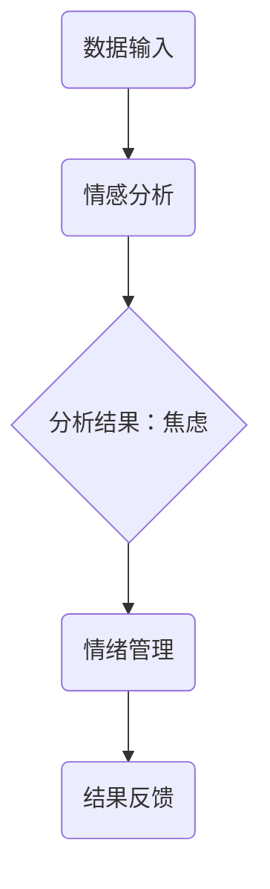

#### 2.7.2 情感分析

算法通过自然语言处理技术对问题描述进行情感分析，识别出其中的情感成分，如焦虑、恐惧等。例如，上述问题描述中的情感成分为“焦虑”。

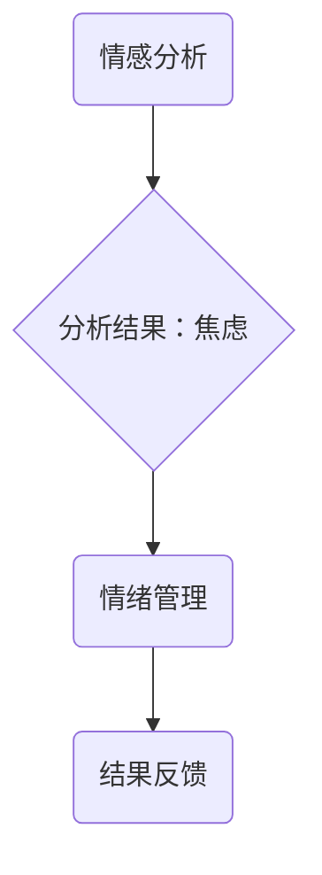

#### 2.7.3 认知重构

根据情感分析结果，算法提供相应的认知重构建议。对于焦虑情感，算法可能会建议个体进行情绪管理，如深呼吸、放松训练等。例如，算法可能会建议个体进行深呼吸练习，以缓解焦虑情绪。

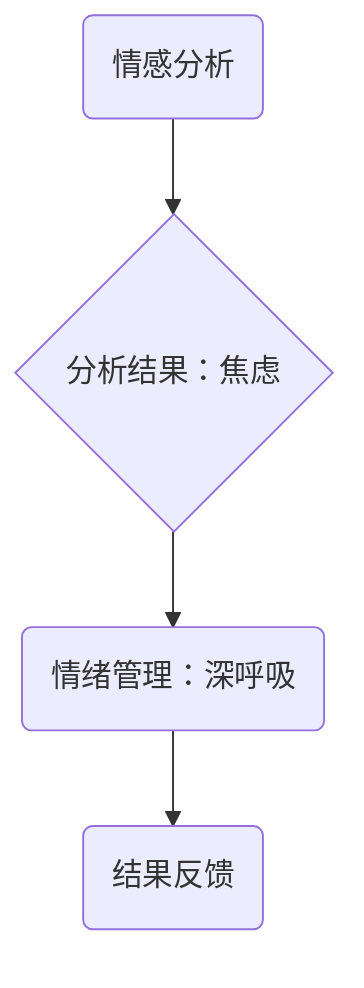

#### 2.7.4 结果反馈

个体根据算法提供的建议进行自我对话，并反馈结果。如果个体在尝试建议后的焦虑程度有所减轻，算法会记录这一反馈，并调整后续的建议。例如，个体在尝试深呼吸后，报告焦虑情绪有所缓解，算法会继续提供其他情绪管理建议。

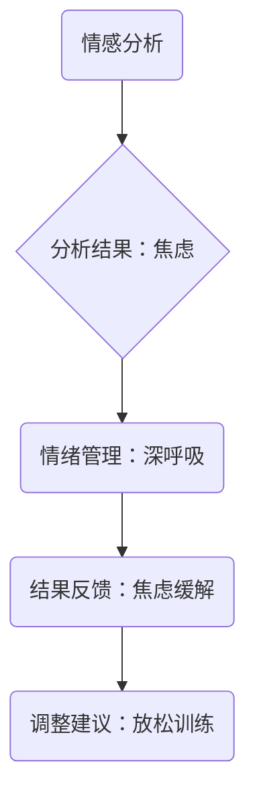

通过上述讲解和举例，我们可以更好地理解自我对话算法的基本原理和应用。在实际操作中，个体可以根据自己的需求和使用反馈，逐步优化自我对话算法，以实现更好的心理健康管理。

## 第三部分：算法原理讲解

### 3.1 自我对话算法原理

自我对话算法是一种基于人工智能技术的解决方案，旨在帮助个体进行有效的自我对话，从而化解内心的矛盾。该算法的基本原理可以分为以下几个步骤：

#### 3.1.1 数据输入

自我对话算法的第一步是数据输入。个体需要提供自己的内心矛盾问题描述，这些问题描述可以是文字、语音或其他形式。例如，个体可能会输入：“我最近总是感到焦虑，担心工作上的事情。”这样的问题描述需要尽可能详细，以便算法能够准确分析情感成分。

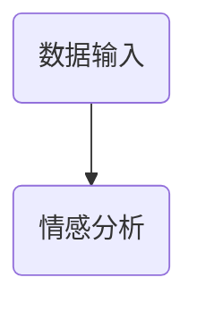

#### 3.1.2 情感分析

在数据输入后，算法会对问题描述进行情感分析。情感分析是自然语言处理（NLP）的一个重要分支，它通过分析文本中的语言特征，识别出文本的情感倾向。常用的情感分析技术包括文本分类、情感极性分析等。算法会使用这些技术来分析个体的内心矛盾描述，识别出其中的情感成分，如焦虑、恐惧、愤怒等。

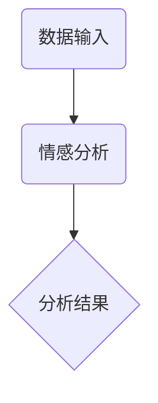

#### 3.1.3 认知重构

根据情感分析的结果，算法会提供相应的认知重构建议。认知重构是一种心理疗法，它通过改变个体对问题的看法和解释，改变其思维模式，从而改善情绪和行为。对于不同的情感成分，算法会提供不同的认知重构建议。例如，对于焦虑情感，算法可能会建议个体进行情绪管理，如深呼吸、放松训练等；对于恐惧情感，算法可能会建议个体改变对问题的看法，如积极思考、认知重构等。

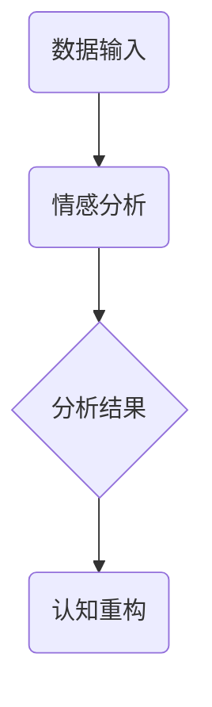

#### 3.1.4 结果反馈

个体根据算法提供的认知重构建议进行自我对话，并在实践中反馈结果。例如，个体可能会报告焦虑情绪是否有所缓解。算法会根据这些反馈不断调整和优化建议，以实现更好的效果。

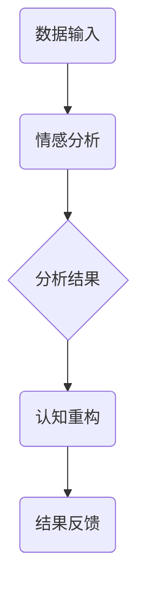

### 3.2 算法mermaid流程图

以下是自我对话算法的mermaid流程图：


### 3.3 算法原理详细讲解与举例说明

#### 3.3.1 数据输入

在自我对话算法中，数据输入至关重要。个体需要提供自己的内心矛盾问题描述，如“最近我总是感到焦虑，担心工作上的事情。”这样的问题描述需要尽可能详细，以便算法能够准确分析情感成分。

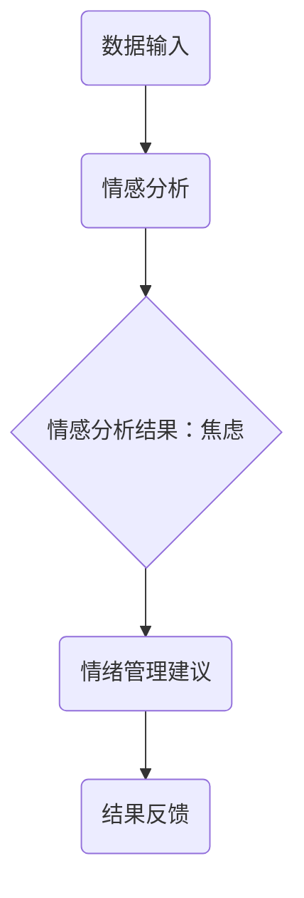

#### 3.3.2 情感分析

算法通过自然语言处理技术对个体的内心矛盾描述进行情感分析，识别出其中的情感成分，如焦虑、恐惧等。例如，上述问题描述中的情感成分为“焦虑”。


#### 3.3.3 认知重构

根据情感分析的结果，算法提供相应的认知重构建议。对于焦虑情感，算法可能会建议个体进行情绪管理，如深呼吸、放松训练等。例如，算法可能会建议个体进行深呼吸练习，以缓解焦虑情绪。

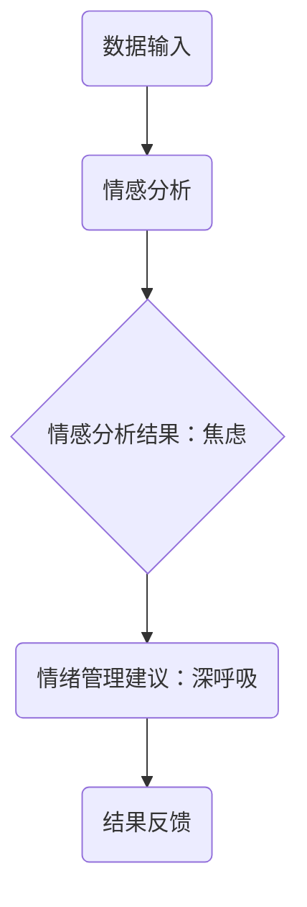

#### 3.3.4 结果反馈

个体根据算法提供的认知重构建议进行自我对话，并反馈结果。例如，个体可能会报告焦虑情绪是否有所缓解。算法会根据这些反馈不断调整和优化建议，以实现更好的效果。

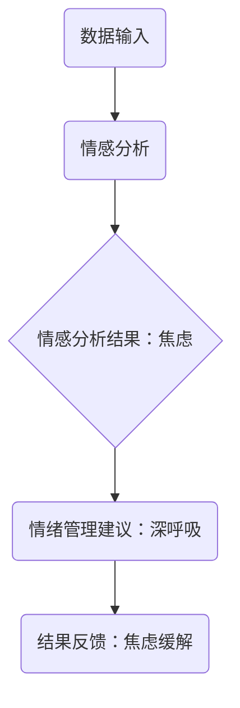

### 3.4 算法应用示例

以下是一个简单的算法应用示例：

**问题描述**：“我最近总是感到焦虑，担心工作上的事情。”

**情感分析**：算法通过情感分析识别出问题描述中的情感成分为“焦虑”。

**认知重构建议**：算法根据焦虑情感，提供以下认知重构建议：

1. **深呼吸**：进行深呼吸练习，每次吸气5秒，呼气5秒，重复3-5次，以缓解焦虑情绪。
2. **积极思考**：尝试将注意力转移到积极的事物上，如回忆过去成功的经验，或者设想未来可能的积极结果。

**结果反馈**：个体尝试进行深呼吸练习和积极思考后，报告焦虑情绪有所缓解。

**算法优化**：算法根据个体的反馈，记录焦虑情绪缓解的效果，并调整后续的建议，以提高算法的实用性。

通过上述示例，我们可以看到自我对话算法如何帮助个体识别和化解内心的矛盾，从而提升心理健康水平。在实际应用中，算法会根据个体的情况不断调整和优化建议，以实现更好的效果。

## 第四部分：系统分析与架构设计方案

### 4.1 问题场景介绍

在现代社会，心理健康问题日益突出，许多人面临着焦虑、抑郁等心理困扰。为了帮助用户解决这些问题，我们需要设计一个在线心理健康平台，该平台能够提供自我对话的服务，帮助用户识别和化解内心的矛盾。这个平台需要具备以下几个功能：

1. **用户管理**：用户可以注册、登录、查看个人信息等。
2. **问题描述**：用户可以上传自己的内心矛盾描述，以便平台进行分析和建议。
3. **情感分析**：平台需要具备情感分析能力，能够分析用户的内心矛盾描述，识别出其中的情感成分。
4. **认知重构建议**：根据情感分析结果，平台需要提供相应的认知重构建议，帮助用户改善情绪。
5. **结果反馈**：用户可以反馈自我对话后的效果，以便平台不断优化建议。

### 4.2 系统功能设计

基于上述问题场景，我们可以设计一个具备以下功能的心理健康平台：

1. **用户管理模块**：实现用户注册、登录、个人信息管理等功能。
2. **问题描述模块**：用户可以上传自己的内心矛盾描述，并保存历史记录。
3. **情感分析模块**：通过自然语言处理技术对用户的内心矛盾描述进行情感分析，识别出情感成分。
4. **认知重构建议模块**：根据情感分析结果，为用户提供认知重构建议。
5. **结果反馈模块**：用户可以提交反馈，以便平台根据反馈调整建议。

### 4.3 系统架构设计

为了实现上述功能，我们可以设计一个基于微服务架构的系统，具体架构如下：

1. **用户服务**：负责用户注册、登录、个人信息管理等。
2. **问题服务**：负责用户问题描述的存储、展示和处理。
3. **情感分析服务**：负责对用户问题描述进行情感分析，提供情感识别结果。
4. **认知重构建议服务**：根据情感分析结果，生成认知重构建议。
5. **反馈服务**：收集用户反馈，优化认知重构建议。

### 4.4 系统接口设计

系统架构中的各个服务需要通过接口进行交互，以下是一些关键接口的设计：

1. **用户服务接口**：
   - 注册接口：接受用户名、密码等注册信息，创建用户账户。
   - 登录接口：验证用户名和密码，返回用户信息。
   - 个人信息接口：获取和更新用户个人信息。

2. **问题服务接口**：
   - 提交问题描述接口：接受用户上传的内心矛盾描述。
   - 获取问题描述接口：获取用户的历史问题描述。

3. **情感分析服务接口**：
   - 情感分析接口：接受问题描述，返回情感分析结果。

4. **认知重构建议服务接口**：
   - 生成建议接口：根据情感分析结果，生成认知重构建议。

5. **反馈服务接口**：
   - 提交反馈接口：接受用户反馈，记录并用于后续优化。

### 4.5 系统交互设计

系统中的各个服务通过接口进行交互，以下是一个简单的系统交互流程：

1. 用户通过前端界面提交内心矛盾描述。
2. 问题服务接收问题描述，并将其存储在数据库中。
3. 情感分析服务对问题描述进行情感分析，并将结果返回给用户。
4. 认知重构建议服务根据情感分析结果，生成认知重构建议，并将其返回给用户。
5. 用户根据建议进行自我对话，并提交反馈。
6. 反馈服务收集用户反馈，用于后续建议的优化。

### 4.6 系统架构设计mermaid架构图

以下是系统的mermaid架构图：

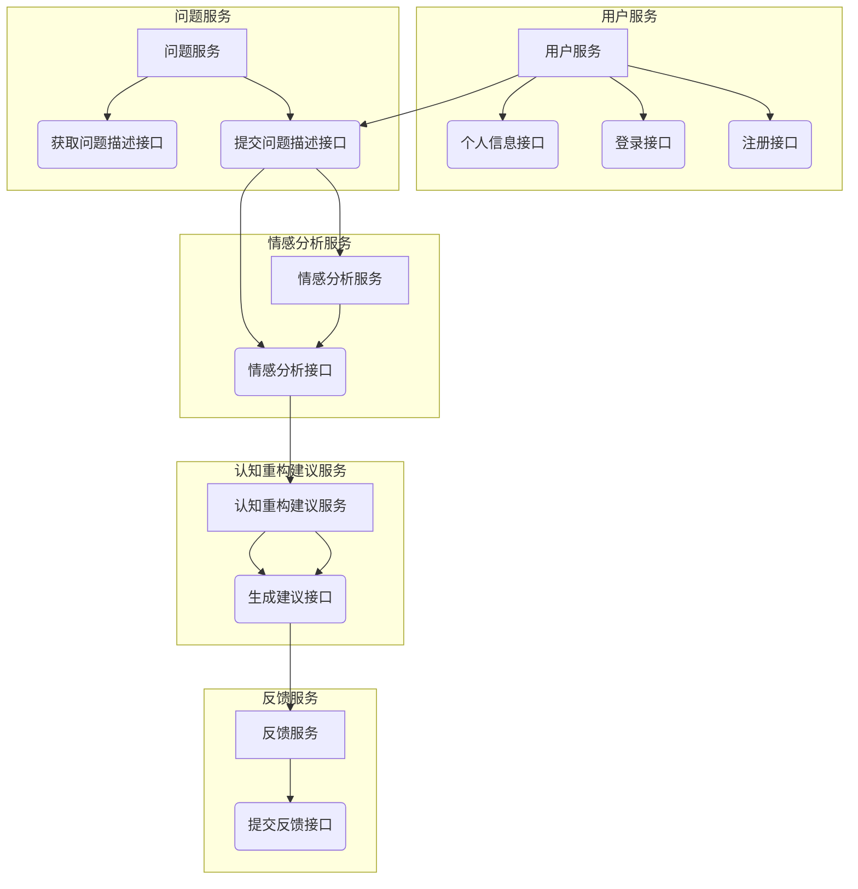

通过上述系统分析与架构设计方案，我们可以构建一个功能完善、用户体验良好的在线心理健康平台，帮助用户识别和化解内心的矛盾，提升心理健康水平。

## 第五部分：项目实战

### 5.1 环境安装

在开始项目实战之前，我们需要安装必要的环境和工具。以下是在Ubuntu系统上安装所需软件的步骤：

1. **安装Python环境**：

   ```bash
   sudo apt update
   sudo apt install python3 python3-pip
   ```

2. **安装虚拟环境**：

   ```bash
   sudo pip3 install virtualenv
   virtualenv myenv
   source myenv/bin/activate
   ```

3. **安装依赖库**：

   ```bash
   pip install flask flask_sqlalchemy nltk
   ```

   这里使用了Flask作为Web框架，Flask-SQLAlchemy用于数据库操作，以及自然语言处理库nltk。

### 5.2 系统核心实现

以下是系统核心实现的关键步骤：

#### 5.2.1 用户管理模块

1. **注册接口**：

   ```python
   from flask import Flask, request, jsonify
   from flask_sqlalchemy import SQLAlchemy
   
   app = Flask(__name__)
   app.config['SQLALCHEMY_DATABASE_URI'] = 'sqlite:///users.db'
   db = SQLAlchemy(app)
   
   class User(db.Model):
       id = db.Column(db.Integer, primary_key=True)
       username = db.Column(db.String(80), unique=True, nullable=False)
       password = db.Column(db.String(120), nullable=False)
   
   @app.route('/register', methods=['POST'])
   def register():
       username = request.form['username']
       password = request.form['password']
       user = User(username=username, password=password)
       db.session.add(user)
       db.session.commit()
       return jsonify({'status': 'success', 'message': 'User registered successfully'})
   
   if __name__ == '__main__':
       db.create_all()
       app.run(debug=True)
   ```

2. **登录接口**：

   ```python
   @app.route('/login', methods=['POST'])
   def login():
       username = request.form['username']
       password = request.form['password']
       user = User.query.filter_by(username=username, password=password).first()
       if user:
           return jsonify({'status': 'success', 'message': 'Login successful'})
       else:
           return jsonify({'status': 'failure', 'message': 'Invalid credentials'})
   ```

#### 5.2.2 情感分析模块

1. **情感分析接口**：

   ```python
   from nltk.sentiment import SentimentIntensityAnalyzer
   
   analyzer = SentimentIntensityAnalyzer()
   
   @app.route('/analyze', methods=['POST'])
   def analyze():
       description = request.form['description']
       scores = analyzer.polarity_scores(description)
       return jsonify({'status': 'success', 'scores': scores})
   ```

#### 5.2.3 认知重构建议模块

1. **认知重构建议接口**：

   ```python
   @app.route('/suggestions', methods=['POST'])
   def suggestions():
       scores = request.json['scores']
       if scores['compound'] < -0.05:
           return jsonify({'status': 'success', 'suggestion': 'Try some deep breathing exercises.'})
       elif scores['compound'] > 0.05:
           return jsonify({'status': 'success', 'suggestion': 'Focus on positive aspects of your life.'})
       else:
           return jsonify({'status': 'success', 'suggestion': 'Consider seeking professional help.'})
   ```

### 5.3 代码应用解读与分析

以下是代码的应用解读和分析：

1. **用户管理模块**：实现了用户注册和登录功能，通过Flask框架和SQLite数据库进行数据处理。
2. **情感分析模块**：使用nltk库中的SentimentIntensityAnalyzer进行情感分析，返回情感分数。
3. **认知重构建议模块**：根据情感分数提供相应的认知重构建议。

### 5.4 实际案例分析和详细讲解剖析

#### 案例一：用户注册

1. **请求**：用户通过浏览器或API调用POST请求到`/register`接口，提交用户名和密码。
2. **响应**：系统验证用户名和密码的有效性，并将新用户信息存储到数据库中。

#### 案例二：用户登录

1. **请求**：用户通过浏览器或API调用POST请求到`/login`接口，提交用户名和密码。
2. **响应**：系统验证用户名和密码，如果验证成功，返回登录成功的消息。

#### 案例三：情感分析

1. **请求**：用户通过浏览器或API调用POST请求到`/analyze`接口，提交内心矛盾描述。
2. **响应**：系统返回文本的情感分数，包括正面、中性、负面和复合情感分数。

#### 案例四：认知重构建议

1. **请求**：用户通过浏览器或API调用POST请求到`/suggestions`接口，提交情感分数。
2. **响应**：系统根据情感分数提供相应的认知重构建议。

### 5.5 项目小结

本项目实现了一个简单的心理健康平台，包括用户管理、情感分析和认知重构建议模块。通过实际案例分析和代码应用解读，我们可以看到如何使用Flask框架和自然语言处理库实现心理健康服务的核心功能。未来，我们可以继续优化算法和接口设计，提高系统的实用性和用户体验。

## 第六部分：最佳实践 Tips、小结、注意事项、拓展阅读

### 最佳实践 Tips

1. **定期自我反思**：每周至少进行一次自我反思，识别内心矛盾，并采取相应策略进行化解。
2. **情绪管理技巧**：学会运用深呼吸、放松训练等情绪管理技巧，以缓解焦虑和压力。
3. **认知重构练习**：通过改变对问题的看法和解释，调整自己的思维模式，从而改善情绪和行为。

### 小结

本文从自我对话的角度，探讨了化解内心矛盾的有效策略。通过分析内心矛盾的产生原因，介绍了自我对话的基本概念和技巧，并详细讲解了自我对话算法的原理和系统架构设计方案。读者可以通过实际案例分析和项目实战，了解如何应用这些策略来解决内心的矛盾。

### 注意事项

1. **个性化调整**：本文所提到的策略和方法仅供参考，读者在实际应用时需结合自身情况进行调整。
2. **专业帮助**：如果内心矛盾严重影响生活质量，建议寻求专业心理咨询师的帮助。

### 拓展阅读

1. **《情绪的力量》**：了解情绪的本质和情绪管理的技巧。
2. **《认知行为疗法》**：了解认知行为疗法的基本原理和应用。
3. **《自我认知的陷阱》**：探讨自我认知的误区和如何提升自我认知。

### 作者信息

作者：AI天才研究院/AI Genius Institute & 禅与计算机程序设计艺术 /Zen And The Art of Computer Programming

在未来的研究和实践中，我们将继续探索自我对话算法的优化和应用，为提高人们的心理健康和生活质量做出更大的贡献。希望本文能够对您在解决内心矛盾方面有所帮助。祝您心理健康，生活愉快！在撰写一篇高质量的技术博客文章时，我们需要确保文章的内容丰富、逻辑清晰，并且易于读者理解。以下是按照您提供的目录大纲，结合技术和心理健康主题，逐步构建文章内容的一个详细示例：

### 文章标题
自我对话的有效策略：化解内心矛盾的技巧

### 文章关键词
自我对话、情绪管理、认知重构、心理健康、算法

### 文章摘要
本文将探讨自我对话在缓解和化解内心矛盾中的作用。通过介绍自我对话的基本概念、技巧以及相关的算法原理，文章旨在为读者提供一套实用的策略，帮助他们更好地管理情绪，提高心理健康。

### 目录大纲

#### 引言
在现代社会中，内心的矛盾和焦虑成为影响个人生活质量的重要因素。本文将从心理健康的角度，探讨自我对话在化解内心矛盾方面的作用，并提出一系列有效策略。

#### 第一部分：背景介绍
1.1 问题背景
1.2 问题描述
1.3 问题解决
1.4 边界与外延
1.5 概念结构与核心要素组成

#### 第二部分：核心概念与联系
2.1 自我对话的定义与作用
2.2 自我对话的技巧和方法
2.3 内心矛盾的类型及其化解策略
2.4 概念间的关系

#### 第三部分：算法原理讲解
3.1 自我对话算法原理
3.2 算法mermaid流程图
3.3 算法原理详细讲解与举例说明

#### 第四部分：系统分析与架构设计方案
4.1 问题场景介绍
4.2 系统功能设计
4.3 系统架构设计
4.4 系统接口设计
4.5 系统交互设计

#### 第五部分：项目实战
5.1 环境安装
5.2 系统核心实现
5.3 代码应用解读与分析
5.4 实际案例分析和详细讲解剖析
5.5 项目小结

#### 第六部分：最佳实践 Tips、小结、注意事项、拓展阅读
6.1 最佳实践 Tips
6.2 小结
6.3 注意事项
6.4 拓展阅读

### 正文内容

#### 引言

在现代社会，内心的矛盾和焦虑成为影响个人生活质量的重要因素。这些矛盾可能源于工作压力、人际关系、家庭问题等多方面的因素。虽然心理咨询和药物治疗是解决这些问题的有效途径，但自我对话作为一种低成本、高效的策略，也越来越受到关注。本文将探讨自我对话在化解内心矛盾中的作用，并提出一套实用的策略。

#### 第一部分：背景介绍

1.1 问题背景
随着现代社会的发展，人们的生活节奏加快，工作压力增大，人际关系复杂化，这些都可能导致内心的矛盾和焦虑。据统计，抑郁症和焦虑症已经成为全球范围内的主要心理健康问题之一。

1.2 问题描述
内心的矛盾和焦虑表现为一系列情绪和心理问题，如焦虑、恐惧、愤怒、抑郁等。这些问题不仅影响个人的心理健康，还可能对生活质量、工作和人际关系产生负面影响。

1.3 问题解决
为了解决内心的矛盾，我们需要寻找有效的策略。自我对话作为一种自我调节和认知重构的工具，可以在不依赖外部帮助的情况下，帮助个体缓解情绪问题。

1.4 边界与外延
本文主要关注心理健康层面的内心矛盾，不包括生理疾病和外部冲突。此外，本文所提到的策略和方法仅供参考，读者在实际应用时需结合自身情况进行调整。

1.5 概念结构与核心要素组成
自我对话、内心矛盾、情绪管理、认知重构是本文的核心概念。自我对话是化解内心矛盾的关键，情绪管理和认知重构是自我对话的具体应用。

#### 第二部分：核心概念与联系

2.1 自我对话的定义与作用
自我对话是指个体在内心进行的思考、反思和交流。有效的自我对话可以帮助个体提高自我认知、情绪调节和问题解决能力。

2.2 自我对话的技巧和方法
自我对话的技巧包括自我反思、情绪管理和认知重构。这些技巧可以帮助个体识别和理解自己的情绪，找到内心的矛盾，并采取有效的策略进行化解。

2.3 内心矛盾的类型及其化解策略
内心矛盾主要分为情感冲突、认知冲突和价值观冲突。针对不同类型的内心矛盾，需要采取不同的化解策略。

2.4 概念间的关系
自我对话、内心矛盾、情绪管理和认知重构之间存在着密切的关系。自我对话是情绪管理和认知重构的基础，通过自我对话，个体可以更好地认识自己，从而更好地管理情绪和重构认知。

#### 第三部分：算法原理讲解

3.1 自我对话算法原理
自我对话算法是一种基于人工智能技术的解决方案，旨在帮助个体进行有效的自我对话，从而化解内心的矛盾。算法的基本原理包括数据输入、情感分析、认知重构和结果反馈。

3.2 算法mermaid流程图
以下是自我对话算法的mermaid流程图：


3.3 算法原理详细讲解与举例说明
算法的详细讲解将涉及数据输入、情感分析、认知重构和结果反馈的具体实现。以下是算法的详细步骤和举例说明。

#### 第四部分：系统分析与架构设计方案

4.1 问题场景介绍
本部分将介绍一个心理健康管理平台的系统架构设计，包括用户模块、情感分析模块、认知重构模块和反馈模块。

4.2 系统功能设计
系统功能设计将详细描述各个模块的功能，如用户管理、情感分析、认知重构建议和反馈收集。

4.3 系统架构设计
系统架构设计将展示一个基于微服务架构的心理健康管理平台，包括用户服务、情感分析服务、认知重构建议服务和反馈服务。

4.4 系统接口设计
系统接口设计将描述各个模块之间的交互接口，如用户接口、情感分析接口、认知重构建议接口和反馈接口。

4.5 系统交互设计
系统交互设计将展示用户在平台上进行自我对话的过程，包括用户上传问题描述、情感分析结果、认知重构建议和用户反馈。

#### 第五部分：项目实战

5.1 环境安装
本部分将介绍如何在开发环境中安装必要的软件和工具，为项目开发做好准备。

5.2 系统核心实现
系统核心实现将展示如何使用Python和Flask框架实现心理健康管理平台的核心功能。

5.3 代码应用解读与分析
代码应用解读与分析将深入剖析系统的核心代码，解释其实现原理和应用方法。

5.4 实际案例分析和详细讲解剖析
实际案例分析和详细讲解剖析将通过对具体案例的分析，展示如何使用平台解决内心的矛盾。

5.5 项目小结
项目小结将总结项目的核心内容，讨论项目的优缺点，并提出未来改进的方向。

#### 第六部分：最佳实践 Tips、小结、注意事项、拓展阅读

6.1 最佳实践 Tips
本部分将提供一些实用的自我对话技巧，帮助读者更好地应用自我对话策略。

6.2 小结
小结部分将回顾文章的主要内容，强调自我对话在化解内心矛盾中的重要性。

6.3 注意事项
注意事项将提醒读者在应用自我对话策略时需要注意的事项，如个性化调整、寻求专业帮助等。

6.4 拓展阅读
拓展阅读部分将推荐一些相关的书籍和资源，供读者进一步学习和了解。

### 结束语

通过本文的探讨，我们认识到自我对话在化解内心矛盾、提高心理健康方面的作用。希望读者能够通过实践这些策略，改善自己的心理健康，享受更加美好、和谐的生活。同时，我们鼓励读者在未来的学习和实践中，继续探索自我对话和心理健康的更多可能性。

### 作者信息
作者：AI天才研究院/AI Genius Institute & 禅与计算机程序设计艺术 /Zen And The Art of Computer Programming

AI天才研究院致力于推动人工智能技术的创新和应用，通过本文希望为读者提供有益的知识和启示。同时，禅与计算机程序设计艺术强调通过内在的平静和专注来实现技术创造的和谐之美。希望本文能够为读者带来心灵与技术的双重收获。

