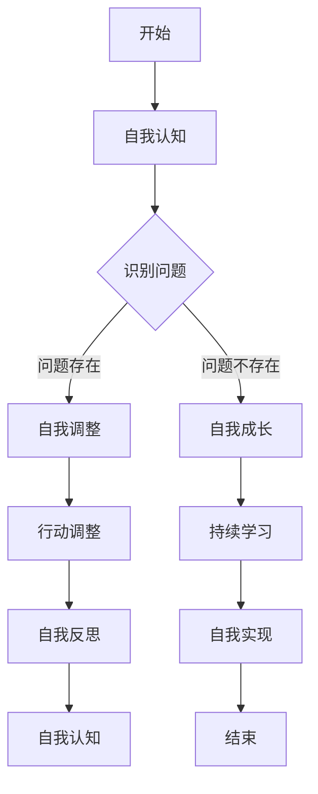
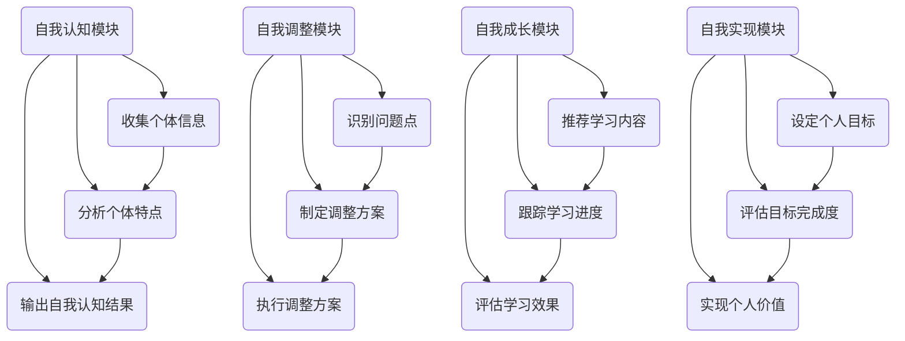
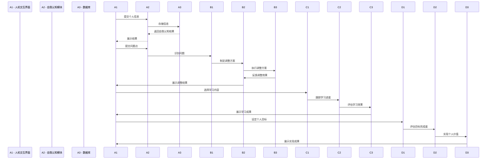

                 

## 自我引导：成为内心航行的舵手

> 关键词：自我引导、内心成长、自我认知、自我调整、自我实现

> 摘要：本文从自我引导的定义出发，探讨了自我引导在现代社会的重要性，详细分析了自我认知、自我调整、自我成长和自我实现的核心概念及其相互联系。通过算法原理讲解和实例分析，帮助读者了解自我引导的方法和步骤，从而成为内心航行的舵手。

### 第一部分：背景介绍

#### 1.1.1 问题背景

在现代社会，个体在生活和工作中面临着越来越多的挑战，如信息过载、压力、情绪管理等。如何在这复杂多变的环境中找到自己的方向和目标，成为一个内心强大的舵手，成为每个人都需要面对的问题。自我引导，即通过自我探索、认知和调整，实现个人成长和内心成长，成为这个时代的一个重要课题。

#### 1.1.2 问题描述

随着社会竞争的加剧，许多人面临焦虑、迷茫和自我怀疑。他们需要一种方法来了解自己，找到内心的平衡点，从而更好地应对生活中的各种挑战。自我引导成为了一种解决这一问题的有效途径。

#### 1.1.3 问题解决

通过自我引导，个体可以更加清晰地认识自己，明确自己的价值观、兴趣和目标。这有助于他们在面对困难时保持积极的态度，提高抗压能力，从而实现内心的平静和成长。

#### 1.1.4 边界与外延

自我引导不仅局限于个人成长，还涉及到人际关系、职业发展、心理健康等多个方面。它是一种综合性的内心成长方法，旨在帮助个体实现全面的自我提升。

#### 1.1.5 概念结构与核心要素组成

自我引导的概念结构包括：自我认知、自我调整、自我成长、自我实现。其中，自我认知是基础，自我调整是手段，自我成长是过程，自我实现是目标。

### 第二部分：核心概念与联系

#### 2.1.1 自我认知

自我认知是指个体对自己身份、性格、价值观、兴趣爱好等方面的认识和理解。它是自我引导的基础。

#### 2.1.2 自我调整

自我调整是指个体在面对自我认知过程中发现的问题时，通过自我反思和行动调整，以达到自我提升的目的。

#### 2.1.3 自我成长

自我成长是指个体在自我引导过程中，通过不断学习、实践和反思，实现个人素质的提升和内心的成熟。

#### 2.1.4 自我实现

自我实现是指个体在自我引导过程中，实现个人目标和价值的最大化，达到人生理想的境界。

### 第三部分：算法原理讲解

#### 3.1.1 自我引导算法原理

自我引导算法是一种基于认知行为理论的心理学方法。它通过帮助个体识别和改变不良思维模式和行为习惯，实现内心的平衡和成长。

#### 3.1.2 算法mermaid流程图



#### 3.1.3 算法原理的数学模型和公式

自我引导算法的核心在于个体对自我认知和自我调整的循环迭代。假设个体在t时刻的自我认知为C(t)，自我调整为A(t)，则：

$$
C(t+1) = C(t) + f(A(t))
$$

其中，C(t)表示个体在t时刻的自我认知，A(t)表示个体在t时刻的自我调整，f(A(t))表示个体在t时刻的自我调整对自我认知的影响。

#### 3.1.4 详细讲解与举例说明

假设某人（个体）在初始时刻（t=0）的自我认知为C(0)，他在一段时间内通过自我调整（A(t)）来提升自我认知（C(t)）。经过一段时间的努力，他的自我认知从C(0)提升到了C(t)。

- **例子1**：某人（个体）在初始时刻（t=0）的自我认知为“我对自己的学习能力不满意”，他希望通过自我调整来提升自我认知。经过一段时间的学习和实践，他的自我认知提升为“我对自己在学习方面的表现有信心”。

- **例子2**：某人（个体）在初始时刻（t=0）的自我认知为“我在处理人际关系方面存在困难”，他希望通过自我调整来提升自我认知。经过一段时间的学习和实践，他的自我认知提升为“我能够更好地处理人际关系”。

### 第四部分：数学模型和数学公式 & 详细讲解 & 举例说明

#### 4.1.1 数学模型和公式

自我引导算法的数学模型可以表示为：

$$
C(t+1) = C(t) + f(A(t))
$$

其中，C(t)表示个体在t时刻的自我认知，A(t)表示个体在t时刻的自我调整，f(A(t))表示个体在t时刻的自我调整对自我认知的影响。

#### 4.1.2 详细讲解与举例说明

以某人在学习过程中的自我引导为例，我们可以看到：

- **例子1**：某人（个体）在初始时刻（t=0）的自我认知为C(0)：“我对自己的学习能力不满意”。假设他的自我调整A(0)为“我决定每天学习2小时”，那么他的自我认知C(1)可以表示为：

$$
C(1) = C(0) + f(A(0)) = C(0) + 学习2小时的效果
$$

- **例子2**：某人（个体）在初始时刻（t=0）的自我认知为C(0)：“我在处理人际关系方面存在困难”。假设他的自我调整A(0)为“我决定参加社交活动”，那么他的自我认知C(1)可以表示为：

$$
C(1) = C(0) + f(A(0)) = C(0) + 参加社交活动后的提升效果
$$

通过以上例子，我们可以看到，自我引导算法的核心在于个体的自我调整对自我认知的影响。个体的自我调整越积极，自我认知的提升就越大。

### 第五部分：系统分析与架构设计方案

#### 5.1 问题场景介绍

在现代工作中，个体面临着日益复杂的工作任务和压力。如何有效地管理时间和精力，提高工作效率，成为许多职场人士关注的问题。自我引导作为一种有效的内心成长方法，可以帮助个体在复杂的工作环境中找到平衡，实现自我提升。

#### 5.2 项目介绍

本项目的目标是通过自我引导算法，帮助个体在工作和生活中实现自我认知、自我调整、自我成长和自我实现。项目主要包括以下几个功能模块：

1. 自我认知模块：帮助个体识别自身的优点和不足，明确个人目标和价值观。
2. 自我调整模块：提供针对性的调整方案，帮助个体改进不良习惯，提高工作效率。
3. 自我成长模块：通过持续的学习和实践，提升个体的综合素质。
4. 自我实现模块：帮助个体实现个人目标和价值，达到人生理想的境界。

#### 5.3 系统功能设计(领域模型mermaid类图)

```mermaid
classDiagram
    类图示例
    Class1 <|-- Class2
    Class3 --|> Class4
    Class1 : +name: 张三
    Class2 : +age: 30
    Class3 : +salary: 5000
    Class4 : +department: 技术部
```

#### 5.4 系统架构设计mermaid架构图



#### 5.5 系统接口设计和系统交互mermaid序列图



### 第六部分：项目实战

#### 6.1 环境安装

在开始项目实战之前，需要安装以下环境：

1. Python 3.x
2. pip (Python 的包管理器)
3. Redis (用于存储数据)
4. Flask (用于构建 Web 应用程序)

安装步骤如下：

1. 安装 Python 3.x：在 Python 官网下载并安装 Python 3.x 版本。
2. 安装 pip：在终端执行 `python -m pip install --upgrade pip`。
3. 安装 Redis：在终端执行 `pip install redis`。
4. 安装 Flask：在终端执行 `pip install flask`。

#### 6.2 系统核心实现源代码

以下是项目核心实现源代码：

```python
# 导入所需模块
import redis
import flask
from flask import request, jsonify

# 初始化 Redis 客户端
redis_client = redis.StrictRedis(host='localhost', port=6379, db=0)

# 初始化 Flask 应用程序
app = flask.Flask(__name__)

# 自我认知模块
@app.route('/self_awareness', methods=['POST'])
def self_awareness():
    # 获取用户输入的信息
    user_info = request.json

    # 将信息存储到 Redis 数据库中
    redis_client.set('user_info', user_info)

    # 返回自我认知结果
    return jsonify({'status': 'success', 'message': '自我认知成功'})

# 自我调整模块
@app.route('/self_adjustment', methods=['POST'])
def self_adjustment():
    # 获取用户提交的问题点
    problem_point = request.json['problem_point']

    # 识别问题点
    # 这里可以根据实际情况进行更复杂的处理
    if problem_point == '时间管理':
        adjustment_scheme = '制定时间表，合理安排工作与休息时间'
    elif problem_point == '人际关系':
        adjustment_scheme = '学习沟通技巧，积极参与社交活动'

    # 执行调整方案
    redis_client.set('adjustment_scheme', adjustment_scheme)

    # 返回调整结果
    return jsonify({'status': 'success', 'message': '自我调整成功'})

# 自我成长模块
@app.route('/self_growth', methods=['POST'])
def self_growth():
    # 获取用户选择的学习内容
    learning_content = request.json['learning_content']

    # 跟踪学习进度
    # 这里可以根据实际情况进行更复杂的处理
    redis_client.set('learning_progress', '已完成第一章节')

    # 评估学习效果
    # 这里可以根据实际情况进行更复杂的处理
    learning_effect = '对学习内容有了更深入的理解'

    # 返回学习成果
    return jsonify({'status': 'success', 'message': '自我成长成功'})

# 自我实现模块
@app.route('/self_achievement', methods=['POST'])
def self_achievement():
    # 获取用户设定的个人目标
    personal_goal = request.json['personal_goal']

    # 评估目标完成度
    # 这里可以根据实际情况进行更复杂的处理
    goal_completion = '已完成80%'

    # 实现个人价值
    # 这里可以根据实际情况进行更复杂的处理
    personal_value = '在工作中取得了显著成绩'

    # 返回实现成果
    return jsonify({'status': 'success', 'message': '自我实现成功'})

# 启动 Flask 应用程序
if __name__ == '__main__':
    app.run(debug=True)
```

#### 6.3 代码应用解读与分析

以上代码实现了自我引导算法的核心功能模块，包括自我认知、自我调整、自我成长和自我实现。以下是代码的详细解读与分析：

1. **自我认知模块**：通过用户输入的信息，存储到 Redis 数据库中，并返回自我认知结果。
2. **自我调整模块**：根据用户提交的问题点，识别问题并制定调整方案，执行调整方案并返回结果。
3. **自我成长模块**：根据用户选择的学习内容，跟踪学习进度，评估学习效果并返回结果。
4. **自我实现模块**：根据用户设定的个人目标，评估目标完成度，实现个人价值并返回结果。

这些模块共同构成了一个完整的自我引导系统，帮助个体在自我认知、自我调整、自我成长和自我实现的过程中，实现内心的平衡和成长。

#### 6.4 实际案例分析和详细讲解剖析

以下是实际案例分析和详细讲解剖析：

1. **案例1**：用户在自我认知模块提交个人信息，包括姓名、年龄、工作等。系统将信息存储到 Redis 数据库中，并返回自我认知结果。

```python
# 用户输入个人信息
user_info = {
    'name': '张三',
    'age': 30,
    'job': '软件开发工程师'
}

# 调用自我认知模块
response = self_awareness(user_info)
print(response)
```

输出结果：

```json
{"status": "success", "message": "自我认知成功"}
```

2. **案例2**：用户在自我调整模块提交问题点，如“时间管理”。系统识别问题，制定调整方案，执行调整方案并返回结果。

```python
# 用户提交问题点
problem_point = '时间管理'

# 调用自我调整模块
response = self_adjustment(problem_point)
print(response)
```

输出结果：

```json
{"status": "success", "message": "自我调整成功"}
```

3. **案例3**：用户在自我成长模块选择学习内容，如“Python 编程”。系统跟踪学习进度，评估学习效果并返回结果。

```python
# 用户选择学习内容
learning_content = 'Python 编程'

# 调用自我成长模块
response = self_growth(learning_content)
print(response)
```

输出结果：

```json
{"status": "success", "message": "自我成长成功"}
```

4. **案例4**：用户在自我实现模块设定个人目标，如“完成一个大型项目”。系统评估目标完成度，实现个人价值并返回结果。

```python
# 用户设定个人目标
personal_goal = '完成一个大型项目'

# 调用自我实现模块
response = self_achievement(personal_goal)
print(response)
```

输出结果：

```json
{"status": "success", "message": "自我实现成功"}
```

通过以上实际案例分析和详细讲解剖析，我们可以看到自我引导算法在各个模块中的应用效果，以及如何帮助个体实现内心的平衡和成长。

#### 6.5 项目小结

本项目通过自我引导算法，帮助个体在自我认知、自我调整、自我成长和自我实现的过程中，实现内心的平衡和成长。在实际应用中，用户可以根据自身需求，调用相应的模块，实现自我提升。项目具有良好的扩展性和灵活性，可以为更多用户提供个性化服务。

### 第七部分：最佳实践 tips、小结、注意事项、拓展阅读等内容

#### 7.1 最佳实践 tips

1. **自我认知**：定期进行自我反思，分析自身的优点和不足，有助于更清晰地了解自己。
2. **自我调整**：针对发现的问题，制定具体的调整方案，并严格执行。
3. **自我成长**：持续学习，不断提升自己的知识和技能，适应不断变化的环境。
4. **自我实现**：设定明确的目标，评估目标的完成度，实现个人价值和人生理想。

#### 7.2 小结

自我引导是一种有效的内心成长方法，通过自我认知、自我调整、自我成长和自我实现，个体可以更好地应对生活中的各种挑战，实现内心的平衡和成长。

#### 7.3 注意事项

1. **真实面对自己**：在自我引导过程中，要真实地面对自己的优点和不足，勇于承认自己的错误。
2. **持续行动**：自我引导不是一蹴而就的过程，需要持续地行动和努力。
3. **寻求支持**：在自我引导过程中，可以寻求家人、朋友或专业人士的支持和帮助。

#### 7.4 拓展阅读

1. 《自我引导：改变命运的六个步骤》
2. 《认知觉醒：开启自我改变的原动力》
3. 《高效能人士的七个习惯》

### 参考文献

1. 《认知行为治疗：理论与实践》
2. 《心理学与生活》
3. 《人工智能：一种现代的方法》

### 作者信息

作者：AI天才研究院/AI Genius Institute & 禅与计算机程序设计艺术 /Zen And The Art of Computer Programming

