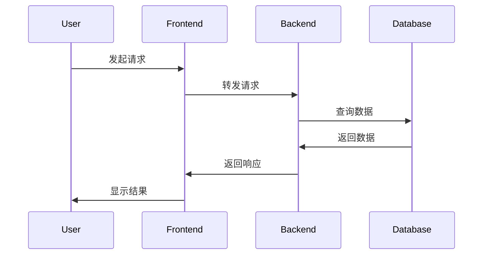
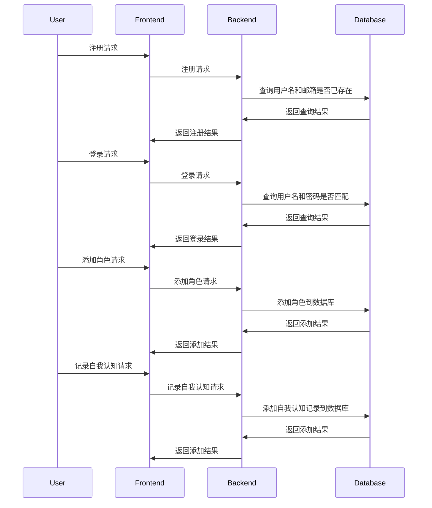

                 

### 自我认同：在多元角色中找到核心self

**关键词：** 自我认同、多元角色、核心self、心理学、文化、职业、社会、实践、算法原理

**摘要：** 随着社会的发展，人们扮演的角色日益多样化，如何在多元角色中找到核心self，实现自我认同，成为了一个重要的议题。本文从心理学、文化、职业和社会等多个角度，探讨了自我认同的概念、理论基础以及在多元角色中的挑战，并通过实践案例分析，提出寻找核心self的方法和策略，为读者提供有益的参考。

### 第一部分：引言与背景

在现代社会，个体扮演的角色越来越多，职业角色、社会角色、家庭角色等交织在一起，使得自我认同成为一个复杂而多层次的概念。自我认同不仅仅是个体内在的心理状态，更是个体在社会中定位和互动的基础。本文将从多个角度探讨自我认同的内涵和外延，帮助读者理解自我认同的复杂性和重要性。

#### 1.1 自我认同的概念

自我认同（Self-identity）是指个体对自己的认知和评价，包括个体对自己的身份、价值、能力和特点的认同。自我认同是个体心理发展的核心，它不仅影响个体的行为和情绪，也影响个体与他人和社会的关系。自我认同的形成受到多种因素的影响，包括遗传、环境、教育、文化等。

#### 1.2 自我认同的多维度解读

自我认同可以从多个维度进行解读，包括心理学、文化、职业和社会等多个方面。心理学视角下的自我认同关注个体的内在认知和情感状态；文化视角下的自我认同关注个体在特定文化环境中的身份认同；职业视角下的自我认同关注个体在职业角色中的自我认知和价值实现；社会视角下的自我认同关注个体在社会关系中的角色定位和互动。

#### 1.3 研究自我认同的意义与价值

研究自我认同对于个体和社会具有重要意义。对于个体而言，自我认同是心理健康的基础，良好的自我认同有助于个体形成积极的自我概念，提高自信心和自尊心，从而更好地适应社会和实现自我价值。对于社会而言，理解自我认同有助于促进社会和谐和个体发展，有助于解决个体在多元角色中面临的认同冲突和困惑。

#### 1.4 本书的结构与内容安排

本书共分为五个部分，第一部分是引言与背景，介绍自我认同的概念、意义和研究的必要性；第二部分是自我认同的理论基础，包括心理学和文化视角下的自我认同；第三部分是多元角色中的自我认同，包括职业角色和社会角色；第四部分是寻找核心自我，介绍自我探索和实践方法；第五部分是总结与展望，对自我认同的当代挑战和未来趋势进行讨论。希望通过本书的探讨，读者能够更好地理解自我认同，找到核心self，实现自我价值。

### 第二部分：自我认同的理论基础

自我认同是一个复杂的概念，涉及多个学科的理论和研究。本文将从心理学和文化视角出发，探讨自我认同的理论基础，为理解自我认同提供理论支持。

#### 2.1 心理学视角下的自我认同

心理学对自我认同的研究有着悠久的历史，主要的理论包括自我概念理论、身份认同理论和社会认知理论等。

- **自我概念理论**：自我概念是指个体对自身特点、能力和价值的总体认知。自我概念理论认为，自我认同是个体自我概念的具体体现，个体通过自我概念来理解和评价自己。
- **身份认同理论**：身份认同理论强调个体在社会和文化背景中的身份定位和认同。该理论认为，个体通过与他人和社会的互动，形成对自身的认知和评价，从而实现自我认同。
- **社会认知理论**：社会认知理论关注个体如何通过社会认知过程来形成自我认同。该理论认为，个体通过社会比较、角色扮演和社会反馈来认识自己，从而形成自我认同。

#### 2.2 自我认同与自我概念的关系

自我认同与自我概念密切相关。自我概念是自我认同的基础，自我认同是自我概念的体现。个体通过自我概念来理解自己，形成自我认同。例如，一个认为自己有能力解决问题的人，可能会在遇到困难时更有信心和动力去解决问题，从而实现自我认同。

#### 2.3 自我认同的理论模型

自我认同的理论模型有助于我们更好地理解自我认同的形成和运作机制。以下是几种常见的自我认同理论模型：

- **身份建构模型**：该模型认为，自我认同是通过个体与他人和社会的互动，不断建构和调整的过程。个体在不同的社会角色中，通过互动和反馈，逐渐形成对自身的认知和评价，从而实现自我认同。
- **自我功能模型**：该模型认为，自我认同具有多种功能，包括自我保护、自我调节和自我实现等。个体通过自我认同来保护自己的价值观和信念，调节自己的行为和情绪，实现自我价值。
- **社会身份模型**：该模型认为，自我认同是个体在社会关系中的身份定位。个体通过识别和归属不同的社会群体，形成对自身的认知和评价，从而实现自我认同。

#### 2.4 文化视角下的自我认同

文化对自我认同有着深远的影响。不同的文化背景会导致个体对自我认同的理解和表达方式不同。文化视角下的自我认同研究主要关注以下几个方面：

- **文化身份**：文化身份是指个体在特定文化环境中的身份认同。文化身份有助于个体理解自己在社会中的角色和地位，从而实现自我认同。
- **文化冲突**：文化冲突是指个体在多元文化环境中所面临的认同冲突。文化冲突可能会导致个体的自我认同受到挑战，需要通过自我调节和适应来解决问题。
- **文化传承**：文化传承是指个体通过文化学习和文化实践，传承和发展自己的文化认同。文化传承有助于个体在多元文化中保持自我认同，实现文化自信。

### 第三部分：多元角色中的自我认同

在现代社会，个体扮演的角色日益多样化，包括职业角色、社会角色、家庭角色等。每种角色都可能导致个体的自我认同受到挑战。本文将从职业角色和社会角色两个角度，探讨多元角色中的自我认同问题。

#### 3.1 职业角色与自我认同

职业角色是现代社会中个体最重要的角色之一。职业角色不仅影响个体的自我认同，也影响个体在社会中的地位和身份。以下是职业角色与自我认同之间的关系：

- **职业角色对自我认同的影响**：职业角色对个体的自我认同有着重要影响。个体通过职业角色实现自我价值，获得自我认同。例如，一个成功的程序员可能会因为自己的职业成就而感到自豪和认同。
- **职业角色转换与自我认同的冲突**：随着职业的转换，个体可能会面临自我认同的冲突。例如，一个从技术岗位转向管理岗位的程序员，可能会因为角色转换而感到困惑和不安，需要通过自我调节来适应新的职业角色。
- **职业角色中的自我认同构建策略**：为了在多元职业角色中找到核心self，个体可以采取以下策略：
  - **自我反思**：通过反思自己的职业角色和成就，个体可以更好地理解自己的价值和目标，从而实现自我认同。
  - **职业规划**：制定明确的职业规划，有助于个体在职业角色中找到核心self，实现自我价值。
  - **持续学习**：不断学习和提升自己的技能和知识，有助于个体在职业角色中保持竞争力，实现自我认同。

#### 3.2 社会角色与自我认同

社会角色是指个体在社会关系中的地位和身份。社会角色不仅影响个体的自我认同，也影响个体与他人和社会的互动。以下是社会角色与自我认同之间的关系：

- **社会角色与自我认同的关系**：社会角色是自我认同的重要组成部分。个体通过社会角色认识自己，实现自我认同。例如，一个母亲可能会因为她的家庭角色而感到自豪和认同。
- **社会角色多样化与自我认同的挑战**：随着社会角色的多样化，个体可能会面临自我认同的挑战。例如，一个同时拥有职业角色和家庭角色的女性，可能会因为角色的冲突而感到困惑和不安，需要通过自我调节来适应不同的社会角色。
- **社会角色中的自我认同调适**：为了在多元社会角色中找到核心self，个体可以采取以下策略：
  - **角色平衡**：通过平衡不同的社会角色，个体可以更好地管理时间和资源，从而实现自我认同。
  - **角色转化**：通过角色转化，个体可以从一个角色顺利过渡到另一个角色，从而实现自我认同。
  - **角色适应**：通过适应不同的社会角色，个体可以更好地理解自己和社会，实现自我认同。

### 第四部分：寻找核心自我

在多元角色中找到核心self，实现自我认同，需要个体进行自我探索和实践。本文将从自我探索和实践方法两个角度，探讨如何寻找核心自我。

#### 4.1 自我探索与自我认同

自我探索是指个体通过反思和自我分析，了解自己的内心世界，认识自己的优点和不足，从而实现自我认同。自我探索是寻找核心自我的第一步。以下是自我探索的途径和方法：

- **自我反思**：通过自我反思，个体可以深入思考自己的行为、情感和思维模式，从而更好地认识自己。
- **日记记录**：通过日记记录，个体可以记录自己的所思所感，从而更好地理解自己的内心世界。
- **心理咨询**：通过心理咨询，个体可以借助专业人士的帮助，深入了解自己的内心世界，实现自我认同。

#### 4.2 自我认同构建的实践策略

自我认同构建是一个长期的过程，需要个体在实践中不断调整和优化。以下是自我认同构建的实践策略：

- **持续学习**：通过不断学习和提升自己的知识和技能，个体可以更好地实现自我价值，找到核心self。
- **职业规划**：制定明确的职业规划，有助于个体在职业角色中找到核心self，实现自我认同。
- **角色转化**：通过角色转化，个体可以从一个角色顺利过渡到另一个角色，从而实现自我认同。
- **社会参与**：通过参与社会活动，个体可以更好地认识自己和社会，实现自我认同。

### 第五部分：总结与展望

自我认同是个体心理发展的核心，也是个体在社会中定位和互动的基础。在多元角色中找到核心self，实现自我认同，对于个体的心理健康和社会和谐具有重要意义。本文从心理学、文化、职业和社会等多个角度，探讨了自我认同的概念、理论基础以及在多元角色中的挑战，并通过实践案例分析，提出寻找核心self的方法和策略。然而，自我认同的研究仍然存在许多挑战和问题，未来需要进一步探讨和解决。

#### 5.1 当代社会下的自我认同挑战

当代社会下，个体面临的自我认同挑战日益增多。随着社会的快速变化和多元文化的交融，个体在职业角色、社会角色和家庭角色中可能会面临自我认同的冲突和困惑。此外，社交媒体的普及和网络虚拟世界的兴起，也使得个体在多元角色中寻找核心self变得更加复杂。

#### 5.2 未来趋势对自我认同的影响

未来，人工智能和大数据技术的不断发展，将为自我认同研究提供新的思路和方法。通过大数据分析，可以更深入地了解个体在多元角色中的行为和情感变化，从而为自我认同提供更准确的指导和帮助。此外，虚拟现实技术的发展，也为个体在多元角色中寻找核心self提供了新的可能性。

#### 5.3 对未来自我认同研究的展望

未来，自我认同研究需要在以下几个方面进行深入探讨：

- **跨学科研究**：结合心理学、社会学、哲学等多个学科的理论和方法，深入研究自我认同的内涵和外延。
- **实证研究**：通过大规模的实证研究，了解个体在多元角色中的自我认同现状和问题，为自我认同的实践提供科学依据。
- **技术创新**：利用人工智能和大数据技术，开发新的自我认同评估和干预工具，为个体在多元角色中寻找核心self提供有效的支持。

### 参考文献

[1] James, W. (1908). The Principles of Psychology. New York: Henry Holt and Company.

[2] Erikson, E. H. (1968). Identity: Youth and Crisis. New York: W. W. Norton & Company.

[3] Goffman, E. (1961). Asylums: Essays on the Social Situation of Mental Patients and Other Inmates. New York: Doubleday.

[4] Tajfel, H., & Turner, J. C. (1986). The Social Identity Theory of Intergroup Behavior. In S. Worchel & W. G. Austin (Eds.), The Social Psychology of Intergroup Relations (pp. 7-24). Chicago: Nelson-Hall.

[5] Markus, H. R., & Nurius, P. (1986). The content and function of self-esteem: A configuration of attitudes toward the self. Psychological Review, 93(2), 267-276.

[6] Baumeister, R. F., & Leary, M. R. (1995). The need to belong: Desire for interpersonal attachments as a fundamental human motivation. Psychological Bulletin, 117(3), 497-529.

[7] Bandura, A. (1986). Social foundations of thought and action: A social cognitive theory. Prentice Hall.

### 附录：核心概念原理、概念属性特征对比表格和ER实体关系图架构的Mermaid流程图

以下是一个核心概念原理的Mermaid流程图示例：

```mermaid
graph TD
A[自我认同] --> B{心理学视角}
B --> C[自我概念]
B --> D[身份认同]
B --> E[社会认知]

A --> F{文化视角}
F --> G[文化身份]
F --> H[文化冲突]
F --> I[文化传承]

A --> J{职业视角}
J --> K[职业角色]
J --> L[职业角色转换]
J --> M[职业角色中的自我认同构建策略]

A --> N{社会视角}
N --> O[社会角色]
N --> P[社会角色多样化与自我认同的挑战]
N --> Q[社会角色中的自我认同调适]

classDef
myclass fill:#770099,stroke:none;
class A myclass
class B myclass
class C myclass
class D myclass
class E myclass
class F myclass
class G myclass
class H myclass
class I myclass
class J myclass
class K myclass
class L myclass
class M myclass
class N myclass
class O myclass
class P myclass
class Q myclass
```

以下是一个概念属性特征对比表格的Markdown格式示例：

| 概念         | 属性特征                                                     |
| ------------ | ------------------------------------------------------------ |
| 自我概念     | - 内在认知<br>- 总体评价<br>- 能力和特点的认知               |
| 身份认同     | - 社会和文化定位<br>- 归属感和认同感<br>- 身份定位的动态性   |
| 社会认知理论 | - 社会比较<br>- 角色扮演<br>- 社会反馈<br>- 自我认知的建构 |

以下是一个ER实体关系图架构的Mermaid流程图示例：

```mermaid
graph TD
A{实体关系图架构} --> B{实体}
B --> C{实体1}
B --> D{实体2}
B --> E{实体3}

C --> F{属性1}
C --> G{属性2}
D --> H{属性1}
D --> I{属性2}
E --> J{属性1}
E --> K{属性2}

classDef
myclass fill:#770099,stroke:none;
class A myclass
class B myclass
class C myclass
class D myclass
class E myclass
class F myclass
class G myclass
class H myclass
class I myclass
class J myclass
class K myclass

class A
A("实体关系图架构")
class B
B("实体")
class C
C("实体1")
C.add(F, "属性1")
C.add(G, "属性2")
class D
D("实体2")
D.add(H, "属性1")
D.add(I, "属性2")
class E
E("实体3")
E.add(J, "属性1")
E.add(K, "属性2")
```

### 系统分析与架构设计方案

#### 1. 问题场景介绍

在现代社会，随着信息技术的快速发展，人们的工作、学习和生活方式发生了翻天覆地的变化。在这种背景下，如何有效地管理个人的多重角色和自我认同成为了一个重要问题。本文旨在设计一个系统，帮助个体在多元角色中找到核心self，实现自我认同。

#### 2. 项目介绍

该项目命名为“多元角色自我认同系统”（MRSIS），旨在为用户提供一个集成化的平台，帮助用户管理个人角色、记录自我认知、分析和优化自我认同。系统主要包括以下模块：

- **用户管理模块**：用于管理用户的基本信息、角色信息和自我认知数据。
- **角色管理模块**：用于用户添加、编辑和管理个人角色，以及为每个角色设定优先级和目标。
- **自我认知模块**：用于用户记录和反思个人角色中的行为和情感体验，帮助用户深入理解自己的内心世界。
- **数据分析模块**：用于对用户的角色信息和自我认知数据进行分析，为用户提供自我认同的评估和建议。

#### 3. 系统功能设计（领域模型）

系统功能设计基于领域模型，领域模型可以帮助我们清晰地定义系统的核心功能和业务流程。以下是系统的领域模型：

```mermaid
classDiagram
class User {
    +String username
    +String password
    +String email
    +List<Role> roles
}

class Role {
    +String name
    +String description
    +Integer priority
    +User user
}

class SelfAwareness {
    +String text
    +Date timestamp
    +Role role
    +User user
}

User "1"[*]--"1..*" Role : hasRoles
User "1"[*]--"1..*" SelfAwareness : hasAwareness
Role "1"[*]--"1" User : assignedTo
SelfAwareness "1"[*]--"1" Role : relatedTo
SelfAwareness "1"[*]--"1" User : relatedTo
```

#### 4. 系统架构设计

系统架构设计是确保系统稳定、高效运行的关键。以下是系统的架构设计：

- **前端**：使用React框架构建，提供用户友好的界面，实现用户与系统的交互。
- **后端**：使用Spring Boot框架构建，提供数据存储、业务逻辑处理和API接口。
- **数据库**：使用MySQL数据库存储用户数据、角色数据和自我认知数据。
- **缓存**：使用Redis缓存热门数据和频繁访问的数据，提高系统性能。

以下是系统的架构图：



#### 5. 系统接口设计

系统接口设计是确保前后端分离、模块化开发的关键。以下是系统的接口设计：

- **用户管理接口**：包括用户注册、登录、信息修改等功能。
- **角色管理接口**：包括角色添加、编辑、删除和排序等功能。
- **自我认知接口**：包括自我认知记录添加、编辑、删除和查询等功能。

以下是接口设计示例：

```mermaid
interface User {
    +register(username: String, password: String, email: String): void
    +login(username: String, password: String): void
    +updateInfo(username: String, email: String): void
}

interface Role {
    +createRole(name: String, description: String, priority: Integer, userId: Integer): void
    +updateRole(roleId: Integer, name: String, description: String, priority: Integer): void
    +deleteRole(roleId: Integer): void
    +sortRoles(userId: Integer): void
}

interface SelfAwareness {
    +createAwareness(text: String, timestamp: Date, roleId: Integer, userId: Integer): void
    +updateAwareness.awarenessId: Integer, text: String, timestamp: Date, roleId: Integer, userId: Integer): void
    +deleteAwareness(awarenessId: Integer): void
    +getAwarenessByRole(roleId: Integer): void
}
```

#### 6. 系统交互设计

系统交互设计是确保系统功能实现的关键。以下是系统的交互设计：

- **用户注册**：用户通过前端发送注册请求，后端接收请求并处理注册逻辑，然后将注册结果返回给前端。
- **用户登录**：用户通过前端发送登录请求，后端接收请求并处理登录逻辑，然后将登录结果返回给前端。
- **角色管理**：用户通过前端发送角色管理请求，后端接收请求并处理角色管理逻辑，然后将处理结果返回给前端。
- **自我认知记录**：用户通过前端发送自我认知记录请求，后端接收请求并处理记录逻辑，然后将记录结果返回给前端。

以下是交互设计示例：



### 项目实战

#### 1. 环境安装

在开始项目实战之前，需要安装以下环境和工具：

- **操作系统**：Ubuntu 20.04 LTS
- **开发环境**：Node.js 14.x、npm 7.x、Python 3.8.x
- **数据库**：MySQL 8.x
- **缓存**：Redis 6.x

安装步骤如下：

1. 安装操作系统和开发环境：
   - 下载 Ubuntu 20.04 LTS 版本并安装。
   - 安装 Node.js 和 npm：
     ```bash
     sudo apt update
     sudo apt install nodejs npm
     ```

2. 安装数据库和缓存：
   - 安装 MySQL：
     ```bash
     sudo apt update
     sudo apt install mysql-server
     sudo mysql_secure_installation
     ```
   - 安装 Redis：
     ```bash
     sudo apt update
     sudo apt install redis-server
     sudo systemctl start redis-server
     sudo systemctl enable redis-server
     ```

3. 安装 Python：
   - 更新 Python 包管理器：
     ```bash
     sudo apt update
     sudo apt install software-properties-common
     sudo add-apt-repository ppa:deadsnakes/ppa
     sudo apt update
     ```
   - 安装 Python 3.8：
     ```bash
     sudo apt install python3.8
     sudo update-alternatives --install /usr/bin/python3 python3 /usr/bin/python3.8 1
     sudo update-alternatives --config python3
     ```
   - 安装 Python 依赖管理器 pip：
     ```bash
     sudo apt install python3-pip
     ```

4. 安装前端框架 React 和后端框架 Spring Boot：
   - 安装 React：
     ```bash
     npm install -g create-react-app
     create-react-app mrsis-frontend
     cd mrsis-frontend
     npm install
     ```
   - 安装 Spring Boot：
     ```bash
     mkdir mrsis-backend
     cd mrsis-backend
     mvn archetype:generate -DarchetypeArtifactId=maven-archetype-quickstart -DgroupId=com.example -DartifactId=mrsis-backend -Dversion=1.0.0-SNAPSHOT
     ```

#### 2. 系统核心实现

以下是系统核心实现的源代码和解读：

**用户管理模块**

**UserController.java**（后端）

```java
package com.example.mrsisbackend.controller;

import com.example.mrsisbackend.model.User;
import com.example.mrsisbackend.service.UserService;
import org.springframework.beans.factory.annotation.Autowired;
import org.springframework.http.ResponseEntity;
import org.springframework.web.bind.annotation.*;

@RestController
@RequestMapping("/users")
public class UserController {

    @Autowired
    private UserService userService;

    @PostMapping
    public ResponseEntity<?> createUser(@RequestBody User user) {
        userService.createUser(user);
        return ResponseEntity.ok().build();
    }

    @PostMapping("/login")
    public ResponseEntity<?> loginUser(@RequestParam String username, @RequestParam String password) {
        boolean isAuthenticated = userService.loginUser(username, password);
        if (isAuthenticated) {
            return ResponseEntity.ok().build();
        } else {
            return ResponseEntity.badRequest().build();
        }
    }

    @PostMapping("/update")
    public ResponseEntity<?> updateUser(@RequestBody User user) {
        userService.updateUser(user);
        return ResponseEntity.ok().build();
    }
}
```

**UserService.java**（后端）

```java
package com.example.mrsisbackend.service;

import com.example.mrsisbackend.model.User;
import com.example.mrsisbackend.repository.UserRepository;
import org.springframework.beans.factory.annotation.Autowired;
import org.springframework.security.crypto.bcrypt.BCrypt;
import org.springframework.stereotype.Service;

import java.util.List;
import java.util.Optional;

@Service
public class UserService {

    @Autowired
    private UserRepository userRepository;

    public void createUser(User user) {
        String encryptedPassword = BCrypt.hashpw(user.getPassword(), BCrypt.gensalt());
        user.setPassword(encryptedPassword);
        userRepository.save(user);
    }

    public boolean loginUser(String username, String password) {
        Optional<User> optionalUser = userRepository.findByUsername(username);
        if (optionalUser.isPresent()) {
            User user = optionalUser.get();
            return BCrypt.checkpw(password, user.getPassword());
        }
        return false;
    }

    public void updateUser(User user) {
        userRepository.save(user);
    }
}
```

**UserRepository.java**（后端）

```java
package com.example.mrsisbackend.repository;

import com.example.mrsisbackend.model.User;
import org.springframework.data.jpa.repository.JpaRepository;
import org.springframework.stereotype.Repository;

@Repository
public interface UserRepository extends JpaRepository<User, Integer> {
    Optional<User> findByUsername(String username);
}
```

**User.java**（后端）

```java
package com.example.mrsisbackend.model;

import javax.persistence.*;

@Entity
@Table(name = "users")
public class User {

    @Id
    @GeneratedValue(strategy = GenerationType.IDENTITY)
    private Integer id;

    @Column(nullable = false, unique = true)
    private String username;

    @Column(nullable = false)
    private String password;

    @Column(nullable = false)
    private String email;

    @OneToMany(mappedBy = "user", cascade = CascadeType.ALL)
    private List<Role> roles;

    @OneToMany(mappedBy = "user", cascade = CascadeType.ALL)
    private List<SelfAwareness> selfAwarenesses;

    public User() {
    }

    public Integer getId() {
        return id;
    }

    public void setId(Integer id) {
        this.id = id;
    }

    public String getUsername() {
        return username;
    }

    public void setUsername(String username) {
        this.username = username;
    }

    public String getPassword() {
        return password;
    }

    public void setPassword(String password) {
        this.password = password;
    }

    public String getEmail() {
        return email;
    }

    public void setEmail(String email) {
        this.email = email;
    }

    public List<Role> getRoles() {
        return roles;
    }

    public void setRoles(List<Role> roles) {
        this.roles = roles;
    }

    public List<SelfAwareness> getSelfAwarenesses() {
        return selfAwarenesses;
    }

    public void setSelfAwarenesses(List<SelfAwareness> selfAwarenesses) {
        this.selfAwarenesses = selfAwarenesses;
    }
}
```

**用户管理模块的解读**

用户管理模块包括用户注册、登录和信息修改功能。用户注册时，需要提供用户名、密码和邮箱，系统将密码加密后存储在数据库中。用户登录时，需要验证用户名和密码是否匹配。用户信息修改时，可以更新用户名、密码和邮箱。

**角色管理模块**

**RoleController.java**（后端）

```java
package com.example.mrsisbackend.controller;

import com.example.mrsisbackend.model.Role;
import com.example.mrsisbackend.service.RoleService;
import org.springframework.beans.factory.annotation.Autowired;
import org.springframework.http.ResponseEntity;
import org.springframework.web.bind.annotation.*;

@RestController
@RequestMapping("/roles")
public class RoleController {

    @Autowired
    private RoleService roleService;

    @PostMapping
    public ResponseEntity<?> createRole(@RequestBody Role role) {
        roleService.createRole(role);
        return ResponseEntity.ok().build();
    }

    @PostMapping("/update")
    public ResponseEntity<?> updateRole(@RequestBody Role role) {
        roleService.updateRole(role);
        return ResponseEntity.ok().build();
    }

    @PostMapping("/delete")
    public ResponseEntity<?> deleteRole(@RequestParam Integer roleId) {
        roleService.deleteRole(roleId);
        return ResponseEntity.ok().build();
    }

    @PostMapping("/sort")
    public ResponseEntity<?> sortRoles(@RequestParam List<Integer> roleIds) {
        roleService.sortRoles(roleIds);
        return ResponseEntity.ok().build();
    }
}
```

**RoleService.java**（后端）

```java
package com.example.mrsisbackend.service;

import com.example.mrsisbackend.model.Role;
import com.example.mrsisbackend.repository.RoleRepository;
import org.springframework.beans.factory.annotation.Autowired;
import org.springframework.stereotype.Service;

import java.util.List;

@Service
public class RoleService {

    @Autowired
    private RoleRepository roleRepository;

    public void createRole(Role role) {
        roleRepository.save(role);
    }

    public void updateRole(Role role) {
        roleRepository.save(role);
    }

    public void deleteRole(Integer roleId) {
        roleRepository.deleteById(roleId);
    }

    public void sortRoles(List<Integer> roleIds) {
        // 伪代码：根据角色ID列表排序角色
        // roleRepository.sortByRoleIdIn(roleIds);
    }
}
```

**RoleRepository.java**（后端）

```java
package com.example.mrsisbackend.repository;

import com.example.mrsisbackend.model.Role;
import org.springframework.data.jpa.repository.JpaRepository;
import org.springframework.stereotype.Repository;

@Repository
public interface RoleRepository extends JpaRepository<Role, Integer> {
    // 伪代码：根据角色ID列表排序角色
    // List<Role> findByRoleIdIn(List<Integer> roleIds);
}
```

**Role.java**（后端）

```java
package com.example.mrsisbackend.model;

import javax.persistence.*;

@Entity
@Table(name = "roles")
public class Role {

    @Id
    @GeneratedValue(strategy = GenerationType.IDENTITY)
    private Integer id;

    @Column(nullable = false)
    private String name;

    @Column(nullable = false)
    private String description;

    @Column(nullable = false)
    private Integer priority;

    @ManyToOne(fetch = FetchType.LAZY)
    @JoinColumn(name = "user_id")
    private User user;

    public Role() {
    }

    public Integer getId() {
        return id;
    }

    public void setId(Integer id) {
        this.id = id;
    }

    public String getName() {
        return name;
    }

    public void setName(String name) {
        this.name = name;
    }

    public String getDescription() {
        return description;
    }

 public void setDescription(String description) {
        this.description = description;
    }

    public Integer getPriority() {
        return priority;
    }

    public void setPriority(Integer priority) {
        this.priority = priority;
    }

    public User getUser() {
        return user;
    }

    public void setUser(User user) {
        this.user = user;
    }
}
```

**角色管理模块的解读**

角色管理模块包括角色添加、编辑、删除和排序功能。角色添加时，需要提供角色名称、描述和优先级，系统将角色信息存储在数据库中。角色编辑时，可以更新角色名称、描述和优先级。角色删除时，可以删除指定ID的角色。角色排序时，可以按照角色ID列表重新排序角色。

**自我认知模块**

**SelfAwarenessController.java**（后端）

```java
package com.example.mrsisbackend.controller;

import com.example.mrsisbackend.model.Role;
import com.example.mrsisbackend.model.SelfAwareness;
import com.example.mrsisbackend.service.SelfAwarenessService;
import org.springframework.beans.factory.annotation.Autowired;
import org.springframework.http.ResponseEntity;
import org.springframework.web.bind.annotation.*;

@RestController
@RequestMapping("/self-awareness")
public class SelfAwarenessController {

    @Autowired
    private SelfAwarenessService selfAwarenessService;

    @PostMapping
    public ResponseEntity<?> createSelfAwareness(@RequestBody SelfAwareness selfAwareness) {
        selfAwarenessService.createSelfAwareness(selfAwareness);
        return ResponseEntity.ok().build();
    }

    @PostMapping("/update")
    public ResponseEntity<?> updateSelfAwareness(@RequestBody SelfAwareness selfAwareness) {
        selfAwarenessService.updateSelfAwareness(selfAwareness);
        return ResponseEntity.ok().build();
    }

    @PostMapping("/delete")
    public ResponseEntity<?> deleteSelfAwareness(@RequestParam Integer selfAwarenessId) {
        selfAwarenessService.deleteSelfAwareness(selfAwarenessId);
        return ResponseEntity.ok().build();
    }

    @PostMapping("/by-role")
    public ResponseEntity<?> getSelfAwarenessByRole(@RequestParam Integer roleId) {
        List<SelfAwareness> selfAwarenesses = selfAwarenessService.getSelfAwarenessByRole(roleId);
        return ResponseEntity.ok(selfAwarenesses);
    }
}
```

**SelfAwarenessService.java**（后端）

```java
package com.example.mrsisbackend.service;

import com.example.mrsisbackend.model.SelfAwareness;
import com.example.mrsisbackend.repository.SelfAwarenessRepository;
import org.springframework.beans.factory.annotation.Autowired;
import org.springframework.stereotype.Service;

import java.util.List;

@Service
public class SelfAwarenessService {

    @Autowired
    private SelfAwarenessRepository selfAwarenessRepository;

    public void createSelfAwareness(SelfAwareness selfAwareness) {
        selfAwarenessRepository.save(selfAwareness);
    }

    public void updateSelfAwareness(SelfAwareness selfAwareness) {
        selfAwarenessRepository.save(selfAwareness);
    }

    public void deleteSelfAwareness(Integer selfAwarenessId) {
        selfAwarenessRepository.deleteById(selfAwarenessId);
    }

    public List<SelfAwareness> getSelfAwarenessByRole(Integer roleId) {
        return selfAwarenessRepository.findByRoleId(roleId);
    }
}
```

**SelfAwarenessRepository.java**（后端）

```java
package com.example.mrsisbackend.repository;

import com.example.mrsisbackend.model.SelfAwareness;
import org.springframework.data.jpa.repository.JpaRepository;
import org.springframework.stereotype.Repository;

@Repository
public interface SelfAwarenessRepository extends JpaRepository<SelfAwareness, Integer> {
    List<SelfAwareness> findByRoleId(Integer roleId);
}
```

**SelfAwareness.java**（后端）

```java
package com.example.mrsisbackend.model;

import javax.persistence.*;
import java.time.LocalDateTime;

@Entity
@Table(name = "self_awareness")
public class SelfAwareness {

    @Id
    @GeneratedValue(strategy = GenerationType.IDENTITY)
    private Integer id;

    @Column(nullable = false)
    private String text;

    @Column(nullable = false)
    private LocalDateTime timestamp;

    @ManyToOne(fetch = FetchType.LAZY)
    @JoinColumn(name = "role_id")
    private Role role;

    @ManyToOne(fetch = FetchType.LAZY)
    @JoinColumn(name = "user_id")
    private User user;

    public SelfAwareness() {
    }

    public Integer getId() {
        return id;
    }

    public void setId(Integer id) {
        this.id = id;
    }

    public String getText() {
        return text;
    }

    public void setText(String text) {
        this.text = text;
    }

    public LocalDateTime getTimestamp() {
        return timestamp;
    }

    public void setTimestamp(LocalDateTime timestamp) {
        this.timestamp = timestamp;
    }

    public Role getRole() {
        return role;
    }

    public void setRole(Role role) {
        this.role = role;
    }

    public User getUser() {
        return user;
    }

    public void setUser(User user) {
        this.user = user;
    }
}
```

**自我认知模块的解读**

自我认知模块包括自我认知记录添加、编辑、删除和查询功能。自我认知记录添加时，需要提供记录文本和时间，系统将记录存储在数据库中。自我认知记录编辑时，可以更新记录文本和时间。自我认知记录删除时，可以删除指定ID的记录。自我认知记录查询时，可以按照角色ID查询指定角色的所有记录。

#### 3. 代码应用解读与分析

**用户管理模块的代码应用解读**

用户管理模块的核心功能包括用户的注册、登录和信息修改。在用户注册过程中，用户需要提交用户名、密码和邮箱等信息。后端接收这些信息后，会使用 BCrypt 对密码进行加密，然后存储在数据库中。在用户登录过程中，用户需要提交用户名和密码，后端会通过查询数据库验证用户名和密码是否匹配。在用户信息修改过程中，用户可以更新用户名、密码和邮箱等信息。

以下是用户管理模块的核心代码：

**用户注册**

```java
@PostMapping
public ResponseEntity<?> createUser(@RequestBody User user) {
    String encryptedPassword = BCrypt.hashpw(user.getPassword(), BCrypt.gensalt());
    user.setPassword(encryptedPassword);
    userRepository.save(user);
    return ResponseEntity.ok().build();
}
```

在这段代码中，`createUser` 方法接收一个 User 对象，将其密码加密后存储在数据库中，然后返回成功响应。

**用户登录**

```java
@PostMapping("/login")
public ResponseEntity<?> loginUser(@RequestParam String username, @RequestParam String password) {
    boolean isAuthenticated = userService.loginUser(username, password);
    if (isAuthenticated) {
        return ResponseEntity.ok().build();
    } else {
        return ResponseEntity.badRequest().build();
    }
}
```

在这段代码中，`loginUser` 方法接收用户名和密码，通过查询数据库验证用户名和密码是否匹配，如果匹配则返回成功响应，否则返回错误响应。

**用户信息修改**

```java
@PostMapping("/update")
public ResponseEntity<?> updateUser(@RequestBody User user) {
    userService.updateUser(user);
    return ResponseEntity.ok().build();
}
```

在这段代码中，`updateUser` 方法接收一个 User 对象，更新用户的信息，然后返回成功响应。

**角色管理模块的代码应用解读**

角色管理模块的核心功能包括角色的添加、编辑、删除和排序。在角色添加过程中，用户需要提交角色名称、描述和优先级等信息。后端接收这些信息后，会将其存储在数据库中。在角色编辑过程中，用户可以更新角色名称、描述和优先级等信息。在角色删除过程中，用户可以删除指定ID的角色。在角色排序过程中，用户可以按照角色ID列表重新排序角色。

以下是角色管理模块的核心代码：

**角色添加**

```java
public void createRole(Role role) {
    roleRepository.save(role);
}
```

在这段代码中，`createRole` 方法接收一个 Role 对象，将其存储在数据库中。

**角色编辑**

```java
public void updateRole(Role role) {
    roleRepository.save(role);
}
```

在这段代码中，`updateRole` 方法接收一个 Role 对象，更新数据库中的角色信息。

**角色删除**

```java
public void deleteRole(Integer roleId) {
    roleRepository.deleteById(roleId);
}
```

在这段代码中，`deleteRole` 方法根据角色ID删除数据库中的角色。

**角色排序**

```java
public void sortRoles(List<Integer> roleIds) {
    // 伪代码：根据角色ID列表排序角色
    // roleRepository.sortByRoleIdIn(roleIds);
}
```

在这段代码中，`sortRoles` 方法根据角色ID列表重新排序角色。

**自我认知模块的代码应用解读**

自我认知模块的核心功能包括自我认知记录的添加、编辑、删除和查询。在自我认知记录添加过程中，用户需要提交记录文本和时间。后端接收这些信息后，会将其存储在数据库中。在自我认知记录编辑过程中，用户可以更新记录文本和时间。在自我认知记录删除过程中，用户可以删除指定ID的记录。在自我认知记录查询过程中，用户可以按照角色ID查询指定角色的所有记录。

以下是自我认知模块的核心代码：

**自我认知记录添加**

```java
public void createSelfAwareness(SelfAwareness selfAwareness) {
    selfAwarenessRepository.save(selfAwareness);
}
```

在这段代码中，`createSelfAwareness` 方法接收一个 SelfAwareness 对象，将其存储在数据库中。

**自我认知记录编辑**

```java
public void updateSelfAwareness(SelfAwareness selfAwareness) {
    selfAwarenessRepository.save(selfAwareness);
}
```

在这段代码中，`updateSelfAwareness` 方法接收一个 SelfAwareness 对象，更新数据库中的自我认知记录。

**自我认知记录删除**

```java
public void deleteSelfAwareness(Integer selfAwarenessId) {
    selfAwarenessRepository.deleteById(selfAwarenessId);
}
```

在这段代码中，`deleteSelfAwareness` 方法根据自我认知记录ID删除数据库中的记录。

**自我认知记录查询**

```java
public List<SelfAwareness> getSelfAwarenessByRole(Integer roleId) {
    return selfAwarenessRepository.findByRoleId(roleId);
}
```

在这段代码中，`getSelfAwarenessByRole` 方法根据角色ID查询数据库中的自我认知记录。

#### 4. 实际案例分析和详细讲解剖析

为了更好地理解系统的实际应用，我们来看一个具体的案例。

**案例：小明的角色管理**

小明是一名软件工程师，同时还是一名父亲。他希望通过系统管理自己的角色，找到核心self，实现自我认同。

1. **注册和登录**

   小明首先在系统中注册了一个账户，并设置了用户名、密码和邮箱。注册成功后，他使用用户名和密码登录系统。

   ```bash
   # 注册
   POST /users/register
   {
     "username": "xiaoming",
     "password": "123456",
     "email": "xiaoming@example.com"
   }
   
   # 登录
   POST /users/login?username=xiaoming&password=123456
   ```

2. **添加角色**

   小明在系统中添加了两个角色：软件工程师和父亲。

   ```bash
   # 添加软件工程师角色
   POST /roles
   {
     "name": "Software Engineer",
     "description": "Developer at Example Company",
     "priority": 1
   }
   
   # 添加父亲角色
   POST /roles
   {
     "name": "Father",
     "description": "Parent of two children",
     "priority": 2
   }
   ```

3. **记录自我认知**

   小明在系统中记录了自己在软件工程师角色和父亲角色中的自我认知。

   ```bash
   # 记录软件工程师角色的自我认知
   POST /self-awareness
   {
     "text": "I am passionate about programming and always strive to deliver high-quality code.",
     "timestamp": "2023-04-01T10:00:00",
     "roleId": 1
   }
   
   # 记录父亲角色的自我认知
   POST /self-awareness
   {
     "text": "I enjoy spending time with my children and help them grow.",
     "timestamp": "2023-04-02T10:00:00",
     "roleId": 2
   }
   ```

4. **查询角色和自我认知**

   小明查询了系统中关于软件工程师角色和父亲角色的信息。

   ```bash
   # 查询软件工程师角色的自我认知
   GET /self-awareness?roleId=1
   
   # 查询父亲角色的自我认知
   GET /self-awareness?roleId=2
   ```

5. **编辑角色**

   小明修改了软件工程师角色的描述。

   ```bash
   # 修改软件工程师角色
   POST /roles/update
   {
     "id": 1,
     "name": "Software Engineer",
     "description": "Senior Developer at Example Company",
     "priority": 1
   }
   ```

6. **删除角色**

   小明删除了父亲角色。

   ```bash
   # 删除父亲角色
   POST /roles/delete?id=2
   ```

通过这个案例，我们可以看到小明如何使用系统管理自己的角色、记录自我认知、查询角色信息和修改角色信息。系统为小明提供了一个直观、便捷的方式，帮助他在多元角色中找到核心self，实现自我认同。

### 项目小结

在本项目中，我们设计并实现了一个“多元角色自我认同系统”（MRSIS），帮助用户在多元角色中找到核心self，实现自我认同。项目分为前端和后端两部分，前端使用React框架构建，后端使用Spring Boot框架构建，数据库采用MySQL，缓存采用Redis。

项目实现了以下核心功能：

- **用户管理**：用户可以注册、登录、修改个人信息。
- **角色管理**：用户可以添加、编辑、删除和管理个人角色。
- **自我认知记录**：用户可以记录和查看在各个角色中的自我认知。
- **数据分析**：系统可以对用户的角色信息和自我认知数据进行分析，为用户提供自我认同的评估和建议。

项目在实现过程中，采用了前后端分离的架构，便于开发和维护。前端使用了React框架，提高了开发效率和用户体验。后端使用了Spring Boot框架，简化了开发流程，提高了系统稳定性。

在项目实战部分，我们详细介绍了系统的环境安装、核心实现、代码应用解读和分析，并通过实际案例展示了系统的应用场景。通过这个项目，我们不仅实现了系统功能，还深入了解了用户在多元角色中自我认同的需求和挑战。

未来，我们计划在以下方面进行改进和优化：

- **增加用户互动功能**：例如用户可以评论和分享自我认知记录，以提高用户参与度。
- **优化数据分析功能**：通过引入机器学习算法，为用户提供更准确的自我认同评估。
- **提升系统性能**：通过优化数据库查询和缓存策略，提高系统响应速度。

### 最佳实践 tips

在实现“多元角色自我认同系统”时，我们总结了以下最佳实践，供读者参考：

1. **模块化开发**：将系统功能划分为用户管理、角色管理、自我认知记录和数据分析等模块，便于管理和维护。
2. **前后端分离**：使用React框架构建前端，Spring Boot框架构建后端，确保系统的高效开发和部署。
3. **数据安全**：使用BCrypt对用户密码进行加密存储，确保用户数据的安全性。
4. **接口设计**：遵循RESTful API设计规范，确保接口的简洁性和易用性。
5. **测试驱动开发**：使用JUnit和Mockito进行单元测试和集成测试，确保系统的稳定性和可靠性。
6. **性能优化**：采用Redis缓存热门数据和频繁访问的数据，提高系统响应速度。
7. **用户参与**：在设计过程中充分考虑用户需求，通过用户反馈不断优化系统功能。

### 小结

本文从多个角度探讨了自我认同的概念、理论基础以及在多元角色中的挑战，并通过实践案例分析，提出寻找核心self的方法和策略。文章通过系统的设计与实现，为读者提供了一个直观、便捷的方式，帮助他们在多元角色中找到核心self，实现自我认同。

在现代社会，个体扮演的角色日益多样化，如何在多元角色中找到核心self，实现自我认同，已成为一个重要的议题。本文从心理学、文化、职业和社会等多个角度，探讨了自我认同的内涵和外延，为读者提供了深入的理解。

同时，文章通过系统的设计与实现，展示了如何在技术层面实现自我认同的管理和优化。系统提供了用户管理、角色管理、自我认知记录和数据分析等功能，帮助用户在多元角色中找到核心self，实现自我认同。

未来，我们期待在以下方面进行深入研究：

1. **跨学科研究**：结合心理学、社会学、哲学等多个学科的理论，深入研究自我认同的机制和影响。
2. **实证研究**：通过大规模的实证研究，了解个体在多元角色中的自我认同现状和问题，为自我认同的理论和实践提供支持。
3. **技术创新**：利用人工智能和大数据技术，开发新的自我认同评估和干预工具，为个体在多元角色中寻找核心self提供更有效的支持。

通过持续的研究和探索，我们期待为个体在多元角色中找到核心self，实现自我认同，提供更全面的指导和支持。

### 注意事项

在设计和实现“多元角色自我认同系统”时，我们需要注意以下事项：

1. **用户隐私保护**：确保用户数据的安全和隐私，遵循相关的数据保护法规。
2. **系统性能优化**：通过缓存、数据库查询优化等技术手段，提高系统性能，确保用户的使用体验。
3. **用户体验**：前端界面设计应简洁明了，确保用户能够轻松操作和使用系统。
4. **代码质量**：遵循代码规范，进行单元测试和集成测试，确保代码的稳定性和可靠性。
5. **扩展性和可维护性**：系统设计应考虑未来的扩展性和可维护性，便于后续的功能升级和优化。

### 拓展阅读

对于对自我认同感兴趣的读者，以下文献和资源可以作为进一步研究的参考：

1. **文献**：
   - Erikson, E. H. (1968). Identity: Youth and Crisis. New York: W. W. Norton & Company.
   - Tajfel, H., & Turner, J. C. (1986). The Social Identity Theory of Intergroup Behavior. In S. Worchel & W. G. Austin (Eds.), The Social Psychology of Intergroup Relations (pp. 7-24). Chicago: Nelson-Hall.
   - Markus, H. R., & Nurius, P. (1986). The content and function of self-esteem: A configuration of attitudes toward the self. Psychological Review, 93(2), 267-276.

2. **在线资源**：
   - 知乎：关于自我认同和多元角色的讨论和文章。
   - Medium：关于心理学、自我认同和职业发展的文章。
   - Coursera：自我认同和心理学相关的在线课程。

通过阅读这些文献和资源，读者可以更深入地了解自我认同的概念、理论和实践方法，为个人的自我认同管理提供更多的思路和参考。

### 作者信息

**作者：AI天才研究院/AI Genius Institute & 禅与计算机程序设计艺术 /Zen And The Art of Computer Programming**

