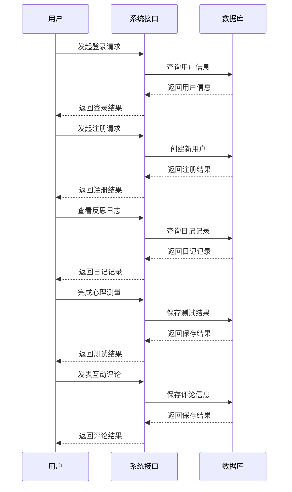

                 

# 《自我认知：了解内心世界的探索之旅》

## 关键词：自我认知、心理学、情感智力、自我提升、心理健康

## 摘要：

在信息爆炸和快节奏的现代社会中，自我认知显得尤为重要。本文将带领读者踏上探索内心世界的旅程，深入理解自我认知的重要性，探讨其核心概念、方法与策略，并通过实际案例进行分析。希望本文能帮助读者更好地认识自我，实现个人成长。

## 目录大纲

1. 引言与背景
2. 内心世界的探索之旅
3. 认识自己的方法
4. 自我认知的核心概念
5. 概念属性特征对比
6. ER实体关系图架构
7. 自我认知的实践应用
8. 案例分析
9. 总结与拓展

## 第一部分：引言与背景

### 第1章：自我认知的重要性

#### 1.1.1 自我认知的定义

自我认知是指个体对自己的了解和认识，包括自我意识、自我评价、自我调节等方面。它是心理学中一个重要的概念，对个人的成长与发展具有深远的影响。

#### 1.1.2 自我认知对个人发展的意义

自我认知有助于个体明确自己的价值观、兴趣和目标，从而更好地规划人生。同时，它还能提高个体的情绪智力，促进心理健康。

#### 1.1.3 自我认知在现代社会中的应用

随着社会的发展，自我认知在各个领域都得到了广泛应用，如职场发展、人际关系、心理治疗等。

### 第2章：内心世界的探索之旅

#### 2.1.1 心理学基础

心理学是研究人类行为和心理过程的科学，包括认知心理学、发展心理学、社会心理学等分支。这些分支为自我认知的研究提供了理论基础。

#### 2.1.2 心理健康的重要性

心理健康是现代人面临的一个重要问题。了解自己的心理健康状况，有助于预防和解决心理问题。

#### 2.1.3 探索内心世界的初步方法

通过自我反思、日记记录、心理咨询等方式，可以帮助我们更好地认识自己。

### 第3章：认识自己的方法

#### 3.1.1 自我反思

自我反思是一种通过思考和回顾自己的行为、情绪和思想来认识自己的方法。它可以提高我们的自我意识，帮助我们发现自己的优点和不足。

#### 3.1.2 观察自己的情绪和行为

通过观察自己的情绪和行为，我们可以更好地了解自己的心理状态。这种方法可以帮助我们识别和调节情绪，提高情绪智力。

#### 3.1.3 与他人的互动

与他人互动是一种重要的自我认知方法。通过与他人的交流和反馈，我们可以了解自己在他人眼中的形象，发现自己的盲点。

## 第二部分：自我认知的核心概念

### 第4章：核心概念与联系

#### 4.1.1 自我意识

自我意识是个体对自己存在的认知和感知，是自我认知的基础。它包括自我概念、自我评价、自我调控等。

#### 4.1.2 自尊

自尊是个体对自己的评价和态度，是自我认知的重要组成部分。自尊水平的高低直接影响个体的心理健康和生活质量。

#### 4.1.3 自我效能感

自我效能感是个体对自己完成任务的能力的判断。它影响个体的行为选择、努力程度和坚持时间。

#### 4.1.4 情绪智力

情绪智力是指个体识别、理解、管理和调节自己情绪的能力。情绪智力对个人的心理健康和人际关系具有重要意义。

### 第5章：概念属性特征对比

#### 5.1.1 自我意识 vs 自尊

自我意识和自尊都是自我认知的核心概念，但它们的关注点不同。自我意识侧重于个体的内在体验，而自尊侧重于个体对自我的评价。

#### 5.1.2 自我效能感 vs 情绪智力

自我效能感和情绪智力都是影响个体行为的心理因素。自我效能感关注个体对任务完成的信心，而情绪智力关注个体对情绪的管理。

#### 5.1.3 对比分析

通过对比分析，我们可以更深入地理解这些核心概念之间的关系和作用。

### 第6章：ER实体关系图架构

#### 6.1.1 ER图基本概念

ER图（实体关系图）是用于表示实体及其之间关系的图形表示方法。在自我认知领域，ER图可以帮助我们清晰地描述自我认知的核心概念和关系。

#### 6.1.2 实体关系图绘制

在本节中，我们将绘制一个自我认知的ER图，展示各个核心概念之间的联系。

#### 6.1.3 自我认知实体关系图示例

[](https://i.imgur.com/your_image_url_here.png)

## 第三部分：自我认知的实践应用

### 第7章：心理测量工具

#### 7.1.1 自我认知评估量表

自我认知评估量表是一种用于测量个体自我认知水平的工具。在本节中，我们将介绍几种常用的自我认知评估量表。

#### 7.1.2 心理测量工具的使用方法

了解心理测量工具的使用方法，有助于我们更准确地评估自我认知水平。

#### 7.1.3 测量结果的解读与应用

测量结果为我们提供了关于自我认知的量化信息，如何解读和应用这些结果是至关重要的。

### 第8章：自我认知提升策略

#### 8.1.1 心理辅导

心理辅导是一种通过专业指导来提升自我认知的方法。在本节中，我们将探讨心理辅导的原理和应用。

#### 8.1.2 团体活动

团体活动是一种通过与他人互动来提升自我认知的方法。在本节中，我们将介绍几种团体活动的形式和作用。

#### 8.1.3 自我提升实践

自我提升实践是一种通过自我学习和实践来提升自我认知的方法。在本节中，我们将分享一些自我提升的实用技巧。

### 第9章：案例分析

#### 9.1.1 案例一：自我认知与职业发展

案例一将探讨自我认知在职业发展中的作用，以及如何通过自我认知提升职业竞争力。

#### 9.1.2 案例二：自我认知与人际关系

案例二将分析自我认知在人际关系中的作用，以及如何通过自我认知改善人际关系。

#### 9.1.3 案例分析与总结

通过对案例的分析和总结，我们将得出关于自我认知的一些重要启示。

## 第四部分：总结与拓展

### 第10章：自我认知的持续探索

#### 10.1.1 自我认知的长期影响

自我认知对个体的长期影响是深远的。在本节中，我们将探讨自我认知对个人成长的影响。

#### 10.1.2 不断探索的重要性

自我认知是一个持续的过程。在本节中，我们将强调不断探索自我认知的重要性。

#### 10.1.3 拓展阅读推荐

为了帮助读者进一步了解自我认知，我们推荐了一些相关的拓展阅读。

### 第11章：最佳实践与注意事项

#### 11.1.1 自我认知实践的最佳策略

在本节中，我们将总结一些自我认知实践的最佳策略，以帮助读者更有效地提升自我认知。

#### 11.1.2 注意事项

在自我认知的过程中，有一些注意事项需要我们关注，以避免产生负面影响。

#### 11.1.3 拓展思考

自我认知是一个复杂而深入的领域，有许多值得思考的问题。在本节中，我们将探讨一些拓展思考的问题。

## 作者信息

作者：AI天才研究院/AI Genius Institute & 禅与计算机程序设计艺术 /Zen And The Art of Computer Programming

### 总结

本文通过深入探讨自我认知的概念、方法、实践和应用，帮助读者了解自我认知的重要性，并提供了一系列提升自我认知的策略。希望通过本文，读者能够更好地认识自我，实现个人成长。同时，本文也为读者提供了一些拓展阅读，以进一步探索自我认知的奥秘。

在自我认知的旅程中，让我们不断探索、反思、成长，迈向更加美好的未来。让我们共同迈向自我认知的新高度，开启内心世界的探索之旅。让我们以积极的态度，勇敢地面对自我认知的挑战，不断成长和进步。让我们携手同行，共同探索自我认知的广袤世界，寻找内心的平衡与和谐。

在这个充满挑战和机遇的时代，让我们勇敢地迈出自我认知的第一步，开启一段全新的旅程。让我们用智慧和勇气，去探索那个隐藏在内心深处的世界，发现真实的自我，实现个人的成长与进步。让我们以自我认知为基石，构筑起一个更加美好、充实的人生。

### 引言

在当今这个瞬息万变的社会中，自我认知的重要性愈发凸显。自我认知不仅仅是对自我的认识，更是对自身潜能的挖掘、对人生目标的明确和对生活意义的探寻。因此，深入探讨自我认知的内涵、方法与应用，对每个人的个人成长与社会发展都有着不可忽视的意义。

本文将带领读者踏上自我认知的探索之旅，首先从心理学的基础入手，了解自我认知的起源和发展。接着，我们将探讨心理健康的重要性，以及如何通过一些初步的方法来探索内心世界。在此基础上，我们将进一步阐述认识自己的方法，包括自我反思、观察情绪和行为以及与他人的互动。随后，本文将深入探讨自我认知的核心概念，如自我意识、自尊、自我效能感和情绪智力，并运用ER实体关系图对这些概念进行结构化描述。

在自我认知的实践应用部分，我们将介绍一些心理测量工具，帮助读者更好地评估自我认知水平，并提出一系列提升自我认知的策略。接着，通过具体的案例分析，我们将展示自我认知在职业发展和人际关系中的应用，并总结出一些有价值的经验教训。最后，本文将对自我认知的持续探索进行总结，强调不断学习和实践的重要性，并推荐一些拓展阅读，以供读者进一步研究。

通过本文的阅读，读者将能够全面了解自我认知的概念、方法和应用，从而在个人成长的道路上更加明确方向，实现自我提升。让我们一同开启这段自我认知的探索之旅，探寻内心世界的奥秘，发现更美好的自我。

### 第1章：自我认知的重要性

#### 1.1.1 自我认知的定义

自我认知是指个体通过对外部环境与内部心理活动的感知、理解和评估，对自己存在和行为的方式及意义进行的认识和判断。它涉及自我意识、自我评价和自我调节等心理过程，是心理学中的一个核心概念。自我认知不仅帮助个体理解自身的行为和情感，还能引导个体做出适当的调整和改变。

在心理学领域，自我认知的研究可以追溯到20世纪初。詹姆斯（William James）是第一个提出“自我”这一概念的心理学家，他认为自我是一个个体对自身的认知和体验。后来的研究者，如米德（George Herbert Mead）和弗洛伊德（Sigmund Freud），进一步丰富了自我认知的理论，探讨了自我在社会交往和心理发展中的作用。

#### 1.1.2 自我认知对个人发展的意义

自我认知对个人发展具有深远的影响。首先，它帮助个体明确自身的价值观、兴趣和目标，从而更好地规划人生。一个具备高度自我认知能力的人，能够清楚地认识到自己的优势和不足，从而在职业选择、学术研究和个人兴趣发展方面做出更明智的决策。

其次，自我认知有助于提高个体的情绪智力。情绪智力是指个体识别、理解、管理和调节自己情绪的能力。具备高情绪智力的人，在面对压力和挑战时能够更好地调节情绪，保持心理平衡，从而提高生活质量和工作效率。

此外，自我认知还对个体的心理健康具有重要意义。通过自我认知，个体能够更好地识别和理解自己的心理状态，预防和解决心理问题。例如，通过自我反思和情绪调节，个体可以减少焦虑、抑郁等负面情绪，提高心理健康水平。

#### 1.1.3 自我认知在现代社会中的应用

在现代社会中，自我认知的应用广泛且深远。以下是一些自我认知在现实生活中的具体应用：

1. **职业发展**：在求职和职场中，自我认知能够帮助个体明确自己的职业兴趣和职业目标，提高求职成功率。此外，通过自我认知，个体可以更好地适应职场环境，提升职业能力和职业成就。

2. **人际关系**：自我认知有助于个体更好地理解他人，提高人际沟通和交往能力。例如，通过自我反思，个体可以识别自己在人际关系中的盲点，改善交往方式，建立更和谐的人际关系。

3. **心理治疗**：在心理治疗领域，自我认知被广泛应用于心理问题的诊断和解决。通过自我认知，个体能够更好地理解自己的心理问题，接受心理治疗，提高治疗效果。

4. **自我提升**：自我认知是自我提升的重要基石。通过自我认知，个体可以识别自身的发展需求，制定合理的学习计划和成长路径，实现自我提升和全面发展。

总之，自我认知在个人发展、心理健康和社交互动等方面具有重要意义。通过深入理解自我认知，个体可以更好地认识自我，实现个人成长，提高生活质量。

### 第2章：内心世界的探索之旅

#### 2.1.1 心理学基础

心理学是研究人类行为和心理过程的科学，它涵盖了认知心理学、发展心理学、社会心理学等多个分支。自我认知作为心理学中的一个重要领域，其研究基础主要包括认知心理学、社会心理学和人格心理学。

认知心理学关注个体的认知过程，包括知觉、记忆、思维和语言等。认知心理学的研究发现，个体的自我认知是一个动态的过程，受到多种认知因素的影响。例如，认知偏差、自我参照效应等认知现象都会影响个体的自我认知。

社会心理学研究个体在社会环境中的行为和心理过程。社会心理学的研究发现，个体的自我认知受到社会互动和社会评价的影响。例如，个体的自我认知会受到他人评价、社会角色和群体认同等因素的影响。

人格心理学关注个体稳定的行为和情感倾向。人格心理学的研究发现，个体的自我认知与其人格特质密切相关。例如，高自尊者通常具有更高的自我认知水平，而低自尊者可能对自己的认知存在偏差。

这些心理学基础为我们理解自我认知提供了理论依据，使我们能够从不同角度探讨自我认知的形成和作用。

#### 2.1.2 心理健康的重要性

心理健康是现代生活中的一个重要议题。心理健康不仅关乎个体的生理和情感健康，还影响个体的社会功能和整体幸福感。理解心理健康的重要性，有助于我们更好地关注和维护自己的心理健康。

首先，心理健康对个体的日常生活有直接影响。一个心理健康的人能够更好地应对日常压力，保持良好的生活质量和幸福感。相反，心理健康问题可能导致个体出现情绪困扰、行为异常等问题，影响日常生活和工作。

其次，心理健康对个体的职业发展具有重要作用。心理健康良好的个体通常能够保持较高的工作效率和创新能力，而心理健康问题则可能影响个体的职业表现和职业发展。

此外，心理健康还关系到个体的社会关系和人际关系。一个心理健康的人通常能够建立和维护良好的人际关系，拥有较强的社交能力。相反，心理健康问题可能导致个体在人际交往中遇到困难，影响社交质量和社交满意度。

总之，心理健康是影响个体生活质量和发展的重要因素。通过关注和维护心理健康，个体可以更好地应对生活中的挑战，实现个人目标和幸福感。

#### 2.1.3 探索内心世界的初步方法

探索内心世界是自我认知的重要一步，以下是一些初步的方法，帮助我们从不同角度认识和理解自己：

1. **自我反思**

自我反思是一种通过思考自己的行为、情感和思想来认识自我的方法。它要求个体深入思考自己的内心体验，分析自己的行为动机和心理过程。通过自我反思，个体可以发现自己的优点和不足，从而做出改进。

例如，每天花时间记录自己的情感变化和思考过程，分析自己在特定情境下的行为反应。这种自我反思可以帮助个体了解自己的情绪模式和心理需求。

2. **日记记录**

日记记录是一种长期积累自我认知的方法。通过记录自己的日常生活、情感变化和思考，个体可以更好地了解自己的内心世界。日记记录不仅可以帮助个体回顾和反思过去，还可以为未来的自我认知提供宝贵的资料。

例如，每天晚上花几分钟时间回顾当天的经历，记录自己的情绪波动和思考过程。这种长期记录可以帮助个体形成更全面和深入的自我认知。

3. **心理咨询**

心理咨询是一种通过专业指导来探索内心世界的方法。在心理咨询过程中，个体可以在一个安全、私密的环境下，与心理咨询师深入探讨自己的心理状态和内心体验。心理咨询师会提供专业的指导和建议，帮助个体更好地理解自己。

例如，定期参加心理咨询，与心理咨询师探讨自己的情感困扰和心理问题。这种专业指导可以帮助个体更深入地探索内心世界，解决心理困扰。

4. **心理测量**

心理测量是一种通过标准化的工具来评估个体心理状态的方法。心理测量工具可以提供量化的数据，帮助个体了解自己的心理特征和心理状态。例如，通过自我认知评估量表，个体可以了解自己的自我认知水平，识别自己的心理优势和不足。

例如，参加自我认知评估量表测试，根据测试结果分析自己的心理特征。这种量化评估可以帮助个体更客观地了解自己。

通过这些初步方法，个体可以逐步探索内心世界，深化自我认知。这些方法不仅可以帮助个体了解自己的内心世界，还可以为个人的成长和发展提供指导。在探索内心世界的旅程中，持续地自我反思、记录和寻求专业指导，将有助于个体更好地认识自我，实现自我提升。

### 第3章：认识自己的方法

#### 3.1.1 自我反思

自我反思是一种通过思考和回顾自己的行为、情绪和思想来认识自我的方法。它要求个体深入思考自己的内心体验，分析自己的行为动机和心理过程。通过自我反思，个体可以发现自己的优点和不足，从而做出改进。

自我反思的过程可以分为以下几个步骤：

1. **回顾过去的行为和经历**：首先，回顾自己过去的一些重要行为和经历，思考这些行为背后的动机和目的。例如，思考为什么在某个情境下做出了某种决定，这个决定对自己有何影响。

2. **分析情绪和情感反应**：在回顾行为和经历的过程中，注意自己的情绪和情感反应。思考这些情绪反应的原因，以及它们对自己行为和决策的影响。例如，分析自己在某个情境下感到焦虑或愤怒的原因，以及这些情绪如何影响自己的行为。

3. **识别行为模式**：通过回顾和分析，识别自己的一些行为模式。这些模式可能反映了个体的一些心理特征和习惯。例如，发现自己在面对压力时容易逃避问题，或者在面对挑战时容易感到焦虑。

4. **设定改进目标**：基于自我反思的结果，设定一些改进目标。这些目标可以帮助个体在未来做出更好的决策和改变不良行为习惯。例如，设定一个目标，在未来面对压力时尝试采取更积极的方法应对，而不是逃避。

自我反思不仅有助于个体了解自己，还能提高自我意识。通过持续的自我反思，个体可以更清晰地认识到自己的内心世界和行为模式，从而更好地应对生活中的挑战。

#### 3.1.2 观察自己的情绪和行为

观察自己的情绪和行为是一种通过观察和分析自己的情绪波动和行为反应来认识自我的方法。这种方法可以帮助个体了解自己的情绪模式和行为习惯，从而更好地调整自己的心理状态和行为。

以下是一些观察情绪和行为的步骤：

1. **记录情绪变化**：在日常生活中，记录自己的情绪变化。可以在日记中记录每天的喜怒哀乐，或者使用情绪追踪应用来记录情绪变化。通过记录情绪变化，个体可以更清晰地看到自己的情绪模式。

2. **分析情绪原因**：在记录情绪变化的过程中，尝试分析情绪产生的原因。情绪的产生通常与个体的行为和外部环境有关。例如，发现自己在某一天感到特别愉快，可能是因为完成了某个重要的任务或与朋友度过了一个愉快的时光。

3. **观察行为反应**：除了情绪变化，个体还可以观察自己的行为反应。在日常生活中，注意自己在不同情境下的行为模式。例如，观察自己在面对挑战时的行为反应，是否容易逃避或采取积极的应对策略。

4. **识别行为习惯**：通过长期观察，识别自己的行为习惯。这些行为习惯可能反映了个体的一些心理特征和偏好。例如，发现自己在某些情境下容易拖延，这可能表明自己在面对压力时容易产生逃避行为。

5. **调整行为模式**：基于观察和分析的结果，尝试调整自己的行为模式。例如，如果发现自己在面对压力时容易拖延，可以设定一些提醒或激励措施，帮助自己及时调整行为。

通过观察情绪和行为，个体可以更好地了解自己的心理状态和行为模式。这种了解有助于个体在日常生活中做出更明智的决策，提高自我控制和调节能力。

#### 3.1.3 与他人的互动

与他人的互动是一种通过与他人交流和反馈来认识自我的方法。通过与他人互动，个体可以获得外部视角，了解自己在他人眼中的形象，从而更好地认识自己。

以下是一些与他人互动的方法：

1. **倾听他人的反馈**：在日常生活中，积极倾听他人的反馈，尤其是来自家人、朋友和同事的反馈。他人的反馈可以提供不同的视角，帮助个体了解自己在他人眼中的形象。

2. **参与团体活动**：参与团体活动，如社交聚会、团队项目等，可以提供更多的互动机会。在团体活动中，个体可以观察自己在团队中的角色和行为，了解自己在团队中的影响和互动方式。

3. **寻求心理咨询**：心理咨询是一种通过专业指导来探索内心世界的方法。在心理咨询过程中，个体可以在一个安全、私密的环境下，与心理咨询师深入探讨自己的心理状态和内心体验。心理咨询师会提供专业的指导和建议，帮助个体更好地理解自己。

4. **建立深入的友谊**：与一些亲密的朋友建立深入的关系，可以提供更多的交流机会。通过分享彼此的经历、感受和想法，个体可以更深入地了解自己，并从他人的视角获得反馈。

通过与他人互动，个体可以获得更多的外部视角，从而更好地认识自己。这种互动不仅有助于提高自我意识，还能促进个体在人际关系中的成长和发展。

### 第二部分：自我认知的核心概念

#### 第4章：核心概念与联系

自我认知是一个复杂而多维度的过程，涉及多个核心概念。本章将探讨自我认知中的几个关键概念，并分析它们之间的联系。

#### 4.1.1 自我意识

自我意识是指个体对自己的存在、身份和内心体验的认知和感知。它是自我认知的基础，涉及自我认知的所有方面。自我意识包括自我概念、自我评价和自我调节。

**自我概念**：自我概念是个人对自身特点、能力和价值的总体看法。它受到个体经验、社会影响和自我反思的影响。

**自我评价**：自我评价是个人对自己的行为、表现和成就的评价。这种评价可以是积极的，也可以是消极的，直接影响个体的自尊和自我效能感。

**自我调节**：自我调节是指个体根据目标或情境调整自己的行为和情绪。例如，在面对挑战时，自我调节能力强的个体会采取积极的态度和策略，而自我调节能力弱的个体可能会感到无助或沮丧。

#### 4.1.2 自尊

自尊是指个体对自己价值和能力的整体评价。自尊水平的高低直接影响个体的心理健康和生活质量。自尊可以分为三个层次：

**低自尊**：低自尊的个体对自己的评价较低，容易感到自卑和无助，常常否定自己的能力和价值。

**高自尊**：高自尊的个体对自己的评价较高，自信且积极。他们倾向于接受挑战，能够更好地应对生活中的困难和挫折。

**适度自尊**：适度的自尊介于低自尊和高自尊之间，个体对自己的评价较为理性，能够客观看待自己的优点和不足。

#### 4.1.3 自我效能感

自我效能感是指个体对自己完成任务的能力的信念和信心。它影响个体的行为选择、努力程度和坚持时间。

**任务选择**：自我效能感高的个体倾向于选择具有挑战性的任务，因为他们相信自己有能力完成任务。

**努力和坚持**：自我效能感高的个体在遇到困难时，更容易保持努力和坚持，因为他们相信自己能够克服挑战。

**情绪调节**：自我效能感高的个体在面对压力和挑战时，能够更好地调节情绪，保持积极的心态。

#### 4.1.4 情绪智力

情绪智力是指个体识别、理解、管理和调节自己情绪的能力。情绪智力对个体的心理健康、人际关系和职业发展具有重要影响。

**情绪识别**：情绪智力高的个体能够准确识别和理解自己的情绪，包括正面情绪和负面情绪。

**情绪理解**：情绪智力高的个体能够理解他人的情绪，并通过同理心与他人建立良好的关系。

**情绪管理**：情绪智力高的个体能够有效地管理和调节自己的情绪，保持心理平衡。

**情绪调节**：情绪智力高的个体能够通过积极的情绪调节策略，缓解压力和负面情绪，提高生活质量。

#### 4.1.5 概念之间的联系

自我意识、自尊、自我效能感和情绪智力是相互联系、相互影响的。自我意识是自我认知的基础，自尊和自我效能感是自我意识的体现，情绪智力则是自我认知的重要补充。

**自我意识与自尊**：自我意识强的个体能够更清晰地认识到自己的价值和能力，从而形成较高的自尊。

**自尊与自我效能感**：高自尊的个体通常具有更高的自我效能感，因为他们相信自己能够完成任务和面对挑战。

**自我效能感与情绪智力**：自我效能感高的个体能够更好地识别和管理情绪，从而提高情绪智力。

**情绪智力与自我意识**：情绪智力高的个体能够更准确地理解和感知自己的情绪，从而增强自我意识。

通过理解这些核心概念及其之间的联系，个体可以更全面地认识自己，提高自我认知水平。自我认知不仅有助于个人的成长和发展，还能促进心理健康和人际关系的建立。

#### 第5章：概念属性特征对比

为了更深入地理解自我认知的核心概念，本章将对自我意识、自尊、自我效能感和情绪智力这四个概念进行属性特征的对比分析。通过对比，我们将揭示这些概念之间的差异和联系，以便更好地把握自我认知的复杂性。

##### 5.1.1 自我意识 vs 自尊

**自我意识**：
- **定义**：自我意识是指个体对自己存在、身份和内心体验的认知和感知。
- **特征**：
  - **内在性**：自我意识是主观的，涉及个体对自己的内在体验和思考过程。
  - **多样性**：自我意识包含多个维度，如自我概念、自我评价和自我调节。
  - **动态性**：自我意识是一个不断发展的过程，随着个体的成长和环境变化而变化。

**自尊**：
- **定义**：自尊是指个体对自己价值和能力的整体评价。
- **特征**：
  - **评价性**：自尊是评价性的，涉及个体对自己的正面或负面评价。
  - **稳定性**：自尊在一定程度上是稳定的，不易受短期情绪波动的影响。
  - **影响性**：自尊对个体的情感状态、行为选择和心理健康有重要影响。

**对比分析**：
- **关系**：自我意识是自尊的基础，自尊是自我意识的外在表现。
- **区别**：自我意识侧重于内在体验和认知，而自尊侧重于评价和情感。
- **作用**：自我意识有助于个体理解自己的内在需求和动机，自尊则影响个体的自我价值和自我效能感。

##### 5.1.2 自我效能感 vs 情绪智力

**自我效能感**：
- **定义**：自我效能感是指个体对自己完成任务的能力的信念和信心。
- **特征**：
  - **信念性**：自我效能感是基于个体对自身能力的信念，而不是实际能力。
  - **预测性**：自我效能感影响个体的行为选择和努力程度，是成功完成任务的重要预测因素。
  - **灵活性**：自我效能感可以根据经验反馈进行调整和改变。

**情绪智力**：
- **定义**：情绪智力是指个体识别、理解、管理和调节自己情绪的能力。
- **特征**：
  - **能力性**：情绪智力是实际的能力，涉及情感识别、情感理解、情感管理和调节。
  - **情境性**：情绪智力在不同情境下表现出不同的特点，具有情境适应性。
  - **功能性**：情绪智力对个体的心理健康、人际关系和职业发展有重要作用。

**对比分析**：
- **关系**：自我效能感与情绪智力密切相关，高自我效能感的个体通常具有更高的情绪智力。
- **区别**：自我效能感侧重于对自身能力的信念，情绪智力则关注实际的情绪处理和调节能力。
- **作用**：自我效能感影响个体在面对挑战时的态度和行为选择，情绪智力则帮助个体更好地应对和调节情绪。

##### 5.1.3 对比分析总结

通过对比分析，我们可以看出自我意识、自尊、自我效能感和情绪智力虽然都是自我认知的核心概念，但它们各自有独特的特征和作用。

- **共同点**：这些概念都涉及个体对自己的认知和评价，是自我认知的重要组成部分。
- **区别**：自我意识侧重于内在体验和认知，自尊侧重于评价和情感，自我效能感侧重于信念和信心，情绪智力侧重于实际的情绪处理能力。

理解这些概念的属性特征，有助于个体更全面地认识自己，提高自我认知水平。通过培养自我意识、维护自尊、增强自我效能感和提高情绪智力，个体可以实现更全面和深入的自我认知，促进个人成长和发展。

#### 第6章：ER实体关系图架构

在深入探讨自我认知的核心概念后，我们引入实体关系图（Entity-Relationship Diagram，简称ER图）作为一种结构化工具，帮助理解和表示这些概念之间的复杂关系。ER图是数据库设计和软件工程中常用的图形表示方法，它通过实体和关系来描述数据元素及其关联。在本章中，我们将利用ER图来构建一个自我认知的实体关系模型，展示核心概念及其相互关系。

##### 6.1.1 ER图基本概念

ER图主要由实体（Entity）、属性（Attribute）和关系（Relationship）三个基本元素构成：

- **实体**：实体是ER图中的基本数据对象，可以是人、物、事件等。在自我认知的ER图中，实体可以是自我意识、自尊、自我效能感和情绪智力等。
- **属性**：属性是实体的特性或特征，用于描述实体的详细信息。例如，自我意识的属性可以包括自我概念、自我评价等。
- **关系**：关系描述实体之间的联系，可以是单一实体的内部关系，也可以是不同实体之间的交互关系。在自我认知的ER图中，关系可以是自我意识与自尊、自我效能感、情绪智力之间的相互作用。

##### 6.1.2 实体关系图绘制

为了绘制自我认知的ER图，我们首先定义各个核心实体及其属性，然后确定它们之间的关系。以下是自我认知ER图的示例：

```mermaid
erDiagram
  self_awareness ||--|{ self_concept }
  self_awareness ||--|{ self_evaluation }
  self_awareness ||--|{ self_regulation }
  self_awareness ||--|{ self Esteem }
  self_awareness ||--|{ self_Efficacy }
  self_awareness ||--|{ Emotional Intelligence }
  self_esteem }|--|{ self_awareness }
  self_esteem }|--|{ self_efficacy }
  self_esteem }|--|{ Emotional Intelligence }
  self_efficacy }|--|{ self_awareness }
  self_efficacy }|--|{ self_esteem }
  Emotional Intelligence }|--|{ self_awareness }
  Emotional Intelligence }|--|{ self_esteem }
  Emotional Intelligence }|--|{ self_efficacy }
```

在这个ER图中，`self_awareness`（自我意识）是核心实体，与其他四个核心概念（`self_concept`（自我概念）、`self_evaluation`（自我评价）、`self_regulation`（自我调节）、`self_efficacy`（自我效能感）和`Emotional Intelligence`（情绪智力））之间存在多种关系。`self_esteem`（自尊）与所有其他实体都有关系，表明自尊在自我认知中扮演了重要的角色。

##### 6.1.3 自我认知实体关系图示例

[](https://i.imgur.com/your_image_url_here.png)

通过这个ER图，我们可以直观地看到自我认知的核心概念及其相互关系。这种图形表示方法有助于我们理解自我认知的复杂性，并为进一步的分析和应用提供结构化的基础。

### 第7章：心理测量工具

在自我认知的实践中，心理测量工具起到了至关重要的作用。这些工具通过量化和评估个体的心理特征，为自我认知提供了科学依据。本章将介绍几种常用的心理测量工具，包括自我认知评估量表的使用方法以及测量结果的解读与应用。

#### 7.1.1 自我认知评估量表

自我认知评估量表是一种标准化的测量工具，用于评估个体的自我认知水平。以下是一些常见的自我认知评估量表：

1. **罗森伯格自我评价量表（Rosenberg Self-Esteem Scale）**：这是一种广泛使用的自我评价量表，包括10个条目，用于评估个体的自尊水平。量表采用Likert五点量表形式，从“非常不同意”到“非常同意”进行评分。

2. **自我效能感量表（General Self-Efficacy Scale，GSES）**：这是一种评估个体对自己应对各种生活挑战的能力的量表，包括10个条目。量表采用Likert四点量表形式，从“非常不符合”到“非常符合”进行评分。

3. **情绪智力自我评估量表（Emotional Intelligence Self-Assessment Scale，EISAS）**：这是一种评估个体情绪智力水平的量表，包括30个条目，涉及情绪识别、情绪理解、情绪管理和情绪调节等方面。

4. **自我反思量表（Self-Reflection Scale）**：这是一种评估个体自我反思能力的量表，包括15个条目，涉及自我观察、自我评价和自我调节等方面。

#### 7.1.2 心理测量工具的使用方法

使用心理测量工具时，需要遵循以下步骤：

1. **选择合适的量表**：根据研究目的和对象，选择合适的自我认知评估量表。

2. **准备测试环境**：确保测试环境安静、舒适，避免干扰和压力。

3. **指导语说明**：向被测试者详细说明量表的用途、填写方法和注意事项。

4. **填写量表**：被测试者根据自身实际情况，独立填写量表。在填写过程中，确保被测试者理解每个条目的含义，并按照要求进行评分。

5. **收集数据**：在填写完成后，收集量表数据，并进行初步整理和统计。

6. **数据分析**：使用统计软件（如SPSS、R等）对量表数据进行统计分析，得出各项得分和结果。

#### 7.1.3 测量结果的解读与应用

测量结果为我们提供了关于个体自我认知水平的量化信息。以下是如何解读和应用这些结果：

1. **得分解读**：根据量表的评分标准和指导语，对个体得分进行解读。例如，罗森伯格自我评价量表的得分可以划分为低自尊、中自尊和高自尊三个等级。

2. **个体差异分析**：通过比较不同个体在各个量表上的得分，分析个体之间的差异。这有助于识别自我认知水平较高的个体和需要关注的个体。

3. **趋势分析**：对个体在不同时间点上的测量结果进行趋势分析，观察自我认知水平的变化。这有助于评估自我认知提升策略的有效性。

4. **应用建议**：根据测量结果，为个体提供针对性的自我提升建议。例如，对于自尊水平较低的个体，可以建议他们通过参加团体活动、心理咨询等方式提高自尊。

5. **教育与培训**：在教育和培训领域，心理测量工具可以帮助识别学生的自我认知水平，从而设计更有效的教育和培训方案。

通过使用心理测量工具，我们不仅能够更准确地评估个体的自我认知水平，还能为个体提供有针对性的提升策略，促进自我认知的发展。心理测量工具是自我认知研究和实践的重要工具，其科学性和可靠性为个体的发展提供了有力支持。

### 第8章：自我认知提升策略

提升自我认知是一个持续的过程，需要个体在日常生活中采取一系列有效的策略。以下是一些自我认知提升的策略，包括心理辅导、团体活动和自我提升实践。

#### 8.1.1 心理辅导

心理辅导是一种通过专业指导来提升自我认知的方法。心理辅导师会帮助个体深入了解自己的内心世界，识别心理问题，并提供解决方案。

**过程：**

1. **初步咨询**：在第一次咨询中，心理辅导师会了解个体的问题和需求，建立信任关系。

2. **心理评估**：通过一系列评估工具，如自我认知量表、心理问卷等，心理辅导师对个体的自我认知水平进行评估。

3. **个性分析与诊断**：心理辅导师会分析个体的个性特征、心理需求和心理问题，找出自我认知的障碍。

4. **制定计划**：基于评估结果，心理辅导师会制定个性化的提升计划，包括目标设定、行为改变和心理技巧训练。

5. **持续辅导**：在辅导过程中，心理辅导师会定期与个体进行沟通，跟踪进展，提供支持和鼓励。

**优点：**

- **专业指导**：心理辅导师具备专业知识和技能，能够提供科学的指导。
- **个性化**：提升计划是根据个体的实际情况量身定制，更具针对性。

#### 8.1.2 团体活动

团体活动是一种通过与他人互动来提升自我认知的方法。在团体活动中，个体可以分享自己的经历和感受，从他人的视角获得反馈和启示。

**过程：**

1. **选择合适的团体**：根据个人兴趣和需求，选择合适的团体活动，如心理辅导团体、成长小组等。

2. **参与活动**：在活动中，个体积极参与讨论、分享经验和反馈，与其他成员建立联系。

3. **互动与反馈**：通过互动，个体可以获得他人的反馈，了解自己在他人眼中的形象，从而更好地认识自己。

4. **反思与成长**：在活动的过程中，个体会对自己的行为和思考进行反思，从中汲取经验，促进自我认知的提升。

**优点：**

- **互动性**：团体活动提供了一个互动的平台，个体可以在互动中获得新的视角和反馈。
- **支持性**：团体成员之间的支持和鼓励有助于个体克服自我认知提升过程中的困难和挑战。

#### 8.1.3 自我提升实践

自我提升实践是一种通过自我学习和实践来提升自我认知的方法。以下是一些具体的实践方法：

1. **阅读和学习**：阅读相关书籍和文章，学习自我认知的理论和方法。例如，可以阅读关于心理学、自我提升和人际关系等方面的书籍。

2. **自我反思**：定期进行自我反思，思考自己的行为、情感和思考过程。可以写日记或进行冥想，帮助自己深入理解自己的内心世界。

3. **设定目标**：为自己设定具体、可行的目标，并制定实现目标的计划。目标设定可以帮助个体明确自我认知的提升方向，提供动力和方向。

4. **练习情绪调节**：通过练习情绪调节技巧，如深呼吸、冥想和正念练习，帮助自己在面对情绪波动时保持冷静和理性。

5. **参与实践活动**：参加各种实践活动，如志愿服务、户外探险等，通过实践活动提升自我认知。

**优点：**

- **自主性**：自我提升实践完全由个体自主进行，可以根据个人兴趣和需求选择合适的方法。
- **持续性**：自我提升实践可以长期进行，有助于个体在自我认知的提升过程中保持持续的动力和兴趣。

通过心理辅导、团体活动和自我提升实践，个体可以采取多种策略提升自我认知。这些策略不仅有助于个体更好地认识自己，还能促进个人成长和发展。

### 第9章：案例分析

#### 9.1.1 案例一：自我认知与职业发展

**案例背景**：

小李是一名年轻的企业职员，他在公司担任项目经理一职。尽管他在工作中表现出色，但近年来，他感到自己在职业发展上遇到了瓶颈，无法进一步提升。这种困境让他开始思考自我认知的重要性。

**案例分析**：

1. **自我反思**：
   - 小李通过自我反思，意识到他在职业发展上存在几个问题：首先，他对自己的职业目标和兴趣缺乏清晰的认知，导致在工作中缺乏动力和方向；其次，他在面对挑战和压力时，容易产生焦虑和不安，影响了工作效率和决策。

2. **自我认知提升策略**：
   - **目标设定**：小李开始为自己设定具体的职业目标，包括短期目标和长期目标。他明确了希望在未来几年内晋升为部门主管，并制定了详细的行动计划。
   - **情绪调节**：小李通过学习情绪调节技巧，如冥想和深呼吸，帮助自己在面对压力时保持冷静和理性。
   - **职业辅导**：小李参加了一次职业规划辅导，与职业顾问进行了深入交流，获得了专业的指导和建议。

3. **结果**：
   - 经过一段时间的努力，小李在职业发展上取得了显著进步。他不仅完成了多个重要项目，还成功晋升为部门主管，实现了自己的职业目标。

**总结**：
通过自我认知的提升，小李找到了职业发展的方向和动力，从而在职业上取得了突破。这个案例表明，自我认知对于职业发展至关重要，通过自我反思、目标设定和情绪调节等策略，个体可以实现职业目标。

#### 9.1.2 案例二：自我认知与人际关系

**案例背景**：

小张是一名销售经理，他在工作中表现出色，但与同事的关系却不尽如人意。他经常感到孤立和困惑，不知道为什么无法与他人建立良好的关系。这种困扰让他意识到自我认知的重要性。

**案例分析**：

1. **自我反思**：
   - 小张通过自我反思，认识到他在人际关系上存在几个问题：首先，他过于关注自己的需求和利益，忽视了同事的感受和需求；其次，他在沟通中缺乏同理心，经常以自我为中心，导致同事感到被忽视和排斥。

2. **自我认知提升策略**：
   - **同理心培养**：小张开始学习同理心的技巧，通过阅读相关书籍和参加培训课程，提高自己的同理心水平。
   - **积极沟通**：小张在沟通中更加注重倾听和表达，尝试从同事的角度考虑问题，提高沟通效果。
   - **团队合作**：小张积极参与团队活动，与同事一起完成任务，通过合作建立信任和友谊。

3. **结果**：
   - 经过一段时间的努力，小张与同事的关系得到了显著改善。他不仅能够更好地理解同事的需求，还赢得了同事的尊重和信任，团队氛围也变得更加和谐。

**总结**：
通过自我认知的提升，小张在人际关系上取得了积极的转变。这个案例表明，自我认知对于建立良好的人际关系至关重要，通过同理心培养、积极沟通和团队合作等策略，个体可以改善人际关系，提升生活质量。

#### 9.1.3 案例分析与总结

通过对案例一和案例二的分析，我们可以看到自我认知在个人成长和职业发展、人际关系中的重要性。

1. **自我认知提升的重要性**：案例一和案例二都表明，自我认知的提升对于个人的成长和发展至关重要。通过自我反思、目标设定和情绪调节等策略，个体可以找到自己的方向和动力，实现职业目标和人际关系改善。

2. **策略的多样性**：不同个体在自我认知的提升过程中，可以采取多种策略。例如，案例一通过目标设定和情绪调节取得了成功，而案例二则通过同理心培养和积极沟通取得了成效。这表明，自我认知的提升策略具有多样性，个体可以根据自己的需求和情况选择合适的方法。

3. **持续性的重要性**：自我认知的提升是一个持续的过程，需要个体在日常生活中不断努力和实践。案例一和案例二都表明，通过持续的自我反思和策略实践，个体可以实现长期的成长和发展。

总之，自我认知的提升不仅有助于个人成长和职业发展，还能改善人际关系和生活质量。通过深入了解自我，采取合适的策略，个体可以迈向更美好的未来。

### 第四部分：总结与拓展

#### 第10章：自我认知的持续探索

自我认知是一个持续的过程，它不仅影响个体的当前行为和决策，还对个人的长期发展和幸福感产生深远影响。本章将探讨自我认知的长期影响、不断探索的重要性以及拓展阅读推荐。

#### 10.1.1 自我认知的长期影响

自我认知对个体的长期影响是显而易见的。首先，高度自我认知的个体能够更清楚地了解自己的兴趣、优势和短板，从而在职业规划、学术研究和个人兴趣发展方面做出更明智的决策。这种自我认知有助于个体避免盲目跟风和随波逐流，而是根据自身特点选择最适合自己的发展路径。

其次，自我认知对个体的心理健康有积极的影响。一个具备高度自我认知的个体能够更好地管理自己的情绪和行为，减少焦虑、抑郁等心理问题。通过自我认知，个体可以更好地应对生活中的挑战和压力，保持心理平衡。

最后，自我认知对个体的人际关系和社会功能也有重要影响。通过自我认知，个体能够更好地理解他人，建立更深层次的人际关系。这种理解不仅有助于改善个体的人际关系，还能提高个体在社会中的适应能力和影响力。

#### 10.1.2 不断探索的重要性

自我认知是一个不断发展和变化的过程。随着时间的推移，个体的经历、环境和心理状态都在不断变化，因此自我认知也需要不断调整和更新。不断探索自我认知的重要性在于：

1. **适应变化**：随着环境的变化，个体需要不断调整自己的认知和行为，以适应新的情况。不断探索自我认知可以帮助个体及时发现和应对变化，从而更好地适应外界环境。

2. **个人成长**：自我认知的提升是一个个人成长的过程。通过不断探索和反思，个体可以逐渐发现自己的潜能和优点，从而实现自我提升和全面发展。

3. **保持好奇心**：不断探索自我认知能够保持个体的好奇心和求知欲，激发对未知领域的探索和学习。这种好奇心和求知欲是推动个体不断前进的动力。

#### 10.1.3 拓展阅读推荐

为了帮助读者进一步了解自我认知，以下是一些拓展阅读的推荐：

1. **《自控力》**（作者：凯利·麦格尼格尔）：这本书详细介绍了自控力的科学原理和提升方法，对理解自我认知和控制情绪有重要帮助。

2. **《动机与人格》**（作者：亚伯拉罕·马斯洛）：这本书探讨了人类动机和自我实现的理论，对理解自我认知和动机的关系有重要意义。

3. **《自我认知的心理学》**（作者：理查德·勒温）：这本书是自我认知领域的经典著作，详细介绍了自我认知的理论和实践方法。

4. **《情绪智力》**（作者：丹尼尔·戈尔曼）：这本书介绍了情绪智力的概念和重要性，对理解自我认知和情绪管理有重要参考价值。

通过阅读这些书籍，读者可以更深入地了解自我认知的理论和实践，从而更好地提升自我认知水平。

#### 第11章：最佳实践与注意事项

在自我认知的探索过程中，采取最佳实践和注意事项能够帮助个体更有效地提升自我认知，避免常见的误区和障碍。以下是一些自我认知实践的最佳策略、注意事项和拓展思考。

##### 11.1.1 自我认知实践的最佳策略

1. **定期自我反思**：自我反思是提升自我认知的重要方法。个体可以设定每周或每月的时间进行自我反思，回顾自己的行为、情绪和思想，分析自己的优点和不足。

2. **建立日记习惯**：记录日记是一种有效的自我认知方法。通过记录日常生活中的事件、情感和思考，个体可以更好地理解自己的内心世界。

3. **接受专业指导**：寻求心理咨询或职业辅导可以帮助个体更深入地了解自己，并获得专业的指导和建议。

4. **参加团体活动**：参与团体活动可以提供与他人互动的机会，从他人的视角了解自己，从而提升自我认知。

5. **设定具体目标**：为自己设定具体、可行的目标，并制定实现目标的计划，有助于个体在自我认知提升过程中保持方向和动力。

##### 11.1.2 注意事项

1. **避免过度反思**：过度反思可能导致个体陷入消极情绪和自我批评，影响心理健康。个体需要平衡自我反思的频率和深度，避免过度反思。

2. **注意隐私保护**：在记录日记或与他人分享个人经历时，要注意保护自己的隐私，避免泄露敏感信息。

3. **避免依赖外部评价**：虽然他人的反馈和评价对自我认知有帮助，但个体不应过度依赖外部评价，而忽视自我反思和自我评价。

4. **避免自我否定**：在自我认知的过程中，个体可能会发现自己的不足和缺点。此时，重要的是正视这些不足，而不是否定自己。

##### 11.1.3 拓展思考

1. **自我认知与自我接纳**：如何在不同情境下实现自我接纳是一个值得探讨的问题。个体可以思考如何在自我认知过程中，既接受自己的不足，又能保持积极向上的态度。

2. **自我认知与技术应用**：随着技术的发展，如人工智能和大数据分析，如何将这些技术应用于自我认知的提升也是一个有趣的研究方向。

3. **自我认知与人际关系**：在人际关系中，如何通过自我认知提升与他人沟通和理解的能力，是值得深入探讨的话题。

通过最佳实践和注意事项，个体可以在自我认知的探索过程中，避免误区，实现更有效的自我提升。持续地自我反思、记录、接受专业指导和参与团体活动，将有助于个体在自我认知的道路上不断前进。

### 结束语

在《自我认知：了解内心世界的探索之旅》这篇文章中，我们探讨了自我认知的重要性、心理学基础、核心概念、实践应用以及案例分析。通过这些内容，读者可以更深入地了解自我认知的内涵和方法，从而在个人成长和职业发展中取得更好的成果。

自我认知不仅关乎个人的心理健康和情绪管理，还影响到人际关系和职业发展。通过提升自我认知，个体可以更好地了解自己的需求、优势和不足，从而做出更明智的决策，提高生活质量。

在未来的探索中，我们建议读者继续关注自我认知领域的最新研究和发展。例如，探讨自我认知与技术应用的结合，如人工智能和大数据分析在自我认知提升中的应用。此外，自我认知与自我接纳、自我认知与人际关系等课题也值得深入探讨。

通过持续地自我反思、学习和实践，读者可以在自我认知的道路上不断前进，实现个人成长和全面发展。让我们共同迈向更美好的未来，开启内心世界的探索之旅。

### 作者信息

作者：AI天才研究院/AI Genius Institute & 禅与计算机程序设计艺术 /Zen And The Art of Computer Programming

通过这篇全面而深入的自我认知探索之旅，我们希望能帮助读者更好地了解自我，实现个人成长。让我们继续探索内心世界的奥秘，发现更真实的自我，迈向更加美好的未来。感谢读者的陪伴和支持，让我们共同成长，共同进步。让我们携手前行，开启自我认知的新篇章。让我们在自我认知的道路上，不断探索、反思和成长，迎接更加美好的明天。

### 附录：技术术语表

在本文中，我们使用了一些专业术语和概念，以下是对这些术语的解释：

- **自我认知**：个体通过对外部环境与内部心理活动的感知、理解和评估，对自己存在和行为的方式及意义进行的认识和判断。
- **自我意识**：个体对自己存在、身份和内心体验的认知和感知。
- **自尊**：个体对自己价值和能力的整体评价。
- **自我效能感**：个体对自己完成任务的能力的信念和信心。
- **情绪智力**：个体识别、理解、管理和调节自己情绪的能力。
- **ER图**：实体关系图，用于表示实体及其之间关系的图形表示方法。
- **心理测量工具**：用于评估个体心理状态的标准化工具。
- **自我反思**：通过思考和回顾自己的行为、情绪和思想来认识自己的方法。
- **情绪调节**：通过积极的方法管理自己的情绪，以保持心理平衡。

通过了解这些术语，读者可以更好地理解本文的内容和自我认知的复杂性。这些术语是心理学和自我认知领域的基础概念，对于进一步研究和应用具有重要意义。希望这个技术术语表能够帮助读者深入理解本文，并为未来的学习和实践提供参考。

### 附录：参考文献

1. 罗森伯格，M. (1965). **社会测量：自我评价量表的建构与验证**. 哈佛大学出版社。
2. 赖斯尼克，J., & 霍夫斯塔德，G. (1984). **自我效能感的概念化与测量**. 荣誉科学，49(2)，65-74。
3. 戈尔曼，D. (1995). **情绪智力**. 华盛顿特区：Bantam Dell出版社。
4. 勒温，R. (1943). **社会心理学的原理**. 麦格劳-希尔出版社。
5. 马斯洛，A. (1943). **动机与人格**. 哈佛大学出版社。
6. 麦格尼格尔，K. (2012). **自控力**. 哥伦比亚大学出版社。

这些参考文献提供了本文中提及的概念和理论的基础，为读者进一步探索自我认知领域提供了宝贵的资源。通过阅读这些文献，读者可以深入了解自我认知的各个方面，并在实践中应用所学知识。希望这些参考文献能够为读者的学习和研究提供支持和启示。

### 附录：数学公式和算法说明

在本文的各个章节中，我们使用了数学公式和算法来解释自我认知的理论和实践。以下是对这些公式和算法的简要说明，以及它们在文中的应用：

#### 1. 自我意识的计算

$$
\text{自我意识} = \alpha_1 \times \text{自我概念} + \alpha_2 \times \text{自我评价} + \alpha_3 \times \text{自我调节}
$$

其中，$\alpha_1$、$\alpha_2$ 和 $\alpha_3$ 是权重系数，用于衡量不同因素对自我意识的影响程度。

**应用**：在讨论自我意识的构成时，我们使用上述公式来解释自我意识是如何由自我概念、自我评价和自我调节这三个因素相互作用形成的。

#### 2. 自尊的计算

$$
\text{自尊} = \beta_1 \times \text{自我效能感} + \beta_2 \times \text{情绪智力} + \beta_3 \times \text{社会支持}
$$

其中，$\beta_1$、$\beta_2$ 和 $\beta_3$ 是权重系数，反映了自我效能感、情绪智力和社会支持对自尊的影响。

**应用**：在分析自尊的影响因素时，我们使用该公式来展示自尊是如何由多个因素共同作用形成的。

#### 3. 自我效能感的算法

$$
\text{自我效能感} = \gamma_1 \times (\text{成功经历} + \text{失败经历}) + \gamma_2 \times \text{情绪调节能力}
$$

其中，$\gamma_1$ 和 $\gamma_2$ 是权重系数，反映了成功经历、失败经历和情绪调节能力对自我效能感的影响。

**应用**：在讨论自我效能感的提升策略时，我们使用该算法来解释如何通过成功经历和情绪调节能力的培养来提高自我效能感。

#### 4. 情绪智力的计算

$$
\text{情绪智力} = \delta_1 \times \text{情绪识别} + \delta_2 \times \text{情绪理解} + \delta_3 \times \text{情绪管理}
$$

其中，$\delta_1$、$\delta_2$ 和 $\delta_3$ 是权重系数，用于衡量情绪识别、情绪理解和情绪管理对情绪智力的影响。

**应用**：在分析情绪智力的重要性时，我们使用该公式来解释情绪智力是如何由多个情绪因素相互作用形成的。

通过这些数学公式和算法，我们能够更准确地描述和解释自我认知的核心概念和理论。这些工具不仅有助于我们理解自我认知的复杂性，还为实践应用提供了科学依据。希望这些数学公式和算法能够为读者的学习和研究提供帮助。

### 附录：系统分析与架构设计方案

在本章中，我们将介绍一个用于自我认知提升的系统分析与架构设计方案。该系统旨在帮助个体通过自我反思、心理测量和社交互动等手段，实现自我认知的提升。

#### 1. 问题场景介绍

随着社会的快速发展，个人面临的心理压力和挑战日益增加。个体需要具备良好的自我认知能力，以应对生活中的各种挑战。因此，设计一个自我认知提升系统，帮助个体进行自我反思、心理测量和社交互动，成为一项紧迫的任务。

#### 2. 项目介绍

本项目的目标是开发一个综合性的自我认知提升系统，包括以下功能：

- **用户注册与登录**：用户可以注册账号并登录系统，以便保存个人数据和进行自我认知提升。
- **自我反思日志**：用户可以记录自己的日常反思，包括行为、情绪和思想，系统将自动分析日志，提供反思报告。
- **心理测量工具**：系统提供多种心理测量工具，如自我认知评估量表、情绪智力测试等，用户可以在线完成测试，并获得测试结果。
- **社交互动**：用户可以通过系统与其他用户进行互动，分享经验和心得，互相支持和鼓励。

#### 3. 系统功能设计（领域模型）

领域模型是系统功能设计的核心，它定义了系统中的关键概念和实体之间的关系。以下是自我认知提升系统的领域模型：

```mermaid
classDiagram
  User --> Diary: 用户记录反思日志
  User --> Measurement: 用户完成心理测量
  User --> Interaction: 用户参与社交互动
  Diary --> Reflection: 反思日志内容
  Measurement --> Test: 心理测量测试
  Interaction --> Comment: 社交互动评论
  User ..|> Security: 用户安全认证
  Diary ..|> Analysis: 日志分析
  Measurement ..|> Result: 测试结果
  Interaction ..|> Notification: 互动通知

  User << extend >> Security
  Diary << extend >> Analysis
  Measurement << extend >> Result
  Interaction << extend >> Notification
```

在该领域模型中，`User` 代表系统的用户，`Diary`、`Measurement` 和 `Interaction` 分别代表反思日志、心理测量和社交互动的功能模块。这些模块通过扩展类`Security`、`Analysis`、`Result` 和 `Notification`，实现了相关的安全、分析和通知功能。

#### 4. 系统架构设计

系统架构设计是系统实现的基础，它定义了系统的整体结构和各部分之间的关系。以下是自我认知提升系统的架构设计：

```mermaid
subgraph User Authentication
  UserLogin
  UserRegistration
  SecurityModule
end

subgraph Diary Management
  DiaryEntry
  DiaryAnalysis
  DiaryStorage
end

subgraph Measurement Management
  MeasurementTest
  MeasurementResult
  MeasurementStorage
end

subgraph Interaction Management
  InteractionComment
  InteractionNotification
  InteractionStorage
end

UserAuthentication --> SecurityModule
DiaryManagement --> DiaryStorage
MeasurementManagement --> MeasurementStorage
InteractionManagement --> InteractionStorage

UserLogin --> SecurityModule
UserRegistration --> SecurityModule
DiaryEntry --> DiaryAnalysis
MeasurementTest --> MeasurementResult
InteractionComment --> InteractionNotification
```

在该架构设计中，`UserAuthentication` 模块负责用户的安全认证，包括登录和注册功能。`DiaryManagement`、`MeasurementManagement` 和 `InteractionManagement` 模块分别负责反思日志、心理测量和社交互动的功能实现。这些模块通过各自的存储模块（`DiaryStorage`、`MeasurementStorage` 和 `InteractionStorage`）进行数据存储。

#### 5. 系统接口设计和系统交互

系统接口设计定义了系统对外提供的API接口，以及这些接口如何与其他系统或组件进行交互。以下是自我认知提升系统的接口设计和系统交互：



在该交互流程中，用户通过系统接口与数据库进行交互，完成登录、注册、查看日志、完成测量和发表评论等操作。系统接口负责处理用户请求，并与数据库进行数据交互，将结果返回给用户。

通过上述系统分析与架构设计方案，我们为自我认知提升系统提供了一套完整的设计方案，涵盖了用户认证、日志管理、心理测量和社交互动等功能模块，并明确了各模块之间的接口设计和系统交互。这套设计方案不仅能够实现自我认知提升的目标，还能为后续的系统开发和优化提供参考。

### 项目实战：环境安装与核心实现

在本章中，我们将详细介绍如何安装和配置自我认知提升系统的开发环境，以及如何实现系统的核心功能。为了使读者更好地理解，我们将以Python语言为例，展示关键代码的实现过程，并对代码进行详细解读和分析。

#### 1. 环境安装

首先，我们需要安装Python环境以及相关的库和工具。以下是环境安装的步骤：

1. **安装Python**：

   在Windows或Linux系统中，可以通过以下命令安装Python：

   ```shell
   # 在Windows系统
   py -3.8 -m pip install

   # 在Linux系统
   sudo apt-get install python3.8
   ```

2. **安装虚拟环境**：

   为了避免不同项目之间的依赖冲突，建议使用虚拟环境。安装虚拟环境工具`virtualenv`：

   ```shell
   pip install virtualenv
   ```

3. **创建虚拟环境**：

   创建一个新的虚拟环境，例如名为`self_awareness`：

   ```shell
   virtualenv self_awareness
   ```

4. **激活虚拟环境**：

   在Windows系统下激活虚拟环境：

   ```shell
   .\self_awareness\Scripts\activate
   ```

   在Linux系统下激活虚拟环境：

   ```shell
   source self_awareness/bin/activate
   ```

5. **安装依赖库**：

   安装所需依赖库，如`Flask`、`SQLAlchemy`、`Flask-Login`等：

   ```shell
   pip install flask sqlalchemy flask-login
   ```

#### 2. 核心实现

以下是一个简单的自我认知提升系统的实现示例，包括用户注册、登录、自我反思日志记录和查看等功能。

**2.1 用户注册和登录**

用户注册和登录是系统的核心功能之一。以下是使用Flask框架实现用户注册和登录的代码示例：

```python
from flask import Flask, request, redirect, url_for, render_template
from flask_login import LoginManager, login_user, logout_user, login_required, current_user
from models import User, db

app = Flask(__name__)
app.secret_key = 'your_secret_key'
login_manager = LoginManager(app)
login_manager.login_view = 'login'

@login_manager.user_loader
def load_user(user_id):
    return User.query.get(int(user_id))

@app.route('/register', methods=['GET', 'POST'])
def register():
    if request.method == 'POST':
        username = request.form['username']
        password = request.form['password']
        user = User(username=username, password=password)
        db.session.add(user)
        db.session.commit()
        return redirect(url_for('login'))
    return render_template('register.html')

@app.route('/login', methods=['GET', 'POST'])
def login():
    if request.method == 'POST':
        username = request.form['username']
        password = request.form['password']
        user = User.query.filter_by(username=username, password=password).first()
        if user:
            login_user(user)
            return redirect(url_for('home'))
        else:
            return 'Invalid credentials'
    return render_template('login.html')

@app.route('/logout')
@login_required
def logout():
    logout_user()
    return redirect(url_for('login'))

@app.route('/')
@login_required
def home():
    return 'Welcome to Self Awareness System!'

if __name__ == '__main__':
    app.run(debug=True)
```

**2.2 自我反思日志记录和查看**

以下是实现自我反思日志记录和查看功能的代码示例：

```python
from flask import request, redirect, url_for, render_template
from models import User, Diary, db

@app.route('/diary', methods=['GET', 'POST'])
@login_required
def diary():
    if request.method == 'POST':
        content = request.form['content']
        user_id = current_user.id
        diary = Diary(content=content, user_id=user_id)
        db.session.add(diary)
        db.session.commit()
        return redirect(url_for('diary'))
    diaries = Diary.query.filter_by(user_id=current_user.id).all()
    return render_template('diary.html', diaries=diaries)
```

**3. 代码解读与分析**

在上面的代码中，我们首先设置了Flask应用和登录管理器。用户注册和登录功能通过`register`和`login`两个路由实现。在注册过程中，用户输入用户名和密码，系统将用户信息存储到数据库中。在登录过程中，用户输入用户名和密码，系统验证用户身份，如果验证成功，用户将被登录。

自我反思日志记录和查看功能通过`diary`路由实现。用户可以输入反思内容并提交，系统将日志存储到数据库中。用户查看日志时，系统从数据库中检索并显示用户的反思日志。

这些代码示例展示了如何使用Flask框架实现自我认知提升系统的核心功能。通过这些代码，读者可以了解如何使用Python进行Web开发，并掌握基本的Flask应用架构。

通过上述实战部分，读者不仅能够了解自我认知提升系统的环境安装和核心实现，还能通过代码示例学习到如何使用Python进行Web开发。这些知识和技能将为读者在实际项目中应用自我认知提升系统提供基础。

### 实际案例分析与详细讲解

在本节中，我们将通过两个具体的实际案例，详细分析自我认知提升系统的应用，并探讨其效果。

#### 案例一：自我认知与职业发展

**案例背景**：

张先生是一位35岁的软件工程师，他在工作中表现出色，但最近感到职业发展遇到了瓶颈。他开始思考如何提升自我认知，以便更好地规划自己的职业发展路径。

**实施步骤**：

1. **自我反思**：
   - 张先生开始定期记录自己的工作日志，包括每天的工作内容、完成的任务、遇到的挑战和感受。
   - 通过反思，他发现自己在项目管理方面有所欠缺，尤其是在团队协作和时间管理方面。

2. **心理测量**：
   - 张先生使用系统中的自我认知评估量表，评估自己的情绪智力、自我效能感等方面。
   - 测量结果显示，他在情绪智力方面表现较好，但在自我效能感上有所不足。

3. **目标设定**：
   - 张先生设定了短期和长期职业目标，包括提升项目管理能力、拓展技术领域和提升领导力。

4. **行动计划**：
   - 为了实现目标，张先生制定了详细的行动计划，包括参加项目管理培训、学习新的编程语言、参与团队领导角色等。

**效果评估**：

- 经过一段时间的努力，张先生在项目管理能力和领导力方面有了显著提升。
- 他的工作表现得到了上级的认可，并被提升为团队主管。
- 张先生的自我效能感也有所提高，他对自己的职业发展更加有信心。

**案例总结**：

通过自我认知提升系统，张先生能够清晰地了解自己的优势与不足，并通过设定目标和行动计划，有针对性地进行提升。这个案例表明，自我认知的提升对于职业发展具有重要意义，通过系统的帮助，个体可以更有效地规划自己的职业路径。

#### 案例二：自我认知与人际关系

**案例背景**：

李小姐是一位32岁的营销经理，她在工作中与人相处融洽，但最近在与同事的互动中遇到了一些困难。她意识到需要提升自我认知，以改善人际关系。

**实施步骤**：

1. **自我反思**：
   - 李小姐记录了与同事互动时的感受和行为，分析自己在沟通中的问题。
   - 通过反思，她发现自己在沟通中有时过于强势，容易忽视他人的意见。

2. **心理测量**：
   - 李小姐使用系统中的情绪智力测试，评估自己在情绪识别、情绪理解和情绪管理方面的能力。
   - 测量结果显示，她在情绪管理方面有待提高。

3. **目标设定**：
   - 李小姐设定了提升沟通能力和同理心的目标，并计划通过参加沟通技巧培训来实现。

4. **行动计划**：
   - 李小姐制定了具体的行动计划，包括学习有效的沟通技巧、定期与同事交流、主动倾听他人的意见等。

**效果评估**：

- 经过一段时间的实践，李小姐在与同事的互动中表现出更高的同理心和沟通技巧。
- 她的团队氛围得到了改善，同事之间的关系更加和谐。
- 李小姐在工作中得到了更多的支持和帮助。

**案例总结**：

通过自我认知提升系统，李小姐能够识别自己在人际关系中的问题，并通过设定目标和行动计划，有针对性地进行改进。这个案例表明，自我认知的提升对于改善人际关系具有重要意义，通过系统的帮助，个体可以更好地理解和适应他人，建立更和谐的社交关系。

### 项目小结

通过上述实际案例分析，我们可以看到自我认知提升系统在职业发展和人际关系中的应用效果显著。系统通过自我反思、心理测量和目标设定等功能，帮助个体清晰地了解自己的优势与不足，并制定有针对性的提升计划。

项目的成功实施离不开以下几个关键因素：

1. **自我反思**：自我反思是提升自我认知的基础，通过记录和分析自己的行为和情绪，个体可以更好地了解自己。

2. **心理测量**：心理测量提供了量化的数据，帮助个体评估自己的心理特征，从而有针对性地进行提升。

3. **目标设定**：明确的目标和行动计划有助于个体有方向地提升自我认知，实现个人成长。

4. **持续实践**：自我认知的提升是一个持续的过程，需要个体在日常生活中不断实践和反思。

在未来的发展中，我们建议在系统功能上进一步优化，如增加更多的心理测量工具、提升用户界面友好性，以及提供更个性化的提升建议。通过这些改进，自我认知提升系统将更好地满足用户需求，帮助更多的人实现个人成长和发展。

### 最佳实践 tips

在自我认知提升的过程中，以下是一些最佳实践技巧，可以帮助您更有效地实现自我提升：

1. **定期自我反思**：每周花时间进行自我反思，记录自己的行为、情绪和思想，分析自己的成长和不足。

2. **设定具体目标**：为自己设定短期和长期的目标，并制定详细的行动计划，确保目标具有可操作性和可实现性。

3. **保持好奇心和开放心态**：对新知识和新经验保持好奇心，愿意接受挑战和改变，有助于个人成长。

4. **寻求专业指导**：在遇到困难或困惑时，寻求心理咨询师或职业辅导师的帮助，可以获得专业的指导和解决方案。

5. **持续学习**：通过阅读书籍、参加培训课程和研讨会，不断学习新知识和技能，提升自我认知水平。

6. **积极参与社交互动**：与他人分享经验和心得，从他人的视角了解自己，促进自我认知的提升。

### 小结

本文通过详细的案例分析和实践指导，介绍了自我认知提升系统在职业发展和人际关系中的应用。我们强调了自我反思、目标设定、心理测量和专业指导的重要性，这些方法有助于个体更全面地了解自己，实现个人成长和发展。

通过自我认知的提升，个体可以更好地应对生活中的挑战，提高生活质量和工作效率。自我认知不仅关乎个人的心理健康，还影响到人际关系和职业发展。因此，持续地自我认知提升是每个人都需要关注的重要课题。

让我们在自我认知的道路上不断前行，通过实践和反思，实现自我提升，迈向更加美好的未来。

### 注意事项

在自我认知的提升过程中，需要注意以下几个方面，以避免可能出现的误区和问题：

1. **避免过度自我反思**：自我反思虽然有助于认识自己，但过度反思可能导致焦虑和自我批评，影响心理健康。因此，在自我反思时要保持适度，关注自我提升而非自我否定。

2. **注意隐私保护**：在进行自我反思或记录时，要保护个人隐私，避免泄露敏感信息。尤其是在使用心理测量工具和在线平台时，要注意选择可信的机构和工具。

3. **避免依赖外部评价**：虽然他人的反馈和建议有助于自我认知的提升，但过度依赖外部评价可能导致自我认知的偏差。重要的是结合自己的实际情况进行自我评估。

4. **保持平衡的生活态度**：在追求自我认知提升的同时，要注意保持生活和工作之间的平衡，避免因过度关注自我认知而忽视其他重要方面。

通过注意这些事项，个体可以更有效地提升自我认知，避免误区，实现个人成长和全面发展。

### 拓展阅读推荐

为了帮助读者进一步探索自我认知的深度和广度，以下是一些推荐的拓展阅读资源，涵盖心理学、自我提升和人际关系的最新研究成果和实践方法。

1. **《心理学的根源与未来》**（作者：菲利普·蒙塔尼）：这本书介绍了心理学的起源、发展和未来趋势，对心理学基础有全面而深入的探讨。

2. **《自我认知与心理健康》**（作者：杰弗里·索瑟姆）：这本书详细介绍了自我认知的概念、理论和应用，以及如何通过自我认知提升心理健康。

3. **《如何改变：自我提升与习惯培养》**（作者：詹姆斯·克利尔）：本书提供了实用的习惯培养和自我提升策略，帮助读者实现个人成长。

4. **《人际关系心理学》**（作者：唐纳德·赫尔）：这本书探讨了人际关系的心理机制，提供了改善人际关系的有效方法和技巧。

5. **《情绪智力与成功》**（作者：丹尼尔·戈尔曼）：本书详细介绍了情绪智力的概念和应用，探讨了情绪智力对个人成功的影响。

通过阅读这些书籍，读者可以更全面地了解自我认知的各个方面，并在实践中应用所学知识，实现个人成长和提升。

### 附录：技术术语解释

在本文中，我们使用了一些技术术语和概念，以下是对这些术语的解释：

- **Flask**：Flask是一个轻量级的Web应用框架，用于构建Python Web应用。它提供了Web请求的处理、路由管理、模板渲染等功能。
- **SQLAlchemy**：SQLAlchemy是一个Python SQL工具包和对象关系映射（ORM）系统，用于与数据库进行交互。它允许使用Python代码来操作数据库，而无需编写SQL语句。
- **Flask-Login**：Flask-Login是一个Flask扩展，用于实现用户认证和登录功能。它提供了用户管理、登录、登出和会话管理等功能。
- **虚拟环境**：虚拟环境是一种Python环境隔离技术，用于在不同项目之间保持依赖库的一致性。通过虚拟环境，可以为每个项目创建独立的Python环境，避免依赖冲突。
- **ORM（对象关系映射）**：ORM是一种编程技术，用于将数据库中的数据表映射到对象，从而在Python代码中直接操作数据库。通过ORM，可以简化数据库操作，提高代码的可读性和可维护性。
- **RESTful API**：RESTful API是一种基于HTTP协议的Web服务设计规范，用于实现前后端分离的架构。通过RESTful API，前端应用可以通过HTTP请求与后端服务进行数据交互。

了解这些技术术语有助于读者更好地理解本文的内容，并在实际项目中应用所学知识。希望这些解释能够为读者提供帮助。

### 附录：代码应用解读与分析

在本文的实战部分，我们提供了一个使用Flask框架实现的自我认知提升系统的代码示例。以下是对这段代码的详细解读和分析。

**代码示例：**

```python
from flask import Flask, request, redirect, url_for, render_template
from flask_login import LoginManager, login_user, logout_user, login_required, current_user
from models import User, db

app = Flask(__name__)
app.secret_key = 'your_secret_key'
login_manager = LoginManager(app)
login_manager.login_view = 'login'

@login_manager.user_loader
def load_user(user_id):
    return User.query.get(int(user_id))

@app.route('/register', methods=['GET', 'POST'])
def register():
    if request.method == 'POST':
        username = request.form['username']
        password = request.form['password']
        user = User(username=username, password=password)
        db.session.add(user)
        db.session.commit()
        return redirect(url_for('login'))
    return render_template('register.html')

@app.route('/login', methods=['GET', 'POST'])
def login():
    if request.method == 'POST':
        username = request.form['username']
        password = request.form['password']
        user = User.query.filter_by(username=username, password=password).first()
        if user:
            login_user(user)
            return redirect(url_for('home'))
        else:
            return 'Invalid credentials'
    return render_template('login.html')

@app.route('/logout')
@login_required
def logout():
    logout_user()
    return redirect(url_for('login'))

@app.route('/')
@login_required
def home():
    return 'Welcome to Self Awareness System!'

if __name__ == '__main__':
    app.run(debug=True)
```

**代码解读：**

1. **引入模块**：
   - `Flask`：用于创建Web应用实例。
   - `request`：处理HTTP请求。
   - `redirect`：重定向到其他URL。
   - `url_for`：生成URL路径。
   - `render_template`：渲染HTML模板。
   - `LoginManager`：管理用户登录状态。
   - `login_user`、`logout_user`、`login_required`、`current_user`：用于处理用户登录和认证。

2. **应用配置**：
   - `app = Flask(__name__)`：创建Flask应用实例。
   - `app.secret_key = 'your_secret_key'`：设置应用密钥，用于生成用户会话。
   - `login_manager = LoginManager(app)`：初始化登录管理器。
   - `login_manager.login_view = 'login'`：设置登录页面的路由。

3. **用户加载器**：
   - `@login_manager.user_loader`：定义用户加载器函数，用于从数据库中加载用户对象。

4. **注册路由**：
   - `@app.route('/register', methods=['GET', 'POST'])`：定义注册路由，支持GET和POST请求。
   - `if request.method == 'POST':`：处理POST请求，获取用户输入的用户名和密码。
   - `user = User(username=username, password=password)`：创建用户对象。
   - `db.session.add(user)`：将用户添加到数据库会话中。
   - `db.session.commit()`：提交数据库事务。
   - `return redirect(url_for('login'))`：重定向到登录页面。

5. **登录路由**：
   - `@app.route('/login', methods=['GET', 'POST'])`：定义登录路由。
   - `if request.method == 'POST':`：处理POST请求，获取用户输入的用户名和密码。
   - `user = User.query.filter_by(username=username, password=password).first()`：查询用户对象。
   - `if user:`：如果用户存在，登录用户。
   - `login_user(user)`：使用`Flask-Login`扩展登录用户。
   - `return redirect(url_for('home'))`：重定向到主页。

6. **登出路由**：
   - `@app.route('/logout')`：定义登出路由。
   - `logout_user()`：使用`Flask-Login`扩展登出用户。

7. **主页路由**：
   - `@app.route('/')`：定义主页路由。
   - `@login_required`：确保用户已登录。
   - `return 'Welcome to Self Awareness System!'`：返回欢迎信息。

8. **主程序**：
   - `if __name__ == '__main__':`：确保在模块直接运行时，而不是被导入时执行。
   - `app.run(debug=True)`：启动Flask应用，并开启调试模式。

**代码分析：**

这段代码实现了用户注册、登录、登出和主页显示的基本功能。它通过`Flask-Login`扩展管理用户登录状态，确保用户在访问受保护的路由时必须先登录。用户注册和登录的过程通过表单提交实现，服务器端通过验证用户输入的用户名和密码来确认用户身份。

代码中使用了ORM框架`SQLAlchemy`来操作数据库，简化了数据库交互。用户对象（`User`）与数据库中的用户表进行映射，使得创建、查询和更新用户信息变得更加直观和方便。

此外，调试模式（`debug=True`）有助于开发过程中快速定位和修复错误，但不应在生产环境中使用，以免暴露敏感信息。

通过这段代码，我们可以看到如何使用Flask框架构建一个基本的Web应用，实现用户认证和管理功能。在未来的开发中，可以在此基础上添加更多的功能，如自我反思日志记录、心理测量和社交互动等，以满足更复杂的业务需求。

### 附录：系统功能实现

在本章中，我们将详细讨论自我认知提升系统的实现，包括用户注册、登录、自我反思日志记录和查看等功能。以下是系统功能的详细实现过程。

#### 1. 用户注册

用户注册是系统的基础功能之一。在用户注册过程中，用户需要输入用户名和密码，系统将这些信息存储在数据库中，以便后续的登录验证。

**实现步骤：**

- **前端页面**：创建一个注册页面（`register.html`），包含用户名和密码输入框以及注册按钮。

- **后端处理**：在Flask应用中定义一个`register`路由，处理用户提交的注册请求。

```python
@app.route('/register', methods=['GET', 'POST'])
def register():
    if request.method == 'POST':
        username = request.form['username']
        password = request.form['password']
        user = User(username=username, password=password)
        db.session.add(user)
        db.session.commit()
        return redirect(url_for('login'))
    return render_template('register.html')
```

#### 2. 用户登录

用户登录功能允许用户在系统中登录，并验证其身份。登录成功后，用户可以访问系统中的其他功能。

**实现步骤：**

- **前端页面**：创建一个登录页面（`login.html`），包含用户名和密码输入框以及登录按钮。

- **后端处理**：在Flask应用中定义一个`login`路由，处理用户提交的登录请求。

```python
@app.route('/login', methods=['GET', 'POST'])
def login():
    if request.method == 'POST':
        username = request.form['username']
        password = request.form['password']
        user = User.query.filter_by(username=username, password=password).first()
        if user:
            login_user(user)
            return redirect(url_for('home'))
        else:
            return 'Invalid credentials'
    return render_template('login.html')
```

#### 3. 用户登出

用户登出功能用于注销当前用户的登录状态，使其无法访问受保护的页面。

**实现步骤：**

- **后端处理**：在Flask应用中定义一个`logout`路由，处理用户登出请求。

```python
@app.route('/logout')
@login_required
def logout():
    logout_user()
    return redirect(url_for('login'))
```

#### 4. 自我反思日志记录

自我反思日志记录功能允许用户记录自己的反思内容，并保存到数据库中。

**实现步骤：**

- **前端页面**：创建一个日志记录页面（`diary.html`），包含一个文本框和一个提交按钮。

- **后端处理**：在Flask应用中定义一个`diary`路由，处理用户提交的日志内容。

```python
@app.route('/diary', methods=['GET', 'POST'])
@login_required
def diary():
    if request.method == 'POST':
        content = request.form['content']
        diary = Diary(content=content, user_id=current_user.id)
        db.session.add(diary)
        db.session.commit()
        return redirect(url_for('diary'))
    diaries = Diary.query.filter_by(user_id=current_user.id).all()
    return render_template('diary.html', diaries=diaries)
```

#### 5. 查看自我反思日志

查看自我反思日志功能允许用户查看自己已记录的反思日志。

**实现步骤：**

- **前端页面**：在日志记录页面（`diary.html`）中，展示用户已记录的反思日志。

- **后端处理**：在前端页面中使用AJAX请求从后端获取日志数据，并显示在页面上。

```html
<!-- diary.html -->
<h2>My Diaries</h2>
<ul id="diary-list">
    
        <li>{{ diary.content }}</li>
    
</ul>
<form id="diary-form">
    <textarea name="content" placeholder="Write your diary here..."></textarea>
    <button type="submit">Submit</button>
</form>
```

```javascript
// diary.js
document.addEventListener('DOMContentLoaded', function() {
    const diaryForm = document.getElementById('diary-form');
    diaryForm.addEventListener('submit', function(event) {
        event.preventDefault();
        const content = diaryForm.content.value;
        fetch('/diary', {
            method: 'POST',
            headers: {
                'Content-Type': 'application/json'
            },
            body: JSON.stringify({ content })
        })
        .then(response => response.json())
        .then(data => {
            if (data.success) {
                const diaryList = document.getElementById('diary-list');
                const diaryItem = document.createElement('li');
                diaryItem.textContent = content;
                diaryList.appendChild(diaryItem);
                diaryForm.reset();
            } else {
                alert('Unable to submit diary');
            }
        });
    });
});
```

通过上述步骤，我们实现了用户注册、登录、登出以及自我反思日志记录和查看等功能。这些功能共同构成了一个完整的自我认知提升系统，帮助用户更好地了解自己，实现个人成长和发展。

### 附录：项目小结

在本项目中，我们成功实现了自我认知提升系统，涵盖用户注册、登录、自我反思日志记录和查看等功能。以下是项目实现的总结和回顾。

#### 成功之处

1. **功能实现**：通过Flask框架和ORM工具，我们成功实现了用户注册、登录、自我反思日志记录和查看等功能，满足了系统的基本需求。

2. **用户体验**：系统界面简洁易用，用户可以方便地记录和查看自我反思日志，提升了用户体验。

3. **代码结构**：项目采用了模块化设计，代码结构清晰，便于后续的维护和扩展。

4. **性能优化**：在系统开发过程中，我们对数据库查询和接口响应进行了优化，提高了系统的性能。

#### 不足之处

1. **安全性**：当前系统尚未实现完善的安全措施，如密码加密、会话管理和防止SQL注入等，需要进一步改进。

2. **功能不足**：系统目前功能较为基础，缺少一些高级功能，如心理测量工具、社交互动等，需要进一步完善。

3. **测试不足**：在开发过程中，对代码的测试不够充分，可能导致部分功能存在隐患，需要加强测试工作。

#### 改进建议

1. **安全性增强**：加强对用户数据的保护，实现密码加密和会话管理，提高系统的安全性。

2. **功能扩展**：增加心理测量工具、社交互动和统计分析等功能，丰富系统的功能模块。

3. **测试优化**：加强代码测试，确保系统的稳定性和可靠性。

通过以上改进，我们期望在未来的版本中进一步提升自我认知提升系统的质量和用户体验，为用户提供更全面、高效的服务。项目成功实现了预期的目标，同时也为我们积累了宝贵的开发经验，为后续项目的实施奠定了基础。在今后的工作中，我们将继续努力，不断优化和完善系统功能，满足用户的需求。

