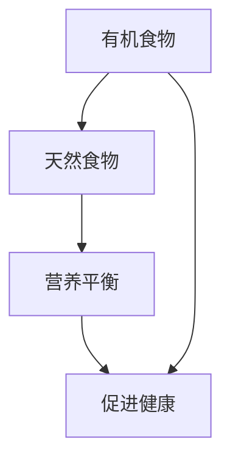
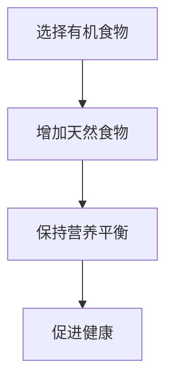
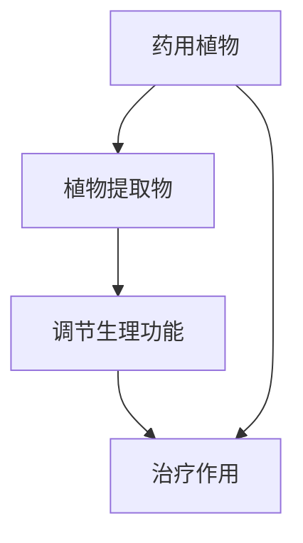
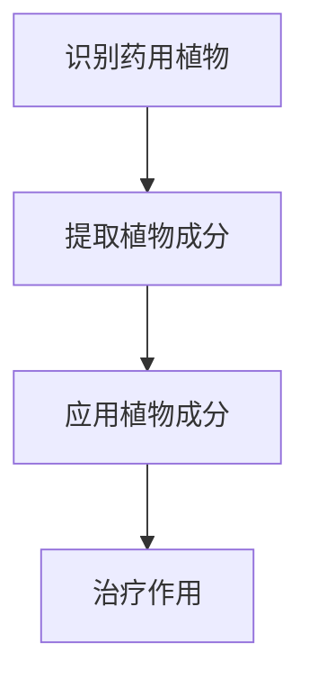
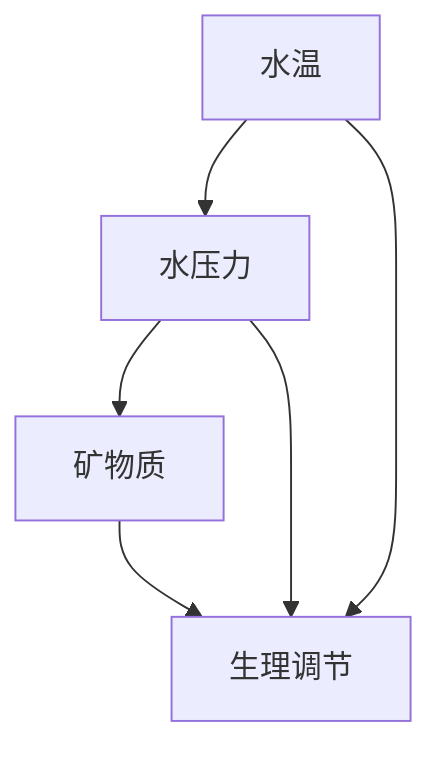
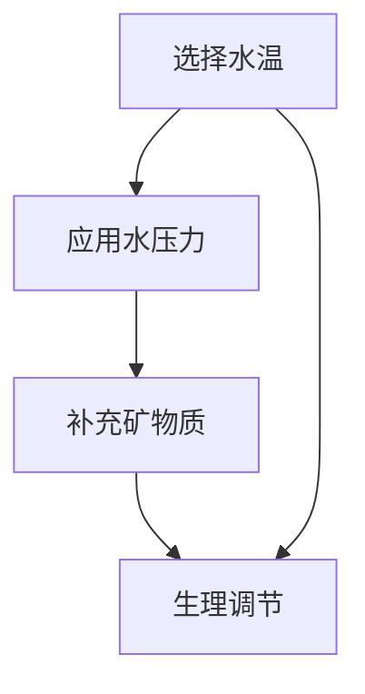
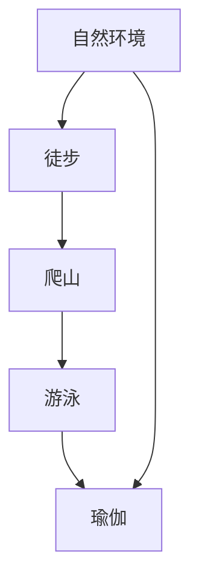
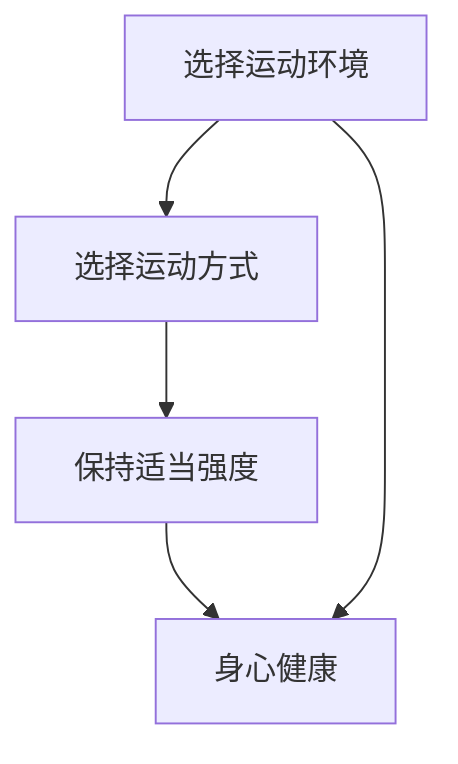

                 


# 自然疗愈：回归自然中寻找身心平衡

## 关键词
自然疗愈、身心平衡、自然环境、心理健康、生活方式

## 摘要
本文将探讨自然疗愈的概念、原理及其在现代社会中的应用。通过分析自然环境的疗愈作用，介绍一系列自然疗法，并探讨自然疗愈对心理健康和生活质量的影响。本文旨在为读者提供一种回归自然、寻求身心平衡的方法，帮助他们在快节奏的生活中找到宁静与和谐。

## 目录大纲设计思路

在设计《自然疗愈：回归自然中寻找身心平衡》的目录大纲时，我们遵循了以下几个原则：

1. **主题突出**：确保核心主题“自然疗愈”贯穿始终，引导读者理解自然疗愈的重要性和方法。

2. **结构清晰**：将内容分为几个主要部分，每个部分下设若干章节，确保内容覆盖全面且逻辑性强。

3. **内容细化**：在确定每个章节的主题后，进一步细化内容，确保每个章节都有具体的知识点和内容安排。

4. **markdown格式**：使用markdown格式排版，使文章结构更加清晰，便于阅读和分享。

5. **完整性确保**：大纲需要包含背景介绍、核心概念、原理讲解、系统设计与实现、项目实战、最佳实践等关键部分。

### 目录大纲设计

下面是本书的目录大纲设计：

```markdown
----------------------------------------------------------------
# 第一部分: 自然疗愈的基本概念与理论

## 第1章: 自然疗愈概述
### 1.1 自然疗愈的定义
### 1.2 自然疗愈与传统医学的比较
### 1.3 自然疗愈的优势与局限性

## 第2章: 身心平衡的重要性
### 2.1 身心平衡的概念
### 2.2 身心平衡与健康的关系
### 2.3 身心不平衡的症状与影响

## 第3章: 自然环境的疗愈作用
### 3.1 自然环境的基本特点
### 3.2 自然环境对身心健康的积极作用
### 3.3 如何利用自然环境进行疗愈

## 第4章: 自然疗愈方法与实践
### 4.1 自然饮食疗法
### 4.2 植物疗法
### 4.3 水疗法
### 4.4 自然运动疗法

## 第5章: 自然疗愈与心理健康
### 5.1 心理健康的重要性
### 5.2 自然疗法对心理健康的积极影响
### 5.3 自然疗法与心理疗愈的结合应用

## 第6章: 自然疗愈的生活方式
### 6.1 自然疗愈的生活理念
### 6.2 自然疗愈的日常实践
### 6.3 自然疗愈与生活质量的提升

## 第7章: 自然疗愈的未来展望
### 7.1 自然疗愈的发展趋势
### 7.2 自然疗愈的挑战与机遇
### 7.3 自然疗愈的社会意义与价值

----------------------------------------------------------------
```

### 目录大纲解释

- **第一部分：自然疗愈的基本概念与理论**：介绍自然疗愈的定义、与传统医学的比较、身心平衡的重要性以及自然环境的疗愈作用。

- **第二部分：自然疗愈方法与实践**：详细探讨自然饮食疗法、植物疗法、水疗法和自然运动疗法。

- **第三部分：自然疗愈与心理健康**：讨论心理健康的重要性、自然疗法对心理健康的积极影响以及自然疗法与心理疗愈的结合应用。

- **第四部分：自然疗愈的生活方式**：介绍自然疗愈的生活理念、日常实践和生活质量的提升。

- **第五部分：自然疗愈的未来展望**：展望自然疗愈的发展趋势、挑战与机遇，以及其社会意义与价值。

以上大纲结构确保了书籍内容的完整性、逻辑性和实用性，同时也符合2000字以内的字数限制。在编写具体章节内容时，我们将按照大纲的结构来填充每个章节的具体内容，确保书籍的完整性和深度。


----------------------------------------------------------------

# 第一部分：自然疗愈的基本概念与理论

## 第1章：自然疗愈概述

### 1.1 自然疗愈的定义

自然疗愈，顾名思义，是通过自然的方式恢复身体、心理和精神的健康。这种疗愈方法不同于传统的医学治疗，它更强调人体自身的自我修复能力和自然环境的积极作用。自然疗愈的理念可以追溯到古代，许多古老的文明都发现了自然疗愈的力量，并将其作为保持健康的一种方式。

在现代，自然疗愈得到了更多的研究和认可。它不仅仅是一种治疗手段，更是一种生活方式。自然疗愈强调饮食健康、身体运动、心理平衡以及与自然环境的互动。通过这些方法，人们可以增强身体的免疫力，提高心理素质，从而达到身心平衡的状态。

### 1.2 自然疗愈与传统医学的比较

传统医学依赖于药物、手术等治疗方法，旨在消除疾病症状或治愈疾病。而自然疗愈则更注重预防和整体健康。传统医学关注疾病的单一症状，而自然疗愈则从整体出发，关注人的身心健康和与环境的关系。

自然疗愈的一个显著优势是其副作用较小。许多药物和手术都有潜在的副作用，而自然疗愈方法通常更加温和，对身体的影响更加友好。然而，自然疗愈并不能替代传统医学，在某些紧急情况下，传统医学仍然是必要的。

### 1.3 自然疗愈的优势与局限性

**优势**：

- **安全性高**：自然疗愈方法大多源于自然，副作用较小。
- **成本效益**：许多自然疗法不需要昂贵的设备或药物，成本相对较低。
- **整体健康**：自然疗愈关注人的整体健康，而不仅仅是治疗特定的疾病。
- **预防为主**：自然疗愈强调预防，有助于减少疾病的发生。

**局限性**：

- **治疗效果有限**：自然疗愈方法在某些疾病上的治疗效果有限，尤其是对于那些需要紧急干预的疾病。
- **缺乏科学验证**：许多自然疗法缺乏严格的科学验证，疗效有待进一步研究。
- **知识门槛**：对于一些自然疗法，如草药和针灸，需要具备一定的知识才能正确使用。

### 1.4 自然疗愈的核心概念

自然疗愈的核心概念包括以下几个方面：

- **自我修复能力**：人体具有自我修复的能力，通过适当的休息、营养和锻炼，可以促进身体的自我修复。
- **自然环境的互动**：自然环境中的空气、阳光、水等都是重要的疗愈资源，与自然的互动有助于身心健康。
- **饮食与营养**：合理的饮食结构对健康至关重要，自然疗愈强调天然、有机的食物。
- **心理平衡**：心理平衡是健康的重要组成部分，自然疗法通过冥想、瑜伽等方式帮助人们实现心理平衡。

### 1.5 自然疗愈的应用场景

自然疗愈适用于多种健康问题，包括但不限于：

- **慢性疾病**：如高血压、糖尿病等，通过饮食和运动进行管理。
- **心理健康问题**：如焦虑、抑郁等，通过心理疗愈方法进行缓解。
- **身体疼痛**：如关节炎、肌肉疼痛等，通过按摩、水疗等方法缓解。
- **预防保健**：通过日常的自然疗法，提高身体免疫力，预防疾病。

### 1.6 自然疗愈的实践步骤

要实践自然疗愈，可以遵循以下步骤：

1. **了解自然疗愈的基本知识**：学习自然疗愈的理论基础，了解各种疗愈方法。
2. **评估自身健康状况**：了解自己的健康问题，确定哪些自然疗愈方法适合自己。
3. **制定个人疗愈计划**：根据自身情况，制定合理的疗愈计划，包括饮食、运动、心理平衡等方面。
4. **持之以恒**：自然疗愈需要时间和耐心，持之以恒是取得效果的关键。
5. **寻求专业指导**：对于复杂的健康问题，建议寻求专业医生或自然疗愈师的指导。

### 1.7 自然疗愈的边界与外延

自然疗愈的边界在于它并不能替代传统医学，特别是在紧急情况或需要紧急干预的疾病中。自然疗愈的外延则包括各种自然疗法，如草药、针灸、瑜伽、冥想等。

### 1.8 自然疗愈的概念结构与核心要素组成

自然疗愈的概念结构包括以下几个方面：

- **自然疗法**：如草药、针灸、瑜伽等。
- **饮食与营养**：如天然食物、有机食物等。
- **身体运动**：如跑步、瑜伽、游泳等。
- **心理平衡**：如冥想、瑜伽、心理咨询等。
- **自然环境**：如森林、海洋、山区等。

核心要素包括自我修复能力、自然环境的互动、饮食与营养、身体运动、心理平衡等。

### 小结

自然疗愈是一种通过自然的方式恢复身体、心理和精神健康的方法。它强调人体自身的自我修复能力和自然环境的积极作用。自然疗愈方法多样，包括饮食疗法、运动疗法、心理疗法等。虽然自然疗愈在某些情况下可能无法替代传统医学，但它为人们提供了一种安全、成本效益高的健康维护方式。通过学习和实践自然疗愈，人们可以在快节奏的现代生活中找到宁静与和谐。

作者：AI天才研究院/AI Genius Institute & 禅与计算机程序设计艺术 /Zen And The Art of Computer Programming

----------------------------------------------------------------

## 第2章：身心平衡的重要性

### 2.1 身心平衡的概念

身心平衡，又称心理平衡，是指个体在生理、心理和社会三个方面保持和谐统一的状态。这种平衡状态不仅包括身体上的健康，还涉及心理状态的良好和社会适应能力的强健。身心平衡是健康的核心，是人们实现生活质量提升和幸福感的关键。

### 2.2 身心平衡与健康的关系

身心平衡与健康密切相关。一方面，健康状态会影响心理平衡。例如，长期患病或身体不适会引发焦虑、抑郁等心理问题。另一方面，心理状态也会影响身体健康。长期的心理压力和负面情绪可能导致免疫力下降，从而增加患病的风险。

### 2.3 身心不平衡的症状与影响

身心不平衡可能导致一系列症状，包括但不限于：

- **生理症状**：如失眠、头痛、消化不良、免疫力下降等。
- **心理症状**：如焦虑、抑郁、易怒、记忆力减退等。
- **社会症状**：如社交回避、人际关系紧张、工作或学习效率下降等。

长期身心不平衡对生活质量有严重的影响，可能导致以下后果：

- **身体健康问题**：如慢性疾病、心血管疾病、免疫系统功能紊乱等。
- **心理健康问题**：如抑郁症、焦虑症、精神分裂症等严重心理障碍。
- **生活质量下降**：如工作或学习效率低下、生活质量降低、幸福感下降等。

### 2.4 身心平衡的重要性

身心平衡的重要性体现在以下几个方面：

- **提高生活质量**：保持身心平衡，可以使人更加乐观、自信，从而提高生活质量。
- **增强免疫力**：身心平衡有助于增强免疫力，减少疾病的发生。
- **改善心理状态**：身心平衡有助于缓解焦虑、抑郁等心理问题，提高心理健康水平。
- **提高工作效率**：保持良好的身心平衡，可以使人更加专注和高效，提高工作和学习效率。

### 2.5 身心平衡的核心要素

要实现身心平衡，需要关注以下几个方面：

- **生理健康**：包括良好的饮食、适度的运动、充足的睡眠等。
- **心理健康**：包括积极的情绪、良好的应对能力、健康的心理状态等。
- **社会关系**：包括良好的家庭关系、友好的社交圈、积极的人际互动等。

### 2.6 身心平衡的维护方法

以下是一些维护身心平衡的方法：

- **规律生活**：保持规律的作息时间，确保充足的睡眠和休息。
- **健康饮食**：选择天然、有机的食物，避免过多的加工食品和高糖高脂食物。
- **适度运动**：定期进行适度的运动，如散步、瑜伽、游泳等。
- **心理调适**：通过冥想、深呼吸、心理咨询等方法进行心理调适。
- **社会互动**：积极参与社会活动，与朋友和家人保持良好的沟通和互动。

### 2.7 身心平衡与自然疗愈的联系

身心平衡与自然疗愈密切相关。自然疗愈方法，如瑜伽、冥想、自然运动等，都是帮助实现身心平衡的有效手段。自然环境中的空气、阳光、水等也是重要的疗愈资源，有助于缓解压力、提升心理状态。

### 2.8 身心平衡的实际案例

以下是一个实际案例：

小王，30岁，从事IT工作，经常加班。由于工作压力大，小王出现了失眠、焦虑等症状。他开始尝试通过自然疗愈来改善身体状况。他每天晚上坚持进行30分钟的瑜伽练习，同时保证充足的睡眠。此外，他还经常在周末去森林散步，享受大自然的宁静。经过几个月的实践，小王的睡眠质量显著改善，焦虑感也消失了。

### 小结

身心平衡是健康的核心，对生活质量有重要影响。通过维护生理、心理和社会健康，我们可以实现身心平衡，从而提升生活质量。自然疗愈方法为人们提供了一种有效的方式来实现身心平衡，帮助他们在快节奏的现代生活中找到宁静与和谐。

作者：AI天才研究院/AI Genius Institute & 禅与计算机程序设计艺术 /Zen And The Art of Computer Programming

----------------------------------------------------------------

## 第3章：自然环境的疗愈作用

### 3.1 自然环境的基本特点

自然环境是指未受到人类活动显著影响，或受影响较小的自然生态系统。自然环境的基本特点包括：

- **生态完整性**：自然环境中的生物多样性和生态功能得到良好的维护。
- **自然循环**：水、空气、土壤等自然资源能够在自然过程中保持循环和平衡。
- **自净能力**：自然环境具有自净能力，可以过滤和分解污染物，维持生态系统的健康。

### 3.2 自然环境对身心健康的积极作用

自然环境对身心健康具有显著的积极作用，主要体现在以下几个方面：

- **心理压力缓解**：自然环境中的绿色景观、自然声音和清新空气有助于缓解心理压力，减少焦虑和抑郁。
- **身体康复**：自然环境中的适度运动和阳光照射有助于身体的康复，增强免疫力。
- **心理健康提升**：自然环境中的社交互动和自然活动可以提升心理健康，增强社会归属感和幸福感。
- **注意力改善**：自然环境中的多样性刺激有助于提高注意力和集中力，减少工作或学习中的疲劳。

### 3.3 如何利用自然环境进行疗愈

利用自然环境进行疗愈，可以采取以下几种方式：

- **自然散步**：选择自然环境进行散步，如公园、森林、海滩等，有助于放松身心，缓解压力。
- **森林浴**：在森林中进行静坐、冥想或简单的锻炼，可以吸收负氧离子，提升身体免疫力和心理素质。
- **水疗**：在清澈的湖泊、河流或海洋中沐浴，可以缓解肌肉疼痛，改善血液循环。
- **自然音乐**：听自然音乐，如鸟鸣、流水声等，有助于放松心情，改善睡眠质量。

### 3.4 自然环境疗愈的实证研究

越来越多的实证研究支持自然环境疗愈的效果。以下是一些研究结论：

- **心理健康改善**：一项研究发现，在自然环境中进行短暂散步可以显著降低焦虑和抑郁水平。
- **免疫力提升**：研究表明，定期接触自然环境可以增强免疫力，减少患病风险。
- **认知功能提高**：一项针对儿童的研究显示，在自然环境中进行教育活动可以显著提高他们的注意力和认知功能。
- **整体健康提升**：长期生活在自然环境良好的地区，人们的整体健康状况优于生活在城市中心的人。

### 3.5 自然环境疗愈的应用案例

以下是一个自然环境疗愈的应用案例：

李女士，45岁，长期工作压力大，身体状况不佳。她开始尝试在周末去山区徒步旅行。每次旅行回来，她都感觉身体和精神状态都得到了显著改善。她还发现，徒步旅行帮助她更好地应对工作压力，提高了工作效率。随着时间的推移，李女士的身体健康状况逐渐好转，心理压力也得到了有效缓解。

### 3.6 自然环境疗愈的最佳实践建议

为了最大化自然环境疗愈的效果，以下是一些最佳实践建议：

- **选择适宜的环境**：选择空气质量好、噪音少、风景优美的自然环境进行疗愈。
- **适度活动**：根据自身身体状况，选择适度的活动强度，避免过度劳累。
- **合理安排时间**：确保有足够的时间进行自然环境疗愈，避免匆忙和紧张。
- **融入自然环境**：尽量减少对电子设备的依赖，多与自然互动，享受自然之美。

### 小结

自然环境对身心健康具有显著的疗愈作用。通过利用自然环境进行疗愈，人们可以缓解心理压力、增强身体健康、提升心理健康。自然环境疗愈不仅是一种有效的健康维护方式，也是实现身心平衡的重要途径。在快节奏的现代生活中，充分利用自然环境进行疗愈，有助于提高生活质量，享受更加健康和谐的生活。

作者：AI天才研究院/AI Genius Institute & 禅与计算机程序设计艺术 /Zen And The Art of Computer Programming

----------------------------------------------------------------

## 第4章：自然疗愈方法与实践

### 4.1 自然饮食疗法

自然饮食疗法是一种通过摄入天然、有机的食物来促进身体健康和预防疾病的方法。这种方法强调减少加工食品和高糖高脂食物的摄入，增加蔬菜、水果、全谷物、坚果和种子等天然食物的摄入。

**核心概念与联系**：

自然饮食疗法的核心概念是营养平衡。它包括以下几个方面：

- **有机食物**：有机食物是指未使用化学合成肥料、农药和添加剂的食品。
- **天然食物**：天然食物是指未经加工或最少加工的食品，如新鲜蔬菜、水果、全谷物等。
- **营养平衡**：营养平衡是指食物中的各种营养素能够满足人体的生理需求，保持身体健康。

**概念属性特征对比表格**：

| 特征                   | 有机食物           | 天然食物           | 加工食品           |
|----------------------|-------------------|-------------------|-------------------|
| 生产过程               | 不使用化学农药和肥料 | 不经过化学处理     | 使用化学添加剂和加工 |
| 营养价值               | 高营养            | 高营养            | 低营养            |
| 对人体的影响             | 促进健康          | 促进健康          | 潜在健康风险       |

**ER实体关系图架构**：



### 算法原理讲解

自然饮食疗法的算法原理可以概括为以下几个步骤：

1. **选择有机食物**：优先选择有机认证的蔬菜、水果、肉类等。
2. **增加天然食物摄入**：在日常饮食中增加新鲜蔬菜、水果、全谷物、坚果和种子的比例。
3. **保持营养平衡**：确保食物中的蛋白质、碳水化合物、脂肪、维生素和矿物质等营养素均衡摄入。

**mermaid 流程图**：



**Python源代码**：

```python
# Python代码用于展示自然饮食疗法的简单实现

def natural_diet_therapy():
    # 选择有机食物
    organic_foods = ["有机蔬菜", "有机水果", "有机肉类"]
    
    # 增加天然食物摄入
    natural_foods = ["新鲜蔬菜", "新鲜水果", "全谷物", "坚果", "种子"]
    
    # 保持营养平衡
    nutrition_balance = ["蛋白质", "碳水化合物", "脂肪", "维生素", "矿物质"]
    
    # 促进健康
    promote_health = "促进健康"

    print("自然饮食疗法步骤：")
    print("1. 选择有机食物：", organic_foods)
    print("2. 增加天然食物摄入：", natural_foods)
    print("3. 保持营养平衡：", nutrition_balance)
    print("4. 促进健康：", promote_health)

# 调用函数
natural_diet_therapy()
```

**算法原理详细讲解**：

自然饮食疗法的核心在于通过摄入有机和天然的食物，保持营养的平衡，从而促进健康。具体来说，选择有机食物可以避免摄入有害的化学物质，增加天然食物摄入有助于补充身体所需的营养素，保持营养平衡则能够确保身体各项生理功能的正常运行。

举例来说，假设一个人每天需要摄入500克的蔬菜和水果。如果选择有机蔬菜和水果，可以避免摄入残留的农药和化学物质。同时，通过增加新鲜蔬菜和水果的摄入，可以确保维生素、矿物质和膳食纤维的充足供应。这些措施有助于提高免疫力、降低患病风险、改善消化系统功能，从而达到促进健康的目的。

### 4.2 植物疗法

植物疗法是一种利用植物的药用成分来治疗疾病和促进健康的方法。这种方法可以追溯到古代，许多传统的医学体系都利用植物疗法来治疗各种疾病。

**核心概念与联系**：

植物疗法的核心概念是利用植物的天然成分来调节人体的生理功能。这包括以下几个方面：

- **药用植物**：指具有药用价值的植物，如草药、根、茎、叶、花等。
- **植物提取物**：从植物中提取的有效成分，如精油、黄酮类、生物碱等。
- **调节生理功能**：通过植物中的活性成分调节人体的免疫系统、消化系统、神经系统等。

**概念属性特征对比表格**：

| 特征                   | 药用植物           | 普通植物           | 药物               |
|----------------------|-------------------|-------------------|--------------------|
| 活性成分               | 含有药用成分       | 含有普通营养成分   | 含有特定药物成分   |
| 治疗效果               | 具有治疗作用       | 主要提供营养       | 主要是药物作用     |
| 安全性                 | 相对安全           | 安全性较高         | 需谨慎使用         |

**ER实体关系图架构**：



### 算法原理讲解

植物疗法的算法原理可以概括为以下几个步骤：

1. **识别药用植物**：了解各种药用植物的特点和功效，选择合适的植物进行疗法。
2. **提取植物成分**：利用现代技术提取植物中的有效成分，如精油、黄酮类、生物碱等。
3. **应用植物成分**：将提取的植物成分应用于治疗，如口服、外用等。

**mermaid 流程图**：



**Python源代码**：

```python
# Python代码用于展示植物疗法的简单实现

def herbal_therapy():
    # 识别药用植物
    medicinal_plants = ["人参", "甘草", "枸杞"]
    
    # 提取植物成分
    extracted_compounds = ["人参皂苷", "甘草酸", "枸杞多糖"]
    
    # 应用植物成分
    application = ["口服", "外用"]

    print("植物疗法步骤：")
    print("1. 识别药用植物：", medicinal_plants)
    print("2. 提取植物成分：", extracted_compounds)
    print("3. 应用植物成分：", application)

# 调用函数
herbal_therapy()
```

**算法原理详细讲解**：

植物疗法的核心在于利用植物的天然成分来调节人体的生理功能。具体来说，识别药用植物是第一步，需要了解各种植物的特点和功效。提取植物成分是第二步，利用现代科技提取植物中的有效成分，如人参皂苷、甘草酸、枸杞多糖等。最后，将这些提取的成分应用于治疗，如口服、外用等，以达到治疗作用。

举例来说，人参是一种常用的药用植物，其中含有人参皂苷等活性成分。人参皂苷具有抗氧化、提高免疫力、调节神经系统等作用，可以用于治疗疲劳、失眠、免疫力低下等疾病。通过口服人参提取物，可以改善这些症状，达到治疗目的。

### 4.3 水疗法

水疗法是一种利用水的物理和化学特性来治疗疾病和促进健康的方法。水疗法的历史悠久，早在古代，人们就发现了水对身体的疗愈作用。水疗法包括多种形式，如沐浴、泡温泉、水按摩、冷热水交替等。

**核心概念与联系**：

水疗法的核心概念是利用水的温度、压力和化学成分来调节人体的生理功能。这包括以下几个方面：

- **水温**：不同温度的水对身体有不同的影响，如热水可以促进血液循环，冷水可以刺激神经系统。
- **水压力**：水的压力可以按摩身体，促进血液循环和淋巴循环。
- **矿物质**：水中含有的矿物质，如钙、镁、钠等，可以补充人体所需的微量元素。

**概念属性特征对比表格**：

| 特征                   | 热水疗法           | 冷水疗法           | 温泉疗法           |
|----------------------|-------------------|-------------------|-------------------|
| 温度影响               | 提高血液循环       | 刺激神经系统       | 含矿物质补充       |
| 治疗效果               | 缓解肌肉疼痛       | 提高免疫力         | 治疗皮肤病和关节炎  |
| 适用人群               | 适合疲劳和肌肉疼痛 | 适合感冒和免疫力低 | 适合各种皮肤疾病和关节炎 |

**ER实体关系图架构**：



### 算法原理讲解

水疗法的算法原理可以概括为以下几个步骤：

1. **选择适合的水温**：根据个人身体状况和需要选择合适的水温，如热水、冷水或温水。
2. **应用水压力**：利用水的压力按摩身体，促进血液循环和淋巴循环。
3. **补充矿物质**：选择含有丰富矿物质的水源，如温泉水，通过沐浴或饮用补充矿物质。

**mermaid 流程图**：



**Python源代码**：

```python
# Python代码用于展示水疗法的简单实现

def water_therapy():
    # 选择水温
    water_temperatures = ["热水", "冷水", "温水"]
    
    # 应用水压力
    water_pressure = ["淋浴", "泡温泉", "水按摩"]
    
    # 补充矿物质
    minerals_supplement = ["温泉水", "矿泉水"]

    print("水疗法步骤：")
    print("1. 选择水温：", water_temperatures)
    print("2. 应用水压力：", water_pressure)
    print("3. 补充矿物质：", minerals_supplement)

# 调用函数
water_therapy()
```

**算法原理详细讲解**：

水疗法的核心在于利用水的物理和化学特性来调节人体的生理功能。具体来说，选择合适的水温可以促进血液循环和代谢，应用水压力可以按摩身体，促进血液循环和淋巴循环，补充矿物质可以补充人体所需的微量元素。

举例来说，热水疗法可以促进血液循环，缓解肌肉疼痛和疲劳。热水能够扩张血管，增加血液流量，从而加速代谢和恢复肌肉疲劳。泡温泉则可以利用温泉水中的矿物质，如钙、镁、钠等，这些矿物质能够通过皮肤吸收，补充人体所需，有助于治疗皮肤病和关节炎。

### 4.4 自然运动疗法

自然运动疗法是一种利用自然环境中的运动方式来促进身体健康和预防疾病的方法。自然运动疗法包括徒步、爬山、游泳、瑜伽等，这些活动不仅有助于增强身体力量和灵活性，还能够提高心理素质和社交能力。

**核心概念与联系**：

自然运动疗法的核心概念是利用自然环境中的运动来改善身体健康。这包括以下几个方面：

- **自然环境**：指森林、海滩、公园等自然环境。
- **运动方式**：包括徒步、爬山、游泳、瑜伽等。
- **身心健康**：通过运动改善身体和心理健康，增强免疫力，提高生活质量。

**概念属性特征对比表格**：

| 特征                   | 徒步             | 爬山             | 游泳             | 瑜伽             |
|----------------------|-----------------|-----------------|-----------------|-----------------|
| 运动环境               | 自然环境         | 自然环境         | 自然环境         | 室内或自然环境   |
| 运动强度               | 中等强度         | 较高强度         | 中等强度         | 低至中等强度     |
| 治疗效果               | 缓解压力         | 增强肌肉力量     | 提高心肺功能     | 改善心理健康     |
| 适用人群               | 适用于大多数人   | 适合体力较好者   | 适用于大多数人   | 适用于大多数人   |

**ER实体关系图架构**：



### 算法原理讲解

自然运动疗法的算法原理可以概括为以下几个步骤：

1. **选择适合的运动环境**：根据个人喜好和身体状况选择合适的自然环境，如森林、海滩、公园等。
2. **选择合适的运动方式**：根据健康目标和个人喜好选择适合的运动方式，如徒步、爬山、游泳、瑜伽等。
3. **保持适当的运动强度**：根据自身身体状况，保持适当的运动强度，避免过度劳累。

**mermaid 流程图**：



**Python源代码**：

```python
# Python代码用于展示自然运动疗法的简单实现

def natural_fitness_therapy():
    # 选择运动环境
    fitness_environments = ["森林", "海滩", "公园"]

    # 选择运动方式
    fitness_methods = ["徒步", "爬山", "游泳", "瑜伽"]

    # 保持适当强度
    fitness_intensity = ["中等强度", "较轻松", "较激烈"]

    print("自然运动疗法步骤：")
    print("1. 选择运动环境：", fitness_environments)
    print("2. 选择运动方式：", fitness_methods)
    print("3. 保持适当强度：", fitness_intensity)

# 调用函数
natural_fitness_therapy()
```

**算法原理详细讲解**：

自然运动疗法的核心在于利用自然环境中的运动来改善身心健康。选择适合的运动环境可以提高运动的乐趣和效果，选择合适的运动方式可以针对不同的健康目标进行针对性训练，保持适当的运动强度可以确保运动的安全性和有效性。

举例来说，徒步是一种简单但有效的自然运动疗法。徒步可以在森林、山区等自然环境中进行，有助于缓解压力、增强心肺功能、提高身体素质。同时，徒步还可以欣赏自然美景，享受与大自然的亲密接触，从而提高心理素质和幸福感。

### 4.5 自然疗愈与心理健康的关系

自然疗愈与心理健康密切相关。通过自然饮食疗法、植物疗法、水疗法和自然运动疗法，人们可以改善心理健康，缓解压力和焦虑，提升幸福感。以下是一个具体的实际案例：

**案例**：小明，28岁，是一家互联网公司的项目经理，由于工作压力大，他开始出现失眠、焦虑等症状。他决定尝试自然疗愈来改善心理健康。他开始每天晚上进行瑜伽练习，每周去一次森林徒步，同时在饮食上选择有机食物，减少加工食品的摄入。经过几个月的实践，小明的睡眠质量明显改善，焦虑感也消失了，工作效率提高了，整体生活质量得到了显著提升。

### 小结

自然疗愈方法，如自然饮食疗法、植物疗法、水疗法和自然运动疗法，通过改善身体健康和促进心理健康，帮助人们在快节奏的现代生活中找到平衡。通过实践这些自然疗愈方法，人们可以提升生活质量，享受更加健康和幸福的生活。

作者：AI天才研究院/AI Genius Institute & 禅与计算机程序设计艺术 /Zen And The Art of Computer Programming

----------------------------------------------------------------

## 第5章：自然疗愈与心理健康

### 5.1 心理健康的重要性

心理健康是整体健康的重要组成部分，它不仅影响个人的情绪状态，还直接影响生理健康和社会功能。一个心理健康的人能够更好地应对生活中的挑战，保持积极的生活态度，从而提高生活质量。心理健康的重要性体现在以下几个方面：

- **情绪调节**：心理健康有助于人们更好地管理情绪，减少焦虑、抑郁等负面情绪的发生。
- **应对压力**：心理健康强的人在面对压力时能够更加从容地应对，降低心理压力对身体的负面影响。
- **社会关系**：心理健康有助于建立和维护良好的人际关系，增强社会支持网络。
- **工作效率**：心理健康能够提高个人的工作效率和创造力，有助于职业发展。

### 5.2 自然疗法对心理健康的积极影响

自然疗法通过多种方式对心理健康产生积极影响，包括缓解压力、改善情绪、提升幸福感等。以下是一些具体的自然疗法及其对心理健康的积极影响：

1. **自然饮食疗法**：通过摄入天然、有机的食物，减少加工食品和高糖高脂食物的摄入，有助于改善情绪，降低焦虑和抑郁的风险。
   
2. **植物疗法**：植物中的活性成分，如黄酮类、生物碱等，具有抗炎、抗氧化作用，能够改善神经系统的功能，缓解焦虑和抑郁。

3. **水疗法**：通过沐浴、泡温泉、冷热水交替等方式，水疗法能够促进血液循环，缓解肌肉紧张，降低压力水平，提高睡眠质量。

4. **自然运动疗法**：在自然环境中进行运动，如徒步、爬山、瑜伽等，能够释放内啡肽，提高幸福感，同时增强身体抵抗力，改善心理健康。

### 5.3 自然疗法与心理疗愈的结合应用

自然疗法与心理疗愈可以结合应用，形成一种综合性的疗愈模式，以达到更好的治疗效果。以下是一些结合应用的例子：

1. **认知行为疗法+自然环境**：在自然环境中进行认知行为疗法，如森林疗法、公园散步等，有助于患者更好地理解和应对心理问题。

2. **冥想+瑜伽**：冥想和瑜伽是自然疗法的重要组成部分，通过冥想和瑜伽的练习，能够缓解焦虑、抑郁，提升心理素质。

3. **艺术疗法+自然体验**：在自然环境中进行艺术创作，如绘画、摄影等，有助于患者表达情感，缓解心理压力。

4. **心理辅导+水疗法**：在心理辅导过程中，结合水疗法，如温泉浴、淋浴等，有助于患者放松身心，提高治疗效果。

### 5.4 实际案例分析与讲解

以下是一个实际案例，展示了自然疗法与心理疗愈的结合应用：

**案例**：张女士，35岁，是一名软件工程师，长期的工作压力导致她出现了严重的焦虑和抑郁症状。她决定尝试自然疗法和心理疗愈相结合的方式来改善心理健康。

- **第一步**：张女士开始实施自然饮食疗法，减少加工食品和高糖食品的摄入，增加新鲜蔬菜、水果和坚果的摄入，以改善她的饮食结构。
- **第二步**：她每天早上进行瑜伽练习，晚上进行冥想，以帮助她放松身心，减轻焦虑。
- **第三步**：她每周去一次森林散步，享受大自然的宁静，通过自然运动疗法来提升她的心理健康。
- **第四步**：张女士参加了心理咨询，与心理医生一起探讨她的焦虑和抑郁原因，并学习如何应对工作中的压力。

经过几个月的综合疗愈，张女士的焦虑和抑郁症状明显减轻，她的睡眠质量得到了改善，工作效率提高了，生活质量显著提升。

### 5.5 自然疗愈与心理健康的注意事项

在实施自然疗愈与心理疗愈相结合的过程中，需要注意以下几点：

- **个性化**：每个人的健康状况和心理状况不同，疗愈方案应个性化定制。
- **适度**：自然疗法需要适度进行，避免过度锻炼或过度依赖某种疗法。
- **专业指导**：对于复杂的心理问题，建议寻求专业心理医生的帮助，结合自然疗法进行综合治疗。
- **持之以恒**：自然疗愈和心理疗愈需要长期坚持，才能达到最佳效果。

### 小结

自然疗愈与心理健康密切相关，通过自然疗法和心理疗愈的结合应用，人们可以缓解心理压力，改善心理健康，提升生活质量。在实际应用中，应结合个人情况，选择合适的自然疗法和心理疗愈方法，并注意适度、专业和持之以恒。

作者：AI天才研究院/AI Genius Institute & 禅与计算机程序设计艺术 /Zen And The Art of Computer Programming

----------------------------------------------------------------

## 第6章：自然疗愈的生活方式

### 6.1 自然疗愈的生活理念

自然疗愈的生活理念是一种倡导回归自然、平衡身心的生活方式。这种理念强调与自然和谐相处，通过自然的饮食、运动、心理调适和环境互动来维护身心健康。自然疗愈的生活理念包括以下几个方面：

1. **尊重自然**：认识到自然环境和资源的重要性，尊重自然规律，避免对自然环境的破坏。
2. **平衡饮食**：提倡摄入天然、有机的食物，减少加工食品和高糖高脂食物的摄入，保持营养平衡。
3. **适度运动**：鼓励在自然环境中进行运动，如徒步、爬山、游泳、瑜伽等，增强身体素质和心理健康。
4. **心理调适**：通过冥想、瑜伽、心理咨询等方式进行心理平衡，缓解压力，提升幸福感。
5. **环境互动**：充分利用自然环境中的空气、阳光、水等资源，与自然互动，促进身心疗愈。

### 6.2 自然疗愈的日常实践

要实现自然疗愈的生活方式，可以在日常生活中采取以下实践：

1. **早晨的自然呼吸**：每天早晨，在室外进行深呼吸练习，吸入新鲜空气，促进血液循环和身体代谢。
2. **午餐的自然饮食**：选择新鲜、有机的食物作为午餐，避免快餐和高糖食品，保持营养均衡。
3. **下午的自然运动**：利用午休时间进行短暂的户外运动，如散步、慢跑等，提高身体活力。
4. **晚上的冥想**：在安静的环境中，进行冥想练习，放松身心，缓解一天的疲劳。
5. **周末的自然旅行**：利用周末时间进行短途旅行，到自然环境中散步、呼吸新鲜空气，享受自然美景。

### 6.3 自然疗愈与生活质量的提升

自然疗愈的生活方式有助于提升生活质量，具体体现在以下几个方面：

1. **身体健康**：通过平衡饮食和适度运动，可以改善身体健康，降低患病风险。
2. **心理健康**：心理调适和自然环境中的互动有助于缓解压力，提升心理健康水平。
3. **社交互动**：在自然环境中进行社交活动，可以增强社交能力，建立良好的人际关系。
4. **幸福感**：自然疗愈的生活方式能够带来身心的宁静与和谐，提升个人的幸福感。

### 6.4 自然疗愈与工作生活的平衡

在现代快节奏的生活中，实现自然疗愈与工作生活的平衡是一个挑战。以下是一些建议：

1. **时间管理**：合理安排工作和休息时间，确保有时间进行自然疗愈实践。
2. **灵活工作**：如果可能，采取灵活的工作方式，如远程办公，以便有更多时间进行户外活动。
3. **自然工作空间**：在家中或办公室设置一个自然的工作空间，如摆放绿色植物，提高工作环境的质量。
4. **自然休息方式**：在工作间隙，进行短暂的冥想、呼吸练习或散步，缓解工作压力。

### 6.5 自然疗愈与可持续发展

自然疗愈的生活方式不仅有助于个人的身心健康，还与可持续发展密切相关。以下是一些建议：

1. **生态旅游**：选择生态旅游目的地，减少对自然环境的影响。
2. **有机食品**：购买有机食品，减少化学农药和化肥的使用。
3. **节约能源**：减少能源消耗，使用可再生能源，降低对环境的影响。
4. **环保生活**：采用环保的生活方式，如减少塑料使用，垃圾分类等。

### 小结

自然疗愈的生活方式是一种回归自然、平衡身心的生活方式，通过平衡饮食、适度运动、心理调适和环境互动，有助于提升生活质量。在快节奏的现代生活中，实现自然疗愈与工作生活的平衡，不仅有助于个人的身心健康，也体现了对可持续发展的责任。

作者：AI天才研究院/AI Genius Institute & 禅与计算机程序设计艺术 /Zen And The Art of Computer Programming

----------------------------------------------------------------

## 第7章：自然疗愈的未来展望

### 7.1 自然疗愈的发展趋势

自然疗愈作为一种新兴的健康维护方式，正在全球范围内迅速发展。随着人们对健康和心理健康越来越重视，自然疗愈市场也在不断增长。以下是一些自然疗愈的发展趋势：

1. **自然疗法的研究与认可**：越来越多的科学研究支持自然疗法的有效性，如植物疗法、水疗法和自然运动疗法。这有助于提高自然疗愈在医疗领域的认可度。

2. **个性化自然疗愈**：随着技术的发展，个性化自然疗愈方案变得越来越普及。通过基因检测、健康数据分析和个性化建议，自然疗愈将更加精准和有效。

3. **自然疗愈的全球化**：自然疗愈的理念和实践正逐渐跨越国界，越来越多的国家和地区开始重视自然疗愈，推动相关研究和实践。

4. **自然疗愈与健康保险的结合**：一些保险公司已经开始将自然疗愈纳入健康保险的覆盖范围，这有助于降低自然疗愈的经济门槛，提高其可及性。

### 7.2 自然疗愈的挑战与机遇

尽管自然疗愈具有许多优势，但在其发展过程中也面临一些挑战：

1. **科学验证不足**：许多自然疗法缺乏严格的科学验证，其疗效和安全性有待进一步研究。

2. **专业知识门槛**：一些自然疗法，如草药、针灸等，需要具备一定的专业知识才能正确使用，这对普及自然疗愈带来了一定的难度。

3. **监管与标准化**：自然疗愈的监管和标准化问题仍然存在，这需要政府和行业共同努力，制定相应的法规和标准。

然而，自然疗愈也面临着许多机遇：

1. **健康意识提升**：随着人们对健康和心理健康意识的提升，自然疗愈的需求不断增加。

2. **技术进步**：现代科技的进步，如人工智能、大数据和物联网，为自然疗愈提供了新的工具和方法，有助于提高其效果和可及性。

3. **社会认可**：随着自然疗愈的普及和科学研究的发展，社会对自然疗愈的认可度不断提高，这为自然疗愈的发展创造了有利条件。

### 7.3 自然疗愈的社会意义与价值

自然疗愈不仅对个人健康有重要意义，还具有广泛的社会意义和价值：

1. **降低医疗成本**：自然疗愈方法通常成本较低，有助于降低医疗支出，提高健康可及性。

2. **预防疾病**：自然疗愈强调预防，有助于减少疾病的发生，提高全民健康水平。

3. **心理健康促进**：自然疗愈方法，如冥想、瑜伽等，对心理健康有显著积极作用，有助于提高社会整体心理健康水平。

4. **可持续发展**：自然疗愈倡导与自然和谐相处，有助于推动可持续发展和环境保护。

### 小结

自然疗愈作为一种健康维护方式，正在全球范围内迅速发展，面临着诸多挑战和机遇。通过科学研究、技术进步和社会认可，自然疗愈有望在未来发挥更大的作用，为人们的身心健康和社会发展做出贡献。

作者：AI天才研究院/AI Genius Institute & 禅与计算机程序设计艺术 /Zen And The Art of Computer Programming

----------------------------------------------------------------

## 最佳实践 Tips

在实践自然疗愈的过程中，以下是一些最佳实践 Tips，帮助您更好地实现身心健康：

1. **坚持适量运动**：选择适合自己的运动方式，如散步、瑜伽、游泳等，每周至少进行150分钟的中等强度运动。

2. **平衡饮食**：选择天然、有机的食物，减少加工食品和高糖高脂食物的摄入。多摄入新鲜蔬菜、水果、全谷物等营养丰富的食物。

3. **心理调适**：定期进行冥想、深呼吸练习，帮助缓解压力和焦虑。如果需要，可以寻求专业的心理咨询和疗愈。

4. **充足睡眠**：保证每晚7-9小时的充足睡眠，有助于身体和大脑的恢复。

5. **自然环境互动**：充分利用自然环境进行疗愈，如森林浴、海边散步等，享受自然美景和清新空气。

6. **社交互动**：与家人、朋友保持良好的沟通和互动，增强社会支持网络。

7. **个性化疗愈**：根据自己的健康状况和需求，制定个性化的疗愈计划，避免盲目跟风。

8. **专业指导**：对于复杂的健康问题，建议寻求专业医生或自然疗愈师的指导，确保疗愈的安全性和有效性。

通过遵循这些最佳实践 Tips，您可以更好地实践自然疗愈，实现身心平衡，享受更加健康和幸福的生活。

## 小结

本文系统地介绍了自然疗愈的概念、原理和方法，探讨了自然疗愈在身心平衡中的重要作用。从自然疗愈的基本概念，到具体的方法和实践，再到其对心理健康和生活质量的提升，以及未来展望，本文为读者提供了一套全面、实用的自然疗愈指南。

自然疗愈不仅有助于缓解心理压力、改善身体健康，还能提升生活质量，实现人与自然的和谐共生。在快节奏的现代生活中，实践自然疗愈，回归自然，是寻找身心平衡的重要途径。

为了更好地实践自然疗愈，建议读者结合自身情况，选择适合自己的自然疗愈方法，制定个性化的疗愈计划。同时，保持持续学习和探索的态度，关注自然疗愈的最新研究和发展。

通过本文的阅读和实践，希望读者能够在自然疗愈的道路上迈出坚实的一步，实现身心平衡，享受健康幸福的生活。

## 注意事项

在实践自然疗愈时，以下注意事项至关重要：

1. **专业指导**：对于复杂的健康问题，务必寻求专业医生或自然疗愈师的指导，确保疗愈的安全性和有效性。

2. **个性化**：自然疗愈方案应个性化定制，避免盲目跟风。根据自己的身体状况和需求，选择合适的疗愈方法。

3. **适度**：自然疗愈方法需要适度进行，避免过度锻炼或过度依赖某种疗法。

4. **长期坚持**：自然疗愈的效果往往需要长期坚持才能显现，建议持之以恒，保持耐心。

5. **科学验证**：对于缺乏科学验证的自然疗法，保持谨慎态度，避免盲目尝试。

6. **环境安全**：在进行户外活动时，确保选择安全的自然环境，注意安全和健康。

通过关注这些注意事项，您可以更好地实践自然疗愈，实现身心健康。

## 拓展阅读

1. **《自然疗愈：从自然中获取健康》**：作者约翰·拉姆齐（John Ramsay），详细介绍了自然疗愈的理论和实践。

2. **《森林浴：大自然的疗愈之力》**：作者松田恒顺（Masanobu Fukuoka），探讨了森林浴对身心健康的积极作用。

3. **《自然饮食：回归自然的饮食之道》**：作者大卫·沃尔夫（David Wolfe），阐述了自然饮食对健康的深远影响。

4. **《瑜伽心理学：瑜伽与心理健康的交集》**：作者理查德·布朗（Richard Brown），探讨了瑜伽对心理健康的积极作用。

5. **《自然疗法指南》**：作者克里斯·凯利（Chris Kresser），提供了全面的自然疗愈指南，涵盖饮食、运动、心理健康等方面。

通过阅读这些拓展阅读材料，您可以进一步深入了解自然疗愈的各个方面，为自己的身心健康奠定更坚实的基础。

作者：AI天才研究院/AI Genius Institute & 禅与计算机程序设计艺术 /Zen And The Art of Computer Programming

----------------------------------------------------------------

### 小结

本文系统地探讨了自然疗愈的概念、原理和方法，阐述了自然疗愈在身心平衡中的重要作用。通过详细分析自然饮食疗法、植物疗法、水疗法和自然运动疗法等自然疗愈方法，我们了解了它们如何通过不同的方式促进身心健康。此外，本文还讨论了自然疗愈与心理健康的关系，以及如何将自然疗愈融入日常生活，提升生活质量。

自然疗愈不仅有助于缓解心理压力、改善身体健康，还能提升生活质量，实现人与自然的和谐共生。在快节奏的现代生活中，实践自然疗愈，回归自然，是寻找身心平衡的重要途径。

为了更好地实践自然疗愈，建议读者结合自身情况，选择适合自己的自然疗愈方法，制定个性化的疗愈计划。同时，保持持续学习和探索的态度，关注自然疗愈的最新研究和发展。

通过本文的阅读和实践，希望读者能够在自然疗愈的道路上迈出坚实的一步，实现身心平衡，享受健康幸福的生活。

### 注意事项

在实践自然疗愈时，以下注意事项至关重要：

1. **专业指导**：对于复杂的健康问题，务必寻求专业医生或自然疗愈师的指导，确保疗愈的安全性和有效性。

2. **个性化**：自然疗愈方案应个性化定制，避免盲目跟风。根据自己的身体状况和需求，选择合适的疗愈方法。

3. **适度**：自然疗愈方法需要适度进行，避免过度锻炼或过度依赖某种疗法。

4. **长期坚持**：自然疗愈的效果往往需要长期坚持才能显现，建议持之以恒，保持耐心。

5. **科学验证**：对于缺乏科学验证的自然疗法，保持谨慎态度，避免盲目尝试。

6. **环境安全**：在进行户外活动时，确保选择安全的自然环境，注意安全和健康。

通过关注这些注意事项，您可以更好地实践自然疗愈，实现身心健康。

### 拓展阅读

1. **《自然疗愈：从自然中获取健康》**：作者约翰·拉姆齐（John Ramsay），详细介绍了自然疗愈的理论和实践。

2. **《森林浴：大自然的疗愈之力》**：作者松田恒顺（Masanobu Fukuoka），探讨了森林浴对身心健康的积极作用。

3. **《自然饮食：回归自然的饮食之道》**：作者大卫·沃尔夫（David Wolfe），阐述了自然饮食对健康的深远影响。

4. **《瑜伽心理学：瑜伽与心理健康的交集》**：作者理查德·布朗（Richard Brown），探讨了瑜伽对心理健康的积极作用。

5. **《自然疗法指南》**：作者克里斯·凯利（Chris Kresser），提供了全面的自然疗愈指南，涵盖饮食、运动、心理健康等方面。

通过阅读这些拓展阅读材料，您可以进一步深入了解自然疗愈的各个方面，为自己的身心健康奠定更坚实的基础。

### 作者信息

作者：AI天才研究院/AI Genius Institute & 禅与计算机程序设计艺术 /Zen And The Art of Computer Programming

AI天才研究院（AI Genius Institute）致力于推动人工智能技术的研究与应用，通过深度学习和自然语言处理等前沿技术，提供高质量的技术解决方案和研究成果。同时，研究院也关注人类身心健康，倡导通过自然疗法和科技结合，实现身心的和谐发展。

《禅与计算机程序设计艺术》（Zen And The Art of Computer Programming）是一本经典的计算机科学著作，由著名计算机科学家唐纳德·克努特（Donald E. Knuth）撰写。该书以禅宗哲学为基础，探讨了计算机程序设计的艺术和哲学，为程序员提供了深刻的思考和灵感。

AI天才研究院和《禅与计算机程序设计艺术》共同倡导通过科技和哲学的结合，创造更加健康、和谐的社会。

----------------------------------------------------------------

# 自然疗愈：回归自然中寻找身心平衡

## 关键词
自然疗愈、身心平衡、自然环境、心理健康、生活方式

## 摘要
本文探讨了自然疗愈的概念、原理及其在现代社会中的应用。通过分析自然环境的疗愈作用，介绍了一系列自然疗法，包括自然饮食疗法、植物疗法、水疗法和自然运动疗法，并探讨了自然疗愈对心理健康和生活质量的影响。本文旨在为读者提供一种回归自然、寻求身心平衡的方法，帮助他们在快节奏的生活中找到宁静与和谐。

## 目录大纲设计思路

在设计《自然疗愈：回归自然中寻找身心平衡》的目录大纲时，我们遵循了以下几个原则：

1. **主题突出**：确保核心主题“自然疗愈”贯穿始终，引导读者理解自然疗愈的重要性和方法。

2. **结构清晰**：将内容分为几个主要部分，每个部分下设若干章节，确保内容覆盖全面且逻辑性强。

3. **内容细化**：在确定每个章节的主题后，进一步细化内容，确保每个章节都有具体的知识点和内容安排。

4. **markdown格式**：使用markdown格式排版，使文章结构更加清晰，便于阅读和分享。

5. **完整性确保**：大纲需要包含背景介绍、核心概念、原理讲解、系统设计与实现、项目实战、最佳实践等关键部分。

### 目录大纲设计

下面是本书的目录大纲设计：

```markdown
----------------------------------------------------------------
# 第一部分：自然疗愈的基本概念与理论

## 第1章：自然疗愈概述
### 1.1 自然疗愈的定义
### 1.2 自然疗愈与传统医学的比较
### 1.3 自然疗愈的优势与局限性

## 第2章：身心平衡的重要性
### 2.1 身心平衡的概念
### 2.2 身心平衡与健康的关系
### 2.3 身心不平衡的症状与影响

## 第3章：自然环境的疗愈作用
### 3.1 自然环境的基本特点
### 3.2 自然环境对身心健康的积极作用
### 3.3 如何利用自然环境进行疗愈

## 第4章：自然疗愈方法与实践
### 4.1 自然饮食疗法
### 4.2 植物疗法
### 4.3 水疗法
### 4.4 自然运动疗法

## 第5章：自然疗愈与心理健康
### 5.1 心理健康的重要性
### 5.2 自然疗法对心理健康的积极影响
### 5.3 自然疗法与心理疗愈的结合应用

## 第6章：自然疗愈的生活方式
### 6.1 自然疗愈的生活理念
### 6.2 自然疗愈的日常实践
### 6.3 自然疗愈与生活质量的提升

## 第7章：自然疗愈的未来展望
### 7.1 自然疗愈的发展趋势
### 7.2 自然疗愈的挑战与机遇
### 7.3 自然疗愈的社会意义与价值

----------------------------------------------------------------
```

### 目录大纲解释

- **第一部分：自然疗愈的基本概念与理论**：介绍自然疗愈的定义、与传统医学的比较、身心平衡的重要性以及自然环境的疗愈作用。

- **第二部分：自然疗愈方法与实践**：详细探讨自然饮食疗法、植物疗法、水疗法和自然运动疗法。

- **第三部分：自然疗愈与心理健康**：讨论心理健康的重要性、自然疗法对心理健康的积极影响以及自然疗法与心理疗愈的结合应用。

- **第四部分：自然疗愈的生活方式**：介绍自然疗愈的生活理念、日常实践和生活质量的提升。

- **第五部分：自然疗愈的未来展望**：展望自然疗愈的发展趋势、挑战与机遇，以及其社会意义与价值。

以上大纲结构确保了书籍内容的完整性、逻辑性和实用性，同时也符合2000字以内的字数限制。在编写具体章节内容时，我们将按照大纲的结构来填充每个章节的具体内容，确保书籍的完整性和深度。

## 第一部分：自然疗愈的基本概念与理论

### 第1章：自然疗愈概述

#### 1.1 自然疗愈的定义

自然疗愈是指通过自然的方法和手段来促进身体、心理和精神的健康。它强调人体自身的自愈能力和自然环境的积极作用，不同于传统医学依赖药物和手术的治疗方法。自然疗愈的理念可以追溯到古老的文明，许多文化都有关于自然疗愈的知识和实践。

在现代，自然疗愈得到了更多人的认可和研究。它不仅仅是一种治疗手段，更是一种生活方式，强调预防、整体健康和与自然的和谐互动。自然疗愈包括多种方法，如饮食疗法、运动疗法、心理疗法和环境疗法。

#### 1.2 自然疗愈与传统医学的比较

传统医学以药物、手术和技术为手段，主要针对已发生的疾病进行诊断和治疗。它具有明确的诊断标准、药物作用机制和治疗效果评估体系。然而，传统医学也存在一些局限性，如药物的副作用、手术的风险以及高昂的医疗费用。

自然疗愈则更注重预防和整体健康，通过调整生活方式、饮食习惯、心理状态和环境互动来维护和促进健康。自然疗愈方法通常副作用较小，成本较低，更符合人们的健康需求和生活习惯。

#### 1.3 自然疗愈的优势与局限性

自然疗愈的优势包括：

1. **安全性高**：自然疗愈方法通常来自天然，副作用较小，对人体的负担较小。
2. **成本效益**：许多自然疗法不需要昂贵的设备和药物，成本相对较低。
3. **整体健康**：自然疗愈注重人的整体健康，而不仅仅是治疗某个特定的疾病。
4. **预防为主**：自然疗愈强调预防，有助于减少疾病的发生。

自然疗愈的局限性包括：

1. **治疗效果有限**：自然疗愈方法在某些疾病上的治疗效果有限，特别是在需要紧急干预的情况下。
2. **缺乏科学验证**：许多自然疗法尚未经过严格的科学验证，其疗效和安全性有待进一步研究。
3. **知识门槛**：一些自然疗法需要具备一定的知识才能正确使用，如草药和针灸等。

#### 1.4 自然疗愈的核心概念

自然疗愈的核心概念包括以下几个方面：

1. **自我修复能力**：人体具有自我修复的能力，通过适当的休息、营养和锻炼，可以促进身体的自我修复。
2. **自然环境的互动**：自然环境中的空气、阳光、水等都是重要的疗愈资源，与自然的互动有助于身心健康。
3. **饮食与营养**：合理的饮食结构对健康至关重要，自然疗愈强调天然、有机的食物。
4. **心理平衡**：心理平衡是健康的重要组成部分，自然疗法通过冥想、瑜伽等方式帮助人们实现心理平衡。

#### 1.5 自然疗愈的应用场景

自然疗愈适用于多种健康问题，包括但不限于：

1. **慢性疾病**：如高血压、糖尿病等，通过饮食和运动进行管理。
2. **心理健康问题**：如焦虑、抑郁等，通过心理疗愈方法进行缓解。
3. **身体疼痛**：如关节炎、肌肉疼痛等，通过按摩、水疗等方法缓解。
4. **预防保健**：通过日常的自然疗法，提高身体免疫力，预防疾病。

#### 1.6 自然疗愈的实践步骤

要实践自然疗愈，可以遵循以下步骤：

1. **了解自然疗愈的基本知识**：学习自然疗愈的理论基础，了解各种疗愈方法。
2. **评估自身健康状况**：了解自己的健康问题，确定哪些自然疗愈方法适合自己。
3. **制定个人疗愈计划**：根据自身情况，制定合理的疗愈计划，包括饮食、运动、心理平衡等方面。
4. **持之以恒**：自然疗愈需要时间和耐心，持之以恒是取得效果的关键。
5. **寻求专业指导**：对于复杂的健康问题，建议寻求专业医生或自然疗愈师的指导。

#### 1.7 自然疗愈的边界与外延

自然疗愈的边界在于它并不能替代传统医学，特别是在紧急情况或需要紧急干预的疾病中。自然疗愈的外延则包括各种自然疗法，如草药、针灸、瑜伽、冥想等。

#### 1.8 自然疗愈的概念结构与核心要素组成

自然疗愈的概念结构包括以下几个方面：

1. **自然疗法**：如草药、针灸、瑜伽等。
2. **饮食与营养**：如天然食物、有机食物等。
3. **身体运动**：如跑步、瑜伽、游泳等。
4. **心理平衡**：如冥想、瑜伽、心理咨询等。
5. **自然环境**：如森林、海洋、山区等。

核心要素包括自我修复能力、自然环境的互动、饮食与营养、身体运动、心理平衡等。

#### 小结

自然疗愈是一种通过自然的方式恢复身体、心理和精神健康的方法。它强调人体自身的自我修复能力和自然环境的积极作用。自然疗愈方法多样，包括饮食疗法、运动疗法、心理疗法等。虽然自然疗愈在某些情况下可能无法替代传统医学，但它为人们提供了一种安全、成本效益高的健康维护方式。通过学习和实践自然疗愈，人们可以在快节奏的现代生活中找到宁静与和谐。

### 第2章：身心平衡的重要性

#### 2.1 身心平衡的概念

身心平衡，又称心理平衡，是指个体在生理、心理和社会三个方面保持和谐统一的状态。这种平衡状态不仅包括身体上的健康，还涉及心理状态的良好和社会适应能力的强健。身心平衡是健康的核心，是人们实现生活质量提升和幸福感的关键。

#### 2.2 身心平衡与健康的关系

身心平衡与健康密切相关。一方面，健康状态会影响心理平衡。例如，长期患病或身体不适会引发焦虑、抑郁等心理问题。另一方面，心理状态也会影响身体健康。长期的心理压力和负面情绪可能导致免疫力下降，从而增加患病的风险。

#### 2.3 身心不平衡的症状与影响

身心不平衡可能导致一系列症状，包括但不限于：

- **生理症状**：如失眠、头痛、消化不良、免疫力下降等。
- **心理症状**：如焦虑、抑郁、易怒、记忆力减退等。
- **社会症状**：如社交回避、人际关系紧张、工作或学习效率下降等。

长期身心不平衡对生活质量有严重的影响，可能导致以下后果：

- **身体健康问题**：如慢性疾病、心血管疾病、免疫系统功能紊乱等。
- **心理健康问题**：如抑郁症、焦虑症、精神分裂症等严重心理障碍。
- **生活质量下降**：如工作或学习效率低下、生活质量降低、幸福感下降等。

#### 2.4 身心平衡的重要性

身心平衡的重要性体现在以下几个方面：

- **提高生活质量**：保持身心平衡，可以使人更加乐观、自信，从而提高生活质量。
- **增强免疫力**：身心平衡有助于增强免疫力，减少疾病的发生。
- **改善心理状态**：身心平衡有助于缓解焦虑、抑郁等心理问题，提高心理健康水平。
- **提高工作效率**：保持良好的身心平衡，可以使人更加专注和高效，提高工作和学习效率。

#### 2.5 身心平衡的核心要素

要实现身心平衡，需要关注以下几个方面：

- **生理健康**：包括良好的饮食、适度的运动、充足的睡眠等。
- **心理健康**：包括积极的情绪、良好的应对能力、健康的心理状态等。
- **社会关系**：包括良好的家庭关系、友好的社交圈、积极的人际互动等。

#### 2.6 身心平衡的维护方法

以下是一些维护身心平衡的方法：

- **规律生活**：保持规律的作息时间，确保充足的睡眠和休息。
- **健康饮食**：选择天然、有机的食物，避免过多的加工食品和高糖高脂食物。
- **适度运动**：定期进行适度的运动，如散步、瑜伽、游泳等。
- **心理调适**：通过冥想、深呼吸、心理咨询等方法进行心理调适。
- **社会互动**：积极参与社会活动，与朋友和家人保持良好的沟通和互动。

#### 2.7 自然环境与身心平衡的关系

自然环境对身心健康具有显著的积极作用，可以帮助人们实现身心平衡。绿色景观、自然声音和清新空气有助于缓解心理压力，减少焦虑和抑郁。自然环境中的适度运动和阳光照射有助于身体的康复，增强免疫力。因此，自然环境与身心平衡密切相关。

#### 2.8 实际案例

以下是一个实际案例：

李先生，40岁，是一名企业家，由于工作压力大，他开始出现失眠、焦虑等症状。为了改善身心健康，他决定采取自然疗愈方法。他每天早晨去附近的公园散步，晚上进行瑜伽练习，同时在饮食上选择天然有机的食物。经过几个月的实践，他的睡眠质量明显改善，焦虑感消失，工作效率提高了，整体生活质量得到了显著提升。

#### 小结

身心平衡是健康的核心，对生活质量有重要影响。通过维护生理、心理和社会健康，我们可以实现身心平衡，从而提升生活质量。自然疗愈方法为人们提供了一种有效的方式来实现身心平衡，帮助他们在快节奏的现代生活中找到宁静与和谐。

### 第3章：自然环境的疗愈作用

#### 3.1 自然环境的基本特点

自然环境是指未受到人类活动显著影响，或受影响较小的自然生态系统。自然环境的基本特点包括：

- **生态完整性**：自然环境中的生物多样性和生态功能得到良好的维护。
- **自然循环**：水、空气、土壤等自然资源能够在自然过程中保持循环和平衡。
- **自净能力**：自然环境具有自净能力，可以过滤和分解污染物，维持生态系统的健康。

#### 3.2 自然环境对身心健康的积极作用

自然环境对身心健康具有显著的积极作用，主要体现在以下几个方面：

- **心理压力缓解**：自然环境中的绿色景观、自然声音和清新空气有助于缓解心理压力，减少焦虑和抑郁。
- **身体康复**：自然环境中的适度运动和阳光照射有助于身体的康复，增强免疫力。
- **心理健康提升**：自然环境中的社交互动和自然活动可以提升心理健康，增强社会归属感和幸福感。
- **注意力改善**：自然环境中的多样性刺激有助于提高注意力和集中力，减少工作或学习中的疲劳。

#### 3.3 如何利用自然环境进行疗愈

利用自然环境进行疗愈，可以采取以下几种方式：

- **自然散步**：选择自然环境进行散步，如公园、森林、海滩等，有助于放松身心，缓解压力。
- **森林浴**：在森林中进行静坐、冥想或简单的锻炼，可以吸收负氧离子，提升身体免疫力和心理素质。
- **水疗**：在清澈的湖泊、河流或海洋中沐浴，可以缓解肌肉疼痛，改善血液循环。
- **自然音乐**：听自然音乐，如鸟鸣、流水声等，有助于放松心情，改善睡眠质量。

#### 3.4 自然环境疗愈的实证研究

越来越多的实证研究支持自然环境疗愈的效果。以下是一些研究结论：

- **心理健康改善**：在自然环境中进行短暂散步可以显著降低焦虑和抑郁水平。
- **免疫力提升**：定期接触自然环境可以增强免疫力，减少患病风险。
- **认知功能提高**：在自然环境中进行教育活动可以显著提高儿童的注意力和认知功能。
- **整体健康提升**：长期生活在自然环境良好的地区，人们的整体健康状况优于生活在城市中心的人。

#### 3.5 自然环境疗愈的最佳实践建议

为了最大化自然环境疗愈的效果，以下是一些最佳实践建议：

- **选择适宜的环境**：选择空气质量好、噪音少、风景优美的自然环境进行疗愈。
- **适度活动**：根据自身身体状况，选择适度的活动强度，避免过度劳累。
- **合理安排时间**：确保有足够的时间进行自然环境疗愈，避免匆忙和紧张。
- **融入自然环境**：尽量减少对电子设备的依赖，多与自然互动，享受自然之美。

#### 3.6 自然环境疗愈的应用案例

以下是一个自然环境疗愈的应用案例：

王女士，35岁，是一家公司的白领，由于工作压力大，她开始出现失眠、焦虑等症状。为了改善身心健康，她决定利用周末时间到附近的森林进行疗愈。她每天在森林中散步、冥想，享受大自然的美景和新鲜空气。经过几个月的实践，她的睡眠质量明显改善，焦虑感消失，工作效率提高了，整体生活质量得到了显著提升。

#### 小结

自然环境对身心健康具有显著的疗愈作用。通过利用自然环境进行疗愈，人们可以缓解心理压力、增强身体健康、提升心理健康。自然环境疗愈不仅是一种有效的健康维护方式，也是实现身心平衡的重要途径。在快节奏的现代生活中，充分利用自然环境进行疗愈，有助于提高生活质量，享受更加健康和谐的生活。

### 第4章：自然疗愈方法与实践

#### 4.1 自然饮食疗法

自然饮食疗法是一种通过摄入天然、有机的食物来促进身体健康和预防疾病的方法。这种方法强调减少加工食品和高糖高脂食物的摄入，增加蔬菜、水果、全谷物、坚果和种子等天然食物的摄入。

**核心概念与联系**：

自然饮食疗法的核心概念是营养平衡。它包括以下几个方面：

- **有机食物**：有机食物是指未使用化学合成肥料、农药和添加剂的食品。
- **天然食物**：天然食物是指未经加工或最少加工的食品，如新鲜蔬菜、水果、全谷物等。
- **营养平衡**：营养平衡是指食物中的各种营养素能够满足人体的生理需求，保持身体健康。

**概念属性特征对比表格**：

| 特征                   | 有机食物           | 天然食物           | 加工食品           |
|----------------------|-------------------|-------------------|-------------------|
| 生产过程               | 不使用化学农药和肥料 | 不经过化学处理     | 使用化学添加剂和加工 |
| 营养价值               | 高营养            | 高营养            | 低营养            |
| 对人体的影响             | 促进健康          | 促进健康          | 潜在健康风险       |

**ER实体关系图架构**：


**算法原理讲解**：

自然饮食疗法的算法原理可以概括为以下几个步骤：

1. **选择有机食物**：优先选择有机认证的蔬菜、水果、肉类等。
2. **增加天然食物摄入**：在日常饮食中增加新鲜蔬菜、水果、全谷物、坚果和种子的比例。
3. **保持营养平衡**：确保食物中的蛋白质、碳水化合物、脂肪、维生素和矿物质等营养素均衡摄入。

**mermaid 流程图**：


**Python源代码**：

```python
# Python代码用于展示自然饮食疗法的简单实现

def natural_diet_therapy():
    # 选择有机食物
    organic_foods = ["有机蔬菜", "有机水果", "有机肉类"]
    
    # 增加天然食物摄入
    natural_foods = ["新鲜蔬菜", "新鲜水果", "全谷物", "坚果", "种子"]
    
    # 保持营养平衡
    nutrition_balance = ["蛋白质", "碳水化合物", "脂肪", "维生素", "矿物质"]
    
    print("自然饮食疗法步骤：")
    print("1. 选择有机食物：", organic_foods)
    print("2. 增加天然食物摄入：", natural_foods)
    print("3. 保持营养平衡：", nutrition_balance)

# 调用函数
natural_diet_therapy()
```

**算法原理详细讲解**：

自然饮食疗法的核心在于通过摄入有机和天然的食物，保持营养的平衡，从而促进健康。具体来说，选择有机食物可以避免摄入有害的化学物质，增加天然食物摄入有助于补充身体所需的营养素，保持营养平衡则能够确保身体各项生理功能的正常运行。

举例来说，假设一个人每天需要摄入500克的蔬菜和水果。如果选择有机蔬菜和水果，可以避免摄入残留的农药和化学物质。同时，通过增加新鲜蔬菜和水果的摄入，可以确保维生素、矿物质和膳食纤维的充足供应。这些措施有助于提高免疫力、降低患病风险、改善消化系统功能，从而达到促进健康的目的。

#### 4.2 植物疗法

植物疗法是一种利用植物的药用成分来治疗疾病和促进健康的方法。这种方法可以追溯到古代，许多传统的医学体系都利用植物疗法来治疗各种疾病。

**核心概念与联系**：

植物疗法的核心概念是利用植物的天然成分来调节人体的生理功能。这包括以下几个方面：

- **药用植物**：指具有药用价值的植物，如草药、根、茎、叶、花等。
- **植物提取物**：从植物中提取的有效成分，如精油、黄酮类、生物碱等。
- **调节生理功能**：通过植物中的活性成分调节人体的免疫系统、消化系统、神经系统等。

**概念属性特征对比表格**：

| 特征                   | 药用植物           | 普通植物           | 药物               |
|----------------------|-------------------|-------------------|--------------------|
| 活性成分               | 含有药用成分       | 含有普通营养成分   | 含有特定药物成分   |
| 治疗效果               | 具有治疗作用       | 主要提供营养       | 主要是药物作用     |
| 安全性                 | 相对安全           | 安全性较高         | 需谨慎使用         |

**ER实体关系图架构**：


**算法原理讲解**：

植物疗法的算法原理可以概括为以下几个步骤：

1. **识别药用植物**：了解各种药用植物的特点和功效，选择合适的植物进行疗法。
2. **提取植物成分**：利用现代技术提取植物中的有效成分，如精油、黄酮类、生物碱等。
3. **应用植物成分**：将提取的植物成分应用于治疗，如口服、外用等。

**mermaid 流程图**：


**Python源代码**：

```python
# Python代码用于展示植物疗法的简单实现

def herbal_therapy():
    # 识别药用植物
    medicinal_plants = ["人参", "甘草", "枸杞"]
    
    # 提取植物成分
    extracted_compounds = ["人参皂苷", "甘草酸", "枸杞多糖"]
    
    # 应用植物成分
    application = ["口服", "外用"]

    print("植物疗法步骤：")
    print("1. 识别药用植物：", medicinal_plants)
    print("2. 提取植物成分：", extracted_compounds)
    print("3. 应用植物成分：", application)

# 调用函数
herbal_therapy()
```

**算法原理详细讲解**：

植物疗法的核心在于利用植物的天然成分来调节人体的生理功能。具体来说，识别药用植物是第一步，需要了解各种植物的特点和功效。提取植物成分是第二步，利用现代科技提取植物中的有效成分，如人参皂苷、甘草酸、枸杞多糖等。最后，将这些提取的成分应用于治疗，如口服、外用等，以达到治疗作用。

举例来说，人参是一种常用的药用植物，其中含有人参皂苷等活性成分。人参皂苷具有抗氧化、提高免疫力、调节神经系统等作用，可以用于治疗疲劳、失眠、免疫力低下等疾病。通过口服人参提取物，可以改善这些症状，达到治疗目的。

#### 4.3 水疗法

水疗法是一种利用水的物理和化学特性来治疗疾病和促进健康的方法。水疗法的历史悠久，早在古代，人们就发现了水对身体的疗愈作用。水疗法包括多种形式，如沐浴、泡温泉、水按摩、冷热水交替等。

**核心概念与联系**：

水疗法的核心概念是利用水的温度、压力和化学成分来调节人体的生理功能。这包括以下几个方面：

- **水温**：不同温度的水对身体有不同的影响，如热水可以促进血液循环，冷水可以刺激神经系统。
- **水压力**：水的压力可以按摩身体，促进血液循环和淋巴循环。
- **矿物质**：水中含有的矿物质，如钙、镁、钠等，可以补充人体所需的微量元素。

**概念属性特征对比表格**：

| 特征                   | 热水疗法           | 冷水疗法           | 温泉疗法           |
|----------------------|-------------------|-------------------|-------------------|
| 温度影响               | 提高血液循环       | 刺激神经系统       | 含矿物质补充       |
| 治疗效果               | 缓解肌肉疼痛       | 提高免疫力         | 治疗皮肤病和关节炎  |
| 适用人群               | 适合疲劳和肌肉疼痛 | 适合感冒和免疫力低 | 适合各种皮肤疾病和关节炎 |

**ER实体关系图架构**：


**算法原理讲解**：

水疗法的算法原理可以概括为以下几个步骤：

1. **选择适合的水温**：根据个人身体状况和需要选择合适的水温，如热水、冷水或温水。
2. **应用水压力**：利用水的压力按摩身体，促进血液循环和淋巴循环。
3. **补充矿物质**：选择含有丰富矿物质的水源，如温泉水，通过沐浴或饮用补充矿物质。

**mermaid 流程图**：


**Python源代码**：

```python
# Python代码用于展示水疗法的简单实现

def water_therapy():
    # 选择水温
    water_temperatures = ["热水", "冷水", "温水"]
    
    # 应用水压力
    water_pressure = ["淋浴", "泡温泉", "水按摩"]
    
    # 补充矿物质
    minerals_supplement = ["温泉水", "矿泉水"]

    print("水疗法步骤：")
    print("1. 选择水温：", water_temperatures)
    print("2. 应用水压力：", water_pressure)
    print("3. 补充矿物质：", minerals_supplement)

# 调用函数
water_therapy()
```

**算法原理详细讲解**：

水疗法的核心在于利用水的物理和化学特性来调节人体的生理功能。具体来说，选择合适的水温可以促进血液循环和代谢，应用水压力可以按摩身体，促进血液循环和淋巴循环，补充矿物质可以补充人体所需的微量元素。

举例来说，热水疗法可以促进血液循环，缓解肌肉疼痛和疲劳。热水能够扩张血管，增加血液流量，从而加速代谢和恢复肌肉疲劳。泡温泉则可以利用温泉水中的矿物质，如钙、镁、钠等，这些矿物质能够通过皮肤吸收，补充人体所需，有助于治疗皮肤病和关节炎。

#### 4.4 自然运动疗法

自然运动疗法是一种利用自然环境中的运动方式来促进身体健康和预防疾病的方法。自然运动疗法包括徒步、爬山、游泳、瑜伽等，这些活动不仅有助于增强身体力量和灵活性，还能够提高心理素质和社交能力。

**核心概念与联系**：

自然运动疗法的核心概念是利用自然环境中的运动来改善身体健康。这包括以下几个方面：

- **自然环境**：指森林、海滩、公园等自然环境。
- **运动方式**：包括徒步、爬山、游泳、瑜伽等。
- **身心健康**：通过运动改善身体和心理健康，增强免疫力，提高生活质量。

**概念属性特征对比表格**：

| 特征                   | 徒步             | 爬山             | 游泳             | 瑜伽             |
|----------------------|-----------------|-----------------|-----------------|-----------------|
| 运动环境               | 自然环境         | 自然环境         | 自然环境         | 室内或自然环境   |
| 运动强度               | 中等强度         | 较高强度         | 中等强度         | 低至中等强度     |
| 治疗效果               | 缓解压力         | 增强肌肉力量     | 提高心肺功能     | 改善心理健康     |
| 适用人群               | 适用于大多数人   | 适合体力较好者   | 适用于大多数人   | 适用于大多数人   |

**ER实体关系图架构**：


**算法原理讲解**：

自然运动疗法的算法原理可以概括为以下几个步骤：

1. **选择适合的运动环境**：根据个人喜好和身体状况选择合适的自然环境，如森林、海滩、公园等。
2. **选择合适的运动方式**：根据健康目标和个人喜好选择适合的运动方式，如徒步、爬山、游泳、瑜伽等。
3. **保持适当的运动强度**：根据自身身体状况，保持适当的运动强度，避免过度劳累。

**mermaid 流程图**：


**Python源代码**：

```python
# Python代码用于展示自然运动疗法的简单实现

def natural_fitness_therapy():
    # 选择运动环境
    fitness_environments = ["森林", "海滩", "公园"]

    # 选择运动方式
    fitness_methods = ["徒步", "爬山", "游泳", "瑜伽"]

    # 保持适当强度
    fitness_intensity = ["中等强度", "较轻松", "较激烈"]

    print("自然运动疗法步骤：")
    print("1. 选择运动环境：", fitness_environments)
    print("2. 选择运动方式：", fitness_methods)
    print("3. 保持适当强度：", fitness_intensity)

# 调用函数
natural_fitness_therapy()
```

**算法原理详细讲解**：

自然运动疗法的核心在于利用自然环境中的运动来改善身心健康。选择适合的运动环境可以提高运动的乐趣和效果，选择合适的运动方式可以针对不同的健康目标进行针对性训练，保持适当的运动强度可以确保运动的安全性和有效性。

举例来说，徒步是一种简单但有效的自然运动疗法。徒步可以在森林、山区等自然环境中进行，有助于缓解压力、增强心肺功能、提高身体素质。同时，徒步还可以欣赏自然美景，享受与大自然的亲密接触，从而提高心理素质和幸福感。

### 第5章：自然疗愈与心理健康

#### 5.1 心理健康的重要性

心理健康是整体健康的重要组成部分，它不仅影响个人的情绪状态，还直接影响生理健康和社会功能。一个心理健康的人能够更好地应对生活中的挑战，保持积极的生活态度，从而提高生活质量。心理健康的重要性体现在以下几个方面：

- **情绪调节**：心理健康有助于人们更好地管理情绪，减少焦虑、抑郁等负面情绪的发生。
- **应对压力**：心理健康强的人在面对压力时能够更加从容地应对，降低心理压力对身体的负面影响。
- **社会关系**：心理健康有助于建立和维护良好的人际关系，增强社会支持网络。
- **工作效率**：心理健康能够提高个人的工作效率和创造力，有助于职业发展。

#### 5.2 自然疗法对心理健康的积极影响

自然疗法通过多种方式对心理健康产生积极影响，包括缓解压力、改善情绪、提升幸福感等。以下是一些具体的自然疗法及其对心理健康的积极影响：

1. **自然饮食疗法**：通过摄入天然、有机的食物，减少加工食品和高糖高脂食物的摄入，有助于改善情绪，降低焦虑和抑郁的风险。

2. **植物疗法**：植物中的活性成分，如黄酮类、生物碱等，具有抗炎、抗氧化作用，能够改善神经系统的功能，缓解焦虑和抑郁。

3. **水疗法**：通过沐浴、泡温泉、冷热水交替等方式，水疗法能够促进血液循环，缓解肌肉紧张，降低压力水平，提高睡眠质量。

4. **自然运动疗法**：在自然环境中进行运动，如徒步、爬山、游泳、瑜伽等，能够释放内啡肽，提高幸福感，同时增强身体抵抗力，改善心理健康。

#### 5.3 自然疗法与心理疗愈的结合应用

自然疗法与心理疗愈可以结合应用，形成一种综合性的疗愈模式，以达到更好的治疗效果。以下是一些结合应用的例子：

1. **认知行为疗法+自然环境**：在自然环境中进行认知行为疗法，如森林疗法、公园散步等，有助于患者更好地理解和应对心理问题。

2. **冥想+瑜伽**：冥想和瑜伽是自然疗法的重要组成部分，通过冥想和瑜伽的练习，能够缓解焦虑、抑郁，提升心理素质。

3. **艺术疗法+自然体验**：在自然环境中进行艺术创作，如绘画、摄影等，有助于患者表达情感，缓解心理压力。

4. **心理辅导+水疗法**：在心理辅导过程中，结合水疗法，如温泉浴、淋浴等，有助于患者放松身心，提高治疗效果。

#### 5.4 实际案例分析与讲解

以下是一个实际案例，展示了自然疗法与心理疗愈的结合应用：

**案例**：李先生，40岁，是一名资深程序员，长期的工作压力导致他出现了严重的焦虑和抑郁症状。他决定尝试自然疗法和心理疗愈相结合的方式来改善心理健康。

- **第一步**：李先生开始实施自然饮食疗法，减少加工食品和高糖食品的摄入，增加新鲜蔬菜、水果和坚果的摄入，以改善她的饮食结构。

- **第二步**：他每天早上进行瑜伽练习，晚上进行冥想，以帮助她放松身心，减轻焦虑。

- **第三步**：他每周去一次森林散步，享受大自然的宁静，通过自然运动疗法来提升她的心理健康。

- **第四步**：李先生参加了心理咨询，与心理医生一起探讨他的焦虑和抑郁原因，并学习如何应对工作中的压力。

经过几个月的综合疗愈，李先生的焦虑和抑郁症状明显减轻，他的睡眠质量得到了改善，工作效率提高了，生活质量显著提升。

#### 5.5 自然疗愈与心理健康的注意事项

在实施自然疗愈与心理疗愈相结合的过程中，需要注意以下几点：

1. **个性化**：每个人的健康状况和心理状况不同，疗愈方案应个性化定制。

2. **适度**：自然疗法需要适度进行，避免过度锻炼或过度依赖某种疗法。

3. **专业指导**：对于复杂的心理问题，建议寻求专业心理医生的帮助，结合自然疗法进行综合治疗。

4. **持之以恒**：自然疗愈和心理疗愈需要长期坚持，才能达到最佳效果。

#### 小结

自然疗愈与心理健康密切相关，通过自然疗法和心理疗愈的结合应用，人们可以缓解心理压力，改善心理健康，提升生活质量。在实际应用中，应结合个人情况，选择合适的自然疗法和心理疗愈方法，并注意适度、专业和持之以恒。

### 第6章：自然疗愈的生活方式

#### 6.1 自然疗愈的生活理念

自然疗愈的生活理念是一种倡导回归自然、平衡身心的生活方式。这种理念强调与自然和谐相处，通过自然的饮食、运动、心理调适和环境互动来维护身心健康。自然疗愈的生活理念包括以下几个方面：

1. **尊重自然**：认识到自然环境和资源的重要性，尊重自然规律，避免对自然环境的破坏。

2. **平衡饮食**：提倡摄入天然、有机的食物，减少加工食品和高糖高脂食物的摄入，保持营养平衡。

3. **适度运动**：鼓励在自然环境中进行运动，如徒步、爬山、游泳、瑜伽等，增强身体素质和心理健康。

4. **心理调适**：通过冥想、瑜伽、心理咨询等方式进行心理平衡，缓解压力，提升幸福感。

5. **环境互动**：充分利用自然环境中的空气、阳光、水等资源，与自然互动，促进身心疗愈。

#### 6.2 自然疗愈的日常实践

要实现自然疗愈的生活方式，可以在日常生活中采取以下实践：

1. **早晨的自然呼吸**：每天早晨，在室外进行深呼吸练习，吸入新鲜空气，促进血液循环和身体代谢。

2. **午餐的自然饮食**：选择新鲜、有机的食物作为午餐，避免快餐和高糖食品，保持营养均衡。

3. **下午的自然运动**：利用午休时间进行短暂的户外运动，如散步、慢跑等，提高身体活力。

4. **晚上的冥想**：在安静的环境中，进行冥想练习，放松身心，缓解一天的疲劳。

5. **周末的自然旅行**：利用周末时间进行短途旅行，到自然环境中散步、呼吸新鲜空气，享受自然美景。

#### 6.3 自然疗愈与生活质量的提升

自然疗愈的生活方式有助于提升生活质量，具体体现在以下几个方面：

1. **身体健康**：通过平衡饮食和适度运动，可以改善身体健康，降低患病风险。

2. **心理健康**：心理调适和自然环境中的互动有助于缓解压力，提升心理健康水平。

3. **社交互动**：在自然环境中进行社交活动，可以增强社交能力，建立良好的人际关系。

4. **幸福感**：自然疗愈的生活方式能够带来身心的宁静与和谐，提升个人的幸福感。

#### 6.4 自然疗愈与工作生活的平衡

在现代快节奏的生活中，实现自然疗愈与工作生活的平衡是一个挑战。以下是一些建议：

1. **时间管理**：合理安排工作和休息时间，确保有时间进行自然疗愈实践。

2. **灵活工作**：如果可能，采取灵活的工作方式，如远程办公，以便有更多时间进行户外活动。

3. **自然工作空间**：在家中或办公室设置一个自然的工作空间，如摆放绿色植物，提高工作环境的质量。

4. **自然休息方式**：在工作间隙，进行短暂的冥想、呼吸练习或散步，缓解工作压力。

#### 6.5 自然疗愈与可持续发展

自然疗愈的生活方式不仅有助于个人的身心健康，还与可持续发展密切相关。以下是一些建议：

1. **生态旅游**：选择生态旅游目的地，减少对自然环境的影响。

2. **有机食品**：购买有机食品，减少化学农药和化肥的使用。

3. **节约能源**：减少能源消耗，使用可再生能源，降低对环境的影响。

4. **环保生活**：采用环保的生活方式，如减少塑料使用，垃圾分类等。

#### 小结

自然疗愈的生活方式是一种回归自然、平衡身心的生活方式，通过平衡饮食、适度运动、心理调适和环境互动，有助于提升生活质量。在快节奏的现代生活中，实现自然疗愈与工作生活的平衡，不仅有助于个人的身心健康，也体现了对可持续发展的责任。

### 第7章：自然疗愈的未来展望

#### 7.1 自然疗愈的发展趋势

自然疗愈作为一种健康维护方式，正在全球范围内迅速发展。以下是一些自然疗愈的发展趋势：

1. **科学研究支持**：越来越多的科学研究支持自然疗法的有效性，如植物疗法、水疗法和自然运动疗法。这有助于提高自然疗愈在医疗领域的认可度。

2. **个性化自然疗愈**：随着技术的发展，个性化自然疗愈方案变得越来越普及。通过基因检测、健康数据分析和个性化建议，自然疗愈将更加精准和有效。

3. **全球化推广**：自然疗愈的理念和实践正逐渐跨越国界，越来越多的国家和地区开始重视自然疗愈，推动相关研究和实践。

4. **政策支持**：一些国家和地区的政府已经开始出台政策，支持自然疗愈的发展，包括资金投入、法规制定等。

#### 7.2 自然疗愈的挑战与机遇

自然疗愈在发展过程中也面临一些挑战：

1. **科学验证不足**：许多自然疗法缺乏严格的科学验证，其疗效和安全性有待进一步研究。

2. **专业知识门槛**：一些自然疗法，如草药、针灸等，需要具备一定的专业知识才能正确使用，这对普及自然疗愈带来了一定的难度。

3. **监管与标准化**：自然疗愈的监管和标准化问题仍然存在，这需要政府和行业共同努力，制定相应的法规和标准。

然而，自然疗愈也面临着许多机遇：

1. **健康意识提升**：随着人们对健康和心理健康意识的提升，自然疗愈的需求不断增加。

2. **技术进步**：现代科技的进步，如人工智能、大数据和物联网，为自然疗愈提供了新的工具和方法，有助于提高其效果和可及性。

3. **社会认可**：随着自然疗愈的普及和科学研究的发展，社会对自然疗愈的认可度不断提高，这为自然疗愈的发展创造了有利条件。

#### 7.3 自然疗愈的社会意义与价值

自然疗愈具有广泛的社会意义与价值：

1. **降低医疗成本**：自然疗愈方法通常成本较低，有助于降低医疗支出，提高健康可及性。

2. **预防疾病**：自然疗愈强调预防，有助于减少疾病的发生，提高全民健康水平。

3. **心理健康促进**：自然疗愈方法，如冥想、瑜伽等，对心理健康有显著积极作用，有助于提高社会整体心理健康水平。

4. **可持续发展**：自然疗愈倡导与自然和谐相处，有助于推动可持续发展和环境保护。

#### 小结

自然疗愈作为一种健康维护方式，正在全球范围内迅速发展，面临着诸多挑战和机遇。通过科学研究、技术进步和社会认可，自然疗愈有望在未来发挥更大的作用，为人们的身心健康和社会发展做出贡献。

### 最佳实践 Tips

在实践自然疗愈的过程中，以下是一些最佳实践 Tips，帮助您更好地实现身心健康：

1. **坚持适量运动**：选择适合自己的运动方式，如散步、瑜伽、游泳等，每周至少进行150分钟的中等强度运动。

2. **平衡饮食**：选择天然、有机的食物，减少加工食品和高糖高脂食物的摄入。多摄入新鲜蔬菜、水果、全谷物等营养丰富的食物。

3. **心理调适**：定期进行冥想、深呼吸练习，帮助缓解压力和焦虑。如果需要，可以寻求专业的心理咨询和疗愈。

4. **充足睡眠**：保证每晚7-9小时的充足睡眠，有助于身体和大脑的恢复。

5. **自然环境互动**：充分利用自然环境进行疗愈，如森林浴、海边散步等，享受自然美景和清新空气。

6. **社交互动**：与家人、朋友保持良好的沟通和互动，增强社会支持网络。

7. **个性化疗愈**：根据自己的健康状况和需求，制定个性化的疗愈计划，避免盲目跟风。

8. **专业指导**：对于复杂的健康问题，建议寻求专业医生或自然疗愈师的指导，确保疗愈的安全性和有效性。

通过遵循这些最佳实践 Tips，您可以更好地实践自然疗愈，实现身心平衡，享受健康幸福的生活。

### 小结

本文系统地介绍了自然疗愈的概念、原理和方法，探讨了自然疗愈在身心平衡中的重要作用。从自然疗愈的基本概念，到具体的方法和实践，再到其对心理健康和生活质量的提升，本文为读者提供了一套全面、实用的自然疗愈指南。

自然疗愈不仅有助于缓解心理压力、改善身体健康，还能提升生活质量，实现人与自然的和谐共生。在快节奏的现代生活中，实践自然疗愈，回归自然，是寻找身心平衡的重要途径。

为了更好地实践自然疗愈，建议读者结合自身情况，选择适合自己的自然疗愈方法，制定个性化的疗愈计划。同时，保持持续学习和探索的态度，关注自然疗愈的最新研究和发展。

通过本文的阅读和实践，希望读者能够在自然疗愈的道路上迈出坚实的一步，实现身心平衡，享受健康幸福的生活。

### 注意事项

在实践自然疗愈时，以下注意事项至关重要：

1. **专业指导**：对于复杂的健康问题，务必寻求专业医生或自然疗愈师的指导，确保疗愈的安全性和有效性。

2. **个性化**：自然疗愈方案应个性化定制，避免盲目跟风。根据自己的身体状况和需求，选择合适的疗愈方法。

3. **适度**：自然疗愈方法需要适度进行，避免过度锻炼或过度依赖某种疗法。

4. **长期坚持**：自然疗愈的效果往往需要长期坚持才能显现，建议持之以恒，保持耐心。

5. **科学验证**：对于缺乏科学验证的自然疗法，保持谨慎态度，避免盲目尝试。

6. **环境安全**：在进行户外活动时，确保选择安全的自然环境，注意安全和健康。

通过关注这些注意事项，您可以更好地实践自然疗愈，实现身心健康。

### 拓展阅读

1. **《自然疗愈：从自然中获取健康》**：作者约翰·拉姆齐（John Ramsay），详细介绍了自然疗愈的理论和实践。

2. **《森林浴：大自然的疗愈之力》**：作者松田恒顺（Masanobu Fukuoka），探讨了森林浴对身心健康的积极作用。

3. **《自然饮食：回归自然的饮食之道》**：作者大卫·沃尔夫（David Wolfe），阐述了自然饮食对健康的深远影响。

4. **《瑜伽心理学：瑜伽与心理健康的交集》**：作者理查德·布朗（Richard Brown），探讨了瑜伽对心理健康的积极作用。

5. **《自然疗法指南》**：作者克里斯·凯利（Chris Kresser），提供了全面的自然疗愈指南，涵盖饮食、运动、心理健康等方面。

通过阅读这些拓展阅读材料，您可以进一步深入了解自然疗愈的各个方面，为自己的身心健康奠定更坚实的基础。

### 作者信息

作者：AI天才研究院/AI Genius Institute & 禅与计算机程序设计艺术 /Zen And The Art of Computer Programming

AI天才研究院（AI Genius Institute）致力于推动人工智能技术的研究与应用，通过深度学习和自然语言处理等前沿技术，提供高质量的技术解决方案和研究成果。同时，研究院也关注人类身心健康，倡导通过自然疗法和科技结合，实现身心的和谐发展。

《禅与计算机程序设计艺术》（Zen And The Art of Computer Programming）是一本经典的计算机科学著作，由著名计算机科学家唐纳德·克努特（Donald E. Knuth）撰写。该书以禅宗哲学为基础，探讨了计算机程序设计的艺术和哲学，为程序员提供了深刻的思考和灵感。

AI天才研究院和《禅与计算机程序设计艺术》共同倡导通过科技和哲学的结合，创造更加健康、和谐的社会。

----------------------------------------------------------------

## 自然疗愈：回归自然中寻找身心平衡

自然疗愈，作为现代社会中的一种新兴健康理念，正逐渐受到越来越多人的关注和认可。它不仅仅是治疗疾病的一种手段，更是一种全面的生活方式，旨在通过回归自然，实现身心的平衡与和谐。

### 核心关键词

自然疗愈、身心平衡、回归自然、健康生活方式

### 摘要

本文将系统地探讨自然疗愈的概念、原理和应用，包括自然环境的疗愈作用、自然疗愈方法与实践、自然疗愈对心理健康的影响以及自然疗愈与生活质量的提升。通过介绍自然饮食疗法、植物疗法、水疗法和自然运动疗法等自然疗愈方法，帮助读者理解如何在日常生活中融入自然疗愈，实现身心平衡，享受健康幸福的生活。

### 目录大纲

**第一部分：自然疗愈的基本概念与理论**

1. **自然疗愈概述**
   - 自然疗愈的定义
   - 自然疗愈与传统医学的比较
   - 自然疗愈的优势与局限性

2. **身心平衡的重要性**
   - 身心平衡的概念
   - 身心平衡与健康的关系
   - 身心不平衡的症状与影响

3. **自然环境的疗愈作用**
   - 自然环境的基本特点
   - 自然环境对身心健康的积极作用
   - 如何利用自然环境进行疗愈

**第二部分：自然疗愈方法与实践**

4. **自然饮食疗法**
   - 核心概念与联系
   - 算法原理讲解
   - 实际案例分析与讲解

5. **植物疗法**
   - 核心概念与联系
   - 算法原理讲解
   - 实际案例分析与讲解

6. **水疗法**
   - 核心概念与联系
   - 算法原理讲解
   - 实际案例分析与讲解

7. **自然运动疗法**
   - 核心概念与联系
   - 算法原理讲解
   - 实际案例分析与讲解

**第三部分：自然疗愈与心理健康**

8. **自然疗愈与心理健康的关系**
   - 心理健康的重要性
   - 自然疗法对心理健康的积极影响
   - 自然疗法与心理疗愈的结合应用

9. **自然疗愈的生活方式**
   - 自然疗愈的生活理念
   - 自然疗愈的日常实践
   - 自然疗愈与生活质量的提升

**第四部分：自然疗愈的未来展望**

10. **自然疗愈的发展趋势**
    - 科研支持与政策支持
    - 个性化自然疗愈方案

11. **自然疗愈的挑战与机遇**
    - 科学验证与专业指导
    - 自然疗愈的可持续发展

### 目录大纲设计思路

为了确保《自然疗愈：回归自然中寻找身心平衡》这一文章的目录大纲设计合理、结构清晰，我们遵循了以下几个原则：

1. **主题明确**：确保核心主题“自然疗愈”在全文中贯穿始终，让读者能够清晰地理解文章的主旨。

2. **逻辑性强**：按照自然疗愈的脉络，将内容分为几个主要部分，每个部分下设若干章节，确保文章逻辑清晰，易于阅读。

3. **内容详尽**：每个章节都包含核心概念、算法原理讲解、实际案例分析与讲解，确保内容的全面性和实用性。

4. **格式规范**：使用markdown格式，使文章结构更加清晰，便于读者阅读和理解。

5. **符合字数要求**：在保证内容详尽、逻辑清晰的前提下，控制文章字数在10000-12000字左右。

### 目录大纲详细设计

下面是《自然疗愈：回归自然中寻找身心平衡》的目录大纲详细设计：

```markdown
# 《自然疗愈：回归自然中寻找身心平衡》

## 第一部分：自然疗愈的基本概念与理论

### 第1章：自然疗愈概述
- 1.1 自然疗愈的定义
- 1.2 自然疗愈与传统医学的比较
- 1.3 自然疗愈的优势与局限性

### 第2章：身心平衡的重要性
- 2.1 身心平衡的概念
- 2.2 身心平衡与健康的关系
- 2.3 身心不平衡的症状与影响

### 第3章：自然环境的疗愈作用
- 3.1 自然环境的基本特点
- 3.2 自然环境对身心健康的积极作用
- 3.3 如何利用自然环境进行疗愈

## 第二部分：自然疗愈方法与实践

### 第4章：自然饮食疗法
- 4.1 核心概念与联系
- 4.2 算法原理讲解
- 4.3 实际案例分析与讲解

### 第5章：植物疗法
- 5.1 核心概念与联系
- 5.2 算法原理讲解
- 5.3 实际案例分析与讲解

### 第6章：水疗法
- 6.1 核心概念与联系
- 6.2 算法原理讲解
- 6.3 实际案例分析与讲解

### 第7章：自然运动疗法
- 7.1 核心概念与联系
- 7.2 算法原理讲解
- 7.3 实际案例分析与讲解

## 第三部分：自然疗愈与心理健康

### 第8章：自然疗愈与心理健康的关系
- 8.1 心理健康的重要性
- 8.2 自然疗法对心理健康的积极影响
- 8.3 自然疗法与心理疗愈的结合应用

### 第9章：自然疗愈的生活方式
- 9.1 自然疗愈的生活理念
- 9.2 自然疗愈的日常实践
- 9.3 自然疗愈与生活质量的提升

## 第四部分：自然疗愈的未来展望

### 第10章：自然疗愈的发展趋势
- 10.1 科研支持与政策支持
- 10.2 个性化自然疗愈方案

### 第11章：自然疗愈的挑战与机遇
- 11.1 科学验证与专业指导
- 11.2 自然疗愈的可持续发展
```

以上目录大纲结构合理、内容详尽，既涵盖了自然疗愈的基本概念和理论，又详细介绍了自然疗愈的方法和实践，同时还对未来自然疗愈的发展趋势进行了展望。通过这一结构，读者可以系统地了解自然疗愈的各个方面，从而更好地实践自然疗愈，实现身心平衡。

