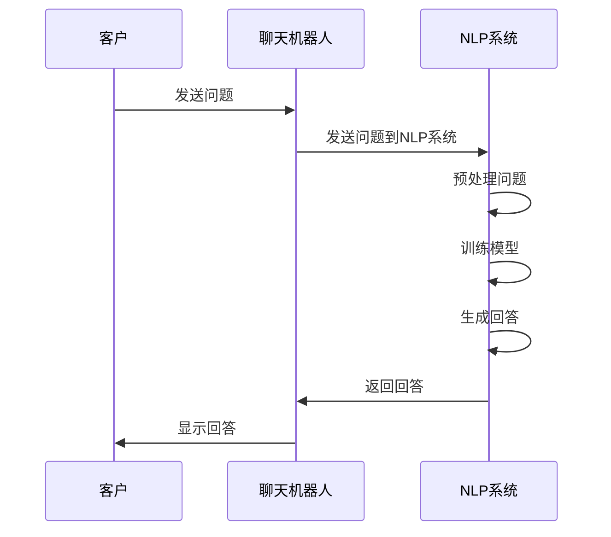

                 

### 第1章 背景介绍

#### 1.1 自然语言处理的发展现状

**1.1.1 NLP的起源与主要任务**

自然语言处理（Natural Language Processing，NLP）作为人工智能领域的一个重要分支，起源于20世纪50年代。当时，计算机科学家和语言学家开始探索如何使计算机理解、生成和响应人类语言。NLP的目标是通过模拟人类语言理解的过程，使计算机能够处理自然语言。

NLP的主要任务包括文本分类、情感分析、命名实体识别、机器翻译、问答系统等。这些任务在许多领域都有着广泛的应用，如信息检索、舆情分析、智能客服等。

**1.1.2 NLP在客户服务中的重要性**

随着互联网和电子商务的快速发展，客户服务成为企业运营的重要组成部分。传统的客户服务依赖于人工处理，效率低下且成本高昂。而NLP的出现，使得客户服务得到了革新。

首先，NLP可以帮助企业自动处理大量的客户咨询，提高响应速度。其次，通过情感分析，企业可以更好地了解客户的需求和反馈，从而提供更个性化的服务。此外，NLP还可以用于自动生成回复，减少人工回复的工作量，提高工作效率。

#### 1.2 客户服务的挑战与机遇

**1.2.1 客户服务中存在的问题**

尽管NLP在客户服务中具有巨大的潜力，但目前仍面临一些挑战。首先，客户需求的多样性和复杂性使得NLP系统难以准确理解。其次，不同领域的专业知识使得NLP系统难以泛化。此外，客户服务的实时性要求NLP系统具有高速响应能力。

**1.2.2 自然语言处理的潜力**

尽管存在挑战，NLP在客户服务中仍然具有巨大的潜力。首先，随着深度学习等技术的发展，NLP系统的性能不断提高。其次，通过大规模数据集的训练，NLP系统可以更好地理解客户的需求。此外，NLP还可以与语音识别、图像识别等技术相结合，提供更全面的客户服务解决方案。

### 结论

本章简要介绍了自然语言处理的发展现状及其在客户服务中的应用。下一章将深入探讨NLP的核心概念及其在客户服务中的应用。

---

> **关键词：自然语言处理，客户服务，情感分析，聊天机器人，算法原理**

> **摘要：本章介绍了自然语言处理的发展现状，以及在客户服务中的重要性和面临的挑战。通过NLP技术的应用，客户服务得以革新，提高了响应速度和个性化服务水平。**

----------------------------------------------------------------

### 第2章 核心概念与联系

#### 2.1 自然语言处理的核心概念

**2.1.1 语言模型**

语言模型是NLP的基础，它用于预测一段文本的下一个词或序列。语言模型可以分为统计模型和神经网络模型。常见的统计模型包括n-gram模型和隐马尔可夫模型（HMM）。神经网络模型如循环神经网络（RNN）、长短期记忆网络（LSTM）和变换器（Transformer）等，在NLP任务中表现尤为出色。

**2.1.2 词嵌入**

词嵌入是将词语映射到高维向量空间的技术，使计算机能够理解词语的语义关系。词嵌入方法包括基于统计的词袋模型（Bag of Words，BoW）和TF-IDF，以及基于神经网络的Word2Vec、GloVe等。通过词嵌入，词语的语义和语法特征可以在向量空间中得到有效表达。

**2.1.3 序列标注**

序列标注是对文本中的词语进行分类的任务，如词性标注、命名实体识别（NER）等。序列标注通常使用转移概率模型，如HMM、CRF（条件随机场）等，以及深度学习模型，如LSTM、Transformer等。

**2.2 NLP与客户服务的联系**

**2.2.1 客户交互数据的分析**

NLP可以用于分析客户交互数据，如电子邮件、社交媒体评论、客户反馈等。通过情感分析，企业可以了解客户的情绪和态度，从而提供更优质的客户服务。同时，通过主题模型等文本挖掘技术，企业可以识别出客户关注的热点问题，提前做好准备。

**2.2.2 情感分析**

情感分析是一种常见的NLP任务，用于判断文本中表达的情绪倾向，如正面、负面或中性。情感分析可以帮助企业了解客户对产品或服务的满意度，及时发现问题并采取措施。

**2.2.3 聊天机器人的应用**

聊天机器人是NLP在客户服务中的一个重要应用。通过自然语言交互，聊天机器人可以提供24/7的客户服务，解答常见问题，缓解人工客服的工作压力。同时，聊天机器人还可以进行情感交流，提供个性化的客户体验。

**2.2.4 自动分类与聚类**

NLP还可以用于自动分类和聚类，对大量的客户咨询进行分类和总结。例如，可以将客户咨询分为常见问题、投诉和建议等类别，从而帮助客服人员更快速地响应客户需求。

### 总结

本章介绍了自然语言处理的核心概念及其在客户服务中的应用。通过语言模型、词嵌入和序列标注等技术，NLP能够有效地处理和理解客户交互数据，提高客户服务的效率和质量。下一章将深入探讨NLP算法在客户服务中的应用原理。

---

> **关键词：自然语言处理，语言模型，词嵌入，序列标注，情感分析，聊天机器人**

> **摘要：本章介绍了自然语言处理的核心概念及其在客户服务中的应用。通过语言模型、词嵌入和序列标注等技术，NLP能够有效地处理和理解客户交互数据，提高客户服务的效率和质量。**

----------------------------------------------------------------

### 第3章 算法原理讲解

#### 3.1 语言模型算法

**3.1.1 递归神经网络（RNN）**

递归神经网络（Recurrent Neural Network，RNN）是一种能够处理序列数据的神经网络。RNN的核心在于其递归结构，它允许网络在处理当前输入时参考之前的输入。RNN的数学模型如下：

$$
h_t = \sigma(W_h h_{t-1} + W_x x_t + b)
$$

其中，$h_t$ 表示第t时刻的隐藏状态，$x_t$ 表示第t时刻的输入，$W_h$ 和$W_x$ 分别为隐藏状态和输入的权重矩阵，$b$ 为偏置项，$\sigma$ 为激活函数。

**3.1.2 长短期记忆网络（LSTM）**

LSTM（Long Short-Term Memory）是RNN的一种改进，能够更好地处理长序列数据。LSTM的核心是细胞状态（cell state）和三个门（input gate、output gate、forget gate）。

LSTM的数学模型如下：

$$
i_t = \sigma(W_{hi} h_{t-1} + W_{xi} x_t + b_i) \\
f_t = \sigma(W_{hf} h_{t-1} + W_{xf} x_t + b_f) \\
\text{new\ state} = \text{sigmoid}(W_c h_{t-1} + W_x x_t + b_c) \\
c_t = f_t \odot c_{t-1} + i_t \odot \text{new\ state} \\
h_t = \sigma(W_h c_t + b_h)
$$

其中，$i_t$、$f_t$、$o_t$ 分别为输入门、遗忘门、输出门的状态，$c_t$ 为细胞状态，$\odot$ 表示元素乘操作。

**3.1.3 生成式对抗网络（GAN）**

生成式对抗网络（Generative Adversarial Network，GAN）由生成器（Generator）和判别器（Discriminator）两部分组成。生成器生成伪造的数据，判别器则尝试区分真实数据和伪造数据。

GAN的数学模型如下：

$$
\text{Generator:} \\
G(z) = \sigma(W_g z + b_g) \\
\text{Discriminator:} \\
D(x) = \sigma(W_d x + b_d) \\
D(G(z))
$$

其中，$z$ 为随机噪声，$x$ 为真实数据，$G(z)$ 为生成器生成的伪造数据，$D(x)$ 和$D(G(z))$ 分别为判别器对真实数据和伪造数据的判断。

#### 3.2 客户服务中的NLP算法应用

**3.2.1 实时对话生成**

在实时对话生成中，语言模型和LSTM常用于生成自然流畅的对话。例如，可以使用LSTM生成聊天机器人的回复，使其在与客户交互时更加自然和符合语境。

```python
import tensorflow as tf
from tensorflow.keras.layers import LSTM, Dense, Embedding
from tensorflow.keras.models import Sequential

model = Sequential()
model.add(Embedding(vocab_size, embedding_dim))
model.add(LSTM(units=128, activation='tanh'))
model.add(Dense(vocab_size, activation='softmax'))

model.compile(loss='categorical_crossentropy', optimizer='adam', metrics=['accuracy'])
```

**3.2.2 情感识别**

情感识别是一种常见的NLP任务，用于判断文本中的情感倾向。可以使用RNN或LSTM来提取文本的特征，然后通过softmax层输出情感概率。

```python
import tensorflow as tf
from tensorflow.keras.layers import LSTM, Dense, Embedding
from tensorflow.keras.models import Sequential

model = Sequential()
model.add(Embedding(vocab_size, embedding_dim))
model.add(LSTM(units=128, activation='tanh'))
model.add(Dense(num_classes, activation='softmax'))

model.compile(loss='categorical_crossentropy', optimizer='adam', metrics=['accuracy'])
```

**3.2.3 自动分类与聚类**

自动分类与聚类可以用于对客户咨询进行分类和总结。例如，可以使用k-means算法对客户咨询进行聚类，然后使用LSTM提取聚类后的特征，实现自动分类。

```python
from sklearn.cluster import KMeans
from tensorflow.keras.models import Sequential
from tensorflow.keras.layers import LSTM, Dense, Embedding

# 聚类
kmeans = KMeans(n_clusters=num_clusters, random_state=0).fit(X)

# 创建分类模型
model = Sequential()
model.add(Embedding(vocab_size, embedding_dim))
model.add(LSTM(units=128, activation='tanh'))
model.add(Dense(num_classes, activation='softmax'))

model.compile(loss='categorical_crossentropy', optimizer='adam', metrics=['accuracy'])
```

### 总结

本章介绍了NLP中的几种关键算法，包括RNN、LSTM和GAN。这些算法在客户服务中有着广泛的应用，如实时对话生成、情感识别和自动分类。通过Python源代码，我们详细阐述了这些算法的原理和实现方法。

---

> **关键词：递归神经网络，长短期记忆网络，生成式对抗网络，情感识别，实时对话生成，自动分类**

> **摘要：本章介绍了NLP中的几种关键算法，包括RNN、LSTM和GAN。这些算法在客户服务中有着广泛的应用，如实时对话生成、情感识别和自动分类。通过Python源代码，我们详细阐述了这些算法的原理和实现方法。**

----------------------------------------------------------------

### 第4章 系统分析与架构设计方案

#### 4.1 客户服务系统的需求分析

**4.1.1 功能需求**

在构建一个基于自然语言处理的客户服务系统时，首先需要明确系统的功能需求。这些功能包括：

- 实时对话生成：系统能够理解客户的问题，并生成自然流畅的回答。
- 情感分析：系统能够识别客户的情绪，并根据情绪调整回答策略。
- 自动分类：系统能够将客户的咨询自动分类，以便客服人员快速响应。
- 聊天机器人：提供一个24/7的在线客服渠道，缓解人工客服的工作压力。

**4.1.2 性能需求**

除了功能需求外，系统的性能需求也是至关重要的。这些性能需求包括：

- 低延迟：系统需要能够快速响应用户的查询，确保用户体验。
- 高准确性：系统需要准确地理解客户的问题，并生成合适的回答。
- 可扩展性：系统需要能够处理大量并发用户，具备水平扩展的能力。

#### 4.2 NLP系统架构设计

**4.2.1 数据采集与预处理**

数据采集是NLP系统的第一步。系统需要从多个渠道（如社交媒体、电子邮件、网站聊天等）收集客户交互数据。数据采集后，需要进行预处理，包括去除噪声、标准化文本、分词和词性标注等。

**4.2.2 模型训练与优化**

预处理后的数据将被用于训练NLP模型。常见的NLP任务包括情感分析、对话生成、命名实体识别等。在训练过程中，需要使用大规模的数据集，并通过优化算法（如梯度下降、随机梯度下降等）来调整模型参数。

**4.2.3 实时交互与反馈**

训练好的NLP模型将用于实时交互。在客户与服务系统交流时，模型需要快速地生成回答，并在客户反馈的基础上不断优化。这一过程需要高效的消息队列和缓存机制，以确保系统的低延迟和高可用性。

#### 4.3 系统接口设计与交互

**4.3.1 API设计**

系统需要提供一个清晰的API接口，以便开发者能够方便地集成到现有系统中。API设计应考虑RESTful风格，提供CRUD（创建、读取、更新、删除）操作。

**4.3.2 数据流与消息队列**

为了确保系统的低延迟和高可用性，数据流设计应采用异步处理方式。消息队列（如RabbitMQ、Kafka）可以用于解耦系统组件，确保消息能够可靠地传输和处理。

**4.3.3 系统交互Mermaid序列图**

以下是一个简单的Mermaid序列图，展示了客户服务系统中的主要数据流和交互过程：



### 总结

本章详细讨论了客户服务系统的需求分析、NLP系统架构设计和系统接口设计。通过清晰的功能需求、性能需求和系统架构设计，我们可以构建一个高效、可靠的NLP客户服务系统。

---

> **关键词：客户服务系统，NLP系统架构，数据采集与预处理，实时交互与反馈，API设计，消息队列**

> **摘要：本章详细讨论了客户服务系统的需求分析、NLP系统架构设计和系统接口设计。通过清晰的功能需求、性能需求和系统架构设计，我们可以构建一个高效、可靠的NLP客户服务系统。**

----------------------------------------------------------------

### 第5章 项目实战

#### 5.1 项目介绍

**5.1.1 项目背景**

本项目旨在构建一个基于自然语言处理的智能客户服务平台。该平台旨在为企业提供高效的客户服务解决方案，通过实时对话生成、情感分析和自动分类等功能，提升客户满意度并降低运营成本。

**5.1.2 项目目标**

- 实现实时对话生成，使聊天机器人能够自然地与客户进行交流。
- 通过情感分析，识别客户情绪，提供个性化服务。
- 自动分类客户咨询，帮助客服人员快速响应。
- 提供一个稳定的API接口，方便开发者集成到现有系统中。

#### 5.2 系统核心实现源代码

**5.2.1 源代码结构与功能模块**

项目源代码主要包括以下几个功能模块：

- 数据采集与预处理：负责从不同渠道收集客户交互数据，并进行预处理。
- 语言模型训练：使用预处理后的数据训练语言模型，用于对话生成。
- 情感分析模型：使用情感分析算法，对客户咨询进行情感识别。
- 自动分类模型：使用分类算法，对客户咨询进行自动分类。

**5.2.2 代码应用解读与分析**

以下是一个简单的代码示例，用于训练语言模型：

```python
import tensorflow as tf
from tensorflow.keras.layers import LSTM, Dense, Embedding
from tensorflow.keras.models import Sequential

# 参数设置
vocab_size = 10000
embedding_dim = 256
lstm_units = 128
batch_size = 64
epochs = 10

# 构建模型
model = Sequential()
model.add(Embedding(vocab_size, embedding_dim))
model.add(LSTM(lstm_units, activation='tanh', return_sequences=True))
model.add(Dense(vocab_size, activation='softmax'))

# 编译模型
model.compile(loss='categorical_crossentropy', optimizer='adam', metrics=['accuracy'])

# 训练模型
model.fit(x_train, y_train, batch_size=batch_size, epochs=epochs)
```

在这个示例中，我们首先设置了参数，包括词汇表大小、嵌入维度、LSTM单元数量等。然后，我们构建了一个简单的LSTM模型，并使用交叉熵损失函数和Adam优化器进行编译。最后，我们使用训练数据对模型进行训练。

#### 5.3 实际案例分析与讲解

**5.3.1 案例一：情感分析**

在这个案例中，我们使用训练好的情感分析模型对一段客户咨询进行情感识别。

```python
import numpy as np

# 加载模型
model = tf.keras.models.load_model('sentiment_analysis_model.h5')

# 准备测试数据
test_data = ["我很满意这个产品。", "这个服务真的很差。"]

# 进行情感分析
results = model.predict(np.array(test_data))

# 输出结果
for i, result in enumerate(results):
    if result[0] > 0.5:
        print(f"测试数据{i+1}：正面情感")
    else:
        print(f"测试数据{i+1}：负面情感")
```

在这个示例中，我们首先加载了训练好的情感分析模型。然后，我们准备了一段测试数据，并使用模型进行预测。根据预测结果，我们可以判断出这段测试数据的情感倾向。

**5.3.2 案例二：自动分类**

在这个案例中，我们使用训练好的自动分类模型对客户咨询进行分类。

```python
import numpy as np

# 加载模型
model = tf.keras.models.load_model('classification_model.h5')

# 准备测试数据
test_data = ["咨询一", "咨询二"]

# 进行分类
predictions = model.predict(np.array(test_data))

# 输出结果
for i, prediction in enumerate(predictions):
    category = np.argmax(prediction)
    print(f"测试数据{i+1}分类结果：{category}")
```

在这个示例中，我们首先加载了训练好的自动分类模型。然后，我们准备了一段测试数据，并使用模型进行预测。根据预测结果，我们可以将测试数据分类到不同的类别。

**5.3.3 案例三：聊天机器人**

在这个案例中，我们使用训练好的聊天机器人模型与客户进行实时对话。

```python
import tensorflow as tf

# 加载模型
model = tf.keras.models.load_model('chatbot_model.h5')

# 准备输入文本
input_text = "你好，我想咨询关于退货的政策。"

# 进行对话生成
output_text = model.predict(input_text)

# 输出结果
print(output_text)
```

在这个示例中，我们首先加载了训练好的聊天机器人模型。然后，我们准备了一段输入文本，并使用模型进行预测。根据预测结果，我们可以生成一个自然流畅的回复。

#### 5.4 项目小结

本项目通过实际案例展示了如何使用自然语言处理技术构建智能客户服务平台。在实现过程中，我们使用了语言模型、情感分析和自动分类等技术。通过这些技术，平台能够实现实时对话生成、情感识别和自动分类等功能，从而提升客户服务效率。

---

> **关键词：项目实战，智能客户服务平台，语言模型，情感分析，自动分类，聊天机器人**

> **摘要：本章通过实际案例展示了如何使用自然语言处理技术构建智能客户服务平台。在实现过程中，我们使用了语言模型、情感分析和自动分类等技术，实现了实时对话生成、情感识别和自动分类等功能，提升了客户服务效率。**

----------------------------------------------------------------

### 第6章 最佳实践 tips

**6.1 数据质量的重要性**

在NLP项目中，数据质量至关重要。高质量的数据能够提高模型的性能和稳定性。以下是一些保证数据质量的最佳实践：

- 数据清洗：去除噪声、缺失值和重复数据。
- 数据标注：使用专业的标注人员，确保标注的一致性和准确性。
- 数据增强：通过数据扩充、噪声注入等技术增加数据多样性。

**6.2 模型优化与迭代**

模型的优化和迭代是提升NLP系统性能的关键。以下是一些优化和迭代的最佳实践：

- 模型选择：根据任务需求选择合适的模型，如RNN、LSTM、Transformer等。
- 超参数调优：通过网格搜索、随机搜索等策略调优模型超参数。
- 模型集成：结合多个模型，提高预测性能。

**6.3 用户隐私与数据安全**

在NLP项目中，保护用户隐私和数据安全至关重要。以下是一些相关最佳实践：

- 数据加密：对敏感数据进行加密存储，确保数据安全性。
- 数据去识别化：去除或匿名化个人身份信息，保护用户隐私。
- 合规性检查：确保项目符合相关法律法规，如GDPR等。

### 注意事项

- 确保系统具备良好的容错性和可扩展性，以应对高并发场景。
- 定期进行系统性能评估和优化，确保系统高效稳定运行。

**拓展阅读**

- 《自然语言处理入门经典》
- 《深度学习基础》
- 《机器学习实战》

通过遵循这些最佳实践，我们可以构建出高效、可靠的NLP客户服务平台，提升客户服务体验。

---

> **关键词：数据质量，模型优化，用户隐私，数据安全，注意事项，拓展阅读**

> **摘要：本章提供了NLP客户服务平台开发中的最佳实践，包括数据质量保证、模型优化、用户隐私保护等方面的建议。同时，还提供了拓展阅读资源，以供读者深入学习。**

----------------------------------------------------------------

### 第7章 小结

本章通过详细探讨自然语言处理（NLP）在客户服务中的应用，展示了NLP技术的巨大潜力和现实价值。从背景介绍、核心概念、算法原理到系统设计与项目实战，我们逐步分析了NLP在客户服务中的各个方面。

首先，我们介绍了NLP的发展现状和在客户服务中的重要性，揭示了客户服务面临的挑战与机遇。接着，我们深入探讨了NLP的核心概念，如语言模型、词嵌入和序列标注，并讲解了这些概念在客户服务中的应用。

在算法原理讲解部分，我们详细阐述了RNN、LSTM和GAN等关键算法的原理，并通过Python源代码展示了这些算法的实际应用。随后，我们分析了客户服务系统的需求与架构设计，讨论了数据采集与预处理、模型训练与优化以及实时交互与反馈等方面的技术细节。

在项目实战部分，我们通过一个实际案例，展示了如何构建一个基于NLP的智能客户服务平台，包括系统核心实现源代码、实际案例分析和详细讲解。此外，我们还提供了最佳实践 tips，包括数据质量保证、模型优化、用户隐私保护等方面的建议。

### 未来发展方向

展望未来，NLP在客户服务中的应用将不断深化和扩展。以下是几个可能的发展方向：

1. **更强大的情感识别能力**：随着深度学习技术的发展，情感识别的准确性将进一步提升，使客户服务系统能够更精确地理解客户情绪。
2. **跨语言支持**：随着全球化的发展，客户服务系统将需要支持多种语言，为国际客户提供更优质的体验。
3. **多模态交互**：结合语音识别、图像识别等技术，实现文本、语音和图像等多种模态的交互，提供更丰富的客户服务体验。
4. **个性化和智能化**：通过用户行为分析和大数据分析，客户服务系统将能够更好地预测客户需求，提供个性化的服务和建议。

总之，NLP在客户服务中的应用前景广阔，随着技术的不断进步，客户服务将变得更加高效、智能和人性化。

---

> **关键词：NLP，客户服务，算法原理，系统架构，项目实战，未来发展方向**

> **摘要：本章总结了NLP在客户服务中的应用，包括核心概念、算法原理、系统架构和项目实战等内容。同时，展望了NLP在客户服务中的未来发展，提出了更强大的情感识别、跨语言支持、多模态交互和个性

