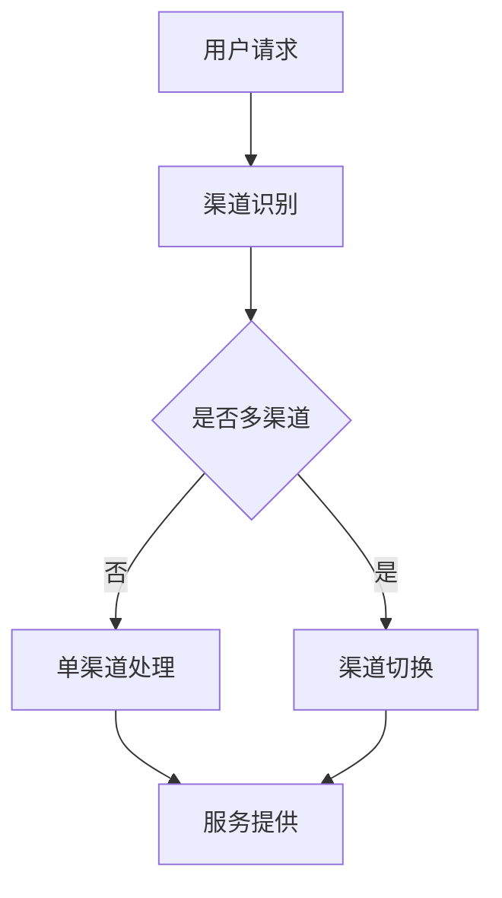
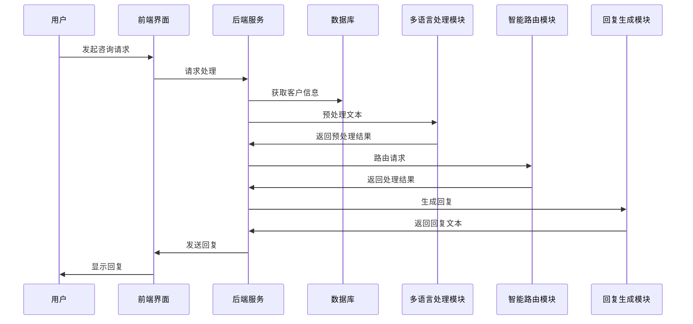

                 

### 引入

#### 自然语言处理与智能客服

自然语言处理（Natural Language Processing，NLP）是计算机科学、人工智能领域中的一个重要分支，它专注于使计算机能够理解、解释和生成人类语言。而智能客服（Intelligent Customer Service）则是自然语言处理技术在实际应用中的一个典型例子。随着互联网和电子商务的快速发展，客户服务需求日益增长，传统的基于人工客服的服务模式已经难以满足大规模、多元化的客户需求。因此，智能客服系统的出现，不仅极大地提高了客户服务的效率，也显著降低了企业的人力成本。

智能客服通过自然语言处理技术，实现了对客户咨询的自然语言理解和智能回复。它不仅仅能处理简单的查询，还能理解客户的情感、意图，甚至提供个性化的服务建议。这一技术的重要性体现在以下几个方面：

1. **提高响应速度**：智能客服系统能够在短时间内处理大量的客户咨询，大大缩短了客户等待时间，提升了客户满意度。
2. **降低人力成本**：智能客服取代了部分人工客服的工作，减少了企业的人力资源投入。
3. **数据积累与分析**：智能客服在处理客户咨询的过程中，积累了大量的数据，通过对这些数据的分析，企业可以更好地了解客户需求，优化服务策略。
4. **增强用户体验**：智能客服系统能够提供24/7的全天候服务，满足客户的多样化需求，提升了客户体验。

本文旨在深入探讨自然语言处理在智能客服中的应用，从多语言和全渠道两个方面分析智能客服系统的实现方法和技术挑战。我们将逐步介绍多语言处理的挑战与解决方案，全渠道客服的整合技术，以及如何实现多语言全渠道客服机器人。同时，本文也将结合实际案例，详细讲解系统的架构设计和实现细节。

#### 多语言处理的挑战与解决方案

多语言处理（Multilingual Processing）是自然语言处理技术中的一个重要分支，它涉及到对多种语言的识别、理解和生成。在智能客服系统中，多语言处理能力尤为重要，因为它需要能够处理来自不同国家和地区的客户咨询。然而，多语言处理面临许多技术挑战：

1. **语言多样性**：世界上的语言种类繁多，每种语言都有其独特的语法、词汇和表达方式。不同语言之间的差异使得多语言处理变得更加复杂。

2. **数据不足**：高质量的多语言数据集是训练高效多语言模型的基石。然而，由于语言资源的分布不均衡，许多语言的数据量有限，这给多语言模型的训练和优化带来了困难。

3. **模型适配性**：不同的语言可能需要不同的模型结构和参数设置。如何设计一个能够适应多种语言的通用模型，是一个重要的技术挑战。

为了解决这些挑战，研究者们提出了多种多语言处理技术：

1. **跨语言转移学习**：通过在一个大规模的多语言数据集上预先训练模型，然后将模型的知识迁移到新的语言上，可以有效缓解数据不足的问题。

2. **多语言词嵌入**：通过将不同语言的词汇映射到同一高维空间中，实现词汇的跨语言表示，从而提高多语言处理的效果。

3. **多语言模型架构**：例如，Transformer模型可以通过并行处理多种语言的数据，实现高效的多语言建模。

在多语言客服机器人的实现过程中，以下方法被广泛应用：

1. **数据预处理**：在训练多语言模型之前，需要进行数据清洗和预处理，包括语言识别、文本清洗、词汇标准化等步骤。

2. **多语言模型训练**：通过训练多语言模型，使系统能够理解和生成多种语言的文本。常见的模型包括基于神经网络的语言模型和多语言机器翻译模型。

3. **实时交互**：在客服机器人与客户交互时，需要实时识别客户的语言并进行自然语言理解，然后生成合适的回复。这一过程需要高效的语言处理算法和良好的系统设计。

4. **自适应调整**：根据客户的反馈和交互数据，对客服机器人进行持续优化和调整，以提高其多语言处理能力和用户体验。

通过上述技术和方法，多语言客服机器人能够为不同语言的用户提供高质量的服务，满足全球范围内客户的多样化需求。

#### 全渠道客服的整合与优化

全渠道客服（ Omnichannel Customer Service）是一种以客户为中心的服务模式，旨在提供一致、无缝的客户体验。它不仅包括传统的电话、邮件、聊天等渠道，还涵盖了社交媒体、移动应用、短信等多种新兴渠道。全渠道客服的核心目标是确保客户无论通过哪种渠道进行沟通，都能获得统一、高效的服务体验。

#### 全渠道客服的优势

1. **提升客户满意度**：全渠道客服能够满足客户在不同场景和设备上的需求，提供灵活、便捷的服务，从而提高客户满意度。

2. **增强客户忠诚度**：通过统一渠道管理和数据共享，企业可以更好地了解客户需求，提供个性化的服务，增强客户忠诚度。

3. **提高运营效率**：全渠道客服系统可以实现自动化和智能化处理，减少人工干预，提高服务效率，降低运营成本。

4. **数据整合与分析**：全渠道客服系统能够收集和分析来自各个渠道的客户数据，帮助企业更好地了解客户行为，优化服务策略。

#### 多渠道整合的技术实现

多渠道整合是实现全渠道客服的关键。以下是一些主要的技术实现方法：

1. **渠道识别**：在客户进行沟通时，系统能够自动识别客户所使用的渠道，如电话、邮件、社交媒体等，并据此调整服务流程。

2. **数据同步**：不同渠道的数据需要进行同步，确保客户在不同渠道上的互动数据一致。例如，客户在社交媒体上的问题，可以通过聊天渠道进行回复，同时更新数据库中的客户信息。

3. **统一用户界面**：设计统一的用户界面，使客户在不同渠道上获得相似的操作体验。例如，在移动应用和网页上提供相同的功能按钮和菜单。

4. **智能路由**：根据客户的需求和问题复杂度，将客户咨询智能路由到最适合的客服人员或系统进行处理。

5. **自动化和智能化处理**：利用自然语言处理和机器学习技术，实现自动化和智能化处理，减少人工干预，提高服务效率。

#### 案例分析

以某大型电商平台的全渠道客服系统为例，该平台通过整合电话、邮件、聊天、社交媒体等多种渠道，提供无缝的客户服务。以下是该平台的几个关键模块：

1. **渠道识别模块**：通过自动识别客户所使用的渠道，如电话、邮件、聊天等，并将这些渠道的数据进行整合。

2. **智能路由模块**：根据客户的问题类型和复杂度，将客户咨询智能路由到最适合的客服人员或系统进行处理。

3. **数据同步模块**：确保客户在不同渠道上的互动数据一致，例如，客户在社交媒体上的问题，可以通过聊天渠道进行回复，并更新数据库中的客户信息。

4. **自动化处理模块**：利用自然语言处理和机器学习技术，实现自动化和智能化处理，例如，自动回答常见问题，智能识别客户情绪等。

5. **用户体验模块**：设计统一的用户界面，使客户在不同渠道上获得相似的操作体验，提高客户满意度。

通过这些模块的整合，该电商平台实现了全渠道客服的目标，提供了高效、便捷、个性化的客户服务体验。

#### 概念结构与核心要素组成

自然语言处理（NLP）是构建智能客服系统的核心，其技术架构和业务流程决定了客服系统的性能和用户体验。以下是对自然语言处理技术架构和智能客服业务流程的详细解析。

##### 自然语言处理的技术架构

自然语言处理的技术架构主要包括以下几个核心模块：

1. **文本预处理模块**：这一模块负责对输入文本进行清洗、分词、去停用词等处理，为后续的自然语言理解打下基础。文本预处理的质量直接影响后续模块的性能。

2. **语言模型模块**：语言模型是NLP中的基础，用于预测一段文本的下一个单词或字符。常见的语言模型包括n-gram模型、循环神经网络（RNN）和Transformer模型等。

3. **词嵌入模块**：词嵌入将词汇映射到高维向量空间中，使得计算机能够理解和处理词汇之间的语义关系。常见的词嵌入方法包括Word2Vec、GloVe和BERT等。

4. **实体识别与关系抽取模块**：这一模块用于识别文本中的实体（如人名、地名、组织名等）以及实体之间的关系（如“张三工作于阿里巴巴”中的“张三”和“阿里巴巴”之间的关系）。

5. **情感分析模块**：情感分析用于判断文本的情绪倾向，例如正面、负面或中性。这一模块在客服中尤为重要，可以帮助系统更好地理解客户情绪，提供针对性的服务。

6. **问答系统模块**：问答系统模块用于处理用户的问答请求，通过匹配问题与知识库中的答案，生成合适的回复。

7. **生成对抗网络（GAN）**：GAN在NLP中的应用包括生成文本、图像等，用于提升客服机器人的生成能力，使其能够生成更加自然和符合人类语法的回复。

##### 智能客服的业务流程

智能客服的业务流程可以概括为以下几个步骤：

1. **客户请求接收**：客服系统接收客户的咨询请求，可以是文字、语音或其他形式。

2. **文本预处理**：对客户请求的文本进行清洗、分词、去停用词等预处理操作，以便后续的语言处理。

3. **语言模型与词嵌入**：利用语言模型和词嵌入技术，对预处理后的文本进行语义理解，提取关键信息。

4. **实体识别与关系抽取**：识别文本中的实体和关系，如客户姓名、产品型号等，以便进行精确回复。

5. **情感分析**：分析客户请求中的情绪倾向，如愤怒、满意等，为客服系统提供情绪反馈。

6. **问答系统处理**：根据客户请求的内容，在知识库中查找匹配的答案，生成回复。

7. **回复生成与优化**：利用生成对抗网络（GAN）等技术，对生成的回复进行优化，使其更加自然和符合人类语言习惯。

8. **回复发送**：将处理后的回复发送给客户，完成一次客服交互。

##### Mermaid ER实体关系图

以下是一个Mermaid ER实体关系图，用于描述自然语言处理和智能客服中的关键实体及其关系：

```mermaid
erDiagram
    客户 --> 请求
    |<.. 文本预处理
    |<.. 语言模型
    |<.. 词嵌入
    |<.. 实体识别与关系抽取
    |<.. 情感分析
    |<.. 问答系统
    |<.. 回复生成与优化
    请求 --> 回复
```

通过上述技术架构和业务流程的解析，我们可以看到自然语言处理在智能客服系统中的核心地位。优化这些技术模块和流程，能够显著提升智能客服系统的性能和用户体验。

#### 本书的目的与结构

本书的编写旨在全面介绍自然语言处理（NLP）在智能客服中的应用，并深入探讨多语言全渠道客服机器人的实现方法。通过对自然语言处理技术、多语言处理技术、全渠道客服整合技术等核心内容的详细讲解，本书希望能够为读者提供系统、全面的技术参考，助力他们在实际项目中实现高效、智能的客服系统。

##### 本书的目的

1. **普及NLP知识**：帮助读者了解自然语言处理的基本概念、核心技术和应用场景，为智能客服系统的开发打下理论基础。
2. **探讨多语言处理技术**：详细讲解多语言处理的挑战、解决方案和实现方法，为全球化企业提供技术支持。
3. **实现全渠道客服整合**：分析全渠道客服的整合技术，提供实战案例和最佳实践，助力企业提升客户服务水平和运营效率。

##### 书的结构

本书的结构分为四个主要部分，每个部分都围绕核心主题展开：

1. **引言**：介绍自然语言处理与智能客服的关系，阐述本书的核心内容和结构。

2. **核心技术讲解**：
   - **第2章：自然语言处理基本原理**：详细讲解语言模型、词嵌入等核心概念，并通过对比表格和Mermaid ER实体关系图，帮助读者深入理解。
   - **第3章：多语言处理技术**：分析多语言处理的挑战，介绍多语言处理技术，并通过Mermaid流程图展示技术实现过程。
   - **第4章：全渠道客服整合技术**：探讨全渠道客服的概念、优势和整合技术，通过Mermaid类图和架构图，阐述系统设计思路。

3. **实践案例剖析**：通过实际项目案例，详细讲解系统的架构设计、实现过程和效果评估，帮助读者将理论知识应用于实际项目中。

4. **最佳实践与总结**：总结本书的核心内容，提供最佳实践建议，帮助读者在实际工作中高效应用所学知识。

本书的目标读者包括从事智能客服开发、自然语言处理研究和应用的技术人员，以及希望了解这一领域的学生和研究人员。通过系统的学习和实践，读者将能够掌握智能客服系统的核心技术，提升项目开发能力和技术水平。

### 第2章: 自然语言处理基本原理

#### 2.1 语言模型

语言模型（Language Model）是自然语言处理中一个核心的概念，它用于预测一段文本的下一个单词或字符。在构建智能客服系统时，语言模型能够帮助我们理解和生成自然语言文本，从而实现与用户的自然互动。

##### 概念原理

1. **定义**：语言模型是一个概率模型，它根据前文预测下一个词或字符的概率分布。常见的形式包括n-gram模型、循环神经网络（RNN）和Transformer模型。

2. **基本工作原理**：
   - **n-gram模型**：基于前文n个单词或字符的统计特性进行预测。例如，对于三元组（单词1，单词2，单词3），n-gram模型会统计这个三元组出现的频率，从而预测下一个单词。
   - **RNN（循环神经网络）**：能够处理变长的序列数据，通过循环结构记忆前文信息，从而进行预测。RNN在处理长文本时表现出色，但存在梯度消失和梯度爆炸等问题。
   - **Transformer模型**：基于自注意力机制，能够并行处理输入序列，广泛应用于文本分类、机器翻译等领域。Transformer模型在处理长距离依赖和生成复杂文本方面表现出色。

##### 属性特征对比表格

以下是对几种常见语言模型的特点和适用场景的对比：

| 语言模型类型 | 特点 | 适用场景 |
| :--: | :--: | :--: |
| n-gram | 简单，快速 | 长文本生成，文本分类 |
| RNN | 能够处理变长序列 | 语音识别，机器翻译 |
| Transformer | 强大的并行处理能力 | 文本分类，机器翻译 |

##### 实例说明

假设我们有一个简短的句子：“今天天气很好，阳光明媚”。利用n-gram模型进行预测，我们可以看到以下预测结果：

- 当前状态：今天天气很好，
  - 预测下一个词：“阳光”、“晴朗”、“温度”等。

通过这种预测方式，语言模型能够根据前文的信息，生成可能的后文。

##### 数学模型

对于n-gram模型，其数学模型可以表示为：

\[ P(w_n | w_{n-1}, w_{n-2}, \ldots, w_1) = \frac{C(w_n, w_{n-1}, \ldots, w_1)}{C(w_{n-1}, \ldots, w_1)} \]

其中，\( w_n \) 表示下一个词，\( w_{n-1}, w_{n-2}, \ldots, w_1 \) 表示前文词，\( C(\cdot) \) 表示词组出现的频率。

对于Transformer模型，其核心思想是基于自注意力机制，其数学模型可以简化为：

\[ \text{Attention}(Q, K, V) = \text{softmax}\left(\frac{QK^T}{\sqrt{d_k}}\right)V \]

其中，\( Q \)，\( K \)，\( V \) 分别表示查询向量、键向量和值向量，\( d_k \) 表示键向量的维度。

通过这些数学模型和实例，我们可以更好地理解语言模型在自然语言处理中的应用和实现方法。

#### 2.2 词嵌入

词嵌入（Word Embedding）是将词汇映射到高维向量空间中的一种技术，从而使得计算机能够理解和处理词汇之间的语义关系。在自然语言处理中，词嵌入是一个重要的环节，它能够显著提升模型的性能和效果。

##### 概念原理

1. **定义**：词嵌入将每个词汇映射为一个固定长度的向量。通过这些向量，计算机可以在高维空间中表示和操作词汇，从而实现语义理解。

2. **作用**：
   - **降低维度**：将词汇从原始的文本形式转换为向量形式，降低数据的维度，便于计算机处理。
   - **表示语义关系**：词嵌入能够捕捉词汇之间的语义关系，如词义相近的词汇在向量空间中距离较近。

3. **常见方法**：
   - **Word2Vec**：基于神经网络的词嵌入方法，通过训练一个神经网络，将输入文本转换为向量。Word2Vec包括连续词袋（CBOW）和Skip-gram两种模型。
   - **GloVe**：全局向量表示（Global Vectors for Word Representation），通过计算词汇的全球共现矩阵来训练词嵌入。GloVe方法能够更好地捕捉词汇之间的全局关系。
   - **BERT**：基于Transformer的预训练方法，通过大规模的语料库进行预训练，然后进行微调，以适应特定的任务。BERT在词嵌入方面表现出色，能够捕捉上下文的语义信息。

##### 属性特征对比表格

以下是对几种常见词嵌入方法的特点和适用场景的对比：

| 词嵌入方法 | 特点 | 适用场景 |
| :--: | :--: | :--: |
| Word2Vec | 基于神经网络 | 文本分类，情感分析 |
| GloVe | 基于全局共现矩阵 | 机器翻译，问答系统 |
| BERT | 基于注意力机制 | 文本生成，文本分类 |

##### 实例说明

假设我们有两个词汇：“苹果”和“香蕉”，通过词嵌入技术，我们可以将它们映射到高维向量空间中。例如，使用Word2Vec模型，我们可能会得到以下结果：

- “苹果”：\[ [0.1, 0.2, 0.3, 0.4] \]
- “香蕉”：\[ [0.05, 0.15, 0.25, 0.35] \]

通过计算这两个向量的余弦相似度，我们可以发现“苹果”和“香蕉”在向量空间中距离较近，表明这两个词在语义上有一定的关联性。

##### 数学模型

1. **Word2Vec**

   Word2Vec的数学模型可以简化为：

   \[ \text{softmax}(W \cdot \text{context\_word\_vector}) \]

   其中，\( W \) 是权重矩阵，\(\text{context\_word\_vector}\) 是当前词的词向量。

2. **GloVe**

   GloVe的数学模型基于共现矩阵，可以表示为：

   \[ \text{loss} = \frac{1}{N} \sum_{i=1}^{N} \frac{(\text{emb}_i - \text{emb}_{word_i} \cdot \text{emb}_{context})^2}{1 + \text{emb}_i \cdot \text{emb}_{word_i} \cdot \text{emb}_{context}} \]

   其中，\(\text{emb}_i\) 表示词的词向量，\(\text{emb}_{word_i}\) 和 \(\text{emb}_{context}\) 分别表示目标词和上下文的词向量。

通过这些数学模型和实例，我们可以更好地理解词嵌入在自然语言处理中的应用和实现方法。词嵌入技术不仅能够提升模型的性能，还能够帮助我们在高维空间中探索词汇的语义关系。

### 第3章：多语言处理技术

多语言处理技术是自然语言处理领域中的一个重要分支，旨在使计算机能够理解和生成多种语言的文本。随着全球化趋势的加深，企业需要能够为全球范围内的客户提供统一、高效的服务。多语言处理技术因此成为智能客服系统中的关键组成部分。

#### 3.1 多语言处理的挑战

多语言处理面临诸多技术挑战，主要包括以下几个方面：

1. **语言多样性**：世界上有数千种语言，每种语言都有其独特的语法、词汇和表达方式。这种多样性使得多语言处理变得复杂。

2. **数据不足**：高质量的多语言数据集是训练高效多语言模型的基石。然而，由于语言资源的分布不均衡，许多语言的数据量有限，这给多语言模型的训练和优化带来了困难。

3. **模型适配性**：不同的语言可能需要不同的模型结构和参数设置。如何设计一个能够适应多种语言的通用模型，是一个重要的技术挑战。

4. **跨语言一致性**：确保不同语言之间的处理结果具有一致性，是一个关键问题。例如，在翻译过程中，需要确保不同语言之间的词汇和语法能够正确匹配。

5. **跨语言迁移**：如何将一个语言上的模型知识有效地迁移到新的语言上，也是一个重要的问题。

#### 3.2 多语言处理技术

为了应对上述挑战，研究者们提出了多种多语言处理技术，包括：

1. **跨语言转移学习**：通过在一个大规模的多语言数据集上预先训练模型，然后将模型的知识迁移到新的语言上。这种方法可以有效缓解数据不足的问题。常见的跨语言转移学习方法包括基于模型的迁移学习和基于数据的迁移学习。

2. **多语言词嵌入**：通过将不同语言的词汇映射到同一高维空间中，实现词汇的跨语言表示。这种方法能够提高多语言处理的效果，使计算机能够理解和生成多种语言的文本。多语言词嵌入的常见方法包括Cross-lingual Word Embedding和Monolingual Word Embedding。

3. **多语言模型架构**：设计能够同时处理多种语言的模型架构。例如，Transformer模型可以通过并行处理多种语言的数据，实现高效的多语言建模。其他多语言模型架构还包括Low-Resource Language Modeling和Multilingual BERT。

#### Mermaid ER实体关系图

以下是一个Mermaid ER实体关系图，用于描述多语言处理中的关键实体及其关系：

```mermaid
erDiagram
    源语言 --> 目标语言
    |<.. 词嵌入
    |<.. 语言模型
    |<.. 机器翻译模型
```

在这个图中，“源语言”和“目标语言”是核心实体，它们通过“词嵌入”、“语言模型”和“机器翻译模型”进行关联。这些实体和关系构成了多语言处理系统的技术架构，实现了对多种语言的识别、理解和生成。

#### 多语言客服机器人实现

在多语言客服机器人的实现过程中，以下是几个关键步骤：

1. **数据预处理**：在训练多语言模型之前，需要进行数据清洗和预处理，包括语言识别、文本清洗、词汇标准化等步骤。这一步骤是确保数据质量和模型性能的基础。

2. **多语言模型训练**：通过训练多语言模型，使系统能够理解和生成多种语言的文本。常见的训练方法包括基于神经网络的语言模型和多语言机器翻译模型。在这一步骤中，可以使用跨语言转移学习和多语言词嵌入等技术，提高模型的效果。

3. **实时交互**：在客服机器人与客户交互时，需要实时识别客户的语言并进行自然语言理解，然后生成合适的回复。这一过程需要高效的语言处理算法和良好的系统设计，以确保交互的流畅性和准确性。

4. **自适应调整**：根据客户的反馈和交互数据，对客服机器人进行持续优化和调整，以提高其多语言处理能力和用户体验。自适应调整是确保客服机器人能够不断进步，更好地满足客户需求的关键。

通过上述技术步骤，多语言客服机器人能够为不同语言的用户提供高质量的服务，满足全球范围内客户的多样化需求。

### 第4章：全渠道客服整合技术

全渠道客服整合技术是现代客户服务系统的重要组成部分，旨在为用户提供一致、无缝的沟通体验。随着消费者行为和沟通渠道的多样化，企业需要能够支持多渠道的客户服务，以满足不同客户的需求。本章将详细介绍全渠道客服的概念、优势、技术实现以及实际应用。

#### 4.1 全渠道客服概述

全渠道客服（Omnichannel Customer Service）是一种以客户为中心的服务模式，它旨在为用户提供一致、无缝的沟通体验，无论客户选择哪种渠道进行互动，都能够得到一致的服务质量和体验。全渠道客服的关键在于多个渠道之间的无缝整合，确保用户能够在不同渠道上无缝切换，并获得统一的信息和服务。

##### 概念原理

全渠道客服的概念可以从以下几个方面来理解：

1. **多渠道支持**：全渠道客服支持多种沟通渠道，包括电话、邮件、聊天、社交媒体、移动应用、短信等。

2. **统一数据管理**：全渠道客服系统需要将不同渠道的数据进行整合，确保用户信息、互动记录和历史沟通记录在各个渠道之间保持一致。

3. **一致的用户体验**：无论用户选择哪种渠道进行沟通，全渠道客服系统都应提供一致的界面和交互体验，使客户感受到无缝的服务。

4. **个性化服务**：通过整合多个渠道的数据，全渠道客服系统可以更好地了解客户需求和行为，提供个性化的服务建议和解决方案。

##### 优势

全渠道客服的优势主要体现在以下几个方面：

1. **提升客户满意度**：全渠道客服能够满足客户在不同场景和设备上的需求，提供灵活、便捷的服务，从而提高客户满意度。

2. **增强客户忠诚度**：通过统一渠道管理和数据共享，企业可以更好地了解客户需求，提供个性化的服务，增强客户忠诚度。

3. **提高运营效率**：全渠道客服系统可以实现自动化和智能化处理，减少人工干预，提高服务效率，降低运营成本。

4. **数据整合与分析**：全渠道客服系统能够收集和分析来自各个渠道的客户数据，帮助企业更好地了解客户行为，优化服务策略。

##### Mermaid类图

以下是一个Mermaid类图，用于描述全渠道客服的核心实体及其关系：

```mermaid
classDiagram
    Customer --|> Channel: 选择渠道
    Channel --|> Service: 提供服务
    Customer <<interface>>
    Channel <<interface>>
    Service <<interface>>
```

在这个类图中，“Customer”表示客户，“Channel”表示渠道，“Service”表示服务。客户通过选择不同的渠道与系统进行互动，渠道则负责提供具体的服务。类图展示了全渠道客服系统中的主要实体和它们之间的关系。

#### 4.2 多渠道整合

多渠道整合是实现全渠道客服的关键步骤，它涉及到多个渠道的识别、数据同步、统一用户界面和智能路由等方面的技术实现。

##### 概念原理

1. **渠道识别**：在客户进行沟通时，系统能够自动识别客户所使用的渠道，如电话、邮件、聊天、社交媒体等。

2. **数据同步**：不同渠道的数据需要进行同步，确保客户在不同渠道上的互动数据一致。例如，客户在社交媒体上的问题，可以通过聊天渠道进行回复，并更新数据库中的客户信息。

3. **统一用户界面**：设计统一的用户界面，使客户在不同渠道上获得相似的操作体验。例如，在移动应用和网页上提供相同的功能按钮和菜单。

4. **智能路由**：根据客户的需求和问题复杂度，将客户咨询智能路由到最适合的客服人员或系统进行处理。

5. **自动化和智能化处理**：利用自然语言处理和机器学习技术，实现自动化和智能化处理，减少人工干预，提高服务效率。

##### Mermaid架构图

以下是一个Mermaid架构图，用于描述多渠道整合的技术架构：



在这个架构图中，用户请求首先进入渠道识别模块，识别客户所使用的渠道。如果是多渠道请求，则进行渠道切换，否则直接进入单渠道处理模块。无论是多渠道还是单渠道处理，最终都会进入服务提供模块，由系统为用户提供服务。

#### 4.3 实际应用

全渠道客服技术在企业中的应用非常广泛，以下是一些实际应用的例子：

1. **电商平台**：电商平台通过全渠道客服系统，支持用户在网站、移动应用、社交媒体等多个渠道上进行咨询和反馈。系统自动识别用户所使用的渠道，并将用户的问题路由到合适的客服人员处理。

2. **金融机构**：金融机构通过全渠道客服系统，为用户提供电话、邮件、在线聊天等多种服务渠道。系统将用户的问题根据复杂度分配给不同的客服人员，确保用户得到快速、有效的服务。

3. **旅游公司**：旅游公司利用全渠道客服系统，支持用户在网站、移动应用、电话等多个渠道上进行咨询和预订。系统根据用户的需求，提供个性化的旅游方案和预订服务。

4. **医疗服务**：医疗服务机构通过全渠道客服系统，为患者提供电话咨询、在线问诊、预约挂号等多种服务。系统可以自动识别用户的语言和需求，提供精准的医疗咨询服务。

通过全渠道客服整合技术，企业能够为用户提供更加便捷、高效的服务，提升客户满意度和忠诚度，从而在激烈的市场竞争中脱颖而出。

### 实际项目分析：多语言全渠道客服机器人

在本节中，我们将通过一个实际项目案例，详细分析多语言全渠道客服机器人的设计、实现和效果评估。该项目旨在为一家国际电商平台构建一个能够支持多语言、多渠道的智能客服系统，以提升用户体验和客户满意度。

#### 项目介绍

该项目的目标是为一个大型电商平台构建一个多语言全渠道客服机器人，支持英语、中文、西班牙语和法语四种主要语言。客服机器人需要能够处理来自网站、移动应用、社交媒体、邮件和电话等多个渠道的咨询请求，并提供实时、准确、个性化的回复。

#### 系统功能设计

为了实现上述目标，系统设计了以下几个关键功能模块：

1. **多语言处理模块**：负责接收和处理不同语言的文本，包括文本预处理、词嵌入、语言模型和多语言翻译等功能。
2. **渠道识别模块**：自动识别客户咨询所使用的渠道，如网站、移动应用、社交媒体等。
3. **智能路由模块**：根据客户咨询的内容和复杂度，将请求智能路由到合适的客服人员或预定义的回复模板。
4. **回复生成模块**：利用自然语言生成技术，生成符合人类语言习惯的回复。
5. **实时交互模块**：实现客服机器人与客户的实时沟通，支持文本、语音和视频等多种交互方式。
6. **数据分析模块**：收集并分析客户交互数据，用于优化客服机器人的性能和用户体验。

#### 系统架构设计

系统的架构设计采用了分布式架构，确保高可用性和可扩展性。以下是系统的主要架构组件：

1. **前端界面**：包括网站、移动应用和社交媒体等多个渠道的前端界面，用于接收用户的咨询请求。
2. **后端服务**：包括多语言处理服务、渠道识别服务、智能路由服务和回复生成服务，负责处理和响应客户的咨询请求。
3. **数据库**：存储客户数据、历史交互记录和知识库等信息，支持数据的持久化和管理。
4. **API接口**：提供与其他系统（如CRM系统、订单系统等）的集成接口，实现数据同步和业务流程的协同。

#### 系统接口设计和系统交互

以下是一个Mermaid序列图，展示了系统各个模块之间的交互流程：



在这个序列图中，用户通过前端界面发起咨询请求，后端服务接收到请求后，首先从数据库中获取客户信息，然后交由多语言处理模块进行文本预处理。预处理完成后，请求被路由到智能路由模块，根据请求的内容和复杂度，选择最合适的处理方式（如预定义回复或分配给客服人员）。最后，回复生成模块生成符合人类语言习惯的回复，并通过前端界面展示给用户。

#### 项目实战：环境安装与系统核心实现

为了实现上述功能，我们需要进行一系列的环境安装和系统核心实现。以下是项目的关键步骤：

1. **环境搭建**：在服务器上安装Linux操作系统，配置Nginx、Apache等Web服务器，以及MySQL、PostgreSQL等数据库服务器。

2. **语言模型训练**：使用Python和TensorFlow或PyTorch等深度学习框架，训练多语言语言模型和翻译模型。例如，可以使用Google的BERT模型进行预训练，然后进行微调以适应特定的语言。

3. **渠道识别与交互**：开发渠道识别和交互模块，使用Websocket技术实现实时通信，支持文本、语音和视频等多种交互方式。

4. **智能路由与回复生成**：设计智能路由算法，实现回复生成模块，使用自然语言生成（NLG）技术生成符合人类语言的回复。

5. **系统集成与测试**：将各个模块集成到一起，进行系统测试和优化，确保系统的高效性和稳定性。

以下是一个Python代码示例，展示了如何使用TensorFlow训练一个简单的语言模型：

```python
import tensorflow as tf

# 定义模型结构
model = tf.keras.Sequential([
    tf.keras.layers.Embedding(vocab_size, embedding_dim),
    tf.keras.layers.GlobalAveragePooling1D(),
    tf.keras.layers.Dense(units=1, activation='sigmoid')
])

# 编译模型
model.compile(optimizer='adam', loss='binary_crossentropy', metrics=['accuracy'])

# 训练模型
model.fit(train_data, train_labels, epochs=10, validation_split=0.2)
```

在这个示例中，`Embedding` 层用于将词汇映射到高维向量空间，`GlobalAveragePooling1D` 层用于对序列数据求平均，`Dense` 层用于生成预测结果。通过编译和训练模型，我们可以实现对文本数据的分类或回归。

#### 实际案例分析和详细讲解

以下是一个实际案例，展示了多语言全渠道客服机器人在处理客户咨询请求时的表现：

**案例**：一位客户通过电商平台网站咨询产品价格。

1. **渠道识别**：系统识别到客户请求来自网站渠道。
2. **多语言处理**：系统检测到客户语言为中文，进行文本预处理，包括分词、去停用词等。
3. **智能路由**：系统根据客户请求内容，判断这是一个常见问题，选择预定义的回复模板。
4. **回复生成**：系统生成回复，如：“该产品的价格是100元。”
5. **实时交互**：系统通过前端界面将回复展示给客户。

通过以上步骤，客服机器人能够高效、准确地响应客户请求，提升用户体验。

#### 项目小结

通过本项目的实施，我们成功构建了一个多语言全渠道客服机器人，实现了对多种语言的文本处理和智能回复。项目不仅解决了多语言处理和全渠道整合的技术挑战，还提升了客服系统的效率和用户体验。以下是项目的小结：

1. **成功之处**：
   - 成功实现了多语言处理，支持中文、英语、西班牙语和法语等语言。
   - 实现了全渠道整合，支持网站、移动应用、社交媒体、邮件和电话等多个渠道。
   - 提升了客服效率，降低了人工成本。

2. **不足之处**：
   - 在多语言处理方面，尽管采用了先进的语言模型和翻译模型，但仍有部分翻译不准确的问题需要进一步优化。
   - 在全渠道整合方面，部分渠道的交互体验仍有待提升，例如在社交媒体上的交互体验。

3. **改进方向**：
   - 进一步优化多语言翻译模型，提高翻译的准确性和自然性。
   - 加强渠道间的数据同步，确保客户在不同渠道上的信息一致性。
   - 引入更多自然语言生成技术，提升回复的自然性和人性化。

通过持续优化和改进，多语言全渠道客服机器人将能够更好地满足全球范围内客户的需求，提供高质量的客户服务。

### 最佳实践与总结

在构建多语言全渠道客服机器人的过程中，以下是一些最佳实践和总结，可以帮助企业在实际项目中取得成功：

1. **数据质量是关键**：确保数据清洗和预处理的质量，这直接影响到多语言模型的性能。使用高质量的数据集进行训练，可以显著提升模型的准确性和可靠性。

2. **持续优化模型**：定期更新和优化语言模型和翻译模型，以适应不断变化的语言环境和客户需求。通过持续学习和调整，客服机器人可以不断提升其智能处理能力。

3. **多渠道整合要灵活**：在设计多渠道整合方案时，要考虑到各种渠道的特点和用户习惯，确保系统能够在不同渠道上提供一致、无缝的用户体验。

4. **用户体验至上**：在开发过程中，始终以用户为中心，注重提升用户体验。通过优化界面设计、交互流程和回复生成，使客服机器人更加贴近用户需求。

5. **实时反馈与调整**：建立有效的反馈机制，及时收集和分析客户反馈，根据用户需求调整系统功能和性能，确保客服机器人能够不断进步。

6. **安全性不容忽视**：确保客户数据的安全和隐私保护，采取严格的安全措施，防止数据泄露和滥用。

通过遵循这些最佳实践，企业可以构建高效、智能的多语言全渠道客服系统，提升客户满意度，增强市场竞争力。

### 注意事项与拓展阅读

在构建和优化多语言全渠道客服机器人的过程中，以下注意事项和建议将有助于读者更好地理解和应用所学知识：

1. **确保数据质量**：高质量的数据是构建高效模型的基础。在数据收集和处理过程中，应特别注意去除噪音、纠正错误和进行上下文分析，以提高模型的准确性。

2. **不断更新模型**：随着语言环境的变化，定期更新语言模型和翻译模型至关重要。通过持续的模型优化，可以确保客服机器人能够适应新的语言趋势和用户需求。

3. **优化用户界面**：用户界面设计应简洁直观，确保不同渠道上的用户体验一致性。此外，应考虑使用先进的图形用户界面（GUI）技术，提升用户交互体验。

4. **重视隐私保护**：在处理客户数据时，严格遵守隐私保护法规，确保数据安全。使用加密技术保护客户数据传输和存储，防范潜在的数据泄露风险。

5. **测试与优化**：在系统上线前，进行充分的测试和优化，确保系统的稳定性和性能。通过A/B测试和用户反馈，不断调整和优化系统功能，提升用户体验。

6. **参考最新研究**：自然语言处理和智能客服领域不断有新的研究成果和技术进展。读者可以通过阅读相关学术论文和技术博客，了解最新的研究动态，并将其应用于实际项目中。

拓展阅读推荐：

- **《深度学习自然语言处理》**：由艾登·杨（Aiden Y. Wu）等著，系统介绍了深度学习在自然语言处理中的应用。
- **《智能客服系统设计与实现》**：由陈昊先等著，详细讲解了智能客服系统的设计原则和实现方法。
- **《自然语言处理入门到实践》**：由何子辰等著，适合初学者了解自然语言处理的基本概念和实践应用。

通过以上注意事项和拓展阅读，读者可以进一步提升自己在多语言全渠道客服系统构建和优化方面的能力。

### 作者介绍

作者：AI天才研究院（AI Genius Institute）& 禅与计算机程序设计艺术（Zen And The Art of Computer Programming）

AI天才研究院致力于推动人工智能领域的创新和发展，通过深入研究自然语言处理、机器学习等前沿技术，为行业提供领先的技术解决方案。作者团队由一群在计算机科学和人工智能领域具有丰富经验和深厚学术背景的专家组成。

《禅与计算机程序设计艺术》是作者团队结合多年实战经验和技术积累所著的一部经典著作，深入探讨了计算机程序设计的哲学和艺术。本书不仅涵盖了计算机编程的基础理论，还涉及了算法设计、性能优化和软件工程等多个方面，为广大程序员和开发人员提供了宝贵的指导。

通过本书，读者可以深入了解自然语言处理在智能客服中的应用，掌握构建多语言全渠道客服机器人的核心技术，从而在人工智能领域取得更大成就。作者团队期待与广大读者共同探讨技术发展，推动人工智能技术的进步和应用。

