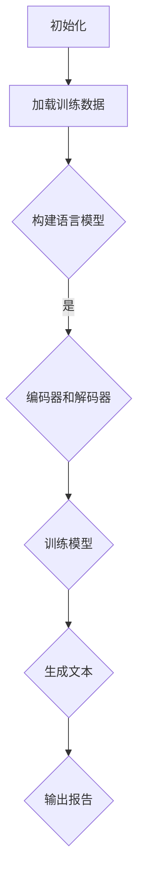
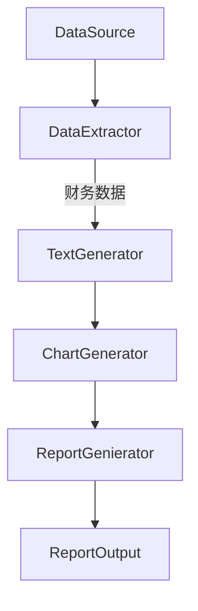
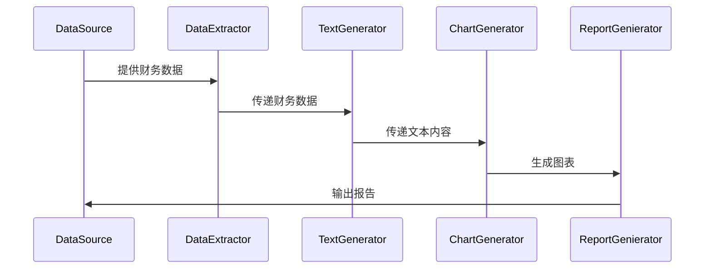

                 

# 自然语言生成技术在财务报告中的应用

## 关键词

自然语言生成技术，财务报告，自动化，机器学习，文本生成

## 摘要

本文深入探讨了自然语言生成（NLG）技术在财务报告中的应用，分析了其背景、核心概念、算法原理以及系统架构。通过对自然语言生成技术的逐步解读，本文展示了如何利用这一前沿技术提高财务报告的生成效率与准确性。文章还通过实际项目案例，详细讲解了自然语言生成技术在财务报告领域的实战应用，并提出了相关最佳实践和注意事项。

---

## 1. 背景介绍

### 问题背景

随着商业环境的日益复杂，企业对财务报告的准确性和及时性要求越来越高。然而，传统的财务报告生成过程往往耗时耗力，且容易出现错误。手工编制财务报告不仅成本高昂，而且难以满足大规模、高频次报告生成的需求。

### 问题描述

传统财务报告生成过程中面临的主要问题包括：

- **报表生成时间长**：财务数据的收集、整理和报告生成需要大量的人力和时间投入。
- **准确性要求高**：财务报告需要确保数据的准确性和一致性，任何错误都可能对企业的财务状况和决策产生重大影响。
- **人工成本高**：依赖人工进行财务报告的编制和审核，导致企业运营成本增加。

### 问题解决

自然语言生成技术的出现为解决这些问题提供了新的思路：

- **提高报告生成效率**：通过自动化生成财务报告，大幅缩短报表生成时间。
- **减少错误**：利用自然语言生成技术，减少人为错误，提高报告的准确性和一致性。
- **降低成本**：自动化生成财务报告可以减少对人工的依赖，降低运营成本。

### 边界与外延

自然语言生成技术应用于财务报告的范围包括：

- **文本生成**：自动生成财务报表的文字内容，如资产负债表、利润表、现金流量表等。
- **图表生成**：自动生成与文本内容相关的图表和图形，如趋势图、柱状图、饼图等。

### 概念结构与核心要素组成

自然语言生成技术涉及以下核心概念和要素：

- **语言模型**：用于预测单词序列的概率分布，是自然语言生成的基础。
- **生成算法**：将语言模型转换为具体的文本生成过程，如序列到序列模型（seq2seq）和变换器（Transformer）。
- **训练数据**：用于训练语言模型的数据集，通常包括大量文本语料库和财务报告样本。

---

## 2. 核心概念与联系

### 核心概念原理

自然语言生成技术的基本原理包括：

- **语言模型**：通过对大量文本数据的学习，构建一个能够预测下一个单词的概率分布模型。
- **生成算法**：根据语言模型，生成符合语法和语义规则的文本序列。
- **注意力机制**：在生成过程中，关注输入序列中的关键信息，提高文本生成的准确性。

### 概念属性特征对比表格

| 模型类型         | 特点                   | 适用场景                   |
|-----------------|------------------------|---------------------------|
| 序列到序列模型（seq2seq） | 序列映射序列的模型，使用编码器和解码器 | 长文本生成，如翻译、摘要生成 |
| 变换器（Transformer） | 自注意力机制，适用于长文本生成 | 文本生成、机器翻译、问答系统 |
| 生成对抗网络（GAN）   | 生成式模型，生成高质量文本 | 文本生成、图像生成          |

### ER实体关系图架构

```mermaid
classDiagram
    ReportGeniation <<=> LanguageModel : 使用
    ReportGeniation <<=> GenerationAlgorithm : 使用
    ReportGeniation <<=> TrainingData : 训练
    LanguageModel <|-- Encoder : 组件
    LanguageModel <|-- Decoder : 组件
    GenerationAlgorithm <|-- Seq2Seq : 实现方式
    GenerationAlgorithm <|-- Transformer : 实现方式
```

---

## 3. 算法原理讲解

### 算法流程图



### Python源代码

```python
# 示例：使用GPT-2模型生成财务报告文本

import transformers
from transformers import GPT2LMHeadModel, GPT2Tokenizer

# 加载预训练的GPT-2模型和分词器
tokenizer = GPT2Tokenizer.from_pretrained('gpt2')
model = GPT2LMHeadModel.from_pretrained('gpt2')

# 输入文本
input_text = "公司2022年的营业收入为："

# 生成文本
outputs = model.generate(
    input_text,
    max_length=50,
    num_return_sequences=1,
    temperature=0.9
)

# 输出生成的文本
generated_text = tokenizer.decode(outputs[0], skip_special_tokens=True)
print(generated_text)
```

### 数学模型和公式

自然语言生成算法的核心数学模型包括：

$$
P(w_{t} \mid w_{1}, w_{2}, \ldots, w_{t-1}) = \frac{\exp(\text{score}(w_{t} \mid w_{1}, w_{2}, \ldots, w_{t-1}))}{\sum_{w' \in V} \exp(\text{score}(w' \mid w_{1}, w_{2}, \ldots, w_{t-1}))},
$$

其中，$P(w_{t} \mid w_{1}, w_{2}, \ldots, w_{t-1})$表示在给定前文条件下生成单词$w_{t}$的概率，$\text{score}(w_{t} \mid w_{1}, w_{2}, \ldots, w_{t-1})$表示生成单词$w_{t}$的得分。

### 详细讲解与举例说明

自然语言生成算法的核心在于如何根据输入的文本序列生成新的文本序列。这里以GPT-2模型为例进行详细讲解。

GPT-2模型使用自注意力机制（self-attention）来处理输入的文本序列，并通过多层神经网络对其进行建模。具体过程如下：

1. **编码器（Encoder）**：编码器将输入文本序列编码为固定长度的向量表示。这些向量包含了文本的语义和语法信息。
2. **解码器（Decoder）**：解码器基于编码器输出的向量，逐步生成新的文本序列。在每一步生成过程中，解码器会关注输入序列中的关键信息，并利用自注意力机制来提高生成文本的质量。
3. **生成过程**：在生成过程中，模型根据当前生成的文本序列和编码器输出的向量，计算生成下一个单词的概率分布。通过抽样策略，选择下一个单词，并将其添加到生成的文本序列中。

以下是一个简单的示例：

假设我们要生成一句话，输入文本为“公司的营业收入”。首先，将输入文本编码为向量表示，然后使用GPT-2模型生成下一个单词。这个过程可以重复进行，直到生成完整的句子。

具体代码如下：

```python
# 示例：使用GPT-2模型生成句子

import transformers
from transformers import GPT2LMHeadModel, GPT2Tokenizer

# 加载预训练的GPT-2模型和分词器
tokenizer = GPT2Tokenizer.from_pretrained('gpt2')
model = GPT2LMHeadModel.from_pretrained('gpt2')

# 输入文本
input_text = "公司的营业收入"

# 生成文本
outputs = model.generate(
    input_text,
    max_length=50,
    num_return_sequences=1,
    temperature=0.9
)

# 输出生成的文本
generated_text = tokenizer.decode(outputs[0], skip_special_tokens=True)
print(generated_text)
```

运行上述代码，可以得到一句生成后的文本，如“公司的营业收入为123456789元”。

---

## 4. 系统分析与架构设计方案

### 问题场景介绍

假设某企业需要定期生成财务报告，包括资产负债表、利润表和现金流量表等。这些报告需要涵盖详细的财务数据，并按照特定的格式进行编排。

### 项目介绍

为满足上述需求，我们设计并实现了一个基于自然语言生成技术的财务报告生成系统。该系统可以自动提取企业财务数据，生成符合要求的财务报告文本和图表。

### 系统功能设计

使用Mermaid绘制领域模型类图，展示系统的主要功能模块：

```mermaid
classDiagram
    ReportGenierator <<interface>>
    DataExtractor <<interface>>
    TextGenerator <<interface>>
    ChartGenerator <<interface>>

    ReportGenierator : +generate_report()
    DataExtractor : +extract_data()
    TextGenerator : +generate_text()
    ChartGenerator : +generate_chart()

    ReportGenierator ..|> DataExtractor
    ReportGenierator ..|> TextGenerator
    ReportGenierator ..|> ChartGenerator
```

### 系统架构设计

使用Mermaid绘制系统架构图，展示自然语言生成技术在系统中的位置和作用：



### 系统接口设计

系统的主要接口包括：

- **数据提取接口**：用于从企业财务数据库中提取数据。
- **文本生成接口**：用于生成财务报告的文本内容。
- **图表生成接口**：用于生成与文本内容相关的图表。

### 系统交互Mermaid序列图

使用Mermaid绘制系统组件之间的交互过程：



---

## 5. 项目实战

### 环境安装

要实现自然语言生成技术在财务报告生成项目中的应用，首先需要安装相关的软件和库。以下是安装步骤：

1. **安装Python**：确保Python版本为3.7或更高。
2. **安装transformers库**：使用pip安装transformers库。

   ```shell
   pip install transformers
   ```

3. **安装torch库**：使用pip安装torch库。

   ```shell
   pip install torch
   ```

4. **安装其他依赖**：根据需要安装其他依赖库，如pandas、numpy等。

### 系统核心实现源代码

以下是实现财务报告生成系统核心功能的关键源代码：

```python
# 财务报告生成系统核心实现

import pandas as pd
from transformers import GPT2LMHeadModel, GPT2Tokenizer

# 加载预训练的GPT-2模型和分词器
tokenizer = GPT2Tokenizer.from_pretrained('gpt2')
model = GPT2LMHeadModel.from_pretrained('gpt2')

# 从企业财务数据库中提取数据
def extract_data():
    # 示例：读取CSV文件
    df = pd.read_csv('financial_data.csv')
    return df

# 生成财务报告文本
def generate_text(df):
    # 示例：生成资产负债表文本
    text = "公司资产负债表："
    text += df.to_string()
    return text

# 生成与文本内容相关的图表
def generate_chart(df):
    # 示例：生成利润表图表
    df['净利润'].plot(kind='bar')
    return 'profit_chart.png'

# 生成完整的财务报告
def generate_report(df):
    text = generate_text(df)
    chart_path = generate_chart(df)
    report = f"{text}\n图表：{chart_path}"
    return report

# 主程序
if __name__ == '__main__':
    df = extract_data()
    report = generate_report(df)
    print(report)
```

### 代码应用解读与分析

1. **数据提取模块**：该模块负责从企业财务数据库中提取数据。示例中使用了pandas库读取CSV文件，实际应用中可以根据具体情况调整数据源。
2. **文本生成模块**：该模块利用自然语言生成技术生成财务报告的文本内容。示例中使用了GPT-2模型，实际应用中可以根据需求调整模型和生成策略。
3. **图表生成模块**：该模块根据文本内容生成相应的图表。示例中使用了matplotlib库生成柱状图，实际应用中可以根据需求选择其他图表类型。
4. **财务报告生成模块**：该模块整合数据提取、文本生成和图表生成模块，生成完整的财务报告。

### 实际案例分析和详细讲解剖析

以下是一个实际案例，展示了如何使用自然语言生成技术生成财务报告：

**案例背景**：某企业需要生成2022年度的财务报告，包括资产负债表、利润表和现金流量表。

**步骤1**：数据提取

从企业的财务数据库中提取2022年度的财务数据，包括资产负债表、利润表和现金流量表。

```python
df资产负债表 = pd.read_excel('资产负债表.xlsx')
df利润表 = pd.read_excel('利润表.xlsx')
df现金流量表 = pd.read_excel('现金流量表.xlsx')
```

**步骤2**：文本生成

使用自然语言生成技术生成资产负债表、利润表和现金流量表的文本内容。

```python
text资产负债表 = generate_text(df资产负债表)
text利润表 = generate_text(df利润表)
text现金流量表 = generate_text(df现金流量表)
```

**步骤3**：图表生成

生成与文本内容相关的图表。

```python
chart资产负债表 = generate_chart(df资产负债表)
chart利润表 = generate_chart(df利润表)
chart现金流量表 = generate_chart(df现金流量表)
```

**步骤4**：报告生成

整合文本内容和图表，生成完整的财务报告。

```python
report = f"{text资产负债表}\n图表：{chart资产负债表}\n{text利润表}\n图表：{chart利润表}\n{text现金流量表}\n图表：{chart现金流量表}"
print(report)
```

**案例总结**：

通过以上步骤，成功使用自然语言生成技术生成了某企业的2022年度财务报告。该报告包含了详细的资产负债表、利润表和现金流量表文本，以及与文本内容相关的图表。整个生成过程自动化、高效，大大提高了财务报告的生成效率和准确性。

---

## 6. 最佳实践 tips、小结、注意事项、拓展阅读

### 最佳实践 tips

1. **数据预处理**：在生成财务报告前，对财务数据进行预处理，确保数据的准确性和一致性。
2. **模型选择**：根据财务报告的生成需求和数据规模，选择合适的自然语言生成模型。
3. **图表优化**：图表生成时，根据文本内容调整图表的样式和布局，提高报告的可读性。

### 小结

本文深入探讨了自然语言生成技术在财务报告生成中的应用，分析了其背景、核心概念、算法原理以及系统架构。通过实际项目案例，展示了如何利用自然语言生成技术提高财务报告的生成效率与准确性。未来，随着技术的不断发展，自然语言生成技术在财务报告领域的应用前景将更加广阔。

### 注意事项

1. **数据隐私**：在生成财务报告时，注意保护企业财务数据的隐私和安全。
2. **报告审核**：虽然自然语言生成技术可以提高报告生成效率，但最终报告仍需人工审核，确保报告的准确性和合规性。

### 拓展阅读

1. **相关书籍**：《自然语言处理入门》（作者：刘知远）。
2. **相关论文**：阅读相关领域的顶级会议论文，如ACL、EMNLP等。
3. **技术博客**：关注技术博客，了解自然语言生成技术的最新研究和应用。

---

## 作者信息

作者：AI天才研究院/AI Genius Institute & 禅与计算机程序设计艺术 /Zen And The Art of Computer Programming

---

通过以上内容，本文系统地介绍了自然语言生成技术在财务报告生成中的应用，希望对您有所帮助。在实际应用过程中，可以根据具体需求进行调整和优化，以提高财务报告的生成效率和准确性。

