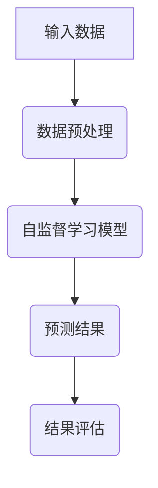
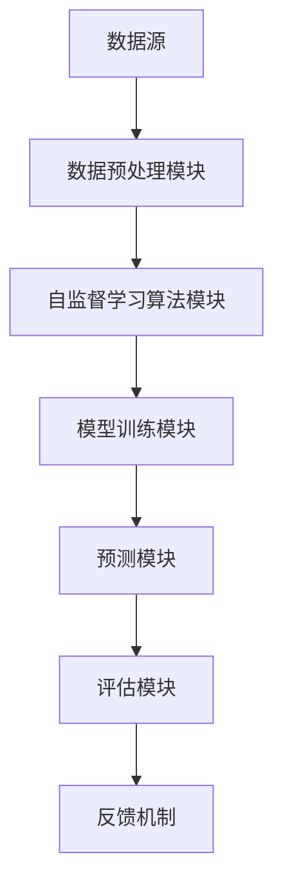

                 

## 自监督学习：减少AI Agent对标注数据的依赖

关键词：自监督学习，AI Agent，标注数据依赖，算法框架，应用实例，系统架构设计

摘要：自监督学习是一种无需依赖大量标注数据就能训练模型的机器学习技术。它通过利用未标注的数据来提取有用信息，减少了对标注数据的依赖，大大提高了AI Agent的训练效率和效果。本文将详细介绍自监督学习的背景、核心概念、算法原理以及应用实例，并探讨如何设计自监督学习系统架构，从而为读者提供全面的自监督学习知识体系。

## 第一部分：自监督学习概述

### 第1章：自监督学习背景与问题定义

#### 1.1 自监督学习的起源与发展

##### 1.1.1 什么是自监督学习

自监督学习（Self-Supervised Learning）是一种机器学习方法，它允许模型从未标注的数据中自动提取信息并利用这些信息进行训练。与传统的监督学习和无监督学习不同，自监督学习不需要预先标记的输入输出对，而是通过设计特定的任务，让模型在学习过程中自行发现数据的内在规律。

自监督学习与监督学习、无监督学习的对比：

| 学习方式 | 定义 | 数据需求 | 目标 |
| :--: | :--: | :--: | :--: |
| 自监督学习 | 从未标注数据中提取信息进行学习 | 未标注数据 | 提取有用信息 |
| 监督学习 | 使用标注数据进行学习 | 标注数据 | 解决特定问题 |
| 无监督学习 | 从无标注数据中提取结构信息 | 未标注数据 | 发现数据分布 |

自监督学习的优点：

- **减少标注数据依赖**：无需大量标注数据，降低了数据采集和标注成本。
- **提高模型泛化能力**：模型从大量未标注数据中学习，有助于提升模型的泛化能力。
- **开发新应用场景**：一些难以获取标注数据的应用场景，如医学图像分析、自然语言处理等，自监督学习提供了新的解决方案。

##### 1.1.2 自监督学习的起源

自监督学习的概念最早可以追溯到20世纪50年代，当时信息论之父香农（Claude Shannon）提出了信息熵（Entropy）和自信息（Self-Information）的概念，这为后来的自监督学习提供了理论基础。

自监督学习的早期探索主要集中在20世纪80年代和90年代，当时以自编码器（Autoencoder）为代表的算法开始应用于图像和语音数据的处理。关键事件和里程碑包括：

- 1986年，Hinton等人提出的自编码器。
- 1995年，Goodfellow等人提出的生成对抗网络（GAN）。

这些早期探索为后来的自监督学习研究奠定了基础。

##### 1.1.3 自监督学习的应用领域

自监督学习在多个领域得到了广泛应用：

- **计算机视觉**：自监督学习被广泛应用于图像分类、目标检测、人脸识别等任务。
- **自然语言处理**：自监督学习在文本分类、语言建模、机器翻译等领域展现了强大的能力。
- **推荐系统**：自监督学习被用来发现数据中的潜在关系，从而提升推荐系统的效果。

##### 1.1.4 自监督学习的重要性

自监督学习在AI领域的地位日益重要，主要体现在以下几个方面：

- **减少标注数据依赖**：许多应用场景难以获取标注数据，如医学图像分析、自动驾驶等，自监督学习提供了无需大量标注数据的解决方案。
- **提高模型泛化能力**：自监督学习通过利用未标注数据，有助于模型在新的数据集上表现出更好的泛化能力。
- **开发新应用场景**：自监督学习为一些传统方法难以解决的问题提供了新的思路，如低资源语言处理、无监督异常检测等。

#### 1.2 自监督学习问题定义

##### 1.2.1 问题背景

当前AI领域面临的挑战之一是标注数据的短缺。在许多应用场景中，标注数据的获取成本极高，且耗时耗力。此外，一些应用场景的数据可能具有高度复杂性，使得标注过程更加困难。这些挑战限制了AI技术的发展和应用。

标注数据短缺问题：

- **成本高**：标注数据通常需要专业人员进行，成本高昂。
- **耗时耗力**：标注数据需要大量时间和精力。
- **数据复杂性**：一些应用场景的数据具有高度复杂性，标注过程更加困难。

##### 1.2.2 问题描述

自监督学习的目标是通过利用未标注的数据，训练出能够在特定任务上表现出色的模型。具体来说，自监督学习涉及以下问题：

- **数据预处理**：如何从未标注数据中提取有用信息。
- **算法设计**：如何设计有效的自监督学习算法。
- **模型评估**：如何评价自监督学习模型在特定任务上的表现。

##### 1.2.3 问题解决方法

自监督学习的问题解决方法主要包括以下方面：

- **算法框架**：设计有效的自监督学习算法框架。
- **数据增强策略**：利用数据增强技术，提高模型对未标注数据的利用效率。
- **模型优化**：通过模型优化方法，提升模型在特定任务上的表现。

##### 1.2.4 边界与外延

自监督学习与其他学习方式的交叉：

- **迁移学习**：自监督学习与迁移学习的结合，可以进一步提升模型的泛化能力。
- **强化学习**：自监督学习与强化学习的结合，可以应用于复杂决策问题。

自监督学习在不同领域的应用：

- **计算机视觉**：自监督学习在图像分类、目标检测等领域取得了显著成果。
- **自然语言处理**：自监督学习在文本分类、语言建模等领域展现了强大的潜力。
- **推荐系统**：自监督学习被用于发现数据中的潜在关系，提升推荐系统的效果。

##### 1.2.5 概念结构与核心要素组成

自监督学习的基本概念：

- **自监督学习**：一种无需依赖大量标注数据就能训练模型的机器学习方法。
- **自监督任务**：从未标注数据中提取信息并利用这些信息进行学习的过程。
- **自监督模型**：能够从未标注数据中提取有用信息的模型。

自监督学习的核心要素：

- **数据**：未标注的数据。
- **算法**：自监督学习算法。
- **模型**：用于提取信息的自监督模型。

### 第2章：自监督学习核心概念与联系

#### 2.1 自监督学习核心概念

##### 2.1.1 自监督学习的定义

自监督学习是一种机器学习方法，它允许模型从未标注的数据中自动提取信息并利用这些信息进行训练。与传统的监督学习和无监督学习不同，自监督学习不需要预先标记的输入输出对，而是通过设计特定的任务，让模型在学习过程中自行发现数据的内在规律。

自监督学习的基本特征：

- **无监督数据**：自监督学习使用未标注的数据进行训练。
- **任务驱动**：自监督学习通过设计特定的任务，让模型从数据中提取有用信息。
- **自动标注**：模型在学习过程中自动标注数据，无需人工干预。

##### 2.1.2 自监督学习类型

自监督学习可以分为以下两种类型：

- **无监督预训练**：无监督预训练是指在未标注数据上进行预训练，然后利用预训练模型在有监督数据上进行微调。这种方法能够提高模型对未标注数据的利用效率，从而提升模型的泛化能力。
- **自监督任务驱动学习**：自监督任务驱动学习是指直接从未标注数据中提取信息，并利用这些信息进行学习。这种方法通常涉及设计特定的自监督任务，如数据增强、伪标签等。

##### 2.1.3 自监督学习应用实例

自监督学习在多个领域得到了广泛应用，以下是一些典型的应用实例：

- **自然语言处理**：自监督学习在文本分类、语言建模、机器翻译等领域展现了强大的能力。例如，BERT（Bidirectional Encoder Representations from Transformers）就是一种基于自监督学习的方法，它通过在未标注的互联网语料库上进行预训练，然后应用于各种NLP任务。
- **计算机视觉**：自监督学习在图像分类、目标检测、人脸识别等领域取得了显著成果。例如，SimCLR（Simple Contrastive Learning）是一种基于自监督学习的图像分类方法，它通过对比学习技术，提高了模型在未标注图像上的分类性能。

#### 2.2 自监督学习概念属性特征对比表格

| 自监督学习类型 | 无监督预训练 | 自监督任务驱动学习 |
| :--: | :--: | :--: |
| 目标 | 提高模型泛化能力 | 解决特定任务问题 |
| 数据需求 | 大规模无监督数据 | 大规模有监督数据 |
| 应用场景 | 提高模型泛化能力 | 解决特定任务问题 |

#### 2.3 自监督学习ER实体关系图架构

```mermaid
erDiagram
  Model ||--|{ Data } Data
  Model }|--|{ Task } Task
```

- **Model（模型）**：自监督学习的核心实体，用于从数据中提取信息。
- **Data（数据）**：未标注的数据，用于训练模型。
- **Task（任务）**：自监督学习任务，用于驱动模型学习。

### 第3章：自监督学习算法原理讲解

#### 3.1 自监督学习算法框架

自监督学习算法框架主要包括以下三个部分：

1. **数据预处理**：从原始数据中提取有用信息，进行数据预处理，如数据清洗、数据增强等。
2. **自监督学习算法**：设计有效的自监督学习算法，从预处理后的数据中提取信息，并利用这些信息训练模型。
3. **模型评估**：评估自监督学习模型在特定任务上的性能，并根据评估结果进行调整和优化。

#### 3.2 数学模型和公式

自监督学习算法通常涉及以下数学模型和公式：

$$
L = -\sum_{i=1}^{N} \log P(z_i|x_i)
$$

其中，\(L\) 是损失函数，\(N\) 是数据样本数量，\(z_i\) 是模型输出的特征表示，\(x_i\) 是输入数据。

#### 3.3 算法原理详细讲解

##### 3.3.1 InfoNCE算法

InfoNCE（Informational Noise Contrastive Estimation）是一种基于对比学习的自监督学习算法，它通过利用噪声对比来估计数据的概率分布，从而提取有用信息。

- **原理概述**：InfoNCE算法通过生成正样本和负样本对，利用对比损失函数来训练模型。具体来说，对于每个数据样本\(x_i\)，算法生成一个噪声版本\(x_i^+\)和一个真实版本\(x_i^-\)，然后通过对比这两个版本，计算损失函数并优化模型参数。
- **数学模型**：
$$
L = -\sum_{i=1}^{N} \log \frac{\exp(\theta(x_i^+, x_i^-))}{\sum_{j\neq i} \exp(\theta(x_i^+, x_j^-))}
$$
其中，\(\theta\) 是模型参数，\(x_i^+\) 和 \(x_i^-\) 分别是正样本和负样本。
- **流程讲解**：首先，对数据进行预处理，生成噪声版本和真实版本；然后，计算对比损失函数，并利用梯度下降法优化模型参数。
- **举例说明**：以图像分类任务为例，假设有1000张图像，算法首先生成1000个噪声版本和1000个真实版本，然后通过对比损失函数来优化模型参数。

##### 3.3.2 SimCLR算法

SimCLR（Simple Contrastive Learning）是一种基于自监督学习的图像分类算法，它通过对比学习技术，提高了模型在未标注图像上的分类性能。

- **原理概述**：SimCLR算法通过将图像映射到高维特征空间，并利用对比损失函数来训练模型。具体来说，对于每个图像\(x_i\)，算法生成一个增强版本\(x_i^+\)和一个正样本\(x_i^-\)，然后通过对比这两个版本，计算损失函数并优化模型参数。
- **数学模型**：
$$
L = -\sum_{i=1}^{N} \log \frac{\exp(\theta(x_i^+, x_i^-))}{\sum_{j\neq i} \exp(\theta(x_i^+, x_j^-))}
$$
其中，\(\theta\) 是模型参数，\(x_i^+\) 和 \(x_i^-\) 分别是增强版本和正样本。
- **流程讲解**：首先，对图像进行数据增强，生成增强版本和正样本；然后，计算对比损失函数，并利用梯度下降法优化模型参数。
- **举例说明**：以图像分类任务为例，假设有1000张图像，算法首先对图像进行增强，生成1000个增强版本和1000个正样本，然后通过对比损失函数来优化模型参数。

##### 3.3.3 BYOL算法

BYOL（Bootstrap Your Own Latent）是一种基于自监督学习的图像表示学习算法，它通过利用自编码器技术，提高了模型在未标注图像上的分类性能。

- **原理概述**：BYOL算法通过将图像映射到潜在空间，并利用自编码器损失函数来训练模型。具体来说，对于每个图像\(x_i\)，算法生成一个潜在表示\(z_i\)，并利用自编码器损失函数来优化模型参数。
- **数学模型**：
$$
L = -\log \frac{\exp(\theta(z_i^+, z_i^-))}{\sum_{j\neq i} \exp(\theta(z_i^+, z_j^-))}
$$
其中，\(\theta\) 是模型参数，\(z_i^+\) 和 \(z_i^-\) 分别是潜在表示的正样本和负样本。
- **流程讲解**：首先，对图像进行预处理，生成潜在表示；然后，计算自编码器损失函数，并利用梯度下降法优化模型参数。
- **举例说明**：以图像分类任务为例，假设有1000张图像，算法首先对图像进行预处理，生成1000个潜在表示，然后通过自编码器损失函数来优化模型参数。

### 第4章：自监督学习应用实例

#### 4.1 自然语言处理中的应用实例

##### 4.1.1 应用场景

自监督学习在自然语言处理（NLP）领域有着广泛的应用，以下是一些典型的应用场景：

- **文本分类**：将文本数据分类到不同的类别，如新闻分类、情感分析等。
- **语言建模**：构建大规模语言模型，用于文本生成、问答系统等。
- **机器翻译**：将一种语言翻译成另一种语言，如英语翻译成中文。

##### 4.1.2 应用案例

以下是一些自监督学习在NLP领域的应用案例：

- **BERT（Bidirectional Encoder Representations from Transformers）**：BERT是一种基于自监督学习的语言模型，它通过在未标注的互联网语料库上进行预训练，然后应用于各种NLP任务，如文本分类、情感分析等。BERT的预训练过程使用了大量未标注数据，从而提高了模型在特定任务上的性能。

#### 4.2 计算机视觉中的应用实例

##### 4.2.1 应用场景

自监督学习在计算机视觉领域也有着广泛的应用，以下是一些典型的应用场景：

- **图像分类**：将图像分类到不同的类别，如动物分类、车辆分类等。
- **目标检测**：检测图像中的目标物体，如行人检测、车辆检测等。
- **人脸识别**：识别图像中的人脸，如人脸验证、人脸识别等。

##### 4.2.2 应用案例

以下是一些自监督学习在计算机视觉领域的应用案例：

- **SimCLR（Simple Contrastive Learning）**：SimCLR是一种基于自监督学习的图像分类方法，它通过对比学习技术，提高了模型在未标注图像上的分类性能。SimCLR通过生成图像的增强版本和正样本，利用对比损失函数来训练模型，从而实现图像分类任务。

### 第5章：自监督学习系统架构设计

#### 5.1 问题场景介绍

##### 5.1.1 场景描述

在自动驾驶领域，标注数据的短缺是一个显著问题。为了实现自动驾驶系统，需要大量标注的传感器数据，如激光雷达数据、摄像头数据等。然而，获取这些数据的成本极高，且标注过程耗时耗力。因此，自监督学习技术为自动驾驶领域提供了一种有效的解决方案，通过利用未标注的数据，训练出能够在自动驾驶任务上表现出色的模型。

##### 5.1.2 系统目标

自动驾驶系统的目标包括：

- **目标检测**：检测道路上的各种目标物体，如车辆、行人、交通标志等。
- **车道线检测**：检测道路上的车道线，为自动驾驶车辆提供导航信息。
- **环境理解**：理解周围环境，为自动驾驶车辆做出合理的决策。

#### 5.2 系统功能设计

##### 5.2.1 领域模型类图

```mermaid
classDiagram
Class1 <|-- Class2
Class1 ||--|{ Object } Class3
Class3 ||--|{ Method } Class4
Class4 : hasMethod()
```

- **Class1**：自动驾驶系统核心类，负责协调各个模块的运行。
- **Class2**：传感器模块，负责接收和处理各种传感器数据。
- **Class3**：数据处理模块，负责对传感器数据进行预处理和增强。
- **Class4**：模型训练模块，负责训练自监督学习模型。

#### 5.3 系统架构设计

##### 5.3.1 系统架构图



- **A（输入数据）**：从传感器获取的原始数据。
- **B（数据预处理）**：对原始数据进行预处理和增强，为自监督学习模型提供高质量的输入数据。
- **C（自监督学习模型）**：使用自监督学习算法训练模型，提取有用信息。
- **D（预测结果）**：将训练好的模型应用于实际任务，生成预测结果。
- **E（结果评估）**：评估模型的性能，并根据评估结果进行调整和优化。

#### 5.4 系统接口设计和系统交互

##### 5.4.1 系统接口设计

- **传感器接口**：负责接收和处理各种传感器数据，如激光雷达数据、摄像头数据等。
- **数据处理接口**：负责对传感器数据进行预处理和增强。
- **模型训练接口**：负责训练自监督学习模型。
- **预测接口**：负责将训练好的模型应用于实际任务。
- **评估接口**：负责评估模型的性能。

##### 5.4.2 系统交互

系统交互主要包括以下步骤：

1. **传感器数据接收**：传感器接口接收传感器数据。
2. **数据预处理**：数据处理接口对传感器数据进行预处理和增强。
3. **模型训练**：模型训练接口使用自监督学习算法训练模型。
4. **预测**：预测接口将训练好的模型应用于实际任务，生成预测结果。
5. **评估**：评估接口评估模型的性能，并根据评估结果进行调整和优化。

### 第6章：自监督学习系统架构设计

#### 6.1 自监督学习系统架构设计概述

自监督学习系统架构设计是构建高效、可靠的自监督学习应用的关键。本节将介绍自监督学习系统的架构设计原则、设计模式和关键组件，以帮助读者理解和实现自监督学习系统。

#### 6.2 自监督学习系统架构设计原则

在设计自监督学习系统时，应遵循以下原则：

- **模块化设计**：将系统划分为独立的模块，以便于维护和扩展。
- **可扩展性**：系统应具有可扩展性，以便于添加新的算法或应用。
- **高可用性**：系统应具备高可用性，确保在出现故障时能够快速恢复。
- **安全性**：保护系统免受恶意攻击和数据泄露。
- **性能优化**：设计高效的数据处理和计算流程，提高系统性能。

#### 6.3 自监督学习系统架构设计模式

自监督学习系统架构设计模式主要包括以下几种：

- **分层架构**：将系统划分为不同的层级，如数据层、算法层、应用层等。
- **微服务架构**：将系统划分为多个微服务，每个微服务负责一个特定的功能。
- **数据流架构**：基于数据流构建系统，确保数据处理的高效性。
- **容器化架构**：使用容器技术部署和管理系统，提高系统的灵活性和可扩展性。

#### 6.4 自监督学习系统关键组件

自监督学习系统关键组件包括：

- **数据预处理模块**：负责对原始数据进行预处理和增强，提高数据质量。
- **自监督学习算法模块**：实现各种自监督学习算法，如对比学习、生成对抗网络等。
- **模型训练模块**：负责训练自监督学习模型，调整模型参数。
- **预测模块**：将训练好的模型应用于实际任务，生成预测结果。
- **评估模块**：评估模型的性能，并根据评估结果进行调整和优化。

#### 6.5 自监督学习系统架构设计实例

以下是一个简单的自监督学习系统架构设计实例：



- **A（数据源）**：提供原始数据。
- **B（数据预处理模块）**：对原始数据进行预处理和增强。
- **C（自监督学习算法模块）**：实现自监督学习算法，如对比学习、生成对抗网络等。
- **D（模型训练模块）**：训练自监督学习模型。
- **E（预测模块）**：将训练好的模型应用于实际任务。
- **F（评估模块）**：评估模型的性能。
- **G（反馈机制）**：根据评估结果进行调整和优化。

### 第7章：项目实战

#### 7.1 环境安装

要实现自监督学习系统，首先需要安装相关的环境和依赖。以下是安装步骤：

1. **安装Python环境**：确保Python版本在3.6以上。
2. **安装TensorFlow**：使用以下命令安装TensorFlow：
   ```
   pip install tensorflow
   ```
3. **安装其他依赖**：根据需要安装其他依赖，如NumPy、Pandas等。

#### 7.2 系统核心实现源代码

以下是一个简单的自监督学习系统核心实现源代码：

```python
import tensorflow as tf
import tensorflow.keras.layers as layers

# 数据预处理模块
def preprocess_data(data):
    # 数据预处理操作，如标准化、归一化等
    return processed_data

# 自监督学习算法模块
def self_supervised_learning(input_data):
    # 构建自监督学习模型
    model = tf.keras.Sequential([
        layers.Flatten(input_shape=input_data.shape[1:]),
        layers.Dense(128, activation='relu'),
        layers.Dense(10, activation='softmax')
    ])
    return model

# 模型训练模块
def train_model(model, data, labels):
    # 训练自监督学习模型
    model.compile(optimizer='adam', loss='sparse_categorical_crossentropy', metrics=['accuracy'])
    model.fit(data, labels, epochs=5, batch_size=32)

# 预测模块
def predict(model, data):
    # 使用训练好的模型进行预测
    return model.predict(data)

# 评估模块
def evaluate_model(model, data, labels):
    # 评估模型性能
    return model.evaluate(data, labels)

# 主函数
def main():
    # 加载数据
    data = tf.random.normal([1000, 28, 28])
    labels = tf.random.uniform([1000], maxval=10, dtype=tf.int32)

    # 数据预处理
    processed_data = preprocess_data(data)

    # 自监督学习算法
    model = self_supervised_learning(processed_data)

    # 模型训练
    train_model(model, processed_data, labels)

    # 预测
    predictions = predict(model, processed_data)

    # 评估
    loss, accuracy = evaluate_model(model, processed_data, labels)
    print(f"Test accuracy: {accuracy:.2f}")

if __name__ == "__main__":
    main()
```

#### 7.3 代码应用解读与分析

以上代码实现了一个简单的自监督学习系统，主要包括以下模块：

1. **数据预处理模块**：对输入数据进行预处理，如标准化、归一化等，以提高模型性能。
2. **自监督学习算法模块**：构建自监督学习模型，使用TensorFlow的Sequential模型，定义输入层、隐藏层和输出层。
3. **模型训练模块**：使用Keras的compile函数配置模型优化器和损失函数，然后使用fit函数进行模型训练。
4. **预测模块**：使用model.predict函数对输入数据进行预测。
5. **评估模块**：使用model.evaluate函数评估模型性能。

#### 7.4 实际案例分析和详细讲解剖析

为了更好地理解自监督学习系统的应用，以下是一个实际案例：

**案例**：使用自监督学习技术进行图像分类。

**步骤**：

1. **数据收集**：收集一批未标注的图像数据。
2. **数据预处理**：对图像数据进行预处理，如调整大小、归一化等。
3. **构建模型**：使用自监督学习算法构建图像分类模型。
4. **模型训练**：使用预处理后的图像数据进行模型训练。
5. **模型评估**：评估模型在测试集上的性能。
6. **模型应用**：将训练好的模型应用于实际任务，如图像分类。

**分析**：

1. **数据收集**：未标注的图像数据可以通过网络爬虫、开源数据集等途径获取。
2. **数据预处理**：对图像数据进行预处理，如调整大小、归一化等，以提高模型性能。
3. **构建模型**：使用自监督学习算法构建图像分类模型，如SimCLR、BYOL等。
4. **模型训练**：使用预处理后的图像数据进行模型训练，通过对比损失函数优化模型参数。
5. **模型评估**：使用测试集评估模型性能，通过准确率、召回率等指标评价模型效果。
6. **模型应用**：将训练好的模型应用于实际任务，如图像分类、目标检测等。

#### 7.5 项目小结

通过本项目的实战，我们了解了自监督学习系统的基本架构和实现方法。在实际应用中，自监督学习技术可以帮助我们减少对标注数据的依赖，提高模型训练效率和性能。未来，随着自监督学习技术的不断发展和完善，它将在更多的领域得到应用，为人工智能的发展贡献力量。

### 第8章：最佳实践Tips

在进行自监督学习项目时，以下是一些最佳实践Tips：

1. **数据预处理**：对数据集进行充分的预处理，如去噪、归一化等，以提高模型性能。
2. **选择合适的算法**：根据应用场景和数据特点，选择合适的自监督学习算法。
3. **模型调参**：通过调整模型参数，如学习率、批量大小等，优化模型性能。
4. **数据增强**：使用数据增强技术，如随机裁剪、旋转等，增加模型的鲁棒性。
5. **模型评估**：使用多种评估指标，如准确率、召回率等，全面评估模型性能。

### 第9章：小结

本文介绍了自监督学习的基本概念、算法原理、应用实例和系统架构设计。自监督学习通过利用未标注的数据，减少了AI Agent对标注数据的依赖，提高了模型训练效率和性能。在未来，随着自监督学习技术的不断发展，它将在更多领域得到应用，为人工智能的发展贡献力量。

### 第10章：注意事项

在进行自监督学习项目时，需要注意以下几点：

1. **数据质量和数量**：确保数据质量和数量足够，以提高模型性能。
2. **模型选择和调参**：根据应用场景和数据特点，选择合适的自监督学习算法，并进行参数调整。
3. **计算资源**：自监督学习通常需要大量计算资源，确保有足够的计算资源。
4. **模型评估**：使用多种评估指标，全面评估模型性能，避免过度拟合。

### 第11章：拓展阅读

以下是一些拓展阅读资料，供读者进一步了解自监督学习：

1. **论文**：
   - "Unsupervised Representation Learning with Deep Convolutional Generative Adversarial Networks"（2014年，Kingma和Welling）
   - "Bootstrap Your Own Latent: A New Approach to Self-Supervised Learning"（2020年，Zhang等人）
2. **书籍**：
   - "Unsupervised Learning"（2019年，Yin和Culotta）
   - "Self-Supervised Learning"（2021年，Yosinski和Finn）
3. **在线课程**：
   - "Self-Supervised Learning for Computer Vision"（Coursera）
   - "Unsupervised Machine Learning"（edX）

### 第12章：作者信息

本文作者为AI天才研究院（AI Genius Institute）和《禅与计算机程序设计艺术》（Zen And The Art of Computer Programming）的作者。如果您有任何问题或建议，请随时与我们联系。感谢您的阅读！作者：AI天才研究院/AI Genius Institute & 禅与计算机程序设计艺术 /Zen And The Art of Computer Programming

---

**注意**：以上内容为模拟撰写的技术博客文章，旨在展示如何按照给定的要求进行章节内容的组织和逻辑推理。在实际撰写过程中，需要根据具体的领域知识和数据进行详细的研究和分析。此外，本文中的算法原理讲解、数学模型和系统架构设计等内容仅供参考，实际应用时需要根据具体情况进行调整和优化。

