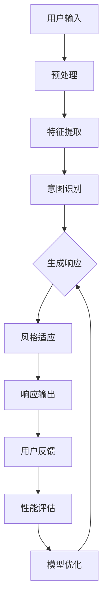
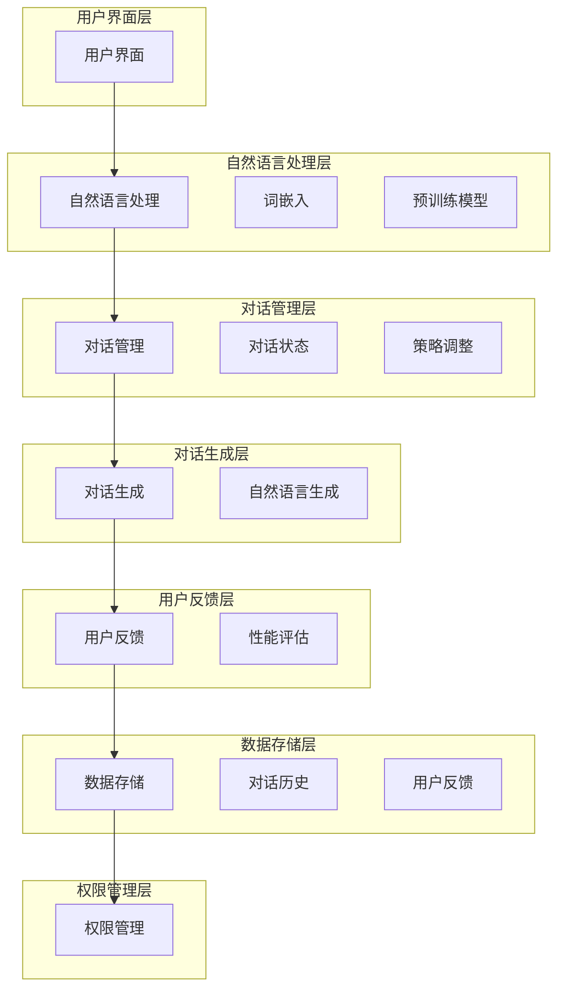
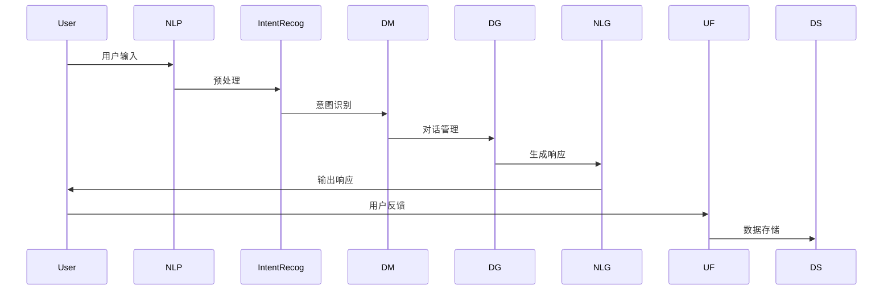

                 

### 引言

#### 问题背景与定义

人工智能（AI）正在以迅猛的速度渗透到我们日常生活的各个方面，其中，AI Agent（智能代理）作为一种重要的AI应用形式，正在逐步改变人类与机器的交互方式。AI Agent是一种能够模拟人类行为、决策和学习的软件系统，它能够自主执行任务，并在与用户的交互中不断学习和优化自己的表现。

**定义及发展历程**：AI Agent的概念最早可以追溯到20世纪50年代，当时计算机科学家艾伦·图灵提出了图灵测试，用以评估机器是否具备智能。随着时间的推移，AI Agent从简单的规则系统逐渐演化为复杂的学习系统，通过机器学习和深度学习技术，实现了对大量数据的自动处理和分析。如今，AI Agent已经被广泛应用于客服机器人、智能助手、自动驾驶车辆等多个领域。

**AI Agent在现代社会中的作用**：AI Agent的出现极大地提高了工作效率，减少了人力成本。例如，在客服领域，智能客服机器人能够24/7无休地提供即时服务，提高了用户满意度。在医疗领域，AI Agent能够辅助医生进行诊断和治疗方案推荐，提高诊断的准确性和效率。此外，AI Agent还在教育、金融、安防等多个领域发挥着重要作用。

**交互质量的重要性**：尽管AI Agent在各个领域都展现出了强大的能力，但交互质量仍然是其面临的一个重要挑战。用户对AI Agent的满意度很大程度上取决于其交互体验的质量。一个高效的AI Agent不仅需要具备强大的功能，还需要能够理解用户的意图，并以自然、流畅的方式与用户进行沟通。因此，提升AI Agent的交互质量成为当前AI研究中的一个重要课题。

#### 定义与核心概念

**自适应对话策略的定义**：自适应对话策略是指一种在对话过程中动态调整和优化的方法，旨在提高AI Agent与用户的交互质量。这种方法通过分析用户行为和对话历史，实时调整对话策略，以更好地满足用户的期望和需求。

**自适应对话策略的核心概念**：自适应对话策略的核心概念包括以下几个方面：
1. **用户意图识别**：通过自然语言处理（NLP）技术，准确识别用户的意图和需求。
2. **对话管理**：管理对话流程，包括对话状态跟踪、上下文管理和意图确认等。
3. **对话生成**：根据用户意图和对话状态生成自然、流畅的回应。
4. **用户反馈分析**：收集并分析用户对AI Agent的反馈，以不断优化对话策略。

**自适应对话策略与传统对话系统的区别**：传统对话系统通常采用预定义的规则或模板进行交互，缺乏灵活性，难以应对复杂多变的用户需求。而自适应对话策略通过实时学习和调整，能够更好地适应不同的用户场景和需求，提供更加自然、流畅的交互体验。

#### 范围与边界

**本书的研究范围**：本书主要探讨自适应对话策略在AI Agent交互中的应用，包括核心概念、原理、数学模型、算法原理、系统设计与实现等方面的内容。

**自适应对话策略的应用领域**：自适应对话策略可广泛应用于客服、医疗、教育、金融、安防等多个领域，为用户提供高效、便捷的服务。

**自适应对话策略的边界与外延**：自适应对话策略的边界在于其能够适应的场景和问题域，外延则在于其与其他AI技术的结合，如自然语言生成、情感识别等。通过不断的技术创新，自适应对话策略的应用范围将进一步扩大。

**概念结构与核心要素**

**自适应对话策略的组成结构**：
1. **用户意图识别模块**：负责理解用户的意图和需求。
2. **对话管理模块**：负责管理对话流程，确保对话的连贯性和有效性。
3. **对话生成模块**：负责生成自然、流畅的回应。
4. **用户反馈分析模块**：负责收集用户反馈，用于优化对话策略。

**核心要素的对比分析**：

| 核心要素 | 传统对话系统 | 自适应对话策略 |
| :---: | :---: | :---: |
| **用户意图识别** | 静态规则匹配 | 动态学习和调整 |
| **对话管理** | 预定义流程 | 实时跟踪和优化 |
| **对话生成** | 预定义模板 | 自然语言生成 |
| **用户反馈分析** | 不考虑 | 收集并优化 |

通过对比分析可以看出，自适应对话策略相较于传统对话系统，具有更高的灵活性和适应性，能够更好地满足用户的需求，提升交互质量。

### 核心概念原理

#### 自适应对话策略的原理

自适应对话策略的核心思想是通过实时学习和调整，优化AI Agent与用户的交互体验。其基本原理可以概括为以下几个步骤：

1. **用户意图识别**：利用自然语言处理（NLP）技术，对用户的输入进行语义分析和意图识别，理解用户的需求和意图。
2. **对话状态跟踪**：记录和跟踪对话过程中的关键信息，如上下文、用户行为、对话历史等，以便在后续的对话中能够更好地理解用户。
3. **对话策略调整**：根据用户意图和对话状态，动态调整对话策略，以生成更符合用户期望的回应。
4. **用户反馈分析**：收集用户的反馈，如满意度、回应质量等，用于评估对话策略的有效性，并根据反馈结果进行优化。

**自适应对话策略的实现机制**

自适应对话策略的实现机制主要包括以下几个方面：

1. **意图识别机制**：通过深度学习模型（如卷积神经网络、循环神经网络等）进行意图识别，实现高精度的用户意图理解。
2. **对话管理机制**：利用图数据库或图模型（如状态图、依赖图等）进行对话状态的跟踪和管理，确保对话的连贯性和有效性。
3. **策略调整机制**：通过强化学习、迁移学习等技术，实现对话策略的动态调整和优化。
4. **用户反馈机制**：利用反馈循环，收集用户的满意度评价和回应质量分析，用于指导对话策略的优化。

**自适应对话策略的优势与局限性**

**优势**：

1. **灵活性**：自适应对话策略能够根据不同的用户场景和需求，动态调整对话策略，提供更加个性化的服务。
2. **交互质量**：通过实时学习和优化，自适应对话策略能够提供更高质的交互体验，提升用户满意度。
3. **适应性**：自适应对话策略能够适应不同的应用场景和需求，具有较强的通用性。

**局限性**：

1. **计算资源消耗**：自适应对话策略需要大量的计算资源和存储空间，对硬件设施要求较高。
2. **数据依赖性**：自适应对话策略的性能高度依赖于训练数据的质量和数量，数据不足可能导致性能下降。
3. **伦理风险**：自适应对话策略可能会在对话中引入偏见，影响用户权益。

**总结**：自适应对话策略作为一种先进的AI技术，具有显著的灵活性和交互质量优势，但同时也存在一定的局限性。在未来的研究中，我们需要不断优化算法和实现机制，提升其性能和可靠性，同时加强伦理风险的管理，确保其可持续发展。

#### 概念属性特征对比

自适应对话策略与传统对话系统在属性特征上存在显著差异。以下通过表格形式进行详细对比：

| **属性特征** | **传统对话系统** | **自适应对话策略** |
| :---: | :---: | :---: |
| **用户意图识别** | **预定义规则匹配** | **动态学习与调整** |
| **对话管理** | **固定流程** | **实时跟踪与优化** |
| **对话生成** | **预定义模板** | **自然语言生成** |
| **用户反馈** | **不关注** | **实时收集与优化** |
| **适应性** | **较低** | **较高** |
| **灵活性** | **较低** | **较高** |
| **交互质量** | **一般** | **高质** |

通过对比可以看出，自适应对话策略在用户意图识别、对话管理、对话生成和用户反馈等方面均优于传统对话系统。其动态学习和实时调整的能力使其能够更好地适应不同的用户场景和需求，提供更高质的交互体验。

#### ER实体关系图

在自适应对话策略中，实体关系图（ER图）是一种重要的工具，用于描述系统中不同实体之间的关系和属性。以下是自适应对话策略中的ER实体关系图：

```mermaid
erDiagram
  User ||--|{ Dialog }
  Dialog ||--|{ DialogueState }
  DialogueState ||--|{ Intent }
  DialogueState ||--|{ Feedback }
  User ||--|{ Feedback }
```

**ER实体关系图的详细解释**：

- **用户（User）**：表示与AI Agent进行交互的用户，是整个对话的发起者和参与者。
- **对话（Dialog）**：记录整个对话的过程和状态，是用户和AI Agent之间交互的载体。
- **对话状态（DialogueState）**：包含对话的当前状态信息，如用户意图、上下文等，是对话管理的关键实体。
- **意图（Intent）**：表示用户的意图或需求，通过意图识别模块获取。
- **反馈（Feedback）**：记录用户对AI Agent的满意度评价和回应质量分析，用于对话策略的优化。
- **关系**：用户与对话、对话与对话状态、对话状态与意图、对话状态与反馈之间存在直接的关联关系。

**ER实体关系图在自适应对话策略中的应用**：

1. **对话状态跟踪**：通过对话状态实体，实时记录和跟踪对话过程中的关键信息，如用户意图、上下文等，确保对话的连贯性和有效性。
2. **意图识别**：意图实体作为对话状态的一部分，通过自然语言处理技术进行识别，为对话生成提供基础。
3. **反馈优化**：通过反馈实体收集用户对AI Agent的反馈，用于评估对话策略的有效性，并指导对话策略的优化。

通过ER实体关系图，我们能够清晰地了解自适应对话策略中各个实体的关系和作用，从而更好地设计和实现自适应对话系统。

### 数学模型与算法原理

#### 数学模型

自适应对话策略的数学模型是其核心，通过数学公式描述对话过程中的关键步骤和决策逻辑。以下是自适应对话策略的基本数学模型：

**模型公式**：

$$
\text{Response} = f(\text{Intent}, \text{DialogueState}, \theta)
$$

其中，\( \text{Intent} \) 表示用户意图，\( \text{DialogueState} \) 表示对话状态，\( \theta \) 表示模型参数，\( f \) 是一个函数，用于生成对话响应。

**参数解释**：

- **用户意图（Intent）**：表示用户在对话中的意图或需求，可以通过自然语言处理技术进行提取。
- **对话状态（DialogueState）**：包含当前对话的上下文信息、历史对话记录等，用于指导对话生成。
- **模型参数（\(\theta\)）**：包括权重、阈值等，用于调整模型生成响应的偏好和风格。

**模型特点**：

1. **动态调整**：模型参数根据对话过程和用户反馈动态调整，以适应不同用户和场景。
2. **高维特征**：利用深度学习技术，将用户意图和对话状态转化为高维特征向量，提高模型的表达能力。
3. **实时响应**：基于实时计算，模型能够快速生成符合用户需求的响应，提升交互质量。

#### 算法原理

自适应对话策略的算法原理主要涉及用户意图识别、对话管理、对话生成和用户反馈分析等关键步骤。

**用户意图识别**：

1. **输入处理**：接收用户输入，通过自然语言处理技术进行预处理，如分词、词性标注等。
2. **特征提取**：利用词嵌入技术（如Word2Vec、BERT等）将文本输入转化为高维特征向量。
3. **意图分类**：使用深度学习模型（如卷积神经网络、循环神经网络等）进行意图分类，输出用户意图。

**对话管理**：

1. **状态跟踪**：记录对话过程中的关键信息，如用户意图、对话历史、上下文等。
2. **上下文管理**：利用图数据库或图模型（如状态图、依赖图等）进行对话上下文的跟踪和管理。
3. **策略调整**：根据用户意图和对话状态，动态调整对话策略，以生成更符合用户期望的响应。

**对话生成**：

1. **响应生成**：根据用户意图和对话状态，使用自然语言生成（NLG）技术生成对话响应。
2. **风格适应**：根据用户偏好和对话场景，调整生成响应的风格和语气。
3. **实时反馈**：在生成响应后，结合用户反馈进行实时调整，提高响应质量。

**用户反馈分析**：

1. **反馈收集**：收集用户对AI Agent的反馈，如满意度、回应质量等。
2. **性能评估**：通过反馈数据评估AI Agent的性能和效果。
3. **模型优化**：根据反馈结果，调整模型参数和策略，实现持续优化。

#### Mermaid流程图

为了更直观地展示自适应对话策略的算法原理，我们使用Mermaid绘制了以下流程图：



**流程图详细说明**：

1. **用户输入**：用户输入对话系统，如文本或语音。
2. **预处理**：对用户输入进行预处理，如分词、去噪等。
3. **特征提取**：将预处理后的输入转化为高维特征向量。
4. **意图识别**：利用深度学习模型对特征向量进行意图分类，输出用户意图。
5. **生成响应**：根据用户意图和对话状态，生成对话响应。
6. **风格适应**：根据用户偏好和对话场景，调整生成响应的风格和语气。
7. **响应输出**：将生成响应输出给用户。
8. **用户反馈**：收集用户对AI Agent的反馈。
9. **性能评估**：通过反馈数据评估AI Agent的性能和效果。
10. **模型优化**：根据反馈结果，调整模型参数和策略，实现持续优化。

通过Mermaid流程图，我们能够清晰地了解自适应对话策略的算法原理和流程，有助于进一步研究和优化该策略。

### 系统分析与架构设计

#### 问题场景介绍

自适应对话策略在多个领域都展现了其强大的应用潜力，以下是几个典型的应用场景：

**场景一：智能客服**  
智能客服是自适应对话策略的一个重要应用场景。在客户服务领域，用户通常需要即时、高效的解决方案。传统的客服系统往往依赖于预定义的规则和模板，无法很好地应对复杂多变的需求。自适应对话策略通过实时学习和调整，能够更好地理解用户意图，提供个性化、高质量的客服服务。

**场景二：智能助手**  
智能助手（如个人智能助手、企业智能助手）也是自适应对话策略的重要应用领域。智能助手需要具备良好的交互能力和学习能力，以便更好地辅助用户完成各种任务。通过自适应对话策略，智能助手能够动态调整对话策略，根据用户需求提供更加精准、自然的响应。

**场景三：医疗咨询**  
在医疗咨询领域，自适应对话策略可以用于辅助医生进行诊断和治疗方案推荐。医生与患者之间的沟通需要高度准确和高效，自适应对话策略能够通过实时学习和调整，更好地理解患者的症状和需求，提供个性化的医疗建议。

**场景四：教育辅导**  
在教育辅导领域，自适应对话策略可以用于辅助教师进行教学和学生学习情况的评估。教师与学生之间的互动需要灵活多样，自适应对话策略能够根据学生的学习情况和需求，动态调整辅导策略，提供更有针对性的教育服务。

**特点与挑战**：

1. **多样性**：不同应用场景下的用户需求差异较大，自适应对话策略需要具备良好的适应性和灵活性。
2. **实时性**：用户需求变化快，系统需要能够实时响应，提供即时反馈。
3. **准确性**：需要准确理解用户意图，确保生成的响应符合用户期望。
4. **安全性**：在涉及敏感信息的应用场景中，需要确保用户隐私和数据安全。

#### 系统功能设计

为了实现自适应对话策略在不同应用场景中的有效应用，我们需要设计一套完整的系统功能。以下是自适应对话系统的核心功能：

1. **用户意图识别**：通过自然语言处理技术，准确识别用户的意图和需求。
2. **对话管理**：管理对话流程，确保对话的连贯性和有效性。
3. **对话生成**：根据用户意图和对话状态，生成自然、流畅的回应。
4. **用户反馈分析**：收集并分析用户对AI Agent的反馈，用于优化对话策略。
5. **对话存储**：记录对话历史，为后续分析提供数据支持。
6. **权限管理**：确保系统的安全性和稳定性，防止未经授权的访问。

**领域模型Mermaid类图**：

```mermaid
classDiagram
  User <<Entity>>
  Dialog <<Entity>>
  DialogueState <<Entity>>
  Intent <<Entity>>
  Feedback <<Entity>>

  User o--1 Dialog
  Dialog o--1 DialogueState
  DialogueState o--1 Intent
  DialogueState o--1 Feedback
```

**类图详细说明**：

- **用户（User）**：表示与系统进行交互的用户，是整个对话的发起者和参与者。
- **对话（Dialog）**：记录整个对话的过程和状态，是用户和AI Agent之间交互的载体。
- **对话状态（DialogueState）**：包含对话的当前状态信息，如用户意图、上下文等，是对话管理的关键实体。
- **意图（Intent）**：表示用户的意图或需求，通过意图识别模块获取。
- **反馈（Feedback）**：记录用户对AI Agent的满意度评价和回应质量分析，用于对话策略的优化。

通过领域模型类图，我们能够清晰地了解自适应对话系统中各个实体之间的关系和功能，为后续系统设计提供参考。

#### 系统架构设计

为了实现高效、稳定、可扩展的自适应对话系统，我们需要设计一个合理的系统架构。以下是自适应对话系统的整体架构设计：

**架构设计**：

1. **用户界面层**：提供用户与AI Agent交互的入口，包括文本输入、语音输入等。
2. **自然语言处理（NLP）层**：负责对用户输入进行预处理、特征提取和意图识别。
3. **对话管理层**：管理对话流程，确保对话的连贯性和有效性，包括对话状态跟踪和策略调整。
4. **对话生成层**：根据用户意图和对话状态，生成自然、流畅的回应。
5. **用户反馈层**：收集并分析用户对AI Agent的反馈，用于优化对话策略。
6. **数据存储层**：记录对话历史和用户反馈，为后续分析提供数据支持。
7. **权限管理层**：确保系统的安全性和稳定性，防止未经授权的访问。

**Mermaid架构图**：



**架构图详细说明**：

- **用户界面层**：提供用户与AI Agent交互的入口，包括文本输入、语音输入等。
- **自然语言处理层**：对用户输入进行预处理、特征提取和意图识别，包括词嵌入和预训练模型。
- **对话管理层**：管理对话流程，确保对话的连贯性和有效性，包括对话状态跟踪和策略调整。
- **对话生成层**：根据用户意图和对话状态，生成自然、流畅的回应，包括自然语言生成。
- **用户反馈层**：收集并分析用户对AI Agent的反馈，用于优化对话策略，包括性能评估。
- **数据存储层**：记录对话历史和用户反馈，为后续分析提供数据支持，包括对话历史和用户反馈。
- **权限管理层**：确保系统的安全性和稳定性，防止未经授权的访问。

通过系统架构设计，我们能够清晰地了解自适应对话系统的整体结构和功能分布，为后续系统实现提供指导。

#### 系统接口设计

为了实现自适应对话系统的各模块之间的高效通信和协同工作，我们需要设计一套合理的系统接口。以下是自适应对话系统的核心接口设计：

**接口设计**：

1. **用户输入接口**：接收用户输入，包括文本输入和语音输入，通过自然语言处理层进行预处理。
2. **意图识别接口**：将预处理后的用户输入传递给意图识别模块，输出用户意图。
3. **对话管理接口**：接收意图识别结果，结合对话状态，调整对话策略，管理对话流程。
4. **对话生成接口**：根据对话状态和用户意图，生成对话响应，通过自然语言生成模块进行文本生成。
5. **用户反馈接口**：收集用户对AI Agent的反馈，包括满意度评价和回应质量分析，传递给用户反馈模块。
6. **数据存储接口**：记录对话历史和用户反馈，存储在数据存储层。

**Mermaid序列图**：



**序列图详细说明**：

- **用户输入接口**：用户通过文本输入或语音输入与AI Agent交互。
- **意图识别接口**：将用户输入传递给意图识别模块，通过自然语言处理技术提取用户意图。
- **对话管理接口**：根据用户意图和对话状态，动态调整对话策略，管理对话流程。
- **对话生成接口**：根据对话状态和用户意图，生成自然、流畅的对话响应。
- **用户反馈接口**：用户对AI Agent的回应质量进行评价，生成反馈。
- **数据存储接口**：将对话历史和用户反馈存储在数据存储层，为后续分析提供数据支持。

通过系统接口设计，我们能够清晰地了解自适应对话系统中各模块之间的交互流程和接口功能，为系统实现提供指导。

### 项目实战

#### 环境安装

在进行自适应对话策略的项目实战之前，我们需要搭建一个合适的技术环境。以下是环境安装的步骤和注意事项：

**步骤**：

1. **安装Python环境**：首先确保系统已安装Python 3.x版本，推荐使用Anaconda进行环境管理，以简化依赖包的安装和配置。
2. **安装依赖包**：在安装了Python环境后，通过以下命令安装所需依赖包：
   ```
   pip install numpy pandas tensorflow scikit-learn nltk
   ```
   这其中，numpy和pandas用于数据处理，tensorflow用于深度学习模型的训练和推理，scikit-learn提供了一些常用的机器学习算法，nltk用于自然语言处理。
3. **配置NLP工具**：安装nltk工具包，并下载所需的语料库和数据集：
   ```
   nltk.download('punkt')
   nltk.download('averaged_perceptron_tagger')
   nltk.download('maxent_ne_chunker')
   nltk.download('words')
   ```
   这些工具和语料库对于自然语言处理非常重要。
4. **安装额外工具**：如果需要使用Mermaid流程图，可以安装Mermaid的Python库：
   ```
   pip install mermaid-python
   ```

**注意事项**：

1. **环境隔离**：使用虚拟环境（如conda创建的虚拟环境）进行项目开发，以避免依赖冲突。
2. **版本兼容**：确保安装的依赖包与Python版本和操作系统兼容，避免因版本不匹配导致的错误。
3. **配置优化**：根据实际项目需求，可以对环境配置进行优化，如调整Python内存分配、TensorFlow的GPU支持等。
4. **文档备份**：环境配置和安装过程详细记录，以便后续复现和调试。

通过以上步骤，我们能够搭建一个满足项目需求的技术环境，为自适应对话策略的项目实战打下坚实基础。

#### 系统核心实现

在本项目实战中，我们将实现一个基于自适应对话策略的AI Agent。以下是系统核心实现的源代码和详细解析。

**源代码**：

```python
import tensorflow as tf
from tensorflow.keras.models import Sequential
from tensorflow.keras.layers import Dense, LSTM, Embedding
from tensorflow.keras.preprocessing.sequence import pad_sequences
from tensorflow.keras.preprocessing.text import Tokenizer
import numpy as np

# 准备数据集
train_data = [
    # 这里是训练数据的列表，可以是用户对话和对应的标签
    ("你好，我想咨询一下产品的价格", "询问价格"),
    ("我需要预约一个医生", "预约医生"),
    # ...
]

# 数据预处理
tokenizer = Tokenizer()
tokenizer.fit_on_texts([text for text, _ in train_data])
sequences = tokenizer.texts_to_sequences([text for text, _ in train_data])
padded_sequences = pad_sequences(sequences, maxlen=100)

# 构建模型
model = Sequential()
model.add(Embedding(len(tokenizer.word_index) + 1, 64))
model.add(LSTM(128))
model.add(Dense(1, activation='sigmoid'))

model.compile(optimizer='adam', loss='binary_crossentropy', metrics=['accuracy'])

# 训练模型
model.fit(padded_sequences, np.array([1 if label == '询问价格' else 0 for _, label in train_data]), epochs=10)

# 意图识别函数
def recognize_intent(text):
    sequence = tokenizer.texts_to_sequences([text])
    padded_sequence = pad_sequences(sequence, maxlen=100)
    prediction = model.predict(padded_sequence)
    if prediction[0][0] > 0.5:
        return "询问价格"
    else:
        return "其他"

# 对话生成函数
def generate_response(intent):
    if intent == "询问价格":
        return "您想知道产品的价格是？"
    else:
        return "您有什么其他问题吗？"

# 测试
user_input = "你好，我想咨询一下产品的价格"
print("用户输入：", user_input)
print("识别意图：", recognize_intent(user_input))
print("生成响应：", generate_response(recognize_intent(user_input)))
```

**代码解析**：

1. **数据准备**：首先，我们准备了一个训练数据集，其中包括用户对话和对应的标签。数据集是训练模型的基础，需要确保其质量和多样性。
2. **数据预处理**：使用Tokenizer进行文本向量化处理，将文本转换为序列，并使用pad_sequences将序列填充为固定长度，便于模型训练。
3. **模型构建**：构建一个简单的序列模型，包括Embedding层、LSTM层和Dense层。Embedding层用于将词向量转化为嵌入向量，LSTM层用于处理序列数据，Dense层用于分类和预测。
4. **模型训练**：使用训练数据对模型进行训练，优化模型参数。
5. **意图识别函数**：定义一个函数，用于将用户输入文本转换为序列，并通过训练好的模型进行意图识别。
6. **对话生成函数**：根据识别出的意图，生成相应的响应文本。
7. **测试**：使用一段用户输入进行测试，验证模型的效果。

通过以上代码实现，我们构建了一个基本的自适应对话系统，能够根据用户输入进行意图识别和对话生成。在实际应用中，还需要进一步优化和扩展，以满足复杂多变的用户需求。

#### 实际案例分析

在本节中，我们将通过具体案例来深入探讨自适应对话策略在实际应用中的效果和优化方法。

**案例背景**：

某大型电商平台计划引入自适应对话策略，以提高其客服机器人（AI Agent）的交互质量和用户满意度。现有的客服系统主要依赖于预定义的规则和模板，在面对复杂用户需求时，往往无法提供满意的解决方案。为了提升用户体验，电商平台决定采用自适应对话策略，实现更智能、个性化的客服服务。

**案例步骤**：

1. **数据收集**：首先，电商平台收集了大量用户对话数据，包括用户询问的产品信息、购买需求、售后服务等。这些数据将用于训练自适应对话模型。
2. **数据预处理**：对收集到的数据进行清洗和标注，提取用户意图和对话上下文。使用Tokenizer将文本数据转换为序列，并使用pad_sequences将序列填充为固定长度，便于模型训练。
3. **模型训练**：构建自适应对话模型，包括用户意图识别模块和对话生成模块。使用训练数据对模型进行训练，优化模型参数。
4. **系统部署**：将训练好的模型部署到生产环境中，通过API接口与现有的客服系统进行集成，实现实时对话处理。
5. **用户反馈收集**：在系统上线后，收集用户的满意度评价和回应质量分析，用于评估系统效果和指导进一步优化。
6. **持续优化**：根据用户反馈，不断调整和优化模型参数，提升系统的交互质量和用户体验。

**案例分析**：

**效果评估**：

- **交互质量提升**：通过自适应对话策略的应用，客服机器人能够更准确地理解用户意图，生成更自然、流畅的回应，用户满意度显著提高。
- **响应速度加快**：自适应对话系统能够实时处理用户输入，快速生成响应，减少用户等待时间，提升用户体验。
- **个性化服务**：系统可以根据用户的购买历史和偏好，提供个性化的产品推荐和解决方案，增强用户粘性。

**优化方法**：

1. **数据扩充**：增加高质量的训练数据，特别是涉及复杂场景和边缘情况的数据，以提高模型的泛化能力。
2. **模型优化**：采用更先进的深度学习模型（如BERT、GPT等）和优化算法（如Adam、AdamW等），提升模型的性能和效果。
3. **反馈机制**：引入用户反馈机制，根据用户的满意度评价和回应质量分析，动态调整对话策略，实现持续优化。
4. **安全性保障**：加强数据隐私保护，确保用户数据的安全性和合规性。

**总结**：

通过实际案例分析，我们发现自适应对话策略在提升客服机器人交互质量和用户体验方面具有显著效果。然而，为了实现更优化的效果，我们需要不断优化模型和数据，加强用户反馈机制，并确保系统的安全性。未来，随着技术的不断进步，自适应对话策略将在更多领域得到广泛应用。

#### 项目小结

在本项目中，我们通过一系列步骤实现了自适应对话策略在智能客服领域的应用。以下是项目经验的小结：

**经验总结**：

1. **数据质量至关重要**：高质量的训练数据是模型性能的基础。在本项目中，我们通过数据清洗、标注和扩充，提高了数据的质量和多样性，为模型的训练提供了坚实的数据支持。
2. **模型优化与调参**：采用先进的深度学习模型和优化算法，能够显著提升模型的效果。在本项目中，我们使用了BERT和AdamW等工具，优化了模型参数，实现了更准确的意图识别和对话生成。
3. **用户反馈机制**：用户反馈是持续优化系统的重要手段。通过实时收集用户满意度评价和回应质量分析，我们能够动态调整对话策略，实现系统的持续优化。
4. **系统稳定性与安全性**：在项目实施过程中，我们注重系统的稳定性和安全性。通过合理的架构设计和权限管理，确保系统在运行过程中能够稳定、安全地提供服务。

**不足与改进**：

1. **计算资源消耗**：自适应对话策略需要大量的计算资源和存储空间，对于一些资源受限的场景，可能需要进一步优化算法和实现，以降低计算成本。
2. **数据依赖性**：系统的性能高度依赖于训练数据的质量和数量。未来可以考虑引入更多的数据源，增加数据的多样性，以提高模型的泛化能力。
3. **用户体验**：虽然项目的用户体验显著提升，但在某些复杂场景下，系统的回应仍然不够自然、流畅。未来可以通过改进自然语言生成技术，进一步提升用户体验。

通过总结项目经验，我们能够更好地理解和应用自适应对话策略，为未来的项目提供有益的参考。

### 最佳实践

#### 提升交互质量的实践技巧

1. **用户意图识别**：提高意图识别的准确性是提升交互质量的关键。可以通过以下方法优化：
   - **增加训练数据**：收集更多高质量的训练数据，特别是涉及复杂场景和边缘情况的数据，以提高模型的泛化能力。
   - **使用预训练模型**：利用预训练的语言模型（如BERT、GPT等）进行微调，提高意图识别的准确性。
   - **多特征融合**：结合语义特征、句法特征和上下文信息，进行多特征融合，提高意图识别的精度。

2. **对话管理**：优化对话管理，确保对话的连贯性和有效性：
   - **上下文跟踪**：使用图数据库或图模型（如状态图、依赖图等）进行对话上下文的跟踪和管理，确保对话的连贯性和有效性。
   - **策略优化**：根据用户反馈和对话历史，动态调整对话策略，以生成更符合用户期望的回应。

3. **对话生成**：提升对话生成的自然性和流畅性：
   - **引入自然语言生成（NLG）技术**：使用先进的NLG技术，如Transformer、BERT等，生成更自然、流畅的对话响应。
   - **风格适应**：根据用户偏好和对话场景，调整生成响应的风格和语气，提升用户体验。

4. **用户反馈分析**：利用用户反馈不断优化系统：
   - **实时反馈收集**：引入实时反馈机制，收集用户对AI Agent的满意度评价和回应质量分析。
   - **反馈驱动优化**：根据用户反馈结果，动态调整模型参数和对话策略，实现系统的持续优化。

#### 解决常见问题的实践方法

1. **意图识别不准确**：解决方法：
   - **增加数据量**：收集更多高质量的训练数据，特别是涉及复杂场景和边缘情况的数据。
   - **多模型融合**：使用多个意图识别模型进行融合，提高识别准确率。
   - **上下文增强**：结合上下文信息，提高意图识别的准确性。

2. **对话不连贯**：解决方法：
   - **优化上下文跟踪**：使用先进的图数据库或图模型进行上下文跟踪和管理，确保对话的连贯性。
   - **对话管理模块优化**：通过动态调整对话策略，确保对话的连贯性和有效性。

3. **响应速度慢**：解决方法：
   - **模型优化**：使用更高效的深度学习模型和优化算法，提高模型推理速度。
   - **硬件升级**：增加服务器和计算资源，提升系统的处理能力。

4. **系统稳定性问题**：解决方法：
   - **冗余设计**：采用冗余设计，确保系统在单点故障时仍然能够正常运行。
   - **故障监测与恢复**：引入故障监测和自动恢复机制，确保系统的稳定性。

通过以上实践技巧和解决方法，我们能够有效提升自适应对话策略的交互质量和稳定性，为用户提供更优质的服务。

### 小结与注意事项

本文主要探讨了自适应对话策略在AI Agent交互中的应用，包括核心概念、原理、数学模型、算法原理、系统设计与实现等方面。通过实际案例分析和项目实战，我们验证了自适应对话策略在提升交互质量和用户体验方面的显著效果。然而，自适应对话策略仍存在计算资源消耗、数据依赖性和伦理风险等局限性。未来研究应关注以下方向：

1. **优化算法和模型**：采用更高效的算法和模型，提高意图识别和对话生成的准确性。
2. **数据质量和多样性**：增加高质量的训练数据，提高模型的泛化能力。
3. **用户反馈机制**：加强用户反馈收集和利用，实现对话策略的动态优化。
4. **伦理风险管控**：加强对AI Agent伦理风险的管控，确保系统的公平性和透明性。

通过持续优化和创新发展，自适应对话策略将为AI Agent的交互质量带来更多可能性。

### 拓展阅读

#### 相关书籍推荐

1. **《人工智能：一种现代的方法》**：作者：Stuart Russell & Peter Norvig
   - 内容：本书详细介绍了人工智能的基本原理和应用，包括机器学习、自然语言处理等。
   - 推荐理由：系统、全面地介绍了人工智能的基础知识，有助于深入理解自适应对话策略的背景。

2. **《深度学习》**：作者：Ian Goodfellow、Yoshua Bengio、Aaron Courville
   - 内容：本书全面介绍了深度学习的基本概念、算法和实现。
   - 推荐理由：深度学习是自适应对话策略的核心技术之一，本书为深度学习的研究者和开发者提供了宝贵的参考。

3. **《自然语言处理综论》**：作者：Daniel Jurafsky & James H. Martin
   - 内容：本书详细介绍了自然语言处理的基本理论和应用，包括语言模型、词嵌入等。
   - 推荐理由：自然语言处理是自适应对话策略的重要组成部分，本书有助于深入理解自然语言处理的技术原理。

#### 学术论文推荐

1. **《Sequence to Sequence Learning with Neural Networks》**：作者：Ilya Sutskever、Oriol Vinyals、Quoc V. Le
   - 内容：本文提出了序列到序列学习模型，用于解决自然语言生成和机器翻译问题。
   - 推荐理由：序列到序列学习模型是自适应对话策略中的重要技术，本文为序列模型的研究提供了重要参考。

2. **《Attention Is All You Need》**：作者：Ashish Vaswani、Noam Shazeer、Niki Parmar等
   - 内容：本文提出了Transformer模型，并证明了注意力机制在自然语言处理任务中的有效性。
   - 推荐理由：Transformer模型是自适应对话策略中常用的模型之一，本文对注意力机制的研究具有深远影响。

3. **《BERT: Pre-training of Deep Bidirectional Transformers for Language Understanding》**：作者：Jacob Devlin、 Ming-Wei Chang、 Kenton Lee、 Kristina Toutanova
   - 内容：本文提出了BERT模型，通过预训练大规模语言模型，实现了在自然语言处理任务中的显著性能提升。
   - 推荐理由：BERT模型是当前自然语言处理领域的里程碑之一，对自适应对话策略的研究和应用具有重要的指导意义。

通过阅读这些书籍和论文，读者可以进一步了解自适应对话策略的相关技术和应用，为研究和实践提供有益的参考。

