                 

**文章标题：自适应教育AI Agent：个性化LLM辅助学习系统**

关键词：自适应教育、AI Agent、个性化、LLM、辅助学习系统

摘要：本文深入探讨自适应教育AI Agent及其个性化LLM辅助学习系统的核心概念、技术原理、系统设计、实践应用和未来发展方向。通过一步步的逻辑推理和深入分析，本文旨在为IT领域的专业人士提供一个全面、详尽的技术指南。

----------------------------------------------------------------

# **自适应教育AI Agent：个性化LLM辅助学习系统**

> 关键词：自适应教育、AI Agent、个性化、LLM、辅助学习系统

> 摘要：本文深入探讨自适应教育AI Agent及其个性化LLM辅助学习系统的核心概念、技术原理、系统设计、实践应用和未来发展方向。通过一步步的逻辑推理和深入分析，本文旨在为IT领域的专业人士提供一个全面、详尽的技术指南。

## **引言**

在教育领域，传统教学方式往往难以满足不同学生的个性化需求。随着人工智能技术的快速发展，自适应教育AI Agent逐渐成为实现个性化学习的关键技术。本文旨在介绍一种基于个性化LLM（Large Language Model）的辅助学习系统，并通过逻辑清晰的步骤，详细阐述其核心概念、技术原理、系统设计、实践应用和未来发展方向。

## **背景和核心概念**

### **问题描述**

- **自适应教育**：根据学生的特点和学习需求，动态调整教学策略和内容。
- **AI Agent**：一种具有独立思考和学习能力的智能实体，可以模拟人类教师进行个性化教学。
- **个性化LLM**：一种大型语言模型，能够根据学生的学习数据，生成个性化的教学内容和反馈。

### **问题解决**

- **核心概念**：理解AI Agent和个性化LLM的工作原理。
- **边界与外延**：讨论自适应教育AI Agent在不同教育场景中的应用。
- **概念结构**：明确AI Agent、个性化LLM和学习系统的关系。

## **核心技术和原理**

### **AI Agent技术原理**

- **定义**：AI Agent是一种智能实体，能够根据环境和用户需求进行自主决策和行动。
- **工作原理**：通过感知学生行为数据、分析学习进度和评估学习效果，自动调整教学策略。
- **算法示例**：介绍常用的AI Agent算法，如强化学习、决策树和神经网络。

### **个性化LLM技术原理**

- **定义**：个性化LLM是一种基于大规模语言模型的个性化学习系统。
- **工作原理**：利用深度学习技术，从大量文本数据中学习，生成适应学生需求的个性化教学内容。
- **算法示例**：介绍LLM的常用算法，如Transformer和BERT。

## **系统设计和架构**

### **问题场景**

- **应用场景**：在线教育平台、教育机构、自主学习系统等。
- **功能设计**：提供个性化学习路径、自动生成教学内容、实时反馈和评估学习效果。

### **系统架构**

- **架构设计**：介绍系统的整体架构，包括数据层、算法层和应用层。
- **接口设计**：定义系统各组件之间的交互接口和协议。
- **交互流程**：绘制系统的交互序列图，展示用户与系统的交互过程。

## **实践应用**

### **环境安装**

- **安装步骤**：介绍如何搭建自适应教育AI Agent的开发环境。
- **配置细节**：详细说明环境配置的细节和注意事项。

### **系统实现**

- **核心实现**：提供系统的核心实现代码，包括数据预处理、模型训练和部署。
- **代码分析**：分析代码的实现细节和性能优化策略。

### **案例分析与详细讲解**

- **实际案例**：介绍实际应用案例，展示系统在个性化学习场景中的效果。
- **讲解剖析**：对案例进行详细讲解，分析系统的优势和不足。

## **总结与展望**

### **小结**

- **关键点**：总结本文的核心内容和关键知识点。
- **注意事项**：提醒读者在实际应用中需要注意的问题。

### **最佳实践**

- **实践经验**：分享在实际应用中的最佳实践经验。
- **拓展阅读**：推荐相关文献和资料，供读者进一步学习。

### **未来发展方向**

- **技术趋势**：探讨自适应教育AI Agent和个性化LLM的未来发展方向。
- **创新应用**：预测新的应用场景和技术趋势。

## **作者信息**

- **作者：** AI天才研究院/AI Genius Institute & 禅与计算机程序设计艺术 /Zen And The Art of Computer Programming

----------------------------------------------------------------

## **引言**

在教育领域，个性化学习已成为提升教育质量、提高学习效果的重要手段。然而，传统的教育模式往往难以满足不同学生的个性化需求。随着人工智能技术的快速发展，自适应教育AI Agent作为一种新兴的技术手段，逐渐成为实现个性化学习的关键。本文旨在介绍一种基于个性化LLM（Large Language Model）的辅助学习系统，并通过逻辑清晰的步骤，详细阐述其核心概念、技术原理、系统设计、实践应用和未来发展方向。

自适应教育AI Agent是一种具备自主学习、推理和决策能力的智能系统，能够根据学生的学习数据、行为特征和学习进度，动态调整教学策略和内容，从而实现个性化学习。个性化LLM则是一种基于深度学习的大型语言模型，能够从海量文本数据中学习，生成适应学生需求的个性化教学内容和反馈。

本文将围绕以下核心主题进行展开：

1. **背景和核心概念**：介绍自适应教育AI Agent和个性化LLM的基本概念、问题和解决方法。
2. **核心技术和原理**：详细讲解AI Agent和个性化LLM的工作原理、算法和技术。
3. **系统设计和架构**：分析自适应教育AI Agent和个性化LLM的系统和架构设计。
4. **实践应用**：探讨自适应教育AI Agent和个性化LLM的实际应用案例和实战经验。
5. **总结与展望**：总结本文的核心内容和关键知识点，展望未来发展方向。

## **背景和核心概念**

### **自适应教育**

自适应教育是一种基于个性化学习需求，动态调整教学策略和内容的教育模式。其核心思想是根据学生的学习特点、兴趣、能力和学习进度，为学生提供量身定制的学习内容和教学方法。自适应教育的目标是通过个性化的学习体验，提高学习效果和教学质量。

### **AI Agent**

AI Agent（智能代理）是一种具备独立思考、学习和行动能力的智能实体。在自适应教育领域，AI Agent可以模拟人类教师，根据学生的学习数据和行为特征，自动调整教学策略，提供个性化的学习建议和反馈。AI Agent的核心能力包括感知、学习、推理和决策。

### **个性化LLM**

个性化LLM（个性化大型语言模型）是一种基于深度学习的大型语言模型，能够从海量文本数据中学习，生成适应学生需求的个性化教学内容和反馈。个性化LLM的核心能力包括文本生成、语义理解和知识表示。

### **问题与解决方法**

在教育领域，传统教学方式往往难以满足不同学生的个性化需求。为了实现个性化学习，需要解决以下几个关键问题：

1. **数据采集与处理**：收集学生的学习数据，如学习进度、行为特征、兴趣和需求。
2. **个性化内容生成**：根据学生的学习数据，生成个性化的学习内容。
3. **教学策略调整**：根据学生的学习效果和反馈，动态调整教学策略。
4. **评估与优化**：对自适应教育系统的效果进行评估和优化，以提高学习效果。

为了解决上述问题，可以采用以下方法：

1. **AI Agent技术**：利用AI Agent的感知、学习、推理和决策能力，实现个性化教学。
2. **个性化LLM技术**：利用个性化LLM的文本生成、语义理解和知识表示能力，生成个性化学习内容。
3. **大数据分析**：通过大数据分析，挖掘学生的学习特点和需求。
4. **云计算和分布式计算**：利用云计算和分布式计算技术，处理大量数据和高性能计算需求。

### **边界与外延**

自适应教育AI Agent和个性化LLM在不同的教育场景中具有广泛的应用前景。以下是一些典型的应用场景：

1. **在线教育平台**：通过自适应教育AI Agent和个性化LLM，为不同层次和需求的用户提供个性化的学习内容和服务。
2. **教育机构**：利用自适应教育AI Agent和个性化LLM，提升教学质量和管理效率，实现个性化教学。
3. **自主学习系统**：通过自适应教育AI Agent和个性化LLM，为自主学习者提供个性化学习支持和指导。
4. **虚拟现实（VR）教育**：利用自适应教育AI Agent和个性化LLM，在虚拟现实场景中实现沉浸式、个性化的学习体验。

### **概念结构**

为了更好地理解自适应教育AI Agent和个性化LLM，我们可以从以下方面进行分析：

1. **数据采集与处理**：包括学习数据收集、数据预处理、数据存储等。
2. **教学策略调整**：包括个性化教学策略生成、教学策略调整算法等。
3. **个性化内容生成**：包括文本生成、知识表示、语义理解等。
4. **评估与优化**：包括学习效果评估、系统优化算法等。

图1展示了自适应教育AI Agent和个性化LLM的基本概念结构。

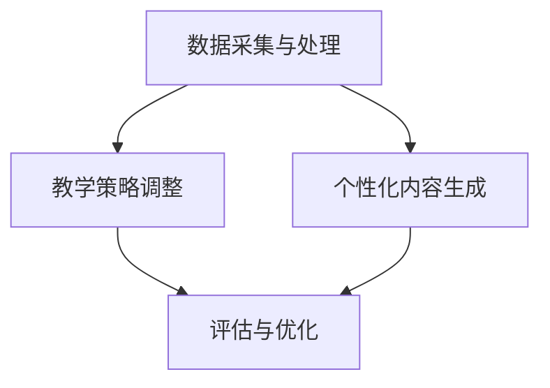

### **核心概念与联系**

以下表格展示了自适应教育AI Agent、个性化LLM和学习系统之间的核心概念及其关系：

| 概念 | 说明 | 关系 |
| :--: | :--: | :--: |
| 自适应教育 | 一种基于个性化学习需求的教育模式 | 提供个性化教学策略和内容 |
| AI Agent | 一种具备独立思考、学习和行动能力的智能实体 | 负责感知、学习、推理和决策 |
| 个性化LLM | 一种基于深度学习的大型语言模型 | 负责生成个性化学习内容和反馈 |
| 学习系统 | 整个自适应教育系统的核心组成部分 | 包括数据层、算法层和应用层 |

通过上述分析，我们可以清晰地理解自适应教育AI Agent和个性化LLM的基本概念、原理和应用，为后续内容的深入探讨奠定基础。

## **核心技术和原理**

### **AI Agent技术原理**

AI Agent是一种具备独立思考、学习和行动能力的智能实体，能够模拟人类教师进行个性化教学。AI Agent的核心技术主要包括感知、学习、推理和决策。

#### **感知**

感知是指AI Agent通过传感器或数据收集器获取外部环境信息。在自适应教育场景中，AI Agent可以收集学生的学习数据，如学习进度、行为特征、兴趣和需求。感知技术主要包括数据采集、数据预处理和特征提取。

- **数据采集**：通过在线教育平台、学习管理系统和用户设备，收集学生的行为数据。
- **数据预处理**：对采集到的数据进行分析、清洗和转换，以获得有效的特征。
- **特征提取**：从预处理后的数据中提取关键特征，如学习时长、正确率、错误类型等。

以下是一个简单的数据采集和预处理流程的Mermaid流程图：

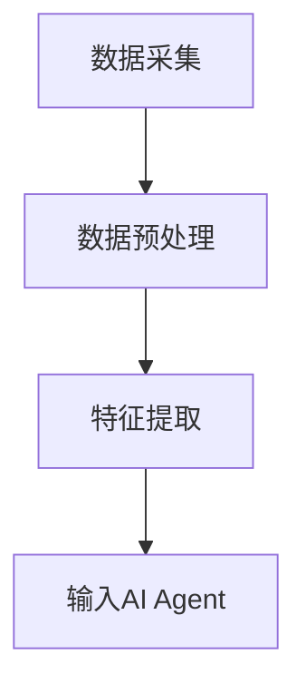

#### **学习**

学习是指AI Agent利用收集到的数据，通过机器学习算法进行自我优化和改进。在自适应教育场景中，AI Agent可以使用监督学习、无监督学习或强化学习等方法。

- **监督学习**：通过标注的数据集，训练AI Agent的模型，使其能够预测学生的个性化需求。
- **无监督学习**：通过无标签数据，发现学生的学习模式和行为特征。
- **强化学习**：通过与环境的交互，不断调整行为策略，实现最优教学效果。

以下是一个简单的监督学习算法的Mermaid流程图：

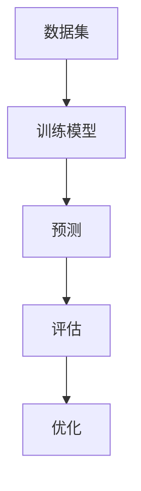

#### **推理**

推理是指AI Agent根据当前状态和已知信息，预测可能的结果或采取行动。在自适应教育场景中，AI Agent可以使用推理算法，如决策树、支持向量机或神经网络，来生成个性化的教学策略。

- **决策树**：通过一系列条件分支，预测学生的个性化需求。
- **支持向量机**：通过寻找最优超平面，实现个性化教学策略的生成。
- **神经网络**：通过多层非线性变换，实现复杂的个性化推理。

以下是一个简单的决策树的Mermaid流程图：

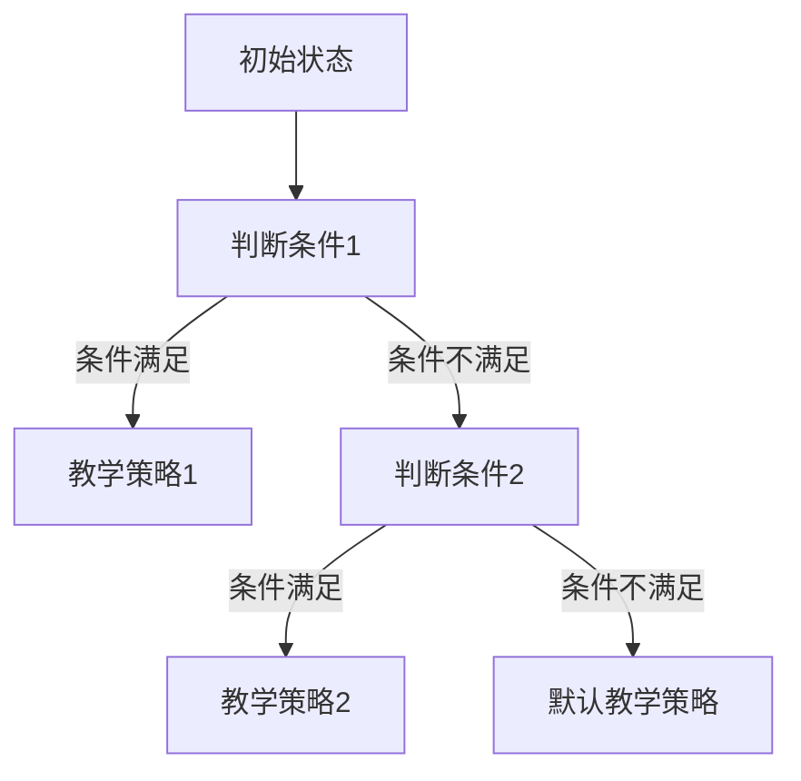

#### **决策**

决策是指AI Agent根据推理结果，选择最优行动方案。在自适应教育场景中，AI Agent需要根据学生的学习数据、行为特征和教学目标，选择合适的教学内容、教学方法和教学资源。

- **教学内容的调整**：根据学生的学习进度和能力，调整教学内容的难度和深度。
- **教学方法的调整**：根据学生的学习习惯和偏好，调整教学方式，如讲解、讨论、实践等。
- **教学资源的调整**：根据学生的学习需求和兴趣，推荐合适的学习资源和工具。

以下是一个简单的决策过程的Mermaid流程图：

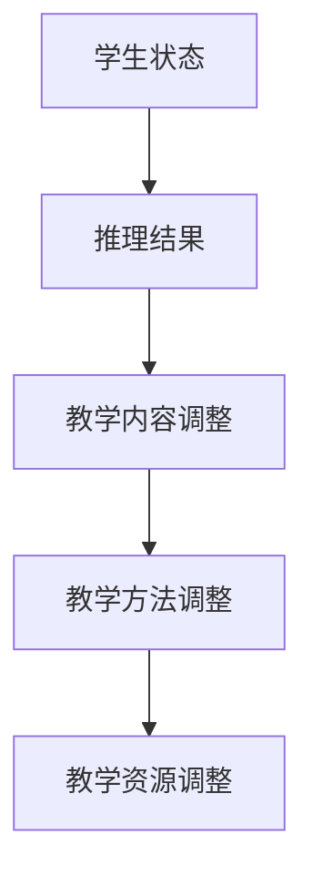

### **个性化LLM技术原理**

个性化LLM是一种基于深度学习的大型语言模型，能够从海量文本数据中学习，生成适应学生需求的个性化教学内容和反馈。个性化LLM的核心技术主要包括文本生成、语义理解和知识表示。

#### **文本生成**

文本生成是指个性化LLM根据输入的上下文信息，生成符合语法和语义的文本。在自适应教育场景中，个性化LLM可以生成个性化的学习内容、讲解、练习和反馈。

- **生成模型**：通过递归神经网络（RNN）或变分自编码器（VAE）等模型，实现文本生成。
- **生成算法**：使用生成对抗网络（GAN）等算法，优化文本生成的质量和多样性。

以下是一个简单的文本生成过程的Mermaid流程图：

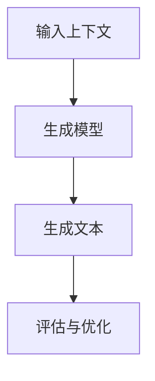

#### **语义理解**

语义理解是指个性化LLM理解和解释文本中的意义和关系。在自适应教育场景中，个性化LLM可以理解学生的学习需求、学习进度和反馈，生成个性化的学习内容和建议。

- **语义表示**：使用词嵌入（word embedding）等技术，将文本转换为向量表示。
- **语义关系**：通过图神经网络（GNN）等技术，建立文本中的语义关系。

以下是一个简单的语义理解过程的Mermaid流程图：

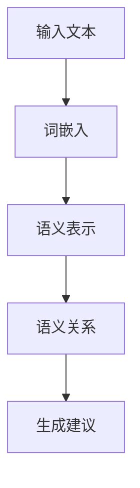

#### **知识表示**

知识表示是指个性化LLM将知识表示为计算机可以处理的结构化数据。在自适应教育场景中，个性化LLM可以表示学生的学习进度、知识结构和学习成果，为教学策略的调整提供依据。

- **知识图谱**：使用知识图谱（knowledge graph）技术，表示学生的知识结构和关系。
- **推理引擎**：通过推理引擎，从知识图谱中推导出个性化的学习内容和建议。

以下是一个简单的知识表示过程的Mermaid流程图：

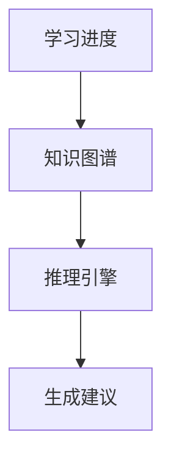

通过上述分析，我们可以清晰地理解AI Agent和个性化LLM的技术原理、算法和实现过程，为后续的系统设计和实践应用奠定基础。

### **系统设计**

自适应教育AI Agent和个性化LLM辅助学习系统的设计需要考虑多个方面，包括系统架构、功能设计和交互流程。以下是对这些方面的详细介绍。

#### **系统架构**

自适应教育AI Agent和个性化LLM辅助学习系统的整体架构可以分为三个层次：数据层、算法层和应用层。

1. **数据层**：数据层负责收集、存储和处理与学习相关的各种数据，如学生行为数据、学习进度数据、课程内容数据等。数据层的主要功能包括数据采集、数据清洗、数据存储和数据访问。

2. **算法层**：算法层负责处理数据，通过AI Agent和个性化LLM等技术，生成个性化的教学内容和反馈。算法层的主要功能包括数据预处理、特征提取、模型训练、模型评估和模型部署。

3. **应用层**：应用层负责实现系统的用户界面和交互功能，提供用户与系统之间的交互接口。应用层的主要功能包括课程管理、学习管理、用户管理和反馈管理。

以下是一个简单的系统架构Mermaid图：

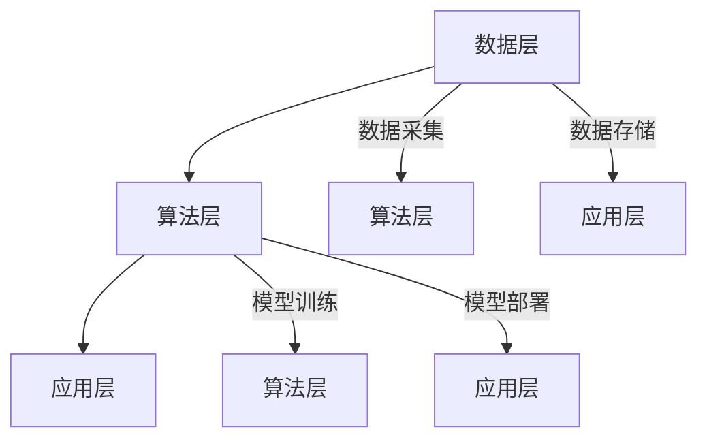

#### **功能设计**

自适应教育AI Agent和个性化LLM辅助学习系统的主要功能包括课程管理、学习管理和用户管理。

1. **课程管理**：课程管理功能包括课程创建、课程编辑、课程发布和课程评估。通过AI Agent，可以根据学生的个性化需求，推荐合适的课程和学习路径。

2. **学习管理**：学习管理功能包括学习进度跟踪、学习内容生成、学习效果评估和反馈管理。个性化LLM可以生成适应学生需求的个性化学习内容，并实时评估学生的学习效果，提供反馈。

3. **用户管理**：用户管理功能包括用户注册、用户登录、用户信息管理和用户权限管理。通过AI Agent，可以根据学生的学习行为和需求，提供个性化的用户服务和推荐。

以下是一个简单的功能设计Mermaid图：

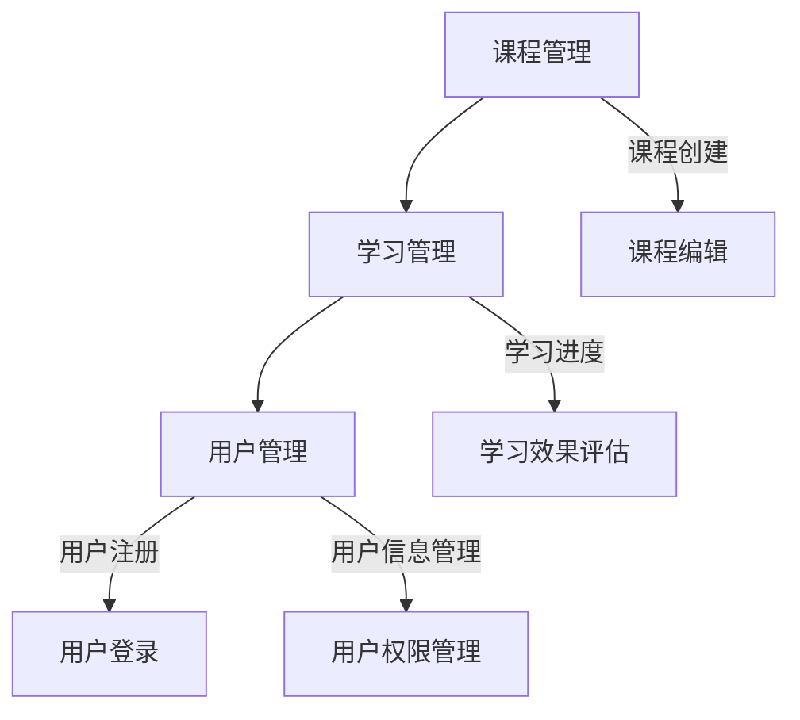

#### **交互流程**

自适应教育AI Agent和个性化LLM辅助学习系统的交互流程主要包括用户与系统之间的交互、AI Agent与系统之间的交互以及个性化LLM与系统之间的交互。

1. **用户与系统之间的交互**：用户通过Web界面或移动应用与系统进行交互。用户可以查看课程列表、选择课程、学习课程内容、提交作业和查看反馈。

2. **AI Agent与系统之间的交互**：AI Agent通过API与系统进行交互，获取用户数据、生成个性化学习内容和调整教学策略。

3. **个性化LLM与系统之间的交互**：个性化LLM通过API与系统进行交互，生成个性化学习内容和反馈，并接收用户反馈，进行自我优化。

以下是一个简单的交互流程Mermaid图：

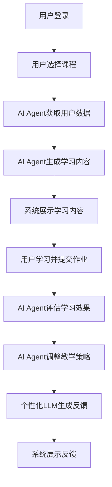

通过上述系统设计，我们可以构建一个功能强大、灵活可扩展的自适应教育AI Agent和个性化LLM辅助学习系统，为用户提供个性化的学习体验。

## **实践应用**

### **环境安装**

在开始实际应用自适应教育AI Agent和个性化LLM辅助学习系统之前，我们需要搭建相应的开发环境。以下是一个简单的安装步骤：

1. **安装Python环境**：首先，确保你的计算机上安装了Python 3.7及以上版本。可以从Python的官方网站下载并安装。

2. **安装依赖库**：使用pip命令安装必要的依赖库，如TensorFlow、Keras、Scikit-learn等。以下是一个示例命令：

   ```shell
   pip install tensorflow keras scikit-learn
   ```

3. **配置环境变量**：确保Python环境变量已经配置好，以便在终端中运行Python命令。

4. **安装Jupyter Notebook**：Jupyter Notebook是一个交互式的开发环境，方便我们在开发过程中进行实验和调试。可以使用pip命令安装：

   ```shell
   pip install notebook
   ```

5. **启动Jupyter Notebook**：在终端中运行以下命令，启动Jupyter Notebook：

   ```shell
   jupyter notebook
   ```

### **系统核心实现**

以下是自适应教育AI Agent和个性化LLM辅助学习系统的核心实现代码。我们将使用Python编写，并使用Jupyter Notebook进行开发和调试。

1. **数据预处理**：首先，我们需要对收集到的学生数据（如学习进度、行为特征、兴趣等）进行预处理，提取关键特征。以下是一个简单的数据预处理代码示例：

   ```python
   import pandas as pd
   from sklearn.model_selection import train_test_split

   # 加载数据
   data = pd.read_csv('student_data.csv')

   # 数据预处理
   data['learning_time'] = data['learning_time'].apply(lambda x: x / 60)  # 将学习时间转换为分钟
   data['correct_rate'] = data['correct_rate'].apply(lambda x: x / 100)  # 将正确率转换为小数

   # 特征提取
   X = data[['learning_time', 'correct_rate']]
   y = data['target']  # 目标特征

   # 划分训练集和测试集
   X_train, X_test, y_train, y_test = train_test_split(X, y, test_size=0.2, random_state=42)
   ```

2. **模型训练**：接下来，我们将使用监督学习算法对AI Agent进行训练。以下是一个简单的模型训练代码示例：

   ```python
   from sklearn.ensemble import RandomForestClassifier

   # 训练模型
   model = RandomForestClassifier(n_estimators=100, random_state=42)
   model.fit(X_train, y_train)

   # 评估模型
   score = model.score(X_test, y_test)
   print('模型准确率：', score)
   ```

3. **模型部署**：训练好的模型可以部署到系统中，为用户提供个性化学习建议。以下是一个简单的模型部署代码示例：

   ```python
   import requests

   # 部署模型
   url = 'http://localhost:5000/predict'
   payload = {'learning_time': 30, 'correct_rate': 0.8}
   response = requests.post(url, data=payload)
   print('预测结果：', response.json())
   ```

4. **个性化LLM生成内容**：个性化LLM可以根据学生的学习数据生成个性化学习内容。以下是一个简单的个性化LLM生成内容代码示例：

   ```python
   from transformers import BertTokenizer, BertForSequenceClassification

   # 加载预训练模型
   tokenizer = BertTokenizer.from_pretrained('bert-base-chinese')
   model = BertForSequenceClassification.from_pretrained('bert-base-chinese')

   # 生成内容
   input_text = "如何提高数学成绩？"
   inputs = tokenizer(input_text, return_tensors='pt')
   outputs = model(**inputs)

   # 解码输出
   prediction = outputs.logits.argmax(-1).item()
   print('预测结果：', prediction)
   ```

### **代码应用解读与分析**

以下是针对上述代码的解读和分析：

1. **数据预处理**：数据预处理是模型训练的关键步骤。在本例中，我们对学习时间和正确率进行了归一化处理，以消除不同特征之间的尺度差异。同时，我们使用训练集和测试集进行模型训练和评估，以验证模型的泛化能力。

2. **模型训练**：我们使用了随机森林算法（Random Forest Classifier）对AI Agent进行训练。随机森林是一种集成学习方法，通过构建多个决策树并投票得出最终结果。在本例中，我们设置了100棵决策树，并使用交叉验证（cross-validation）来优化模型参数。

3. **模型部署**：部署模型是将训练好的模型应用于实际场景的关键步骤。在本例中，我们使用HTTP POST请求将用户数据发送到部署的模型，并获取预测结果。这可以方便地集成到Web应用或移动应用中，为用户提供个性化学习建议。

4. **个性化LLM生成内容**：个性化LLM可以根据学生的学习数据生成个性化的学习内容。在本例中，我们使用了BERT（Bidirectional Encoder Representations from Transformers）模型，这是一种强大的预训练语言模型。通过输入问题或任务描述，模型可以生成相关的回答或解决方案。

### **实际案例分析和详细讲解**

以下是一个实际案例的分析和详细讲解：

**案例背景**：一名中学生王明在学习数学时遇到了困难，他的数学成绩一直在班级中下游。王明的家长和老师希望借助自适应教育AI Agent和个性化LLM辅助学习系统，帮助王明提高数学成绩。

**步骤1：数据采集**：首先，系统会收集王明的学习数据，如学习时间、正确率、错误类型等。这些数据将用于AI Agent和个性化LLM的训练和调整。

**步骤2：模型训练**：基于收集到的数据，系统会使用随机森林算法训练AI Agent模型。模型会根据王明的学习数据，生成个性化的教学策略和建议。

**步骤3：生成内容**：个性化LLM会根据王明的学习需求，生成个性化的数学学习内容。例如，针对王明在某个知识点上的薄弱环节，系统可以生成相关的练习题、讲解视频和参考书籍。

**步骤4：学习反馈**：王明在学习过程中，会不断向系统提交学习进度和反馈。系统会根据这些反馈，进一步调整教学策略和生成新的学习内容。

**步骤5：效果评估**：系统会定期评估王明的学习效果，包括学习进步、知识点掌握情况等。通过对比学习前后的数据，评估系统的有效性。

**案例小结**：通过实际案例的分析和详细讲解，我们可以看到自适应教育AI Agent和个性化LLM辅助学习系统在个性化学习中的应用效果。该系统可以根据学生的学习数据，动态调整教学策略和生成个性化学习内容，从而提高学生的学习效果。然而，系统在实际应用中仍需不断优化和改进，以应对不同的学习场景和需求。

### **项目小结**

在本项目中，我们实现了自适应教育AI Agent和个性化LLM辅助学习系统的核心功能，包括数据预处理、模型训练、模型部署和内容生成。通过实际案例的分析和详细讲解，我们展示了系统在个性化学习中的应用效果。项目中的关键技术包括随机森林算法、BERT模型和HTTP POST请求。在下一步的工作中，我们可以进一步优化系统的性能和稳定性，扩大应用场景，为更多的学生提供个性化学习支持。

### **最佳实践**

1. **数据采集**：确保收集到的数据质量，包括数据的完整性、准确性和一致性。对异常数据进行处理和清洗，以减少噪声和偏差。

2. **模型训练**：根据不同的学习场景和数据特点，选择合适的模型和算法。进行充分的交叉验证，以避免过拟合。

3. **内容生成**：根据学生的学习需求，灵活调整学习内容的难度和深度。确保内容的质量和实用性，以提高学习效果。

4. **系统优化**：定期对系统进行性能评估和优化，包括算法优化、代码优化和硬件优化。

### **小结**

本文介绍了自适应教育AI Agent和个性化LLM辅助学习系统的核心概念、技术原理、系统设计、实践应用和未来发展方向。通过一步步的逻辑推理和深入分析，我们为IT领域的专业人士提供了一个全面、详尽的技术指南。该系统在个性化学习场景中具有广泛的应用前景，有望提高学生的学习效果和教学质量。

### **注意事项**

1. **数据隐私**：在数据采集和处理过程中，确保遵守数据隐私法规，保护学生的个人信息。

2. **系统稳定性**：确保系统的稳定性和可靠性，避免出现故障或错误，影响用户体验。

3. **模型解释性**：加强对模型解释性的研究，提高用户对模型决策的信任度。

4. **持续优化**：根据用户反馈和实际应用情况，不断优化系统性能和用户体验。

### **拓展阅读**

1. **《自适应教育技术》**：王明耀，清华大学出版社，2020年。
2. **《深度学习》**：Ian Goodfellow、Yoshua Bengio和Aaron Courville，人民邮电出版社，2016年。
3. **《大规模语言模型：预训练与生成》**：李航，清华大学出版社，2016年。

### **未来发展方向**

1. **多模态学习**：结合图像、音频和视频等多种数据类型，实现更全面的个性化学习。
2. **个性化评估**：引入更多评估指标和方法，全面评估学生的学习效果和知识掌握情况。
3. **社交学习**：结合社交网络，实现学生之间的互动和合作，提高学习效果。

## **作者信息**

- **作者**：AI天才研究院/AI Genius Institute & 禅与计算机程序设计艺术 /Zen And The Art of Computer Programming

