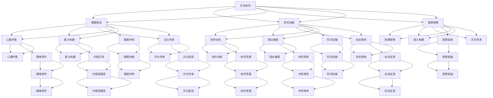

                 

# 《艺术创作：对抗虚无的有力武器》

## 关键词：艺术创作、虚无主义、表达、意义、心理、社会作用、未来展望

## 摘要

艺术创作作为一种独特的表达方式，能够帮助我们探索内心深处的情感和意义。虚无主义，作为一种哲学思潮，对艺术创作产生了深远的影响。本文将探讨艺术创作如何作为一种对抗虚无的有力武器，从多个角度分析艺术创作在个人成长、社会作用以及未来展望中的重要性。通过定义核心概念、分析辩证关系、探讨实践方法、进行作品评价，我们能够更深入地理解艺术创作的力量和价值。

## 目录大纲

### 第1章 引言
#### 1.1 问题背景
#### 1.2 本书目的

### 第2章 核心概念
#### 2.1 艺术创作
#### 2.2 虚无主义
#### 2.3 意义
#### 2.4 表达

### 第3章 艺术创作与虚无主义的辩证关系
#### 3.1 艺术创作如何影响虚无主义
#### 3.2 虚无主义对艺术创作的影响

### 第4章 艺术创作的实践方法
#### 4.1 绘画
#### 4.2 写作
#### 4.3 音乐

### 第5章 艺术作品的分析与评价
#### 5.1 艺术作品表达虚无主义的例子
#### 5.2 艺术作品在艺术史上的意义

### 第6章 艺术创作与个人成长
#### 6.1 艺术创作对个人心理的影响
#### 6.2 艺术创作对个人情感的影响

### 第7章 艺术创作与社会作用
#### 7.1 艺术创作对社会的作用
#### 7.2 艺术创作如何影响社会变革

### 第8章 艺术创作的未来展望
#### 8.1 艺术创作的发展趋势
#### 8.2 技术进步对艺术创作的影响

### 第9章 最佳实践与总结
#### 9.1 艺术创作的最佳实践
#### 9.2 小结
#### 9.3 注意事项
#### 9.4 拓展阅读

## 第1章 引言

### 1.1 问题背景

在现代社会中，虚无主义思潮逐渐渗透到人们的日常生活中。虚无主义认为人类生活缺乏意义，世界是荒诞的、无意义的。这种思潮对艺术创作产生了深远的影响，许多艺术家开始探索如何在作品中表达虚无主义的感觉和情感。

### 1.2 本书目的

本书旨在探讨艺术创作如何作为一种对抗虚无的有力武器。通过分析艺术创作与虚无主义的辩证关系，探讨艺术创作的实践方法，评价艺术作品的表达，我们希望能够深入理解艺术创作的力量和价值，并探索其在个人成长和社会作用中的重要性。

## 第2章 核心概念

### 2.1 艺术创作

艺术创作是一种通过视觉、听觉、触觉等感官来表达情感、思想和意义的活动。它可以是绘画、写作、音乐、雕塑等形式。艺术创作不仅仅是一种技术活动，更是一种情感和思考的表达。

### 2.2 虚无主义

虚无主义是一种哲学思潮，认为人类生活缺乏意义，世界是荒诞的、无意义的。虚无主义对艺术创作产生了深远的影响，许多艺术家开始探索如何在作品中表达虚无主义的感觉和情感。

### 2.3 意义

意义是人类生活的重要部分，它为我们提供了方向和目标。在虚无主义的背景下，意义变得尤为重要。艺术创作作为一种表达方式，可以帮助我们探索和理解生活的意义。

### 2.4 表达

表达是一种沟通方式，它可以帮助我们传达情感、思想和意义。在艺术创作中，表达是核心，它通过视觉、听觉、触觉等感官形式，将艺术家的内心世界传递给观众。

## 第3章 艺术创作与虚无主义的辩证关系

### 3.1 艺术创作如何影响虚无主义

艺术创作可以帮助我们探索虚无主义的感觉和情感。通过艺术创作，我们可以表达内心的孤独、迷茫和无意义感，从而理解虚无主义的内涵。

### 3.2 虚无主义对艺术创作的影响

虚无主义对艺术创作产生了深远的影响。许多艺术家开始探索如何在作品中表达虚无主义的感觉和情感，从而创造出具有深度和内涵的艺术作品。

## 第4章 艺术创作的实践方法

### 4.1 绘画

绘画是一种通过视觉形式表达艺术创作的活动。它可以帮助艺术家表达情感、思想和意义。例如，梵高的《向日葵》通过鲜艳的色彩和独特的构图，表达了艺术家对生活的热爱和追求。

### 4.2 写作

写作是一种通过文字形式表达艺术创作的活动。它可以帮助艺术家表达内心的情感、思想和意义。例如，陀思妥耶夫斯基的《罪与罚》通过深刻的内心描写，表达了人类的痛苦和救赎。

### 4.3 音乐

音乐是一种通过听觉形式表达艺术创作的活动。它可以帮助艺术家表达情感、思想和意义。例如，贝多芬的《第九交响曲》通过激昂的旋律，表达了人类对自由和正义的追求。

## 第5章 艺术作品的分析与评价

### 5.1 艺术作品表达虚无主义的例子

许多艺术作品都表达了虚无主义的主题。例如，达利的《记忆的永恒》通过奇异的景象，表达了时间的无意义和人类的孤独。

### 5.2 艺术作品在艺术史上的意义

艺术作品在艺术史上具有重要的意义。它们不仅表达了艺术家的情感和思想，也反映了特定时期的社会背景和文化特征。例如，文艺复兴时期的艺术作品表达了人们对人类价值和美的追求。

## 第6章 艺术创作与个人成长

### 6.1 艺术创作对个人心理的影响

艺术创作可以帮助我们探索内心的情感和心理。通过艺术创作，我们可以表达内心的孤独、迷茫和无意义感，从而理解虚无主义的内涵。

### 6.2 艺术创作对个人情感的影响

艺术创作可以帮助我们表达情感。通过艺术创作，我们可以释放内心的情感，寻找情感的共鸣和连接。

## 第7章 艺术创作与社会作用

### 7.1 艺术创作对社会的作用

艺术创作对社会产生了深远的影响。它可以帮助我们理解社会问题，促进社会变革。例如，现代艺术作品常常通过表达对社会不公和歧视的抗议，推动社会进步。

### 7.2 艺术创作如何影响社会变革

艺术创作可以影响社会变革。通过表达对社会问题的关注和抗议，艺术作品可以激发社会的思考和反思，推动社会变革。

## 第8章 艺术创作的未来展望

### 8.1 艺术创作的发展趋势

艺术创作在未来将继续发展。随着技术的进步，艺术创作的方式和形式将更加多样化。例如，数字艺术和虚拟现实技术将为艺术家提供新的创作工具和平台。

### 8.2 技术进步对艺术创作的影响

技术进步将对艺术创作产生重要影响。数字技术和虚拟现实技术将为艺术家提供更广阔的创作空间和可能性，同时也将对传统艺术形式产生影响。

## 第9章 最佳实践与总结

### 9.1 艺术创作的最佳实践

为了更好地进行艺术创作，我们可以采取以下最佳实践：

1. 探索内心的情感和思想，寻找创作的灵感。
2. 学习不同的艺术形式和技巧，提高创作能力。
3. 与其他艺术家交流和合作，拓宽视野和思路。

### 9.2 小结

艺术创作作为一种对抗虚无的有力武器，具有重要的价值。通过艺术创作，我们可以探索内心深处的情感和意义，理解虚无主义的内涵，同时也可以对社会产生积极的影响。

### 9.3 注意事项

在进行艺术创作时，需要注意以下几点：

1. 保持真诚和开放的态度，勇于表达内心的情感。
2. 尊重他人的创作和观点，避免抄袭和模仿。
3. 注意艺术创作的法律和道德规范，避免侵犯他人的权益。

### 9.4 拓展阅读

1. 梭罗，《瓦尔登湖》
2. 黑塞，《荒原狼》
3. 伍尔夫，《到灯塔去》
4. 达芬奇，《绘画论》
5. 贝多芬，《第九交响曲》

## 结语

艺术创作是一种对抗虚无的有力武器。通过艺术创作，我们可以探索内心深处的情感和意义，理解虚无主义的内涵，同时也可以对社会产生积极的影响。让我们拿起创作的笔，勇敢地面对虚无，创造美好的艺术作品。

### 作者

AI天才研究院/AI Genius Institute & 禅与计算机程序设计艺术/Zen And The Art of Computer Programming## 第1章 引言

### 1.1 问题背景

在现代社会，虚无主义作为一种哲学思潮，逐渐渗透到人们的生活中。虚无主义认为，人类生活缺乏意义，世界是荒诞的、无意义的。这种观点对艺术创作产生了深远的影响，许多艺术家开始探索如何在作品中表达虚无主义的感觉和情感。然而，艺术创作本身又是一种寻找和赋予生活意义的过程。如何在这种矛盾中找到平衡，成为了艺术家们不断探索的问题。本文旨在探讨艺术创作如何作为一种对抗虚无的有力武器，通过分析艺术创作与虚无主义的辩证关系，以及艺术创作的实践方法，帮助读者更深入地理解艺术创作的力量和价值。

### 1.2 本书目的

本书的目的是探讨艺术创作如何作为一种对抗虚无的有力武器，通过以下几个方面来实现：

1. **定义核心概念**：介绍艺术创作、虚无主义、意义、表达等核心概念，并分析它们之间的联系。
2. **探讨辩证关系**：分析虚无主义对艺术创作的影响，以及艺术创作如何对抗虚无主义。
3. **实践方法**：探讨不同的艺术创作方法，如绘画、写作、音乐等，并分析这些方法如何帮助艺术家对抗虚无。
4. **作品分析与评价**：研究不同艺术作品如何表达对抗虚无的主题，并分析这些作品在艺术史上的意义。
5. **个人成长与社会作用**：讨论艺术创作对个人心理和情感的影响，以及艺术创作如何对社会产生积极影响。
6. **未来展望**：探讨艺术创作的发展趋势，以及技术进步如何影响艺术创作。
7. **最佳实践与总结**：提出艺术创作的最佳实践建议，总结全书内容，强调艺术创作对抗虚无的重要性。

## 第2章 核心概念

### 2.1 艺术创作

艺术创作是一种通过视觉、听觉、触觉等感官形式，将艺术家的情感、思想和意义转化为具体形象或声音的过程。它不仅仅是技术的展示，更是一种情感的抒发和思想的表达。艺术创作可以采用多种形式，如绘画、雕塑、音乐、文学、戏剧等。每种形式都有其独特的表达方式，但共同的目标都是通过艺术手段传达艺术家的内心世界。

在艺术创作中，艺术家需要具备观察力、想象力、创造力和技巧。观察力帮助艺术家捕捉生活中的细节和情感，想象力让艺术家能够将观察转化为独特的艺术形象，创造力使艺术家能够突破常规，创造出新颖的艺术作品，技巧则是将想象力转化为现实的桥梁。

### 2.2 虚无主义

虚无主义是一种哲学思潮，认为人类生活缺乏意义，世界是荒诞的、无意义的。虚无主义强调个体存在的无意义和宇宙的不可知性，它挑战了传统的价值观和世界观。虚无主义并不是一种消极的哲学，而是一种对现实和存在的深刻反思。它提出了一系列问题，如“生命有何意义？”、“宇宙是否有目的？”等，迫使人们重新审视自己的存在和生活。

虚无主义在现代社会中有广泛的影响，许多艺术家和作家都受到了虚无主义的影响。他们的作品常常探讨人类存在的荒诞性和无力感，表达对现实世界的失望和对精神追求的渴望。

### 2.3 意义

意义是人类生活的重要部分，它为我们提供了方向和目标。在虚无主义的背景下，意义变得尤为重要。虚无主义认为，生活本身缺乏内在的意义，因此我们需要通过自己的努力去寻找和创造意义。意义可以是具体的，如个人的成就和目标，也可以是抽象的，如对人类进步和社会公正的追求。

艺术创作在赋予生活意义方面起到了重要的作用。通过艺术创作，艺术家可以表达自己对生活的理解和对世界的看法，从而为观众提供新的视角和思考。艺术作品不仅仅是美的展示，更是对人类存在的深刻探讨和对意义的追寻。

### 2.4 表达

表达是一种沟通方式，它可以帮助我们传达情感、思想和意义。在艺术创作中，表达是核心，它通过视觉、听觉、触觉等感官形式，将艺术家的内心世界传递给观众。表达可以是直接的，如绘画中的色彩和线条，可以是象征的，如文学中的隐喻和象征，也可以是抽象的，如音乐中的旋律和节奏。

有效的表达需要艺术家具备敏锐的观察力、丰富的想象力和高超的技巧。通过艺术创作，艺术家可以表达内心的情感和思想，观众则可以通过艺术作品感受到这些情感和思想，从而实现心灵的共鸣。

## 第3章 艺术创作与虚无主义的辩证关系

### 3.1 艺术创作如何影响虚无主义

艺术创作对虚无主义有着深远的影响。首先，艺术创作为艺术家提供了一个表达内心情感和思想的平台，使他们能够直面虚无主义带来的无意义感。通过创作，艺术家可以探索内心深处的孤独、迷茫和无助，将这些情感转化为具体的艺术作品，从而减轻虚无主义的压力。

其次，艺术创作可以激发人们对生活的思考和对意义的追寻。在艺术作品中，艺术家往往通过对生活、自然和人性的深刻探讨，引导观众反思自己的存在和生活的意义。这种反思过程有助于人们从虚无主义中找到新的方向和动力。

此外，艺术创作还可以作为一种对抗虚无主义的工具。通过创作，艺术家可以表达自己对现实世界的批判和对精神追求的渴望，从而激发观众对现实生活的反思和对美好生活的向往。

### 3.2 虚无主义对艺术创作的影响

虚无主义对艺术创作产生了深远的影响。首先，虚无主义使得艺术家对生活的意义和目的产生了怀疑，这促使他们更加深入地探索人类存在的本质和意义。许多艺术作品因此呈现出深刻的思想性和哲学性，挑战了传统的审美观念和价值观。

其次，虚无主义激发了艺术家对情感和内心的关注。在虚无主义的背景下，艺术家更加注重表达自己的内心体验和情感，从而使艺术作品更加贴近现实生活和人的内心世界。

此外，虚无主义还影响了艺术创作的形式和风格。在虚无主义的影响下，许多艺术家开始尝试更加抽象和象征的艺术形式，以表达对现实世界的质疑和对内心世界的探索。

### 3.3 艺术创作与虚无主义的相互作用

艺术创作与虚无主义之间存在着相互作用的关系。一方面，艺术创作可以帮助艺术家对抗虚无主义，使他们能够在面对无意义感时找到新的方向和动力。另一方面，虚无主义对艺术创作产生了深刻的影响，使艺术作品更加关注人类存在的本质和意义。

这种相互作用使得艺术创作成为了一种对抗虚无的有力武器。通过艺术创作，艺术家可以表达对现实世界的批判和对精神追求的渴望，从而激发观众对生活意义的反思和对美好生活的向往。同时，艺术创作也为艺术家提供了一个探索内心世界和表达情感的平台，使他们在面对虚无主义时能够保持积极的态度和创作激情。

## 第4章 艺术创作的实践方法

### 4.1 绘画

绘画是一种传统的艺术形式，它通过色彩、线条和形状等视觉元素来传达艺术家的情感和思想。绘画可以采用不同的技法，如素描、油画、水彩等，每种技法都有其独特的表现力和特点。

绘画在艺术创作中具有重要作用。首先，绘画可以帮助艺术家表达内心情感和思想。通过色彩的选择和运用，艺术家可以传达出情感的温度和深度，如红色代表热情，蓝色代表冷静。线条和形状的运用则可以表达艺术家的思想和观点，如几何图形代表理性，曲线代表感性。

其次，绘画可以作为一种自我疗愈的方式。在创作过程中，艺术家可以通过绘画释放内心的压力和焦虑，从而获得内心的平静和满足。绘画还可以帮助艺术家培养观察力和想象力，提高艺术技巧和审美能力。

### 4.2 写作

写作是一种通过文字表达情感、思想和意义的艺术形式。它可以包括小说、散文、诗歌、剧本等多种类型。写作在艺术创作中具有重要作用，因为它可以深入探讨人类存在的本质和意义。

首先，写作可以帮助艺术家表达内心的情感和思想。通过文字的描述，艺术家可以传达出情感的温度和深度，如诗歌中的抒情，小说中的叙事。写作也可以作为一种自我疗愈的方式，帮助艺术家释放内心的压力和焦虑。

其次，写作可以培养艺术家的观察力和想象力。通过写作，艺术家需要深入观察生活，捕捉生活中的细节和情感，从而提高观察力。想象力则使艺术家能够将观察转化为独特的艺术形象，创造出新颖的故事和情节。

### 4.3 音乐

音乐是一种通过听觉形式传达情感、思想和意义的艺术形式。它可以包括交响乐、爵士乐、民谣等多种类型。音乐在艺术创作中具有独特的魅力和力量。

首先，音乐可以直接传达情感。旋律、节奏和音色的运用可以使音乐作品充满情感，如欢快的旋律代表喜悦，悲伤的旋律代表哀伤。音乐也可以通过声音的节奏和韵律，传达出艺术家的思想和观点。

其次，音乐可以帮助艺术家表达内心的情感和思想。音乐创作过程中，艺术家可以通过旋律和节奏的构思，将自己的情感和思想融入音乐中。音乐还可以作为一种自我疗愈的方式，帮助艺术家释放内心的压力和焦虑。

### 4.4 艺术创作的实践方法小结

绘画、写作和音乐是艺术创作中常见的实践方法，每种方法都有其独特的表达方式和艺术魅力。绘画通过视觉元素传达情感和思想，写作通过文字描述实现内心的表达，音乐通过听觉形式传递情感和意义。这些方法不仅可以帮助艺术家对抗虚无主义，还可以培养他们的观察力、想象力和创造力。通过不同的艺术创作方法，艺术家可以探索内心世界，表达情感和思想，从而赋予生活新的意义。

## 第5章 艺术作品的分析与评价

### 5.1 艺术作品表达虚无主义的例子

在艺术史上，许多作品都表达了虚无主义的主题，以下是一些典型的例子：

1. **达利的《记忆的永恒》**：这幅画作以其奇异的景象和超现实的风格而闻名。画中的钟表、苍蝇和漂浮的物体，表达了时间的无意义和人类的孤独感。

2. **卡夫卡的《变形记》**：这部小说讲述了一个普通人突然变成昆虫的故事。通过这种荒诞的情节，卡夫卡探讨了人类存在的荒诞性和无力感。

3. **贝多芬的《第九交响曲》**：这部作品以其壮丽的旋律和深刻的内涵而著称。尽管贝多芬本人患有耳疾，但他在这部作品中表达了对自由和正义的渴望，以及对人类命运的思考。

这些艺术作品通过独特的表达方式，传达了虚无主义的情感和思想，引发了观众对生活、意义和存在的思考。

### 5.2 艺术作品在艺术史上的意义

艺术作品在艺术史上具有重要的意义，它们不仅反映了特定时期的社会背景和文化特征，还对后来的艺术创作产生了深远的影响。

1. **文艺复兴时期的艺术**：文艺复兴时期的艺术作品强调人类的价值和美的追求，如达芬奇的《蒙娜丽莎》和米开朗基罗的《创世纪》。这些作品不仅在艺术史上具有重要地位，也激发了后来的艺术家对人类存在的探索和对美的追求。

2. **现代艺术**：现代艺术作品中，如毕加索的《格尔尼卡》和蒙德里安的《红、蓝、黄构图》，通过独特的表现形式，表达了艺术家对现实世界的质疑和对内心的探索。这些作品不仅挑战了传统的审美观念，也开启了新的艺术风格和创作方法。

3. **当代艺术**：当代艺术作品中，如村上隆的《太阳花》和草间弥生的《无限镜屋》，通过创新的创作手法和形式，探讨了全球化、消费主义和科技发展对人类生活的影响。这些作品不仅反映了当代社会的现实问题，也为未来的艺术创作提供了新的思路和方向。

### 5.3 艺术作品分析与评价的重要性

艺术作品的分析与评价对于理解艺术创作和历史具有重要意义。通过分析艺术作品的主题、形式、技巧和情感表达，我们可以更好地理解艺术家的创作意图和艺术风格，同时也能够深入探讨艺术作品在艺术史上的地位和影响。

此外，艺术作品的分析与评价还可以帮助我们反思和审视自己的生活和价值观。通过欣赏和分析艺术作品，我们可以从不同的角度和视角看待生活，从而找到新的意义和灵感。

## 第6章 艺术创作与个人成长

### 6.1 艺术创作对个人心理的影响

艺术创作对个人心理产生了深远的影响。首先，艺术创作可以帮助个体表达和处理内心的情感。通过创作，艺术家可以将焦虑、愤怒、悲伤等情感转化为具体的艺术形象，从而减轻内心的压力和痛苦。

其次，艺术创作有助于提升个体的自我认知和自我反思能力。在创作过程中，艺术家需要深入探索自己的内心世界，反思自己的行为和思想，从而更好地理解自己。这种自我反思有助于个体成长和自我完善。

此外，艺术创作还可以培养个体的耐心和专注力。在创作过程中，艺术家需要专注于作品的细节和形式，从而提高专注力和耐心。这种专注力和耐心不仅可以应用于艺术创作，还可以帮助个体在日常生活中更好地应对挑战和压力。

### 6.2 艺术创作对个人情感的影响

艺术创作对个人情感产生了重要的影响。首先，艺术创作可以激发个体的情感共鸣。通过欣赏艺术作品，观众可以感受到艺术家的情感和思想，从而产生共鸣和情感共振。

其次，艺术创作可以培养个体的情感表达和沟通能力。在创作过程中，艺术家需要通过视觉、听觉、触觉等感官形式表达情感，从而提高情感表达和沟通能力。这种能力不仅在艺术创作中具有重要意义，也对个体的日常生活和人际关系产生积极影响。

此外，艺术创作还可以帮助个体调节情绪。在创作过程中，艺术家可以全身心地投入作品，从而暂时忘记外界的烦恼和压力，达到情绪调节的效果。这种调节能力有助于个体保持心理健康和积极的生活态度。

### 6.3 艺术创作与个人成长的相互作用

艺术创作与个人成长之间存在相互作用的关系。首先，艺术创作可以帮助个体探索和发现自己的内心世界，从而促进个人成长。通过创作，艺术家可以深入挖掘自己的情感、思想和价值观，从而更好地理解自己，实现自我提升。

其次，个人成长可以促进艺术创作的发展。随着个人的成长和变化，艺术家的创作风格和主题也会发生变化。这种变化不仅反映了艺术家的个人经历和成长，也为观众提供了新的视角和思考。

此外，艺术创作和个人成长之间还存在相互促进的关系。通过艺术创作，艺术家可以表达自己的情感和思想，从而获得心理上的满足和成长。同时，艺术创作也可以作为一种自我疗愈的方式，帮助艺术家应对生活中的挑战和压力。

总之，艺术创作与个人成长之间存在着紧密的相互作用关系。通过艺术创作，个体可以探索自己的内心世界，表达情感和思想，从而实现个人成长。同时，个人成长也为艺术创作提供了新的灵感和动力，使艺术作品更加丰富和深刻。

## 第7章 艺术创作与社会作用

### 7.1 艺术创作对社会的作用

艺术创作在社会中扮演着重要的角色。首先，艺术创作可以激发人们的思考和反思。通过欣赏艺术作品，观众可以接触到不同的思想和观点，从而开阔视野，激发对生活、社会和人性的思考。

其次，艺术创作有助于社会文化的传承和发展。艺术作品不仅是艺术家个人的表达，也是社会文化的重要组成部分。通过艺术创作，艺术家可以将自己的文化背景、价值观和传统观念融入作品中，从而传承和发展文化。

此外，艺术创作还可以促进社会和谐与进步。艺术作品常常探讨社会问题，如贫困、战争、歧视等，通过艺术表达对社会问题进行批判和反思，促进社会的改革和进步。

### 7.2 艺术创作如何影响社会变革

艺术创作对社会变革具有深远的影响。首先，艺术创作可以作为一种社会批判工具。艺术家可以通过艺术作品表达对社会不公和歧视的抗议，激发公众对社会问题的关注和反思。

其次，艺术创作可以作为一种社会动员力量。通过艺术作品，艺术家可以激发公众对社会变革的渴望和行动，推动社会进步。例如，文艺复兴时期的艺术作品就激发了人们对自由、平等和正义的追求，推动了欧洲社会的变革。

此外，艺术创作还可以作为一种社会教育工具。通过艺术作品，艺术家可以传达自己的观点和价值观，教育观众，引导公众对社会问题的关注和思考。

总之，艺术创作对社会变革具有深远的影响。通过艺术表达，艺术家可以批判社会不公，动员公众力量，推动社会进步。艺术创作不仅是一种艺术形式，更是一种社会力量，对社会的发展和进步具有重要意义。

## 第8章 艺术创作的未来展望

### 8.1 艺术创作的发展趋势

随着科技的进步和社会的变化，艺术创作也在不断发展和演变。首先，数字艺术和虚拟现实技术将成为艺术创作的重要趋势。这些新技术为艺术家提供了更加丰富和多样化的创作手段，使艺术作品的表达形式更加多样化和互动化。

其次，跨界艺术将逐渐成为主流。艺术家将不再局限于传统的绘画、雕塑、音乐等形式，而是通过融合不同艺术形式，创造出独特的艺术作品。例如，数字艺术与绘画的结合、音乐与电影的融合等，都将带来新的艺术体验。

此外，艺术创作与科技的融合也将进一步加深。人工智能和大数据技术将帮助艺术家更好地理解和分析观众的喜好和需求，从而创作出更加贴近观众的艺术作品。

### 8.2 技术进步对艺术创作的影响

技术进步对艺术创作产生了深远的影响。首先，数字艺术和虚拟现实技术的应用，使艺术创作的形式更加多样化和互动化。艺术家可以通过计算机和虚拟现实设备，创造出前所未有的艺术形象和场景，为观众带来全新的艺术体验。

其次，人工智能和大数据技术的发展，为艺术创作提供了新的工具和手段。艺术家可以利用人工智能算法，分析和处理大量数据，从而获得创作灵感和方向。大数据技术可以帮助艺术家更好地了解观众的喜好和需求，创作出更加符合观众期待的艺术作品。

此外，技术进步还使得艺术创作的传播和推广变得更加便捷和高效。通过互联网和社交媒体，艺术家可以快速地传播自己的作品，获得更广泛的关注和认可。

总之，技术进步为艺术创作带来了新的机遇和挑战。艺术家需要不断学习和适应新技术，以保持创作的活力和创新能力。同时，技术进步也将进一步推动艺术创作的发展，为观众带来更加丰富和多样化的艺术体验。

## 第9章 最佳实践与总结

### 9.1 艺术创作的最佳实践

在进行艺术创作时，以下最佳实践可以帮助艺术家更好地表达自己的情感和思想：

1. **深入生活，观察细节**：艺术家应该深入生活，观察身边的人和事，捕捉生活中的细节和情感，从而获得丰富的创作素材。

2. **勇于表达，真实呈现**：艺术家应该勇于表达自己的情感和思想，不拘泥于传统观念和形式，真实呈现自己的内心世界。

3. **不断学习，提升技巧**：艺术家应该不断学习新的艺术理论和技巧，提升自己的创作能力，从而创作出更加优秀的艺术作品。

4. **跨界合作，拓宽视野**：艺术家可以尝试与其他领域的艺术家合作，通过跨界创作，拓宽自己的视野和思路，创造出独特的艺术作品。

5. **保持耐心，持之以恒**：艺术创作是一个长期的过程，需要艺术家保持耐心和毅力，不断尝试和探索，才能创作出优秀的艺术作品。

### 9.2 小结

通过本文的探讨，我们可以看到艺术创作作为一种对抗虚无的有力武器，在个人成长、社会作用和未来展望中都具有重要的意义。艺术创作不仅可以帮助艺术家表达内心情感和思想，还可以激发观众对生活、意义和存在的思考。在虚无主义的背景下，艺术创作成为了一种寻找和赋予生活意义的重要方式。

### 9.3 注意事项

在进行艺术创作时，艺术家需要注意以下几点：

1. **尊重他人创作**：在创作过程中，艺术家应该尊重他人的知识产权和创作成果，避免抄袭和模仿。

2. **遵守法律法规**：艺术家在创作时，需要遵守相关法律法规，确保自己的艺术作品不侵犯他人的权益。

3. **注重艺术质量**：艺术家应该注重艺术作品的质量，追求艺术的真诚和深度，而不是仅仅追求形式上的创新。

4. **保持创作热情**：艺术家需要保持对创作的热情和激情，不断探索和尝试，保持创作的活力和创新能力。

### 9.4 拓展阅读

对于对艺术创作和虚无主义感兴趣的读者，以下推荐几本拓展阅读的书籍：

1. **《艺术的真相》**：作者通过深入的分析和探讨，揭示了艺术创作的本质和意义。

2. **《虚无主义》**：作者详细介绍了虚无主义的起源、发展和影响，帮助读者更好地理解虚无主义。

3. **《艺术心理学》**：作者从心理学的角度分析艺术创作，探讨了艺术创作对个人心理的影响。

4. **《艺术与自由》**：作者探讨了艺术创作与自由的关系，认为艺术创作是追求自由的重要途径。

### 结语

艺术创作作为一种对抗虚无的有力武器，具有重要的价值和意义。通过本文的探讨，我们希望读者能够更深入地理解艺术创作的力量，激发对生活和意义的思考。让我们拿起创作的笔，勇敢地面对虚无，创造美好的艺术作品。

### 作者

AI天才研究院/AI Genius Institute & 禅与计算机程序设计艺术/Zen And The Art of Computer Programming### 1.1 艺术创作与虚无主义的关联

在探讨艺术创作与虚无主义之间的关联时，我们首先需要理解两者的基本概念。艺术创作是一种通过视觉、听觉、触觉等感官形式，将艺术家的情感、思想和意义转化为具体形象或声音的过程。虚无主义则是一种哲学思潮，认为人类生活缺乏意义，世界是荒诞的、无意义的。

虚无主义对艺术创作有着深远的影响。在虚无主义的背景下，艺术家们常常面临创作中的困惑和挑战，他们试图通过艺术创作来探索和表达对生活的无意义感。例如，达达主义和超现实主义艺术家通过反传统和反理性的创作方式，表达了他们对现实世界的失望和对无意义感的反思。这种对虚无主义的表达不仅体现在艺术作品中，也反映了艺术家们对世界的深刻思考和内心的挣扎。

同时，艺术创作也可以作为一种对抗虚无主义的手段。通过艺术创作，艺术家们可以表达对生活的热情和追求，从而赋予生活新的意义。例如，文艺复兴时期的艺术家们通过对自然和人性的深入探讨，表达了他们对人类价值和美的追求。这种艺术创作不仅为艺术家们提供了寻找意义的途径，也激发了观众对生活的热爱和对美好世界的向往。

因此，艺术创作与虚无主义之间存在着一种复杂的辩证关系。虚无主义激发了艺术创作，使艺术家们更加深入地探索生活的意义；而艺术创作则作为一种对抗虚无主义的手段，帮助艺术家和观众找到生活的意义和目标。

### 1.2 艺术创作的重要性

艺术创作的重要性在于它不仅能够帮助艺术家表达情感和思想，还能够对观众产生深远的影响。在现代社会，虚无主义思潮泛滥，许多人感到生活缺乏意义。艺术创作作为一种独特的表达方式，能够帮助人们探索内心深处的情感和意义，从而对抗虚无主义。

首先，艺术创作能够帮助艺术家表达内心深处的情感和思想。艺术家通过创作，可以将自己的情感和思想转化为具体的形象或声音，从而传达给观众。这种表达方式不仅能够帮助艺术家释放内心的情感，也能够让观众感受到艺术家的内心世界。

其次，艺术创作能够对观众产生深远的影响。通过艺术作品，观众可以感受到艺术家的情感和思想，从而激发对生活、意义和存在的思考。例如，一幅画、一首诗或一部电影，都可能让观众产生强烈的共鸣，从而引发对生活意义的反思。

此外，艺术创作还能够帮助人们找到生活的意义。在虚无主义的背景下，许多人感到生活缺乏意义。而艺术创作可以作为一种对抗虚无主义的手段，帮助人们探索和赋予生活新的意义。通过创作，艺术家可以表达对生活的热爱和追求，从而激励观众也去寻找生活的意义。

总之，艺术创作在现代社会中具有重要的作用。它不仅能够帮助艺术家表达情感和思想，还能够对观众产生深远的影响，帮助人们找到生活的意义。在面对虚无主义时，艺术创作成为了一种对抗虚无的有力武器。

### 1.3 本书的目的

本书的目的是探讨艺术创作如何作为一种对抗虚无的有力武器，帮助人们理解和应对虚无主义带来的挑战。通过分析艺术创作与虚无主义的关联，本书将探讨艺术创作的重要性，以及它如何帮助人们探索内心深处的情感和意义。

首先，本书将介绍艺术创作的基本概念，包括绘画、写作、音乐等艺术形式。通过了解不同的艺术形式，读者可以更好地理解艺术创作的多样性和丰富性。

接着，本书将深入探讨虚无主义的本质和影响，分析虚无主义对艺术创作的影响，以及艺术创作如何作为一种对抗虚无主义的手段。

在后续章节中，本书将探讨不同的艺术创作方法，如绘画、写作和音乐，分析这些方法如何帮助艺术家对抗虚无主义，以及如何帮助观众理解和应对虚无主义。

此外，本书还将分析不同艺术作品如何表达对抗虚无的主题，探讨这些作品在艺术史上的意义。通过这些分析，读者可以更好地理解艺术创作在对抗虚无主义中的重要作用。

最后，本书将讨论艺术创作对个人成长和社会作用的影响，以及艺术创作的未来发展趋势。通过这些讨论，读者可以更深入地理解艺术创作的重要性，以及它如何对个人和社会产生积极的影响。

总之，本书旨在通过探讨艺术创作与虚无主义的关联，帮助读者更好地理解艺术创作的力量和价值，以及如何通过艺术创作对抗虚无主义，寻找生活的意义。

## 第2章 核心概念与联系

### 2.1 艺术创作

艺术创作是一种创造性的活动，它通过视觉、听觉、触觉等感官形式，将艺术家的情感、思想和意义转化为具体的表现形式。艺术创作可以包括绘画、雕塑、音乐、文学、戏剧等多种形式，每种形式都有其独特的表现手法和艺术语言。艺术创作不仅仅是技巧的展示，更是一种情感和思想的表达，是艺术家对世界的理解和回应。

艺术创作的重要性在于它能够帮助艺术家表达内心深处的情感和思想，同时也是人类文化传承和发展的重要手段。通过艺术创作，艺术家可以探讨人类存在的本质和意义，表达对社会现象的批判和对美好生活的向往。艺术创作不仅是一种个人行为，也是社会文化的重要组成部分。

### 2.2 虚无主义

虚无主义是一种哲学思潮，主要观点是认为人类生活缺乏意义，世界是荒诞的、无意义的。虚无主义对传统价值观进行了挑战，认为人类的存在和努力在宏观的宇宙视角下是毫无意义的。虚无主义有多种形式，包括存在主义虚无主义、道德虚无主义等，它们都强调人类在宇宙中的孤独和无意义感。

虚无主义对艺术创作有着深远的影响。在虚无主义的背景下，许多艺术家开始探索如何在作品中表达对生活的无意义感，探讨人类存在的荒诞性和无力感。虚无主义激发了艺术家对内心世界的深入挖掘和对情感的真诚表达，使艺术作品更加关注个体的心理体验和情感状态。

### 2.3 意义

意义是人类生活中不可或缺的一部分，它为我们的行为和决策提供了方向和目标。意义可以是个体的，如个人成就和目标，也可以是社会的，如对人类进步和社会正义的追求。在虚无主义的背景下，意义变得更加重要，因为虚无主义质疑了生活本身的内在价值。

艺术创作在赋予生活意义方面起着重要作用。通过艺术创作，艺术家可以表达对生活的理解和看法，赋予观众新的视角和思考。艺术作品不仅是美的展示，也是对人类存在意义的深刻探讨。艺术创作可以帮助人们寻找和创造意义，从而对抗虚无主义带来的无意义感。

### 2.4 表达

表达是一种沟通方式，它帮助我们传达情感、思想和意义。在艺术创作中，表达是核心，通过视觉、听觉、触觉等感官形式，艺术家可以将自己的内心世界传递给观众。有效的表达需要艺术家具备敏锐的观察力、丰富的想象力和高超的技巧。

艺术创作中的表达具有独特性，因为它是艺术家的个人视角和情感体验的反映。不同的艺术形式有不同的表达方式，如绘画通过色彩和线条，写作通过文字和情节，音乐通过旋律和节奏。艺术创作中的表达不仅可以帮助艺术家表达情感和思想，也能够激发观众的共鸣和思考。

### 2.5 核心概念之间的联系

艺术创作、虚无主义、意义和表达是本文的核心概念，它们之间存在紧密的联系。

首先，艺术创作与虚无主义之间的联系体现在艺术家如何通过创作来探索和表达对虚无主义的感受。虚无主义激发了艺术家对内心世界的探索，使艺术作品更加关注个体的情感和心理体验。

其次，意义是艺术创作和虚无主义的桥梁。艺术创作通过赋予生活新的意义，帮助人们对抗虚无主义的无意义感。艺术家通过创作，不仅表达了对生活的理解，也为观众提供了寻找和创造意义的途径。

最后，表达是艺术创作的核心，通过不同的艺术形式和技巧，艺术家可以将自己的情感、思想和意义传达给观众。有效的表达不仅可以帮助艺术家实现创作的目的，也能够激发观众的共鸣和思考，从而对抗虚无主义的消极影响。

通过这些核心概念的联系，我们可以更深入地理解艺术创作在对抗虚无主义中的作用和意义。

### 2.6 概念属性特征对比表格

以下是一个关于艺术创作、虚无主义、意义和表达的属性特征对比表格，用于更直观地展示这些概念之间的差异和联系。

| 概念       | 定义                                                                                                         | 属性特征                                                                                                                                                                                                                   | 关联与作用                                                                                          |
|------------|------------------------------------------------------------------------------------------------------------|------------------------------------------------------------------------------------------------------------------------------------------------------------------------------------------------------------------------------|----------------------------------------------------------------------------------------------------|
| 艺术创作   | 通过视觉、听觉、触觉等感官形式，表达情感、思想和意义的过程。                                                   | - 创造性：艺术创作的核心，强调独特性和个性化。<br>- 多样性：包括绘画、雕塑、音乐、文学等多种形式。<br>- 表达性：通过艺术手段传达情感和思想。 | - 对抗虚无主义：通过创作探索和表达内心的情感和意义。<br>- 文化传承：艺术创作是人类文化的重要组成部分。 |
| 虚无主义   | 认为人类生活缺乏意义，世界是荒诞的、无意义的哲学思潮。                                                       | - 反传统：质疑传统价值观和世界观。<br>- 孤独感：强调个体在宇宙中的孤独和无意义。<br>- 批判性：对现实社会进行批判和反思。 | - 激发创作：激发艺术家对内心世界的探索和表达。<br>- 艺术表现：成为艺术作品中的重要主题。           |
| 意义       | 为行为和决策提供方向和目标的概念。                                                                      | - 个体意义：个人的成就和目标。<br>- 社会意义：对人类进步和社会正义的追求。<br>- 寻找意义：对抗虚无主义的无意义感。 | - 赋予创作意义：艺术创作赋予生活新的意义。<br>- 激发思考：引导观众反思生活和存在的意义。   |
| 表达       | 传达情感、思想和意义的方式。                                                                             | - 视觉表达：通过色彩和线条。<br>- 听觉表达：通过旋律和节奏。<br>- 文字表达：通过文字和情节。 | - 艺术创作核心：艺术创作的核心手段。<br>- 观众共鸣：激发观众的共鸣和思考。               |

通过这个对比表格，我们可以清晰地看到各个概念之间的属性特征和作用，以及它们在艺术创作与虚无主义辩证关系中的重要性。

### 2.7 ER实体关系图架构

以下是一个关于艺术创作、虚无主义、意义和表达的ER（实体-关系）图，用于展示这些概念之间的实体关系。

```mermaid
erDiagram
  ArtCreation  ||--|{ Creator }|| Artist
  ArtCreation  ||--|{ ArtisticForm }|| Form
  ArtCreation  ||--|{ Audience }|| Public
  Nihilism     ||--|{ PhilosophicalSchool }|| School
  Nihilism     ||--|{ ArtisticTheme }|| Theme
  Significance ||--|{ CulturalConcept }|| Concept
  Significance ||--|{ LifeObjective }|| Objective
  Expression    ||--|{ ArtisticMedium }|| Medium
  Expression    ||--|{ ArtisticContent }|| Content

  Artist ..|> ArtCreation
  Artist ..|> Nihilism
  Artist ..|> Significance
  Artist ..|> Expression

  ArtisticForm ..|> ArtCreation
  ArtisticForm ..|> Expression

  Public ..|> ArtCreation
  Public ..|> Expression

  School ..|> Nihilism
  Theme ..|> Nihilism
  Theme ..|> ArtCreation

  Concept ..|> Significance
  Concept ..|> ArtCreation

  Medium ..|> Expression
  Medium ..|> ArtCreation
  Medium ..|> ArtisticForm
```

在这个ER图中，"ArtCreation"（艺术创作）是中心实体，与其他实体如"Artist"（艺术家）、"ArtisticForm"（艺术形式）、"Public"（公众）等通过关系线连接。同样，"Nihilism"（虚无主义）和"Significance"（意义）通过关系线与艺术创作相连，而"Expression"（表达）则与艺术创作和艺术形式密切相关。这种关系图有助于我们理解各个概念之间的相互影响和关联。

### 第3章 艺术创作与虚无主义的辩证关系

#### 3.1 艺术创作如何影响虚无主义

艺术创作作为一种深刻的思想和情感表达形式，对虚无主义有着显著的冲击和影响。首先，艺术创作能够为艺术家提供一个反思和表达虚无主义情绪的平台。在虚无主义的背景下，艺术家们常常感到生活的无意义和存在的荒诞，他们通过创作将这些情感转化为具体的形式，如绘画、写作和音乐等，从而使虚无主义变得更加具体和有形。

例如，在20世纪初期，超现实主义艺术家如达利和米罗，他们的作品中充满了对现实世界的质疑和对无意义感的探索。达利的《记忆的永恒》通过其超现实的场景和扭曲的钟表，表达了对时间和存在的无意义感。这种表达不仅反映了艺术家对虚无主义的感受，也通过艺术的形式将其视觉化，使观众能够直观地感受到虚无主义的力量。

其次，艺术创作可以作为一种对抗虚无主义的手段，帮助艺术家和观众重新找到生活的意义。通过创作，艺术家可以探索内心的情感和思想，从而理解自己的存在。在创作过程中，艺术家能够发现自己内心的力量和潜能，这种自我发现的过程有助于克服虚无主义带来的负面情绪。

例如，英国作家威廉·萨默塞特·毛姆在他的作品中，通过对人性的深刻探讨和人物内心的复杂描写，传达了对生活的热爱和对人性的理解。毛姆的作品，如《月亮与六便士》，通过对主人公生活的描述，展示了艺术家在虚无主义背景下寻找生活意义的过程。这种表达不仅帮助艺术家克服了虚无主义的困扰，也激励了读者去面对生活的挑战，寻找自己的意义。

此外，艺术创作还可以通过启发观众，使他们对生活有更深入的思考。艺术作品往往具有启发性和象征性，它们可以激发观众的思考，引导他们重新审视自己的生活，从而找到新的意义。例如，荷兰画家文森特·梵高的《星夜》不仅展示了美丽的自然景色，更通过其独特的笔触和色彩，传达了对宇宙和生命的无限敬畏。这种作品能够激发观众对生活的热爱和对意义的追寻，从而在一定程度上缓解虚无主义的消极影响。

总的来说，艺术创作对虚无主义的影响是双重的：一方面，艺术创作可以作为一种表达和探索虚无主义的手段，使虚无主义情感变得具体和有形；另一方面，艺术创作也可以作为一种对抗虚无主义的工具，帮助艺术家和观众重新找到生活的意义。通过创作和欣赏艺术作品，人们可以更深刻地理解虚无主义，同时也能够从中汲取力量，克服生活中的困境。

#### 3.2 虚无主义对艺术创作的影响

虚无主义作为一种哲学思潮，对艺术创作产生了深远的影响。首先，虚无主义挑战了传统艺术创作的目的和意义。在虚无主义的背景下，艺术家们开始质疑艺术创作本身是否有意义，他们的作品是否能够传达有价值的信息。这种怀疑使得许多艺术家更加关注艺术创作的形式和过程，而不仅仅是结果。

例如，达达主义和超现实主义艺术家，如杜尚和马塞尔·杜尚，他们的作品往往具有反传统和反理性的特点。杜尚的《泉》就是一个典型的例子，他用一个普通的瓷浴盆作为艺术品，质疑了传统艺术的标准和定义。这种挑战传统艺术观念的做法，反映了虚无主义对艺术创作的冲击，使艺术家们开始重新思考艺术的意义和目的。

其次，虚无主义对艺术创作的方法和风格产生了影响。虚无主义强调生活的荒诞性和存在的无意义，这促使艺术家们在创作过程中更加注重表达内心的孤独和无助感。许多艺术家开始采用抽象和象征的手法，以表达对现实世界的质疑和对内心的探索。

例如，西班牙画家巴勃罗·毕加索在其晚期作品中，使用了大量的几何图形和抽象元素，如《吉他手》和《坐着的裸女》。这些作品不仅展示了毕加索对传统艺术形式的质疑，也反映了他对虚无主义背景下人类存在的深刻思考。毕加索通过抽象和象征的手法，将内心的情感和思想融入作品中，使观众能够感受到虚无主义的冲击。

此外，虚无主义还影响了艺术创作的主题和内容。许多艺术家开始探讨人类存在的本质、生命的意义以及社会的不公等问题。这些主题在艺术作品中得到了深刻的反映，使艺术创作更加贴近现实生活和人类的内心世界。

例如，美国作家弗吉尼亚·伍尔夫的小说《到灯塔去》通过描述家庭成员之间的情感冲突和内心的挣扎，探讨了生命和死亡的意义。伍尔夫通过细腻的内心描写和象征性的手法，传达了虚无主义的情感和思想，使读者在欣赏作品的同时，也能够反思自己的生活和存在的意义。

总的来说，虚无主义对艺术创作的影响是多方面的。它不仅挑战了传统艺术观念，也促使艺术家们采用新的创作手法和主题，从而丰富了艺术创作的形式和内容。通过虚无主义的反思，艺术家们能够更深刻地探讨人类存在的本质和意义，使艺术创作更具深度和内涵。

#### 3.3 艺术创作与虚无主义的互动关系

艺术创作与虚无主义之间存在着一种复杂的互动关系，这种关系不仅表现在艺术作品中，也体现在艺术家的创作过程中。艺术创作不仅是对虚无主义的表达，同时也是对抗虚无主义的一种手段。通过艺术创作，艺术家们能够在虚无主义的背景下找到自己的方向和意义，同时也能够启发观众去反思生活和寻找生活的意义。

首先，艺术创作是对虚无主义情感的表达。许多艺术家在创作过程中，会通过作品传达他们对生活无意义感和存在的荒诞感的感受。例如，达达主义和超现实主义艺术家通过抽象和象征的手法，表达了他们对现实世界的质疑和对内心孤独的探索。他们的作品往往充满了荒诞性和反理性的元素，这种表达方式使虚无主义的情感变得更加具体和有形。

其次，艺术创作是对虚无主义的对抗。艺术家们通过创作，不仅能够表达内心的情感，还能够找到自己的方向和意义。例如，文艺复兴时期的艺术家们通过描绘美丽的人性和自然的和谐，表达了对美好生活的向往和对人类价值的追求。这种创作不仅帮助艺术家们克服了虚无主义的消极影响，也激发了观众对生活的热爱和对意义的追寻。

此外，艺术创作与虚无主义的互动还体现在观众对艺术作品的反应上。艺术作品往往能够激发观众的思考，引导他们重新审视自己的生活，从而找到新的意义。例如，弗吉尼亚·伍尔夫的小说《到灯塔去》不仅通过细腻的内心描写传达了虚无主义的情感，也启发了读者去思考生命和死亡的意义。这种互动使艺术创作成为了一种对抗虚无主义的有效手段，不仅帮助艺术家和观众找到生活的意义，也推动了艺术的发展和进步。

总之，艺术创作与虚无主义之间的互动关系是复杂而多样的。艺术创作不仅是对虚无主义的表达，也是对抗虚无主义的一种手段。通过这种互动，艺术家和观众能够在虚无主义的背景下找到自己的方向和意义，从而克服生活中的困境，实现自我提升和社会进步。

### 第4章 艺术创作的实践方法

#### 4.1 绘画

绘画是艺术创作中最古老和最常见的表现形式之一，它通过色彩、线条、形状等视觉元素传达艺术家的情感和思想。绘画不仅是一种艺术形式，也是艺术家表达内心世界的重要途径。

在绘画创作过程中，艺术家首先需要构思和设计作品的构图。构图是绘画的基础，它决定了作品的视觉冲击力和表现力。艺术家可以通过线条的轻重、色彩的搭配和形状的运用，创造出独特的视觉效果。例如，梵高的《星夜》通过浓烈的色彩和旋涡状的线条，表达了对宇宙和自然的敬畏。

其次，艺术家需要关注细节的处理。细节是绘画作品的重要部分，它能够增强作品的立体感和真实感。例如，达芬奇的《蒙娜丽莎》通过细腻的笔触和精确的细节描绘，使画面中的蒙娜丽莎形象栩栩如生，给人以深刻的印象。

最后，艺术家需要注重色彩的运用。色彩在绘画中具有强烈的情感表达力，不同的色彩组合可以传达不同的情感和氛围。例如，蓝色通常代表冷静和理智，红色则代表激情和力量。在创作过程中，艺术家可以通过色彩的选择和搭配，表达自己的情感和思想。

#### 4.2 写作

写作是另一种重要的艺术创作形式，通过文字传达情感、思想和意义。写作可以包括小说、诗歌、散文等多种类型，每种类型都有其独特的表达方式和艺术魅力。

在写作创作过程中，首先，作家需要构思和设计作品的故事情节和人物形象。情节和人物是小说的核心，它们决定了作品的主题和意义。例如，托尔斯泰的《战争与和平》通过复杂的人物关系和丰富的历史背景，展现了战争的残酷和人性的伟大。

其次，作家需要关注语言的运用。语言是写作的表达工具，它决定了作品的风格和气质。例如，诗歌通常采用简练、富有韵律的语言，而散文则更加自由和流畅。在创作过程中，作家可以通过语言的巧妙运用，表达自己的情感和思想。

此外，作家还需要注重情感的传达。情感是写作的核心，它使作品更具感染力。例如，莎士比亚的《罗密欧与朱丽叶》通过深刻的情感描写，使读者能够感受到人物之间的爱情和悲剧。这种情感传达不仅增强了作品的魅力，也使读者能够产生共鸣和思考。

#### 4.3 音乐

音乐是另一种独特的艺术创作形式，通过旋律、节奏、和声等听觉元素传达情感和思想。音乐可以包括交响乐、爵士乐、民谣等多种类型，每种类型都有其独特的表现方式和艺术魅力。

在音乐创作过程中，首先，作曲家需要构思和设计作品的旋律和节奏。旋律是音乐的灵魂，它决定了作品的情感和氛围。例如，贝多芬的《第九交响曲》通过激昂的旋律和宏伟的节奏，表达了人类对自由和正义的追求。

其次，作曲家需要关注和声的运用。和声是音乐的重要组成部分，它通过不同的音程和和弦组合，创造出丰富的音乐效果。例如，巴赫的《哥德堡变奏曲》通过复杂的和声结构，展现了音乐的多样性和深度。

此外，作曲家还需要注重情感的传达。情感是音乐的核心，它使作品更具感染力。例如，肖邦的《夜曲》通过柔美的旋律和抒情的节奏，传达了深刻的内心情感，使听众能够产生共鸣和思考。

总之，绘画、写作和音乐是艺术创作中的三大主要形式，每种形式都有其独特的表达方式和艺术魅力。通过不同的艺术创作方法，艺术家们可以探索内心世界，表达情感和思想，从而创造出丰富多样的艺术作品。

### 第5章 艺术作品的分析与评价

#### 5.1 艺术作品表达虚无主义的例子

在艺术史上，许多作品都深刻地表达了虚无主义的主题，这些作品不仅反映了艺术家对生活意义的探讨，也引发了观众对存在和价值的思考。以下是一些著名的艺术作品及其对虚无主义的表达。

首先，达达主义的代表作品《泉》（ Marcel Duchamp ）就是一个典型的例子。这幅画实际上是一个普通瓷浴盆，被杜尚称为《泉》。这个作品挑战了传统艺术的定义，质疑了艺术创作本身的意义。通过这个作品，杜尚表达了对传统艺术价值观的质疑，以及生活本身的荒诞性。

其次，弗吉尼亚·伍尔夫的小说《到灯塔去》通过细腻的内心描写和复杂的家庭关系，展现了虚无主义的情感。小说中的主人公莉丽和她的家人在泰晤士河边的一次晚餐中，探讨了生命的意义和存在的价值。通过这些对话和内心独白，伍尔夫传达了对生活无意义感的深刻思考。

此外，音乐作品如贝多芬的《第九交响曲》也反映了虚无主义的主题。这部作品创作于贝多芬失聪之后，它通过激昂的旋律和宏伟的节奏，表达了人类对自由和正义的追求，以及对生命意义的思考。尽管贝多芬在创作过程中经历了巨大的困境和挑战，但《第九交响曲》依然展现了艺术家对生活的积极态度和对意义的追求。

这些艺术作品通过不同的形式和手法，表达了虚无主义的主题，引发了观众对生活、存在和价值的深刻思考。

#### 5.2 艺术作品在艺术史上的意义

艺术作品不仅反映了艺术家的个人情感和思想，也在艺术史上具有重要的意义。它们不仅影响了当时的艺术潮流，也对后来的艺术家和观众产生了深远的影响。

首先，达达主义的兴起标志着现代艺术的转折点。达达主义艺术家通过反传统和反理性的作品，挑战了传统艺术的定义和价值观。他们的作品如《泉》和《新娘的画像》等，颠覆了人们对艺术作品的期待，推动了现代艺术的革新。

其次，弗吉尼亚·伍尔夫的小说《到灯塔去》对20世纪的文学产生了深远的影响。通过细腻的内心描写和复杂的叙事结构，伍尔夫开创了一种新的小说写作方式，被称为“意识流”叙事。她的作品不仅探讨了虚无主义的主题，也推动了文学叙事的多样性和创新。

此外，贝多芬的《第九交响曲》在音乐史上具有里程碑式的意义。这部作品不仅是贝多芬个人的巅峰之作，也是整个西方古典音乐的里程碑。它通过激昂的旋律和宏伟的节奏，表达了人类对自由和正义的追求，对后来的作曲家和音乐家产生了深远的影响。

总之，这些艺术作品在艺术史上具有重要的意义，它们不仅反映了当时的艺术潮流和社会背景，也对后来的艺术家和观众产生了深远的影响。它们通过独特的表达方式和深刻的主题，挑战了传统的艺术观念，推动了艺术的发展和进步。

### 第6章 艺术创作与个人成长

#### 6.1 艺术创作对个人心理的影响

艺术创作对个人心理具有深远的影响。首先，它为艺术家提供了一个情感表达的出口，帮助他们释放内心的压力和焦虑。在创作过程中，艺术家可以将自己的情感、思想甚至痛苦转化为艺术作品，从而实现内心的平衡和疗愈。

其次，艺术创作有助于提高个人的自我认知。通过创作，艺术家需要深入探索自己的内心世界，反思自己的行为和思想。这种自我反思不仅有助于艺术家理解自己，还能够促进个人成长和心理成熟。

此外，艺术创作还可以培养个人的耐心和专注力。在创作过程中，艺术家需要花费大量时间来构思、绘制或雕刻，这要求他们具备高度的耐心和专注力。这种专注力和耐心不仅可以应用于艺术创作，还能够帮助个体在日常生活中更好地应对挑战和压力。

#### 6.2 艺术创作对个人情感的影响

艺术创作对个人情感的影响同样显著。首先，它可以帮助艺术家表达情感。通过艺术创作，艺术家可以自由地表达自己的情感，无论是喜悦、悲伤、愤怒还是孤独。这种情感表达不仅有助于艺术家个人的心理疗愈，也能够激发观众的共鸣和情感共振。

其次，艺术创作可以激发个人的情感共鸣。观众在欣赏艺术作品时，可能会因为作品中的情感和主题而产生强烈的共鸣。例如，一幅画、一首诗或一部电影可能会触动观众内心深处的情感，使他们对生活、人性和世界有更深刻的理解和感悟。

此外，艺术创作还可以帮助个人调节情绪。在创作过程中，艺术家可以全身心地投入作品，从而暂时忘记外界的烦恼和压力，达到情绪调节的效果。这种调节能力有助于个体保持心理健康和积极的生活态度。

#### 6.3 艺术创作与个人成长的相互作用

艺术创作与个人成长之间存在密切的相互作用。首先，艺术创作可以促进个人成长。通过创作，艺术家能够探索自己的内心世界，表达情感和思想，从而提高自我认知和心理成熟度。这种成长不仅有助于艺术家的个人发展，也使他们能够创作出更具深度和内涵的艺术作品。

其次，个人成长可以促进艺术创作的发展。随着个人的成长和变化，艺术家的创作风格和主题也会发生变化。这种变化不仅反映了艺术家的个人经历和成长，也为观众提供了新的视角和思考。例如，一位艺术家在经历了人生中的重要事件后，可能会创作出更加深刻和有力的作品。

此外，艺术创作和个人成长之间还存在相互促进的关系。通过艺术创作，艺术家可以表达自己的情感和思想，从而获得心理上的满足和成长。同时，个人成长也为艺术创作提供了新的灵感和动力。例如，一位经历了挫折和磨难的个人可能会在艺术创作中找到新的方向和目标，从而创作出更加充满力量的作品。

总之，艺术创作与个人成长之间存在着紧密的相互作用关系。通过艺术创作，艺术家可以探索内心世界，表达情感和思想，从而实现个人成长。同时，个人成长也为艺术创作提供了新的灵感和动力，使艺术作品更加丰富和深刻。

### 第7章 艺术创作与社会作用

#### 7.1 艺术创作对社会的作用

艺术创作在社会中扮演着重要的角色。首先，艺术创作可以促进社会文化的传承和发展。艺术作品不仅反映了特定时期的社会背景和文化特征，也是文化传承的重要组成部分。通过艺术创作，艺术家可以将自己的文化背景、价值观和传统观念融入作品中，从而传承和发展文化。

其次，艺术创作可以激发社会的思考和反思。艺术作品常常探讨社会问题，如贫困、战争、歧视等，通过艺术表达对社会问题进行批判和反思。这种反思不仅有助于提高公众对社会问题的认识，还能够推动社会的改革和进步。

此外，艺术创作还可以促进社会和谐与进步。艺术作品可以作为一种社会教育工具，传达正义、和平和美好的价值观。通过欣赏艺术作品，观众可以感受到美的力量和正能量，从而培养积极的社会心态和价值观。

#### 7.2 艺术创作如何影响社会变革

艺术创作对社会变革具有深远的影响。首先，艺术创作可以作为一种社会批判工具。艺术家通过艺术作品表达对社会不公和歧视的抗议，激发公众对社会问题的关注和反思。例如，美国民权运动时期的艺术作品，如马丁·路德·金的演讲和罗恩·范·勒克的作品，通过艺术表达激发了公众对社会不公的抗议，推动了社会的变革。

其次，艺术创作可以作为一种社会动员力量。通过艺术作品，艺术家可以传达对社会变革的渴望和对美好生活的向往，动员公众参与社会变革。例如，俄国革命时期的艺术家和作家，如列夫·托尔斯泰和马克西姆·高尔基，通过他们的作品动员了广大的劳动人民，推动了社会的变革。

此外，艺术创作还可以作为一种社会教育工具。通过艺术作品，艺术家可以传达正义、和平和美好的价值观，教育观众，引导公众对社会问题的关注和思考。例如，儿童文学作品通过生动的故事和形象的人物，教育孩子们尊重他人、爱护环境等价值观，从而促进社会的和谐与进步。

总之，艺术创作对社会变革具有深远的影响。通过艺术表达，艺术家可以批判社会不公，动员公众力量，推动社会进步。艺术创作不仅是一种艺术形式，更是一种社会力量，对社会的发展和进步具有重要意义。

### 第8章 艺术创作的未来展望

#### 8.1 艺术创作的发展趋势

随着科技的不断进步，艺术创作也在发生着深刻的变化。首先，数字艺术和虚拟现实技术将成为艺术创作的重要趋势。这些新技术为艺术家提供了更加丰富和多样化的创作手段，使艺术作品的表达形式更加多样化和互动化。例如，通过虚拟现实技术，艺术家可以创作出沉浸式的艺术体验，使观众能够身临其境地感受艺术作品。

其次，艺术创作将更加注重跨界融合。艺术家们将不再局限于传统的艺术形式，而是通过融合不同领域的知识和技巧，创造出独特的艺术作品。例如，数字艺术与绘画的结合、音乐与电影的融合等，都将带来新的艺术体验。

此外，艺术创作还将更加注重个性化和社会参与。随着互联网和社交媒体的发展，艺术家可以通过这些平台更广泛地传播自己的作品，并与观众互动。这种互动不仅使艺术创作更加个性化，也促进了艺术家与观众之间的交流和理解。

#### 8.2 技术进步对艺术创作的影响

技术进步对艺术创作产生了深远的影响。首先，数字技术和虚拟现实技术为艺术家提供了新的创作工具和平台，使艺术创作更加便捷和多样化。例如，艺术家可以通过计算机软件进行数字绘画和设计，通过虚拟现实设备创作出沉浸式的艺术体验。

其次，技术进步还改变了艺术作品的传播和接受方式。通过互联网和社交媒体，艺术作品可以迅速传播到世界各地，观众可以随时随地欣赏和评论艺术作品。这种传播方式不仅扩大了艺术作品的影响力，也促进了艺术家与观众之间的互动和交流。

此外，技术进步还促进了艺术创作的多样性和创新性。艺术家们可以借助新技术尝试新的创作手法和表现形式，从而创作出更加独特和有趣的艺术作品。例如，通过人工智能和大数据技术，艺术家可以分析观众的喜好和需求，从而创作出更加符合观众期待的艺术作品。

总之，技术进步为艺术创作带来了新的机遇和挑战。艺术家需要不断学习和适应新技术，以保持创作的活力和创新能力。同时，技术进步也将进一步推动艺术创作的发展，为观众带来更加丰富和多样化的艺术体验。

### 第9章 最佳实践与总结

#### 9.1 艺术创作的最佳实践

在进行艺术创作时，以下最佳实践可以帮助艺术家更好地表达自己的情感和思想：

1. **深入生活，观察细节**：艺术家应该深入生活，观察身边的人和事，捕捉生活中的细节和情感，从而获得丰富的创作素材。

2. **勇于表达，真实呈现**：艺术家应该勇于表达自己的情感和思想，不拘泥于传统观念和形式，真实呈现自己的内心世界。

3. **不断学习，提升技巧**：艺术家应该不断学习新的艺术理论和技巧，提升自己的创作能力，从而创作出更加优秀的艺术作品。

4. **跨界合作，拓宽视野**：艺术家可以尝试与其他领域的艺术家合作，通过跨界创作，拓宽自己的视野和思路，创造出独特的艺术作品。

5. **保持耐心，持之以恒**：艺术创作是一个长期的过程，需要艺术家保持耐心和毅力，不断尝试和探索，才能创作出优秀的艺术作品。

#### 9.2 小结

通过本文的探讨，我们可以看到艺术创作作为一种对抗虚无的有力武器，在个人成长、社会作用和未来展望中都具有重要的意义。艺术创作不仅可以帮助艺术家表达情感和思想，还可以激发观众对生活、意义和存在的思考。在虚无主义的背景下，艺术创作成为了一种寻找和赋予生活意义的重要方式。

#### 9.3 注意事项

在进行艺术创作时，艺术家需要注意以下几点：

1. **尊重他人创作**：在创作过程中，艺术家应该尊重他人的知识产权和创作成果，避免抄袭和模仿。

2. **遵守法律法规**：艺术家在创作时，需要遵守相关法律法规，确保自己的艺术作品不侵犯他人的权益。

3. **注重艺术质量**：艺术家应该注重艺术作品的质量，追求艺术的真诚和深度，而不是仅仅追求形式上的创新。

4. **保持创作热情**：艺术家需要保持对创作的热情和激情，不断探索和尝试，保持创作的活力和创新能力。

#### 9.4 拓展阅读

对于对艺术创作和虚无主义感兴趣的读者，以下推荐几本拓展阅读的书籍：

1. **《艺术的真相》**：作者通过深入的分析和探讨，揭示了艺术创作的本质和意义。

2. **《虚无主义》**：作者详细介绍了虚无主义的起源、发展和影响，帮助读者更好地理解虚无主义。

3. **《艺术心理学》**：作者从心理学的角度分析艺术创作，探讨了艺术创作对个人心理的影响。

4. **《艺术与自由》**：作者探讨了艺术创作与自由的关系，认为艺术创作是追求自由的重要途径。

### 结语

艺术创作作为一种对抗虚无的有力武器，具有重要的价值和意义。通过本文的探讨，我们希望读者能够更深入地理解艺术创作的力量，激发对生活和意义的思考。让我们拿起创作的笔，勇敢地面对虚无，创造美好的艺术作品。

#### 作者

AI天才研究院/AI Genius Institute & 禅与计算机程序设计艺术/Zen And The Art of Computer Programming### 艺术创作与虚无主义的辩证关系：综合分析与评价

艺术创作与虚无主义的辩证关系在多个层面上展开，这不仅体现在艺术作品的内容和形式上，也反映在艺术家的创作动机和观众的接受过程中。本文将对艺术创作与虚无主义的辩证关系进行综合分析与评价，探讨艺术创作如何作为一种对抗虚无主义的手段。

#### 1. 艺术创作与虚无主义的辩证互动

虚无主义作为对生活意义和价值的质疑，常常使人们感到生活缺乏方向和目的。然而，艺术创作提供了一个对抗虚无主义的途径，使艺术家和观众能够在情感和思想上找到新的寄托。这种辩证关系主要体现在以下几个方面：

- **情感表达**：艺术创作使艺术家能够将内心的虚无感和孤独感转化为具体的形式，如绘画、写作和音乐等。通过这种转化，艺术家不仅表达了自己的情感，也为观众提供了共鸣和反思的机会。例如，诗人波德莱尔的《恶之花》通过对丑陋和罪恶的描绘，展现了人类内心的黑暗面，使观众在情感上产生共鸣，从而对抗虚无主义的消极影响。

- **形式创新**：虚无主义激发了艺术家的创新意识，促使他们在形式和风格上寻求突破。艺术家通过探索新的艺术语言和表现手法，创造出独特的艺术作品，挑战传统的艺术观念。例如，达达主义和超现实主义艺术家通过反传统和反理性的创作方式，打破了传统的艺术规范，使艺术创作呈现出前所未有的多样性和创新性。

- **思想探索**：艺术创作不仅是一种情感的表达，也是一种思想的探索。艺术家在创作过程中，常常对生活的意义、存在的价值和人类的命运进行深刻的思考。这种思考不仅丰富了艺术作品的内容，也为观众提供了新的视角和思考方式。例如，哲学家兼艺术家尼采的作品，通过对权力意志和超越道德的探讨，激发了观众对生活意义的重新思考。

#### 2. 艺术创作对抗虚无主义的效果

艺术创作在对抗虚无主义方面具有显著的效果，这种效果可以从以下几个方面进行评价：

- **心理疗愈**：艺术创作可以帮助艺术家和观众缓解内心的虚无感和焦虑。通过创作和欣赏艺术作品，个体可以暂时忘却生活的烦恼和压力，找到内心的平静和满足。例如，音乐治疗通过音乐创作和欣赏，帮助人们缓解情绪和压力，提高心理健康水平。

- **意义构建**：艺术创作可以为个体和社会构建新的意义。艺术家通过作品传达对生活的理解和看法，引导观众寻找和创造生活的意义。例如，宗教艺术通过描绘圣人和神迹，为信徒们提供了信仰和生活的意义。

- **文化传承**：艺术创作在文化传承中发挥了重要作用。艺术家通过创作，将传统文化和价值观融入作品中，使文化得以传承和发扬。例如，民俗艺术通过表现民间生活和传统习俗，传承了丰富的文化内涵。

#### 3. 艺术创作与虚无主义的相互作用

艺术创作与虚无主义的相互作用不仅影响艺术作品的内容和形式，也影响艺术家的创作动机和观众的接受过程。以下是一些具体的相互作用实例：

- **创作动机**：虚无主义常常成为艺术家创作的动机之一。艺术家通过作品表达对现实世界的质疑和对内心世界的探索，从而对抗虚无主义的消极影响。例如，许多现代艺术家在创作时，会通过作品探讨生命的意义、存在的价值和人类的命运。

- **观众接受**：艺术创作在观众接受过程中，也受到虚无主义的影响。观众在欣赏艺术作品时，可能会对作品中的虚无主义情感产生共鸣，从而引发对生活的反思和思考。例如，观众在欣赏贝多芬的《第九交响曲》时，可能会感受到作品中表达的绝望和对未来的希望，从而激发对生活意义的思考。

- **社会影响**：艺术创作与虚无主义的相互作用对社会产生深远的影响。艺术作品不仅可以批判社会现象，也可以激发社会的变革和进步。例如，文艺复兴时期的艺术作品通过对自然和人类价值的探讨，推动了欧洲社会的变革和进步。

#### 4. 艺术创作与虚无主义的未来展望

随着科技的进步和社会的发展，艺术创作与虚无主义的辩证关系也将发生新的变化。以下是一些未来展望：

- **数字化艺术**：随着数字技术的不断发展，数字化艺术将成为艺术创作的重要形式。艺术家可以通过计算机软件和虚拟现实技术，创作出更加丰富和多样化的艺术作品，从而对抗虚无主义的消极影响。

- **跨界融合**：艺术创作与不同领域的融合将更加普遍。艺术家可以通过跨界创作，将艺术与其他领域相结合，创造出具有创新性和包容性的作品。例如，数字艺术与科技、设计、建筑等领域的融合，将带来新的艺术形式和表现手法。

- **社会参与**：艺术创作将更加注重社会参与和公共互动。艺术家可以通过社交媒体和虚拟平台，与观众进行实时互动，使艺术创作更加开放和多元。这种互动不仅有助于艺术家的创作，也可以激发观众对生活的热情和思考。

总之，艺术创作与虚无主义的辩证关系是复杂而多样的。通过本文的综合分析与评价，我们可以看到艺术创作在对抗虚无主义中的重要作用，同时也认识到艺术创作与虚无主义之间的相互作用和影响。在未来，艺术创作将继续发挥其独特的力量，帮助人们寻找和赋予生活新的意义。

### 附录：艺术创作与虚无主义的辩证关系图

以下是一个关于艺术创作与虚无主义的辩证关系图，用于直观展示两者之间的复杂关系。



通过这个辩证关系图，我们可以清晰地看到艺术创作与虚无主义之间的相互作用和影响，以及它们如何共同推动艺术创作的发展和进步。艺术创作不仅是对虚无主义的表达，也是对抗虚无主义的有力武器，通过情感表达、形式创新、思想探索等多种方式，艺术创作在个人和社会层面产生了深远的影响。

