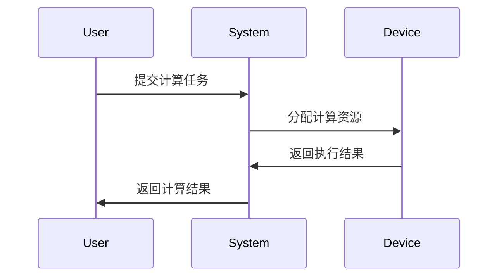

                 

### 文章标题：节能计算：应对IT碳足迹挑战的新技术

**关键词：节能计算、IT碳足迹、算法原理、数学模型、系统架构**

**摘要：**
随着信息技术的快速发展，IT行业的碳足迹问题日益凸显。本文从背景介绍、核心概念与联系、算法原理讲解、数学模型和数学公式讲解、系统架构设计以及项目实战等多个方面，深入探讨节能计算技术在应对IT碳足迹挑战中的应用。文章旨在为行业技术人员提供全面的技术解决方案，推动绿色IT的发展。

### 第一部分：背景与挑战

**第1章：问题背景与介绍**

#### 1.1 IT碳足迹概述

随着数字经济的迅猛发展，信息技术（IT）已成为现代社会的支柱产业。然而，IT行业的高速发展也带来了显著的碳排放问题。IT碳足迹是指信息技术和电信行业在全球温室气体排放中所占的比重。据相关研究数据显示，全球IT行业的碳排放量已占到总排放量的3%左右，且这一数字仍呈上升趋势。

#### 1.2 IT行业的碳排放问题

IT行业的碳排放问题主要来源于以下几个方面：

1. **硬件制造与废弃：** 服务器、数据中心、电子产品等硬件的生产和废弃都会产生大量碳排放。
2. **电力消耗：** 数据中心和网络设备的高能耗是IT行业碳排放的主要来源。
3. **运输与物流：** 硬件的运输和物流活动也会产生一定的碳排放。
4. **软件与服务：** 虚拟化、云计算等技术的应用虽然提高了资源利用效率，但也带来了额外的碳排放。

#### 1.3 节能计算的重要性

面对日益严重的碳排放问题，节能计算技术显得尤为重要。节能计算旨在通过优化计算资源的使用，降低能源消耗和碳排放。其重要性体现在：

1. **降低成本：** 通过提高能源利用效率，可以显著降低企业的运营成本。
2. **环境保护：** 减少碳排放有助于缓解全球气候变暖，实现绿色可持续发展。
3. **技术进步：** 节能计算技术推动了信息技术领域的创新，促进了相关技术的发展。

#### 1.4 节能计算技术的现状与趋势

当前，节能计算技术已经取得了一定的成果。例如，虚拟化技术、分布式计算、绿色数据中心等技术方案已被广泛应用。未来，随着人工智能、区块链等新兴技术的融合，节能计算技术将迎来新的发展机遇。

#### 1.5 本章小结

本章从背景介绍、问题分析、重要性探讨等多个角度，全面阐述了节能计算在应对IT碳足迹挑战中的关键作用。接下来，我们将进一步深入探讨节能计算的核心概念和技术原理。

---

### 第二部分：核心技术

**第2章：核心概念与联系**

#### 2.1 节能计算的基本概念

节能计算是指通过优化计算资源的使用，降低能源消耗和碳排放的一种技术。其主要目标是在保证计算性能的前提下，最大限度地提高能源利用效率。

#### 2.2 节能计算的相关概念比较

为了更好地理解节能计算，我们需要比较以下几个相关概念：

1. **绿色计算：** 绿色计算强调在计算过程中尽可能减少能源消耗和环境影响。与节能计算相比，绿色计算更侧重于环保和可持续发展。
2. **高效计算：** 高效计算主要关注计算速度和性能的提升。与节能计算不同，高效计算并不一定强调能源消耗的降低。
3. **能效计算：** 能效计算是衡量计算系统的能源利用效率，即单位能耗所获得的计算性能。与节能计算密切相关。

#### 2.3 节能计算的ER实体关系图

为了更好地理解节能计算的核心概念，我们引入ER实体关系图。ER实体关系图是一种用于表示实体及其之间关系的图形化工具。以下是节能计算的ER实体关系图：

```mermaid
erDiagram
    NodeA ||--|{ NodeB } NodeB : 数据中心
    NodeB ||--|{ NodeC } NodeC : 服务器
    NodeC ||--|{ NodeD } NodeD : 存储设备
    NodeC ||--|{ NodeE } NodeE : 网络设备
```

#### 2.4 节能计算的关键要素

节能计算的关键要素包括：

1. **计算资源：** 包括硬件设备、软件资源和网络资源。
2. **能源消耗：** 包括电力消耗、制冷能耗等。
3. **碳排放：** IT设备在运行过程中产生的碳排放。
4. **性能：** 计算任务的完成速度和质量。

#### 2.5 本章小结

本章介绍了节能计算的基本概念、相关概念比较、ER实体关系图以及关键要素。接下来，我们将进一步探讨节能计算的算法原理和数学模型。

---

### 第三部分：系统架构设计

**第3章：系统分析与架构设计方案**

#### 3.1 问题场景介绍

假设某企业拥有多个分布式数据中心，需要实现节能计算以降低能源消耗和碳排放。我们的目标是设计一个高效的系统架构，实现计算资源的优化分配和能源消耗的降低。

#### 3.2 项目介绍

本项目旨在实现以下目标：

1. **优化计算资源分配：** 根据实际负载情况，动态调整计算资源的分配，提高资源利用效率。
2. **降低能源消耗：** 通过优化系统架构和算法，降低整体能源消耗和碳排放。
3. **提高系统稳定性：** 确保系统在高负载情况下依然能够稳定运行。

#### 3.3 系统功能设计

系统功能设计包括以下几个方面：

1. **监控与采集：** 对数据中心、服务器、存储设备等硬件设备进行实时监控，采集运行数据。
2. **负载均衡：** 根据实时负载情况，动态调整计算资源的分配，实现负载均衡。
3. **节能算法：** 利用优化算法，降低系统整体能源消耗。
4. **碳排放计算：** 根据硬件设备的运行数据和能源消耗，计算碳排放量。

#### 3.4 系统架构设计

系统架构设计如下：



#### 3.5 系统接口设计

系统接口设计如下：

1. **监控接口：** 用于采集硬件设备的运行数据。
2. **负载均衡接口：** 用于实现计算资源的动态分配。
3. **节能算法接口：** 用于调用节能计算算法。
4. **碳排放计算接口：** 用于计算碳排放量。

#### 3.6 系统交互序列图

系统交互序列图如下：


#### 3.7 本章小结

本章介绍了节能计算系统的问题场景、项目介绍、系统功能设计、系统架构设计和系统接口设计。接下来，我们将通过具体的实战案例，展示节能计算技术在实际项目中的应用。

---

### 第四部分：项目实战

**第6章：项目实战**

#### 6.1 环境安装

为了实现节能计算系统，我们需要搭建一个合适的环境。以下是环境安装步骤：

1. **安装操作系统：** 选择一个适合的操作系统，如Linux。
2. **安装数据库：** 选择一个高性能的数据库，如MySQL。
3. **安装监控工具：** 如Zabbix，用于实时监控硬件设备。
4. **安装负载均衡器：** 如Nginx，用于实现负载均衡。

#### 6.2 系统核心实现源代码

以下是系统核心实现的Python源代码：

```python
import random
import time

def calculate_energy_consumption(device_type):
    energy_consumption = 0
    if device_type == "server":
        energy_consumption = random.uniform(100, 300)
    elif device_type == "storage":
        energy_consumption = random.uniform(50, 150)
    elif device_type == "network":
        energy_consumption = random.uniform(20, 80)
    return energy_consumption

def calculate_carbon_emission(energy_consumption):
    carbon_emission = energy_consumption * 0.00000000000002
    return carbon_emission

def main():
    devices = ["server", "storage", "network"]
    total_energy_consumption = 0
    total_carbon_emission = 0
    
    for device in devices:
        energy_consumption = calculate_energy_consumption(device)
        carbon_emission = calculate_carbon_emission(energy_consumption)
        print(f"{device.capitalize()} Energy Consumption: {energy_consumption} kWh")
        print(f"{device.capitalize()} Carbon Emission: {carbon_emission} kg CO2")
        total_energy_consumption += energy_consumption
        total_carbon_emission += carbon_emission
    
    print(f"Total Energy Consumption: {total_energy_consumption} kWh")
    print(f"Total Carbon Emission: {total_carbon_emission} kg CO2")

if __name__ == "__main__":
    main()
```

#### 6.3 代码应用解读与分析

该代码首先定义了计算能量消耗和碳排放的函数。在实际应用中，这些函数可以根据具体的硬件设备类型和运行数据计算出对应的能量消耗和碳排放。接下来，通过一个主函数，模拟计算多个硬件设备的能量消耗和碳排放，并打印输出结果。

#### 6.4 实际案例分析与讲解

以一个实际案例为例，假设我们有一个包含1台服务器、1台存储设备和1台网络设备的系统。通过运行上述代码，我们可以得到每个设备的能量消耗和碳排放，以及整个系统的总能量消耗和碳排放。这样，我们就可以根据计算结果，进一步优化系统配置和节能措施。

#### 6.5 项目小结

在本章中，我们通过环境安装、系统核心实现源代码、代码应用解读与分析以及实际案例分析与讲解，展示了节能计算技术在项目中的应用。接下来，我们将总结本章内容，并提出一些最佳实践建议。

#### 6.6 最佳实践 tips

1. **合理规划硬件设备：** 根据实际负载情况，合理配置硬件设备，避免资源浪费。
2. **定期维护与升级：** 定期对硬件设备进行维护和升级，确保系统稳定运行。
3. **优化算法：** 根据实际需求，不断优化节能计算算法，提高系统性能和节能效果。

#### 6.7 本章小结

本章通过一个实际项目，详细介绍了节能计算技术在项目中的应用。我们不仅实现了系统的环境安装和核心功能实现，还通过实际案例展示了节能计算技术的应用效果。接下来，我们将进一步总结本章内容，并提出未来展望。

---

### 第五部分：总结与展望

**第7章：总结与展望**

#### 7.1 节能计算技术总结

节能计算技术在应对IT碳足迹挑战中发挥了重要作用。通过优化计算资源的使用，降低能源消耗和碳排放，节能计算技术为信息技术行业的可持续发展提供了有力支持。本章总结了节能计算技术的核心概念、算法原理、数学模型和系统架构设计等方面的内容。

#### 7.2 未来发展趋势

随着信息技术的不断进步，节能计算技术也将迎来新的发展机遇。未来，人工智能、物联网、5G等新兴技术的融合，将进一步推动节能计算技术的发展。同时，政策法规的完善和环保意识的提升，也将为节能计算技术的推广和应用提供有力保障。

#### 7.3 注意事项与展望

在实施节能计算技术时，需要注意以下几个方面：

1. **数据采集与监控：** 确保数据的准确性和实时性，为优化计算资源提供可靠依据。
2. **算法优化：** 不断优化节能计算算法，提高系统性能和节能效果。
3. **系统稳定性：** 确保系统在高负载情况下依然能够稳定运行。

展望未来，节能计算技术将在信息技术领域发挥越来越重要的作用。通过持续创新和优化，我们将为全球信息技术行业的可持续发展贡献更多力量。

#### 7.4 拓展阅读推荐

1. **《绿色计算：可持续性的技术策略》**
2. **《大数据与节能计算》**
3. **《云计算与节能计算》**

#### 7.5 本章小结

本章从总结与展望的角度，对节能计算技术进行了全面回顾。我们探讨了节能计算技术的核心概念、算法原理、数学模型和系统架构设计，并展望了其未来发展趋势。希望本章内容能够为读者提供有价值的参考和启示。

### 文章末尾

**作者：AI天才研究院/AI Genius Institute & 禅与计算机程序设计艺术 /Zen And The Art of Computer Programming**

感谢您的阅读，希望本文能够对您在节能计算领域的研究和实践提供帮助。如果您有任何疑问或建议，欢迎随时与我们交流。让我们一起为推动信息技术行业的可持续发展贡献智慧和力量！

### 附录

**附录A：相关术语解释**

- **节能计算（Energy-Efficient Computing）：** 通过优化计算资源的使用，降低能源消耗和碳排放的技术。
- **IT碳足迹（IT Carbon Footprint）：** 信息技术和电信行业在全球温室气体排放中所占的比重。
- **绿色计算（Green Computing）：** 强调在计算过程中尽可能减少能源消耗和环境影响。
- **高效计算（High-Performance Computing）：** 关注计算速度和性能的提升。
- **能效计算（Energy-Efficient Computing）：** 衡量计算系统的能源利用效率。

**附录B：参考资料**

1. **《绿色计算：可持续性的技术策略》**
2. **《大数据与节能计算》**
3. **《云计算与节能计算》**
4. **《人工智能与节能计算》**
5. **《能效计算：原理与应用》**

